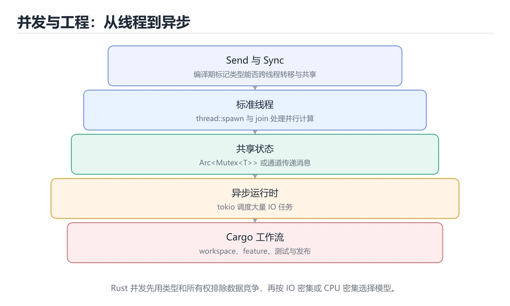
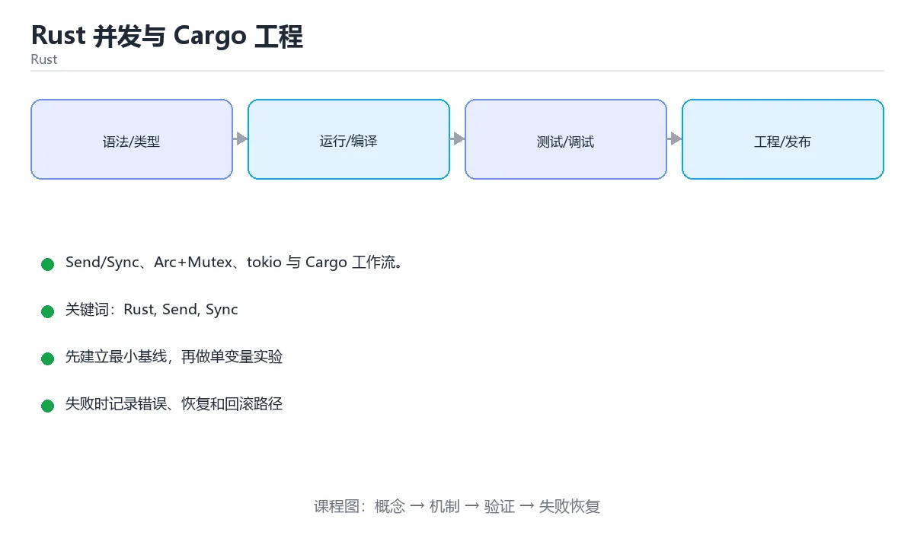

# Rust 并发与 Cargo 工程





> 内容更新时间：2026-10-03 · 学习阶段：进阶 · 预计用时：16 分钟

## 学习目标

- 能用自己的话解释「Rust 并发与 Cargo 工程」解决了什么问题，而不是只背术语。
- 能说清 「Rust」、「Send」、「Sync」、「Cargo」 之间的关系，并分别举出一个例子。
- 能把本课知识放回「Rust」的知识体系，说明它和相邻主题的边界。
- 能完成本课练习，并用验收标准检查自己的结果。

> 一句话摘要：Send/Sync、Arc+Mutex、tokio 与 Cargo 工作流。

## 前置知识

- 先完成上一课《Rust 类型系统：Option、Result 与 trait》；如果已经掌握，可以直接用本课练习自测。
- 本课阶段：进阶。建议先掌握同一分类的基础课程，并能独立运行正文中的最小示例。
- 开始前先复习：Rust、Send、Sync。
- 如果某一步看不懂，先记录具体卡点，完成练习后再回头读一遍。


## 线程安全靠类型

Rust 用两个标记 trait 保证并发安全：`Send`（可在线程间转移所有权）、`Arc<Mutex<T>>` 是跨线程共享可变状态的经典组合。

| 工具 | 场景 |
| --- | --- |
| `thread::spawn` + `join` | 基础线程 |
| `std::sync::mpsc` | 线程间消息传递（多生产者单消费者） |
| `Mutex<T>` / `RwLock<T>` | 共享可变状态 |
| `Arc<T>` | 多线程共享所有权 |
| `atomic` 类型 | 无锁计数器与标志位 |
| `rayon`（生态） | 数据并行，把 `iter()` 换成 `par_iter()` |

编译期即可发现数据竞争：忘记加锁的共享可变状态**根本编译不过**。

## Cargo：依赖、构建与测试

| 命令 | 作用 |
| --- | --- |
| `cargo new` / `cargo init` | 创建项目 |
| `cargo build --release` | 优化构建 |
| `cargo test` | 单元测试 + 集成测试 + 文档测试 |
| `cargo fmt` / `cargo clippy` | 格式化 / 静态检查 |
| `cargo doc --open` | 生成文档 |
| `cargo bench` | 基准测试（nightly 或 criterion） |

`Cargo.toml` 声明依赖与 feature；`Cargo.lock` 锁定版本（可执行程序应提交，库一般不提交）。工作区（workspace）可管理多 crate 单仓库。

## 异步生态

`async/await` 由编译器生成状态机，需要运行时（最常用 tokio）。要点：异步函数返回 Future，必须被 await 或 spawn 才会执行；CPU 密集任务不要放在异步任务里阻塞运行时，应用 `spawn_blocking`。

## 本课小结
Rust 并发的价值是**把数据竞争变成编译错误**；工程上则以 Cargo 为中心完成依赖、测试、文档与发布，clippy 与 fmt 保证团队风格一致。


## 并发速查

| 目的 | 工具 |
| --- | --- |
| 启动线程 | `std::thread::spawn` |
| 等待线程 | `handle.join()` |
| 共享只读数据 | `Arc<T>` |
| 共享可变数据 | `Arc<Mutex<T>>` / `Arc<RwLock<T>>` |
| 消息传递 | `std::sync::mpsc::channel` |
| 跨线程转移所有权 | 类型需实现 `Send` |
| 多线程共享引用 | 类型需实现 `Sync` |
| 异步任务 | `tokio::spawn` |
| 原子操作 | `AtomicUsize`、`AtomicBool` |

```rust
use std::sync::{Arc, Mutex};
use std::thread;

fn main() {
    let counter = Arc::new(Mutex::new(0));
    let mut handles = Vec::new();

    for _ in 0..4 {
        let counter = Arc::clone(&counter);
        handles.push(thread::spawn(move || {
            for _ in 0..1000 {
                let mut value = counter.lock().unwrap();
                *value += 1;
            }
        }));
    }

    for handle in handles {
        handle.join().unwrap();
    }
    println!("{}", *counter.lock().unwrap());   // 4000
}
```

注意：`Mutex` 存在**中毒（poisoning）** 机制，持锁线程 panic 后 `lock()` 会返回 `Err`，可用 `into_inner()` 或 `unwrap_or_else` 处理。

## Cargo 速查

| 文件 / 命令 | 说明 |
| --- | --- |
| `Cargo.toml` | 包元数据与依赖声明 |
| `Cargo.lock` | 精确锁定版本，**二进制项目应提交**，库项目一般不提交 |
| `[dependencies]` | 运行时依赖 |
| `[dev-dependencies]` | 测试与示例依赖 |
| `[features]` | 可选功能开关 |
| `cargo add serde --features derive` | 添加依赖 |
| `cargo tree -i crate_name` | 查看谁依赖了某个 crate |
| `cargo audit` | 依赖漏洞扫描 |
| `cargo deny` | 许可证与依赖策略检查 |
| `cargo bench` | 基准测试 |

## 常见错误对照表

| 编译错误或现象 | 含义 | 处理方式 |
| --- | --- | --- |
| `cannot be sent between threads safely` | 类型不是 `Send` | 用 `Arc<Mutex<T>>` 或改数据结构 |
| `cannot be shared between threads safely` | 类型不是 `Sync` | 同上，或改用消息传递 |
| `borrowed value does not live long enough` | 跨线程借用逃逸 | 用 `move` 闭包转移所有权 |
| 忘写 `move` | 闭包借用局部变量 | 线程闭包用 `move` |
| 死锁 | 两个锁交叉获取 | 统一加锁顺序，或用单锁保护多数据 |
| `Mutex` 中毒后 `unwrap()` panic | 前一个持锁者已 panic | 处理 `Err` 或 `into_inner()` 恢复 |
| 依赖版本冲突 | 编译错误或行为不一致 | `cargo tree` 定位并统一版本 |
| 提交了库项目的 `Cargo.lock` | 使用者被强绑版本 | 库不提交，二进制提交 |
| 未固定工具链 | 不同机器行为不同 | 提交 `rust-toolchain.toml` |
| 忘记开 `--release` 做基准 | 数据偏慢 | 性能测试必须 `--release` |

## 自测清单

- [ ] 跨线程闭包使用 `move` 转移所有权。
- [ ] 共享可变状态使用 `Arc<Mutex<T>>`，并注意中毒处理。
- [ ] 能解释 `Send` 与 `Sync` 的区别。
- [ ] 二进制项目提交 `Cargo.lock`，库项目一般不提交。
- [ ] CI 跑 `cargo fmt --check`、`clippy -D warnings`、`test`、`audit`。


## 零基础详解：并发安全与 Cargo 工作流

### 一句话说清它是什么

Rust 的并发靠两条防线：**编译期的所有权检查**（阻止数据竞争）和**标准库的同步原语**（Arc、Mutex、channel）。
Cargo 则把这套能力串成完整工作流：建项目、装依赖、测试、格式化、检查。

### 用生活比喻理解

| 概念 | 比喻 | 说明 |
| --- | --- | --- |
| `thread::spawn` | 新开一个办事窗口 | 每个线程独立栈 |
| `move` 闭包 | 把资料交给新窗口 | 所有权转移过去 |
| `Arc` | 共享钥匙 | 多线程共享同一份只读数据 |
| `Mutex` | 房间门锁 | 同一时刻只有一个人能进 |
| channel | 传送带 | 线程之间传消息 |

**口诀：多线程共享只读用 Arc，共享可写用 Arc 加 Mutex。**

### 一个完整示例：多线程计数

```rust
use std::sync::{Arc, Mutex};
use std::thread;

fn main() {
    let counter = Arc::new(Mutex::new(0));
    let mut handles = Vec::new();

    for _ in 0..10 {
        let counter = Arc::clone(&counter);      // 先克隆句柄再 move
        handles.push(thread::spawn(move || {
            let mut num = counter.lock().unwrap();   // 拿到锁才能改
            *num += 1;
        }));                                     // 锁在这里自动释放
    }

    for handle in handles {
        handle.join().unwrap();                  // 等所有线程结束
    }
    println!("结果 {}", *counter.lock().unwrap());
}
```

### 通道：更符合直觉的并发

```rust
use std::sync::mpsc;
use std::thread;

let (tx, rx) = mpsc::channel();

for id in 0..3 {
    let tx = tx.clone();
    thread::spawn(move || {
        tx.send(format!("任务 {id} 完成")).unwrap();
    });
}
drop(tx);                       // 关闭最后一个发送端，循环才能结束

for msg in rx {                 // 逐个接收
    println!("{msg}");
}
```

### Cargo 日常命令

```bash
cargo new demo             # 新建可执行项目
cargo new --lib mylib      # 新建库
cargo add serde --features derive   # 添加依赖
cargo run                  # 编译并运行
cargo test                 # 跑测试
cargo fmt                  # 统一格式
cargo clippy -- -D warnings # lint，并让警告变成错误
cargo build --release      # 发布构建
cargo doc --open           # 生成并打开文档
```

| 命令 | 什么时候用 |
| --- | --- |
| `cargo fmt` | 每次提交前 |
| `cargo clippy` | 每次提交前，能发现常见坏味道 |
| `cargo test` | 本地与 CI |
| `cargo tree` | 排查依赖来源与版本冲突 |
| `cargo audit` | 检查依赖的已知漏洞 |

### 测试放在哪里

```rust
pub fn add(a: i32, b: i32) -> i32 {
    a + b
}

#[cfg(test)]
mod tests {
    use super::*;

    #[test]
    fn adds_two_numbers() {
        assert_eq!(add(2, 3), 5);
    }

    #[test]
    #[should_panic(expected = "溢出")]
    fn panics_on_overflow() {
        panic!("溢出");
    }
}
```

### 新手最容易踩的八个坑

| 坑 | 报错关键词 | 正确做法 |
| --- | --- | --- |
| 闭包忘了 `move` | 生命周期不够长 | 加 `move` 转移所有权 |
| 直接共享 `Rc` | `Rc` 不能跨线程 | 改 `Arc` |
| 忘了 `Arc::clone` | 所有权被移走 | 循环内先克隆句柄 |
| 锁使用过久 | 性能差甚至死锁 | 缩小临界区，尽早释放 |
| 在同一线程重复加锁 | 死锁 | 拆分作用域或换数据结构 |
| 忘了 `drop(tx)` | 接收循环不结束 | 主动关闭发送端 |
| 忽略 `join` 结果 | 线程 panic 被吞掉 | 检查 `join` 返回值 |
| 手动拼依赖版本 | 冲突难查 | 用 `cargo add` 与 `cargo tree` |

### 手把手练习：并发求和并汇总结果

```rust
use std::sync::mpsc;
use std::thread;

fn parallel_sum(data: Vec<i32>, chunks: usize) -> i32 {
    let (tx, rx) = mpsc::channel();
    let size = data.len().div_ceil(chunks);

    for chunk in data.chunks(size).map(|c| c.to_vec()) {
        let tx = tx.clone();
        thread::spawn(move || {
            let sum: i32 = chunk.iter().sum();
            tx.send(sum).unwrap();
        });
    }
    drop(tx);

    rx.iter().sum()
}

fn main() {
    let data: Vec<i32> = (1..=100).collect();
    println!("总和 {}", parallel_sum(data, 4));
}
```

### 学完自测

- [ ] 能说出 `Arc` 与 `Mutex` 各自解决什么问题。
- [ ] 知道 `move` 闭包为什么在 `thread::spawn` 里几乎必需。
- [ ] 能解释为什么要在循环内 `Arc::clone`。
- [ ] 知道 `join` 的作用与失败时的表现。
- [ ] 能在提交前跑 `fmt`、`clippy`、`test` 三件套。

## 动手练习


> 本课练习重点：围绕「Rust、Send、Sync」完成复述、实验和交付，每个结果都要能被别人检查。

先让 cargo check 通过，再补所有权、错误和并发边界，最后运行 clippy。

### 练习 1：建立心智模型（10 分钟）

合上教程，用 3～5 句话回答：

1. 「Rust 并发与 Cargo 工程」解决了什么问题？
2. 如果没有它，会出现什么具体后果？
3. 它和「Send」是什么关系？

**验收标准**：至少出现一个本课关键词，并写出一个反例、边界条件或失效场景。

### 练习 2：做一次可控实验（20 分钟）

从正文中选一个最小示例，完成以下操作：

1. 先预测修改一个参数、输入或步骤后的结果。
2. 再实际执行或逐步推演，记录真实结果。
3. 如果结果与预测不同，写出差异原因。

**验收标准**：留下「原例 → 改动 → 预测 → 结果 → 原因」五步记录。

### 练习 3：交付一个小结果（30 分钟）

写一个最小 Cargo 示例，先用 `cargo check`，再补一个边界测试。

任务要求：

- 结果必须能被别人检查，不能只写“我已经理解了”。
- 至少覆盖「Rust」和「Send」两个关键词。
- 写出 1 个仍然不确定的问题，以及下一步如何验证。

> 提示：时间有限时优先做练习 1 和练习 2；练习 3 可以拆成两次完成。


## 考点精讲：把测验题还原成判断过程

本课有 6 个判断点。先自己作答，再看「判断依据」；如果结论正确但理由不完整，回到正文对应章节补足概念。

### 考点 1：标记类型可安全跨线程转移所有权的 trait 是？

- **正确判断**：Send
- **判断依据**：Send 表示可转移，Sync 表示可被多线程共享引用。其他选项：Send 表示所有权可跨线程转移，Sync 表示可被多线程共享引用。针对「标记类型可安全跨线程转移所有权的 trait 是，」，本课在「线程安全靠类型」中说明：Rust 用两个标记 trait 保证并发安全：Send（可在线程间转移所有权）、Arc<Mutex<T>> 是跨线程共享可变状态的经典组合。本课还在「零基础详解：并发安全与 Cargo 工作流」中说明：Rust 的并发靠两条防线：编译期的所有权检查（阻止数据竞争）和标准库的同步原语（Arc、Mutex、channel）。
- **迁移检查**：如果给某个错误选项去掉一个限定词，它会不会变成正确？说明理由。

### 考点 2：多线程共享可变状态的经典组合是？

- **正确判断**：Arc<Mutex<T>>
- **判断依据**：正确答案是「Arc<Mutex<T>>」，本课在「线程安全靠类型」中说明：Rust 用两个标记 trait 保证并发安全：Send（可在线程间转移所有权）、Arc<Mutex<T>> 是跨线程共享可变状态的经典组合。Arc 提供共享所有权，Mutex 保证互斥访问。本课还在「线程安全靠类型」中说明：编译期即可发现数据竞争：忘记加锁的共享可变状态根本编译不过。本课还在「零基础详解：并发安全与 Cargo 工作流」中说明：口诀：多线程共享只读用 Arc，共享可写用 Arc 加 Mutex。
- **迁移检查**：遮住选项，只根据定义复述一次答案，再回来看哪个选项与复述一致。

### 考点 3：关于 Cargo.lock，正确做法是？

- **正确判断**：可执行程序应提交
- **判断依据**：可执行程序需要可复现构建。其他选项：可执行程序应提交 Cargo.lock 以固定版本，库通常不提交，避免强制下游锁定版本。针对「关于 Cargo.lock，正确做法是，」，本课在「Cargo：依赖、构建与测试」中说明：Cargo.lock 锁定版本（可执行程序应提交，库一般不提交）。本课还在「异步生态」中说明：async/await 由编译器生成状态机，需要运行时（最常用 tokio）。本课还在「异步生态」中说明：要点：异步函数返回 Future，必须被 await 或 spawn 才会执行。
- **迁移检查**：把题干里的一个条件换成边界值，原来的结论还成立吗？写出判断过程。

### 考点 4：Send 与 Sync 两个 auto trait 的区别是？

- **正确判断**：Send 表示所有权可安全转移到别的线程
- **判断依据**：正确答案是「Send 表示所有权可安全转移到别的线程」，本课在「零基础详解：并发安全与 Cargo 工作流」中说明：Rust 的并发靠两条防线：编译期的所有权检查（阻止数据竞争）和标准库的同步原语（Arc、Mutex、channel）。Rc 既不是 Send 也不是 Sync，Arc 两者都满足，所以跨线程共享要用 Arc。本课还在「异步生态」中说明：async/await 由编译器生成状态机，需要运行时（最常用 tokio）。
- **迁移检查**：如果给某个错误选项去掉一个限定词，它会不会变成正确？说明理由。

### 考点 5：cargo build --release 相比默认开发构建的差别是？

- **正确判断**：开启优化并关闭调试断言
- **判断依据**：基准测试与性能分析必须用 --release，否则数据没有参考价值。其他选项：release 开启优化并关闭调试断言，运行更快、编译更慢。针对「cargo build --release 相比…」，本课在「本课小结」中说明：工程上则以 Cargo 为中心完成依赖、测试、文档与发布，clippy 与 fmt 保证团队风格一致。本课还在「本课小结」中说明：Rust 并发的价值是把数据竞争变成编译错误。
- **迁移检查**：把题干里的一个条件换成边界值，原来的结论还成立吗？写出判断过程。

### 考点 6：补全代码：「Rust 并发与 Cargo 工程」示例中，下面这行代码缺少哪个关键字或函数名？请填入 ____。 `let mut value = counter.lock().____();`

- **正确判断**：unwrap
- **判断依据**：正确答案是「unwrap」，本课在「并发速查」中说明：注意：Mutex 存在中毒（poisoning） 机制，持锁线程 panic 后 lock() 会返回 Err，可用 intoinner() 或 unwraporelse 处理。本课示例中还能看到 `tx.send(sum).unwrap();` 这样的用法，说明该关键字在本课代码中承担实际功能。
- **迁移检查**：把答案换成另一种等价写法，是否仍然正确？说明依据。

## 本课复习清单

离开本课前，逐项确认：

- [ ] 不看解析，能说出「标记类型可安全跨线程转移所有权的 trait 是？」的判断依据。
- [ ] 不看解析，能说出「多线程共享可变状态的经典组合是？」的判断依据。
- [ ] 不看解析，能说出「关于 Cargo.lock，正确做法是？」的判断依据。
- [ ] 不看解析，能说出「Send 与 Sync 两个 auto trait 的区别是？」的判断依据。
- [ ] 不看解析，能说出「cargo build --release 相比默认开发构建的差别是？」的判断依据。
- [ ] 不看解析，能说出「补全代码：「Rust 并发与 Cargo 工程」示例中，下面这行代码缺少哪个关键…」的判断依据。
- [ ] 至少运行一次本课示例，记录输入、输出和一个边界情况。
- [ ] 把本课最容易混淆的两个概念写成一句话对照。

| 复盘项 | 记录 |
| --- | --- |
| 已经能独立解释的考点 |  |
| 仍然说不清的概念 |  |
| 下一步验证动作 |  |

## 术语速查

把本课反复出现的术语集中放在一起。复习时先遮住右列，尝试用自己的话解释，再回到正文核对。

| 术语 | 本课语境 |
| --- | --- |
| `Send` | Rust 用两个标记 trait 保证并发安全：`Send`（可在线程间转移所有权）、`Arc<Mutex<T>>` 是跨线程共享可变状态的经典组合。 |
| `Arc<Mutex<T>>` | Rust 用两个标记 trait 保证并发安全：`Send`（可在线程间转移所有权）、`Arc<Mutex<T>>` 是跨线程共享可变状态的经典组合。 |
| `thread::spawn` | \| `thread::spawn` + `join` \| 基础线程 \| |
| `join` | \| `thread::spawn` + `join` \| 基础线程 \| |
| `std::sync::mpsc` | \| `std::sync::mpsc` \| 线程间消息传递（多生产者单消费者） \| |
| `Mutex<T>` | \| `Mutex<T>` / `RwLock<T>` \| 共享可变状态 \| |
| `RwLock<T>` | \| `Mutex<T>` / `RwLock<T>` \| 共享可变状态 \| |
| `Arc<T>` | \| `Arc<T>` \| 多线程共享所有权 \| |
| `atomic` | \| `atomic` 类型 \| 无锁计数器与标志位 \| |
| `rayon` | \| `rayon`（生态） \| 数据并行，把 `iter()` 换成 `par_iter()` \| |
| `iter()` | \| `rayon`（生态） \| 数据并行，把 `iter()` 换成 `par_iter()` \| |
| `par_iter()` | \| `rayon`（生态） \| 数据并行，把 `iter()` 换成 `par_iter()` \| |

## 面试问答与自测

下面把本课考点换成面试追问。先口述自己的答案，
再对照参考回答检查是否遗漏了前提、边界或失败路径。

### 追问 1：标记类型可安全跨线程转移所有权的 trait 是？

**参考回答**：Send 表示可转移，Sync 表示可被多线程共享引用。其他选项：Send 表示所有权可跨线程转移，Sync 表示可被多线程共享引用。针对「标记类型可安全跨线程转移所有权的 trait 是，」，本课在「线程安全靠类型」中说明：Rust 用两个标记 trait 保证并发安全：Send（可在线程间转移所有权）、Arc<Mutex<T>> 是跨线程共享可变状态的经典组合。本课还在「零基础详解·并发安全与 Cargo 工作流」中说明：Rust 的并发靠两条防线：编译期的所有权检查（阻止数据竞争）和标准库的同步原语（Arc、Mutex、channel）。

### 追问 2：多线程共享可变状态的经典组合是？

**参考回答**：正确答案是「Arc<Mutex<T>>」，本课在「线程安全靠类型」中说明：Rust 用两个标记 trait 保证并发安全：Send（可在线程间转移所有权）、Arc<Mutex<T>> 是跨线程共享可变状态的经典组合。Arc 提供共享所有权，Mutex 保证互斥访问。本课还在「线程安全靠类型」中说明：编译期即可发现数据竞争：忘记加锁的共享可变状态根本编译不过。本课还在「零基础详解·并发安全与 Cargo 工作流」中说明：口诀：多线程共享只读用 Arc，共享可写用 Arc 加 Mutex。

### 追问 3：关于 Cargo.lock，正确做法是？

**参考回答**：可执行程序需要可复现构建。其他选项：可执行程序应提交 Cargo.lock 以固定版本，库通常不提交，避免强制下游锁定版本。针对「关于 Cargo.lock，正确做法是，」，本课在「Cargo·依赖、构建与测试」中说明：Cargo.lock 锁定版本（可执行程序应提交，库一般不提交）。本课还在「异步生态」中说明：async/await 由编译器生成状态机，需要运行时（最常用 tokio）。本课还在「异步生态」中说明：要点：异步函数返回 Future，必须被 await 或 spawn 才会执行。

### 追问 4：Send 与 Sync 两个 auto trait 的区别是？

**参考回答**：正确答案是「Send 表示所有权可安全转移到别的线程」，本课在「零基础详解·并发安全与 Cargo 工作流」中说明：Rust 的并发靠两条防线：编译期的所有权检查（阻止数据竞争）和标准库的同步原语（Arc、Mutex、channel）。Rc 既不是 Send 也不是 Sync，Arc 两者都满足，所以跨线程共享要用 Arc。本课还在「异步生态」中说明：async/await 由编译器生成状态机，需要运行时（最常用 tokio）。

### 追问 5：cargo build --release 相比默认开发构建的差别是？

**参考回答**：基准测试与性能分析必须用 --release，否则数据没有参考价值。其他选项：release 开启优化并关闭调试断言，运行更快、编译更慢。针对「cargo build --release 相比…」，本课在「本课小结」中说明：工程上则以 Cargo 为中心完成依赖、测试、文档与发布，clippy 与 fmt 保证团队风格一致。本课还在「本课小结」中说明：Rust 并发的价值是把数据竞争变成编译错误。

## English Overview

**Title:** Rust Concurrency & Cargo

**Summary:** Send/Sync, Arc+Mutex, tokio and Cargo.

**Category:** Rust  
**Level:** 进阶  
**Key terms:** Rust, Send, Sync, Cargo, tokio

> The full tutorial is written in Chinese. This bilingual overview helps English readers identify the topic, scope and key terms before studying the detailed examples.

## 内容元数据

- 内容版本：v2.0
- 最后更新：2026-10-03
- 学习阶段：进阶
- 适用环境：Rust 1.85+ / Cargo
- 内容来源：内置结构化课程与工程实践整理
- 相关主题：Rust、Send、Sync、Cargo、tokio
- 质量版本：P0 测验标准 + P1 覆盖扩展 + P2 体验补全


## 参考资料与复核

- 最后复核：2026-10-04
- 下次复核：2027-04-04
- 复核范围：版本兼容、API 行为、安全建议与工程实践
- 来源性质：官方文档与标准；本课正文为离线教学重组，不复制原文

| 参考资料 | 本课用途 |
| --- | --- |
| [The Rust Book](https://doc.rust-lang.org/book/) | 所有权、类型与工程实践 |
| [Rust 标准库](https://doc.rust-lang.org/std/) | 标准库与并发 API |

> 本课主题：Send/Sync、Arc+Mutex、tokio 与 Cargo 工作流。

> App 完全离线展示文字链接，不会自动联网；需要延伸阅读时可复制链接到浏览器。
