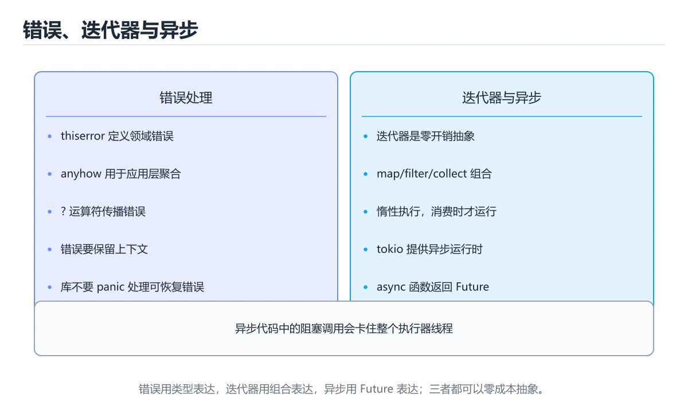
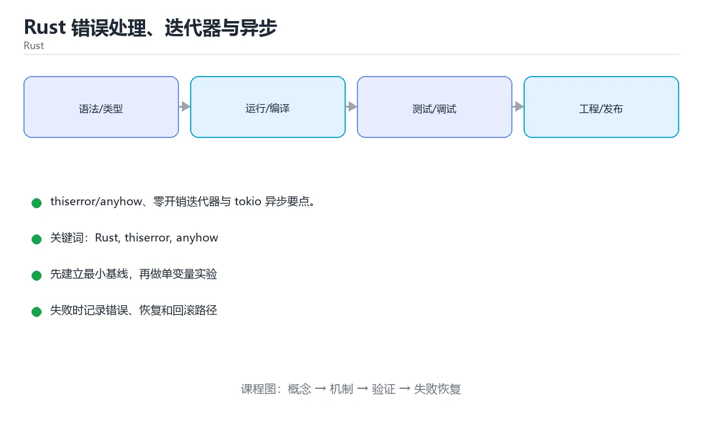

# Rust 错误处理、迭代器与异步

> 内容更新时间：2026-10-06 · 学习阶段：进阶 · 预计用时：55 分钟





## 本节知识框架

**课程定位**：所属分类 `rust`（Rust），课程主题 `Rust 错误处理、迭代器与异步`，学习阶段 进阶，建议用时 45 分钟。

本课主线：thiserror/anyhow、零开销迭代器与 tokio 异步要点。

**学完本课应当能够**
- 说清 `Rust` 与 `thiserror` 的含义与区别，并各举一个正例和一个反例。
- 用本课示例验证 `anyhow` 的行为，记录输入、输出与失败条件。
- 遇到「到处 `unwrap()`」这类问题时，能说出触发条件与修复顺序。

### 从概念到验证的学习链条

1. `Rust`：先掌握 collect 能把 Vec<Result<T, E>> 直接收成 Result<Vec<T>, E>，这是 Rust 里非常常用的技巧，再用它解释 `thiserror` 为什么会出现。
2. `thiserror`：先掌握 用派生宏为枚举生成 Error 实现，适合给库定义结构化的错误类型，再用它解释 `anyhow` 为什么会出现。
3. `anyhow`：先掌握 面向应用的错误库：用 anyhow::Result 加错误上下文快速传播错误，适合二进制程序而非库，再用它解释 `迭代器适配器` 为什么会出现。
4. `迭代器适配器`：先掌握 map、filter、collect 等惰性组合子，只在被消费时才真正执行，不产生中间集合，再用它解释 `迭代器` 为什么会出现。
5. `迭代器`：先掌握 iter()、into_iter() 配合 map、filter 完成声明式遍历，再用它解释 `tokio` 为什么会出现。
6. `tokio`：先掌握 Rust 的异步运行时，提供任务调度、异步 I/O、定时器和同步原语，再用它解释 本课示例的观察结果 为什么会出现。

**先修与衔接**：本课是「Rust」分类的第 10 课。先修内容：《Rust 并发与 Cargo 工程》。《Rust 并发与 Cargo 工程》里的 `Send`、`tokio` 是本课的前提。相关或后续课程：《Rust unsafe、FFI 与生态》。

### 完成判据

- **定义关**：不看正文也能说明 `Rust` 是 collect 能把 Vec<Result<T, E>> 直接收成 Result<Vec<T>, E>，这是 Rust 里非常常用的技巧，并指出一个反例。
- **机制关**：能按“输入 → 转换 → 输出 → 验证”复述 `Rust 错误处理、迭代器与异步`，而不是只背结论。
- **示例关**：能运行或推演 `Rust 错误处理、迭代器与异步` 的 `rust` 示例，并说明一个真实出现的标识符或字面量。
- **证据关**：能指出 `Rust 错误处理、迭代器与异步` 示例里的 调用了 `derive()`，并说明它支持或反驳了本课的哪一条结论。
- **排错关**：能复现 到处 `unwrap()`，记录现象并按 用 `?` 或 `unwrap_or` 修复。
- **迁移关**：能把 `Rust`、`thiserror`、`anyhow`、`迭代器` 放进一个与 `Rust 错误处理、迭代器与异步` 不同的项目场景，并保持输入与验证条件可追踪。
- **复盘关**：学完 `Rust 错误处理、迭代器与异步` 后，用一句话写下仍然不确定的结论，并列出下一次验证需要的输入、环境和成功判据。

### 复习清单

- [ ] 能不看正文复述本课核心术语，并指出一个边界或反例。
- [ ] 能运行或推演本课示例，记录输入、输出与失败现象。
- [ ] 能完成一次自测，并把错题对照错误表定位原因。

## 核心概念定义

| 术语 | 操作性定义 | 常见边界与风险 |
| --- | --- | --- |
| Rust | collect 能把 Vec<Result<T, E>> 直接收成 Result<Vec<T>, E>，这是 Rust 里非常常用的技巧。 | 只在「collect 能把 Vec<Result<T, E>> 直接收成 Result<Vec<T>, E>，这是 Rust 里非常常用的技巧」这一前提下成立，换输入或换环境要重新验证。 |
| thiserror | 用派生宏为枚举生成 Error 实现，适合给库定义结构化的错误类型。 | 静态检查只在编译期成立，运行期输入仍需校验。 |
| anyhow | 面向应用的错误库：用 anyhow::Result 加错误上下文快速传播错误，适合二进制程序而非库。 | 换编码、换字节序或换平台都可能改变结果，处理前先固定输入编码。 |
| 迭代器适配器 | map、filter、collect 等惰性组合子，只在被消费时才真正执行，不产生中间集合。 | 只在「map、filter、collect 等惰性组合子，只在被消费时才真正执行，不产生中间集合」这一前提下成立，换输入或换环境要重新验证。 |
| 迭代器 | iter()、into_iter() 配合 map、filter 完成声明式遍历 | 易错：什么也没发生；正确做法是加 `collect` 或 `for`。 |
| tokio | Rust 的异步运行时，提供任务调度、异步 I/O、定时器和同步原语 | 只在「Rust 的异步运行时，提供任务调度、异步 I/O、定时器和同步原语」这一前提下成立，换输入或换环境要重新验证。 |

## 原理与运行机制

### 机制总览

**教材衔接：错误处理分层**

| 场景 | 推荐 |
| --- | --- |
| 库代码 | 自定义错误类型（thiserror），让调用方可判定 |
| 应用代码 | anyhow::Result 简化传播，`?` 一路向上 |
| 可恢复错误 | Result；不可恢复才 panic |

关键是**保留错误上下文**（`.context("加载配置失败")?`），同时避免把内部实现细节泄露成公开 API。

**教材衔接：宏**

声明式宏 `macro_rules!` 做模式匹配式代码生成；过程宏（derive/attribute/function-like）由 proc-macro crate 实现，`#[derive(Debug)]` 就是过程宏。宏强大但会降低可读性，优先用函数与泛型，宏用于消除模板化重复。

**教材衔接：异步与 tokio**

`async fn` 返回 Future，需要运行时驱动（tokio 最常用）。要点：

1. Future 是惰性的，必须 await 或 spawn 才会推进。
2. 不要阻塞异步运行时：CPU 密集或同步 IO 用 `spawn_blocking`。
3. 并发用 `tokio::join!`、`try_join!`、`FuturesUnordered`；`select!` 做竞速与超时。
4. 取消是安全的（drop 掉 Future 即取消），但要注意资源清理与副作用。

**教材衔接：版本与时效**

- 版本提示：Rust 的行为在最近几个大版本里有过调整，升级「Rust 错误处理、迭代器与异步」前先用 ParseIntError 复现当前输出，再对照官方发布说明逐条核对。
- 异步运行时与借用检查规则的变化会影响 Rust，要在 CI 中提前暴露。
- 升级「Rust 错误处理、迭代器与异步」涉及的依赖前，先用 ParseIntError 复现当前行为，再逐项核对版本说明与破坏性变更。
- 官方发布说明：https://blog.rust-lang.org/

### 升级检查清单

- 先固定当前版本，跑通全部示例与测验，再升级工具链。
- 一次只改一个版本条件，把 Rust 相关的差异单独记成一条结论。
- 回归范围锁定 ParseIntError 的默认行为，并确认弃用警告是否出现在构建输出里。
- 升级完成后记录 Rust 的新旧版本差异，并据此调整下次复核时间。

### 机制拆解：每一步的输入、动作与输出

#### 1. `Rust`
- 输入：`Rust`；本步把 collect 能把 Vec<Result<T, E>> 直接收成 Result<Vec<T>, E>，这是 Rust 里非常常用的技巧 当作判断规则。
- 动作：围绕 `Rust` 保留中间状态，并记录它与 `thiserror` 的对应关系。
- 输出：`thiserror`，它可以被下一段代码、测试或记录继续使用。
- `Rust` 的失败条件：只在「collect 能把 Vec<Result<T, E>> 直接收成 Result<Vec<T>, E>，这是 Rust 里非常常用的技巧」这一前提下成立，换输入或换环境要重新验证。

#### 2. `thiserror`
- 输入：`Rust`；本步把 用派生宏为枚举生成 Error 实现，适合给库定义结构化的错误类型 当作判断规则。
- 动作：围绕 `thiserror` 保留中间状态，并记录它与 `anyhow` 的对应关系。
- 输出：`anyhow`，它可以被下一段代码、测试或记录继续使用。
- `thiserror` 的失败条件：静态检查只在编译期成立，运行期输入仍需校验。

#### 3. `anyhow`
- 输入：`thiserror`；本步把 面向应用的错误库：用 anyhow::Result 加错误上下文快速传播错误，适合二进制程序而非库 当作判断规则。
- 动作：围绕 `anyhow` 保留中间状态，并记录它与 `迭代器适配器` 的对应关系。
- 输出：`迭代器适配器`，它可以被下一段代码、测试或记录继续使用。
- `anyhow` 的失败条件：换编码、换字节序或换平台都可能改变结果，处理前先固定输入编码。

#### 4. `迭代器适配器`
- 输入：`anyhow`；本步把 map、filter、collect 等惰性组合子，只在被消费时才真正执行，不产生中间集合 当作判断规则。
- 动作：围绕 `迭代器适配器` 保留中间状态，并记录它与 `迭代器` 的对应关系。
- 输出：`迭代器`，它可以被下一段代码、测试或记录继续使用。
- `迭代器适配器` 的失败条件：只在「map、filter、collect 等惰性组合子，只在被消费时才真正执行，不产生中间集合」这一前提下成立，换输入或换环境要重新验证。

#### 5. `迭代器`
- 输入：`迭代器适配器`；本步把 iter()、into_iter() 配合 map、filter 完成声明式遍历 当作判断规则。
- 动作：围绕 `迭代器` 保留中间状态，并记录它与 `tokio` 的对应关系。
- 输出：`tokio`，它可以被下一段代码、测试或记录继续使用。
- `迭代器` 的失败条件：当迭代器没触发计算时，会出现什么也没发生。

#### 6. `tokio`
- 输入：`迭代器`；本步把 Rust 的异步运行时，提供任务调度、异步 I/O、定时器和同步原语 当作判断规则。
- 动作：围绕 `tokio` 保留中间状态，并记录它与 `derive` 的对应关系。
- 输出：`derive`，它可以被下一段代码、测试或记录继续使用。
- `tokio` 的失败条件：只在「Rust 的异步运行时，提供任务调度、异步 I/O、定时器和同步原语」这一前提下成立，换输入或换环境要重新验证。

### 示例中的可观察事实

1. 调用了 `derive()`；它对应的课程主题是 `Rust 错误处理、迭代器与异步`。
2. 调用了 `error()`；它对应的课程主题是 `Rust 错误处理、迭代器与异步`。
3. 调用了 `Missing()`；它对应的课程主题是 `Rust 错误处理、迭代器与异步`。
4. 调用了 `Parse()`；它对应的课程主题是 `Rust 错误处理、迭代器与异步`。
5. 调用了 `load()`；它对应的课程主题是 `Rust 错误处理、迭代器与异步`。
6. 调用了 `get()`；它对应的课程主题是 `Rust 错误处理、迭代器与异步`。
7. 调用了 `ok_or_else()`；它对应的课程主题是 `Rust 错误处理、迭代器与异步`。
8. 调用了 `to_string()`；它对应的课程主题是 `Rust 错误处理、迭代器与异步`。

### 复现实验记录

- 环境：`Rust 错误处理、迭代器与异步` 使用 `rust` 示例，固定 `Rust`、`thiserror`、`anyhow`、`迭代器` 作为第一组条件。
- 首轮输入：先确认 调用了 `derive()`，预测 `Rust` 会怎样变化。
- 基线观察：记录命令、输入、输出和错误原文，不用截图代替可复制的文本。
- 单变量修改：只改变 `Rust`，观察 `tokio` 是否仍满足定义。
- 失败注入：复现 到处 `unwrap()`，确认现象是 运行时 panic。
- 记录结论：把“修改前、修改后、预期变化、实际变化”写成四列表，这样复盘 `Rust 错误处理、迭代器与异步` 时才能区分概念错误与实现错误。

## 典型应用场景

**课程内置实验入口**：`sandbox:rust`，用于动手验证《Rust 错误处理、迭代器与异步》的机制；实验结论不替代概念定义与复杂度分析。

- **到处 `unwrap()`**：典型现象是运行时 panic；正确做法是用 `?` 或 `unwrap_or`。
- **忘了 `?` 的使用前提**：典型现象是问号运算符报错；正确做法是函数返回类型改成 Result。
- **迭代器没触发计算**：典型现象是什么也没发生；正确做法是加 `collect` 或 `for`。
- **混用 `iter` 与 `into_iter`**：典型现象是所有权被移动；正确做法是需要保留原集合就用 `iter`。

### 最小验证场景

- 准备：保留 `rust` 示例的原始输入，先记录 `Rust 错误处理、迭代器与异步` 的基线输出和完整运行命令。
- 观察：先核对 调用了 `derive()`，再改变一个与 `Rust` 相关的条件。
- 判定：新结果与 `Rust 错误处理、迭代器与异步` 的基线不同不等于错误；只有当差异破坏了 `Rust` 的定义或错误表中的约束，才判定为失败。

### 选择与边界

- 使用 `Rust` 时，先满足它的定义：collect 能把 Vec<Result<T, E>> 直接收成 Result<Vec<T>, E>，这是 Rust 里非常常用的技巧；只在「collect 能把 Vec<Result<T, E>> 直接收成 Result<Vec<T>, E>，这是 Rust 里非常常用的技巧」这一前提下成立，换输入或换环境要重新验证。
- 使用 `thiserror` 时，先满足它的定义：用派生宏为枚举生成 Error 实现，适合给库定义结构化的错误类型；静态检查只在编译期成立，运行期输入仍需校验。
- 使用 `anyhow` 时，先满足它的定义：面向应用的错误库：用 anyhow::Result 加错误上下文快速传播错误，适合二进制程序而非库；换编码、换字节序或换平台都可能改变结果，处理前先固定输入编码。
- 使用 `迭代器适配器` 时，先满足它的定义：map、filter、collect 等惰性组合子，只在被消费时才真正执行，不产生中间集合；只在「map、filter、collect 等惰性组合子，只在被消费时才真正执行，不产生中间集合」这一前提下成立，换输入或换环境要重新验证。
- 使用 `迭代器` 时，先满足它的定义：iter()、into_iter() 配合 map、filter 完成声明式遍历；易错：什么也没发生；正确做法是加 `collect` 或 `for`。

## 代码/协议/SQL 示例

### 最小可验证示例

```rust
use thiserror::Error;

#[derive(Debug, Error)]
enum StoreError {
    #[error("键 {0} 不存在")]
    Missing(String),

    #[error("解析失败")]
    Parse(#[from] std::num::ParseIntError),
}

// 使用 ? 自动把 ParseIntError 转成 StoreError
fn load(map: &std::collections::HashMap<String, String>, key: &str) -> Result<u32, StoreError> {
    let raw = map.get(key).ok_or_else(|| StoreError::Missing(key.to_string()))?;
    Ok(raw.parse::<u32>()?)
}
```

**教材衔接：错误处理策略速查**

| 场景 | 推荐做法 |
| --- | --- |
| 库对外 API | 自定义 `thiserror` 枚举错误，类型精确、可匹配 |
| 应用 / 二进制 | `anyhow::Result<T>`，快速传播并附加上下文 |
| 需要上下文 | `.context("读取配置失败")?`（anyhow） |
| 需要错误链 | `#[source]`（thiserror）/ `anyhow::Error` 的链式打印 |
| 一次性错误 | `Err(MyError::Empty)?` |
| 明确不可恢复 | `panic!` / `expect`，仅用于程序缺陷 |

**教材衔接：迭代器速查**

| 适配器 | 作用 | 是否惰性 |
| --- | --- | --- |
| `map` | 转换每个元素 | 是 |
| `filter` | 过滤 | 是 |
| `filter_map` | 过滤并转换（返回 `Option`） | 是 |
| `flat_map` | 展平 | 是 |
| `take` / `skip` | 取前 n / 跳过 n | 是 |
| `chain` | 串联两个迭代器 | 是 |
| `zip` | 成对组合 | 是 |
| `enumerate` | 带下标 | 是 |
| `peekable` | 可预看下一个 | 是 |
| `collect` | 收集成集合 | 否（消费） |
| `fold` / `reduce` | 归约 | 否 |
| `sum` / `product` | 求和 / 求积 | 否 |
| `any` / `all` | 条件判断（短路） | 否 |
| `find` / `position` | 查找 | 否 |
| `min` / `max` / `min_by_key` | 最值 | 否 |
| `count` | 计数 | 否 |

```rust
// 迭代器链：过滤、映射、求和一次完成，无额外中间集合
let total: u32 = orders
    .iter()
    .filter(|o| o.paid)
    .map(|o| o.amount)
    .sum();

// 收集为 Result：遇到第一个 Err 就提前返回
let numbers: Result<Vec<i32>, _> = inputs
    .iter()
    .map(|s| s.parse::<i32>())
    .collect();
```

**教材衔接：零基础详解：错误处理与迭代器**

### 一句话说清它是什么

Rust 把错误分成两类：**可恢复的用 `Result`**，**不可恢复的用 `panic!`**。
迭代器则是「惰性流水线」：`map`、`filter` 只是搭好管道，真正计算发生在 `collect` 或 `for` 的时候。

### 用生活比喻理解

| 概念 | 比喻 | 说明 |
| --- | --- | --- |
| `Result<T, E>` | 快递单 | 要么签收成功，要么写明失败原因 |
| `panic!` | 拉闸 | 程序缺陷，直接终止 |
| `?` | 遇到问题就上交 | 自动把错误往上传递 |
| 迭代器 | 流水线 | 每个工位处理一道工序 |
| 惰性求值 | 订单确认后才开工 | 不调用 collect 就不计算 |

### 错误处理的四个层次

```rust
use std::num::ParseIntError;

// 1. 直接传播：最常用
fn parse_port(text: &str) -> Result<u16, ParseIntError> {
    text.trim().parse::<u16>()
}

// 2. 转换错误类型，让调用方只面对一种错误
fn parse_port_ctx(text: &str) -> Result<u16, String> {
    text.trim()
        .parse::<u16>()
        .map_err(|e| format!("端口不合法 {text}: {e}"))
}

// 3. 自定义错误类型，配合 thiserror 更省事
#[derive(Debug)]
enum ConfigError {
    Missing(String),
    Invalid { key: String, reason: String },
}

// 4. main 里允许返回 Result，出错会自动打印
fn main() -> Result<(), Box<dyn std::error::Error>> {
    let port = parse_port("8080")?;
    println!("端口 {port}");
    Ok(())
}
```

### `Option` 与 `Result` 的常用方法

| 方法 | 作用 | 例子 |
| --- | --- | --- |
| `unwrap_or` | 取不到就给默认值 | `x.unwrap_or(0)` |
| `unwrap_or_else` | 默认值需要计算 | `x.unwrap_or_else(默认函数)` |
| `map` | 有值就变换 | `opt.map(\|v\| v * 2)` |
| `and_then` | 继续返回 Option 的操作 | `opt.and_then(find_next)` |
| `ok_or` | Option 转 Result | `opt.ok_or("缺失")?` |
| `is_ok` / `is_err` | 判断成功或失败 | 日志分支 |

### 迭代器流水线

```rust
let nums = vec![1, 2, 3, 4, 5, 6];
let result: i32 = nums
    .iter()                        // 借用遍历，不消费 vec
    .filter(|&&n| n % 2 == 0)      // 只留偶数
    .map(|&n| n * n)               // 平方
    .sum();                        // 求和
println!("{result}");              // 4 + 16 + 36 = 56
```

| 方法 | 作用 | 是否惰性 |
| --- | --- | --- |
| `map` / `filter` / `take` | 变换与筛选 | 是 |
| `collect` | 收集成集合 | 否，触发计算 |
| `sum` / `count` / `max` | 聚合 | 否 |
| `find` / `position` | 查找 | 否 |
| `chain` / `zip` | 组合两个迭代器 | 是 |
| `fold` | 自定义聚合 | 否 |

### `iter`、`iter_mut`、`into_iter` 的区别

| 写法 | 拿到什么 | 原集合还能用吗 |
| --- | --- | --- |
| `.iter()` | `&T` 不可变引用 | 能 |
| `.iter_mut()` | `&mut T` 可变引用 | 借出期间不能 |
| `.into_iter()` | `T` 所有权 | 不能（被消费） |

### 新手最容易踩的八个坑

| 坑 | 报错关键词 | 正确做法 |
| --- | --- | --- |
| 到处 `unwrap()` | 运行时 panic | 用 `?` 或 `unwrap_or` |
| 忘了 `?` 的使用前提 | 问号运算符报错 | 函数返回类型改成 Result |
| 迭代器没触发计算 | 什么也没发生 | 加 `collect` 或 `for` |
| 混用 `iter` 与 `into_iter` | 所有权被移动 | 需要保留原集合就用 `iter` |
| `collect` 不写目标类型 | 类型无法推断 | 写 `let v: Vec<_> = ...` |
| 闭包里重复借用 | 借用冲突 | 缩短借用范围或用 `iter_mut` |
| 用索引遍历 | 容易越界且不优雅 | 用迭代器方法 |
| 忘处理 `Err` 分支 | 逻辑静默跳过 | 用 `match` 或 `if let` |

### 手把手练习：读取并解析一列数字

```rust
fn parse_all(input: &str) -> Result<Vec<i32>, String> {
    input
        .lines()
        .filter(|l| !l.trim().is_empty())
        .map(|l| {
            l.trim()
                .parse::<i32>()
                .map_err(|e| format!("无法解析 {l:?}: {e}"))
        })
        .collect()                     // 把 Vec<Result<..>> 收成 Result<Vec<..>>
}

fn main() {
    let text = "10\n20\nabc\n40";
    match parse_all(text) {
        Ok(nums) => {
            let sum: i32 = nums.iter().sum();
            let max = nums.iter().max().copied().unwrap_or(0);
            println!("{} 个数，和 {sum}，最大 {max}", nums.len());
        }
        Err(e) => println!("解析失败：{e}"),
    }
}
```

`collect` 能把 `Vec<Result<T, E>>` 直接收成 `Result<Vec<T>, E>`，这是 Rust 里非常常用的技巧。

### 学完自测

- [ ] 能说出什么时候用 `Result`、什么时候用 `panic!`。
- [ ] 知道 `?` 的使用前提。
- [ ] 能解释迭代器「惰性」是什么意思。
- [ ] 能说出 `iter`、`iter_mut`、`into_iter` 的区别。
- [ ] 会用 `collect` 把一批 `Result` 合成一个 `Result`。

**运行方式**：运行 `Rust 错误处理、迭代器与异步` 的示例时，用 `cargo run` 运行；编译期报错会直接指出所有权或类型问题。

### 示例精读：先找证据，再改一个条件

1. 调用了 `derive()`；它出现在 `Rust 错误处理、迭代器与异步` 的示例中，阅读时先确认它前后各发生了什么。
2. 调用了 `error()`；它出现在 `Rust 错误处理、迭代器与异步` 的示例中，阅读时先确认它前后各发生了什么。
3. 调用了 `Missing()`；它出现在 `Rust 错误处理、迭代器与异步` 的示例中，阅读时先确认它前后各发生了什么。
4. 调用了 `Parse()`；它出现在 `Rust 错误处理、迭代器与异步` 的示例中，阅读时先确认它前后各发生了什么。
5. 调用了 `load()`；它出现在 `Rust 错误处理、迭代器与异步` 的示例中，阅读时先确认它前后各发生了什么。
6. 调用了 `get()`；它出现在 `Rust 错误处理、迭代器与异步` 的示例中，阅读时先确认它前后各发生了什么。
7. 调用了 `ok_or_else()`；它出现在 `Rust 错误处理、迭代器与异步` 的示例中，阅读时先确认它前后各发生了什么。
8. 调用了 `to_string()`；它出现在 `Rust 错误处理、迭代器与异步` 的示例中，阅读时先确认它前后各发生了什么。
- 在 `Rust 错误处理、迭代器与异步` 中与 `Rust` 对照：示例必须能支持 collect 能把 Vec<Result<T, E>> 直接收成 Result<Vec<T>, E>，这是 Rust 里非常常用的技巧，否则说明这一段还缺少实现或验证步骤。
- 在 `Rust 错误处理、迭代器与异步` 中与 `thiserror` 对照：示例必须能支持 用派生宏为枚举生成 Error 实现，适合给库定义结构化的错误类型，否则说明这一段还缺少实现或验证步骤。
- 在 `Rust 错误处理、迭代器与异步` 中与 `anyhow` 对照：示例必须能支持 面向应用的错误库：用 anyhow::Result 加错误上下文快速传播错误，适合二进制程序而非库，否则说明这一段还缺少实现或验证步骤。
- 在 `Rust 错误处理、迭代器与异步` 中与 `迭代器适配器` 对照：示例必须能支持 map、filter、collect 等惰性组合子，只在被消费时才真正执行，不产生中间集合，否则说明这一段还缺少实现或验证步骤。

## 时间/空间复杂度或性能分析

**性能关注点（Rust 错误处理、迭代器与异步）**：零成本抽象不等于零开销：记录运行时间、内存峰值与编译时间。

**本课特有开销（Rust 错误处理、迭代器与异步 · Rust）**：并发度提高后要观察是否出现拐点：延迟上升而吞吐不增，说明瓶颈已转移。

**测量方法**：以 `Rust 错误处理、迭代器与异步` 的 `Rust` 场景为对象，固定输入跑一遍记录基线，再把规模或并发度提高一个数量级复测；两次结果的差值与波动范围才是结论依据。

### 需要控制的变量与记录项

- `Rust 错误处理、迭代器与异步` 的 `Rust`：固定它的版本、输入范围和资源上限，分别记录速度、内存与失败率的变化。
- `Rust 错误处理、迭代器与异步` 的 `thiserror`：固定它的版本、输入范围和资源上限，分别记录速度、内存与失败率的变化。
- `Rust 错误处理、迭代器与异步` 的 `anyhow`：固定它的版本、输入范围和资源上限，分别记录速度、内存与失败率的变化。
- `Rust 错误处理、迭代器与异步` 的 `迭代器`：固定它的版本、输入范围和资源上限，分别记录速度、内存与失败率的变化。
- `Rust 错误处理、迭代器与异步` 的 `tokio`：固定它的版本、输入范围和资源上限，分别记录速度、内存与失败率的变化。
- `Rust 错误处理、迭代器与异步` 中 `Rust` 的边界：只在「collect 能把 Vec<Result<T, E>> 直接收成 Result<Vec<T>, E>，这是 Rust 里非常常用的技巧」这一前提下成立，换输入或换环境要重新验证。达到边界时不要外推，必须重新测量。
- `Rust 错误处理、迭代器与异步` 中 `thiserror` 的边界：静态检查只在编译期成立，运行期输入仍需校验。达到边界时不要外推，必须重新测量。
- `Rust 错误处理、迭代器与异步` 中 `anyhow` 的边界：换编码、换字节序或换平台都可能改变结果，处理前先固定输入编码。达到边界时不要外推，必须重新测量。
- `Rust 错误处理、迭代器与异步` 中 `迭代器适配器` 的边界：只在「map、filter、collect 等惰性组合子，只在被消费时才真正执行，不产生中间集合」这一前提下成立，换输入或换环境要重新验证。达到边界时不要外推，必须重新测量。
- `Rust 错误处理、迭代器与异步` 中 `迭代器` 的边界：易错：什么也没发生；正确做法是加 `collect` 或 `for`。达到边界时不要外推，必须重新测量。
- `Rust 错误处理、迭代器与异步` 的代码证据：先验证 调用了 `derive()`，再记录该路径的输入规模与耗时；只看代码行数不能推出复杂度。

## 常见误区与易错点

| 容易写错的做法 | 实际现象 | 原因与正确做法 |
| --- | --- | --- |
| 到处 `unwrap()` | 运行时 panic | 用 `?` 或 `unwrap_or` |
| 忘了 `?` 的使用前提 | 问号运算符报错 | 函数返回类型改成 Result |
| 迭代器没触发计算 | 什么也没发生 | 加 `collect` 或 `for` |
| 混用 `iter` 与 `into_iter` | 所有权被移动 | 需要保留原集合就用 `iter` |
| `collect` 不写目标类型 | 类型无法推断 | 写 `let v: Vec<_> = ...` |
| 闭包里重复借用 | 借用冲突 | 缩短借用范围或用 `iter_mut` |
| 用索引遍历 | 容易越界且不优雅 | 用迭代器方法 |
| 忘处理 `Err` 分支 | 逻辑静默跳过 | 用 `match` 或 `if let` |
| 迭代器不调用消费方法 | 什么都不执行 | 加 `collect` / `for` / `sum` |
| 在热点路径反复 `collect` | 多余分配 | 保持迭代器链，最后再收集 |
| `unwrap()` 处理外部输入 | 运行时 panic | 用 `?` 或匹配处理 |
| 只用 `Box<dyn Error>` 丢类型 | 无法针对错误分支处理 | 库中用自定义枚举错误 |
| 错误信息缺少上下文 | 线上无法定位 | `context("读取 xx 文件")` |
| `?` 在 `main` 中直接使用 | 编译错误（返回类型不符） | `main` 返回 `Result<(), E>` 或显式处理 |
| `filter_map` 里吞掉错误 | 失败被静默忽略 | 需要错误时用 `map` 收集 `Result` |
| 索引遍历代替迭代器 | 可能越界、可读性差 | 用迭代器组合子 |
| 忘记 `iter()` 与 `into_iter()` 区别 | 所有权被移动或类型不符 | `&v` 借用迭代，`v` 消耗迭代 |
| 在循环里 `clone()` 大对象 | 性能下降 | 传引用或调整所有权 |
| unwrap() 处理外部输入 | 运行时 panic。 | 用 ? 或匹配处理。 |
| 只用 Box<dyn Error> 丢类型 | 无法针对错误分支处理。 | 库中用自定义枚举错误。 |

### 现场 1：到处 `unwrap()`

**症状**：运行时 panic。

**根因与修复**：用 `?` 或 `unwrap_or`。

**自检**：在本课示例里复现「到处 `unwrap()`」，改成用 `?` 或 `unwrap_or`后重跑；如果症状消失且失败路径按预期变化，说明定位正确。

### 现场 2：忘了 `?` 的使用前提

**症状**：问号运算符报错。

**根因与修复**：函数返回类型改成 Result。

**自检**：在本课示例里复现「忘了 `?` 的使用前提」，改成函数返回类型改成 Result后重跑；如果症状消失且失败路径按预期变化，说明定位正确。

### 现场 3：迭代器没触发计算

**症状**：什么也没发生。

**根因与修复**：加 `collect` 或 `for`。

**自检**：在本课示例里复现「迭代器没触发计算」，改成加 `collect` 或 `for`后重跑；如果症状消失且失败路径按预期变化，说明定位正确。

### 现场 4：混用 `iter` 与 `into_iter`

**症状**：所有权被移动。

**根因与修复**：需要保留原集合就用 `iter`。

**自检**：在本课示例里复现「混用 `iter` 与 `into_iter`」，改成需要保留原集合就用 `iter`后重跑；如果症状消失且失败路径按预期变化，说明定位正确。

### 现场 5：`collect` 不写目标类型

**症状**：类型无法推断。

**根因与修复**：写 `let v: Vec<_> = ...`。

**自检**：在本课示例里复现「`collect` 不写目标类型」，改成写 `let v: Vec<_> = ...`后重跑；如果症状消失且失败路径按预期变化，说明定位正确。

### 现场 6：闭包里重复借用

**症状**：借用冲突。

**根因与修复**：缩短借用范围或用 `iter_mut`。

**自检**：在本课示例里复现「闭包里重复借用」，改成缩短借用范围或用 `iter_mut`后重跑；如果症状消失且失败路径按预期变化，说明定位正确。

### 现场 7：用索引遍历

**症状**：容易越界且不优雅。

**根因与修复**：用迭代器方法。

**自检**：在本课示例里复现「用索引遍历」，改成用迭代器方法后重跑；如果症状消失且失败路径按预期变化，说明定位正确。

### 现场 8：忘处理 `Err` 分支

**症状**：逻辑静默跳过。

**根因与修复**：用 `match` 或 `if let`。

**自检**：在本课示例里复现「忘处理 `Err` 分支」，改成用 `match` 或 `if let`后重跑；如果症状消失且失败路径按预期变化，说明定位正确。

### 现场 9：迭代器不调用消费方法

**症状**：什么都不执行。

**根因与修复**：加 `collect` / `for` / `sum`。

**自检**：在本课示例里复现「迭代器不调用消费方法」，改成加 `collect` / `for` / `sum`后重跑；如果症状消失且失败路径按预期变化，说明定位正确。

## 与其他知识点的关系

- **先修**：`Rust 并发与 Cargo 工程`。本课默认这些内容已经掌握。
- **相关或后续**：`Rust unsafe、FFI 与生态`。本课术语会在这些课程里继续使用。
- **术语归属**：`Rust`、`thiserror`、`anyhow` 的定义以本课「核心概念定义」为准，换到其他课程时先确认定义是否被改写。
- 同一分类的《Rust Cargo 第一个程序》也涉及 `Rust`；两课衔接时先确认这个术语的定义是否一致。
- 同一分类的《Rust 变量与可变性》也涉及 `Rust`；两课衔接时先确认这个术语的定义是否一致。

### 先修与后续术语接口

- `Rust 并发与 Cargo 工程`：共享术语 `tokio`，共同关键词 `Rust`、`tokio`。
- `Rust unsafe、FFI 与生态`：共享术语 `Rust`、`tokio`，共同关键词 `Rust`、`tokio`。

### 容易混淆的相邻概念

- `Rust` 与 `thiserror`：前者强调 collect 能把 Vec<Result<T, E>> 直接收成 Result<Vec<T>, E>，这是 Rust 里非常常用的技巧；后者强调 用派生宏为枚举生成 Error 实现，适合给库定义结构化的错误类型。判断时分别检查两条定义的适用范围，不要只看名称相似就互换。
- `thiserror` 与 `anyhow`：前者强调 用派生宏为枚举生成 Error 实现，适合给库定义结构化的错误类型；后者强调 面向应用的错误库：用 anyhow::Result 加错误上下文快速传播错误，适合二进制程序而非库。判断时分别检查两条定义的适用范围，不要只看名称相似就互换。
- `anyhow` 与 `迭代器适配器`：前者强调 面向应用的错误库：用 anyhow::Result 加错误上下文快速传播错误，适合二进制程序而非库；后者强调 map、filter、collect 等惰性组合子，只在被消费时才真正执行，不产生中间集合。判断时分别检查两条定义的适用范围，不要只看名称相似就互换。
- `迭代器适配器` 与 `迭代器`：前者强调 map、filter、collect 等惰性组合子，只在被消费时才真正执行，不产生中间集合；后者强调 iter()、into_iter() 配合 map、filter 完成声明式遍历。判断时分别检查两条定义的适用范围，不要只看名称相似就互换。
- `迭代器` 与 `tokio`：前者强调 iter()、into_iter() 配合 map、filter 完成声明式遍历；后者强调 Rust 的异步运行时，提供任务调度、异步 I/O、定时器和同步原语。判断时分别检查两条定义的适用范围，不要只看名称相似就互换。

## 自测题与参考答案

> 先独立作答，再对照参考答案；答案都能在本课正文、术语表或错误表里找到依据。

### 自测 1（概念复述）

不看正文，写出 `Rust` 的操作性定义，并说明它与 `thiserror` 的区别。

**参考答案**：collect 能把 Vec<Result<T, E>> 直接收成 Result<Vec<T>, E>，这是 Rust 里非常常用的技巧。

`thiserror` 的定位是：用派生宏为枚举生成 Error 实现，适合给库定义结构化的错误类型；两者的差别要从适用对象与失败模式上说明。

### 自测 2（排错）

本课错误表记录了「到处 `unwrap()`」这类做法。请写出它会出现的现象、根因，以及修复顺序。

**参考答案**：现象是运行时 panic；正确做法是用 `?` 或 `unwrap_or`。修复时先复现现象并保留证据，再改动一处假设重跑，确认现象消失。

### 自测 3（动手验证）

运行本课的 `rust` 示例，把其中的 `"键 {0} 不存在"` 换成一个边界值后重新运行，记录输出与错误信息。

**参考答案**：正常输入下 `rust` 示例应当复现正文给出的结果；把 `"键 {0} 不存在"` 换成边界值后，如果结果改变或报错，先核对它是否满足 `Rust 错误处理、迭代器与异步` 中`Rust` 的适用范围，再检查错误表里是否有同类现象。

### 自测 4（代码阅读）

阅读本课开头的 `rust` 示例，说明它体现了`Rust` 的哪一条性质，并指出改动哪个输入会让这条性质不再成立。

**参考答案**：`Rust` 的定义是 collect 能把 Vec<Result<T, E>> 直接收成 Result<Vec<T>, E>，这是 Rust 里非常常用的技巧，示例正是在实现这条定义。改动与 `Rust` 有关的一个输入后，如果结果不再符合 `Rust 错误处理、迭代器与异步` 的正文描述，就说明该性质只在当前前提成立。

### 自测 5（迁移）

把 `Rust 错误处理、迭代器与异步` 的方法迁移到自己的项目：围绕 `Rust` 写出一个与错误表同类的风险点，并说明触发条件和检验方式。

**参考答案**：例如「只用 Box<dyn Error> 丢类型」，它会导致无法针对错误分支处理；检验方式是按库中用自定义枚举错误改一处再复现，确认现象消失且没有引入新的失败分支。

### 自测 6（对比）

用一个表格对比 `Rust` 与 `thiserror`：各写一行适用场景、一行失败表现。

**参考答案**：`Rust` 的定义是collect 能把 Vec<Result<T, E>> 直接收成 Result<Vec<T>, E>，这是 Rust 里非常常用的技巧；`thiserror` 的定义是用派生宏为枚举生成 Error 实现，适合给库定义结构化的错误类型。两者的失败表现分别对应本课错误表里与本术语相关的行。

### 自测 7（排错顺序）

面对「到处 `unwrap()`」引发的问题，请把“复现 运行时 panic → 保留证据 → 用 `?` 或 `unwrap_or` → 回归验证”四步写成可执行的检查清单。

**参考答案**：第一步按运行时 panic复现；第二步记录输入、版本与完整报错；第三步按用 `?` 或 `unwrap_or`只改一处；第四步重跑并确认失败路径也按预期变化。

### 自测 8（边界判断）

针对 `tokio`，分别写出“可以使用”的条件和“结论不再成立”的条件。

**参考答案**：只在「Rust 的异步运行时，提供任务调度、异步 I/O、定时器和同步原语」这一前提下成立，换输入或换环境要重新验证。 同时要把 `tokio` 的定义 Rust 的异步运行时，提供任务调度、异步 I/O、定时器和同步原语 与实际输入逐项对照。

### 自测 9（机制重建）

不看正文，按输入、转换、输出、验证四段重建 `Rust` → `thiserror` → `anyhow` → `迭代器适配器` 的作用链。

**参考答案**：起点是 `Rust` 的定义 collect 能把 Vec<Result<T, E>> 直接收成 Result<Vec<T>, E>，这是 Rust 里非常常用的技巧；中间每一步都保留可观察状态；终点由 `tokio` 检查，失败时回到错误表定位第一个偏离定义的步骤。

### 自测 10（综合排错）

在 `Rust 错误处理、迭代器与异步` 中，现象是 无法针对错误分支处理。请围绕 只用 Box<dyn Error> 丢类型 写出最小复现、关键证据、修复动作和回归验证，并说明为什么不能只凭一次运行下结论。

**参考答案**：先复现 只用 Box<dyn Error> 丢类型，记录输入与完整错误；再按 库中用自定义枚举错误 只改一处。回归时同时跑正常路径和边界路径，只有两次结果都可解释，才把修复视为完成。

### 自测 11（一分钟复述）

用每分钟约 200 字的速度复述 `Rust 错误处理、迭代器与异步`：先给主问题，再按顺序说出 `Rust`、`thiserror`、`anyhow`、`迭代器适配器`，最后给一个失败案例。

**自评标准**：主问题必须对应 thiserror/anyhow、零开销迭代器与 tokio 异步要点；每个术语都要能接上一句定义或边界；失败案例必须写成可观察现象，不能用“可能有风险”代替证据。

## 术语速查

| 术语 | 一句话说明 |
| --- | --- |
| `Rust` | collect 能把 Vec<Result<T, E>> 直接收成 Result<Vec<T>, E>，这是 Rust 里非常常用的技巧。 |
| `thiserror` | 用派生宏为枚举生成 Error 实现，适合给库定义结构化的错误类型。 |
| `anyhow` | 面向应用的错误库：用 anyhow::Result 加错误上下文快速传播错误，适合二进制程序而非库。 |
| `迭代器适配器` | map、filter、collect 等惰性组合子，只在被消费时才真正执行，不产生中间集合。 |
| `迭代器` | iter()、into_iter() 配合 map、filter 完成声明式遍历。 |
| `tokio` | Rust 的异步运行时，提供任务调度、异步 I/O、定时器和同步原语。 |

**术语关系**：`Rust`（collect 能把 Vec<Result<T, E>> 直接收成 Result<Vec<T>, E>） → `thiserror`（用派生宏为枚举生成 Error 实现） → `anyhow`（面向应用的错误库：用 anyhow::Result 加错误上下文快速传播错误） → `迭代器适配器`（map、filter、collect 等惰性组合子）。

## 考点精讲

`Rust 错误处理、迭代器与异步` 的题库有 6 道题，下面逐题给出题干、正确项与判断依据：先自己作答，再核对正确项，最后回到正文对应小节复核。

### 考点 1：第 1 题

- **题目**：围绕“Rust 错误处理、迭代器与异步”中的 Rust、thiserror、anyhow，下列哪两项是本课强调的实践判断？
- **正确项**：验证 thiserror 时要固定版本并覆盖边界输入，结论才可复现；学习 Rust 时要同时说明输入、输出和失败路径，不能只看正常流程
- **判断依据**：这道题落在术语 `Rust` 上：collect 能把 Vec<Result<T, E>> 直接收成 Result<Vec<T>, E>，这是 Rust 里非常常用的技巧。复习时把 `Rust` 的定义、适用边界和一个反例一起说清楚，再回到「核心概念定义」核对原文。

### 考点 2：第 2 题

- **题目**：Rust 迭代器链会有运行时开销吗？
- **正确项**：基本没有，会被优化成普通循环
- **判断依据**：这道题落在术语 `Rust` 上：collect 能把 Vec<Result<T, E>> 直接收成 Result<Vec<T>, E>，这是 Rust 里非常常用的技巧。复习时把 `Rust` 的定义、适用边界和一个反例一起说清楚，再回到「核心概念定义」核对原文。

### 考点 3：第 3 题

- **题目**：下面这段 `rust` 代码来自 `Rust 错误处理、迭代器与异步`。课程主线是thiserror/anyhow、零开销迭代器与 tokio 异步要点。代码与 `Rust` 有关。哪一项是代码里真实出现的内容？
- **正确项**：调用了 `Parse()`
- **判断依据**：这道题落在术语 `Rust` 上：collect 能把 Vec<Result<T, E>> 直接收成 Result<Vec<T>, E>，这是 Rust 里非常常用的技巧。复习时把 `Rust` 的定义、适用边界和一个反例一起说清楚，再回到「核心概念定义」核对原文。

### 考点 4：第 4 题

- **题目**：Rust 迭代器是「惰性」的，这意味着？
- **正确项**：不调用消费方法（collect/sum/for）就不会真正执行
- **判断依据**：这道题落在术语 `Rust` 上：collect 能把 Vec<Result<T, E>> 直接收成 Result<Vec<T>, E>，这是 Rust 里非常常用的技巧。复习时把 `Rust` 的定义、适用边界和一个反例一起说清楚，再回到「核心概念定义」核对原文。

### 考点 5：第 5 题

- **题目**：collect::<Result<Vec<_>, _>> 的作用是？
- **正确项**：收集成 Result<Vec<_>, _>，遇 Err 短路
- **判断依据**：这道题检验本课主问题：thiserror/anyhow、零开销迭代器与 tokio 异步要点。复习时先复述本课主问题，再举一个会让结论失效的输入。

### 考点 6：第 6 题

- **题目**：填空：补齐下面这段术语说明中的空缺。课程 `thiserror/anyhow、零开销迭代器与 tokio 异步要点。`，这段说明是：`____`：Rust 的异步运行时，提供任务调度、异步 I/O、定时器和同步原语。空缺处应填哪个术语？
- **正确项**：tokio
- **判断依据**：这道题落在术语 `Rust` 上：collect 能把 Vec<Result<T, E>> 直接收成 Result<Vec<T>, E>，这是 Rust 里非常常用的技巧。复习时把 `Rust` 的定义、适用边界和一个反例一起说清楚，再回到「核心概念定义」核对原文。

### 考点 7：`Rust`

- **要点**：collect 能把 Vec<Result<T, E>> 直接收成 Result<Vec<T>, E>，这是 Rust 里非常常用的技巧。
- **Rust 的边界**：只在「collect 能把 Vec<Result<T, E>> 直接收成 Result<Vec<T>, E>，这是 Rust 里非常常用的技巧」这一前提下成立，换输入或换环境要重新验证。

### 考点 8：`thiserror`

- **要点**：用派生宏为枚举生成 Error 实现，适合给库定义结构化的错误类型。
- **thiserror 的边界**：静态检查只在编译期成立，运行期输入仍需校验。

### 考点 9：`anyhow`

- **要点**：面向应用的错误库：用 anyhow::Result 加错误上下文快速传播错误，适合二进制程序而非库。
- **anyhow 的边界**：换编码、换字节序或换平台都可能改变结果，处理前先固定输入编码。

### 考点 10：`迭代器适配器`

- **要点**：map、filter、collect 等惰性组合子，只在被消费时才真正执行，不产生中间集合。
- **迭代器适配器 的边界**：只在「map、filter、collect 等惰性组合子，只在被消费时才真正执行，不产生中间集合」这一前提下成立，换输入或换环境要重新验证。

### 考点 11：`迭代器`

- **要点**：iter()、into_iter() 配合 map、filter 完成声明式遍历
- **迭代器 的边界**：易错：什么也没发生；正确做法是加 `collect` 或 `for`。

### 考点 12：`tokio`

- **要点**：Rust 的异步运行时，提供任务调度、异步 I/O、定时器和同步原语
- **tokio 的边界**：只在「Rust 的异步运行时，提供任务调度、异步 I/O、定时器和同步原语」这一前提下成立，换输入或换环境要重新验证。

### 考点 13：排错——到处 `unwrap()`

- **现象**：运行时 panic。
- **处理**：用 `?` 或 `unwrap_or`。

### 考点 14：排错——忘了 `?` 的使用前提

- **现象**：问号运算符报错。
- **处理**：函数返回类型改成 Result。

### 考点 15：综合辨析——`Rust` 与 `tokio`

- **辨析点**：`Rust` 的定义是 collect 能把 Vec<Result<T, E>> 直接收成 Result<Vec<T>, E>，这是 Rust 里非常常用的技巧；`tokio` 的定义是 Rust 的异步运行时，提供任务调度、异步 I/O、定时器和同步原语。
- **答题要求**：面对 `Rust 错误处理、迭代器与异步` 的题目，先判断描述的是 `Rust` 还是 `tokio`，再归到对应定义，最后写出一个会让该定义失效的边界输入。

### 考点 16：排错评分点

- **现象分**：能写出 运行时 panic，而不是只写“程序有错”。
- **证据分**：保留触发 到处 `unwrap()` 的输入、版本和错误原文。
- **修复分**：按 用 `?` 或 `unwrap_or` 只改一处，并同时回归正常路径与边界路径。

## 内容元数据

- 内容版本：v2.0
- 最后更新：2026-10-06
- 学习阶段：进阶
- 适用环境：Rust 1.85+ / Cargo；本课聚焦 Rust。
- 内容来源：内置结构化课程与工程实践整理
- 相关主题：Rust、thiserror、anyhow、迭代器、tokio
- 质量版本：P0 测验标准 + P1 覆盖扩展 + P2 体验补全

## 参考资料与复核

- 最后复核：2026-10-04
- 下次复核：2027-06-10
- 复核范围：版本兼容、API 行为、安全建议与工程实践
- 来源性质：官方文档、标准或权威教材；本课核对关键词：Rust、thiserror、anyhow、迭代器、tokio。

| 参考资料 | 本课用途 |
| --- | --- |
| [Rust Async Book](https://rust-lang.github.io/async-book/) | 异步运行时与 Future |
| [Tokio 文档](https://tokio.rs/tokio/tutorial) | 异步运行时与任务 |
| [Clippy 文档](https://doc.rust-lang.org/clippy/) | Lint 与惯用写法 |

| [本课术语索引：Rust 错误处理、迭代器与异步](#核心概念定义) | 按本课输入、术语边界和错误表现逐项核对 |
> 「Rust 错误处理、迭代器与异步」的链接用于离线阅读后的延伸核对；App 不会自动联网。