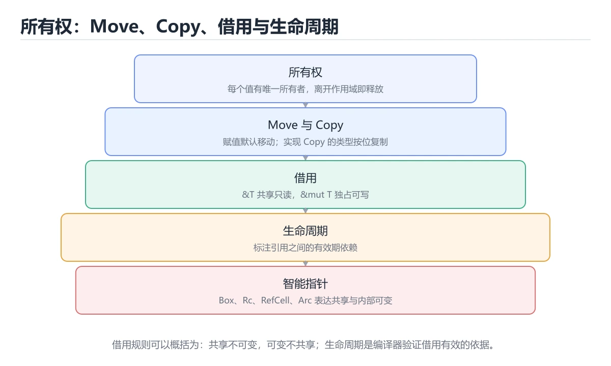
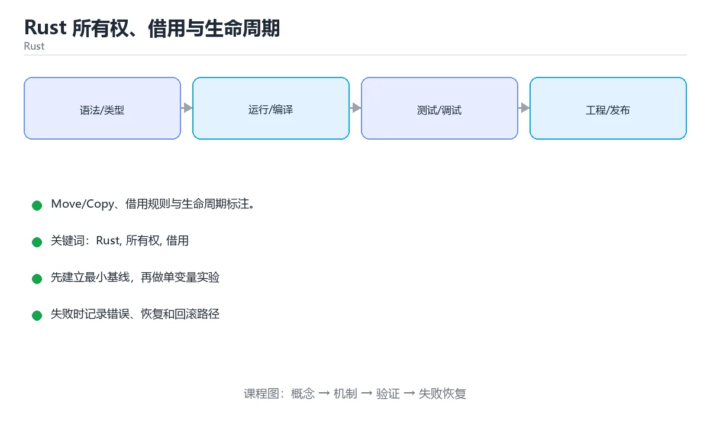

# Rust 所有权、借用与生命周期





> 内容更新时间：2026-10-06 · 学习阶段：进阶 · 预计用时：35 分钟

## 学习目标

- 能用自己的话解释Rust 所有权、借用与生命周期解决了什么问题，而不是只背术语。
- 能说清 「Rust」、「所有权」、「借用」、「生命周期」 之间的关系，并分别举出一个例子。
- 能把 Rust 放回「Rust 所有权、借用与生命周期」的知识体系，说明它和 所有权 的边界。
- 能完成本课练习，并用验收标准检查自己的结果。

> 一句话摘要：Move/Copy、借用规则与生命周期标注。

## 前置知识

- 先完成上一课《Rust 基础》；如果已经掌握，可以直接用本课练习自测。
- 本课阶段：入门。只需要基本计算机操作，不要求编程经验。
- 开始前先复习：Rust、所有权、借用。
- 如果 所有权三条规则 这一步看不懂，先记录具体卡点，再用 append_excited 复现一遍。

## 所有权三条规则

1. 每个值有且只有一个所有者。
2. 同一时刻只能有一个所有者。
3. 所有者离开作用域，值被释放（自动调用 Drop）。

因此赋值与传参默认是**移动（Move）**，原变量失效；`Copy` 类型（整数、布尔、字符、仅含 Copy 字段的结构体）按值复制。

## 借用与借用检查

| 形式 | 规则 |
| --- | --- |
| `&T` 不可变借用 | 可同时存在多个 |
| `&mut T` 可变借用 | 同一作用域只能有一个，且不能与不可变借用共存 |
| 生命周期 `'a` | 标注引用的有效范围，保证不出悬垂引用 |

借用检查器把**数据竞争与悬垂指针**消灭在编译期，代价是初学时经常与它"搏斗"。

## 常见解法

1. 需要共享只读：多个 `&T`。
2. 需要修改：缩小可变借用范围，或改成返回值传递。
3. 结构体自引用很麻烦：改用索引（如 `Vec` 下标）或 `Rc<RefCell<T>>`（单线程）/`Arc<Mutex<T>>`（多线程）。
4. 生命周期标注只在编译器需要帮助时写，先写代码再让编译器提示补标注。

## 与 GC 语言的对比

GC 语言在运行时回收，Rust 在编译期决定释放点：**没有停顿、没有额外内存开销**，但要求程序员显式表达所有权关系。这也是 Rust 适合系统编程与高性能服务的原因。

## 常见编译错误与修复

| 错误信息关键词 | 含义 | 修复方式 |
| --- | --- | --- |
| `value borrowed here after move` | 值已被移动，原变量失效 | 用 `.clone()`、改为传引用 `&T`，或调整所有权归属 |
| `cannot borrow as mutable` | 同时存在不可变与可变借用 | 缩小可变借用作用域，或用 `RefCell`/`Mutex` 做运行时检查 |
| `does not live long enough` | 引用的生命周期短于使用处 | 延长数据所有者作用域、返回拥有所有权的值 |
| `cannot move out of ... which is behind a shared reference` | 试图从不可变借用中移出值 | 使用 `Clone`、`std::mem::take` 或改为可变借用 |
| `borrowed value does not live long enough` | 临时值在语句结束即释放 | 先用变量绑定，再取引用 |

调试套路：**先读编译器给出的帮助（help: ...），它经常直接给出改法**；再看生命周期标注建议；最后才考虑引入 `Rc/Arc/RefCell`。绝大多数错误通过"传引用而不是传值""缩小借用范围"即可解决。

## 何时需要 Clone

`clone()` 是让代码先跑通的合法手段，但要点在于**知道自己在复制什么**：小对象复制成本可忽略；大 `Vec`/`String` 在热点路径反复 clone 会显著变慢。做法是先用 clone 理顺逻辑，再用 pprof/benchmark 找出真正的热点，逐步改成借用或 `Cow`。

## 场景化选择：该传值、传引用还是共享

| 场景 | 推荐写法 | 理由 |
| --- | --- | --- |
| 小且实现了 Copy 的类型（i32、bool） | 直接传值 | 复制成本极低，代码最简洁 |
| 只读的大对象（String、Vec、结构体） | 传 `&T` | 避免复制，且不转移所有权 |
| 需要修改调用方的数据 | 传 `&mut T` | 明确可变意图，独占借用 |
| 函数需要长期持有该数据 | 传值（取得所有权） | 生命周期最清晰 |
| 多处共享只读 | `Rc<T>` / `Arc<T>` | 引用计数共享所有权 |
| 多处共享可变（单线程 / 多线程） | `RefCell<T>` / `Mutex<T>` | 运行时借用检查 / 互斥 |
| 结构体内部互相引用 | 改用索引或 ID | 自引用结构在 Rust 中极难表达 |

工程建议：**先按「传引用」写，只有编译器要求所有权时才改为传值或共享**。这样能避免一上来就到处 clone 或 Arc，代码更贴近 Rust 的惯用法。遇到难以表达的自引用结构，优先重构数据结构（用索引关联）而不是硬上 `unsafe`。

## 本课小结

掌握所有权只需记住一句话：**一个值一个所有者，借用不夺权，可变借用独占**；其余规则都是它的推论。

## 所有权与借用速查

| 概念 | 规则 | 示例 |
| --- | --- | --- |
| 所有权 | 每个值有唯一所有者，所有者离开作用域即释放 | `let s = String::from("a");` |
| 移动 | 赋值或传参后原变量失效 | `let t = s;` 之后 `s` 不可用 |
| 复制 | 实现 `Copy` 的类型按位复制 | `let y = x;` 后 `x` 仍可用 |
| 不可变借用 | 可以同时存在多个 | `let a = &s; let b = &s;` |
| 可变借用 | 同一时刻只能有一个，且不能与不可变借用共存 | `let m = &mut s;` |
| 生命周期 | 标注借用关系，保证引用不悬空 | `fn f<'a>(x: &'a str) -> &'a str` |
| 切片 | 借用容器的一部分 | `&v[1..3]` |

```rust
fn longest<'a>(a: &'a str, b: &'a str) -> &'a str {
    if a.len() >= b.len() { a } else { b }
}

fn main() {
    let mut data = String::from("hello");

    {
        let r1 = &data;              // 不可变借用
        let r2 = &data;              // 可以同时有多个
        println!("{r1} {r2}");
    }                                // 借用在这里结束

    data.push_str(" world");         // 现在可以可变借用

    let s = String::from("abc");
    let t = s;                       // 所有权移动
    // println!("{s}");              // 编译错误：s 已被移动
    println!("{t}");
}
```

## 常见错误与排查

| 编译错误 | 含义 | 处理方式 |
| --- | --- | --- |
| `borrow of moved value` | 值被移动后又使用 | 改成借用（`&x`）或 `clone()`，或调整生命周期 |
| `cannot borrow as mutable, as it is also borrowed as immutable` | 可变与不可变借用冲突 | 缩短借用作用域，或先结束不可变借用 |
| `cannot borrow as mutable more than once` | 同时存在两个可变借用 | 用作用域分隔，或用 `RefCell` / `Mutex` |
| `missing lifetime specifier` | 编译器无法推断返回引用与哪个入参相关 | 显式标注生命周期 |
| `does not live long enough` | 引用的对象提前销毁 | 交出所有权、延长作用域或用 `Arc` |
| `cannot move out of borrowed content` | 试图从借用中移出值 | 用 `clone()`，或用 `mem::take` / `Option` 取出 |
| `value borrowed here after move` | 在移动之后又使用 | 提前 `clone` 或改为传引用 |
| `cannot assign twice to immutable variable` | 未声明 `mut` | 加 `mut` 或改成重新绑定 |

## 何时选择什么

| 需求 | 选择 |
| --- | --- |
| 只读访问字符串参数 | `&str` |
| 需要拥有并修改字符串 | `String` |
| 只读访问序列 | `&[T]` |
| 需要拥有、可增长 | `Vec<T>` |
| 共享不可变数据 | `&T` 或 `Arc<T>`（跨线程） |
| 需要内部可变性 | `Cell` / `RefCell`（单线程）、`Mutex` / `RwLock`（多线程） |
| 可能没有值 | `Option<T>` |
| 可能失败 | `Result<T, E>` |

## 复习与自测

- [ ] 能说清「移动」与「复制」的区别，并知道哪些类型实现 `Copy`。
- [ ] 记得同一作用域内「可变借用独占」的规则。
- [ ] 会用作用域收缩解决借用冲突，而不是无脑 `clone`。
- [ ] 能读懂 `does not live long enough` 并定位生命周期问题。
- [ ] 需要跨线程共享时使用 `Arc<Mutex<T>>`。

## 零基础详解：所有权，用「借书」理解 Rust 最核心的规则

### 一句话说清它是什么

所有权是 Rust 管理内存的方式：**每个值有且只有一个所有者**，
所有者离开作用域，值就被自动释放。这样既不需要垃圾回收，也不会内存泄漏。

### 三条规则（背下来就够用）

1. Rust 中每个值都有一个**所有者**变量。
2. 同一时刻**只能有一个所有者**。
3. 所有者离开作用域时，值被自动丢弃（`drop`）。

### 用「借书」理解移动与克隆

| 操作 | 比喻 | 代码 | 之后原变量还能用吗 |
| --- | --- | --- | --- |
| 移动 move | 把书送给别人 | `let b = a;` | 不能 |
| 克隆 clone | 复印一本给对方 | `let b = a.clone();` | 能 |
| 复制 copy | 给对方一张便签（栈上小数据） | `let b = n;`（i32） | 能 |
| 借用 borrow | 借出去看，不转让 | `let b = &a;` | 能 |
| 可变借用 | 借出去改，且一次只能一个人改 | `let b = &mut a;` | 借用期间不能再用 a |

```rust
let s1 = String::from("hello");
let s2 = s1;                    // 所有权移动，s1 失效
// println!("{s1}");            // 编译错误：value borrowed here after move

let s3 = s2.clone();            // 深拷贝，两边都能用
println!("{s2} {s3}");

let n1 = 5;
let n2 = n1;                    // i32 实现了 Copy，n1 仍可用
println!("{n1} {n2}");
```

### 借用规则：一条让人又爱又恨的规则

**在任意时刻，对同一个值只能满足下面之一：**

- 任意多个**不可变借用** `&T`，或
- 恰好一个**可变借用** `&mut T`。

```rust
let mut data = vec![1, 2, 3];

let a = &data;        // 不可变借用
let b = &data;        // 再来一个也可以
println!("{a:?} {b:?}");   // 最后一次使用后，a、b 的借用结束

let c = &mut data;    // 现在可以可变借用了
c.push(4);
println!("{c:?}");
```

这就是为什么 Rust 能**在编译期消灭数据竞争**：读写不能同时发生。

### 引用与解引用

```rust
fn length(s: &str) -> usize { s.len() }        // 借用，不夺走所有权

fn add_one(n: &mut i32) { *n += 1; }           // * 解引用后修改

let mut x = 1;
add_one(&mut x);
println!("{x}");                                // 2
```

函数参数用 `&T` 而不是 `T`，可以避免调用处失去所有权。

### 生命周期的直觉理解

```rust
fn longest<'a>(a: &'a str, b: &'a str) -> &'a str {
    if a.len() >= b.len() { a } else { b }
}
```

`'a` 的意思是：**返回的引用活得不能比两个输入更久**。
初学阶段只需记住：返回引用时，它必须来自参数，而不是函数内部创建的临时值。

### 新手最容易踩的七个坑

| 坑 | 报错关键词 | 正确做法 |
| --- | --- | --- |
| 移动后继续用 | `borrow of moved value` | 用 `clone()`，或改成借用 |
| 借用期间修改 | `cannot borrow as mutable` | 先结束借用，再修改 |
| 同时存在可变与不可变借用 | `cannot borrow ... more than once` | 缩短借用作用域 |
| 返回局部变量的引用 | `does not live long enough` | 返回所有权（`String`）而不是 `&str` |
| 循环里 `&mut` 冲突 | `already borrowed` | 用下标访问、拆分借用或收集索引 |
| 结构体持有引用 | 缺少生命周期参数 | 加生命周期标注或改持有所有权 |
| 到处 `clone` | 编译过了但性能差 | 先想清楚能否借用 |

### 手把手练习：安全的字符串处理

```rust
fn first_word(s: &str) -> &str {
    match s.find(' ') {
        Some(i) => &s[..i],
        None => s,
    }
}

fn append_excited(mut s: String) -> String {
    s.push('!');
    s
}

fn main() {
    let text = String::from("hello rust world");
    println!("第一个词：{}", first_word(&text));   // 只借用，text 还在

    let owned = text;                              // 移动给 owned
    let owned = append_excited(owned);             // 传进去再返回
    println!("{owned}");
}
```

### 学完自测

- [ ] 能默写所有权的三条规则。
- [ ] 能解释移动、克隆、复制三者的差别。
- [ ] 能说出借用规则的两句话。
- [ ] 知道为什么 `i32` 赋值后原变量还能用，而 `String` 不行。
- [ ] 能把一个「移动后继续用」的错误改成借用或克隆。

## 动手练习

> 本课练习重点：围绕「Rust、所有权、借用」完成复述、实验和交付，每个结果都要能被别人检查。

围绕 Rust 写一个最小示例，先用 append_excited 跑通，再补一个边界输入。

### 练习 1：建立心智模型（10 分钟）

合上教程，用 3～5 句话回答：

1. Rust 所有权、借用与生命周期解决了什么问题？
2. 如果没有它，会出现什么具体后果？
3. 它和「所有权」是什么关系？

验收标准：回答里必须出现 Rust，并写出一个让结论失效的边界条件。

### 练习 2：做一次可控实验（20 分钟）

从正文中选一个最小示例，完成以下操作：

1. 先预测修改一个参数、输入或步骤后的结果。
2. 再实际执行或逐步推演，记录真实结果。
3. 如果结果与预测不同，写出差异原因。

**验收标准**：把 append_excited 当作原例，改动一次所有权的取值，记录命令、输出与差异原因；五步里缺任意一步都算未完成。

### 练习 3：交付一个小结果（30 分钟）

围绕 Rust 写一个最小示例，先用 append_excited 跑通，再补一个边界输入。

任务要求：

- 结果必须能被别人检查，不能只写“我已经理解了”。
- 至少覆盖「Rust」和「所有权」两个关键词。
- 写出 1 个仍然不确定的问题，以及下一步如何验证。

> 提示：时间有限时优先做练习 1 和练习 2；练习 3 可以拆成两次完成。

## 可运行练习

本节围绕Rust 所有权、借用与生命周期安排 3 个可交付任务，每个任务都要求留下可以复查的记录。

### 任务 1：用自己的话画出结构

不看书，用一张图说清「Rust 所有权、借用与生命周期」的结构，画完再对照骨架：

- 主干：所有权三条规则 → 借用与借用检查 → 常见解法 → 与 GC 语言的对比
- 连接线：在每条边上标出输入、输出与失败路径。
- 自检：能否用一句话说明Rust与所有权的关系？

### 任务 2：做一次对比实验

**验收标准**：对照表两列都要有证据（命令、输出或数据），并注明Rust与所有权哪一个才是决定性变量。

### 任务 3：迁移到自己的场景

**验收标准**：换一个人按你的记录重跑 append_excited，能得到相同输出；得不到就补写缺失的前提。

## 故障现场

### 现场 1：borrow of moved value

**症状**：在《Rust 所有权、借用与生命周期》的复现场景中，值被移动后又使用。

**根因**：“值被移动后又使用”只是表层结果。向上追溯会落到“borrow of moved value”这一步，因为它省略了《Rust 所有权、借用与生命周期》的约束，使实现行为和预期模型发生了偏离。

**修复**：针对《Rust 所有权、借用与生命周期》的问题，改成借用（&x）或 clone()，或调整生命周期。

**验证**：保留《Rust 所有权、借用与生命周期》里触发“值被移动后又使用”的输入、版本和日志，按“改成借用（&x）或 clone()，或调整生命周期”完成修改后原样重放；只有失败现象消失且相邻场景仍可解释，才保留改动。

### 现场 2：cannot borrow as mutable, as it is also borrowed as immutable

**症状**：在《Rust 所有权、借用与生命周期》的复现场景中，可变与不可变借用冲突。

**根因**：当出现“cannot borrow as mutable, as it is also borrowed as immutable”时，执行路径已经绕过了《Rust 所有权、借用与生命周期》的关键约束，最终以“可变与不可变借用冲突”暴露出来；修复前必须先确认约束在哪里失效。

**修复**：针对《Rust 所有权、借用与生命周期》的问题，缩短借用作用域，或先结束不可变借用。

**验证**：在《Rust 所有权、借用与生命周期》中按“缩短借用作用域，或先结束不可变借用”调整后，从“cannot borrow as mutable, as it is also borrowed as immutable”的触发条件重放同一条路径，确认“可变与不可变借用冲突”不再出现，并补一个相邻边界用例检查没有引入新问题。

### 现场 3：cannot borrow as mutable more than once

**症状**：在《Rust 所有权、借用与生命周期》的复现场景中，同时存在两个可变借用。

**根因**：“同时存在两个可变借用”只是表层结果。向上追溯会落到“cannot borrow as mutable more than once”这一步，因为它省略了《Rust 所有权、借用与生命周期》的约束，使实现行为和预期模型发生了偏离。

**修复**：针对《Rust 所有权、借用与生命周期》的问题，用作用域分隔，或用 RefCell / Mutex。

**验证**：保留《Rust 所有权、借用与生命周期》里触发“同时存在两个可变借用”的输入、版本和日志，按“用作用域分隔，或用 RefCell / Mutex”完成修改后原样重放；只有失败现象消失且相邻场景仍可解释，才保留改动。

## 版本与时效

- 版本提示：Rust 的行为在最近几个大版本里有过调整，升级「Rust 所有权、借用与生命周期」前先用 append_excited 复现当前输出，再对照官方发布说明逐条核对。
- append_excited 涉及的 trait 解析差异应先用最小仓库验证，再升级主工程。
- 升级前先用 append_excited 建立基线：记录版本、命令和输出，升级后只比较这些可观察量。
- 官方发布说明：https://blog.rust-lang.org/

### 升级检查清单

- 先固定当前版本，跑通全部示例与测验，再升级工具链。
- 只改 Rust 的版本变量，记录编译、测试与产物体积的变化。
- 升级后重点回归 Rust 的默认值、警告信息与错误格式。
- 升级完成后更新本课「最后复核 / 下次复核」日期，并记录 Rust 的版本变化。

## 本课复习清单

离开本课前，逐项确认：

- [ ] 不看解析，能说出「Rust 中把变量赋值给另一个变量，默认行为是？」的判断依据。
- [ ] 不看解析，能说出「以下哪组操作会转移所有权？」的判断依据。
- [ ] 不看解析，能说出「生命周期标注的作用是？」的判断依据。
- [ ] 不看解析，能说出「为什么把 String 赋给另一个变量会「移动」，而 i32 是复制？」的判断依据。
- [ ] 不看解析，能说出「String 与 &str 的关系是？」的判断依据。
- [ ] 用 Rust 构造一个正常输入和一个边界输入，分别记录输出与判断依据。
- [ ] 把本课最容易混淆的两个概念写成一句话对照。

| 复盘项 | 记录 |
| --- | --- |
| 已经能独立解释的考点 |  |
| 仍然说不清的概念 |  |
| 下一步验证动作 |  |

## 术语速查

| 术语 | 一句话说明 |
| --- | --- |
| `Copy` | 因此赋值与传参默认是**移动（Move）**，原变量失效；`Copy` 类型（整数、布尔、字符、仅含 Copy 字段的结构体）按值复制。 |
| `Vec` | 结构体自引用很麻烦：改用索引（如 `Vec` 下标）或 `Rc<RefCell<T>>`（单线程）/`Arc<Mutex<T>>`（多线程）。 |
| `所有权` | Rust 中每个值只有一个所有者，离开作用域时自动释放的规则。 |
| `借用` | Rust 在不转移所有权的前提下临时访问值，并在编译期检查引用有效期和别名规则。 |
| `Rust` | Rust 是系统级语言，用编译期检查替代垃圾回收，做到内存安全与零成本抽象 |
| `生命周期` | 引用保持有效的区间；在 Rust 中还用于把多个引用的有效期关系写进类型 |

## 考点精讲

### 考点 1：概念判断·Rust

- **题目**：Rust 中把变量赋值给另一个变量，默认行为是？
- **判断依据**：除非类型实现了 Copy，否则所有权转移，原变量失效。在「Rust 所有权、借用与生命周期」里，作答时，先用Rust建立输入与输出的基线，再把移动（Move）代入边界条件核对，结论才能复现。「Rust 所有权、借用与生命周期」要求先交代Rust、所有权、借用的前提再下结论，所以“移动（Move）”只在题干“Rust 中把变量赋值给另一个变量”给定的条件下成立。

### 考点 2：多选辨析·Rust

- **题目**：围绕“Rust 所有权、借用与生命周期”中的 Rust、所有权、借用，下列哪两项是本课强调的实践判断？
- **判断依据**：在「Rust 所有权、借用与生命周期」里，题干的正确项是学习 Rust 时要同时说明输入、输出和失败路径，不能只看正常流程。在Rust 所有权、借用与生命周期里，判断 所有权 时要固定版本与边界输入，所以“验证 所有权 时要固定版本并覆盖边界输入，结论才可复现”才可复现。「Rust 所有权、借用与生命周期」要求先交代Rust、所有权、借用的前提再下结论，所以“验证 所有权 时要固定版本并覆盖边界输入”只在题干“围绕Rust 所有权、借用与生命周期中的 Rust、所有权、”给定的条件下成立。

### 考点 3：概念判断·Rust

- **题目**：生命周期标注的作用是？
- **判断依据**：它不改变运行期行为，只是让借用检查可验证。在「Rust 所有权、借用与生命周期」里，作答时，先用Rust建立输入与输出的基线，再把向编译器说明引用的有效范围代入边界条件核对，结论才能复现。在「Rust 所有权、借用与生命周期」里，如果只凭关键词作答，很容易把「手动释放内存，但这会加重回收压力」、「延长变量寿命」与「向编译器说明引用的有效范围」混在一起；

### 考点 4：概念判断·移动

- **题目**：为什么把 String 赋给另一个变量会「移动」，而 i32 是复制？
- **判断依据**：在「Rust 所有权、借用与生命周期」里，结论应落在「i32 实现了 Copy，String 只能移动所有权」。结论应落在i32 等实现了 Copy 的类型按位复制。如果 String 也复制，就会出现两处释放同一块内存的问题，这正是 Rust 要避免的。

### 考点 5：代码补全·Rust

- **题目**：阅读「Rust 所有权、借用与生命周期」正文里的这段 Rust 代码，下面哪一项判断是正确的？
- **判断依据**：在「Rust 所有权、借用与生命周期」里，这段代码把主要逻辑封装在函数或方法里，需要被调用才会执行。这段代码出自「Rust 所有权、借用与生命周期」的正文示例，围绕Rust、所有权、借用展开；把输入或边界换成空值、极值或失败情况后，结论要以「Rust 所有权、借用与生命周期」的实际运行结果为准。

### 考点 6：填空·Rust

- **题目**：补全代码：「Rust 所有权、借用与生命周期」示例中，下面这行代码缺少哪个关键字或函数名？请填入 ____。 `let s3 = s2.____; // 深拷贝，两边都能用`
- **判断依据**：在「Rust 所有权、借用与生命周期」里，clone。在「Rust 所有权、借用与生命周期」里判断这道题，要把Rust、所有权、借用的条件、过程与失败路径逐项对齐，换成“补全代码”这个场景，只有满足前提的结论才成立。“Rust”与「Rust 所有权、借用与生命周期」的术语表相呼应，只有符合Rust、所有权、借用约束的“clone”才是正文支持的结论。

## English Overview

**Title:** Ownership & Borrowing

**Summary:** Move/Copy, borrow rules and lifetimes.

**Category:** Rust
**Level:** 入门
**Key terms:** Rust, 所有权, 借用, 生命周期, Move

## 内容元数据

- 内容版本：v2.0
- 最后更新：2026-10-06
- 学习阶段：进阶
- 适用环境：Rust 1.85+ / Cargo
；本课聚焦 Rust。
- 内容来源：内置结构化课程与工程实践整理
- 相关主题：Rust、所有权、借用、生命周期、Move
- 质量版本：P0 测验标准 + P1 覆盖扩展 + P2 体验补全

## Full English Study Guide

### Overview

**Ownership & Borrowing** focuses on Move/Copy, borrow rules and lifetimes.

### Learning Outcomes

- Explain what **Ownership & Borrowing** solves and when it should be used.

### Glossary

- Topic: **Ownership & Borrowing**
- Related terms: Rust, 所有权, 借用, 生命周期

## Bilingual Section Outline

| 中文小节 | English section |
| --- | --- |
| 学习目标 | Learning objectives |
| 前置知识 | Prerequisites |
| 所有权三条规则 | Ownership三条规则 |
| 借用与借用检查 | 借用与借用检查 |
| 常见解法 | 常见解法 |
| 与 GC 语言的对比 | 与 GC 语言的对比 |
| 常见编译错误与修复 | 常见编译错误与修复 |
| 何时需要 Clone | 何时需要 Clone |
| 场景化选择：该传值、传引用还是共享 | 场景化选择：该传值、传引用还是共享 |
| 本课小结 | Summary |

## 参考资料与复核

- 最后复核：2026-10-04
- 下次复核：2027-06-24
- 复核范围：版本兼容、API 行为、安全建议与工程实践
- 来源性质：官方文档、标准或权威教材；正文为离线教学重组

| 参考资料 | 本课用途 |
| --- | --- |
| [The Rust Book](https://doc.rust-lang.org/book/) | 所有权、类型与工程实践 |
| [Rust 测试](https://doc.rust-lang.org/book/ch11-00-testing.html) | 单元测试与集成测试 |
| [Tokio 文档](https://tokio.rs/tokio/tutorial) | 异步运行时与任务 |

> 「Rust 所有权、借用与生命周期」的链接用于离线阅读后的延伸核对；App 不会自动联网。

