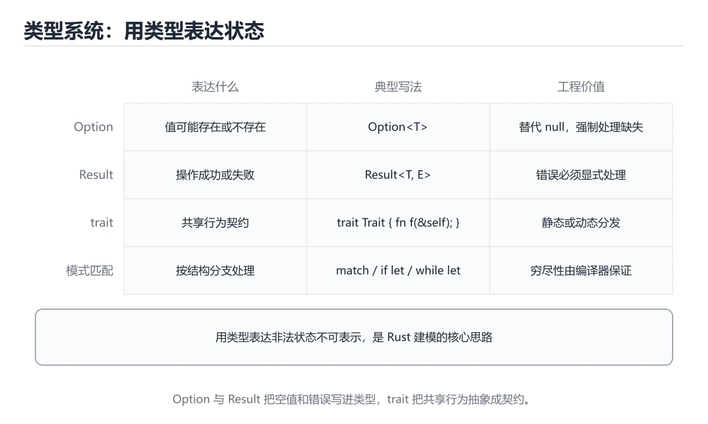
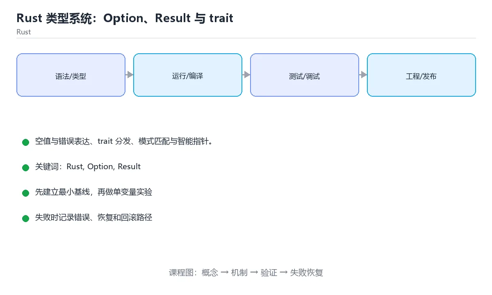

# Rust 类型系统：Option、Result 与 trait





> 内容更新时间：2026-10-06 · 学习阶段：进阶 · 预计用时：35 分钟

## 学习目标

- 能用自己的话解释Rust 类型系统：Option、Result 与 trait解决了什么问题，而不是只背术语。
- 能说清 「Rust」、「Option」、「Result」、「trait」 之间的关系，并分别举出一个例子。
- 能把 Rust 放回「Rust 类型系统：Option、Result 与 trait」的知识体系，说明它和 Option 的边界。
- 能完成本课练习，并用验收标准检查自己的结果。

> 一句话摘要：空值与错误表达、trait 分发、模式匹配与智能指针。

## 前置知识

- 先完成上一课《Rust 所有权、借用与生命周期》；如果已经掌握，可以直接用本课练习自测。
- 本课阶段：进阶。建议先完成「Rust 所有权、借用与生命周期」，或确认自己能独立跑通正文里的 ParseIntError 示例。
- 开始前先复习：Rust、Option、Result。
- 看不懂就直接缩小例子：只保留 Rust 相关的两行输入，跑通后再加回其余部分。

## Option 与 Result

| 类型 | 含义 | 常用方法 |
| --- | --- | --- |
| `Option<T>` | 有值 Some(T) 或无值 None | unwrap_or、map、and_then、? |
| `Result<T, E>` | 成功 Ok(T) 或失败 Err(E) | `?`、map_err、unwrap_or_else |

Rust 没有 null，空值必须用 `Option` 显式表达；错误必须用 `Result` 处理。`?` 运算符在错误时提前返回，是错误传播的标准写法。

## trait：定义共享行为

trait 类似接口，但支持默认实现、关联类型与泛型约束。`impl Trait for Type` 为类型实现行为；`T: Trait` 或 `where T: Trait` 约束泛型。与动态分发 `dyn Trait` 相比，泛型是**静态分发、零开销**。

常用内置 trait：`Debug`、`Clone`、`Copy`、`PartialEq`、`Display`、`Iterator`、`From/Into`。`#[derive(...)]` 可自动实现大部分。

## 模式匹配

`match` 要求穷尽所有分支，配合 enum 可表达业务状态机；`if let`/`while let` 用于只关心一种形态的场景。编译器会检查你是否漏了分支——这是 Rust 建模能力的关键。

## 智能指针

| 类型 | 用途 |
| --- | --- |
| `Box<T>` | 堆分配，递归类型必备 |
| `Rc<T>` / `Arc<T>` | 共享所有权（单线程 / 多线程） |
| `RefCell<T>` / `Mutex<T>` | 运行时可变性检查 / 跨线程互斥 |
| `Cow<T>` | 写时复制，兼顾借用与拥有 |

## 本课小结

Rust 的类型系统把「可能为空」「可能失败」「行为契约」都写进类型：**Option 管空值、Result 管错误、trait 管行为、enum + match 管状态**。

## Option 与 Result 速查

| 目的 | 写法 |
| --- | --- |
| 可能没有值 | `Option<T>`：`Some(v)` / `None` |
| 可能失败 | `Result<T, E>`：`Ok(v)` / `Err(e)` |
| 提供默认值 | `opt.unwrap_or(default)` / `unwrap_or_default()` |
| 延迟计算默认值 | `opt.unwrap_or_else(\|\| compute())` |
| 转换并保留失败 | `opt.ok_or(MyError::Missing)?` |
| 链式处理 | `opt.map(f).and_then(g)` |
| 过滤 | `opt.filter(\|v\| v.is_valid())` |
| 提前返回错误 | `let v = result?;` |
| 打印调试信息 | `expect("上下文")` 比 `unwrap()` 更有信息量 |
| 组合多个 Option | `match (a, b) { (Some(x), Some(y)) => ... , _ => ... }` |

```rust
use std::num::ParseIntError;

#[derive(Debug)]
enum ConfigError {
    Missing(&'static str),
    Invalid { key: &'static str, source: ParseIntError },
}

fn read_port(map: &std::collections::HashMap<String, String>) -> Result<u16, ConfigError> {
    let raw = map.get("port").ok_or(ConfigError::Missing("port"))?;
    raw.parse::<u16>().map_err(|source| ConfigError::Invalid {
        key: "port",
        source,
    })
}
```

## trait 速查

| 概念 | 说明 |
| --- | --- |
| 定义 | `trait Summary { fn summary(&self) -> String; }` |
| 默认实现 | trait 内提供方法体，实现者可不重写 |
| 实现 | `impl Summary for Article { ... }` |
| 泛型约束 | `fn f<T: Summary>(x: T)` |
| 动态分发 | `Box<dyn Summary>`，运行时确定实现 |
| 静态分发 | 泛型单态化，无运行时开销但代码膨胀 |
| 派生宏 | `#[derive(Debug, Clone, PartialEq)]` |
| 常用标准 trait | `Debug`、`Clone`、`Copy`、`PartialEq`、`Default`、`From`/`Into` |
| 孤儿规则 | trait 或类型至少有一个属于当前 crate |

## 常见错误与排查

| 容易写错的做法 | 实际现象 | 原因与正确做法 |
| --- | --- | --- |
| `opt.unwrap()` 用在可能为空的路径 | 运行时 panic | 用 `?`、`unwrap_or` 或 `match` |
| `?` 用在返回类型不匹配的函数 | 编译错误 | 返回类型必须是 `Result` / `Option` |
| 到处 `Box<dyn Trait>` | 运行时间接调用与分配 | 性能敏感处用泛型 |
| 泛型一层套一层 | 编译时间与体积暴涨 | 非热点用 `dyn` |
| 忘记 `#[derive(Debug)]` | 无法 `{:?}` 打印 | 派生或手写 `Debug` |
| 为外部类型实现外部 trait | 编译错误（孤儿规则） | 用 newtype 包装 |
| `Copy` 与 `Clone` 混用 | 移动语义不符合预期 | 只有平凡复制语义的类型才 `Copy` |
| 用 `PartialEq` 比较浮点 | 结果不稳定 | 用误差比较 |
| 忘记处理 `None` 分支 | 编译错误（穷尽匹配） | 补分支或用组合子 |
| 把一个巨大的 `Result` 到处传递 | 类型签名冗长 | 用 `anyhow`（应用层）或自定义错误枚举 |

## 复习与自测

- [ ] 用 `Option` 表达可能缺失，`Result` 表达可能失败。
- [ ] 优先用 `?` 与组合子，避免 `unwrap()`。
- [ ] 能说出泛型与 `dyn` 的取舍。
- [ ] 会用 `#[derive]` 减少样板代码。
- [ ] 了解孤儿规则并用 newtype 规避。

## 零基础详解：结构体、枚举与 trait

### 一句话说清它是什么

`struct` 把相关数据组合起来，`enum` 表达「几种可能之一」，`trait` 定义「共有的能力」。
三者配合 `match` 与 `Option`，让 Rust 把「忘记处理某种情况」变成编译错误。

### 用生活比喻理解

| 概念 | 比喻 | 说明 |
| --- | --- | --- |
| `struct` | 一张信息卡 | 各字段都同时存在 |
| `enum` | 单选题 | 同一时刻只能是其中一个选项 |
| `trait` | 岗位能力要求 | 谁实现了这些方法就有这项能力 |
| `impl` | 给类型装能力 | 实现方法或 trait |
| `match` | 分类处理窗口 | 必须覆盖所有情况 |

### 结构体与枚举

```rust
#[derive(Debug, Clone, PartialEq)]
struct User {
    id: u64,
    name: String,
    email: Option<String>,       // 可能没有邮箱
}

#[derive(Debug)]
enum Shape {
    Circle { radius: f64 },
    Square { side: f64 },
    Triangle { base: f64, height: f64 },
}

impl Shape {
    fn area(&self) -> f64 {
        match self {
            Shape::Circle { radius } => std::f64::consts::PI * radius * radius,
            Shape::Square { side } => side * side,
            Shape::Triangle { base, height } => base * height / 2.0,
        }
    }
}
```

`match` 少写一个分支编译器就会报错——这是 Rust 最值钱的安全网之一。

### `Option` 与 `Result`

```rust
fn find_user(id: u64) -> Option<User> {
    if id == 0 {
        None
    } else {
        Some(User { id, name: "小明".into(), email: None })
    }
}

fn parse_age(text: &str) -> Result<u8, String> {
    text.trim()
        .parse::<u8>()
        .map_err(|_| format!("不是合法年龄：{text}"))
}

// 用 ? 传播错误，比层层 match 干净得多
fn load(text: &str) -> Result<u8, String> {
    let age = parse_age(text)?;
    Ok(age)
}
```

| 类型 | 含义 | 用法 |
| --- | --- | --- |
| `Option<T>` | 有或无 | `Some(x)` / `None` |
| `Result<T, E>` | 成功或失败 | `Ok(x)` / `Err(e)` |
| `?` | 出错就提前返回 | 只能在返回 Result 或 Option 的函数里用 |

### trait：能力约定与实际使用

```rust
trait Summary {
    fn summarize(&self) -> String;

    fn preview(&self) -> String {            // 默认实现，可以不写
        format!("{}…", &self.summarize()[..10])
    }
}

impl Summary for User {
    fn summarize(&self) -> String {
        format!("{}（{}）", self.name, self.id)
    }
}

fn print_summary(item: &impl Summary) {      // 静态分发：编译期确定
    println!("{}", item.summarize());
}

fn print_dyn(item: &dyn Summary) {           // 动态分发：运行时确定
    println!("{}", item.preview());
}
```

| 写法 | 分发方式 | 适用场景 |
| --- | --- | --- |
| `impl Trait` 或泛型 `T: Trait` | 静态 | 追求性能，类型在编译期确定 |
| `dyn Trait` | 动态 | 需要把不同类型放进同一个容器 |

### 常用派生宏

| 派生 | 得到什么 |
| --- | --- |
| `Debug` | 可用 `{:?}` 打印 |
| `Clone` | 可调用 `.clone()` |
| `Copy` | 赋值时不移动（仅限简单类型） |
| `PartialEq` / `Eq` | 可用 `==` 比较 |
| `Default` | 可调用 `Default::default()` |
| `Hash` | 可作为 HashMap 的键 |

### 新手最容易踩的八个坑

| 坑 | 报错关键词 | 正确做法 |
| --- | --- | --- |
| `match` 漏分支 | non-exhaustive patterns | 补齐或用 `_ =>` |
| 对 `Option` 直接取值 | 类型不匹配 | 用 `unwrap_or`、`?` 或 `match` |
| 到处 `unwrap()` | 运行时 panic | 用 `?`、`unwrap_or_else` 处理 |
| 忘记 `#[derive(Debug)]` | 无法打印 | 加上派生宏 |
| trait 方法签名不一致 | does not match trait | 保证参数与返回类型一致 |
| 把 `String` 当 `&str` | 期望引用但给了值 | 传 `&s` 或改签名 |
| 结构体字段默认私有 | 其它模块访问不到 | 需要公开就加 `pub` |
| `dyn` 忘了引用 | 编译期大小未知 | 用 `&dyn Trait` 或 `Box<dyn Trait>` |

### 手把手练习：形状面积与错误处理

```rust
use std::fmt;

#[derive(Debug)]
enum ShapeError {
    Negative(f64),
    Unknown,
}

impl fmt::Display for ShapeError {
    fn fmt(&self, f: &mut fmt::Formatter<'_>) -> fmt::Result {
        match self {
            ShapeError::Negative(v) => write!(f, "边长不能为负：{v}"),
            ShapeError::Unknown => write!(f, "未知形状"),
        }
    }
}

fn area(kind: &str, a: f64) -> Result<f64, ShapeError> {
    if a < 0.0 {
        return Err(ShapeError::Negative(a));
    }
    match kind {
        "square" => Ok(a * a),
        "circle" => Ok(std::f64::consts::PI * a * a),
        _ => Err(ShapeError::Unknown),
    }
}

fn main() {
    for (kind, a) in [("square", 3.0), ("circle", 2.0), ("blob", 1.0)] {
        match area(kind, a) {
            Ok(v) => println!("{kind} 面积 {v:.2}"),
            Err(e) => println!("{kind} 出错：{e}"),
        }
    }
}
```

### 学完自测

- [ ] 能说出 struct 与 enum 的区别。
- [ ] 能解释 `Option` 与 `Result` 各自解决什么问题。
- [ ] 知道 `?` 运算符的作用与使用前提。
- [ ] 能说出静态分发与动态分发的差别。
- [ ] 能列出至少四个常用派生宏。

## 动手练习

> 本课练习重点：围绕「Rust、Option、Result」完成复述、实验和交付，每个结果都要能被别人检查。

用 ParseIntError 构造最小可运行示例，并把输出与「Option 与 Result」的结论对照。

### 练习 1：建立心智模型（10 分钟）

合上教程，用 3～5 句话回答：

1. Rust 类型系统：Option、Result 与 trait解决了什么问题？
2. 如果没有它，会出现什么具体后果？
3. 它和「Option」是什么关系？

验收标准：回答里必须出现 Rust，并写出一个让结论失效的边界条件。

### 练习 2：做一次可控实验（20 分钟）

从正文中选一个最小示例，完成以下操作：

1. 先预测修改一个参数、输入或步骤后的结果。
2. 再实际执行或逐步推演，记录真实结果。
3. 如果结果与预测不同，写出差异原因。

**验收标准**：先在「Option 与 Result」里找一个可运行的最小输入，再按五步法记录Rust的影响；预测与结果不一致时补写被忽略的前提。

### 练习 3：交付一个小结果（30 分钟）

用 ParseIntError 构造最小可运行示例，并把输出与「Option 与 Result」的结论对照。

任务要求：

- 结果必须能被别人检查，不能只写“我已经理解了”。
- 至少覆盖「Rust」和「Option」两个关键词。
- 写出 1 个仍然不确定的问题，以及下一步如何验证。

> 提示：时间有限时优先做练习 1 和练习 2；练习 3 可以拆成两次完成。

## 可运行练习

本节围绕Rust 类型系统：Option、Result 与 trait安排 3 个可交付任务，每个任务都要求留下可以复查的记录。

### 任务 1：用自己的话画出结构

不看书，用一张图说清「Rust 类型系统：Option、Result 与 trait」的结构，画完再对照骨架：

- 主干：Option 与 Result → trait：定义共享行为 → 模式匹配 → 智能指针
- 连接线：在每条边上标出输入、输出与失败路径。
- 自检：能否用一句话说明Rust与Option的关系？

### 任务 2：做一次对比实验

**验收标准**：两个方案的差异必须落在「Rust 类型系统：Option、Result 与 trait」的实际约束上；写清当Rust越过哪条边界时应该换方案。

### 任务 3：迁移到自己的场景

**验收标准**：换一个人按你的记录重跑 ParseIntError，能得到相同输出；得不到就补写缺失的前提。

## 故障现场

### 现场 1：opt.unwrap() 用在可能为空的路径

**症状**：在《Rust 类型系统：Option、Result 与 trait》的复现场景中，运行时 panic。

**根因**：当出现“opt.unwrap() 用在可能为空的路径”时，执行路径已经绕过了《Rust 类型系统：Option、Result 与 trait》的关键约束，最终以“运行时 panic”暴露出来；修复前必须先确认约束在哪里失效。

**修复**：针对《Rust 类型系统：Option、Result 与 trait》的问题，用 ?、unwrap_or 或 match。

**验证**：先在《Rust 类型系统：Option、Result 与 trait》中记录“opt.unwrap() 用在可能为空的路径”留下的失败证据，再执行“用 ?、unwrap_or 或 match”并重放；确认错误路径变为明确结果，且修复没有掩盖同类故障。

### 现场 2：到处 Box<dyn Trait>

**症状**：在《Rust 类型系统：Option、Result 与 trait》的复现场景中，运行时间接调用与分配。

**根因**：触发点是把“到处 Box<dyn Trait>”当成安全做法。它没有满足《Rust 类型系统：Option、Result 与 trait》要求的前提，因此先表现为“运行时间接调用与分配”；排查时先完整复现这一段，再核对输入、配置与依赖。

**修复**：针对《Rust 类型系统：Option、Result 与 trait》的问题，性能敏感处用泛型。

**验证**：保留《Rust 类型系统：Option、Result 与 trait》里触发“运行时间接调用与分配”的输入、版本和日志，按“性能敏感处用泛型”完成修改后原样重放；只有失败现象消失且相邻场景仍可解释，才保留改动。

### 现场 3：泛型一层套一层

**症状**：在《Rust 类型系统：Option、Result 与 trait》的复现场景中，编译时间与体积暴涨。

**根因**：触发点是把“泛型一层套一层”当成安全做法。它没有满足《Rust 类型系统：Option、Result 与 trait》要求的前提，因此先表现为“编译时间与体积暴涨”；排查时先完整复现这一段，再核对输入、配置与依赖。

**修复**：针对《Rust 类型系统：Option、Result 与 trait》的问题，非热点用 dyn。

**验证**：保留《Rust 类型系统：Option、Result 与 trait》里触发“编译时间与体积暴涨”的输入、版本和日志，按“非热点用 dyn”完成修改后原样重放；只有失败现象消失且相邻场景仍可解释，才保留改动。

## 版本与时效

- 版本提示：Rust 的行为在最近几个大版本里有过调整，升级「Rust 类型系统：Option、Result 与 trait」前先用 ParseIntError 复现当前输出，再对照官方发布说明逐条核对。
- 把 Option 的编译告警当作错误处理，升级后才能避免行为漂移。
- 升级前先用 ParseIntError 建立基线：记录版本、命令和输出，升级后只比较这些可观察量。
- 官方发布说明：https://blog.rust-lang.org/

### 升级检查清单

- 先固定当前版本，跑通全部示例与测验，再升级工具链。
- 升级时只动一个依赖版本，用 ParseIntError 记录构建与运行结果。
- 先回归 Rust 与 Option 的默认行为和错误信息，再扩大测试范围。
- 升级完成后更新本课「最后复核 / 下次复核」日期，并记录 Rust 的版本变化。

## 本课复习清单

离开本课前，逐项确认：

- [ ] 不看解析，能说出「Rust 没有 null，表达「可能没有值」用？」的判断依据。
- [ ] 不看解析，能说出「? 运算符的作用是？」的判断依据。
- [ ] 不看解析，能说出「使用泛型 T: Trait 属于哪种分发？」的判断依据。
- [ ] 不看解析，能说出「dyn Trait 与泛型 T: Trait 的核心区别是？」的判断依据。
- [ ] 不看解析，能说出「Rust 的孤儿规则（orphan rule）限制是？」的判断依据。
- [ ] 用 Rust 构造一个正常输入和一个边界输入，分别记录输出与判断依据。
- [ ] 把本课最容易混淆的两个概念写成一句话对照。

| 复盘项 | 记录 |
| --- | --- |
| 已经能独立解释的考点 |  |
| 仍然说不清的概念 |  |
| 下一步验证动作 |  |

## 术语速查

把「Rust 类型系统：Option、Result 与 trait」里反复出现的术语集中放在一起。复习时先遮住右列，尝试用自己的话解释，再回到正文核对。

| 术语 | 一句话说明 |
| --- | --- |
| `Rust` | Rust 的类型系统把「可能为空」「可能失败」「行为契约」都写进类型：Option 管空值、Result 管错误、trait 管行为、enum + match 管状态。 |
| `一句话说清它是什么` | struct 把相关数据组合起来，enum 表达「几种可能之一」，trait 定义「共有的能力」。 |
| `trait：能力约定与实际使用` | trait Summary {。 |
| `任务 1：用自己的话画出结构` | 不看书，用一张图说清「Rust 类型系统：Option、Result 与 trait」的结构，画完再对照骨架。 |

## 考点精讲

### 考点 1：概念判断·可能没有值

- **题目**：Rust 没有 null，表达「可能没有值」用？
- **判断依据**：空值必须显式处理，从类型层面杜绝空指针异常。在「Rust 类型系统：Option、Result 与 trait」里，其他选项：Option<T> 用 Some/None 明确表达缺失并强制处理分支。在「Rust 类型系统：Option、Result 与 trait」里判断这道题，要把Rust、Option、Result的条件、过程与失败路径逐项对齐，换成“Rust 没有 null”这个场景，只有满足前提的结论才成立。

### 考点 2：多选辨析·Rust

- **题目**：围绕“Rust 类型系统：Option、Result 与 trait”中的 Rust、Option、Result，下列哪两项是本课强调的实践判断？
- **判断依据**：在「Rust 类型系统：Option、Result 与 trait」里，学习 Rust 时要同时说明输入、输出和失败路径，不能只看正常流程。在Rust 类型系统：Option、Result 与 trait里，判断 Option 时要固定版本与边界输入，所以“验证 Option 时要固定版本并覆盖边界输入，结论才可复现”才可复现。

### 考点 3：代码补全·Rust

- **题目**：这段 Rust 代码是「Rust 类型系统：Option、Result 与 trait」的示例片段，下面哪一项描述与它一致？
- **判断依据**：在「Rust 类型系统：Option、Result 与 trait」里，这段代码包含条件分支，不同输入会走不同的执行路径。这段代码出自「Rust 类型系统：Option、Result 与 trait」的正文示例，围绕Rust、Option、Result展开；把输入或边界换成空值、极值或失败情况后，结论要以「Rust 类型系统：Option、Result 与 trait」的实际运行结果为准。

### 考点 4：概念判断·Rust

- **题目**：dyn Trait 与泛型 T: Trait 的核心区别是？
- **判断依据**：在「Rust 类型系统：Option、Result 与 trait」里，结论应落在「dyn 是运行时动态分发（trait object，需指针），泛型是编译期单态化静态分发」。结论应落在dyn 是运行时动态分发（trait object。需要把不同类型放进同一个集合时用 Box<dyn Trait>，性能敏感处用泛型。

### 考点 5：概念判断·Rust

- **题目**：Rust 的孤儿规则（orphan rule）限制是？
- **判断依据**：在「Rust 类型系统：Option、Result 与 trait」里，只有 trait 或目标类型至少有一个定义在当前 crate 时才能实现该 trait。该规则避免不同 crate 对同一类型产生冲突的 trait 实现。「Rust 类型系统：Option、Result 与 trait」要求先交代Rust、Option、Result的前提再下结论，所以“只有 trait 或目标类型至少有一个定”只在题干“Rust 的孤儿规则（orphan rule）限制是”给定的条件下成立。

### 考点 6：填空·Rust

- **题目**：补全代码：「Rust 类型系统：Option、Result 与 trait」示例中，下面这行代码缺少哪个关键字或函数名？请填入 ____。 `raw.parse::<u16>.____(|source| ConfigError::Invalid {`
- **判断依据**：空格应填写「map_err」。("不是合法年龄：{text}")) 这样的用法，说明该关键字在本课代码中承担实际功能。回到「Rust 类型系统：Option、Result 与 trait」的正文示例，用“补全代码”走一遍Rust、Option、Result的完整流程，能复现的结论才可以保留。

## English Overview

**Title:** Option, Result & Traits

**Summary:** Option/Result, traits, pattern matching and smart pointers.

**Category:** Rust
**Level:** 基础
**Key terms:** Rust, Option, Result, trait, 模式匹配

## 内容元数据

- 内容版本：v2.0
- 最后更新：2026-10-06
- 学习阶段：进阶
- 适用环境：Rust 1.85+ / Cargo
；本课聚焦 Rust。
- 内容来源：内置结构化课程与工程实践整理
- 相关主题：Rust、Option、Result、trait、模式匹配
- 质量版本：P0 测验标准 + P1 覆盖扩展 + P2 体验补全

## 参考资料与复核

- 最后复核：2026-10-04
- 下次复核：2027-06-24
- 复核范围：版本兼容、API 行为、安全建议与工程实践
- 来源性质：官方文档、标准或权威教材；正文为离线教学重组

| 参考资料 | 本课用途 |
| --- | --- |
| [Rustonomicon](https://doc.rust-lang.org/nomicon/) | unsafe 与内存布局 |
| [The Rust Book](https://doc.rust-lang.org/book/) | 所有权、类型与工程实践 |
| [Clippy 文档](https://doc.rust-lang.org/clippy/) | Lint 与惯用写法 |

> 「Rust 类型系统：Option、Result 与 trait」的链接用于离线阅读后的延伸核对；App 不会自动联网。
