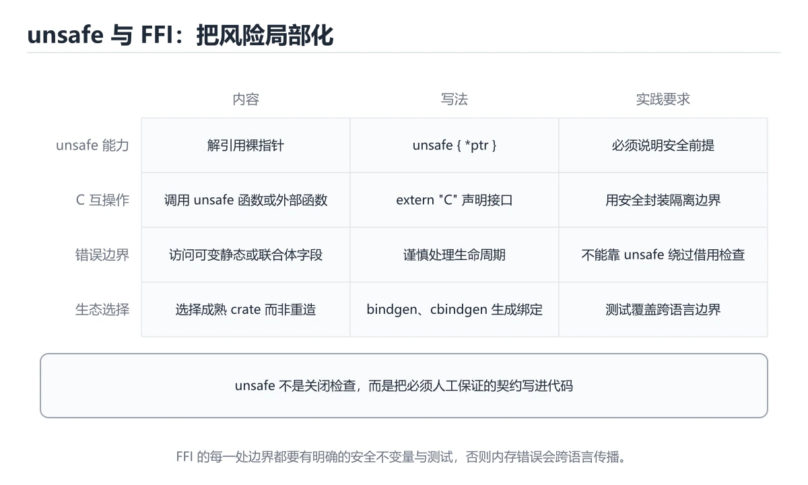
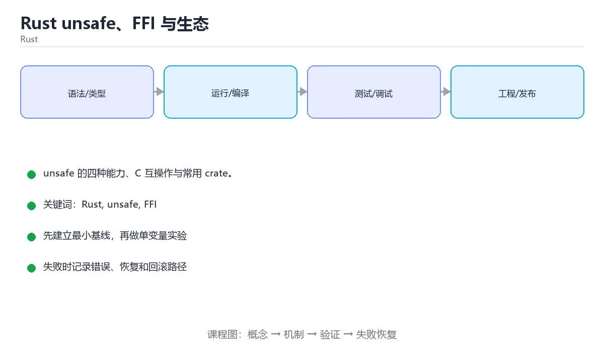

# Rust unsafe、FFI 与生态

> 内容更新时间：2026-10-06 · 学习阶段：进阶 · 预计用时：35 分钟





## 学习目标

- 能用自己的话解释Rust unsafe、FFI 与生态解决了什么问题，而不是只背术语。
- 能说清 「Rust」、「unsafe」、「FFI」、「serde」 之间的关系，并分别举出一个例子。
- 能把 Rust 放回「Rust unsafe、FFI 与生态」的知识体系，说明它和 unsafe 的边界。
- 能完成本课练习，并用验收标准检查自己的结果。

> 一句话摘要：unsafe 的四种能力、C 互操作与常用 crate。

## 前置知识

- 先完成上一课《Rust 错误处理、迭代器与异步》；如果已经掌握，可以直接用本课练习自测。
- 本课阶段：进阶。建议先完成「Rust 错误处理、迭代器与异步」，或确认自己能独立跑通正文里的 read_config_checked 示例。
- 开始前先复习：Rust、unsafe、FFI。
- 卡在 Rust 上时不要跳过：把输入、预期和实际输出写成三行，再回头读正文。

## unsafe 能做什么

`unsafe` 只解锁四件能力：解引用裸指针、调用 unsafe 函数、访问/修改可变静态变量、实现 unsafe trait。它**不关闭借用检查器的其余规则**，而是把责任交给程序员：必须写 `// SAFETY:` 注释说明前置条件。

原则：把 unsafe 封装在最小范围内，对外暴露安全 API，并用测试与 Miri 验证。

## FFI：与 C 互操作

| 场景 | 做法 |
| --- | --- |
| 调用 C 库 | `extern "C" { fn foo(x: c_int) -> c_int; }` + `#[link(name="foo")]` |
| 导出给 C 用 | `#[no_mangle] pub extern "C" fn bar(...)` |
| 自动生成绑定 | bindgen（C 头文件 → Rust 声明） |
| C++ 互操作 | cxx / autocxx 提供更安全的桥接 |

注意：跨 FFI 边界的字符串与结构体布局必须显式约定（CString、repr(C)），panic 不能跨边界传播（用 catch_unwind 兜住）。

## 常用 crate 生态

| 领域 | 常用 crate |
| --- | --- |
| 序列化 | serde / serde_json |
| 异步运行时 | tokio |
| HTTP 客户端 | reqwest |
| Web 框架 | axum / actix-web |
| 命令行 | clap |
| 错误处理 | thiserror / anyhow |
| 日志与追踪 | tracing / tracing-subscriber |
| 时间 | chrono / time |

Cargo 的 feature 机制能裁剪依赖体积，发布前用 `cargo tree` 检查依赖膨胀。

## 何时该用 unsafe

只有三种情况值得：与 C 互操作、实现底层数据结构（自定义分配器、无锁结构）、性能极致优化且已被基准证明。其余场景用安全抽象替代，收益远大于风险。

## 本课小结

unsafe 是**把编译器无法验证的契约写进注释与封装**；FFI 是 Rust 融入现有生态的桥梁；日常开发优先使用成熟 crate，把 unsafe 留在边界层。

## unsafe 能力与边界速查

| unsafe 允许做的事 | 说明 |
| --- | --- |
| 解引用裸指针 | `*const T` / `*mut T` |
| 调用 unsafe 函数 | 包括外部 C 函数 |
| 访问可变静态变量 | `static mut` |
| 实现 unsafe trait | 如 `Send` / `Sync` |
| 访问联合体字段 | `union` |
| 内联汇编 | `asm!` |

unsafe **不会**改变的事：

| 仍然受检查 | 说明 |
| --- | --- |
| 借用规则 | unsafe 块内依然有借用检查 |
| 类型检查 | 类型错误照样编译失败 |
| 生命周期 | 悬空引用仍需自行保证正确 |
| 越界检查 | 切片索引仍会 panic（除非用裸指针） |

```rust
use std::os::raw::c_char;

// 与 C 交互：结构体使用 C 布局
#[repr(C)]
pub struct Config {
    pub id: u32,
    pub name: *const c_char,
}

extern "C" {
    fn read_config(out: *mut Config) -> i32;
}

/// # Safety
/// 调用者必须保证 `out` 指向可写且对齐的 `Config`，
/// 并且在函数返回前保持有效。
pub unsafe fn read_config_checked() -> Result<Config, i32> {
    let mut config = Config { id: 0, name: std::ptr::null() };
    let code = unsafe { read_config(&mut config) };
    if code == 0 { Ok(config) } else { Err(code) }
}
```

## FFI 注意点速查

| 主题 | 要求 |
| --- | --- |
| 结构体布局 | 必须 `#[repr(C)]` |
| 字符串 | C 使用 NUL 结尾，用 `CString` / `CStr` 转换 |
| 内存所有权 | 明确谁分配、谁释放，禁止跨语言混用分配器 |
| panic 跨界 | 禁止 panic 穿过 FFI 边界，用 `catch_unwind` 包裹 |
| 错误传递 | 用返回码 + 输出参数，或 `thread_local` 存最后错误 |
| 空指针 | C 指针可能为 null，传给 Rust 引用前必须检查 |
| 文档 | `unsafe fn` 必须写 `# Safety` 说明前置条件 |

## 常见错误与排查

| 容易写错的做法 | 实际现象 | 原因与正确做法 |
| --- | --- | --- |
| 用 unsafe 当成「关闭检查」 | 仍然报借用或类型错误 | unsafe 只解锁特定能力 |
| `unsafe fn` 不写安全说明 | 调用者不知道前置条件 | 补 `# Safety` 文档 |
| 把 C 指针直接转 `&T` 不判空 | 未定义行为 | 先 `is_null()` 检查 |
| 结构体没有 `#[repr(C)]` | 字段顺序不一致，读取错乱 | 加 `#[repr(C)]` |
| 跨 FFI 抛 panic | 未定义行为或进程崩溃 | `catch_unwind` 兜住并转成错误码 |
| 用 Rust 的分配器释放 C 内存 | 堆损坏 | 由分配方提供释放函数 |
| 假设指针一定是 UTF-8 | 非法字符导致未定义行为 | 用 `CStr::to_str()` 检查返回 `Result` |
| 直接 `unsafe impl Send` | 数据竞争 | 只有充分验证后才实现并写明理由 |
| 为性能滥用 unsafe | 逻辑错误难以定位 | 先测量，确认瓶颈再优化 |
| 缺少 Miri / sanitizer 验证 | 隐藏的内存错误 | 用 Miri、ASan 验证 unsafe 代码 |

## 复习与自测

- [ ] 清楚 unsafe 解锁与不解锁的能力边界。
- [ ] 所有 `unsafe fn` 都有 `# Safety` 文档。
- [ ] FFI 结构体使用 `#[repr(C)]`，指针使用前判空。
- [ ] panic 不穿越 FFI 边界。
- [ ] unsafe 代码用 Miri 或 sanitizer 验证。

## 零基础详解：unsafe 与 FFI

### 一句话说清它是什么

`unsafe` 不是「关掉安全检查」，而是「**你向编译器承诺：这块代码由我来保证安全**」。
它只解锁五种额外能力，其余规则照旧；FFI 则是用它调用 C 语言写的库。

### 用生活比喻理解

| 概念 | 比喻 | 说明 |
| --- | --- | --- |
| 安全 Rust | 有护栏的高速路 | 编译器帮你把关 |
| `unsafe` | 拆掉护栏的路段 | 更快或能到别处，但要自己小心 |
| 安全抽象 | 给护栏外再修一段护栏 | 把 unsafe 关在小函数里 |
| FFI | 与外国团队对接 | 需要统一接口约定（ABI） |
| `unsafe` 块 | 临时许可 | 只在这一小块生效 |

### unsafe 解锁的五种能力

```rust
// 1. 解引用裸指针
let x = 42;
let p: *const i32 = &x;
let value = unsafe { *p };

// 2. 调用 unsafe 函数
unsafe fn dangerous() {}
unsafe { dangerous() }

// 3. 访问或修改可变静态变量
static mut COUNTER: u32 = 0;
unsafe { COUNTER += 1 }

// 4. 实现 unsafe trait
unsafe trait Marker {}
unsafe impl Marker for MyType {}

// 5. 访问 union 的字段
union U { a: u32, b: f32 }
let u = U { a: 1 };
let f = unsafe { u.b };
```

**记住：`unsafe` 只解锁这五件事，它不会让所有权与借用检查消失。**

### 正确姿势：把 unsafe 关进小盒子

```rust
pub struct SafeBuffer {
    ptr: *mut u8,
    len: usize,
}

impl SafeBuffer {
    /// 对外暴露安全接口：任何输入都不会造成未定义行为
    pub fn get(&self, index: usize) -> Option<u8> {
        if index >= self.len || self.ptr.is_null() {
            return None;
        }
        // SAFETY: 上面已检查索引范围与指针非空
        Some(unsafe { *self.ptr.add(index) })
    }
}
```

**API 设计规则**：`unsafe` 只能出现在函数体内；对外暴露的函数应当是安全的。

### FFI：调用 C 函数

```rust
use std::ffi::{CStr, CString};
use std::os::raw::c_char;

// 1. 声明外部函数签名（必须与 C 完全一致）
extern "C" {
    fn strlen(s: *const c_char) -> usize;
}

// 2. 安全包装：把裸指针的复杂度留在内部
pub fn str_len(text: &str) -> usize {
    let c_string = CString::new(text).expect("字符串不能包含空字节");
    // SAFETY: c_string 在本函数内一直存活，指针有效
    unsafe { strlen(c_string.as_ptr()) }
}
```

| 类型对照 | Rust | C |
| --- | --- | --- |
| 整数 | `i32` / `u64` | `int32_t` / `uint64_t` |
| 字符 | `c_char` | `char` |
| 字符串 | `CString` / `CStr` | `char*` |
| 数组 | `*mut T` 加长度 | `T*` 加 `size_t` |
| 结构体 | `#[repr(C)] struct` | `struct` |

```rust
#[repr(C)]                 // 必须加，否则字段布局不确定
pub struct Point {
    pub x: f64,
    pub y: f64,
}
```

### 导出给 C 调用

```rust
#[no_mangle]
pub extern "C" fn add(a: i32, b: i32) -> i32 {
    a + b
}

// 必须提供配套的释放函数，否则调用方会内存泄漏
#[no_mangle]
pub extern "C" fn make_string() -> *mut c_char {
    CString::new("hello").unwrap().into_raw()
}

#[no_mangle]
pub extern "C" fn free_string(ptr: *mut c_char) {
    if !ptr.is_null() {
        // SAFETY: 指针来自本库的 CString::into_raw
        drop(unsafe { CString::from_raw(ptr) });
    }
}
```

**谁分配谁释放**：跨语言传递所有权时，必须成对提供释放函数。

### unsafe 代码检查清单

| 检查项 | 问题 |
| --- | --- |
| 指针是否可能为空 | 空指针解引用是未定义行为 |
| 指针是否仍然有效 | 悬垂指针是未定义行为 |
| 是否有别名冲突 | 同时存在 `&mut` 与 `&` 是未定义行为 |
| 索引是否越界 | 越界读写是未定义行为 |
| 对齐是否正确 | 未对齐访问是未定义行为 |
| 生命周期是否足够 | 数据在引用前被释放是未定义行为 |
| 是否跨线程共享 | 违反 `Send` 与 `Sync` 是未定义行为 |
| 释放是否成对 | 双重释放或泄漏 |

### 用工具兜底

```bash
cargo miri test          # 检测未定义行为（需要 nightly）
cargo clippy -- -D warnings
cargo test --release
```

### 新手最容易踩的八个坑

| 坑 | 现象 | 正确做法 |
| --- | --- | --- |
| 用 unsafe 图省事 | 埋下未定义行为 | 先想能不能用安全写法 |
| unsafe 范围太大 | 难以审查 | 缩小到最小语句 |
| 忘记 `#[repr(C)]` | 结构体布局不匹配 | FFI 结构体必须加 |
| 字符串含空字节 | `CString::new` 失败 | 提前校验或替换 |
| 忘了释放跨语言内存 | 内存泄漏 | 成对提供 free 函数 |
| 假设 C 指针一定非空 | 段错误 | 先判空 |
| 在 unsafe 里忽略错误码 | 静默出错 | 检查返回值并转成 `Result` |
| 没跑 Miri | 未定义行为逃过测试 | CI 里加 `cargo miri` |

### 手把手练习：用 FFI 调用 libc 获取时间

```rust
use std::mem::MaybeUninit;
use std::os::raw::c_long;

#[repr(C)]
struct CTimespec {
    tv_sec: c_long,
    tv_nsec: c_long,
}

extern "C" {
    fn clock_gettime(clk_id: i32, tp: *mut CTimespec) -> i32;
}

const CLOCK_REALTIME: i32 = 0;

pub fn now_seconds() -> Result<i64, String> {
    let mut ts = MaybeUninit::<CTimespec>::uninit();
    // SAFETY: 传入的指针指向本地有效内存，函数会写满该结构体
    let rc = unsafe { clock_gettime(CLOCK_REALTIME, ts.as_mut_ptr()) };
    if rc != 0 {
        return Err("clock_gettime 调用失败".into());
    }
    // SAFETY: 上面已确认调用成功，结构体已初始化
    let ts = unsafe { ts.assume_init() };
    Ok(ts.tv_sec as i64)
}
```

### 学完自测

- [ ] 能说出 unsafe 解锁的五种能力。
- [ ] 知道为什么要把 unsafe 关在小函数里。
- [ ] 能说出 FFI 结构体为什么必须加 `#[repr(C)]`。
- [ ] 知道跨语言内存的释放原则。
- [ ] 能列出 unsafe 检查清单中的至少四项。

## 动手练习

> 本课练习重点：围绕「Rust、unsafe、FFI」完成复述、实验和交付，每个结果都要能被别人检查。

写一个只做一件事的小程序：输入 Rust，输出 unsafe，其余全部省略。

### 练习 1：建立心智模型（10 分钟）

合上教程，用 3～5 句话回答：

1. Rust unsafe、FFI 与生态解决了什么问题？
2. 如果没有它，会出现什么具体后果？
3. 它和「unsafe」是什么关系？

验收标准：回答里必须出现 Rust，并写出一个让结论失效的边界条件。

### 练习 2：做一次可控实验（20 分钟）

从正文中选一个最小示例，完成以下操作：

1. 先预测修改一个参数、输入或步骤后的结果。
2. 再实际执行或逐步推演，记录真实结果。
3. 如果结果与预测不同，写出差异原因。

**验收标准**：围绕「unsafe 能做什么」小节做一次五步记录，原例取自 read_config_checked，改动只允许动一处Rust，原因要能指回正文的判断依据。

### 练习 3：交付一个小结果（30 分钟）

写一个只做一件事的小程序：输入 Rust，输出 unsafe，其余全部省略。

任务要求：

- 结果必须能被别人检查，不能只写“我已经理解了”。
- 至少覆盖「Rust」和「unsafe」两个关键词。
- 写出 1 个仍然不确定的问题，以及下一步如何验证。

> 提示：时间有限时优先做练习 1 和练习 2；练习 3 可以拆成两次完成。

## 可运行练习

### 任务 1：先跑通，再解释

```bash
cargo miri test          # 检测未定义行为（需要 nightly）
cargo clippy -- -D warnings
cargo test --release
```

### 任务 2：只改一个条件

把「Rust unsafe、FFI 与生态」的最小示例复制一份，只改一个条件再跑一次：

- 改动点：把 unsafe 换成边界值，其他输入保持原样。
- 预测：先写下「Rust unsafe、FFI 与生态」在改动后的输出或错误信息，再运行。
- 记录：对照改动前后的结果，指出差异出在哪一步。
- 验收：换回原条件能复现原结果，改动只影响Rust。

### 任务 3：迁移到自己的数据

用同一套思路处理一组你自己的 Rust 数据，保持输出格式与任务 1 一致。

## 故障现场

### 现场 1：用 unsafe 当成「关闭检查」

**症状**：在《Rust unsafe、FFI 与生态》的复现场景中，仍然报借用或类型错误。

**根因**：当出现“用 unsafe 当成「关闭检查」”时，执行路径已经绕过了《Rust unsafe、FFI 与生态》的关键约束，最终以“仍然报借用或类型错误”暴露出来；修复前必须先确认约束在哪里失效。

**修复**：针对《Rust unsafe、FFI 与生态》的问题，unsafe 只解锁特定能力。

**验证**：在《Rust unsafe、FFI 与生态》中按“unsafe 只解锁特定能力”调整后，从“用 unsafe 当成「关闭检查」”的触发条件重放同一条路径，确认“仍然报借用或类型错误”不再出现，并补一个相邻边界用例检查没有引入新问题。

### 现场 2：unsafe fn 不写安全说明

**症状**：在《Rust unsafe、FFI 与生态》的复现场景中，调用者不知道前置条件。

**根因**：触发点是把“unsafe fn 不写安全说明”当成安全做法。它没有满足《Rust unsafe、FFI 与生态》要求的前提，因此先表现为“调用者不知道前置条件”；排查时先完整复现这一段，再核对输入、配置与依赖。

**修复**：针对《Rust unsafe、FFI 与生态》的问题，补 # Safety 文档。

**验证**：在《Rust unsafe、FFI 与生态》中按“补 # Safety 文档”调整后，从“unsafe fn 不写安全说明”的触发条件重放同一条路径，确认“调用者不知道前置条件”不再出现，并补一个相邻边界用例检查没有引入新问题。

### 现场 3：结构体没有 #[repr(C)]

**症状**：在《Rust unsafe、FFI 与生态》的复现场景中，字段顺序不一致，读取错乱。

**根因**：当出现“结构体没有 #[repr(C)]”时，执行路径已经绕过了《Rust unsafe、FFI 与生态》的关键约束，最终以“字段顺序不一致，读取错乱”暴露出来；修复前必须先确认约束在哪里失效。

**修复**：针对《Rust unsafe、FFI 与生态》的问题，加 #[repr(C)]。

**验证**：先在《Rust unsafe、FFI 与生态》中记录“结构体没有 #[repr(C)]”留下的失败证据，再执行“加 #[repr(C)]”并重放；确认错误路径变为明确结果，且修复没有掩盖同类故障。

## 版本与时效

- 版本提示：Rust 的行为在最近几个大版本里有过调整，升级「Rust unsafe、FFI 与生态」前先用 read_config_checked 复现当前输出，再对照官方发布说明逐条核对。
- 异步运行时与借用检查规则的变化会影响 Rust，要在 CI 中提前暴露。
- 升级前先用 read_config_checked 建立基线：记录版本、命令和输出，升级后只比较这些可观察量。
- 官方发布说明：https://blog.rust-lang.org/

### 升级检查清单

- 先固定当前版本，跑通全部示例与测验，再升级工具链。
- 只改 Rust 的版本变量，记录编译、测试与产物体积的变化。
- 先回归 Rust 与 unsafe 的默认行为和错误信息，再扩大测试范围。
- 升级完成后记录 Rust 的新旧版本差异，并据此调整下次复核时间。

## 本课复习清单

离开本课前，逐项确认：

- [ ] 不看解析，能说出「unsafe 解锁的能力不包括？」的判断依据。
- [ ] 不看解析，能说出「跨 FFI 边界时必须注意？」的判断依据。
- [ ] 不看解析，能说出「下面哪种情况值得使用 unsafe？」的判断依据。
- [ ] 不看解析，能说出「#[repr(C)] 在 FFI 场景中的作用是？」的判断依据。
- [ ] 不看解析，能说出「unsafe impl Send for MyType {} 的语义是？」的判断依据。
- [ ] 用 Rust 构造一个正常输入和一个边界输入，分别记录输出与判断依据。
- [ ] 把本课最容易混淆的两个概念写成一句话对照。

| 复盘项 | 记录 |
| --- | --- |
| 已经能独立解释的考点 |  |
| 仍然说不清的概念 |  |
| 下一步验证动作 |  |

## 术语速查

把「Rust unsafe、FFI 与生态」里反复出现的术语集中放在一起。复习时先遮住右列，尝试用自己的话解释，再回到正文核对。

| 术语 | 一句话说明 |
| --- | --- |
| `Rust` | unsafe 是把编译器无法验证的契约写进注释与封装；FFI 是 Rust 融入现有生态的桥梁；日常开发优先使用成熟 crate，把 unsafe 留在边界层。 |
| `serde` | Rust 的序列化与反序列化框架，用派生宏在结构体和 JSON 等格式间转换。 |
| `tokio` | Rust 的异步运行时，提供任务调度、异步 I/O、定时器和同步原语。 |
| `一句话说清它是什么` | unsafe 不是「关掉安全检查」，而是「你向编译器承诺：这块代码由我来保证安全」。 |

## 考点精讲

### 考点 1：概念判断·Rust

- **题目**：unsafe 解锁的能力不包括？
- **判断依据**：在「Rust unsafe、FFI 与生态」里，跳过借用检查的所有规则。unsafe 只解锁四类操作，其余规则仍然生效。在「Rust unsafe、FFI 与生态」里判断这道题，要把Rust、unsafe、FFI的条件、过程与失败路径逐项对齐，换成“unsafe 解锁的能力不包括”这个场景，只有满足前提的结论才成立。

### 考点 2：概念判断·Rust

- **题目**：跨 FFI 边界时必须注意？
- **判断依据**：在「Rust unsafe、FFI 与生态」里，panic 不能跨越边界。布局要用 repr(C)，字符串要用 CString 等明确表示。「Rust unsafe、FFI 与生态」要求先交代Rust、unsafe、FFI的前提再下结论，所以“panic 不能跨越边界”只在题干“跨 FFI 边界时必须注意”给定的条件下成立。

### 考点 3：多选辨析·Rust

- **题目**：围绕“Rust unsafe、FFI 与生态”中的 Rust、unsafe、FFI，下列哪两项是本课强调的实践判断？
- **判断依据**：在「Rust unsafe、FFI 与生态」里，学习 Rust 时要同时说明输入、输出和失败路径，不能只看正常流程。在Rust unsafe、FFI 与生态里，判断 unsafe 时要固定版本与边界输入，所以“验证 unsafe 时要固定版本并覆盖边界输入，结论才可复现”才可复现。

### 考点 4：概念判断·Rust

- **题目**：#[repr(C)] 在 FFI 场景中的作用是？
- **判断依据**：在「Rust unsafe、FFI 与生态」里，结论应落在「让结构体使用 C 的内存布局」。Rust 默认布局不保证字段顺序，跨语言传递结构体必须显式声明 C 布局。在「Rust unsafe、FFI 与生态」里，这道题要求区分概念与边界，「让结构体使用 C 的内存布局」只有在题干给出的前提下才成立，而「让结构体自动实现 Copy」、「禁止结构体被复制」缺少同一组条件。

### 考点 5：代码补全·Rust

- **题目**：这段 Rust 代码是「Rust unsafe、FFI 与生态」的示例片段，下面哪一项描述与它一致？
- **判断依据**：在「Rust unsafe、FFI 与生态」里，这段代码把主要逻辑封装在函数或方法里，需要被调用才会执行。这段代码出自「Rust unsafe、FFI 与生态」的正文示例，围绕Rust、unsafe、FFI展开；把输入或边界换成空值、极值或失败情况后，结论要以「Rust unsafe、FFI 与生态」的实际运行结果为准。

### 考点 6：填空·Rust

- **题目**：补全代码：「Rust unsafe、FFI 与生态」示例中，下面这行代码缺少哪个关键字或函数名？请填入 ____。 `if index >= self.len || self.ptr.____ {`
- **判断依据**：空格应填写「is_null」。这道题的关键在「Rust unsafe、FFI 与生态」的Rust、unsafe、FFI：先确认题干“补全代码”问的是哪一步，再排除偷换前提的选项。把“isnull”代回「Rust unsafe、FFI 与生态」里“Rust unsafe、FFI 与生态示例中”的例子核对，条件一旦改变，结论就要用Rust、unsafe、FFI重新推导。

## English Overview

**Title:** unsafe, FFI & Ecosystem

**Summary:** unsafe capabilities, FFI and key crates.

**Category:** Rust
**Level:** 进阶
**Key terms:** Rust, unsafe, FFI, serde, tokio

## 内容元数据

- 内容版本：v2.0
- 最后更新：2026-10-06
- 学习阶段：进阶
- 适用环境：Rust 1.85+ / Cargo；本课聚焦 Rust。
- 内容来源：内置结构化课程与工程实践整理
- 相关主题：Rust、unsafe、FFI、serde、tokio
- 质量版本：P0 测验标准 + P1 覆盖扩展 + P2 体验补全

## 参考资料与复核

- 最后复核：2026-10-04
- 下次复核：2027-06-24
- 复核范围：版本兼容、API 行为、安全建议与工程实践
- 来源性质：官方文档、标准或权威教材；正文为离线教学重组

| 参考资料 | 本课用途 |
| --- | --- |
| [Rustonomicon](https://doc.rust-lang.org/nomicon/) | unsafe 与内存布局 |
| [Tokio 文档](https://tokio.rs/tokio/tutorial) | 异步运行时与任务 |
| [Rust 标准库](https://doc.rust-lang.org/std/) | 标准库 API 与容器 |

> 「Rust unsafe、FFI 与生态」的链接用于离线阅读后的延伸核对；App 不会自动联网。
