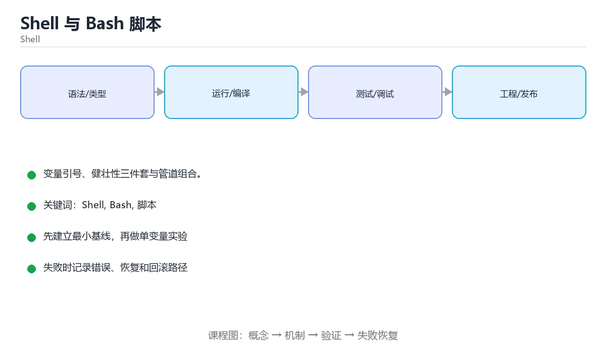

# Shell 与 Bash 脚本



> 内容更新时间：2026-10-03 · 学习阶段：基础 · 预计用时：14 分钟

## 学习目标

- 能用自己的话解释「Shell 与 Bash 脚本」解决了什么问题，而不是只背术语。
- 能说清 「Shell」、「Bash」、「脚本」、「管道」 之间的关系，并分别举出一个例子。
- 能把本课知识放回「Shell」的知识体系，说明它和相邻主题的边界。
- 能完成本课练习，并用验收标准检查自己的结果。

> 一句话摘要：变量引号、健壮性三件套与管道组合。

## 前置知识

- 会进行基本的文件、命令行或浏览器操作；遇到不熟悉的术语先查本课关键词。
- 本课阶段：基础。建议会读写简单代码或命令，并理解变量、输入输出等基本概念。
- 开始前先复习：Shell、Bash、脚本。
- 如果某一步看不懂，先记录具体卡点，完成练习后再回头读一遍。


## 为什么还要学 Shell

构建、部署、日志处理与自动化几乎都发生在命令行。Shell 是**最通用的胶水语言**：能把小工具组合成流水线，而且是所有 Linux 环境的默认存在。

## 基本构成

| 元素 | 说明 |
| --- | --- |
| 变量 | `name=value`（等号两侧不能有空格），使用 `$name` 或 `${name}` |
| 引号 | 双引号允许变量展开，单引号原样输出；含空格路径务必加引号 |
| 退出码 | 0 表示成功，非 0 表示失败，`$?` 读取上一条命令的结果 |
| 条件 | `if [ -f "$file" ]; then ... fi`，`[[ ]]` 是 Bash 的增强写法 |
| 循环 | `for f in *.log; do ...; done`，`while read -r line; do ...; done` |
| 函数 | `name() { ... }`，用 `$1 $2` 取参数，`$@` 取全部参数 |

## 必须掌握的健壮性设置

脚本开头常用的三件套：`set -e`（出错即退出）、`set -u`（使用未定义变量报错）、`set -o pipefail`（管道中任一命令失败即视为失败）。再加 `IFS=$'\n\t'` 让遍历更安全。没有这些设置，脚本会在错误后继续执行，造成难以排查的问题。

## 管道与文本处理

Shell 的精髓是组合：`grep` 过滤、`sed` 替换、`awk` 按列处理、`sort`/`uniq` 排序去重、`cut` 取列、`xargs` 批量执行、`find` 定位文件。处理大文件时用流式管道，避免全部读入内存。

## 安全与可移植性

1. 变量与路径一律加引号，防止空格与通配符展开导致误删。
2. 删除前先打印目标：`rm -rf -- "$dir"`，并对变量做非空校验。
3. 用 `command -v` 检查依赖是否安装。
4. `#!/usr/bin/env bash` 比 `#!/bin/sh` 更可移植到不同发行版。
5. 涉及复杂逻辑（JSON 解析、并发、错误重试）时优先改用 Python，别硬写 Bash。

## 常见用途

本地开发脚本（一键启动、清理缓存）、CI 步骤、日志分析（统计错误码 Top10）、批量重命名与备份、容器入口脚本（entrypoint）。

## 本课小结
Shell 的目标是**快速可靠地组合现有工具**。记住三件套 + 处处加引号，能避开 80% 的脚本事故；复杂需求果断换语言。


## Bash 语法速查

| 场景 | 写法 | 说明 |
| --- | --- | --- |
| 变量赋值 | `name="tom"` | 等号两侧不能有空格 |
| 引用变量 | `"$name"` | 双引号保留空格，避免分词 |
| 默认值 | `${name:-默认}` | 未设置或为空时使用默认值 |
| 必填校验 | `${name:?请设置 name}` | 未设置直接报错退出 |
| 长度 | `${#name}` | 字符串长度 |
| 截取 | `${name:0:3}` | 子串 |
| 替换 | `${path//a/b}` | 全部替换 |
| 命令结果 | `now=$(date +%F)` | `$()` 优于反引号 |
| 算术 | `$((a + b))` | 整数运算 |
| 条件 | `if [[ -f "$file" ]]; then ... fi` | 推荐 `[[ ]]` |
| 文件判断 | `-f` 文件、`-d` 目录、`-x` 可执行、`-s` 非空 | 常用测试符 |
| 循环 | `for f in *.log; do ... done` | 注意通配符与空格 |
| 逐行读文件 | `while IFS= read -r line; do ... done < file` | `-r` 保留反斜杠 |
| 数组 | `arr=(a b c)`、`"${arr[@]}"` | 必须加引号展开 |
| 参数数组 | `"$@"` | 转发参数的正确形式 |
| 函数 | `f() { local x="$1"; }` | 用 `local` 限制作用域 |
| 返回值 | `return 0/1` + `echo` 输出数据 | 状态码与数据分开 |
| 严格模式 | `set -euo pipefail` | 出错即退、未定义变量报错、管道失败可见 |

## 常用工具速查

| 目的 | 命令 |
| --- | --- |
| 过滤行 | `grep -n`、`grep -v`、`grep -c` |
| 取列 | `awk '{print $1, $3}'` |
| 替换 | `sed 's/old/new/g'` |
| 排序去重 | `sort \| uniq -c` |
| 统计行数 | `wc -l` |
| 查看磁盘 | `df -h`、`du -sh *` |
| 查看进程 | `ps aux \| grep app`、`pgrep -af app` |
| 查看端口 | `ss -tlnp` |
| 查看日志尾部 | `tail -f app.log` |
| 定时任务 | `crontab -e`、`systemctl list-timers` |
| 网络请求 | `curl -fsSL`、`curl -o file url` |
| 打包 | `tar -czf a.tgz dir/` |
| 校验 | `sha256sum file` |

## 常见错误对照表

| 容易写错的做法 | 实际现象 | 原因与正确做法 |
| --- | --- | --- |
| `name = "tom"` | `command not found: name` | 赋值不能有空格：`name="tom"` |
| `$file` 不加引号 | 文件名带空格时被拆成多个参数 | 一律写 `"$file"` |
| 用反引号嵌套命令 | 转义复杂、易出错 | 用 `$(...)` |
| `for f in $(ls)` | 空格与换行导致错乱 | 用通配符 `for f in *` 或 `find -print0` |
| 忘了 `set -u` | 变量名打错却静默为空 | 加 `set -euo pipefail` |
| `cd` 失败后继续执行 | 后续命令在错误目录运行 | `cd "$dir" \|\| exit 1` |
| `rm -rf "$dir/"` 且 `dir` 为空 | 误删根目录 | 校验变量非空：`[[ -n "$dir" ]] \|\| exit 1` |
| 用 `echo` 输出带转义内容 | 不同 shell 行为不一致 | 用 `printf '%s\n' "$var"` |
| 临时文件用固定名 | 并发执行互相覆盖 | 用 `mktemp` 并配 `trap` 清理 |
| 管道中失败被忽略 | 前半段失败却继续 | 加 `set -o pipefail` |
| 数字比较用 `[[ $a > $b ]]` | 按字符串比较出错 | 用 `(( a > b ))` 或 `-gt` |
| `cron` 里用相对路径 | 命令找不到 | 用绝对路径并显式设置 PATH |

## 自测清单

- [ ] 脚本开头写 `#!/usr/bin/env bash` 与 `set -euo pipefail`。
- [ ] 所有变量展开都加双引号。
- [ ] 用 `mktemp` 与 `trap` 管理临时资源。
- [ ] 删除前校验目标非空，避免误删。
- [ ] `cron` 任务使用绝对路径并记录日志。


## 零基础详解：Shell 脚本是「把命令写成文件」

### 一句话说清它是什么

Shell 脚本就是**把你在终端里一条条敲的命令，按顺序写进文件**。
它的强项是编排已有工具；弱项是复杂数据结构与运算。

### 用生活比喻理解

| 概念 | 比喻 | 说明 |
| --- | --- | --- |
| shebang | 说明书第一行 | 告诉系统用哪个解释器 |
| 变量 | 便利贴 | 存个值，后面引用 |
| 引号 | 包装方式 | 决定是否展开变量与通配符 |
| 退出码 | 交接单 | 0 表示成功，非 0 表示失败 |
| 管道 | 流水线 | 上一步的输出交给下一步 |

### 逐行拆解第一个脚本

```bash
#!/usr/bin/env bash
set -euo pipefail                 # 健壮性三件套

readonly NAME="${1:-朋友}"         # 取第一个参数，没给就用默认值

echo "你好，${NAME}！"
echo "当前目录：$(pwd)"
```

| 行 | 说明 |
| --- | --- |
| `#!/usr/bin/env bash` | 用 PATH 里的 bash 执行，比 `/bin/bash` 更可移植 |
| `set -e` | 命令失败立刻退出，不带着错误继续跑 |
| `set -u` | 用到未定义变量时报错 |
| `set -o pipefail` | 管道中任一环失败，整体就算失败 |
| `${1:-朋友}` | 参数默认值写法，比 `if` 更简洁 |
| `$(pwd)` | 命令替换，把命令输出嵌入字符串 |

### 引号：三种写法的区别

| 写法 | 变量是否展开 | 通配符是否展开 | 使用场景 |
| --- | --- | --- | --- |
| `'单引号'` | 否 | 否 | 原样输出、正则表达式 |
| `"双引号"` | 是 | 否 | **默认选择**，包变量 |
| 不加引号 | 是 | 是 | 基本不用，容易出错 |

```bash
name="小明"
echo '$name'      # 输出 $name
echo "$name"      # 输出 小明
echo $name        # 能输出，但遇到空格会拆成多个参数
```

**口诀：变量一律加双引号，除非你非常确定不需要。**

### 变量与参数速查

| 写法 | 含义 |
| --- | --- |
| `name=value` | 赋值，等号两边不能有空格 |
| `"$name"` / `"${name}"` | 引用变量 |
| `"${name:-默认}"` | 为空时用默认值 |
| `"${#name}"` | 字符串长度 |
| `"$1"`、`"$2"` | 第 1、2 个参数 |
| `"$@"` | 全部参数（保留每个参数的边界） |
| `"$#"` | 参数个数 |
| `"$?"` | 上一条命令的退出码 |
| `export NAME=value` | 导出给子进程 |

### 命令执行与判断

```bash
if command -v git >/dev/null 2>&1; then
  echo "已安装 git"
else
  echo "请先安装 git" >&2
  exit 1
fi
```

`>/dev/null 2>&1` 表示把标准输出和标准错误都丢掉，只关心「成功还是失败」。

### 新手最容易踩的八个坑

| 坑 | 现象 | 正确做法 |
| --- | --- | --- |
| 赋值时加空格 | `name: command not found` | `name=value`，等号两边不留空格 |
| 变量不加引号 | 遇到空格或空值出错 | 统一写 `"$var"` |
| 用 `=` 比较 | 只适合字符串，且要空格 | `[ "$a" = "$b" ]`，注意方括号内侧空格 |
| 数值用 `>` | 被当成重定向 | 用 `-gt`、`-lt`、`-eq` |
| 忘了 `set -e` | 出错还继续跑 | 开头加 `set -euo pipefail` |
| 临时文件不清理 | 残留垃圾 | `trap 'rm -f "$tmp"' EXIT` |
| 用 `ls \| xargs rm` | 文件名带空格就出事 | `find ... -print0 \| xargs -0` |
| 脚本没有执行权限 | `Permission denied` | `chmod +x script.sh` |

### 手把手练习：带参数与校验的备份脚本

```bash
#!/usr/bin/env bash
set -euo pipefail

readonly SRC="${1:-}"
readonly DEST="${2:-./backup}"

if [[ -z "$SRC" ]]; then
  echo "用法：$0 <源目录> [目标目录]" >&2
  exit 1
fi

if [[ ! -d "$SRC" ]]; then
  echo "源目录不存在：$SRC" >&2
  exit 1
fi

mkdir -p "$DEST"
readonly STAMP="$(date +%Y%m%d-%H%M%S)"
readonly ARCHIVE="$DEST/backup-$STAMP.tar.gz"

tar -czf "$ARCHIVE" -C "$(dirname "$SRC")" "$(basename "$SRC")"
echo "备份完成：$ARCHIVE"
```

### 学完自测

- [ ] 能说出 `set -euo pipefail` 每一项的作用。
- [ ] 能解释单引号与双引号的区别。
- [ ] 知道 `${1:-默认值}` 的含义。
- [ ] 能说出 `$?`、`$#`、`"$@"` 分别表示什么。
- [ ] 能在脚本里用 `trap` 清理临时文件。

## 动手练习


> 本课练习重点：围绕「Shell、Bash、脚本」完成复述、实验和交付，每个结果都要能被别人检查。

先加严格模式，再在临时目录验证成功与失败路径，最后补回滚。

### 练习 1：建立心智模型（10 分钟）

合上教程，用 3～5 句话回答：

1. 「Shell 与 Bash 脚本」解决了什么问题？
2. 如果没有它，会出现什么具体后果？
3. 它和「Bash」是什么关系？

**验收标准**：至少出现一个本课关键词，并写出一个反例、边界条件或失效场景。

### 练习 2：做一次可控实验（20 分钟）

从正文中选一个最小示例，完成以下操作：

1. 先预测修改一个参数、输入或步骤后的结果。
2. 再实际执行或逐步推演，记录真实结果。
3. 如果结果与预测不同，写出差异原因。

**验收标准**：留下「原例 → 改动 → 预测 → 结果 → 原因」五步记录。

### 练习 3：交付一个小结果（30 分钟）

写一个带 `set -euo pipefail` 的脚本，并用临时目录验证成功与失败路径。

任务要求：

- 结果必须能被别人检查，不能只写“我已经理解了”。
- 至少覆盖「Shell」和「Bash」两个关键词。
- 写出 1 个仍然不确定的问题，以及下一步如何验证。

> 提示：时间有限时优先做练习 1 和练习 2；练习 3 可以拆成两次完成。


## 考点精讲：把测验题还原成判断过程

本课有 6 个判断点。先自己作答，再看「判断依据」；如果结论正确但理由不完整，回到正文对应章节补足概念。

### 考点 1：脚本开头 set -e 的作用是？

- **正确判断**：命令失败时立即退出
- **判断依据**：正确答案是「命令失败时立即退出」，本课在「必须掌握的健壮性设置」中说明：脚本开头常用的三件套：set -e（出错即退出）、set -u（使用未定义变量报错）、set -o pipefail（管道中任一命令失败即视为失败）。配合 set -u 与 pipefail 构成健壮性三件套。本课还在「零基础详解：Shell 脚本是「把命令写成文件」」中说明：能说出 set -euo pipefail 每一项的作用。
- **迁移检查**：把题干里的一个条件换成边界值，原来的结论还成立吗？写出判断过程。

### 考点 2：单引号与双引号的关键区别是？

- **正确判断**：单引号不展开变量，双引号会展开
- **判断依据**：正确答案是「单引号不展开变量，双引号会展开」，本课在「零基础详解：Shell 脚本是「把命令写成文件」」中说明：口诀：变量一律加双引号，除非你非常确定不需要。需要变量展开用双引号，需要原样输出用单引号。本课还在「安全与可移植性」中说明：变量与路径一律加引号，防止空格与通配符展开导致误删。本课还在「必须掌握的健壮性设置」中说明：脚本开头常用的三件套：set -e（出错即退出）、set -u（使用未定义变量报错）、set -o pipefail（管道中任一命令失败即视为失败）。
- **迁移检查**：把题干里的一个条件换成边界值，原来的结论还成立吗？写出判断过程。

### 考点 3：涉及复杂 JSON 解析与并发时建议？

- **正确判断**：改用 Python 等语言
- **判断依据**：正确答案是「改用 Python 等语言」，本课在「安全与可移植性」中说明：涉及复杂逻辑（JSON 解析、并发、错误重试）时优先改用 Python，别硬写 Bash。Bash 适合胶水与组合工具，复杂逻辑应换语言。本课还在「为什么还要学 Shell」中说明：Shell 是最通用的胶水语言：能把小工具组合成流水线，而且是所有 Linux 环境的默认存在。本课还在「必须掌握的健壮性设置」中说明：没有这些设置，脚本会在错误后继续执行，造成难以排查的问题。
- **迁移检查**：遮住选项，只根据定义复述一次答案，再回来看哪个选项与复述一致。

### 考点 4：#!/usr/bin/env bash 相比 #!/bin/bash 的优势是？

- **正确判断**：通过 PATH 查找 bash
- **判断依据**：正确答案是「通过 PATH 查找 bash」，本课在「安全与可移植性」中说明：#!/usr/bin/env bash 比 #!/bin/sh 更可移植到不同发行版。shebang 决定用哪个解释器执行脚本，可移植脚本推荐用 env 形式。本课还在「为什么还要学 Shell」中说明：构建、部署、日志处理与自动化几乎都发生在命令行。本课还在「常见用途」中说明：本地开发脚本（一键启动、清理缓存）、CI 步骤、日志分析（统计错误码 Top10）、批量重命名与备份、容器入口脚本（entrypoint）。
- **迁移检查**：如果给某个错误选项去掉一个限定词，它会不会变成正确？说明理由。

### 考点 5：source script.sh 与 bash script.sh 的关键区别是？

- **正确判断**：source 在当前 shell 中执行
- **判断依据**：正确答案是「source 在当前 shell 中执行」，本课在「管道与文本处理」中说明：Shell 的精髓是组合：grep 过滤、sed 替换、awk 按列处理、sort/uniq 排序去重、cut 取列、xargs 批量执行、find 定位文件。加载环境变量或函数库用 source，运行独立任务用 bash 更安全。本课还在「管道与文本处理」中说明：处理大文件时用流式管道，避免全部读入内存。本课还在「本课小结」中说明：记住三件套 + 处处加引号，能避开 80% 的脚本事故。
- **迁移检查**：如果给某个错误选项去掉一个限定词，它会不会变成正确？说明理由。

### 考点 6：补全代码：「Shell 与 Bash 脚本」示例中，下面这行代码缺少哪个关键字或函数名？请填入 ____。 `set -euo ____ # 健壮性三件套`

- **正确判断**：pipefail
- **判断依据**：正确答案是「pipefail」，本课在「零基础详解：Shell 脚本是「把命令写成文件」」中说明：能说出 set -euo pipefail 每一项的作用。本课还在「本课小结」中说明：记住三件套 + 处处加引号，能避开 80% 的脚本事故。本课还在「零基础详解：Shell 脚本是「把命令写成文件」」中说明：Shell 脚本就是把你在终端里一条条敲的命令，按顺序写进文件。
- **迁移检查**：如果填成相近的另一个函数或关键字，程序会在哪一步出错？

## 本课复习清单

离开本课前，逐项确认：

- [ ] 不看解析，能说出「脚本开头 set -e 的作用是？」的判断依据。
- [ ] 不看解析，能说出「单引号与双引号的关键区别是？」的判断依据。
- [ ] 不看解析，能说出「涉及复杂 JSON 解析与并发时建议？」的判断依据。
- [ ] 不看解析，能说出「#!/usr/bin/env bash 相比 #!/bin/bash 的优势是？」的判断依据。
- [ ] 不看解析，能说出「source script.sh 与 bash script.sh 的关键区别是…」的判断依据。
- [ ] 不看解析，能说出「补全代码：「Shell 与 Bash 脚本」示例中，下面这行代码缺少哪个关键字或…」的判断依据。
- [ ] 至少运行一次本课示例，记录输入、输出和一个边界情况。
- [ ] 把本课最容易混淆的两个概念写成一句话对照。

| 复盘项 | 记录 |
| --- | --- |
| 已经能独立解释的考点 |  |
| 仍然说不清的概念 |  |
| 下一步验证动作 |  |

## English Overview

**Title:** Shell & Bash

**Summary:** Quoting, strict mode and pipelines.

**Category:** Shell  
**Level:** 基础  
**Key terms:** Shell, Bash, 脚本, 管道, set -e

> The full tutorial is written in Chinese. This bilingual overview helps English readers identify the topic, scope and key terms before studying the detailed examples.

## 内容元数据

- 内容版本：v2.0
- 最后更新：2026-10-03
- 学习阶段：基础
- 适用环境：Bash 5 / POSIX Shell
- 内容来源：内置结构化课程与工程实践整理
- 相关主题：Shell、Bash、脚本、管道、set -e
- 质量版本：P0 测验标准 + P1 覆盖扩展 + P2 体验补全


## Full English Study Guide

### Overview

**Shell & Bash** focuses on Quoting, strict mode and pipelines.

### Learning Outcomes

- Explain what **Shell & Bash** solves and when it should be used.
- Identify inputs, outputs, state and failure boundaries.
- Build a minimal reproducible example and observe the real result.
- Test normal, boundary and failure paths.
- Measure performance, resource cost or security impact before optimizing.
- Document the decision, rollback path and remaining uncertainty.

### Core Mental Model

1. **Problem first:** define the exact problem before choosing a tool or pattern.
2. **Smallest example:** reduce the system to one input and one observable output.
3. **State and flow:** trace how data, control or responsibility moves through the system.
4. **Boundaries:** identify invalid input, resource limits, timeouts and permission edges.
5. **Evidence:** use tests, logs, metrics or reproductions instead of intuition.
6. **Trade-offs:** compare correctness, latency, cost, complexity and operability.

### Step-by-step Study Plan

1. Read the Chinese lesson once and write down the main problem in one sentence.
2. Run the smallest example and save the exact command and output.
3. Change only one input or parameter and predict the result before running it.
4. Introduce one failure and record how the system detects, reports and recovers.
5. Write one test or checklist item for the normal, boundary and failure paths.
6. Complete the quiz and explain every wrong answer in your own words.

### Practice Tasks

- Rebuild the minimal example from an empty directory.
- Add one boundary test and one failure test.
- Produce a short report containing the baseline, change, result and rollback.

### Common Failure Modes

- Treating a happy-path demo as production readiness.
- Skipping boundary values and invalid inputs.
- Optimizing before establishing a measurable baseline.
- Hiding errors, permissions or resource limits.

### Self-check Questions

1. What is the smallest observable result that proves this lesson works?
2. What input or state is most likely to break it?
3. Which metric or test would reveal a regression?
4. What is the rollback path?
5. What is the cost of using this approach at 10x scale?
6. Which adjacent topic is most often confused with this one?

### Glossary

- Topic: **Shell & Bash**
- Related terms: Shell, Bash, 脚本, 管道
- Primary evidence: command output, tests, logs, metrics or reproductions

> This guide is an English study companion for the detailed Chinese lesson. It covers the learning path, mental model and acceptance questions; code examples and engineering details remain in the main tutorial.


## Bilingual Section Outline

| 中文小节 | English section |
| --- | --- |
| 学习目标 | Learning objectives |
| 前置知识 | Prerequisites |
| 为什么还要学 Shell | 为什么还要学 Shell |
| 基本构成 | 基本构成 |
| 必须掌握的健壮性设置 | 必须掌握的健壮性设置 |
| 管道与文本处理 | 管道与文本处理 |
| 安全与可移植性 | Security与可移植性 |
| 常见用途 | 常见用途 |
| 本课小结 | Summary |
| Bash 语法速查 | Bash 语法速查 |

> 该大纲把每个中文小节映射为英文标题，配合 Full English Study Guide 使用。


## 参考资料与复核

- 最后复核：2026-10-04
- 下次复核：2027-04-04
- 复核范围：版本兼容、API 行为、安全建议与工程实践
- 来源性质：官方文档与标准；本课正文为离线教学重组，不复制原文

| 参考资料 | 本课用途 |
| --- | --- |
| [GNU Bash Manual](https://www.gnu.org/software/bash/manual/) | Bash 语法与行为 |
| [POSIX Shell](https://pubs.opengroup.org/onlinepubs/9799919799/) | 可移植 Shell 标准 |

> 本课主题：变量引号、健壮性三件套与管道组合。

> App 完全离线展示文字链接，不会自动联网；需要延伸阅读时可复制链接到浏览器。

