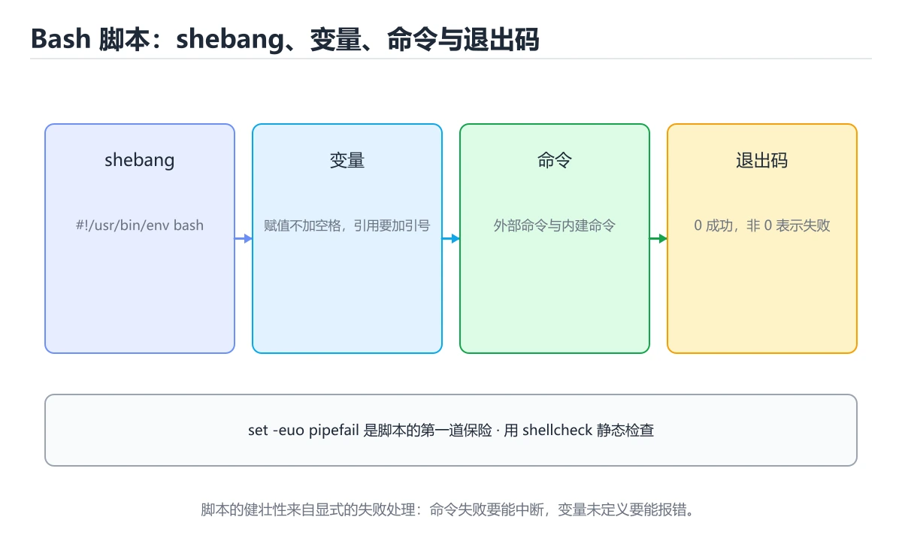

# Shell 与 Bash 脚本




> 内容更新时间：2026-10-06 · 学习阶段：基础 · 预计用时：30 分钟

## 学习目标

- 能用自己的话解释Shell 与 Bash 脚本解决了什么问题，而不是只背术语。
- 能说清 「Shell」、「Bash」、「脚本」、「管道」 之间的关系，并分别举出一个例子。
- 能把本课知识放回「Shell」的知识体系，说明它和相邻主题的边界。
- 能完成本课练习，并用验收标准检查自己的结果。

> 一句话摘要：变量引号、健壮性三件套与管道组合。

## 前置知识

- 会进行基本的文件、命令行或浏览器操作；遇到不熟悉的术语先查本课关键词。
- 本课阶段：基础。建议会读写简单代码或命令，并理解变量、输入输出等基本概念。
- 开始前先复习：Shell、Bash、脚本。
- 如果某一步看不懂，先记录具体卡点，完成练习后再回头读一遍。

## 为什么还要学 Shell

构建、部署、日志处理与自动化几乎都发生在命令行。Shell 是**最通用的胶水语言**：能把小工具组合成流水线，而且是所有 Linux 环境的默认存在。

## 基本构成

| 元素 | 说明 |
| --- | --- |
| 变量 | `name=value`（等号两侧不能有空格），使用 `$name` 或 `${name}` |
| 引号 | 双引号允许变量展开，单引号原样输出；含空格路径务必加引号 |
| 退出码 | 0 表示成功，非 0 表示失败，`$?` 读取上一条命令的结果 |
| 条件 | `if [ -f "$file" ]; then ... fi`，`[[ ]]` 是 Bash 的增强写法 |
| 循环 | `for f in *.log; do ...; done`，`while read -r line; do ...; done` |
| 函数 | `name() { ... }`，用 `$1 $2` 取参数，`$@` 取全部参数 |

## 必须掌握的健壮性设置

脚本开头常用的三件套：`set -e`（出错即退出）、`set -u`（使用未定义变量报错）、`set -o pipefail`（管道中任一命令失败即视为失败）。再加 `IFS=$'\n\t'` 让遍历更安全。没有这些设置，脚本会在错误后继续执行，造成难以排查的问题。

## 管道与文本处理

Shell 的精髓是组合：`grep` 过滤、`sed` 替换、`awk` 按列处理、`sort`/`uniq` 排序去重、`cut` 取列、`xargs` 批量执行、`find` 定位文件。处理大文件时用流式管道，避免全部读入内存。

## 安全与可移植性

1. 变量与路径一律加引号，防止空格与通配符展开导致误删。
2. 删除前先打印目标：`rm -rf -- "$dir"`，并对变量做非空校验。
3. 用 `command -v` 检查依赖是否安装。
4. `#!/usr/bin/env bash` 比 `#!/bin/sh` 更可移植到不同发行版。
5. 涉及复杂逻辑（JSON 解析、并发、错误重试）时优先改用 Python，别硬写 Bash。

## 常见用途

本地开发脚本（一键启动、清理缓存）、CI 步骤、日志分析（统计错误码 Top10）、批量重命名与备份、容器入口脚本（entrypoint）。

## 本课小结
Shell 的目标是**快速可靠地组合现有工具**。记住三件套 + 处处加引号，能避开 80% 的脚本事故；复杂需求果断换语言。

## Bash 语法速查

| 场景 | 写法 | 说明 |
| --- | --- | --- |
| 变量赋值 | `name="tom"` | 等号两侧不能有空格 |
| 引用变量 | `"$name"` | 双引号保留空格，避免分词 |
| 默认值 | `${name:-默认}` | 未设置或为空时使用默认值 |
| 必填校验 | `${name:?请设置 name}` | 未设置直接报错退出 |
| 长度 | `${#name}` | 字符串长度 |
| 截取 | `${name:0:3}` | 子串 |
| 替换 | `${path//a/b}` | 全部替换 |
| 命令结果 | `now=$(date +%F)` | `$()` 优于反引号 |
| 算术 | `$((a + b))` | 整数运算 |
| 条件 | `if [[ -f "$file" ]]; then ... fi` | 推荐 `[[ ]]` |
| 文件判断 | `-f` 文件、`-d` 目录、`-x` 可执行、`-s` 非空 | 常用测试符 |
| 循环 | `for f in *.log; do ... done` | 注意通配符与空格 |
| 逐行读文件 | `while IFS= read -r line; do ... done < file` | `-r` 保留反斜杠 |
| 数组 | `arr=(a b c)`、`"${arr[@]}"` | 必须加引号展开 |
| 参数数组 | `"$@"` | 转发参数的正确形式 |
| 函数 | `f() { local x="$1"; }` | 用 `local` 限制作用域 |
| 返回值 | `return 0/1` + `echo` 输出数据 | 状态码与数据分开 |
| 严格模式 | `set -euo pipefail` | 出错即退、未定义变量报错、管道失败可见 |

## 常用工具速查

| 目的 | 命令 |
| --- | --- |
| 过滤行 | `grep -n`、`grep -v`、`grep -c` |
| 取列 | `awk '{print $1, $3}'` |
| 替换 | `sed 's/old/new/g'` |
| 排序去重 | `sort \| uniq -c` |
| 统计行数 | `wc -l` |
| 查看磁盘 | `df -h`、`du -sh *` |
| 查看进程 | `ps aux \| grep app`、`pgrep -af app` |
| 查看端口 | `ss -tlnp` |
| 查看日志尾部 | `tail -f app.log` |
| 定时任务 | `crontab -e`、`systemctl list-timers` |
| 网络请求 | `curl -fsSL`、`curl -o file url` |
| 打包 | `tar -czf a.tgz dir/` |
| 校验 | `sha256sum file` |

## 常见错误对照表

| 容易写错的做法 | 实际现象 | 原因与正确做法 |
| --- | --- | --- |
| `name = "tom"` | `command not found: name` | 赋值不能有空格：`name="tom"` |
| `$file` 不加引号 | 文件名带空格时被拆成多个参数 | 一律写 `"$file"` |
| 用反引号嵌套命令 | 转义复杂、易出错 | 用 `$(...)` |
| `for f in $(ls)` | 空格与换行导致错乱 | 用通配符 `for f in *` 或 `find -print0` |
| 忘了 `set -u` | 变量名打错却静默为空 | 加 `set -euo pipefail` |
| `cd` 失败后继续执行 | 后续命令在错误目录运行 | `cd "$dir" \|\| exit 1` |
| `rm -rf "$dir/"` 且 `dir` 为空 | 误删根目录 | 校验变量非空：`[[ -n "$dir" ]] \|\| exit 1` |
| 用 `echo` 输出带转义内容 | 不同 shell 行为不一致 | 用 `printf '%s\n' "$var"` |
| 临时文件用固定名 | 并发执行互相覆盖 | 用 `mktemp` 并配 `trap` 清理 |
| 管道中失败被忽略 | 前半段失败却继续 | 加 `set -o pipefail` |
| 数字比较用 `[[ $a > $b ]]` | 按字符串比较出错 | 用 `(( a > b ))` 或 `-gt` |
| `cron` 里用相对路径 | 命令找不到 | 用绝对路径并显式设置 PATH |

## 自测清单

- [ ] 脚本开头写 `#!/usr/bin/env bash` 与 `set -euo pipefail`。
- [ ] 所有变量展开都加双引号。
- [ ] 用 `mktemp` 与 `trap` 管理临时资源。
- [ ] 删除前校验目标非空，避免误删。
- [ ] `cron` 任务使用绝对路径并记录日志。

## 零基础详解：Shell 脚本是「把命令写成文件」

### 一句话说清它是什么

Shell 脚本就是**把你在终端里一条条敲的命令，按顺序写进文件**。
它的强项是编排已有工具；弱项是复杂数据结构与运算。

### 用生活比喻理解

| 概念 | 比喻 | 说明 |
| --- | --- | --- |
| shebang | 说明书第一行 | 告诉系统用哪个解释器 |
| 变量 | 便利贴 | 存个值，后面引用 |
| 引号 | 包装方式 | 决定是否展开变量与通配符 |
| 退出码 | 交接单 | 0 表示成功，非 0 表示失败 |
| 管道 | 流水线 | 上一步的输出交给下一步 |

### 逐行拆解第一个脚本

```bash
#!/usr/bin/env bash
set -euo pipefail                 # 健壮性三件套

readonly NAME="${1:-朋友}"         # 取第一个参数，没给就用默认值

echo "你好，${NAME}！"
echo "当前目录：$(pwd)"
```

| 行 | 说明 |
| --- | --- |
| `#!/usr/bin/env bash` | 用 PATH 里的 bash 执行，比 `/bin/bash` 更可移植 |
| `set -e` | 命令失败立刻退出，不带着错误继续跑 |
| `set -u` | 用到未定义变量时报错 |
| `set -o pipefail` | 管道中任一环失败，整体就算失败 |
| `${1:-朋友}` | 参数默认值写法，比 `if` 更简洁 |
| `$(pwd)` | 命令替换，把命令输出嵌入字符串 |

### 引号：三种写法的区别

| 写法 | 变量是否展开 | 通配符是否展开 | 使用场景 |
| --- | --- | --- | --- |
| `'单引号'` | 否 | 否 | 原样输出、正则表达式 |
| `"双引号"` | 是 | 否 | **默认选择**，包变量 |
| 不加引号 | 是 | 是 | 基本不用，容易出错 |

```bash
name="小明"
echo '$name'      # 输出 $name
echo "$name"      # 输出 小明
echo $name        # 能输出，但遇到空格会拆成多个参数
```

**口诀：变量一律加双引号，除非你非常确定不需要。**

### 变量与参数速查

| 写法 | 含义 |
| --- | --- |
| `name=value` | 赋值，等号两边不能有空格 |
| `"$name"` / `"${name}"` | 引用变量 |
| `"${name:-默认}"` | 为空时用默认值 |
| `"${#name}"` | 字符串长度 |
| `"$1"`、`"$2"` | 第 1、2 个参数 |
| `"$@"` | 全部参数（保留每个参数的边界） |
| `"$#"` | 参数个数 |
| `"$?"` | 上一条命令的退出码 |
| `export NAME=value` | 导出给子进程 |

### 命令执行与判断

```bash
if command -v git >/dev/null 2>&1; then
  echo "已安装 git"
else
  echo "请先安装 git" >&2
  exit 1
fi
```

`>/dev/null 2>&1` 表示把标准输出和标准错误都丢掉，只关心「成功还是失败」。

### 新手最容易踩的八个坑

| 坑 | 现象 | 正确做法 |
| --- | --- | --- |
| 赋值时加空格 | `name: command not found` | `name=value`，等号两边不留空格 |
| 变量不加引号 | 遇到空格或空值出错 | 统一写 `"$var"` |
| 用 `=` 比较 | 只适合字符串，且要空格 | `[ "$a" = "$b" ]`，注意方括号内侧空格 |
| 数值用 `>` | 被当成重定向 | 用 `-gt`、`-lt`、`-eq` |
| 忘了 `set -e` | 出错还继续跑 | 开头加 `set -euo pipefail` |
| 临时文件不清理 | 残留垃圾 | `trap 'rm -f "$tmp"' EXIT` |
| 用 `ls \| xargs rm` | 文件名带空格就出事 | `find ... -print0 \| xargs -0` |
| 脚本没有执行权限 | `Permission denied` | `chmod +x script.sh` |

### 手把手练习：带参数与校验的备份脚本

```bash
#!/usr/bin/env bash
set -euo pipefail

readonly SRC="${1:-}"
readonly DEST="${2:-./backup}"

if [[ -z "$SRC" ]]; then
  echo "用法：$0 <源目录> [目标目录]" >&2
  exit 1
fi

if [[ ! -d "$SRC" ]]; then
  echo "源目录不存在：$SRC" >&2
  exit 1
fi

mkdir -p "$DEST"
readonly STAMP="$(date +%Y%m%d-%H%M%S)"
readonly ARCHIVE="$DEST/backup-$STAMP.tar.gz"

tar -czf "$ARCHIVE" -C "$(dirname "$SRC")" "$(basename "$SRC")"
echo "备份完成：$ARCHIVE"
```

### 学完自测

- [ ] 能说出 `set -euo pipefail` 每一项的作用。
- [ ] 能解释单引号与双引号的区别。
- [ ] 知道 `${1:-默认值}` 的含义。
- [ ] 能说出 `$?`、`$#`、`"$@"` 分别表示什么。
- [ ] 能在脚本里用 `trap` 清理临时文件。

## 动手练习

> 本课练习重点：围绕「Shell、Bash、脚本」完成复述、实验和交付，每个结果都要能被别人检查。

先加严格模式，再在临时目录验证成功与失败路径，最后补回滚。

### 练习 1：建立心智模型（10 分钟）

合上教程，用 3～5 句话回答：

1. Shell 与 Bash 脚本解决了什么问题？
2. 如果没有它，会出现什么具体后果？
3. 它和「Bash」是什么关系？

**验收标准**：至少出现一个本课关键词，并写出一个反例、边界条件或失效场景。

### 练习 2：做一次可控实验（20 分钟）

从正文中选一个最小示例，完成以下操作：

1. 先预测修改一个参数、输入或步骤后的结果。
2. 再实际执行或逐步推演，记录真实结果。
3. 如果结果与预测不同，写出差异原因。

**验收标准**：留下「原例 → 改动 → 预测 → 结果 → 原因」五步记录。

### 练习 3：交付一个小结果（30 分钟）

写一个带 `set -euo pipefail` 的脚本，并用临时目录验证成功与失败路径。

任务要求：

- 结果必须能被别人检查，不能只写“我已经理解了”。
- 至少覆盖「Shell」和「Bash」两个关键词。
- 写出 1 个仍然不确定的问题，以及下一步如何验证。

> 提示：时间有限时优先做练习 1 和练习 2；练习 3 可以拆成两次完成。

## 可运行练习

### 任务 1：先跑通，再解释

```bash
#!/usr/bin/env bash
set -euo pipefail                 # 健壮性三件套

readonly NAME="${1:-朋友}"         # 取第一个参数，没给就用默认值

echo "你好，${NAME}！"
echo "当前目录：$(pwd)"
```

**预期输出**：当前目录：$(pwd)

### 任务 2：只改一个条件

把「Shell 与 Bash 脚本」的最小示例复制一份，只改一个条件再跑一次：

- 改动点：只把Shell的输入换成空值、极值或错误输入，其余保持不变。
- 预测：先写下「Shell 与 Bash 脚本」在改动后的输出或错误信息，再运行。
- 记录：对照改动前后的结果，指出差异出在哪一步。
- 验收：换回原条件能复现原结果，改动只影响Shell。

### 任务 3：迁移到自己的数据

用同一套思路处理一组你自己的数据或场景，保持输出格式与任务 1 一致。

## 故障现场

### 现场 1：本课的 Shell 常规用例通过，但边界用例失败

**症状**：在本课的练习或生产场景里出现“本课的 Shell 常规用例通过，但边界用例失败”。

**复现**：准备一组最小输入，只保留触发“本课的 Shell 常规用例通过，但边界用例失败”的必要条件，连续运行两次确认结果稳定。

**定位**：围绕“Shell 的前置条件与取值边界没有写进代码，默认值掩盖了空值和极值”检查调用链、输入数据和环境配置，先验证假设再改代码。

**预防**：把“本课的 Shell 常规用例通过，但边界用例失败”写成一条自动化用例，并在本课的验收清单里保留对应检查项。

### 现场 2：本课的 Bash 结果在两次运行之间不一致

**症状**：在本课的练习或生产场景里出现“本课的 Bash 结果在两次运行之间不一致”。

**复现**：准备一组最小输入，只保留触发“本课的 Bash 结果在两次运行之间不一致”的必要条件，连续运行两次确认结果稳定。

**定位**：围绕“Bash 依赖了当前版本、执行顺序或共享状态，单次运行无法暴露差异”检查调用链、输入数据和环境配置，先验证假设再改代码。

**预防**：把“本课的 Bash 结果在两次运行之间不一致”写成一条自动化用例，并在本课的验收清单里保留对应检查项。

### 现场 3：本课的验证只在开发机通过

**症状**：在本课的练习或生产场景里出现“本课的验证只在开发机通过”。

**定位**：围绕“环境版本、配置和输入规模与目标环境不同，Shell 缺少可重复的验证记录”检查调用链、输入数据和环境配置，先验证假设再改代码。

## 版本与时效

- Bash 5.x 与 POSIX sh 的行为差异仍然是最常见的可移植性来源
- 升级前确认目标环境的 Bash 版本、内置命令与数组能力

### 升级检查清单

- 先固定当前版本，跑通全部示例与测验，再升级工具链。
- 只改一个版本变量，记录编译、测试、性能与产物体积的变化。
- 重点回归默认值、弃用警告、序列化格式、并发语义和错误信息。
- 升级完成后更新本课的“最后复核 / 下次复核”日期与版本说明。

## 本课复习清单

离开本课前，逐项确认：

- [ ] 不看解析，能说出「脚本开头 set -e 的作用是？」的判断依据。
- [ ] 不看解析，能说出「单引号与双引号的关键区别是？」的判断依据。
- [ ] 不看解析，能说出「涉及复杂 JSON 解析与并发时建议？」的判断依据。
- [ ] 不看解析，能说出「#!/usr/bin/env bash 相比 #!/bin/bash 的优势是？」的判断依据。
- [ ] 不看解析，能说出的判断依据。
- [ ] 至少运行一次本课示例，记录输入、输出和一个边界情况。
- [ ] 把本课最容易混淆的两个概念写成一句话对照。

| 复盘项 | 记录 |
| --- | --- |
| 已经能独立解释的考点 |  |
| 仍然说不清的概念 |  |
| 下一步验证动作 |  |

## 术语速查

把「Shell 与 Bash 脚本」里反复出现的术语集中放在一起。复习时先遮住右列，尝试用自己的话解释，再回到正文核对。

| 术语 | 本课语境 |
| --- | --- |
| `Shell` | Shell 的精髓是组合：grep 过滤、sed 替换、awk 按列处理、sort/uniq 排序去重、cut 取列、xargs 批量执行、find 定位文件。 |
| `Bash` | 围绕“Bash 依赖了当前版本、执行顺序或共享状态，单次运行无法暴露差异”检查调用链、输入数据和环境配置，先验证假设再改代码。 |
| `脚本` | 把「Shell 与 Bash 脚本」的最小示例复制一份，只改一个条件再跑一次：。 |
| `管道` | Related terms: Shell, Bash, 脚本, 管道。 |
| `set -e` | 它在「Shell 与 Bash 脚本」里是理解「set -e」的关键术语，用来解释定义、适用条件与失败路径；它与Shell、Bash共同决定这一节的判断边界。复习时回到正文示例核对输入、输出和验证方式。 |

## 考点精讲

### 考点 1：概念判断·Shell

- **题目**：脚本开头 set -e 的作用是？
- **判断依据**：在「Shell 与 Bash 脚本」里，命令失败时立即退出。配合 set -u 与 pipefail 构成健壮性三件套。这道题的关键在「Shell 与 Bash 脚本」的Shell、Bash、脚本：先确认题干“脚本开头 set -e 的作用是”问的是哪一步，再排除偷换前提的选项。

### 考点 2：多选辨析·Shell

- **题目**：围绕“Shell 与 Bash 脚本”中的 Shell、Bash、脚本，下列哪两项是本课强调的实践判断？
- **判断依据**：在「Shell 与 Bash 脚本」里，题干的正确项是学习 Shell 时要同时说明输入、输出和失败路径，不能只看正常流程。在Shell 与 Bash 脚本里，判断 Bash 时要固定版本与边界输入，所以“验证 Bash 时要固定版本并覆盖边界输入，结论才可复现”才可复现。回到「Shell 与 Bash 脚本」的正文示例，用“围绕Shell 与 Bash 脚本中”走一遍Shell、Bash、脚本的完整流程，能复现的结论才可以保留。

### 考点 3：代码补全·Shell

- **题目**：阅读「Shell 与 Bash 脚本」中的这段 Shell 代码，下面哪项判断最准确？
- **判断依据**：在「Shell 与 Bash 脚本」里，这段 Shell 代码来自本课的本地示例，主要用来核对 Shell、Bash、脚本、管道 之间的输入、处理和输出关系，变量引号、健壮性三件套与管道组合。「Shell 与 Bash 脚本」要求先交代Shell、Bash、脚本的前提再下结论，所以“变量引号、健壮性三件套与管道组合，”只在题干“阅读Shell”给定的条件下成立。

### 考点 4：概念判断·Shell

- **题目**：#!/usr/bin/env bash 相比 #!/bin/bash 的优势是？
- **判断依据**：在「Shell 与 Bash 脚本」里，结论应落在「通过 PATH 查找 bash」。/usr/bin/env bash 比 #。/bin/sh 更可移植到不同发行版。shebang 决定用哪个解释器执行脚本，可移植脚本推荐用 env 形式。在「Shell 与 Bash 脚本」里，这道题要求区分概念与边界，「通过 PATH 查找 bash」只有在题干给出的前提下才成立，而「启动更快」、「可以省略脚本执行权限」缺少同一组条件。

### 考点 5：概念判断·Shell

- **题目**：source script.sh 与 bash script.sh 的关键区别是？
- **判断依据**：在「Shell 与 Bash 脚本」里，source 在当前 shell 中执行。加载环境变量或函数库用 source，运行独立任务用 bash 更安全。回到「Shell 与 Bash 脚本」的正文示例，用“source script.sh 与”走一遍Shell、Bash、脚本的完整流程，能复现的结论才可以保留。

### 考点 6：填空·Shell

- **题目**：补全代码：「Shell 与 Bash 脚本」示例中，下面这行代码缺少哪个关键字或函数名？请填入 ____。 `set -euo ____ # 健壮性三件套`
- **判断依据**：在「Shell 与 Bash 脚本」里，pipefail。在「Shell 与 Bash 脚本」里判断这道题，要把Shell、Bash、脚本的条件、过程与失败路径逐项对齐，换成“补全代码”这个场景，只有满足前提的结论才成立。回到「Shell 与 Bash 脚本」的正文示例，用“补全代码”走一遍Shell、Bash、脚本的完整流程，能复现的结论才可以保留。

## English Overview

**Title:** Shell & Bash

**Summary:** Quoting, strict mode and pipelines.

**Category:** Shell
**Level:** 基础
**Key terms:** Shell, Bash, 脚本, 管道, set -e

## 内容元数据

- 内容版本：v2.0
- 最后更新：2026-10-06
- 学习阶段：基础
- 适用环境：Bash 5 / POSIX Shell
- 内容来源：内置结构化课程与工程实践整理
- 相关主题：Shell、Bash、脚本、管道、set -e
- 质量版本：P0 测验标准 + P1 覆盖扩展 + P2 体验补全

## Full English Study Guide

### Overview

**Shell & Bash** focuses on Quoting, strict mode and pipelines.

### Learning Outcomes

- Explain what **Shell & Bash** solves and when it should be used.

### Glossary

- Topic: **Shell & Bash**
- Related terms: Shell, Bash, 脚本, 管道

## Bilingual Section Outline

| 中文小节 | English section |
| --- | --- |
| 学习目标 | Learning objectives |
| 前置知识 | Prerequisites |
| 为什么还要学 Shell | 为什么还要学 Shell |
| 基本构成 | 基本构成 |
| 必须掌握的健壮性设置 | 必须掌握的健壮性设置 |
| 管道与文本处理 | 管道与文本处理 |
| 安全与可移植性 | Security与可移植性 |
| 常见用途 | 常见用途 |
| 本课小结 | Summary |
| Bash 语法速查 | Bash 语法速查 |

## 参考资料与复核

- 最后复核：2026-10-04
- 下次复核：2027-04-04
- 复核范围：版本兼容、API 行为、安全建议与工程实践
- 来源性质：官方文档、标准或权威教材；正文为离线教学重组

| 参考资料 | 本课用途 |
| --- | --- |
| [GNU Bash 手册](https://www.gnu.org/software/bash/manual/) | Bash 语法、展开与作业控制 |
| [cron 手册](https://man7.org/linux/man-pages/man5/crontab.5.html) | 定时任务与调度 |
| [jq 手册](https://jqlang.org/manual/) | JSON 查询与转换 |

> 「Shell 与 Bash 脚本」的链接用于离线阅读后的延伸核对；App 不会自动联网。
