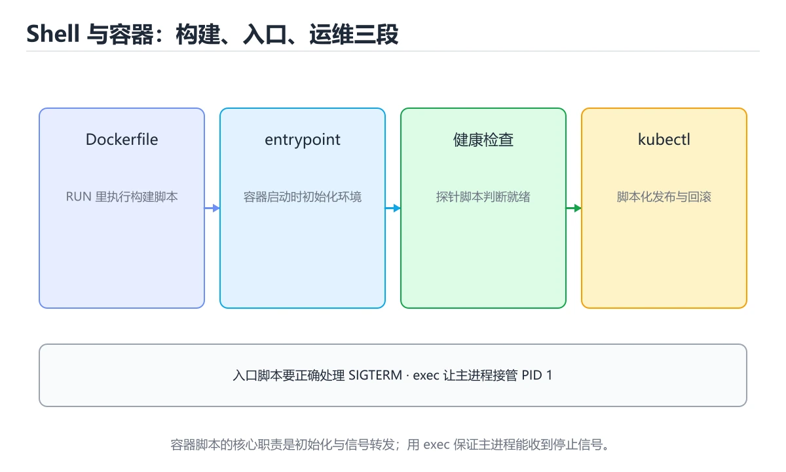
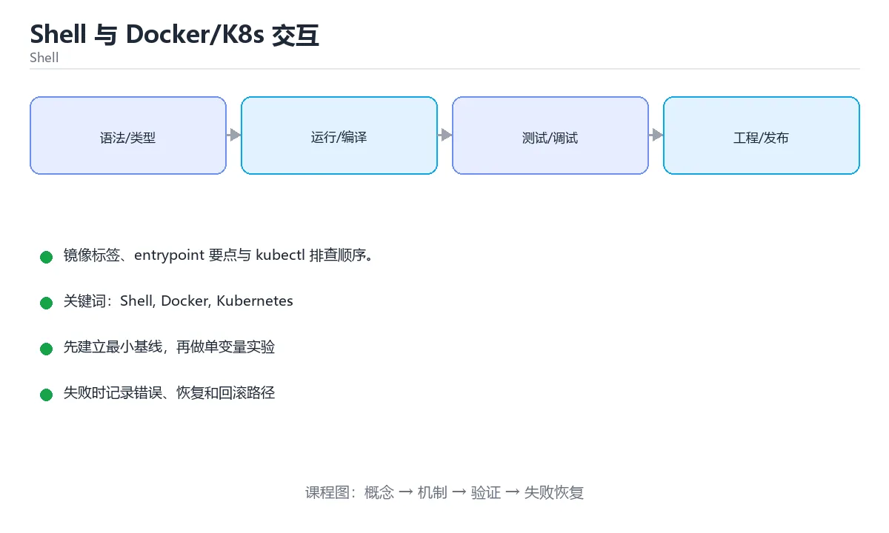

# Shell 与 Docker/K8s 交互





> 内容更新时间：2026-10-03 · 学习阶段：基础 · 预计用时：15 分钟

## 学习目标

- 能用自己的话解释本课主题解决了什么问题，而不是只背术语。
- 能说清 「Shell」、「Docker」、「Kubernetes」、「entrypoint」 之间的关系，并分别举出一个例子。
- 能把本课知识放回「Shell」的知识体系，说明它和相邻主题的边界。
- 能完成本课练习，并用验收标准检查自己的结果。

> 一句话摘要：镜像标签、entrypoint 要点与 kubectl 排查顺序。

## 前置知识

- 先完成上一课《Shell 脚本工程化》；如果已经掌握，可以直接用本课练习自测。
- 本课阶段：基础。建议会读写简单代码或命令，并理解变量、输入输出等基本概念。
- 开始前先复习：Shell、Docker、Kubernetes。
- 如果某一步看不懂，先记录具体卡点，完成练习后再回头读一遍。

## 常用 Docker 命令脚本化

| 场景 | 命令要点 |
| --- | --- |
| 构建 | `docker build -t app:$GIT_SHA .`，用提交号做标签便于回滚 |
| 运行 | `docker run -d --name app -p 8080:8080 --env-file .env app:$SHA` |
| 查看 | `docker logs -f --tail 100 app`、`docker stats` |
| 进容器 | `docker exec -it app sh`（生产容器通常不带 bash） |
| 清理 | `docker system prune -f`（谨慎，先 `docker ps -a` 确认） |

脚本里要判断容器是否存在（`docker ps -aq -f name=app`），并处理"已存在则先删"的逻辑；退出码检查不可省。

## 容器内的 entrypoint 脚本

要点：① 用 `exec "$@"` 让主进程成为 PID 1，才能正确接收信号；② 用 `set -euo pipefail`；③ 等待依赖（数据库）时用循环 + 超时，而不是固定 sleep；④ 不在 entrypoint 里做需要人工确认的破坏性操作。

## kubectl 常用操作

```text
kubectl get pods -o wide                  # 状态与节点
kubectl describe pod <name>               # 事件（调度/镜像/探针失败）
kubectl logs -f <pod> --tail=200          # 日志
kubectl exec -it <pod> -- sh              # 进入容器
kubectl rollout status deploy/app         # 观察滚动更新
kubectl rollout undo deploy/app           # 回滚
kubectl port-forward svc/app 8080:80      # 本地调试
```

排查顺序固定：`get`（看状态）→ `describe`（看事件）→ `logs`（看应用日志）→ `exec`（进容器验证）。

## 健康检查与就绪脚本

在容器里写一个 healthcheck 脚本：检查进程存活、端口可连、关键依赖可用，返回 0/1。区分 liveness（失败重启）与 readiness（失败摘流量）——**依赖不可用时只应影响 readiness**，避免全量重启引发雪崩。

## 本课小结
Shell 与容器的结合点是**可重复的构建/部署/排查流程**：镜像用不可变标签、entrypoint 用 exec 传递信号、排查按 get→describe→logs→exec 顺序进行。

## 容器脚本速查

| 场景 | 推荐写法 |
| --- | --- |
| 启动主进程 | 脚本末尾 `exec "$@"`，让主进程成为 PID 1 |
| 等待依赖就绪 | 循环探测 + 超时 + 退出码，不在 entrypoint 里无限阻塞 |
| 初始化数据 | 幂等判断（已存在则跳过） |
| 配置模板 | `envsubst` 渲染模板到临时目录再启动 |
| 信号处理 | 用 `exec` 或 `tini` / `--init` 代理信号 |
| 日志 | 输出到 stdout / stderr，由容器运行时收集 |
| 时区 | 通过环境变量 `TZ` 或挂载 `/etc/localtime` |
| 用户权限 | 以非 root 运行，需要写权限的目录提前 chown |

```bash
#!/usr/bin/env bash
set -Eeuo pipefail

# 若以 root 启动且挂载了数据卷，先把属主改好再降权
if [[ "$(id -u)" == "0" ]]; then
  chown -R app:app /data /var/log/myapp
  exec gosu app "$0" "$@"        # 降权后重新执行自己
fi

wait_for() {
  local host="$1" port="$2" timeout="${3:-30}"
  local start=$SECONDS
  until (echo > "/dev/tcp/${host}/${port}") 2>/dev/null; do
    (( SECONDS - start < timeout )) || {
      echo "等待 ${host}:${port} 超时" >&2
      return 1
    }
    sleep 1
  done
}

# 仅对初始化类容器等待依赖；业务容器交给编排的重试与探针
if [[ "${WAIT_FOR_DB:-0}" == "1" ]]; then
  wait_for "${DB_HOST:?}" "${DB_PORT:-5432}" "${DB_TIMEOUT:-30}"
fi

mkdir -p /var/log/myapp

exec "$@"                          # 交给主进程，正确接收 SIGTERM
```

## Kubernetes 交互速查

| 目的 | 命令 |
| --- | --- |
| 查看 Pod 列表 | `kubectl get pods -n prod -o wide` |
| 查看事件 | `kubectl describe pod <name>` |
| 查看日志 | `kubectl logs -f <pod> -c <container> --tail=200` |
| 进入容器 | `kubectl exec -it <pod> -- sh` |
| 拷贝文件 | `kubectl cp <pod>:/path ./local` |
| 端口转发 | `kubectl port-forward svc/api 8080:80` |
| 查看资源占用 | `kubectl top pod` |
| 触发滚动重启 | `kubectl rollout restart deploy/api` |
| 查看发布状态 | `kubectl rollout status deploy/api` |
| 回滚 | `kubectl rollout undo deploy/api` |

## 常见错误对照表

| 容易踩的做法 | 实际现象 | 原因与正确做法 |
| --- | --- | --- |
| entrypoint 不写 `exec` | `SIGTERM` 收不到，容器 30 秒后被强杀 | 用 `exec "$@"` |
| entrypoint 里 sleep 等依赖 | 启动慢、就绪探针失败 | 依赖交给 readiness 探针与重试 |
| 用 `kubectl exec` 改容器内文件 | 重建后丢失 | 改镜像与配置清单 |
| 容器里写日志文件 | 日志丢失、磁盘占用 | 输出到 stdout / stderr |
| 以 root 运行 | 安全风险高 | 非 root 用户 + 只读根文件系统 |
| distroless 镜像里 `kubectl exec sh` | 找不到 shell | 用 debug 容器或临时 sidecar |
| 本地时区正常、容器为 UTC | 日志时间错位 | 设置 `TZ` |
| 依赖 service 名称写成 localhost | 连接被拒 | 同一网络内用服务名 |
| 初始化脚本不幂等 | 重启后重复执行导致数据错乱 | 先检查状态再操作 |
| 用 `latest` 镜像标签 | 版本不可追溯 | 固定版本或 digest |

## 自测清单

- [ ] entrypoint 使用 `exec "$@"`，信号能正确传递。
- [ ] 日志输出到标准输出，由平台统一收集。
- [ ] 容器以非 root 用户运行，写权限目录提前准备。
- [ ] 初始化逻辑幂等，可安全重复执行。
- [ ] 排查问题优先用 `logs` / `describe`，不依赖容器内改文件。

## 零基础详解：容器里的 shell 脚本

### 一句话说清它是什么

容器里的启动脚本有两个特殊任务：**把主进程交给应用（exec）**、**配合探针让编排系统正确判断健康状态**。
做错了就会出现「kill 没反应」「重启风暴」「流量打到没准备好的实例」。

### 用生活比喻理解

| 概念 | 比喻 | 说明 |
| --- | --- | --- |
| PID 1 | 值班负责人 | 要负责收信号、带新人 |
| `exec` | 交班 | 把自己换成应用进程，成为 PID 1 |
| liveness | 体检 | 不过关就重启 |
| readiness | 上岗证 | 不过关只摘流量，不重启 |
| distroless | 无工具车间 | 镜像里没有 shell，排查要靠日志与指标 |

### entrypoint 脚本的正确写法

```bash
#!/usr/bin/env bash
set -euo pipefail

# 1. 准备工作：等待依赖、建目录
if [[ -n "${WAIT_FOR:-}" ]]; then
  until pg_isready -h "$WAIT_FOR" -p 5432 >/dev/null 2>&1; do
    echo "等待数据库 $WAIT_FOR …"
    sleep 1
  done
fi

mkdir -p /app/tmp

# 2. 交班：让应用成为 PID 1，正确接收 SIGTERM
exec "$@"
```

对应 Dockerfile：

```dockerfile
FROM python:3.13-slim
WORKDIR /app
COPY requirements.txt .
RUN pip install --no-cache-dir -r requirements.txt
COPY . .
RUN chmod +x docker/entrypoint.sh
ENTRYPOINT ["/app/docker/entrypoint.sh"]
CMD ["python", "-m", "app"]
```

**关键点**：用 exec 形式（方括号数组），不要用 shell 形式（`CMD python -m app`），否则信号传不到应用。

### 没有 exec 会发生什么

```text
错误：sh 是 PID 1，python 是它的子进程
kubectl delete pod → 发送 SIGTERM 给 sh → sh 不转发 → 超时后被 SIGKILL
结果：请求被硬中断，数据可能丢失，每次发布都要等 30 秒
```

### 三种探针的分工

| 探针 | 失败后果 | 用来检查 |
| --- | --- | --- |
| `startupProbe` | 重启容器 | 启动慢的服务是否完成初始化 |
| `livenessProbe` | 重启容器 | 进程是否还活着 |
| `readinessProbe` | 只摘流量 | 是否准备好接请求 |

```yaml
readinessProbe:
  httpGet: { path: /healthz/ready, port: 8080 }
  periodSeconds: 5

livenessProbe:
  httpGet: { path: /healthz/live, port: 8080 }
  initialDelaySeconds: 15
  periodSeconds: 10
```

**依赖服务（数据库、下游接口）不可用时，应该影响 readiness，不要影响 liveness。**

### 优雅下线要做的四件事

```text
1. 收到 SIGTERM 后先停止接收新请求
2. 等在途请求处理完
3. 关闭数据库连接、刷缓冲
4. 主动退出，退出码 0
```

```yaml
terminationGracePeriodSeconds: 30
lifecycle:
  preStop:
    exec:
      command: ["/bin/sh", "-c", "sleep 5"]   # 给负载均衡摘流留时间
```

### 排查顺序：get → describe → logs → exec

```bash
kubectl get pods -o wide                 # 1. 状态、重启次数、节点
kubectl describe pod myapp-xxx           # 2. 事件：拉镜像失败、探针失败
kubectl logs myapp-xxx --previous        # 3. 崩溃前的日志
kubectl exec -it myapp-xxx -- sh         # 4. 进容器验证（镜像里得有 shell）
```

### 新手最容易踩的八个坑

| 坑 | 现象 | 正确做法 |
| --- | --- | --- |
| 启动脚本不用 exec | 信号丢失，优雅退出失效 | 末尾 `exec "$@"` |
| 用 shell 形式的 CMD | 同上 | 用 exec 数组形式 |
| liveness 检查依赖服务 | 下游抖动引发全员重启 | 依赖放 readiness |
| 探针路径用真实业务接口 | 探测自身产生副作用 | 单独写轻量健康检查接口 |
| 忘了 `terminationGracePeriodSeconds` | 请求被硬中断 | 设成大于最长请求时间 |
| 容器里以 root 运行 | 安全风险 | 建普通用户并 `USER` 切换 |
| 脚本里写相对路径 | 工作目录不同就失败 | 显式 `cd /app` 或用绝对路径 |
| distroless 里 exec 失败 | 没有 shell | 改为只依赖日志与指标 |

### 手把手练习：完整的 entrypoint

```bash
#!/usr/bin/env bash
set -euo pipefail

log() { printf '[entrypoint] %s\n' "$*" >&2; }

cleanup() {
  log "收到退出信号，等待应用结束"
  if [[ -n "${child_pid:-}" ]]; then
    kill -TERM "$child_pid" 2>/dev/null || true
    wait "$child_pid"
  fi
}
trap cleanup TERM INT

if [[ "${ENABLE_MIGRATION:-false}" == "true" ]]; then
  log "执行数据库迁移"
  python -m app.migrate
fi

log "应用启动：$*"
exec "$@"
```

### 学完自测

- [ ] 能解释 `exec "$@"` 为什么重要。
- [ ] 能说出三种探针分别失败会发生什么。
- [ ] 知道依赖服务不可用该影响哪个探针。
- [ ] 能说出 K8s 排查的四步顺序。
- [ ] 知道为什么容器里推荐用非 root 用户。

## 动手练习

> 本课练习重点：围绕「Shell、Docker、Kubernetes」完成复述、实验和交付，每个结果都要能被别人检查。

先加严格模式，再在临时目录验证成功与失败路径，最后补回滚。

### 练习 1：建立心智模型（10 分钟）

合上教程，用 3～5 句话回答：

1. 本课主题解决了什么问题？
2. 如果没有它，会出现什么具体后果？
3. 它和「Docker」是什么关系？

**验收标准**：至少出现一个本课关键词，并写出一个反例、边界条件或失效场景。

### 练习 2：做一次可控实验（20 分钟）

从正文中选一个最小示例，完成以下操作：

1. 先预测修改一个参数、输入或步骤后的结果。
2. 再实际执行或逐步推演，记录真实结果。
3. 如果结果与预测不同，写出差异原因。

**验收标准**：留下「原例 → 改动 → 预测 → 结果 → 原因」五步记录。

### 练习 3：交付一个小结果（30 分钟）

写一个带 `set -euo pipefail` 的脚本，并用临时目录验证成功与失败路径。

任务要求：

- 结果必须能被别人检查，不能只写“我已经理解了”。
- 至少覆盖「Shell」和「Docker」两个关键词。
- 写出 1 个仍然不确定的问题，以及下一步如何验证。

> 提示：时间有限时优先做练习 1 和练习 2；练习 3 可以拆成两次完成。

## 可运行练习

### 任务 1：先跑通，再解释

```bash
#!/usr/bin/env bash
set -Eeuo pipefail

# 若以 root 启动且挂载了数据卷，先把属主改好再降权
if [[ "$(id -u)" == "0" ]]; then
  chown -R app:app /data /var/log/myapp
  exec gosu app "$0" "$@"        # 降权后重新执行自己
fi

wait_for() {
  local host="$1" port="$2" timeout="${3:-30}"
  local start=$SECONDS
  until (echo > "/dev/tcp/${host}/${port}") 2>/dev/null; do
    (( SECONDS - start < timeout )) || {
      echo "等待 ${host}:${port} 超时" >&2
      return 1
    }
    sleep 1
  done
}

# 仅对初始化类容器等待依赖；业务容器交给编排的重试与探针
if [[ "${WAIT_FOR_DB:-0}" == "1" ]]; then
  wait_for "${DB_HOST:?}" "${DB_PORT:-5432}" "${DB_TIMEOUT:-30}"
fi

mkdir -p /var/log/myapp

exec "$@"                          # 交给主进程，正确接收 SIGTERM
```

**预期输出**：等待 ${host}:${port} 超时

### 任务 2：只改一个条件

### 任务 3：迁移到自己的数据

用同一套思路处理一组你自己的数据或场景，保持输出格式与任务 1 一致。

## 故障现场

### 现场 1：本课的 Shell 常规用例通过，但边界用例失败

**症状**：在本课的练习或生产场景里出现“本课的 Shell 常规用例通过，但边界用例失败”。

**复现**：准备一组最小输入，只保留触发“本课的 Shell 常规用例通过，但边界用例失败”的必要条件，连续运行两次确认结果稳定。

**定位**：围绕“Shell 的前置条件与取值边界没有写进代码，默认值掩盖了空值和极值”检查调用链、输入数据和环境配置，先验证假设再改代码。

**预防**：把“本课的 Shell 常规用例通过，但边界用例失败”写成一条自动化用例，并在本课的验收清单里保留对应检查项。

### 现场 2：本课的 Docker 结果在两次运行之间不一致

**症状**：在本课的练习或生产场景里出现“本课的 Docker 结果在两次运行之间不一致”。

**复现**：准备一组最小输入，只保留触发“本课的 Docker 结果在两次运行之间不一致”的必要条件，连续运行两次确认结果稳定。

**定位**：围绕“Docker 依赖了当前版本、执行顺序或共享状态，单次运行无法暴露差异”检查调用链、输入数据和环境配置，先验证假设再改代码。

**预防**：把“本课的 Docker 结果在两次运行之间不一致”写成一条自动化用例，并在本课的验收清单里保留对应检查项。

### 现场 3：本课的验证只在开发机通过

**症状**：在本课的练习或生产场景里出现“本课的验证只在开发机通过”。

**定位**：围绕“环境版本、配置和输入规模与目标环境不同，Shell 缺少可重复的验证记录”检查调用链、输入数据和环境配置，先验证假设再改代码。

## 版本与时效

- Bash 5.x 与 POSIX sh 的行为差异仍然是最常见的可移植性来源
- 升级前确认目标环境的 Bash 版本、内置命令与数组能力

### 升级检查清单

- 先固定当前版本，跑通全部示例与测验，再升级工具链。
- 只改一个版本变量，记录编译、测试、性能与产物体积的变化。
- 重点回归默认值、弃用警告、序列化格式、并发语义和错误信息。
- 升级完成后更新本课的“最后复核 / 下次复核”日期与版本说明。

## 本课复习清单

离开本课前，逐项确认：

- [ ] 不看解析，能说出「容器 entrypoint 脚本里为什么要用 exec "$@"？」的判断依据。
- [ ] 不看解析，能说出「依赖服务暂时不可用时，应该影响哪种探针？」的判断依据。
- [ ] 不看解析，能说出「K8s 排查问题的推荐顺序是？」的判断依据。
- [ ] 不看解析，能说出「容器里 PID 1 进程的特殊性是？」的判断依据。
- [ ] 不看解析，能说出「kubectl exec -it pod -- sh 的适用场景是？」的判断依据。
- [ ] 不看解析，能说出「补全代码：本课主题示例中，下面这行代码缺少…」的判断依据。
- [ ] 至少运行一次本课示例，记录输入、输出和一个边界情况。
- [ ] 把本课最容易混淆的两个概念写成一句话对照。

| 复盘项 | 记录 |
| --- | --- |
| 已经能独立解释的考点 |  |
| 仍然说不清的概念 |  |
| 下一步验证动作 |  |

## 术语速查

| 术语 | 本课语境 |
| --- | --- |
| `docker build -t app:$GIT_SHA .` | \| 构建 \| `docker build -t app:$GIT_SHA .`，用提交号做标签便于回滚 \| |
| `docker logs -f --tail 100 app` | \| 查看 \| `docker logs -f --tail 100 app`、`docker stats` \| |
| `docker stats` | \| 查看 \| `docker logs -f --tail 100 app`、`docker stats` \| |
| `docker exec -it app sh` | \| 进容器 \| `docker exec -it app sh`（生产容器通常不带 bash） \| |
| `docker system prune -f` | \| 清理 \| `docker system prune -f`（谨慎，先 `docker ps -a` 确认） \| |
| `docker ps -a` | \| 清理 \| `docker system prune -f`（谨慎，先 `docker ps -a` 确认） \| |
| `docker ps -aq -f name=app` | 脚本里要判断容器是否存在（`docker ps -aq -f name=app`），并处理"已存在则先删"的逻辑；退出码检查不可省。 |
| `exec "$@"` | 要点：① 用 `exec "$@"` 让主进程成为 PID 1，才能正确接收信号；② 用 `set -euo pipefail`；③ 等待依赖（数据库）时用循环 + 超时，而不是固定 sleep；④ 不在 entrypo… |
| `set -euo pipefail` | 要点：① 用 `exec "$@"` 让主进程成为 PID 1，才能正确接收信号；② 用 `set -euo pipefail`；③ 等待依赖（数据库）时用循环 + 超时，而不是固定 sleep；④ 不在 entrypo… |
| `get` | 排查顺序固定：`get`（看状态）→ `describe`（看事件）→ `logs`（看应用日志）→ `exec`（进容器验证）。 |
| `describe` | 排查顺序固定：`get`（看状态）→ `describe`（看事件）→ `logs`（看应用日志）→ `exec`（进容器验证）。 |
| `logs` | 排查顺序固定：`get`（看状态）→ `describe`（看事件）→ `logs`（看应用日志）→ `exec`（进容器验证）。 |

## 考点精讲

### 考点 1：围绕“Shell 与 Docker/K8s 交互”中的 Shell、Docker、Kubernetes，下列哪两项是本课强调的实践判断？

- **判断依据**：正确答案包括「学习 Shell 时要同时说明输入、输出和失败路径，不能只看正常流程」、「验证 Docker 时要固定版本并覆盖边界输入，结论才可复现」。正确答案是学习 Shell 时要同时说明输入、输出和失败路径。在本课主题里，判断 Docker 时要固定版本与边界输入，所以“验证 Docker 时要固定版本并覆盖边界输入，结论才可复现”才可复现。判断这类题时，要把学习 Shell 时要同时说明输入、输出和失败路径，不能只看正常流程。

### 考点 2：依赖服务暂时不可用时，应该影响哪种探针？

- **判断依据**：让 liveness 失败会引发全量重启。围绕 依赖服务暂时不可用时，应该影响哪种探针。作答时，先用Shell建立输入与输出的基线，再把readiness代入边界条件核对，结论才能复现。解题的关键不是记住孤立术语，而是确认「readiness」是否完整覆盖题干的输入、输出和失败路径，并排除「liveness」、「两者都要」这类相邻概念。

### 考点 3：K8s 排查问题的推荐顺序是？

- **判断依据**：符合题干条件的是「get → describe → logs → exec」。先看状态与事件，再看应用日志，最后进容器验证。正确的判断需要逐项核对定义、版本和适用条件（shellcontainer 第 3 题）。正确的判断需要逐项核对定义、版本和适用条件（shell_container 第 3 题）。

### 考点 4：阅读「Shell 与 Docker/K8s 交互」中的这段 Shell 代码，下面哪项判断最准确？

- **判断依据**：结论应落在「镜像标签、entrypoint 要点与 kubectl 排查顺序」。结论应落在镜像标签、entrypoint 要点与 kubectl 排查顺序。这段 Shell 代码来自本课的本地示例，主要用来核对 Shell、Docker、Kubernetes、entrypoint 之间的输入、处理和输出关系，镜像标签、entrypoint 要点与 kubectl 排查顺序。

### 考点 5：kubectl exec -it pod -- sh 的适用场景是？

- **判断依据**：正确答案是「进入容器内部排查问题」。生产环境常使用 distroless 镜像没有 shell，此时要以日志与指标为主要手段。判断这类题时，要把「进入容器内部排查问题」放回题干限定的对象、输入和边界，「修改 Deployment 副本数」、「查看集群所有节点」 等说法虽然包含相关术语，但范围或前提与本题不一致。

### 考点 6：补全代码：「Shell 与 Docker/K8s 交互」示例中，下面这行代码缺少哪个关键字或函数名？请填入 ____。

`____: 5`

- **判断依据**：围绕 补全代码：本课主题示例中，下面… 作答时，先用Shell建立输入与输出的基线，再把periodSeconds 或 periodseconds代入边界条件核对，结论才能复现。解题的关键不是记住孤立术语，而是确认「periodSeconds 或 periodseconds」是否完整覆盖题干的输入、输出和失败路径，并排除这类相邻概念。

## English Overview

**Title:** Shell with Containers

**Summary:** Image tags, entrypoint and kubectl troubleshooting.

**Category:** Shell
**Level:** 基础
**Key terms:** Shell, Docker, Kubernetes, entrypoint, 健康检查

## 内容元数据

- 内容版本：v2.0
- 最后更新：2026-10-03
- 学习阶段：基础
- 适用环境：Bash 5 / POSIX Shell
- 内容来源：内置结构化课程与工程实践整理
- 相关主题：Shell、Docker、Kubernetes、entrypoint、健康检查
- 质量版本：P0 测验标准 + P1 覆盖扩展 + P2 体验补全


## 参考资料与复核

- 最后复核：2026-10-04
- 下次复核：2027-04-04
- 复核范围：版本兼容、API 行为、安全建议与工程实践
- 来源性质：官方文档、标准或权威教材；正文为离线教学重组

| 参考资料 | 本课用途 |
| --- | --- |
| [GNU Bash 手册](https://www.gnu.org/software/bash/manual/) | Bash 语法、展开与作业控制 |
| [POSIX Shell 标准](https://pubs.opengroup.org/onlinepubs/9799919799/utilities/V3_chap02.html) | 可移植 Shell 语法 |
| [ShellCheck 文档](https://www.shellcheck.net/wiki/) | 脚本缺陷与安全写法 |

> 「Shell 与 Docker/K8s 交互」的链接用于离线阅读后的延伸核对；App 不会自动联网。
