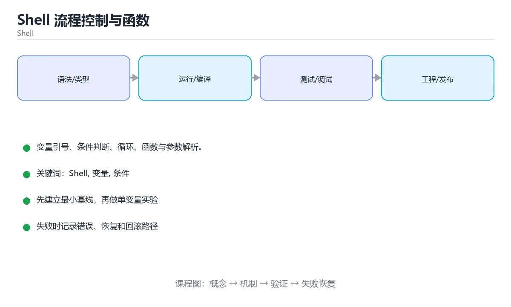

# Shell 流程控制与函数



> 内容更新时间：2026-10-03 · 学习阶段：入门 · 预计用时：15 分钟

## 学习目标

- 能用自己的话解释「Shell 流程控制与函数」解决了什么问题，而不是只背术语。
- 能说清 「Shell」、「变量」、「条件」、「循环」 之间的关系，并分别举出一个例子。
- 能把本课知识放回「Shell」的知识体系，说明它和相邻主题的边界。
- 能完成本课练习，并用验收标准检查自己的结果。

> 一句话摘要：变量引号、条件判断、循环、函数与参数解析。

## 前置知识

- 先完成上一课《Shell 与 Bash 脚本》；如果已经掌握，可以直接用本课练习自测。
- 本课阶段：入门。只需要基本计算机操作，不要求编程经验。
- 开始前先复习：Shell、变量、条件。
- 如果某一步看不懂，先记录具体卡点，完成练习后再回头读一遍。


## 变量与引号

```text
name="tom"            # 等号两侧不能有空格
echo "$name"          # 双引号：展开变量
echo '$name'          # 单引号：原样输出
echo "${name}_id"     # 花括号界定变量边界
```

变量与路径**一律加引号**，否则含空格或通配符的值会被拆分成多个参数（`rm -rf $dir` 是最经典的误删来源）。

## 条件判断

| 写法 | 用途 |
| --- | --- |
| `[ -f "$file" ]` | 文件存在且是普通文件 |
| `[ -d "$dir" ]` | 目录存在 |
| `[ -z "$s" ]` / `[ -n "$s" ]` | 字符串为空 / 非空 |
| `[ "$a" = "$b" ]` | 字符串相等 |
| `[ "$a" -gt 10 ]` | 数值比较（-eq/-ne/-gt/-lt/-ge/-le） |
| `[[ ... ]]` | Bash 增强，支持正则 `=~` 与逻辑组合 |

## 循环

```text
for f in *.log; do echo "$f"; done
for i in $(seq 1 5); do echo "$i"; done
while read -r line; do echo "$line"; done < file.txt
until [ "$n" -le 0 ]; do n=$((n-1)); done
```

遍历文件用 `for f in ...`，遍历命令输出用 `while read`（避免空格被拆分）；不要用 `for x in $(cat file)`。

## 函数与退出码

函数用 `name() { ... }` 定义，`$1 $2` 取参数，`$@` 取全部参数，`return n` 返回退出码（0 成功）。命令失败可用 `||` 兜底：`cp a b || echo "复制失败"`。

## 参数解析

小脚本用 `$1 $2` 与 `shift`；需要选项时用 `getopts "f:o:v"`，或 `while [ $# -gt 0 ]` 配合 `case "$1"` 手写解析。无论哪种，都要打印 usage 并校验必填参数。

## 本课小结
Shell 流程控制的核心是**引号、`[[ ]]` 判断、while read 遍历与 `$?` 退出码**；把这几件事写规范，脚本就稳定了一半。


## 变量与参数速查

| 写法 | 含义 |
| --- | --- |
| `name="tom"` | 赋值（等号两侧不能有空格） |
| `"${name}"` | 引用变量，加引号防分词 |
| `${name:-默认}` | 未设置或为空时用默认值 |
| `${name:=默认}` | 未设置时赋值并返回 |
| `${name:?错误提示}` | 未设置时报错退出 |
| `${#name}` | 字符串长度 |
| `${name:0:3}` | 截取子串 |
| `${name%.*}` | 去掉最后一个点之后的部分 |
| `${name##*/}` | 取路径中的文件名 |
| `$#` | 参数个数 |
| `$1`、`$@`、`$*` | 位置参数；`"$@"` 保留参数边界 |
| `shift` | 左移参数，消费第一个 |
| `getopts` | 解析短选项 |
| `$?` | 上一条命令的退出码 |
| `$$` | 当前进程 PID |

```bash
#!/usr/bin/env bash
set -euo pipefail

readonly LOG_DIR="${LOG_DIR:-/var/log/myapp}"
: "${API_TOKEN:?必须设置 API_TOKEN}"

usage() {
  cat <<'EOF'
用法: deploy.sh [-e 环境] [-n] 目标
  -e 环境   指定部署环境（dev/staging/prod）
  -n        只演练不真正执行
EOF
}

env="dev"
dry_run=0
while getopts ":e:nh" opt; do
  case "$opt" in
    e) env="$OPTARG" ;;
    n) dry_run=1 ;;
    h) usage; exit 0 ;;
    :) echo "缺少 -$OPTARG 的参数" >&2; exit 2 ;;
    \?) echo "未知选项 -$OPTARG" >&2; usage >&2; exit 2 ;;
  esac
done
shift $((OPTIND - 1))

target="${1:-}"
[[ -n "$target" ]] || { usage >&2; exit 2; }
echo "环境=$env 目标=$target 演练=$dry_run"
```

## 流程控制速查

| 结构 | 写法 |
| --- | --- |
| 条件 | `if [[ "$env" == "prod" ]]; then ... fi` |
| 数值比较 | `if (( count > 10 )); then ... fi` |
| 文件判断 | `[[ -f "$f" ]]`、`[[ -d "$d" ]]`、`[[ -x "$bin" ]]` |
| for 遍历列表 | `for f in "$@"; do ... done` |
| for 遍历目录 | `for f in ./*.log; do ... done` |
| while 读文件 | `while IFS= read -r line; do ... done < "$file"` |
| case 分支 | `case "$1" in start) ... ;; stop) ... ;; *) ... ;; esac` |
| 函数返回数据 | `printf '%s\n' "$value"` + `result="$(fn)"` |
| 函数返回状态 | `return 0/1`，用 `if fn; then` 判断 |

## 常见错误对照表

| 容易写错的做法 | 实际现象 | 原因与正确做法 |
| --- | --- | --- |
| `$1` 未引号 | 参数含空格被拆分 | 写 `"$1"` 或 `"$@"` |
| `[[ $a = $b ]]` 未加引号 | 空值导致语法错误 | 写 `[[ "$a" == "$b" ]]` |
| 用 `[ ]` 又用 `&&` | 语法错误 | 用 `[[ ]]` 或 `[ ] -a` |
| `$((...))` 里用浮点 | 报错 | Shell 只支持整数，用 `awk` / `bc` |
| 函数里用 `exit` | 整个脚本退出 | 需要返回上层时用 `return` |
| 全局变量当作函数返回值 | 并发调用互相覆盖 | 用 `printf` 输出 + 命令替换 |
| `local` 用在函数外 | 报错 | 只在函数内使用 |
| 忘记 `shift` | 参数被重复处理 | 用 `getopts` 后 `shift $((OPTIND-1))` |
| 用 `==` 在 `[ ]` 中 | 兼容性问题 | `[[ ]]` 允许 `==`，`[ ]` 用 `=` |
| 未处理未知选项 | 静默忽略错误参数 | `case` 中加 `\?` 分支报错 |

## 自测清单

- [ ] 变量与参数展开一律加双引号。
- [ ] 用 `: "${VAR:?msg}"` 校验必填变量。
- [ ] 用 `getopts` 解析选项并处理错误分支。
- [ ] 函数通过 stdout 返回数据，用 `return` 返回状态。
- [ ] 条件判断统一用 `[[ ]]` / `(( ))`。


## 零基础详解：分支、循环、函数与参数解析

### 一句话说清它是什么

Shell 的控制流很像其它语言，但**符号和空格规则特别严格**：
方括号内侧必须有空格、数字比较不能用 `>`、函数用 `return` 只能返回状态码。

### 判断：三种括号别用错

| 写法 | 支持 | 建议 |
| --- | --- | --- |
| `[ "$a" = "$b" ]` | POSIX，所有 shell | 可移植，注意内侧空格 |
| `[[ "$a" == "$b" ]]` | bash / zsh 扩展 | 更安全，不怕空变量，**脚本首选** |
| `(( a > b ))` | 算术比较 | 数字专用，写法最像其它语言 |

```bash
score=85

if [[ $score -ge 90 ]]; then
  echo "优秀"
elif (( score >= 60 )); then
  echo "及格"
else
  echo "不及格"
fi
```

数字比较必须用 `-gt -lt -ge -le -eq -ne`，或直接用 `(( ))`。

### 三种循环与 `case`

```bash
# for：遍历列表
for f in *.log; do
  echo "处理 $f"
done

# while read：按行读取文件（最稳的写法）
while IFS= read -r line; do
  echo "行内容：$line"
done < input.txt

# while：条件驱动
count=0
while (( count < 3 )); do
  echo "第 $((count + 1)) 次"
  ((count++))
done

# case：多分支匹配
case "$1" in
  start)  echo "启动" ;;
  stop)   echo "停止" ;;
  status) echo "查看状态" ;;
  *)      echo "用法：$0 {start|stop|status}" >&2; exit 1 ;;
esac
```

**遍历文件内容一定要用 `while IFS= read -r`**，`for x in $(cat file)` 会按空白拆分，遇到空格就错。

### 函数：参数用 `$1`，结果用 `echo`

```bash
log() {
  local level="$1"; shift          # local 限定作用域；shift 把参数前移
  local message="$*"
  printf '[%s] %s\n' "$level" "$message" >&2
}

is_number() {
  [[ "$1" =~ ^[0-9]+$ ]]           # 返回值就是条件结果
}

log INFO "服务已启动"
if is_number "123"; then echo "是数字"; fi
```

| 要点 | 说明 |
| --- | --- |
| `local` | 声明函数内局部变量，避免污染全局 |
| `shift` | 把参数列表往前移一位，便于逐个处理 |
| `return N` | 只能返回 0~255 的状态码，不能返回字符串 |
| `echo` + `$(...)` | 函数要「返回数据」的正确方式 |

### 参数解析：手动 + `getopts`

```bash
verbose=0
output=""

while getopts ":vo:h" opt; do
  case "$opt" in
    v) verbose=1 ;;
    o) output="$OPTARG" ;;
    h) echo "用法：$0 [-v] [-o 输出文件]"; exit 0 ;;
    \?) echo "未知选项：-$OPTARG" >&2; exit 1 ;;
    :)  echo "选项 -$OPTARG 需要参数" >&2; exit 1 ;;
  esac
done
shift $((OPTIND - 1))     # 剩下的是位置参数
```

`getopts` 是 POSIX 内建，能自动处理「选项需要值」的情况；长选项则需要 `getopt` 或手动解析。

### 新手最容易踩的七个坑

| 坑 | 现象 | 正确做法 |
| --- | --- | --- |
| 方括号内侧少空格 | `[: command not found` | 写成 `[ "$a" = "$b" ]` |
| 数字用 `>` 比较 | 变成重定向，产生怪文件 | 用 `-gt` 或 `(( ))` |
| `for` 遍历命令输出 | 含空格的项被拆开 | 用 `while read -r` 或数组 |
| 函数忘了 `local` | 变量污染全局 | 一律 `local` |
| 用 `return` 返回字符串 | 报错或只拿到状态码 | 用 `echo` + 命令替换 |
| `$(...)` 不加引号 | 输出被拆分 | `result="$(func)"` |
| `case` 忘了 `esac` | 语法错误 | 检查 `case ... esac` 配对 |

### 手把手练习：带子命令的脚本骨架

```bash
#!/usr/bin/env bash
set -euo pipefail

usage() {
  echo "用法：$0 <init|build|clean>" >&2
  exit 1
}

cmd_init()  { echo "初始化……"; }
cmd_build() { echo "构建中……"; }
cmd_clean() { echo "清理完成"; }

main() {
  [[ $# -ge 1 ]] || usage
  case "$1" in
    init)  cmd_init ;;
    build) cmd_build ;;
    clean) cmd_clean ;;
    *)     usage ;;
  esac
}

main "$@"
```

`main "$@"` 加引号很重要：保证参数里的空格不被拆开。

### 学完自测

- [ ] 能说出 `[ ]`、`[[ ]]`、`(( ))` 各自适合什么。
- [ ] 知道数字比较为什么不能用 `>`。
- [ ] 能写出按行读文件的正确循环。
- [ ] 知道函数里 `local` 的作用。
- [ ] 能用 `case` 写出带子命令的脚本骨架。

## 动手练习


> 本课练习重点：围绕「Shell、变量、条件」完成复述、实验和交付，每个结果都要能被别人检查。

先加严格模式，再在临时目录验证成功与失败路径，最后补回滚。

### 练习 1：建立心智模型（10 分钟）

合上教程，用 3～5 句话回答：

1. 「Shell 流程控制与函数」解决了什么问题？
2. 如果没有它，会出现什么具体后果？
3. 它和「变量」是什么关系？

**验收标准**：至少出现一个本课关键词，并写出一个反例、边界条件或失效场景。

### 练习 2：做一次可控实验（20 分钟）

从正文中选一个最小示例，完成以下操作：

1. 先预测修改一个参数、输入或步骤后的结果。
2. 再实际执行或逐步推演，记录真实结果。
3. 如果结果与预测不同，写出差异原因。

**验收标准**：留下「原例 → 改动 → 预测 → 结果 → 原因」五步记录。

### 练习 3：交付一个小结果（30 分钟）

写一个带 `set -euo pipefail` 的脚本，并用临时目录验证成功与失败路径。

任务要求：

- 结果必须能被别人检查，不能只写“我已经理解了”。
- 至少覆盖「Shell」和「变量」两个关键词。
- 写出 1 个仍然不确定的问题，以及下一步如何验证。

> 提示：时间有限时优先做练习 1 和练习 2；练习 3 可以拆成两次完成。


## 考点精讲：把测验题还原成判断过程

本课有 6 个判断点。先自己作答，再看「判断依据」；如果结论正确但理由不完整，回到正文对应章节补足概念。

### 考点 1：Shell 中变量赋值 name=tom 的要求是？

- **正确判断**：等号两侧不能有空格
- **判断依据**：正确答案是「等号两侧不能有空格」，本课在「本课小结」中说明：Shell 流程控制的核心是引号、[[ ]] 判断、while read 遍历与 $? 退出码。有空格会被解析成命令加参数。本课还在「零基础详解：分支、循环、函数与参数解析」中说明：方括号内侧必须有空格、数字比较不能用 >、函数用 return 只能返回状态码。本课还在「变量与引号」中说明：变量与路径一律加引号，否则含空格或通配符的值会被拆分成多个参数（rm -rf $dir 是最经典的误删来源）。
- **迁移检查**：把题干里的一个条件换成边界值，原来的结论还成立吗？写出判断过程。

### 考点 2：遍历命令输出（按行）推荐使用？

- **正确判断**：while read -r line; do ...; done < file
- **判断依据**：正确答案是「while read -r line; do ...; done < file」，本课在「循环」中说明：遍历文件用 for f in ...，遍历命令输出用 while read（避免空格被拆分）。for 会按空白拆分，while read 按行读取更安全。本课还在「本课小结」中说明：Shell 流程控制的核心是引号、[[ ]] 判断、while read 遍历与 $? 退出码。本课还在「零基础详解：分支、循环、函数与参数解析」中说明：遍历文件内容一定要用 while IFS= read -r，for x in $(cat file) 会按空白拆分，遇到空格就错。
- **迁移检查**：遮住选项，只根据定义复述一次答案，再回来看哪个选项与复述一致。

### 考点 3：判断数值大于 10 的正确写法是？

- **正确判断**：[ "$a" -gt 10 ]
- **判断依据**：正确答案是「[ "$a" -gt 10 ]」，本课在「函数与退出码」中说明：函数用 name() { ... } 定义，$1 $2 取参数，$@ 取全部参数，return n 返回退出码（0 成功）。数值比较用 -gt/-lt/-eq 等。本课还在「参数解析」中说明：需要选项时用 getopts "f:o:v"，或 while [ $# -gt 0 ] 配合 case "$1" 手写解析。本课还在「零基础详解：分支、循环、函数与参数解析」中说明：Shell 的控制流很像其它语言，但符号和空格规则特别严格。
- **迁移检查**：遮住选项，只根据定义复述一次答案，再回来看哪个选项与复述一致。

### 考点 4：脚本参数中 $1 与 "$@" 的区别是？

- **正确判断**：$1 是第一个参数
- **判断依据**：正确答案是「$1 是第一个参数」，本课在「变量与引号」中说明：变量与路径一律加引号，否则含空格或通配符的值会被拆分成多个参数（rm -rf $dir 是最经典的误删来源）。转发参数时要用 "$@"（带引号），否则含空格的参数会被拆开。本课还在「参数解析」中说明：无论哪种，都要打印 usage 并校验必填参数。本课还在「零基础详解：分支、循环、函数与参数解析」中说明：方括号内侧必须有空格、数字比较不能用 >、函数用 return 只能返回状态码。
- **迁移检查**：遮住选项，只根据定义复述一次答案，再回来看哪个选项与复述一致。

### 考点 5：Shell 函数如何返回一个字符串结果？

- **正确判断**：用 echo 输出，再由调用方用命令替换捕获
- **判断依据**：正确答案是「用 echo 输出，再由调用方用命令替换捕获」，本课在「函数与退出码」中说明：命令失败可用 || 兜底：cp a b || echo "复制失败"。return 表示成功/失败状态，真正的数据要靠标准输出传递。本课还在「函数与退出码」中说明：函数用 name() { ... } 定义，$1 $2 取参数，$@ 取全部参数，return n 返回退出码（0 成功）。
- **迁移检查**：把题干里的一个条件换成边界值，原来的结论还成立吗？写出判断过程。

### 考点 6：补全代码：「Shell 流程控制与函数」示例中，下面这行代码缺少哪个关键字或函数名？请填入 ____。 `set -euo ____`

- **正确判断**：pipefail
- **判断依据**：正确答案是「pipefail」，这道题在问补全代码：Shell流程控制与函数示例中，下面这行代…填入____，`set-euo____`，判断时要把题干限定的输入、边界与目标逐项对齐。本课示例中还能看到 `set -euo pipefail` 这样的用法，说明该关键字在本课代码中承担实际功能。
- **迁移检查**：不看题干，用自己的话补全这句话，再与标准答案对照。

## 本课复习清单

离开本课前，逐项确认：

- [ ] 不看解析，能说出「Shell 中变量赋值 name=tom 的要求是？」的判断依据。
- [ ] 不看解析，能说出「遍历命令输出（按行）推荐使用？」的判断依据。
- [ ] 不看解析，能说出「判断数值大于 10 的正确写法是？」的判断依据。
- [ ] 不看解析，能说出「脚本参数中 $1 与 "$@" 的区别是？」的判断依据。
- [ ] 不看解析，能说出「Shell 函数如何返回一个字符串结果？」的判断依据。
- [ ] 不看解析，能说出「补全代码：「Shell 流程控制与函数」示例中，下面这行代码缺少哪个关键字或函数…」的判断依据。
- [ ] 至少运行一次本课示例，记录输入、输出和一个边界情况。
- [ ] 把本课最容易混淆的两个概念写成一句话对照。

| 复盘项 | 记录 |
| --- | --- |
| 已经能独立解释的考点 |  |
| 仍然说不清的概念 |  |
| 下一步验证动作 |  |

## 术语速查

把本课反复出现的术语集中放在一起。复习时先遮住右列，尝试用自己的话解释，再回到正文核对。

| 术语 | 本课语境 |
| --- | --- |
| `rm -rf $dir` | 变量与路径**一律加引号**，否则含空格或通配符的值会被拆分成多个参数（`rm -rf $dir` 是最经典的误删来源）。 |
| `[ -f "$file" ]` | \| `[ -f "$file" ]` \| 文件存在且是普通文件 \| |
| `[ -d "$dir" ]` | \| `[ -d "$dir" ]` \| 目录存在 \| |
| `[ -z "$s" ]` | \| `[ -z "$s" ]` / `[ -n "$s" ]` \| 字符串为空 / 非空 \| |
| `[ -n "$s" ]` | \| `[ -z "$s" ]` / `[ -n "$s" ]` \| 字符串为空 / 非空 \| |
| `[ "$a" = "$b" ]` | \| `[ "$a" = "$b" ]` \| 字符串相等 \| |
| `[ "$a" -gt 10 ]` | \| `[ "$a" -gt 10 ]` \| 数值比较（-eq/-ne/-gt/-lt/-ge/-le） \| |
| `[[ ... ]]` | \| `[[ ... ]]` \| Bash 增强，支持正则 `=~` 与逻辑组合 \| |
| `=~` | \| `[[ ... ]]` \| Bash 增强，支持正则 `=~` 与逻辑组合 \| |
| `for f in ...` | 遍历文件用 `for f in ...`，遍历命令输出用 `while read`（避免空格被拆分）；不要用 `for x in $(cat file)`。 |
| `while read` | 遍历文件用 `for f in ...`，遍历命令输出用 `while read`（避免空格被拆分）；不要用 `for x in $(cat file)`。 |
| `for x in $(cat file)` | 遍历文件用 `for f in ...`，遍历命令输出用 `while read`（避免空格被拆分）；不要用 `for x in $(cat file)`。 |

## 面试问答与自测

下面把本课考点换成面试追问。先口述自己的答案，
再对照参考回答检查是否遗漏了前提、边界或失败路径。

### 追问 1：Shell 中变量赋值 name=tom 的要求是？

**参考回答**：正确答案是「等号两侧不能有空格」，本课在「本课小结」中说明：Shell 流程控制的核心是引号、[[ ]] 判断、while read 遍历与 $? 退出码。有空格会被解析成命令加参数。本课还在「零基础详解·分支、循环、函数与参数解析」中说明：方括号内侧必须有空格、数字比较不能用 >、函数用 return 只能返回状态码。本课还在「变量与引号」中说明：变量与路径一律加引号，否则含空格或通配符的值会被拆分成多个参数（rm -rf $dir 是最经典的误删来源）。

### 追问 2：遍历命令输出（按行）推荐使用？

**参考回答**：正确答案是「while read -r line; do ...; done < file」，本课在「循环」中说明：遍历文件用 for f in ...，遍历命令输出用 while read（避免空格被拆分）。for 会按空白拆分，while read 按行读取更安全。本课还在「本课小结」中说明：Shell 流程控制的核心是引号、[[ ]] 判断、while read 遍历与 $? 退出码。本课还在「零基础详解·分支、循环、函数与参数解析」中说明：遍历文件内容一定要用 while IFS= read -r，for x in $(cat file) 会按空白拆分，遇到空格就错。

### 追问 3：判断数值大于 10 的正确写法是？

**参考回答**：正确答案是「[ "$a" -gt 10 ]」，本课在「函数与退出码」中说明：函数用 name() { ... } 定义，$1 $2 取参数，$@ 取全部参数，return n 返回退出码（0 成功）。数值比较用 -gt/-lt/-eq 等。本课还在「参数解析」中说明：需要选项时用 getopts "f:o:v"，或 while [ $# -gt 0 ] 配合 case "$1" 手写解析。本课还在「零基础详解·分支、循环、函数与参数解析」中说明：Shell 的控制流很像其它语言，但符号和空格规则特别严格。

### 追问 4：脚本参数中 $1 与 "$@" 的区别是？

**参考回答**：正确答案是「$1 是第一个参数」，本课在「变量与引号」中说明：变量与路径一律加引号，否则含空格或通配符的值会被拆分成多个参数（rm -rf $dir 是最经典的误删来源）。转发参数时要用 "$@"（带引号），否则含空格的参数会被拆开。本课还在「参数解析」中说明：无论哪种，都要打印 usage 并校验必填参数。本课还在「零基础详解·分支、循环、函数与参数解析」中说明：方括号内侧必须有空格、数字比较不能用 >、函数用 return 只能返回状态码。

### 追问 5：Shell 函数如何返回一个字符串结果？

**参考回答**：正确答案是「用 echo 输出，再由调用方用命令替换捕获」，本课在「函数与退出码」中说明：命令失败可用 || 兜底：cp a b || echo "复制失败"。return 表示成功/失败状态，真正的数据要靠标准输出传递。本课还在「函数与退出码」中说明：函数用 name() { ... } 定义，$1 $2 取参数，$@ 取全部参数，return n 返回退出码（0 成功）。

## English Overview

**Title:** Shell Control Flow

**Summary:** Quoting, conditions, loops, functions and argument parsing.

**Category:** Shell  
**Level:** 入门  
**Key terms:** Shell, 变量, 条件, 循环, 函数

> The full tutorial is written in Chinese. This bilingual overview helps English readers identify the topic, scope and key terms before studying the detailed examples.

## 内容元数据

- 内容版本：v2.0
- 最后更新：2026-10-03
- 学习阶段：入门
- 适用环境：Bash 5 / POSIX Shell
- 内容来源：内置结构化课程与工程实践整理
- 相关主题：Shell、变量、条件、循环、函数
- 质量版本：P0 测验标准 + P1 覆盖扩展 + P2 体验补全


## 参考资料与复核

- 最后复核：2026-10-04
- 下次复核：2027-04-04
- 复核范围：版本兼容、API 行为、安全建议与工程实践
- 来源性质：官方文档与标准；本课正文为离线教学重组，不复制原文

| 参考资料 | 本课用途 |
| --- | --- |
| [GNU Bash Manual](https://www.gnu.org/software/bash/manual/) | Bash 语法与行为 |
| [POSIX Shell](https://pubs.opengroup.org/onlinepubs/9799919799/) | 可移植 Shell 标准 |

> 本课主题：变量引号、条件判断、循环、函数与参数解析。

> App 完全离线展示文字链接，不会自动联网；需要延伸阅读时可复制链接到浏览器。
