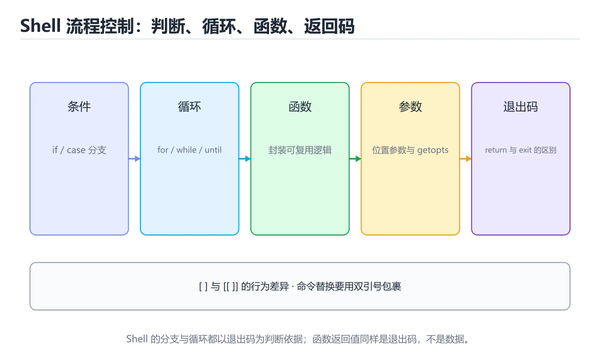

# Shell 流程控制与函数

> 内容更新时间：2026-10-06 · 学习阶段：基础 · 预计用时：45 分钟




## 本节知识框架

**课程定位**：所属分类为「Shell」，课程主题为「Shell 流程控制与函数」，学习阶段为「基础」，建议用时 45 分钟。

**本课要解决的主问题**：变量引号、条件判断、循环、函数与参数解析。

| 学习层次 | 要回答的问题 | 完成判据 |
| --- | --- | --- |
| 概念层 | 「Shell 流程控制与函数」有哪些必须区分的对象与术语？ | 能用自己的话定义核心术语，并各举一个正例和一个反例。 |
| 机制层 | 这些对象按什么顺序发生作用，输入如何变成输出？ | 能画出或写出机制步骤，并说明每一步的失败条件。 |
| 应用层 | 什么场景适合使用「Shell 流程控制与函数」，什么场景不适合？ | 能给出一个真实场景、一个最小示例和一个边界案例。 |
| 性能层 | 时间、空间、吞吐或延迟受哪些量影响？ | 能说出复杂度或性能瓶颈的证据来源；没有证据时明确写“材料未提供”。 |
| 复习层 | 怎样确认自己不是只记住了结论？ | 能独立完成本课自测，并把错误定位到概念、机制、示例或边界。 |

### 阅读路线

1. 先读「核心概念定义」，建立「Shell」等对象的精确定义。
2. 再读「原理与运行机制」，把定义串成可重复的过程。
3. 用「代码/协议/SQL 示例」验证过程，并只改一个条件观察结果变化。
4. 最后检查性能、易错点、知识关系与自测题，形成可复习的证据链。

**前置知识**：《Shell 与 Bash 脚本》

**学习位置**：本课位于《Shell 与 Bash 脚本》之后；如果前一课的自测不能通过，应先回补再继续。

**后续衔接**：下一课《健壮与可移植的 Shell 脚本》会继续使用本课术语，学完后建议立即完成一次自测。

**教材衔接：学习目标**

- 能用自己的话解释Shell 流程控制与函数解决了什么问题，而不是只背术语。
- 能说清 「Shell」、「变量」、「条件」、「循环」 之间的关系，并分别举出一个例子。
- 能把 Shell 放回「Shell 流程控制与函数」的知识体系，说明它和 变量 的边界。
- 能完成本课练习，并用验收标准检查自己的结果。

> 一句话摘要：变量引号、条件判断、循环、函数与参数解析。

**教材衔接：前置知识**

- 先完成上一课《Shell 与 Bash 脚本》；如果已经掌握，可以直接用本课练习自测。
- 本课阶段：入门。只需要基本计算机操作，不要求编程经验。
- 开始前先复习：Shell、变量、条件。
- 卡在 Shell 上时不要跳过：把输入、预期和实际输出写成三行，再回头读正文。

**教材衔接：本课小结**

Shell 流程控制的核心是**引号、`[[ ]]` 判断、while read 遍历与 `$?` 退出码**；把这几件事写规范，脚本就稳定了一半。

## 核心概念定义

> 阅读约定：本课先给「Shell 流程控制与函数」相关术语的操作性定义与适用边界；正文里的口语化说法与定义冲突时，以定义和可复现示例为准。

| 术语 | 操作性定义 | 本课中的边界 |
| --- | --- | --- |
| Shell | 接收命令并调用操作系统程序的命令行解释器与脚本环境。 | 仅在「Shell 流程控制与函数」明确给出的输入、版本与资源条件下成立。 |
| 循环 | for/while 按列表或条件重复执行命令块，配合 break 与 continue 控制流程。 | 仅在「Shell 流程控制与函数」明确给出的输入、版本与资源条件下成立。 |
| 函数 | 接收输入、执行确定逻辑并返回结果的代码单元。 | 仅在「Shell 流程控制与函数」明确给出的输入、版本与资源条件下成立。 |
| 条件判断 | if 与 test 按退出码判断条件，字符串与数字的比较写法不同，变量要加引号。 | 仅在「Shell 流程控制与函数」明确给出的输入、版本与资源条件下成立。 |

### 定义如何使用

在「Shell 流程控制与函数」中判断一个说法是否成立，先确认它使用的是哪个对象的定义，再检查输入规模、运行环境与失败路径。定义不是口号，而是后续推导、代码示例和自测题共享的约束。

**教材衔接：变量与引号**

```text
name="tom"            # 等号两侧不能有空格
echo "$name"          # 双引号：展开变量
echo '$name'          # 单引号：原样输出
echo "${name}_id"     # 花括号界定变量边界
```

变量与路径**一律加引号**，否则含空格或通配符的值会被拆分成多个参数（`rm -rf $dir` 是最经典的误删来源）。

**教材衔接：变量与参数速查**

| 写法 | 含义 |
| --- | --- |
| `name="tom"` | 赋值（等号两侧不能有空格） |
| `"${name}"` | 引用变量，加引号防分词 |
| `${name:-默认}` | 未设置或为空时用默认值 |
| `${name:=默认}` | 未设置时赋值并返回 |
| `${name:?错误提示}` | 未设置时报错退出 |
| `${#name}` | 字符串长度 |
| `${name:0:3}` | 截取子串 |
| `${name%.*}` | 去掉最后一个点之后的部分 |
| `${name##*/}` | 取路径中的文件名 |
| `$#` | 参数个数 |
| `$1`、`$@`、`$*` | 位置参数；`"$@"` 保留参数边界 |
| `shift` | 左移参数，消费第一个 |
| `getopts` | 解析短选项 |
| `$?` | 上一条命令的退出码 |
| `$$` | 当前进程 PID |

```bash
#!/usr/bin/env bash
set -euo pipefail

readonly LOG_DIR="${LOG_DIR:-/var/log/myapp}"
: "${API_TOKEN:?必须设置 API_TOKEN}"

usage() {
  cat <<'EOF'
用法: deploy.sh [-e 环境] [-n] 目标
  -e 环境   指定部署环境（dev/staging/prod）
  -n        只演练不真正执行
EOF
}

env="dev"
dry_run=0
while getopts ":e:nh" opt; do
  case "$opt" in
    e) env="$OPTARG" ;;
    n) dry_run=1 ;;
    h) usage; exit 0 ;;
    :) echo "缺少 -$OPTARG 的参数" >&2; exit 2 ;;
    \?) echo "未知选项 -$OPTARG" >&2; usage >&2; exit 2 ;;
  esac
done
shift $((OPTIND - 1))

target="${1:-}"
[[ -n "$target" ]] || { usage >&2; exit 2; }
echo "环境=$env 目标=$target 演练=$dry_run"
```

## 原理与运行机制

### 机制总览

1. **建立输入**：把「Shell」按本课定义整理成可观察、可重复的输入条件。
2. **执行转换**：围绕「循环」执行本课的核心步骤；每一步都记录中间状态，避免只看最终输出。
3. **产生输出**：得到「函数」后，用正文示例或协议/SQL 结果核对输出是否符合预期。
4. **改变一个条件**：只替换一个边界条件或环境参数，观察「Shell 流程控制与函数」的结论是否仍然成立。

| 阶段 | 关注对象 | 失败时应检查 |
| --- | --- | --- |
| 输入 | Shell | 类型、范围、编码、版本或前置状态是否满足定义。 |
| 处理 | 循环 | 顺序、可见性、锁、路由、事务或调度规则是否被破坏。 |
| 输出 | 函数 | 结果是否可复现，错误是否被正确传播而不是被吞掉。 |

本课的机制结论要用「Shell 流程控制与函数」自己的示例验证。「Shell 流程控制与函数」没有给出某个数量级、吞吐或内存数据时，本课把该判断标为“材料未提供”，不从相邻主题外推。

**教材衔接：条件判断**

| 写法 | 用途 |
| --- | --- |
| `[ -f "$file" ]` | 文件存在且是普通文件 |
| `[ -d "$dir" ]` | 目录存在 |
| `[ -z "$s" ]` / `[ -n "$s" ]` | 字符串为空 / 非空 |
| `[ "$a" = "$b" ]` | 字符串相等 |
| `[ "$a" -gt 10 ]` | 数值比较（-eq/-ne/-gt/-lt/-ge/-le） |
| `[[ ... ]]` | Bash 增强，支持正则 `=~` 与逻辑组合 |

**教材衔接：函数与退出码**

函数用 `name() { ... }` 定义，`$1 $2` 取参数，`$@` 取全部参数，`return n` 返回退出码（0 成功）。命令失败可用 `||` 兜底：`cp a b || echo "复制失败"`。

**教材衔接：参数解析**

小脚本用 `$1 $2` 与 `shift`；需要选项时用 `getopts "f:o:v"`，或 `while [ $# -gt 0 ]` 配合 `case "$1"` 手写解析。无论哪种，都要打印 usage 并校验必填参数。

**教材衔接：流程控制速查**

| 结构 | 写法 |
| --- | --- |
| 条件 | `if [[ "$env" == "prod" ]]; then ... fi` |
| 数值比较 | `if (( count > 10 )); then ... fi` |
| 文件判断 | `[[ -f "$f" ]]`、`[[ -d "$d" ]]`、`[[ -x "$bin" ]]` |
| for 遍历列表 | `for f in "$@"; do ... done` |
| for 遍历目录 | `for f in ./*.log; do ... done` |
| while 读文件 | `while IFS= read -r line; do ... done < "$file"` |
| case 分支 | `case "$1" in start) ... ;; stop) ... ;; *) ... ;; esac` |
| 函数返回数据 | `printf '%s\n' "$value"` + `result="$(fn)"` |
| 函数返回状态 | `return 0/1`，用 `if fn; then` 判断 |

**教材衔接：版本与时效**

- 版本提示：Shell 的行为在最近几个大版本里有过调整，升级「Shell 流程控制与函数」前先用 API_TOKEN 复现当前输出，再对照官方发布说明逐条核对。
- 升级前确认 Shell 的兼容范围，把不可回退的改动单独拆成一次提交。

### 升级检查清单

- 先固定当前版本，跑通全部示例与测验，再升级工具链。
- 升级时只动一个依赖版本，用 API_TOKEN 记录构建与运行结果。
- 回归范围锁定 API_TOKEN 的默认行为，并确认弃用警告是否出现在构建输出里。
- 升级后把 API_TOKEN 的实测版本写进「内容元数据」，再更新复核日期。

## 典型应用场景

| 场景 | 典型输入或前提 | 期望产物 |
| --- | --- | --- |
| 学习验证 | 使用本课最小示例和 Shell、变量 | 能复现正文结论，并解释每一步。 |
| 工程落地 | 把「Shell 流程控制与函数」放入真实模块或服务边界 | 输出可观测、失败可定位、参数可配置。 |
| 故障排查 | 只改一个版本、规模、输入或依赖条件 | 能区分概念错误、实现错误和环境差异。 |

判断「Shell 流程控制与函数」的场景是否成立，标准是能否写出输入、处理、输出和失败路径；材料中没有出现的数据在本课标注为“材料未提供”，不用推测替代证据。

**课程内置实验入口**：`sandbox:bash`，用于动手验证《Shell 流程控制与函数》的机制；实验结论不替代概念定义与复杂度分析。

## 代码/协议/SQL 示例

### 最小可验证示例

下面保留《Shell 流程控制与函数》原文中的最小示例。先预测《Shell 流程控制与函数》示例的输出，再按正文步骤运行或推演；示例依赖外部环境时，同时记录版本与输入。

```text
name="tom"            # 等号两侧不能有空格
echo "$name"          # 双引号：展开变量
echo '$name'          # 单引号：原样输出
echo "${name}_id"     # 花括号界定变量边界
```

**教材衔接：循环**

```text
for f in *.log; do echo "$f"; done
for i in $(seq 1 5); do echo "$i"; done
while read -r line; do echo "$line"; done < file.txt
until [ "$n" -le 0 ]; do n=$((n-1)); done
```

遍历文件用 `for f in ...`，遍历命令输出用 `while read`（避免空格被拆分）；不要用 `for x in $(cat file)`。

**教材衔接：零基础详解：分支、循环、函数与参数解析**

### 一句话说清它是什么

Shell 的控制流很像其它语言，但**符号和空格规则特别严格**：
方括号内侧必须有空格、数字比较不能用 `>`、函数用 `return` 只能返回状态码。

### 判断：三种括号别用错

| 写法 | 支持 | 建议 |
| --- | --- | --- |
| `[ "$a" = "$b" ]` | POSIX，所有 shell | 可移植，注意内侧空格 |
| `[[ "$a" == "$b" ]]` | bash / zsh 扩展 | 更安全，不怕空变量，**脚本首选** |
| `(( a > b ))` | 算术比较 | 数字专用，写法最像其它语言 |

```bash
score=85

if [[ $score -ge 90 ]]; then
  echo "优秀"
elif (( score >= 60 )); then
  echo "及格"
else
  echo "不及格"
fi
```

数字比较必须用 `-gt -lt -ge -le -eq -ne`，或直接用 `(( ))`。

### 三种循环与 `case`

```bash
# for：遍历列表
for f in *.log; do
  echo "处理 $f"
done

# while read：按行读取文件（最稳的写法）
while IFS= read -r line; do
  echo "行内容：$line"
done < input.txt

# while：条件驱动
count=0
while (( count < 3 )); do
  echo "第 $((count + 1)) 次"
  ((count++))
done

# case：多分支匹配
case "$1" in
  start)  echo "启动" ;;
  stop)   echo "停止" ;;
  status) echo "查看状态" ;;
  *)      echo "用法：$0 {start|stop|status}" >&2; exit 1 ;;
esac
```

**遍历文件内容一定要用 `while IFS= read -r`**，`for x in $(cat file)` 会按空白拆分，遇到空格就错。

### 函数：参数用 `$1`，结果用 `echo`

```bash
log() {
  local level="$1"; shift          # local 限定作用域；shift 把参数前移
  local message="$*"
  printf '[%s] %s\n' "$level" "$message" >&2
}

is_number() {
  [[ "$1" =~ ^[0-9]+$ ]]           # 返回值就是条件结果
}

log INFO "服务已启动"
if is_number "123"; then echo "是数字"; fi
```

| 要点 | 说明 |
| --- | --- |
| `local` | 声明函数内局部变量，避免污染全局 |
| `shift` | 把参数列表往前移一位，便于逐个处理 |
| `return N` | 只能返回 0~255 的状态码，不能返回字符串 |
| `echo` + `$(...)` | 函数要「返回数据」的正确方式 |

### 参数解析：手动 + `getopts`

```bash
verbose=0
output=""

while getopts ":vo:h" opt; do
  case "$opt" in
    v) verbose=1 ;;
    o) output="$OPTARG" ;;
    h) echo "用法：$0 [-v] [-o 输出文件]"; exit 0 ;;
    \?) echo "未知选项：-$OPTARG" >&2; exit 1 ;;
    :)  echo "选项 -$OPTARG 需要参数" >&2; exit 1 ;;
  esac
done
shift $((OPTIND - 1))     # 剩下的是位置参数
```

`getopts` 是 POSIX 内建，能自动处理「选项需要值」的情况；长选项则需要 `getopt` 或手动解析。

### 新手最容易踩的七个坑

| 坑 | 现象 | 正确做法 |
| --- | --- | --- |
| 方括号内侧少空格 | `[: command not found` | 写成 `[ "$a" = "$b" ]` |
| 数字用 `>` 比较 | 变成重定向，产生怪文件 | 用 `-gt` 或 `(( ))` |
| `for` 遍历命令输出 | 含空格的项被拆开 | 用 `while read -r` 或数组 |
| 函数忘了 `local` | 变量污染全局 | 一律 `local` |
| 用 `return` 返回字符串 | 报错或只拿到状态码 | 用 `echo` + 命令替换 |
| `$(...)` 不加引号 | 输出被拆分 | `result="$(func)"` |
| `case` 忘了 `esac` | 语法错误 | 检查 `case ... esac` 配对 |

### 手把手练习：带子命令的脚本骨架

```bash
#!/usr/bin/env bash
set -euo pipefail

usage() {
  echo "用法：$0 <init|build|clean>" >&2
  exit 1
}

cmd_init()  { echo "初始化……"; }
cmd_build() { echo "构建中……"; }
cmd_clean() { echo "清理完成"; }

main() {
  [[ $# -ge 1 ]] || usage
  case "$1" in
    init)  cmd_init ;;
    build) cmd_build ;;
    clean) cmd_clean ;;
    *)     usage ;;
  esac
}

main "$@"
```

`main "$@"` 加引号很重要：保证参数里的空格不被拆开。

### 学完自测

- [ ] 能说出 `[ ]`、`[[ ]]`、`(( ))` 各自适合什么。
- [ ] 知道数字比较为什么不能用 `>`。
- [ ] 能写出按行读文件的正确循环。
- [ ] 知道函数里 `local` 的作用。
- [ ] 能用 `case` 写出带子命令的脚本骨架。

## 时间/空间复杂度或性能分析

**复杂度证据**：「Shell 流程控制与函数」的现有材料没有给出渐近时间或空间复杂度的明确结论，本课只做定性检查，不补写未经验证的 $O$ 记号。

| 维度 | 本课关注点 | 判断依据 |
| --- | --- | --- |
| 时间/延迟 | 「Shell 流程控制与函数」的主要步骤是否会随输入规模、并发度或网络往返增长。 | 以正文复杂度、基准数据或可重复测量为准。 |
| 空间/内存 | 中间状态、缓存、副本、连接或索引是否随规模增长。 | 记录峰值内存与数据副本，不只看最终结果。 |
| 吞吐/资源 | 版本、调度、锁、IO、序列化或协议开销是否成为瓶颈。 | 固定环境做对照实验，改变一个变量。 |

评估「Shell 流程控制与函数」时要区分“正确性成立”和“性能达标”两件事；材料没有给出基准时，本课只保留量级来源与测量方法，不写不可验证的绝对数字。

## 常见误区与易错点

> 复核《Shell 流程控制与函数》的易错点时，优先保留原文的错误表、故障现场与排错路径；每条修正都要能用本课示例复验。

| 易错点 | 常见表现 | 正确做法 |
| --- | --- | --- |
| 只背结论 | 能复述「Shell 流程控制与函数」的定义，却说不清输入、输出与边界。 | 回到机制步骤，用最小示例逐一验证。 |
| 混淆相邻概念 | 把本课对象与相邻主题的对象当成同一类。 | 先比较定义、资源归属、生命周期和失败模式。 |
| 忽略版本与环境 | 在开发机通过后直接外推到生产环境。 | 固定版本、输入和资源条件，再记录可复现结果。 |

**教材衔接：常见错误与排查**

| 容易写错的做法 | 实际现象 | 原因与正确做法 |
| --- | --- | --- |
| `$1` 未引号 | 参数含空格被拆分 | 写 `"$1"` 或 `"$@"` |
| `[[ $a = $b ]]` 未加引号 | 空值导致语法错误 | 写 `[[ "$a" == "$b" ]]` |
| 用 `[ ]` 又用 `&&` | 语法错误 | 用 `[[ ]]` 或 `[ ] -a` |
| `$((...))` 里用浮点 | 报错 | Shell 只支持整数，用 `awk` / `bc` |
| 函数里用 `exit` | 整个脚本退出 | 需要返回上层时用 `return` |
| 全局变量当作函数返回值 | 并发调用互相覆盖 | 用 `printf` 输出 + 命令替换 |
| `local` 用在函数外 | 报错 | 只在函数内使用 |
| 忘记 `shift` | 参数被重复处理 | 用 `getopts` 后 `shift $((OPTIND-1))` |
| 用 `==` 在 `[ ]` 中 | 兼容性问题 | `[[ ]]` 允许 `==`，`[ ]` 用 `=` |
| 未处理未知选项 | 静默忽略错误参数 | `case` 中加 `\?` 分支报错 |

**教材衔接：故障现场**

### 现场 1：$1 未引号

**症状**：在《Shell 流程控制与函数》的复现场景中，参数含空格被拆分。

**根因**：触发点是把“$1 未引号”当成安全做法。它没有满足《Shell 流程控制与函数》要求的前提，因此先表现为“参数含空格被拆分”；排查时先完整复现这一段，再核对输入、配置与依赖。

**修复**：针对《Shell 流程控制与函数》的问题，写 "$1" 或 "$@"。

**验证**：保留《Shell 流程控制与函数》里触发“参数含空格被拆分”的输入、版本和日志，按“写 "$1" 或 "$@"”完成修改后原样重放；只有失败现象消失且相邻场景仍可解释，才保留改动。

### 现场 2：[[ $a = $b ]] 未加引号

**症状**：在《Shell 流程控制与函数》的复现场景中，空值导致语法错误。

**根因**：“空值导致语法错误”只是表层结果。向上追溯会落到“[[ $a = $b ]] 未加引号”这一步，因为它省略了《Shell 流程控制与函数》的约束，使实现行为和预期模型发生了偏离。

**修复**：针对《Shell 流程控制与函数》的问题，写 [[ "$a" == "$b" ]]。

**验证**：在《Shell 流程控制与函数》中按“写 [[ "$a" == "$b" ]]”调整后，从“[[ $a = $b ]] 未加引号”的触发条件重放同一条路径，确认“空值导致语法错误”不再出现，并补一个相邻边界用例检查没有引入新问题。

### 现场 3：函数里用 exit

**症状**：在《Shell 流程控制与函数》的复现场景中，整个脚本退出。

**根因**：“整个脚本退出”只是表层结果。向上追溯会落到“函数里用 exit”这一步，因为它省略了《Shell 流程控制与函数》的约束，使实现行为和预期模型发生了偏离。

**修复**：针对《Shell 流程控制与函数》的问题，需要返回上层时用 return。

**验证**：先在《Shell 流程控制与函数》中记录“函数里用 exit”留下的失败证据，再执行“需要返回上层时用 return”并重放；确认错误路径变为明确结果，且修复没有掩盖同类故障。

## 与其他知识点的关系

| 关系 | 课程 | 为什么 |
| --- | --- | --- |
| 先修 | 《Shell 与 Bash 脚本》 | 本课会直接使用它的概念或操作前提。 |
| 关联 | 《Shell 文本处理流水线》 | 用于横向比较或把本课结论迁移到相邻主题。 |
| 前置顺序 | 《Shell 与 Bash 脚本》 | 同分类中安排在本课之前，建议先完成其自测。 |
| 后续顺序 | 《健壮与可移植的 Shell 脚本》 | 同分类中安排在本课之后，会继续使用本课术语。 |

把「Shell 流程控制与函数」放回知识体系时，不只要记住“前面学过什么”，还要说明两个主题在输入、机制、资源边界和失败模式上的差异。这样才能把单课知识迁移到项目、排障和后续课程。

## 自测题与参考答案

> 先独立作答《Shell 流程控制与函数》的自测题，再对照答案与解析；每处判断都要能在本课正文或示例中找到依据。

### 自测 1

阅读「Shell 流程控制与函数」中的这段 Shell 代码，下面哪项判断最准确？

```shell
log() {
  local level="$1"; shift          # local 限定作用域；shift 把参数前移
  local message="$*"
  printf '[%s] %s\n' "$level" "$message" >&2
}

is_number() {
  [[ "$1" =~ ^[0-9]+$ ]]           # 返回值就是条件结果
}

log INFO "服务已启动"
if is_number "123"; then echo "是数字"; fi
```

A. 这段 Shell 代码只展示语法，不会读取任何输入或产生可验证输出。
B. Shell、变量、条件 的结论只取决于关键字数量，与代码的控制流和边界条件无关。
C. 变量引号、条件判断、循环、函数与参数解析。
D. 它说明 Shell、变量、条件 只需要记忆结论，不需要记录版本、输入与运行结果。

**参考答案**：变量引号、条件判断、循环、函数与参数解析。

**解析**：在「Shell 流程控制与函数」里，这段 Shell 代码来自本课的本地示例，主要用来核对 Shell、变量、条件、循环 之间的输入、处理和输出关系，变量引号、条件判断、循环、函数与参数解析。「Shell 流程控制与函数」要求先交代Shell、变量、条件的前提再下结论，所以“变量引号、条件判断、循环”只在题干“阅读Shell 流程控制与函数中的这段 Shell 代码”给定的条件下成立。

### 自测 2

围绕“Shell 流程控制与函数”中的 Shell、变量、条件，下列哪两项是本课强调的实践判断？

A. 把 变量 的单次运行结果当成所有版本和规模都成立
B. 学习 Shell 时要同时说明输入、输出和失败路径，不能只看正常流程
C. 只要 Shell 的常规示例通过，就可以跳过边界与异常路径
D. 验证 变量 时要固定版本并覆盖边界输入，结论才可复现

**参考答案**：学习 Shell 时要同时说明输入、输出和失败路径，不能只看正常流程；验证 变量 时要固定版本并覆盖边界输入，结论才可复现

**解析**：在「Shell 流程控制与函数」里，题干的正确项是学习 Shell 时要同时说明输入、输出和失败路径，不能只看正常流程。在Shell 流程控制与函数里，判断 变量 时要固定版本与边界输入，所以“验证 变量 时要固定版本并覆盖边界输入，结论才可复现”才可复现。回到「Shell 流程控制与函数」的正文示例，用“围绕Shell 流程控制与函数中的”走一遍Shell、变量、条件的完整流程，能复现的结论才可以保留。

### 自测 3

判断数值大于 10 的正确写法是？

A. [ "$a" -gt 10 ]
B. [ "$a" = 10 ]
C. [[ $a >> 10 ]]
D. [ "$a" > 10 ]

**参考答案**：[ "$a" -gt 10 ]

**解析**：在「Shell 流程控制与函数」里，[ "$a" -gt 10 ]。数值比较用 -gt/-lt/-eq 等。在「Shell 流程控制与函数」里判断这道题，要把Shell、变量、条件的条件、过程与失败路径逐项对齐，换成“判断数值大于 10 的正确写法是”这个场景，只有满足前提的结论才成立。

**教材衔接：复习与自测**

- [ ] 变量与参数展开一律加双引号。
- [ ] 用 `: "${VAR:?msg}"` 校验必填变量。
- [ ] 用 `getopts` 解析选项并处理错误分支。
- [ ] 函数通过 stdout 返回数据，用 `return` 返回状态。
- [ ] 条件判断统一用 `[[ ]]` / `(( ))`。

**教材衔接：动手练习**

> 本课练习重点：围绕「Shell、变量、条件」完成复述、实验和交付，每个结果都要能被别人检查。

先加严格模式，再在临时目录验证成功与失败路径，最后补回滚。

### 练习 1：建立心智模型（10 分钟）

合上教程，用 3～5 句话回答：

1. Shell 流程控制与函数解决了什么问题？
2. 如果没有它，会出现什么具体后果？
3. 它和「变量」是什么关系？

验收标准：用自己的话解释 Shell，并给出一个它不成立的反例。

### 练习 2：做一次可控实验（20 分钟）

从正文中选一个最小示例，完成以下操作：

1. 先预测修改一个参数、输入或步骤后的结果。
2. 再实际执行或逐步推演，记录真实结果。
3. 如果结果与预测不同，写出差异原因。

**验收标准**：围绕「变量与引号」小节做一次五步记录，原例取自 API_TOKEN，改动只允许动一处Shell，原因要能指回正文的判断依据。

### 练习 3：交付一个小结果（30 分钟）

写一个只包含 Shell 的最小程序，先验证正常路径，再制造一次失败。

任务要求：

- 结果必须能被别人检查，不能只写“我已经理解了”。
- 至少覆盖「Shell」和「变量」两个关键词。
- 写出 1 个仍然不确定的问题，以及下一步如何验证。

> 提示：时间有限时优先做练习 1 和练习 2；练习 3 可以拆成两次完成。

**教材衔接：可运行练习**

### 任务 1：先跑通，再解释

```bash
#!/usr/bin/env bash
set -euo pipefail

readonly LOG_DIR="${LOG_DIR:-/var/log/myapp}"
: "${API_TOKEN:?必须设置 API_TOKEN}"

usage() {
  cat <<'EOF'
用法: deploy.sh [-e 环境] [-n] 目标
  -e 环境   指定部署环境（dev/staging/prod）
  -n        只演练不真正执行
EOF
}

env="dev"
dry_run=0
while getopts ":e:nh" opt; do
  case "$opt" in
    e) env="$OPTARG" ;;
    n) dry_run=1 ;;
    h) usage; exit 0 ;;
    :) echo "缺少 -$OPTARG 的参数" >&2; exit 2 ;;
    \?) echo "未知选项 -$OPTARG" >&2; usage >&2; exit 2 ;;
  esac
done
shift $((OPTIND - 1))

target="${1:-}"
[[ -n "$target" ]] || { usage >&2; exit 2; }
echo "环境=$env 目标=$target 演练=$dry_run"
```

**预期输出**：环境=$env 目标=$target 演练=$dry_run

### 任务 2：只改一个条件

把「Shell 流程控制与函数」的最小示例复制一份，只改一个条件再跑一次：

- 改动点：只把 Shell 的输入换成空值、极值或错误输入，其余保持不变。
- 预测：先写下「Shell 流程控制与函数」在改动后的输出或错误信息，再运行。
- 记录：对照改动前后的结果，指出差异出在哪一步。
- 验收：换回原条件能复现原结果，改动只影响Shell。

### 任务 3：迁移到自己的数据

把 API_TOKEN 换成你自己的输入，先保持步骤不变，再比较输出差异。

**教材衔接：本课复习清单**

离开本课前，逐项确认：

- [ ] 不看解析，能说出「Shell 中变量赋值 name=tom 的要求是？」的判断依据。
- [ ] 不看解析，能说出「遍历命令输出（按行）推荐使用？」的判断依据。
- [ ] 不看解析，能说出「判断数值大于 10 的正确写法是？」的判断依据。
- [ ] 不看解析，能说出「脚本参数中 $1 与 "$@" 的区别是？」的判断依据。
- [ ] 不看解析，能说出「Shell 函数如何返回一个字符串结果？」的判断依据。
- [ ] 用 Shell 构造一个正常输入和一个边界输入，分别记录输出与判断依据。
- [ ] 把本课最容易混淆的两个概念写成一句话对照。

| 复盘项 | 记录 |
| --- | --- |
| 已经能独立解释的考点 |  |
| 仍然说不清的概念 |  |
| 下一步验证动作 |  |

---

## 术语速查

| 术语 | 一句话说明 |
| --- | --- |
| `Shell` | 接收命令并调用操作系统程序的命令行解释器与脚本环境。 |
| `循环` | for/while 按列表或条件重复执行命令块，配合 break 与 continue 控制流程。 |
| `函数` | 接收输入、执行确定逻辑并返回结果的代码单元。 |
| `条件判断` | if 与 test 按退出码判断条件，字符串与数字的比较写法不同，变量要加引号。 |

## 考点精讲

### 考点 1：代码补全·Shell

- **题目**：阅读「Shell 流程控制与函数」中的这段 Shell 代码，下面哪项判断最准确？
- **判断依据**：在「Shell 流程控制与函数」里，这段 Shell 代码来自本课的本地示例，主要用来核对 Shell、变量、条件、循环 之间的输入、处理和输出关系，变量引号、条件判断、循环、函数与参数解析。「Shell 流程控制与函数」要求先交代Shell、变量、条件的前提再下结论，所以“变量引号、条件判断、循环”只在题干“阅读Shell 流程控制与函数中的这段 Shell 代码”给定的条件下成立。

### 考点 2：多选辨析·Shell

- **题目**：围绕“Shell 流程控制与函数”中的 Shell、变量、条件，下列哪两项是本课强调的实践判断？
- **判断依据**：在「Shell 流程控制与函数」里，题干的正确项是学习 Shell 时要同时说明输入、输出和失败路径，不能只看正常流程。在Shell 流程控制与函数里，判断 变量 时要固定版本与边界输入，所以“验证 变量 时要固定版本并覆盖边界输入，结论才可复现”才可复现。回到「Shell 流程控制与函数」的正文示例，用“围绕Shell 流程控制与函数中的”走一遍Shell、变量、条件的完整流程，能复现的结论才可以保留。

### 考点 3：概念判断·Shell

- **题目**：判断数值大于 10 的正确写法是？
- **判断依据**：在「Shell 流程控制与函数」里，[ "$a" -gt 10 ]。数值比较用 -gt/-lt/-eq 等。在「Shell 流程控制与函数」里判断这道题，要把Shell、变量、条件的条件、过程与失败路径逐项对齐，换成“判断数值大于 10 的正确写法是”这个场景，只有满足前提的结论才成立。

### 考点 4：概念判断·Shell

- **题目**：脚本参数中 $1 与 "$@" 的区别是？
- **判断依据**：转发参数时要用 "$@"（带引号），否则含空格的参数会被拆开。在「Shell 流程控制与函数」里，作答时，先用Shell建立输入与输出的基线，再把$1 是第一个参数代入边界条件核对，结论才能复现。在「Shell 流程控制与函数」里，这道题要求区分概念与边界，「$1 是第一个参数」只有在题干给出的前提下才成立，而「两者相同」、「$1 表示参数个数」缺少同一组条件。

### 考点 5：概念判断·Shell

- **题目**：Shell 函数如何返回一个字符串结果？
- **判断依据**：在「Shell 流程控制与函数」里，用 echo 输出。return 表示成功/失败状态，真正的数据要靠标准输出传递。在「Shell 流程控制与函数」里判断这道题，要把Shell、变量、条件的条件、过程与失败路径逐项对齐，换成“Shell 函数如何返回一个字符串结”这个场景，只有满足前提的结论才成立。

### 考点 6：填空·set -euo ____

- **题目**：补全代码：「Shell 流程控制与函数」示例中，下面这行代码缺少哪个关键字或函数名？请填入 ____。 `set -euo ____`
- **判断依据**：在「Shell 流程控制与函数」里，pipefail。回到「Shell 流程控制与函数」的正文示例，用“补全代码”走一遍Shell、变量、条件的完整流程，能复现的结论才可以保留。回到Shell、变量、条件本身再看一遍：只有“pipefail”与题干“Shell”的前提一致，结论才成立。

## English Overview

**Title:** Shell Control Flow

**Summary:** Quoting, conditions, loops, functions and argument parsing.

**Category:** Shell
**Level:** 入门
**Key terms:** Shell, 变量, 条件, 循环, 函数

## 内容元数据

- 内容版本：v2.0
- 最后更新：2026-10-06
- 学习阶段：基础
- 适用环境：Bash 5 / POSIX Shell
；本课聚焦 Shell。
- 内容来源：内置结构化课程与工程实践整理
- 相关主题：Shell、变量、条件、循环、函数
- 质量版本：P0 测验标准 + P1 覆盖扩展 + P2 体验补全

## 参考资料与复核

- 最后复核：2026-10-04
- 下次复核：2027-02-10
- 复核范围：版本兼容、API 行为、安全建议与工程实践
- 来源性质：官方文档、标准或权威教材；正文为离线教学重组

| 参考资料 | 本课用途 |
| --- | --- |
| [GNU Bash 手册](https://www.gnu.org/software/bash/manual/) | Bash 语法、展开与作业控制 |
| [POSIX Shell 标准](https://pubs.opengroup.org/onlinepubs/9799919799/utilities/V3_chap02.html) | 可移植 Shell 语法 |
| [jq 手册](https://jqlang.org/manual/) | JSON 查询与转换 |

> 「Shell 流程控制与函数」的链接用于离线阅读后的延伸核对；App 不会自动联网。
