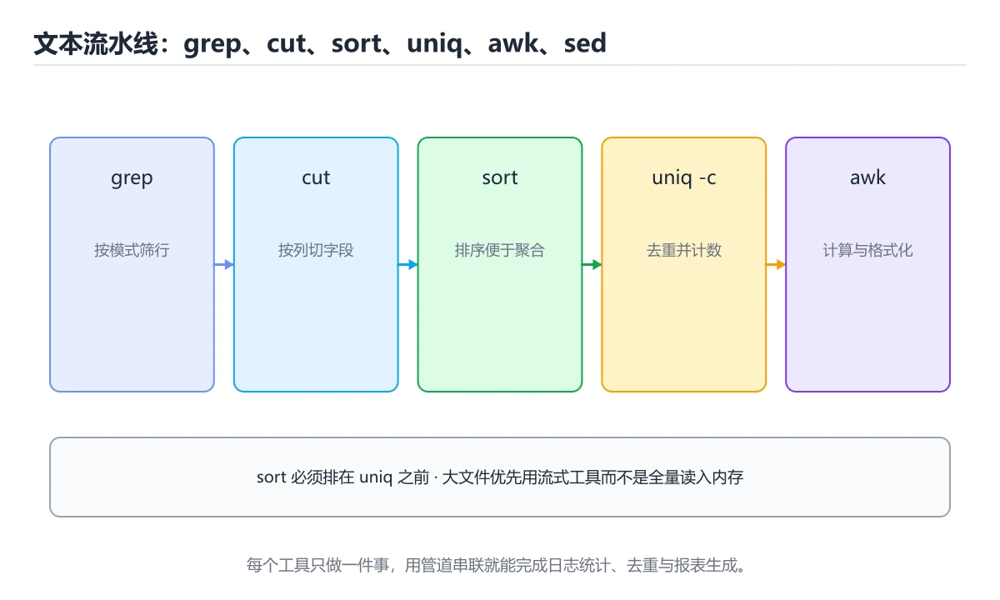
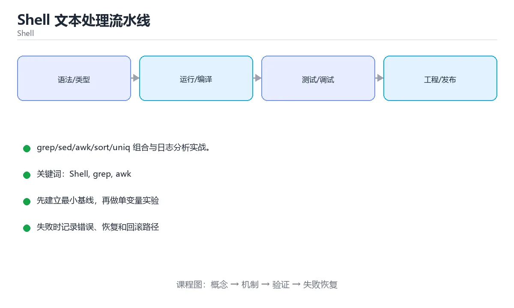

# Shell 文本处理流水线





> 内容更新时间：2026-10-03 · 学习阶段：入门 · 预计用时：15 分钟

## 学习目标

- 能用自己的话解释「Shell 文本处理流水线」解决了什么问题，而不是只背术语。
- 能说清 「Shell」、「grep」、「awk」、「sed」 之间的关系，并分别举出一个例子。
- 能把本课知识放回「Shell」的知识体系，说明它和相邻主题的边界。
- 能完成本课练习，并用验收标准检查自己的结果。

> 一句话摘要：grep/sed/awk/sort/uniq 组合与日志分析实战。

## 前置知识

- 先完成上一课《Shell 流程控制与函数》；如果已经掌握，可以直接用本课练习自测。
- 本课阶段：入门。只需要基本计算机操作，不要求编程经验。
- 开始前先复习：Shell、grep、awk。
- 如果某一步看不懂，先记录具体卡点，完成练习后再回头读一遍。


## 六个核心工具

| 工具 | 用途 | 常用参数 |
| --- | --- | --- |
| grep | 按模式过滤行 | -i 忽略大小写、-v 反选、-r 递归、-c 计数 |
| sed | 流式替换与删除 | `sed 's/old/new/g'`、`sed -n '1,10p'` |
| awk | 按列处理与统计 | `awk '{print $1, $3}'`、`awk -F, '{sum+=$2} END{print sum}'` |
| sort | 排序 | -n 数值、-r 逆序、-k2 按第 2 列 |
| uniq | 去重计数 | -c 计数（需先 sort） |
| cut | 取列 | -d, -f2（按逗号分隔取第 2 列） |

再加 `xargs`（批量执行）、`find`（定位文件）、`tr`（字符替换）、`tee`（分流）即可覆盖绝大多数文本任务。

## 日志分析实战

```text
# 访问量 Top10 的 URL
awk '{print $7}' access.log | sort | uniq -c | sort -rn | head -10

# 统计 5xx 错误数
grep -c ' 5[0-9][0-9] ' access.log

# 找出响应最慢的前 5 个请求（假设最后一列是耗时毫秒）
awk '{print $NF, $7}' access.log | sort -rn | head -5

# 批量把 .tmp 重命名为 .bak
find . -name '*.tmp' -print0 | xargs -0 -I{} mv {} {}.bak
```

要点：处理含空格的文件名用 `-print0` + `xargs -0`；大文件全程走管道流式处理，避免读入内存。

## 组合的力量

Shell 的精髓是「每个工具只做一件事，用管道拼装」：过滤（grep）→ 提取（cut/awk）→ 排序（sort）→ 去重计数（uniq -c）→ 取头部（head）。掌握这条链路就能替代很多一次性脚本。

## 何时不该用 Shell

需要数据结构（哈希表、嵌套对象）、复杂 JSON 解析、并发控制或大整数运算时，改用 Python 更可靠；Shell 只做编排与文本流。

## 本课小结
文本处理记住一条流水线范式：**grep 过滤 → awk/cut 取列 → sort 排序 → uniq -c 计数 → head/tail 截取**，配合 find + xargs 批量操作文件。


## 文本处理速查

| 工具 | 常用写法 | 用途 |
| --- | --- | --- |
| `grep` | `grep -inE "error\|warn" app.log` | 过滤行 |
| `grep -v` | `grep -v "^#" config` | 排除行 |
| `cut` | `cut -d: -f1,7 /etc/passwd` | 按分隔符取列 |
| `awk` | `awk -F, '{sum += $3} END {print sum}'` | 按列统计 |
| `sed` | `sed -E 's/old/new/g'` | 替换 |
| `sort` | `sort -k2 -n -r` | 按第 2 列数值倒序 |
| `uniq -c` | `sort \| uniq -c` | 计数（需先排序） |
| `tr` | `tr 'A-Z' 'a-z'` | 字符转换 |
| `wc -l` | `wc -l < file` | 计数 |
| `head` / `tail` | `tail -n 100 -f app.log` | 首尾与实时查看 |
| `jq` | `jq -r '.items[].name'` | 处理 JSON |
| `xargs` | `find . -name '*.tmp' -print0 \| xargs -0 rm` | 批量处理 |
| `tee` | `cmd \| tee -a out.log` | 分流保存 |

常用组合示例：

```bash
# 统计访问量 Top 10 的 IP
awk '{print $1}' access.log \
  | sort | uniq -c | sort -nr | head -n 10

# 找出大于 100MB 的文件并按大小排序
find /var/log -type f -size +100M -printf '%s %p\n' \
  | sort -nr | awk '{printf "%.1f MB\t%s\n", $1/1048576, $2}'

# 处理 JSON 数组并生成 SQL
jq -r '.users[] | "INSERT INTO users(id,name) VALUES (\(.id), \(.name|@json));"' users.json

# 并行处理（-P 4 表示最多 4 个并发）
find . -name '*.png' -print0 | xargs -0 -n1 -P4 optipng -quiet
```

## 性能与安全速查

| 关注点 | 建议 |
| --- | --- |
| 大文件 | 用流式管道，避免 `$(cat file)` 全量载入 |
| 减少进程 | 能用一次 `awk` 完成就不串联多个命令 |
| 状态码 | `set -o pipefail` 让管道失败可见 |
| 特殊文件名 | 用 `-print0` + `xargs -0` |
| 注入风险 | 不拼接用户输入到命令，使用参数数组 |
| 编码 | 统一 UTF-8，`LC_ALL=C` 可提升 sort 速度（纯 ASCII 场景） |

## 常见错误对照表

| 容易写错的做法 | 实际现象 | 原因与正确做法 |
| --- | --- | --- |
| `uniq -c` 前不排序 | 相同行不相邻，计数分散 | 先 `sort` 再 `uniq -c` |
| `for f in $(ls)` | 空格与换行导致文件名错乱 | 用通配符或 `find -print0` |
| `xargs` 不加 `-0` | 含空格文件名被拆 | `find -print0 \| xargs -0` |
| `grep` 忘了 `-F` | 内容含正则元字符导致误匹配 | 纯字符串搜索加 `-F` |
| 用 `sed -i` 跨平台 | macOS 需 `-i ''` 参数 | 用 `sed -i.bak` 或封装函数 |
| 管道前半失败被忽略 | 错误未暴露 | 加 `set -o pipefail` |
| `awk` 默认分隔符不适用 | 取列错位 | 显式 `-F','` |
| `$(...)` 结果含换行被当作多个参数 | 参数数量错误 | 加引号 `"$(...)"` 或用数组 |
| 对二进制文件跑文本工具 | 输出乱码、性能差 | 先判断文件类型 |
| 把用户输入直接拼进命令 | 命令注入 | 用数组参数或白名单校验 |

## 自测清单

- [ ] 会用 `awk` 按列统计并输出汇总。
- [ ] 计数前先排序，用 `uniq -c` 得到频次。
- [ ] 处理文件名一律 `-print0` 与 `xargs -0`。
- [ ] 管道场景开启了 `pipefail`。
- [ ] 纯文本搜索用 `grep -F`，复杂匹配才用正则。


## 零基础详解：管道与文本处理三剑客

### 一句话说清它是什么

Linux 的哲学是「**每个工具只做一件小事，用管道把它们串起来**」。
文本处理最常用的三件是：`grep` 找行、`sed` 改行、`awk` 按列统计。

### 用生活比喻理解

| 工具 | 比喻 | 一句话 |
| --- | --- | --- |
| `grep` | 筛子 | 按条件挑出需要的行 |
| `sed` | 修改器 | 对匹配到的内容做替换删除 |
| `awk` | 计算器 | 按列取值、求和、分组 |
| `sort` | 排序台 | 排序，是 `uniq` 的前置步骤 |
| `uniq` | 合并器 | 只合并**相邻**重复行 |
| `xargs` | 传送带 | 把输入变成命令行参数 |
| `tee` | 三通阀 | 一路写文件，一路继续往下传 |

### 一条日志分析流水线

```bash
# 找出错误最多的 5 个接口
grep '"level":"error"' app.log \
  | awk -F'"path":"' '{split($2, a, "\""); print a[1]}' \
  | sort \
  | uniq -c \
  | sort -rn \
  | head -n 5
```

拆开看每一步：

| 步骤 | 作用 |
| --- | --- |
| `grep` | 只保留含错误的行 |
| `awk -F` | 按分隔符切列，取出接口路径 |
| `sort` | 排序，让相同项相邻 |
| `uniq -c` | 统计每项出现次数 |
| `sort -rn` | 按数字倒序 |
| `head -n 5` | 取前 5 条 |

### 三个工具的常用写法

```bash
# grep：找内容
grep -rn "TODO" src/              # 递归搜索并显示行号
grep -i -w "error" app.log        # 忽略大小写、整词匹配
grep -v "^#" config.conf          # 排除注释行
grep -c "ERROR" app.log           # 只输出匹配行数

# sed：改内容
sed 's/old/new/' file             # 每行替换第一处
sed 's/old/new/g' file            # 每行替换全部
sed -i.bak 's/old/new/g' file     # 原地修改并留备份
sed -n '10,20p' file              # 只打印第 10~20 行

# awk：算内容
awk '{print $1, $3}' file         # 打印第 1、3 列
awk -F: '{print $1}' /etc/passwd  # 指定分隔符
awk '{sum += $2} END {print sum}' nums.txt
awk '$3 > 100 {print $1}' data.txt   # 条件筛选
```

### 安全处理文件名

```bash
# 错误：文件名含空格会被拆坏
find . -name "*.log" | xargs rm

# 正确：用 NUL 分隔
find . -name "*.log" -print0 | xargs -0 rm

# 更直接：find 自带执行（推荐）
find . -name "*.log" -exec rm {} +
```

### 新手最容易踩的八个坑

| 坑 | 现象 | 正确做法 |
| --- | --- | --- |
| `uniq` 前不排序 | 统计结果偏小 | 先 `sort` |
| 数字排序不加 `-n` | 10 排在 2 前面 | `sort -n` 或 `sort -rn` |
| 用 `xargs` 处理文件名 | 空格和换行导致误删 | 配 `-print0` 与 `-0` |
| `sed -i` 不带备份 | 改坏了没法还原 | `-i.bak` 或先输出验证 |
| 管道中间失败被忽略 | 错误静默通过 | 加 `set -o pipefail` |
| 以为 `grep` 支持正则全语法 | `\d`、`+` 不生效 | 用 `grep -E` 或 Perl 正则 `-P` |
| 在管道里拼接大文件 | 内存或速度问题 | 用 `awk` 一次遍历 |
| 输出直接覆盖源文件 | 文件被清空 | 写入临时文件后再 `mv` |

### 手把手练习：统计访问量前五的 IP

```bash
#!/usr/bin/env bash
set -euo pipefail

readonly LOG="${1:-access.log}"

if [[ ! -f "$LOG" ]]; then
  echo "日志文件不存在：$LOG" >&2
  exit 1
fi

echo "总请求数：$(wc -l < "$LOG")"
echo "状态码分布："
awk '{print $9}' "$LOG" | sort | uniq -c | sort -rn | head -n 5
echo "访问量前五的 IP："
awk '{print $1}' "$LOG" | sort | uniq -c | sort -rn | head -n 5
```

### 学完自测

- [ ] 能说出 `grep`、`sed`、`awk` 各自最擅长的场景。
- [ ] 知道为什么 `uniq -c` 前必须先 `sort`。
- [ ] 能说出安全处理文件名的两种写法。
- [ ] 知道 `set -o pipefail` 解决什么问题。
- [ ] 能写出「统计出现次数并取前 N」的完整管道。

## 动手练习


> 本课练习重点：围绕「Shell、grep、awk」完成复述、实验和交付，每个结果都要能被别人检查。

先加严格模式，再在临时目录验证成功与失败路径，最后补回滚。

### 练习 1：建立心智模型（10 分钟）

合上教程，用 3～5 句话回答：

1. 「Shell 文本处理流水线」解决了什么问题？
2. 如果没有它，会出现什么具体后果？
3. 它和「grep」是什么关系？

**验收标准**：至少出现一个本课关键词，并写出一个反例、边界条件或失效场景。

### 练习 2：做一次可控实验（20 分钟）

从正文中选一个最小示例，完成以下操作：

1. 先预测修改一个参数、输入或步骤后的结果。
2. 再实际执行或逐步推演，记录真实结果。
3. 如果结果与预测不同，写出差异原因。

**验收标准**：留下「原例 → 改动 → 预测 → 结果 → 原因」五步记录。

### 练习 3：交付一个小结果（30 分钟）

写一个带 `set -euo pipefail` 的脚本，并用临时目录验证成功与失败路径。

任务要求：

- 结果必须能被别人检查，不能只写“我已经理解了”。
- 至少覆盖「Shell」和「grep」两个关键词。
- 写出 1 个仍然不确定的问题，以及下一步如何验证。

> 提示：时间有限时优先做练习 1 和练习 2；练习 3 可以拆成两次完成。


## 考点精讲：把测验题还原成判断过程

本课有 6 个判断点。先自己作答，再看「判断依据」；如果结论正确但理由不完整，回到正文对应章节补足概念。

### 考点 1：按列提取与统计最常用的工具是？

- **正确判断**：awk
- **判断依据**：awk 可按分隔符取列并做累加统计。其他选项：tr 做字符替换，grep 做筛选，sed 做流式编辑。针对「按列提取与统计最常用的工具是，」，本课在「零基础详解：管道与文本处理三剑客」中说明：文本处理最常用的三件是：grep 找行、sed 改行、awk 按列统计。本课还在「本课小结」中说明：文本处理记住一条流水线范式：grep 过滤 → awk/cut 取列 → sort 排序 → uniq -c 计数 → head/tail 截取，配合 find + xargs 批量操作文件。
- **迁移检查**：遮住选项，只根据定义复述一次答案，再回来看哪个选项与复述一致。

### 考点 2：使用 uniq -c 计数前必须先？

- **正确判断**：排序
- **判断依据**：正确答案是「排序」，本课在「本课小结」中说明：文本处理记住一条流水线范式：grep 过滤 → awk/cut 取列 → sort 排序 → uniq -c 计数 → head/tail 截取，配合 find + xargs 批量操作文件。uniq 只合并相邻重复行，需先 sort。其他选项：去重、压缩与替换都不能解决相邻性问题。本课还在「零基础详解：管道与文本处理三剑客」中说明：文本处理最常用的三件是：grep 找行、sed 改行、awk 按列统计。
- **迁移检查**：把题干里的一个条件换成边界值，原来的结论还成立吗？写出判断过程。

### 考点 3：处理可能含空格的文件名，正确做法是？

- **正确判断**：find ... -print0 | xargs -0 cmd
- **判断依据**：正确答案是「find ... -print0 | xargs -0 cmd」，本课在「日志分析实战」中说明：要点：处理含空格的文件名用 -print0 + xargs -0。以 NUL 分隔避免空格与换行导致的参数拆分。本课还在「六个核心工具」中说明：再加 xargs（批量执行）、find（定位文件）、tr（字符替换）、tee（分流）即可覆盖绝大多数文本任务。本课还在「零基础详解：管道与文本处理三剑客」中说明：能说出 grep、sed、awk 各自最擅长的场景。
- **迁移检查**：遮住选项，只根据定义复述一次答案，再回来看哪个选项与复述一致。

### 考点 4：xargs 最常见的陷阱是？

- **正确判断**：默认按空白拆分参数
- **判断依据**：正确答案是「默认按空白拆分参数」，本课在「组合的力量」中说明：Shell 的精髓是「每个工具只做一件事，用管道拼装」：过滤（grep）→ 提取（cut/awk）→ 排序（sort）→ 去重计数（uniq -c）→ 取头部（head）。用 -0 以 NUL 作为分隔符，才能安全处理任意文件名。本课还在「六个核心工具」中说明：再加 xargs（批量执行）、find（定位文件）、tr（字符替换）、tee（分流）即可覆盖绝大多数文本任务。
- **迁移检查**：遮住选项，只根据定义复述一次答案，再回来看哪个选项与复述一致。

### 考点 5：tee 命令在管道中的作用是？

- **正确判断**：把数据一路写入文件
- **判断依据**：正确答案是「把数据一路写入文件」，本课在「零基础详解：管道与文本处理三剑客」中说明：能说出 grep、sed、awk 各自最擅长的场景。日志处理与调试中常用 tee 同时落盘与查看，配合 -a 追加写入。本课还在「组合的力量」中说明：Shell 的精髓是「每个工具只做一件事，用管道拼装」：过滤（grep）→ 提取（cut/awk）→ 排序（sort）→ 去重计数（uniq -c）→ 取头部（head）。
- **迁移检查**：遮住选项，只根据定义复述一次答案，再回来看哪个选项与复述一致。

### 考点 6：补全代码：「Shell 文本处理流水线」示例中，下面这行代码缺少哪个关键字或函数名？请填入 ____。 `grep -v "^#" ____.conf # 排除注释行`

- **正确判断**：config
- **判断依据**：正确答案是「config」，本课在「零基础详解：管道与文本处理三剑客」中说明：Linux 的哲学是「每个工具只做一件小事，用管道把它们串起来」。本课还在「零基础详解：管道与文本处理三剑客」中说明：能写出「统计出现次数并取前 N」的完整管道。
- **迁移检查**：把答案换成另一种等价写法，是否仍然正确？说明依据。

## 本课复习清单

离开本课前，逐项确认：

- [ ] 不看解析，能说出「按列提取与统计最常用的工具是？」的判断依据。
- [ ] 不看解析，能说出「使用 uniq -c 计数前必须先？」的判断依据。
- [ ] 不看解析，能说出「处理可能含空格的文件名，正确做法是？」的判断依据。
- [ ] 不看解析，能说出「xargs 最常见的陷阱是？」的判断依据。
- [ ] 不看解析，能说出「tee 命令在管道中的作用是？」的判断依据。
- [ ] 不看解析，能说出「补全代码：「Shell 文本处理流水线」示例中，下面这行代码缺少哪个关键字或函数…」的判断依据。
- [ ] 至少运行一次本课示例，记录输入、输出和一个边界情况。
- [ ] 把本课最容易混淆的两个概念写成一句话对照。

| 复盘项 | 记录 |
| --- | --- |
| 已经能独立解释的考点 |  |
| 仍然说不清的概念 |  |
| 下一步验证动作 |  |

## 术语速查

把本课反复出现的术语集中放在一起。复习时先遮住右列，尝试用自己的话解释，再回到正文核对。

| 术语 | 本课语境 |
| --- | --- |
| `sed 's/old/new/g'` | \| sed \| 流式替换与删除 \| `sed 's/old/new/g'`、`sed -n '1,10p'` \| |
| `sed -n '1,10p'` | \| sed \| 流式替换与删除 \| `sed 's/old/new/g'`、`sed -n '1,10p'` \| |
| `awk '{print $1, $3}'` | \| awk \| 按列处理与统计 \| `awk '{print $1, $3}'`、`awk -F, '{sum+=$2} END{print sum}'` \| |
| `awk -F, '{sum+=$2} END{print sum}'` | \| awk \| 按列处理与统计 \| `awk '{print $1, $3}'`、`awk -F, '{sum+=$2} END{print sum}'` \| |
| `xargs` | 再加 `xargs`（批量执行）、`find`（定位文件）、`tr`（字符替换）、`tee`（分流）即可覆盖绝大多数文本任务。 |
| `find` | 再加 `xargs`（批量执行）、`find`（定位文件）、`tr`（字符替换）、`tee`（分流）即可覆盖绝大多数文本任务。 |
| `tr` | 再加 `xargs`（批量执行）、`find`（定位文件）、`tr`（字符替换）、`tee`（分流）即可覆盖绝大多数文本任务。 |
| `tee` | 再加 `xargs`（批量执行）、`find`（定位文件）、`tr`（字符替换）、`tee`（分流）即可覆盖绝大多数文本任务。 |
| `-print0` | 要点：处理含空格的文件名用 `-print0` + `xargs -0`；大文件全程走管道流式处理，避免读入内存。 |
| `xargs -0` | 要点：处理含空格的文件名用 `-print0` + `xargs -0`；大文件全程走管道流式处理，避免读入内存。 |
| `grep` | \| `grep` \| `grep -inE "error\\|warn" app.log` \| 过滤行 \| |
| `grep -inE "error\|warn" app.log` | \| `grep` \| `grep -inE "error\\|warn" app.log` \| 过滤行 \| |

## 面试问答与自测

下面把本课考点换成面试追问。先口述自己的答案，
再对照参考回答检查是否遗漏了前提、边界或失败路径。

### 追问 1：按列提取与统计最常用的工具是？

**参考回答**：awk 可按分隔符取列并做累加统计。其他选项：tr 做字符替换，grep 做筛选，sed 做流式编辑。针对「按列提取与统计最常用的工具是，」，本课在「零基础详解·管道与文本处理三剑客」中说明：文本处理最常用的三件是：grep 找行、sed 改行、awk 按列统计。本课还在「本课小结」中说明：文本处理记住一条流水线范式：grep 过滤 → awk/cut 取列 → sort 排序 → uniq -c 计数 → head/tail 截取，配合 find + xargs 批量操作文件。

### 追问 2：使用 uniq -c 计数前必须先？

**参考回答**：正确答案是「排序」，本课在「本课小结」中说明：文本处理记住一条流水线范式：grep 过滤 → awk/cut 取列 → sort 排序 → uniq -c 计数 → head/tail 截取，配合 find + xargs 批量操作文件。uniq 只合并相邻重复行，需先 sort。其他选项：去重、压缩与替换都不能解决相邻性问题。本课还在「零基础详解·管道与文本处理三剑客」中说明：文本处理最常用的三件是：grep 找行、sed 改行、awk 按列统计。

### 追问 3：处理可能含空格的文件名，正确做法是？

**参考回答**：正确答案是「find ... -print0 | xargs -0 cmd」，本课在「日志分析实战」中说明：要点：处理含空格的文件名用 -print0 + xargs -0。以 NUL 分隔避免空格与换行导致的参数拆分。本课还在「六个核心工具」中说明：再加 xargs（批量执行）、find（定位文件）、tr（字符替换）、tee（分流）即可覆盖绝大多数文本任务。本课还在「零基础详解·管道与文本处理三剑客」中说明：能说出 grep、sed、awk 各自最擅长的场景。

### 追问 4：xargs 最常见的陷阱是？

**参考回答**：正确答案是「默认按空白拆分参数」，本课在「组合的力量」中说明：Shell 的精髓是「每个工具只做一件事，用管道拼装」：过滤（grep）→ 提取（cut/awk）→ 排序（sort）→ 去重计数（uniq -c）→ 取头部（head）。用 -0 以 NUL 作为分隔符，才能安全处理任意文件名。本课还在「六个核心工具」中说明：再加 xargs（批量执行）、find（定位文件）、tr（字符替换）、tee（分流）即可覆盖绝大多数文本任务。

### 追问 5：tee 命令在管道中的作用是？

**参考回答**：正确答案是「把数据一路写入文件」，本课在「零基础详解·管道与文本处理三剑客」中说明：能说出 grep、sed、awk 各自最擅长的场景。日志处理与调试中常用 tee 同时落盘与查看，配合 -a 追加写入。本课还在「组合的力量」中说明：Shell 的精髓是「每个工具只做一件事，用管道拼装」：过滤（grep）→ 提取（cut/awk）→ 排序（sort）→ 去重计数（uniq -c）→ 取头部（head）。

## English Overview

**Title:** Text Pipelines

**Summary:** grep/sed/awk/sort/uniq and log analysis.

**Category:** Shell  
**Level:** 入门  
**Key terms:** Shell, grep, awk, sed, 管道

> The full tutorial is written in Chinese. This bilingual overview helps English readers identify the topic, scope and key terms before studying the detailed examples.

## 内容元数据

- 内容版本：v2.0
- 最后更新：2026-10-03
- 学习阶段：入门
- 适用环境：Bash 5 / POSIX Shell
- 内容来源：内置结构化课程与工程实践整理
- 相关主题：Shell、grep、awk、sed、管道
- 质量版本：P0 测验标准 + P1 覆盖扩展 + P2 体验补全


## 参考资料与复核

- 最后复核：2026-10-04
- 下次复核：2027-04-04
- 复核范围：版本兼容、API 行为、安全建议与工程实践
- 来源性质：官方文档与标准；本课正文为离线教学重组，不复制原文

| 参考资料 | 本课用途 |
| --- | --- |
| [GNU Bash Manual](https://www.gnu.org/software/bash/manual/) | Bash 语法与行为 |
| [POSIX Shell](https://pubs.opengroup.org/onlinepubs/9799919799/) | 可移植 Shell 标准 |

> 本课主题：grep/sed/awk/sort/uniq 组合与日志分析实战。

> App 完全离线展示文字链接，不会自动联网；需要延伸阅读时可复制链接到浏览器。
