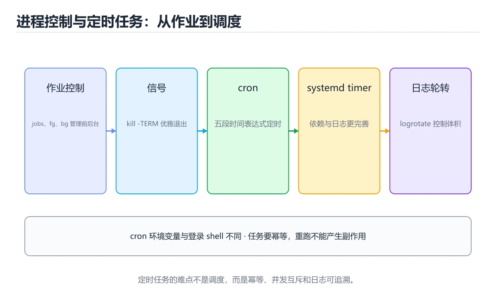
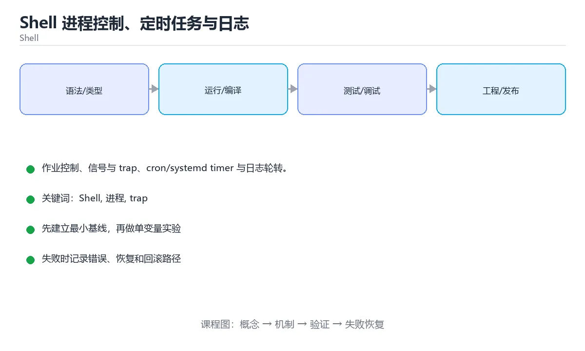

# Shell 进程控制、定时任务与日志





> 内容更新时间：2026-10-06 · 学习阶段：基础 · 预计用时：50 分钟

## 本节知识框架

**课程定位**：所属分类为「Shell」，课程主题为「Shell 进程控制、定时任务与日志」，学习阶段为「基础」，建议用时 50 分钟。

**本课要解决的主问题**：作业控制、信号与 trap、cron/systemd timer 与日志轮转。

| 学习层次 | 要回答的问题 | 完成判据 |
| --- | --- | --- |
| 概念层 | 「Shell 进程控制、定时任务与日志」有哪些必须区分的对象与术语？ | 能用自己的话定义核心术语，并各举一个正例和一个反例。 |
| 机制层 | 这些对象按什么顺序发生作用，输入如何变成输出？ | 能画出或写出机制步骤，并说明每一步的失败条件。 |
| 应用层 | 什么场景适合使用「Shell 进程控制、定时任务与日志」，什么场景不适合？ | 能给出一个真实场景、一个最小示例和一个边界案例。 |
| 性能层 | 时间、空间、吞吐或延迟受哪些量影响？ | 能说出复杂度或性能瓶颈的证据来源；没有证据时明确写“材料未提供”。 |
| 复习层 | 怎样确认自己不是只记住了结论？ | 能独立完成本课自测，并把错误定位到概念、机制、示例或边界。 |

### 阅读路线

1. 先读「核心概念定义」，建立「Shell」等对象的精确定义。
2. 再读「原理与运行机制」，把定义串成可重复的过程。
3. 用「代码/协议/SQL 示例」验证过程，并只改一个条件观察结果变化。
4. 最后检查性能、易错点、知识关系与自测题，形成可复习的证据链。

**前置知识**：《健壮与可移植的 Shell 脚本》

**学习位置**：本课位于《健壮与可移植的 Shell 脚本》之后；如果前一课的自测不能通过，应先回补再继续。

**后续衔接**：下一课《Shell 脚本工程化》会继续使用本课术语，学完后建议立即完成一次自测。

**教材衔接：学习目标**

- 能用自己的话解释Shell 进程控制、定时任务与日志解决了什么问题，而不是只背术语。
- 能说清 「Shell」、「进程」、「trap」、「cron」 之间的关系，并分别举出一个例子。
- 能把 Shell 放回「Shell 进程控制、定时任务与日志」的知识体系，说明它和 进程 的边界。
- 能完成本课练习，并用验收标准检查自己的结果。

> 一句话摘要：作业控制、信号与 trap、cron/systemd timer 与日志轮转。

**教材衔接：前置知识**

- 先完成上一课《健壮与可移植的 Shell 脚本》；如果已经掌握，可以直接用本课练习自测。
- 本课阶段：基础。建议先完成「健壮与可移植的 Shell 脚本」，或确认自己能独立跑通正文里的 PID_FILE 示例。
- 开始前先复习：Shell、进程、trap。
- 卡在 Shell 上时不要跳过：把输入、预期和实际输出写成三行，再回头读正文。

**教材衔接：本课小结**

Shell 的进程与定时能力要配"安全带"：**作业控制 + 信号清理 + 并发保护（flock）+ 日志轮转**，才能让脚本长期稳定运行。

## 核心概念定义

> 阅读约定：本课先给「Shell 进程控制、定时任务与日志」相关术语的操作性定义与适用边界；正文里的口语化说法与定义冲突时，以定义和可复现示例为准。

| 术语 | 操作性定义 | 本课中的边界 |
| --- | --- | --- |
| Shell | Shell 的进程与定时能力要配"安全带"：作业控制 + 信号清理 + 并发保护（flock）+ 日志轮转，才能让脚本长期稳定运行。 | 仅在「Shell 进程控制、定时任务与日志」明确给出的输入、版本与资源条件下成立。 |
| 进程 | 操作系统分配资源和隔离地址空间的运行实例。 | 仅在「Shell 进程控制、定时任务与日志」明确给出的输入、版本与资源条件下成立。 |
| trap | Shell 在收到信号或退出时执行指定处理函数的机制。 | 仅在「Shell 进程控制、定时任务与日志」明确给出的输入、版本与资源条件下成立。 |
| cron | 两条最容易踩的坑是：用 kill -9 代替优雅退出、以为 cron 里有你登录时的环境变量。 | 仅在「Shell 进程控制、定时任务与日志」明确给出的输入、版本与资源条件下成立。 |

### 定义如何使用

在「Shell 进程控制、定时任务与日志」中判断一个说法是否成立，先确认它使用的是哪个对象的定义，再检查输入规模、运行环境与失败路径。定义不是口号，而是后续推导、代码示例和自测题共享的约束。

## 原理与运行机制

### 机制总览

1. **建立输入**：把「Shell」按本课定义整理成可观察、可重复的输入条件。
2. **执行转换**：围绕「进程」执行本课的核心步骤；每一步都记录中间状态，避免只看最终输出。
3. **产生输出**：得到「trap」后，用正文示例或协议/SQL 结果核对输出是否符合预期。
4. **改变一个条件**：只替换一个边界条件或环境参数，观察「Shell 进程控制、定时任务与日志」的结论是否仍然成立。

| 阶段 | 关注对象 | 失败时应检查 |
| --- | --- | --- |
| 输入 | Shell | 类型、范围、编码、版本或前置状态是否满足定义。 |
| 处理 | 进程 | 顺序、可见性、锁、路由、事务或调度规则是否被破坏。 |
| 输出 | trap | 结果是否可复现，错误是否被正确传播而不是被吞掉。 |

本课的机制结论要用「Shell 进程控制、定时任务与日志」自己的示例验证。「Shell 进程控制、定时任务与日志」没有给出某个数量级、吞吐或内存数据时，本课把该判断标为“材料未提供”，不从相邻主题外推。

**教材衔接：进程与作业控制**

| 命令 | 用途 |
| --- | --- |
| `ps aux` / `pgrep -af name` | 查看进程 |
| `kill -TERM <pid>` | 优雅终止（先 TERM 再 KILL） |
| `jobs` / `bg` / `fg` / `wait` | 作业控制 |
| `nohup cmd &` | 退出终端后继续运行 |
| `timeout 30 cmd` | 超时强制结束 |
| `nproc` / `ulimit -n` | 查看 CPU 数与文件描述符上限 |

脚本中等待并行任务：启动多个后台任务后统一 `wait`；捕获退出码用 `wait $pid || echo failed`。信号处理用 `trap 'cleanup' TERM INT`，收到终止信号时先清理再退出。

**教材衔接：cron 与 systemd timer**

cron 表达式五个字段：分 时 日 月 周。例如 `0 3 * * *` 表示每天 3 点。

要点：

1. 脚本里用**绝对路径**，cron 的 PATH 与登录 shell 不同。
2. 显式设置环境变量与工作目录，别依赖 shell 配置。
3. 输出重定向到文件或日志系统，否则邮件会被塞满。
4. 并发保护：用 flock 防止上一次任务未结束又启动。
5. 现代系统优先用 systemd timer（依赖管理、日志与失败重试更完善）。

**教材衔接：日志轮转与清理**

应用日志要按天/大小切分，避免单文件无限增长：`logrotate` 配置保留天数与压缩；临时文件清理用 `find /tmp -type f -mtime +7 -delete`（务必先 `-print` 预览）。

**教材衔接：版本与时效**

- 版本提示：Shell 的行为在最近几个大版本里有过调整，升级「Shell 进程控制、定时任务与日志」前先用 PID_FILE 复现当前输出，再对照官方发布说明逐条核对。
- 升级前确认 Shell 的兼容范围，把不可回退的改动单独拆成一次提交。

### 升级检查清单

- 先固定当前版本，跑通全部示例与测验，再升级工具链。
- 只改 Shell 的版本变量，记录编译、测试与产物体积的变化。
- 回归范围锁定 PID_FILE 的默认行为，并确认弃用警告是否出现在构建输出里。
- 升级完成后更新本课「最后复核 / 下次复核」日期，并记录 Shell 的版本变化。

## 典型应用场景

| 场景 | 典型输入或前提 | 期望产物 |
| --- | --- | --- |
| 学习验证 | 使用本课最小示例和 Shell、进程 | 能复现正文结论，并解释每一步。 |
| 工程落地 | 把「Shell 进程控制、定时任务与日志」放入真实模块或服务边界 | 输出可观测、失败可定位、参数可配置。 |
| 故障排查 | 只改一个版本、规模、输入或依赖条件 | 能区分概念错误、实现错误和环境差异。 |

判断「Shell 进程控制、定时任务与日志」的场景是否成立，标准是能否写出输入、处理、输出和失败路径；材料中没有出现的数据在本课标注为“材料未提供”，不用推测替代证据。

**课程内置实验入口**：`sandbox:bash`，用于动手验证《Shell 进程控制、定时任务与日志》的机制；实验结论不替代概念定义与复杂度分析。

## 代码/协议/SQL 示例

### 最小可验证示例

下面保留《Shell 进程控制、定时任务与日志》原文中的最小示例。先预测《Shell 进程控制、定时任务与日志》示例的输出，再按正文步骤运行或推演；示例依赖外部环境时，同时记录版本与输入。

```text
ps aux --sort=-%cpu | head -10      # CPU 占用 Top10
ss -lntp | grep 8080                # 谁占了端口
lsof -p <pid> | wc -l               # 进程打开的文件数
```

**教材衔接：排查命令组合**

```text
ps aux --sort=-%cpu | head -10      # CPU 占用 Top10
ss -lntp | grep 8080                # 谁占了端口
lsof -p <pid> | wc -l               # 进程打开的文件数
```

**教材衔接：进程管理速查**

| 目的 | 命令 |
| --- | --- |
| 查看进程列表 | `ps aux`、`ps -ef` |
| 按名称查找 | `pgrep -af 'java.*app'` |
| 查看进程树 | `pstree -p <pid>` |
| 查看端口占用 | `ss -tlnp`、`lsof -i :8080` |
| 优雅停止 | `kill -TERM <pid>` |
| 强制停止 | `kill -KILL <pid>` |
| 停止一组进程 | `pkill -TERM -f 'pattern'` |
| 前台转后台 | `Ctrl+Z` 后 `bg`，或启动时加 `&` |
| 断开终端仍运行 | `nohup cmd &`，或交给 systemd |
| 等待进程结束 | `wait <pid>` |
| 限制执行时间 | `timeout 30s cmd` |
| 查看资源占用 | `top -p <pid>`、`pidstat -p <pid> 1` |

停止服务的推荐顺序：先发 `SIGTERM`（应用可优雅关闭），等待若干秒，仍未退出再发 `SIGKILL`。

```bash
#!/usr/bin/env bash
set -Eeuo pipefail

readonly PID_FILE="/run/myapp.pid"

stop_app() {
  [[ -f "$PID_FILE" ]] || { echo "未找到 pid 文件"; return 0; }
  local pid
  pid="$(<"$PID_FILE")"

  if ! kill -0 "$pid" 2>/dev/null; then
    echo "进程 $pid 已不存在，清理 pid 文件"
    rm -f -- "$PID_FILE"
    return 0
  fi

  kill -TERM "$pid"                      # 先优雅停止
  for _ in {1..30}; do
    kill -0 "$pid" 2>/dev/null || { rm -f -- "$PID_FILE"; return 0; }
    sleep 1
  done

  echo "30 秒内未退出，强制结束" >&2
  kill -KILL "$pid" 2>/dev/null || true
  rm -f -- "$PID_FILE"
}

stop_app
```

**教材衔接：cron 速查**

| 字段 | 含义 | 取值范围 |
| --- | --- | --- |
| 第 1 个 | 分钟 | 0-59 |
| 第 2 个 | 小时 | 0-23 |
| 第 3 个 | 日 | 1-31 |
| 第 4 个 | 月 | 1-12 |
| 第 5 个 | 星期 | 0-7（0 与 7 都是周日） |

```cron
# 每天 02:30 备份
30 2 * * * /usr/local/bin/backup.sh >> /var/log/backup.log 2>&1

# 每 5 分钟检查一次
*/5 * * * * /usr/local/bin/check.sh >/dev/null 2>&1

# 工作日 9 点到 18 点每小时
0 9-18 * * 1-5 /usr/local/bin/sync.sh
```

cron 环境注意点：

| 注意点 | 说明 |
| --- | --- |
| PATH 很小 | 命令一律用绝对路径，或脚本内显式设置 PATH |
| 无交互环境 | 不要依赖 shell 配置文件（`.bashrc`） |
| 输出会发邮件 | 明确重定向到日志文件 |
| 时区 | 与服务器时区一致，跨时区要显式换算 |
| 并发 | 用锁文件防止上一次未结束又启动 |

**教材衔接：零基础详解：进程、后台任务与定时任务**

### 一句话说清它是什么

进程管理解决「谁在跑、怎么停」，定时任务解决「什么时候自动跑」。
两条最容易踩的坑是：**用 kill -9 代替优雅退出**、**以为 cron 里有你登录时的环境变量**。

### 用生活比喻理解

| 概念 | 比喻 | 说明 |
| --- | --- | --- |
| 进程 | 正在办事的人 | 有 PID 作为工号 |
| `SIGTERM` | 请先收尾再走 | 可以被程序捕获，做清理 |
| `SIGKILL` | 直接断电 | 无法被捕获，进程立刻消失 |
| 后台任务 `&` | 让员工先去干活 | 但你的终端一关它就收到挂断信号 |
| `nohup` | 请无视下班铃声 | 忽略 HUP，退出终端后仍继续 |
| `flock` | 一把门锁 | 保证同一时刻只有一个在跑 |

### 查看与终止进程

```bash
ps aux | grep nginx              # 查看进程
pgrep -af node                  # 按名字找，显示完整命令行
top -p "$(pgrep -f server.py)"  # 只看某个进程

kill -TERM "$pid"               # 先请求优雅退出
sleep 5
kill -0 "$pid" 2>/dev/null && kill -KILL "$pid"   # 还在就强杀
```

**正确顺序永远是：先 TERM，等待，再 KILL。**

### 后台运行三种方式

```bash
# 1. 临时后台：终端关了就停
long_task &

# 2. 忽略挂断：终端关了继续跑
nohup long_task > run.log 2>&1 &

# 3. 交给系统管理（生产推荐）
sudo systemctl start myapp
sudo systemctl enable myapp
journalctl -u myapp -f            # 跟踪日志
```

| 方式 | 终端关闭后 | 开机自启 | 推荐场景 |
| --- | --- | --- | --- |
| `&` | 停止 | 否 | 临时任务 |
| `nohup ... &` | 继续 | 否 | 临时长期任务 |
| `systemd` | 继续 | 可配置 | **生产环境** |

### cron 表达式五个字段

```text
分 时 日 月 周
*  *  *  *  *    每分钟
0  *  *  *  *    每小时整点
30 2  *  *  *    每天 02:30
0  9  *  *  1    每周一 09:00
*/5 * * * *      每 5 分钟
```

```bash
crontab -e                       # 编辑当前用户的定时任务
crontab -l                       # 查看
```

### cron 里必须显式写清楚的东西

```bash
# 环境变量与 PATH 都要手动设置
PATH=/usr/local/bin:/usr/bin:/bin
SHELL=/bin/bash

# 用绝对路径，并把输出重定向到日志
0 2 * * * /usr/bin/flock -n /tmp/backup.lock /opt/scripts/backup.sh >> /var/log/backup.log 2>&1
```

| 注意点 | 原因 |
| --- | --- |
| 用绝对路径 | cron 的 PATH 很短 |
| 显式设置环境变量 | 不加载 `.bashrc`、`.profile` |
| 重定向输出 | 否则日志丢失或被当邮件发送 |
| 加 `flock -n` | 防止上一次没跑完又启动一次 |

### 新手最容易踩的八个坑

| 坑 | 现象 | 正确做法 |
| --- | --- | --- |
| 直接 `kill -9` | 数据损坏、临时文件残留 | 先 TERM 再 KILL |
| cron 里用相对命令 | 提示找不到命令 | 写绝对路径并设置 PATH |
| 忘重定向输出 | 排查时没有日志 | `>> log 2>&1` |
| 任务重入 | 数据被处理两次 | `flock -n` 加锁 |
| 用 `&` 跑长任务 | 退出终端就挂掉 | 用 systemd 或 nohup |
| 无限制增长日志 | 磁盘被写满 | 配 logrotate 或按天切割 |
| 时区不对 | 任务在错误时间执行 | 检查系统时区与 cron 时区 |
| 脚本没有执行权限 | 静默不执行 | `chmod +x` 并验证退出码 |

### 手把手练习：带锁的备份定时任务

```bash
#!/usr/bin/env bash
set -euo pipefail

readonly LOCK=/tmp/backup.lock
readonly LOG=/var/log/backup.log

exec 9>"$LOCK"
if ! flock -n 9; then
  echo "$(date -Is) 上一次备份仍在运行，跳过" >> "$LOG"
  exit 0
fi

{
  echo "$(date -Is) 备份开始"
  tar -czf "/backup/data-$(date +%F).tar.gz" /srv/data
  echo "$(date -Is) 备份完成"
} >> "$LOG" 2>&1
```

对应的 crontab 条目：

```bash
0 2 * * * /opt/scripts/backup.sh
```

### 学完自测

- [ ] 能说出 `SIGTERM` 与 `SIGKILL` 的区别。
- [ ] 知道 `&`、`nohup`、`systemd` 三种后台方式的差别。
- [ ] 能读懂 `0 2 * * *` 表示什么。
- [ ] 知道 cron 为什么必须写绝对路径。
- [ ] 会用 `flock -n` 防止任务重入。

## 时间/空间复杂度或性能分析

**复杂度证据**：「Shell 进程控制、定时任务与日志」的现有材料没有给出渐近时间或空间复杂度的明确结论，本课只做定性检查，不补写未经验证的 $O$ 记号。

| 维度 | 本课关注点 | 判断依据 |
| --- | --- | --- |
| 时间/延迟 | 「Shell 进程控制、定时任务与日志」的主要步骤是否会随输入规模、并发度或网络往返增长。 | 以正文复杂度、基准数据或可重复测量为准。 |
| 空间/内存 | 中间状态、缓存、副本、连接或索引是否随规模增长。 | 记录峰值内存与数据副本，不只看最终结果。 |
| 吞吐/资源 | 版本、调度、锁、IO、序列化或协议开销是否成为瓶颈。 | 固定环境做对照实验，改变一个变量。 |

评估「Shell 进程控制、定时任务与日志」时要区分“正确性成立”和“性能达标”两件事；材料没有给出基准时，本课只保留量级来源与测量方法，不写不可验证的绝对数字。

## 常见误区与易错点

> 复核《Shell 进程控制、定时任务与日志》的易错点时，优先保留原文的错误表、故障现场与排错路径；每条修正都要能用本课示例复验。

| 易错点 | 常见表现 | 正确做法 |
| --- | --- | --- |
| 只背结论 | 能复述「Shell 进程控制、定时任务与日志」的定义，却说不清输入、输出与边界。 | 回到机制步骤，用最小示例逐一验证。 |
| 混淆相邻概念 | 把本课对象与相邻主题的对象当成同一类。 | 先比较定义、资源归属、生命周期和失败模式。 |
| 忽略版本与环境 | 在开发机通过后直接外推到生产环境。 | 固定版本、输入和资源条件，再记录可复现结果。 |

**教材衔接：常见错误与排查**

| 容易踩的做法 | 实际现象 | 原因与正确做法 |
| --- | --- | --- |
| 直接用 `kill -9` | 数据未落盘、连接未释放 | 先 `SIGTERM`，超时再 `SIGKILL` |
| `kill -0` 前不检查进程存在 | 误判状态 | `kill -0` 只探测存在性，不发送信号 |
| cron 里用相对路径 | 命令找不到 | 用绝对路径并设置 PATH |
| cron 任务不重定向输出 | 邮件堆积或错误丢失 | 重定向到日志并配置轮转 |
| 无锁直接跑定时任务 | 任务重叠、数据错乱 | 用 `flock` 或 pid 文件加锁 |
| 脚本没有超时 | 卡死的任务长期占用 | 用 `timeout` 包裹 |
| 把长任务交给 cron 且不监控 | 失败无人知 | 加告警与执行结果检查 |
| 忘记日志轮转 | 磁盘被写满 | 用 `logrotate` |
| 用 `nohup` 启动长期服务 | 重启后不会自愈 | 用 systemd 管理 |
| pid 文件残留 | 误判服务在运行 | 停止后清理并校验进程身份 |

**教材衔接：故障现场**

### 现场 1：直接用 kill -9

**症状**：在《Shell 进程控制、定时任务与日志》的复现场景中，数据未落盘、连接未释放。

**根因**：“数据未落盘、连接未释放”只是表层结果。向上追溯会落到“直接用 kill -9”这一步，因为它省略了《Shell 进程控制、定时任务与日志》的约束，使实现行为和预期模型发生了偏离。

**修复**：针对《Shell 进程控制、定时任务与日志》的问题，先 SIGTERM，超时再 SIGKILL。

**验证**：保留《Shell 进程控制、定时任务与日志》里触发“数据未落盘、连接未释放”的输入、版本和日志，按“先 SIGTERM，超时再 SIGKILL”完成修改后原样重放；只有失败现象消失且相邻场景仍可解释，才保留改动。

### 现场 2：cron 任务不重定向输出

**症状**：在《Shell 进程控制、定时任务与日志》的复现场景中，邮件堆积或错误丢失。

**根因**：“邮件堆积或错误丢失”只是表层结果。向上追溯会落到“cron 任务不重定向输出”这一步，因为它省略了《Shell 进程控制、定时任务与日志》的约束，使实现行为和预期模型发生了偏离。

**修复**：针对《Shell 进程控制、定时任务与日志》的问题，重定向到日志并配置轮转。

**验证**：先在《Shell 进程控制、定时任务与日志》中记录“cron 任务不重定向输出”留下的失败证据，再执行“重定向到日志并配置轮转”并重放；确认错误路径变为明确结果，且修复没有掩盖同类故障。

### 现场 3：无锁直接跑定时任务

**症状**：在《Shell 进程控制、定时任务与日志》的复现场景中，任务重叠、数据错乱。

**根因**：“任务重叠、数据错乱”只是表层结果。向上追溯会落到“无锁直接跑定时任务”这一步，因为它省略了《Shell 进程控制、定时任务与日志》的约束，使实现行为和预期模型发生了偏离。

**修复**：针对《Shell 进程控制、定时任务与日志》的问题，用 flock 或 pid 文件加锁。

**验证**：先在《Shell 进程控制、定时任务与日志》中记录“无锁直接跑定时任务”留下的失败证据，再执行“用 flock 或 pid 文件加锁”并重放；确认错误路径变为明确结果，且修复没有掩盖同类故障。

## 与其他知识点的关系

| 关系 | 课程 | 为什么 |
| --- | --- | --- |
| 先修 | 《健壮与可移植的 Shell 脚本》 | 本课会直接使用它的概念或操作前提。 |
| 关联 | 《Shell 脚本工程化》 | 用于横向比较或把本课结论迁移到相邻主题。 |
| 前置顺序 | 《健壮与可移植的 Shell 脚本》 | 同分类中安排在本课之前，建议先完成其自测。 |
| 后续顺序 | 《Shell 脚本工程化》 | 同分类中安排在本课之后，会继续使用本课术语。 |

把「Shell 进程控制、定时任务与日志」放回知识体系时，不只要记住“前面学过什么”，还要说明两个主题在输入、机制、资源边界和失败模式上的差异。这样才能把单课知识迁移到项目、排障和后续课程。

## 自测题与参考答案

> 先独立作答《Shell 进程控制、定时任务与日志》的自测题，再对照答案与解析；每处判断都要能在本课正文或示例中找到依据。

### 自测 1

终止进程时推荐的顺序是？

A. 先 kill -1
B. 用 killall
C. 直接 kill -9 强制结束，但它只覆盖了部分情况
D. 先 kill -TERM 优雅退出

**参考答案**：先 kill -TERM 优雅退出

**解析**：在「Shell 进程控制、定时任务与日志」里，先 kill -TERM 优雅退出。TERM 给程序清理资源的机会，KILL 无法被捕获。“终止进程时推荐的顺序是”与「Shell 进程控制、定时任务与日志」的术语表相呼应，只有符合Shell、进程、trap约束的“先 kill -TERM 优雅退出”才是正文支持的结论。

### 自测 2

围绕“Shell 进程控制、定时任务与日志”中的 Shell、进程、trap，下列哪两项是本课强调的实践判断？

A. 把 进程 的单次运行结果当成所有版本和规模都成立
B. 学习 Shell 时要同时说明输入、输出和失败路径，不能只看正常流程
C. 只要 Shell 的常规示例通过，就可以跳过边界与异常路径
D. 验证 进程 时要固定版本并覆盖边界输入，结论才可复现

**参考答案**：学习 Shell 时要同时说明输入、输出和失败路径，不能只看正常流程；验证 进程 时要固定版本并覆盖边界输入，结论才可复现

**解析**：在「Shell 进程控制、定时任务与日志」里，学习 Shell 时要同时说明输入、输出和失败路径，不能只看正常流程。在Shell 进程控制、定时任务与日志里，判断 进程 时要固定版本与边界输入，所以“验证 进程 时要固定版本并覆盖边界输入，结论才可复现”才可复现。在「Shell 进程控制、定时任务与日志」里判断这道题，要把Shell、进程、trap的条件、过程与失败路径逐项对齐，换成“围绕Shell 进程控制、定时任务与”这个场景，只有满足前提的结论才成立。

### 自测 3

阅读「Shell 进程控制、定时任务与日志」中的这段 Shell 代码，下面哪项判断最准确？

```shell
crontab -e                       # 编辑当前用户的定时任务
crontab -l                       # 查看
```

A. 这段 Shell 代码只展示语法，不会读取任何输入或产生可验证输出。
B. Shell、进程、trap 的结论只取决于关键字数量，与代码的控制流和边界条件无关。
C. 作业控制、信号与 trap、cron/systemd timer 与日志轮转。
D. 它说明 Shell、进程、trap 只需要记忆结论，不需要记录版本、输入与运行结果。

**参考答案**：作业控制、信号与 trap、cron/systemd timer 与日志轮转。

**解析**：在「Shell 进程控制、定时任务与日志」里，结论应落在「作业控制、信号与 trap、cron/systemd timer 与日志轮转」。在「Shell 进程控制、定时任务与日志」里，结论应落在作业控制、信号与 trap、cron/systemd timer 与日志轮转。在「Shell 进程控制、定时任务与日志」里，这段 Shell 代码来自本课的本地示例，主要用来核对 Shell、进程、trap、cron 之间的输入、处理和输出关系，作业控制、信号与 trap、cron/systemd timer 与日志轮转。

**教材衔接：复习与自测**

- [ ] 停止服务先用 `SIGTERM`，超时再 `SIGKILL`。
- [ ] 用 pid 文件或 `flock` 防止任务重叠。
- [ ] cron 命令使用绝对路径并重定向日志。
- [ ] 定时任务有超时与失败告警。
- [ ] 长期服务用 systemd 管理而非 `nohup`。

**教材衔接：动手练习**

### 练习 1：概念复述（10 分钟）

合上教程，用 3～5 句话解释Shell 进程控制、定时任务与日志解决什么问题，并写出一个边界条件。

**验收标准**：至少使用一个本课关键词，并给出一个反例。

### 练习 2：示例改写（20 分钟）

把 进程 的条件换掉一个，记录预测与实际的差异。

**验收标准**：五步记录要写进笔记——原例是 PID_FILE，改动落在Shell上，结论必须能被他人在同一环境里复现。

### 练习 3：迁移任务（30 分钟）

写一个只包含 Shell 的最小程序，先验证正常路径，再制造一次失败。

- 至少覆盖「Shell」和「进程」两个关键词。
- 产出一个别人可以检查的结果。
- 写出一个仍不确定的问题和验证方法。

**教材衔接：可运行练习**

### 任务 1：先跑通，再解释

```bash
#!/usr/bin/env bash
set -Eeuo pipefail

readonly PID_FILE="/run/myapp.pid"

stop_app() {
  [[ -f "$PID_FILE" ]] || { echo "未找到 pid 文件"; return 0; }
  local pid
  pid="$(<"$PID_FILE")"

  if ! kill -0 "$pid" 2>/dev/null; then
    echo "进程 $pid 已不存在，清理 pid 文件"
    rm -f -- "$PID_FILE"
    return 0
  fi

  kill -TERM "$pid"                      # 先优雅停止
  for _ in {1..30}; do
    kill -0 "$pid" 2>/dev/null || { rm -f -- "$PID_FILE"; return 0; }
    sleep 1
  done

  echo "30 秒内未退出，强制结束" >&2
  kill -KILL "$pid" 2>/dev/null || true
  rm -f -- "$PID_FILE"
}

stop_app
```

**预期输出**：30 秒内未退出，强制结束

### 任务 2：只改一个条件

把「Shell 进程控制、定时任务与日志」的最小示例复制一份，只改一个条件再跑一次：

- 改动点：只把 Shell 的输入换成空值、极值或错误输入，其余保持不变。
- 预测：先写下「Shell 进程控制、定时任务与日志」在改动后的输出或错误信息，再运行。
- 记录：对照改动前后的结果，指出差异出在哪一步。
- 验收：换回原条件能复现原结果，改动只影响Shell。

### 任务 3：迁移到自己的数据

用同一套思路处理一组你自己的 Shell 数据，保持输出格式与任务 1 一致。

**教材衔接：本课复习清单**

离开本课前，逐项确认：

- [ ] 不看解析，能说出「终止进程时推荐的顺序是？」的判断依据。
- [ ] 不看解析，能说出「cron 任务最容易踩的坑是？」的判断依据。
- [ ] 不看解析，能说出「防止上一次定时任务未结束又启动，常用？」的判断依据。
- [ ] 不看解析，能说出「nohup 与 & 的区别是？」的判断依据。
- [ ] 不看解析，能说出「查看 systemd 服务日志的常用命令是？」的判断依据。
- [ ] 跑通「Shell 进程控制、定时任务与日志」的最小示例，并记录一次失败输入的处理方式。
- [ ] 把本课最容易混淆的两个概念写成一句话对照。

| 复盘项 | 记录 |
| --- | --- |
| 已经能独立解释的考点 |  |
| 仍然说不清的概念 |  |
| 下一步验证动作 |  |

---

## 术语速查

把「Shell 进程控制、定时任务与日志」里反复出现的术语集中放在一起。复习时先遮住右列，尝试用自己的话解释，再回到正文核对。

| 术语 | 一句话说明 |
| --- | --- |
| `Shell` | Shell 的进程与定时能力要配"安全带"：作业控制 + 信号清理 + 并发保护（flock）+ 日志轮转，才能让脚本长期稳定运行。 |
| `进程` | 操作系统分配资源和隔离地址空间的运行实例。 |
| `trap` | Shell 在收到信号或退出时执行指定处理函数的机制。 |
| `cron` | 两条最容易踩的坑是：用 kill -9 代替优雅退出、以为 cron 里有你登录时的环境变量。 |

## 考点精讲

### 考点 1：概念判断·Shell

- **题目**：终止进程时推荐的顺序是？
- **判断依据**：在「Shell 进程控制、定时任务与日志」里，先 kill -TERM 优雅退出。TERM 给程序清理资源的机会，KILL 无法被捕获。“终止进程时推荐的顺序是”与「Shell 进程控制、定时任务与日志」的术语表相呼应，只有符合Shell、进程、trap约束的“先 kill -TERM 优雅退出”才是正文支持的结论。

### 考点 2：概念判断·Shell

- **题目**：cron 任务最容易踩的坑是？
- **判断依据**：在「Shell 进程控制、定时任务与日志」里，环境变量与 PATH 不同。cron 不加载登录 shell 配置，路径与变量都要显式指定。在「Shell 进程控制、定时任务与日志」里判断这道题，要把Shell、进程、trap的条件、过程与失败路径逐项对齐，换成“cron 任务最容易踩的坑是”这个场景，只有满足前提的结论才成立。

### 考点 3：多选辨析·Shell

- **题目**：围绕“Shell 进程控制、定时任务与日志”中的 Shell、进程、trap，下列哪两项是本课强调的实践判断？
- **判断依据**：在「Shell 进程控制、定时任务与日志」里，学习 Shell 时要同时说明输入、输出和失败路径，不能只看正常流程。在Shell 进程控制、定时任务与日志里，判断 进程 时要固定版本与边界输入，所以“验证 进程 时要固定版本并覆盖边界输入，结论才可复现”才可复现。在「Shell 进程控制、定时任务与日志」里判断这道题，要把Shell、进程、trap的条件、过程与失败路径逐项对齐，换成“围绕Shell 进程控制、定时任务与”这个场景，只有满足前提的结论才成立。

### 考点 4：代码补全·Shell

- **题目**：阅读「Shell 进程控制、定时任务与日志」中的这段 Shell 代码，下面哪项判断最准确？
- **判断依据**：在「Shell 进程控制、定时任务与日志」里，结论应落在「作业控制、信号与 trap、cron/systemd timer 与日志轮转」。在「Shell 进程控制、定时任务与日志」里，结论应落在作业控制、信号与 trap、cron/systemd timer 与日志轮转。在「Shell 进程控制、定时任务与日志」里，这段 Shell 代码来自本课的本地示例，主要用来核对 Shell、进程、trap、cron 之间的输入、处理和输出关系，作业控制、信号与 trap、cron/systemd timer 与日志轮转。

### 考点 5：概念判断·Shell

- **题目**：查看 systemd 服务日志的常用命令是？
- **判断依据**：在「Shell 进程控制、定时任务与日志」里，journalctl -u 服务名 -f。-u 指定单元，-f 持续跟踪输出，配合 --since 可定位特定时间段。在「Shell 进程控制、定时任务与日志」里判断这道题，要把Shell、进程、trap的条件、过程与失败路径逐项对齐，换成“查看 systemd 服务日志的常用”这个场景，只有满足前提的结论才成立。

### 考点 6：填空·Shell

- **题目**：补全代码：「Shell 进程控制、定时任务与日志」示例中，下面这行代码缺少哪个关键字或函数名？请填入 ____。 `____ -u myapp -f # 跟踪日志`
- **判断依据**：这道题的关键在「Shell 进程控制、定时任务与日志」的Shell、进程、trap：先确认题干“补全代码”问的是哪一步，再排除偷换前提的选项。把“journalctl”代回「Shell 进程控制、定时任务与日志」里“Shell 进程控制、定时任务与日志示例中”的例子核对，条件一旦改变，结论就要用Shell、进程、trap重新推导。

## English Overview

**Title:** Processes, Cron & Logs

**Summary:** Jobs, signals, cron and log rotation.

**Category:** Shell
**Level:** 基础
**Key terms:** Shell, 进程, trap, cron, 日志轮转

## 内容元数据

- 内容版本：v2.0
- 最后更新：2026-10-06
- 学习阶段：基础
- 适用环境：Bash 5 / POSIX Shell；本课聚焦 Shell。
- 内容来源：内置结构化课程与工程实践整理
- 相关主题：Shell、进程、trap、cron、日志轮转
- 质量版本：P0 测验标准 + P1 覆盖扩展 + P2 体验补全

## 参考资料与复核

- 最后复核：2026-10-04
- 下次复核：2027-02-10
- 复核范围：版本兼容、API 行为、安全建议与工程实践
- 来源性质：官方文档、标准或权威教材；正文为离线教学重组

| 参考资料 | 本课用途 |
| --- | --- |
| [cron 手册](https://man7.org/linux/man-pages/man5/crontab.5.html) | 定时任务与调度 |
| [GNU Coreutils](https://www.gnu.org/software/coreutils/manual/) | 文件、文本与进程工具 |
| [GNU Findutils](https://www.gnu.org/software/findutils/manual/) | find、xargs 与文件检索 |

> 「Shell 进程控制、定时任务与日志」的链接用于离线阅读后的延伸核对；App 不会自动联网。
