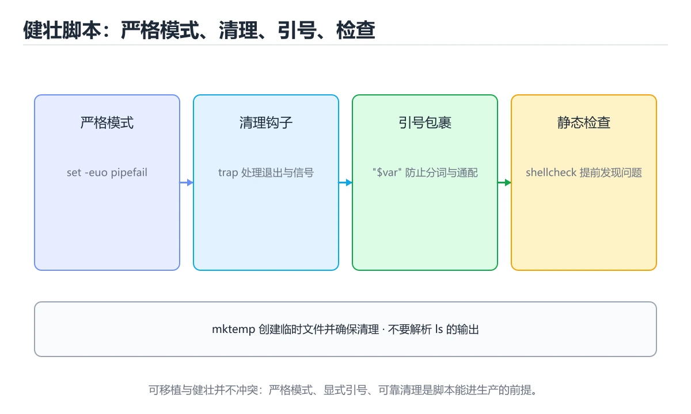
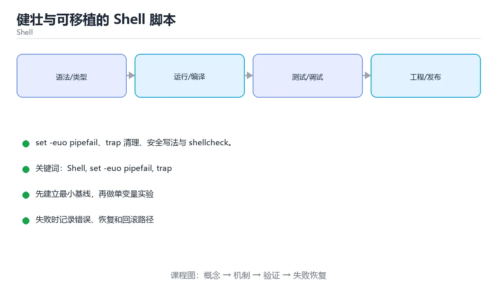

# 健壮与可移植的 Shell 脚本





> 内容更新时间：2026-10-06 · 学习阶段：基础 · 预计用时：15 分钟

## 学习目标

- 能用自己的话解释健壮与可移植的 Shell 脚本解决了什么问题，而不是只背术语。
- 能说清 「Shell」、「set -euo pipefail」、「trap」、「shellcheck」 之间的关系，并分别举出一个例子。
- 能把本课知识放回「Shell」的知识体系，说明它和相邻主题的边界。
- 能完成本课练习，并用验收标准检查自己的结果。

> 一句话摘要：set -euo pipefail、trap 清理、安全写法与 shellcheck。

## 前置知识

- 先完成上一课《Shell 文本处理流水线》；如果已经掌握，可以直接用本课练习自测。
- 本课阶段：基础。建议会读写简单代码或命令，并理解变量、输入输出等基本概念。
- 开始前先复习：Shell、set -euo pipefail、trap。
- 如果某一步看不懂，先记录具体卡点，完成练习后再回头读一遍。

## 三件套与调试开关

```text
#!/usr/bin/env bash
set -euo pipefail     # 出错退出 / 未定义变量报错 / 管道任一失败即失败
IFS=$'\n\t'           # 收紧分词，避免空格拆分
[ "${DEBUG:-0}" = "1" ] && set -x   # 需要时开启命令回显
```

没有这三件套，脚本会在出错后继续执行并造成连锁破坏。注意 `set -e` 在 `if`/`while` 条件中不生效，需显式判断。

## 清理与信号

临时文件必须用 `trap` 清理，避免中断后残留：

```text
tmp=$(mktemp -d)
trap 'rm -rf "$tmp"' EXIT INT TERM
```

## 安全写法

1. 变量加引号；删除前打印目标并校验非空：`[ -n "$dir" ] || exit 1`。
2. 用 `rm -rf -- "$dir"`（`--` 终止选项解析，防 `-rf` 被当作文件名）。
3. 不要 `eval` 不可信输入；用 `"$@"` 传参而不是 `$*`。
4. 检查依赖：`command -v jq >/dev/null || { echo "需要 jq"; exit 1; }`。
5. 敏感信息走环境变量或密钥文件，不要明文写在脚本里。

## 可移植性

`#!/usr/bin/env bash` 比 `#!/bin/sh` 更一致（各发行版 sh 可能是 dash）；避免 GNU 专有参数，跨平台时用 `realpath`/`readlink` 的兼容写法，或直接用 Python。

## 质量工具

| 工具 | 作用 |
| --- | --- |
| shellcheck | 静态检查（引号、未定义变量、常见错误） |
| shfmt | 统一格式 |
| bats | 单元测试框架 |

把 `shellcheck` 接入 CI，能拦掉绝大多数低级事故。

## 本课小结
脚本健壮性的四个关键词：**fail fast（set -euo pipefail）、清理（trap）、校验（参数与依赖）、静态检查（shellcheck）**。

## 严格模式速查

| 选项 | 作用 | 注意 |
| --- | --- | --- |
| `set -e` | 命令失败即退出 | 在 `if` / `&&` / `\|\|` 中的失败不触发 |
| `set -u` | 使用未定义变量报错 | `"${var:-默认}"` 可安全兜底 |
| `set -o pipefail` | 管道任一环节失败即失败 | 常与 `-e` 搭配 |
| `set -x` | 打印实际执行的命令 | 调试用，注意可能泄漏敏感值 |
| `set -E` | ERR trap 能被继承 | 配合 `trap` 使用 |
| `IFS=$'\n\t'` | 收紧分词 | 减少空格分词带来的意外 |

```bash
#!/usr/bin/env bash
set -Eeuo pipefail
IFS=$'\n\t'

readonly SCRIPT_DIR="$(cd -- "$(dirname -- "${BASH_SOURCE[0]}")" && pwd)"
readonly WORK_DIR="$(mktemp -d)"

cleanup() {
  local exit_code=$?
  rm -rf -- "$WORK_DIR"
  if (( exit_code != 0 )); then
    echo "脚本失败，退出码 $exit_code" >&2
  fi
  exit "$exit_code"
}
# EXIT 覆盖正常退出与 set -e 触发的退出
trap cleanup EXIT
trap 'echo "收到中断信号" >&2; exit 130' INT TERM

main() {
  local config="${1:?用法: script.sh <配置文件>}"
  [[ -f "$config" ]] || { echo "配置文件不存在: $config" >&2; return 1; }

  # 失败即退出的场景可直接执行
  cp -- "$config" "$WORK_DIR/backup.conf"

  # 允许失败并自行处理的场景放进 if
  if ! grep -q '^enabled=true' "$config"; then
    echo "功能未启用，跳过" >&2
    return 0
  fi

  echo "处理完成"
}

main "$@"
```

## 安全写法速查

| 危险写法 | 安全写法 | 原因 |
| --- | --- | --- |
| `rm -rf "$dir/"` | `[[ -n "$dir" && "$dir" != "/" ]] && rm -rf -- "$dir"` | 变量为空时避免误删 |
| `cd "$dir"` | `cd -- "$dir" \|\| exit 1` | 失败要立即停止 |
| `eval "$input"` | 避免 `eval`，用数组传参 | 命令注入 |
| `curl ... \| bash` | 下载后校验哈希再执行 | 供应链风险 |
| `chmod 777` | 按需最小权限（如 750） | 权限过大 |
| 密码写在脚本里 | 从环境变量或密钥服务读取 | 泄漏风险 |
| `$RANDOM` 生成密钥 | 用 `openssl rand -hex 32` | 随机性不足 |
| `mktemp` 后不清理 | 配 `trap` 自动清理 | 磁盘堆积 |
| `echo $var` | `printf '%s\n' "$var"` | 转义与选项注入 |
| 日志包含敏感值 | 脱敏后记录 | 合规要求 |

## 常见错误对照表

| 容易踩的做法 | 实际现象 | 原因与正确做法 |
| --- | --- | --- |
| `set -e` 却依赖失败后继续 | 脚本提前退出 | 把允许失败的命令放进 `if !` 或 `\|\| true` |
| 未设置 `pipefail` | 管道失败被掩盖 | 加 `set -o pipefail` |
| `trap` 里未保存退出码 | 返回值被改写 | 先 `local code=$?` 再清理 |
| `trap` 用单引号与双引号混淆 | 变量提前展开 | 需要延迟展开时用单引号 |
| `mktemp -d` 忘记加 `--` | 路径以 `-` 开头时被当选项 | 加 `--` 结束选项 |
| 用 `cd` 后不检查 | 后续操作在错误目录执行 | `cd -- "$dir" \|\| exit 1` |
| 调试时 `set -x` 打印令牌 | 日志泄漏 | 用 `set +x` 临时关闭或脱敏 |
| `IFS` 改得太激进 | 破坏了需要空格的场景 | 仅在解析阶段临时调整 |
| 删除前不校验路径 | 误删系统目录 | 断言路径前缀与存在性 |
| 覆盖已有文件 | 数据丢失 | 默认拒绝，提供 `--force` |

## 自测清单

- [ ] 脚本开头 `set -Eeuo pipefail` 并设置 `IFS`。
- [ ] 用 `mktemp` 创建临时资源，`trap EXIT` 清理。
- [ ] 删除前校验变量非空且路径符合预期。
- [ ] 不使用 `eval` 与「下载即执行」。
- [ ] 调试输出注意脱敏，不泄漏密钥。

## 零基础详解：让脚本「出错就停、跑完就清」

### 一句话说清它是什么

生产脚本和随手写的脚本差别只有三点：
**出错要停**、**变量要防呆**、**资源要清理**。这三件事各有对应的标准写法。

### 用生活比喻理解

| 机制 | 比喻 | 说明 |
| --- | --- | --- |
| `set -e` | 安全检查 | 一步失败就停工，不带病继续 |
| `set -u` | 点名 | 用到没定义的变量立刻报错 |
| `pipefail` | 全链路质检 | 管道任一环失败就算失败 |
| `trap` | 离场清单 | 无论怎么退出都收拾干净 |
| `mktemp` | 领取专用工具 | 生成唯一临时文件，避免抢占 |

### 健壮性三件套 + 清理

```bash
#!/usr/bin/env bash
set -euo pipefail

readonly WORKDIR="$(mktemp -d)"
readonly LOGFILE="$WORKDIR/run.log"

cleanup() {
  local exit_code=$?
  rm -rf -- "$WORKDIR"
  exit "$exit_code"          # 保留原始退出码
}
trap cleanup EXIT INT TERM
```

注意 `cleanup` 里要先保存 `$?`，否则后续命令会覆盖真正的退出码。

### 变量防呆的四个写法

```bash
: "${TARGET:?必须指定 TARGET}"          # 为空或未定义就退出
readonly DIR="${1:-./default}"          # 有默认值
readonly NAME="${1:?用法：$0 <名称>}"    # 必填参数
readonly COUNT="${COUNT:-1}"

if [[ ! -d "$DIR" ]]; then
  echo "目录不存在：$DIR" >&2
  exit 1
fi
```

| 写法 | 为空或未定义时 |
| --- | --- |
| `${var:-默认}` | 用默认值 |
| `${var:=默认}` | 用默认值并赋值给 var |
| `${var:?报错信息}` | 报错并退出 |
| `${#var}` | 取长度 |
| `${var##*/}` | 去掉最长前缀（取文件名） |

### 安全删除的三条纪律

```bash
# 1. 变量必须非空校验
: "${TARGET:?拒绝执行：TARGET 为空}"

# 2. 引号 + -- 终止选项解析
rm -rf -- "$TARGET"

# 3. 危险操作先打印再执行
echo "将删除：$TARGET"
read -r -p "确认？(yes/no) " answer
[[ "$answer" == "yes" ]] || exit 1
```

**永远不要写 `rm -rf $DIR/`**：变量为空时命令会变成 `rm -rf /`。

### 用 shellcheck 做静态检查

```bash
# 安装后直接用，能拦掉大量低级事故
shellcheck script.sh

# CI 里当作门禁
shellcheck -S warning scripts/*.sh
```

它最常帮你发现：变量没加引号、`[ ]` 用法错误、未定义变量、无用的管道。

### 新手最容易踩的八个坑

| 坑 | 现象 | 正确做法 |
| --- | --- | --- |
| `set -e` 遇到管道失效 | 前面失败后面成功就通过 | 加 `set -o pipefail` |
| `cleanup` 覆盖退出码 | CI 判断不出失败 | 先存 `$?` 再 `exit` |
| 临时文件名可预测 | 被抢占或符号链接攻击 | 用 `mktemp` |
| `rm -rf $VAR` 变量为空 | 误删根目录 | 加引号、加 `--`、加非空校验 |
| 用 `cd` 不检查 | 后续命令在错误目录执行 | `cd "$DIR" \|\| exit 1` |
| `trap` 只捕获 EXIT | Ctrl+C 时没清理 | 同时注册 INT、TERM |
| 忘记 `local` | 变量污染全局 | 函数内一律 `local` |
| 脚本不能重复执行 | 第二次报错 | 设计成幂等，存在即跳过 |

### 手把手练习：可重入的部署脚本骨架

```bash
#!/usr/bin/env bash
set -euo pipefail

readonly APP="${1:?用法：$0 <应用名>}"
readonly STAGE="$(mktemp -d)"

cleanup() {
  local code=$?
  rm -rf -- "$STAGE"
  exit "$code"
}
trap cleanup EXIT INT TERM

log() { printf '[%s] %s\n' "$(date +%H:%M:%S)" "$*" >&2; }

log "准备部署 $APP"
if [[ -f "/opt/$APP/current" ]]; then
  log "已存在部署，执行增量更新"
else
  log "首次部署"
fi

log "部署完成，临时目录 $STAGE 将在退出时清理"
```

### 学完自测

- [ ] 能说出 `-e`、`-u`、`pipefail` 各自的作用。
- [ ] 知道 `trap` 里为什么要先保存 `$?`。
- [ ] 能说出 `${var:-默认}` 与 `${var:?提示}` 的区别。
- [ ] 知道 `rm -rf` 的三条安全纪律。
- [ ] 会在 CI 里用 `shellcheck` 当门禁。

## 动手练习

> 本课练习重点：围绕「Shell、set -euo pipefail、trap」完成复述、实验和交付，每个结果都要能被别人检查。

先加严格模式，再在临时目录验证成功与失败路径，最后补回滚。

### 练习 1：建立心智模型（10 分钟）

合上教程，用 3～5 句话回答：

1. 健壮与可移植的 Shell 脚本解决了什么问题？
2. 如果没有它，会出现什么具体后果？
3. 它和「set -euo pipefail」是什么关系？

**验收标准**：至少出现一个本课关键词，并写出一个反例、边界条件或失效场景。

### 练习 2：做一次可控实验（20 分钟）

从正文中选一个最小示例，完成以下操作：

1. 先预测修改一个参数、输入或步骤后的结果。
2. 再实际执行或逐步推演，记录真实结果。
3. 如果结果与预测不同，写出差异原因。

**验收标准**：留下「原例 → 改动 → 预测 → 结果 → 原因」五步记录。

### 练习 3：交付一个小结果（30 分钟）

写一个带 `set -euo pipefail` 的脚本，并用临时目录验证成功与失败路径。

任务要求：

- 结果必须能被别人检查，不能只写“我已经理解了”。
- 至少覆盖「Shell」和「set -euo pipefail」两个关键词。
- 写出 1 个仍然不确定的问题，以及下一步如何验证。

> 提示：时间有限时优先做练习 1 和练习 2；练习 3 可以拆成两次完成。

## 可运行练习

### 任务 1：先跑通，再解释

```bash
: "${TARGET:?必须指定 TARGET}"          # 为空或未定义就退出
readonly DIR="${1:-./default}"          # 有默认值
readonly NAME="${1:?用法：$0 <名称>}"    # 必填参数
readonly COUNT="${COUNT:-1}"

if [[ ! -d "$DIR" ]]; then
  echo "目录不存在：$DIR" >&2
  exit 1
fi
```

**预期输出**：目录不存在：$DIR

### 任务 2：只改一个条件

把「健壮与可移植的 Shell 脚本」的最小示例复制一份，只改一个条件再跑一次：

- 改动点：只把Shell的输入换成空值、极值或错误输入，其余保持不变。
- 预测：先写下「健壮与可移植的 Shell 脚本」在改动后的输出或错误信息，再运行。
- 记录：对照改动前后的结果，指出差异出在哪一步。
- 验收：换回原条件能复现原结果，改动只影响Shell。

### 任务 3：迁移到自己的数据

用同一套思路处理一组你自己的数据或场景，保持输出格式与任务 1 一致。

## 故障现场

### 现场 1：本课的 Shell 常规用例通过，但边界用例失败

**症状**：在本课的练习或生产场景里出现“本课的 Shell 常规用例通过，但边界用例失败”。

**复现**：准备一组最小输入，只保留触发“本课的 Shell 常规用例通过，但边界用例失败”的必要条件，连续运行两次确认结果稳定。

**定位**：围绕“Shell 的前置条件与取值边界没有写进代码，默认值掩盖了空值和极值”检查调用链、输入数据和环境配置，先验证假设再改代码。

**预防**：把“本课的 Shell 常规用例通过，但边界用例失败”写成一条自动化用例，并在本课的验收清单里保留对应检查项。

### 现场 2：本课的 set -euo pipefail 结果在两次运行之间不一致

**症状**：在本课的练习或生产场景里出现“本课的 set -euo pipefail 结果在两次运行之间不一致”。

**复现**：准备一组最小输入，只保留触发“本课的 set -euo pipefail 结果在两次运行之间不一致”的必要条件，连续运行两次确认结果稳定。

**定位**：围绕“set -euo pipefail 依赖了当前版本、执行顺序或共享状态，单次运行无法暴露差异”检查调用链、输入数据和环境配置，先验证假设再改代码。

**预防**：把“本课的 set -euo pipefail 结果在两次运行之间不一致”写成一条自动化用例，并在本课的验收清单里保留对应检查项。

### 现场 3：本课的验证只在开发机通过

**症状**：在本课的练习或生产场景里出现“本课的验证只在开发机通过”。

**定位**：围绕“环境版本、配置和输入规模与目标环境不同，Shell 缺少可重复的验证记录”检查调用链、输入数据和环境配置，先验证假设再改代码。

## 版本与时效

- Bash 5.x 与 POSIX sh 的行为差异仍然是最常见的可移植性来源
- 升级前确认目标环境的 Bash 版本、内置命令与数组能力

### 升级检查清单

- 先固定当前版本，跑通全部示例与测验，再升级工具链。
- 只改一个版本变量，记录编译、测试、性能与产物体积的变化。
- 重点回归默认值、弃用警告、序列化格式、并发语义和错误信息。
- 升级完成后更新本课的“最后复核 / 下次复核”日期与版本说明。

## 本课复习清单

离开本课前，逐项确认：

- [ ] 不看解析，能说出「set -euo pipefail 中 -u 的作用是？」的判断依据。
- [ ] 不看解析，能说出「临时文件应在何时清理？」的判断依据。
- [ ] 不看解析，能说出「删除目录的安全写法是？」的判断依据。
- [ ] 不看解析，能说出「mktemp 相比自己拼临时文件名好在哪？」的判断依据。
- [ ] 不看解析，能说出「trap 'cleanup' EXIT INT TERM 的作用是？」的判断依据。
- [ ] 不看解析，能说出的判断依据。
- [ ] 至少运行一次本课示例，记录输入、输出和一个边界情况。
- [ ] 把本课最容易混淆的两个概念写成一句话对照。

| 复盘项 | 记录 |
| --- | --- |
| 已经能独立解释的考点 |  |
| 仍然说不清的概念 |  |
| 下一步验证动作 |  |

## 术语速查

把「健壮与可移植的 Shell 脚本」里反复出现的术语集中放在一起。复习时先遮住右列，尝试用自己的话解释，再回到正文核对。

| 术语 | 本课语境 |
| --- | --- |
| `Shell` | 围绕“环境版本、配置和输入规模与目标环境不同，Shell 缺少可重复的验证记录”检查调用链、输入数据和环境配置，先验证假设再改代码。 |
| `set -euo pipefail` | 把「健壮与可移植的 Shell 脚本」的最小示例复制一份，只改一个条件再跑一次：。 |
| `trap` | 脚本健壮性的四个关键词：fail fast（set -euo pipefail）、清理（trap）、校验（参数与依赖）、静态检查（shellcheck）。 |
| `shellcheck` | 脚本健壮性的四个关键词：fail fast（set -euo pipefail）、清理（trap）、校验（参数与依赖）、静态检查（shellcheck）。 |
| `安全` | 它在「健壮与可移植的 Shell 脚本」里是理解「安全」的关键术语，用来解释定义、适用条件与失败路径；它与Shell、trap共同决定这一节的判断边界。复习时回到正文示例核对输入、输出和验证方式。 |

## 考点精讲

### 考点 1：概念判断·Shell

- **题目**：set -euo pipefail 中 -u 的作用是？
- **判断依据**：在「健壮与可移植的 Shell 脚本」里，使用未定义变量时报错退出。配合 -e（出错退出）与 pipefail（管道失败即失败）构成健壮性三件套。「健壮与可移植的 Shell 脚本」要求先交代Shell、set -euo pipefail、trap的前提再下结论，所以“使用未定义变量时报错退出”只在题干“set -euo pipefail 中 -u 的作用是”给定的条件下成立。

### 考点 2：代码补全·Shell

- **题目**：阅读「健壮与可移植的 Shell 脚本」中的这段 Shell 代码，下面哪项判断最准确？
- **判断依据**：在「健壮与可移植的 Shell 脚本」里，这段 Shell 代码来自本课的本地示例，主要用来核对 Shell、set -euo pipefail、trap、shellcheck 之间的输入、处理和输出关系，set -euo pipefail、trap 清理、安全写法与 shellcheck。

### 考点 3：多选辨析·Shell

- **题目**：围绕“健壮与可移植的 Shell 脚本”中的 Shell、set -euo pipefail、trap，下列哪两项是本课强调的实践判断？
- **判断依据**：在「健壮与可移植的 Shell 脚本」里，学习 Shell 时要同时说明输入、输出和失败路径，不能只看正常流程。在健壮与可移植的 Shell 脚本里，判断 set -euo pipefail 时要固定版本与边界输入，所以“验证 set -euo pipefail 时要固定版本并覆盖边界输入，结论才可复现”才可复现。

### 考点 4：概念判断·Shell

- **题目**：mktemp 相比自己拼临时文件名好在哪？
- **判断依据**：在「健壮与可移植的 Shell 脚本」里，结论应落在「以原子方式创建唯一文件」。可预测的 /tmp/xxx 名字容易被人抢注符号链接，mktemp 是标准做法。在「健壮与可移植的 Shell 脚本」里，这道题要求区分概念与边界，「以原子方式创建唯一文件」只有在题干给出的前提下才成立，而「写得更快」、「生成的文件会自动删除」缺少同一组条件。

### 考点 5：概念判断·Shell

- **题目**：trap 'cleanup' EXIT INT TERM 的作用是？
- **判断依据**：在「健壮与可移植的 Shell 脚本」里，在脚本退出或收到中断/终止信号时执行清理逻辑。配合 set -e，trap EXIT 是保证临时文件与锁被释放的关键。回到「健壮与可移植的 Shell 脚本」的正文示例，用“trap 'cleanup' EXI”走一遍Shell、set -euo pipefail、trap的完整流程，能复现的结论才可以保留。

### 考点 6：填空·____ script.sh

- **题目**：补全代码：「健壮与可移植的 Shell 脚本」示例中，下面这行代码缺少哪个关键字或函数名？请填入 ____。 `____ script.sh`
- **判断依据**：在「健壮与可移植的 Shell 脚本」里，shellcheck。这道题的关键在「健壮与可移植的 Shell 脚本」的Shell、set -euo pipefail、trap：先确认题干“补全代码”问的是哪一步，再排除偷换前提的选项。回到Shell、set -euo pipefail、trap本身再看一遍：只有“shellcheck”与题干“健壮与可移植的”的前提一致，结论才成立。

## English Overview

**Title:** Robust Shell Scripts

**Summary:** Strict mode, traps, safety and shellcheck.

**Category:** Shell
**Level:** 基础
**Key terms:** Shell, set -euo pipefail, trap, shellcheck, 安全

## 内容元数据

- 内容版本：v2.0
- 最后更新：2026-10-06
- 学习阶段：基础
- 适用环境：Bash 5 / POSIX Shell
- 内容来源：内置结构化课程与工程实践整理
- 相关主题：Shell、set -euo pipefail、trap、shellcheck、安全
- 质量版本：P0 测验标准 + P1 覆盖扩展 + P2 体验补全

## 参考资料与复核

- 最后复核：2026-10-04
- 下次复核：2027-04-04
- 复核范围：版本兼容、API 行为、安全建议与工程实践
- 来源性质：官方文档、标准或权威教材；正文为离线教学重组

| 参考资料 | 本课用途 |
| --- | --- |
| [ShellCheck 文档](https://www.shellcheck.net/wiki/) | 脚本缺陷与安全写法 |
| [POSIX Shell 标准](https://pubs.opengroup.org/onlinepubs/9799919799/utilities/V3_chap02.html) | 可移植 Shell 语法 |
| [GNU Coreutils](https://www.gnu.org/software/coreutils/manual/) | 文件、文本与进程工具 |

> 「健壮与可移植的 Shell 脚本」的链接用于离线阅读后的延伸核对；App 不会自动联网。
