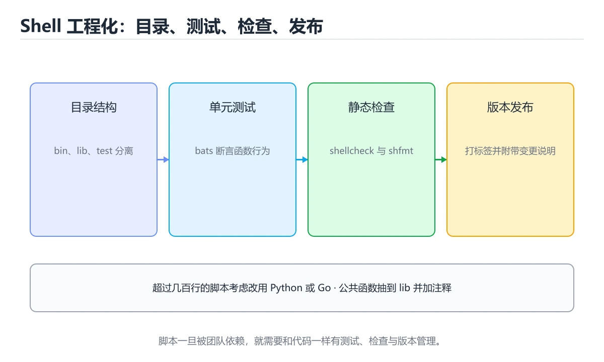
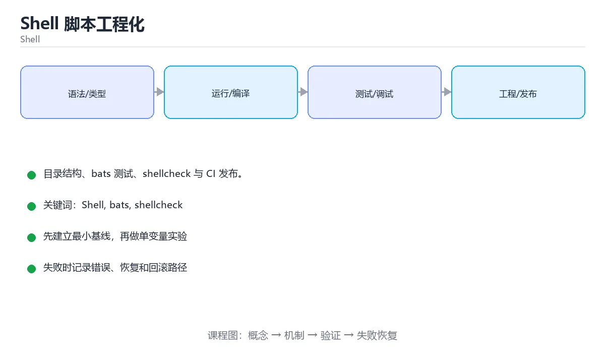

# Shell 脚本工程化





> 内容更新时间：2026-10-03 · 学习阶段：基础 · 预计用时：15 分钟

## 学习目标

- 能用自己的话解释「Shell 脚本工程化」解决了什么问题，而不是只背术语。
- 能说清 「Shell」、「bats」、「shellcheck」、「CI」 之间的关系，并分别举出一个例子。
- 能把本课知识放回「Shell」的知识体系，说明它和相邻主题的边界。
- 能完成本课练习，并用验收标准检查自己的结果。

> 一句话摘要：目录结构、bats 测试、shellcheck 与 CI 发布。

## 前置知识

- 先完成上一课《Shell 进程控制、定时任务与日志》；如果已经掌握，可以直接用本课练习自测。
- 本课阶段：基础。建议会读写简单代码或命令，并理解变量、输入输出等基本概念。
- 开始前先复习：Shell、bats、shellcheck。
- 如果某一步看不懂，先记录具体卡点，完成练习后再回头读一遍。


## 目录与依赖

脚本多了就需要结构：`bin/`（入口）、`lib/`（公共函数）、`test/`（测试）、`README`（用法）。公共函数用 `source` 引入；入口脚本只做参数解析与调用。

依赖管理：检查必需命令（`command -v`），在 README 与 `--help` 中写明依赖；复杂依赖用包管理器或容器固化环境。

## 单元测试：bats

bats（Bash Automated Testing System）提供 `@test` 语法断言命令输出与退出码，是 Shell 最成熟的测试方案。测试要点：把逻辑写成可独立调用的函数、用临时目录隔离副作用、断言退出码而不只是输出。

## 静态检查与格式化

| 工具 | 作用 |
| --- | --- |
| shellcheck | 检测引号、未定义变量、常见陷阱（必装） |
| shfmt | 统一缩进与格式 |
| bashate | Shell 风格检查 |

接入 CI 的命令通常是：`shellcheck bin/* lib/* && shfmt -d . && bats test/`。

## 版本与发布

脚本头部写明用途、作者、版本与用法，重要变更记录 CHANGELOG；发布用 Git tag，配合 CI 打包成单文件（内嵌 lib）或用容器镜像分发，保证运行环境一致。

## 何时改用别的语言

出现以下信号就该迁移：需要复杂数据结构或 JSON 处理、需要并发与重试、脚本超过几百行、多人长期维护。常见路径是 Shell（编排）→ Python（逻辑）→ Go（分发为二进制）。

## 本课小结
Shell 工程化 = **目录结构 + shellcheck/shfmt + bats 测试 + CI + 版本化发布**；脚本一旦进入生产，就要按代码对待。


## 质量工具速查

| 工具 | 用途 | 常用命令 |
| --- | --- | --- |
| ShellCheck | 静态检查 | `shellcheck -x script.sh` |
| shfmt | 格式化 | `shfmt -w -i 2 script.sh` |
| bats-core | 单元测试 | `bats tests/` |
| bats-assert | 断言库 | `assert_output`、`assert_success` |
| shunit2 | 轻量测试框架 | `. shunit2` |
| shellspec | BDD 风格测试 | `shellspec` |
| make | 任务编排 | `make lint test` |

```bash
#!/usr/bin/env bats
# tests/deploy.bats

setup() {
  load '../lib/utils.sh'
  TMP_DIR="$(mktemp -d)"
}

teardown() {
  rm -rf -- "$TMP_DIR"
}

@test "缺少参数时返回错误码 2" {
  run main_deploy
  [ "$status" -eq 2 ]
  [[ "$output" == *"用法"* ]]
}

@test "dry-run 不会创建文件" {
  run main_deploy -n "$TMP_DIR"
  [ "$status" -eq 0 ]
  [ ! -e "$TMP_DIR/app" ]
}
```

## 工程化约定速查

| 约定 | 说明 |
| --- | --- |
| 单一职责 | 一个脚本做一件事，复杂流程拆多个脚本 + 编排 |
| 可重复执行 | 幂等设计，重复运行结果一致 |
| 明确退出码 | 0 成功、1 业务失败、2 用法错误 |
| 统一日志 | `log_info` / `log_warn` / `log_error` 函数封装 |
| 支持 `--dry-run` | 破坏性操作先演练 |
| 支持 `--help` | 自动打印用法 |
| 参数校验 | 入口处一次性校验 |
| 目录约定 | `bin/` 脚本、`lib/` 公共函数、`tests/` 测试 |
| 版本管理 | 脚本进仓库，改动走评审 |
| CI 检查 | shellcheck + shfmt + bats 全绿才合并 |

```bash
# lib/log.sh：统一日志格式
log() {
  local level="$1"; shift
  printf '%s [%s] %s\n' "$(date '+%F %T')" "$level" "$*" >&2
}
log_info()  { log INFO  "$@"; }
log_warn()  { log WARN  "$@"; }
log_error() { log ERROR "$@"; }

# lib/utils.sh：幂等安装目录
ensure_dir() {
  local dir="$1"
  [[ -d "$dir" ]] || mkdir -p -- "$dir"
}
```

## 何时换语言速查

| 信号 | 建议 |
| --- | --- |
| 超过 300 行且分支复杂 | 换 Python / Go |
| 大量 JSON / YAML 结构化处理 | 换 Python（有成熟库） |
| 需要并发与错误处理 | 换 Go |
| 需要复杂数据结构与算法 | 换通用语言 |
| 只是调用几个命令做编排 | Shell 合适 |
| 需要在 CI 里做轻量判断 | Shell 合适 |

## 常见错误对照表

| 容易踩的做法 | 实际现象 | 原因与正确做法 |
| --- | --- | --- |
| 不跑 ShellCheck | 未引用变量、拼写错误流入生产 | CI 加 `shellcheck -x` |
| 脚本无法重复执行 | 第二次运行报错或重复插入 | 设计成幂等：先检查再操作 |
| 退出码含义混乱 | 调用方无法区分失败类型 | 约定 0/1/2 并写进文档 |
| 日志格式各写各的 | 无法统一检索 | 用统一日志函数 |
| 测试靠手工执行 | 回归无人覆盖 | 用 bats 写自动化用例 |
| 破坏性操作没有 dry-run | 误操作造成事故 | 提供 `--dry-run` 并默认安全 |
| 一个脚本几百行 | 难以维护与测试 | 拆分为库函数 + 编排脚本 |
| 依赖外部命令却不检查 | 环境缺少工具时报错难懂 | 入口处 `command -v` 校验 |
| 把配置写死在脚本 | 无法复用 | 通过参数或环境变量传入 |
| 脚本没进版本控制 | 无法追溯改动 | 与代码同仓管理 |

## 自测清单

- [ ] 脚本接入 ShellCheck、shfmt 与 bats。
- [ ] 复杂逻辑按库函数与编排脚本拆分。
- [ ] 破坏性操作支持 `--dry-run` 且默认安全。
- [ ] 退出码与日志格式有统一约定。
- [ ] 脚本进入版本管理，改动经过评审与 CI。


## 零基础详解：把脚本当工程来做

### 一句话说清它是什么

随手写的脚本只求跑通；工程化的脚本要做到：**能测、能查、能读、能重跑**。
做到这四点，才敢让它在生产里定时或自动执行。

### 用生活比喻理解

| 工具 | 比喻 | 说明 |
| --- | --- | --- |
| shellcheck | 质检员 | 静态发现引号、变量类问题 |
| bats | 验收员 | 自动跑断言 |
| `getopts` | 前台登记 | 规范解析命令行参数 |
| 退出码 | 交接单 | 0 成功，非 0 说明失败原因 |
| 日志函数 | 录音笔 | 统一格式，便于检索 |

### 一个可维护脚本的骨架

```bash
#!/usr/bin/env bash
set -euo pipefail
IFS=$'\n\t'                       # 收紧分词，减少意外

readonly SCRIPT_NAME="$(basename "$0")"
readonly SCRIPT_DIR="$(cd "$(dirname "${BASH_SOURCE[0]}")" && pwd)"

log() { printf '[%s] %s\n' "$(date '+%F %T')" "$*" >&2; }
die() { log "错误：$*"; exit 1; }

usage() {
  cat <<'EOF'
用法：backup.sh -s 源目录 [-d 目标目录] [-h]
  -s  要备份的源目录（必填）
  -d  备份输出目录，默认 ./backup
  -h  显示帮助
EOF
}

main() {
  local src="" dest="./backup"
  while getopts ":s:d:h" opt; do
    case "$opt" in
      s) src="$OPTARG" ;;
      d) dest="$OPTARG" ;;
      h) usage; return 0 ;;
      :)  die "选项 -$OPTARG 需要参数" ;;
      \?) die "未知选项：-$OPTARG" ;;
    esac
  done
  shift $((OPTIND - 1))

  [[ -n "$src" ]] || { usage; die "必须指定 -s"; }
  [[ -d "$src" ]] || die "源目录不存在：$src"

  mkdir -p "$dest"
  local archive="$dest/backup-$(date +%Y%m%d-%H%M%S).tar.gz"
  tar -czf "$archive" -C "$(dirname "$src")" "$(basename "$src")"
  log "完成：$archive"
}

main "$@"
```

### 退出码规范

| 退出码 | 含义 | 使用场景 |
| --- | --- | --- |
| 0 | 成功 | 正常结束 |
| 1 | 通用错误 | 参数不对、文件不存在 |
| 2 | 用法错误 | 缺少必填参数 |
| 126 | 无法执行 | 权限不足 |
| 127 | 命令不存在 | 路径写错 |
| 130 | 被 Ctrl+C 中断 | 128 加上 SIGINT |

**脚本要让自己和调用方都能判断成功与否**：出错就 `exit 1`，别默默继续。

### 用 bats 写测试

```bash
#!/usr/bin/env bats

setup() {
  TMP_DIR="$(mktemp -d)"
  export TMP_DIR
}

teardown() {
  rm -rf "$TMP_DIR"
}

@test "缺少参数时返回用法错误" {
  run ./backup.sh
  [ "$status" -ne 0 ]
  [[ "$output" == *"用法"* ]]
}

@test "能生成备份文件" {
  mkdir -p "$TMP_DIR/data"
  echo hello > "$TMP_DIR/data/a.txt"

  run ./backup.sh -s "$TMP_DIR/data" -d "$TMP_DIR/out"
  [ "$status" -eq 0 ]
  run bash -c "ls '$TMP_DIR/out'/*.tar.gz"
  [ "$status" -eq 0 ]
}
```

```bash
bats test/                            # 跑全部用例
shellcheck -S warning scripts/*.sh    # 静态检查
```

### 什么时候该换语言

| 信号 | 建议 |
| --- | --- |
| 超过 300 行且分支复杂 | 拆成多个脚本或换 Python |
| 需要嵌套字典、复杂结构 | 换 Python |
| 需要单元测试与并发 | 换 Python 或 Go |
| 需要分发给别人用 | 编译成 Go 二进制 |
| 只做编排已有命令 | 继续用 Shell |

**经验路径：Shell 做编排，Python 做逻辑，Go 做分发。**

### 新手最容易踩的八个坑

| 坑 | 现象 | 正确做法 |
| --- | --- | --- |
| 不跑 shellcheck | 低级错误上线 | CI 里加静态检查 |
| 没有 `usage` | 同事不会用 | 每个脚本都写帮助 |
| 用 `$1` 直接取参 | 少传参数就出错 | 用 `getopts` 加校验 |
| 出错继续跑 | 结果不完整却报成功 | `set -e` 与显式 `exit` |
| 日志格式不统一 | 排查困难 | 统一 `log()` 函数 |
| 硬编码路径 | 换机器就失败 | 用 `SCRIPT_DIR` 推导 |
| 脚本没有测试 | 改一处坏三处 | 用 bats 覆盖主流程 |
| 变量不加 `readonly` | 被后续误改 | 关键变量声明为 `readonly` |

### 学完自测

- [ ] 能写出带 `usage` 与 `getopts` 的脚本骨架。
- [ ] 知道 0、1、2、130 退出码的含义。
- [ ] 能用 bats 写一个「缺参数应失败」的用例。
- [ ] 知道什么时候该把脚本换成 Python 或 Go。
- [ ] 能在 CI 里同时跑 shellcheck 与 bats。

## 动手练习


> 本课练习重点：围绕「Shell、bats、shellcheck」完成复述、实验和交付，每个结果都要能被别人检查。

先加严格模式，再在临时目录验证成功与失败路径，最后补回滚。

### 练习 1：建立心智模型（10 分钟）

合上教程，用 3～5 句话回答：

1. 「Shell 脚本工程化」解决了什么问题？
2. 如果没有它，会出现什么具体后果？
3. 它和「bats」是什么关系？

**验收标准**：至少出现一个本课关键词，并写出一个反例、边界条件或失效场景。

### 练习 2：做一次可控实验（20 分钟）

从正文中选一个最小示例，完成以下操作：

1. 先预测修改一个参数、输入或步骤后的结果。
2. 再实际执行或逐步推演，记录真实结果。
3. 如果结果与预测不同，写出差异原因。

**验收标准**：留下「原例 → 改动 → 预测 → 结果 → 原因」五步记录。

### 练习 3：交付一个小结果（30 分钟）

写一个带 `set -euo pipefail` 的脚本，并用临时目录验证成功与失败路径。

任务要求：

- 结果必须能被别人检查，不能只写“我已经理解了”。
- 至少覆盖「Shell」和「bats」两个关键词。
- 写出 1 个仍然不确定的问题，以及下一步如何验证。

> 提示：时间有限时优先做练习 1 和练习 2；练习 3 可以拆成两次完成。


## 考点精讲：把测验题还原成判断过程

本课有 6 个判断点。先自己作答，再看「判断依据」；如果结论正确但理由不完整，回到正文对应章节补足概念。

### 考点 1：Shell 单元测试最成熟的框架是？

- **正确判断**：bats
- **判断依据**：bats 提供 @test 语法，可断言输出与退出码。其他选项：pytest 属于 Python，RSpec 属于 Ruby，JUnit 属于 Java。针对「Shell 单元测试最成熟的框架是，」，本课在「单元测试：bats」中说明：bats（Bash Automated Testing System）提供 @test 语法断言命令输出与退出码，是 Shell 最成熟的测试方案。本课还在「本课小结」中说明：Shell 工程化 = 目录结构 + shellcheck/shfmt + bats 测试 + CI + 版本化发布。
- **迁移检查**：如果给某个错误选项去掉一个限定词，它会不会变成正确？说明理由。

### 考点 2：Shell 静态检查的必装工具是？

- **正确判断**：shellcheck
- **判断依据**：shellcheck 能拦掉引号、未定义变量等大量低级事故。其他选项：clippy 面向 Rust，pylint 面向 Python，eslint 面向 JavaScript。针对「Shell 静态检查的必装工具是，」，本课在「本课小结」中说明：Shell 工程化 = 目录结构 + shellcheck/shfmt + bats 测试 + CI + 版本化发布。本课还在「静态检查与格式化」中说明：接入 CI 的命令通常是：shellcheck bin/ lib/ && shfmt -d . && bats test/。
- **迁移检查**：把题干里的一个条件换成边界值，原来的结论还成立吗？写出判断过程。

### 考点 3：脚本何时应该改用其他语言？

- **正确判断**：需要复杂数据结构
- **判断依据**：正确答案是「需要复杂数据结构」，本课在「何时改用别的语言」中说明：出现以下信号就该迁移：需要复杂数据结构或 JSON 处理、需要并发与重试、脚本超过几百行、多人长期维护。常见路径：Shell 做编排 → Python 做逻辑 → Go 分发二进制。本课还在「零基础详解：把脚本当工程来做」中说明：能在 CI 里同时跑 shellcheck 与 bats。本课还在「零基础详解：把脚本当工程来做」中说明：工程化的脚本要做到：能测、能查、能读、能重跑。
- **迁移检查**：遮住选项，只根据定义复述一次答案，再回来看哪个选项与复述一致。

### 考点 4：set -x 与 set -v 的区别是？

- **正确判断**：-x 打印展开后实际执行的命令
- **判断依据**：正确答案是「-x 打印展开后实际执行的命令」，本课在「静态检查与格式化」中说明：接入 CI 的命令通常是：shellcheck bin/ lib/ && shfmt -d . && bats test/。-x 是排查脚本逻辑最常用的手段，可用 set +x 精确关闭某段。本课还在「零基础详解：把脚本当工程来做」中说明：能在 CI 里同时跑 shellcheck 与 bats。本课还在「零基础详解：把脚本当工程来做」中说明：能用 bats 写一个「缺参数应失败」的用例。
- **迁移检查**：遮住选项，只根据定义复述一次答案，再回来看哪个选项与复述一致。

### 考点 5：脚本要支持标准风格的短选项（-a -b 值），推荐用？

- **正确判断**：getopts（或 GNU getopt / while + case 手动解析）
- **判断依据**：正确答案是「getopts（或 GNU getopt / while + case 手动解析）」，本课在「零基础详解：把脚本当工程来做」中说明：工程化的脚本要做到：能测、能查、能读、能重跑。getopts 是 POSIX 内置，能自动处理选项与参数绑定的细节。本课还在「零基础详解：把脚本当工程来做」中说明：能写出带 usage 与 getopts 的脚本骨架。本课还在「零基础详解：把脚本当工程来做」中说明：脚本要让自己和调用方都能判断成功与否：出错就 exit 1，别默默继续。
- **迁移检查**：如果给某个错误选项去掉一个限定词，它会不会变成正确？说明理由。

### 考点 6：补全代码：「Shell 脚本工程化」示例中，下面这行代码缺少哪个关键字或函数名？请填入 ____。 `____() { log ERROR "$@"; }`

- **正确判断**：log_error
- **判断依据**：正确答案是「log_error」，本课在「目录与依赖」中说明：脚本多了就需要结构：bin/（入口）、lib/（公共函数）、test/（测试）、README（用法）。本课还在「单元测试：bats」中说明：测试要点：把逻辑写成可独立调用的函数、用临时目录隔离副作用、断言退出码而不只是输出。本课还在「版本与发布」中说明：脚本头部写明用途、作者、版本与用法，重要变更记录 CHANGELOG。
- **迁移检查**：把答案换成另一种等价写法，是否仍然正确？说明依据。

## 本课复习清单

离开本课前，逐项确认：

- [ ] 不看解析，能说出「Shell 单元测试最成熟的框架是？」的判断依据。
- [ ] 不看解析，能说出「Shell 静态检查的必装工具是？」的判断依据。
- [ ] 不看解析，能说出「脚本何时应该改用其他语言？」的判断依据。
- [ ] 不看解析，能说出「set -x 与 set -v 的区别是？」的判断依据。
- [ ] 不看解析，能说出「脚本要支持标准风格的短选项（-a -b 值），推荐用？」的判断依据。
- [ ] 不看解析，能说出「补全代码：「Shell 脚本工程化」示例中，下面这行代码缺少哪个关键字或函数名？…」的判断依据。
- [ ] 至少运行一次本课示例，记录输入、输出和一个边界情况。
- [ ] 把本课最容易混淆的两个概念写成一句话对照。

| 复盘项 | 记录 |
| --- | --- |
| 已经能独立解释的考点 |  |
| 仍然说不清的概念 |  |
| 下一步验证动作 |  |

## 术语速查

把本课反复出现的术语集中放在一起。复习时先遮住右列，尝试用自己的话解释，再回到正文核对。

| 术语 | 本课语境 |
| --- | --- |
| `bin/` | 脚本多了就需要结构：`bin/`（入口）、`lib/`（公共函数）、`test/`（测试）、`README`（用法）。公共函数用 `source` 引入；入口脚本只做参数解析与调用。 |
| `lib/` | 脚本多了就需要结构：`bin/`（入口）、`lib/`（公共函数）、`test/`（测试）、`README`（用法）。公共函数用 `source` 引入；入口脚本只做参数解析与调用。 |
| `test/` | 脚本多了就需要结构：`bin/`（入口）、`lib/`（公共函数）、`test/`（测试）、`README`（用法）。公共函数用 `source` 引入；入口脚本只做参数解析与调用。 |
| `README` | 脚本多了就需要结构：`bin/`（入口）、`lib/`（公共函数）、`test/`（测试）、`README`（用法）。公共函数用 `source` 引入；入口脚本只做参数解析与调用。 |
| `source` | 脚本多了就需要结构：`bin/`（入口）、`lib/`（公共函数）、`test/`（测试）、`README`（用法）。公共函数用 `source` 引入；入口脚本只做参数解析与调用。 |
| `command -v` | 依赖管理：检查必需命令（`command -v`），在 README 与 `--help` 中写明依赖；复杂依赖用包管理器或容器固化环境。 |
| `--help` | 依赖管理：检查必需命令（`command -v`），在 README 与 `--help` 中写明依赖；复杂依赖用包管理器或容器固化环境。 |
| `@test` | bats（Bash Automated Testing System）提供 `@test` 语法断言命令输出与退出码，是 Shell 最成熟的测试方案。测试要点：把逻辑写成可独立调用的函数、用临时目录隔离副作用、断言退出… |
| `shellcheck -x script.sh` | \| ShellCheck \| 静态检查 \| `shellcheck -x script.sh` \| |
| `shfmt -w -i 2 script.sh` | \| shfmt \| 格式化 \| `shfmt -w -i 2 script.sh` \| |
| `bats tests/` | \| bats-core \| 单元测试 \| `bats tests/` \| |
| `assert_output` | \| bats-assert \| 断言库 \| `assert_output`、`assert_success` \| |

## 面试问答与自测

下面把本课考点换成面试追问。先口述自己的答案，
再对照参考回答检查是否遗漏了前提、边界或失败路径。

### 追问 1：Shell 单元测试最成熟的框架是？

**参考回答**：bats 提供 @test 语法，可断言输出与退出码。其他选项：pytest 属于 Python，RSpec 属于 Ruby，JUnit 属于 Java。针对「Shell 单元测试最成熟的框架是，」，本课在「单元测试·bats」中说明：bats（Bash Automated Testing System）提供 @test 语法断言命令输出与退出码，是 Shell 最成熟的测试方案。本课还在「本课小结」中说明：Shell 工程化 = 目录结构 + shellcheck/shfmt + bats 测试 + CI + 版本化发布。

### 追问 2：Shell 静态检查的必装工具是？

**参考回答**：shellcheck 能拦掉引号、未定义变量等大量低级事故。其他选项：clippy 面向 Rust，pylint 面向 Python，eslint 面向 JavaScript。针对「Shell 静态检查的必装工具是，」，本课在「本课小结」中说明：Shell 工程化 = 目录结构 + shellcheck/shfmt + bats 测试 + CI + 版本化发布。本课还在「静态检查与格式化」中说明：接入 CI 的命令通常是：shellcheck bin/ lib/ && shfmt -d . && bats test/。

### 追问 3：脚本何时应该改用其他语言？

**参考回答**：正确答案是「需要复杂数据结构」，本课在「何时改用别的语言」中说明：出现以下信号就该迁移：需要复杂数据结构或 JSON 处理、需要并发与重试、脚本超过几百行、多人长期维护。常见路径：Shell 做编排 → Python 做逻辑 → Go 分发二进制。本课还在「零基础详解·把脚本当工程来做」中说明：能在 CI 里同时跑 shellcheck 与 bats。本课还在「零基础详解·把脚本当工程来做」中说明：工程化的脚本要做到：能测、能查、能读、能重跑。

### 追问 4：set -x 与 set -v 的区别是？

**参考回答**：正确答案是「-x 打印展开后实际执行的命令」，本课在「静态检查与格式化」中说明：接入 CI 的命令通常是：shellcheck bin/ lib/ && shfmt -d . && bats test/。-x 是排查脚本逻辑最常用的手段，可用 set +x 精确关闭某段。本课还在「零基础详解·把脚本当工程来做」中说明：能在 CI 里同时跑 shellcheck 与 bats。本课还在「零基础详解·把脚本当工程来做」中说明：能用 bats 写一个「缺参数应失败」的用例。

### 追问 5：脚本要支持标准风格的短选项（-a -b 值），推荐用？

**参考回答**：正确答案是「getopts（或 GNU getopt / while + case 手动解析）」，本课在「零基础详解·把脚本当工程来做」中说明：工程化的脚本要做到：能测、能查、能读、能重跑。getopts 是 POSIX 内置，能自动处理选项与参数绑定的细节。本课还在「零基础详解·把脚本当工程来做」中说明：能写出带 usage 与 getopts 的脚本骨架。本课还在「零基础详解·把脚本当工程来做」中说明：脚本要让自己和调用方都能判断成功与否：出错就 exit 1，别默默继续。

## English Overview

**Title:** Shell Engineering

**Summary:** Layout, bats, shellcheck and CI.

**Category:** Shell  
**Level:** 基础  
**Key terms:** Shell, bats, shellcheck, CI, 工程化

> The full tutorial is written in Chinese. This bilingual overview helps English readers identify the topic, scope and key terms before studying the detailed examples.

## 内容元数据

- 内容版本：v2.0
- 最后更新：2026-10-03
- 学习阶段：基础
- 适用环境：Bash 5 / POSIX Shell
- 内容来源：内置结构化课程与工程实践整理
- 相关主题：Shell、bats、shellcheck、CI、工程化
- 质量版本：P0 测验标准 + P1 覆盖扩展 + P2 体验补全


## 参考资料与复核

- 最后复核：2026-10-04
- 下次复核：2027-04-04
- 复核范围：版本兼容、API 行为、安全建议与工程实践
- 来源性质：官方文档与标准；本课正文为离线教学重组，不复制原文

| 参考资料 | 本课用途 |
| --- | --- |
| [GNU Bash Manual](https://www.gnu.org/software/bash/manual/) | Bash 语法与行为 |
| [POSIX Shell](https://pubs.opengroup.org/onlinepubs/9799919799/) | 可移植 Shell 标准 |

> 本课主题：目录结构、bats 测试、shellcheck 与 CI 发布。

> App 完全离线展示文字链接，不会自动联网；需要延伸阅读时可复制链接到浏览器。
