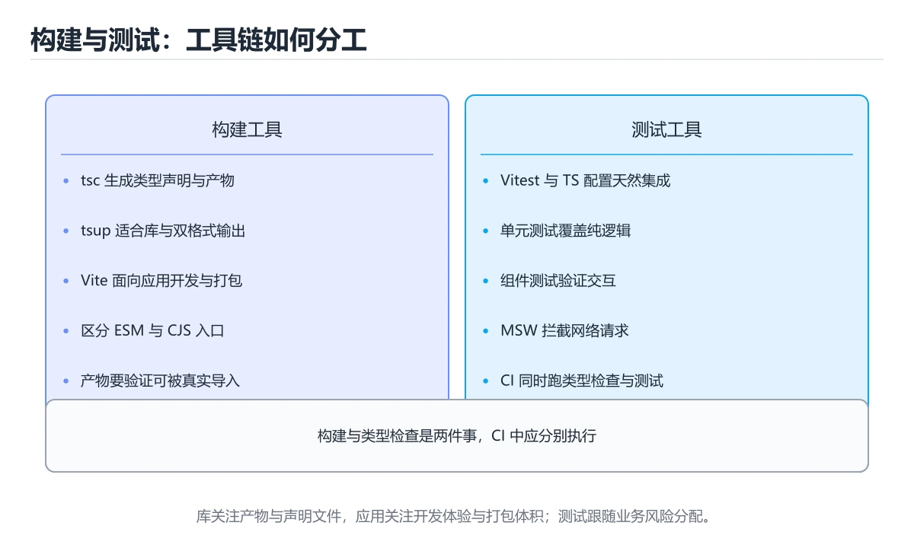
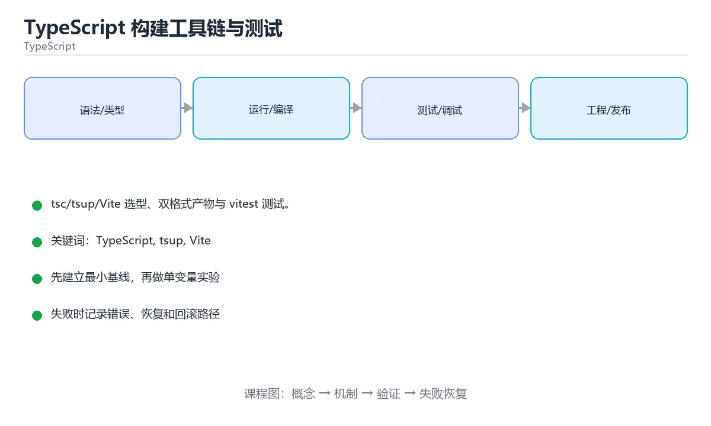

# TypeScript 构建工具链与测试





> 内容更新时间：2026-10-06 · 学习阶段：基础 · 预计用时：50 分钟

## 本节知识框架

**课程定位**：所属分类 `typescript`（TypeScript），课程主题 `TypeScript 构建工具链与测试`，学习阶段 基础，建议用时 45 分钟。

本课主线：tsc/tsup/Vite 选型、双格式产物与 vitest 测试。

**学完本课应当能够**
- 说清 `TypeScript` 与 `tsup` 的含义与区别，并各举一个正例和一个反例。
- 用本课示例验证 `Vite` 的行为，记录输入、输出与失败条件。
- 遇到「以为打包器会做类型检查」这类问题时，能说出触发条件与修复顺序。

### 从概念到验证的学习链条

1. `TypeScript`：先掌握 在 JavaScript 上增加静态类型系统的语言，编译后可运行在浏览器或 Node.js，再用它解释 `tsup` 为什么会出现。
2. `tsup`：先掌握 库项目常见组合：tsup 产出 dist/index.mjs 与 dist/index.cjs + tsc 生成 .d.ts，并在 package.json 用 exports 字段声明条件导出，避免"双包危害"（同一依赖被加载两份），再用它解释 `Vite` 为什么会出现。
3. `Vite`：先掌握 现代前端构建工具：开发时用原生 ESM 按需编译并热更新，打包时用 Rollup 产出静态资源，再用它解释 `转译与类型检查分离` 为什么会出现。
4. `转译与类型检查分离`：先掌握 esbuild、swc 只做语法转换，类型错误要靠 tsc --noEmit 单独把关，再用它解释 本课示例的观察结果 为什么会出现。

**先修与衔接**：本课是「TypeScript」分类的第 9 课。相关或后续课程：《TypeScript 实战：全栈类型安全》。

### 完成判据

- **定义关**：不看正文也能说明 `TypeScript` 是 在 JavaScript 上增加静态类型系统的语言，编译后可运行在浏览器或 Node.js，并指出一个反例。
- **机制关**：能按“输入 → 转换 → 输出 → 验证”复述 `TypeScript 构建工具链与测试`，而不是只背结论。
- **示例关**：能运行或推演 `TypeScript 构建工具链与测试` 的 `jsonc` 示例，并说明一个真实出现的标识符或字面量。
- **证据关**：能指出 `TypeScript 构建工具链与测试` 示例里的 出现字面量 `name`，并说明它支持或反驳了本课的哪一条结论。
- **排错关**：能复现 以为打包器会做类型检查，记录现象并按 CI 单独跑 `tsc --noEmit` 修复。
- **迁移关**：能把 `TypeScript`、`tsup`、`Vite`、`vitest` 放进一个与 `TypeScript 构建工具链与测试` 不同的项目场景，并保持输入与验证条件可追踪。
- **复盘关**：学完 `TypeScript 构建工具链与测试` 后，用一句话写下仍然不确定的结论，并列出下一次验证需要的输入、环境和成功判据。

### 复习清单

- [ ] 能不看正文复述本课核心术语，并指出一个边界或反例。
- [ ] 能运行或推演本课示例，记录输入、输出与失败现象。
- [ ] 能完成一次自测，并把错题对照错误表定位原因。

## 核心概念定义

| 术语 | 操作性定义 | 常见边界与风险 |
| --- | --- | --- |
| TypeScript | 在 JavaScript 上增加静态类型系统的语言，编译后可运行在浏览器或 Node.js。 | 静态检查只在编译期成立，运行期输入仍需校验。 |
| tsup | 库项目常见组合：tsup 产出 dist/index.mjs 与 dist/index.cjs + tsc 生成 .d.ts，并在 package.json 用 exports 字段声明条件导出，避免"双包危害"（同一依赖被加载两份）。 | 不同版本与依赖组合的行为可能不同，升级或换环境前要按官方变更说明重新验证。 |
| Vite | 现代前端构建工具：开发时用原生 ESM 按需编译并热更新，打包时用 Rollup 产出静态资源。 | 静态检查只在编译期成立，运行期输入仍需校验。 |
| 转译与类型检查分离 | esbuild、swc 只做语法转换，类型错误要靠 tsc --noEmit 单独把关。 | 静态检查只在编译期成立，运行期输入仍需校验。 |
| tsc --noEmit | 全量类型检查，进 CI | 易错：类型错误照样发布；正确做法是CI 单独跑 `tsc --noEmit`。 |
| tsd / expect-type | 断言类型行为（如 Omit 是否正确） | 静态检查只在编译期成立，运行期输入仍需校验。 |
| ESLint + typescript-eslint | 禁 any、要求显式返回类型、限制浮空 Promise | 静态检查只在编译期成立，运行期输入仍需校验。 |

## 原理与运行机制

### 机制总览

**教材衔接：工具选型**

| 工具 | 定位 |
| --- | --- |
| tsc | 类型检查与生成 d.ts（不做打包优化） |
| Vite | 前端开发服务器与生产打包 |
| tsup / esbuild | 库打包，速度快，可同时产出 ESM/CJS |
| swc | 极快的转译器，常用于替代 Babel |
| unbuild / rollup | 库产物与 tree-shaking 更可控 |

库项目常见组合：tsup 产出 `dist/index.mjs` 与 `dist/index.cjs` + tsc 生成 `.d.ts`，并在 package.json 用 `exports` 字段声明条件导出，避免"双包危害"（同一依赖被加载两份）。

**教材衔接：tsconfig 与产物一致**

`module`/`moduleResolution` 要与运行时一致（Node ESM 用 node16/nodenext，打包器用 bundler）；`target` 决定语法降级程度；库项目开启 `declaration` 与 `declarationMap` 方便跳转到源码。

**教材衔接：CI 基线**

顺序：`install → lint → tsc --noEmit → test --coverage → build`。构建产物要做体积检查（bundlesize/rollup-plugin-visualizer），防止依赖悄悄膨胀。

**教材衔接：常用 lint 规则速查**

| 规则 | 作用 |
| --- | --- |
| `no-floating-promises` | 禁止漏写 `await` 的 Promise |
| `no-misused-promises` | 禁止把 async 函数当同步回调传 |
| `await-thenable` | 只对 thenable 使用 await |
| `strict-boolean-expressions` | 禁止在条件里使用非布尔值 |
| `no-explicit-any` | 禁止显式 `any` |
| `consistent-type-imports` | 类型导入统一用 `import type` |
| `no-unnecessary-condition` | 找出永远为真/假的判断 |
| `switch-exhaustiveness-check` | 要求 switch 覆盖联合所有成员 |

**教材衔接：版本与时效**

- 版本提示：TypeScript 的行为在最近几个大版本里有过调整，升级「TypeScript 构建工具链与测试」前先用 prepublishOnly 复现当前输出，再对照官方发布说明逐条核对。
- 升级前先用 prepublishOnly 建立基线：记录版本、命令和输出，升级后只比较这些可观察量。

### 升级检查清单

- 先固定当前版本，跑通全部示例与测验，再升级工具链。
- 升级时只动一个依赖版本，用 prepublishOnly 记录构建与运行结果。
- 升级后重点回归 TypeScript 的默认值、警告信息与错误格式。
- 升级后把 prepublishOnly 的实测版本写进「内容元数据」，再更新复核日期。

### 机制拆解：每一步的输入、动作与输出

#### 1. `TypeScript`
- 输入：`TypeScript`；本步把 在 JavaScript 上增加静态类型系统的语言，编译后可运行在浏览器或 Node.js 当作判断规则。
- 动作：围绕 `TypeScript` 保留中间状态，并记录它与 `tsup` 的对应关系。
- 输出：`tsup`，它可以被下一段代码、测试或记录继续使用。
- `TypeScript` 的失败条件：静态检查只在编译期成立，运行期输入仍需校验。

#### 2. `tsup`
- 输入：`TypeScript`；本步把 库项目常见组合：tsup 产出 dist/index.mjs 与 dist/index.cjs + tsc 生成 .d.ts，并在 package.json 用 exports 字段声明条件导出，避免"双包危害"（同一依赖被加载两份） 当作判断规则。
- 动作：围绕 `tsup` 保留中间状态，并记录它与 `Vite` 的对应关系。
- 输出：`Vite`，它可以被下一段代码、测试或记录继续使用。
- `tsup` 的失败条件：不同版本与依赖组合的行为可能不同，升级或换环境前要按官方变更说明重新验证。

#### 3. `Vite`
- 输入：`tsup`；本步把 现代前端构建工具：开发时用原生 ESM 按需编译并热更新，打包时用 Rollup 产出静态资源 当作判断规则。
- 动作：围绕 `Vite` 保留中间状态，并记录它与 `转译与类型检查分离` 的对应关系。
- 输出：`转译与类型检查分离`，它可以被下一段代码、测试或记录继续使用。
- `Vite` 的失败条件：静态检查只在编译期成立，运行期输入仍需校验。

#### 4. `转译与类型检查分离`
- 输入：`Vite`；本步把 esbuild、swc 只做语法转换，类型错误要靠 tsc --noEmit 单独把关 当作判断规则。
- 动作：围绕 `转译与类型检查分离` 保留中间状态，并记录它与 `name` 的对应关系。
- 输出：`name`，它可以被下一段代码、测试或记录继续使用。
- `转译与类型检查分离` 的失败条件：静态检查只在编译期成立，运行期输入仍需校验。

### 示例中的可观察事实

1. 出现字面量 `name`；它对应的课程主题是 `TypeScript 构建工具链与测试`。
2. 出现字面量 `my-lib`；它对应的课程主题是 `TypeScript 构建工具链与测试`。
3. 出现字面量 `type`；它对应的课程主题是 `TypeScript 构建工具链与测试`。
4. 出现字面量 `module`；它对应的课程主题是 `TypeScript 构建工具链与测试`。
5. 出现字面量 `exports`；它对应的课程主题是 `TypeScript 构建工具链与测试`。
6. 出现字面量 `types`；它对应的课程主题是 `TypeScript 构建工具链与测试`。
7. 出现字面量 `./dist/index.d.ts`；它对应的课程主题是 `TypeScript 构建工具链与测试`。
8. 出现字面量 `import`；它对应的课程主题是 `TypeScript 构建工具链与测试`。

### 复现实验记录

- 环境：`TypeScript 构建工具链与测试` 使用 `jsonc` 示例，固定 `TypeScript`、`tsup`、`Vite`、`vitest` 作为第一组条件。
- 首轮输入：先确认 出现字面量 `name`，预测 `TypeScript` 会怎样变化。
- 基线观察：记录命令、输入、输出和错误原文，不用截图代替可复制的文本。
- 单变量修改：只改变 `TypeScript`，观察 `转译与类型检查分离` 是否仍满足定义。
- 失败注入：复现 以为打包器会做类型检查，确认现象是 类型错误照样发布。
- 记录结论：把“修改前、修改后、预期变化、实际变化”写成四列表，这样复盘 `TypeScript 构建工具链与测试` 时才能区分概念错误与实现错误。

## 典型应用场景

- **以为打包器会做类型检查**：典型现象是类型错误照样发布；正确做法是CI 单独跑 `tsc --noEmit`。
- **只出 ESM 不兼容老项目**：典型现象是使用方 require 失败；正确做法是同时产出 CJS。
- **`exports` 路径写错**：典型现象是装包后找不到入口；正确做法是本地 `npm pack` 验证。
- **忘了 `files`**：典型现象是把源码一起发布；正确做法是只发布 dist。

### 最小验证场景

- 准备：保留 `jsonc` 示例的原始输入，先记录 `TypeScript 构建工具链与测试` 的基线输出和完整运行命令。
- 观察：先核对 出现字面量 `name`，再改变一个与 `TypeScript` 相关的条件。
- 判定：新结果与 `TypeScript 构建工具链与测试` 的基线不同不等于错误；只有当差异破坏了 `TypeScript` 的定义或错误表中的约束，才判定为失败。

### 选择与边界

- 使用 `TypeScript` 时，先满足它的定义：在 JavaScript 上增加静态类型系统的语言，编译后可运行在浏览器或 Node.js；静态检查只在编译期成立，运行期输入仍需校验。
- 使用 `tsup` 时，先满足它的定义：库项目常见组合：tsup 产出 dist/index.mjs 与 dist/index.cjs + tsc 生成 .d.ts，并在 package.json 用 exports 字段声明条件导出，避免"双包危害"（同一依赖被加载两份）；不同版本与依赖组合的行为可能不同，升级或换环境前要按官方变更说明重新验证。
- 使用 `Vite` 时，先满足它的定义：现代前端构建工具：开发时用原生 ESM 按需编译并热更新，打包时用 Rollup 产出静态资源；静态检查只在编译期成立，运行期输入仍需校验。
- 使用 `转译与类型检查分离` 时，先满足它的定义：esbuild、swc 只做语法转换，类型错误要靠 tsc --noEmit 单独把关；静态检查只在编译期成立，运行期输入仍需校验。

## 代码/协议/SQL 示例

### 最小可验证示例

```jsonc
// 条件导出：让不同环境拿到合适的产物
{
  "name": "my-lib",
  "type": "module",
  "exports": {
    ".": {
      "types": "./dist/index.d.ts",
      "import": "./dist/index.js",
      "require": "./dist/index.cjs"
    }
  },
  "files": ["dist"],
  "sideEffects": false
}
```

**教材衔接：测试：vitest**

vitest 与 Vite 共用配置，开箱支持 TS；测试要点：对纯函数做单元测试，对 HTTP/数据库用替身或内存实现做集成测试；异步用例要 `await` 并断言 reject（`await expect(fn()).rejects.toThrow()`）。

**教材衔接：构建产物速查**

| 目标 | 配置要点 |
| --- | --- |
| 只产 ESM | `"type": "module"` + `format: ["esm"]` |
| 同时产 ESM 与 CJS | 用 tsup / unbuild 输出 `.js` 与 `.cjs`，配合 `exports` 条件导出 |
| 生成类型声明 | `tsc --emitDeclarationOnly` 或打包器 `dts: true` |
| 保持目录结构 | `tsc` 直接编译，不做打包 |
| 浏览器库 | 输出 `iife` / `umd` 并声明 `globalName` |
| Node CLI | 顶部加 `#!/usr/bin/env node` shebang |

**教材衔接：测试工具速查**

| 工具 | 定位 | 特点 |
| --- | --- | --- |
| Vitest | 单元测试 | 与 Vite 共享配置，速度快 |
| Jest | 单元测试 | 生态成熟，配置较多 |
| Testing Library | 组件测试 | 面向用户行为而非实现 |
| Playwright | 端到端 | 多浏览器、自动等待 |
| MSW | 接口模拟 | 在网络层拦截，贴近真实 |
| fast-check | 属性测试 | 自动生成边界输入 |

**教材衔接：零基础详解：构建产物与测试策略**

### 一句话说清它是什么

构建负责把源码变成能跑的产物（ESM、CJS、类型声明），测试负责证明它是对的。
库项目与应用的关注点不同：**库要兼顾多种模块格式，应用只要跑起来最快最稳**。

### 用生活比喻理解

| 概念 | 比喻 | 说明 |
| --- | --- | --- |
| 打包器 | 流水线 | 转译、合并、压缩 |
| tsc | 质检员 | 只出类型声明与类型检查 |
| ESM / CJS | 两种插头 | 不同环境需要不同格式 |
| 单元测试 | 零件检验 | 快、覆盖细 |
| 集成测试 | 装配检验 | 验证模块之间 |
| E2E | 整车试驾 | 慢但最接近真实 |

### 库项目的双格式产物

```json
{
  "name": "my-lib",
  "type": "module",
  "main": "./dist/index.cjs",
  "module": "./dist/index.js",
  "types": "./dist/index.d.ts",
  "exports": {
    ".": {
      "types": "./dist/index.d.ts",
      "import": "./dist/index.js",
      "require": "./dist/index.cjs"
    }
  },
  "files": ["dist"],
  "scripts": {
    "build": "tsup src/index.ts --format esm,cjs --dts --clean",
    "typecheck": "tsc --noEmit",
    "test": "vitest run",
    "prepublishOnly": "npm run typecheck && npm run test && npm run build"
  }
}
```

| 字段 | 作用 |
| --- | --- |
| `main` | 老工具用的 CommonJS 入口 |
| `module` | 打包器优先用的 ESM 入口 |
| `types` | 类型声明入口 |
| `exports` | 现代解析规则，按条件分发 |
| `files` | 发布时只带上必要目录 |

### 一份实用的 vitest 配置

```typescript
// vitest.config.ts
import { defineConfig } from "vitest/config";

export default defineConfig({
  test: {
    environment: "node",
    coverage: {
      provider: "v8",
      reporter: ["text", "lcov"],
      thresholds: { lines: 80, functions: 80, branches: 70 },
    },
    globals: true,
  },
});
```

### 测试写得好的四个特征

```typescript
import { describe, expect, it, vi } from "vitest";
import { calcTotal } from "../src/calc";

describe("calcTotal", () => {
  it("空购物车返回 0", () => {
    expect(calcTotal([])).toBe(0);
  });

  it("按数量与单价计算", () => {
    expect(calcTotal([{ price: 10, qty: 3 }])).toBe(30);
  });

  it("超过 100 元打九折", () => {
    expect(calcTotal([{ price: 60, qty: 2 }])).toBe(108);
  });

  it("调用支付网关一次", async () => {
    const pay = vi.fn().mockResolvedValue({ ok: true });
    await payOnce(pay);
    expect(pay).toHaveBeenCalledTimes(1);
  });
});
```

| 特征 | 说明 |
| --- | --- |
| 名字描述行为 | 「超过 100 元打九折」而不是「测试 2」 |
| 一个用例一个断言点 | 失败时定位准确 |
| 不依赖外部服务 | 用 mock 或内存实现 |
| 可重复运行 | 不依赖顺序与时间 |

### 常见测试类型与配比

| 类型 | 数量占比 | 速度 | 覆盖什么 |
| --- | --- | --- | --- |
| 单元测试 | 最多 | 毫秒 | 纯函数、业务规则 |
| 集成测试 | 中等 | 百毫秒 | 模块协作、数据库 |
| E2E | 最少 | 秒到分钟 | 关键用户流程 |

### 新手最容易踩的八个坑

| 坑 | 现象 | 正确做法 |
| --- | --- | --- |
| 以为打包器会做类型检查 | 类型错误照样发布 | CI 单独跑 `tsc --noEmit` |
| 只出 ESM 不兼容老项目 | 使用方 require 失败 | 同时产出 CJS |
| `exports` 路径写错 | 装包后找不到入口 | 本地 `npm pack` 验证 |
| 忘了 `files` | 把源码一起发布 | 只发布 dist |
| mock 过度 | 重构后测试全红 | 优先测行为 |
| 测试依赖当前时间 | 明天就失败 | 注入时间或冻结时钟 |
| 覆盖率刷到 100% | 断言很弱 | 关注分支与断言质量 |
| 测试之间共享状态 | 单独跑就过 | 每个用例自带准备清理 |

### 手把手练习：验证发布产物

```bash
#!/usr/bin/env bash
set -euo pipefail

npm run typecheck
npm run test
npm run build

# 打包出真实的发布物并在临时项目里安装验证
readonly TARBALL="$(npm pack --silent)"
readonly TMP="$(mktemp -d)"
trap 'rm -rf "$TMP" "$TARBALL"' EXIT

cd "$TMP"
npm init -y >/dev/null
npm install "/path/to/$TARBALL" >/dev/null

node -e "import('my-lib').then(m => console.log('ESM 正常', Object.keys(m)))"
node -e "console.log('CJS 正常', Object.keys(require('my-lib')))"
echo "发布前检查全部通过"
```

### 学完自测

- [ ] 能说出 `main`、`module`、`types`、`exports` 的分工。
- [ ] 知道为什么库要同时产出 ESM 与 CJS。
- [ ] 能说出单元、集成、E2E 的数量配额与原因。
- [ ] 知道 `npm pack` 能验证什么。
- [ ] 能说出「弱断言」为什么让覆盖率失去意义。

### 示例精读：先找证据，再改一个条件

1. 出现字面量 `name`；它出现在 `TypeScript 构建工具链与测试` 的示例中，阅读时先确认它前后各发生了什么。
2. 出现字面量 `my-lib`；它出现在 `TypeScript 构建工具链与测试` 的示例中，阅读时先确认它前后各发生了什么。
3. 出现字面量 `type`；它出现在 `TypeScript 构建工具链与测试` 的示例中，阅读时先确认它前后各发生了什么。
4. 出现字面量 `module`；它出现在 `TypeScript 构建工具链与测试` 的示例中，阅读时先确认它前后各发生了什么。
5. 出现字面量 `exports`；它出现在 `TypeScript 构建工具链与测试` 的示例中，阅读时先确认它前后各发生了什么。
6. 出现字面量 `types`；它出现在 `TypeScript 构建工具链与测试` 的示例中，阅读时先确认它前后各发生了什么。
7. 出现字面量 `./dist/index.d.ts`；它出现在 `TypeScript 构建工具链与测试` 的示例中，阅读时先确认它前后各发生了什么。
8. 出现字面量 `import`；它出现在 `TypeScript 构建工具链与测试` 的示例中，阅读时先确认它前后各发生了什么。
- 在 `TypeScript 构建工具链与测试` 中与 `TypeScript` 对照：示例必须能支持 在 JavaScript 上增加静态类型系统的语言，编译后可运行在浏览器或 Node.js，否则说明这一段还缺少实现或验证步骤。
- 在 `TypeScript 构建工具链与测试` 中与 `tsup` 对照：示例必须能支持 库项目常见组合：tsup 产出 dist/index.mjs 与 dist/index.cjs + tsc 生成 .d.ts，并在 package.json 用 exports 字段声明条件导出，避免"双包危害"（同一依赖被加载两份），否则说明这一段还缺少实现或验证步骤。
- 在 `TypeScript 构建工具链与测试` 中与 `Vite` 对照：示例必须能支持 现代前端构建工具：开发时用原生 ESM 按需编译并热更新，打包时用 Rollup 产出静态资源，否则说明这一段还缺少实现或验证步骤。
- 在 `TypeScript 构建工具链与测试` 中与 `转译与类型检查分离` 对照：示例必须能支持 esbuild、swc 只做语法转换，类型错误要靠 tsc --noEmit 单独把关，否则说明这一段还缺少实现或验证步骤。

## 时间/空间复杂度或性能分析

**性能关注点（TypeScript 构建工具链与测试）**：编译期类型检查与运行期代码是两套开销：分别记录构建时间与运行时耗时。

**测量方法**：以 `TypeScript 构建工具链与测试` 的 `TypeScript` 场景为对象，固定输入跑一遍记录基线，再把规模或并发度提高一个数量级复测；两次结果的差值与波动范围才是结论依据。

### 需要控制的变量与记录项

- `TypeScript 构建工具链与测试` 的 `TypeScript`：固定它的版本、输入范围和资源上限，分别记录速度、内存与失败率的变化。
- `TypeScript 构建工具链与测试` 的 `tsup`：固定它的版本、输入范围和资源上限，分别记录速度、内存与失败率的变化。
- `TypeScript 构建工具链与测试` 的 `Vite`：固定它的版本、输入范围和资源上限，分别记录速度、内存与失败率的变化。
- `TypeScript 构建工具链与测试` 的 `vitest`：固定它的版本、输入范围和资源上限，分别记录速度、内存与失败率的变化。
- `TypeScript 构建工具链与测试` 的 `CI`：固定它的版本、输入范围和资源上限，分别记录速度、内存与失败率的变化。
- `TypeScript 构建工具链与测试` 中 `TypeScript` 的边界：静态检查只在编译期成立，运行期输入仍需校验。达到边界时不要外推，必须重新测量。
- `TypeScript 构建工具链与测试` 中 `tsup` 的边界：不同版本与依赖组合的行为可能不同，升级或换环境前要按官方变更说明重新验证。达到边界时不要外推，必须重新测量。
- `TypeScript 构建工具链与测试` 中 `Vite` 的边界：静态检查只在编译期成立，运行期输入仍需校验。达到边界时不要外推，必须重新测量。
- `TypeScript 构建工具链与测试` 中 `转译与类型检查分离` 的边界：静态检查只在编译期成立，运行期输入仍需校验。达到边界时不要外推，必须重新测量。
- `TypeScript 构建工具链与测试` 的代码证据：先验证 出现字面量 `name`，再记录该路径的输入规模与耗时；只看代码行数不能推出复杂度。

## 常见误区与易错点

| 容易写错的做法 | 实际现象 | 原因与正确做法 |
| --- | --- | --- |
| 以为打包器会做类型检查 | 类型错误照样发布 | CI 单独跑 `tsc --noEmit` |
| 只出 ESM 不兼容老项目 | 使用方 require 失败 | 同时产出 CJS |
| `exports` 路径写错 | 装包后找不到入口 | 本地 `npm pack` 验证 |
| 忘了 `files` | 把源码一起发布 | 只发布 dist |
| mock 过度 | 重构后测试全红 | 优先测行为 |
| 测试依赖当前时间 | 明天就失败 | 注入时间或冻结时钟 |
| 覆盖率刷到 100% | 断言很弱 | 关注分支与断言质量 |
| 测试之间共享状态 | 单独跑就过 | 每个用例自带准备清理 |
| 只配置 `main` 不配置 `exports` | 现代解析器拿不到 ESM 入口 | 补 `exports` 条件导出 |
| 类型声明与实现分开发布 | 使用者类型不匹配 | 同一版本一起产出并校验 |
| 忘记 `files` 字段 | 发布了源码、测试与配置 | 只发布 `dist` |
| 库没有 `sideEffects: false` | tree shaking 效果差 | 声明无副作用（谨慎评估） |
| CI 只跑打包不跑类型检查 | 类型错误进入发布 | 加 `tsc --noEmit` |
| 测试用 `any` 断言 | 失去类型收益 | 用类型守卫或夹具类型 |
| 组件测试断言实现细节 | 重构后大量失败 | 断言用户可见行为 |
| 端到端测试用固定等待 | 偶发失败 | 用自动等待与可观测条件 |
| 接口模拟散落在各处 | 维护困难 | 用 MSW 集中定义 handler |
| 依赖 `ts-node` 直接跑生产 | 启动慢、类型未预检 | 构建后运行产物 |
| 只配置 main 不配置 exports | 现代解析器拿不到 ESM 入口。 | 补 exports 条件导出。 |
| 忘记 files 字段 | 发布了源码、测试与配置。 | 只发布 dist。 |

### 现场 1：以为打包器会做类型检查

**症状**：类型错误照样发布。

**根因与修复**：CI 单独跑 `tsc --noEmit`。

**自检**：在本课示例里复现「以为打包器会做类型检查」，改成CI 单独跑 `tsc --noEmit`后重跑；如果症状消失且失败路径按预期变化，说明定位正确。

### 现场 2：只出 ESM 不兼容老项目

**症状**：使用方 require 失败。

**根因与修复**：同时产出 CJS。

**自检**：在本课示例里复现「只出 ESM 不兼容老项目」，改成同时产出 CJS后重跑；如果症状消失且失败路径按预期变化，说明定位正确。

### 现场 3：`exports` 路径写错

**症状**：装包后找不到入口。

**根因与修复**：本地 `npm pack` 验证。

**自检**：在本课示例里复现「`exports` 路径写错」，改成本地 `npm pack` 验证后重跑；如果症状消失且失败路径按预期变化，说明定位正确。

### 现场 4：忘了 `files`

**症状**：把源码一起发布。

**根因与修复**：只发布 dist。

**自检**：在本课示例里复现「忘了 `files`」，改成只发布 dist后重跑；如果症状消失且失败路径按预期变化，说明定位正确。

### 现场 5：mock 过度

**症状**：重构后测试全红。

**根因与修复**：优先测行为。

**自检**：在本课示例里复现「mock 过度」，改成优先测行为后重跑；如果症状消失且失败路径按预期变化，说明定位正确。

### 现场 6：测试依赖当前时间

**症状**：明天就失败。

**根因与修复**：注入时间或冻结时钟。

**自检**：在本课示例里复现「测试依赖当前时间」，改成注入时间或冻结时钟后重跑；如果症状消失且失败路径按预期变化，说明定位正确。

### 现场 7：覆盖率刷到 100%

**症状**：断言很弱。

**根因与修复**：关注分支与断言质量。

**自检**：在本课示例里复现「覆盖率刷到 100%」，改成关注分支与断言质量后重跑；如果症状消失且失败路径按预期变化，说明定位正确。

### 现场 8：测试之间共享状态

**症状**：单独跑就过。

**根因与修复**：每个用例自带准备清理。

**自检**：在本课示例里复现「测试之间共享状态」，改成每个用例自带准备清理后重跑；如果症状消失且失败路径按预期变化，说明定位正确。

### 现场 9：只配置 `main` 不配置 `exports`

**症状**：现代解析器拿不到 ESM 入口。

**根因与修复**：补 `exports` 条件导出。

**自检**：在本课示例里复现「只配置 `main` 不配置 `exports`」，改成补 `exports` 条件导出后重跑；如果症状消失且失败路径按预期变化，说明定位正确。

## 与其他知识点的关系

- **相关或后续**：`TypeScript 实战：全栈类型安全`。本课术语会在这些课程里继续使用。
- **术语归属**：`TypeScript`、`tsup`、`Vite` 的定义以本课「核心概念定义」为准，换到其他课程时先确认定义是否被改写。
- 同一分类的《TypeScript 第一个类型》也涉及 `TypeScript`；两课衔接时先确认这个术语的定义是否一致。
- 同一分类的《TypeScript 基础类型》也涉及 `TypeScript`；两课衔接时先确认这个术语的定义是否一致。

### 先修与后续术语接口

- `TypeScript 实战：全栈类型安全`：共享术语 `TypeScript`，共同关键词 `TypeScript`。

### 容易混淆的相邻概念

- `TypeScript` 与 `tsup`：前者强调 在 JavaScript 上增加静态类型系统的语言，编译后可运行在浏览器或 Node.js；后者强调 库项目常见组合：tsup 产出 dist/index.mjs 与 dist/index.cjs + tsc 生成 .d.ts，并在 package.json 用 exports 字段声明条件导出，避免"双包危害"（同一依赖被加载两份）。判断时分别检查两条定义的适用范围，不要只看名称相似就互换。
- `tsup` 与 `Vite`：前者强调 库项目常见组合：tsup 产出 dist/index.mjs 与 dist/index.cjs + tsc 生成 .d.ts，并在 package.json 用 exports 字段声明条件导出，避免"双包危害"（同一依赖被加载两份）；后者强调 现代前端构建工具：开发时用原生 ESM 按需编译并热更新，打包时用 Rollup 产出静态资源。判断时分别检查两条定义的适用范围，不要只看名称相似就互换。
- `Vite` 与 `转译与类型检查分离`：前者强调 现代前端构建工具：开发时用原生 ESM 按需编译并热更新，打包时用 Rollup 产出静态资源；后者强调 esbuild、swc 只做语法转换，类型错误要靠 tsc --noEmit 单独把关。判断时分别检查两条定义的适用范围，不要只看名称相似就互换。

## 自测题与参考答案

> 先独立作答，再对照参考答案；答案都能在本课正文、术语表或错误表里找到依据。

### 自测 1（概念复述）

不看正文，写出 `TypeScript` 的操作性定义，并说明它与 `tsup` 的区别。

**参考答案**：在 JavaScript 上增加静态类型系统的语言，编译后可运行在浏览器或 Node.js。

`tsup` 的定位是：库项目常见组合：tsup 产出 dist/index.mjs 与 dist/index.cjs + tsc 生成 .d.ts，并在 package.json 用 exports 字段声明条件导出，避免"双包危害"（同一依赖被加载两份）；两者的差别要从适用对象与失败模式上说明。

### 自测 2（排错）

本课错误表记录了「以为打包器会做类型检查」这类做法。请写出它会出现的现象、根因，以及修复顺序。

**参考答案**：现象是类型错误照样发布；正确做法是CI 单独跑 `tsc --noEmit`。修复时先复现现象并保留证据，再改动一处假设重跑，确认现象消失。

### 自测 3（动手验证）

运行本课的 `jsonc` 示例，把其中的 `"name"` 换成一个边界值后重新运行，记录输出与错误信息。

**参考答案**：正常输入下 `jsonc` 示例应当复现正文给出的结果；把 `"name"` 换成边界值后，如果结果改变或报错，先核对它是否满足 `TypeScript 构建工具链与测试` 中`TypeScript` 的适用范围，再检查错误表里是否有同类现象。

### 自测 4（代码阅读）

阅读本课开头的 `jsonc` 示例，说明它体现了`TypeScript` 的哪一条性质，并指出改动哪个输入会让这条性质不再成立。

**参考答案**：`TypeScript` 的定义是 在 JavaScript 上增加静态类型系统的语言，编译后可运行在浏览器或 Node.js，示例正是在实现这条定义。改动与 `TypeScript` 有关的一个输入后，如果结果不再符合 `TypeScript 构建工具链与测试` 的正文描述，就说明该性质只在当前前提成立。

### 自测 5（迁移）

把 `TypeScript 构建工具链与测试` 的方法迁移到自己的项目：围绕 `TypeScript` 写出一个与错误表同类的风险点，并说明触发条件和检验方式。

**参考答案**：例如「忘记 files 字段」，它会导致发布了源码、测试与配置；检验方式是按只发布 dist改一处再复现，确认现象消失且没有引入新的失败分支。

### 自测 6（对比）

用一个表格对比 `TypeScript` 与 `tsup`：各写一行适用场景、一行失败表现。

**参考答案**：`TypeScript` 的定义是在 JavaScript 上增加静态类型系统的语言，编译后可运行在浏览器或 Node.js；`tsup` 的定义是库项目常见组合：tsup 产出 dist/index.mjs 与 dist/index.cjs + tsc 生成 .d.ts，并在 package.json 用 exports 字段声明条件导出，避免"双包危害"（同一依赖被加载两份）。两者的失败表现分别对应本课错误表里与本术语相关的行。

### 自测 7（排错顺序）

面对「以为打包器会做类型检查」引发的问题，请把“复现 类型错误照样发布 → 保留证据 → CI 单独跑 `tsc --noEmit` → 回归验证”四步写成可执行的检查清单。

**参考答案**：第一步按类型错误照样发布复现；第二步记录输入、版本与完整报错；第三步按CI 单独跑 `tsc --noEmit`只改一处；第四步重跑并确认失败路径也按预期变化。

### 自测 8（边界判断）

针对 `转译与类型检查分离`，分别写出“可以使用”的条件和“结论不再成立”的条件。

**参考答案**：静态检查只在编译期成立，运行期输入仍需校验。 同时要把 `转译与类型检查分离` 的定义 esbuild、swc 只做语法转换，类型错误要靠 tsc --noEmit 单独把关 与实际输入逐项对照。

### 自测 9（机制重建）

不看正文，按输入、转换、输出、验证四段重建 `TypeScript` → `tsup` → `Vite` → `转译与类型检查分离` 的作用链。

**参考答案**：起点是 `TypeScript` 的定义 在 JavaScript 上增加静态类型系统的语言，编译后可运行在浏览器或 Node.js；中间每一步都保留可观察状态；终点由 `转译与类型检查分离` 检查，失败时回到错误表定位第一个偏离定义的步骤。

### 自测 10（综合排错）

在 `TypeScript 构建工具链与测试` 中，现象是 发布了源码、测试与配置。请围绕 忘记 files 字段 写出最小复现、关键证据、修复动作和回归验证，并说明为什么不能只凭一次运行下结论。

**参考答案**：先复现 忘记 files 字段，记录输入与完整错误；再按 只发布 dist 只改一处。回归时同时跑正常路径和边界路径，只有两次结果都可解释，才把修复视为完成。

### 自测 11（一分钟复述）

用每分钟约 200 字的速度复述 `TypeScript 构建工具链与测试`：先给主问题，再按顺序说出 `TypeScript`、`tsup`、`Vite`、`转译与类型检查分离`，最后给一个失败案例。

**自评标准**：主问题必须对应 tsc/tsup/Vite 选型、双格式产物与 vitest 测试；每个术语都要能接上一句定义或边界；失败案例必须写成可观察现象，不能用“可能有风险”代替证据。

## 术语速查

| 术语 | 一句话说明 |
| --- | --- |
| `TypeScript` | 在 JavaScript 上增加静态类型系统的语言，编译后可运行在浏览器或 Node.js。 |
| `tsup` | 库项目常见组合：tsup 产出 dist/index.mjs 与 dist/index.cjs + tsc 生成 .d.ts，并在 package.json 用 exports 字段声明条件导出，避免"双包危害"（同一依赖被加载两份）。 |
| `Vite` | 现代前端构建工具：开发时用原生 ESM 按需编译并热更新，打包时用 Rollup 产出静态资源。 |
| `转译与类型检查分离` | esbuild、swc 只做语法转换，类型错误要靠 tsc --noEmit 单独把关。 |

**术语关系**：`TypeScript`（在 JavaScript 上增加静态类型系统的语言） → `tsup`（库项目常见组合：tsup 产出 dist/index.mjs 与 dist/index.cjs + tsc 生成 .d.ts） → `Vite`（现代前端构建工具：开发时用原生 ESM 按需编译并热更新） → `转译与类型检查分离`（esbuild、swc 只做语法转换）。

## 考点精讲

`TypeScript 构建工具链与测试` 的题库有 6 道题，下面逐题给出题干、正确项与判断依据：先自己作答，再核对正确项，最后回到正文对应小节复核。

### 考点 1：第 1 题

- **题目**：库项目同时产出 ESM 与 CJS 常用？
- **正确项**：tsup/esbuild 配合 tsc 生成 d.ts
- **判断依据**：这道题落在术语 `tsup` 上：库项目常见组合：tsup 产出 dist/index.mjs 与 dist/index.cjs + tsc 生成 .d.ts，并在 package.json 用 exports 字段声明条件导出，避免"双包危害"（同一依赖被加载两份）。复习时把 `tsup` 的定义、适用边界和一个反例一起说清楚，再回到「核心概念定义」核对原文。

### 考点 2：第 2 题

- **题目**：代码语言为 `typescript`，选自 `TypeScript 构建工具链与测试` 的 `TypeScript` 部分。课程问题为tsc/tsup/Vite 选型、双格式产物与 vitest 测试。哪一项描述与代码一致？
- **正确项**：出现字面量 `require`
- **判断依据**：这道题落在术语 `TypeScript` 上：在 JavaScript 上增加静态类型系统的语言，编译后可运行在浏览器或 Node.js。复习时把 `TypeScript` 的定义、适用边界和一个反例一起说清楚，再回到「核心概念定义」核对原文。

### 考点 3：第 3 题

- **题目**：能拦掉漏写 await 的 lint 规则是？
- **正确项**：no-floating-promises
- **判断依据**：这道题检验本课主问题：tsc/tsup/Vite 选型、双格式产物与 vitest 测试。复习时先复述本课主问题，再举一个会让结论失效的输入。

### 考点 4：第 4 题

- **题目**：tsc --noEmit 的用途是？
- **正确项**：只做类型检查，不生成 JS 文件
- **判断依据**：这道题检验本课主问题：tsc/tsup/Vite 选型、双格式产物与 vitest 测试。复习时先复述本课主问题，再举一个会让结论失效的输入。

### 考点 5：第 5 题

- **题目**：围绕“TypeScript 构建工具链与测试”中的 TypeScript、tsup、Vite，下列哪两项是本课强调的实践判断？
- **正确项**：验证 tsup 时要固定版本并覆盖边界输入，结论才可复现；学习 TypeScript 时要同时说明输入、输出和失败路径，不能只看正常流程
- **判断依据**：这道题落在术语 `TypeScript` 上：在 JavaScript 上增加静态类型系统的语言，编译后可运行在浏览器或 Node.js。复习时把 `TypeScript` 的定义、适用边界和一个反例一起说清楚，再回到「核心概念定义」核对原文。

### 考点 6：第 6 题

- **题目**：填空：补齐下面这段术语说明中的空缺。课程 `tsc/tsup/Vite 选型、双格式产物与 vitest 测试。`，这段说明是：`____`：在 JavaScript 上增加静态类型系统的语言，编译后可运行在浏览器或 Node.js。空缺处应填哪个术语？
- **正确项**：TypeScript
- **判断依据**：这道题落在术语 `TypeScript` 上：在 JavaScript 上增加静态类型系统的语言，编译后可运行在浏览器或 Node.js。复习时把 `TypeScript` 的定义、适用边界和一个反例一起说清楚，再回到「核心概念定义」核对原文。

### 考点 7：`TypeScript`

- **要点**：在 JavaScript 上增加静态类型系统的语言，编译后可运行在浏览器或 Node.js。
- **TypeScript 的边界**：静态检查只在编译期成立，运行期输入仍需校验。

### 考点 8：`tsup`

- **要点**：库项目常见组合：tsup 产出 dist/index.mjs 与 dist/index.cjs + tsc 生成 .d.ts，并在 package.json 用 exports 字段声明条件导出，避免"双包危害"（同一依赖被加载两份）。
- **tsup 的边界**：不同版本与依赖组合的行为可能不同，升级或换环境前要按官方变更说明重新验证。

### 考点 9：`Vite`

- **要点**：现代前端构建工具：开发时用原生 ESM 按需编译并热更新，打包时用 Rollup 产出静态资源。
- **Vite 的边界**：静态检查只在编译期成立，运行期输入仍需校验。

### 考点 10：`转译与类型检查分离`

- **要点**：esbuild、swc 只做语法转换，类型错误要靠 tsc --noEmit 单独把关。
- **转译与类型检查分离 的边界**：静态检查只在编译期成立，运行期输入仍需校验。

### 考点 11：排错——以为打包器会做类型检查

- **现象**：类型错误照样发布。
- **处理**：CI 单独跑 `tsc --noEmit`。

### 考点 12：排错——只出 ESM 不兼容老项目

- **现象**：使用方 require 失败。
- **处理**：同时产出 CJS。

### 考点 13：综合辨析——`TypeScript` 与 `转译与类型检查分离`

- **辨析点**：`TypeScript` 的定义是 在 JavaScript 上增加静态类型系统的语言，编译后可运行在浏览器或 Node.js；`转译与类型检查分离` 的定义是 esbuild、swc 只做语法转换，类型错误要靠 tsc --noEmit 单独把关。
- **答题要求**：面对 `TypeScript 构建工具链与测试` 的题目，先判断描述的是 `TypeScript` 还是 `转译与类型检查分离`，再归到对应定义，最后写出一个会让该定义失效的边界输入。

### 考点 14：排错评分点

- **现象分**：能写出 类型错误照样发布，而不是只写“程序有错”。
- **证据分**：保留触发 以为打包器会做类型检查 的输入、版本和错误原文。
- **修复分**：按 CI 单独跑 `tsc --noEmit` 只改一处，并同时回归正常路径与边界路径。

## 内容元数据

- 内容版本：v2.0
- 最后更新：2026-10-06
- 学习阶段：基础
- 适用环境：TypeScript 5.x / Node.js 22+；本课聚焦 TypeScript。
- 内容来源：内置结构化课程与工程实践整理
- 相关主题：TypeScript、tsup、Vite、vitest、CI
- 质量版本：P0 测验标准 + P1 覆盖扩展 + P2 体验补全

## 参考资料与复核

- 最后复核：2026-10-04
- 下次复核：2027-03-17
- 复核范围：版本兼容、API 行为、安全建议与工程实践
- 来源性质：官方文档、标准或权威教材；本课核对关键词：TypeScript、tsup、Vite、vitest、CI。

| 参考资料 | 本课用途 |
| --- | --- |
| [TypeScript Handbook](https://www.typescriptlang.org/docs/handbook/intro.html) | 类型系统与语言指南 |
| [项目引用](https://www.typescriptlang.org/docs/handbook/project-references.html) | 大型项目拆分与增量构建 |
| [Utility Types](https://www.typescriptlang.org/docs/handbook/utility-types.html) | 内置类型变换 |

| [本课术语索引：TypeScript 构建工具链与测试](#核心概念定义) | 按本课输入、术语边界和错误表现逐项核对 |
> 「TypeScript 构建工具链与测试」的链接用于离线阅读后的延伸核对；App 不会自动联网。