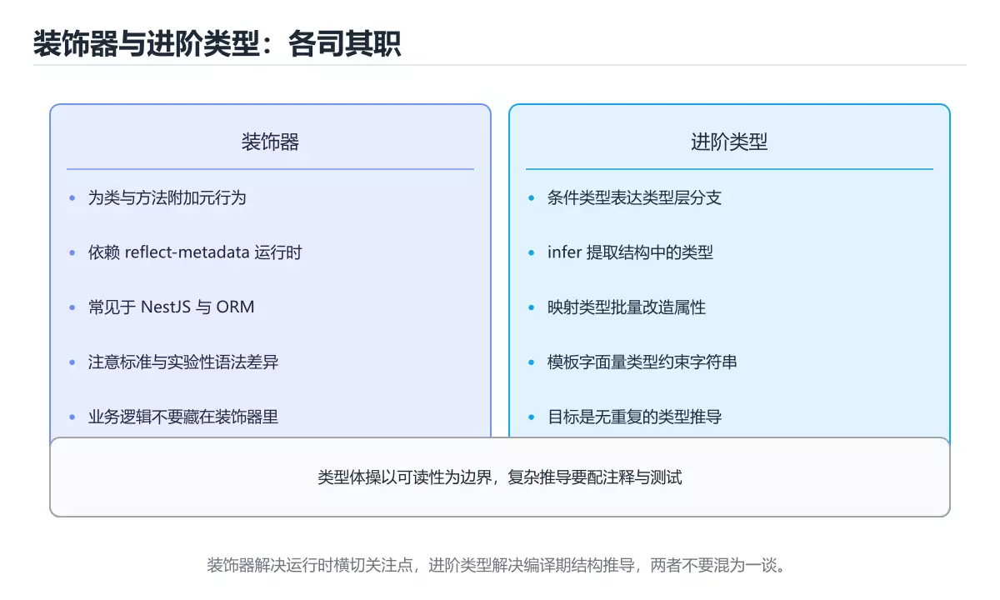
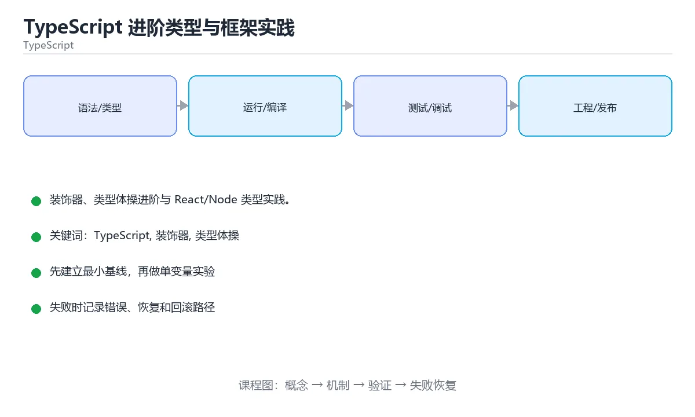

# TypeScript 进阶类型与框架实践

> 内容更新时间：2026-10-06 · 学习阶段：进阶 · 预计用时：35 分钟





## 学习目标

- 能用自己的话解释TypeScript 进阶类型与框架实践解决了什么问题，而不是只背术语。
- 能说清 「TypeScript」、「装饰器」、「类型体操」、「React」 之间的关系，并分别举出一个例子。
- 能把 TypeScript 放回「TypeScript 进阶类型与框架实践」的知识体系，说明它和 装饰器 的边界。
- 能完成本课练习，并用验收标准检查自己的结果。

> 一句话摘要：装饰器、类型体操进阶与 React/Node 类型实践。

## 前置知识

- 先完成上一课《TypeScript 工程配置与实践》；如果已经掌握，可以直接用本课练习自测。
- 本课阶段：进阶。建议先完成「TypeScript 工程配置与实践」，或确认自己能独立跑通正文里的 ClassMethodDecoratorContext 示例。
- 开始前先复习：TypeScript、装饰器、类型体操。
- 看不懂就直接缩小例子：只保留 TypeScript 相关的两行输入，跑通后再加回其余部分。

## 装饰器

装饰器是函数，用于在类、方法、属性、参数上附加行为：`@Component`、`@Injectable`、`@Get('/users')`。经典用途是依赖注入、路由注册与元数据标注。

注意：装饰器曾是实验特性（experimentalDecorators），TC39 标准装饰器语义不同。使用 Angular/NestJS 时按框架要求配置；新项目若不依赖框架，优先用高阶函数或组合替代。

## 类型体操进阶

| 技巧 | 用途 |
| --- | --- |
| 递归条件类型 | 深层 Readonly、路径类型、数组转联合 |
| 分布式条件类型 | 对联合类型逐项处理 |
| 模板字面量类型 | 生成事件名、CSS 属性、路由参数类型 |
| 协变/逆变位置 | 理解函数参数为何是逆变的 |

类型体操要克制：能表达业务约束即可，过度复杂的类型会拖慢编译并让团队难以维护。必要时写类型测试（tsd/expect-type）固定行为。

## React 类型实践

1. 组件 props 显式声明接口，避免 `React.FC`（隐式 children 已不推荐）。
2. 事件用 `React.ChangeEvent<HTMLInputElement>` 等内置类型，不要手写。
3. `useState` 泛型标注复杂状态；`useRef<HTMLDivElement>(null)` 明确可空。
4. 泛型组件：`function List<T>({ items, render }: Props<T>)`。
5. 严格模式下 `children: React.ReactNode`，不要用 `JSX.Element`。

## Node 类型实践

1. 安装 `@types/node`，注意 ESM/CJS 的模块解析差异（moduleResolution: node16）。
2. 环境变量用 zod 校验后再使用，避免 `process.env.X!` 满天飞。
3. Express/Fastify 的请求体校验同样在边界用 zod，类型交给推导。
4. 用 `NodeJS.Timeout` 标注定时器，避免与 DOM 类型冲突。

## 本课小结

TypeScript 进阶的边界是**可维护性**：装饰器与类型体操解决特定问题，框架集成靠内置类型与边界校验。

## 装饰器速查

| 类型 | 作用位置 | 典型用途 |
| --- | --- | --- |
| 类装饰器 | 类声明 | 注册、注入元数据 |
| 方法装饰器 | 方法 | 日志、缓存、权限校验 |
| 属性装饰器 | 属性 | 校验规则、序列化映射 |
| 参数装饰器 | 方法参数 | 依赖注入、参数校验 |
| 访问器装饰器 | getter / setter | 拦截读取与赋值 |

```ts
// 方法装饰器：记录耗时（标准装饰器语法）
function timed(
  target: unknown,
  context: ClassMethodDecoratorContext,
) {
  const name = String(context.name);
  return function (this: unknown, ...args: unknown[]) {
    const start = performance.now();
    try {
      return (this as Record<string, Function>)[name](...args);
    } finally {
      console.log(`${name} 耗时 ${(performance.now() - start).toFixed(1)}ms`);
    }
  };
}

class Service {
  @timed
  handle(id: string) {
    return `handled ${id}`;
  }
}
```

注意：TypeScript 有两套装饰器语义。旧版「实验性装饰器」需要 `experimentalDecorators: true`（NestJS、TypeORM 使用）；TC39 标准装饰器在新版 TS 中默认可用。两者不能混用，取决于框架要求。

## React 与类型速查

| 场景 | 写法 |
| --- | --- |
| 组件 props | `type Props = { id: string; onSelect?: (id: string) => void }` |
| 函数组件 | `function Card({ id }: Props) { ... }` |
| 子节点 | `children: React.ReactNode` |
| 事件处理 | `(e: React.ChangeEvent<HTMLInputElement>) => void` |
| 泛型组件 | `function List<T>({ items }: { items: T[] }) { ... }` |
| 状态 | `useState<User \| null>(null)` |
| Ref | `useRef<HTMLInputElement>(null)` |
| 上下文 | `createContext<Auth \| null>(null)` + 自定义 hook 校验 |

## 环境变量速查

| 场景 | 做法 |
| --- | --- |
| 前端读取 | 仅 `VITE_` 前缀会暴露给浏览器 |
| Node 读取 | `process.env.NODE_ENV`，缺省需判空 |
| 校验必填 | 启动时集中校验，缺失直接抛错 |
| 类型声明 | `declare global { namespace NodeJS { interface ProcessEnv { DATABASE_URL: string } } }` |
| 禁止 | 把密钥放前端环境变量（会被打包进产物） |

## 常见错误与排查

| 容易踩的做法 | 实际现象 | 原因与正确做法 |
| --- | --- | --- |
| 装饰器两套语义混用 | 编译错误或行为异常 | 按框架要求统一开启或关闭 `experimentalDecorators` |
| 装饰器做重业务逻辑 | 行为隐蔽、难以调试 | 只做元数据与横切关注点 |
| props 类型用 `any` | 失去检查 | 明确字段类型，可选字段用 `?` |
| 可选 props 不设默认值 | 运行时 `undefined` 报错 | 用默认参数或判空 |
| 直接把 `process.env` 传给前端 | 值为 undefined | 用构建工具的注入机制 |
| 上下文类型不校验 | 忘记 Provider 导致运行时报错 | 自定义 hook 在为空时抛错 |
| 事件类型写 `any` | 失去自动补全 | 用 React 提供的具体事件类型 |
| 泛型组件写成 `any[]` | 丢失元素类型 | 用 `<T,>` 泛型语法 |
| 用装饰器替代依赖注入显式声明 | 依赖关系不可见 | 显式构造或框架标准写法 |
| 忘记给环境变量声明类型 | `Property 'X' does not exist` | 补 `ProcessEnv` 声明 |

## 复习与自测

- [ ] 明确项目使用哪套装饰器语义，并统一配置。
- [ ] 组件 props 有明确类型，可选字段有默认处理。
- [ ] 上下文通过自定义 hook 读取并在缺失时报错。
- [ ] 环境变量在启动时校验，密钥绝不放前端。
- [ ] 装饰器只承载元数据与横切逻辑。

## 零基础详解：装饰器、运行时校验与工程实践

### 一句话说清它是什么

装饰器是「贴在类或方法上的元数据标签」，本身不干活，真正干活的是读取标签的框架。
而**运行时校验**解决类型系统管不到的那一半：接口返回的数据到底长什么样。

### 用生活比喻理解

| 概念 | 比喻 | 说明 |
| --- | --- | --- |
| 装饰器 | 贴在箱子上的标签 | 只描述信息，不改变内容 |
| 框架 | 读标签的人 | 启动或请求时读取并执行 |
| 类型系统 | 编译期合同 | 运行时完全不存在 |
| 运行时校验 | 开箱验货 | 真的检查数据是否符合合同 |
| schema 优先 | 一份图纸两用 | 校验规则反推出类型 |

### 装饰器的三种写法

```typescript
// 1. 类装饰器
function Injectable(): ClassDecorator {
  return (target) => {
    Reflect.defineMetadata("injectable", true, target);
  };
}

// 2. 方法装饰器
function Log(): MethodDecorator {
  return (target, key, descriptor: PropertyDescriptor) => {
    const original = descriptor.value;
    descriptor.value = function (...args: unknown[]) {
      console.log(`调用 ${String(key)}`, args);
      return original.apply(this, args);
    };
  };
}

// 3. 参数装饰器
function Body(): ParameterDecorator {
  return (target, key, index) => {
    Reflect.defineMetadata("body", index, target, key!);
  };
}

@Injectable()
class UserService {
  @Log()
  find(@Body() id: number) {
    return { id };
  }
}
```

**注意**：传统装饰器需要 `experimentalDecorators: true`；新标准装饰器的语义不同，混用会踩坑。

### 什么时候该用装饰器

| 场景 | 适合用装饰器 | 建议 |
| --- | --- | --- |
| 声明路由 | ✅ | NestJS 风格，元数据驱动 |
| 依赖注入 | ✅ | 框架统一读取 |
| 参数校验 | ✅ | 需要配合校验库 |
| 简单日志 | ⚠️ | 显式包装函数更易调试 |
| 业务逻辑 | ❌ | 藏在装饰器里最难排查 |

### 运行时校验：类型管不到的地方

```typescript
import { z } from "zod";

const UserSchema = z.object({
  id: z.number().int().positive(),
  name: z.string().min(1).max(50),
  email: z.string().email().optional(),
  role: z.enum(["admin", "user"]).default("user"),
});

type User = z.infer<typeof UserSchema>;      // 类型由 schema 推导，永不漂移

function parseUser(input: unknown): User {
  return UserSchema.parse(input);             // 失败会抛 ZodError
}

// 安全解析：不抛异常，返回结果对象
const result = UserSchema.safeParse(payload);
if (!result.success) {
  console.error(result.error.issues);
} else {
  console.log(result.data.role);              // 已应用默认值
}
```

**好处**：一份 schema 同时提供运行时校验和静态类型，不会出现「类型写对了但数据不对」。

### 环境变量必须校验

```typescript
const EnvSchema = z.object({
  NODE_ENV: z.enum(["development", "test", "production"]),
  PORT: z.coerce.number().int().min(1).max(65535),
  DATABASE_URL: z.string().url(),
  JWT_SECRET: z.string().min(32),
});

export const env = EnvSchema.parse(process.env);
// 缺失或格式错误会在启动时立刻失败，而不是运行到一半才崩
```

### NestJS 里的四类装饰器

| 装饰器 | 挂在哪 | 作用 |
| --- | --- | --- |
| `@Controller("/users")` | 类 | 声明路由前缀 |
| `@Get(":id")` | 方法 | 声明 HTTP 方法与路径 |
| `@Injectable()` | 类 | 允许被依赖注入 |
| `@Body()` / `@Param()` | 参数 | 从请求中取值 |

### 新手最容易踩的八个坑

| 坑 | 现象 | 正确做法 |
| --- | --- | --- |
| 以为装饰器能做运行时类型检查 | 数据照样出错 | 用 zod 等显式校验 |
| 把业务逻辑写进装饰器 | 排查困难 | 只做横切关注点 |
| 忘记开 `experimentalDecorators` | 编译报错 | 按框架要求配置 |
| 装饰器执行顺序搞混 | 元数据被覆盖 | 记住：由下往上、由内往外 |
| 只校验入参不校验出参 | 脏数据流向下游 | 两端都校验 |
| 用 `as User` 代替校验 | 运行时崩溃 | 用 `parse` 或 `safeParse` |
| 环境变量直接用 `process.env.X!` | 缺失时静默出错 | 启动时统一校验 |
| 校验错误直接抛给用户 | 泄露内部结构 | 转成统一错误响应 |

### 手把手练习：带校验的创建接口

```typescript
import { z } from "zod";

const CreateUserSchema = z.object({
  name: z.string().min(1, "姓名不能为空"),
  email: z.string().email("邮箱格式不正确"),
  age: z.number().int().min(0).max(150).optional(),
});

type CreateUserInput = z.infer<typeof CreateUserSchema>;

function createUser(raw: unknown): { ok: true; data: CreateUserInput } | { ok: false; errors: string[] } {
  const parsed = CreateUserSchema.safeParse(raw);
  if (!parsed.success) {
    return {
      ok: false,
      errors: parsed.error.issues.map((i) => `${i.path.join(".")}: ${i.message}`),
    };
  }
  return { ok: true, data: parsed.data };
}

console.log(createUser({ name: "小明", email: "a@b.com" }));
console.log(createUser({ name: "", email: "bad" }));
```

### 学完自测

- [ ] 能说出装饰器与框架的分工。
- [ ] 知道传统装饰器需要哪个编译选项。
- [ ] 能解释为什么类型系统不能替代运行时校验。
- [ ] 能用 zod 推导出 TypeScript 类型。
- [ ] 知道环境变量应该在什么时候校验。

## 动手练习

> 本课练习重点：围绕「TypeScript、装饰器、类型体操」完成复述、实验和交付，每个结果都要能被别人检查。

把 装饰器 的边界写成类型或断言，让错误在编译期暴露。

### 练习 1：建立心智模型（10 分钟）

合上教程，用 3～5 句话回答：

1. TypeScript 进阶类型与框架实践解决了什么问题？
2. 如果没有它，会出现什么具体后果？
3. 它和「装饰器」是什么关系？

验收标准：说明 TypeScript 与 装饰器 的分工，并写出一个失效场景。

### 练习 2：做一次可控实验（20 分钟）

从正文中选一个最小示例，完成以下操作：

1. 先预测修改一个参数、输入或步骤后的结果。
2. 再实际执行或逐步推演，记录真实结果。
3. 如果结果与预测不同，写出差异原因。

**验收标准**：先原样跑通正文里的 `ClassMethodDecoratorContext`，再只改TypeScript相关的输入，按「原例 → 改动 → 预测 → 结果 → 原因」记录；预测必须写在实际运行之前。

### 练习 3：交付一个小结果（30 分钟）

用 ClassMethodDecoratorContext 构造最小可运行示例，并把输出与「装饰器」的结论对照。

任务要求：

- 结果必须能被别人检查，不能只写“我已经理解了”。
- 至少覆盖「TypeScript」和「装饰器」两个关键词。
- 写出 1 个仍然不确定的问题，以及下一步如何验证。

> 提示：时间有限时优先做练习 1 和练习 2；练习 3 可以拆成两次完成。

## 可运行练习

### 任务 1：先跑通，再解释

```typescript
import { z } from "zod";

const UserSchema = z.object({
  id: z.number().int().positive(),
  name: z.string().min(1).max(50),
  email: z.string().email().optional(),
  role: z.enum(["admin", "user"]).default("user"),
});

type User = z.infer<typeof UserSchema>;      // 类型由 schema 推导，永不漂移

function parseUser(input: unknown): User {
  return UserSchema.parse(input);             // 失败会抛 ZodError
}

// 安全解析：不抛异常，返回结果对象
const result = UserSchema.safeParse(payload);
if (!result.success) {
  console.error(result.error.issues);
} else {
  console.log(result.data.role);              // 已应用默认值
}
```

### 任务 2：只改一个条件

把「TypeScript 进阶类型与框架实践」的最小示例复制一份，只改一个条件再跑一次：

- 改动点：只调整 ClassMethodDecoratorContext 的一个参数，其余条件一律不动。
- 预测：先写下「TypeScript 进阶类型与框架实践」在改动后的输出或错误信息，再运行。
- 记录：对照改动前后的结果，指出差异出在哪一步。
- 验收：ClassMethodDecoratorContext 在改动前后的输出可以对照，且影响范围可控。

### 任务 3：迁移到自己的数据

把 ClassMethodDecoratorContext 换成你自己的输入，先保持步骤不变，再比较输出差异。

## 故障现场

### 现场 1：装饰器两套语义混用

**症状**：在《TypeScript 进阶类型与框架实践》的复现场景中，编译错误或行为异常。

**根因**：触发点是把“装饰器两套语义混用”当成安全做法。它没有满足《TypeScript 进阶类型与框架实践》要求的前提，因此先表现为“编译错误或行为异常”；排查时先完整复现这一段，再核对输入、配置与依赖。

**修复**：针对《TypeScript 进阶类型与框架实践》的问题，按框架要求统一开启或关闭 experimentalDecorators。

**验证**：先在《TypeScript 进阶类型与框架实践》中记录“装饰器两套语义混用”留下的失败证据，再执行“按框架要求统一开启或关闭 experimentalDecorators”并重放；确认错误路径变为明确结果，且修复没有掩盖同类故障。

### 现场 2：装饰器做重业务逻辑

**症状**：在《TypeScript 进阶类型与框架实践》的复现场景中，行为隐蔽、难以调试。

**根因**：当出现“装饰器做重业务逻辑”时，执行路径已经绕过了《TypeScript 进阶类型与框架实践》的关键约束，最终以“行为隐蔽、难以调试”暴露出来；修复前必须先确认约束在哪里失效。

**修复**：针对《TypeScript 进阶类型与框架实践》的问题，只做元数据与横切关注点。

**验证**：先在《TypeScript 进阶类型与框架实践》中记录“装饰器做重业务逻辑”留下的失败证据，再执行“只做元数据与横切关注点”并重放；确认错误路径变为明确结果，且修复没有掩盖同类故障。

### 现场 3：可选 props 不设默认值

**症状**：在《TypeScript 进阶类型与框架实践》的复现场景中，运行时 undefined 报错。

**根因**：“运行时 undefined 报错”只是表层结果。向上追溯会落到“可选 props 不设默认值”这一步，因为它省略了《TypeScript 进阶类型与框架实践》的约束，使实现行为和预期模型发生了偏离。

**修复**：针对《TypeScript 进阶类型与框架实践》的问题，用默认参数或判空。

**验证**：保留《TypeScript 进阶类型与框架实践》里触发“运行时 undefined 报错”的输入、版本和日志，按“用默认参数或判空”完成修改后原样重放；只有失败现象消失且相邻场景仍可解释，才保留改动。

## 版本与时效

- 版本提示：TypeScript 的行为在最近几个大版本里有过调整，升级「TypeScript 进阶类型与框架实践」前先用 ClassMethodDecoratorContext 复现当前输出，再对照官方发布说明逐条核对。
- 升级前先用 ClassMethodDecoratorContext 建立基线：记录版本、命令和输出，升级后只比较这些可观察量。

### 升级检查清单

- 先固定当前版本，跑通全部示例与测验，再升级工具链。
- 升级时只动一个依赖版本，用 ClassMethodDecoratorContext 记录构建与运行结果。
- 回归范围锁定 ClassMethodDecoratorContext 的默认行为，并确认弃用警告是否出现在构建输出里。
- 升级完成后更新本课「最后复核 / 下次复核」日期，并记录 TypeScript 的版本变化。

## 本课复习清单

离开本课前，逐项确认：

- [ ] 不看解析，能说出「关于装饰器，下面说法正确的是？」的判断依据。
- [ ] 不看解析，能说出「React 组件 props 类型推荐的写法是？」的判断依据。
- [ ] 不看解析，能说出「Node 中读取环境变量的推荐做法是？」的判断依据。
- [ ] 不看解析，能说出「zod 与 class-validator 的差别是？」的判断依据。
- [ ] 不看解析，能说出「NestJS 中装饰器主要承载什么职责？」的判断依据。
- [ ] 用 TypeScript 构造一个正常输入和一个边界输入，分别记录输出与判断依据。
- [ ] 把本课最容易混淆的两个概念写成一句话对照。

| 复盘项 | 记录 |
| --- | --- |
| 已经能独立解释的考点 |  |
| 仍然说不清的概念 |  |
| 下一步验证动作 |  |

## 术语速查

| 术语 | 一句话说明 |
| --- | --- |
| `React.FC` | 组件 props 显式声明接口，避免 `React.FC`（隐式 children 已不推荐）。 |
| `TypeScript` | 在 JavaScript 上增加静态类型系统的语言，编译后可运行在浏览器或 Node.js。 |
| `装饰器` | 在不修改原函数主体的情况下包装或增强其行为的语法结构。 |
| `一句话说清它是什么` | 装饰器是「贴在类或方法上的元数据标签」，本身不干活，真正干活的是读取标签的框架。 |

## 考点精讲

### 考点 1：多选辨析·TypeScript

- **题目**：围绕“TypeScript 进阶类型与框架实践”中的 TypeScript、装饰器、类型体操，下列哪两项是本课强调的实践判断？
- **判断依据**：在「TypeScript 进阶类型与框架实践」里，学习 TypeScript 时要同时说明输入、输出和失败路径，不能只看正常流程。在TypeScript 进阶类型与框架实践里，判断 装饰器 时要固定版本与边界输入，所以“验证 装饰器 时要固定版本并覆盖边界输入，结论才可复现”才可复现。

### 考点 2：代码补全·TypeScript

- **题目**：阅读「TypeScript 进阶类型与框架实践」正文里的这段 TypeScript 代码，下面哪一项判断是正确的？
- **判断依据**：在「TypeScript 进阶类型与框架实践」里，这段代码把主要逻辑封装在函数或方法里，需要被调用才会执行。这段代码出自「TypeScript 进阶类型与框架实践」的正文示例，围绕TypeScript、装饰器、类型体操展开；把输入或边界换成空值、极值或失败情况后，结论要以「TypeScript 进阶类型与框架实践」的实际运行结果为准。

### 考点 3：概念判断·TypeScript

- **题目**：Node 中读取环境变量的推荐做法是？
- **判断依据**：在「TypeScript 进阶类型与框架实践」里，先用 zod 等校验再使用。环境变量是外部输入，缺失或格式错误应在启动时就暴露。回到「TypeScript 进阶类型与框架实践」的正文示例，用“Node 中读取环境变量的推荐做法是”走一遍TypeScript、装饰器、类型体操的完整流程，能复现的结论才可以保留。

### 考点 4：概念判断·TypeScript

- **题目**：zod 与 class-validator 的差别是？
- **判断依据**：在「TypeScript 进阶类型与框架实践」里，结论应落在「zod 是 schema 优先，可从校验规则反推类型」。结论应落在zod 是 schema 优先。zod 的 schema 可推导出静态类型，天然让运行时校验与类型定义保持一致。这道题的关键在「TypeScript 进阶类型与框架实践」的TypeScript、装饰器、类型体操：先确认题干“zod 与 class-valida”问的是哪一步，再排除偷换前提的选项。

### 考点 5：概念判断·TypeScript

- **题目**：NestJS 中装饰器主要承载什么职责？
- **判断依据**：在「TypeScript 进阶类型与框架实践」里，声明式地标注路由。装饰器本质是元数据，真正的行为由框架在启动或请求时读取元数据后执行。在「TypeScript 进阶类型与框架实践」里判断这道题，要把TypeScript、装饰器、类型体操的条件、过程与失败路径逐项对齐，换成“NestJS 中装饰器主要承载什么职”这个场景，只有满足前提的结论才成立。

### 考点 6：填空·TypeScript

- **题目**：补全代码：「TypeScript 进阶类型与框架实践」示例中，下面这行代码缺少哪个关键字或函数名？请填入 ____。 `const result = UserSchema.____(payload);`
- **判断依据**：在「TypeScript 进阶类型与框架实践」里，safeParse。「TypeScript 进阶类型与框架实践」要求先交代TypeScript、装饰器、类型体操的前提再下结论，所以“safeParse”只在题干“TypeScript 进阶类型与框架实践示例中”给定的条件下成立。

## English Overview

**Title:** Decorators & Framework Types

**Summary:** Decorators, advanced types and framework typing.

**Category:** TypeScript
**Level:** 进阶
**Key terms:** TypeScript, 装饰器, 类型体操, React, Node

## 内容元数据

- 内容版本：v2.0
- 最后更新：2026-10-06
- 学习阶段：进阶
- 适用环境：TypeScript 5.x / Node.js 22+
；本课聚焦 TypeScript。
- 内容来源：内置结构化课程与工程实践整理
- 相关主题：TypeScript、装饰器、类型体操、React、Node
- 质量版本：P0 测验标准 + P1 覆盖扩展 + P2 体验补全

## 参考资料与复核

- 最后复核：2026-10-04
- 下次复核：2027-02-24
- 复核范围：版本兼容、API 行为、安全建议与工程实践
- 来源性质：官方文档、标准或权威教材；正文为离线教学重组

| 参考资料 | 本课用途 |
| --- | --- |
| [TypeScript Node 指南](https://nodejs.org/en/learn/typescript) | Node 中的 TypeScript |
| [Everyday Types](https://www.typescriptlang.org/docs/handbook/2/everyday-types.html) | 常用类型与收窄 |
| [装饰器文档](https://www.typescriptlang.org/docs/handbook/decorators.html) | 装饰器与元数据 |

> 「TypeScript 进阶类型与框架实践」的链接用于离线阅读后的延伸核对；App 不会自动联网。
