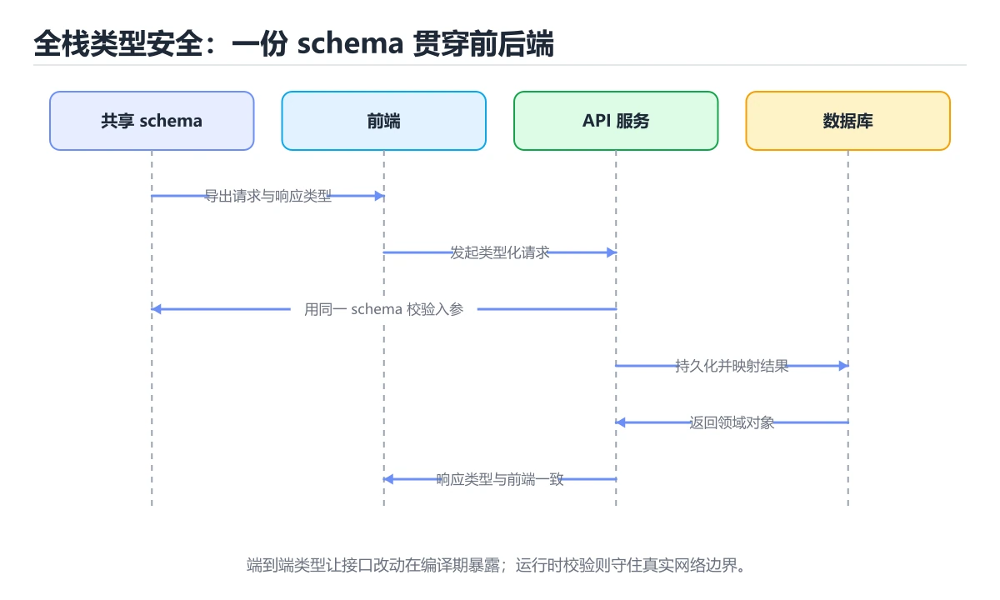
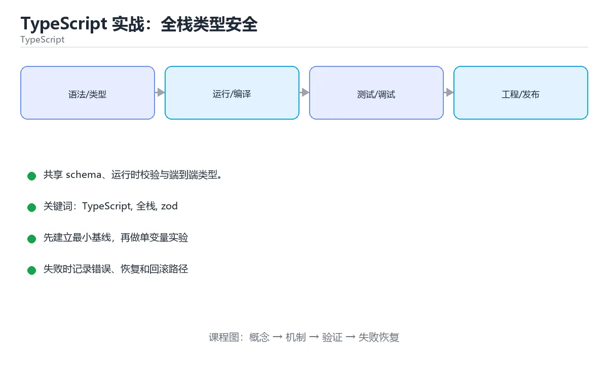

# TypeScript 实战：全栈类型安全

> 内容更新时间：2026-10-06 · 学习阶段：高级 · 预计用时：105 分钟





## 本节知识框架

**课程定位**：所属分类为「TypeScript」，课程主题为「TypeScript 实战：全栈类型安全」，学习阶段为「高级」，建议用时 105 分钟。

**本课要解决的主问题**：共享 schema、运行时校验与端到端类型。

| 学习层次 | 要回答的问题 | 完成判据 |
| --- | --- | --- |
| 概念层 | 「TypeScript 实战：全栈类型安全」有哪些必须区分的对象与术语？ | 能用自己的话定义核心术语，并各举一个正例和一个反例。 |
| 机制层 | 这些对象按什么顺序发生作用，输入如何变成输出？ | 能画出或写出机制步骤，并说明每一步的失败条件。 |
| 应用层 | 什么场景适合使用「TypeScript 实战：全栈类型安全」，什么场景不适合？ | 能给出一个真实场景、一个最小示例和一个边界案例。 |
| 性能层 | 时间、空间、吞吐或延迟受哪些量影响？ | 能说出复杂度或性能瓶颈的证据来源；没有证据时明确写“材料未提供”。 |
| 复习层 | 怎样确认自己不是只记住了结论？ | 能独立完成本课自测，并把错误定位到概念、机制、示例或边界。 |

### 阅读路线

1. 先读「核心概念定义」，建立「TypeScript」等对象的精确定义。
2. 再读「原理与运行机制」，把定义串成可重复的过程。
3. 用「代码/协议/SQL 示例」验证过程，并只改一个条件观察结果变化。
4. 最后检查性能、易错点、知识关系与自测题，形成可复习的证据链。

**前置知识**：《TypeScript 构建工具链与测试》

**学习位置**：本课位于《TypeScript 测试策略》之后；如果前一课的自测不能通过，应先回补再继续。

**后续衔接**：下一课《TypeScript 类型体操进阶》会继续使用本课术语，学完后建议立即完成一次自测。

**教材衔接：学习目标**

- 能用自己的话解释TypeScript 实战：全栈类型安全解决了什么问题，而不是只背术语。
- 能说清 「TypeScript」、「全栈」、「zod」、「tRPC」 之间的关系，并分别举出一个例子。
- 能把 TypeScript 放回「TypeScript 实战：全栈类型安全」的知识体系，说明它和 全栈 的边界。
- 能完成本课练习，并用验收标准检查自己的结果。

> 一句话摘要：共享 schema、运行时校验与端到端类型。

**教材衔接：前置知识**

- 先完成上一课《TypeScript 构建工具链与测试》；如果已经掌握，可以直接用本课练习自测。
- 开始前先复习：TypeScript、全栈、zod。
- 如果 目标 这一步看不懂，先记录具体卡点，再用 CreateOrderSchema 复现一遍。

**教材衔接：本课小结**

全栈类型安全的关键是**单一事实来源（schema）+ 两端运行时校验 + CI 强制类型检查**；做到这三点，接口联调成本会大幅下降。

## 核心概念定义

> 阅读约定：本课先给「TypeScript 实战：全栈类型安全」相关术语的操作性定义与适用边界；正文里的口语化说法与定义冲突时，以定义和可复现示例为准。

| 术语 | 操作性定义 | 本课中的边界 |
| --- | --- | --- |
| TypeScript | 在 JavaScript 上增加静态类型系统的语言，编译后可运行在浏览器或 Node.js。 | 仅在「TypeScript 实战：全栈类型安全」明确给出的输入、版本与资源条件下成立。 |
| 全栈 | 能够同时处理前端界面、后端接口、数据库和部署的工程能力。 | 仅在「TypeScript 实战：全栈类型安全」明确给出的输入、版本与资源条件下成立。 |
| zod | 开始前先复习：TypeScript、全栈、zod。 | 仅在「TypeScript 实战：全栈类型安全」明确给出的输入、版本与资源条件下成立。 |
| monorepo | 把请求/响应类型放到独立包（monorepo 里的 packages/shared），前后端都依赖它；类型变更时编译会同时暴露两端的不兼容，比联调时才发现便宜得多。 | 仅在「TypeScript 实战：全栈类型安全」明确给出的输入、版本与资源条件下成立。 |
| CI | 持续集成：每次提交自动跑构建与测试，把问题挡在合并之前 | 仅在「TypeScript 实战：全栈类型安全」明确给出的输入、版本与资源条件下成立。 |

### 定义如何使用

在「TypeScript 实战：全栈类型安全」中判断一个说法是否成立，先确认它使用的是哪个对象的定义，再检查输入规模、运行环境与失败路径。定义不是口号，而是后续推导、代码示例和自测题共享的约束。

**教材衔接：共享类型包**

把请求/响应类型放到独立包（monorepo 里的 `packages/shared`），前后端都依赖它；类型变更时编译会同时暴露两端的不兼容，比联调时才发现便宜得多。用 workspace（pnpm/npm/yarn）管理本地包引用。

**教材衔接：端到端类型安全速查**

| 方案 | 做法 | 适用 |
| --- | --- | --- |
| 共享类型包 | monorepo 内 `packages/shared` 放 DTO 与校验 schema | 前后端同仓 |
| OpenAPI / Swagger | 后端产出规范，前端生成客户端 | 跨团队、多语言 |
| tRPC | 直接调用后端过程，自动推断类型 | 全 TS、同仓、同框架 |
| GraphQL Codegen | 由 schema 生成类型与 hooks | GraphQL 项目 |
| Prisma | 由数据库 schema 生成类型安全客户端 | Node 后端 |

```ts
// 共享 schema：类型与运行时校验来自同一处定义
import { z } from "zod";

export const CreateOrderSchema = z.object({
  userId: z.string().uuid(),
  items: z.array(z.object({
    sku: z.string().min(1),
    quantity: z.number().int().positive(),
  })).min(1),
  note: z.string().max(200).optional(),
});

export type CreateOrderInput = z.infer<typeof CreateOrderSchema>;

// 服务端：解析失败返回 400，成功则拿到强类型数据
export function parseCreateOrder(body: unknown): CreateOrderInput {
  return CreateOrderSchema.parse(body);
}
```

**教材衔接：项目专属规格：TypeScript 实战：全栈类型安全**

### 核心场景

共享 schema、运行时校验与端到端类型。 项目目标是把「TypeScript、全栈、zod、tRPC、monorepo」落实为可运行、可测试、可回滚的交付物。

### 架构与数据流

```text
用户/输入 → 接口或命令 → 领域逻辑 → 存储/外部依赖 → 输出与监控
                         ↘ 失败分类 → 重试/补偿 → 回滚
```

### 最小数据模型

| 对象 | 关键字段 | 约束 |
| --- | --- | --- |
| 输入实体 | TypeScript、时间、来源 | 必填校验、长度限制、幂等键 |
| 任务实体 | 状态、优先级、创建时间 | 状态迁移合法、不可重复执行 |
| 结果实体 | 输出、错误码、耗时 | 可序列化、错误可解释 |
| 审计记录 | 操作者、动作、结果、时间 | 不可篡改、可查询、脱敏 |

### 验收场景

1. 正常路径：最小输入得到预期输出，并留下日志与指标。
2. 边界路径：全栈 在重复提交与超长输入下不产生额外副作用。
3. 失败路径：依赖超时或不可用时能快速失败、重试或降级。
4. 幂等路径：同一请求执行两次不会产生重复副作用。
5. 回滚路径：撤掉 CreateOrderSchema 的变更后，数据与资源都回到变更前的状态。

## 原理与运行机制

### 机制总览

1. **建立输入**：把「TypeScript」按本课定义整理成可观察、可重复的输入条件。
2. **执行转换**：围绕「全栈」执行本课的核心步骤；每一步都记录中间状态，避免只看最终输出。
3. **产生输出**：得到「zod」后，用正文示例或协议/SQL 结果核对输出是否符合预期。
4. **改变一个条件**：只替换一个边界条件或环境参数，观察「TypeScript 实战：全栈类型安全」的结论是否仍然成立。

| 阶段 | 关注对象 | 失败时应检查 |
| --- | --- | --- |
| 输入 | TypeScript | 类型、范围、编码、版本或前置状态是否满足定义。 |
| 处理 | 全栈 | 顺序、可见性、锁、路由、事务或调度规则是否被破坏。 |
| 输出 | zod | 结果是否可复现，错误是否被正确传播而不是被吞掉。 |

本课的机制结论要用「TypeScript 实战：全栈类型安全」自己的示例验证。「TypeScript 实战：全栈类型安全」没有给出某个数量级、吞吐或内存数据时，本课把该判断标为“材料未提供”，不从相邻主题外推。

**教材衔接：目标**

让前端与后端共享同一套类型契约，把"接口对不上"这类问题消灭在编译期。

**教材衔接：运行时契约**

类型只存在于编译期，因此服务端入口与客户端出口都要校验：

```text
// shared/schema.ts
export const CreateUser = z.object({ name: z.string().min(1), age: z.number().int().min(0) });
export type CreateUser = z.infer<typeof CreateUser>;   // 类型从 schema 推导，单一事实来源
```

服务端用同一 schema 校验请求体，客户端用同一 schema 校验响应，双方共享定义但各自保证运行时安全。

**教材衔接：接口层**

方案从轻到重：手写 fetch 封装（简单）→ OpenAPI 生成客户端（跨语言友好）→ tRPC（全 TS 项目，端到端类型推断，改后端接口前端立刻报错）。选择依据是团队语言栈与是否需要对外开放 API。

**教材衔接：端到端流程**

1. 定义 schema 与类型（shared）。
2. 服务端：路由 + 校验 + 业务 + 返回类型化 DTO。
3. 客户端：调用 + 校验响应 + 状态管理。
4. 测试：schema 单测、接口集成测试、前端组件测试。
5. CI：lint → tsc → test → build，任一步失败阻断合并。

**教材衔接：契约与校验速查**

| 环节 | 应该做什么 |
| --- | --- |
| 定义契约 | 用 schema 描述请求与响应结构 |
| 服务端校验 | 入口处 `parse`，失败返回 400 与字段错误 |
| 客户端类型 | 由 schema 推断，不手写重复类型 |
| 数据库约束 | 与业务规则一致（唯一、非空、长度） |
| 版本演进 | 新增字段可选，废弃字段先标注再移除 |
| 兼容性 | 用契约测试或生成物 diff 检测破坏性变更 |

**教材衔接：版本与时效**

- 版本提示：TypeScript 的行为在最近几个大版本里有过调整，升级「TypeScript 实战：全栈类型安全」前先用 CreateOrderSchema 复现当前输出，再对照官方发布说明逐条核对。
- 升级「TypeScript 实战：全栈类型安全」涉及的依赖前，先用 CreateOrderSchema 复现当前行为，再逐项核对版本说明与破坏性变更。

### 升级检查清单

- 先固定当前版本，跑通全部示例与测验，再升级工具链。
- 只改 TypeScript 的版本变量，记录编译、测试与产物体积的变化。
- 回归范围锁定 CreateOrderSchema 的默认行为，并确认弃用警告是否出现在构建输出里。
- 升级完成后记录 TypeScript 的新旧版本差异，并据此调整下次复核时间。

**教材衔接：交付评审：评分表、决策记录与证据链**

「TypeScript 实战：全栈类型安全」的验收不能只看功能能不能跑通。下面把正文里的交付物、验证命令和关键设计点整理成一张评审表，按表逐项留下证据即可。

### 一、「TypeScript 实战：全栈类型安全」的交付物评分表

| 交付物 | 权重 | 合格线 | 需要的证据 |
| --- | ---: | --- | --- |
| 核心链路 | 34% | 能在干净环境复现，且失败路径有明确处理 | 命令与输出、对应测试、一次失败与恢复记录 |
| 测试与验收记录 | 33% | 能在干净环境复现，且失败路径有明确处理 | 命令与输出、对应测试、一次失败与恢复记录 |
| 运行与回滚说明 | 33% | 能在干净环境复现，且失败路径有明确处理 | 命令与输出、对应测试、一次失败与恢复记录 |

「TypeScript 实战：全栈类型安全」的评分先看证据再打分：任意一项只要拿不出可复现的命令或测试，该项按 0 分计，不允许用「基本完成」代替。

### 二、需要写下来的决策（ADR）

| 决策点 | 本课给出的做法 | 备选方案 | 代价与回滚 |
| --- | --- | --- | --- |
| 架构与数据流 | 用户/输入 → 接口或命令 → 领域逻辑 → 存储/外部依赖 → 输出与监控 | 不做「架构与数据流」，沿用最朴素的实现（需要额外补一次对照实验） | 若「架构与数据流」出问题，回到上一版本并按本课验收场景重跑 |

ADR 不需要长：每个决策三行就够——选了什么、放弃了什么、出问题怎么退。评审时只检查这三行是否和「TypeScript 实战：全栈类型安全」的实际代码一致。

### 三、「TypeScript 实战：全栈类型安全」的交付证据链

本课未给出可执行命令，用下面的最小证据集代替：

1. 一条从零开始的环境准备命令。
2. 一条跑通核心链路的命令及其完整输出。
3. 一条触发失败的命令，以及恢复后的验证结果。

把「TypeScript 实战：全栈类型安全」的上表整理成一个 evidence/ 目录：每条命令一个文件，文件名带日期，内容包含版本、命令与输出。评审时直接按目录核对，不再口头确认。

### 四、「TypeScript 实战：全栈类型安全」的验收指标

| 指标 | 目标值 | 测量方式 | 不达标时的动作 |
| --- | --- | --- | --- |
| TypeScript 的核心路径耗时与失败率 | 用本课正文给出的阈值，没有就写实测基线 | 固定环境重复三次取中位数 | 回到对应小节定位，先修原因再重测 |
| 资源占用峰值与回收情况 | 用本课正文给出的阈值，没有就写实测基线 | 固定环境重复三次取中位数 | 回到对应小节定位，先修原因再重测 |
| 验收场景的通过率 | 用本课正文给出的阈值，没有就写实测基线 | 固定环境重复三次取中位数 | 回到对应小节定位，先修原因再重测 |

指标必须能用一条命令或一次操作测出来；写不出测量方式的指标，在「TypeScript 实战：全栈类型安全」的评审里一律视为未定义。

### 五、评审记录模板

| 记录项 | 填写要求 |
| --- | --- |
| 项目标识 | `ts_fullstack_project` |
| 本次范围 | 说明这一轮交付了「TypeScript 实战：全栈类型安全」的哪些部分 |
| 未完成项 | 列出与 TypeScript 相关但本轮未做的内容 |
| 证据位置 | 指向 evidence/ 目录下的具体文件 |
| 风险与回滚 | 写清剩余风险、回滚步骤和验证方式 |
| 结论 | 通过 / 有条件通过 / 不通过，三者选一 |

「TypeScript 实战：全栈类型安全」评审结束后把这张表填完并归档；下一轮迭代直接读上一次的「未完成项」与「风险与回滚」，避免重复讨论同一个问题。
<!-- p1-project-review:end -->

## 典型应用场景

| 场景 | 典型输入或前提 | 期望产物 |
| --- | --- | --- |
| 学习验证 | 使用本课最小示例和 TypeScript、全栈 | 能复现正文结论，并解释每一步。 |
| 工程落地 | 把「TypeScript 实战：全栈类型安全」放入真实模块或服务边界 | 输出可观测、失败可定位、参数可配置。 |
| 故障排查 | 只改一个版本、规模、输入或依赖条件 | 能区分概念错误、实现错误和环境差异。 |

判断「TypeScript 实战：全栈类型安全」的场景是否成立，标准是能否写出输入、处理、输出和失败路径；材料中没有出现的数据在本课标注为“材料未提供”，不用推测替代证据。

**课程内置实验入口**：`sandbox:typescript`，用于动手验证《TypeScript 实战：全栈类型安全》的机制；实验结论不替代概念定义与复杂度分析。

**教材衔接：零基础详解：全栈 TypeScript 项目**

### 一句话说清它是什么

全栈 TypeScript 的核心价值是**一份类型定义两端共用**，改接口时前端立即报错。
前提是：类型来自同一份 schema，而不是两边各写一份。

### 用生活比喻理解

| 概念 | 比喻 | 说明 |
| --- | --- | --- |
| schema | 合同的原始稿 | 唯一事实来源 |
| 运行时校验 | 开箱验货 | 类型在运行时不存在 |
| 端到端类型 | 一条线贯穿两端 | 后端改字段，前端立刻报错 |
| 契约优先 | 先定接口再写实现 | 前后端可并行开发 |

### 三种共享类型的方式

| 方式 | 类型安全 | 运行时校验 | 适合 |
| --- | --- | --- | --- |
| 手写共享类型包 | 中 | 需自己加 | 简单项目 |
| OpenAPI 生成客户端 | 强 | 需自己加 | 已有 REST 接口、对外提供 API |
| tRPC | 最强 | 配合 zod | 前后端同仓库的 TS 项目 |

### 统一事实来源：zod schema

```typescript
// packages/shared/src/user.ts
import { z } from "zod";

export const UserSchema = z.object({
  id: z.number().int().positive(),
  name: z.string().min(1).max(50),
  email: z.string().email(),
  role: z.enum(["admin", "user"]).default("user"),
});

export type User = z.infer<typeof UserSchema>;

export const CreateUserSchema = UserSchema.omit({ id: true });
export type CreateUserInput = z.infer<typeof CreateUserSchema>;
```

```typescript
// 后端：入参必须先过 schema
app.post("/users", async (req, reply) => {
  const parsed = CreateUserSchema.safeParse(req.body);
  if (!parsed.success) {
    return reply.status(400).send({
      error: "参数不合法",
      issues: parsed.error.issues.map((i) => `${i.path.join(".")}: ${i.message}`),
    });
  }
  const user = await createUser(parsed.data);
  return reply.status(201).send(UserSchema.parse(user)); // 出参也校验
});
```

```typescript
// 前端：同一份类型
import { type User, UserSchema } from "@app/shared/user";

async function loadUser(id: number): Promise<User> {
  const res = await fetch(`/api/users/${id}`);
  if (!res.ok) throw new Error(`请求失败 ${res.status}`);
  const data: unknown = await res.json();
  return UserSchema.parse(data);     // 运行时真的校验
}
```

**关键点：入参和出参都要校验。** 只校验入参，脏数据照样会流向前端。

### tRPC：端到端类型推断

```typescript
// server/router.ts
import { initTRPC } from "@trpc/server";
import { z } from "zod";

const t = initTRPC.create();

export const appRouter = t.router({
  userById: t.procedure
    .input(z.object({ id: z.number().int().positive() }))
    .query(({ input }) => findUser(input.id)),

  createUser: t.procedure
    .input(CreateUserSchema)
    .mutation(({ input }) => createUser(input)),
});

export type AppRouter = typeof appRouter;
```

```typescript
// client.ts
import { createTRPCClient, httpBatchLink } from "@trpc/client";
import type { AppRouter } from "./server/router";

const client = createTRPCClient<AppRouter>({
  links: [httpBatchLink({ url: "/trpc" })],
});

const user = await client.userById.query({ id: 1 });   // 完全类型安全
```

改后端字段名，前端会立刻编译报错——这就是端到端类型的价值。

### 错误处理：统一结构

```typescript
export type ApiError = {
  error: string;         // 给人看
  code: string;          // 给程序判断
  issues?: string[];     // 校验明细
  requestId?: string;    // 便于排查
};

export class AppError extends Error {
  constructor(
    readonly code: string,
    message: string,
    readonly status = 400,
  ) {
    super(message);
  }
}
```

前端只根据 `code` 分支，**绝不比较文案**（文案随时会改）。

### 环境变量两端各自的注意事项

```typescript
// 服务端：启动时校验
const ServerEnv = z.object({
  DATABASE_URL: z.string().url(),
  JWT_SECRET: z.string().min(32),
});
export const env = ServerEnv.parse(process.env);

// 前端：只暴露前缀变量，且它们会被打进产物，绝不能放密钥
const PublicEnv = z.object({
  VITE_API_BASE: z.string().url(),
});
export const publicEnv = PublicEnv.parse(import.meta.env);
```

**前端环境变量是公开的**，任何密钥都不能放进去。

### 全栈项目的 CI

```yaml
- run: pnpm install --frozen-lockfile
- run: pnpm typecheck                    # 两端一起检查类型
- run: pnpm lint
- run: pnpm test -- --run
- run: pnpm --filter shared build        # 先构建共享包
- run: pnpm --filter web build
- run: pnpm --filter api build
```

### 新手最容易踩的八个坑

| 坑 | 现象 | 正确做法 |
| --- | --- | --- |
| 两端各写一份类型 | 字段改了不同步 | 共用 schema |
| 只校验入参 | 脏数据流向客户端 | 入参出参都校验 |
| 用 `as User` 代替校验 | 运行时崩溃 | `parse` 或 `safeParse` |
| 前端放密钥 | 打包后公开 | 只放公开配置 |
| 比较错误文案 | 文案一改就失效 | 用 `code` |
| 共享包没先构建 | 本地能跑 CI 报错 | CI 里按依赖顺序构建 |
| 类型推断太深导致编译慢 | 开发体验差 | 拆分类型、减少体操 |
| 忽略删除字段的兼容 | 老客户端崩 | 先保留字段再下线 |

### 学完自测

- [ ] 能说出三种共享类型方式的取舍。
- [ ] 知道为什么入参与出参都要校验。
- [ ] 能说出 tRPC 相比手写类型的优势。
- [ ] 知道前端环境变量为什么不能放密钥。
- [ ] 能说出全栈 CI 里至少要跑哪些步骤。

**教材衔接：项目交付物**

### 建议仓库结构

```text
src/
  domain/
  adapters/
tests/
tsconfig.json
package.json
```

### 测试矩阵

| 层级 | 覆盖内容 | 最低数量 | 通过标准 |
| --- | --- | ---: | --- |
| 单元测试 | 领域规则、边界和错误分类 | 8 | 正常、边界、失败路径全部通过 |
| 集成测试 | 数据库、网络、文件或平台边界 | 3 | 使用真实边界且可重复运行 |
| 端到端测试 | 核心用户路径 | 1 | 从输入到输出完整跑通 |
| 手动验收 | 文档中列出的 5 个场景 | 5 | 有命令、输出和结论记录 |

### 验收数据

```json
{
  "project": "ts_fullstack_project",
  "scenario": "TypeScript的正常路径",
  "input": {"case": "normal", "value": "CreateOrderSchema"},
  "expected": {"ok": true, "checks": ["TypeScript可复现", "全栈有记录"]},
  "failure_case": {"case": "全栈越界或缺失", "error": "validation_error"},
  "idempotency_key": "ts_fullstack_project-001"
}
```

### 复盘模板

| 问题 | 记录 |
| --- | --- |
| 原目标是什么？ | 用一句话描述可验收目标 |
| 实际发生了什么？ | 时间线、指标和关键日志 |
| 哪个假设被推翻？ | 根因与促成因素 |
| 如何回滚？ | 步骤、耗时和数据校验 |
| 下一步做什么？ | 负责人、期限和验证方式 |

> 项目验收围绕「TypeScript、全栈、zod」：至少完成一次正常路径、一次边界输入、一次失败恢复和一次幂等检查。

## 代码/协议/SQL 示例

### 最小可验证示例

下面保留《TypeScript 实战：全栈类型安全》原文中的最小示例。先预测《TypeScript 实战：全栈类型安全》示例的输出，再按正文步骤运行或推演；示例依赖外部环境时，同时记录版本与输入。

```text
// shared/schema.ts
export const CreateUser = z.object({ name: z.string().min(1), age: z.number().int().min(0) });
export type CreateUser = z.infer<typeof CreateUser>;   // 类型从 schema 推导，单一事实来源
```

**教材衔接：验证命令与预期输出**

先让 CreateOrderSchema 的结果可复现，再谈扩展。下表给出最低验证集：

| 阶段 | 命令 | 预期输出 |
| --- | --- | --- |
| 安装依赖 | `npm ci` | 依赖与锁文件一致 |
| 类型检查 | `npx tsc --noEmit` | 没有类型错误 |
| 运行测试 | `npm test` | 测试全部通过 |
| 构建 | `npm run build` | 产物生成成功 |

### 验收证据

- [ ] 保存依赖安装和启动命令的完整输出。
- [ ] 为 CreateOrderSchema 补三条测试：正常、边界、失败各一条。
- [ ] 重复执行 TypeScript 的操作两次，确认没有重复写入或副作用。
- [ ] 记录一次失败状态码、错误日志和恢复步骤。
- [ ] 记录 CreateOrderSchema 的运行环境与复现命令，并补一段回滚说明。

### 回归与回滚

1. 先在可丢弃的目录或临时库里跑 TypeScript，避免污染真实数据。
2. 修改一处逻辑后重跑全部验证命令，确认没有回归。
3. 若失败，回滚到上一个可运行版本并保留失败日志。
4. 定位原因后补一条自动化测试，再重新执行发布流程。
5. 把教训写入项目复盘或本课笔记，形成下一次的检查项。

**教材衔接：原文最小示例**

```text
// shared/schema.ts
export const CreateUser = z.object({ name: z.string().min(1), age: z.number().int().min(0) });
export type CreateUser = z.infer<typeof CreateUser>;   // 类型从 schema 推导，单一事实来源
```

## 时间/空间复杂度或性能分析

**复杂度证据**：「TypeScript 实战：全栈类型安全」的现有材料没有给出渐近时间或空间复杂度的明确结论，本课只做定性检查，不补写未经验证的 $O$ 记号。

| 维度 | 本课关注点 | 判断依据 |
| --- | --- | --- |
| 时间/延迟 | 「TypeScript 实战：全栈类型安全」的主要步骤是否会随输入规模、并发度或网络往返增长。 | 以正文复杂度、基准数据或可重复测量为准。 |
| 空间/内存 | 中间状态、缓存、副本、连接或索引是否随规模增长。 | 记录峰值内存与数据副本，不只看最终结果。 |
| 吞吐/资源 | 版本、调度、锁、IO、序列化或协议开销是否成为瓶颈。 | 固定环境做对照实验，改变一个变量。 |

评估「TypeScript 实战：全栈类型安全」时要区分“正确性成立”和“性能达标”两件事；材料没有给出基准时，本课只保留量级来源与测量方法，不写不可验证的绝对数字。

## 常见误区与易错点

> 复核《TypeScript 实战：全栈类型安全》的易错点时，优先保留原文的错误表、故障现场与排错路径；每条修正都要能用本课示例复验。

| 易错点 | 常见表现 | 正确做法 |
| --- | --- | --- |
| 只背结论 | 能复述「TypeScript 实战：全栈类型安全」的定义，却说不清输入、输出与边界。 | 回到机制步骤，用最小示例逐一验证。 |
| 混淆相邻概念 | 把本课对象与相邻主题的对象当成同一类。 | 先比较定义、资源归属、生命周期和失败模式。 |
| 忽略版本与环境 | 在开发机通过后直接外推到生产环境。 | 固定版本、输入和资源条件，再记录可复现结果。 |

**教材衔接：常见错误与排查**

1. 前后端各写一份类型导致漂移——必须单一来源。
2. 只信任编译期类型，跳过运行时校验——外部输入永远不可信。
3. 版本升级时类型破坏性变更没有通知机制——用 changesets 管理版本与变更日志。
4. 过度使用 any 绕过类型错误，把问题推迟到线上。
| 容易踩的做法 | 实际现象 | 原因与正确做法 |
| --- | --- | --- |
| 前后端各写一份类型 | 字段漂移，运行时才发现 | 共享 schema 或由 OpenAPI 生成 |
| 只做编译期校验 | 非法请求进入业务逻辑 | 入口处做运行时校验 |
| 直接信任 `req.body` 类型 | 类型是断言出来的 | 用 `unknown` + schema 解析 |
| 契约破坏性变更不通知 | 客户端批量报错 | 契约测试 + 版本化 |
| 在客户端校验代替服务端校验 | 绕过前端即可攻击 | 服务端必须独立校验 |
| 数据库缺少约束 | 脏数据进入系统 | 加唯一、非空、外键约束 |
| 用 `any` 转换响应 | 失去类型安全 | 解析后推断类型 |
| 时间字段用字符串随意比较 | 时区与格式混乱 | 统一 ISO 8601 / UTC |
| 金额用浮点数 | 精度误差 | 用整数最小单位或 decimal 字符串 |
| 错误响应结构不统一 | 前端处理分支混乱 | 统一错误结构（code/message/details） |

**教材衔接：故障现场**

### 现场 1：前后端各写一份类型

**症状**：在《TypeScript 实战：全栈类型安全》的复现场景中，字段漂移，运行时才发现。

**根因**：触发点是把“前后端各写一份类型”当成安全做法。它没有满足《TypeScript 实战：全栈类型安全》要求的前提，因此先表现为“字段漂移，运行时才发现”；排查时先完整复现这一段，再核对输入、配置与依赖。

**修复**：针对《TypeScript 实战：全栈类型安全》的问题，共享 schema 或由 OpenAPI 生成。

**验证**：在《TypeScript 实战：全栈类型安全》中按“共享 schema 或由 OpenAPI 生成”调整后，从“前后端各写一份类型”的触发条件重放同一条路径，确认“字段漂移，运行时才发现”不再出现，并补一个相邻边界用例检查没有引入新问题。

### 现场 2：只做编译期校验

**症状**：在《TypeScript 实战：全栈类型安全》的复现场景中，非法请求进入业务逻辑。

**根因**：触发点是把“只做编译期校验”当成安全做法。它没有满足《TypeScript 实战：全栈类型安全》要求的前提，因此先表现为“非法请求进入业务逻辑”；排查时先完整复现这一段，再核对输入、配置与依赖。

**修复**：针对《TypeScript 实战：全栈类型安全》的问题，入口处做运行时校验。

**验证**：先在《TypeScript 实战：全栈类型安全》中记录“只做编译期校验”留下的失败证据，再执行“入口处做运行时校验”并重放；确认错误路径变为明确结果，且修复没有掩盖同类故障。

### 现场 3：直接信任 req.body 类型

**症状**：在《TypeScript 实战：全栈类型安全》的复现场景中，类型是断言出来的。

**根因**：触发点是把“直接信任 req.body 类型”当成安全做法。它没有满足《TypeScript 实战：全栈类型安全》要求的前提，因此先表现为“类型是断言出来的”；排查时先完整复现这一段，再核对输入、配置与依赖。

**修复**：针对《TypeScript 实战：全栈类型安全》的问题，用 unknown + schema 解析。

**验证**：保留《TypeScript 实战：全栈类型安全》里触发“类型是断言出来的”的输入、版本和日志，按“用 unknown + schema 解析”完成修改后原样重放；只有失败现象消失且相邻场景仍可解释，才保留改动。

## 与其他知识点的关系

| 关系 | 课程 | 为什么 |
| --- | --- | --- |
| 先修 | 《TypeScript 构建工具链与测试》 | 本课会直接使用它的概念或操作前提。 |
| 关联 | 《TypeScript 类型体操进阶》 | 用于横向比较或把本课结论迁移到相邻主题。 |
| 前置顺序 | 《TypeScript 测试策略》 | 同分类中安排在本课之前，建议先完成其自测。 |
| 后续顺序 | 《TypeScript 类型体操进阶》 | 同分类中安排在本课之后，会继续使用本课术语。 |

把「TypeScript 实战：全栈类型安全」放回知识体系时，不只要记住“前面学过什么”，还要说明两个主题在输入、机制、资源边界和失败模式上的差异。这样才能把单课知识迁移到项目、排障和后续课程。

## 自测题与参考答案

> 先独立作答《TypeScript 实战：全栈类型安全》的自测题，再对照答案与解析；每处判断都要能在本课正文或示例中找到依据。

### 自测 1

保证前后端类型一致的最佳做法是？

A. 用 any
B. 各写一份类型，但这会引入新的复杂度，需要额外的验证与维护
C. 用共享的 zod schema 推导类型作为单一事实来源
D. 靠代码评审

**参考答案**：用共享的 zod schema 推导类型作为单一事实来源

**解析**：在「TypeScript 实战：全栈类型安全」里，用共享的 zod schema 推导类型作为单一事实来源。schema 同时提供运行时校验与静态类型。在「TypeScript 实战：全栈类型安全」里判断这道题，要把TypeScript、全栈、zod的条件、过程与失败路径逐项对齐，换成“保证前后端类型一致的最佳做法是”这个场景，只有满足前提的结论才成立。

### 自测 2

下面这段 TypeScript 代码摘自「TypeScript 实战：全栈类型安全」的正文示例。关于这段代码，下面哪一项说法与实际内容相符？

```typescript
// packages/shared/src/user.ts
import { z } from "zod";

export const UserSchema = z.object({
  id: z.number().int().positive(),
  name: z.string().min(1).max(50),
  email: z.string().email(),
  role: z.enum(["admin", "user"]).default("user"),
});

export type User = z.infer<typeof UserSchema>;

export const CreateUserSchema = UserSchema.omit({ id: true });
export type CreateUserInput = z.infer<typeof CreateUserSchema>;
```

A. 这段代码只做静态声明，没有循环、分支或可观察输出。
B. 这段代码包含循环结构，同一段逻辑会被重复执行。
C. 这段代码包含条件分支，不同输入会走不同的执行路径。
D. 这段代码把主要逻辑封装在函数或方法里，需要被调用才会执行。

**参考答案**：这段代码只做静态声明，没有循环、分支或可观察输出。

**解析**：在「TypeScript 实战：全栈类型安全」里，这段代码只做静态声明，没有循环、分支或可观察输出。这段代码出自「TypeScript 实战：全栈类型安全」的正文示例，围绕TypeScript、全栈、zod展开；把输入或边界换成空值、极值或失败情况后，结论要以「TypeScript 实战：全栈类型安全」的实际运行结果为准。

### 自测 3

围绕“TypeScript 实战：全栈类型安全”中的 TypeScript、全栈、zod，下列哪两项是本课强调的实践判断？

A. 只要 TypeScript 的常规示例通过，就可以跳过边界与异常路径
B. 验证 全栈 时要固定版本并覆盖边界输入，结论才可复现
C. 把 全栈 的单次运行结果当成所有版本和规模都成立
D. 学习 TypeScript 时要同时说明输入、输出和失败路径，不能只看正常流程

**参考答案**：验证 全栈 时要固定版本并覆盖边界输入，结论才可复现；学习 TypeScript 时要同时说明输入、输出和失败路径，不能只看正常流程

**解析**：在「TypeScript 实战：全栈类型安全」里，学习 TypeScript 时要同时说明输入、输出和失败路径，不能只看正常流程。在TypeScript 实战：全栈类型安全里，判断 全栈 时要固定版本与边界输入，所以“验证 全栈 时要固定版本并覆盖边界输入，结论才可复现”才可复现。

**教材衔接：复习与自测**

- [ ] 前后端类型来自同一份 schema 或生成物。
- [ ] 入口做运行时校验，失败返回明确字段错误。
- [ ] 数据库约束与业务规则保持一致。
- [ ] 契约变更经过兼容性检查。
- [ ] 时间与金额的表示方式全链路统一。

**教材衔接：动手练习**

> 本课练习重点：围绕「TypeScript、全栈、zod」完成复述、实验和交付，每个结果都要能被别人检查。

先让 TypeScript 的类型检查通过，再制造一次类型错误，最后补运行时校验。

### 练习 1：建立心智模型（10 分钟）

合上教程，用 3～5 句话回答：

1. TypeScript 实战：全栈类型安全解决了什么问题？
2. 如果没有它，会出现什么具体后果？
3. 它和「全栈」是什么关系？

验收标准：用自己的话解释 TypeScript，并给出一个它不成立的反例。

### 练习 2：做一次可控实验（20 分钟）

从正文中选一个最小示例，完成以下操作：

1. 先预测修改一个参数、输入或步骤后的结果。
2. 再实际执行或逐步推演，记录真实结果。
3. 如果结果与预测不同，写出差异原因。

**验收标准**：围绕「目标」小节做一次五步记录，原例取自 CreateOrderSchema，改动只允许动一处TypeScript，原因要能指回正文的判断依据。

### 练习 3：交付一个小结果（30 分钟）

写一个只做一件事的小程序：输入 TypeScript，输出 全栈，其余全部省略。

任务要求：

- 结果必须能被别人检查，不能只写“我已经理解了”。
- 至少覆盖「TypeScript」和「全栈」两个关键词。
- 写出 1 个仍然不确定的问题，以及下一步如何验证。

> 提示：时间有限时优先做练习 1 和练习 2；练习 3 可以拆成两次完成。

**教材衔接：可运行练习**

### 任务 1：先跑通，再解释

```typescript
// 共享 schema：类型与运行时校验来自同一处定义
import { z } from "zod";

export const CreateOrderSchema = z.object({
  userId: z.string().uuid(),
  items: z.array(z.object({
    sku: z.string().min(1),
    quantity: z.number().int().positive(),
  })).min(1),
  note: z.string().max(200).optional(),
});

export type CreateOrderInput = z.infer<typeof CreateOrderSchema>;

// 服务端：解析失败返回 400，成功则拿到强类型数据
export function parseCreateOrder(body: unknown): CreateOrderInput {
  return CreateOrderSchema.parse(body);
}
```

### 任务 2：只改一个条件

把「TypeScript 实战：全栈类型安全」的最小示例复制一份，只改一个条件再跑一次：

- 改动点：把 全栈 换成边界值，其他输入保持原样。
- 预测：先写下「TypeScript 实战：全栈类型安全」在改动后的输出或错误信息，再运行。
- 记录：对照改动前后的结果，指出差异出在哪一步。
- 验收：CreateOrderSchema 在改动前后的输出可以对照，且影响范围可控。

### 任务 3：迁移到自己的数据

换一个 全栈 场景重做一次，确认结论不是只对示例数据成立。

**教材衔接：本课复习清单**

离开本课前，逐项确认：

- [ ] 不看解析，能说出「保证前后端类型一致的最佳做法是？」的判断依据。
- [ ] 不看解析，能说出「运行时校验应该放在哪里？」的判断依据。
- [ ] 不看解析，能说出「全 TS 项目想获得端到端类型推断，可考虑？」的判断依据。
- [ ] 不看解析，能说出「用 OpenAPI 描述接口并生成客户端的好处是？」的判断依据。
- [ ] 不看解析，能说出「Prisma 生成类型客户端的作用是？」的判断依据。
- [ ] 不看解析，能说出「把TypeScript 实战：全栈类」的判断依据。
- [ ] 用 TypeScript 构造一个正常输入和一个边界输入，分别记录输出与判断依据。
- [ ] 把本课最容易混淆的两个概念写成一句话对照。

| 复盘项 | 记录 |
| --- | --- |
| 已经能独立解释的考点 |  |
| 仍然说不清的概念 |  |
| 下一步验证动作 |  |

---

## 术语速查

把「TypeScript 实战：全栈类型安全」里反复出现的术语集中放在一起。复习时先遮住右列，尝试用自己的话解释，再回到正文核对。

| 术语 | 一句话说明 |
| --- | --- |
| `TypeScript` | 在 JavaScript 上增加静态类型系统的语言，编译后可运行在浏览器或 Node.js。 |
| `全栈` | 能够同时处理前端界面、后端接口、数据库和部署的工程能力。 |
| `zod` | 开始前先复习：TypeScript、全栈、zod。 |
| `monorepo` | 把请求/响应类型放到独立包（monorepo 里的 packages/shared），前后端都依赖它；类型变更时编译会同时暴露两端的不兼容，比联调时才发现便宜得多。 |
| `CI` | 持续集成：每次提交自动跑构建与测试，把问题挡在合并之前 |

## 考点精讲

### 考点 1：概念判断·TypeScript

- **题目**：保证前后端类型一致的最佳做法是？
- **判断依据**：在「TypeScript 实战：全栈类型安全」里，用共享的 zod schema 推导类型作为单一事实来源。schema 同时提供运行时校验与静态类型。在「TypeScript 实战：全栈类型安全」里判断这道题，要把TypeScript、全栈、zod的条件、过程与失败路径逐项对齐，换成“保证前后端类型一致的最佳做法是”这个场景，只有满足前提的结论才成立。

### 考点 2：代码补全·TypeScript

- **题目**：下面这段 TypeScript 代码摘自「TypeScript 实战：全栈类型安全」的正文示例。关于这段代码，下面哪一项说法与实际内容相符？
- **判断依据**：在「TypeScript 实战：全栈类型安全」里，这段代码只做静态声明，没有循环、分支或可观察输出。这段代码出自「TypeScript 实战：全栈类型安全」的正文示例，围绕TypeScript、全栈、zod展开；把输入或边界换成空值、极值或失败情况后，结论要以「TypeScript 实战：全栈类型安全」的实际运行结果为准。

### 考点 3：概念判断·TypeScript

- **题目**：全 TS 项目想获得端到端类型推断，可考虑？
- **判断依据**：tRPC 让改后端接口时前端立刻类型报错。其他选项：gRPC 适合服务间通信，REST 加 Swagger 需额外生成步骤，GraphQL 需要额外的类型生成工具链。在「TypeScript 实战：全栈类型安全」里判断这道题，要把TypeScript、全栈、zod的条件、过程与失败路径逐项对齐，换成“全 TS 项目想获得端到端类型推断”这个场景，只有满足前提的结论才成立。

### 考点 4：概念判断·TypeScript

- **题目**：用 OpenAPI 描述接口并生成客户端的好处是？
- **判断依据**：在「TypeScript 实战：全栈类型安全」里，结论应落在「契约由接口文档生成」。契约先行还能做 mock 与联调，接口变更时生成物会立即暴露不兼容点。在「TypeScript 实战：全栈类型安全」里，这道题要求区分概念与边界，「契约由接口文档生成」只有在题干给出的前提下才成立，而「可以省略运行时校验」、「不再需要后端」缺少同一组条件。

### 考点 5：多选辨析·TypeScript

- **题目**：围绕“TypeScript 实战：全栈类型安全”中的 TypeScript、全栈、zod，下列哪两项是本课强调的实践判断？
- **判断依据**：在「TypeScript 实战：全栈类型安全」里，学习 TypeScript 时要同时说明输入、输出和失败路径，不能只看正常流程。在TypeScript 实战：全栈类型安全里，判断 全栈 时要固定版本与边界输入，所以“验证 全栈 时要固定版本并覆盖边界输入，结论才可复现”才可复现。

### 考点 6：顺序排列·端到端流程

- **题目**：把「TypeScript 实战：全栈类型安全」中「端到端流程」的步骤调整为正确顺序。
- **判断依据**：在「TypeScript 实战：全栈类型安全」里，正确的执行顺序是「定义 schema 与类型（shared）」 → 「服务端：路由 + 校验 + 业务 + 返回类型化 DTO」 → 「客户端：调用 + 校验响应 + 状态管理」 → 「测试：schema 单测、接口集成测试、前端组件测试」。

## English Overview

**Title:** Full-stack Type Safety

**Summary:** Shared schemas, runtime validation and e2e types.

**Category:** TypeScript
**Level:** 高级
**Key terms:** TypeScript, 全栈, zod, tRPC, monorepo

## 内容元数据

- 内容版本：v2.0
- 最后更新：2026-10-06
- 学习阶段：高级
- 适用环境：TypeScript 5.x / Node.js 22+；本课聚焦 TypeScript。
- 内容来源：内置结构化课程与工程实践整理
- 相关主题：TypeScript、全栈、zod、tRPC、monorepo
- 质量版本：P0 测验标准 + P1 覆盖扩展 + P2 体验补全

## 参考资料与复核

- 最后复核：2026-10-04
- 下次复核：2027-03-17
- 复核范围：版本兼容、API 行为、安全建议与工程实践
- 来源性质：官方文档、标准或权威教材；正文为离线教学重组

| 参考资料 | 本课用途 |
| --- | --- |
| [TypeScript Handbook](https://www.typescriptlang.org/docs/handbook/intro.html) | 类型系统与语言指南 |
| [项目引用](https://www.typescriptlang.org/docs/handbook/project-references.html) | 大型项目拆分与增量构建 |
| [泛型文档](https://www.typescriptlang.org/docs/handbook/2/generics.html) | 泛型约束与复用 |

> 「TypeScript 实战：全栈类型安全」的链接用于离线阅读后的延伸核对；App 不会自动联网。

<!-- p1-project-review:start -->
