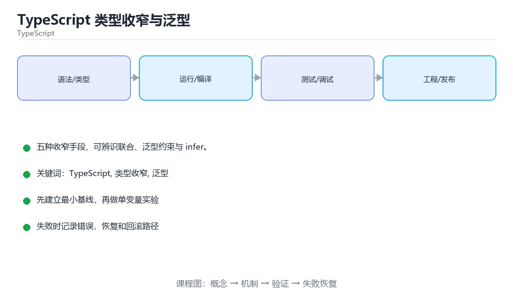

# TypeScript 类型收窄与泛型



> 内容更新时间：2026-10-03 · 学习阶段：入门 · 预计用时：16 分钟

## 学习目标

- 能用自己的话解释「TypeScript 类型收窄与泛型」解决了什么问题，而不是只背术语。
- 能说清 「TypeScript」、「类型收窄」、「泛型」、「可辨识联合」 之间的关系，并分别举出一个例子。
- 能把本课知识放回「TypeScript」的知识体系，说明它和相邻主题的边界。
- 能完成本课练习，并用验收标准检查自己的结果。

> 一句话摘要：五种收窄手段、可辨识联合、泛型约束与 infer。

## 前置知识

- 先完成上一课《TypeScript 类型系统》；如果已经掌握，可以直接用本课练习自测。
- 本课阶段：入门。只需要基本计算机操作，不要求编程经验。
- 开始前先复习：TypeScript、类型收窄、泛型。
- 如果某一步看不懂，先记录具体卡点，完成练习后再回头读一遍。


## 类型收窄的五种手段

| 手段 | 用法 |
| --- | --- |
| typeof | 区分 string/number/boolean 等原始类型 |
| instanceof | 区分类实例 |
| in | 判断属性是否存在 |
| 可辨识联合 | 用共同字段（如 `type`）区分成员，配合 switch 穷尽检查 |
| 类型守卫 | 自定义 `x is T` 函数或断言函数 `asserts x is T` |

可辨识联合 + switch 是建模业务状态最实用的模式：订单状态、请求结果、表单校验结果都可以这样写，新增一种状态时编译器会提示所有需要处理的位置。

## 泛型与约束

泛型让函数与组件在保持类型安全的前提下复用：`function first<T>(list: T[]): T | undefined`。约束用 `extends`：`<T extends { id: number }>` 要求必须有 id；默认类型参数 `<T = string>` 提供缺省。

## 条件类型与 infer

`T extends U ? X : Y` 在类型层面做分支；`infer` 用于提取类型片段，例如提取函数返回类型、数组元素类型、Promise 的结果类型。这是工具类型的实现基础。

## 常见陷阱

1. 滥用 `any` 让检查失效——外部数据先用 `unknown`，校验后再收窄。
2. 过度断言 `as` 会掩盖错误，优先用类型守卫。
3. 非空断言 `!` 只是让编译器闭嘴，运行时该崩还是崩。
4. 泛型嵌套过深会降低可读性，必要时拆成命名类型。

## 本课小结
TypeScript 的类型能力集中在两处：**收窄（把宽类型变窄）** 与 **泛型（让类型随输入变化）**；掌握这两点，就能用类型把业务约束表达清楚。


## 类型收窄速查

| 收窄手段 | 写法 | 适用场景 |
| --- | --- | --- |
| `typeof` | `if (typeof v === "string")` | 原始类型 |
| 真值判断 | `if (v) {}` | 排除 `null` / `undefined` / `""` / `0` |
| 空值判断 | `if (v != null)` | 同时排除 `null` 与 `undefined` |
| `in` 运算符 | `if ("id" in v)` | 联合类型中按字段区分 |
| `instanceof` | `if (e instanceof Error)` | 类实例 |
| 字面量判别 | `if (r.status === "ok")` | 可辨识联合（推荐） |
| 自定义类型守卫 | `function isUser(v: unknown): v is User` | 校验外部数据 |
| 断言函数 | `function assert(cond: unknown): asserts cond` | 抛错即收窄 |
| `Array.isArray` | `if (Array.isArray(v))` | 数组判断 |
| 穷尽检查 | `default: const _x: never = v;` | 编译期确保分支齐全 |

可辨识联合的标准写法：

```ts
type Result =
  | { status: "ok"; data: string }
  | { status: "error"; message: string };

function render(result: Result): string {
  switch (result.status) {
    case "ok":
      return result.data;        // 自动收窄到 ok 分支
    case "error":
      return result.message;
    default: {
      const never: never = result;   // 新增成员时这里会编译报错
      return never;
    }
  }
}
```

## 泛型约束速查

| 写法 | 含义 |
| --- | --- |
| `<T>` | 任意类型 |
| `<T extends object>` | 必须是对象类型 |
| `<T extends { id: string }>` | 至少具备该形状 |
| `<T extends keyof U>` | 只能是 U 的键 |
| `<T = string>` | 提供默认类型参数 |
| `<T extends string \| number>` | 联合约束 |
| `function f<T>(x: T): T` | 返回值与入参类型联动 |
| `ReturnType<typeof f>` | 取函数返回值类型 |
| `Parameters<typeof f>[0]` | 取第一个参数类型 |
| `as const` | 让字面量推断变窄 |

```ts
// 约束 + keyof：安全地按字段取值
function pluck<T, K extends keyof T>(items: T[], key: K): T[K][] {
  return items.map((item) => item[key]);
}

const users = [{ id: 1, name: "小明" }];
const names = pluck(users, "name");   // string[]
// pluck(users, "age");               // 编译报错，及时发现问题
```

## 常见错误对照表

| 容易写错的做法 | 实际现象 | 原因与正确做法 |
| --- | --- | --- |
| `JSON.parse(text) as User` | 编译通过，运行时字段缺失报错 | 断言不校验数据，外部输入要用 zod 等做运行时校验 |
| 到处写 `any` | 类型检查失效，错误延后到线上 | 用 `unknown` + 类型守卫逐层收窄 |
| `obj!.field` 滥用非空断言 | 运行时 `TypeError` | 用 `if (!obj) return;` 先收窄 |
| `as string` 强转 | 掩盖真实的类型不匹配 | 优先改类型定义，只在校验之后断言 |
| 函数返回 `T \| undefined` 却不处理 | 调用方忘记判空 | 用可辨识联合表达结果，或抛异常 |
| 泛型约束太宽 | 函数体里访问属性报错 | 加 `T extends { ... }` 约束 |
| 用 `Object.keys(obj)` 得到 `string[]` | 遍历时索引报错 | 明确断言为 `(keyof T)[]`，或改用 `Record` 设计 |
| 数组 `find` 结果直接用 | 可能是 `undefined` | 先判空，或用可辨识联合包装 |
| 类型断言在循环里反复写 | 代码噪声大 | 把校验抽成类型守卫函数复用 |

## 自测清单

- [ ] 能用可辨识联合替代「可选字段大杂烩」的接口设计。
- [ ] 外部数据先 `unknown`，再通过类型守卫收窄。
- [ ] 会用 `keyof` 与泛型约束写出类型安全的取值函数。
- [ ] 知道 `as` 不做运行时校验。
- [ ] 在 `switch` 里用 `never` 做穷尽检查。


## 零基础详解：类型收窄与泛型

### 一句话说清它是什么

收窄是把「很宽的类型」逐步判断成「很具体的类型」；
泛型是让函数对多种类型都成立，同时不丢类型信息。两者合起来，就是 TypeScript 类型系统的骨架。

### 用生活比喻理解

| 概念 | 比喻 | 说明 |
| --- | --- | --- |
| 联合类型 `A \| B` | 一个没拆的快递箱 | 不知道里面是什么 |
| 收窄 | 开箱验货 | 判断后才知道是哪种 |
| 泛型 | 可调模具 | 一套模具适配多种尺寸 |
| 约束 `extends` | 模具的尺寸范围 | 限定能适配哪些类型 |
| 类型守卫 | 贴标签 | 告诉编译器「现在确定是它」 |

### 收窄的五种手段

```typescript
type Shape =
  | { kind: "circle"; radius: number }
  | { kind: "square"; side: number };

function area(shape: Shape): number {
  switch (shape.kind) {                 // 1. 可辨识联合：按字面量字段分流
    case "circle":
      return Math.PI * shape.radius ** 2;   // 这里 shape 已收窄
    case "square":
      return shape.side ** 2;
  }
}

function format(value: string | number | Date): string {
  if (typeof value === "string") return value;        // 2. typeof
  if (value instanceof Date) return value.toISOString();  // 3. instanceof
  return value.toFixed(2);                            // 剩下是 number
}

function isUser(v: unknown): v is { id: number; name: string } {   // 4. 自定义守卫
  return (
    typeof v === "object" && v !== null &&
    typeof (v as any).id === "number" &&
    typeof (v as any).name === "string"
  );
}

const list: (string | null)[] = ["a", null];
const values = list.filter((x): x is string => x !== null);   // 5. 收窄式 filter
```

| 手段 | 适用场景 |
| --- | --- |
| `typeof` | 原始类型判断 |
| `instanceof` | 类实例判断 |
| `in` | 判断某个属性是否存在 |
| 字面量字段（可辨识联合） | 状态机、事件对象 |
| 自定义类型守卫 | 外部数据校验 |

### 穷尽检查：新增分支时自动报错

```typescript
function assertNever(value: never): never {
  throw new Error(`未处理的分支：${JSON.stringify(value)}`);
}

type Status = "pending" | "running" | "done";

function label(s: Status): string {
  switch (s) {
    case "pending": return "等待中";
    case "running": return "运行中";
    case "done": return "已完成";
    default: return assertNever(s);      // 将来新增状态时这里会编译报错
  }
}
```

### 泛型常用的四个写法

```typescript
// 1. 基础泛型：输入什么类型就返回什么类型
function identity<T>(value: T): T {
  return value;
}

// 2. 带约束：要求至少有 id 字段
function pluck<T, K extends keyof T>(items: T[], key: K): T[K][] {
  return items.map((item) => item[key]);
}

// 3. 默认类型参数
type Result<T = unknown> = { ok: true; data: T } | { ok: false; error: string };

// 4. 条件类型 + infer：从类型里提取片段
type ElementType<T> = T extends (infer U)[] ? U : never;
type N = ElementType<number[]>;        // number
```

### `keyof` 与索引访问

```typescript
type User = { id: number; name: string; email?: string };

type Keys = keyof User;                 // "id" | "name" | "email"
type NameType = User["name"];           // string

function get<T, K extends keyof T>(obj: T, key: K): T[K] {
  return obj[key];
}
const u: User = { id: 1, name: "小明" };
const n = get(u, "name");               // 推断为 string
```

### 新手最容易踩的八个坑

| 坑 | 现象 | 正确做法 |
| --- | --- | --- |
| 用 `as` 强行断言 | 运行时照样出错 | 用类型守卫真校验 |
| 泛型没用上参数 | 推断成 unknown | 让 T 出现在参数位置 |
| 约束写太死 | 调用方传不进去 | 用 `keyof` 等结构性约束 |
| 忘了处理 `null` | `strictNullChecks` 报错 | 先判空或用 `?.` |
| 类型守卫只判一层 | 嵌套字段仍报错 | 逐层校验 |
| 用 `any` 绕过报错 | 类型安全全丢 | 用 `unknown` 加守卫 |
| 默认分支不写 `assertNever` | 新增状态漏处理 | 用穷尽检查兜底 |
| 泛型嵌套太深 | 没人看得懂 | 拆成命名类型 |

### 手把手练习：安全地取嵌套字段

```typescript
type ApiResponse =
  | { status: "ok"; data: { id: number; tags: string[] } }
  | { status: "error"; message: string };

function handle(res: ApiResponse): string {
  if (res.status === "error") {
    return `失败：${res.message}`;
  }
  return `成功，id=${res.data.id}，标签 ${res.data.tags.join("/")}`;
}

function safeGet<T, K extends keyof T>(obj: T | null, key: K): T[K] | undefined {
  return obj === null ? undefined : obj[key];
}

const user = { id: 1, name: "小明" };
console.log(safeGet(user, "name"));     // string | undefined
console.log(handle({ status: "ok", data: { id: 2, tags: ["a"] } }));
```

### 学完自测

- [ ] 能说出五种收窄手段各自适用什么场景。
- [ ] 能写出一个自定义类型守卫函数。
- [ ] 知道 `assertNever` 为什么要接收 `never`。
- [ ] 能解释 `K extends keyof T` 的含义。
- [ ] 知道为什么不该用 `as` 代替真正的校验。

## 动手练习


> 本课练习重点：围绕「TypeScript、类型收窄、泛型」完成复述、实验和交付，每个结果都要能被别人检查。

先让类型检查通过，再制造一次类型错误，最后补运行时校验与测试。

### 练习 1：建立心智模型（10 分钟）

合上教程，用 3～5 句话回答：

1. 「TypeScript 类型收窄与泛型」解决了什么问题？
2. 如果没有它，会出现什么具体后果？
3. 它和「类型收窄」是什么关系？

**验收标准**：至少出现一个本课关键词，并写出一个反例、边界条件或失效场景。

### 练习 2：做一次可控实验（20 分钟）

从正文中选一个最小示例，完成以下操作：

1. 先预测修改一个参数、输入或步骤后的结果。
2. 再实际执行或逐步推演，记录真实结果。
3. 如果结果与预测不同，写出差异原因。

**验收标准**：留下「原例 → 改动 → 预测 → 结果 → 原因」五步记录。

### 练习 3：交付一个小结果（30 分钟）

写一个最小类型示例，先让 `tsc --noEmit` 通过，再故意制造一次类型错误。

任务要求：

- 结果必须能被别人检查，不能只写“我已经理解了”。
- 至少覆盖「TypeScript」和「类型收窄」两个关键词。
- 写出 1 个仍然不确定的问题，以及下一步如何验证。

> 提示：时间有限时优先做练习 1 和练习 2；练习 3 可以拆成两次完成。


## 考点精讲：把测验题还原成判断过程

本课有 6 个判断点。先自己作答，再看「判断依据」；如果结论正确但理由不完整，回到正文对应章节补足概念。

### 考点 1：可辨识联合靠什么区分成员？

- **正确判断**：一个共同的字面量字段（如 type）
- **判断依据**：正确答案是「一个共同的字面量字段（如 type）」，本课在「类型收窄的五种手段」中说明：可辨识联合 + switch 是建模业务状态最实用的模式：订单状态、请求结果、表单校验结果都可以这样写，新增一种状态时编译器会提示所有需要处理的位置。配合 switch 可实现穷尽检查，新增状态时编译器会提示。本课还在「本课小结」中说明：TypeScript 的类型能力集中在两处：收窄（把宽类型变窄） 与 泛型（让类型随输入变化）。
- **迁移检查**：如果给某个错误选项去掉一个限定词，它会不会变成正确？说明理由。

### 考点 2：外部接口数据最安全的类型标注是？

- **正确判断**：unknown + 运行时校验后收窄
- **判断依据**：正确答案是「unknown + 运行时校验后收窄」，本课在「类型收窄的五种手段」中说明：可辨识联合 + switch 是建模业务状态最实用的模式：订单状态、请求结果、表单校验结果都可以这样写，新增一种状态时编译器会提示所有需要处理的位置。any 放弃检查，unknown 强制你先校验再使用。本课还在「常见陷阱」中说明：滥用 any 让检查失效——外部数据先用 unknown，校验后再收窄。本课还在「本课小结」中说明：TypeScript 的类型能力集中在两处：收窄（把宽类型变窄） 与 泛型（让类型随输入变化）。
- **迁移检查**：如果给某个错误选项去掉一个限定词，它会不会变成正确？说明理由。

### 考点 3：infer 关键字用于？

- **正确判断**：在条件类型中提取类型片段
- **判断依据**：正确答案是「在条件类型中提取类型片段」，本课在「条件类型与 infer」中说明：infer 用于提取类型片段，例如提取函数返回类型、数组元素类型、Promise 的结果类型。它是 ReturnType、Awaited 等工具类型的实现基础。本课还在「泛型与约束」中说明：泛型让函数与组件在保持类型安全的前提下复用：function first<T>(list: T[]): T | undefined。
- **迁移检查**：遮住选项，只根据定义复述一次答案，再回来看哪个选项与复述一致。

### 考点 4：自定义类型守卫的返回类型应该写成？

- **正确判断**：value is Foo
- **判断依据**：返回 value is Foo 后，调用处在该分支内会被自动收窄为 Foo 类型。其他选项：返回 Foo、undefined、typeof Foo 或 boolean 都不会让调用处收窄。针对「自定义类型守卫的返回类型应该写成，」，本课在「条件类型与 infer」中说明：infer 用于提取类型片段，例如提取函数返回类型、数组元素类型、Promise 的结果类型。本课还在「常见陷阱」中说明：过度断言 as 会掩盖错误，优先用类型守卫。
- **迁移检查**：把题干里的一个条件换成边界值，原来的结论还成立吗？写出判断过程。

### 考点 5：泛型约束 T extends { id: string } 的作用是？

- **正确判断**：要求类型参数至少具备该形状
- **判断依据**：正确答案是「要求类型参数至少具备该形状」，本课在「泛型与约束」中说明：默认类型参数 <T = string> 提供缺省。没有约束时不能访问 T 的成员，约束是泛型里获得类型安全的关键。本课还在「泛型与约束」中说明：约束用 extends：<T extends { id: number }> 要求必须有 id。本课还在「常见陷阱」中说明：非空断言 ! 只是让编译器闭嘴，运行时该崩还是崩。
- **迁移检查**：把题干里的一个条件换成边界值，原来的结论还成立吗？写出判断过程。

### 考点 6：补全代码：「TypeScript 类型收窄与泛型」示例中，下面这行代码缺少哪个关键字或函数名？请填入 ____。 `function ____(value: never): never {`

- **正确判断**：assertNever / assertnever
- **判断依据**：正确答案是「assertNever」，本课在「零基础详解：类型收窄与泛型」中说明：知道 assertNever 为什么要接收 never。本课还在「泛型与约束」中说明：泛型让函数与组件在保持类型安全的前提下复用：function first<T>(list: T[]): T | undefined。本课还在「零基础详解：类型收窄与泛型」中说明：泛型是让函数对多种类型都成立，同时不丢类型信息。
- **迁移检查**：把答案换成另一种等价写法，是否仍然正确？说明依据。

## 本课复习清单

离开本课前，逐项确认：

- [ ] 不看解析，能说出「可辨识联合靠什么区分成员？」的判断依据。
- [ ] 不看解析，能说出「外部接口数据最安全的类型标注是？」的判断依据。
- [ ] 不看解析，能说出「infer 关键字用于？」的判断依据。
- [ ] 不看解析，能说出「自定义类型守卫的返回类型应该写成？」的判断依据。
- [ ] 不看解析，能说出「泛型约束 T extends { id: string } 的作用是？」的判断依据。
- [ ] 不看解析，能说出「补全代码：「TypeScript 类型收窄与泛型」示例中，下面这行代码缺少哪个关…」的判断依据。
- [ ] 至少运行一次本课示例，记录输入、输出和一个边界情况。
- [ ] 把本课最容易混淆的两个概念写成一句话对照。

| 复盘项 | 记录 |
| --- | --- |
| 已经能独立解释的考点 |  |
| 仍然说不清的概念 |  |
| 下一步验证动作 |  |

## English Overview

**Title:** Narrowing & Generics

**Summary:** Narrowing, discriminated unions, generics and infer.

**Category:** TypeScript  
**Level:** 入门  
**Key terms:** TypeScript, 类型收窄, 泛型, 可辨识联合, infer

> The full tutorial is written in Chinese. This bilingual overview helps English readers identify the topic, scope and key terms before studying the detailed examples.

## 内容元数据

- 内容版本：v2.0
- 最后更新：2026-10-03
- 学习阶段：入门
- 适用环境：TypeScript 5.x / Node.js 22+
- 内容来源：内置结构化课程与工程实践整理
- 相关主题：TypeScript、类型收窄、泛型、可辨识联合、infer
- 质量版本：P0 测验标准 + P1 覆盖扩展 + P2 体验补全


## Full English Study Guide

### Overview

**Narrowing & Generics** focuses on Narrowing, discriminated unions, generics and infer.

### Learning Outcomes

- Explain what **Narrowing & Generics** solves and when it should be used.
- Identify inputs, outputs, state and failure boundaries.
- Build a minimal reproducible example and observe the real result.
- Test normal, boundary and failure paths.
- Measure performance, resource cost or security impact before optimizing.
- Document the decision, rollback path and remaining uncertainty.

### Core Mental Model

1. **Problem first:** define the exact problem before choosing a tool or pattern.
2. **Smallest example:** reduce the system to one input and one observable output.
3. **State and flow:** trace how data, control or responsibility moves through the system.
4. **Boundaries:** identify invalid input, resource limits, timeouts and permission edges.
5. **Evidence:** use tests, logs, metrics or reproductions instead of intuition.
6. **Trade-offs:** compare correctness, latency, cost, complexity and operability.

### Step-by-step Study Plan

1. Read the Chinese lesson once and write down the main problem in one sentence.
2. Run the smallest example and save the exact command and output.
3. Change only one input or parameter and predict the result before running it.
4. Introduce one failure and record how the system detects, reports and recovers.
5. Write one test or checklist item for the normal, boundary and failure paths.
6. Complete the quiz and explain every wrong answer in your own words.

### Practice Tasks

- Rebuild the minimal example from an empty directory.
- Add one boundary test and one failure test.
- Produce a short report containing the baseline, change, result and rollback.

### Common Failure Modes

- Treating a happy-path demo as production readiness.
- Skipping boundary values and invalid inputs.
- Optimizing before establishing a measurable baseline.
- Hiding errors, permissions or resource limits.

### Self-check Questions

1. What is the smallest observable result that proves this lesson works?
2. What input or state is most likely to break it?
3. Which metric or test would reveal a regression?
4. What is the rollback path?
5. What is the cost of using this approach at 10x scale?
6. Which adjacent topic is most often confused with this one?

### Glossary

- Topic: **Narrowing & Generics**
- Related terms: TypeScript, 类型收窄, 泛型, 可辨识联合
- Primary evidence: command output, tests, logs, metrics or reproductions

> This guide is an English study companion for the detailed Chinese lesson. It covers the learning path, mental model and acceptance questions; code examples and engineering details remain in the main tutorial.


## Bilingual Section Outline

| 中文小节 | English section |
| --- | --- |
| 学习目标 | Learning objectives |
| 前置知识 | Prerequisites |
| 类型收窄的五种手段 | Types收窄的五种手段 |
| 泛型与约束 | 泛型与约束 |
| 条件类型与 infer | 条件Types与 infer |
| 常见陷阱 | 常见陷阱 |
| 本课小结 | Summary |
| 类型收窄速查 | Types收窄速查 |
| 泛型约束速查 | 泛型约束速查 |
| 常见错误对照表 | Common mistakes对照表 |

> 该大纲把每个中文小节映射为英文标题，配合 Full English Study Guide 使用。


## 参考资料与复核

- 最后复核：2026-10-04
- 下次复核：2027-04-04
- 复核范围：版本兼容、API 行为、安全建议与工程实践
- 来源性质：官方文档与标准；本课正文为离线教学重组，不复制原文

| 参考资料 | 本课用途 |
| --- | --- |
| [TypeScript Handbook](https://www.typescriptlang.org/docs/handbook/intro.html) | 类型系统与编译配置 |
| [Decorators 与模块](https://www.typescriptlang.org/docs/) | 语言特性与生态集成 |

> 本课主题：五种收窄手段、可辨识联合、泛型约束与 infer。

> App 完全离线展示文字链接，不会自动联网；需要延伸阅读时可复制链接到浏览器。

