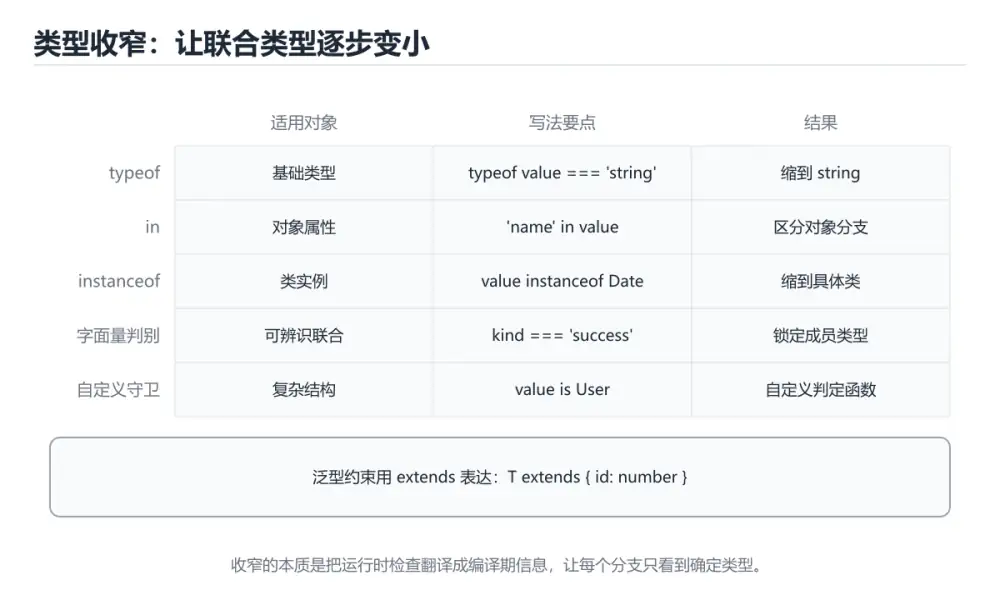

# TypeScript 类型收窄与泛型




> 内容更新时间：2026-10-06 · 学习阶段：进阶 · 预计用时：50 分钟

## 本节知识框架

**课程定位**：所属分类为「TypeScript」，课程主题为「TypeScript 类型收窄与泛型」，学习阶段为「进阶」，建议用时 50 分钟。

**本课要解决的主问题**：五种收窄手段、可辨识联合、泛型约束与 infer。

| 学习层次 | 要回答的问题 | 完成判据 |
| --- | --- | --- |
| 概念层 | 「TypeScript 类型收窄与泛型」有哪些必须区分的对象与术语？ | 能用自己的话定义核心术语，并各举一个正例和一个反例。 |
| 机制层 | 这些对象按什么顺序发生作用，输入如何变成输出？ | 能画出或写出机制步骤，并说明每一步的失败条件。 |
| 应用层 | 什么场景适合使用「TypeScript 类型收窄与泛型」，什么场景不适合？ | 能给出一个真实场景、一个最小示例和一个边界案例。 |
| 性能层 | 时间、空间、吞吐或延迟受哪些量影响？ | 能说出复杂度或性能瓶颈的证据来源；没有证据时明确写“材料未提供”。 |
| 复习层 | 怎样确认自己不是只记住了结论？ | 能独立完成本课自测，并把错误定位到概念、机制、示例或边界。 |

### 阅读路线

1. 先读「核心概念定义」，建立「TypeScript」等对象的精确定义。
2. 再读「原理与运行机制」，把定义串成可重复的过程。
3. 用「代码/协议/SQL 示例」验证过程，并只改一个条件观察结果变化。
4. 最后检查性能、易错点、知识关系与自测题，形成可复习的证据链。

**前置知识**：《TypeScript 类型系统》

**学习位置**：本课位于《TypeScript 构建工具链与测试》之后；如果前一课的自测不能通过，应先回补再继续。

**后续衔接**：下一课《TypeScript 进阶类型与框架实践》会继续使用本课术语，学完后建议立即完成一次自测。

**教材衔接：学习目标**

- 能用自己的话解释TypeScript 类型收窄与泛型解决了什么问题，而不是只背术语。
- 能说清 「TypeScript」、「类型收窄」、「泛型」、「可辨识联合」 之间的关系，并分别举出一个例子。
- 能把 TypeScript 放回「TypeScript 类型收窄与泛型」的知识体系，说明它和 类型收窄 的边界。
- 能完成本课练习，并用验收标准检查自己的结果。

> 一句话摘要：五种收窄手段、可辨识联合、泛型约束与 infer。

**教材衔接：前置知识**

- 先完成上一课《TypeScript 类型系统》；如果已经掌握，可以直接用本课练习自测。
- 本课阶段：入门。只需要基本计算机操作，不要求编程经验。
- 开始前先复习：TypeScript、类型收窄、泛型。
- 如果 类型收窄的五种手段 这一步看不懂，先记录具体卡点，再用 message 复现一遍。

**教材衔接：本课小结**

TypeScript 的类型能力集中在两处：**收窄（把宽类型变窄）** 与 **泛型（让类型随输入变化）**；掌握这两点，就能用类型把业务约束表达清楚。

## 核心概念定义

> 阅读约定：本课先给「TypeScript 类型收窄与泛型」相关术语的操作性定义与适用边界；正文里的口语化说法与定义冲突时，以定义和可复现示例为准。

| 术语 | 操作性定义 | 本课中的边界 |
| --- | --- | --- |
| TypeScript | 在 JavaScript 上增加静态类型系统的语言，编译后可运行在浏览器或 Node.js。 | 仅在「TypeScript 类型收窄与泛型」明确给出的输入、版本与资源条件下成立。 |
| 类型收窄 | 在条件判断后让编译器知道变量属于更具体的类型。 | 仅在「TypeScript 类型收窄与泛型」明确给出的输入、版本与资源条件下成立。 |
| 泛型 | TypeScript 的类型能力集中在两处：收窄（把宽类型变窄） 与 泛型（让类型随输入变化）；掌握这两点，就能用类型把业务约束表达清楚。 | 仅在「TypeScript 类型收窄与泛型」明确给出的输入、版本与资源条件下成立。 |
| 可辨识联合 | 可辨识联合 + switch 是建模业务状态最实用的模式：订单状态、请求结果、表单校验结果都可以这样写，新增一种状态时编译器会提示所有需要处理的位置。 | 仅在「TypeScript 类型收窄与泛型」明确给出的输入、版本与资源条件下成立。 |
| infer | TypeScript 在条件类型里声明待推断类型变量的关键字。 | 仅在「TypeScript 类型收窄与泛型」明确给出的输入、版本与资源条件下成立。 |
| 条件类型 | TypeScript 根据类型关系在编译期选择结果类型的类型运算 | 仅在「TypeScript 类型收窄与泛型」明确给出的输入、版本与资源条件下成立。 |

### 定义如何使用

在「TypeScript 类型收窄与泛型」中判断一个说法是否成立，先确认它使用的是哪个对象的定义，再检查输入规模、运行环境与失败路径。定义不是口号，而是后续推导、代码示例和自测题共享的约束。

**教材衔接：类型收窄的五种手段**

| 手段 | 用法 |
| --- | --- |
| typeof | 区分 string/number/boolean 等原始类型 |
| instanceof | 区分类实例 |
| in | 判断属性是否存在 |
| 可辨识联合 | 用共同字段（如 `type`）区分成员，配合 switch 穷尽检查 |
| 类型守卫 | 自定义 `x is T` 函数或断言函数 `asserts x is T` |

可辨识联合 + switch 是建模业务状态最实用的模式：订单状态、请求结果、表单校验结果都可以这样写，新增一种状态时编译器会提示所有需要处理的位置。

**教材衔接：条件类型与 infer**

`T extends U ? X : Y` 在类型层面做分支；`infer` 用于提取类型片段，例如提取函数返回类型、数组元素类型、Promise 的结果类型。这是工具类型的实现基础。

**教材衔接：类型收窄速查**

| 收窄手段 | 写法 | 适用场景 |
| --- | --- | --- |
| `typeof` | `if (typeof v === "string")` | 原始类型 |
| 真值判断 | `if (v) {}` | 排除 `null` / `undefined` / `""` / `0` |
| 空值判断 | `if (v != null)` | 同时排除 `null` 与 `undefined` |
| `in` 运算符 | `if ("id" in v)` | 联合类型中按字段区分 |
| `instanceof` | `if (e instanceof Error)` | 类实例 |
| 字面量判别 | `if (r.status === "ok")` | 可辨识联合（推荐） |
| 自定义类型守卫 | `function isUser(v: unknown): v is User` | 校验外部数据 |
| 断言函数 | `function assert(cond: unknown): asserts cond` | 抛错即收窄 |
| `Array.isArray` | `if (Array.isArray(v))` | 数组判断 |
| 穷尽检查 | `default: const _x: never = v;` | 编译期确保分支齐全 |

可辨识联合的标准写法：

```ts
type Result =
  | { status: "ok"; data: string }
  | { status: "error"; message: string };

function render(result: Result): string {
  switch (result.status) {
    case "ok":
      return result.data;        // 自动收窄到 ok 分支
    case "error":
      return result.message;
    default: {
      const never: never = result;   // 新增成员时这里会编译报错
      return never;
    }
  }
}
```

**教材衔接：零基础详解：类型收窄与泛型**

### 一句话说清它是什么

收窄是把「很宽的类型」逐步判断成「很具体的类型」；
泛型是让函数对多种类型都成立，同时不丢类型信息。两者合起来，就是 TypeScript 类型系统的骨架。

### 用生活比喻理解

| 概念 | 比喻 | 说明 |
| --- | --- | --- |
| 联合类型 `A \| B` | 一个没拆的快递箱 | 不知道里面是什么 |
| 收窄 | 开箱验货 | 判断后才知道是哪种 |
| 泛型 | 可调模具 | 一套模具适配多种尺寸 |
| 约束 `extends` | 模具的尺寸范围 | 限定能适配哪些类型 |
| 类型守卫 | 贴标签 | 告诉编译器「现在确定是它」 |

### 收窄的五种手段

```typescript
type Shape =
  | { kind: "circle"; radius: number }
  | { kind: "square"; side: number };

function area(shape: Shape): number {
  switch (shape.kind) {                 // 1. 可辨识联合：按字面量字段分流
    case "circle":
      return Math.PI * shape.radius ** 2;   // 这里 shape 已收窄
    case "square":
      return shape.side ** 2;
  }
}

function format(value: string | number | Date): string {
  if (typeof value === "string") return value;        // 2. typeof
  if (value instanceof Date) return value.toISOString();  // 3. instanceof
  return value.toFixed(2);                            // 剩下是 number
}

function isUser(v: unknown): v is { id: number; name: string } {   // 4. 自定义守卫
  return (
    typeof v === "object" && v !== null &&
    typeof (v as any).id === "number" &&
    typeof (v as any).name === "string"
  );
}

const list: (string | null)[] = ["a", null];
const values = list.filter((x): x is string => x !== null);   // 5. 收窄式 filter
```

| 手段 | 适用场景 |
| --- | --- |
| `typeof` | 原始类型判断 |
| `instanceof` | 类实例判断 |
| `in` | 判断某个属性是否存在 |
| 字面量字段（可辨识联合） | 状态机、事件对象 |
| 自定义类型守卫 | 外部数据校验 |

### 穷尽检查：新增分支时自动报错

```typescript
function assertNever(value: never): never {
  throw new Error(`未处理的分支：${JSON.stringify(value)}`);
}

type Status = "pending" | "running" | "done";

function label(s: Status): string {
  switch (s) {
    case "pending": return "等待中";
    case "running": return "运行中";
    case "done": return "已完成";
    default: return assertNever(s);      // 将来新增状态时这里会编译报错
  }
}
```

### 泛型常用的四个写法

```typescript
// 1. 基础泛型：输入什么类型就返回什么类型
function identity<T>(value: T): T {
  return value;
}

// 2. 带约束：要求至少有 id 字段
function pluck<T, K extends keyof T>(items: T[], key: K): T[K][] {
  return items.map((item) => item[key]);
}

// 3. 默认类型参数
type Result<T = unknown> = { ok: true; data: T } | { ok: false; error: string };

// 4. 条件类型 + infer：从类型里提取片段
type ElementType<T> = T extends (infer U)[] ? U : never;
type N = ElementType<number[]>;        // number
```

### `keyof` 与索引访问

```typescript
type User = { id: number; name: string; email?: string };

type Keys = keyof User;                 // "id" | "name" | "email"
type NameType = User["name"];           // string

function get<T, K extends keyof T>(obj: T, key: K): T[K] {
  return obj[key];
}
const u: User = { id: 1, name: "小明" };
const n = get(u, "name");               // 推断为 string
```

### 新手最容易踩的八个坑

| 坑 | 现象 | 正确做法 |
| --- | --- | --- |
| 用 `as` 强行断言 | 运行时照样出错 | 用类型守卫真校验 |
| 泛型没用上参数 | 推断成 unknown | 让 T 出现在参数位置 |
| 约束写太死 | 调用方传不进去 | 用 `keyof` 等结构性约束 |
| 忘了处理 `null` | `strictNullChecks` 报错 | 先判空或用 `?.` |
| 类型守卫只判一层 | 嵌套字段仍报错 | 逐层校验 |
| 用 `any` 绕过报错 | 类型安全全丢 | 用 `unknown` 加守卫 |
| 默认分支不写 `assertNever` | 新增状态漏处理 | 用穷尽检查兜底 |
| 泛型嵌套太深 | 没人看得懂 | 拆成命名类型 |

### 手把手练习：安全地取嵌套字段

```typescript
type ApiResponse =
  | { status: "ok"; data: { id: number; tags: string[] } }
  | { status: "error"; message: string };

function handle(res: ApiResponse): string {
  if (res.status === "error") {
    return `失败：${res.message}`;
  }
  return `成功，id=${res.data.id}，标签 ${res.data.tags.join("/")}`;
}

function safeGet<T, K extends keyof T>(obj: T | null, key: K): T[K] | undefined {
  return obj === null ? undefined : obj[key];
}

const user = { id: 1, name: "小明" };
console.log(safeGet(user, "name"));     // string | undefined
console.log(handle({ status: "ok", data: { id: 2, tags: ["a"] } }));
```

### 学完自测

- [ ] 能说出五种收窄手段各自适用什么场景。
- [ ] 能写出一个自定义类型守卫函数。
- [ ] 知道 `assertNever` 为什么要接收 `never`。
- [ ] 能解释 `K extends keyof T` 的含义。
- [ ] 知道为什么不该用 `as` 代替真正的校验。

## 原理与运行机制

### 机制总览

1. **建立输入**：把「TypeScript」按本课定义整理成可观察、可重复的输入条件。
2. **执行转换**：围绕「类型收窄」执行本课的核心步骤；每一步都记录中间状态，避免只看最终输出。
3. **产生输出**：得到「泛型」后，用正文示例或协议/SQL 结果核对输出是否符合预期。
4. **改变一个条件**：只替换一个边界条件或环境参数，观察「TypeScript 类型收窄与泛型」的结论是否仍然成立。

| 阶段 | 关注对象 | 失败时应检查 |
| --- | --- | --- |
| 输入 | TypeScript | 类型、范围、编码、版本或前置状态是否满足定义。 |
| 处理 | 类型收窄 | 顺序、可见性、锁、路由、事务或调度规则是否被破坏。 |
| 输出 | 泛型 | 结果是否可复现，错误是否被正确传播而不是被吞掉。 |

本课的机制结论要用「TypeScript 类型收窄与泛型」自己的示例验证。「TypeScript 类型收窄与泛型」没有给出某个数量级、吞吐或内存数据时，本课把该判断标为“材料未提供”，不从相邻主题外推。

**教材衔接：泛型与约束**

泛型让函数与组件在保持类型安全的前提下复用：`function first<T>(list: T[]): T | undefined`。约束用 `extends`：`<T extends { id: number }>` 要求必须有 id；默认类型参数 `<T = string>` 提供缺省。

**教材衔接：版本与时效**

- 版本提示：TypeScript 的行为在最近几个大版本里有过调整，升级「TypeScript 类型收窄与泛型」前先用 message 复现当前输出，再对照官方发布说明逐条核对。
- 升级「TypeScript 类型收窄与泛型」涉及的依赖前，先用 message 复现当前行为，再逐项核对版本说明与破坏性变更。

### 升级检查清单

- 先固定当前版本，跑通全部示例与测验，再升级工具链。
- 升级时只动一个依赖版本，用 message 记录构建与运行结果。
- 回归范围锁定 message 的默认行为，并确认弃用警告是否出现在构建输出里。
- 升级完成后记录 TypeScript 的新旧版本差异，并据此调整下次复核时间。

## 典型应用场景

| 场景 | 典型输入或前提 | 期望产物 |
| --- | --- | --- |
| 学习验证 | 使用本课最小示例和 TypeScript、类型收窄 | 能复现正文结论，并解释每一步。 |
| 工程落地 | 把「TypeScript 类型收窄与泛型」放入真实模块或服务边界 | 输出可观测、失败可定位、参数可配置。 |
| 故障排查 | 只改一个版本、规模、输入或依赖条件 | 能区分概念错误、实现错误和环境差异。 |

判断「TypeScript 类型收窄与泛型」的场景是否成立，标准是能否写出输入、处理、输出和失败路径；材料中没有出现的数据在本课标注为“材料未提供”，不用推测替代证据。

**课程内置实验入口**：`sandbox:typescript`，用于动手验证《TypeScript 类型收窄与泛型》的机制；实验结论不替代概念定义与复杂度分析。

## 代码/协议/SQL 示例

### 最小可验证示例

下面保留《TypeScript 类型收窄与泛型》原文中的最小示例。先预测《TypeScript 类型收窄与泛型》示例的输出，再按正文步骤运行或推演；示例依赖外部环境时，同时记录版本与输入。

```ts
type Result =
  | { status: "ok"; data: string }
  | { status: "error"; message: string };

function render(result: Result): string {
  switch (result.status) {
    case "ok":
      return result.data;        // 自动收窄到 ok 分支
    case "error":
      return result.message;
    default: {
      const never: never = result;   // 新增成员时这里会编译报错
      return never;
    }
  }
}
```

**教材衔接：泛型约束速查**

| 写法 | 含义 |
| --- | --- |
| `<T>` | 任意类型 |
| `<T extends object>` | 必须是对象类型 |
| `<T extends { id: string }>` | 至少具备该形状 |
| `<T extends keyof U>` | 只能是 U 的键 |
| `<T = string>` | 提供默认类型参数 |
| `<T extends string \| number>` | 联合约束 |
| `function f<T>(x: T): T` | 返回值与入参类型联动 |
| `ReturnType<typeof f>` | 取函数返回值类型 |
| `Parameters<typeof f>[0]` | 取第一个参数类型 |
| `as const` | 让字面量推断变窄 |

```ts
// 约束 + keyof：安全地按字段取值
function pluck<T, K extends keyof T>(items: T[], key: K): T[K][] {
  return items.map((item) => item[key]);
}

const users = [{ id: 1, name: "小明" }];
const names = pluck(users, "name");   // string[]
// pluck(users, "age");               // 编译报错，及时发现问题
```

## 时间/空间复杂度或性能分析

**复杂度证据**：「TypeScript 类型收窄与泛型」的现有材料没有给出渐近时间或空间复杂度的明确结论，本课只做定性检查，不补写未经验证的 $O$ 记号。

| 维度 | 本课关注点 | 判断依据 |
| --- | --- | --- |
| 时间/延迟 | 「TypeScript 类型收窄与泛型」的主要步骤是否会随输入规模、并发度或网络往返增长。 | 以正文复杂度、基准数据或可重复测量为准。 |
| 空间/内存 | 中间状态、缓存、副本、连接或索引是否随规模增长。 | 记录峰值内存与数据副本，不只看最终结果。 |
| 吞吐/资源 | 版本、调度、锁、IO、序列化或协议开销是否成为瓶颈。 | 固定环境做对照实验，改变一个变量。 |

评估「TypeScript 类型收窄与泛型」时要区分“正确性成立”和“性能达标”两件事；材料没有给出基准时，本课只保留量级来源与测量方法，不写不可验证的绝对数字。

## 常见误区与易错点

> 复核《TypeScript 类型收窄与泛型》的易错点时，优先保留原文的错误表、故障现场与排错路径；每条修正都要能用本课示例复验。

| 易错点 | 常见表现 | 正确做法 |
| --- | --- | --- |
| 只背结论 | 能复述「TypeScript 类型收窄与泛型」的定义，却说不清输入、输出与边界。 | 回到机制步骤，用最小示例逐一验证。 |
| 混淆相邻概念 | 把本课对象与相邻主题的对象当成同一类。 | 先比较定义、资源归属、生命周期和失败模式。 |
| 忽略版本与环境 | 在开发机通过后直接外推到生产环境。 | 固定版本、输入和资源条件，再记录可复现结果。 |

**教材衔接：常见错误与排查**

1. 滥用 `any` 让检查失效——外部数据先用 `unknown`，校验后再收窄。
2. 过度断言 `as` 会掩盖错误，优先用类型守卫。
3. 非空断言 `!` 只是让编译器闭嘴，运行时该崩还是崩。
4. 泛型嵌套过深会降低可读性，必要时拆成命名类型。
| 容易写错的做法 | 实际现象 | 原因与正确做法 |
| --- | --- | --- |
| `JSON.parse(text) as User` | 编译通过，运行时字段缺失报错 | 断言不校验数据，外部输入要用 zod 等做运行时校验 |
| 到处写 `any` | 类型检查失效，错误延后到线上 | 用 `unknown` + 类型守卫逐层收窄 |
| `obj!.field` 滥用非空断言 | 运行时 `TypeError` | 用 `if (!obj) return;` 先收窄 |
| `as string` 强转 | 掩盖真实的类型不匹配 | 优先改类型定义，只在校验之后断言 |
| 函数返回 `T \| undefined` 却不处理 | 调用方忘记判空 | 用可辨识联合表达结果，或抛异常 |
| 泛型约束太宽 | 函数体里访问属性报错 | 加 `T extends { ... }` 约束 |
| 用 `Object.keys(obj)` 得到 `string[]` | 遍历时索引报错 | 明确断言为 `(keyof T)[]`，或改用 `Record` 设计 |
| 数组 `find` 结果直接用 | 可能是 `undefined` | 先判空，或用可辨识联合包装 |
| 类型断言在循环里反复写 | 代码噪声大 | 把校验抽成类型守卫函数复用 |

**教材衔接：故障现场**

### 现场 1：JSON.parse(text) as User

**症状**：在《TypeScript 类型收窄与泛型》的复现场景中，编译通过，运行时字段缺失报错。

**根因**：触发点是把“JSON.parse(text) as User”当成安全做法。它没有满足《TypeScript 类型收窄与泛型》要求的前提，因此先表现为“编译通过，运行时字段缺失报错”；排查时先完整复现这一段，再核对输入、配置与依赖。

**修复**：针对《TypeScript 类型收窄与泛型》的问题，断言不校验数据，外部输入要用 zod 等做运行时校验。

**验证**：在《TypeScript 类型收窄与泛型》中按“断言不校验数据，外部输入要用 zod 等做运行时校验”调整后，从“JSON.parse(text) as User”的触发条件重放同一条路径，确认“编译通过，运行时字段缺失报错”不再出现，并补一个相邻边界用例检查没有引入新问题。

### 现场 2：到处写 any

**症状**：在《TypeScript 类型收窄与泛型》的复现场景中，类型检查失效，错误延后到线上。

**根因**：“类型检查失效，错误延后到线上”只是表层结果。向上追溯会落到“到处写 any”这一步，因为它省略了《TypeScript 类型收窄与泛型》的约束，使实现行为和预期模型发生了偏离。

**修复**：针对《TypeScript 类型收窄与泛型》的问题，用 unknown + 类型守卫逐层收窄。

**验证**：在《TypeScript 类型收窄与泛型》中按“用 unknown + 类型守卫逐层收窄”调整后，从“到处写 any”的触发条件重放同一条路径，确认“类型检查失效，错误延后到线上”不再出现，并补一个相邻边界用例检查没有引入新问题。

### 现场 3：obj!.field 滥用非空断言

**症状**：在《TypeScript 类型收窄与泛型》的复现场景中，运行时 TypeError。

**根因**：触发点是把“obj!.field 滥用非空断言”当成安全做法。它没有满足《TypeScript 类型收窄与泛型》要求的前提，因此先表现为“运行时 TypeError”；排查时先完整复现这一段，再核对输入、配置与依赖。

**修复**：针对《TypeScript 类型收窄与泛型》的问题，用 if (!obj) return; 先收窄。

**验证**：先在《TypeScript 类型收窄与泛型》中记录“obj!.field 滥用非空断言”留下的失败证据，再执行“用 if (!obj) return; 先收窄”并重放；确认错误路径变为明确结果，且修复没有掩盖同类故障。

## 与其他知识点的关系

| 关系 | 课程 | 为什么 |
| --- | --- | --- |
| 先修 | 《TypeScript 类型系统》 | 本课会直接使用它的概念或操作前提。 |
| 关联 | 《TypeScript 工具类型与声明文件》 | 用于横向比较或把本课结论迁移到相邻主题。 |
| 前置顺序 | 《TypeScript 构建工具链与测试》 | 同分类中安排在本课之前，建议先完成其自测。 |
| 后续顺序 | 《TypeScript 进阶类型与框架实践》 | 同分类中安排在本课之后，会继续使用本课术语。 |

把「TypeScript 类型收窄与泛型」放回知识体系时，不只要记住“前面学过什么”，还要说明两个主题在输入、机制、资源边界和失败模式上的差异。这样才能把单课知识迁移到项目、排障和后续课程。

## 自测题与参考答案

> 先独立作答《TypeScript 类型收窄与泛型》的自测题，再对照答案与解析；每处判断都要能在本课正文或示例中找到依据。

### 自测 1

围绕“TypeScript 类型收窄与泛型”中的 TypeScript、类型收窄、泛型，下列哪两项是本课强调的实践判断？

A. 验证 类型收窄 时要固定版本并覆盖边界输入，结论才可复现
B. 把 类型收窄 的单次运行结果当成所有版本和规模都成立
C. 学习 TypeScript 时要同时说明输入、输出和失败路径，不能只看正常流程
D. 只要 TypeScript 的常规示例通过，就可以跳过边界与异常路径

**参考答案**：验证 类型收窄 时要固定版本并覆盖边界输入，结论才可复现；学习 TypeScript 时要同时说明输入、输出和失败路径，不能只看正常流程

**解析**：在「TypeScript 类型收窄与泛型」里，学习 TypeScript 时要同时说明输入、输出和失败路径，不能只看正常流程。在TypeScript 类型收窄与泛型里，判断 类型收窄 时要固定版本与边界输入，所以“验证 类型收窄 时要固定版本并覆盖边界输入，结论才可复现”才可复现。

### 自测 2

阅读「TypeScript 类型收窄与泛型」正文里的这段 TypeScript 代码，下面哪一项判断是正确的？

```typescript
// 1. 基础泛型：输入什么类型就返回什么类型
function identity<T>(value: T): T {
  return value;
}

// 2. 带约束：要求至少有 id 字段
function pluck<T, K extends keyof T>(items: T[], key: K): T[K][] {
  return items.map((item) => item[key]);
}

// 3. 默认类型参数
type Result<T = unknown> = { ok: true; data: T } | { ok: false; error: string };

// 4. 条件类型 + infer：从类型里提取片段
type ElementType<T> = T extends (infer U)[] ? U : never;
type N = ElementType<number[]>;        // number
```

A. 这段代码会读取外部输入，结果依赖传入的数据。
B. 这段代码把主要逻辑封装在函数或方法里，需要被调用才会执行。
C. 这段代码包含条件分支，不同输入会走不同的执行路径。
D. 这段代码包含异常处理分支，失败时会走专门的补救路径。

**参考答案**：这段代码把主要逻辑封装在函数或方法里，需要被调用才会执行。

**解析**：在「TypeScript 类型收窄与泛型」里，这段代码把主要逻辑封装在函数或方法里，需要被调用才会执行。这段代码出自「TypeScript 类型收窄与泛型」的正文示例，围绕TypeScript、类型收窄、泛型展开；把输入或边界换成空值、极值或失败情况后，结论要以「TypeScript 类型收窄与泛型」的实际运行结果为准。

### 自测 3

infer 关键字用于？

A. 在条件类型中提取类型片段
B. 声明常量
C. 忽略类型
D. 推断变量的具体值，但这会引入新的复杂度

**参考答案**：在条件类型中提取类型片段

**解析**：在「TypeScript 类型收窄与泛型」里，在条件类型中提取类型片段。它是 ReturnType、Awaited 等工具类型的实现基础。在「TypeScript 类型收窄与泛型」里判断这道题，要把TypeScript、类型收窄、泛型的条件、过程与失败路径逐项对齐，换成“infer 关键字用于”这个场景，只有满足前提的结论才成立。

**教材衔接：复习与自测**

- [ ] 能用可辨识联合替代「可选字段大杂烩」的接口设计。
- [ ] 外部数据先 `unknown`，再通过类型守卫收窄。
- [ ] 会用 `keyof` 与泛型约束写出类型安全的取值函数。
- [ ] 知道 `as` 不做运行时校验。
- [ ] 在 `switch` 里用 `never` 做穷尽检查。

**教材衔接：动手练习**

> 本课练习重点：围绕「TypeScript、类型收窄、泛型」完成复述、实验和交付，每个结果都要能被别人检查。

把 类型收窄 的边界写成类型或断言，让错误在编译期暴露。

### 练习 1：建立心智模型（10 分钟）

合上教程，用 3～5 句话回答：

1. TypeScript 类型收窄与泛型解决了什么问题？
2. 如果没有它，会出现什么具体后果？
3. 它和「类型收窄」是什么关系？

验收标准：说明 TypeScript 与 类型收窄 的分工，并写出一个失效场景。

### 练习 2：做一次可控实验（20 分钟）

从正文中选一个最小示例，完成以下操作：

1. 先预测修改一个参数、输入或步骤后的结果。
2. 再实际执行或逐步推演，记录真实结果。
3. 如果结果与预测不同，写出差异原因。

**验收标准**：先在「类型收窄的五种手段」里找一个可运行的最小输入，再按五步法记录TypeScript的影响；预测与结果不一致时补写被忽略的前提。

### 练习 3：交付一个小结果（30 分钟）

围绕 TypeScript 写一个最小示例，先用 message 跑通，再补一个边界输入。

任务要求：

- 结果必须能被别人检查，不能只写“我已经理解了”。
- 至少覆盖「TypeScript」和「类型收窄」两个关键词。
- 写出 1 个仍然不确定的问题，以及下一步如何验证。

> 提示：时间有限时优先做练习 1 和练习 2；练习 3 可以拆成两次完成。

**教材衔接：可运行练习**

### 任务 1：先跑通，再解释

```typescript
type ApiResponse =
  | { status: "ok"; data: { id: number; tags: string[] } }
  | { status: "error"; message: string };

function handle(res: ApiResponse): string {
  if (res.status === "error") {
    return `失败：${res.message}`;
  }
  return `成功，id=${res.data.id}，标签 ${res.data.tags.join("/")}`;
}

function safeGet<T, K extends keyof T>(obj: T | null, key: K): T[K] | undefined {
  return obj === null ? undefined : obj[key];
}

const user = { id: 1, name: "小明" };
console.log(safeGet(user, "name"));     // string | undefined
console.log(handle({ status: "ok", data: { id: 2, tags: ["a"] } }));
```

### 任务 2：只改一个条件

把「TypeScript 类型收窄与泛型」的最小示例复制一份，只改一个条件再跑一次：

- 改动点：把 类型收窄 换成边界值，其他输入保持原样。
- 预测：先写下「TypeScript 类型收窄与泛型」在改动后的输出或错误信息，再运行。
- 记录：对照改动前后的结果，指出差异出在哪一步。
- 验收：把 类型收窄 改回原值后输出一致，证明改动是唯一变量。

### 任务 3：迁移到自己的数据

用同一套思路处理一组你自己的 TypeScript 数据，保持输出格式与任务 1 一致。

**教材衔接：本课复习清单**

离开本课前，逐项确认：

- [ ] 不看解析，能说出「可辨识联合靠什么区分成员？」的判断依据。
- [ ] 不看解析，能说出「外部接口数据最安全的类型标注是？」的判断依据。
- [ ] 不看解析，能说出「infer 关键字用于？」的判断依据。
- [ ] 不看解析，能说出「自定义类型守卫的返回类型应该写成？」的判断依据。
- [ ] 不看解析，能说出「泛型约束 T extends { id: string } 的作用是？」的判断依据。
- [ ] 至少运行一次 message 的示例，记录输入、输出和 TypeScript 的边界情况。
- [ ] 把本课最容易混淆的两个概念写成一句话对照。

| 复盘项 | 记录 |
| --- | --- |
| 已经能独立解释的考点 |  |
| 仍然说不清的概念 |  |
| 下一步验证动作 |  |

---

## 术语速查

把「TypeScript 类型收窄与泛型」里反复出现的术语集中放在一起。复习时先遮住右列，尝试用自己的话解释，再回到正文核对。

| 术语 | 一句话说明 |
| --- | --- |
| `TypeScript` | 在 JavaScript 上增加静态类型系统的语言，编译后可运行在浏览器或 Node.js。 |
| `类型收窄` | 在条件判断后让编译器知道变量属于更具体的类型。 |
| `泛型` | TypeScript 的类型能力集中在两处：收窄（把宽类型变窄） 与 泛型（让类型随输入变化）；掌握这两点，就能用类型把业务约束表达清楚。 |
| `可辨识联合` | 可辨识联合 + switch 是建模业务状态最实用的模式：订单状态、请求结果、表单校验结果都可以这样写，新增一种状态时编译器会提示所有需要处理的位置。 |
| `infer` | TypeScript 在条件类型里声明待推断类型变量的关键字。 |
| `条件类型` | TypeScript 根据类型关系在编译期选择结果类型的类型运算 |

## 考点精讲

### 考点 1：多选辨析·TypeScript

- **题目**：围绕“TypeScript 类型收窄与泛型”中的 TypeScript、类型收窄、泛型，下列哪两项是本课强调的实践判断？
- **判断依据**：在「TypeScript 类型收窄与泛型」里，学习 TypeScript 时要同时说明输入、输出和失败路径，不能只看正常流程。在TypeScript 类型收窄与泛型里，判断 类型收窄 时要固定版本与边界输入，所以“验证 类型收窄 时要固定版本并覆盖边界输入，结论才可复现”才可复现。

### 考点 2：代码补全·TypeScript

- **题目**：阅读「TypeScript 类型收窄与泛型」正文里的这段 TypeScript 代码，下面哪一项判断是正确的？
- **判断依据**：在「TypeScript 类型收窄与泛型」里，这段代码把主要逻辑封装在函数或方法里，需要被调用才会执行。这段代码出自「TypeScript 类型收窄与泛型」的正文示例，围绕TypeScript、类型收窄、泛型展开；把输入或边界换成空值、极值或失败情况后，结论要以「TypeScript 类型收窄与泛型」的实际运行结果为准。

### 考点 3：概念判断·TypeScript

- **题目**：infer 关键字用于？
- **判断依据**：在「TypeScript 类型收窄与泛型」里，在条件类型中提取类型片段。它是 ReturnType、Awaited 等工具类型的实现基础。在「TypeScript 类型收窄与泛型」里判断这道题，要把TypeScript、类型收窄、泛型的条件、过程与失败路径逐项对齐，换成“infer 关键字用于”这个场景，只有满足前提的结论才成立。

### 考点 4：概念判断·TypeScript

- **题目**：自定义类型守卫的返回类型应该写成？
- **判断依据**：在「TypeScript 类型收窄与泛型」里，返回 value is Foo 后，调用处在该分支内会被自动收窄为 Foo 类型。在「TypeScript 类型收窄与泛型」里，其他选项：返回 Foo、undefined、typeof Foo 或 boolean 都不会让调用处收窄。在「TypeScript 类型收窄与泛型」里，这道题要求区分概念与边界，「value is Foo」只有在题干给出的前提下才成立，而「typeof Foo」、「boolean」缺少同一组条件。

### 考点 5：概念判断·TypeScript

- **题目**：泛型约束 T extends { id: string } 的作用是？
- **判断依据**：在「TypeScript 类型收窄与泛型」里，要求类型参数至少具备该形状。没有约束时不能访问 T 的成员，约束是泛型里获得类型安全的关键。回到「TypeScript 类型收窄与泛型」的正文示例，用“泛型约束 T extends { i”走一遍TypeScript、类型收窄、泛型的完整流程，能复现的结论才可以保留。

### 考点 6：填空·TypeScript

- **题目**：补全代码：「TypeScript 类型收窄与泛型」示例中，下面这行代码缺少哪个关键字或函数名？请填入 ____。 `function ____(value: never): never {`
- **判断依据**：在「TypeScript 类型收窄与泛型」里，assertNever。在「TypeScript 类型收窄与泛型」里判断这道题，要把TypeScript、类型收窄、泛型的条件、过程与失败路径逐项对齐，换成“补全代码”这个场景，只有满足前提的结论才成立。回到「TypeScript 类型收窄与泛型」的正文示例，用“补全代码”走一遍TypeScript、类型收窄、泛型的完整流程，能复现的结论才可以保留。

## English Overview

**Title:** Narrowing & Generics

**Summary:** Narrowing, discriminated unions, generics and infer.

**Category:** TypeScript
**Level:** 入门
**Key terms:** TypeScript, 类型收窄, 泛型, 可辨识联合, infer

## 内容元数据

- 内容版本：v2.0
- 最后更新：2026-10-06
- 学习阶段：进阶
- 适用环境：TypeScript 5.x / Node.js 22+；本课聚焦 TypeScript。
- 内容来源：内置结构化课程与工程实践整理
- 相关主题：TypeScript、类型收窄、泛型、可辨识联合、infer
- 质量版本：P0 测验标准 + P1 覆盖扩展 + P2 体验补全

## Full English Study Guide

### Overview

**Narrowing & Generics** focuses on Narrowing, discriminated unions, generics and infer.

### Learning Outcomes

- Explain what **Narrowing & Generics** solves and when it should be used.

### Glossary

- Topic: **Narrowing & Generics**
- Related terms: TypeScript, 类型收窄, 泛型, 可辨识联合

## Bilingual Section Outline

| 中文小节 | English section |
| --- | --- |
| 学习目标 | Learning objectives |
| 前置知识 | Prerequisites |
| 类型收窄的五种手段 | Types收窄的五种手段 |
| 泛型与约束 | 泛型与约束 |
| 条件类型与 infer | 条件Types与 infer |
| 常见陷阱 | 常见陷阱 |
| 本课小结 | Summary |
| 类型收窄速查 | Types收窄速查 |
| 泛型约束速查 | 泛型约束速查 |
| 常见错误对照表 | Common mistakes对照表 |

## 参考资料与复核

- 最后复核：2026-10-04
- 下次复核：2027-03-17
- 复核范围：版本兼容、API 行为、安全建议与工程实践
- 来源性质：官方文档、标准或权威教材；正文为离线教学重组

| 参考资料 | 本课用途 |
| --- | --- |
| [Everyday Types](https://www.typescriptlang.org/docs/handbook/2/everyday-types.html) | 常用类型与收窄 |
| [TypeScript Handbook](https://www.typescriptlang.org/docs/handbook/intro.html) | 类型系统与语言指南 |
| [声明文件](https://www.typescriptlang.org/docs/handbook/declaration-files/introduction.html) | 类型声明与发布 |

> 「TypeScript 类型收窄与泛型」的链接用于离线阅读后的延伸核对；App 不会自动联网。
