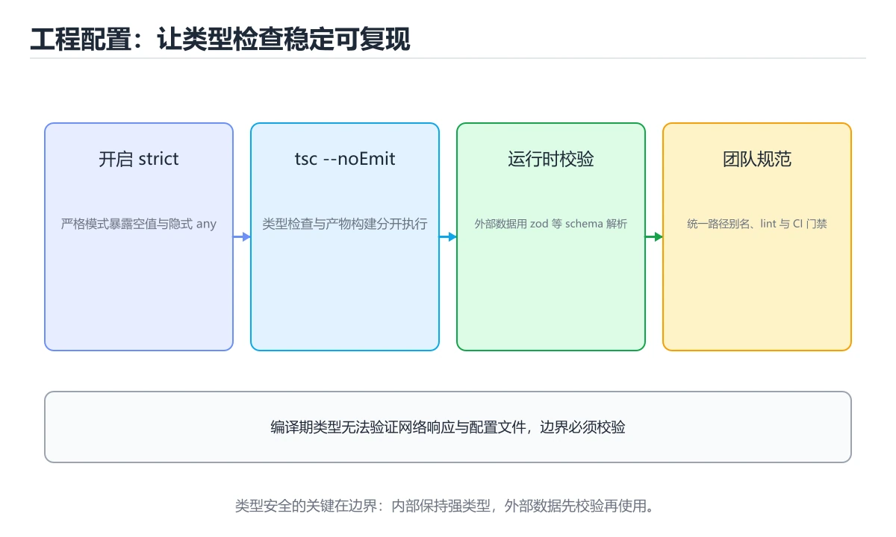
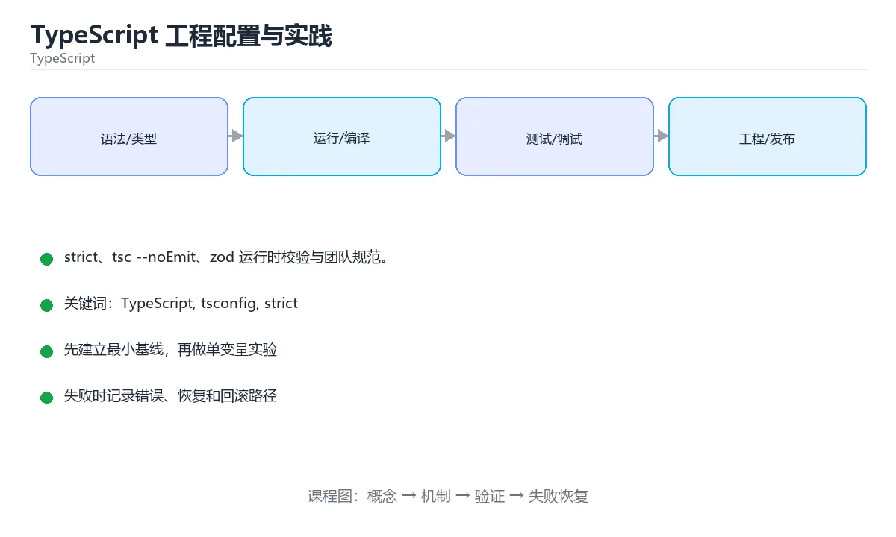

# TypeScript 工程配置与实践





> 内容更新时间：2026-10-06 · 学习阶段：基础 · 预计用时：90 分钟

## 本节知识框架

**课程定位**：所属分类为「TypeScript」，课程主题为「TypeScript 工程配置与实践」，学习阶段为「基础」，建议用时 90 分钟。

**本课要解决的主问题**：strict、tsc --noEmit、zod 运行时校验与团队规范。

| 学习层次 | 要回答的问题 | 完成判据 |
| --- | --- | --- |
| 概念层 | 「TypeScript 工程配置与实践」有哪些必须区分的对象与术语？ | 能用自己的话定义核心术语，并各举一个正例和一个反例。 |
| 机制层 | 这些对象按什么顺序发生作用，输入如何变成输出？ | 能画出或写出机制步骤，并说明每一步的失败条件。 |
| 应用层 | 什么场景适合使用「TypeScript 工程配置与实践」，什么场景不适合？ | 能给出一个真实场景、一个最小示例和一个边界案例。 |
| 性能层 | 时间、空间、吞吐或延迟受哪些量影响？ | 能说出复杂度或性能瓶颈的证据来源；没有证据时明确写“材料未提供”。 |
| 复习层 | 怎样确认自己不是只记住了结论？ | 能独立完成本课自测，并把错误定位到概念、机制、示例或边界。 |

### 阅读路线

1. 先读「核心概念定义」，建立「TypeScript」等对象的精确定义。
2. 再读「原理与运行机制」，把定义串成可重复的过程。
3. 用「代码/协议/SQL 示例」验证过程，并只改一个条件观察结果变化。
4. 最后检查性能、易错点、知识关系与自测题，形成可复习的证据链。

**前置知识**：《TypeScript 工具类型与声明文件》

**学习位置**：本课位于《TypeScript 类型系统》之后；如果前一课的自测不能通过，应先回补再继续。

**后续衔接**：下一课《TypeScript 构建工具链与测试》会继续使用本课术语，学完后建议立即完成一次自测。

**教材衔接：学习目标**

- 能用自己的话解释TypeScript 工程配置与实践解决了什么问题，而不是只背术语。
- 能说清 「TypeScript」、「tsconfig」、「strict」、「zod」 之间的关系，并分别举出一个例子。
- 能把 TypeScript 放回「TypeScript 工程配置与实践」的知识体系，说明它和 tsconfig 的边界。
- 能完成本课练习，并用验收标准检查自己的结果。

> 一句话摘要：strict、tsc --noEmit、zod 运行时校验与团队规范。

**教材衔接：前置知识**

- 先完成上一课《TypeScript 工具类型与声明文件》；如果已经掌握，可以直接用本课练习自测。
- 本课阶段：基础。建议先完成「TypeScript 工具类型与声明文件」，或确认自己能独立跑通正文里的 noUncheckedIndexedAccess 示例。
- 开始前先复习：TypeScript、tsconfig、strict。
- 如果 tsconfig 关键选项 这一步看不懂，先记录具体卡点，再用 noUncheckedIndexedAccess 复现一遍。

**教材衔接：本课小结**

TypeScript 工程化的三件事：**strict 打开、tsc 进 CI、边界做运行时校验**；做到这三点，类型系统才能真正减少线上问题。

## 核心概念定义

> 阅读约定：本课先给「TypeScript 工程配置与实践」相关术语的操作性定义与适用边界；正文里的口语化说法与定义冲突时，以定义和可复现示例为准。

| 术语 | 操作性定义 | 本课中的边界 |
| --- | --- | --- |
| TypeScript | 在 JavaScript 上增加静态类型系统的语言，编译后可运行在浏览器或 Node.js。 | 仅在「TypeScript 工程配置与实践」明确给出的输入、版本与资源条件下成立。 |
| 路径别名 | 用 @/ 之类短路径代替相对路径；需要同时配置 TypeScript 的 paths 与打包器或运行时的解析。 | 仅在「TypeScript 工程配置与实践」明确给出的输入、版本与资源条件下成立。 |
| 严格模式 | tsconfig 里的 strict 打开空值、隐式 any 等检查，是团队类型一致性的底线。 | 仅在「TypeScript 工程配置与实践」明确给出的输入、版本与资源条件下成立。 |
| 声明文件 | .d.ts 描述没有类型的 JavaScript 模块，让编译器知道它的形状。 | 仅在「TypeScript 工程配置与实践」明确给出的输入、版本与资源条件下成立。 |

### 定义如何使用

在「TypeScript 工程配置与实践」中判断一个说法是否成立，先确认它使用的是哪个对象的定义，再检查输入规模、运行环境与失败路径。定义不是口号，而是后续推导、代码示例和自测题共享的约束。

**教材衔接：类型检查与构建分离**

打包器（Vite/esbuild/swc）只做转译，**不做类型检查**。因此 CI 必须单独跑 `tsc --noEmit`，否则类型错误会直接进生产。同理，`ts-node`/`tsx` 运行时也建议配类型检查脚本。

**教材衔接：类型检查与构建的分工速查**

| 工具 | 是否做类型检查 | 说明 |
| --- | --- | --- |
| `tsc` | 是 | 官方编译器，可作为类型门禁 |
| `tsc --noEmit` | 是 | CI 中最常用的检查方式 |
| `esbuild` / `swc` | 否 | 只转译，速度快，不做类型检查 |
| `Vite`（开发） | 否 | 依赖编辑器与 `tsc` 检查类型 |
| `babel` | 否 | 只去类型 |
| `ts-node` / `tsx` | 视配置 | 运行 TS，类型检查通常需另跑 |

结论：**打包器负责产物，`tsc --noEmit` 负责类型门禁**，两者都要在流水线里。

**教材衔接：零基础详解：工程配置、构建与类型检查**

### 一句话说清它是什么

TypeScript 项目有三件事必须分清：
**写代码时的类型检查**、**打包器负责的转译**、**CI 里的强制门禁**。
三者混在一起，就会出现「本地能跑、线上报错」。

### 用生活比喻理解

| 环节 | 比喻 | 说明 |
| --- | --- | --- |
| `tsc` | 质检员 | 只查类型，不做打包 |
| 打包器（Vite/esbuild） | 搬运工 | 只转译和合并，**不查类型** |
| CI | 出厂闸门 | 类型检查、测试、构建一起卡住 |
| `tsconfig.json` | 工艺标准 | 严格程度、目标版本、路径别名 |

### 一份可直接用的 tsconfig

```json
{
  "compilerOptions": {
    "target": "ES2022",
    "module": "ESNext",
    "moduleResolution": "bundler",
    "lib": ["ES2022", "DOM"],
    "strict": true,
    "noUncheckedIndexedAccess": true,
    "noImplicitOverride": true,
    "noUnusedLocals": true,
    "exactOptionalPropertyTypes": true,
    "verbatimModuleSyntax": true,
    "skipLibCheck": true,
    "noEmit": true,
    "baseUrl": ".",
    "paths": { "@/*": ["src/*"] }
  },
  "include": ["src"]
}
```

| 选项 | 作用 |
| --- | --- |
| `strict` | 打开一组严格检查，新项目必开 |
| `noUncheckedIndexedAccess` | 数组或字典取值可能为 undefined |
| `noUnusedLocals` | 未使用的变量直接报错 |
| `verbatimModuleSyntax` | 明确区分类型导入与值导入 |
| `noEmit` | 只做类型检查，产物交给打包器 |
| `skipLibCheck` | 跳过第三方声明检查，提速 |

### 三条命令各管一段

```bash
tsc --noEmit          # 类型检查：CI 必跑
vite build            # 打包产物：不查类型
tsc --noEmit && vite build   # 组合成真正的发布前检查
```

**记住：Vite、esbuild、swc 都不会因为类型错误而中断构建。**

### 路径别名要同时配两处

```typescript
// tsconfig 里配 paths 只解决「类型解析」
import { api } from "@/lib/api";
```

```javascript
// vite.config.ts 里还要配别名，才能让打包器找到真实文件
import { fileURLToPath, URL } from "node:url";
import { defineConfig } from "vite";

export default defineConfig({
  resolve: {
    alias: { "@": fileURLToPath(new URL("./src", import.meta.url)) },
  },
});
```

### CI 最小门禁

```yaml
- run: npm ci
- run: npx tsc --noEmit
- run: npm run lint
- run: npm test -- --run
- run: npm run build
```

### 新手最容易踩的八个坑

| 坑 | 现象 | 正确做法 |
| --- | --- | --- |
| 以为打包会查类型 | 类型错误照样上线 | CI 单独跑 `tsc --noEmit` |
| 只配 tsconfig 别名 | 运行时找不到模块 | 打包器同步配置 |
| 关掉 `strict` | 空值错误频发 | 新项目一律开启 |
| 忽略 `noUncheckedIndexedAccess` | 数组取值可能 undefined | 开启并处理 |
| 类型与值混用导入 | 打包产物异常 | 用 `import type` |
| `skipLibCheck` 被误解 | 以为不检查自己的代码 | 它只跳过第三方声明 |
| 依赖版本不锁 | 别人装出来行为不同 | 提交 lockfile，CI 用 `npm ci` |
| 类型检查很慢 | 开发体验差 | 用项目引用与增量构建 |

### 手把手练习：加一个类型检查脚本

```json
{
  "scripts": {
    "typecheck": "tsc --noEmit",
    "build": "tsc --noEmit && vite build",
    "check": "npm run typecheck && npm run lint && npm test -- --run"
  }
}
```

把 `npm run check` 作为提交前与 CI 的统一入口，能避免「忘了跑某一项」。

### 学完自测

- [ ] 能说出 `tsc --noEmit` 与打包器各自负责什么。
- [ ] 知道路径别名为什么要在两处配置。
- [ ] 能说出 `strict` 与 `noUncheckedIndexedAccess` 的作用。
- [ ] 知道 CI 里最少要跑哪几条命令。
- [ ] 能解释为什么要提交 lockfile 并使用 `npm ci`。

## 原理与运行机制

### 机制总览

1. **建立输入**：把「TypeScript」按本课定义整理成可观察、可重复的输入条件。
2. **执行转换**：围绕「路径别名」执行本课的核心步骤；每一步都记录中间状态，避免只看最终输出。
3. **产生输出**：得到「严格模式」后，用正文示例或协议/SQL 结果核对输出是否符合预期。
4. **改变一个条件**：只替换一个边界条件或环境参数，观察「TypeScript 工程配置与实践」的结论是否仍然成立。

| 阶段 | 关注对象 | 失败时应检查 |
| --- | --- | --- |
| 输入 | TypeScript | 类型、范围、编码、版本或前置状态是否满足定义。 |
| 处理 | 路径别名 | 顺序、可见性、锁、路由、事务或调度规则是否被破坏。 |
| 输出 | 严格模式 | 结果是否可复现，错误是否被正确传播而不是被吞掉。 |

本课的机制结论要用「TypeScript 工程配置与实践」自己的示例验证。「TypeScript 工程配置与实践」没有给出某个数量级、吞吐或内存数据时，本课把该判断标为“材料未提供”，不从相邻主题外推。

**教材衔接：tsconfig 关键选项**

| 选项 | 建议 |
| --- | --- |
| `strict` | 必开，含 strictNullChecks、noImplicitAny 等 |
| `noUncheckedIndexedAccess` | 数组下标访问返回 `T \| undefined`，更安全 |
| `exactOptionalPropertyTypes` | 区分「缺失」与「undefined」 |
| `paths` | 配置 `@/` 别名，避免 `../../..` |
| `moduleResolution: bundler/node16` | 与打包器或 Node 实际行为对齐 |
| `skipLibCheck` | 加快编译（但会放过依赖的类型错误） |

**教材衔接：运行时校验不可省**

类型在运行时不存在，接口返回、localStorage、URL 参数都可能是任意值。用 zod / valibot 在边界校验：

```text
const User = z.object({ id: z.number(), name: z.string() });
const user = User.parse(await res.json());   // 校验后再用，类型自动推导
```

原则：**外部数据必须先校验再收窄类型**，把 `unknown` 变成可信类型。

**教材衔接：与框架集成**

React：组件 props 用显式类型，事件与 ref 用库提供类型；避免 `React.FC`（隐式 children 已不推荐）。Node：`@types/node` 必装，注意 CommonJS/ESM 的模块解析差异。跨端（uni-app/React Native）注意平台类型差异。

**教材衔接：团队规范**

1. 禁止 `any`（用 `unknown` 或具体类型），ESLint 加 `@typescript-eslint/no-explicit-any`。
2. 类型导入用 `import type`，避免运行时副作用。
3. 提交前跑 `tsc --noEmit` + lint + 测试。
4. 逐步迁移 JS 项目：先 `allowJs + checkJs`，再逐文件开启严格模式。

**教材衔接：版本与时效**

- 版本提示：TypeScript 的行为在最近几个大版本里有过调整，升级「TypeScript 工程配置与实践」前先用 noUncheckedIndexedAccess 复现当前输出，再对照官方发布说明逐条核对。
- 升级前确认 TypeScript 的兼容范围，把不可回退的改动单独拆成一次提交。

### 升级检查清单

- 先固定当前版本，跑通全部示例与测验，再升级工具链。
- 只改 TypeScript 的版本变量，记录编译、测试与产物体积的变化。
- 回归范围锁定 noUncheckedIndexedAccess 的默认行为，并确认弃用警告是否出现在构建输出里。
- 升级完成后更新本课「最后复核 / 下次复核」日期，并记录 TypeScript 的版本变化。

**教材衔接：交付评审：评分表、决策记录与证据链**

「TypeScript 工程配置与实践」的验收不能只看功能能不能跑通。下面把正文里的交付物、验证命令和关键设计点整理成一张评审表，按表逐项留下证据即可。

### 一、「TypeScript 工程配置与实践」的交付物评分表

| 交付物 | 权重 | 合格线 | 需要的证据 |
| --- | ---: | --- | --- |
| 核心链路 | 34% | 能在干净环境复现，且失败路径有明确处理 | 命令与输出、对应测试、一次失败与恢复记录 |
| 测试与验收记录 | 33% | 能在干净环境复现，且失败路径有明确处理 | 命令与输出、对应测试、一次失败与恢复记录 |
| 运行与回滚说明 | 33% | 能在干净环境复现，且失败路径有明确处理 | 命令与输出、对应测试、一次失败与恢复记录 |

「TypeScript 工程配置与实践」的评分先看证据再打分：任意一项只要拿不出可复现的命令或测试，该项按 0 分计，不允许用「基本完成」代替。

### 二、需要写下来的决策（ADR）

| 决策点 | 本课给出的做法 | 备选方案 | 代价与回滚 |
| --- | --- | --- | --- |
| 架构与数据流 | 用户/输入 → 接口或命令 → 领域逻辑 → 存储/外部依赖 → 输出与监控 | 不做「架构与数据流」，沿用最朴素的实现（需要额外补一次对照实验） | 若「架构与数据流」出问题，回到上一版本并按本课验收场景重跑 |

ADR 不需要长：每个决策三行就够——选了什么、放弃了什么、出问题怎么退。评审时只检查这三行是否和「TypeScript 工程配置与实践」的实际代码一致。

### 三、「TypeScript 工程配置与实践」的交付证据链

本课未给出可执行命令，用下面的最小证据集代替：

1. 一条从零开始的环境准备命令。
2. 一条跑通核心链路的命令及其完整输出。
3. 一条触发失败的命令，以及恢复后的验证结果。

把「TypeScript 工程配置与实践」的上表整理成一个 evidence/ 目录：每条命令一个文件，文件名带日期，内容包含版本、命令与输出。评审时直接按目录核对，不再口头确认。

### 四、「TypeScript 工程配置与实践」的验收指标

| 指标 | 目标值 | 测量方式 | 不达标时的动作 |
| --- | --- | --- | --- |
| TypeScript 的核心路径耗时与失败率 | 用本课正文给出的阈值，没有就写实测基线 | 固定环境重复三次取中位数 | 回到对应小节定位，先修原因再重测 |
| 资源占用峰值与回收情况 | 用本课正文给出的阈值，没有就写实测基线 | 固定环境重复三次取中位数 | 回到对应小节定位，先修原因再重测 |
| 验收场景的通过率 | 用本课正文给出的阈值，没有就写实测基线 | 固定环境重复三次取中位数 | 回到对应小节定位，先修原因再重测 |

指标必须能用一条命令或一次操作测出来；写不出测量方式的指标，在「TypeScript 工程配置与实践」的评审里一律视为未定义。

### 五、评审记录模板

| 记录项 | 填写要求 |
| --- | --- |
| 项目标识 | `ts_project` |
| 本次范围 | 说明这一轮交付了「TypeScript 工程配置与实践」的哪些部分 |
| 未完成项 | 列出与 TypeScript 相关但本轮未做的内容 |
| 证据位置 | 指向 evidence/ 目录下的具体文件 |
| 风险与回滚 | 写清剩余风险、回滚步骤和验证方式 |
| 结论 | 通过 / 有条件通过 / 不通过，三者选一 |

「TypeScript 工程配置与实践」评审结束后把这张表填完并归档；下一轮迭代直接读上一次的「未完成项」与「风险与回滚」，避免重复讨论同一个问题。
<!-- p1-project-review:end -->

## 典型应用场景

| 场景 | 典型输入或前提 | 期望产物 |
| --- | --- | --- |
| 学习验证 | 使用本课最小示例和 TypeScript、tsconfig | 能复现正文结论，并解释每一步。 |
| 工程落地 | 把「TypeScript 工程配置与实践」放入真实模块或服务边界 | 输出可观测、失败可定位、参数可配置。 |
| 故障排查 | 只改一个版本、规模、输入或依赖条件 | 能区分概念错误、实现错误和环境差异。 |

判断「TypeScript 工程配置与实践」的场景是否成立，标准是能否写出输入、处理、输出和失败路径；材料中没有出现的数据在本课标注为“材料未提供”，不用推测替代证据。

**课程内置实验入口**：`sandbox:typescript`，用于动手验证《TypeScript 工程配置与实践》的机制；实验结论不替代概念定义与复杂度分析。

**教材衔接：项目专属规格：TypeScript 工程配置与实践**

### 核心场景

strict、tsc --noEmit、zod 运行时校验与团队规范。 项目目标是把「TypeScript、tsconfig、strict、zod、CI」落实为可运行、可测试、可回滚的交付物。

### 架构与数据流

```text
用户/输入 → 接口或命令 → 领域逻辑 → 存储/外部依赖 → 输出与监控
                         ↘ 失败分类 → 重试/补偿 → 回滚
```

### 最小数据模型

| 对象 | 关键字段 | 约束 |
| --- | --- | --- |
| 输入实体 | TypeScript、时间、来源 | 必填校验、长度限制、幂等键 |
| 任务实体 | 状态、优先级、创建时间 | 状态迁移合法、不可重复执行 |
| 结果实体 | 输出、错误码、耗时 | 可序列化、错误可解释 |
| 审计记录 | 操作者、动作、结果、时间 | 不可篡改、可查询、脱敏 |

### 验收场景

1. 正常路径：最小输入得到预期输出，并留下日志与指标。
2. 边界路径：把 noUncheckedIndexedAccess 的输入推到上下限，确认返回结果可解释。
3. 失败路径：依赖超时或不可用时能快速失败、重试或降级。
4. 幂等路径：同一请求执行两次不会产生重复副作用。
5. 回滚路径：TypeScript 回滚后数据一致，且能说明恢复时间和影响范围。

**教材衔接：项目交付物**

### 建议仓库结构

```text
src/
  domain/
  adapters/
tests/
tsconfig.json
package.json
```

### 测试矩阵

| 层级 | 覆盖内容 | 最低数量 | 通过标准 |
| --- | --- | ---: | --- |
| 单元测试 | 领域规则、边界和错误分类 | 8 | 正常、边界、失败路径全部通过 |
| 集成测试 | 数据库、网络、文件或平台边界 | 3 | 使用真实边界且可重复运行 |
| 端到端测试 | 核心用户路径 | 1 | 从输入到输出完整跑通 |
| 手动验收 | 文档中列出的 5 个场景 | 5 | 有命令、输出和结论记录 |

### 验收数据

```json
{
  "project": "ts_project",
  "scenario": "TypeScript的正常路径",
  "input": {"case": "normal", "value": "noUncheckedIndexedAccess"},
  "expected": {"ok": true, "checks": ["TypeScript可复现", "tsconfig有记录"]},
  "failure_case": {"case": "tsconfig越界或缺失", "error": "validation_error"},
  "idempotency_key": "ts_project-001"
}
```

### 复盘模板

| 问题 | 记录 |
| --- | --- |
| 原目标是什么？ | 用一句话描述可验收目标 |
| 实际发生了什么？ | 时间线、指标和关键日志 |
| 哪个假设被推翻？ | 根因与促成因素 |
| 如何回滚？ | 步骤、耗时和数据校验 |
| 下一步做什么？ | 负责人、期限和验证方式 |

> 项目验收围绕「TypeScript、tsconfig、strict」：至少完成一次正常路径、一次边界输入、一次失败恢复和一次幂等检查。

## 代码/协议/SQL 示例

### 最小可验证示例

下面保留《TypeScript 工程配置与实践》原文中的最小示例。先预测《TypeScript 工程配置与实践》示例的输出，再按正文步骤运行或推演；示例依赖外部环境时，同时记录版本与输入。

```text
const User = z.object({ id: z.number(), name: z.string() });
const user = User.parse(await res.json());   // 校验后再用，类型自动推导
```

**教材衔接：tsconfig 关键配置速查**

| 选项 | 建议值 | 作用 |
| --- | --- | --- |
| `strict` | `true` | 打开全部严格检查 |
| `target` | `ES2022` | 输出语法的目标版本 |
| `lib` | `["ES2022", "DOM"]` | 可用的内置类型库 |
| `module` / `moduleResolution` | 按运行时选择 | 决定 import 解析规则 |
| `noUncheckedIndexedAccess` | `true` | 下标访问返回可能 `undefined` |
| `exactOptionalPropertyTypes` | `true` | 区分缺失与 `undefined` |
| `noImplicitOverride` | `true` | 重写必须写 `override` |
| `noFallthroughCasesInSwitch` | `true` | 禁止 switch 穿透 |
| `isolatedModules` | `true` | 与打包器（esbuild/swc）兼容 |
| `skipLibCheck` | `true` | 跳过依赖类型检查，加快编译 |
| `noEmit` | CI 时 `true` | 只做类型检查 |
| `baseUrl` / `paths` | 按需 | 路径别名，打包器需同步配置 |

```jsonc
// tsconfig.json 参考
{
  "compilerOptions": {
    "strict": true,
    "target": "ES2022",
    "module": "ESNext",
    "moduleResolution": "Bundler",
    "noUncheckedIndexedAccess": true,
    "noImplicitOverride": true,
    "isolatedModules": true,
    "skipLibCheck": true,
    "noEmit": true,
    "paths": { "@/*": ["./src/*"] }
  },
  "include": ["src", "tests", "types"]
}
```

**教材衔接：验证命令与预期输出**

「TypeScript 工程配置与实践」不能只看「能编译」，还要能按固定命令复现结果。下表给出最低验证集：

| 阶段 | 命令 | 预期输出 |
| --- | --- | --- |
| 安装依赖 | `npm ci` | 依赖与锁文件一致 |
| 类型检查 | `npx tsc --noEmit` | 没有类型错误 |
| 运行测试 | `npm test` | 测试全部通过 |
| 构建 | `npm run build` | 产物生成成功 |

### 验收证据

- [ ] 保存依赖安装和启动命令的完整输出。
- [ ] 测试覆盖 tsconfig 的核心规则，并包含一次可预期的失败。
- [ ] 重复执行 TypeScript 的操作两次，确认没有重复写入或副作用。
- [ ] 记录一次失败状态码、错误日志和恢复步骤。
- [ ] 在 README 中写明 TypeScript 所需的环境版本、启动方式和回滚方式。

### 回归与回滚

1. 先在副本上执行 tsconfig，并记录前后差异。
2. 修改一处逻辑后重跑全部验证命令，确认没有回归。
3. 若失败，回滚到上一个可运行版本并保留失败日志。
4. 定位原因后补一条自动化测试，再重新执行发布流程。
5. 把教训写入项目复盘或本课笔记，形成下一次的检查项。

## 时间/空间复杂度或性能分析

**复杂度证据**：「TypeScript 工程配置与实践」的现有材料没有给出渐近时间或空间复杂度的明确结论，本课只做定性检查，不补写未经验证的 $O$ 记号。

| 维度 | 本课关注点 | 判断依据 |
| --- | --- | --- |
| 时间/延迟 | 「TypeScript 工程配置与实践」的主要步骤是否会随输入规模、并发度或网络往返增长。 | 以正文复杂度、基准数据或可重复测量为准。 |
| 空间/内存 | 中间状态、缓存、副本、连接或索引是否随规模增长。 | 记录峰值内存与数据副本，不只看最终结果。 |
| 吞吐/资源 | 版本、调度、锁、IO、序列化或协议开销是否成为瓶颈。 | 固定环境做对照实验，改变一个变量。 |

评估「TypeScript 工程配置与实践」时要区分“正确性成立”和“性能达标”两件事；材料没有给出基准时，本课只保留量级来源与测量方法，不写不可验证的绝对数字。

## 常见误区与易错点

> 复核《TypeScript 工程配置与实践》的易错点时，优先保留原文的错误表、故障现场与排错路径；每条修正都要能用本课示例复验。

| 易错点 | 常见表现 | 正确做法 |
| --- | --- | --- |
| 只背结论 | 能复述「TypeScript 工程配置与实践」的定义，却说不清输入、输出与边界。 | 回到机制步骤，用最小示例逐一验证。 |
| 混淆相邻概念 | 把本课对象与相邻主题的对象当成同一类。 | 先比较定义、资源归属、生命周期和失败模式。 |
| 忽略版本与环境 | 在开发机通过后直接外推到生产环境。 | 固定版本、输入和资源条件，再记录可复现结果。 |

**教材衔接：常见错误与排查**

| 容易踩的做法 | 实际现象 | 原因与正确做法 |
| --- | --- | --- |
| 只在编辑器里看类型错误 | CI 放行有类型问题的代码 | 流水线加 `tsc --noEmit` |
| `paths` 只在 tsconfig 配置 | 打包或运行时找不到模块 | 打包器同步配置别名 |
| `include` 漏掉目录 | 部分文件不参与检查 | 显式列出 `src`、`tests`、`types` |
| `skipLibCheck` 以为能掩盖自身错误 | 自身错误仍会报出 | 它只跳过 `.d.ts` 检查 |
| 用 `ts-ignore` 关掉报错 | 错误被永久掩盖 | 用 `ts-expect-error` 并写明原因 |
| 依赖 `.ts` 扩展名导入 | 打包器或运行时解析失败 | 用无扩展名或按运行时要求 |
| `moduleResolution` 配错 | 找不到依赖类型 | 与运行时（Node / Bundler）保持一致 |
| 混用 ESM 与 CJS | `require is not defined` 之类错误 | 统一模块体系并设置 `type` |
| 只在本地跑构建 | 环境差异导致失败 | CI 用固定 Node 版本与 lock 文件 |
| 忘记提交 `types/` 目录 | 同事编译失败 | 类型声明纳入版本管理 |

**教材衔接：故障现场**

### 现场 1：只在编辑器里看类型错误

**症状**：在《TypeScript 工程配置与实践》的复现场景中，CI 放行有类型问题的代码。

**根因**：当出现“只在编辑器里看类型错误”时，执行路径已经绕过了《TypeScript 工程配置与实践》的关键约束，最终以“CI 放行有类型问题的代码”暴露出来；修复前必须先确认约束在哪里失效。

**修复**：针对《TypeScript 工程配置与实践》的问题，流水线加 tsc --noEmit。

**验证**：先在《TypeScript 工程配置与实践》中记录“只在编辑器里看类型错误”留下的失败证据，再执行“流水线加 tsc --noEmit”并重放；确认错误路径变为明确结果，且修复没有掩盖同类故障。

### 现场 2：paths 只在 tsconfig 配置

**症状**：在《TypeScript 工程配置与实践》的复现场景中，打包或运行时找不到模块。

**根因**：当出现“paths 只在 tsconfig 配置”时，执行路径已经绕过了《TypeScript 工程配置与实践》的关键约束，最终以“打包或运行时找不到模块”暴露出来；修复前必须先确认约束在哪里失效。

**修复**：针对《TypeScript 工程配置与实践》的问题，打包器同步配置别名。

**验证**：在《TypeScript 工程配置与实践》中按“打包器同步配置别名”调整后，从“paths 只在 tsconfig 配置”的触发条件重放同一条路径，确认“打包或运行时找不到模块”不再出现，并补一个相邻边界用例检查没有引入新问题。

### 现场 3：include 漏掉目录

**症状**：在《TypeScript 工程配置与实践》的复现场景中，部分文件不参与检查。

**根因**：“部分文件不参与检查”只是表层结果。向上追溯会落到“include 漏掉目录”这一步，因为它省略了《TypeScript 工程配置与实践》的约束，使实现行为和预期模型发生了偏离。

**修复**：针对《TypeScript 工程配置与实践》的问题，显式列出 src、tests、types。

**验证**：保留《TypeScript 工程配置与实践》里触发“部分文件不参与检查”的输入、版本和日志，按“显式列出 src、tests、types”完成修改后原样重放；只有失败现象消失且相邻场景仍可解释，才保留改动。

## 与其他知识点的关系

| 关系 | 课程 | 为什么 |
| --- | --- | --- |
| 先修 | 《TypeScript 工具类型与声明文件》 | 本课会直接使用它的概念或操作前提。 |
| 关联 | 《TypeScript 进阶类型与框架实践》 | 用于横向比较或把本课结论迁移到相邻主题。 |
| 前置顺序 | 《TypeScript 类型系统》 | 同分类中安排在本课之前，建议先完成其自测。 |
| 后续顺序 | 《TypeScript 构建工具链与测试》 | 同分类中安排在本课之后，会继续使用本课术语。 |

把「TypeScript 工程配置与实践」放回知识体系时，不只要记住“前面学过什么”，还要说明两个主题在输入、机制、资源边界和失败模式上的差异。这样才能把单课知识迁移到项目、排障和后续课程。

## 自测题与参考答案

> 先独立作答《TypeScript 工程配置与实践》的自测题，再对照答案与解析；每处判断都要能在本课正文或示例中找到依据。

### 自测 1

围绕“TypeScript 工程配置与实践”中的 TypeScript、tsconfig、strict，下列哪两项是本课强调的实践判断？

A. 把 tsconfig 的单次运行结果当成所有版本和规模都成立
B. 学习 TypeScript 时要同时说明输入、输出和失败路径，不能只看正常流程
C. 只要 TypeScript 的常规示例通过，就可以跳过边界与异常路径
D. 验证 tsconfig 时要固定版本并覆盖边界输入，结论才可复现

**参考答案**：学习 TypeScript 时要同时说明输入、输出和失败路径，不能只看正常流程；验证 tsconfig 时要固定版本并覆盖边界输入，结论才可复现

**解析**：在「TypeScript 工程配置与实践」里，学习 TypeScript 时要同时说明输入、输出和失败路径，不能只看正常流程。在TypeScript 工程配置与实践里，判断 tsconfig 时要固定版本与边界输入，所以“验证 tsconfig 时要固定版本并覆盖边界输入，结论才可复现”才可复现。

### 自测 2

接口返回数据应该如何处理？

A. 用 zod 等做运行时校验后再使用
B. 加非空断言
C. 直接断言为业务类型，但这会让用例变得脆弱
D. 用 any

**参考答案**：用 zod 等做运行时校验后再使用

**解析**：在「TypeScript 工程配置与实践」里，作答时，先用TypeScript建立输入与输出的基线，再把用 zod 等做运行时校验后再使用代入边界条件核对，结论才能复现。“接口返回数据应该如何处理”与「TypeScript 工程配置与实践」的术语表相呼应，只有符合TypeScript、tsconfig、strict约束的“用 zod 等做运行时校验后再使用”才是正文支持的结论。

### 自测 3

下面这段 TypeScript 代码摘自「TypeScript 工程配置与实践」的正文示例。关于这段代码，下面哪一项说法与实际内容相符？

```typescript
// tsconfig 里配 paths 只解决「类型解析」
import { api } from "@/lib/api";
```

A. 这段代码包含异常处理分支，失败时会走专门的补救路径。
B. 这段代码会读取外部输入，结果依赖传入的数据。
C. 这段代码会产生可观察的输出，运行后能看到结果。
D. 这段代码只做静态声明，没有循环、分支或可观察输出。

**参考答案**：这段代码只做静态声明，没有循环、分支或可观察输出。

**解析**：在「TypeScript 工程配置与实践」里，这段代码只做静态声明，没有循环、分支或可观察输出。这段代码出自「TypeScript 工程配置与实践」的正文示例，围绕TypeScript、tsconfig、strict展开；把输入或边界换成空值、极值或失败情况后，结论要以「TypeScript 工程配置与实践」的实际运行结果为准。

**教材衔接：复习与自测**

- [ ] 项目开启 `strict` 与 `noUncheckedIndexedAccess`。
- [ ] CI 里单独跑 `tsc --noEmit` 作为类型门禁。
- [ ] 别名在 tsconfig 与打包器里保持一致。
- [ ] 使用 `ts-expect-error` 而非 `ts-ignore`，并写明原因。
- [ ] Node 版本与模块体系在项目里明确固定。

**教材衔接：动手练习**

> 本课练习重点：围绕「TypeScript、tsconfig、strict」完成复述、实验和交付，每个结果都要能被别人检查。

把 tsconfig 的边界写成类型或断言，让错误在编译期暴露。

### 练习 1：建立心智模型（10 分钟）

合上教程，用 3～5 句话回答：

1. TypeScript 工程配置与实践解决了什么问题？
2. 如果没有它，会出现什么具体后果？
3. 它和「tsconfig」是什么关系？

验收标准：回答里必须出现 TypeScript，并写出一个让结论失效的边界条件。

### 练习 2：做一次可控实验（20 分钟）

从正文中选一个最小示例，完成以下操作：

1. 先预测修改一个参数、输入或步骤后的结果。
2. 再实际执行或逐步推演，记录真实结果。
3. 如果结果与预测不同，写出差异原因。

**验收标准**：五步记录要写进笔记——原例是 noUncheckedIndexedAccess，改动落在TypeScript上，结论必须能被他人在同一环境里复现。

### 练习 3：交付一个小结果（30 分钟）

写一个只包含 TypeScript 的最小程序，先验证正常路径，再制造一次失败。

任务要求：

- 结果必须能被别人检查，不能只写“我已经理解了”。
- 至少覆盖「TypeScript」和「tsconfig」两个关键词。
- 写出 1 个仍然不确定的问题，以及下一步如何验证。

> 提示：时间有限时优先做练习 1 和练习 2；练习 3 可以拆成两次完成。

**教材衔接：可运行练习**

### 任务 1：先跑通，再解释

```typescript
// tsconfig 里配 paths 只解决「类型解析」
import { api } from "@/lib/api";
```

### 任务 2：只改一个条件

把「TypeScript 工程配置与实践」的最小示例复制一份，只改一个条件再跑一次：

- 改动点：只把 TypeScript 的输入换成空值、极值或错误输入，其余保持不变。
- 预测：先写下「TypeScript 工程配置与实践」在改动后的输出或错误信息，再运行。
- 记录：对照改动前后的结果，指出差异出在哪一步。
- 验收：把 tsconfig 改回原值后输出一致，证明改动是唯一变量。

### 任务 3：迁移到自己的数据

用同一套思路处理一组你自己的 TypeScript 数据，保持输出格式与任务 1 一致。

**教材衔接：本课复习清单**

离开本课前，逐项确认：

- [ ] 不看解析，能说出「用 Vite/esbuild 打包时会做类型检查吗？」的判断依据。
- [ ] 不看解析，能说出「接口返回数据应该如何处理？」的判断依据。
- [ ] 不看解析，能说出「团队禁止 any 后，处理未知数据应使用？」的判断依据。
- [ ] 不看解析，能说出「tsconfig 中 strict: true 会开启什么？」的判断依据。
- [ ] 不看解析，能说出「tsconfig 里 paths 别名的作用与限制是？」的判断依据。
- [ ] 至少运行一次 noUncheckedIndexedAccess 的示例，记录输入、输出和 TypeScript 的边界情况。
- [ ] 把本课最容易混淆的两个概念写成一句话对照。

| 复盘项 | 记录 |
| --- | --- |
| 已经能独立解释的考点 |  |
| 仍然说不清的概念 |  |
| 下一步验证动作 |  |

---

## 术语速查

| 术语 | 一句话说明 |
| --- | --- |
| `TypeScript` | 在 JavaScript 上增加静态类型系统的语言，编译后可运行在浏览器或 Node.js。 |
| `路径别名` | 用 @/ 之类短路径代替相对路径；需要同时配置 TypeScript 的 paths 与打包器或运行时的解析。 |
| `严格模式` | tsconfig 里的 strict 打开空值、隐式 any 等检查，是团队类型一致性的底线。 |
| `声明文件` | .d.ts 描述没有类型的 JavaScript 模块，让编译器知道它的形状。 |

## 考点精讲

### 考点 1：多选辨析·TypeScript

- **题目**：围绕“TypeScript 工程配置与实践”中的 TypeScript、tsconfig、strict，下列哪两项是本课强调的实践判断？
- **判断依据**：在「TypeScript 工程配置与实践」里，学习 TypeScript 时要同时说明输入、输出和失败路径，不能只看正常流程。在TypeScript 工程配置与实践里，判断 tsconfig 时要固定版本与边界输入，所以“验证 tsconfig 时要固定版本并覆盖边界输入，结论才可复现”才可复现。

### 考点 2：概念判断·TypeScript

- **题目**：接口返回数据应该如何处理？
- **判断依据**：在「TypeScript 工程配置与实践」里，作答时，先用TypeScript建立输入与输出的基线，再把用 zod 等做运行时校验后再使用代入边界条件核对，结论才能复现。“接口返回数据应该如何处理”与「TypeScript 工程配置与实践」的术语表相呼应，只有符合TypeScript、tsconfig、strict约束的“用 zod 等做运行时校验后再使用”才是正文支持的结论。

### 考点 3：概念判断·TypeScript

- **题目**：团队禁止 any 后，处理未知数据应使用？
- **判断依据**：在「TypeScript 工程配置与实践」里，unknown + 类型收窄。unknown 强制显式校验，是最安全的未知类型。把“unknown + 类型收窄”代回「TypeScript 工程配置与实践」里“团队禁止 any 后”的例子核对，条件一旦改变，结论就要用TypeScript、tsconfig、strict重新推导。

### 考点 4：代码补全·TypeScript

- **题目**：下面这段 TypeScript 代码摘自「TypeScript 工程配置与实践」的正文示例。关于这段代码，下面哪一项说法与实际内容相符？
- **判断依据**：在「TypeScript 工程配置与实践」里，这段代码只做静态声明，没有循环、分支或可观察输出。这段代码出自「TypeScript 工程配置与实践」的正文示例，围绕TypeScript、tsconfig、strict展开；把输入或边界换成空值、极值或失败情况后，结论要以「TypeScript 工程配置与实践」的实际运行结果为准。

### 考点 5：概念判断·TypeScript

- **题目**：tsconfig 里 paths 别名的作用与限制是？
- **判断依据**：在「TypeScript 工程配置与实践」里，配置模块路径别名。tsc 只做类型解析，实际产物路径由打包器或运行时的解析规则决定。把“配置模块路径别名”代回「TypeScript 工程配置与实践」里“tsconfig 里 paths 别名的作用与限制是”的例子核对，条件一旦改变，结论就要用TypeScript、tsconfig、strict重新推导。

### 考点 6：填空·"____": true,

- **题目**：补全代码：「TypeScript 工程配置与实践」示例中，下面这行代码缺少哪个关键字或函数名？请填入 ____。 `"____": true,`
- **判断依据**：空格应填写「noUncheckedIndexedAccess」、「nouncheckedindexedaccess」。这道题的关键在「TypeScript 工程配置与实践」的TypeScript、tsconfig、strict：先确认题干“补全代码”问的是哪一步，再排除偷换前提的选项。

## English Overview

**Title:** TypeScript in Production

**Summary:** Strict mode, tsc in CI, runtime validation and conventions.

**Category:** TypeScript
**Level:** 基础
**Key terms:** TypeScript, tsconfig, strict, zod, CI

## 内容元数据

- 内容版本：v2.0
- 最后更新：2026-10-06
- 学习阶段：基础
- 适用环境：TypeScript 5.x / Node.js 22+
；本课聚焦 TypeScript。
- 内容来源：内置结构化课程与工程实践整理
- 相关主题：TypeScript、tsconfig、strict、zod、CI
- 质量版本：P0 测验标准 + P1 覆盖扩展 + P2 体验补全

## Full English Study Guide

### Overview

**TypeScript in Production** focuses on Strict mode, tsc in CI, runtime validation and conventions.

### Learning Outcomes

- Explain what **TypeScript in Production** solves and when it should be used.

### Glossary

- Topic: **TypeScript in Production**
- Related terms: TypeScript, tsconfig, strict, zod

## Bilingual Section Outline

| 中文小节 | English section |
| --- | --- |
| 学习目标 | Learning objectives |
| 前置知识 | Prerequisites |
| tsconfig 关键选项 | tsconfig 关键选项 |
| 类型检查与构建分离 | Types检查与Build分离 |
| 运行时校验不可省 | 运行时校验不可省 |
| 与框架集成 | 与框架集成 |
| 团队规范 | 团队规范 |
| 本课小结 | Summary |
| tsconfig 关键配置速查 | tsconfig 关键配置速查 |
| 类型检查与构建的分工速查 | Types检查与Build的分工速查 |

## 参考资料与复核

- 最后复核：2026-10-04
- 下次复核：2027-03-17
- 复核范围：版本兼容、API 行为、安全建议与工程实践
- 来源性质：官方文档、标准或权威教材；正文为离线教学重组

| 参考资料 | 本课用途 |
| --- | --- |
| [tsconfig 参考](https://www.typescriptlang.org/tsconfig/) | 编译选项与严格模式 |
| [TypeScript Node 指南](https://nodejs.org/en/learn/typescript) | Node 中的 TypeScript |
| [声明文件](https://www.typescriptlang.org/docs/handbook/declaration-files/introduction.html) | 类型声明与发布 |

> 「TypeScript 工程配置与实践」的链接用于离线阅读后的延伸核对；App 不会自动联网。

<!-- p1-project-review:start -->
