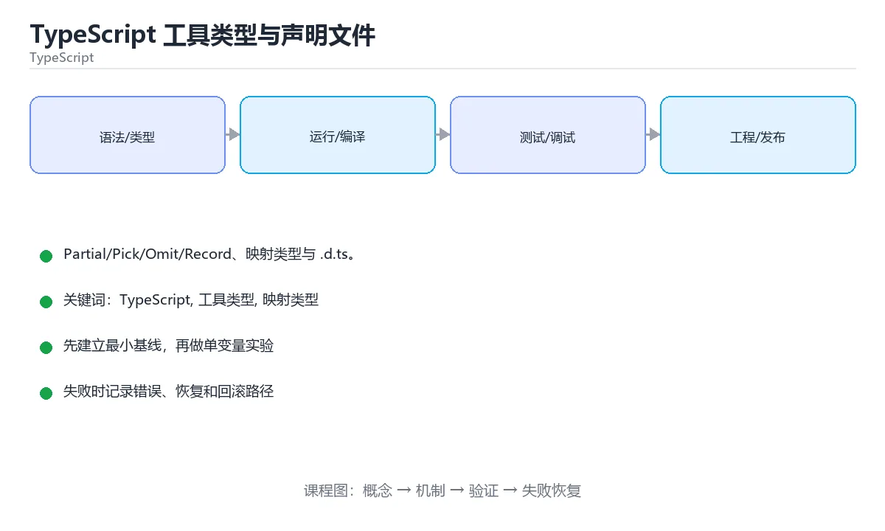

# TypeScript 工具类型与声明文件

> 内容更新时间：2026-10-06 · 学习阶段：入门 · 预计用时：35 分钟




## 学习目标

- 能用自己的话解释TypeScript 工具类型与声明文件解决了什么问题，而不是只背术语。
- 能说清 「TypeScript」、「工具类型」、「映射类型」、「声明文件」 之间的关系，并分别举出一个例子。
- 能把 TypeScript 放回「TypeScript 工具类型与声明文件」的知识体系，说明它和 工具类型 的边界。
- 能完成本课练习，并用验收标准检查自己的结果。

> 一句话摘要：Partial/Pick/Omit/Record、映射类型与 .d.ts。

## 前置知识

- 先完成上一课《TypeScript 类型收窄与泛型》；如果已经掌握，可以直接用本课练习自测。
- 本课阶段：入门。只需要基本计算机操作，不要求编程经验。
- 开始前先复习：TypeScript、工具类型、映射类型。
- 看不懂就直接缩小例子：只保留 TypeScript 相关的两行输入，跑通后再加回其余部分。

## 内置工具类型

| 工具类型 | 作用 |
| --- | --- |
| `Partial<T>` / `Required<T>` | 全部可选 / 全部必填 |
| `Pick<T, K>` / `Omit<T, K>` | 挑选字段 / 排除字段 |
| `Record<K, V>` | 构造键值映射类型 |
| `Readonly<T>` | 全部只读 |
| `ReturnType<F>` / `Parameters<F>` | 提取函数返回值 / 参数类型 |
| `Awaited<T>` | 提取 Promise 的结果类型 |
| `Exclude` / `Extract` / `NonNullable` | 联合类型的筛选 |

这些工具类型在 API 层非常实用：创建请求 DTO 用 `Pick`，更新接口用 `Partial`，对外隐藏敏感字段用 `Omit`。

## 映射类型与模板字面量类型

映射类型可以批量改造属性（如全部加 `readonly`、把值类型统一替换）；键重映射 `as` 可重命名。模板字面量类型让字符串也具备类型约束，例如 `type EventName = \`on${Capitalize<string>}\``，常用于事件名与 CSS 属性。

## 声明文件

`.d.ts` 为无类型的第三方库补类型：`declare module 'legacy-lib' { export function run(x: string): void }`。全局类型放 `global.d.ts`，通过 `tsconfig` 的 `types`/`include` 引入。

## 工程实践

1. 类型放在 `types/` 或与实现同文件，避免全局污染。
2. 用 `type` 定义联合与工具类型，`interface` 定义对象契约（可扩展、可合并）。
3. 生成类型而非手写：从后端 OpenAPI/GraphQL schema 生成客户端类型，避免契约漂移。
4. 类型也要测试：用 `expectType` 或 `tsd` 校验类型行为。

## 本课小结

工具类型让你**从已有类型派生新类型**，而不是重复声明；声明文件让整个生态可用。二者配合，TypeScript 才能真正成为"可执行的文档"。

## 工具类型速查

| 工具类型 | 作用 | 示例 |
| --- | --- | --- |
| `Partial<T>` | 全部属性可选 | 更新接口的补丁对象 |
| `Required<T>` | 全部属性必填 | 校验后的完整配置 |
| `Readonly<T>` | 全部属性只读 | 不可变数据 |
| `Pick<T, K>` | 只保留指定字段 | 列表项 DTO |
| `Omit<T, K>` | 排除指定字段 | 去敏感字段 |
| `Record<K, V>` | 键值映射 | 字典、枚举映射 |
| `Exclude<T, U>` | 从联合中排除 | 过滤字面量联合 |
| `Extract<T, U>` | 取联合交集 | 挑选特定成员 |
| `NonNullable<T>` | 去掉 null 与 undefined | 校验后的类型 |
| `ReturnType<F>` | 取函数返回值类型 | 复用已有函数签名 |
| `Parameters<F>` | 取参数元组 | 包装函数 |
| `Awaited<T>` | 解开 Promise | 异步返回值 |
| `T[K]` | 索引访问类型 | 取某字段的类型 |
| `keyof T` | 键的联合 | 动态访问字段 |

```ts
interface User {
  id: string;
  name: string;
  password: string;
  createdAt: Date;
}

// 对外返回去掉密码，创建时不需要 id 与时间
type UserDto = Omit<User, "password">;
type CreateUserInput = Omit<User, "id" | "createdAt" | "password"> & {
  password: string;
};

// 补丁更新：只允许传需要改的字段
type UserPatch = Partial<Pick<User, "name" | "password">>;

// 用映射类型批量转换：把字段都变成可空的
type Nullable<T> = { [K in keyof T]: T[K] | null };

// 条件类型 + infer：取 Promise 内部类型
type Unwrap<T> = T extends Promise<infer U> ? U : T;
type Value = Awaited<Promise<number>>;   // number
```

## .d.ts 声明速查

| 场景 | 写法 |
| --- | --- |
| 声明全局函数 | `declare function greet(name: string): void;` |
| 声明模块 | `declare module "my-lib" { export const version: string; }` |
| 声明命名空间 | `declare namespace NodeJS { interface ProcessEnv { ... } }` |
| 扩展第三方类型 | 新建 `types/xxx.d.ts` 用 `declare module` 增强 |
| 只声明类型 | `export type { Foo };` |
| 声明资源模块 | `declare module "*.svg" { const url: string; export default url; }` |
| 全局类型 | `declare global { interface Window { __APP__: AppConfig } }` |

## 常见错误与排查

| 容易写错的做法 | 实际现象 | 原因与正确做法 |
| --- | --- | --- |
| 全用 `Partial<T>` 表达入参 | 关键字段变成可空，校验缺失 | 用 `Pick` / `Omit` 精确表达必填项 |
| `Omit` 的键拼错 | 编译不报错（键类型不匹配会报，但字符串自由） | 用 `satisfies` 或常量联合约束键 |
| `.d.ts` 里写实现代码 | 编译错误或语义混乱 | 声明文件只放类型与签名 |
| 修改 node_modules 里的类型 | 重新安装即丢失 | 用模块增强写在项目内 |
| 用 `any` 绕过工具类型 | 失去检查能力 | 用 `unknown` + 收窄 |
| 深层嵌套类型硬写 | 难维护 | 组合工具类型或抽公共类型 |
| `Record<string, any>` 到处用 | 任意键任意值，无检查 | 明确键与值类型 |
| 忽略 `strictNullChecks` | 运行时空值错误 | 开启严格模式并处理 `null` |
| 类型断言覆盖不兼容类型 | 运行时报错 | 先校验再断言 |
| 在运行时依赖类型 | 类型在编译后被擦除 | 需要运行时校验时用 zod 等 |

## 复习与自测

- [ ] 会用 `Pick` / `Omit` / `Partial` 精准定义 DTO。
- [ ] 会用映射类型批量改造字段。
- [ ] 会用条件类型 + `infer` 提取内部类型。
- [ ] 为第三方库补充类型时写在项目内的 `.d.ts`。
- [ ] 类型只在编译期存在，运行时要另做校验。

## 零基础详解：工具类型与类型组合

### 一句话说清它是什么

工具类型是 TypeScript 内置的「类型加工机」：
从已有类型**派生出新类型**，避免到处复制字段定义，字段改名时也就不会漏改。

### 用生活比喻理解

| 工具类型 | 比喻 | 说明 |
| --- | --- | --- |
| `Partial<T>` | 全部选项变成「可填可不填」 | 用于更新接口 |
| `Required<T>` | 全部变成必填 | 用于校验后的数据 |
| `Pick<T, K>` | 只保留几项 | 列表页只取少量字段 |
| `Omit<T, K>` | 去掉几项 | 去掉密码等敏感字段 |
| `Record<K, V>` | 建一张映射表 | 字典、配置集合 |
| `Readonly<T>` | 全部只读 | 防止意外修改 |

### 一个模型派生五种类型

```typescript
type User = {
  id: number;
  name: string;
  email: string;
  password: string;
  createdAt: Date;
};

type UserUpdate = Partial<Omit<User, "id" | "createdAt">>;   // 更新：字段可选且不能改 id
type UserPublic = Omit<User, "password">;                    // 对外：去掉密码
type UserListItem = Pick<User, "id" | "name">;               // 列表：只要两项
type UserMap = Record<string, UserPublic>;                   // 索引：按 id 存
type FrozenUser = Readonly<UserPublic>;                       // 只读
```

**一处改动，五处同步**：给 `User` 加字段，上面的类型自动跟上。

### 联合类型的加工

```typescript
type Status = "pending" | "running" | "done" | "failed";

type FinalStatus = Extract<Status, "done" | "failed">;    // "done" | "failed"
type ActiveStatus = Exclude<Status, FinalStatus>;          // "pending" | "running"

type EventName = `on${Capitalize<Status>}`;                // 模板字面量类型
// "onPending" | "onRunning" | "onDone" | "onFailed"
```

| 工具 | 作用 |
| --- | --- |
| `Extract<T, U>` | 取出 T 中属于 U 的部分 |
| `Exclude<T, U>` | 从 T 中排除 U |
| `NonNullable<T>` | 去掉 null 与 undefined |
| `ReturnType<F>` | 取函数返回值类型 |
| `Parameters<F>` | 取函数参数类型元组 |
| `Awaited<T>` | 解开 Promise 的包裹 |

### 类型推导要跟着实现走

```typescript
const ROLES = ["admin", "editor", "viewer"] as const;
type Role = (typeof ROLES)[number];        // "admin" | "editor" | "viewer"

// 运行时校验与静态类型同源，永远不会漂移
function isRole(value: string): value is Role {
  return (ROLES as readonly string[]).includes(value);
}
```

### 新手最容易踩的七个坑

| 坑 | 现象 | 正确做法 |
| --- | --- | --- |
| 到处复制字段 | 加字段时漏改 | 用工具类型派生 |
| 用 `Omit` 去掉必填字段后忘了补 | 结构不完整 | 明确组合，如 `Omit` 加 `Partial` |
| 索引签名写成 `any` | 失去检查 | 用 `Record<string, T>` |
| 误以为 `Readonly` 是深层的 | 内层仍可改 | 深层只读需自定义递归类型 |
| 用 `Partial` 当返回值 | 调用方到处判 undefined | 只在输入侧用 |
| 模板字面量类型滥用 | 类型报错难读 | 复杂场景退回普通联合 |
| 忘了 `as const` | 推断成 string 而不是字面量 | 常量数组加 `as const` |

### 手把手练习：从实体派生 API 类型

```typescript
type Product = {
  id: string;
  title: string;
  price: number;
  stock: number;
  internalNote: string;
};

type ProductCreate = Omit<Product, "id" | "internalNote">;
type ProductPatch = Partial<ProductCreate>;
type ProductPublic = Omit<Product, "internalNote">;
type ProductIndex = Record<Product["id"], ProductPublic>;

function applyPatch(base: ProductPublic, patch: ProductPatch): ProductPublic {
  return { ...base, ...patch };
}

const item: ProductPublic = { id: "p1", title: "键盘", price: 199, stock: 5 };
const updated = applyPatch(item, { price: 179 });

const index: ProductIndex = { [item.id]: updated };
console.log(JSON.stringify(index, null, 2));
```

### 学完自测

- [ ] 能说出 `Pick` 与 `Omit` 的区别。
- [ ] 知道为什么更新接口常用 `Partial<Omit<T, "id">>`。
- [ ] 能说出 `Extract` 与 `Exclude` 的区别。
- [ ] 知道 `as const` 解决了什么问题。
- [ ] 能用工具类型从实体派生出对外与创建用的类型。

## 动手练习

> 本课练习重点：围绕「TypeScript、工具类型、映射类型」完成复述、实验和交付，每个结果都要能被别人检查。

先让 TypeScript 的类型检查通过，再制造一次类型错误，最后补运行时校验。

### 练习 1：建立心智模型（10 分钟）

合上教程，用 3～5 句话回答：

1. TypeScript 工具类型与声明文件解决了什么问题？
2. 如果没有它，会出现什么具体后果？
3. 它和「工具类型」是什么关系？

验收标准：用自己的话解释 TypeScript，并给出一个它不成立的反例。

### 练习 2：做一次可控实验（20 分钟）

从正文中选一个最小示例，完成以下操作：

1. 先预测修改一个参数、输入或步骤后的结果。
2. 再实际执行或逐步推演，记录真实结果。
3. 如果结果与预测不同，写出差异原因。

**验收标准**：先原样跑通正文里的 `CreateUserInput`，再只改TypeScript相关的输入，按「原例 → 改动 → 预测 → 结果 → 原因」记录；预测必须写在实际运行之前。

### 练习 3：交付一个小结果（30 分钟）

用 CreateUserInput 构造最小可运行示例，并把输出与「内置工具类型」的结论对照。

任务要求：

- 结果必须能被别人检查，不能只写“我已经理解了”。
- 至少覆盖「TypeScript」和「工具类型」两个关键词。
- 写出 1 个仍然不确定的问题，以及下一步如何验证。

> 提示：时间有限时优先做练习 1 和练习 2；练习 3 可以拆成两次完成。

## 可运行练习

### 任务 1：先跑通，再解释

```typescript
interface User {
  id: string;
  name: string;
  password: string;
  createdAt: Date;
}

// 对外返回去掉密码，创建时不需要 id 与时间
type UserDto = Omit<User, "password">;
type CreateUserInput = Omit<User, "id" | "createdAt" | "password"> & {
  password: string;
};

// 补丁更新：只允许传需要改的字段
type UserPatch = Partial<Pick<User, "name" | "password">>;

// 用映射类型批量转换：把字段都变成可空的
type Nullable<T> = { [K in keyof T]: T[K] | null };

// 条件类型 + infer：取 Promise 内部类型
type Unwrap<T> = T extends Promise<infer U> ? U : T;
type Value = Awaited<Promise<number>>;   // number
```

### 任务 2：只改一个条件

把「TypeScript 工具类型与声明文件」的最小示例复制一份，只改一个条件再跑一次：

- 改动点：只调整 CreateUserInput 的一个参数，其余条件一律不动。
- 预测：先写下「TypeScript 工具类型与声明文件」在改动后的输出或错误信息，再运行。
- 记录：对照改动前后的结果，指出差异出在哪一步。
- 验收：换回原条件能复现原结果，改动只影响 TypeScript。

### 任务 3：迁移到自己的数据

换一个 工具类型 场景重做一次，确认结论不是只对示例数据成立。

## 故障现场

### 现场 1：全用 Partial<T> 表达入参

**症状**：在《TypeScript 工具类型与声明文件》的复现场景中，关键字段变成可空，校验缺失。

**根因**：“关键字段变成可空，校验缺失”只是表层结果。向上追溯会落到“全用 Partial<T> 表达入参”这一步，因为它省略了《TypeScript 工具类型与声明文件》的约束，使实现行为和预期模型发生了偏离。

**修复**：针对《TypeScript 工具类型与声明文件》的问题，用 Pick / Omit 精确表达必填项。

**验证**：在《TypeScript 工具类型与声明文件》中按“用 Pick / Omit 精确表达必填项”调整后，从“全用 Partial<T> 表达入参”的触发条件重放同一条路径，确认“关键字段变成可空，校验缺失”不再出现，并补一个相邻边界用例检查没有引入新问题。

### 现场 2：Omit 的键拼错

**症状**：在《TypeScript 工具类型与声明文件》的复现场景中，编译不报错（键类型不匹配会报，但字符串自由）。

**根因**：当出现“Omit 的键拼错”时，执行路径已经绕过了《TypeScript 工具类型与声明文件》的关键约束，最终以“编译不报错（键类型不匹配会报，但字符串自由）”暴露出来；修复前必须先确认约束在哪里失效。

**修复**：针对《TypeScript 工具类型与声明文件》的问题，用 satisfies 或常量联合约束键。

**验证**：先在《TypeScript 工具类型与声明文件》中记录“Omit 的键拼错”留下的失败证据，再执行“用 satisfies 或常量联合约束键”并重放；确认错误路径变为明确结果，且修复没有掩盖同类故障。

### 现场 3：.d.ts 里写实现代码

**症状**：在《TypeScript 工具类型与声明文件》的复现场景中，编译错误或语义混乱。

**根因**：“编译错误或语义混乱”只是表层结果。向上追溯会落到“.d.ts 里写实现代码”这一步，因为它省略了《TypeScript 工具类型与声明文件》的约束，使实现行为和预期模型发生了偏离。

**修复**：针对《TypeScript 工具类型与声明文件》的问题，声明文件只放类型与签名。

**验证**：保留《TypeScript 工具类型与声明文件》里触发“编译错误或语义混乱”的输入、版本和日志，按“声明文件只放类型与签名”完成修改后原样重放；只有失败现象消失且相邻场景仍可解释，才保留改动。

## 版本与时效

- 版本提示：TypeScript 的行为在最近几个大版本里有过调整，升级「TypeScript 工具类型与声明文件」前先用 CreateUserInput 复现当前输出，再对照官方发布说明逐条核对。
- 升级「TypeScript 工具类型与声明文件」涉及的依赖前，先用 CreateUserInput 复现当前行为，再逐项核对版本说明与破坏性变更。

### 升级检查清单

- 先固定当前版本，跑通全部示例与测验，再升级工具链。
- 只改 TypeScript 的版本变量，记录编译、测试与产物体积的变化。
- 升级后重点回归 TypeScript 的默认值、警告信息与错误格式。
- 升级后把 CreateUserInput 的实测版本写进「内容元数据」，再更新复核日期。

## 本课复习清单

离开本课前，逐项确认：

- [ ] 不看解析，能说出「从类型中排除若干字段应使用？」的判断依据。
- [ ] 不看解析，能说出「把类型所有属性变为可选应使用？」的判断依据。
- [ ] 不看解析，能说出「.d.ts 文件的作用是？」的判断依据。
- [ ] 不看解析，能说出「Pick<T, K> 与 Omit<T, K> 的区别是？」的判断依据。
- [ ] 不看解析，能说出「Record<string, number> 表示？」的判断依据。
- [ ] 跑通「TypeScript 工具类型与声明文件」的最小示例，并记录一次失败输入的处理方式。
- [ ] 把本课最容易混淆的两个概念写成一句话对照。

| 复盘项 | 记录 |
| --- | --- |
| 已经能独立解释的考点 |  |
| 仍然说不清的概念 |  |
| 下一步验证动作 |  |

## 术语速查

| 术语 | 一句话说明 |
| --- | --- |
| `TypeScript` | 在 JavaScript 上增加静态类型系统的语言，编译后可运行在浏览器或 Node.js。 |
| `工具类型` | 工具类型让你从已有类型派生新类型，而不是重复声明。 |
| `映射类型` | TypeScript 根据已有类型批量生成属性变换后的新类型。 |
| `声明文件` | .d.ts 为无类型的第三方库补类型：declare module 'legacy-lib' { export function run(x: string): void }。 |

## 考点精讲

### 考点 1：多选辨析·TypeScript

- **题目**：围绕“TypeScript 工具类型与声明文件”中的 TypeScript、工具类型、映射类型，下列哪两项是本课强调的实践判断？
- **判断依据**：在「TypeScript 工具类型与声明文件」里，学习 TypeScript 时要同时说明输入、输出和失败路径，不能只看正常流程。在TypeScript 工具类型与声明文件里，判断 工具类型 时要固定版本与边界输入，所以“验证 工具类型 时要固定版本并覆盖边界输入，结论才可复现”才可复现。

### 考点 2：代码补全·TypeScript

- **题目**：这段 TypeScript 代码是「TypeScript 工具类型与声明文件」的示例片段，下面哪一项描述与它一致？
- **判断依据**：在「TypeScript 工具类型与声明文件」里，这段代码只做静态声明，没有循环、分支或可观察输出。这段代码出自「TypeScript 工具类型与声明文件」的正文示例，围绕TypeScript、工具类型、映射类型展开；把输入或边界换成空值、极值或失败情况后，结论要以「TypeScript 工具类型与声明文件」的实际运行结果为准。

### 考点 3：概念判断·TypeScript

- **题目**：.d.ts 文件的作用是？
- **判断依据**：在「TypeScript 工具类型与声明文件」里，为无类型的第三方库补充类型声明。它让 JS 库也能获得类型提示与检查。回到「TypeScript 工具类型与声明文件」的正文示例，用“.d.ts 文件的作用是”走一遍TypeScript、工具类型、映射类型的完整流程，能复现的结论才可以保留。

### 考点 4：概念判断·TypeScript

- **题目**：Pick<T, K> 与 Omit<T, K> 的区别是？
- **判断依据**：在「TypeScript 工具类型与声明文件」里，结论应落在「Pick 只保留 K 指定的字段」。对外暴露 DTO 时常用 Pick 选字段、Omit 去掉密码等敏感字段。在「TypeScript 工具类型与声明文件」里，这道题要求区分概念与边界，「Pick 只保留 K 指定的字段」只有在题干给出的前提下才成立，而「两者完全等价」、「Omit 只能用于接口」缺少同一组条件。

### 考点 5：概念判断·TypeScript

- **题目**：Record<string, number> 表示？
- **判断依据**：在「TypeScript 工具类型与声明文件」里，键为 string、值为 number 的对象类型。Record 常用于描述映射表、字典与配置项集合。“Record<string”与「TypeScript 工具类型与声明文件」的术语表相呼应，只有符合TypeScript、工具类型、映射类型约束的“键为 string”才是正文支持的结论。

### 考点 6：填空·type EventName =

- **题目**：补全代码：「TypeScript 工具类型与声明文件」示例中，下面这行代码缺少哪个关键字或函数名？请填入 ____。 `type EventName = `on${____<Status>}`; // 模板字面量类型`
- **判断依据**：在「TypeScript 工具类型与声明文件」里，Capitalize。「TypeScript 工具类型与声明文件」要求先交代TypeScript、工具类型、映射类型的前提再下结论，所以“Capitalize”只在题干“TypeScript 工具类型与声明文件示例中”给定的条件下成立。

## English Overview

**Title:** Utility Types & Declarations

**Summary:** Partial/Pick/Omit/Record, mapped types and .d.ts.

**Category:** TypeScript
**Level:** 入门
**Key terms:** TypeScript, 工具类型, 映射类型, 声明文件

## 内容元数据

- 内容版本：v2.0
- 最后更新：2026-10-06
- 学习阶段：入门
- 适用环境：TypeScript 5.x / Node.js 22+
；本课聚焦 TypeScript。
- 内容来源：内置结构化课程与工程实践整理
- 相关主题：TypeScript、工具类型、映射类型、声明文件
- 质量版本：P0 测验标准 + P1 覆盖扩展 + P2 体验补全

## 参考资料与复核

- 最后复核：2026-10-04
- 下次复核：2027-02-24
- 复核范围：版本兼容、API 行为、安全建议与工程实践
- 来源性质：官方文档、标准或权威教材；正文为离线教学重组

| 参考资料 | 本课用途 |
| --- | --- |
| [声明文件](https://www.typescriptlang.org/docs/handbook/declaration-files/introduction.html) | 类型声明与发布 |
| [Utility Types](https://www.typescriptlang.org/docs/handbook/utility-types.html) | 内置类型变换 |
| [TypeScript Node 指南](https://nodejs.org/en/learn/typescript) | Node 中的 TypeScript |

> 「TypeScript 工具类型与声明文件」的链接用于离线阅读后的延伸核对；App 不会自动联网。
