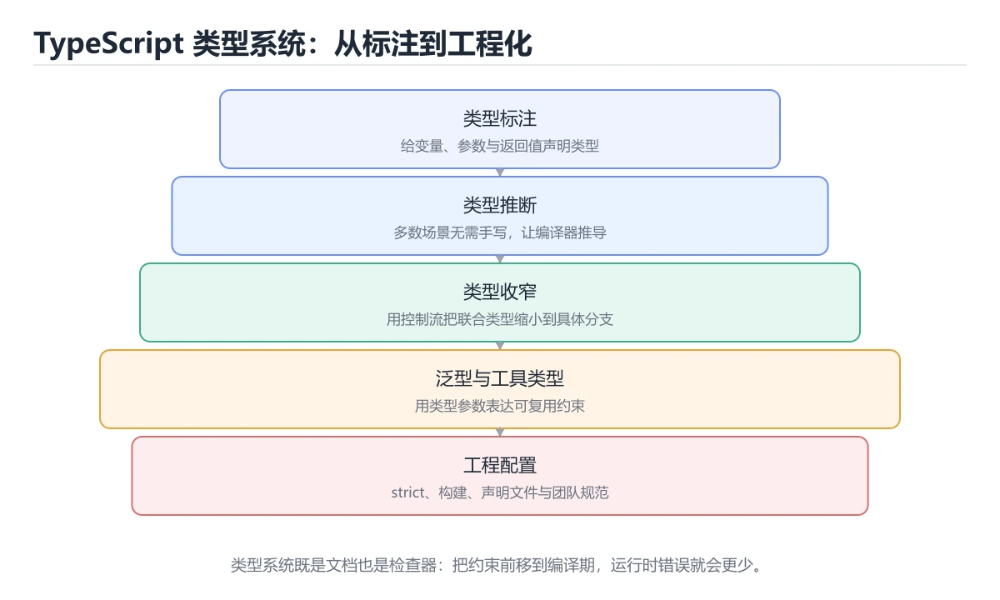
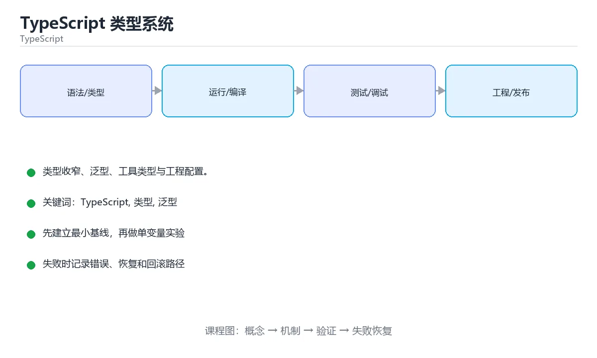

# TypeScript 类型系统





> 内容更新时间：2026-10-06 · 学习阶段：基础 · 预计用时：35 分钟

## 学习目标

- 能用自己的话解释TypeScript 类型系统解决了什么问题，而不是只背术语。
- 能说清 「TypeScript」、「类型」、「泛型」、「类型收窄」 之间的关系，并分别举出一个例子。
- 能把本课知识放回「TypeScript」的知识体系，说明它和相邻主题的边界。
- 能完成本课练习，并用验收标准检查自己的结果。

> 一句话摘要：类型收窄、泛型、工具类型与工程配置。

## 前置知识

- 会进行基本的文件、命令行或浏览器操作；遇到不熟悉的术语先查本课关键词。
- 开始前先复习：TypeScript、类型、泛型。
- 如果某一步看不懂，先记录具体卡点，完成练习后再回头读一遍。

## 为什么需要 TypeScript

JavaScript 的类型错误只在运行时暴露。TypeScript 在编译期做静态检查，同时保留 JS 的全部能力——类型只在编译期存在，产物仍是普通 JavaScript。

## 基础类型

| 类型 | 说明 |
| --- | --- |
| 原始类型 | string、number、boolean、null、undefined、symbol、bigint |
| 数组与元组 | `string[]`、`[number, string]`（定长且按位定型） |
| 对象类型 | `{ id: number; name: string }`、interface、type |
| 联合与交叉 | `A \| B`、`A & B` |
| 字面量类型 | `'success' \| 'error'`，把取值收敛为固定集合 |
| any / unknown / never | any 放弃检查；unknown 安全的外部输入；never 表示不可能 |

实践原则：**能用 unknown 就不用 any**；外部数据（接口返回、JSON）先当 unknown，校验后再收窄类型。

## interface 与 type

interface 适合描述对象与可扩展的契约（支持声明合并）；type 更灵活，可定义联合、元组、条件类型与映射类型。团队里通常约定：对象结构用 interface，复杂类型运算用 type。

## 泛型与类型运算

泛型让函数与组件在保持类型安全的前提下复用；常用工具类型包括 Partial、Required、Pick、Omit、Record、ReturnType、Awaited。条件类型与 infer 可以在类型层面做模式匹配，映射类型能批量改造属性（如把全部属性变为可选或只读）。

## 类型收窄

常见手段：typeof、instanceof、in、可辨识联合（discriminated union，用共同字段区分成员）、自定义类型守卫（`x is T`）以及断言函数。可辨识联合 + switch 穷尽检查是建模业务状态最实用的模式。

## 工程配置要点

1. 开启 strict 系列选项（strictNullChecks、noImplicitAny、strictFunctionTypes）。
2. 类型检查纳入 CI：`tsc --noEmit`，避免类型错误进主干。
3. 运行时校验不能省：类型在运行时不存在，接口数据仍需 zod/valibot 之类做校验。
4. 避免滥用断言（as）与非空断言（!），它们会掩盖真实错误。
5. 声明文件（.d.ts）用于给无类型的第三方库补类型。

## 本课小结
TypeScript 的价值是**把类型错误从运行时提前到编译期**，并用类型表达业务约束。掌握泛型、收窄与工具类型，就能写出既安全又易重构的前端与 Node 代码。

## 类型速查

| 类型 | 写法 | 说明 |
| --- | --- | --- |
| 原始类型 | `string`、`number`、`boolean`、`bigint`、`symbol` | 小写，不用包装类型 |
| 数组 | `string[]` 或 `Array<string>` | 推荐前者 |
| 元组 | `[string, number]` | 固定长度与顺序 |
| 联合 | `string \| number` | 值可以是其中之一 |
| 交叉 | `A & B` | 同时具备两组属性 |
| 字面量 | `"on" \| "off"` | 精确取值 |
| 对象 | `{ id: number; name?: string }` | `?` 表示可选 |
| 只读 | `readonly string[]`、`Readonly<T>` | 编译期禁止修改 |
| 索引签名 | `Record<string, number>` | 键值集合 |
| 可空 | `string \| null` | 开启 `strictNullChecks` 后必须显式处理 |
| 任意 | `any` | 关闭检查，尽量避免 |
| 未知 | `unknown` | 安全版 `any`，需收窄后使用 |
| 永远不返回 | `never` | 抛异常或死循环的返回值 |
| `void` | 无返回值 | 与 `undefined` 区分 |

## tsconfig 常用选项速查

| 选项 | 建议 | 作用 |
| --- | --- | --- |
| `strict` | `true` | 开启全部严格检查 |
| `target` | `ES2022` 起 | 输出语法版本 |
| `module` / `moduleResolution` | 按运行时选择 | 决定导入解析方式 |
| `noUncheckedIndexedAccess` | `true` | 下标访问结果可能是 `undefined` |
| `exactOptionalPropertyTypes` | 可选开启 | 更严格地区分「缺失」与 `undefined` |
| `noImplicitOverride` | `true` | 重写方法必须写 `override` |
| `skipLibCheck` | `true` | 跳过依赖类型检查，加速编译 |
| `noEmit` | CI 时 `true` | 只做类型检查 |
| `paths` | 按需 | 路径别名，打包器需同步配置 |
| `declaration` | 库项目 `true` | 生成 `.d.ts` |

## 常见错误对照表

| 容易写错的做法 | 实际现象 | 原因与正确做法 |
| --- | --- | --- |
| 用 `Object` 或 `{}` 当类型 | 几乎不报错，失去检查意义 | 用具体接口或 `Record<string, unknown>` |
| 到处 `as any` | 错误延后到运行时 | 收窄类型或补类型定义 |
| `arr[i]` 直接当非空 | 运行时可能 `undefined` | 开启 `noUncheckedIndexedAccess` 并判空 |
| `interface` 里定义函数属性写 `method(): void` 与 `method: () => void` 混用 | 类型兼容差异导致困惑 | 明确语义，团队内统一风格 |
| 用 `enum` 与字符串字面量混用 | 运行时行为不一致 | 简单场景直接用字面量联合 |
| `JSON.parse` 结果直接断言类型 | 字段不存在时报错 | 运行时校验（zod 等） |
| `const` 声明的对象属性被改 | 意料之外的状态变化 | 用 `as const` 或 `Object.freeze` |
| 回调里用普通函数访问 `this` | `this` 指向丢失 | 用箭头函数或显式绑定 |
| 导入类型用了值导入 | 打包体积变大 | 用 `import type { Foo } from "..."` |
| 忽略 `strictNullChecks` 报错 | 线上 `Cannot read properties of undefined` | 显式处理 `null` / `undefined` |

## 自测清单

- [ ] 新项目一律开启 `strict`。
- [ ] 用字面量联合替代不必要的枚举。
- [ ] 外部数据先 `unknown` 再校验，不直接断言。
- [ ] 用 `import type` 导入纯类型。
- [ ] CI 中单独执行 `tsc --noEmit` 做类型门禁。

## 零基础详解：类型是「给 JavaScript 加的合同」

### 一句话说清它是什么

TypeScript = JavaScript + 类型系统。类型只在**编译期**存在，
编译产物还是普通 JavaScript。它的价值是：把「运行时才发现的错误」提前到写代码时。

### 用生活比喻理解

| 概念 | 比喻 | 说明 |
| --- | --- | --- |
| 类型 | 合同条款 | 约定这个变量能做什么 |
| 编译器 | 审核员 | 编译期检查合同是否被违反 |
| 编译产物 | 去掉批注的正文 | 类型信息全部消失，只剩 JS |
| `any` | 撕掉合同 | 关掉检查，等于没写 TS |
| `unknown` | 未核验的包裹 | 用之前必须先检查 |

### 逐行拆解第一段代码

```typescript
type User = {                 // type 定义结构
  id: number;
  name: string;
  email?: string;             // ? 表示可选
};

function greet(user: User): string {
  return `你好，${user.name}`;
}

const u: User = { id: 1, name: "小明" };
console.log(greet(u));
```

| 语法 | 含义 |
| --- | --- |
| `type User = {...}` | 定义一个类型别名 |
| `id: number` | 字段类型约定 |
| `email?: string` | 可选字段，可能不存在 |
| `: string`（函数后） | 函数返回值类型 |
| `const u: User = ...` | 对象必须符合 User 的约定 |

### `interface` 与 `type` 怎么选

| 对比 | `interface` | `type` |
| --- | --- | --- |
| 描述对象 | 擅长 | 擅长 |
| 联合类型 | 不能 | `type A = B \| C` |
| 条件类型 / 映射类型 | 不能 | 可以 |
| 声明合并 | 支持（同名自动合并） | 不支持 |
| 建议 | 对外暴露的对象契约、需要扩展时 | 联合、工具类型、组合类型 |

### 类型推断与注解的取舍

```typescript
const count = 3;                    // 推断为 number，不用手写
const name: string = "小明";         // 类型不明显时写出来更清楚

function add(a: number, b: number) { // 参数必须标注
  return a + b;                      // 返回值自动推断为 number
}
```

规则：**能推断出来的不写，推断不出来的（参数、公共 API）必须写。**

### `any`、`unknown`、`never` 三个特殊类型

| 类型 | 含义 | 使用建议 |
| --- | --- | --- |
| `any` | 关闭检查 | 尽量避免，用 `unknown` 代替 |
| `unknown` | 未知，用前必须收窄 | 处理外部输入的首选 |
| `never` | 永远不会有值 | 表示不会返回的函数、穷尽检查 |
| `void` | 没有返回值 | 事件处理、打印类函数 |

```typescript
function parse(input: unknown): number {
  if (typeof input === "number") return input;      // 收窄
  if (typeof input === "string") return Number(input);
  throw new Error("不支持的输入类型");
}
```

### 配置：三行决定项目质量

```json
{
  "compilerOptions": {
    "strict": true,
    "noUncheckedIndexedAccess": true,
    "noImplicitOverride": true
  }
}
```

`strict: true` 会一次性打开 `strictNullChecks`、`noImplicitAny` 等一组检查，新项目务必开启。

### 新手最容易踩的八个坑

| 坑 | 现象 | 正确做法 |
| --- | --- | --- |
| 用 `any` 图省事 | 类型检查形同虚设 | 换 `unknown` 并收窄 |
| 直接断言 `as User` | 运行时还是可能崩 | 用 zod 等做运行时校验 |
| 以为类型能保护运行时 | 接口数据照样出错 | 边界做真实校验 |
| 忘了可选链 | 空值报错 | 用 `?.` 与 `??` |
| 只用 `tsc` 却以为打包会检查 | 类型错误照样上线 | CI 单独跑 `tsc --noEmit` |
| 忽略索引越界 | 数组取值可能 undefined | 开 `noUncheckedIndexedAccess` |
| 类型写得太复杂 | 没人看得懂 | 拆成小的命名类型 |
| 函数参数不标类型 | 隐式 any 报错 | 显式标注参数与返回值 |

### 手把手练习：安全解析接口返回

```typescript
type ApiUser = { id: number; name: string };

function isApiUser(value: unknown): value is ApiUser {
  if (typeof value !== "object" || value === null) return false;
  const v = value as Record<string, unknown>;
  return typeof v.id === "number" && typeof v.name === "string";
}

async function fetchUser(url: string): Promise<ApiUser> {
  const res = await fetch(url);
  if (!res.ok) throw new Error(`请求失败：${res.status}`);
  const data: unknown = await res.json();
  if (!isApiUser(data)) throw new Error("返回结构不符合预期");
  return data;
}
```

`unknown` + 类型守卫，是处理外部数据最稳的组合。

### 学完自测

- [ ] 能说出 TypeScript 类型在运行时是否存在。
- [ ] 能解释 `unknown` 比 `any` 安全在哪里。
- [ ] 能写出一个类型守卫函数。
- [ ] 知道 `strict: true` 大致开启哪些检查。
- [ ] 能说出 `interface` 与 `type` 各自擅长的场景。

## 动手练习

> 本课练习重点：围绕「TypeScript、类型、泛型」完成复述、实验和交付，每个结果都要能被别人检查。

先让类型检查通过，再制造一次类型错误，最后补运行时校验与测试。

### 练习 1：建立心智模型（10 分钟）

合上教程，用 3～5 句话回答：

1. TypeScript 类型系统解决了什么问题？
2. 如果没有它，会出现什么具体后果？
3. 它和「类型」是什么关系？

**验收标准**：至少出现一个本课关键词，并写出一个反例、边界条件或失效场景。

### 练习 2：做一次可控实验（20 分钟）

从正文中选一个最小示例，完成以下操作：

1. 先预测修改一个参数、输入或步骤后的结果。
2. 再实际执行或逐步推演，记录真实结果。
3. 如果结果与预测不同，写出差异原因。

**验收标准**：留下「原例 → 改动 → 预测 → 结果 → 原因」五步记录。

### 练习 3：交付一个小结果（30 分钟）

写一个最小类型示例，先让 `tsc --noEmit` 通过，再故意制造一次类型错误。

任务要求：

- 结果必须能被别人检查，不能只写“我已经理解了”。
- 至少覆盖「TypeScript」和「类型」两个关键词。
- 写出 1 个仍然不确定的问题，以及下一步如何验证。

> 提示：时间有限时优先做练习 1 和练习 2；练习 3 可以拆成两次完成。

## 可运行练习

### 任务 1：先跑通，再解释

```typescript
type User = {                 // type 定义结构
  id: number;
  name: string;
  email?: string;             // ? 表示可选
};

function greet(user: User): string {
  return `你好，${user.name}`;
}

const u: User = { id: 1, name: "小明" };
console.log(greet(u));
```

### 任务 2：只改一个条件

把「TypeScript 类型系统」的最小示例复制一份，只改一个条件再跑一次：

- 改动点：只把TypeScript的输入换成空值、极值或错误输入，其余保持不变。
- 预测：先写下「TypeScript 类型系统」在改动后的输出或错误信息，再运行。
- 记录：对照改动前后的结果，指出差异出在哪一步。
- 验收：换回原条件能复现原结果，改动只影响TypeScript。

### 任务 3：迁移到自己的数据

用同一套思路处理一组你自己的数据或场景，保持输出格式与任务 1 一致。

## 故障现场

### 现场 1：本课的 TypeScript 常规用例通过，但边界用例失败

**症状**：在本课的练习或生产场景里出现“本课的 TypeScript 常规用例通过，但边界用例失败”。

**复现**：准备一组最小输入，只保留触发“本课的 TypeScript 常规用例通过，但边界用例失败”的必要条件，连续运行两次确认结果稳定。

**定位**：围绕“TypeScript 的前置条件与取值边界没有写进代码，默认值掩盖了空值和极值”检查调用链、输入数据和环境配置，先验证假设再改代码。

**预防**：把“本课的 TypeScript 常规用例通过，但边界用例失败”写成一条自动化用例，并在本课的验收清单里保留对应检查项。

### 现场 2：本课的 类型 结果在两次运行之间不一致

**症状**：在本课的练习或生产场景里出现“本课的 类型 结果在两次运行之间不一致”。

**复现**：准备一组最小输入，只保留触发“本课的 类型 结果在两次运行之间不一致”的必要条件，连续运行两次确认结果稳定。

**定位**：围绕“类型 依赖了当前版本、执行顺序或共享状态，单次运行无法暴露差异”检查调用链、输入数据和环境配置，先验证假设再改代码。

**预防**：把“本课的 类型 结果在两次运行之间不一致”写成一条自动化用例，并在本课的验收清单里保留对应检查项。

### 现场 3：本课的验证只在开发机通过

**症状**：在本课的练习或生产场景里出现“本课的验证只在开发机通过”。

**定位**：围绕“环境版本、配置和输入规模与目标环境不同，TypeScript 缺少可重复的验证记录”检查调用链、输入数据和环境配置，先验证假设再改代码。

## 版本与时效

- TypeScript 5.x 主线持续收紧类型推导、装饰器与模块解析行为
- 升级前先跑 tsc --noEmit，再处理构建工具与 ESLint 规则差异

### 升级检查清单

- 先固定当前版本，跑通全部示例与测验，再升级工具链。
- 只改一个版本变量，记录编译、测试、性能与产物体积的变化。
- 重点回归默认值、弃用警告、序列化格式、并发语义和错误信息。
- 升级完成后更新本课的“最后复核 / 下次复核”日期与版本说明。

## 本课复习清单

离开本课前，逐项确认：

- [ ] 不看解析，能说出「TypeScript 的类型检查发生在什么时候？」的判断依据。
- [ ] 不看解析，能说出「相比 any，unknown 的优势是？」的判断依据。
- [ ] 不看解析，能说出「接口返回的数据还需要运行时校验吗？」的判断依据。
- [ ] 不看解析，能说出「type 与 interface 的主要差别是？」的判断依据。
- [ ] 不看解析，能说出「as const 的作用是？」的判断依据。
- [ ] 不看解析，能说出的判断依据。
- [ ] 至少运行一次本课示例，记录输入、输出和一个边界情况。
- [ ] 把本课最容易混淆的两个概念写成一句话对照。

| 复盘项 | 记录 |
| --- | --- |
| 已经能独立解释的考点 |  |
| 仍然说不清的概念 |  |
| 下一步验证动作 |  |

## 术语速查

把「TypeScript 类型系统」里反复出现的术语集中放在一起。复习时先遮住右列，尝试用自己的话解释，再回到正文核对。

| 术语 | 本课语境 |
| --- | --- |
| `TypeScript` | TypeScript Types focuses on Narrowing, generics, utility types and strict mode.。 |
| `类型` | 围绕“类型 依赖了当前版本、执行顺序或共享状态，单次运行无法暴露差异”检查调用链、输入数据和环境配置，先验证假设再改代码。 |
| `泛型` | Related terms: TypeScript, 类型, 泛型, 类型收窄。 |
| `类型收窄` | Related terms: TypeScript, 类型, 泛型, 类型收窄。 |
| `strict` | TypeScript Types focuses on Narrowing, generics, utility types and strict mode.。 |

## 考点精讲

### 考点 1：代码补全·TypeScript

- **题目**：下面这段 TypeScript 代码摘自「TypeScript 类型系统」的正文示例。关于这段代码，下面哪一项说法与实际内容相符？
- **判断依据**：在「TypeScript 类型系统」里，这段代码把主要逻辑封装在函数或方法里，需要被调用才会执行。这段代码出自「TypeScript 类型系统」的正文示例，围绕TypeScript、类型、泛型展开；把输入或边界换成空值、极值或失败情况后，结论要以「TypeScript 类型系统」的实际运行结果为准。

### 考点 2：多选辨析·TypeScript

- **题目**：围绕“TypeScript 类型系统”中的 TypeScript、类型、泛型，下列哪两项是本课强调的实践判断？
- **判断依据**：在「TypeScript 类型系统」里，题干的正确项是学习 TypeScript 时要同时说明输入、输出和失败路径，不能只看正常流程。在TypeScript 类型系统里，判断 类型 时要固定版本与边界输入，所以“验证 类型 时要固定版本并覆盖边界输入，结论才可复现”才可复现。回到「TypeScript 类型系统」的正文示例，用“围绕TypeScript 类型系统中”走一遍TypeScript、类型、泛型的完整流程，能复现的结论才可以保留。

### 考点 3：概念判断·TypeScript

- **题目**：接口返回的数据还需要运行时校验吗？
- **判断依据**：类型断言不改变运行时数据，接口数据要用 zod 等做校验。在「TypeScript 类型系统」里，如果只凭关键词作答，很容易把「只在生产需要」、「只在开发需要」与「需要，类型在运行时不存在」混在一起；在「TypeScript 类型系统」里判断这道题，要把TypeScript、类型、泛型的条件、过程与失败路径逐项对齐，换成“接口返回的数据还需要运行时校验吗”这个场景，只有满足前提的结论才成立。

### 考点 4：概念判断·TypeScript

- **题目**：type 与 interface 的主要差别是？
- **判断依据**：在「TypeScript 类型系统」里，结论应落在「interface 支持声明合并」。对外发布的库常用 interface 便于使用者扩展，内部组合类型多用 type。在「TypeScript 类型系统」里，这道题要求区分概念与边界，「interface 支持声明合并」只有在题干给出的前提下才成立，而「两者完全等价」、「type 不能描述对象」缺少同一组条件。

### 考点 5：概念判断·TypeScript

- **题目**：as const 的作用是？
- **判断依据**：在「TypeScript 类型系统」里，把值推断为最窄的只读字面量类型（readonly 元组/字面量）。它只影响类型推断，运行时仍可被修改（需要 Object.freeze 才真正冻结）。回到「TypeScript 类型系统」的正文示例，用“as const 的作用是”走一遍TypeScript、类型、泛型的完整流程，能复现的结论才可以保留。

### 考点 6：填空·"____": true,

- **题目**：补全代码：「TypeScript 类型系统」示例中，下面这行代码缺少哪个关键字或函数名？请填入 ____。 `"____": true,`
- **判断依据**：空格应填写「noUncheckedIndexedAccess」、「nouncheckedindexedaccess」。在「TypeScript 类型系统」里判断这道题，要把TypeScript、类型、泛型的条件、过程与失败路径逐项对齐，换成“补全代码”这个场景，只有满足前提的结论才成立。

## English Overview

**Title:** TypeScript Types

**Summary:** Narrowing, generics, utility types and strict mode.

**Category:** TypeScript
**Level:** 高级
**Key terms:** TypeScript, 类型, 泛型, 类型收窄, strict

## 内容元数据

- 内容版本：v2.0
- 最后更新：2026-10-06
- 学习阶段：基础
- 适用环境：TypeScript 5.x / Node.js 22+
- 内容来源：内置结构化课程与工程实践整理
- 相关主题：TypeScript、类型、泛型、类型收窄、strict
- 质量版本：P0 测验标准 + P1 覆盖扩展 + P2 体验补全

## Full English Study Guide

### Overview

**TypeScript Types** focuses on Narrowing, generics, utility types and strict mode.

### Learning Outcomes

- Explain what **TypeScript Types** solves and when it should be used.

### Glossary

- Topic: **TypeScript Types**
- Related terms: TypeScript, 类型, 泛型, 类型收窄

## Bilingual Section Outline

| 中文小节 | English section |
| --- | --- |
| 学习目标 | Learning objectives |
| 前置知识 | Prerequisites |
| 为什么需要 TypeScript | 为什么需要 TypeScript |
| 基础类型 | 基础Types |
| interface 与 type | interface 与 type |
| 泛型与类型运算 | 泛型与Types运算 |
| 类型收窄 | Types收窄 |
| 工程配置要点 | 工程配置要点 |
| 本课小结 | Summary |
| 类型速查 | Types速查 |

## 参考资料与复核

- 最后复核：2026-10-04
- 下次复核：2027-04-04
- 复核范围：版本兼容、API 行为、安全建议与工程实践
- 来源性质：官方文档、标准或权威教材；正文为离线教学重组

| 参考资料 | 本课用途 |
| --- | --- |
| [Everyday Types](https://www.typescriptlang.org/docs/handbook/2/everyday-types.html) | 常用类型与收窄 |
| [TypeScript Handbook](https://www.typescriptlang.org/docs/handbook/intro.html) | 类型系统与语言指南 |
| [Utility Types](https://www.typescriptlang.org/docs/handbook/utility-types.html) | 内置类型变换 |

> 「TypeScript 类型系统」的链接用于离线阅读后的延伸核对；App 不会自动联网。
