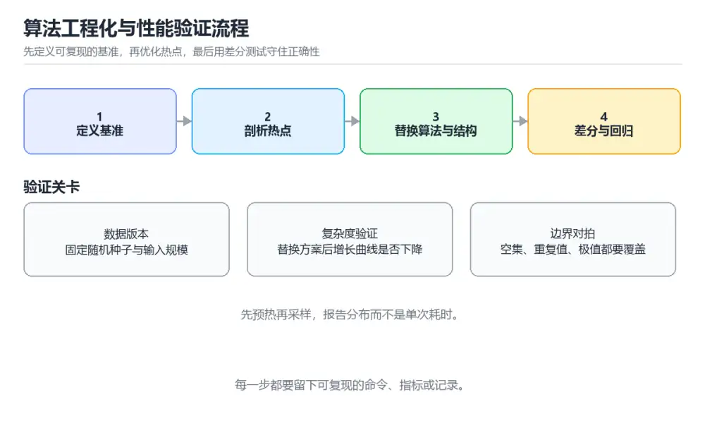

# 算法工程化与性能验证实战

> 内容更新时间：2026-10-06 · 学习阶段：进阶 · 预计用时：60 分钟

> 项目定位：不只写出能通过的答案，还要证明它在边界输入、数据规模和资源约束下仍然可靠。
> 建议投入：14 小时
> 难度：进阶


## 本节知识框架

**课程定位**：所属分类 `project_practice`（项目实战），课程主题 `算法工程化与性能验证实战`，学习阶段 进阶，建议用时 60 分钟。

本课主线：从问题建模到基准测试，把搜索、排序与动态规划算法做成可验证、可回归的工程模块。

**学完本课应当能够**
- 说清 `算法工程` 与 `基准测试` 的含义与区别，并各举一个正例和一个反例。
- 用本课示例验证 `复杂度` 的行为，记录输入、输出与失败条件。
- 遇到「小数据正确但大数据超时」这类问题时，能说出触发条件与修复顺序。

### 从概念到验证的学习链条

1. `算法工程`：先掌握 把算法从「能算对」推进到可维护、可评测、可上线的工程实践，再用它解释 `基准测试` 为什么会出现。
2. `基准测试`：先掌握 固定环境与输入规模重复测量耗时和内存，任何结论都要带上测量条件，再用它解释 `复杂度` 为什么会出现。
3. `复杂度`：先掌握 描述规模增长时资源消耗的变化趋势，落地时还要看常数项与真实数据分布，再用它解释 `二分查找` 为什么会出现。
4. `二分查找`：先掌握 在有序区间上每次折半的查找法，边界与不变式写错就会死循环或漏解，再用它解释 `动态规划` 为什么会出现。
5. `动态规划`：先掌握 把问题拆成有重叠的子问题并复用结果，关键是状态定义与转移顺序，再用它解释 `性能回归` 为什么会出现。
6. `性能回归`：先掌握 用基准数据持续对比历史版本，防止一次优化在别的输入上带来退化，再用它解释 本课示例的观察结果 为什么会出现。

**先修与衔接**：本课是「项目实战」分类的第 9 课。先修内容：《时间复杂度》、《二分查找》、《排序算法家族》。《时间复杂度》里的 `复杂度`、`空间复杂度` 是本课的前提。《二分查找》里的 `边界`、`二分查找` 是本课的前提。相关或后续课程：《动态规划入门》、《图与图算法》、《哈希表》。

### 完成判据

- **定义关**：不看正文也能说明 `算法工程` 是 把算法从「能算对」推进到可维护、可评测、可上线的工程实践，并指出一个反例。
- **机制关**：能按“输入 → 转换 → 输出 → 验证”复述 `算法工程化与性能验证实战`，而不是只背结论。
- **示例关**：能运行或推演 `算法工程化与性能验证实战` 的 `text` 示例，并说明一个真实出现的标识符或字面量。
- **证据关**：能从 `算法工程化与性能验证实战` 的示例写出一个输入、处理、输出三元组，并说明它支持或反驳了本课的哪一条结论。
- **排错关**：能复现 小数据正确但大数据超时，记录现象并按 先用计数器和剖析定位热点，再比较哈希表、堆或排序方案，确认复杂度下降后复测 修复。
- **迁移关**：能把 `算法工程`、`基准测试`、`复杂度`、`二分查找` 放进一个与 `算法工程化与性能验证实战` 不同的项目场景，并保持输入与验证条件可追踪。
- **复盘关**：学完 `算法工程化与性能验证实战` 后，用一句话写下仍然不确定的结论，并列出下一次验证需要的输入、环境和成功判据。

### 复习清单

- [ ] 能不看正文复述本课核心术语，并指出一个边界或反例。
- [ ] 能运行或推演本课示例，记录输入、输出与失败现象。
- [ ] 能完成一次自测，并把错题对照错误表定位原因。

## 核心概念定义

| 术语 | 操作性定义 | 常见边界与风险 |
| --- | --- | --- |
| 算法工程 | 把算法从「能算对」推进到可维护、可评测、可上线的工程实践。 | 只在「把算法从「能算对」推进到可维护、可评测、可上线的工程实践」这一前提下成立，换输入或换环境要重新验证。 |
| 基准测试 | 固定环境与输入规模重复测量耗时和内存，任何结论都要带上测量条件。 | 结论随输入规模变化，小规模成立不代表大规模成立，需要重新测量。 |
| 复杂度 | 描述规模增长时资源消耗的变化趋势，落地时还要看常数项与真实数据分布。 | 易错：小数据正确但大数据超时；正确做法是先用计数器和剖析定位热点，再比较哈希表、堆或排序方案，确认复杂度下降后复测。 |
| 二分查找 | 在有序区间上每次折半的查找法，边界与不变式写错就会死循环或漏解。 | 只在「在有序区间上每次折半的查找法，边界与不变式写错就会死循环或漏解」这一前提下成立，换输入或换环境要重新验证。 |
| 动态规划 | 把问题拆成有重叠的子问题并复用结果，关键是状态定义与转移顺序。 | 缓存与状态残留会让结果过期，先明确失效策略再判断正确性。 |
| 性能回归 | 用基准数据持续对比历史版本，防止一次优化在别的输入上带来退化。 | 不同版本与依赖组合的行为可能不同，升级或换环境前要按官方变更说明重新验证。 |

## 原理与运行机制

### 机制总览

**教材衔接：需求与约束**

| 维度 | 约束 |
| --- | --- |
| 正确性 | 至少覆盖空输入、单元素、重复值、极值和随机数据五类用例 |
| 性能 | 十万条记录的目标查询 P95 小于 50ms，内存峰值小于 128MB |
| 可复现 | 固定随机种子、数据版本、编译参数和运行环境 |
| 可维护 | 算法模块不依赖界面与数据库，输入输出使用纯函数或明确接口 |

**教材衔接：架构与数据流**

数据生成器负责产出带版本号的数据集，算法模块只接收内存中的结构化记录；基准程序记录预热、重复次数和分位数，测试套件比较结果哈希与性能阈值，最后把报告写入持续集成产物。

```text
seed + config -> dataset -> algorithm -> result hash
                     |            |
                  baseline -> benchmark -> regression gate
```

**教材衔接：实施步骤**

### 里程碑 1：定义接口与数据契约

先写输入输出结构、错误返回和复杂度预算，再实现最朴素的正确解法作为基线；用小型手写样例验证契约，避免一开始就优化细节。

### 里程碑 2：实现三种优化路径

用二分查找解决有序区间定位，用稳定排序处理聚合分组，用动态规划计算最小代价路径；每个实现都附复杂度推导和适用边界。

### 里程碑 3：建立基准与回归门禁

生成小、中、大三级固定数据集，分别跑正确性测试、微基准与端到端基准；比较结果哈希、P50、P95 和峰值内存，超过阈值就让流水线失败。

**教材衔接：扩展任务**

- 加入内存剖析并用流式算法降低峰值
- 比较多种语言实现的常数开销
- 用属性测试生成随机输入并做朴素对拍

**教材衔接：交付评审：评分表、决策记录与证据链**

### 一、「算法工程化与性能验证实战」的交付物评分表

| 交付物 | 权重 | 合格线 | 需要的证据 |
| --- | ---: | --- | --- |
| 问题定义与复杂度预算 | 25% | 能在干净环境复现，且失败路径有明确处理 | 命令与输出、对应测试、一次失败与恢复记录 |
| 数据集生成器和版本说明 | 25% | 能在干净环境复现，且失败路径有明确处理 | 命令与输出、对应测试、一次失败与恢复记录 |
| 正确性测试与边界用例 | 25% | 能在干净环境复现，且失败路径有明确处理 | 命令与输出、对应测试、一次失败与恢复记录 |
| 基准程序、基线报告和回归门禁 | 25% | 能在干净环境复现，且失败路径有明确处理 | 命令与输出、对应测试、一次失败与恢复记录 |

### 二、需要写下来的决策（ADR）

| 决策点 | 本课给出的做法 | 备选方案 | 代价与回滚 |
| --- | --- | --- | --- |
| 里程碑 1：定义接口与数据契约 | 先写输入输出结构、错误返回和复杂度预算，再实现最朴素的正确解法作为基线；用小型手写样例验证契约，避免一开始就优化细节。 | 不做「里程碑 1：定义接口与数据契约」，沿用最朴素的实现（需要额外补一次对照实验） | 若「里程碑 1：定义接口与数据契约」出问题，回到上一版本并按本课验收场景重跑 |
| 里程碑 2：实现三种优化路径 | 用二分查找解决有序区间定位，用稳定排序处理聚合分组，用动态规划计算最小代价路径；每个实现都附复杂度推导和适用边界。 | 不做「里程碑 2：实现三种优化路径」，沿用最朴素的实现（需要额外补一次对照实验） | 若「里程碑 2：实现三种优化路径」出问题，回到上一版本并按本课验收场景重跑 |
| 里程碑 3：建立基准与回归门禁 | 生成小、中、大三级固定数据集，分别跑正确性测试、微基准与端到端基准；比较结果哈希、P50、P95 和峰值内存，超过阈值就让流水线失败。 | 不做「里程碑 3：建立基准与回归门禁」，沿用最朴素的实现（需要额外补一次对照实验） | 若「里程碑 3：建立基准与回归门禁」出问题，回到上一版本并按本课验收场景重跑 |
| 交付边界 | 从问题建模到基准测试，把搜索、排序与动态规划算法做成可验证、可回归的工程模块。 | 不做「交付边界」，沿用最朴素的实现（需要额外补一次对照实验） | 若「交付边界」出问题，回到上一版本并按本课验收场景重跑 |

### 三、「算法工程化与性能验证实战」的交付证据链

| # | 命令 | 这条命令要留下的证据 |
| ---: | --- | --- |
| 1 | `dart pub get` | 完整输出、退出码、耗时，以及与「算法工程化与性能验证实战」验收口径的对应关系 |
| 2 | `dart test test/algorithm_regression_test.dart` | 完整输出、退出码、耗时，以及与「算法工程化与性能验证实战」验收口径的对应关系 |
| 3 | `dart run benchmark/run_benchmark.dart --dataset=large --repeat=7` | 完整输出、退出码、耗时，以及与「算法工程化与性能验证实战」验收口径的对应关系 |
| 4 | `python tools/compare_baseline.py benchmark/current.json benchmark/baseline.json` | 完整输出、退出码、耗时，以及与「算法工程化与性能验证实战」验收口径的对应关系 |

### 四、「算法工程化与性能验证实战」的验收指标

| 指标 | 目标值 | 测量方式 | 不达标时的动作 |
| --- | --- | --- | --- |
| | 性能 | 十万条记录的目标查询 P95 小于 50ms，内存峰值小于 128MB | | 用本课正文给出的阈值，没有就写实测基线 | 固定环境重复三次取中位数 | 回到对应小节定位，先修原因再重测 |
| 生成小、中、大三级固定数据集，分别跑正确性测试、微基准与端到端基准；比较结果哈希、P50、P95 和峰值内存，超过阈值就让流水线失败。 | 用本课正文给出的阈值，没有就写实测基线 | 固定环境重复三次取中位数 | 回到对应小节定位，先修原因再重测 |

### 五、评审记录模板

| 记录项 | 填写要求 |
| --- | --- |
| 项目标识 | `project_algorithm_engineering` |
| 本次范围 | 说明这一轮交付了「算法工程化与性能验证实战」的哪些部分 |
| 未完成项 | 列出与 算法工程 相关但本轮未做的内容 |
| 证据位置 | 指向 evidence/ 目录下的具体文件 |
| 风险与回滚 | 写清剩余风险、回滚步骤和验证方式 |
| 结论 | 通过 / 有条件通过 / 不通过，三者选一 |

### 机制拆解：每一步的输入、动作与输出

#### 1. `算法工程`
- 输入：`算法工程`；本步把 把算法从「能算对」推进到可维护、可评测、可上线的工程实践 当作判断规则。
- 动作：围绕 `算法工程` 保留中间状态，并记录它与 `基准测试` 的对应关系。
- 输出：`基准测试`，它可以被下一段代码、测试或记录继续使用。
- `算法工程` 的失败条件：只在「把算法从「能算对」推进到可维护、可评测、可上线的工程实践」这一前提下成立，换输入或换环境要重新验证。

#### 2. `基准测试`
- 输入：`算法工程`；本步把 固定环境与输入规模重复测量耗时和内存，任何结论都要带上测量条件 当作判断规则。
- 动作：围绕 `基准测试` 保留中间状态，并记录它与 `复杂度` 的对应关系。
- 输出：`复杂度`，它可以被下一段代码、测试或记录继续使用。
- `基准测试` 的失败条件：结论随输入规模变化，小规模成立不代表大规模成立，需要重新测量。

#### 3. `复杂度`
- 输入：`基准测试`；本步把 描述规模增长时资源消耗的变化趋势，落地时还要看常数项与真实数据分布 当作判断规则。
- 动作：围绕 `复杂度` 保留中间状态，并记录它与 `二分查找` 的对应关系。
- 输出：`二分查找`，它可以被下一段代码、测试或记录继续使用。
- `复杂度` 的失败条件：当小数据正确但大数据超时时，会出现小数据正确但大数据超时。

#### 4. `二分查找`
- 输入：`复杂度`；本步把 在有序区间上每次折半的查找法，边界与不变式写错就会死循环或漏解 当作判断规则。
- 动作：围绕 `二分查找` 保留中间状态，并记录它与 `动态规划` 的对应关系。
- 输出：`动态规划`，它可以被下一段代码、测试或记录继续使用。
- `二分查找` 的失败条件：只在「在有序区间上每次折半的查找法，边界与不变式写错就会死循环或漏解」这一前提下成立，换输入或换环境要重新验证。

#### 5. `动态规划`
- 输入：`二分查找`；本步把 把问题拆成有重叠的子问题并复用结果，关键是状态定义与转移顺序 当作判断规则。
- 动作：围绕 `动态规划` 保留中间状态，并记录它与 `性能回归` 的对应关系。
- 输出：`性能回归`，它可以被下一段代码、测试或记录继续使用。
- `动态规划` 的失败条件：缓存与状态残留会让结果过期，先明确失效策略再判断正确性。

#### 6. `性能回归`
- 输入：`动态规划`；本步把 用基准数据持续对比历史版本，防止一次优化在别的输入上带来退化 当作判断规则。
- 动作：围绕 `性能回归` 保留中间状态，并记录它与 `本课示例的最终结果` 的对应关系。
- 输出：`本课示例的最终结果`，它可以被下一段代码、测试或记录继续使用。
- `性能回归` 的失败条件：不同版本与依赖组合的行为可能不同，升级或换环境前要按官方变更说明重新验证。

### 复现实验记录

- 环境：`算法工程化与性能验证实战` 使用 `text` 示例，固定 `算法工程`、`基准测试`、`复杂度`、`二分查找` 作为第一组条件。
- 首轮输入：从示例中的第一个输入开始，预测 `算法工程` 会怎样变化。
- 基线观察：记录命令、输入、输出和错误原文，不用截图代替可复制的文本。
- 单变量修改：只改变 `算法工程`，观察 `性能回归` 是否仍满足定义。
- 失败注入：复现 小数据正确但大数据超时，确认现象是 小数据正确但大数据超时。
- 记录结论：把“修改前、修改后、预期变化、实际变化”写成四列表，这样复盘 `算法工程化与性能验证实战` 时才能区分概念错误与实现错误。

## 典型应用场景

**教材衔接：项目背景**

很多算法练习只在样例上正确，一旦输入变大、数据分布改变或语言运行时不同，耗时和内存就失控。本实战选择一个真实日志分析场景，把需求拆成检索、聚合和路径规划三个子问题，分别实现二分、排序与动态规划方案，并建立数据集、基准测试和性能回归门禁。

**教材衔接：项目交付物**

- 问题定义与复杂度预算
- 数据集生成器和版本说明
- 正确性测试与边界用例
- 基准程序、基线报告和回归门禁



**教材衔接：项目专属规格**

### 交付边界

从问题建模到基准测试，把搜索、排序与动态规划算法做成可验证、可回归的工程模块。 项目交付不是一份说明文档，而是一组可以运行的命令、可检查的输入输出、失败处理和复盘证据。范围必须同时写明本阶段做什么、不做什么，以及哪些依赖属于外部前提。

### 最小数据模型

| 对象 | 关键字段 | 约束 |
| --- | --- | --- |
| 输入实体 | 算法工程、来源、时间、版本 | 必填、可校验、可追溯到原始输入 |
| 任务实体 | 状态、优先级、执行标识、重试次数 | 状态迁移合法、重复执行不会产生重复副作用 |
| 结果实体 | 输出、错误码、耗时、资源指标 | 可序列化、可比较、失败原因可解释 |
| 审计记录 | 操作者、动作、批次、结果、时间 | 不记录敏感信息、可查询、可复核 |

### 验收场景

1. 正常路径：基准测试 的主流程一次跑通，并把版本与输出一起归档。
2. 边界路径：覆盖 算法工程 的空值、最大值、重复数据和超长内容，结果必须可预测。
3. 失败路径：让 基准测试 的下游失败，确认没有留下半完成状态。
4. 幂等路径：把 算法工程 的同一请求执行两次，业务结果与资源状态保持一致。
5. 回滚路径：撤销 algorithm_regression_test 的变更后逐项检查数据与配置。

### 证据清单

- 一条从干净环境开始的可复现命令，以及真实输出。
- 一份正常、边界、失败与幂等场景的测试矩阵。
- 一组修改前后的 基准测试 指标，包含测量方法和环境说明。
- 一份故障时间线、根因、修复动作、回滚耗时和后续改进项。

### 完成定义

让 基准测试 的风险登记与测试保持同步，避免只存在于对话里的约定。

- **小数据正确但大数据超时**：典型现象是小数据正确但大数据超时；正确做法是先用计数器和剖析定位热点，再比较哈希表、堆或排序方案，确认复杂度下降后复测。
- **基准结果每次波动很大**：典型现象是基准结果每次波动很大；正确做法是固定数据版本与随机种子，增加预热和采样次数，报告分布而非单次耗时，并隔离后台任务。
- **优化后边界答案错误**：典型现象是优化后边界答案错误；正确做法是把边界样例加入差分测试，用朴素实现作为随机对拍参考，直到结果哈希完全一致。

### 最小验证场景

- 准备：保留 `text` 示例的原始输入，先记录 `算法工程化与性能验证实战` 的基线输出和完整运行命令。
- 判定：新结果与 `算法工程化与性能验证实战` 的基线不同不等于错误；只有当差异破坏了 `算法工程` 的定义或错误表中的约束，才判定为失败。

### 选择与边界

- 使用 `算法工程` 时，先满足它的定义：把算法从「能算对」推进到可维护、可评测、可上线的工程实践；只在「把算法从「能算对」推进到可维护、可评测、可上线的工程实践」这一前提下成立，换输入或换环境要重新验证。
- 使用 `基准测试` 时，先满足它的定义：固定环境与输入规模重复测量耗时和内存，任何结论都要带上测量条件；结论随输入规模变化，小规模成立不代表大规模成立，需要重新测量。
- 使用 `复杂度` 时，先满足它的定义：描述规模增长时资源消耗的变化趋势，落地时还要看常数项与真实数据分布；易错：小数据正确但大数据超时；正确做法是先用计数器和剖析定位热点，再比较哈希表、堆或排序方案，确认复杂度下降后复测。
- 使用 `二分查找` 时，先满足它的定义：在有序区间上每次折半的查找法，边界与不变式写错就会死循环或漏解；只在「在有序区间上每次折半的查找法，边界与不变式写错就会死循环或漏解」这一前提下成立，换输入或换环境要重新验证。
- 使用 `动态规划` 时，先满足它的定义：把问题拆成有重叠的子问题并复用结果，关键是状态定义与转移顺序；缓存与状态残留会让结果过期，先明确失效策略再判断正确性。

## 代码/协议/SQL 示例

**教材衔接：验证命令与预期输出**

在 算法工程化与性能验证实战 的仓库根目录执行以下命令，确认核心链路可以运行。

```bash
dart pub get
dart test test/algorithm_regression_test.dart
dart run benchmark/run_benchmark.dart --dataset=large --repeat=7
python tools/compare_baseline.py benchmark/current.json benchmark/baseline.json
```

**预期输出**：回归测试全部通过；大型数据集三次预热后七次采样，结果哈希与基线一致，P95 小于 50ms，峰值内存小于 128MB；对比脚本输出 0 个明显回退。

### 示例精读：先找证据，再改一个条件

- 在 `算法工程化与性能验证实战` 中与 `算法工程` 对照：示例必须能支持 把算法从「能算对」推进到可维护、可评测、可上线的工程实践，否则说明这一段还缺少实现或验证步骤。
- 在 `算法工程化与性能验证实战` 中与 `基准测试` 对照：示例必须能支持 固定环境与输入规模重复测量耗时和内存，任何结论都要带上测量条件，否则说明这一段还缺少实现或验证步骤。
- 在 `算法工程化与性能验证实战` 中与 `复杂度` 对照：示例必须能支持 描述规模增长时资源消耗的变化趋势，落地时还要看常数项与真实数据分布，否则说明这一段还缺少实现或验证步骤。
- 在 `算法工程化与性能验证实战` 中与 `二分查找` 对照：示例必须能支持 在有序区间上每次折半的查找法，边界与不变式写错就会死循环或漏解，否则说明这一段还缺少实现或验证步骤。
- `算法工程化与性能验证实战` 的示例没有抽取到函数调用或字面量；按行记录输入、控制流和输出，避免只背代码外形。

## 时间/空间复杂度或性能分析

**复杂度证据**：「算法工程化与性能验证实战」的现有材料没有给出渐近时间或空间复杂度的明确结论，本课只做定性检查，不补写未经验证的 $O$ 记号。

把算法工程看成一条可复现的流水线：先固定输入分布与基准数据，再让每次优化都留下可对比的耗时曲线。
落到本课，「算法工程化与性能验证实战」关心的是 算法工程 与 基准测试 的配合，也就是说这条直觉要在 项目背景 里被具体验证。

本课的摘要可以当作一张地图：从问题建模到基准测试，把搜索、排序与动态规划算法做成可验证、可回归的工程模块。

1. 澄清输入与目标。先写清「算法工程化与性能验证实战」要解决的问题、合法输入范围和成功标准，再进入后续步骤。
2. 描述处理过程。把「算法工程、基准测试、复杂度、二分查找、动态规划、性能回归」映射到具体步骤，每步都要求能单独验证。
3. 定义输出。明确 算法工程 与 基准测试 各自的产物，以及失败时留下什么证据。
4. 让「算法工程化与性能验证实战」的失败路径尽早暴露：把算法工程推到边界值，记录错误信息、重试或降级动作，以及人工兜底条件。
5. 用 algorithm_regression_test 贯穿一次小实验：先预测输出，再运行或逐步推演，最后解释差异来自哪一步。

- **里程碑 1：定义接口与数据契约**：在「算法工程化与性能验证实战」里，「里程碑 1：定义接口与数据契约」这一步要先写清输入与预期，再记录实际结果和差异；结果不符时回到对应小节核对前提。
- **里程碑 2：实现三种优化路径**：在「算法工程化与性能验证实战」里，「里程碑 2：实现三种优化路径」这一步要先写清输入与预期，再记录实际结果和差异；结果不符时回到对应小节核对前提。
- **里程碑 3：建立基准与回归门禁**：在「算法工程化与性能验证实战」里，「里程碑 3：建立基准与回归门禁」这一步要先写清输入与预期，再记录实际结果和差异；结果不符时回到对应小节核对前提。
- **现场 1：小数据正确但大数据超时**：在「算法工程化与性能验证实战」里，「现场 1：小数据正确但大数据超时」这一步要先写清输入与预期，再记录实际结果和差异；结果不符时回到对应小节核对前提。
- **现场 2：基准结果每次波动很大**：在「算法工程化与性能验证实战」里，「现场 2：基准结果每次波动很大」这一步要先写清输入与预期，再记录实际结果和差异；结果不符时回到对应小节核对前提。
- **现场 3：优化后边界答案错误**：在「算法工程化与性能验证实战」里，「现场 3：优化后边界答案错误」这一步要先写清输入与预期，再记录实际结果和差异；结果不符时回到对应小节核对前提。

**检查点 2：算法基准测试为什么需要预热阶段？**

- 参考判断：让即时编译、缓存和运行时状态进入稳定阶段，减少冷启动干扰
- 解析：即时编译语言、虚拟机和硬件缓存都存在冷启动效应，第一次运行往往明显慢于稳定状态。预热后再采样，能让结果更接近持续负载下的真实表现。除此之外还要固定数据集、随机种子、编译参数和机器环境，并报告分位数而不是只报一次平均耗时。预热次数也要随运行时与负载规模调整。

**检查点 3：围绕算法工程化与性能验证实战中的 算法工程、基准测试、复杂度，下列哪两项是本课强调的实践判断？**

- 参考判断：学习 算法工程 时要同时说明输入、输出和失败路径，不能只看正常流程、验证 基准测试 时要固定版本并覆盖边界输入，结论才可复现
- 解析：本课把算法工程化与性能验证实战拆成概念、示例与故障现场三部分，因此判断 算法工程 时必须同时交代输入、输出和失败路径，这使“学习 算法工程 时要同时说明输入、输出和失败路径，不能只看正常流程”成立；在算法工程化与性能验证实战里，判断 基准测试 时要固定版本与边界输入，所以“验证 基准测试 时要固定版本并覆盖边界输入，结论才可复现”才可复现。相反，“只要 算法工程 的常规示例通过，就可以跳过边界与异常路径”把一次正常示例当成全部情况，会漏掉本课的边界缺陷；“把 基准测试 的单次运行结果当成所有版本和规模都成立”把单次结果外推成普遍结论，在算法工程化与性能验证实战里忽略了版本和规模变化。对照本课的故障现场与自测清单，就能用证据区分这两种判断。

- 参考判断：先明确 算法工程 的输入、输出与约束
- 解析：在本课的练习里，顺序应当是：先明确 算法工程 的输入、输出与约束 → 写出最小示例并核对 基准测试 的基线结果 → 只改一个变量，记录边界与失败路径的变化 → 固定版本与证据，把本课的结论写成可复现记录。这个顺序把 算法工程 的输入、输出和约束放在最前面，在算法工程化与性能验证实战里避免概念没对齐就开始调参。第二步用 基准测试 建立可核对的基线，在算法工程化与性能验证实战里第三步才允许改变一个变量并观察失败路径。最后一步把本课的版本、证据与结论固定下来，别人才能复现同样的结果。

1. 把 算法工程 放进一个只有单机、没有额外依赖的小项目，先保证正确再扩展。
2. 把 algorithm_regression_test 的数据量提高一个数量级，观察延迟与内存的变化拐点。
3. 把 基准测试 换成失败输入，记录错误信息与恢复动作。
5. 删掉一个看似必要的步骤（例如 算法工程 相关的校验），观察哪个测试或指标先失败，用证据说明它为什么不能省。
6. 限制 CPU 与内存上限后重跑 algorithm_regression_test，观察哪一项参数需要重新设定。

换一个 基准测试 约束重做一次，确认结论在新条件下是否仍然成立。

#### 迁移案例 2：围绕「基准测试」做一次小实验

**步骤**：
1. 复述当前方案对「基准测试」的假设，写成一句可证伪的话。

#### 迁移案例 3：围绕「复杂度」做一次小实验

**步骤**：
1. 复述当前方案对「复杂度」的假设，写成一句可证伪的话。


#### 迁移案例 15：围绕「复杂度」做一次小实验

**测量方法**：以 `算法工程化与性能验证实战` 的 `算法工程` 场景为对象，固定输入跑一遍记录基线，再把规模或并发度提高一个数量级复测；两次结果的差值与波动范围才是结论依据。

### 需要控制的变量与记录项

- `算法工程化与性能验证实战` 的 `算法工程`：固定它的版本、输入范围和资源上限，分别记录速度、内存与失败率的变化。
- `算法工程化与性能验证实战` 的 `基准测试`：固定它的版本、输入范围和资源上限，分别记录速度、内存与失败率的变化。
- `算法工程化与性能验证实战` 的 `复杂度`：固定它的版本、输入范围和资源上限，分别记录速度、内存与失败率的变化。
- `算法工程化与性能验证实战` 的 `二分查找`：固定它的版本、输入范围和资源上限，分别记录速度、内存与失败率的变化。
- `算法工程化与性能验证实战` 的 `动态规划`：固定它的版本、输入范围和资源上限，分别记录速度、内存与失败率的变化。
- `算法工程化与性能验证实战` 中 `算法工程` 的边界：只在「把算法从「能算对」推进到可维护、可评测、可上线的工程实践」这一前提下成立，换输入或换环境要重新验证。达到边界时不要外推，必须重新测量。
- `算法工程化与性能验证实战` 中 `基准测试` 的边界：结论随输入规模变化，小规模成立不代表大规模成立，需要重新测量。达到边界时不要外推，必须重新测量。
- `算法工程化与性能验证实战` 中 `复杂度` 的边界：易错：小数据正确但大数据超时；正确做法是先用计数器和剖析定位热点，再比较哈希表、堆或排序方案，确认复杂度下降后复测。达到边界时不要外推，必须重新测量。
- `算法工程化与性能验证实战` 中 `二分查找` 的边界：只在「在有序区间上每次折半的查找法，边界与不变式写错就会死循环或漏解」这一前提下成立，换输入或换环境要重新验证。达到边界时不要外推，必须重新测量。
- `算法工程化与性能验证实战` 中 `动态规划` 的边界：缓存与状态残留会让结果过期，先明确失效策略再判断正确性。达到边界时不要外推，必须重新测量。

## 常见误区与易错点

| 容易写错的做法 | 实际现象 | 原因与正确做法 |
| --- | --- | --- |
| 小数据正确但大数据超时 | 小数据正确但大数据超时。 | 先用计数器和剖析定位热点，再比较哈希表、堆或排序方案，确认复杂度下降后复测。 |
| 基准结果每次波动很大 | 基准结果每次波动很大。 | 固定数据版本与随机种子，增加预热和采样次数，报告分布而非单次耗时，并隔离后台任务。 |
| 优化后边界答案错误 | 优化后边界答案错误。 | 把边界样例加入差分测试，用朴素实现作为随机对拍参考，直到结果哈希完全一致。 |

### 现场 1：小数据正确但大数据超时

**症状**：小数据正确但大数据超时。

**根因与修复**：先用计数器和剖析定位热点，再比较哈希表、堆或排序方案，确认复杂度下降后复测。

**自检**：在本课示例里复现「小数据正确但大数据超时」，改成先用计数器和剖析定位热点，再比较哈希表、堆或排序方案，确认复杂度下降后复测后重跑；如果症状消失且失败路径按预期变化，说明定位正确。

### 现场 2：基准结果每次波动很大

**症状**：基准结果每次波动很大。

**根因与修复**：固定数据版本与随机种子，增加预热和采样次数，报告分布而非单次耗时，并隔离后台任务。

**自检**：在本课示例里复现「基准结果每次波动很大」，改成固定数据版本与随机种子，增加预热和采样次数，报告分布而非单次耗时，并隔离后台任务后重跑；如果症状消失且失败路径按预期变化，说明定位正确。

### 现场 3：优化后边界答案错误

**症状**：优化后边界答案错误。

**根因与修复**：把边界样例加入差分测试，用朴素实现作为随机对拍参考，直到结果哈希完全一致。

**自检**：在本课示例里复现「优化后边界答案错误」，改成把边界样例加入差分测试，用朴素实现作为随机对拍参考，直到结果哈希完全一致后重跑；如果症状消失且失败路径按预期变化，说明定位正确。

## 与其他知识点的关系

| 关系 | 课程 | 为什么 |
| --- | --- | --- |
| 先修 | 《时间复杂度》 | 本课会直接使用它的概念或操作前提。 |
| 先修 | 《二分查找》 | 本课会直接使用它的概念或操作前提。 |
| 先修 | 《排序算法家族》 | 本课会直接使用它的概念或操作前提。 |
| 关联 | 《动态规划入门》 | 用于横向比较或把本课结论迁移到相邻主题。 |
| 关联 | 《图与图算法》 | 用于横向比较或把本课结论迁移到相邻主题。 |
| 关联 | 《哈希表》 | 用于横向比较或把本课结论迁移到相邻主题。 |
| 前置顺序 | 《安全攻防与防御实战》 | 同分类中安排在本课之前，建议先完成其自测。 |
| 后续顺序 | 《移动端离线优先 App 实战》 | 同分类中安排在本课之后，会继续使用本课术语。 |

**教材衔接：复习与迁移**

### 概念复述

- 用一句话说明「算法工程化与性能验证实战」解决什么问题：从问题建模到基准测试，把搜索、排序与动态规划算法做成可验证、可回归的工程模块。
- 写出算法工程、基准测试、复杂度之间的关系，并各举一个例子。
- 说出本课最容易混淆的两个概念，以及区分它们的判据。

### 正文逐节复核

- **实施步骤**：先写输入输出结构、错误返回和复杂度预算，再实现最朴素的正确解法作为基线；用小型手写样例验证契约，避免一开始就优化细节。
- **零基础精讲：把算法工程化与性能验证实战真正讲透**：本课的摘要可以当作一张地图：从问题建模到基准测试，把搜索、排序与动态规划算法做成可验证、可回归的工程模块。
- **项目专属规格**：从问题建模到基准测试，把搜索、排序与动态规划算法做成可验证、可回归的工程模块。


### 迁移练习

把「算法工程化与性能验证实战」的结论迁移到相邻主题，每次迁移都写清预测与证据：

- **先修**：`时间复杂度`、`二分查找`、`排序算法家族`。本课默认这些内容已经掌握。
- **相关或后续**：`动态规划入门`、`图与图算法`、`哈希表`。本课术语会在这些课程里继续使用。
- **术语归属**：`算法工程`、`基准测试`、`复杂度` 的定义以本课「核心概念定义」为准，换到其他课程时先确认定义是否被改写。
- 同一分类的《面试冲刺：算法编码与系统设计高频题》也涉及 `复杂度`；两课衔接时先确认这个术语的定义是否一致。

### 先修与后续术语接口

- `二分查找`：共享术语 `二分查找`，共同关键词 `二分查找`。
- `时间复杂度`：共享术语 `复杂度`，共同关键词 `复杂度`。
- `哈希表`：两者通过本分类的学习顺序衔接，阅读时重点比较各自的输入与失败条件。
- `排序算法家族`：两者通过本分类的学习顺序衔接，阅读时重点比较各自的输入与失败条件。
- `图与图算法`：两者通过本分类的学习顺序衔接，阅读时重点比较各自的输入与失败条件。

### 容易混淆的相邻概念

- `算法工程` 与 `基准测试`：前者强调 把算法从「能算对」推进到可维护、可评测、可上线的工程实践；后者强调 固定环境与输入规模重复测量耗时和内存，任何结论都要带上测量条件。判断时分别检查两条定义的适用范围，不要只看名称相似就互换。
- `基准测试` 与 `复杂度`：前者强调 固定环境与输入规模重复测量耗时和内存，任何结论都要带上测量条件；后者强调 描述规模增长时资源消耗的变化趋势，落地时还要看常数项与真实数据分布。判断时分别检查两条定义的适用范围，不要只看名称相似就互换。
- `复杂度` 与 `二分查找`：前者强调 描述规模增长时资源消耗的变化趋势，落地时还要看常数项与真实数据分布；后者强调 在有序区间上每次折半的查找法，边界与不变式写错就会死循环或漏解。判断时分别检查两条定义的适用范围，不要只看名称相似就互换。
- `二分查找` 与 `动态规划`：前者强调 在有序区间上每次折半的查找法，边界与不变式写错就会死循环或漏解；后者强调 把问题拆成有重叠的子问题并复用结果，关键是状态定义与转移顺序。判断时分别检查两条定义的适用范围，不要只看名称相似就互换。
- `动态规划` 与 `性能回归`：前者强调 把问题拆成有重叠的子问题并复用结果，关键是状态定义与转移顺序；后者强调 用基准数据持续对比历史版本，防止一次优化在别的输入上带来退化。判断时分别检查两条定义的适用范围，不要只看名称相似就互换。

## 自测题与参考答案

> 先独立作答，再对照参考答案；答案都能在本课正文、术语表或错误表里找到依据。

### 自测 1（概念复述）

不看正文，写出 `算法工程` 的操作性定义，并说明它与 `基准测试` 的区别。

**参考答案**：把算法从「能算对」推进到可维护、可评测、可上线的工程实践。

`基准测试` 的定位是：固定环境与输入规模重复测量耗时和内存，任何结论都要带上测量条件；两者的差别要从适用对象与失败模式上说明。

### 自测 2（排错）

本课错误表记录了「小数据正确但大数据超时」这类做法。请写出它会出现的现象、根因，以及修复顺序。

**参考答案**：现象是小数据正确但大数据超时；正确做法是先用计数器和剖析定位热点，再比较哈希表、堆或排序方案，确认复杂度下降后复测。修复时先复现现象并保留证据，再改动一处假设重跑，确认现象消失。

### 自测 3（动手验证）

运行本课的 `text` 示例，改动其中一个输入后重新运行，记录输出与错误信息。

**参考答案**：正常输入下 `text` 示例应当复现正文给出的结果；改动输入后，如果结果改变或报错，先核对它是否满足 `算法工程化与性能验证实战` 中`算法工程` 的适用范围，再检查错误表里是否有同类现象。

### 自测 4（代码阅读）

阅读本课开头的 `text` 示例，说明它体现了`算法工程` 的哪一条性质，并指出改动哪个输入会让这条性质不再成立。

**参考答案**：`算法工程` 的定义是 把算法从「能算对」推进到可维护、可评测、可上线的工程实践，示例正是在实现这条定义。改动与 `算法工程` 有关的一个输入后，如果结果不再符合 `算法工程化与性能验证实战` 的正文描述，就说明该性质只在当前前提成立。

### 自测 5（迁移）

把 `算法工程化与性能验证实战` 的方法迁移到自己的项目：围绕 `算法工程` 写出一个与错误表同类的风险点，并说明触发条件和检验方式。

**参考答案**：例如「优化后边界答案错误」，它会导致优化后边界答案错误；检验方式是按把边界样例加入差分测试，用朴素实现作为随机对拍参考，直到结果哈希完全一致改一处再复现，确认现象消失且没有引入新的失败分支。

### 自测 6（对比）

用一个表格对比 `算法工程` 与 `基准测试`：各写一行适用场景、一行失败表现。

**参考答案**：`算法工程` 的定义是把算法从「能算对」推进到可维护、可评测、可上线的工程实践；`基准测试` 的定义是固定环境与输入规模重复测量耗时和内存，任何结论都要带上测量条件。两者的失败表现分别对应本课错误表里与本术语相关的行。

### 自测 7（排错顺序）

面对「小数据正确但大数据超时」引发的问题，请把“复现 小数据正确但大数据超时 → 保留证据 → 先用计数器和剖析定位热点，再比较哈希表、堆或排序方案，确认复杂度下降后复测 → 回归验证”四步写成可执行的检查清单。

**参考答案**：第一步按小数据正确但大数据超时复现；第二步记录输入、版本与完整报错；第三步按先用计数器和剖析定位热点，再比较哈希表、堆或排序方案，确认复杂度下降后复测只改一处；第四步重跑并确认失败路径也按预期变化。

### 自测 8（边界判断）

针对 `性能回归`，分别写出“可以使用”的条件和“结论不再成立”的条件。

**参考答案**：不同版本与依赖组合的行为可能不同，升级或换环境前要按官方变更说明重新验证。 同时要把 `性能回归` 的定义 用基准数据持续对比历史版本，防止一次优化在别的输入上带来退化 与实际输入逐项对照。

### 自测 9（机制重建）

不看正文，按输入、转换、输出、验证四段重建 `算法工程` → `基准测试` → `复杂度` → `二分查找` 的作用链。

**参考答案**：起点是 `算法工程` 的定义 把算法从「能算对」推进到可维护、可评测、可上线的工程实践；中间每一步都保留可观察状态；终点由 `性能回归` 检查，失败时回到错误表定位第一个偏离定义的步骤。

### 自测 10（综合排错）

在 `算法工程化与性能验证实战` 中，现象是 优化后边界答案错误。请围绕 优化后边界答案错误 写出最小复现、关键证据、修复动作和回归验证，并说明为什么不能只凭一次运行下结论。

**参考答案**：先复现 优化后边界答案错误，记录输入与完整错误；再按 把边界样例加入差分测试，用朴素实现作为随机对拍参考，直到结果哈希完全一致 只改一处。回归时同时跑正常路径和边界路径，只有两次结果都可解释，才把修复视为完成。

### 自测 11（一分钟复述）

用每分钟约 200 字的速度复述 `算法工程化与性能验证实战`：先给主问题，再按顺序说出 `算法工程`、`基准测试`、`复杂度`、`二分查找`，最后给一个失败案例。

**自评标准**：主问题必须对应 从问题建模到基准测试，把搜索、排序与动态规划算法做成可验证、可回归的工程模块；每个术语都要能接上一句定义或边界；失败案例必须写成可观察现象，不能用“可能有风险”代替证据。

## 术语速查

| 术语 | 一句话说明 |
| --- | --- |
| `算法工程` | 把算法从「能算对」推进到可维护、可评测、可上线的工程实践。 |
| `基准测试` | 固定环境与输入规模重复测量耗时和内存，任何结论都要带上测量条件。 |
| `复杂度` | 描述规模增长时资源消耗的变化趋势，落地时还要看常数项与真实数据分布。 |
| `二分查找` | 在有序区间上每次折半的查找法，边界与不变式写错就会死循环或漏解。 |
| `动态规划` | 把问题拆成有重叠的子问题并复用结果，关键是状态定义与转移顺序。 |
| `性能回归` | 用基准数据持续对比历史版本，防止一次优化在别的输入上带来退化。 |

**术语关系**：`算法工程`（把算法从「能算对」推进到可维护、可评测、可上线的工程实践） → `基准测试`（固定环境与输入规模重复测量耗时和内存） → `复杂度`（描述规模增长时资源消耗的变化趋势） → `二分查找`（在有序区间上每次折半的查找法）。

## 考点精讲

`算法工程化与性能验证实战` 的题库有 5 道题，下面逐题给出题干、正确项与判断依据：先自己作答，再核对正确项，最后回到正文对应小节复核。

### 考点 1：第 1 题

- **题目**：代码语言为 `bash`，选自 `算法工程化与性能验证实战` 的 `算法工程` 部分。课程问题为从问题建模到基准测试，把搜索、排序与动态规划算法做成可验证、可回归的工程模块。哪一项描述与代码一致？
- **正确项**：这段示例用于说明本课术语 `复杂度` 的行为
- **判断依据**：这道题落在术语 `算法工程` 上：把算法从「能算对」推进到可维护、可评测、可上线的工程实践。复习时把 `算法工程` 的定义、适用边界和一个反例一起说清楚，再回到「核心概念定义」核对原文。

### 考点 2：第 2 题

- **题目**：算法基准测试为什么需要预热阶段？
- **正确项**：让即时编译、缓存和运行时状态进入稳定阶段，减少冷启动干扰
- **判断依据**：这道题落在术语 `基准测试` 上：固定环境与输入规模重复测量耗时和内存，任何结论都要带上测量条件。复习时把 `基准测试` 的定义、适用边界和一个反例一起说清楚，再回到「核心概念定义」核对原文。

### 考点 3：第 3 题

- **题目**：围绕“算法工程化与性能验证实战”中的 算法工程、基准测试、复杂度，下列哪两项是本课强调的实践判断？
- **正确项**：学习 算法工程 时要同时说明输入、输出和失败路径，不能只看正常流程；验证 基准测试 时要固定版本并覆盖边界输入，结论才可复现
- **判断依据**：这道题落在术语 `算法工程` 上：把算法从「能算对」推进到可维护、可评测、可上线的工程实践。复习时把 `算法工程` 的定义、适用边界和一个反例一起说清楚，再回到「核心概念定义」核对原文。

### 考点 4：第 4 题

- **题目**：按“算法工程化与性能验证实战”中 算法工程、基准测试、复杂度 的实践顺序，把四个步骤排成从准备到复盘的合理顺序。
- **正确项**：先明确 算法工程 的输入、输出与约束 → 写出最小示例并核对 基准测试 的基线结果 → 只改一个变量，记录边界与失败路径的变化 → 固定版本与证据，把“算法工程化与性能验证实战”的结论写成可复现记录
- **判断依据**：这道题落在术语 `算法工程` 上：把算法从「能算对」推进到可维护、可评测、可上线的工程实践。复习时把 `算法工程` 的定义、适用边界和一个反例一起说清楚，再回到「核心概念定义」核对原文。

### 考点 5：第 5 题

- **题目**：同一份算法实现，小数据全部正确，大数据却超时。应该先做什么？
- **正确项**：用计数器与剖析定位热点，再比较哈希表、堆或排序方案是否适合规模
- **判断依据**：这道题检验本课主问题：从问题建模到基准测试，把搜索、排序与动态规划算法做成可验证、可回归的工程模块。复习时先复述本课主问题，再举一个会让结论失效的输入。

### 考点 6：`算法工程`

- **要点**：把算法从「能算对」推进到可维护、可评测、可上线的工程实践。
- **算法工程 的边界**：只在「把算法从「能算对」推进到可维护、可评测、可上线的工程实践」这一前提下成立，换输入或换环境要重新验证。

### 考点 7：`基准测试`

- **要点**：固定环境与输入规模重复测量耗时和内存，任何结论都要带上测量条件。
- **基准测试 的边界**：结论随输入规模变化，小规模成立不代表大规模成立，需要重新测量。

### 考点 8：`复杂度`

- **要点**：描述规模增长时资源消耗的变化趋势，落地时还要看常数项与真实数据分布。
- **复杂度 的边界**：易错：小数据正确但大数据超时；正确做法是先用计数器和剖析定位热点，再比较哈希表、堆或排序方案，确认复杂度下降后复测。

### 考点 9：`二分查找`

- **要点**：在有序区间上每次折半的查找法，边界与不变式写错就会死循环或漏解。
- **二分查找 的边界**：只在「在有序区间上每次折半的查找法，边界与不变式写错就会死循环或漏解」这一前提下成立，换输入或换环境要重新验证。

### 考点 10：`动态规划`

- **要点**：把问题拆成有重叠的子问题并复用结果，关键是状态定义与转移顺序。
- **动态规划 的边界**：缓存与状态残留会让结果过期，先明确失效策略再判断正确性。

### 考点 11：`性能回归`

- **要点**：用基准数据持续对比历史版本，防止一次优化在别的输入上带来退化。
- **性能回归 的边界**：不同版本与依赖组合的行为可能不同，升级或换环境前要按官方变更说明重新验证。

### 考点 12：排错——小数据正确但大数据超时

- **现象**：小数据正确但大数据超时。
- **处理**：先用计数器和剖析定位热点，再比较哈希表、堆或排序方案，确认复杂度下降后复测。

### 考点 13：排错——基准结果每次波动很大

- **现象**：基准结果每次波动很大。
- **处理**：固定数据版本与随机种子，增加预热和采样次数，报告分布而非单次耗时，并隔离后台任务。

### 考点 14：综合辨析——`算法工程` 与 `性能回归`

- **辨析点**：`算法工程` 的定义是 把算法从「能算对」推进到可维护、可评测、可上线的工程实践；`性能回归` 的定义是 用基准数据持续对比历史版本，防止一次优化在别的输入上带来退化。
- **答题要求**：面对 `算法工程化与性能验证实战` 的题目，先判断描述的是 `算法工程` 还是 `性能回归`，再归到对应定义，最后写出一个会让该定义失效的边界输入。

### 考点 15：排错评分点

- **现象分**：能写出 小数据正确但大数据超时，而不是只写“程序有错”。
- **证据分**：保留触发 小数据正确但大数据超时 的输入、版本和错误原文。
- **修复分**：按 先用计数器和剖析定位热点，再比较哈希表、堆或排序方案，确认复杂度下降后复测 只改一处，并同时回归正常路径与边界路径。

## 内容元数据

- 内容版本：v2.0
- 最后更新：2026-10-06
- 学习阶段：进阶
- 适用环境：本地容器、单机服务或移动开发环境，具体版本以课程命令为准
；本课聚焦 算法工程。
- 内容来源：内置结构化课程与项目工程实践整理
- 相关主题：算法工程、基准测试、复杂度、二分查找、动态规划、性能回归
- 质量版本：P0 可运行练习 + P1 专项题型 + P2 项目规格与复核
- 项目标识：project_algorithm_engineering
- 学习产出：算法工程化与性能验证实战 的可运行增量、验证证据与复盘记录

## 参考资料与复核

- 最后复核：2026-10-04
- 下次复核：2027-10-10
- 复核范围：版本兼容、API 行为、安全建议与工程实践
- 来源性质：官方文档、标准或权威教材；本课核对关键词：算法工程、基准测试、复杂度、二分查找、动态规划、性能回归。

| 参考资料 | 本课用途 |
| --- | --- |
| [The Twelve-Factor App](https://12factor.net/) | 配置、日志与可部署性 |
| [Docker 入门](https://docs.docker.com/get-started/) | 容器化与 Compose |
| [PostgreSQL 教程](https://www.postgresql.org/docs/current/tutorial.html) | 数据建模与事务实践 |

| [本课术语索引：算法工程化与性能验证实战](#核心概念定义) | 按本课输入、术语边界和错误表现逐项核对 |
> 「算法工程化与性能验证实战」的链接用于离线阅读后的延伸核对；App 不会自动联网。