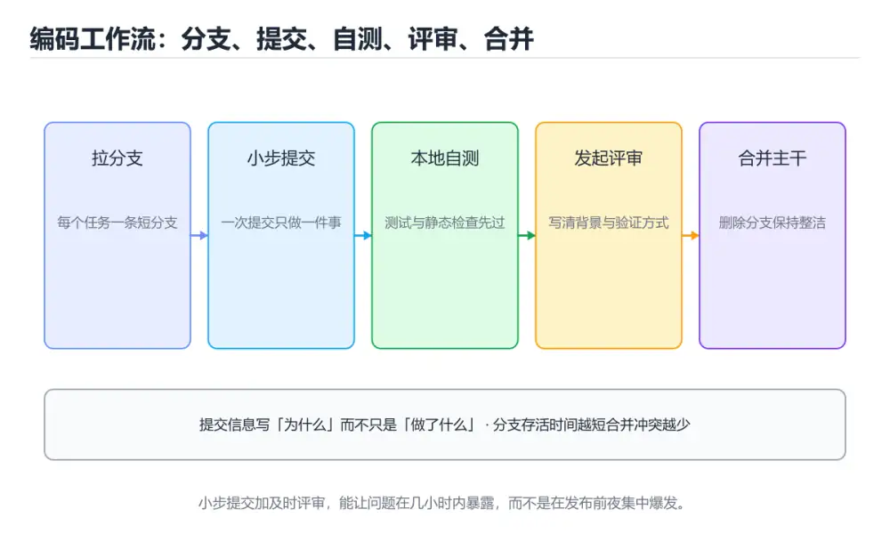
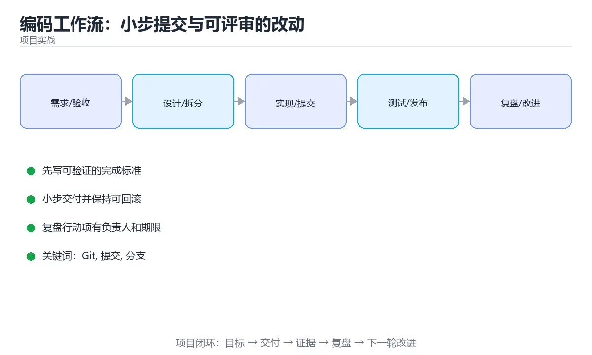

# 编码工作流：小步提交与可评审的改动





> 内容更新时间：2026-10-03 · 学习阶段：入门 · 预计用时：18 分钟

## 学习目标

- 能用自己的话解释「编码工作流：小步提交与可评审的改动」解决了什么问题，而不是只背术语。
- 能说清 「Git」、「提交」、「分支」、「代码评审」 之间的关系，并分别举出一个例子。
- 能把本课知识放回「项目实战」的知识体系，说明它和相邻主题的边界。
- 能完成本课练习，并用验收标准检查自己的结果。

> 一句话摘要：分支策略、提交粒度、提交信息、评审清单与回滚友好的交付节奏。

## 前置知识

- 先完成上一课《需求到设计：把想法拆成可交付任务》；如果已经掌握，可以直接用本课练习自测。
- 本课阶段：入门。只需要基本计算机操作，不要求编程经验。
- 开始前先复习：Git、提交、分支。
- 如果某一步看不懂，先记录具体卡点，完成练习后再回头读一遍。


## 一句话目标

让每一次改动都**小、可理解、可回滚**，这样代码评审、排障与协作才不会失控。

## 一张图看懂完整工作流

```text
拉取最新主干
   │
   ▼
建特性分支（命名：feat/order-export）
   │
   ▼
┌─────────────────────────────┐
│ 循环：写代码 → 本地测试 → 提交 │
│  · 每次提交只做一件事         │
│  · 提交信息写清「为什么」     │
└─────────────────────────────┘
   │
   ▼
推送并开 PR（描述：改了什么、为什么、怎么验证）
   │
   ▼
CI 通过 + 至少一人评审
   │
   ▼
合并到主干（squash 或 rebase，保持线性）
   │
   ▼
删除分支，回到主干拉最新
```

## 提交粒度：多大的改动最合适

| 规模 | 评审效果 | 说明 |
| --- | --- | --- |
| < 200 行 | 最佳 | 半小时内能看完 |
| 200~500 行 | 可接受 | 需要写清背景 |
| > 500 行 | 明显变差 | 应拆分 |
| > 1000 行 | 基本无效 | 评审变成走过场 |

**拆分的三种方式**：

1. 按行为拆：先加数据结构，再加接口，最后接界面。
2. 按层次拆：先重构（不改行为），再加功能。
3. 按开关拆：先合并「不生效的代码」，再用开关开启。

## 提交信息的写法

```text
类型(范围): 一句话说明做了什么

为什么这么改（背景与原因）

怎么验证（命令、结果、截图）

关联：issue #123
```

```text
feat(order): 支持按时间范围导出订单

运营需要按月导出对账文件，之前只能导出全部。
新增 start/end 查询参数，缺省时保持原行为。

验证：pnpm test order；手动导出 2026-01 数据共 128 条
关联：#123
```

| 类型 | 用途 |
| --- | --- |
| `feat` | 新功能 |
| `fix` | 修缺陷 |
| `refactor` | 不改行为的重构 |
| `perf` | 性能优化 |
| `docs` | 文档 |
| `test` | 测试 |
| `chore` | 构建与杂项 |

## 分支策略：三种够用即可

| 策略 | 适合 | 说明 |
| --- | --- | --- |
| 主干开发 + 短分支 | 大多数团队 | 分支活不过两三天 |
| Git Flow | 有明确发布窗口 | 分支多，成本高 |
| Trunk + 发布标签 | 持续部署 | 主干永远可发布 |

**共同要点**：分支存活时间越短，合并冲突越少。

## 代码评审：作者与评审者各有清单

作者自查：

```text
□ 改动是否只做了一件事
□ 是否补了测试，失败路径是否覆盖
□ 是否更新了文档与配置说明
□ 是否自测过（给出命令与结果）
□ 是否清理了调试代码与日志
```

评审者关注：

```text
□ 正确性：边界、异常、并发
□ 可读性：命名、结构、注释是否解释「为什么」
□ 安全性：输入校验、权限、密钥
□ 性能：循环里的 IO、N+1 查询
□ 可测试性：是否依赖全局状态
```

**评审对事不对人**：评论写「这里在并发下会重复扣款，建议加唯一约束」，而不是「你写错了」。

## 一次典型的小步交付

```text
第 1 次提交：加数据表与迁移脚本（不改变对外行为）
第 2 次提交：加仓储方法 + 单元测试
第 3 次提交：加接口 + 参数校验 + 接口测试
第 4 次提交：加界面开关（默认关闭）
第 5 次提交：打开开关并观察监控
每个提交都可单独回滚，出问题只回滚一步
```

## 新手最容易踩的八个坑

| 坑 | 现象 | 正确做法 |
| --- | --- | --- |
| 一次提交上千行 | 评审无人细看 | 拆成多次小提交 |
| 提交信息只写「update」 | 半年后看不懂 | 写清背景与验证 |
| 长时间不合并 | 冲突爆炸 | 分支不超过两三天 |
| 在主干直接改 | 随时可能不可发布 | 走分支加 PR |
| 顺手重构 | 评审无法分辨 | 重构与功能分两次提交 |
| 不写自测步骤 | 评审者无法验证 | 给出命令与结果 |
| 评审只挑格式 | 关键问题漏掉 | 优先正确性与安全性 |
| 合并后不清理分支 | 分支列表混乱 | 合并后删除 |

## 本课小结
- **小步提交**是协作效率的第一杠杆：越好评审，问题发现越早。
- 提交信息要回答三件事：改了什么、为什么改、怎么验证。
- 重构与功能分开提交，出问题才能精准回滚。


## 补充：让评审真正发现问题的做法

### 一次改动怎么拆成多个可评审的提交

```text
目标：给订单接口增加「按时间范围导出」

提交 1  加查询参数与数据层方法（不改对外行为）
        └─ 单测覆盖参数解析与边界
提交 2  接口接入新参数并返回结果
        └─ 接口测试覆盖缺省值（保持原行为）
提交 3  加权限校验与导出上限（防止一次导出全表）
        └─ 测试覆盖越权与超限
提交 4  更新接口文档与变更日志

每个提交都能单独通过 CI、单独回滚
```

**拆分依据有三条**：按行为、按层次、按开关。任选其一，但不要在一个提交里混合「重构 + 新功能 + 格式化」。

### PR 描述模板

```markdown
## 改了什么
订单接口支持按 start/end 导出，缺省时保持原行为。

## 为什么
运营需要按月对账，之前只能导出全部数据。

## 怎么验证
- 单测：`pytest tests/test_orders.py -k export`
- 手动：导出 2026-01，得到 128 条记录
- 风险：大范围导出可能压库，已加 31 天上限

## 关联
issue #123
```

### 评审意见怎么写才有用

| 差评写法 | 好评写法 |
| --- | --- |
| 这里不对 | 并发下这里会重复扣款，建议加唯一约束（附代码位置） |
| 为什么不这样写 | 我理解目标是 X，这个写法在 Y 场景会失败，是否考虑 Z |
| 命名不好 | `data` 含义太宽，叫 `pendingOrders` 更能表达内容 |
| 建议重构 | 这次先合入功能，重构我另开 PR，避免混淆改动范围 |

**评审对事不对人，且给出可执行的下一步**；只指出问题不给方向的评论会被忽略。

### 作者收到意见后的处理顺序

```text
① 先判断是「必须改」还是「可以讨论」
② 必须改的：当次提交修完，回复「已改，见第 N 行」
③ 可以讨论的：说明取舍，必要时线下沟通
④ 与本次目标无关的：开 issue 记录，不在本 PR 展开
⑤ 全部回复完再请求重新评审，不要边改边催
```

### 分支保护与合并策略

| 规则 | 建议值 |
| --- | --- |
| 必须通过 CI | 是（类型检查、测试、构建） |
| 至少一名评审 | 核心模块建议两人 |
| 禁止直推主干 | 是 |
| 合并方式 | squash（保持主干线性）或 rebase |
| 合并后删分支 | 是 |

```text
分支命名约定
  feat/order-export      新功能
  fix/order-npe          缺陷修复
  refactor/order-service 重构
  chore/bump-deps        依赖升级
```

### 提交信息的三种常见错误

| 错误 | 例子 | 正确做法 |
| --- | --- | --- |
| 只写动作 | `update code` | `feat(order): 支持按时间范围导出` |
| 混装多件事 | 一次提交里既有重构又有新功能 | 拆成多次提交 |
| 没有验证信息 | 只有标题 | 补上命令与预期结果 |

### 自查清单

- [ ] 单次改动控制在 200 行以内
- [ ] 重构与功能分开提交
- [ ] PR 描述写清改了什么、为什么、怎么验证
- [ ] 评审意见给出可执行的下一步
- [ ] 合并后主干仍能随时发布

## 动手练习


> 本课练习重点：围绕「Git、提交、分支」完成复述、实验和交付，每个结果都要能被别人检查。

先拆任务和风险，再完成一个可交付增量，最后记录回滚与改进。

### 练习 1：建立心智模型（10 分钟）

合上教程，用 3～5 句话回答：

1. 「编码工作流：小步提交与可评审的改动」解决了什么问题？
2. 如果没有它，会出现什么具体后果？
3. 它和「提交」是什么关系？

**验收标准**：至少出现一个本课关键词，并写出一个反例、边界条件或失效场景。

### 练习 2：做一次可控实验（20 分钟）

从正文中选一个最小示例，完成以下操作：

1. 先预测修改一个参数、输入或步骤后的结果。
2. 再实际执行或逐步推演，记录真实结果。
3. 如果结果与预测不同，写出差异原因。

**验收标准**：留下「原例 → 改动 → 预测 → 结果 → 原因」五步记录。

### 练习 3：交付一个小结果（30 分钟）

把一个真实小需求拆成任务、验收标准、风险与回滚步骤。

任务要求：

- 结果必须能被别人检查，不能只写“我已经理解了”。
- 至少覆盖「Git」和「提交」两个关键词。
- 写出 1 个仍然不确定的问题，以及下一步如何验证。

> 提示：时间有限时优先做练习 1 和练习 2；练习 3 可以拆成两次完成。


## 验证命令与预期输出

项目代码不能只看“能编译”，还要能按固定命令复现结果。下表给出最低验证集：

| 阶段 | 命令 | 预期输出 |
| --- | --- | --- |
| 安装依赖 | `python -m pip install -r requirements.txt` | 依赖安装完成，没有版本冲突 |
| 语法检查 | `python -m compileall .` | 所有模块编译通过 |
| 运行测试 | `python -m pytest -q` | 测试全部通过，失败用例数为 0 |
| 启动示例 | `python main.py` | 服务启动并输出监听地址 |

### 验收证据

- [ ] 保存依赖安装和启动命令的完整输出。
- [ ] 至少运行 3 条测试，其中包含一条非法输入或失败路径。
- [ ] 重复执行同一操作两次，确认没有重复写入或副作用。
- [ ] 记录一次失败状态码、错误日志和恢复步骤。
- [ ] 在 README 中写明环境版本、启动方式和回滚方式。

### 回归与回滚

1. 先在一个可丢弃的目录或临时数据库执行，避免污染真实数据。
2. 修改一处逻辑后重跑全部验证命令，确认没有回归。
3. 若失败，回滚到上一个可运行版本并保留失败日志。
4. 定位原因后补一条自动化测试，再重新执行发布流程。
5. 把教训写入项目复盘或本课笔记，形成下一次的检查项。


## 可运行练习

下面 3 个任务围绕“编码工作流：小步提交与可评审的改动”展开，代码可以直接粘贴到 App 的离线沙箱里运行；如果示例会读取标准输入，请按代码注释在沙箱的 stdin 区域填入同样格式的数据。

### 任务 1：先跑通，再解释

```bash
#!/usr/bin/env bash
set -euo pipefail
echo "deliverable-ok"
```

**预期输出**：deliverable-ok

**验收标准**：代码能正常运行；逐行解释每个变量的值如何变化，并指出哪一行决定了最终结果。

### 任务 2：只改一个条件

复制上面的代码，只修改一个输入、边界或参数（例如空值、最大值、循环次数、过滤条件），先写出你的预测，再实际运行。

**验收标准**：留下“原结果 → 改动 → 预测 → 实际结果 → 差异原因”五步记录；如果预测错误，要写出修正后的心智模型。

### 任务 3：迁移到自己的数据

用同一套思路处理一组你自己的数据或场景，保持输出格式与任务 1 一致。

**验收标准**：代码不少于 10 行，至少包含 1 个边界检查；把代码和运行结果保存到笔记或片段库。


## 故障现场

这一节把“编码工作流：小步提交与可评审的改动”最常见的失败方式还原成现场记录，练习时按“症状 → 复现 → 定位 → 修复 → 预防”的顺序排查。

### 现场 1：“编码工作流：小步提交与可评审的改动”的 Git 常规用例通过，但边界用例失败

**症状**：在“编码工作流：小步提交与可评审的改动”的练习或生产场景里出现““编码工作流：小步提交与可评审的改动”的 Git 常规用例通过，但边界用例失败”。

**复现**：准备一组最小输入，只保留触发““编码工作流：小步提交与可评审的改动”的 Git 常规用例通过，但边界用例失败”的必要条件，连续运行两次确认结果稳定。

**定位**：围绕“Git 的前置条件与取值边界没有写进代码，默认值掩盖了空值和极值”检查调用链、输入数据和环境配置，先验证假设再改代码。

**修复**：为“编码工作流：小步提交与可评审的改动”补一条空值或极值用例，把前置条件写成断言，并让失败信息直接指出是哪个输入越界

**预防**：把““编码工作流：小步提交与可评审的改动”的 Git 常规用例通过，但边界用例失败”写成一条自动化用例，并在“编码工作流：小步提交与可评审的改动”的验收清单里保留对应检查项。


### 现场 2：“编码工作流：小步提交与可评审的改动”的 提交 结果在两次运行之间不一致

**症状**：在“编码工作流：小步提交与可评审的改动”的练习或生产场景里出现““编码工作流：小步提交与可评审的改动”的 提交 结果在两次运行之间不一致”。

**复现**：准备一组最小输入，只保留触发““编码工作流：小步提交与可评审的改动”的 提交 结果在两次运行之间不一致”的必要条件，连续运行两次确认结果稳定。

**定位**：围绕“提交 依赖了当前版本、执行顺序或共享状态，单次运行无法暴露差异”检查调用链、输入数据和环境配置，先验证假设再改代码。

**修复**：固定“编码工作流：小步提交与可评审的改动”使用的版本与随机种子，记录两次运行的完整输入和输出，再逐项消除非确定性来源

**预防**：把““编码工作流：小步提交与可评审的改动”的 提交 结果在两次运行之间不一致”写成一条自动化用例，并在“编码工作流：小步提交与可评审的改动”的验收清单里保留对应检查项。


### 现场 3：“编码工作流：小步提交与可评审的改动”的验证只在开发机通过

**症状**：在“编码工作流：小步提交与可评审的改动”的练习或生产场景里出现““编码工作流：小步提交与可评审的改动”的验证只在开发机通过”。

**复现**：准备一组最小输入，只保留触发““编码工作流：小步提交与可评审的改动”的验证只在开发机通过”的必要条件，连续运行两次确认结果稳定。

**定位**：围绕“环境版本、配置和输入规模与目标环境不同，Git 缺少可重复的验证记录”检查调用链、输入数据和环境配置，先验证假设再改代码。

**修复**：把“编码工作流：小步提交与可评审的改动”的运行环境、输入样本和预期输出写成清单，并在另一套环境复跑同一条命令

**预防**：把““编码工作流：小步提交与可评审的改动”的验证只在开发机通过”写成一条自动化用例，并在“编码工作流：小步提交与可评审的改动”的验收清单里保留对应检查项。


## 考点精讲：把测验题还原成判断过程

本课有 5 个判断点。先自己作答，再看「判断依据」；如果结论正确但理由不完整，回到正文对应章节补足概念。

### 考点 1：从评审效果看，单次改动控制在多少行比较合适？

- **正确判断**：200 行以内
- **判断依据**：200 行以内最容易在半小时内看完并发现设计问题。「800 行左右」与「1000 行以上更有整体感」会显著降低评审质量，超过千行基本沦为走过场。针对「从评审效果看，单次改动控制在多少行比较合适，」，本课在「一句话目标」中说明：让每一次改动都小、可理解、可回滚，这样代码评审、排障与协作才不会失控。本课还在「本课小结」中说明：小步提交是协作效率的第一杠杆：越好评审，问题发现越早。本课还在「项目专属规格：编码工作流：小步提交与可评审的改动」中说明：分支策略、提交粒度、提交信息、评审清单与回滚友好的交付节奏。
- **迁移检查**：把题干里的一个条件换成边界值，原来的结论还成立吗？写出判断过程。

### 考点 2：一条好的提交信息应该包含什么？

- **正确判断**：做了什么、为什么改、怎么验证
- **判断依据**：正确答案是「做了什么、为什么改、怎么验证」，本课在「本课小结」中说明：提交信息要回答三件事：改了什么、为什么改、怎么验证。标题说明改了什么，正文解释原因与验证方式，半年后仍能读懂。本课还在「补充：让评审真正发现问题的做法」中说明：PR 描述写清改了什么、为什么、怎么验证。本课还在「项目专属规格：编码工作流：小步提交与可评审的改动」中说明：分支策略、提交粒度、提交信息、评审清单与回滚友好的交付节奏。
- **迁移检查**：遮住选项，只根据定义复述一次答案，再回来看哪个选项与复述一致。

### 考点 3：为什么建议把重构与新增功能分成两次提交？

- **正确判断**：出问题时可以只回滚其中一部分
- **判断依据**：正确答案是「出问题时可以只回滚其中一部分」，本课在「一句话目标」中说明：让每一次改动都小、可理解、可回滚，这样代码评审、排障与协作才不会失控。分离关注点让回滚与评审都更精准。本课还在「本课小结」中说明：小步提交是协作效率的第一杠杆：越好评审，问题发现越早。本课还在「补充：让评审真正发现问题的做法」中说明：任选其一，但不要在一个提交里混合「重构 + 新功能 + 格式化」。
- **迁移检查**：如果给某个错误选项去掉一个限定词，它会不会变成正确？说明理由。

### 考点 4：关于特性分支，比较健康的原则是？

- **正确判断**：分支存活时间尽量短，通常不超过两三天
- **判断依据**：正确答案是「分支存活时间尽量短，通常不超过两三天」，本课在「分支策略：三种够用即可」中说明：共同要点：分支存活时间越短，合并冲突越少。分支存活越短，合并冲突与集成风险越小。本课还在「提交粒度：多大的改动最合适」中说明：按开关拆：先合并「不生效的代码」，再用开关开启。本课还在「代码评审：作者与评审者各有清单」中说明：评审对事不对人：评论写「这里在并发下会重复扣款，建议加唯一约束」，而不是「你写错了」。
- **迁移检查**：如果给某个错误选项去掉一个限定词，它会不会变成正确？说明理由。

### 考点 5：把「编码工作流：小步提交与可评审的改动」中「项目专属规格：编码工作流：小步提交与可评审的改动」的步骤调整为正确顺序。

- **正确判断**：1. 正常路径：最小输入得到预期输出，并留下日志与指标 → 2. 边界路径：空值、最大值、重复数据和超长内容得到明确处理 → 3. 失败路径：依赖超时或不可用时能快速失败、重试或降级 → 4. 幂等路径：同一请求执行两次不会产生重复副作用
- **判断依据**：正确答案是「正常路径：最小输入得到预期输出，并留下日志与指标 → 边界路径：空值、最大值、重复数据和超长内容得到明确处理 → 失败路径：依赖超时或不可用时能快速失败、重试或降级 → 幂等路径：同一请求执行两次不会产生重复副作用」，本课在「提交粒度：多大的改动最合适」中说明：按行为拆：先加数据结构，再加接口，最后接界面。
- **迁移检查**：哪一步是整条链路的必要条件，去掉后还能得到结果吗？

### 补充考点 1：关于「编码工作流：小步提交与可评审的改动」，下列哪些说法是正确的？（多选）

- **正确判断**：做了什么、为什么改、怎么验证；200 行以内
- **判断依据**：正确答案是「做了什么、为什么改、怎么验证；200 行以内」。本课的两个判断点可以互相印证：200 行以内最容易在半小时内看完并发现设计问题。「800 行左右」与「1000 行以上更有整体感」会显著降低评审质量，超过千行基本沦为走过场。针对「从评审效果看，单次改动控制在多…；分支策略、提交粒度、提交信息、评审清单与回滚友好的交付节奏。。在「编码工作流：小步提交与可评审的改动」中，多选时不能只凭一个关键词选答案，要逐项核对题干限定的对象和边界。

### 补充自测（1 题）

1. 下面这段 Python 代码复现了“编码工作流：小步提交与可评审的改动”中 Git、提交、分支 相关的一个常见故障，哪一项最准确地解释了问题？

这些题按“先定位概念、再排除边界错误、最后核对答案”的顺序作答；每题解析都给出了判断依据。


## 本课复习清单

离开本课前，逐项确认：

- [ ] 不看解析，能说出「从评审效果看，单次改动控制在多少行比较合适？」的判断依据。
- [ ] 不看解析，能说出「一条好的提交信息应该包含什么？」的判断依据。
- [ ] 不看解析，能说出「为什么建议把重构与新增功能分成两次提交？」的判断依据。
- [ ] 不看解析，能说出「关于特性分支，比较健康的原则是？」的判断依据。
- [ ] 不看解析，能说出「把「编码工作流：小步提交与可评审的改动」中「项目专属规格：编码工作流：小步提交与…」的判断依据。
- [ ] 至少运行一次本课示例，记录输入、输出和一个边界情况。
- [ ] 把本课最容易混淆的两个概念写成一句话对照。

| 复盘项 | 记录 |
| --- | --- |
| 已经能独立解释的考点 |  |
| 仍然说不清的概念 |  |
| 下一步验证动作 |  |

## 术语速查

把本课反复出现的术语集中放在一起。复习时先遮住右列，尝试用自己的话解释，再回到正文核对。

| 术语 | 本课语境 |
| --- | --- |
| `feat` | \| `feat` \| 新功能 \| |
| `fix` | \| `fix` \| 修缺陷 \| |
| `refactor` | \| `refactor` \| 不改行为的重构 \| |
| `perf` | \| `perf` \| 性能优化 \| |
| `docs` | \| `docs` \| 文档 \| |
| `test` | \| `test` \| 测试 \| |
| `chore` | \| `chore` \| 构建与杂项 \| |
| `data` | \| 命名不好 \| `data` 含义太宽，叫 `pendingOrders` 更能表达内容 \| |
| `pendingOrders` | \| 命名不好 \| `data` 含义太宽，叫 `pendingOrders` 更能表达内容 \| |
| `update code` | \| 只写动作 \| `update code` \| `feat(order): 支持按时间范围导出` \| |
| `feat(order): 支持按时间范围导出` | \| 只写动作 \| `update code` \| `feat(order): 支持按时间范围导出` \| |
| `python -m compileall .` | \| 语法检查 \| `python -m compileall .` \| 所有模块编译通过 \| |

## 面试问答与自测

下面把本课考点换成面试追问。先口述自己的答案，
再对照参考回答检查是否遗漏了前提、边界或失败路径。

### 追问 1：从评审效果看，单次改动控制在多少行比较合适？

**参考回答**：200 行以内最容易在半小时内看完并发现设计问题。「800 行左右」与「1000 行以上更有整体感」会显著降低评审质量，超过千行基本沦为走过场。针对「从评审效果看，单次改动控制在多少行比较合适，」，本课在「一句话目标」中说明：让每一次改动都小、可理解、可回滚，这样代码评审、排障与协作才不会失控。本课还在「本课小结」中说明：小步提交是协作效率的第一杠杆：越好评审，问题发现越早。本课还在「项目专属规格·编码工作流·小步提交与可评审的改动」中说明：分支策略、提交粒度、提交信息、评审清单与回滚友好的交付节奏。

### 追问 2：一条好的提交信息应该包含什么？

**参考回答**：正确答案是「做了什么、为什么改、怎么验证」，本课在「本课小结」中说明：提交信息要回答三件事：改了什么、为什么改、怎么验证。标题说明改了什么，正文解释原因与验证方式，半年后仍能读懂。本课还在「补充·让评审真正发现问题的做法」中说明：PR 描述写清改了什么、为什么、怎么验证。本课还在「项目专属规格·编码工作流·小步提交与可评审的改动」中说明：分支策略、提交粒度、提交信息、评审清单与回滚友好的交付节奏。

### 追问 3：为什么建议把重构与新增功能分成两次提交？

**参考回答**：正确答案是「出问题时可以只回滚其中一部分」，本课在「一句话目标」中说明：让每一次改动都小、可理解、可回滚，这样代码评审、排障与协作才不会失控。分离关注点让回滚与评审都更精准。本课还在「本课小结」中说明：小步提交是协作效率的第一杠杆：越好评审，问题发现越早。本课还在「补充·让评审真正发现问题的做法」中说明：任选其一，但不要在一个提交里混合「重构 + 新功能 + 格式化」。

### 追问 4：关于特性分支，比较健康的原则是？

**参考回答**：正确答案是「分支存活时间尽量短，通常不超过两三天」，本课在「分支策略·三种够用即可」中说明：共同要点：分支存活时间越短，合并冲突越少。分支存活越短，合并冲突与集成风险越小。本课还在「提交粒度·多大的改动最合适」中说明：按开关拆：先合并「不生效的代码」，再用开关开启。本课还在「代码评审·作者与评审者各有清单」中说明：评审对事不对人：评论写「这里在并发下会重复扣款，建议加唯一约束」，而不是「你写错了」。

### 追问 5：把「编码工作流：小步提交与可评审的改动」中「项目专属规格：编码工作流：小步提交与可评审的改动」的步骤调整为正确顺序。

**参考回答**：正确答案是「正常路径：最小输入得到预期输出，并留下日志与指标 → 边界路径：空值、最大值、重复数据和超长内容得到明确处理 → 失败路径：依赖超时或不可用时能快速失败、重试或降级 → 幂等路径：同一请求执行两次不会产生重复副作用」，本课在「提交粒度·多大的改动最合适」中说明：按行为拆：先加数据结构，再加接口，最后接界面。

## English Overview

**Title:** Coding Workflow

**Summary:** Branching, commit size, messages, review checklists.

**Category:** Project Practice  
**Level:** 入门  
**Key terms:** Git, 提交, 分支, 代码评审, 小步交付

> The full tutorial is written in Chinese. This bilingual overview helps English readers identify the topic, scope and key terms before studying the detailed examples.

## 内容元数据

- 内容版本：v2.0
- 最后更新：2026-10-03
- 学习阶段：入门
- 适用环境：通用项目交付流程
- 内容来源：内置结构化课程与工程实践整理
- 相关主题：Git、提交、分支、代码评审、小步交付
- 质量版本：P0 测验标准 + P1 覆盖扩展 + P2 体验补全

## 项目专属规格：编码工作流：小步提交与可评审的改动

### 核心场景

分支策略、提交粒度、提交信息、评审清单与回滚友好的交付节奏。 项目目标是把「Git、提交、分支、代码评审、小步交付」落实为可运行、可测试、可回滚的交付物。

### 架构与数据流

```text
用户/输入 → 接口或命令 → 领域逻辑 → 存储/外部依赖 → 输出与监控
                         ↘ 失败分类 → 重试/补偿 → 回滚
```

### 最小数据模型

| 对象 | 关键字段 | 约束 |
| --- | --- | --- |
| 输入实体 | Git、时间、来源 | 必填校验、长度限制、幂等键 |
| 任务实体 | 状态、优先级、创建时间 | 状态迁移合法、不可重复执行 |
| 结果实体 | 输出、错误码、耗时 | 可序列化、错误可解释 |
| 审计记录 | 操作者、动作、结果、时间 | 不可篡改、可查询、脱敏 |

### 验收场景

1. 正常路径：最小输入得到预期输出，并留下日志与指标。
2. 边界路径：空值、最大值、重复数据和超长内容得到明确处理。
3. 失败路径：依赖超时或不可用时能快速失败、重试或降级。
4. 幂等路径：同一请求执行两次不会产生重复副作用。
5. 回滚路径：回滚后数据一致，且能说明恢复时间和影响范围。


## 最小可运行示例

下面示例用于验证「编码工作流：小步提交与可评审的改动」的最小输入、处理和输出。先原样运行，再只修改一个值：

```bash
#!/usr/bin/env bash
set -euo pipefail
echo "deliverable-ok"
```

## 预期输出

```text
deliverable-ok
```

## 验证步骤

1. 记录运行环境、命令和真实输出。
2. 修改一个输入，先写预测再运行。
3. 制造一次错误输入，记录错误信息与修复方式。
4. 把结论写回本课笔记或测试用例。


## 项目交付物

### 建议仓库结构

```text
src/
tests/
docs/
README.md
```

### 测试矩阵

| 层级 | 覆盖内容 | 最低数量 | 通过标准 |
| --- | --- | ---: | --- |
| 单元测试 | 领域规则、边界和错误分类 | 8 | 正常、边界、失败路径全部通过 |
| 集成测试 | 数据库、网络、文件或平台边界 | 3 | 使用真实边界且可重复运行 |
| 端到端测试 | 核心用户路径 | 1 | 从输入到输出完整跑通 |
| 手动验收 | 文档中列出的 5 个场景 | 5 | 有命令、输出和结论记录 |

### 验收数据

```json
{
  "project": "project_coding_workflow",
  "input": {"case": "normal", "value": 5},
  "expected": {"ok": true, "result": 5},
  "failure_case": {"value": -1, "error": "validation_error"},
  "idempotency_key": "demo-001"
}
```

### 复盘模板

| 问题 | 记录 |
| --- | --- |
| 原目标是什么？ | 用一句话描述可验收目标 |
| 实际发生了什么？ | 时间线、指标和关键日志 |
| 哪个假设被推翻？ | 根因与促成因素 |
| 如何回滚？ | 步骤、耗时和数据校验 |
| 下一步做什么？ | 负责人、期限和验证方式 |

> 项目验收围绕「Git、提交、分支」：至少完成一次正常路径、一次边界输入、一次失败恢复和一次幂等检查。


## 参考资料与复核

- 最后复核：2026-10-04
- 下次复核：2027-04-04
- 复核范围：版本兼容、API 行为、安全建议与工程实践
- 来源性质：官方文档与标准；本课正文为离线教学重组，不复制原文

| 参考资料 | 本课用途 |
| --- | --- |
| [The Twelve-Factor App](https://12factor.net/) | 可部署应用原则 |
| [Google SRE Books](https://sre.google/books/) | 可观测性与发布工程 |

> 本课主题：分支策略、提交粒度、提交信息、评审清单与回滚友好的交付节奏。

> App 完全离线展示文字链接，不会自动联网；需要延伸阅读时可复制链接到浏览器。
