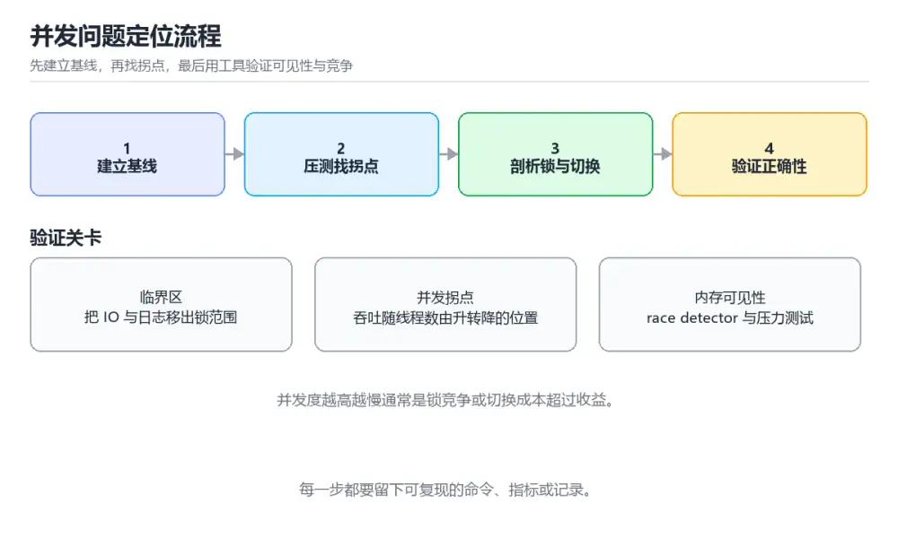

# 操作系统与并发实战

> 内容更新时间：2026-10-06 · 学习阶段：高级 · 预计用时：60 分钟

> 项目定位：从“偶发卡顿”到“可复现的并发时间线”，用调度、锁与内存指标解释结果。
> 建议投入：16 小时
> 难度：高级


## 前置知识

- 建议先完成：《进程与线程》、《进程调度》、《同步机制与经典问题》。
- 本课阶段：高级。需要能够独立阅读命令、代码或配置，并会用日志和测试验证结果。
- 开始前复习：线程池、锁竞争、上下文切换、内存模型。
- 准备一个可丢弃的本地环境；所有实验都要能重建、能清理、能回滚。
- 如果某一步无法复现，先记录环境、输入和完整错误，再缩小到最小案例。

## 项目背景

一个批量任务在单机运行正常，上并发后偶发超时、CPU 利用率不高但吞吐上不去。需要区分线程池排队、锁竞争、伪共享、上下文切换、内存可见性与 GC 暂停，并用可控实验验证。

## 学习目标

1. 能画出任务从提交、排队、执行到完成的并发时间线。
2. 能用压测与采样定位锁竞争、上下文切换和内存可见性问题。
3. 能比较线程、协程与事件循环在 CPU 密集和 I/O 密集场景下的边界。

## 需求与约束

| 维度 | 约束 |
| --- | --- |
| 功能 | 保留任务结果、取消与异常传播语义 |
| 性能 | 吞吐提升 2 倍，或 P95 降低 50% |
| 可靠性 | 能处理取消、超时、重复提交与下游失败 |
| 安全 | 共享状态必须有明确的同步或所有权策略 |

## 架构与数据流

任务生产者把任务放入有界队列，工作线程池消费任务并更新共享计数器与下游 I/O；采样器记录线程状态、锁等待、上下文切换与 GC 暂停。

```text
producer -> bounded queue -> worker pool -> shared state
                         |
                    lock / sampling
```

## 实施步骤

### 里程碑 1：建立串行基线

记录任务数、CPU、P95、上下文切换与 GC 暂停，确认单线程版本的吞吐上限和失败率。

### 里程碑 2：找到并发拐点

逐步增加 worker 数量，观察吞吐、排队时长、锁等待与上下文切换；找到收益开始下降的那个点。

### 里程碑 3：只改一个并发策略

把锁粒度缩小、改成无锁结构或换成协程或事件循环，复测并验证取消、超时与异常路径。

## 验证命令与预期输出

在 操作系统与并发实战 的仓库根目录执行以下命令，确认核心链路可以运行。

```bash
python bench.py --mode serial --tasks 20000
python bench.py --mode threadpool --workers 4 --tasks 20000
python -m cProfile -o profile.out bench.py --mode threadpool --workers 4 --tasks 20000
python -c "import pstats; pstats.Stats('profile.out').sort_stats('cumtime').print_stats(15)"
```

**预期输出**：串行 P95 约 480ms；4 个 worker 时吞吐提升接近 3 倍；worker 继续加到 32 后吞吐不再上升，锁等待与上下文切换明显增加，剖析结果的热点集中在共享计数器的临界区。

## 项目交付物

- 并发时间线与任务状态图
- 串行到并发的压测矩阵
- 采样或火焰图报告
- 锁、取消与异常传播设计说明



## 故障现场

### 现场 1：并发度越高反而越慢

**症状**：并发度越高反而越慢。

**定位**：锁竞争或线程切换成本超过了并行收益。

**修复**：缩小临界区、分批聚合或改用无锁结构与 channel，再重新测并发拐点。

### 现场 2：结果偶发不一致

**症状**：结果偶发不一致。

**定位**：共享状态缺少同步，或内存可见性没有保证。

**修复**：用原子操作、锁或 channel 明确所有权，并用 race detector 或压力测试复现。

## 扩展任务

- 用 ThreadSanitizer 或 race detector 复现数据竞争
- 对比线程池与协程在 I/O 密集任务下的吞吐和内存
- 加入取消与超时传播测试，验证下游失败不会拖垮整个池

## 复习与自测

1. 用一句话说明 操作系统与并发实战 的核心输入、输出与失败边界。
2. 画出 线程池 的数据流，并标出至少一条失败路径。
3. 写出 操作系统与并发实战 的下一条验证命令，并说明预期结果。

## 可运行练习

### 任务 1：先跑通，再解释

```bash
python bench.py --mode serial --tasks 20000
python bench.py --mode threadpool --workers 4 --tasks 20000
python -m cProfile -o profile.out bench.py --mode threadpool --workers 4 --tasks 20000
python -c "import pstats; pstats.Stats('profile.out').sort_stats('cumtime').print_stats(15)"
```

### 任务 2：只改一个条件

把「操作系统与并发实战」的最小示例复制一份，只改一个条件再跑一次：

- 改动点：只把线程池的输入换成空值、极值或错误输入，其余保持不变。
- 预测：先写下「操作系统与并发实战」在改动后的输出或错误信息，再运行。
- 记录：对照改动前后的结果，指出差异出在哪一步。
- 验收：换回原条件能复现原结果，改动只影响线程池。

### 任务 3：迁移到自己的数据

用同一套思路处理一组你自己的数据或场景，保持输出格式与任务 1 一致。

## 零基础精讲：把操作系统与并发实战真正讲透

### 先建立一个直觉

把项目实战看成可交付增量：先定义用户与验收标准，再拆里程碑，每个阶段都留下能运行、能测试、能回滚的产物。

本课的摘要可以当作一张地图：用线程池、锁竞争与性能剖析定位并发生命周期问题。

### 逐步拆解

1. 澄清输入与目标。先写清「操作系统与并发实战」要解决的问题、合法输入范围和成功标准，再进入后续步骤。
2. 描述处理过程。把「线程池、锁竞争、上下文切换、内存模型、协程、性能剖析」映射到具体步骤，每步都要求能单独验证。
3. 定义输出。输出不仅包括正常结果，还包括错误码、日志、指标和资源释放状态。
4. 找出一条失败路径。让错误尽早暴露，并说明重试、降级、回滚或人工处理的边界。
5. 用一个小例子贯穿全过程。先手算或预测结果，再运行代码或实验，最后解释差异。

### 把正文串成一条执行链

- **里程碑 1：建立串行基线**：在「操作系统与并发实战」里，「里程碑 1：建立串行基线」这一步要先写清输入与预期，再记录实际结果和差异；结果不符时回到对应小节核对前提。
- **里程碑 2：找到并发拐点**：在「操作系统与并发实战」里，「里程碑 2：找到并发拐点」这一步要先写清输入与预期，再记录实际结果和差异；结果不符时回到对应小节核对前提。
- **里程碑 3：只改一个并发策略**：在「操作系统与并发实战」里，「里程碑 3：只改一个并发策略」这一步要先写清输入与预期，再记录实际结果和差异；结果不符时回到对应小节核对前提。
- **现场 1：并发度越高反而越慢**：在「操作系统与并发实战」里，「现场 1：并发度越高反而越慢」这一步要先写清输入与预期，再记录实际结果和差异；结果不符时回到对应小节核对前提。
- **现场 2：结果偶发不一致**：在「操作系统与并发实战」里，「现场 2：结果偶发不一致」这一步要先写清输入与预期，再记录实际结果和差异；结果不符时回到对应小节核对前提。
- **任务 1：先跑通，再解释**：在「操作系统与并发实战」里，「任务 1：先跑通，再解释」这一步要先写清输入与预期，再记录实际结果和差异；结果不符时回到对应小节核对前提。

### 从测验反推易错点

**检查点 1：围绕操作系统与并发实战中的 线程池、锁竞争、上下文切换，下列哪两项是本课强调的实践判断？**

- 参考判断：学习 线程池 时要同时说明输入、输出和失败路径，不能只看正常流程、验证 锁竞争 时要固定版本并覆盖边界输入，结论才可复现
- 解析：本课把操作系统与并发实战拆成概念、示例与故障现场三部分，因此判断 线程池 时必须同时交代输入、输出和失败路径，这使“学习 线程池 时要同时说明输入、输出和失败路径，不能只看正常流程”成立；在操作系统与并发实战里，判断 锁竞争 时要固定版本与边界输入，所以“验证 锁竞争 时要固定版本并覆盖边界输入，结论才可复现”才可复现。相反，“只要 线程池 的常规示例通过，就可以跳过边界与异常路径”把一次正常示例当成全部情况，会漏掉本课的边界缺陷；“把 锁竞争 的单次运行结果当成所有版本和规模都成立”把单次结果外推成普遍结论，在操作系统与并发实战里忽略了版本和规模变化。对照本课的故障现场与自测清单，就能用证据区分这两种判断。
- 自问：如果去掉题干里的一个限定词，结论还成立吗？

**检查点 2：按操作系统与并发实战中 线程池、锁竞争、上下文切换 的实践顺序，把四个步骤排成从准备到复盘的合理顺序。**

- 参考判断：写出最小示例并核对 锁竞争 的基线结果
- 解析：在本课的练习里，顺序应当是：先明确 线程池 的输入、输出与约束 → 写出最小示例并核对 锁竞争 的基线结果 → 只改一个变量，记录边界与失败路径的变化 → 固定版本与证据，把本课的结论写成可复现记录。这个顺序把 线程池 的输入、输出和约束放在最前面，在操作系统与并发实战里避免概念没对齐就开始调参。第二步用 锁竞争 建立可核对的基线，在操作系统与并发实战里第三步才允许改变一个变量并观察失败路径。最后一步把本课的版本、证据与结论固定下来，别人才能复现同样的结果。

- 参考判断：默认参数 bucket=[] 只在定义时创建一次，两次调用共享同一个列表。

**检查点 4：验证内存可见性与数据竞争，哪种方式最有效？**

- 参考判断：使用 race detector 或 ThreadSanitizer 并配合压力测试
- 解析：数据竞争和内存可见性问题往往只在特定调度顺序下出现，单次功能测试很难稳定复现。race detector 或 ThreadSanitizer 会在运行时记录内存访问与同步关系，能在问题造成业务错误前报告竞争；再配合高并发压力测试提高触发概率。修复后要保留回归测试，防止后续改动重新引入。

### 工程排错顺序

| 先查什么 | 要得到的证据 | 判断标准 |
| --- | --- | --- |
| 用户、范围与验收标准是否写清？ | 日志、输入样例、测试或指标 | 能复现并解释，才算定位 |
| 每阶段是否有可运行增量？ | 日志、输入样例、测试或指标 | 能复现并解释，才算定位 |
| 测试、监控和回滚是否随功能一起交付？ | 日志、输入样例、测试或指标 | 能复现并解释，才算定位 |
| 复盘是否形成下一轮改进项？ | 日志、输入样例、测试或指标 | 能复现并解释，才算定位 |

### 变式训练

1. 把它放进一个只有单机、没有额外依赖的小项目，先保证正确，再考虑扩展。
2. 把输入规模扩大十倍，记录时间、内存和失败路径，找出第一个真正瓶颈。
3. 制造一次依赖超时或错误输入，要求系统给出可解释错误并且不留下半完成状态。
5. 删掉一个看似必要的步骤，观察哪个测试或指标先失败，用证据说明它为什么必要。
6. 把方案切换到低资源设备，重新评估默认参数、超时和降级策略。

### 本课自测

- [ ] 能用一句话解释「线程池」在本课中的角色与边界。
- [ ] 能举出一个正常例子和一个失败例子。
- [ ] 能说出最小验证步骤，以及需要记录的证据。
- [ ] 能用一句话解释「锁竞争」在本课中的角色与边界。
- [ ] 能用一句话解释「上下文切换」在本课中的角色与边界。
- [ ] 能用一句话解释「内存模型」在本课中的角色与边界。
- [ ] 能用一句话解释「协程」在本课中的角色与边界。

### 迁移案例库

下面用不同约束重复同一套方法。每完成一轮，都把结论写进笔记，并只改变一个变量。

#### 迁移案例 1：围绕「线程池」做一次小实验

**目标**：在不改变课程主体的前提下，验证操作系统与并发实战中的一个关键判断。

**步骤**：
1. 复述当前方案对「线程池」的假设，写成一句可证伪的话。
2. 设计一个正常输入和一个边界输入，分别预测输出。
3. 运行或逐步演算，记录实际输出、耗时和失败信息。
4. 只调整一个参数，比较前后差异并解释原因。
5. 补充一条测试或复习卡，确保下次能更快复现。

**验收**：结论有证据、差异可解释、失败可恢复；如果做不到，说明还需要缩小问题范围。

#### 迁移案例 2：围绕「锁竞争」做一次小实验

**步骤**：
1. 复述当前方案对「锁竞争」的假设，写成一句可证伪的话。

#### 迁移案例 3：围绕「上下文切换」做一次小实验

**步骤**：
1. 复述当前方案对「上下文切换」的假设，写成一句可证伪的话。

#### 迁移案例 4：围绕「内存模型」做一次小实验

**步骤**：
1. 复述当前方案对「内存模型」的假设，写成一句可证伪的话。

#### 迁移案例 5：围绕「协程」做一次小实验

**步骤**：
1. 复述当前方案对「协程」的假设，写成一句可证伪的话。

#### 迁移案例 6：围绕「性能剖析」做一次小实验

**步骤**：
1. 复述当前方案对「性能剖析」的假设，写成一句可证伪的话。

#### 迁移案例 7：围绕「线程池」做一次小实验

**步骤**：

#### 迁移案例 8：围绕「锁竞争」做一次小实验

**步骤**：

#### 迁移案例 9：围绕「上下文切换」做一次小实验

**步骤**：

#### 迁移案例 10：围绕「内存模型」做一次小实验

**步骤**：

#### 迁移案例 11：围绕「协程」做一次小实验

**步骤**：

#### 迁移案例 12：围绕「性能剖析」做一次小实验

**步骤**：

#### 迁移案例 13：围绕「线程池」做一次小实验

**步骤**：

#### 迁移案例 14：围绕「锁竞争」做一次小实验

**步骤**：

#### 迁移案例 15：围绕「上下文切换」做一次小实验

**步骤**：

#### 迁移案例 16：围绕「内存模型」做一次小实验

**步骤**：

<!-- p0-depth-v2:end -->

## 考点精讲

### 考点 1：多选辨析·线程池

- **题目**：围绕“操作系统与并发实战”中的 线程池、锁竞争、上下文切换，下列哪两项是本课强调的实践判断？
- **判断依据**：本课把操作系统与并发实战拆成概念、示例与故障现场三部分，因此判断 线程池 时必须同时交代输入、输出和失败路径，这使“学习 线程池 时要同时说明输入、输出和失败路径，不能只看正常流程”成立。在操作系统与并发实战里，判断 锁竞争 时要固定版本与边界输入，所以“验证 锁竞争 时要固定版本并覆盖边界输入，结论才可复现”才可复现。

### 考点 2：顺序排列·线程池

- **题目**：按“操作系统与并发实战”中 线程池、锁竞争、上下文切换 的实践顺序，把四个步骤排成从准备到复盘的合理顺序。
- **判断依据**：在「操作系统与并发实战」里，在本课的练习里，顺序应当是：先明确 线程池 的输入、输出与约束 → 写出最小示例并核对 锁竞争 的基线结果 → 只改一个变量，记录边界与失败路径的变化 → 固定版本与证据，把本课的结论写成可复现记录。这个顺序把 线程池 的输入、输出和约束放在最前面，在操作系统与并发实战里避免概念没对齐就开始调参。第二步用 锁竞争 建立可核对的基线，在操作系统与并发实战里第三步才允许改变一个变量并观察失败路径。

### 考点 3：代码补全·线程池

- **题目**：这段代码代码是「操作系统与并发实战」的示例片段，下面哪一项描述与它一致？
- **判断依据**：在「操作系统与并发实战」里，题干的正确项是这段代码只做静态声明，没有循环、分支或可观察输出，在「操作系统与并发实战」里它只能证明线程池相关约束存在，不能替代真实运行证据。把输入或边界换成空值、极值或失败情况后，结论要以「操作系统与并发实战」的实际运行结果为准。“这段代码代码是操作系统与并发实战的示例片段”与「操作系统与并发实战」的术语表相呼应，只有符合线程池、锁竞争、上下文切换约束的“这段代码只做静态声明，没有循环”才是正文支持的结论。

### 考点 4：概念判断·线程池

- **题目**：验证内存可见性与数据竞争，哪种方式最有效？
- **判断依据**：在「操作系统与并发实战」里，结论应落在「使用 race detector 或 ThreadSanitizer 并配合压力测试」。数据竞争和内存可见性问题往往只在特定调度顺序下出现，单次功能测试很难稳定复现。race detector 或 ThreadSanitizer 会在运行时记录内存访问与同步关系，能在问题造成业务错误前报告竞争。修复后要保留回归测试，防止后续改动重新引入。

### 考点 5：排错·操作系统与并发

- **题目**：线程数从 8 调到 64 后，吞吐量反而下降。最可能的原因是什么？
- **判断依据**：正确答案是「锁竞争与上下文切换成本超过了并行收益，应缩小临界区并重测并发拐点」。操作系统与并发实战 的故障现场指出，并发度越高反而越慢通常来自锁竞争或线程切换开销；把数据库查询与日志写入移出临界区、分批聚合或改用 channel，再重新测量吞吐拐点才能确认结论。

## English Overview

Diagnose thread pools, lock contention, context switches and concurrency lifecycles.

This project on "操作系统与并发实战" turns the topic into a delivery workflow: define constraints, build a minimal end-to-end path, verify it with repeatable commands, and record failure handling.

## 项目专属规格

### 交付边界

用线程池、锁竞争与性能剖析定位并发生命周期问题。 项目交付不是一份说明文档，而是一组可以运行的命令、可检查的输入输出、失败处理和复盘证据。范围必须同时写明本阶段做什么、不做什么，以及哪些依赖属于外部前提。

### 最小数据模型

| 对象 | 关键字段 | 约束 |
| --- | --- | --- |
| 输入实体 | 线程池、来源、时间、版本 | 必填、可校验、可追溯到原始输入 |
| 任务实体 | 状态、优先级、执行标识、重试次数 | 状态迁移合法、重复执行不会产生重复副作用 |
| 结果实体 | 输出、错误码、耗时、资源指标 | 可序列化、可比较、失败原因可解释 |
| 审计记录 | 操作者、动作、批次、结果、时间 | 不记录敏感信息、可查询、可复核 |

### 验收场景

1. 正常路径：使用最小输入完成端到端流程，并留下命令、输出和版本信息。
2. 边界路径：覆盖空值、最大值、重复数据和超长内容，结果必须可预测。
3. 失败路径：让一个依赖超时、返回错误或中途断开，验证系统能快速止损并说明恢复动作。
4. 幂等路径：同一请求或任务执行两次，业务结果与资源状态保持一致。
5. 回滚路径：回到上一稳定状态，并验证数据、配置和外部资源没有残留。

### 证据清单

- 一条从干净环境开始的可复现命令，以及真实输出。
- 一份正常、边界、失败与幂等场景的测试矩阵。
- 一组修改前后的 锁竞争 指标，包含测量方法和环境说明。
- 一份故障时间线、根因、修复动作、回滚耗时和后续改进项。

### 完成定义

别人只阅读仓库说明和测试，就能复现主要结论；任何跳过、例外或未解决风险都有明确记录，而不是依赖口头解释。

## 内容元数据

- 内容版本：v2.0
- 最后更新：2026-10-06
- 学习阶段：高级
- 适用环境：本地容器、单机服务或移动开发环境，具体版本以课程命令为准
- 内容来源：内置结构化课程与项目工程实践整理
- 相关主题：线程池、锁竞争、上下文切换、内存模型、协程、性能剖析
- 质量版本：P0 可运行练习 + P1 专项题型 + P2 项目规格与复核
- 项目标识：project_concurrency_runtime
- 学习产出：操作系统与并发实战 的可运行增量、验证证据与复盘记录

## 参考资料与复核

- 最后复核：2026-10-04
- 下次复核：2027-04-04
- 复核范围：版本兼容、API 行为、安全建议与工程实践
- 来源性质：官方文档、标准或权威教材；正文为离线教学重组

| 参考资料 | 本课用途 |
| --- | --- |
| [Docker 入门](https://docs.docker.com/get-started/) | 容器化与 Compose |
| [GitHub Actions 文档](https://docs.github.com/actions) | 自动构建、测试与发布 |
| [PostgreSQL 教程](https://www.postgresql.org/docs/current/tutorial.html) | 数据建模与事务实践 |

> 「操作系统与并发实战」的链接用于离线阅读后的延伸核对；App 不会自动联网。

## 动手练习

练习按「复现 → 破坏 → 交付」递进，至少完成前两项并保留证据。

### 练习 1：复现最小闭环（30 分钟）

按照「验证命令与预期输出」从干净环境运行一次完整流程，记录版本、命令、真实输出和耗时。然后只修改一个输入或参数，先写预测，再运行并解释差异。

**验收标准**：命令可以从零开始复现，输出与预测的差异有机制层面的解释，而不是只写成功或失败。

### 练习 2：制造一次可恢复故障（45 分钟）

围绕「线程池」制造一次超时、错误输入、资源不足或依赖不可用，观察日志、指标和业务状态。完成止损、修复、复测和回滚，并画出从触发到恢复的时间线。

**验收标准**：失败能稳定复现；系统没有留下半完成状态；回滚后关键数据与资源一致。

### 练习 3：扩展为可交付增量（60 分钟）

给 操作系统与并发实战 增加一个与「锁竞争」相关的小功能或改进。先写验收标准，再补正常、边界、失败和幂等测试，最后更新运行说明与风险记录。

**验收标准**：别人只阅读提交记录和测试就能复核结果；性能、权限、成本和回滚边界都有明确说明。

## 本课小结

操作系统与并发实战 的核心不是记住某一条命令，而是建立「定义验收标准 → 搭建最小闭环 → 用证据定位 → 安全回滚 → 留下复盘」的完整方法。

完成后你应该能够：

1. 说明本项目的输入、输出、质量指标与失败边界。
2. 从干净环境重复核心流程，并解释修改一个变量后的变化。
3. 处理至少一次超时、错误输入或依赖故障，且不留下半完成状态。
4. 用测试、日志、指标和审计记录证明结果，而不是只凭主观判断。
5. 把 线程池、锁竞争、上下文切换、内存模型 串联成可交付、可复核、可改进的工程闭环。

下一步选择一个真实但范围可控的任务，先写验收标准，再提交一个可运行增量。每次只改变一个变量，并保留失败样本和回滚记录。

## 复习与迁移

复习目标：把「操作系统与并发实战」的判断标准放回可复现的例子里。先自己作答，再对照依据；如果结论正确但理由不完整，回到正文补足前提。

### 概念复述

- 用一句话说明「操作系统与并发实战」解决什么问题：用线程池、锁竞争与性能剖析定位并发生命周期问题。
- 写出线程池、锁竞争、上下文切换之间的关系，并各举一个例子。
- 说出本课最容易混淆的两个概念，以及区分它们的判据。

### 正文逐节复核

- **架构与数据流**：任务生产者把任务放入有界队列，工作线程池消费任务并更新共享计数器与下游 I/O；采样器记录线程状态、锁等待、上下文切换与 GC 暂停。
- **实施步骤**：记录任务数、CPU、P95、上下文切换与 GC 暂停，确认单线程版本的吞吐上限和失败率。
- **零基础精讲：把操作系统与并发实战真正讲透**：本课的摘要可以当作一张地图：用线程池、锁竞争与性能剖析定位并发生命周期问题。
- **项目专属规格**：用线程池、锁竞争与性能剖析定位并发生命周期问题。

### 测验回顾

1. 围绕“操作系统与并发实战”中的 线程池、锁竞争、上下文切换，下列哪两项是本课强调的实践判断？
   - 依据：本课把操作系统与并发实战拆成概念、示例与故障现场三部分，因此判断 线程池 时必须同时交代输入、输出和失败路径，这使“学习 线程池 时要同时说明输入、输出和失败路径，不能只看正常流程”成立。在操作系统与并发实战里，判断 锁竞争 时要固定版本与边界输入，所以“验证 锁竞争 时要固定版本并覆盖边界输入，结论才可复现”才可复现。
2. 按“操作系统与并发实战”中 线程池、锁竞争、上下文切换 的实践顺序，把四个步骤排成从准备到复盘的合理顺序。
   - 依据：在「操作系统与并发实战」里，在本课的练习里，顺序应当是：先明确 线程池 的输入、输出与约束 → 写出最小示例并核对 锁竞争 的基线结果 → 只改一个变量，记录边界与失败路径的变化 → 固定版本与证据，把本课的结论写成可复现记录。这个顺序把 线程池 的输入、输出和约束放在最前面，在操作系统与并发实战里避免概念没对齐就开始调参。第二步用 锁竞争 建立可核对的基线，在操作系统与并发实战里第三步才允许改变一个变量并观察失败路径。
3. 这段代码代码是「操作系统与并发实战」的示例片段，下面哪一项描述与它一致？
   - 依据：在「操作系统与并发实战」里，题干的正确项是这段代码只做静态声明，没有循环、分支或可观察输出，在「操作系统与并发实战」里它只能证明线程池相关约束存在，不能替代真实运行证据。把输入或边界换成空值、极值或失败情况后，结论要以「操作系统与并发实战」的实际运行结果为准。“这段代码代码是操作系统与并发实战的示例片段”与「操作系统与并发实战」的术语表相呼应，只有符合线程池、锁竞争、上下文切换约束的“这段代码只做静态声明，没有循环”才是正文支持的结论。
4. 验证内存可见性与数据竞争，哪种方式最有效？
   - 依据：在「操作系统与并发实战」里，结论应落在「使用 race detector 或 ThreadSanitizer 并配合压力测试」。数据竞争和内存可见性问题往往只在特定调度顺序下出现，单次功能测试很难稳定复现。race detector 或 ThreadSanitizer 会在运行时记录内存访问与同步关系，能在问题造成业务错误前报告竞争。修复后要保留回归测试，防止后续改动重新引入。

### 迁移练习

把「操作系统与并发实战」的结论迁移到相邻主题，每次迁移都写清预测与证据：

1. 换输入：用线程池处理一组你自己的数据，对比教材示例的结果差异。
2. 换失败条件：制造一个锁竞争相关的错误，说明如何从错误信息定位根因。
3. 换规模：把数据量或并发度提高一个数量级，说明「操作系统与并发实战」的结论是否仍成立。
