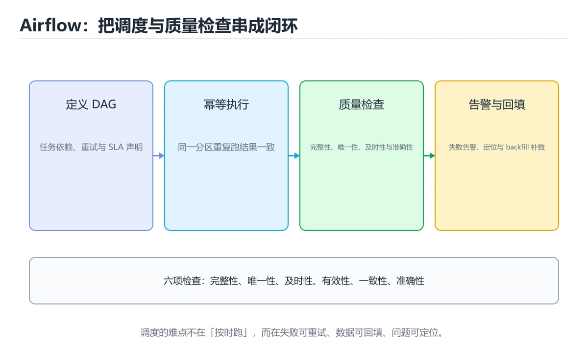
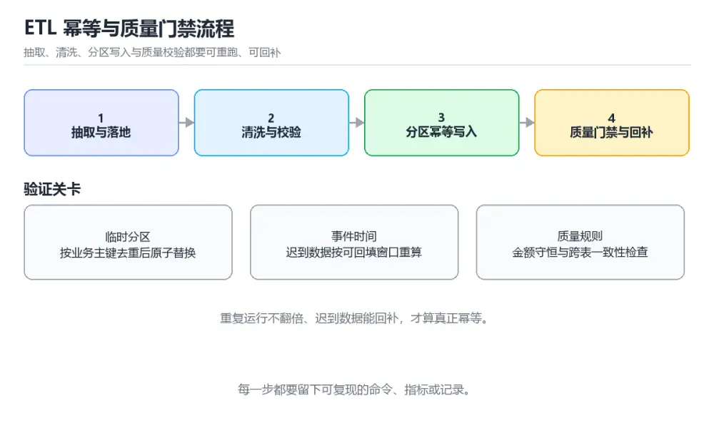

# 数据工程 ETL 与质量治理实战

> 内容更新时间：2026-10-06 · 学习阶段：高级 · 预计用时：60 分钟

> 项目定位：让每条数据都能回答从哪里来、何时处理、质量如何、失败后怎样安全重跑。
> 建议投入：18 小时
> 难度：进阶



## 本节知识框架

**课程定位**：所属分类 `project_practice`（项目实战），课程主题 `数据工程 ETL 与质量治理实战`，学习阶段 高级，建议用时 60 分钟。

本课主线：搭建可重跑、可观测、可追溯的数据管道，完成抽取、清洗、分区、质量门禁与回填。

**学完本课应当能够**
- 说清 `ETL` 与 `数据仓库` 的含义与区别，并各举一个正例和一个反例。
- 用本课示例验证 `Airflow` 的行为，记录输入、输出与失败条件。
- 遇到「重复运行后数据翻倍」这类问题时，能说出触发条件与修复顺序。

### 从概念到验证的学习链条

1. `ETL`：先掌握 抽取、转换、加载三段式流水线，把来源数据整理成分析可用的表，再用它解释 `数据仓库` 为什么会出现。
2. `数据仓库`：先掌握 面向分析、按主题组织并保留历史的数据存储，常见分层是原始层、清洗层、汇总层，再用它解释 `Airflow` 为什么会出现。
3. `Airflow`：先掌握 用 DAG 描述依赖并按调度时间触发任务的编排工具，负责重试与补数，再用它解释 `数据质量` 为什么会出现。
4. `数据质量`：先掌握 对完整性、唯一性、及时性、准确性等维度的可验证约束，不通过就阻断下游，再用它解释 `分区` 为什么会出现。
5. `分区`：先掌握 按日期等键把数据切成互不重叠的片段，便于增量处理和只重跑出错的那一天，再用它解释 `幂等回填` 为什么会出现。
6. `幂等回填`：先掌握 补算历史数据时重复执行同一批次仍得到相同结果，通常靠覆盖写或去重键保证，再用它解释 本课示例的观察结果 为什么会出现。

**先修与衔接**：本课是「项目实战」分类的第 18 课。先修内容：《实战：CSV 到 SQLite 的 ETL 流水线》、《数据湖与湖仓一体》、《Airflow 调度与数据质量》。《实战：CSV 到 SQLite 的 ETL 流水线》里的 `ETL`、`数据质量` 是本课的前提。《数据湖与湖仓一体》里的 `数据湖`、`Iceberg` 是本课的前提。相关或后续课程：《实时数仓：从 Kafka 到 Flink》、《大数据与批流处理》、《图解 Kafka 分区、副本与再平衡》。

### 完成判据

- **定义关**：不看正文也能说明 `ETL` 是 抽取、转换、加载三段式流水线，把来源数据整理成分析可用的表，并指出一个反例。
- **机制关**：能按“输入 → 转换 → 输出 → 验证”复述 `数据工程 ETL 与质量治理实战`，而不是只背结论。
- **示例关**：能运行或推演 `数据工程 ETL 与质量治理实战` 的 `text` 示例，并说明一个真实出现的标识符或字面量。
- **证据关**：能从 `数据工程 ETL 与质量治理实战` 的示例写出一个输入、处理、输出三元组，并说明它支持或反驳了本课的哪一条结论。
- **排错关**：能复现 重复运行后数据翻倍，记录现象并按 先写入临时分区，按业务主键去重并校验行数，再原子替换目标分区，同时记录每次批次元数据 修复。
- **迁移关**：能把 `ETL`、`数据仓库`、`Airflow`、`数据质量` 放进一个与 `数据工程 ETL 与质量治理实战` 不同的项目场景，并保持输入与验证条件可追踪。
- **复盘关**：学完 `数据工程 ETL 与质量治理实战` 后，用一句话写下仍然不确定的结论，并列出下一次验证需要的输入、环境和成功判据。

### 复习清单

- [ ] 能不看正文复述本课核心术语，并指出一个边界或反例。
- [ ] 能运行或推演本课示例，记录输入、输出与失败现象。
- [ ] 能完成一次自测，并把错题对照错误表定位原因。

## 核心概念定义

| 术语 | 操作性定义 | 常见边界与风险 |
| --- | --- | --- |
| ETL | 抽取、转换、加载三段式流水线，把来源数据整理成分析可用的表。 | 只在「抽取、转换、加载三段式流水线，把来源数据整理成分析可用的表」这一前提下成立，换输入或换环境要重新验证。 |
| 数据仓库 | 面向分析、按主题组织并保留历史的数据存储，常见分层是原始层、清洗层、汇总层。 | 只在「面向分析、按主题组织并保留历史的数据存储，常见分层是原始层、清洗层、汇总层」这一前提下成立，换输入或换环境要重新验证。 |
| Airflow | 用 DAG 描述依赖并按调度时间触发任务的编排工具，负责重试与补数。 | 不同版本与依赖组合的行为可能不同，升级或换环境前要按官方变更说明重新验证。 |
| 数据质量 | 对完整性、唯一性、及时性、准确性等维度的可验证约束，不通过就阻断下游。 | 只在「对完整性、唯一性、及时性、准确性等维度的可验证约束，不通过就阻断下游」这一前提下成立，换输入或换环境要重新验证。 |
| 分区 | 按日期等键把数据切成互不重叠的片段，便于增量处理和只重跑出错的那一天。 | 易错：重复运行后数据翻倍；正确做法是先写入临时分区，按业务主键去重并校验行数，再原子替换目标分区，同时记录每次批次元数据。 |
| 幂等回填 | 补算历史数据时重复执行同一批次仍得到相同结果，通常靠覆盖写或去重键保证。 | 只在「补算历史数据时重复执行同一批次仍得到相同结果，通常靠覆盖写或去重键保证」这一前提下成立，换输入或换环境要重新验证。 |

## 原理与运行机制

### 机制总览

**教材衔接：需求与约束**

| 维度 | 约束 |
| --- | --- |
| 幂等 | 同一日期任务重复执行后，目标分区结果与一次成功执行完全相同 |
| 可追溯 | 每批数据记录来源、处理时间、代码版本、行数与质量结果 |
| 质量 | 关键字段非空率 100%，主键唯一，金额与状态满足业务约束 |
| 恢复 | 单日回填不影响其他分区，失败任务可安全重试并留下审计记录 |

**教材衔接：架构与数据流**

抽取器把来源原样写入原始层并保存批次元数据；转换任务按日期读取原始分区，完成去重、类型转换和业务映射后原子替换清洗分区；质量检查在发布汇总层前运行，调度器负责依赖、重试、告警和回填。

```text
sources -> raw partition -> quality/clean -> curated
                  |              |
              metadata -> checks -> mart -> dashboard
```

**教材衔接：实施步骤**

### 里程碑 1：建立分层与批次元数据

先定义原始、清洗和汇总表结构及分区键，为每次运行记录批次标识、代码版本、来源游标和行数，保证问题发生时能定位输入。

### 里程碑 2：实现转换与质量门禁

按主键去重，统一时间、金额和枚举类型，再检查空值、范围、引用关系与行数波动；任一关键检查失败就停止发布并告警。

### 里程碑 3：完成回填与对账

选择一个日期范围重新执行，先在临时分区生成结果，检查通过后原子替换目标分区；对账脚本比较来源、清洗、汇总三层的关键指标。

**教材衔接：扩展任务**

- 加入数据血缘与列级影响分析
- 把批处理结果接入实时增量链路
- 建立数据契约并自动检测来源结构变更

**教材衔接：交付评审：评分表、决策记录与证据链**

### 一、「数据工程 ETL 与质量治理实战」的交付物评分表

| 交付物 | 权重 | 合格线 | 需要的证据 |
| --- | ---: | --- | --- |
| 分层模型与数据字典 | 25% | 能在干净环境复现，且失败路径有明确处理 | 命令与输出、对应测试、一次失败与恢复记录 |
| 调度任务和依赖图 | 25% | 能在干净环境复现，且失败路径有明确处理 | 命令与输出、对应测试、一次失败与恢复记录 |
| 质量规则、告警与阻断策略 | 25% | 能在干净环境复现，且失败路径有明确处理 | 命令与输出、对应测试、一次失败与恢复记录 |
| 幂等回填脚本和对账报告 | 25% | 能在干净环境复现，且失败路径有明确处理 | 命令与输出、对应测试、一次失败与恢复记录 |

### 二、需要写下来的决策（ADR）

| 决策点 | 本课给出的做法 | 备选方案 | 代价与回滚 |
| --- | --- | --- | --- |
| 里程碑 1：建立分层与批次元数据 | 先定义原始、清洗和汇总表结构及分区键，为每次运行记录批次标识、代码版本、来源游标和行数，保证问题发生时能定位输入。 | 不做「里程碑 1：建立分层与批次元数据」，沿用最朴素的实现（需要额外补一次对照实验） | 若「里程碑 1：建立分层与批次元数据」出问题，回到上一版本并按本课验收场景重跑 |
| 里程碑 2：实现转换与质量门禁 | 按主键去重，统一时间、金额和枚举类型，再检查空值、范围、引用关系与行数波动；任一关键检查失败就停止发布并告警。 | 不做「里程碑 2：实现转换与质量门禁」，沿用最朴素的实现（需要额外补一次对照实验） | 若「里程碑 2：实现转换与质量门禁」出问题，回到上一版本并按本课验收场景重跑 |
| 里程碑 3：完成回填与对账 | 选择一个日期范围重新执行，先在临时分区生成结果，检查通过后原子替换目标分区；对账脚本比较来源、清洗、汇总三层的关键指标。 | 不做「里程碑 3：完成回填与对账」，沿用最朴素的实现（需要额外补一次对照实验） | 若「里程碑 3：完成回填与对账」出问题，回到上一版本并按本课验收场景重跑 |
| 交付边界 | 搭建可重跑、可观测、可追溯的数据管道，完成抽取、清洗、分区、质量门禁与回填。 | 不做「交付边界」，沿用最朴素的实现（需要额外补一次对照实验） | 若「交付边界」出问题，回到上一版本并按本课验收场景重跑 |

### 三、「数据工程 ETL 与质量治理实战」的交付证据链

| # | 命令 | 这条命令要留下的证据 |
| ---: | --- | --- |
| 1 | `python -m etl.cli run --date=2026-10-05` | 完整输出、退出码、耗时，以及与「数据工程 ETL 与质量治理实战」验收口径的对应关系 |
| 2 | `python -m etl.cli quality --date=2026-10-05` | 完整输出、退出码、耗时，以及与「数据工程 ETL 与质量治理实战」验收口径的对应关系 |
| 3 | `python -m etl.cli backfill --start=2026-10-01 --end=2026-10-05` | 完整输出、退出码、耗时，以及与「数据工程 ETL 与质量治理实战」验收口径的对应关系 |
| 4 | `python -m etl.cli reconcile --date=2026-10-05` | 完整输出、退出码、耗时，以及与「数据工程 ETL 与质量治理实战」验收口径的对应关系 |
| 5 | `airflow dags test daily_orders 2026-10-05` | 完整输出、退出码、耗时，以及与「数据工程 ETL 与质量治理实战」验收口径的对应关系 |


### 五、评审记录模板

| 记录项 | 填写要求 |
| --- | --- |
| 项目标识 | `project_data_etl` |
| 本次范围 | 说明这一轮交付了「数据工程 ETL 与质量治理实战」的哪些部分 |
| 未完成项 | 列出与 ETL 相关但本轮未做的内容 |
| 证据位置 | 指向 evidence/ 目录下的具体文件 |
| 风险与回滚 | 写清剩余风险、回滚步骤和验证方式 |
| 结论 | 通过 / 有条件通过 / 不通过，三者选一 |

### 机制拆解：每一步的输入、动作与输出

#### 1. `ETL`
- 输入：`ETL`；本步把 抽取、转换、加载三段式流水线，把来源数据整理成分析可用的表 当作判断规则。
- 动作：围绕 `ETL` 保留中间状态，并记录它与 `数据仓库` 的对应关系。
- 输出：`数据仓库`，它可以被下一段代码、测试或记录继续使用。
- `ETL` 的失败条件：只在「抽取、转换、加载三段式流水线，把来源数据整理成分析可用的表」这一前提下成立，换输入或换环境要重新验证。

#### 2. `数据仓库`
- 输入：`ETL`；本步把 面向分析、按主题组织并保留历史的数据存储，常见分层是原始层、清洗层、汇总层 当作判断规则。
- 动作：围绕 `数据仓库` 保留中间状态，并记录它与 `Airflow` 的对应关系。
- 输出：`Airflow`，它可以被下一段代码、测试或记录继续使用。
- `数据仓库` 的失败条件：只在「面向分析、按主题组织并保留历史的数据存储，常见分层是原始层、清洗层、汇总层」这一前提下成立，换输入或换环境要重新验证。

#### 3. `Airflow`
- 输入：`数据仓库`；本步把 用 DAG 描述依赖并按调度时间触发任务的编排工具，负责重试与补数 当作判断规则。
- 动作：围绕 `Airflow` 保留中间状态，并记录它与 `数据质量` 的对应关系。
- 输出：`数据质量`，它可以被下一段代码、测试或记录继续使用。
- `Airflow` 的失败条件：不同版本与依赖组合的行为可能不同，升级或换环境前要按官方变更说明重新验证。

#### 4. `数据质量`
- 输入：`Airflow`；本步把 对完整性、唯一性、及时性、准确性等维度的可验证约束，不通过就阻断下游 当作判断规则。
- 动作：围绕 `数据质量` 保留中间状态，并记录它与 `分区` 的对应关系。
- 输出：`分区`，它可以被下一段代码、测试或记录继续使用。
- `数据质量` 的失败条件：只在「对完整性、唯一性、及时性、准确性等维度的可验证约束，不通过就阻断下游」这一前提下成立，换输入或换环境要重新验证。

#### 5. `分区`
- 输入：`数据质量`；本步把 按日期等键把数据切成互不重叠的片段，便于增量处理和只重跑出错的那一天 当作判断规则。
- 动作：围绕 `分区` 保留中间状态，并记录它与 `幂等回填` 的对应关系。
- 输出：`幂等回填`，它可以被下一段代码、测试或记录继续使用。
- `分区` 的失败条件：当重复运行后数据翻倍时，会出现重复运行后数据翻倍。

#### 6. `幂等回填`
- 输入：`分区`；本步把 补算历史数据时重复执行同一批次仍得到相同结果，通常靠覆盖写或去重键保证 当作判断规则。
- 动作：围绕 `幂等回填` 保留中间状态，并记录它与 `本课示例的最终结果` 的对应关系。
- 输出：`本课示例的最终结果`，它可以被下一段代码、测试或记录继续使用。
- `幂等回填` 的失败条件：只在「补算历史数据时重复执行同一批次仍得到相同结果，通常靠覆盖写或去重键保证」这一前提下成立，换输入或换环境要重新验证。

### 复现实验记录

- 环境：`数据工程 ETL 与质量治理实战` 使用 `text` 示例，固定 `ETL`、`数据仓库`、`Airflow`、`数据质量` 作为第一组条件。
- 首轮输入：从示例中的第一个输入开始，预测 `ETL` 会怎样变化。
- 基线观察：记录命令、输入、输出和错误原文，不用截图代替可复制的文本。
- 单变量修改：只改变 `ETL`，观察 `幂等回填` 是否仍满足定义。
- 失败注入：复现 重复运行后数据翻倍，确认现象是 重复运行后数据翻倍。
- 记录结论：把“修改前、修改后、预期变化、实际变化”写成四列表，这样复盘 `数据工程 ETL 与质量治理实战` 时才能区分概念错误与实现错误。

## 典型应用场景

**教材衔接：项目背景**

业务数据分散在接口、文件与数据库中，手工清洗导致重复、迟到和口径不一致；一旦任务失败，团队不敢重跑，只能翻旧文件修补。本实战实现一条按日期分区的批处理管道，把原始层、清洗层和汇总层分开，使用调度器编排依赖，加入质量门禁、告警和可重复回填。

**教材衔接：项目交付物**

- 分层模型与数据字典
- 调度任务和依赖图
- 质量规则、告警与阻断策略
- 幂等回填脚本和对账报告



**教材衔接：零基础精讲：把数据工程 ETL 与质量治理实战真正讲透**

### 先建立一个直觉

ETL 的交付标准是可重跑、可回补、可追溯：每一层都留下分区、位点与质量报告。
落到本课，「数据工程 ETL 与质量治理实战」关心的是 ETL 与 数据仓库 的配合，也就是说这条直觉要在 项目背景 里被具体验证。

本课的摘要可以当作一张地图：搭建可重跑、可观测、可追溯的数据管道，完成抽取、清洗、分区、质量门禁与回填。

### 逐步拆解

1. 澄清输入与目标。先写清「数据工程 ETL 与质量治理实战」要解决的问题、合法输入范围和成功标准，再进入后续步骤。
2. 描述处理过程。把「ETL、数据仓库、Airflow、数据质量、分区、幂等回填」映射到具体步骤，每步都要求能单独验证。
3. 定义输出。ETL 的输出不仅包括正常结果，还包括错误码、日志和资源释放状态。
4. 制造一次数据仓库的失败输入，确认错误出现在「项目背景」的哪一步，并写下恢复后如何验证状态已回到一致。
5. 把 daily_orders 的规模缩小到一眼能算清的程度，手动推导结果后再用程序验证，差异处就是理解漏洞。

### 把正文串成一条执行链

- **里程碑 1：建立分层与批次元数据**：在「数据工程 ETL 与质量治理实战」里，「里程碑 1：建立分层与批次元数据」这一步要先写清输入与预期，再记录实际结果和差异；结果不符时回到对应小节核对前提。
- **里程碑 2：实现转换与质量门禁**：在「数据工程 ETL 与质量治理实战」里，「里程碑 2：实现转换与质量门禁」这一步要先写清输入与预期，再记录实际结果和差异；结果不符时回到对应小节核对前提。
- **里程碑 3：完成回填与对账**：在「数据工程 ETL 与质量治理实战」里，「里程碑 3：完成回填与对账」这一步要先写清输入与预期，再记录实际结果和差异；结果不符时回到对应小节核对前提。
- **现场 1：重复运行后数据翻倍**：在「数据工程 ETL 与质量治理实战」里，「现场 1：重复运行后数据翻倍」这一步要先写清输入与预期，再记录实际结果和差异；结果不符时回到对应小节核对前提。
- **现场 2：迟到数据没有进入汇总**：在「数据工程 ETL 与质量治理实战」里，「现场 2：迟到数据没有进入汇总」这一步要先写清输入与预期，再记录实际结果和差异；结果不符时回到对应小节核对前提。
- **现场 3：质量检查通过但报表口径错误**：在「数据工程 ETL 与质量治理实战」里，「现场 3：质量检查通过但报表口径错误」这一步要先写清输入与预期，再记录实际结果和差异；结果不符时回到对应小节核对前提。

### 从测验反推易错点

**检查点 1：数据仓库为什么要区分原始层、清洗层和汇总层？**

- 参考判断：保留来源证据，把清洗与业务口径解耦，便于重跑和排查
- 解析：原始层尽量保留来源数据和批次信息，清洗层负责类型统一、去重和规范化，汇总层承载面向业务的指标口径。分层后出现错误时，可以从任意一层重跑而不用重新拉取所有来源，也能看清问题是输入变化还是转换逻辑变化。分层不是越多越好，但边界必须清晰。每层都要保留可重复生成的口径说明。
- 自问：如果去掉题干里的一个限定词，结论还成立吗？

- 参考判断：学习 ETL 时要同时说明输入、输出和失败路径，不能只看正常流程、验证 数据仓库 时要固定版本并覆盖边界输入，结论才可复现
- 解析：本课把数据工程 ETL 与质量治理实战拆成概念、示例与故障现场三部分，因此判断 ETL 时必须同时交代输入、输出和失败路径，这使“学习 ETL 时要同时说明输入、输出和失败路径，不能只看正常流程”成立；在数据工程 ETL 与质量治理实战里，判断 数据仓库 时要固定版本与边界输入，所以“验证 数据仓库 时要固定版本并覆盖边界输入，结论才可复现”才可复现。相反，“只要 ETL 的常规示例通过，就可以跳过边界与异常路径”把一次正常示例当成全部情况，会漏掉本课的边界缺陷；“把 数据仓库 的单次运行结果当成所有版本和规模都成立”把单次结果外推成普遍结论，在数据工程 ETL 与质量治理实战里忽略了版本和规模变化。对照本课的故障现场与自测清单，就能用证据区分这两种判断。

- 参考判断：固定版本与证据，把本课的结论写成可复现记录
- 解析：在本课的练习里，顺序应当是：先明确 ETL 的输入、输出与约束 → 写出最小示例并核对 数据仓库 的基线结果 → 只改一个变量，记录边界与失败路径的变化 → 固定版本与证据，把本课的结论写成可复现记录。这个顺序把 ETL 的输入、输出和约束放在最前面，在数据工程 ETL 与质量治理实战里避免概念没对齐就开始调参。第二步用 数据仓库 建立可核对的基线，在数据工程 ETL 与质量治理实战里第三步才允许改变一个变量并观察失败路径。最后一步把本课的版本、证据与结论固定下来，别人才能复现同样的结果。

- 参考判断：默认参数 bucket=[] 只在定义时创建一次，两次调用共享同一个列表。

### 工程排错顺序

| 先查什么 | 要得到的证据 | 判断标准 |
| --- | --- | --- |
| 用户、范围与验收标准是否写清？ | 日志、输入样例、测试或指标 | 能复现并解释，才算定位 |
| 每阶段是否有可运行增量？ | 日志、输入样例、测试或指标 | 能复现并解释，才算定位 |
| 测试、监控和回滚是否随功能一起交付？ | 日志、输入样例、测试或指标 | 能复现并解释，才算定位 |
| 复盘是否形成下一轮改进项？ | 日志、输入样例、测试或指标 | 能复现并解释，才算定位 |

### 变式训练

1. 把 ETL 的实现压缩到一个进程内，去掉所有外部依赖后再谈扩展。
2. 扩大 数据仓库 的规模，记录本课结论在哪一个量级开始不成立。
3. 让 daily_orders 的外部依赖超时，确认系统能回滚或补偿，而不是留下脏数据。
5. 把「数据工程 ETL 与质量治理实战」里最容易被省略的一步去掉，用测试或指标证明它不可省略，而不是凭感觉判断。
6. 限制 CPU 与内存上限后重跑 daily_orders，观察哪一项参数需要重新设定。


### 迁移案例库

下面用不同约束重复同一套方法，每轮只改变 ETL 的一个取值并记录结论。


#### 迁移案例 2：围绕「数据仓库」做一次小实验

**步骤**：
1. 复述当前方案对「数据仓库」的假设，写成一句可证伪的话。


#### 迁移案例 4：围绕「数据质量」做一次小实验

**步骤**：
1. 复述当前方案对「数据质量」的假设，写成一句可证伪的话。

#### 迁移案例 5：围绕「分区」做一次小实验

**步骤**：
1. 复述当前方案对「分区」的假设，写成一句可证伪的话。

#### 迁移案例 6：围绕「幂等回填」做一次小实验

**步骤**：
1. 复述当前方案对「幂等回填」的假设，写成一句可证伪的话。

#### 迁移案例 7：围绕「ETL」做一次小实验

**步骤**：

#### 迁移案例 8：围绕「数据仓库」做一次小实验

**步骤**：

#### 迁移案例 9：围绕「Airflow」做一次小实验

**步骤**：

#### 迁移案例 10：围绕「数据质量」做一次小实验

**步骤**：

#### 迁移案例 11：围绕「分区」做一次小实验

**步骤**：

#### 迁移案例 12：围绕「幂等回填」做一次小实验

**步骤**：

#### 迁移案例 13：围绕「ETL」做一次小实验

**步骤**：

#### 迁移案例 14：围绕「数据仓库」做一次小实验

**步骤**：

#### 迁移案例 15：围绕「Airflow」做一次小实验

**步骤**：

#### 迁移案例 16：围绕「数据质量」做一次小实验

**步骤**：

<!-- p0-depth-v2:end -->

**教材衔接：项目专属规格**

### 交付边界

搭建可重跑、可观测、可追溯的数据管道，完成抽取、清洗、分区、质量门禁与回填。 项目交付不是一份说明文档，而是一组可以运行的命令、可检查的输入输出、失败处理和复盘证据。范围必须同时写明本阶段做什么、不做什么，以及哪些依赖属于外部前提。

### 最小数据模型

| 对象 | 关键字段 | 约束 |
| --- | --- | --- |
| 输入实体 | ETL、来源、时间、版本 | 必填、可校验、可追溯到原始输入 |
| 任务实体 | 状态、优先级、执行标识、重试次数 | 状态迁移合法、重复执行不会产生重复副作用 |
| 结果实体 | 输出、错误码、耗时、资源指标 | 可序列化、可比较、失败原因可解释 |
| 审计记录 | 操作者、动作、批次、结果、时间 | 不记录敏感信息、可查询、可复核 |

### 验收场景

1. 正常路径：让 daily_orders 从输入走到输出，记录每一步的产物。
2. 边界路径：把 daily_orders 的输入推到上下限，确认返回值与错误都可解释。
3. 失败路径：让 ETL 的依赖超时或中途断开，验证能快速止损并说明恢复动作。
4. 幂等路径：把 ETL 的同一请求执行两次，业务结果与资源状态保持一致。
5. 回滚路径：把 ETL 退回上一稳定状态，并验证数据、配置与资源没有残留。

### 证据清单

- 一条从干净环境开始的可复现命令，以及真实输出。
- 一份正常、边界、失败与幂等场景的测试矩阵。
- 一组修改前后的 数据仓库 指标，包含测量方法和环境说明。
- 一份故障时间线、根因、修复动作、回滚耗时和后续改进项。

### 完成定义

让 数据仓库 的风险登记与测试保持同步，避免只存在于对话里的约定。

- **重复运行后数据翻倍**：典型现象是重复运行后数据翻倍；正确做法是先写入临时分区，按业务主键去重并校验行数，再原子替换目标分区，同时记录每次批次元数据。
- **迟到数据没有进入汇总**：典型现象是迟到数据没有进入汇总；正确做法是同时维护事件时间与处理时间，按可回填窗口重新计算受影响分区，并监控迟到数据比例。
- **质量检查通过但报表口径错误**：典型现象是质量检查通过但报表口径错误；正确做法是补充金额守恒、状态流转、引用完整性和历史波动检查，严重问题阻断发布，轻微异常进入隔离表。

### 最小验证场景

- 准备：保留 `text` 示例的原始输入，先记录 `数据工程 ETL 与质量治理实战` 的基线输出和完整运行命令。
- 判定：新结果与 `数据工程 ETL 与质量治理实战` 的基线不同不等于错误；只有当差异破坏了 `ETL` 的定义或错误表中的约束，才判定为失败。

### 选择与边界

- 使用 `ETL` 时，先满足它的定义：抽取、转换、加载三段式流水线，把来源数据整理成分析可用的表；只在「抽取、转换、加载三段式流水线，把来源数据整理成分析可用的表」这一前提下成立，换输入或换环境要重新验证。
- 使用 `数据仓库` 时，先满足它的定义：面向分析、按主题组织并保留历史的数据存储，常见分层是原始层、清洗层、汇总层；只在「面向分析、按主题组织并保留历史的数据存储，常见分层是原始层、清洗层、汇总层」这一前提下成立，换输入或换环境要重新验证。
- 使用 `Airflow` 时，先满足它的定义：用 DAG 描述依赖并按调度时间触发任务的编排工具，负责重试与补数；不同版本与依赖组合的行为可能不同，升级或换环境前要按官方变更说明重新验证。
- 使用 `数据质量` 时，先满足它的定义：对完整性、唯一性、及时性、准确性等维度的可验证约束，不通过就阻断下游；只在「对完整性、唯一性、及时性、准确性等维度的可验证约束，不通过就阻断下游」这一前提下成立，换输入或换环境要重新验证。
- 使用 `分区` 时，先满足它的定义：按日期等键把数据切成互不重叠的片段，便于增量处理和只重跑出错的那一天；易错：重复运行后数据翻倍；正确做法是先写入临时分区，按业务主键去重并校验行数，再原子替换目标分区，同时记录每次批次元数据。

## 代码/协议/SQL 示例

**教材衔接：验证命令与预期输出**

在 数据工程 ETL 与质量治理实战 的仓库根目录执行以下命令，确认核心链路可以运行。

```bash
python -m etl.cli run --date=2026-10-05
python -m etl.cli quality --date=2026-10-05
python -m etl.cli backfill --start=2026-10-01 --end=2026-10-05
python -m etl.cli reconcile --date=2026-10-05
airflow dags test daily_orders 2026-10-05
```

**预期输出**：首次运行和重复运行得到相同分区行数与指标；质量检查全部通过；回填只修改指定日期；对账脚本显示来源、清洗和汇总层的订单数与金额差异在允许阈值内。

### 示例精读：先找证据，再改一个条件

- 在 `数据工程 ETL 与质量治理实战` 中与 `ETL` 对照：示例必须能支持 抽取、转换、加载三段式流水线，把来源数据整理成分析可用的表，否则说明这一段还缺少实现或验证步骤。
- 在 `数据工程 ETL 与质量治理实战` 中与 `数据仓库` 对照：示例必须能支持 面向分析、按主题组织并保留历史的数据存储，常见分层是原始层、清洗层、汇总层，否则说明这一段还缺少实现或验证步骤。
- 在 `数据工程 ETL 与质量治理实战` 中与 `Airflow` 对照：示例必须能支持 用 DAG 描述依赖并按调度时间触发任务的编排工具，负责重试与补数，否则说明这一段还缺少实现或验证步骤。
- 在 `数据工程 ETL 与质量治理实战` 中与 `数据质量` 对照：示例必须能支持 对完整性、唯一性、及时性、准确性等维度的可验证约束，不通过就阻断下游，否则说明这一段还缺少实现或验证步骤。
- `数据工程 ETL 与质量治理实战` 的示例没有抽取到函数调用或字面量；按行记录输入、控制流和输出，避免只背代码外形。

## 时间/空间复杂度或性能分析

**性能关注点（数据工程 ETL 与质量治理实战）**：项目类课程看端到端指标：记录构建时间、接口延迟与资源占用。

**测量方法**：以 `数据工程 ETL 与质量治理实战` 的 `ETL` 场景为对象，固定输入跑一遍记录基线，再把规模或并发度提高一个数量级复测；两次结果的差值与波动范围才是结论依据。

### 需要控制的变量与记录项

- `数据工程 ETL 与质量治理实战` 的 `ETL`：固定它的版本、输入范围和资源上限，分别记录速度、内存与失败率的变化。
- `数据工程 ETL 与质量治理实战` 的 `数据仓库`：固定它的版本、输入范围和资源上限，分别记录速度、内存与失败率的变化。
- `数据工程 ETL 与质量治理实战` 的 `Airflow`：固定它的版本、输入范围和资源上限，分别记录速度、内存与失败率的变化。
- `数据工程 ETL 与质量治理实战` 的 `数据质量`：固定它的版本、输入范围和资源上限，分别记录速度、内存与失败率的变化。
- `数据工程 ETL 与质量治理实战` 的 `分区`：固定它的版本、输入范围和资源上限，分别记录速度、内存与失败率的变化。
- `数据工程 ETL 与质量治理实战` 中 `ETL` 的边界：只在「抽取、转换、加载三段式流水线，把来源数据整理成分析可用的表」这一前提下成立，换输入或换环境要重新验证。达到边界时不要外推，必须重新测量。
- `数据工程 ETL 与质量治理实战` 中 `数据仓库` 的边界：只在「面向分析、按主题组织并保留历史的数据存储，常见分层是原始层、清洗层、汇总层」这一前提下成立，换输入或换环境要重新验证。达到边界时不要外推，必须重新测量。
- `数据工程 ETL 与质量治理实战` 中 `Airflow` 的边界：不同版本与依赖组合的行为可能不同，升级或换环境前要按官方变更说明重新验证。达到边界时不要外推，必须重新测量。
- `数据工程 ETL 与质量治理实战` 中 `数据质量` 的边界：只在「对完整性、唯一性、及时性、准确性等维度的可验证约束，不通过就阻断下游」这一前提下成立，换输入或换环境要重新验证。达到边界时不要外推，必须重新测量。
- `数据工程 ETL 与质量治理实战` 中 `分区` 的边界：易错：重复运行后数据翻倍；正确做法是先写入临时分区，按业务主键去重并校验行数，再原子替换目标分区，同时记录每次批次元数据。达到边界时不要外推，必须重新测量。

## 常见误区与易错点

| 容易写错的做法 | 实际现象 | 原因与正确做法 |
| --- | --- | --- |
| 重复运行后数据翻倍 | 重复运行后数据翻倍。 | 先写入临时分区，按业务主键去重并校验行数，再原子替换目标分区，同时记录每次批次元数据。 |
| 迟到数据没有进入汇总 | 迟到数据没有进入汇总。 | 同时维护事件时间与处理时间，按可回填窗口重新计算受影响分区，并监控迟到数据比例。 |
| 质量检查通过但报表口径错误 | 质量检查通过但报表口径错误。 | 补充金额守恒、状态流转、引用完整性和历史波动检查，严重问题阻断发布，轻微异常进入隔离表。 |

### 现场 1：重复运行后数据翻倍

**症状**：重复运行后数据翻倍。

**根因与修复**：先写入临时分区，按业务主键去重并校验行数，再原子替换目标分区，同时记录每次批次元数据。

**自检**：在本课示例里复现「重复运行后数据翻倍」，改成先写入临时分区，按业务主键去重并校验行数，再原子替换目标分区，同时记录每次批次元数据后重跑；如果症状消失且失败路径按预期变化，说明定位正确。

### 现场 2：迟到数据没有进入汇总

**症状**：迟到数据没有进入汇总。

**根因与修复**：同时维护事件时间与处理时间，按可回填窗口重新计算受影响分区，并监控迟到数据比例。

**自检**：在本课示例里复现「迟到数据没有进入汇总」，改成同时维护事件时间与处理时间，按可回填窗口重新计算受影响分区，并监控迟到数据比例后重跑；如果症状消失且失败路径按预期变化，说明定位正确。

### 现场 3：质量检查通过但报表口径错误

**症状**：质量检查通过但报表口径错误。

**根因与修复**：补充金额守恒、状态流转、引用完整性和历史波动检查，严重问题阻断发布，轻微异常进入隔离表。

**自检**：在本课示例里复现「质量检查通过但报表口径错误」，改成补充金额守恒、状态流转、引用完整性和历史波动检查，严重问题阻断发布，轻微异常进入隔离表后重跑；如果症状消失且失败路径按预期变化，说明定位正确。

## 与其他知识点的关系

| 关系 | 课程 | 为什么 |
| --- | --- | --- |
| 先修 | 《实战：CSV 到 SQLite 的 ETL 流水线》 | 本课会直接使用它的概念或操作前提。 |
| 先修 | 《数据湖与湖仓一体》 | 本课会直接使用它的概念或操作前提。 |
| 先修 | 《Airflow 调度与数据质量》 | 本课会直接使用它的概念或操作前提。 |
| 关联 | 《实时数仓：从 Kafka 到 Flink》 | 用于横向比较或把本课结论迁移到相邻主题。 |
| 关联 | 《大数据与批流处理》 | 用于横向比较或把本课结论迁移到相邻主题。 |
| 关联 | 《图解 Kafka 分区、副本与再平衡》 | 用于横向比较或把本课结论迁移到相邻主题。 |
| 前置顺序 | 《DevOps CI/CD 流水线实战》 | 同分类中安排在本课之前，建议先完成其自测。 |

**教材衔接：复习与迁移**

### 概念复述

- 用一句话说明「数据工程 ETL 与质量治理实战」解决什么问题：搭建可重跑、可观测、可追溯的数据管道，完成抽取、清洗、分区、质量门禁与回填。
- 写出ETL、数据仓库、Airflow之间的关系，并各举一个例子。
- 说出本课最容易混淆的两个概念，以及区分它们的判据。

### 正文逐节复核

- **架构与数据流**：抽取器把来源原样写入原始层并保存批次元数据；转换任务按日期读取原始分区，完成去重、类型转换和业务映射后原子替换清洗分区；质量检查在发布汇总层前运行，调度器负责依赖、重试、告警和回填。
- **实施步骤**：先定义原始、清洗和汇总表结构及分区键，为每次运行记录批次标识、代码版本、来源游标和行数，保证问题发生时能定位输入。
- **零基础精讲：把数据工程 ETL 与质量治理实战真正讲透**：本课的摘要可以当作一张地图：搭建可重跑、可观测、可追溯的数据管道，完成抽取、清洗、分区、质量门禁与回填。
- **项目专属规格**：搭建可重跑、可观测、可追溯的数据管道，完成抽取、清洗、分区、质量门禁与回填。


### 迁移练习

- **先修**：`实战：CSV 到 SQLite 的 ETL 流水线`、`数据湖与湖仓一体`、`Airflow 调度与数据质量`。本课默认这些内容已经掌握。
- **相关或后续**：`实时数仓：从 Kafka 到 Flink`、`大数据与批流处理`、`图解 Kafka 分区、副本与再平衡`。本课术语会在这些课程里继续使用。
- **术语归属**：`ETL`、`数据仓库`、`Airflow` 的定义以本课「核心概念定义」为准，换到其他课程时先确认定义是否被改写。

### 先修与后续术语接口

- `实战：CSV 到 SQLite 的 ETL 流水线`：共享术语 `ETL`、`数据质量`，共同关键词 `ETL`、`数据质量`。
- `大数据与批流处理`：共享术语 `数据质量`，共同关键词 `数据质量`。
- `Airflow 调度与数据质量`：共享术语 `数据质量`，共同关键词 `Airflow`、`数据质量`。
- `数据湖与湖仓一体`：两者通过本分类的学习顺序衔接，阅读时重点比较各自的输入与失败条件。
- `实时数仓：从 Kafka 到 Flink`：两者通过本分类的学习顺序衔接，阅读时重点比较各自的输入与失败条件。

### 容易混淆的相邻概念

- `ETL` 与 `数据仓库`：前者强调 抽取、转换、加载三段式流水线，把来源数据整理成分析可用的表；后者强调 面向分析、按主题组织并保留历史的数据存储，常见分层是原始层、清洗层、汇总层。判断时分别检查两条定义的适用范围，不要只看名称相似就互换。
- `数据仓库` 与 `Airflow`：前者强调 面向分析、按主题组织并保留历史的数据存储，常见分层是原始层、清洗层、汇总层；后者强调 用 DAG 描述依赖并按调度时间触发任务的编排工具，负责重试与补数。判断时分别检查两条定义的适用范围，不要只看名称相似就互换。
- `Airflow` 与 `数据质量`：前者强调 用 DAG 描述依赖并按调度时间触发任务的编排工具，负责重试与补数；后者强调 对完整性、唯一性、及时性、准确性等维度的可验证约束，不通过就阻断下游。判断时分别检查两条定义的适用范围，不要只看名称相似就互换。
- `数据质量` 与 `分区`：前者强调 对完整性、唯一性、及时性、准确性等维度的可验证约束，不通过就阻断下游；后者强调 按日期等键把数据切成互不重叠的片段，便于增量处理和只重跑出错的那一天。判断时分别检查两条定义的适用范围，不要只看名称相似就互换。
- `分区` 与 `幂等回填`：前者强调 按日期等键把数据切成互不重叠的片段，便于增量处理和只重跑出错的那一天；后者强调 补算历史数据时重复执行同一批次仍得到相同结果，通常靠覆盖写或去重键保证。判断时分别检查两条定义的适用范围，不要只看名称相似就互换。

## 自测题与参考答案

> 先独立作答，再对照参考答案；答案都能在本课正文、术语表或错误表里找到依据。

### 自测 1（概念复述）

不看正文，写出 `ETL` 的操作性定义，并说明它与 `数据仓库` 的区别。

**参考答案**：抽取、转换、加载三段式流水线，把来源数据整理成分析可用的表。

`数据仓库` 的定位是：面向分析、按主题组织并保留历史的数据存储，常见分层是原始层、清洗层、汇总层；两者的差别要从适用对象与失败模式上说明。

### 自测 2（排错）

本课错误表记录了「重复运行后数据翻倍」这类做法。请写出它会出现的现象、根因，以及修复顺序。

**参考答案**：现象是重复运行后数据翻倍；正确做法是先写入临时分区，按业务主键去重并校验行数，再原子替换目标分区，同时记录每次批次元数据。修复时先复现现象并保留证据，再改动一处假设重跑，确认现象消失。

### 自测 3（动手验证）

运行本课的 `text` 示例，改动其中一个输入后重新运行，记录输出与错误信息。

**参考答案**：正常输入下 `text` 示例应当复现正文给出的结果；改动输入后，如果结果改变或报错，先核对它是否满足 `数据工程 ETL 与质量治理实战` 中`ETL` 的适用范围，再检查错误表里是否有同类现象。

### 自测 4（代码阅读）

阅读本课开头的 `text` 示例，说明它体现了`ETL` 的哪一条性质，并指出改动哪个输入会让这条性质不再成立。

**参考答案**：`ETL` 的定义是 抽取、转换、加载三段式流水线，把来源数据整理成分析可用的表，示例正是在实现这条定义。改动与 `ETL` 有关的一个输入后，如果结果不再符合 `数据工程 ETL 与质量治理实战` 的正文描述，就说明该性质只在当前前提成立。

### 自测 5（迁移）

把 `数据工程 ETL 与质量治理实战` 的方法迁移到自己的项目：围绕 `ETL` 写出一个与错误表同类的风险点，并说明触发条件和检验方式。

**参考答案**：例如「质量检查通过但报表口径错误」，它会导致质量检查通过但报表口径错误；检验方式是按补充金额守恒、状态流转、引用完整性和历史波动检查，严重问题阻断发布，轻微异常进入隔离表改一处再复现，确认现象消失且没有引入新的失败分支。

### 自测 6（对比）

用一个表格对比 `ETL` 与 `数据仓库`：各写一行适用场景、一行失败表现。

**参考答案**：`ETL` 的定义是抽取、转换、加载三段式流水线，把来源数据整理成分析可用的表；`数据仓库` 的定义是面向分析、按主题组织并保留历史的数据存储，常见分层是原始层、清洗层、汇总层。两者的失败表现分别对应本课错误表里与本术语相关的行。

### 自测 7（排错顺序）

面对「重复运行后数据翻倍」引发的问题，请把“复现 重复运行后数据翻倍 → 保留证据 → 先写入临时分区，按业务主键去重并校验行数，再原子替换目标分区，同时记录每次批次元数据 → 回归验证”四步写成可执行的检查清单。

**参考答案**：第一步按重复运行后数据翻倍复现；第二步记录输入、版本与完整报错；第三步按先写入临时分区，按业务主键去重并校验行数，再原子替换目标分区，同时记录每次批次元数据只改一处；第四步重跑并确认失败路径也按预期变化。

### 自测 8（边界判断）

针对 `幂等回填`，分别写出“可以使用”的条件和“结论不再成立”的条件。

**参考答案**：只在「补算历史数据时重复执行同一批次仍得到相同结果，通常靠覆盖写或去重键保证」这一前提下成立，换输入或换环境要重新验证。 同时要把 `幂等回填` 的定义 补算历史数据时重复执行同一批次仍得到相同结果，通常靠覆盖写或去重键保证 与实际输入逐项对照。

### 自测 9（机制重建）

不看正文，按输入、转换、输出、验证四段重建 `ETL` → `数据仓库` → `Airflow` → `数据质量` 的作用链。

**参考答案**：起点是 `ETL` 的定义 抽取、转换、加载三段式流水线，把来源数据整理成分析可用的表；中间每一步都保留可观察状态；终点由 `幂等回填` 检查，失败时回到错误表定位第一个偏离定义的步骤。

### 自测 10（综合排错）

在 `数据工程 ETL 与质量治理实战` 中，现象是 质量检查通过但报表口径错误。请围绕 质量检查通过但报表口径错误 写出最小复现、关键证据、修复动作和回归验证，并说明为什么不能只凭一次运行下结论。

**参考答案**：先复现 质量检查通过但报表口径错误，记录输入与完整错误；再按 补充金额守恒、状态流转、引用完整性和历史波动检查，严重问题阻断发布，轻微异常进入隔离表 只改一处。回归时同时跑正常路径和边界路径，只有两次结果都可解释，才把修复视为完成。

### 自测 11（一分钟复述）

用每分钟约 200 字的速度复述 `数据工程 ETL 与质量治理实战`：先给主问题，再按顺序说出 `ETL`、`数据仓库`、`Airflow`、`数据质量`，最后给一个失败案例。

**自评标准**：主问题必须对应 搭建可重跑、可观测、可追溯的数据管道，完成抽取、清洗、分区、质量门禁与回填；每个术语都要能接上一句定义或边界；失败案例必须写成可观察现象，不能用“可能有风险”代替证据。

## 术语速查

| 术语 | 一句话说明 |
| --- | --- |
| `ETL` | 抽取、转换、加载三段式流水线，把来源数据整理成分析可用的表。 |
| `数据仓库` | 面向分析、按主题组织并保留历史的数据存储，常见分层是原始层、清洗层、汇总层。 |
| `Airflow` | 用 DAG 描述依赖并按调度时间触发任务的编排工具，负责重试与补数。 |
| `数据质量` | 对完整性、唯一性、及时性、准确性等维度的可验证约束，不通过就阻断下游。 |
| `分区` | 按日期等键把数据切成互不重叠的片段，便于增量处理和只重跑出错的那一天。 |
| `幂等回填` | 补算历史数据时重复执行同一批次仍得到相同结果，通常靠覆盖写或去重键保证。 |

**术语关系**：`ETL`（抽取、转换、加载三段式流水线） → `数据仓库`（面向分析、按主题组织并保留历史的数据存储） → `Airflow`（用 DAG 描述依赖并按调度时间触发任务的编排工具） → `数据质量`（对完整性、唯一性、及时性、准确性等维度的可验证约束）。

## 考点精讲

`数据工程 ETL 与质量治理实战` 的题库有 5 道题，下面逐题给出题干、正确项与判断依据：先自己作答，再核对正确项，最后回到正文对应小节复核。

### 考点 1：第 1 题

- **题目**：数据仓库为什么要区分原始层、清洗层和汇总层？
- **正确项**：保留来源证据，把清洗与业务口径解耦，便于重跑和排查
- **判断依据**：这道题落在术语 `数据仓库` 上：面向分析、按主题组织并保留历史的数据存储，常见分层是原始层、清洗层、汇总层。复习时把 `数据仓库` 的定义、适用边界和一个反例一起说清楚，再回到「核心概念定义」核对原文。

### 考点 2：第 2 题

- **题目**：围绕“数据工程 ETL 与质量治理实战”中的 ETL、数据仓库、Airflow，下列哪两项是本课强调的实践判断？
- **正确项**：学习 ETL 时要同时说明输入、输出和失败路径，不能只看正常流程；验证 数据仓库 时要固定版本并覆盖边界输入，结论才可复现
- **判断依据**：这道题落在术语 `ETL` 上：抽取、转换、加载三段式流水线，把来源数据整理成分析可用的表。复习时把 `ETL` 的定义、适用边界和一个反例一起说清楚，再回到「核心概念定义」核对原文。

### 考点 3：第 3 题

- **题目**：按“数据工程 ETL 与质量治理实战”中 ETL、数据仓库、Airflow 的实践顺序，把四个步骤排成从准备到复盘的合理顺序。
- **正确项**：先明确 ETL 的输入、输出与约束 → 写出最小示例并核对 数据仓库 的基线结果 → 只改一个变量，记录边界与失败路径的变化 → 固定版本与证据，把“数据工程 ETL 与质量治理实战”的结论写成可复现记录
- **判断依据**：这道题落在术语 `ETL` 上：抽取、转换、加载三段式流水线，把来源数据整理成分析可用的表。复习时把 `ETL` 的定义、适用边界和一个反例一起说清楚，再回到「核心概念定义」核对原文。

### 考点 4：第 4 题

- **题目**：这段 `bash` 代码对应 `数据工程 ETL 与质量治理实战` 的 `ETL`。课程要解决的是搭建可重跑、可观测、可追溯的数据管道，完成抽取、清洗、分区、质量门禁与回填。关于代码内容，哪一项说法准确？
- **正确项**：这段示例用于说明本课术语 `数据仓库` 的行为
- **判断依据**：这道题落在术语 `ETL` 上：抽取、转换、加载三段式流水线，把来源数据整理成分析可用的表。复习时把 `ETL` 的定义、适用边界和一个反例一起说清楚，再回到「核心概念定义」核对原文。

### 考点 5：第 5 题

- **题目**：同一个 ETL 任务重复运行后，目标分区行数翻倍。正确的修复方式是？
- **正确项**：先写临时分区，按业务主键去重并校验行数，再原子替换目标分区
- **判断依据**：这道题落在术语 `ETL` 上：抽取、转换、加载三段式流水线，把来源数据整理成分析可用的表。复习时把 `ETL` 的定义、适用边界和一个反例一起说清楚，再回到「核心概念定义」核对原文。

### 考点 6：`ETL`

- **要点**：抽取、转换、加载三段式流水线，把来源数据整理成分析可用的表。
- **ETL 的边界**：只在「抽取、转换、加载三段式流水线，把来源数据整理成分析可用的表」这一前提下成立，换输入或换环境要重新验证。

### 考点 7：`数据仓库`

- **要点**：面向分析、按主题组织并保留历史的数据存储，常见分层是原始层、清洗层、汇总层。
- **数据仓库 的边界**：只在「面向分析、按主题组织并保留历史的数据存储，常见分层是原始层、清洗层、汇总层」这一前提下成立，换输入或换环境要重新验证。

### 考点 8：`Airflow`

- **要点**：用 DAG 描述依赖并按调度时间触发任务的编排工具，负责重试与补数。
- **Airflow 的边界**：不同版本与依赖组合的行为可能不同，升级或换环境前要按官方变更说明重新验证。

### 考点 9：`数据质量`

- **要点**：对完整性、唯一性、及时性、准确性等维度的可验证约束，不通过就阻断下游。
- **数据质量 的边界**：只在「对完整性、唯一性、及时性、准确性等维度的可验证约束，不通过就阻断下游」这一前提下成立，换输入或换环境要重新验证。

### 考点 10：`分区`

- **要点**：按日期等键把数据切成互不重叠的片段，便于增量处理和只重跑出错的那一天。
- **分区 的边界**：易错：重复运行后数据翻倍；正确做法是先写入临时分区，按业务主键去重并校验行数，再原子替换目标分区，同时记录每次批次元数据。

### 考点 11：`幂等回填`

- **要点**：补算历史数据时重复执行同一批次仍得到相同结果，通常靠覆盖写或去重键保证。
- **幂等回填 的边界**：只在「补算历史数据时重复执行同一批次仍得到相同结果，通常靠覆盖写或去重键保证」这一前提下成立，换输入或换环境要重新验证。

### 考点 12：排错——重复运行后数据翻倍

- **现象**：重复运行后数据翻倍。
- **处理**：先写入临时分区，按业务主键去重并校验行数，再原子替换目标分区，同时记录每次批次元数据。

### 考点 13：排错——迟到数据没有进入汇总

- **现象**：迟到数据没有进入汇总。
- **处理**：同时维护事件时间与处理时间，按可回填窗口重新计算受影响分区，并监控迟到数据比例。

### 考点 14：综合辨析——`ETL` 与 `幂等回填`

- **辨析点**：`ETL` 的定义是 抽取、转换、加载三段式流水线，把来源数据整理成分析可用的表；`幂等回填` 的定义是 补算历史数据时重复执行同一批次仍得到相同结果，通常靠覆盖写或去重键保证。
- **答题要求**：面对 `数据工程 ETL 与质量治理实战` 的题目，先判断描述的是 `ETL` 还是 `幂等回填`，再归到对应定义，最后写出一个会让该定义失效的边界输入。

### 考点 15：排错评分点

- **现象分**：能写出 重复运行后数据翻倍，而不是只写“程序有错”。
- **证据分**：保留触发 重复运行后数据翻倍 的输入、版本和错误原文。
- **修复分**：按 先写入临时分区，按业务主键去重并校验行数，再原子替换目标分区，同时记录每次批次元数据 只改一处，并同时回归正常路径与边界路径。

## 内容元数据

- 内容版本：v2.0
- 最后更新：2026-10-06
- 学习阶段：高级
- 适用环境：本地容器、单机服务或移动开发环境，具体版本以课程命令为准
；本课聚焦 ETL。
- 内容来源：内置结构化课程与项目工程实践整理
- 相关主题：ETL、数据仓库、Airflow、数据质量、分区、幂等回填
- 质量版本：P0 可运行练习 + P1 专项题型 + P2 项目规格与复核
- 项目标识：project_data_etl
- 学习产出：数据工程 ETL 与质量治理实战 的可运行增量、验证证据与复盘记录

## 参考资料与复核

- 最后复核：2026-10-04
- 下次复核：2027-10-10
- 复核范围：版本兼容、API 行为、安全建议与工程实践
- 来源性质：官方文档、标准或权威教材；本课核对关键词：ETL、数据仓库、Airflow、数据质量、分区、幂等回填。

| 参考资料 | 本课用途 |
| --- | --- |
| [The Twelve-Factor App](https://12factor.net/) | 配置、日志与可部署性 |
| [GitHub Actions 文档](https://docs.github.com/actions) | 自动构建、测试与发布 |
| [PostgreSQL 教程](https://www.postgresql.org/docs/current/tutorial.html) | 数据建模与事务实践 |

| [本课术语索引：数据工程 ETL 与质量治理实战](#核心概念定义) | 按本课输入、术语边界和错误表现逐项核对 |
> 「数据工程 ETL 与质量治理实战」的链接用于离线阅读后的延伸核对；App 不会自动联网。