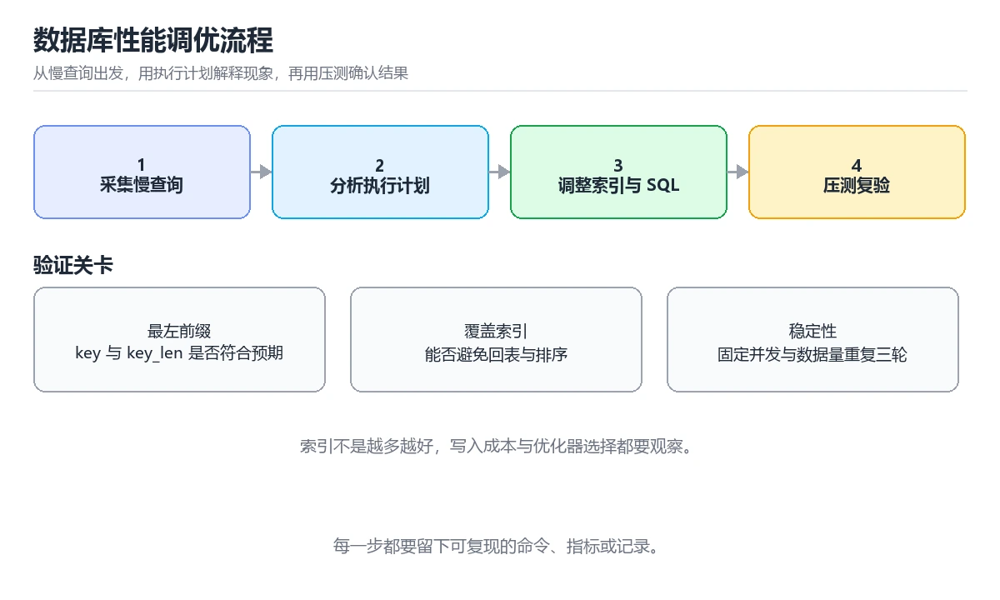

# 数据库性能调优实战

> 内容更新时间：2026-10-06 · 学习阶段：进阶 · 预计用时：60 分钟

> 项目定位：不靠“加索引”碰运气，用执行计划和压测数据做可回滚的调优。
> 建议投入：14 小时
> 难度：进阶


## 本节知识框架

**课程定位**：所属分类为「项目实战」，课程主题为「数据库性能调优实战」，学习阶段为「进阶」，建议用时 60 分钟。

**本课要解决的主问题**：从慢查询到执行计划，完成索引、锁与容量的一次系统调优。

| 学习层次 | 要回答的问题 | 完成判据 |
| --- | --- | --- |
| 概念层 | 「数据库性能调优实战」有哪些必须区分的对象与术语？ | 能用自己的话定义核心术语，并各举一个正例和一个反例。 |
| 机制层 | 这些对象按什么顺序发生作用，输入如何变成输出？ | 能画出或写出机制步骤，并说明每一步的失败条件。 |
| 应用层 | 什么场景适合使用「数据库性能调优实战」，什么场景不适合？ | 能给出一个真实场景、一个最小示例和一个边界案例。 |
| 性能层 | 时间、空间、吞吐或延迟受哪些量影响？ | 能说出复杂度或性能瓶颈的证据来源；没有证据时明确写“材料未提供”。 |
| 复习层 | 怎样确认自己不是只记住了结论？ | 能独立完成本课自测，并把错误定位到概念、机制、示例或边界。 |

### 阅读路线

1. 先读「核心概念定义」，建立「慢查询」等对象的精确定义。
2. 再读「原理与运行机制」，把定义串成可重复的过程。
3. 用「代码/协议/SQL 示例」验证过程，并只改一个条件观察结果变化。
4. 最后检查性能、易错点、知识关系与自测题，形成可复习的证据链。

**前置知识**：《SQL 基础》、《索引》、《事务》

**学习位置**：本课位于《网络抓包与协议分析实战》之后；如果前一课的自测不能通过，应先回补再继续。

**后续衔接**：下一课《安全攻防与防御实战》会继续使用本课术语，学完后建议立即完成一次自测。

**教材衔接：前置知识**

- 建议先完成：《SQL 基础》、《索引》、《事务》。
- 本课阶段：进阶。需要能够独立阅读命令、代码或配置，并会用日志和测试验证结果。
- 开始前复习：慢查询、执行计划、索引、锁。
- 准备一个可丢弃的本地环境验证 慢查询；实验要能重建、清理和回滚。
- 把 orders_by_user 的失败现场压缩到最小输入，确认问题仍然出现。

**教材衔接：学习目标**

1. 会读 EXPLAIN 的访问类型、扫描行数、回表与排序代价。
2. 能设计覆盖索引，并验证最左前缀、选择性与排序是否被索引满足。
3. 能定位锁等待与长事务，给出可回滚的调优和容量方案。

**教材衔接：本课小结**

数据库性能调优实战 的核心不是记住某一条命令，而是建立「定义验收标准 → 搭建最小闭环 → 用证据定位 → 安全回滚 → 留下复盘」的完整方法。

完成后你应该能够：

1. 说明本项目的输入、输出、质量指标与失败边界。
2. 从干净环境重复核心流程，并解释修改一个变量后的变化。
3. 给 orders_by_user 注入一次错误输入或超时，确认状态可恢复。
4. 让 执行计划 的每个阶段都有可核查的证据。
5. 把 慢查询、执行计划、索引、锁 串联成可交付、可复核、可改进的工程闭环。

选一个能用 执行计划 解决的现实问题，每次只改一个变量并记录回滚方式。

## 核心概念定义

> 在阅读《数据库性能调优实战》时，术语第一次出现先给操作性定义，再给边界；正文说法与这里冲突时，以定义和可复现示例为准。

| 术语 | 操作性定义 | 本课中的边界 |
| --- | --- | --- |
| 慢查询 | 超过阈值或明显拖慢业务的语句，先用日志与采样把它定位到具体 SQL 和参数。 | 仅在「数据库性能调优实战」明确给出的输入、版本与资源条件下成立。 |
| 执行计划 | 数据库为一条语句选出的访问路径，重点看扫描方式、连接顺序与预估行数和实际行数的偏差。 | 仅在「数据库性能调优实战」明确给出的输入、版本与资源条件下成立。 |
| 索引 | 用额外空间换检索速度的有序结构，写多读少、基数低或前缀模糊的列要谨慎建。 | 仅在「数据库性能调优实战」明确给出的输入、版本与资源条件下成立。 |
| 锁 | 并发访问同一份数据时的互斥机制，排查要区分行锁、表锁、间隙锁与等待链。 | 仅在「数据库性能调优实战」明确给出的输入、版本与资源条件下成立。 |
| 事务 | 一组要么全部生效要么全部回滚的操作，用隔离级别权衡一致性与并发度。 | 仅在「数据库性能调优实战」明确给出的输入、版本与资源条件下成立。 |
| 容量 | 数据量、连接数、IOPS 与磁盘的增长预测，调优前先确认瓶颈是资源还是语句。 | 仅在「数据库性能调优实战」明确给出的输入、版本与资源条件下成立。 |

### 定义如何使用

在「数据库性能调优实战」中判断一个说法是否成立，先确认它使用的是哪个对象的定义，再检查输入规模、运行环境与失败路径。定义不是口号，而是后续推导、代码示例和自测题共享的约束。

## 原理与运行机制

### 机制总览

1. **建立输入**：把「慢查询」按本课定义整理成可观察、可重复的输入条件。
2. **执行转换**：围绕「执行计划」执行本课的核心步骤；每一步都记录中间状态，避免只看最终输出。
3. **产生输出**：得到「索引」后，用正文示例或协议/SQL 结果核对输出是否符合预期。
4. **改变一个条件**：只替换一个边界条件或环境参数，观察「数据库性能调优实战」的结论是否仍然成立。

| 阶段 | 关注对象 | 失败时应检查 |
| --- | --- | --- |
| 输入 | 慢查询 | 类型、范围、编码、版本或前置状态是否满足定义。 |
| 处理 | 执行计划 | 顺序、可见性、锁、路由、事务或调度规则是否被破坏。 |
| 输出 | 索引 | 结果是否可复现，错误是否被正确传播而不是被吞掉。 |

本课的机制结论要用「数据库性能调优实战」自己的示例验证。「数据库性能调优实战」没有给出某个数量级、吞吐或内存数据时，本课把该判断标为“材料未提供”，不从相邻主题外推。

**教材衔接：需求与约束**

| 维度 | 约束 |
| --- | --- |
| 功能 | 保留原有查询结果与事务语义 |
| 性能 | 优化后 P95 小于 200ms |
| 数据量 | 至少使用 100 万行样本数据 |
| 安全 | 变更可回滚且不在高峰期执行 |

**教材衔接：架构与数据流**

压测客户端访问应用，应用经过连接池访问主库，再由只读副本承担部分查询；慢查询日志、performance_schema 与压测指标汇总到同一张时间线。

```text
client -> app -> pool -> primary -> btree index
                    |
              slow log / locks
```

**教材衔接：实施步骤**

### 里程碑 1：建立可重复的基线

导入 100 万行样本，记录查询 SQL、EXPLAIN、P95、扫描行数与锁等待，确保三次压测结果波动可解释。

### 里程碑 2：一次只改一个变量

为高频查询设计覆盖索引或改写 SQL，重复压测并比较执行计划；如果结果不稳定，先排查缓存与连接池。

### 里程碑 3：处理锁与容量

定位长事务与锁等待，调整事务边界或隔离级别，最后给出索引、归档与容量扩展的回滚方案。

**教材衔接：扩展任务**

- 对比覆盖索引与回表读的代价
- 模拟长事务观察锁等待传播
- 用分区或归档处理冷数据并把慢查询门禁接入 CI

**教材衔接：交付评审：评分表、决策记录与证据链**

「数据库性能调优实战」的验收不能只看功能能不能跑通。下面把正文里的交付物、验证命令和关键设计点整理成一张评审表，按表逐项留下证据即可。

### 一、「数据库性能调优实战」的交付物评分表

| 交付物 | 权重 | 合格线 | 需要的证据 |
| --- | ---: | --- | --- |
| 基线 SQL 与执行计划 | 25% | 能在干净环境复现，且失败路径有明确处理 | 命令与输出、对应测试、一次失败与恢复记录 |
| 索引设计与回滚脚本 | 25% | 能在干净环境复现，且失败路径有明确处理 | 命令与输出、对应测试、一次失败与恢复记录 |
| 压测前后对比报告 | 25% | 能在干净环境复现，且失败路径有明确处理 | 命令与输出、对应测试、一次失败与恢复记录 |
| 锁等待清单与容量上线检查表 | 25% | 能在干净环境复现，且失败路径有明确处理 | 命令与输出、对应测试、一次失败与恢复记录 |

「数据库性能调优实战」的评分先看证据再打分：任意一项只要拿不出可复现的命令或测试，该项按 0 分计，不允许用「基本完成」代替。

### 二、需要写下来的决策（ADR）

| 决策点 | 本课给出的做法 | 备选方案 | 代价与回滚 |
| --- | --- | --- | --- |
| 里程碑 1：建立可重复的基线 | 导入 100 万行样本，记录查询 SQL、EXPLAIN、P95、扫描行数与锁等待，确保三次压测结果波动可解释。 | 不做「里程碑 1：建立可重复的基线」，沿用最朴素的实现（需要额外补一次对照实验） | 若「里程碑 1：建立可重复的基线」出问题，回到上一版本并按本课验收场景重跑 |
| 里程碑 2：一次只改一个变量 | 为高频查询设计覆盖索引或改写 SQL，重复压测并比较执行计划；如果结果不稳定，先排查缓存与连接池。 | 不做「里程碑 2：一次只改一个变量」，沿用最朴素的实现（需要额外补一次对照实验） | 若「里程碑 2：一次只改一个变量」出问题，回到上一版本并按本课验收场景重跑 |
| 里程碑 3：处理锁与容量 | 定位长事务与锁等待，调整事务边界或隔离级别，最后给出索引、归档与容量扩展的回滚方案。 | 不做「里程碑 3：处理锁与容量」，沿用最朴素的实现（需要额外补一次对照实验） | 若「里程碑 3：处理锁与容量」出问题，回到上一版本并按本课验收场景重跑 |
| 交付边界 | 从慢查询到执行计划，完成索引、锁与容量的一次系统调优。 | 不做「交付边界」，沿用最朴素的实现（需要额外补一次对照实验） | 若「交付边界」出问题，回到上一版本并按本课验收场景重跑 |

ADR 不需要长：每个决策三行就够——选了什么、放弃了什么、出问题怎么退。评审时只检查这三行是否和「数据库性能调优实战」的实际代码一致。

### 三、「数据库性能调优实战」的交付证据链

| # | 命令 | 这条命令要留下的证据 |
| ---: | --- | --- |
| 1 | `mysql -h 127.0.0.1 -u demo -p demo < seed.sql` | 完整输出、退出码、耗时，以及与「数据库性能调优实战」验收口径的对应关系 |
| 2 | `mysql -h 127.0.0.1 -u demo -p demo -e "EXPLAIN ANALYZE SELECT id, user_id, amount FROM orders WHERE user_id = 42 ORDER BY created_at DESC LIMIT 20"` | 完整输出、退出码、耗时，以及与「数据库性能调优实战」验收口径的对应关系 |
| 3 | `python benchmark.py --query orders_by_user --concurrency 32 --duration 120` | 完整输出、退出码、耗时，以及与「数据库性能调优实战」验收口径的对应关系 |

把「数据库性能调优实战」的上表整理成一个 evidence/ 目录：每条命令一个文件，文件名带日期，内容包含版本、命令与输出。评审时直接按目录核对，不再口头确认。

### 四、「数据库性能调优实战」的验收指标

| 指标 | 目标值 | 测量方式 | 不达标时的动作 |
| --- | --- | --- | --- |
| | 只看平均耗时 | 平均值掩盖了尾延迟，用户体感仍然很差 | 同时看 P95/P99 与等待事件，找出真正的长尾来源 | | 用本课正文给出的阈值，没有就写实测基线 | 固定环境重复三次取中位数 | 回到对应小节定位，先修原因再重测 |

指标必须能用一条命令或一次操作测出来；写不出测量方式的指标，在「数据库性能调优实战」的评审里一律视为未定义。

### 五、评审记录模板

| 记录项 | 填写要求 |
| --- | --- |
| 项目标识 | `project_database_tuning` |
| 本次范围 | 说明这一轮交付了「数据库性能调优实战」的哪些部分 |
| 未完成项 | 列出与 慢查询 相关但本轮未做的内容 |
| 证据位置 | 指向 evidence/ 目录下的具体文件 |
| 风险与回滚 | 写清剩余风险、回滚步骤和验证方式 |
| 结论 | 通过 / 有条件通过 / 不通过，三者选一 |

「数据库性能调优实战」评审结束后把这张表填完并归档；下一轮迭代直接读上一次的「未完成项」与「风险与回滚」，避免重复讨论同一个问题。
<!-- p1-project-review:end -->

## 典型应用场景

| 场景 | 典型输入或前提 | 期望产物 |
| --- | --- | --- |
| 学习验证 | 使用本课最小示例和 慢查询、执行计划 | 能复现正文结论，并解释每一步。 |
| 工程落地 | 把「数据库性能调优实战」放入真实模块或服务边界 | 输出可观测、失败可定位、参数可配置。 |
| 故障排查 | 只改一个版本、规模、输入或依赖条件 | 能区分概念错误、实现错误和环境差异。 |

判断「数据库性能调优实战」的场景是否成立，标准是能否写出输入、处理、输出和失败路径；材料中没有出现的数据在本课标注为“材料未提供”，不用推测替代证据。

**教材衔接：项目背景**

订单表在数据量增长后出现慢查询和锁等待，接口 P95 从 80ms 升到 900ms。需要先抓慢查询与执行计划，再区分扫描行数、回表、排序、锁等待和连接池耗尽等原因，每次只改一个变量并压测对比。

**教材衔接：项目交付物**

- 基线 SQL 与执行计划
- 索引设计与回滚脚本
- 压测前后对比报告
- 锁等待清单与容量上线检查表



**教材衔接：项目专属规格**

### 交付边界

从慢查询到执行计划，完成索引、锁与容量的一次系统调优。 项目交付不是一份说明文档，而是一组可以运行的命令、可检查的输入输出、失败处理和复盘证据。范围必须同时写明本阶段做什么、不做什么，以及哪些依赖属于外部前提。

### 最小数据模型

| 对象 | 关键字段 | 约束 |
| --- | --- | --- |
| 输入实体 | 慢查询、来源、时间、版本 | 必填、可校验、可追溯到原始输入 |
| 任务实体 | 状态、优先级、执行标识、重试次数 | 状态迁移合法、重复执行不会产生重复副作用 |
| 结果实体 | 输出、错误码、耗时、资源指标 | 可序列化、可比较、失败原因可解释 |
| 审计记录 | 操作者、动作、批次、结果、时间 | 不记录敏感信息、可查询、可复核 |

### 验收场景

1. 正常路径：用最小输入跑完 慢查询 的端到端流程，并留下命令、输出和版本信息。
2. 边界路径：用重复与超长输入验证 执行计划 的行为。
3. 失败路径：让 慢查询 的依赖超时或中途断开，验证能快速止损并说明恢复动作。
4. 幂等路径：用同一个幂等键重放 orders_by_user，比较两次结果。
5. 回滚路径：确认 执行计划 回退后不残留临时资源。

### 证据清单

- 一条从干净环境开始的可复现命令，以及真实输出。
- 一份正常、边界、失败与幂等场景的测试矩阵。
- 一组修改前后的 执行计划 指标，包含测量方法和环境说明。
- 一份故障时间线、根因、修复动作、回滚耗时和后续改进项。

### 完成定义

别人只阅读仓库说明和测试，就能复现 慢查询 的主要结论；任何跳过或未解决风险都有明确记录。

## 代码/协议/SQL 示例

以下代码、协议或 SQL 片段来自《数据库性能调优实战》原文，保留原有语言标记与上下文；先预测《数据库性能调优实战》示例的输出，再按正文步骤运行或推演，示例依赖外部环境时同时记录版本与输入。

**教材衔接：验证命令与预期输出**

在 数据库性能调优实战 的仓库根目录执行以下命令，确认核心链路可以运行。

```bash
mysql -h 127.0.0.1 -u demo -p demo < seed.sql
mysql -h 127.0.0.1 -u demo -p demo -e "EXPLAIN ANALYZE SELECT id, user_id, amount FROM orders WHERE user_id = 42 ORDER BY created_at DESC LIMIT 20"
python benchmark.py --query orders_by_user --concurrency 32 --duration 120
```

**预期输出**：EXPLAIN ANALYZE 显示使用 idx_orders_user_created，扫描行数从 18 万降到 21，P95 从 900ms 降到 120ms，锁等待次数为 0。

## 时间/空间复杂度或性能分析

**复杂度证据**：「数据库性能调优实战」的现有材料没有给出渐近时间或空间复杂度的明确结论，本课只做定性检查，不补写未经验证的 $O$ 记号。

| 维度 | 本课关注点 | 判断依据 |
| --- | --- | --- |
| 时间/延迟 | 「数据库性能调优实战」的主要步骤是否会随输入规模、并发度或网络往返增长。 | 以正文复杂度、基准数据或可重复测量为准。 |
| 空间/内存 | 中间状态、缓存、副本、连接或索引是否随规模增长。 | 记录峰值内存与数据副本，不只看最终结果。 |
| 吞吐/资源 | 版本、调度、锁、IO、序列化或协议开销是否成为瓶颈。 | 固定环境做对照实验，改变一个变量。 |

评估「数据库性能调优实战」时要区分“正确性成立”和“性能达标”两件事；材料没有给出基准时，本课只保留量级来源与测量方法，不写不可验证的绝对数字。

**教材衔接：零基础精讲：把数据库性能调优实战真正讲透**

### 先建立一个直觉

调优从证据开始：先拿到执行计划与等待事件，再决定是加索引、改语句还是改数据模型。
落到本课，「数据库性能调优实战」关心的是 慢查询 与 执行计划 的配合，也就是说这条直觉要在 项目背景 里被具体验证。

本课的摘要可以当作一张地图：从慢查询到执行计划，完成索引、锁与容量的一次系统调优。

### 逐步拆解

1. 澄清输入与目标。先写清「数据库性能调优实战」要解决的问题、合法输入范围和成功标准，再进入后续步骤。
2. 描述处理过程。把「慢查询、执行计划、索引、锁、事务、容量」映射到具体步骤，每步都要求能单独验证。
3. 定义输出。把 orders_by_user 的返回值、日志和失败信号都写清楚，缺一项都不算完整。
4. 让「数据库性能调优实战」的失败路径尽早暴露：把慢查询推到边界值，记录错误信息、重试或降级动作，以及人工兜底条件。
5. 选一个只有两三步的慢查询例子，先写出预期输出，再运行确认；不一致时先怀疑前提而不是代码。

### 把正文串成一条执行链

- **里程碑 1：建立可重复的基线**：在「数据库性能调优实战」里，「里程碑 1：建立可重复的基线」这一步要先写清输入与预期，再记录实际结果和差异；结果不符时回到对应小节核对前提。
- **里程碑 2：一次只改一个变量**：在「数据库性能调优实战」里，「里程碑 2：一次只改一个变量」这一步要先写清输入与预期，再记录实际结果和差异；结果不符时回到对应小节核对前提。
- **里程碑 3：处理锁与容量**：在「数据库性能调优实战」里，「里程碑 3：处理锁与容量」这一步要先写清输入与预期，再记录实际结果和差异；结果不符时回到对应小节核对前提。
- **现场 1：加了索引仍然慢**：在「数据库性能调优实战」里，「现场 1：加了索引仍然慢」这一步要先写清输入与预期，再记录实际结果和差异；结果不符时回到对应小节核对前提。
- **现场 2：压测结果波动很大**：在「数据库性能调优实战」里，「现场 2：压测结果波动很大」这一步要先写清输入与预期，再记录实际结果和差异；结果不符时回到对应小节核对前提。
- **任务 1：先跑通，再解释**：在「数据库性能调优实战」里，「任务 1：先跑通，再解释」这一步要先写清输入与预期，再记录实际结果和差异；结果不符时回到对应小节核对前提。

### 从测验反推易错点

**检查点 1：按数据库性能调优实战中 慢查询、执行计划、索引 的实践顺序，把四个步骤排成从准备到复盘的合理顺序。**

- 参考判断：只改一个变量，记录边界与失败路径的变化
- 解析：在本课的练习里，顺序应当是：先明确 慢查询 的输入、输出与约束 → 写出最小示例并核对 执行计划 的基线结果 → 只改一个变量，记录边界与失败路径的变化 → 固定版本与证据，把本课的结论写成可复现记录。这个顺序把 慢查询 的输入、输出和约束放在最前面，在数据库性能调优实战里避免概念没对齐就开始调参。第二步用 执行计划 建立可核对的基线，在数据库性能调优实战里第三步才允许改变一个变量并观察失败路径。最后一步把本课的版本、证据与结论固定下来，别人才能复现同样的结果。
- 自问：如果去掉题干里的一个限定词，结论还成立吗？

- 参考判断：total 只在函数内部赋值，函数外访问会抛出 NameError。

**检查点 3：长事务最直接的危害是什么？**

- 参考判断：长时间持有锁与快照，阻塞其他事务并放大回滚成本
- 解析：长事务会持续持有行锁、间隙锁和一致性快照，其他事务可能排队等待，更新与清理也会被拖慢。事务越久，undo 日志保留越多，回滚和崩溃恢复的成本越高。调优时应先找出长事务，缩短事务边界，把网络调用、文件操作和人工确认移出事务，再考虑隔离级别与锁策略。

**检查点 4：围绕数据库性能调优实战中的 慢查询、执行计划、索引，下列哪两项是本课强调的实践判断？**

- 参考判断：验证 执行计划 时要固定版本并覆盖边界输入，结论才可复现、学习 慢查询 时要同时说明输入、输出和失败路径，不能只看正常流程
- 解析：本课把数据库性能调优实战拆成概念、示例与故障现场三部分，因此判断 慢查询 时必须同时交代输入、输出和失败路径，这使“学习 慢查询 时要同时说明输入、输出和失败路径，不能只看正常流程”成立；在数据库性能调优实战里，判断 执行计划 时要固定版本与边界输入，所以“验证 执行计划 时要固定版本并覆盖边界输入，结论才可复现”才可复现。相反，“只要 慢查询 的常规示例通过，就可以跳过边界与异常路径”把一次正常示例当成全部情况，会漏掉本课的边界缺陷；“把 执行计划 的单次运行结果当成所有版本和规模都成立”把单次结果外推成普遍结论，在数据库性能调优实战里忽略了版本和规模变化。对照本课的故障现场与自测清单，就能用证据区分这两种判断。

### 工程排错顺序

| 先查什么 | 要得到的证据 | 判断标准 |
| --- | --- | --- |
| 用户、范围与验收标准是否写清？ | 日志、输入样例、测试或指标 | 能复现并解释，才算定位 |
| 每阶段是否有可运行增量？ | 日志、输入样例、测试或指标 | 能复现并解释，才算定位 |
| 测试、监控和回滚是否随功能一起交付？ | 日志、输入样例、测试或指标 | 能复现并解释，才算定位 |
| 复盘是否形成下一轮改进项？ | 日志、输入样例、测试或指标 | 能复现并解释，才算定位 |

### 变式训练

1. 把 慢查询 的实现压缩到一个进程内，去掉所有外部依赖后再谈扩展。
2. 扩大 执行计划 的规模，记录本课结论在哪一个量级开始不成立。
3. 制造一次 慢查询 相关的依赖超时或错误输入，要求错误可解释且不留半完成状态。
5. 把 orders_by_user 的执行顺序调换一次，记录哪个中间结果先错；顺序敏感的地方就是本课的关键约束。
6. 在低带宽或低算力条件下重跑 执行计划，记录降级路径是否仍然可用。

### 本课自测

- [ ] 能用一句话解释「慢查询」在本课中的角色与边界。
- [ ] 能举出一个正常例子和一个失败例子。
- [ ] 能说出最小验证步骤，以及需要记录的证据。
- [ ] 能用一句话解释「执行计划」在本课中的角色与边界。
- [ ] 能用一句话解释「索引」在本课中的角色与边界。
- [ ] 能用一句话解释「锁」在本课中的角色与边界。
- [ ] 能用一句话解释「事务」在本课中的角色与边界。

### 迁移案例库

下面用不同约束重复同一套方法，每轮只改变 慢查询 的一个取值并记录结论。

#### 迁移案例 1：围绕「慢查询」做一次小实验

**目标**：在不改变课程主体的前提下，验证数据库性能调优实战中的一个关键判断。

**步骤**：
1. 复述当前方案对「慢查询」的假设，写成一句可证伪的话。
2. 设计一个正常输入和一个边界输入，分别预测输出。
3. 运行或逐步演算，记录实际输出、耗时和失败信息。
4. 只调整一个参数，比较前后差异并解释原因。
5. 补充一条测试或复习卡，确保下次能更快复现。

**验收**：慢查询的结论要有证据、差异可解释、失败可恢复；做不到时回到「项目背景」缩小问题范围。

#### 迁移案例 2：围绕「执行计划」做一次小实验

**步骤**：
1. 复述当前方案对「执行计划」的假设，写成一句可证伪的话。

#### 迁移案例 3：围绕「索引」做一次小实验

**步骤**：
1. 复述当前方案对「索引」的假设，写成一句可证伪的话。

#### 迁移案例 4：围绕「锁」做一次小实验

**步骤**：
1. 复述当前方案对「锁」的假设，写成一句可证伪的话。

#### 迁移案例 5：围绕「事务」做一次小实验

**步骤**：
1. 复述当前方案对「事务」的假设，写成一句可证伪的话。

#### 迁移案例 6：围绕「容量」做一次小实验

**步骤**：
1. 复述当前方案对「容量」的假设，写成一句可证伪的话。

#### 迁移案例 7：围绕「慢查询」做一次小实验

**步骤**：

#### 迁移案例 8：围绕「执行计划」做一次小实验

**步骤**：

#### 迁移案例 9：围绕「索引」做一次小实验

**步骤**：

#### 迁移案例 10：围绕「锁」做一次小实验

**步骤**：

#### 迁移案例 11：围绕「事务」做一次小实验

**步骤**：

#### 迁移案例 12：围绕「容量」做一次小实验

**步骤**：

#### 迁移案例 13：围绕「慢查询」做一次小实验

**步骤**：

#### 迁移案例 14：围绕「执行计划」做一次小实验

**步骤**：

#### 迁移案例 15：围绕「索引」做一次小实验

**步骤**：

#### 迁移案例 16：围绕「锁」做一次小实验

**步骤**：

<!-- p0-depth-v2:end -->

## 常见误区与易错点

> 复核《数据库性能调优实战》的易错点时，优先保留原文的错误表、故障现场与排错路径；每条修正都要能用本课示例复验。

| 易错点 | 常见表现 | 正确做法 |
| --- | --- | --- |
| 只背结论 | 能复述「数据库性能调优实战」的定义，却说不清输入、输出与边界。 | 回到机制步骤，用最小示例逐一验证。 |
| 混淆相邻概念 | 把本课对象与相邻主题的对象当成同一类。 | 先比较定义、资源归属、生命周期和失败模式。 |
| 忽略版本与环境 | 在开发机通过后直接外推到生产环境。 | 固定版本、输入和资源条件，再记录可复现结果。 |

**教材衔接：故障现场**

### 现场 1：加了索引仍然慢

**症状**：加了索引仍然慢。

**定位**：查询条件顺序不满足最左前缀，或排序字段没有被索引覆盖。

**修复**：用 EXPLAIN 验证 key 与 key_len，再调整联合索引顺序或改成覆盖索引。

### 现场 2：压测结果波动很大

**症状**：压测结果波动很大。

**定位**：连接池、缓存或机器负载混入了额外变量。

**修复**：固定并发与数据量，清理缓存后至少重复三轮并比较 P95。

**教材衔接：常见错误与排查**

> 复核：已人工核对并重写（2026-10-06），每行对应本课的一个真实易错点。

| 易错点 | 容易踩的做法 | 正确结论 |
| --- | --- | --- |
| 凭感觉加索引 | 没有执行计划证据，可能越加越慢 | 先用慢查询日志与 EXPLAIN 定位，再针对性调整 |
| 长事务不收敛 | 长时间持有锁与快照，阻塞其他事务并放大回滚成本 | 拆分大事务、控制批量提交大小，并监控锁等待 |
| 只看平均耗时 | 平均值掩盖了尾延迟，用户体感仍然很差 | 同时看 P95/P99 与等待事件，找出真正的长尾来源 |
| 把慢查询一律归因于数据库 | 也可能是网络、连接池或应用层 N+1 查询 | 按调用链分段计时，确认瓶颈在数据库还是上下游 |

## 与其他知识点的关系

| 关系 | 课程 | 为什么 |
| --- | --- | --- |
| 先修 | 《SQL 基础》 | 本课会直接使用它的概念或操作前提。 |
| 先修 | 《索引》 | 本课会直接使用它的概念或操作前提。 |
| 先修 | 《事务》 | 本课会直接使用它的概念或操作前提。 |
| 关联 | 《查询优化与执行计划》 | 用于横向比较或把本课结论迁移到相邻主题。 |
| 关联 | 《MySQL 锁与 MVCC》 | 用于横向比较或把本课结论迁移到相邻主题。 |
| 关联 | 《数据库运维：备份、迁移与分库分表》 | 用于横向比较或把本课结论迁移到相邻主题。 |
| 前置顺序 | 《网络抓包与协议分析实战》 | 同分类中安排在本课之前，建议先完成其自测。 |
| 后续顺序 | 《安全攻防与防御实战》 | 同分类中安排在本课之后，会继续使用本课术语。 |

把「数据库性能调优实战」放回知识体系时，不只要记住“前面学过什么”，还要说明两个主题在输入、机制、资源边界和失败模式上的差异。这样才能把单课知识迁移到项目、排障和后续课程。

**教材衔接：复习与迁移**

复习目标：把「数据库性能调优实战」的判断标准放回可复现的例子里。先自己作答，再对照依据；如果结论正确但理由不完整，回到正文补足前提。

### 概念复述

- 用一句话说明「数据库性能调优实战」解决什么问题：从慢查询到执行计划，完成索引、锁与容量的一次系统调优。
- 写出慢查询、执行计划、索引之间的关系，并各举一个例子。
- 说出本课最容易混淆的两个概念，以及区分它们的判据。

### 正文逐节复核

- **项目背景**：订单表在数据量增长后出现慢查询和锁等待，接口 P95 从 80ms 升到 900ms。
- **架构与数据流**：压测客户端访问应用，应用经过连接池访问主库，再由只读副本承担部分查询；慢查询日志、performance_schema 与压测指标汇总到同一张时间线。
- **实施步骤**：为高频查询设计覆盖索引或改写 SQL，重复压测并比较执行计划；如果结果不稳定，先排查缓存与连接池。
- **零基础精讲：把数据库性能调优实战真正讲透**：本课的摘要可以当作一张地图：从慢查询到执行计划，完成索引、锁与容量的一次系统调优。
- **项目专属规格**：从慢查询到执行计划，完成索引、锁与容量的一次系统调优。

### 测验回顾

1. 按“数据库性能调优实战”中 慢查询、执行计划、索引 的实践顺序，把四个步骤排成从准备到复盘的合理顺序。
   - 依据：在「数据库性能调优实战」里，在本课的练习里，顺序应当是：先明确 慢查询 的输入、输出与约束 → 写出最小示例并核对 执行计划 的基线结果 → 只改一个变量，记录边界与失败路径的变化 → 固定版本与证据，把本课的结论写成可复现记录。这个顺序把 慢查询 的输入、输出和约束放在最前面，在数据库性能调优实战里避免概念没对齐就开始调参。第二步用 执行计划 建立可核对的基线，在数据库性能调优实战里第三步才允许改变一个变量并观察失败路径。
2. 阅读「数据库性能调优实战」正文里的这段代码，下面哪一项判断是正确的？
   - 依据：在「数据库性能调优实战」里，题干的正确项是这段代码只做静态声明，没有循环、分支或可观察输出，在「数据库性能调优实战」里它只能证明慢查询相关约束存在，不能替代真实运行证据。把输入或边界换成空值、极值或失败情况后，结论要以「数据库性能调优实战」的实际运行结果为准。“阅读数据库性能调优实战正文里的这段代码”与「数据库性能调优实战」的术语表相呼应，只有符合慢查询、执行计划、索引约束的“这段代码只做静态声明，没有循环”才是正文支持的结论。
3. 长事务最直接的危害是什么？
   - 依据：在「数据库性能调优实战」里，长时间持有锁与快照，阻塞其他事务并放大回滚成本。长事务会持续持有行锁、间隙锁和一致性快照，其他事务可能排队等待，更新与清理也会被拖慢。事务越久，undo 日志保留越多，回滚和崩溃恢复的成本越高。调优时应先找出长事务，缩短事务边界，把网络调用、文件操作和人工确认移出事务，再考虑隔离级别与锁策略。
4. 围绕“数据库性能调优实战”中的 慢查询、执行计划、索引，下列哪两项是本课强调的实践判断？
   - 依据：结论应落在验证 执行计划 时要固定版本并覆盖边界输入。本课把数据库性能调优实战拆成概念、示例与故障现场三部分，因此判断 慢查询 时必须同时交代输入、输出和失败路径，这使“学习 慢查询 时要同时说明输入、输出和失败路径，不能只看正常流程”成立。在数据库性能调优实战里，判断 执行计划 时要固定版本与边界输入，所以“验证 执行计划 时要固定版本并覆盖边界输入，结论才可复现”才可复现。

### 迁移练习

把「数据库性能调优实战」的结论迁移到相邻主题，每次迁移都写清预测与证据：

1. 换输入：用慢查询处理一组你自己的数据，对比教材示例的结果差异。
2. 换失败条件：制造一个执行计划相关的错误，说明如何从错误信息定位根因。
3. 换规模：把数据量或并发度提高一个数量级，说明「数据库性能调优实战」的结论是否仍成立。

## 自测题与参考答案

> 先独立完成《数据库性能调优实战》的自测，再核对答案与解析。答案必须能在本课正文或示例中找到依据，不能只凭语感。

### 自测 1

按“数据库性能调优实战”中 慢查询、执行计划、索引 的实践顺序，把四个步骤排成从准备到复盘的合理顺序。

A. 只改一个变量，记录边界与失败路径的变化
B. 固定版本与证据，把“数据库性能调优实战”的结论写成可复现记录
C. 先明确 慢查询 的输入、输出与约束
D. 写出最小示例并核对 执行计划 的基线结果

**参考答案**：先明确 慢查询 的输入、输出与约束 → 写出最小示例并核对 执行计划 的基线结果 → 只改一个变量，记录边界与失败路径的变化 → 固定版本与证据，把“数据库性能调优实战”的结论写成可复现记录

**解析**：在「数据库性能调优实战」里，在本课的练习里，顺序应当是：先明确 慢查询 的输入、输出与约束 → 写出最小示例并核对 执行计划 的基线结果 → 只改一个变量，记录边界与失败路径的变化 → 固定版本与证据，把本课的结论写成可复现记录。这个顺序把 慢查询 的输入、输出和约束放在最前面，在数据库性能调优实战里避免概念没对齐就开始调参。第二步用 执行计划 建立可核对的基线，在数据库性能调优实战里第三步才允许改变一个变量并观察失败路径。

### 自测 2

阅读「数据库性能调优实战」正文里的这段代码，下面哪一项判断是正确的？

```bash
mysql -h 127.0.0.1 -u demo -p demo < seed.sql
mysql -h 127.0.0.1 -u demo -p demo -e "EXPLAIN ANALYZE SELECT id, user_id, amount FROM orders WHERE user_id = 42 ORDER BY created_at DESC LIMIT 20"
python benchmark.py --query orders_by_user --concurrency 32 --duration 120
```

A. 这段代码包含异常处理分支，失败时会走专门的补救路径。
B. 这段代码只做静态声明，没有循环、分支或可观察输出。
C. 这段代码包含条件分支，不同输入会走不同的执行路径。
D. 这段代码把主要逻辑封装在函数或方法里，需要被调用才会执行。

**参考答案**：这段代码只做静态声明，没有循环、分支或可观察输出。

**解析**：在「数据库性能调优实战」里，题干的正确项是这段代码只做静态声明，没有循环、分支或可观察输出，在「数据库性能调优实战」里它只能证明慢查询相关约束存在，不能替代真实运行证据。把输入或边界换成空值、极值或失败情况后，结论要以「数据库性能调优实战」的实际运行结果为准。“阅读数据库性能调优实战正文里的这段代码”与「数据库性能调优实战」的术语表相呼应，只有符合慢查询、执行计划、索引约束的“这段代码只做静态声明，没有循环”才是正文支持的结论。

### 自测 3

长事务最直接的危害是什么？

A. 自动删除历史数据
B. 让索引变成只读
C. 长时间持有锁与快照，阻塞其他事务并放大回滚成本
D. 把 InnoDB 自动切换成 MyISAM

**参考答案**：长时间持有锁与快照，阻塞其他事务并放大回滚成本

**解析**：在「数据库性能调优实战」里，长时间持有锁与快照，阻塞其他事务并放大回滚成本。长事务会持续持有行锁、间隙锁和一致性快照，其他事务可能排队等待，更新与清理也会被拖慢。事务越久，undo 日志保留越多，回滚和崩溃恢复的成本越高。调优时应先找出长事务，缩短事务边界，把网络调用、文件操作和人工确认移出事务，再考虑隔离级别与锁策略。

**教材衔接：复习与自测**

1. 用一句话说明 数据库性能调优实战 的核心输入、输出与失败边界。
2. 画出 慢查询 的数据流，并标出至少一条失败路径。
3. 写出 数据库性能调优实战 的下一条验证命令，并说明预期结果。

**教材衔接：可运行练习**

### 任务 1：先跑通，再解释

```bash
mysql -h 127.0.0.1 -u demo -p demo < seed.sql
mysql -h 127.0.0.1 -u demo -p demo -e "EXPLAIN ANALYZE SELECT id, user_id, amount FROM orders WHERE user_id = 42 ORDER BY created_at DESC LIMIT 20"
python benchmark.py --query orders_by_user --concurrency 32 --duration 120
```

### 任务 2：只改一个条件

把「数据库性能调优实战」的最小示例复制一份，只改一个条件再跑一次：

- 改动点：只调整 orders_by_user 的一个参数，其余条件一律不动。
- 预测：先写下「数据库性能调优实战」在改动后的输出或错误信息，再运行。
- 记录：对照改动前后的结果，指出差异出在哪一步。
- 验收：换回原条件能复现原结果，改动只影响慢查询。

### 任务 3：迁移到自己的数据

用同一套思路处理一组你自己的 慢查询 数据，保持输出格式与任务 1 一致。

**教材衔接：动手练习**

先复现 orders_by_user，再有意破坏一个条件，最后交付修复后的结果。

### 练习 1：复现最小闭环（30 分钟）

按验证清单跑通 执行计划，记录耗时与差异来源。

验收标准：慢查询 的命令可以从零复现，输出与预测的差异有机制层面的解释。

### 练习 2：制造一次可恢复故障（45 分钟）

围绕「慢查询」制造一次超时、错误输入、资源不足或依赖不可用，观察日志、指标和业务状态。完成止损、修复、复测和回滚，并画出从触发到恢复的时间线。

验收标准：orders_by_user 失败后可恢复，且能说明回滚验证方式。

### 练习 3：扩展为可交付增量（60 分钟）

给 数据库性能调优实战 增加一个与「执行计划」相关的小功能或改进。先写验收标准，再补正常、边界、失败和幂等测试，最后更新运行说明与风险记录。

验收标准：执行计划 的成本、权限与回滚方式都写进交付说明。

**教材衔接：本课复习清单**

- [ ] 能独立完成「项目背景」并说明验收标准。
- [ ] 能独立完成「需求与约束」并说明验收标准。
- [ ] 能独立完成「架构与数据流」并说明验收标准。
- [ ] 能独立完成「实施步骤」并说明验收标准。
- [ ] 能独立完成「里程碑 1：建立可重复的基线」并说明验收标准。
- [ ] 能独立完成「里程碑 2：一次只改一个变量」并说明验收标准。

<!-- p1-project-review:start -->

---

## 考点精讲

### 考点 1：顺序排列·慢查询

- **题目**：按“数据库性能调优实战”中 慢查询、执行计划、索引 的实践顺序，把四个步骤排成从准备到复盘的合理顺序。
- **判断依据**：在「数据库性能调优实战」里，在本课的练习里，顺序应当是：先明确 慢查询 的输入、输出与约束 → 写出最小示例并核对 执行计划 的基线结果 → 只改一个变量，记录边界与失败路径的变化 → 固定版本与证据，把本课的结论写成可复现记录。这个顺序把 慢查询 的输入、输出和约束放在最前面，在数据库性能调优实战里避免概念没对齐就开始调参。第二步用 执行计划 建立可核对的基线，在数据库性能调优实战里第三步才允许改变一个变量并观察失败路径。

### 考点 2：代码补全·慢查询

- **题目**：阅读「数据库性能调优实战」正文里的这段代码，下面哪一项判断是正确的？
- **判断依据**：在「数据库性能调优实战」里，题干的正确项是这段代码只做静态声明，没有循环、分支或可观察输出，在「数据库性能调优实战」里它只能证明慢查询相关约束存在，不能替代真实运行证据。把输入或边界换成空值、极值或失败情况后，结论要以「数据库性能调优实战」的实际运行结果为准。“阅读数据库性能调优实战正文里的这段代码”与「数据库性能调优实战」的术语表相呼应，只有符合慢查询、执行计划、索引约束的“这段代码只做静态声明，没有循环”才是正文支持的结论。

### 考点 3：概念判断·慢查询

- **题目**：长事务最直接的危害是什么？
- **判断依据**：在「数据库性能调优实战」里，长时间持有锁与快照，阻塞其他事务并放大回滚成本。长事务会持续持有行锁、间隙锁和一致性快照，其他事务可能排队等待，更新与清理也会被拖慢。事务越久，undo 日志保留越多，回滚和崩溃恢复的成本越高。调优时应先找出长事务，缩短事务边界，把网络调用、文件操作和人工确认移出事务，再考虑隔离级别与锁策略。

### 考点 4：多选辨析·慢查询

- **题目**：围绕“数据库性能调优实战”中的 慢查询、执行计划、索引，下列哪两项是本课强调的实践判断？
- **判断依据**：结论应落在验证 执行计划 时要固定版本并覆盖边界输入。本课把数据库性能调优实战拆成概念、示例与故障现场三部分，因此判断 慢查询 时必须同时交代输入、输出和失败路径，这使“学习 慢查询 时要同时说明输入、输出和失败路径，不能只看正常流程”成立。在数据库性能调优实战里，判断 执行计划 时要固定版本与边界输入，所以“验证 执行计划 时要固定版本并覆盖边界输入，结论才可复现”才可复现。

### 考点 5：排错·数据库性能调优

- **题目**：给查询字段加了索引，但线上仍然很慢。下一步最应该做什么？
- **判断依据**：用 EXPLAIN 检查命中的索引与 key_len，再调整索引顺序或改成覆盖索引。数据库性能调优实战 的故障现场说明，加了索引仍然慢通常是查询条件顺序不满足最左前缀，或者排序字段没有被索引覆盖；先看执行计划中实际命中的索引与 key_len，再决定调整联合索引顺序还是改成覆盖索引。

## English Overview

Tune slow queries through execution plans, indexes, locks and capacity planning.

This project on "数据库性能调优实战" turns the topic into a delivery workflow: define constraints, build a minimal end-to-end path, verify it with repeatable commands, and record failure handling.

## 内容元数据

- 内容版本：v2.0
- 最后更新：2026-10-06
- 学习阶段：进阶
- 适用环境：本地容器、单机服务或移动开发环境，具体版本以课程命令为准
；本课聚焦 慢查询。
- 内容来源：内置结构化课程与项目工程实践整理
- 相关主题：慢查询、执行计划、索引、锁、事务、容量
- 质量版本：P0 可运行练习 + P1 专项题型 + P2 项目规格与复核
- 项目标识：project_database_tuning
- 学习产出：数据库性能调优实战 的可运行增量、验证证据与复盘记录

## 参考资料与复核

- 最后复核：2026-10-04
- 下次复核：2027-10-10
- 复核范围：版本兼容、API 行为、安全建议与工程实践
- 来源性质：官方文档、标准或权威教材；正文为离线教学重组

| 参考资料 | 本课用途 |
| --- | --- |
| [PostgreSQL 教程](https://www.postgresql.org/docs/current/tutorial.html) | 数据建模与事务实践 |
| [Docker 入门](https://docs.docker.com/get-started/) | 容器化与 Compose |
| [Kubernetes 教程](https://kubernetes.io/docs/tutorials/) | 部署、服务与配置 |

> 「数据库性能调优实战」的链接用于离线阅读后的延伸核对；App 不会自动联网。

## 术语速查

| 术语 | 一句话说明 |
| --- | --- |
| `慢查询` | 超过阈值或明显拖慢业务的语句，先用日志与采样把它定位到具体 SQL 和参数。 |
| `执行计划` | 数据库为一条语句选出的访问路径，重点看扫描方式、连接顺序与预估行数和实际行数的偏差。 |
| `索引` | 用额外空间换检索速度的有序结构，写多读少、基数低或前缀模糊的列要谨慎建。 |
| `锁` | 并发访问同一份数据时的互斥机制，排查要区分行锁、表锁、间隙锁与等待链。 |
| `事务` | 一组要么全部生效要么全部回滚的操作，用隔离级别权衡一致性与并发度。 |
| `容量` | 数据量、连接数、IOPS 与磁盘的增长预测，调优前先确认瓶颈是资源还是语句。 |
