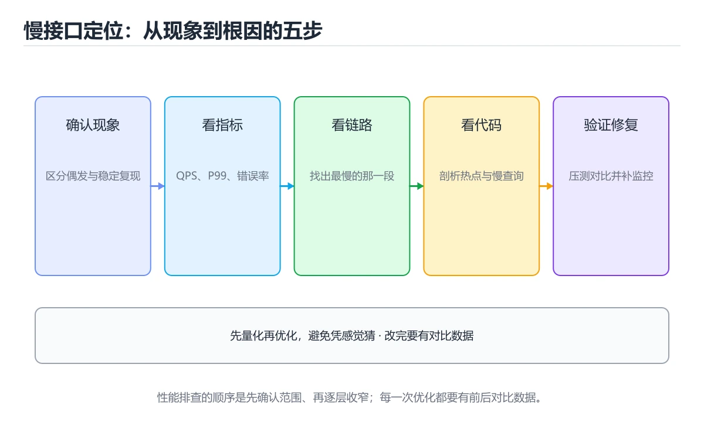
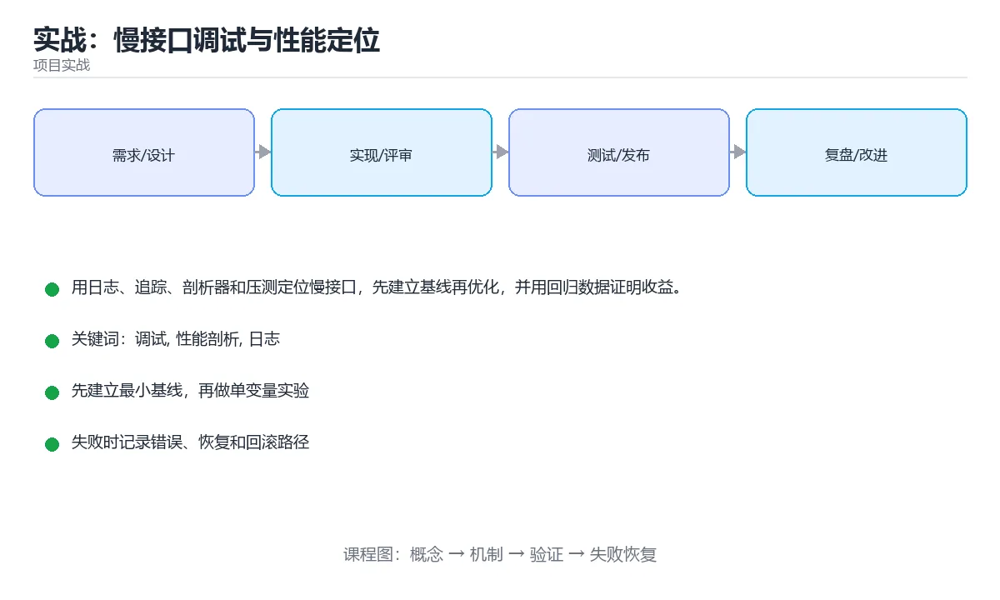

# 实战：慢接口调试与性能定位





> 内容更新时间：2026-10-06 · 学习阶段：高级 · 预计用时：60 分钟

## 学习目标

- 能把模糊的“接口很慢”转成可测量的延迟指标。
- 能用日志与追踪区分排队、数据库、外部调用和序列化耗时。
- 能先提出可证伪假设，再设计单变量实验。
- 能用基准测试和回归门禁证明优化没有制造新问题。

## 前置知识

- 已完成本分类的基础与进阶课程，能独立运行正文中的最小示例。
- 熟悉命令行、依赖管理、测试和 Git 基本操作。
- 本课涉及：调试、性能剖析、日志、追踪、压测。

## 项目背景

订单查询接口平均延迟正常，但 P95 持续升高，部分请求超过三秒。团队已经尝试增加线程和缓存却没有改善；你需要从现象、证据、假设和实验四步定位根因，并提交可复现的优化前后对比。

一句话摘要：用日志、追踪、剖析器和压测定位慢接口，先建立基线再优化，并用回归数据证明收益。

## 技术栈

- Python 3.12
- logging
- cProfile
- py-spy
- pytest-benchmark
- OpenTelemetry

## 架构与数据流

```text
输入 → 参数校验 → 业务处理 → 持久化/外部调用 → 结果输出 → 指标与日志
                 ↘ 失败分类 → 重试/回滚 → 错误响应
```

- 读路径要明确查询条件、分页方式和返回字段，避免一次加载全部数据。
- 写路径要明确事务边界、幂等键和失败补偿，不能留下半完成状态。
- 外部调用要设置超时、重试上限和降级策略。
- 每个关键阶段都要留下日志、指标或测试证据。

## 功能范围

- [ ] 请求级结构化日志与追踪号
- [ ] 分阶段耗时指标和慢请求采样
- [ ] 可重复的固定数据集压测脚本
- [ ] 一次只改一个变量的对照实验
- [ ] 优化前后 P50/P95/P99 与错误率报告

## 示例数据与边界

| 场景 | 输入 | 期望结果 | 检查点 |
| --- | --- | --- | --- |
| 正常路径 | 合法的最小数据集 | 成功返回并写入正确数据 | 状态码、数据库记录、日志 |
| 边界值 | 最大值、最小值或空集合 | 明确成功或给出可理解错误 | 不崩溃、不越界、不写半条数据 |
| 非法输入 | 类型错误、缺字段、超长内容 | 返回校验错误并指出字段 | 错误结构统一且不泄露内部信息 |
| 依赖失败 | 数据库不可用、超时、网络抖动 | 重试、降级或快速失败 | 可恢复、可观测、无重复副作用 |

## 实施步骤

### 步骤 1：定义服务等级目标和可复现基线

- 输入与产出：先写清本步依赖的配置、数据和最终产物，再开始编码。
- 验证方法：用最小请求、最小数据集或单元测试证明本步结果正确。
- 失败处理：记录错误类型、回滚动作和重试条件，避免把问题带到下一步。
- 证据留存：保留命令、输出、日志或截图，方便评审与复盘。

### 步骤 2：给请求、数据库和外部调用加追踪字段

「实战：慢接口调试与性能定位」的「步骤 2：给请求、数据库和外部调用加追踪字段」一节补全如下：

- 定位：这一节说明步骤 2：给请求、数据库和外部调用加追踪字段在「实战：慢接口调试与性能定位」知识体系里的位置。
- 要点：能用日志与追踪区分排队、数据库、外部调用和序列化耗时。
- 自检：能否用一个最小例子解释步骤 2：给请求、数据库和外部调用加追踪字段？

### 步骤 3：用剖析器识别 CPU 与等待时间占比

「实战：慢接口调试与性能定位」的「步骤 3：用剖析器识别 CPU 与等待时间占比」一节补全如下：

- 定位：这一节说明步骤 3：用剖析器识别 CPU 与等待时间占比在「实战：慢接口调试与性能定位」知识体系里的位置。
- 要点：一句话摘要：用日志、追踪、剖析器和压测定位慢接口，先建立基线再优化，并用回归数据证明收益。
- 自检：能否用一个最小例子解释步骤 3：用剖析器识别 CPU 与等待时间占比？

### 步骤 4：按假设顺序验证索引、N+1、序列化和连接池

把这条结论放回「实战：慢接口调试与性能定位」的完整流程里展开：

- 正文依据：证据留存：保留命令、输出、日志或截图，方便评审与复盘。
- 落地检查：把「步骤 4：按假设顺序验证索引、N+1、序列化和连接池」改写成一条可执行的核对项，逐条验证输入、超时与失败路径。

### 步骤 5：实施最小修复并重复压测

「实战：慢接口调试与性能定位」的「步骤 5：实施最小修复并重复压测」一节补全如下：

- 定位：这一节说明步骤 5：实施最小修复并重复压测在「实战：慢接口调试与性能定位」知识体系里的位置。
- 要点：出现异常时能从日志和指标还原时间线，而不是只看到一句“服务不可用”。
- 自检：能否用一个最小例子解释步骤 5：实施最小修复并重复压测？

### 步骤 6：保留回归用例、指标看板和回滚方案

「实战：慢接口调试与性能定位」的「步骤 6：保留回归用例、指标看板和回滚方案」一节补全如下：

- 定位：这一节说明步骤 6：保留回归用例、指标看板和回滚方案在「实战：慢接口调试与性能定位」知识体系里的位置。
- 要点：症状：在本课的练习或生产场景里出现“本课的 调试 常规用例通过，但边界用例失败”。
- 自检：能否用一个最小例子解释步骤 6：保留回归用例、指标看板和回滚方案？

## 关键代码

```python
import cProfile, pstats
from contextlib import contextmanager
import time

@contextmanager
def stage(name: str, timings: dict[str, float]):
    started = time.perf_counter()
    try:
        yield
    finally:
        timings[name] = (time.perf_counter() - started) * 1000

with cProfile.Profile() as profiler:
    timings = {}
    with stage('database', timings):
        rows = repository.query_orders()
    with stage('serialize', timings):
        payload = serializer.dump(rows)

pstats.Stats(profiler).sort_stats('cumulative').print_stats(20)
print({key: round(value, 2) for key, value in timings.items()})
```

## 验证命令与预期输出

```text
1. 安装依赖并启动项目
2. 执行至少 3 条自动化测试，其中包含 1 条失败路径
3. 用正常请求验证成功响应
4. 用非法输入验证错误响应
5. 重复执行一次，确认没有重复写入或副作用
```

## 建议目录结构

```text
src/
  entry/        启动与配置
  domain/       业务模型与规则
  service/      用例编排
  infra/        数据库、HTTP、消息等适配器
tests/          单元、集成与接口测试
```

## 质量门禁

- [ ] 格式化和静态检查通过，不遗留明显警告。
- [ ] 单元测试覆盖核心规则，集成测试覆盖数据库或外部边界。
- [ ] 错误响应不泄露堆栈、SQL 和密钥。
- [ ] 配置来自环境变量或配置文件，不硬编码敏感信息。
- [ ] README 写清启动、测试、配置和回滚步骤。

## 安全、成本与可观测性

- 权限遵循最小授权，数据库账号、云资源和接口令牌都不能使用管理员默认权限。
- 所有外部输入都要校验、限长并转义，错误信息不能泄露内部路径和 SQL。
- 密钥通过环境变量或密钥管理服务注入，并记录轮换方式。
- 为数据库连接、线程/协程、队列、文件和网络请求设置上限，避免资源耗尽。
- 至少记录请求量、错误率、P95/P99 延迟、资源使用和成本趋势。
- 出现异常时能从日志和指标还原时间线，而不是只看到一句“服务不可用”。

## 测试与验收

- 固定数据集下基线可重复且报告包含 P95/P99
- 注入数据库延迟时追踪能定位到对应阶段
- 修复后正确性测试与原结果一致
- 错误率或延迟回退时 CI 性能门禁会失败

### 验收记录表

| 检查项 | 证据 | 结果 | 备注 |
| --- | --- | --- | --- |
| 最小路径可运行 | 启动命令与输出 |  |  |
| 失败路径可恢复 | 错误日志与重试 |  |  |
| 自动化测试通过 | 测试报告 |  |  |
| 配置和密钥安全 | 配置检查 |  |  |

## 常见错误与排查

| 问题 | 原因 | 解决 |
| --- | --- | --- |
| 看到慢就盲目加缓存 | 缓存掩盖根因并引入一致性风险 | 先测量再选择优化手段 |
| 只记录平均延迟 | 长尾问题被平均值掩盖 | 观察 P95/P99 和错误率 |
| 一次修改多个变量 | 无法判断收益来自哪里 | 每次实验只改一个因素 |
| 优化后没有回归测试 | 功能正确性被悄悄破坏 | 保留契约测试与基准测试 |

## 扩展任务

- 接入分布式链路追踪和火焰图
- 用生产流量回放验证长尾请求
- 将性能预算写入发布门禁

## 性能、容量与故障演练

| 维度 | 基线 | 压测方法 | 失败信号 |
| --- | --- | --- | --- |
| 延迟 | 记录 P50/P95/P99 | 用固定数据集逐步增加并发 | P99 持续上升或超时率增加 |
| 吞吐 | 记录每秒处理量 | 逐步加压直到资源打满 | 队列积压、CPU/内存饱和 |
| 存储 | 记录数据增长与索引大小 | 导入 10 倍数据并观察查询 | 磁盘、连接或锁等待成为瓶颈 |
| 恢复 | 记录故障恢复时间 | 停止数据库、注入延迟或重复请求 | 数据不一致、重复副作用、无法回滚 |

## 实施记录与复盘

每完成一步，记录以下内容：

1. 本步的输入、命令和输出是什么？
2. 遇到的最小失败是什么，如何定位和修复？
3. 哪个假设被验证或推翻？
4. 下一步的风险是什么，如何回滚？
5. 如果数据量或并发扩大 10 倍，最先出现的瓶颈在哪里？

## 动手练习

### 练习 1：最小可运行版本（30 分钟）

只实现最核心的一条路径，确保能启动、能返回结果、能运行测试。

**验收标准**：留下启动命令、请求示例和成功输出。

### 练习 2：失败路径（30 分钟）

制造一次输入错误、依赖失败或超时，记录系统如何报错、如何恢复。

**验收标准**：错误信息清晰，且不会破坏已有数据。

### 练习 3：扩展一个功能（60 分钟）

从扩展任务中选一项实现，并补一条自动化测试。

**验收标准**：新功能通过测试，且原有测试不回归。

## 本课小结

- 项目课的核心不是堆功能，而是把输入、状态、错误和验收标准连接起来。
- 先跑通最小路径，再补失败处理、测试和文档，最后才做性能优化。
- 每个阶段都要留下可复现证据：命令、输出、测试和变更记录。
- 完成后用扩展任务检验迁移能力，而不是只复制示例代码。

## 完成标准

- [ ] 能从干净环境按 README 启动项目。
- [ ] 至少 3 条自动化测试通过，且包含一条失败路径。
- [ ] 能演示一次错误、一次恢复和一次回滚。
- [ ] 有一份资源或性能基线，能说明瓶颈在哪里。
- [ ] 能说清一个尚未解决的问题和下一步验证方法。

## 可运行练习

### 任务 1：先跑通，再解释

```python
import cProfile, pstats
from contextlib import contextmanager
import time

@contextmanager
def stage(name: str, timings: dict[str, float]):
    started = time.perf_counter()
    try:
        yield
    finally:
        timings[name] = (time.perf_counter() - started) * 1000

with cProfile.Profile() as profiler:
    timings = {}
    with stage('database', timings):
        rows = repository.query_orders()
    with stage('serialize', timings):
        payload = serializer.dump(rows)

pstats.Stats(profiler).sort_stats('cumulative').print_stats(20)
print({key: round(value, 2) for key, value in timings.items()})
```

### 任务 2：只改一个条件

把「实战：慢接口调试与性能定位」的最小示例复制一份，只改一个条件再跑一次：

- 改动点：只把调试的输入换成空值、极值或错误输入，其余保持不变。
- 预测：先写下「实战：慢接口调试与性能定位」在改动后的输出或错误信息，再运行。
- 记录：对照改动前后的结果，指出差异出在哪一步。
- 验收：换回原条件能复现原结果，改动只影响调试。

### 任务 3：迁移到自己的数据

用同一套思路处理一组你自己的数据或场景，保持输出格式与任务 1 一致。

## 故障现场

### 现场 1：本课的 调试 常规用例通过，但边界用例失败

**症状**：在本课的练习或生产场景里出现“本课的 调试 常规用例通过，但边界用例失败”。

**复现**：准备一组最小输入，只保留触发“本课的 调试 常规用例通过，但边界用例失败”的必要条件，连续运行两次确认结果稳定。

**定位**：围绕“调试 的前置条件与取值边界没有写进代码，默认值掩盖了空值和极值”检查调用链、输入数据和环境配置，先验证假设再改代码。

**预防**：把“本课的 调试 常规用例通过，但边界用例失败”写成一条自动化用例，并在本课的验收清单里保留对应检查项。

### 现场 2：本课的 性能剖析 结果在两次运行之间不一致

**症状**：在本课的练习或生产场景里出现“本课的 性能剖析 结果在两次运行之间不一致”。

**复现**：准备一组最小输入，只保留触发“本课的 性能剖析 结果在两次运行之间不一致”的必要条件，连续运行两次确认结果稳定。

**定位**：围绕“性能剖析 依赖了当前版本、执行顺序或共享状态，单次运行无法暴露差异”检查调用链、输入数据和环境配置，先验证假设再改代码。

**预防**：把“本课的 性能剖析 结果在两次运行之间不一致”写成一条自动化用例，并在本课的验收清单里保留对应检查项。

### 现场 3：本课的验证只在开发机通过

**症状**：在本课的练习或生产场景里出现“本课的验证只在开发机通过”。

**定位**：围绕“环境版本、配置和输入规模与目标环境不同，调试 缺少可重复的验证记录”检查调用链、输入数据和环境配置，先验证假设再改代码。

## 本课复习清单

离开本课前，逐项确认：

- [ ] 不看解析，能说出「面对“订单接口很慢”的反馈，调试第一步最合适的是什么？」的判断依据。
- [ ] 不看解析，能说出「为什么定位性能问题时要重点观察 P95/P99 而不是只看平均值？」的判断依据。
- [ ] 不看解析，能说出「一次性能实验为什么应该只改变一个变量？」的判断依据。
- [ ] 不看解析，能说出「完成性能修复后，哪项证据最有说服力？」的判断依据。
- [ ] 不看解析，能说出「把实战：慢接口调试与性能定位中「项目专属规格：实战：」的判断依据。
- [ ] 至少运行一次本课示例，记录输入、输出和一个边界情况。
- [ ] 把本课最容易混淆的两个概念写成一句话对照。

| 复盘项 | 记录 |
| --- | --- |
| 已经能独立解释的考点 |  |
| 仍然说不清的概念 |  |
| 下一步验证动作 |  |

## 术语速查

| 术语 | 一句话说明 |
| --- | --- |
| `调试` | 围绕“环境版本、配置和输入规模与目标环境不同，调试 缺少可重复的验证记录”检查调用链、输入数据和环境配置，先验证假设再改代码。 |
| `性能剖析` | 围绕“性能剖析 依赖了当前版本、执行顺序或共享状态，单次运行无法暴露差异”检查调用链、输入数据和环境配置，先验证假设再改代码。 |
| `日志` | 用日志、追踪、剖析器和压测定位慢接口，先建立基线再优化，并用回归数据证明收益。 |
| `追踪` | 一句话摘要：用日志、追踪、剖析器和压测定位慢接口，先建立基线再优化，并用回归数据证明收益。 |
| `压测` | 用日志、追踪、剖析器和压测定位慢接口，先建立基线再优化，并用回归数据证明收益。 |

## 考点精讲

### 考点 1：多选辨析·调试

- **题目**：围绕“实战：慢接口调试与性能定位”中的 调试、性能剖析、日志，下列哪两项是本课强调的实践判断？
- **判断依据**：本课把实战：慢接口调试与性能定位拆成概念、示例与故障现场三部分，因此判断 调试 时必须同时交代输入、输出和失败路径，这使“学习 调试 时要同时说明输入、输出和失败路径，不能只看正常流程”成立。在实战：慢接口调试与性能定位里，判断 性能剖析 时要固定版本与边界输入，所以“验证 性能剖析 时要固定版本并覆盖边界输入，结论才可复现”才可复现。

### 考点 2：代码补全·调试

- **题目**：阅读「实战：慢接口调试与性能定位」正文里的这段 Python 代码，下面哪一项判断是正确的？
- **判断依据**：题干的正确项是这段代码包含循环结构，同一段逻辑会被重复执行，在「实战：慢接口调试与性能定位」里循环次数与调试的输入规模直接相关。这段代码出自「实战：慢接口调试与性能定位」的正文示例，围绕调试、性能剖析、日志展开；把输入或边界换成空值、极值或失败情况后，结论要以「实战：慢接口调试与性能定位」的实际运行结果为准。这道题的关键在「实战：慢接口调试与性能定位」的调试、性能剖析、日志：先确认题干“阅读实战”问的是哪一步，再排除偷换前提的选项。

### 考点 3：概念判断·调试

- **题目**：一次性能实验为什么应该只改变一个变量？
- **判断依据**：在「实战：慢接口调试与性能定位」里，可以把观察到的变化归因到该变量。如果同时加索引、改缓存并扩大连接池，即使指标变好也无法知道哪项措施有效，更无法判断其余改动是否带来一致性或维护成本。把“可以把观察到的变化归因到该变量”代回「实战：慢接口调试与性能定位」里“一次性能实验为什么应该只改变一个变量”的例子核对，条件一旦改变，结论就要用调试、性能剖析、日志重新推导。

### 考点 4：概念判断·调试

- **题目**：完成性能修复后，哪项证据最有说服力？
- **判断依据**：结论应落在「删除旧日志」。可信结论需要可复现环境、相同输入和压力、完整的延迟与错误率对比，同时证明功能结果未改变并说明失败时如何回滚。在「实战：慢接口调试与性能定位」里，这道题要求区分概念与边界，「删除旧日志」只有在题干给出的前提下才成立，而「开发者觉得更快」、「只展示一次最快请求」缺少同一组条件。

### 考点 5：顺序排列·调试

- **题目**：把「实战：慢接口调试与性能定位」中「项目专属规格：实战：慢接口调试与性能定位」的步骤调整为正确顺序。
- **判断依据**：在「实战：慢接口调试与性能定位」里，正确的执行顺序是「正常路径：最小输入得到预期输出，并留下日志与指标」 → 「边界路径：空值、最大值、重复数据和超长内容得到明确处理」 → 「失败路径：依赖超时或不可用时能快速失败、重试或降级」 → 「幂等路径：同一请求执行两次不会产生重复副作用」。

## 复习与自测

- [ ] 能不看正文写出「项目背景」的关键步骤。
- [ ] 能用一句话说明「架构与数据流」解决什么问题。
- [ ] 能把「功能范围」的判断标准套到一个新例子上。
- [ ] 能说清「示例数据与边界」的结论，并说出它的适用边界。
- [ ] 能用自己的话复述「实施步骤」，并各举一个正例和反例。
- [ ] 能解释「步骤 1：定义服务等级目标和可复现基线」里最容易混淆的两个概念。

## English Overview

**Title:** Project: Debug and Profile a Slow API

**Summary:** Use logs, traces, profilers and load tests to find and fix a real API bottleneck.

**Category:** Project Practice
**Level:** 高级
**Key terms:** 调试, 性能剖析, 日志, 追踪, 压测

## 内容元数据

- 内容版本：v2.0
- 最后更新：2026-10-06
- 学习阶段：高级
- 适用环境：通用项目交付流程
- 内容来源：内置结构化课程与工程实践整理
- 相关主题：调试、性能剖析、日志、追踪、压测
- 质量版本：P0 测验标准 + P1 覆盖扩展 + P2 体验补全

## 项目专属规格：实战：慢接口调试与性能定位

### 核心场景

用日志、追踪、剖析器和压测定位慢接口，先建立基线再优化，并用回归数据证明收益。 项目目标是把「调试、性能剖析、日志、追踪、压测」落实为可运行、可测试、可回滚的交付物。

### 架构与数据流

```text
用户/输入 → 接口或命令 → 领域逻辑 → 存储/外部依赖 → 输出与监控
                         ↘ 失败分类 → 重试/补偿 → 回滚
```

### 最小数据模型

| 对象 | 关键字段 | 约束 |
| --- | --- | --- |
| 输入实体 | 调试、时间、来源 | 必填校验、长度限制、幂等键 |
| 任务实体 | 状态、优先级、创建时间 | 状态迁移合法、不可重复执行 |
| 结果实体 | 输出、错误码、耗时 | 可序列化、错误可解释 |
| 审计记录 | 操作者、动作、结果、时间 | 不可篡改、可查询、脱敏 |

### 验收场景

1. 正常路径：最小输入得到预期输出，并留下日志与指标。
2. 边界路径：空值、最大值、重复数据和超长内容得到明确处理。
3. 失败路径：依赖超时或不可用时能快速失败、重试或降级。
4. 幂等路径：同一请求执行两次不会产生重复副作用。
5. 回滚路径：回滚后数据一致，且能说明恢复时间和影响范围。

## 项目交付物

### 建议仓库结构

```text
src/
tests/
docs/
README.md
```

### 测试矩阵

| 层级 | 覆盖内容 | 最低数量 | 通过标准 |
| --- | --- | ---: | --- |
| 单元测试 | 领域规则、边界和错误分类 | 8 | 正常、边界、失败路径全部通过 |
| 集成测试 | 数据库、网络、文件或平台边界 | 3 | 使用真实边界且可重复运行 |
| 端到端测试 | 核心用户路径 | 1 | 从输入到输出完整跑通 |
| 手动验收 | 文档中列出的 5 个场景 | 5 | 有命令、输出和结论记录 |

### 验收数据

```json
{
  "project": "project_debug_performance_triage",
  "input": {"case": "normal", "value": 5},
  "expected": {"ok": true, "result": 5},
  "failure_case": {"value": -1, "error": "validation_error"},
  "idempotency_key": "demo-001"
}
```

### 复盘模板

| 问题 | 记录 |
| --- | --- |
| 原目标是什么？ | 用一句话描述可验收目标 |
| 实际发生了什么？ | 时间线、指标和关键日志 |
| 哪个假设被推翻？ | 根因与促成因素 |
| 如何回滚？ | 步骤、耗时和数据校验 |
| 下一步做什么？ | 负责人、期限和验证方式 |

> 项目验收围绕「调试、性能剖析、日志」：至少完成一次正常路径、一次边界输入、一次失败恢复和一次幂等检查。

## 参考资料与复核

- 最后复核：2026-10-04
- 下次复核：2027-04-04
- 复核范围：版本兼容、API 行为、安全建议与工程实践
- 来源性质：官方文档、标准或权威教材；正文为离线教学重组

| 参考资料 | 本课用途 |
| --- | --- |
| [OpenTelemetry 文档](https://opentelemetry.io/docs/) | 日志、指标与链路追踪 |
| [Docker 入门](https://docs.docker.com/get-started/) | 容器化与 Compose |
| [OpenAI Cookbook](https://cookbook.openai.com/) | AI 应用与评估实践 |

> 「实战：慢接口调试与性能定位」的链接用于离线阅读后的延伸核对；App 不会自动联网。

## Full English Study Guide

### Overview

**Project: Debug and Profile a Slow API** focuses on Use logs, traces, profilers and load tests to find and fix a real API bottleneck.

### Learning Outcomes

- Explain what **Project: Debug and Profile a Slow API** solves and when it should be used.

### Glossary

- Topic: **Project: Debug and Profile a Slow API**
- Related terms: 调试, 性能剖析, 日志, 追踪
