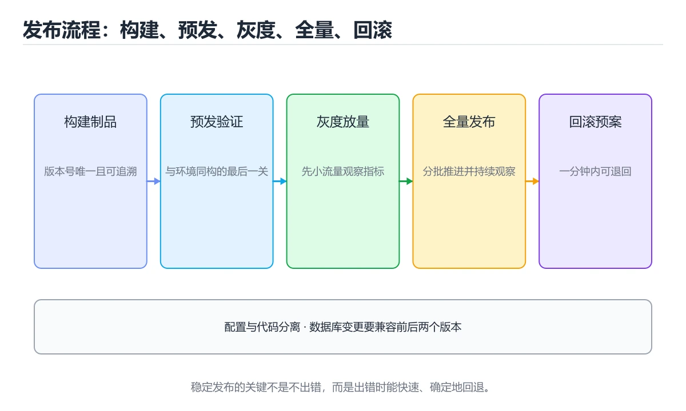

# 部署与运维：稳定发布与快速回滚

> 内容更新时间：2026-10-06 · 学习阶段：进阶 · 预计用时：95 分钟




## 本节知识框架

**课程定位**：所属分类 `project_practice`（项目实战），课程主题 `部署与运维：稳定发布与快速回滚`，学习阶段 进阶，建议用时 105 分钟。

本课主线：环境一致、发布策略、回滚方案、可观测性与上线检查清单。

**学完本课应当能够**
- 说清 `部署` 与 `灰度` 的含义与区别，并各举一个正例和一个反例。
- 用本课示例验证 `回滚` 的行为，记录输入、输出与失败条件。
- 遇到「发布没有回滚路径」这类问题时，能说出触发条件与修复顺序。

### 从概念到验证的学习链条

1. `部署`：先掌握 把构建产物、配置和依赖发布到目标环境并使其可对外服务，再用它解释 `灰度` 为什么会出现。
2. `灰度`：先掌握 先让少量用户或流量使用新版本，观察指标后再逐步扩大，再用它解释 `回滚` 为什么会出现。
3. `回滚`：先掌握 环境一致、发布策略、回滚方案、可观测性与上线检查清单，再用它解释 `可观测性` 为什么会出现。
4. `可观测性`：先掌握 用日志、指标与链路追踪还原线上状态，灰度与回滚都要靠它判断是否恶化，再用它解释 本课示例的观察结果 为什么会出现。

**先修与衔接**：本课是「项目实战」分类的第 4 课。先修内容：《测试与质量门禁：把问题挡在上线前》。《测试与质量门禁：把问题挡在上线前》里的 `测试`、`质量门禁` 是本课的前提。相关或后续课程：《复盘与改进：让团队一次比一次快》、《实战：Shell 零停机部署脚本》、《实战：搭一条完整 CI/CD 流水线》。

### 完成判据

- **定义关**：不看正文也能说明 `部署` 是 把构建产物、配置和依赖发布到目标环境并使其可对外服务，并指出一个反例。
- **机制关**：能按“输入 → 转换 → 输出 → 验证”复述 `部署与运维：稳定发布与快速回滚`，而不是只背结论。
- **示例关**：能运行或推演 `部署与运维：稳定发布与快速回滚` 的 `text` 示例，并说明一个真实出现的标识符或字面量。
- **证据关**：能从 `部署与运维：稳定发布与快速回滚` 的示例写出一个输入、处理、输出三元组，并说明它支持或反驳了本课的哪一条结论。
- **排错关**：能复现 发布没有回滚路径，记录现象并按 准备好可回滚版本与一键切换流程 修复。
- **迁移关**：能把 `部署`、`灰度`、`回滚`、`可观测性` 放进一个与 `部署与运维：稳定发布与快速回滚` 不同的项目场景，并保持输入与验证条件可追踪。
- **复盘关**：学完 `部署与运维：稳定发布与快速回滚` 后，用一句话写下仍然不确定的结论，并列出下一次验证需要的输入、环境和成功判据。

### 复习清单

- [ ] 能不看正文复述本课核心术语，并指出一个边界或反例。
- [ ] 能运行或推演本课示例，记录输入、输出与失败现象。
- [ ] 能完成一次自测，并把错题对照错误表定位原因。

## 核心概念定义

| 术语 | 操作性定义 | 常见边界与风险 |
| --- | --- | --- |
| 部署 | 把构建产物、配置和依赖发布到目标环境并使其可对外服务。 | 不同版本与依赖组合的行为可能不同，升级或换环境前要按官方变更说明重新验证。 |
| 灰度 | 先让少量用户或流量使用新版本，观察指标后再逐步扩大。 | 易错：一次故障影响全部用户；正确做法是先小流量验证，确认指标正常后再逐步放量。 |
| 回滚 | 环境一致、发布策略、回滚方案、可观测性与上线检查清单。 | 易错：出问题只能硬扛或手工救火；正确做法是准备好可回滚版本与一键切换流程。 |
| 可观测性 | 用日志、指标与链路追踪还原线上状态，灰度与回滚都要靠它判断是否恶化。 | 隔离级别与并发事务会影响可见性，换级别或换存储引擎后要重新验证。 |

## 原理与运行机制

### 机制总览

**教材衔接：一句话目标**

能不能稳定发布，取决于三件事：**环境一致、发布可回滚、状态可观测**。

**教材衔接：一张图看懂发布流程**

```text
构建一次（产出不可变制品，用 commit SHA 命名）
      │
      ▼
部署到预发环境 → 跑冒烟测试
      │
      ▼
灰度发布（5% 流量）
      │  观察：错误率、P95 延迟、业务指标
      ├── 异常 → 立即回滚（1 分钟内）
      ▼
逐步放量 25% → 50% → 100%
      │
      ▼
观察 30 分钟 → 发布完成，记录变更
```

**教材衔接：交付评审：评分表、决策记录与证据链**

### 一、「部署与运维：稳定发布与快速回滚」的交付物评分表

| 交付物 | 权重 | 合格线 | 需要的证据 |
| --- | ---: | --- | --- |
| 核心链路 | 34% | 能在干净环境复现，且失败路径有明确处理 | 命令与输出、对应测试、一次失败与恢复记录 |
| 测试与验收记录 | 33% | 能在干净环境复现，且失败路径有明确处理 | 命令与输出、对应测试、一次失败与恢复记录 |
| 运行与回滚说明 | 33% | 能在干净环境复现，且失败路径有明确处理 | 命令与输出、对应测试、一次失败与恢复记录 |

### 二、需要写下来的决策（ADR）

| 决策点 | 本课给出的做法 | 备选方案 | 代价与回滚 |
| --- | --- | --- | --- |
| 架构与数据流 | 用户/输入 → 接口或命令 → 领域逻辑 → 存储/外部依赖 → 输出与监控 | 不做「架构与数据流」，沿用最朴素的实现（需要额外补一次对照实验） | 若「架构与数据流」出问题，回到上一版本并按本课验收场景重跑 |

### 三、「部署与运维：稳定发布与快速回滚」的交付证据链

本课未给出可执行命令，用下面的最小证据集代替：

### 四、「部署与运维：稳定发布与快速回滚」的验收指标

| 指标 | 目标值 | 测量方式 | 不达标时的动作 |
| --- | --- | --- | --- |
| | 回滚耗时 | ≤ 1 分钟（应用层） | | 用本课正文给出的阈值，没有就写实测基线 | 固定环境重复三次取中位数 | 回到对应小节定位，先修原因再重测 |
| | 回滚后指标 | 5 分钟内恢复基线 | | 用本课正文给出的阈值，没有就写实测基线 | 固定环境重复三次取中位数 | 回到对应小节定位，先修原因再重测 |

### 五、评审记录模板

| 记录项 | 填写要求 |
| --- | --- |
| 项目标识 | `project_deploy_ops` |
| 本次范围 | 说明这一轮交付了「部署与运维：稳定发布与快速回滚」的哪些部分 |
| 未完成项 | 列出与 部署 相关但本轮未做的内容 |
| 证据位置 | 指向 evidence/ 目录下的具体文件 |
| 风险与回滚 | 写清剩余风险、回滚步骤和验证方式 |
| 结论 | 通过 / 有条件通过 / 不通过，三者选一 |

### 机制拆解：每一步的输入、动作与输出

#### 1. `部署`
- 输入：`部署`；本步把 把构建产物、配置和依赖发布到目标环境并使其可对外服务 当作判断规则。
- 动作：围绕 `部署` 保留中间状态，并记录它与 `灰度` 的对应关系。
- 输出：`灰度`，它可以被下一段代码、测试或记录继续使用。
- `部署` 的失败条件：不同版本与依赖组合的行为可能不同，升级或换环境前要按官方变更说明重新验证。

#### 2. `灰度`
- 输入：`部署`；本步把 先让少量用户或流量使用新版本，观察指标后再逐步扩大 当作判断规则。
- 动作：围绕 `灰度` 保留中间状态，并记录它与 `回滚` 的对应关系。
- 输出：`回滚`，它可以被下一段代码、测试或记录继续使用。
- `灰度` 的失败条件：当变更不做灰度时，会出现一次故障影响全部用户。

#### 3. `回滚`
- 输入：`灰度`；本步把 环境一致、发布策略、回滚方案、可观测性与上线检查清单 当作判断规则。
- 动作：围绕 `回滚` 保留中间状态，并记录它与 `可观测性` 的对应关系。
- 输出：`可观测性`，它可以被下一段代码、测试或记录继续使用。
- `回滚` 的失败条件：当发布没有回滚路径时，会出现出问题只能硬扛或手工救火。

#### 4. `可观测性`
- 输入：`回滚`；本步把 用日志、指标与链路追踪还原线上状态，灰度与回滚都要靠它判断是否恶化 当作判断规则。
- 动作：围绕 `可观测性` 保留中间状态，并记录它与 `本课示例的最终结果` 的对应关系。
- 输出：`本课示例的最终结果`，它可以被下一段代码、测试或记录继续使用。
- `可观测性` 的失败条件：隔离级别与并发事务会影响可见性，换级别或换存储引擎后要重新验证。

### 复现实验记录

- 环境：`部署与运维：稳定发布与快速回滚` 使用 `text` 示例，固定 `部署`、`灰度`、`回滚`、`可观测性` 作为第一组条件。
- 首轮输入：从示例中的第一个输入开始，预测 `部署` 会怎样变化。
- 基线观察：记录命令、输入、输出和错误原文，不用截图代替可复制的文本。
- 单变量修改：只改变 `部署`，观察 `可观测性` 是否仍满足定义。
- 失败注入：复现 发布没有回滚路径，确认现象是 出问题只能硬扛或手工救火。
- 记录结论：把“修改前、修改后、预期变化、实际变化”写成四列表，这样复盘 `部署与运维：稳定发布与快速回滚` 时才能区分概念错误与实现错误。

## 典型应用场景

**教材衔接：项目专属规格：部署与运维：稳定发布与快速回滚**

### 核心场景

环境一致、发布策略、回滚方案、可观测性与上线检查清单。 项目目标是把「部署、灰度、回滚、可观测性、发布」落实为可运行、可测试、可回滚的交付物。

### 架构与数据流

```text
用户/输入 → 接口或命令 → 领域逻辑 → 存储/外部依赖 → 输出与监控
                         ↘ 失败分类 → 重试/补偿 → 回滚
```


### 验收场景

1. 正常路径：最小输入得到预期输出，并留下日志与指标。
2. 边界路径：把 GIT_SHA 的输入推到上下限，确认返回结果可解释。
3. 失败路径：依赖超时或不可用时能快速失败、重试或降级。
4. 幂等路径：同一请求执行两次不会产生重复副作用。
5. 回滚路径：撤掉 GIT_SHA 的变更后，数据与资源都回到变更前的状态。

**教材衔接：项目交付物**

### 建议仓库结构

```text
src/
tests/
docs/
README.md
```


### 验收数据

```json
{
  "project": "project_deploy_ops",
  "scenario": "部署的正常路径",
  "input": {"case": "normal", "value": "GIT_SHA"},
  "expected": {"ok": true, "checks": ["部署可复现", "灰度有记录"]},
  "failure_case": {"case": "灰度越界或缺失", "error": "validation_error"},
  "idempotency_key": "project_deploy_ops-001"
}
```

### 复盘模板

| 问题 | 记录 |
| --- | --- |
| 原目标是什么？ | 用一句话描述可验收目标 |
| 实际发生了什么？ | 时间线、指标和关键日志 |
| 哪个假设被推翻？ | 根因与促成因素 |
| 如何回滚？ | 步骤、耗时和数据校验 |
| 下一步做什么？ | 负责人、期限和验证方式 |

- **发布没有回滚路径**：典型现象是出问题只能硬扛或手工救火；正确做法是准备好可回滚版本与一键切换流程。
- **变更不做灰度**：典型现象是一次故障影响全部用户；正确做法是先小流量验证，确认指标正常后再逐步放量。
- **只看进程是否启动**：典型现象是缺少业务指标验证；正确做法是发布后校验关键业务指标与错误日志。

### 最小验证场景

- 准备：保留 `text` 示例的原始输入，先记录 `部署与运维：稳定发布与快速回滚` 的基线输出和完整运行命令。
- 判定：新结果与 `部署与运维：稳定发布与快速回滚` 的基线不同不等于错误；只有当差异破坏了 `部署` 的定义或错误表中的约束，才判定为失败。

### 选择与边界

- 使用 `部署` 时，先满足它的定义：把构建产物、配置和依赖发布到目标环境并使其可对外服务；不同版本与依赖组合的行为可能不同，升级或换环境前要按官方变更说明重新验证。
- 使用 `灰度` 时，先满足它的定义：先让少量用户或流量使用新版本，观察指标后再逐步扩大；易错：一次故障影响全部用户；正确做法是先小流量验证，确认指标正常后再逐步放量。
- 使用 `回滚` 时，先满足它的定义：环境一致、发布策略、回滚方案、可观测性与上线检查清单；易错：出问题只能硬扛或手工救火；正确做法是准备好可回滚版本与一键切换流程。
- 使用 `可观测性` 时，先满足它的定义：用日志、指标与链路追踪还原线上状态，灰度与回滚都要靠它判断是否恶化；隔离级别与并发事务会影响可见性，换级别或换存储引擎后要重新验证。

## 代码/协议/SQL 示例

**教材衔接：环境一致的三个要点**

| 要点 | 做法 | 反例 |
| --- | --- | --- |
| 同一制品 | 构建一次，各环境复用 | 每个环境各构建一次 |
| 配置外置 | 用环境变量或配置中心 | 配置写死在代码里 |
| 环境对齐 | 依赖版本、中间件版本一致 | 测试用 MySQL 5.7、生产用 8.0 |

```bash
# 制品用 commit SHA 命名，任何环境都能追溯到具体代码
docker build -t registry.example.com/app:${GIT_SHA} .
docker push registry.example.com/app:${GIT_SHA}
```

**教材衔接：回滚：必须能在 1 分钟内完成**

```text
回滚的三种手段（按优先级）
  1. 切回上一个镜像标签（最快，秒级）
  2. 关闭功能开关（无需重新部署）
  3. 回滚数据库变更（最慢，需谨慎）

数据库变更的铁律：
  · 先加字段（可空），再写代码，最后清理旧字段
  · 不要在发布同一时刻做破坏性变更
```

| 变更类型 | 是否可回滚 | 注意 |
| --- | --- | --- |
| 应用镜像 | 可以 | 秒级切回 |
| 配置 | 可以 | 注意配置兼容 |
| 新增字段 | 可以 | 保留旧字段 |
| 删除字段 | 危险 | 先停止使用，下个版本再删 |
| 数据迁移 | 视情况 | 必须准备反向脚本 |

**教材衔接：可观测性三件套**

```text
指标 Metrics  → 有没有问题（错误率、延迟、吞吐）
日志 Logs     → 出了什么问题（含 trace id）
链路 Traces   → 问题出在哪一环（跨服务调用）
```

```text
发布时必须盯的四个数字
  · 错误率（5xx 占比）
  · P95 与 P99 延迟
  · 关键业务指标（下单量、支付成功率）
  · 资源水位（CPU、内存、连接数）
```

**看分位数而不是平均值**：平均值会把最差的那部分用户完全掩盖。

**教材衔接：一份可用的上线检查清单**

```text
发布前
□ 制品已构建并打标签（commit SHA）
□ 数据库变更已评审，含回滚方案
□ 配置项已补齐（含新环境变量）
□ 监控与告警已覆盖新接口
□ 回滚步骤写在发布单上

发布中
□ 先发预发并跑冒烟测试
□ 灰度 5%，观察 10 分钟
□ 逐步放量，每一步都看指标

发布后
□ 观察 30 分钟无异常
□ 记录变更内容与影响范围
□ 更新值班与文档信息
```

**教材衔接：补充：发布与回滚的落地细节**

### 蓝绿与金丝雀的具体配置

```yaml
# 金丝雀：先给新版本 5% 流量
apiVersion: networking.k8s.io/v1
kind: Ingress
metadata:
  name: app
  annotations:
    nginx.ingress.kubernetes.io/canary: "true"
    nginx.ingress.kubernetes.io/canary-weight: "5"
spec:
  rules:
    - host: example.com
      http:
        paths:
          - path: /
            pathType: Prefix
            backend:
              service:
                name: app-canary
                port: { number: 80 }
```

```text
放量节奏建议
  5%  → 观察 10 分钟（错误率、P95、业务指标）
  25% → 观察 10 分钟
  50% → 观察 15 分钟
  100% → 观察 30 分钟
任何一步指标越界：立即把权重归零（比回滚镜像更快）
```

### 数据库变更的三种安全模式

| 模式 | 做法 | 适用 |
| --- | --- | --- |
| 扩展 | 先加新字段，双写，读旧字段 | 字段改名 |
| 收缩 | 停止写入旧字段，观察后再删除 | 清理历史字段 |
| 影子表 | 写入新表，后台比对，切换读 | 大表结构重构 |

```sql
-- 扩展阶段示例：新增字段并回填
ALTER TABLE orders ADD COLUMN status_v2 text;
UPDATE orders SET status_v2 = status WHERE status_v2 IS NULL;
-- 代码同时写两个字段，读仍走旧字段；确认无异常后再切读、最后删旧列
```

**原则：任何一次发布，数据库变更都要能在不丢数据的前提下回退。**

### 回滚演练：定期做，而不是等出事

```bash
#!/usr/bin/env bash
set -euo pipefail
# 回滚脚本骨架：切回上一个稳定镜像标签
readonly APP="myapp"
readonly PREVIOUS="$(cat /deploy/${APP}/previous_sha)"

echo "回滚 $APP → $PREVIOUS"
kubectl set image deployment/$APP app=registry.example.com/$APP:$PREVIOUS
kubectl rollout status deployment/$APP --timeout=120s
echo "回滚完成，请核对错误率与延迟"
```

| 演练项 | 目标 |
| --- | --- |
| 回滚耗时 | ≤ 1 分钟（应用层） |
| 回滚后指标 | 5 分钟内恢复基线 |
| 数据一致性 | 无丢单、无重复扣款 |
| 演练频率 | 每季度至少一次 |

### SLO 与错误预算

```text
先定 SLI（可测量）：请求成功率 = 2xx+3xx / 总请求
再定 SLO（目标）：30 天窗口内成功率 ≥ 99.9%
错误预算 = 1 - 99.9% = 0.1%

换算成可接受量：
  · 每月 100 万请求 → 可失败 1000 次
  · 预算未用完 → 可以继续快速发布
  · 预算用尽 → 冻结新功能，优先修复稳定性
```

| 用户可感知程度 | 建议 SLO |
| --- | --- |
| 核心交易链路 | 99.95% 以上 |
| 一般业务接口 | 99.9% |
| 内部工具 | 99.5% |

### 上线检查清单（命令级）

```text
发布前
□ 制品已打标签：docker images | grep <sha>
□ 数据库变更已评审并准备回滚脚本
□ 新配置项已在密钥服务中补齐
□ 新增接口已接入监控与告警

发布中
□ kubectl rollout status 无阻塞
□ 灰度 5% 观察 10 分钟
□ 关键业务指标无异常波动

发布后
□ 30 分钟观察窗结束
□ 记录变更内容、影响范围与回滚点
```

### 自查清单

- [ ] 每个服务都能在 1 分钟内回滚
- [ ] 数据库变更与代码发布分开进行
- [ ] 灰度期间固定观察错误率与 P95/P99
- [ ] SLO 有明确口径与统计窗口
- [ ] 每季度做过一次真实回滚演练

**教材衔接：验证命令与预期输出**

「部署与运维：稳定发布与快速回滚」不能只看「能编译」，还要能按固定命令复现结果。下表给出最低验证集：

### 验收证据

- [ ] 保存依赖安装和启动命令的完整输出。
- [ ] 测试覆盖 灰度 的核心规则，并包含一次可预期的失败。
- [ ] 用同一个幂等键重放 GIT_SHA，确认结果与首次一致。
- [ ] 记录一次失败状态码、错误日志和恢复步骤。
- [ ] 写清 GIT_SHA 的运行前提、启动命令与失败回退方式。

### 回归与回滚

1. 先在副本上执行 灰度，并记录前后差异。
2. 修改一处逻辑后重跑全部验证命令，确认没有回归。
3. 若失败，回滚到上一个可运行版本并保留失败日志。
4. 定位原因后补一条自动化测试，再重新执行发布流程。
5. 把教训写入项目复盘或本课笔记，形成下一次的检查项。

### 示例精读：先找证据，再改一个条件

- 在 `部署与运维：稳定发布与快速回滚` 中与 `部署` 对照：示例必须能支持 把构建产物、配置和依赖发布到目标环境并使其可对外服务，否则说明这一段还缺少实现或验证步骤。
- 在 `部署与运维：稳定发布与快速回滚` 中与 `灰度` 对照：示例必须能支持 先让少量用户或流量使用新版本，观察指标后再逐步扩大，否则说明这一段还缺少实现或验证步骤。
- 在 `部署与运维：稳定发布与快速回滚` 中与 `回滚` 对照：示例必须能支持 环境一致、发布策略、回滚方案、可观测性与上线检查清单，否则说明这一段还缺少实现或验证步骤。
- 在 `部署与运维：稳定发布与快速回滚` 中与 `可观测性` 对照：示例必须能支持 用日志、指标与链路追踪还原线上状态，灰度与回滚都要靠它判断是否恶化，否则说明这一段还缺少实现或验证步骤。
- `部署与运维：稳定发布与快速回滚` 的示例没有抽取到函数调用或字面量；按行记录输入、控制流和输出，避免只背代码外形。

## 时间/空间复杂度或性能分析

**性能关注点（部署与运维：稳定发布与快速回滚）**：项目类课程看端到端指标：记录构建时间、接口延迟与资源占用。

**测量方法**：以 `部署与运维：稳定发布与快速回滚` 的 `部署` 场景为对象，固定输入跑一遍记录基线，再把规模或并发度提高一个数量级复测；两次结果的差值与波动范围才是结论依据。

### 需要控制的变量与记录项

- `部署与运维：稳定发布与快速回滚` 的 `部署`：固定它的版本、输入范围和资源上限，分别记录速度、内存与失败率的变化。
- `部署与运维：稳定发布与快速回滚` 的 `灰度`：固定它的版本、输入范围和资源上限，分别记录速度、内存与失败率的变化。
- `部署与运维：稳定发布与快速回滚` 的 `回滚`：固定它的版本、输入范围和资源上限，分别记录速度、内存与失败率的变化。
- `部署与运维：稳定发布与快速回滚` 的 `可观测性`：固定它的版本、输入范围和资源上限，分别记录速度、内存与失败率的变化。
- `部署与运维：稳定发布与快速回滚` 的 `发布`：固定它的版本、输入范围和资源上限，分别记录速度、内存与失败率的变化。
- `部署与运维：稳定发布与快速回滚` 中 `部署` 的边界：不同版本与依赖组合的行为可能不同，升级或换环境前要按官方变更说明重新验证。达到边界时不要外推，必须重新测量。
- `部署与运维：稳定发布与快速回滚` 中 `灰度` 的边界：易错：一次故障影响全部用户；正确做法是先小流量验证，确认指标正常后再逐步放量。达到边界时不要外推，必须重新测量。
- `部署与运维：稳定发布与快速回滚` 中 `回滚` 的边界：易错：出问题只能硬扛或手工救火；正确做法是准备好可回滚版本与一键切换流程。达到边界时不要外推，必须重新测量。
- `部署与运维：稳定发布与快速回滚` 中 `可观测性` 的边界：隔离级别与并发事务会影响可见性，换级别或换存储引擎后要重新验证。达到边界时不要外推，必须重新测量。

## 常见误区与易错点

| 容易写错的做法 | 实际现象 | 原因与正确做法 |
| --- | --- | --- |
| 发布没有回滚路径 | 出问题只能硬扛或手工救火。 | 准备好可回滚版本与一键切换流程。 |
| 变更不做灰度 | 一次故障影响全部用户。 | 先小流量验证，确认指标正常后再逐步放量。 |
| 只看进程是否启动 | 缺少业务指标验证。 | 发布后校验关键业务指标与错误日志。 |

### 现场 1：发布没有回滚路径

**症状**：出问题只能硬扛或手工救火。

**根因与修复**：准备好可回滚版本与一键切换流程。

**自检**：在本课示例里复现「发布没有回滚路径」，改成准备好可回滚版本与一键切换流程后重跑；如果症状消失且失败路径按预期变化，说明定位正确。

### 现场 2：变更不做灰度

**症状**：一次故障影响全部用户。

**根因与修复**：先小流量验证，确认指标正常后再逐步放量。

**自检**：在本课示例里复现「变更不做灰度」，改成先小流量验证，确认指标正常后再逐步放量后重跑；如果症状消失且失败路径按预期变化，说明定位正确。

### 现场 3：只看进程是否启动

**症状**：缺少业务指标验证。

**根因与修复**：发布后校验关键业务指标与错误日志。

**自检**：在本课示例里复现「只看进程是否启动」，改成发布后校验关键业务指标与错误日志后重跑；如果症状消失且失败路径按预期变化，说明定位正确。

## 与其他知识点的关系

**教材衔接：发布策略对照**

| 策略 | 原理 | 优点 | 代价 |
| --- | --- | --- | --- |
| 滚动发布 | 逐批替换实例 | 资源省 | 发布期间新旧版本共存 |
| 蓝绿发布 | 两套环境整体切换 | 回滚最快 | 需要双倍资源 |
| 金丝雀 | 小比例流量先试 | 风险最小 | 需要流量切分能力 |
| 功能开关 | 代码先上线，功能后开 | 与部署解耦 | 开关管理复杂 |

- **先修**：`测试与质量门禁：把问题挡在上线前`。本课默认这些内容已经掌握。
- **相关或后续**：`复盘与改进：让团队一次比一次快`、`实战：Shell 零停机部署脚本`、`实战：搭一条完整 CI/CD 流水线`。本课术语会在这些课程里继续使用。
- **术语归属**：`部署`、`灰度`、`回滚` 的定义以本课「核心概念定义」为准，换到其他课程时先确认定义是否被改写。
- 同一分类的《DevOps CI/CD 流水线实战》也涉及 `可观测性`；两课衔接时先确认这个术语的定义是否一致。

### 先修与后续术语接口

- `实战：Shell 零停机部署脚本`：共享术语 `部署`、`回滚`，共同关键词 `部署`、`回滚`。
- `实战：搭一条完整 CI/CD 流水线`：共享术语 `灰度`，共同关键词 `灰度`、`回滚`。
- `测试与质量门禁：把问题挡在上线前`：两者通过本分类的学习顺序衔接，阅读时重点比较各自的输入与失败条件。
- `复盘与改进：让团队一次比一次快`：两者通过本分类的学习顺序衔接，阅读时重点比较各自的输入与失败条件。

### 容易混淆的相邻概念

- `部署` 与 `灰度`：前者强调 把构建产物、配置和依赖发布到目标环境并使其可对外服务；后者强调 先让少量用户或流量使用新版本，观察指标后再逐步扩大。判断时分别检查两条定义的适用范围，不要只看名称相似就互换。
- `灰度` 与 `回滚`：前者强调 先让少量用户或流量使用新版本，观察指标后再逐步扩大；后者强调 环境一致、发布策略、回滚方案、可观测性与上线检查清单。判断时分别检查两条定义的适用范围，不要只看名称相似就互换。
- `回滚` 与 `可观测性`：前者强调 环境一致、发布策略、回滚方案、可观测性与上线检查清单；后者强调 用日志、指标与链路追踪还原线上状态，灰度与回滚都要靠它判断是否恶化。判断时分别检查两条定义的适用范围，不要只看名称相似就互换。

## 自测题与参考答案

> 先独立作答，再对照参考答案；答案都能在本课正文、术语表或错误表里找到依据。

### 自测 1（概念复述）

不看正文，写出 `部署` 的操作性定义，并说明它与 `灰度` 的区别。

**参考答案**：把构建产物、配置和依赖发布到目标环境并使其可对外服务。

`灰度` 的定位是：先让少量用户或流量使用新版本，观察指标后再逐步扩大；两者的差别要从适用对象与失败模式上说明。

### 自测 2（排错）

本课错误表记录了「发布没有回滚路径」这类做法。请写出它会出现的现象、根因，以及修复顺序。

**参考答案**：现象是出问题只能硬扛或手工救火；正确做法是准备好可回滚版本与一键切换流程。修复时先复现现象并保留证据，再改动一处假设重跑，确认现象消失。

### 自测 3（动手验证）

运行本课的 `text` 示例，把其中的 `5` 换成一个边界值后重新运行，记录输出与错误信息。

**参考答案**：正常输入下 `text` 示例应当复现正文给出的结果；把 `5` 换成边界值后，如果结果改变或报错，先核对它是否满足 `部署与运维：稳定发布与快速回滚` 中`部署` 的适用范围，再检查错误表里是否有同类现象。

### 自测 4（代码阅读）

阅读本课开头的 `text` 示例，说明它体现了`部署` 的哪一条性质，并指出改动哪个输入会让这条性质不再成立。

**参考答案**：`部署` 的定义是 把构建产物、配置和依赖发布到目标环境并使其可对外服务，示例正是在实现这条定义。改动与 `部署` 有关的一个输入后，如果结果不再符合 `部署与运维：稳定发布与快速回滚` 的正文描述，就说明该性质只在当前前提成立。

### 自测 5（迁移）

把 `部署与运维：稳定发布与快速回滚` 的方法迁移到自己的项目：围绕 `部署` 写出一个与错误表同类的风险点，并说明触发条件和检验方式。

**参考答案**：例如「只看进程是否启动」，它会导致缺少业务指标验证；检验方式是按发布后校验关键业务指标与错误日志改一处再复现，确认现象消失且没有引入新的失败分支。

### 自测 6（对比）

用一个表格对比 `部署` 与 `灰度`：各写一行适用场景、一行失败表现。

**参考答案**：`部署` 的定义是把构建产物、配置和依赖发布到目标环境并使其可对外服务；`灰度` 的定义是先让少量用户或流量使用新版本，观察指标后再逐步扩大。两者的失败表现分别对应本课错误表里与本术语相关的行。

### 自测 7（排错顺序）

面对「发布没有回滚路径」引发的问题，请把“复现 出问题只能硬扛或手工救火 → 保留证据 → 准备好可回滚版本与一键切换流程 → 回归验证”四步写成可执行的检查清单。

**参考答案**：第一步按出问题只能硬扛或手工救火复现；第二步记录输入、版本与完整报错；第三步按准备好可回滚版本与一键切换流程只改一处；第四步重跑并确认失败路径也按预期变化。

### 自测 8（边界判断）

针对 `可观测性`，分别写出“可以使用”的条件和“结论不再成立”的条件。

**参考答案**：隔离级别与并发事务会影响可见性，换级别或换存储引擎后要重新验证。 同时要把 `可观测性` 的定义 用日志、指标与链路追踪还原线上状态，灰度与回滚都要靠它判断是否恶化 与实际输入逐项对照。

### 自测 9（机制重建）

不看正文，按输入、转换、输出、验证四段重建 `部署` → `灰度` → `回滚` → `可观测性` 的作用链。

**参考答案**：起点是 `部署` 的定义 把构建产物、配置和依赖发布到目标环境并使其可对外服务；中间每一步都保留可观察状态；终点由 `可观测性` 检查，失败时回到错误表定位第一个偏离定义的步骤。

### 自测 10（综合排错）

在 `部署与运维：稳定发布与快速回滚` 中，现象是 缺少业务指标验证。请围绕 只看进程是否启动 写出最小复现、关键证据、修复动作和回归验证，并说明为什么不能只凭一次运行下结论。

**参考答案**：先复现 只看进程是否启动，记录输入与完整错误；再按 发布后校验关键业务指标与错误日志 只改一处。回归时同时跑正常路径和边界路径，只有两次结果都可解释，才把修复视为完成。

### 自测 11（一分钟复述）

用每分钟约 200 字的速度复述 `部署与运维：稳定发布与快速回滚`：先给主问题，再按顺序说出 `部署`、`灰度`、`回滚`、`可观测性`，最后给一个失败案例。

**自评标准**：主问题必须对应 环境一致、发布策略、回滚方案、可观测性与上线检查清单；每个术语都要能接上一句定义或边界；失败案例必须写成可观察现象，不能用“可能有风险”代替证据。

## 术语速查

| 术语 | 一句话说明 |
| --- | --- |
| `部署` | 把构建产物、配置和依赖发布到目标环境并使其可对外服务。 |
| `灰度` | 先让少量用户或流量使用新版本，观察指标后再逐步扩大。 |
| `回滚` | 环境一致、发布策略、回滚方案、可观测性与上线检查清单。 |
| `可观测性` | 用日志、指标与链路追踪还原线上状态，灰度与回滚都要靠它判断是否恶化。 |

**术语关系**：`部署`（把构建产物、配置和依赖发布到目标环境并使其可对外服务） → `灰度`（先让少量用户或流量使用新版本） → `回滚`（环境一致、发布策略、回滚方案、可观测性与上线检查清单） → `可观测性`（用日志、指标与链路追踪还原线上状态）。

## 考点精讲

`部署与运维：稳定发布与快速回滚` 的题库有 5 道题，下面逐题给出题干、正确项与判断依据：先自己作答，再核对正确项，最后回到正文对应小节复核。

### 考点 1：第 1 题

- **题目**：围绕“部署与运维：稳定发布与快速回滚”中的 部署、灰度、回滚，下列哪两项是本课强调的实践判断？
- **正确项**：验证 灰度 时要固定版本并覆盖边界输入，结论才可复现；学习 部署 时要同时说明输入、输出和失败路径，不能只看正常流程
- **判断依据**：这道题落在术语 `部署` 上：把构建产物、配置和依赖发布到目标环境并使其可对外服务。复习时把 `部署` 的定义、适用边界和一个反例一起说清楚，再回到「核心概念定义」核对原文。

### 考点 2：第 2 题

- **题目**：阅读 `部署与运维：稳定发布与快速回滚` 的 `部署` 示例。它服务于环境一致、发布策略、回滚方案、可观测性与上线检查清单。代码中实际包含下列哪一项？
- **正确项**：代码里出现了 `回滚` 这个名字
- **判断依据**：这道题落在术语 `部署` 上：把构建产物、配置和依赖发布到目标环境并使其可对外服务。复习时把 `部署` 的定义、适用边界和一个反例一起说清楚，再回到「核心概念定义」核对原文。

### 考点 3：第 3 题

- **题目**：评估接口延迟时，应该重点看哪个指标？
- **正确项**：P95 与 P99 分位延迟
- **判断依据**：这道题检验本课主问题：环境一致、发布策略、回滚方案、可观测性与上线检查清单。复习时先复述本课主问题，再举一个会让结论失效的输入。

### 考点 4：第 4 题

- **题目**：金丝雀发布相比蓝绿发布的主要特点是？
- **正确项**：按小比例流量逐步放量
- **判断依据**：这道题检验本课主问题：环境一致、发布策略、回滚方案、可观测性与上线检查清单。复习时先复述本课主问题，再举一个会让结论失效的输入。

### 考点 5：第 5 题

- **题目**：填空：补齐下面这段术语说明中的空缺。课程 `环境一致、发布策略、回滚方案、可观测性与上线检查清单。`，这段说明是：`____`：用日志、指标与链路追踪还原线上状态，灰度与回滚都要靠它判断是否恶化。空缺处应填哪个术语？
- **正确项**：可观测性
- **判断依据**：这道题落在术语 `灰度` 上：先让少量用户或流量使用新版本，观察指标后再逐步扩大。复习时把 `灰度` 的定义、适用边界和一个反例一起说清楚，再回到「核心概念定义」核对原文。

### 考点 6：`部署`

- **要点**：把构建产物、配置和依赖发布到目标环境并使其可对外服务。
- **部署 的边界**：不同版本与依赖组合的行为可能不同，升级或换环境前要按官方变更说明重新验证。

### 考点 7：`灰度`

- **要点**：先让少量用户或流量使用新版本，观察指标后再逐步扩大。
- **灰度 的边界**：易错：一次故障影响全部用户；正确做法是先小流量验证，确认指标正常后再逐步放量。

### 考点 8：`回滚`

- **要点**：环境一致、发布策略、回滚方案、可观测性与上线检查清单。
- **回滚 的边界**：易错：出问题只能硬扛或手工救火；正确做法是准备好可回滚版本与一键切换流程。

### 考点 9：`可观测性`

- **要点**：用日志、指标与链路追踪还原线上状态，灰度与回滚都要靠它判断是否恶化。
- **可观测性 的边界**：隔离级别与并发事务会影响可见性，换级别或换存储引擎后要重新验证。

### 考点 10：排错——发布没有回滚路径

- **现象**：出问题只能硬扛或手工救火。
- **处理**：准备好可回滚版本与一键切换流程。

### 考点 11：排错——变更不做灰度

- **现象**：一次故障影响全部用户。
- **处理**：先小流量验证，确认指标正常后再逐步放量。

### 考点 12：综合辨析——`部署` 与 `可观测性`

- **辨析点**：`部署` 的定义是 把构建产物、配置和依赖发布到目标环境并使其可对外服务；`可观测性` 的定义是 用日志、指标与链路追踪还原线上状态，灰度与回滚都要靠它判断是否恶化。
- **答题要求**：面对 `部署与运维：稳定发布与快速回滚` 的题目，先判断描述的是 `部署` 还是 `可观测性`，再归到对应定义，最后写出一个会让该定义失效的边界输入。

### 考点 13：排错评分点

- **现象分**：能写出 出问题只能硬扛或手工救火，而不是只写“程序有错”。
- **证据分**：保留触发 发布没有回滚路径 的输入、版本和错误原文。
- **修复分**：按 准备好可回滚版本与一键切换流程 只改一处，并同时回归正常路径与边界路径。

## 内容元数据

- 内容版本：v2.0
- 最后更新：2026-10-06
- 学习阶段：进阶
- 适用环境：通用项目交付流程；本课聚焦 部署。
- 内容来源：内置结构化课程与工程实践整理
- 相关主题：部署、灰度、回滚、可观测性、发布
- 质量版本：P0 测验标准 + P1 覆盖扩展 + P2 体验补全

## 参考资料与复核

- 最后复核：2026-10-04
- 下次复核：2027-10-10
- 复核范围：版本兼容、API 行为、安全建议与工程实践
- 来源性质：官方文档、标准或权威教材；本课核对关键词：部署、灰度、回滚、可观测性、发布。

| 参考资料 | 本课用途 |
| --- | --- |
| [OpenTelemetry 文档](https://opentelemetry.io/docs/) | 日志、指标与链路追踪 |
| [GitHub Actions 文档](https://docs.github.com/actions) | 自动构建、测试与发布 |
| [The Twelve-Factor App](https://12factor.net/) | 配置、日志与可部署性 |

| [本课术语索引：部署与运维：稳定发布与快速回滚](#核心概念定义) | 按本课输入、术语边界和错误表现逐项核对 |
> 「部署与运维：稳定发布与快速回滚」的链接用于离线阅读后的延伸核对；App 不会自动联网。

<!-- p1-project-review:start -->