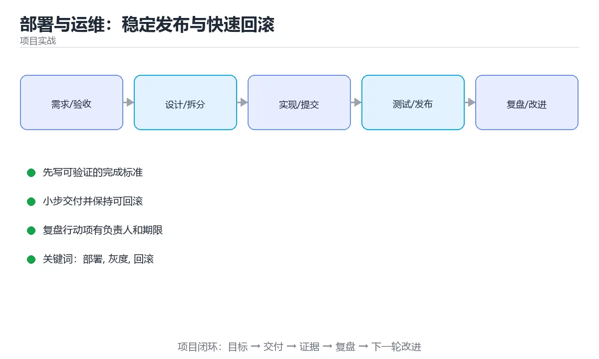

# 部署与运维：稳定发布与快速回滚



> 内容更新时间：2026-10-03 · 学习阶段：进阶 · 预计用时：20 分钟

## 学习目标

- 能用自己的话解释「部署与运维：稳定发布与快速回滚」解决了什么问题，而不是只背术语。
- 能说清 「部署」、「灰度」、「回滚」、「可观测性」 之间的关系，并分别举出一个例子。
- 能把本课知识放回「项目实战」的知识体系，说明它和相邻主题的边界。
- 能完成本课练习，并用验收标准检查自己的结果。

> 一句话摘要：环境一致、发布策略、回滚方案、可观测性与上线检查清单。

## 前置知识

- 先完成上一课《测试与质量门禁：把问题挡在上线前》；如果已经掌握，可以直接用本课练习自测。
- 本课阶段：进阶。建议先掌握同一分类的基础课程，并能独立运行正文中的最小示例。
- 开始前先复习：部署、灰度、回滚。
- 如果某一步看不懂，先记录具体卡点，完成练习后再回头读一遍。


## 一句话目标

能不能稳定发布，取决于三件事：**环境一致、发布可回滚、状态可观测**。

## 一张图看懂发布流程

```text
构建一次（产出不可变制品，用 commit SHA 命名）
      │
      ▼
部署到预发环境 → 跑冒烟测试
      │
      ▼
灰度发布（5% 流量）
      │  观察：错误率、P95 延迟、业务指标
      ├── 异常 → 立即回滚（1 分钟内）
      ▼
逐步放量 25% → 50% → 100%
      │
      ▼
观察 30 分钟 → 发布完成，记录变更
```

## 环境一致的三个要点

| 要点 | 做法 | 反例 |
| --- | --- | --- |
| 同一制品 | 构建一次，各环境复用 | 每个环境各构建一次 |
| 配置外置 | 用环境变量或配置中心 | 配置写死在代码里 |
| 环境对齐 | 依赖版本、中间件版本一致 | 测试用 MySQL 5.7、生产用 8.0 |

```bash
# 制品用 commit SHA 命名，任何环境都能追溯到具体代码
docker build -t registry.example.com/app:${GIT_SHA} .
docker push registry.example.com/app:${GIT_SHA}
```

## 发布策略对照

| 策略 | 原理 | 优点 | 代价 |
| --- | --- | --- | --- |
| 滚动发布 | 逐批替换实例 | 资源省 | 发布期间新旧版本共存 |
| 蓝绿发布 | 两套环境整体切换 | 回滚最快 | 需要双倍资源 |
| 金丝雀 | 小比例流量先试 | 风险最小 | 需要流量切分能力 |
| 功能开关 | 代码先上线，功能后开 | 与部署解耦 | 开关管理复杂 |

## 回滚：必须能在 1 分钟内完成

```text
回滚的三种手段（按优先级）
  1. 切回上一个镜像标签（最快，秒级）
  2. 关闭功能开关（无需重新部署）
  3. 回滚数据库变更（最慢，需谨慎）

数据库变更的铁律：
  · 先加字段（可空），再写代码，最后清理旧字段
  · 不要在发布同一时刻做破坏性变更
```

| 变更类型 | 是否可回滚 | 注意 |
| --- | --- | --- |
| 应用镜像 | 可以 | 秒级切回 |
| 配置 | 可以 | 注意配置兼容 |
| 新增字段 | 可以 | 保留旧字段 |
| 删除字段 | 危险 | 先停止使用，下个版本再删 |
| 数据迁移 | 视情况 | 必须准备反向脚本 |

## 可观测性三件套

```text
指标 Metrics  → 有没有问题（错误率、延迟、吞吐）
日志 Logs     → 出了什么问题（含 trace id）
链路 Traces   → 问题出在哪一环（跨服务调用）
```

```text
发布时必须盯的四个数字
  · 错误率（5xx 占比）
  · P95 与 P99 延迟
  · 关键业务指标（下单量、支付成功率）
  · 资源水位（CPU、内存、连接数）
```

**看分位数而不是平均值**：平均值会把最差的那部分用户完全掩盖。

## 一份可用的上线检查清单

```text
发布前
□ 制品已构建并打标签（commit SHA）
□ 数据库变更已评审，含回滚方案
□ 配置项已补齐（含新环境变量）
□ 监控与告警已覆盖新接口
□ 回滚步骤写在发布单上

发布中
□ 先发预发并跑冒烟测试
□ 灰度 5%，观察 10 分钟
□ 逐步放量，每一步都看指标

发布后
□ 观察 30 分钟无异常
□ 记录变更内容与影响范围
□ 更新值班与文档信息
```

## 新手最容易踩的八个坑

| 坑 | 现象 | 正确做法 |
| --- | --- | --- |
| 每个环境各构建一次 | 测试的与发布的不是同一份 | 构建一次，处处复用 |
| 密钥写进代码或镜像 | 泄露 | 用密钥服务或环境变量 |
| 数据库破坏性变更与代码同时上 | 无法回滚 | 分三步：加字段→改代码→清理 |
| 没有回滚方案 | 出问题只能硬扛 | 提前写清回滚步骤 |
| 只看平均值 | 长尾用户仍受影响 | 看 P95 与 P99 |
| 全量发布不看监控 | 故障扩大 | 灰度加观察窗口 |
| 发布不记录 | 出了问题找不到变更 | 发布单与变更日志 |
| 无告警或告警太吵 | 没人看 | 只对可行动的信号告警 |

## 本课小结
- 发布的三个关键词：**不可变制品、可回滚、可观测**。
- 灰度与开关让你「用小代价试错」，回滚能力决定你能多快恢复。
- 数据库变更永远是发布中最危险的部分，必须单独设计。

<!-- appendix:v4 -->

## 补充：发布与回滚的落地细节

### 蓝绿与金丝雀的具体配置

```yaml
# 金丝雀：先给新版本 5% 流量
apiVersion: networking.k8s.io/v1
kind: Ingress
metadata:
  name: app
  annotations:
    nginx.ingress.kubernetes.io/canary: "true"
    nginx.ingress.kubernetes.io/canary-weight: "5"
spec:
  rules:
    - host: example.com
      http:
        paths:
          - path: /
            pathType: Prefix
            backend:
              service:
                name: app-canary
                port: { number: 80 }
```

```text
放量节奏建议
  5%  → 观察 10 分钟（错误率、P95、业务指标）
  25% → 观察 10 分钟
  50% → 观察 15 分钟
  100% → 观察 30 分钟
任何一步指标越界：立即把权重归零（比回滚镜像更快）
```

### 数据库变更的三种安全模式

| 模式 | 做法 | 适用 |
| --- | --- | --- |
| 扩展 | 先加新字段，双写，读旧字段 | 字段改名 |
| 收缩 | 停止写入旧字段，观察后再删除 | 清理历史字段 |
| 影子表 | 写入新表，后台比对，切换读 | 大表结构重构 |

```sql
-- 扩展阶段示例：新增字段并回填
ALTER TABLE orders ADD COLUMN status_v2 text;
UPDATE orders SET status_v2 = status WHERE status_v2 IS NULL;
-- 代码同时写两个字段，读仍走旧字段；确认无异常后再切读、最后删旧列
```

**原则：任何一次发布，数据库变更都要能在不丢数据的前提下回退。**

### 回滚演练：定期做，而不是等出事

```bash
#!/usr/bin/env bash
set -euo pipefail
# 回滚脚本骨架：切回上一个稳定镜像标签
readonly APP="myapp"
readonly PREVIOUS="$(cat /deploy/${APP}/previous_sha)"

echo "回滚 $APP → $PREVIOUS"
kubectl set image deployment/$APP app=registry.example.com/$APP:$PREVIOUS
kubectl rollout status deployment/$APP --timeout=120s
echo "回滚完成，请核对错误率与延迟"
```

| 演练项 | 目标 |
| --- | --- |
| 回滚耗时 | ≤ 1 分钟（应用层） |
| 回滚后指标 | 5 分钟内恢复基线 |
| 数据一致性 | 无丢单、无重复扣款 |
| 演练频率 | 每季度至少一次 |

### SLO 与错误预算

```text
先定 SLI（可测量）：请求成功率 = 2xx+3xx / 总请求
再定 SLO（目标）：30 天窗口内成功率 ≥ 99.9%
错误预算 = 1 - 99.9% = 0.1%

换算成可接受量：
  · 每月 100 万请求 → 可失败 1000 次
  · 预算未用完 → 可以继续快速发布
  · 预算用尽 → 冻结新功能，优先修复稳定性
```

| 用户可感知程度 | 建议 SLO |
| --- | --- |
| 核心交易链路 | 99.95% 以上 |
| 一般业务接口 | 99.9% |
| 内部工具 | 99.5% |

### 上线检查清单（命令级）

```text
发布前
□ 制品已打标签：docker images | grep <sha>
□ 数据库变更已评审并准备回滚脚本
□ 新配置项已在密钥服务中补齐
□ 新增接口已接入监控与告警

发布中
□ kubectl rollout status 无阻塞
□ 灰度 5% 观察 10 分钟
□ 关键业务指标无异常波动

发布后
□ 30 分钟观察窗结束
□ 记录变更内容、影响范围与回滚点
```

### 自查清单

- [ ] 每个服务都能在 1 分钟内回滚
- [ ] 数据库变更与代码发布分开进行
- [ ] 灰度期间固定观察错误率与 P95/P99
- [ ] SLO 有明确口径与统计窗口
- [ ] 每季度做过一次真实回滚演练

## 动手练习

<!-- practice-diversified:v1 -->

> 本课练习重点：围绕「部署、灰度、回滚」完成复述、实验和交付，每个结果都要能被别人检查。

先拆任务和风险，再完成一个可交付增量，最后记录回滚与改进。

### 练习 1：建立心智模型（10 分钟）

合上教程，用 3～5 句话回答：

1. 「部署与运维：稳定发布与快速回滚」解决了什么问题？
2. 如果没有它，会出现什么具体后果？
3. 它和「灰度」是什么关系？

**验收标准**：至少出现一个本课关键词，并写出一个反例、边界条件或失效场景。

### 练习 2：做一次可控实验（20 分钟）

从正文中选一个最小示例，完成以下操作：

1. 先预测修改一个参数、输入或步骤后的结果。
2. 再实际执行或逐步推演，记录真实结果。
3. 如果结果与预测不同，写出差异原因。

**验收标准**：留下「原例 → 改动 → 预测 → 结果 → 原因」五步记录。

### 练习 3：交付一个小结果（30 分钟）

把一个真实小需求拆成任务、验收标准、风险与回滚步骤。

任务要求：

- 结果必须能被别人检查，不能只写“我已经理解了”。
- 至少覆盖「部署」和「灰度」两个关键词。
- 写出 1 个仍然不确定的问题，以及下一步如何验证。

> 提示：时间有限时优先做练习 1 和练习 2；练习 3 可以拆成两次完成。

<!-- scaffold:v1 -->

<!-- project-verification:v1 -->

## 验证命令与预期输出

项目代码不能只看“能编译”，还要能按固定命令复现结果。下表给出最低验证集：

| 阶段 | 命令 | 预期输出 |
| --- | --- | --- |
| 安装依赖 | `python -m pip install -r requirements.txt` | 依赖安装完成，没有版本冲突 |
| 语法检查 | `python -m compileall .` | 所有模块编译通过 |
| 运行测试 | `python -m pytest -q` | 测试全部通过，失败用例数为 0 |
| 启动示例 | `python main.py` | 服务启动并输出监听地址 |

### 验收证据

- [ ] 保存依赖安装和启动命令的完整输出。
- [ ] 至少运行 3 条测试，其中包含一条非法输入或失败路径。
- [ ] 重复执行同一操作两次，确认没有重复写入或副作用。
- [ ] 记录一次失败状态码、错误日志和恢复步骤。
- [ ] 在 README 中写明环境版本、启动方式和回滚方式。

### 回归与回滚

1. 先在一个可丢弃的目录或临时数据库执行，避免污染真实数据。
2. 修改一处逻辑后重跑全部验证命令，确认没有回归。
3. 若失败，回滚到上一个可运行版本并保留失败日志。
4. 定位原因后补一条自动化测试，再重新执行发布流程。
5. 把教训写入项目复盘或本课笔记，形成下一次的检查项。

<!-- p2-enrichment:v1 -->

## English Overview

**Title:** Deployment and Operations

**Summary:** Environments, release strategies, rollback and observability.

**Category:** Project Practice  
**Level:** 进阶  
**Key terms:** 部署, 灰度, 回滚, 可观测性, 发布

> The full tutorial is written in Chinese. This bilingual overview helps English readers identify the topic, scope and key terms before studying the detailed examples.

## 内容元数据

- 内容版本：v2.0
- 最后更新：2026-10-03
- 学习阶段：进阶
- 适用环境：通用项目交付流程
- 内容来源：内置结构化课程与工程实践整理
- 相关主题：部署、灰度、回滚、可观测性、发布
- 质量版本：P0 测验标准 + P1 覆盖扩展 + P2 体验补全

## 项目专属规格：部署与运维：稳定发布与快速回滚

### 核心场景

环境一致、发布策略、回滚方案、可观测性与上线检查清单。 项目目标是把「部署、灰度、回滚、可观测性、发布」落实为可运行、可测试、可回滚的交付物。

### 架构与数据流

```text
用户/输入 → 接口或命令 → 领域逻辑 → 存储/外部依赖 → 输出与监控
                         ↘ 失败分类 → 重试/补偿 → 回滚
```

### 最小数据模型

| 对象 | 关键字段 | 约束 |
| --- | --- | --- |
| 输入实体 | 部署、时间、来源 | 必填校验、长度限制、幂等键 |
| 任务实体 | 状态、优先级、创建时间 | 状态迁移合法、不可重复执行 |
| 结果实体 | 输出、错误码、耗时 | 可序列化、错误可解释 |
| 审计记录 | 操作者、动作、结果、时间 | 不可篡改、可查询、脱敏 |

### 验收场景

1. 正常路径：最小输入得到预期输出，并留下日志与指标。
2. 边界路径：空值、最大值、重复数据和超长内容得到明确处理。
3. 失败路径：依赖超时或不可用时能快速失败、重试或降级。
4. 幂等路径：同一请求执行两次不会产生重复副作用。
5. 回滚路径：回滚后数据一致，且能说明恢复时间和影响范围。

<!-- project-delivery:v1 -->

## 项目交付物

### 建议仓库结构

```text
src/
tests/
docs/
README.md
```

### 测试矩阵

| 层级 | 覆盖内容 | 最低数量 | 通过标准 |
| --- | --- | ---: | --- |
| 单元测试 | 领域规则、边界和错误分类 | 8 | 正常、边界、失败路径全部通过 |
| 集成测试 | 数据库、网络、文件或平台边界 | 3 | 使用真实边界且可重复运行 |
| 端到端测试 | 核心用户路径 | 1 | 从输入到输出完整跑通 |
| 手动验收 | 文档中列出的 5 个场景 | 5 | 有命令、输出和结论记录 |

### 验收数据

```json
{
  "project": "project_deploy_ops",
  "input": {"case": "normal", "value": 5},
  "expected": {"ok": true, "result": 5},
  "failure_case": {"value": -1, "error": "validation_error"},
  "idempotency_key": "demo-001"
}
```

### 复盘模板

| 问题 | 记录 |
| --- | --- |
| 原目标是什么？ | 用一句话描述可验收目标 |
| 实际发生了什么？ | 时间线、指标和关键日志 |
| 哪个假设被推翻？ | 根因与促成因素 |
| 如何回滚？ | 步骤、耗时和数据校验 |
| 下一步做什么？ | 负责人、期限和验证方式 |

> 项目验收围绕「部署、灰度、回滚」：至少完成一次正常路径、一次边界输入、一次失败恢复和一次幂等检查。

<!-- p2-references:v1 -->

## 参考资料与复核

- 最后复核：2026-10-04
- 下次复核：2027-04-04
- 复核范围：版本兼容、API 行为、安全建议与工程实践
- 来源性质：官方文档与标准；本课正文为离线教学重组，不复制原文

| 参考资料 | 本课用途 |
| --- | --- |
| [The Twelve-Factor App](https://12factor.net/) | 可部署应用原则 |
| [Google SRE Books](https://sre.google/books/) | 可观测性与发布工程 |

> 本课主题：环境一致、发布策略、回滚方案、可观测性与上线检查清单。

> App 完全离线展示文字链接，不会自动联网；需要延伸阅读时可复制链接到浏览器。

