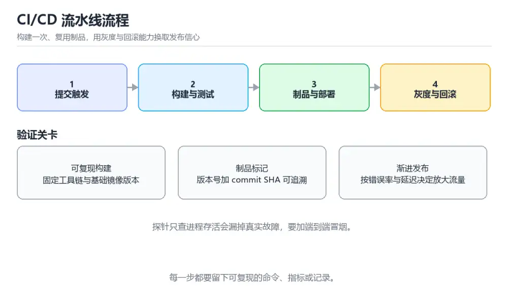

# DevOps CI/CD 流水线实战

> 内容更新时间：2026-10-06 · 学习阶段：高级 · 预计用时：60 分钟

> 项目定位：把构建、测试、制品、部署、验证和回滚串成一条可重复执行的流水线，而不是依赖人工步骤。
> 建议投入：16 小时
> 难度：进阶


## 本节知识框架

**课程定位**：所属分类 `project_practice`（项目实战），课程主题 `DevOps CI/CD 流水线实战`，学习阶段 高级，建议用时 60 分钟。

本课主线：用容器、持续集成、渐进发布与可观测性，交付一条可回滚、可审计的自动发布流水线。

**学完本课应当能够**
- 说清 `DevOps` 与 `Docker` 的含义与区别，并各举一个正例和一个反例。
- 用本课示例验证 `Kubernetes` 的行为，记录输入、输出与失败条件。
- 遇到「本地成功但流水线构建失败」这类问题时，能说出触发条件与修复顺序。

### 从概念到验证的学习链条

1. `DevOps`：先掌握 把开发、测试与运维打通的工作方式，靠自动化流水线缩短交付反馈，再用它解释 `Docker` 为什么会出现。
2. `Docker`：先掌握 用镜像封装应用与依赖，保证开发、测试与生产环境一致，再用它解释 `Kubernetes` 为什么会出现。
3. `Kubernetes`：先掌握 容器编排平台，负责调度、扩缩容、健康检查与滚动更新，再用它解释 `渐进发布` 为什么会出现。
4. `渐进发布`：先掌握 灰度、金丝雀与功能开关等分批放量手段，出问题能快速回滚，再用它解释 `可观测性` 为什么会出现。
5. `可观测性`：先掌握 由日志、指标与链路追踪组成，能在不重启、不改代码的前提下问出新问题，再用它解释 本课示例的观察结果 为什么会出现。

**先修与衔接**：本课是「项目实战」分类的第 17 课。先修内容：《CI/CD 与 GitHub Actions》、《Docker 容器基础》、《Kubernetes 基础》。《CI/CD 与 GitHub Actions》里的 `npm ci`、`CD` 是本课的前提。《Docker 容器基础》里的 `.dockerignore`、`USER` 是本课的前提。相关或后续课程：《Terraform 与基础设施即代码》、《GitOps 与 ArgoCD》、《可观测性：日志、指标与链路》。

### 完成判据

- **定义关**：不看正文也能说明 `DevOps` 是 把开发、测试与运维打通的工作方式，靠自动化流水线缩短交付反馈，并指出一个反例。
- **机制关**：能按“输入 → 转换 → 输出 → 验证”复述 `DevOps CI/CD 流水线实战`，而不是只背结论。
- **示例关**：能运行或推演 `DevOps CI/CD 流水线实战` 的 `text` 示例，并说明一个真实出现的标识符或字面量。
- **证据关**：能从 `DevOps CI/CD 流水线实战` 的示例写出一个输入、处理、输出三元组，并说明它支持或反驳了本课的哪一条结论。
- **排错关**：能复现 本地成功但流水线构建失败，记录现象并按 固定工具链版本，清理缓存后在新执行器复现，并把缺失依赖写入构建清单 修复。
- **迁移关**：能把 `DevOps`、`CI/CD`、`Docker`、`Kubernetes` 放进一个与 `DevOps CI/CD 流水线实战` 不同的项目场景，并保持输入与验证条件可追踪。
- **复盘关**：学完 `DevOps CI/CD 流水线实战` 后，用一句话写下仍然不确定的结论，并列出下一次验证需要的输入、环境和成功判据。

### 复习清单

- [ ] 能不看正文复述本课核心术语，并指出一个边界或反例。
- [ ] 能运行或推演本课示例，记录输入、输出与失败现象。
- [ ] 能完成一次自测，并把错题对照错误表定位原因。

## 核心概念定义

| 术语 | 操作性定义 | 常见边界与风险 |
| --- | --- | --- |
| DevOps | 把开发、测试与运维打通的工作方式，靠自动化流水线缩短交付反馈。 | 只在「把开发、测试与运维打通的工作方式，靠自动化流水线缩短交付反馈」这一前提下成立，换输入或换环境要重新验证。 |
| Docker | 用镜像封装应用与依赖，保证开发、测试与生产环境一致。 | 不同版本与依赖组合的行为可能不同，升级或换环境前要按官方变更说明重新验证。 |
| Kubernetes | 容器编排平台，负责调度、扩缩容、健康检查与滚动更新。 | 容器与集群环境差异会改变行为，本地通过后仍需在目标编排环境复验。 |
| 渐进发布 | 灰度、金丝雀与功能开关等分批放量手段，出问题能快速回滚。 | 隔离级别与并发事务会影响可见性，换级别或换存储引擎后要重新验证。 |
| 可观测性 | 由日志、指标与链路追踪组成，能在不重启、不改代码的前提下问出新问题。 | 只在「由日志、指标与链路追踪组成，能在不重启、不改代码的前提下问出新问题」这一前提下成立，换输入或换环境要重新验证。 |

## 原理与运行机制

### 机制总览

**教材衔接：需求与约束**

| 维度 | 约束 |
| --- | --- |
| 可追溯 | 每次发布都能关联提交、流水线、镜像摘要、配置版本与审批记录 |
| 可回滚 | 任意一次生产发布都能在五分钟内回到上一个健康版本 |
| 安全 | 凭证不进入仓库与镜像，流水线使用最小权限身份 |
| 稳定 | 相同提交重复执行得到相同制品摘要，部署脚本具备幂等性 |

**教材衔接：架构与数据流**

代码仓库触发流水线，检查、单元测试和镜像构建在隔离执行器中完成；镜像按内容摘要推送到制品库，部署控制器从声明式清单读取版本与策略，指标系统根据错误率和延迟决定继续、暂停或回滚。

```text
commit -> lint/test -> image -> registry -> staging
                                      |
                           smoke -> canary -> prod
                                      |
                           metrics -> rollback/audit
```

**教材衔接：实施步骤**

### 里程碑 1：把构建做成不可变制品

固定基础镜像和依赖锁文件，先跑静态检查与测试，再生成带提交号和内容摘要的镜像；禁止在不同环境重新构建同名制品。

### 里程碑 2：做环境晋级与冒烟验证

预发布环境使用与生产一致的清单和启动方式，部署后检查健康接口、关键依赖和数据库迁移状态，任何一步失败都停止晋级。

### 里程碑 3：接入金丝雀、观测和回滚

先让少量流量进入新版本，比较错误率、P95 延迟和资源使用；达到阈值再扩大流量，异常时自动回滚并生成包含指标快照的事件记录。

**教材衔接：扩展任务**

- 加入多环境审批与变更窗口
- 用策略即代码检查部署清单
- 接入追踪数据定位跨服务发布回归

**教材衔接：交付评审：评分表、决策记录与证据链**

### 一、「DevOps CI/CD 流水线实战」的交付物评分表

| 交付物 | 权重 | 合格线 | 需要的证据 |
| --- | ---: | --- | --- |
| 流水线配置与阶段说明 | 25% | 能在干净环境复现，且失败路径有明确处理 | 命令与输出、对应测试、一次失败与恢复记录 |
| 不可变镜像与制品命名规则 | 25% | 能在干净环境复现，且失败路径有明确处理 | 命令与输出、对应测试、一次失败与恢复记录 |
| 预发布冒烟和健康检查脚本 | 25% | 能在干净环境复现，且失败路径有明确处理 | 命令与输出、对应测试、一次失败与恢复记录 |
| 金丝雀指标、回滚脚本与发布记录 | 25% | 能在干净环境复现，且失败路径有明确处理 | 命令与输出、对应测试、一次失败与恢复记录 |

### 二、需要写下来的决策（ADR）

| 决策点 | 本课给出的做法 | 备选方案 | 代价与回滚 |
| --- | --- | --- | --- |
| 里程碑 1：把构建做成不可变制品 | 固定基础镜像和依赖锁文件，先跑静态检查与测试，再生成带提交号和内容摘要的镜像；禁止在不同环境重新构建同名制品。 | 不做「里程碑 1：把构建做成不可变制品」，沿用最朴素的实现（需要额外补一次对照实验） | 若「里程碑 1：把构建做成不可变制品」出问题，回到上一版本并按本课验收场景重跑 |
| 里程碑 2：做环境晋级与冒烟验证 | 预发布环境使用与生产一致的清单和启动方式，部署后检查健康接口、关键依赖和数据库迁移状态，任何一步失败都停止晋级。 | 不做「里程碑 2：做环境晋级与冒烟验证」，沿用最朴素的实现（需要额外补一次对照实验） | 若「里程碑 2：做环境晋级与冒烟验证」出问题，回到上一版本并按本课验收场景重跑 |
| 里程碑 3：接入金丝雀、观测和回滚 | 先让少量流量进入新版本，比较错误率、P95 延迟和资源使用；达到阈值再扩大流量，异常时自动回滚并生成包含指标快照的事件记录。 | 不做「里程碑 3：接入金丝雀、观测和回滚」，沿用最朴素的实现（需要额外补一次对照实验） | 若「里程碑 3：接入金丝雀、观测和回滚」出问题，回到上一版本并按本课验收场景重跑 |
| 交付边界 | 用容器、持续集成、渐进发布与可观测性，交付一条可回滚、可审计的自动发布流水线。 | 不做「交付边界」，沿用最朴素的实现（需要额外补一次对照实验） | 若「交付边界」出问题，回到上一版本并按本课验收场景重跑 |

### 三、「DevOps CI/CD 流水线实战」的交付证据链

| # | 命令 | 这条命令要留下的证据 |
| ---: | --- | --- |
| 1 | `docker build -t app:local .` | 完整输出、退出码、耗时，以及与「DevOps CI/CD 流水线实战」验收口径的对应关系 |
| 2 | `docker run --rm app:local ./scripts/smoke-test.sh` | 完整输出、退出码、耗时，以及与「DevOps CI/CD 流水线实战」验收口径的对应关系 |
| 3 | `docker scout quickview app:local` | 完整输出、退出码、耗时，以及与「DevOps CI/CD 流水线实战」验收口径的对应关系 |
| 4 | `git rev-parse HEAD > revision.txt` | 完整输出、退出码、耗时，以及与「DevOps CI/CD 流水线实战」验收口径的对应关系 |
| 5 | `kubectl apply --dry-run=server -f deploy/staging` | 完整输出、退出码、耗时，以及与「DevOps CI/CD 流水线实战」验收口径的对应关系 |
| 6 | `./scripts/verify-release.sh staging 60` | 完整输出、退出码、耗时，以及与「DevOps CI/CD 流水线实战」验收口径的对应关系 |

### 四、「DevOps CI/CD 流水线实战」的验收指标

| 指标 | 目标值 | 测量方式 | 不达标时的动作 |
| --- | --- | --- | --- |
| 先让少量流量进入新版本，比较错误率、P95 延迟和资源使用；达到阈值再扩大流量，异常时自动回滚并生成包含指标快照的事件记录。 | 用本课正文给出的阈值，没有就写实测基线 | 固定环境重复三次取中位数 | 回到对应小节定位，先修原因再重测 |

### 五、评审记录模板

| 记录项 | 填写要求 |
| --- | --- |
| 项目标识 | `project_devops_pipeline` |
| 本次范围 | 说明这一轮交付了「DevOps CI/CD 流水线实战」的哪些部分 |
| 未完成项 | 列出与 DevOps 相关但本轮未做的内容 |
| 证据位置 | 指向 evidence/ 目录下的具体文件 |
| 风险与回滚 | 写清剩余风险、回滚步骤和验证方式 |
| 结论 | 通过 / 有条件通过 / 不通过，三者选一 |

### 机制拆解：每一步的输入、动作与输出

#### 1. `DevOps`
- 输入：`DevOps`；本步把 把开发、测试与运维打通的工作方式，靠自动化流水线缩短交付反馈 当作判断规则。
- 动作：围绕 `DevOps` 保留中间状态，并记录它与 `Docker` 的对应关系。
- 输出：`Docker`，它可以被下一段代码、测试或记录继续使用。
- `DevOps` 的失败条件：只在「把开发、测试与运维打通的工作方式，靠自动化流水线缩短交付反馈」这一前提下成立，换输入或换环境要重新验证。

#### 2. `Docker`
- 输入：`DevOps`；本步把 用镜像封装应用与依赖，保证开发、测试与生产环境一致 当作判断规则。
- 动作：围绕 `Docker` 保留中间状态，并记录它与 `Kubernetes` 的对应关系。
- 输出：`Kubernetes`，它可以被下一段代码、测试或记录继续使用。
- `Docker` 的失败条件：不同版本与依赖组合的行为可能不同，升级或换环境前要按官方变更说明重新验证。

#### 3. `Kubernetes`
- 输入：`Docker`；本步把 容器编排平台，负责调度、扩缩容、健康检查与滚动更新 当作判断规则。
- 动作：围绕 `Kubernetes` 保留中间状态，并记录它与 `渐进发布` 的对应关系。
- 输出：`渐进发布`，它可以被下一段代码、测试或记录继续使用。
- `Kubernetes` 的失败条件：容器与集群环境差异会改变行为，本地通过后仍需在目标编排环境复验。

#### 4. `渐进发布`
- 输入：`Kubernetes`；本步把 灰度、金丝雀与功能开关等分批放量手段，出问题能快速回滚 当作判断规则。
- 动作：围绕 `渐进发布` 保留中间状态，并记录它与 `可观测性` 的对应关系。
- 输出：`可观测性`，它可以被下一段代码、测试或记录继续使用。
- `渐进发布` 的失败条件：隔离级别与并发事务会影响可见性，换级别或换存储引擎后要重新验证。

#### 5. `可观测性`
- 输入：`渐进发布`；本步把 由日志、指标与链路追踪组成，能在不重启、不改代码的前提下问出新问题 当作判断规则。
- 动作：围绕 `可观测性` 保留中间状态，并记录它与 `本课示例的最终结果` 的对应关系。
- 输出：`本课示例的最终结果`，它可以被下一段代码、测试或记录继续使用。
- `可观测性` 的失败条件：只在「由日志、指标与链路追踪组成，能在不重启、不改代码的前提下问出新问题」这一前提下成立，换输入或换环境要重新验证。

### 复现实验记录

- 环境：`DevOps CI/CD 流水线实战` 使用 `text` 示例，固定 `DevOps`、`CI/CD`、`Docker`、`Kubernetes` 作为第一组条件。
- 首轮输入：从示例中的第一个输入开始，预测 `DevOps` 会怎样变化。
- 基线观察：记录命令、输入、输出和错误原文，不用截图代替可复制的文本。
- 单变量修改：只改变 `DevOps`，观察 `可观测性` 是否仍满足定义。
- 失败注入：复现 本地成功但流水线构建失败，确认现象是 本地成功但流水线构建失败。
- 记录结论：把“修改前、修改后、预期变化、实际变化”写成四列表，这样复盘 `DevOps CI/CD 流水线实战` 时才能区分概念错误与实现错误。

## 典型应用场景

**教材衔接：项目背景**

一个服务虽然能本地运行，但发布时仍靠手工打镜像、改配置和登录服务器，导致版本不可追溯、失败难回滚、环境差异频发。本实战从零搭建流水线：提交代码后自动检查与测试，生成不可变制品，部署到预发布环境做冒烟验证，再通过金丝雀策略进入生产，并保留审计与一键回滚能力。

**教材衔接：项目交付物**

- 流水线配置与阶段说明
- 不可变镜像与制品命名规则
- 预发布冒烟和健康检查脚本
- 金丝雀指标、回滚脚本与发布记录



**教材衔接：零基础精讲：把DevOps CI/CD 流水线实战真正讲透**

### 先建立一个直觉

流水线的价值在于消除人为差异：构建一次、处处复用制品，并把回滚当成一次正常发布来演练。
落到本课，「DevOps CI/CD 流水线实战」关心的是 DevOps 与 CI/CD 的配合，也就是说这条直觉要在 项目背景 里被具体验证。

本课的摘要可以当作一张地图：用容器、持续集成、渐进发布与可观测性，交付一条可回滚、可审计的自动发布流水线。

### 逐步拆解

1. 澄清输入与目标。先写清「DevOps CI/CD 流水线实战」要解决的问题、合法输入范围和成功标准，再进入后续步骤。
2. 描述处理过程。把「DevOps、CI/CD、Docker、Kubernetes、渐进发布、可观测性」映射到具体步骤，每步都要求能单独验证。
3. 定义输出。明确 DevOps 与 CI/CD 各自的产物，以及失败时留下什么证据。
4. 制造一次CI/CD的失败输入，确认错误出现在「项目背景」的哪一步，并写下恢复后如何验证状态已回到一致。
5. 用 HEAD 构造一个最小反例，证明「DevOps CI/CD 流水线实战」的结论有边界。

### 把正文串成一条执行链

- **里程碑 1：把构建做成不可变制品**：在「DevOps CI/CD 流水线实战」里，「里程碑 1：把构建做成不可变制品」这一步要先写清输入与预期，再记录实际结果和差异；结果不符时回到对应小节核对前提。
- **里程碑 2：做环境晋级与冒烟验证**：在「DevOps CI/CD 流水线实战」里，「里程碑 2：做环境晋级与冒烟验证」这一步要先写清输入与预期，再记录实际结果和差异；结果不符时回到对应小节核对前提。
- **里程碑 3：接入金丝雀、观测和回滚**：在「DevOps CI/CD 流水线实战」里，「里程碑 3：接入金丝雀、观测和回滚」这一步要先写清输入与预期，再记录实际结果和差异；结果不符时回到对应小节核对前提。
- **现场 1：本地成功但流水线构建失败**：在「DevOps CI/CD 流水线实战」里，「现场 1：本地成功但流水线构建失败」这一步要先写清输入与预期，再记录实际结果和差异；结果不符时回到对应小节核对前提。
- **现场 2：新版本部署后健康检查通过但用户报错**：在「DevOps CI/CD 流水线实战」里，「现场 2：新版本部署后健康检查通过但用户报错」这一步要先写清输入与预期，再记录实际结果和差异；结果不符时回到对应小节核对前提。
- **现场 3：回滚后仍然异常**：在「DevOps CI/CD 流水线实战」里，「现场 3：回滚后仍然异常」这一步要先写清输入与预期，再记录实际结果和差异；结果不符时回到对应小节核对前提。

### 从测验反推易错点

- 参考判断：写出最小示例并核对 CI/CD 的基线结果
- 解析：在本课的练习里，顺序应当是：先明确 DevOps 的输入、输出与约束 → 写出最小示例并核对 CI/CD 的基线结果 → 只改一个变量，记录边界与失败路径的变化 → 固定版本与证据，把本课的结论写成可复现记录。这个顺序把 DevOps 的输入、输出和约束放在最前面，在DevOps CI/CD 流水线实战里避免概念没对齐就开始调参。第二步用 CI/CD 建立可核对的基线，在DevOps CI/CD 流水线实战里第三步才允许改变一个变量并观察失败路径。最后一步把本课的版本、证据与结论固定下来，别人才能复现同样的结果。
- 自问：如果去掉题干里的一个限定词，结论还成立吗？

- 参考判断：默认参数 bucket=[] 只在定义时创建一次，两次调用共享同一个列表。

**检查点 3：流水线中的密钥应该如何处理？**

- 参考判断：存入专用密钥系统，按最小权限临时注入，并限制日志输出
- 解析：密钥一旦进入仓库或镜像层，就会随着历史记录和制品分发扩散，很难彻底删除。正确做法是使用专用密钥管理系统或执行器提供的短期身份，按任务最小权限临时注入，同时对日志做脱敏。还应定期轮换凭证、记录使用审计，并将泄露检测接入提交流程。临时凭证到期后必须自动失效。

- 参考判断：学习 DevOps 时要同时说明输入、输出和失败路径，不能只看正常流程、验证 CI/CD 时要固定版本并覆盖边界输入，结论才可复现
- 解析：本课把DevOps CI/CD 流水线实战拆成概念、示例与故障现场三部分，因此判断 DevOps 时必须同时交代输入、输出和失败路径，这使“学习 DevOps 时要同时说明输入、输出和失败路径，不能只看正常流程”成立；在DevOps CI/CD 流水线实战里，判断 CI/CD 时要固定版本与边界输入，所以“验证 CI/CD 时要固定版本并覆盖边界输入，结论才可复现”才可复现。相反，“只要 DevOps 的常规示例通过，就可以跳过边界与异常路径”把一次正常示例当成全部情况，会漏掉本课的边界缺陷；“把 CI/CD 的单次运行结果当成所有版本和规模都成立”把单次结果外推成普遍结论，在DevOps CI/CD 流水线实战里忽略了版本和规模变化。对照本课的故障现场与自测清单，就能用证据区分这两种判断。

### 工程排错顺序

| 先查什么 | 要得到的证据 | 判断标准 |
| --- | --- | --- |
| 用户、范围与验收标准是否写清？ | 日志、输入样例、测试或指标 | 能复现并解释，才算定位 |
| 每阶段是否有可运行增量？ | 日志、输入样例、测试或指标 | 能复现并解释，才算定位 |
| 测试、监控和回滚是否随功能一起交付？ | 日志、输入样例、测试或指标 | 能复现并解释，才算定位 |
| 复盘是否形成下一轮改进项？ | 日志、输入样例、测试或指标 | 能复现并解释，才算定位 |

### 变式训练

1. 把 DevOps 放进一个只有单机、没有额外依赖的小项目，先保证正确再扩展。
2. 把 HEAD 的数据量提高一个数量级，观察延迟与内存的变化拐点。
3. 把 CI/CD 换成失败输入，记录错误信息与恢复动作。
5. 故意跳过 CI/CD 的检查再运行，比较与正常流程的差异，并说明这个检查挡住的到底是哪一类失败。
6. 把 DevOps 的方案切换到低资源设备，重新评估默认参数、超时和降级策略。


### 迁移案例库

围绕 HEAD 重复同一套方法，每完成一轮就把差异写进笔记。

#### 迁移案例 1：围绕「DevOps」做一次小实验

**验收**：迁移过程要留下 HEAD 的可运行记录，并说明CI/CD在新场景下是否仍然成立。

#### 迁移案例 2：围绕「CI/CD」做一次小实验

**步骤**：
1. 复述当前方案对「CI/CD」的假设，写成一句可证伪的话。


#### 迁移案例 5：围绕「渐进发布」做一次小实验

**步骤**：
1. 复述当前方案对「渐进发布」的假设，写成一句可证伪的话。

#### 迁移案例 6：围绕「可观测性」做一次小实验

**步骤**：
1. 复述当前方案对「可观测性」的假设，写成一句可证伪的话。

#### 迁移案例 7：围绕「DevOps」做一次小实验

**步骤**：

#### 迁移案例 8：围绕「CI/CD」做一次小实验

**步骤**：

#### 迁移案例 9：围绕「Docker」做一次小实验

**步骤**：

#### 迁移案例 10：围绕「Kubernetes」做一次小实验

**步骤**：

#### 迁移案例 11：围绕「渐进发布」做一次小实验

**步骤**：

#### 迁移案例 12：围绕「可观测性」做一次小实验

**步骤**：

#### 迁移案例 13：围绕「DevOps」做一次小实验

**步骤**：

#### 迁移案例 14：围绕「CI/CD」做一次小实验

**步骤**：

#### 迁移案例 15：围绕「Docker」做一次小实验

**步骤**：

#### 迁移案例 16：围绕「Kubernetes」做一次小实验

**步骤**：

<!-- p0-depth-v2:end -->

**教材衔接：项目专属规格**

### 交付边界

用容器、持续集成、渐进发布与可观测性，交付一条可回滚、可审计的自动发布流水线。 项目交付不是一份说明文档，而是一组可以运行的命令、可检查的输入输出、失败处理和复盘证据。范围必须同时写明本阶段做什么、不做什么，以及哪些依赖属于外部前提。

### 最小数据模型

| 对象 | 关键字段 | 约束 |
| --- | --- | --- |
| 输入实体 | DevOps、来源、时间、版本 | 必填、可校验、可追溯到原始输入 |
| 任务实体 | 状态、优先级、执行标识、重试次数 | 状态迁移合法、重复执行不会产生重复副作用 |
| 结果实体 | 输出、错误码、耗时、资源指标 | 可序列化、可比较、失败原因可解释 |
| 审计记录 | 操作者、动作、批次、结果、时间 | 不记录敏感信息、可查询、可复核 |

### 验收场景

1. 正常路径：CI/CD 的主流程一次跑通，并把版本与输出一起归档。
2. 边界路径：覆盖 DevOps 的空值、最大值、重复数据和超长内容，结果必须可预测。
3. 失败路径：给 HEAD 注入一次超时，记录错误分类与重试上限。
4. 幂等路径：重复触发 CI/CD，确认没有重复写入或计数膨胀。
5. 回滚路径：把 DevOps 退回上一稳定状态，并验证数据、配置与资源没有残留。

### 证据清单

- 一条从干净环境开始的可复现命令，以及真实输出。
- 一份正常、边界、失败与幂等场景的测试矩阵。
- 一组修改前后的 CI/CD 指标，包含测量方法和环境说明。
- 一份故障时间线、根因、修复动作、回滚耗时和后续改进项。

### 完成定义

把 HEAD 的结论、例外与已知限制写进仓库说明，不依赖口头解释。

- **本地成功但流水线构建失败**：典型现象是本地成功但流水线构建失败；正确做法是固定工具链版本，清理缓存后在新执行器复现，并把缺失依赖写入构建清单。
- **新版本部署后健康检查通过但用户报错**：典型现象是新版本部署后健康检查通过但用户报错；正确做法是增加端到端冒烟和关键业务指标，按错误率与延迟决定是否继续放大流量。
- **回滚后仍然异常**：典型现象是回滚后仍然异常；正确做法是采用向前兼容迁移，回滚应用与配置版本，并验证旧版本读写路径；必要时执行独立恢复预案。

### 最小验证场景

- 准备：保留 `text` 示例的原始输入，先记录 `DevOps CI/CD 流水线实战` 的基线输出和完整运行命令。
- 判定：新结果与 `DevOps CI/CD 流水线实战` 的基线不同不等于错误；只有当差异破坏了 `DevOps` 的定义或错误表中的约束，才判定为失败。

### 选择与边界

- 使用 `DevOps` 时，先满足它的定义：把开发、测试与运维打通的工作方式，靠自动化流水线缩短交付反馈；只在「把开发、测试与运维打通的工作方式，靠自动化流水线缩短交付反馈」这一前提下成立，换输入或换环境要重新验证。
- 使用 `Docker` 时，先满足它的定义：用镜像封装应用与依赖，保证开发、测试与生产环境一致；不同版本与依赖组合的行为可能不同，升级或换环境前要按官方变更说明重新验证。
- 使用 `Kubernetes` 时，先满足它的定义：容器编排平台，负责调度、扩缩容、健康检查与滚动更新；容器与集群环境差异会改变行为，本地通过后仍需在目标编排环境复验。
- 使用 `渐进发布` 时，先满足它的定义：灰度、金丝雀与功能开关等分批放量手段，出问题能快速回滚；隔离级别与并发事务会影响可见性，换级别或换存储引擎后要重新验证。
- 使用 `可观测性` 时，先满足它的定义：由日志、指标与链路追踪组成，能在不重启、不改代码的前提下问出新问题；只在「由日志、指标与链路追踪组成，能在不重启、不改代码的前提下问出新问题」这一前提下成立，换输入或换环境要重新验证。

## 代码/协议/SQL 示例

**教材衔接：验证命令与预期输出**

在 DevOps CI/CD 流水线实战 的仓库根目录执行以下命令，确认核心链路可以运行。

```bash
docker build -t app:local .
docker run --rm app:local ./scripts/smoke-test.sh
docker scout quickview app:local
git rev-parse HEAD > revision.txt
kubectl apply --dry-run=server -f deploy/staging
./scripts/verify-release.sh staging 60
```

**预期输出**：构建成功且静态检查和测试全过；镜像扫描没有高危问题；预发布健康检查在 60 秒内通过；发布清单与当前提交关联，重复部署不会创建多余资源。

### 示例精读：先找证据，再改一个条件

- 在 `DevOps CI/CD 流水线实战` 中与 `DevOps` 对照：示例必须能支持 把开发、测试与运维打通的工作方式，靠自动化流水线缩短交付反馈，否则说明这一段还缺少实现或验证步骤。
- 在 `DevOps CI/CD 流水线实战` 中与 `Docker` 对照：示例必须能支持 用镜像封装应用与依赖，保证开发、测试与生产环境一致，否则说明这一段还缺少实现或验证步骤。
- 在 `DevOps CI/CD 流水线实战` 中与 `Kubernetes` 对照：示例必须能支持 容器编排平台，负责调度、扩缩容、健康检查与滚动更新，否则说明这一段还缺少实现或验证步骤。
- 在 `DevOps CI/CD 流水线实战` 中与 `渐进发布` 对照：示例必须能支持 灰度、金丝雀与功能开关等分批放量手段，出问题能快速回滚，否则说明这一段还缺少实现或验证步骤。
- `DevOps CI/CD 流水线实战` 的示例没有抽取到函数调用或字面量；按行记录输入、控制流和输出，避免只背代码外形。

## 时间/空间复杂度或性能分析

**性能关注点（DevOps CI/CD 流水线实战）**：项目类课程看端到端指标：记录构建时间、接口延迟与资源占用。

**本课特有开销（DevOps CI/CD 流水线实战 · DevOps）**：并发度提高后要观察是否出现拐点：延迟上升而吞吐不增，说明瓶颈已转移。

**测量方法**：以 `DevOps CI/CD 流水线实战` 的 `DevOps` 场景为对象，固定输入跑一遍记录基线，再把规模或并发度提高一个数量级复测；两次结果的差值与波动范围才是结论依据。

### 需要控制的变量与记录项

- `DevOps CI/CD 流水线实战` 的 `DevOps`：固定它的版本、输入范围和资源上限，分别记录速度、内存与失败率的变化。
- `DevOps CI/CD 流水线实战` 的 `CI/CD`：固定它的版本、输入范围和资源上限，分别记录速度、内存与失败率的变化。
- `DevOps CI/CD 流水线实战` 的 `Docker`：固定它的版本、输入范围和资源上限，分别记录速度、内存与失败率的变化。
- `DevOps CI/CD 流水线实战` 的 `Kubernetes`：固定它的版本、输入范围和资源上限，分别记录速度、内存与失败率的变化。
- `DevOps CI/CD 流水线实战` 的 `渐进发布`：固定它的版本、输入范围和资源上限，分别记录速度、内存与失败率的变化。
- `DevOps CI/CD 流水线实战` 中 `DevOps` 的边界：只在「把开发、测试与运维打通的工作方式，靠自动化流水线缩短交付反馈」这一前提下成立，换输入或换环境要重新验证。达到边界时不要外推，必须重新测量。
- `DevOps CI/CD 流水线实战` 中 `Docker` 的边界：不同版本与依赖组合的行为可能不同，升级或换环境前要按官方变更说明重新验证。达到边界时不要外推，必须重新测量。
- `DevOps CI/CD 流水线实战` 中 `Kubernetes` 的边界：容器与集群环境差异会改变行为，本地通过后仍需在目标编排环境复验。达到边界时不要外推，必须重新测量。
- `DevOps CI/CD 流水线实战` 中 `渐进发布` 的边界：隔离级别与并发事务会影响可见性，换级别或换存储引擎后要重新验证。达到边界时不要外推，必须重新测量。
- `DevOps CI/CD 流水线实战` 中 `可观测性` 的边界：只在「由日志、指标与链路追踪组成，能在不重启、不改代码的前提下问出新问题」这一前提下成立，换输入或换环境要重新验证。达到边界时不要外推，必须重新测量。

## 常见误区与易错点

| 容易写错的做法 | 实际现象 | 原因与正确做法 |
| --- | --- | --- |
| 本地成功但流水线构建失败 | 本地成功但流水线构建失败。 | 固定工具链版本，清理缓存后在新执行器复现，并把缺失依赖写入构建清单。 |
| 新版本部署后健康检查通过但用户报错 | 新版本部署后健康检查通过但用户报错。 | 增加端到端冒烟和关键业务指标，按错误率与延迟决定是否继续放大流量。 |
| 回滚后仍然异常 | 回滚后仍然异常。 | 采用向前兼容迁移，回滚应用与配置版本，并验证旧版本读写路径；必要时执行独立恢复预案。 |

### 现场 1：本地成功但流水线构建失败

**症状**：本地成功但流水线构建失败。

**根因与修复**：固定工具链版本，清理缓存后在新执行器复现，并把缺失依赖写入构建清单。

**自检**：在本课示例里复现「本地成功但流水线构建失败」，改成固定工具链版本，清理缓存后在新执行器复现，并把缺失依赖写入构建清单后重跑；如果症状消失且失败路径按预期变化，说明定位正确。

### 现场 2：新版本部署后健康检查通过但用户报错

**症状**：新版本部署后健康检查通过但用户报错。

**根因与修复**：增加端到端冒烟和关键业务指标，按错误率与延迟决定是否继续放大流量。

**自检**：在本课示例里复现「新版本部署后健康检查通过但用户报错」，改成增加端到端冒烟和关键业务指标，按错误率与延迟决定是否继续放大流量后重跑；如果症状消失且失败路径按预期变化，说明定位正确。

### 现场 3：回滚后仍然异常

**症状**：回滚后仍然异常。

**根因与修复**：采用向前兼容迁移，回滚应用与配置版本，并验证旧版本读写路径；必要时执行独立恢复预案。

**自检**：在本课示例里复现「回滚后仍然异常」，改成采用向前兼容迁移，回滚应用与配置版本，并验证旧版本读写路径；必要时执行独立恢复预案后重跑；如果症状消失且失败路径按预期变化，说明定位正确。

## 与其他知识点的关系

| 关系 | 课程 | 为什么 |
| --- | --- | --- |
| 先修 | 《CI/CD 与 GitHub Actions》 | 本课会直接使用它的概念或操作前提。 |
| 先修 | 《Docker 容器基础》 | 本课会直接使用它的概念或操作前提。 |
| 先修 | 《Kubernetes 基础》 | 本课会直接使用它的概念或操作前提。 |
| 关联 | 《Terraform 与基础设施即代码》 | 用于横向比较或把本课结论迁移到相邻主题。 |
| 关联 | 《GitOps 与 ArgoCD》 | 用于横向比较或把本课结论迁移到相邻主题。 |
| 关联 | 《可观测性：日志、指标与链路》 | 用于横向比较或把本课结论迁移到相邻主题。 |
| 前置顺序 | 《操作系统与并发实战》 | 同分类中安排在本课之前，建议先完成其自测。 |
| 后续顺序 | 《数据工程 ETL 与质量治理实战》 | 同分类中安排在本课之后，会继续使用本课术语。 |

**教材衔接：复习与迁移**

### 概念复述

- 用一句话说明「DevOps CI/CD 流水线实战」解决什么问题：用容器、持续集成、渐进发布与可观测性，交付一条可回滚、可审计的自动发布流水线。
- 写出DevOps、CI/CD、Docker之间的关系，并各举一个例子。
- 说出本课最容易混淆的两个概念，以及区分它们的判据。

### 正文逐节复核

- **零基础精讲：把DevOps CI/CD 流水线实战真正讲透**：本课的摘要可以当作一张地图：用容器、持续集成、渐进发布与可观测性，交付一条可回滚、可审计的自动发布流水线。
- **项目专属规格**：用容器、持续集成、渐进发布与可观测性，交付一条可回滚、可审计的自动发布流水线。

### 测验回顾

1. 按“DevOps CI/CD 流水线实战”中 DevOps、CI/CD、Docker 的实践顺序，把四个步骤排成从准备到复盘的合理顺序。
   - 依据：在「DevOps CI/CD 流水线实战」里，在本课的练习里，顺序应当是：先明确 DevOps 的输入、输出与约束 → 写出最小示例并核对 CI/CD 的基线结果 → 只改一个变量，记录边界与失败路径的变化 → 固定版本与证据，把本课的结论写成可复现记录。这个顺序把 DevOps 的输入、输出和约束放在最前面，在DevOps CI/CD 流水线实战里避免概念没对齐就开始调参。第二步用 CI/CD 建立可核对的基线，在DevOps CI/CD 流水线实战里第三步才允许改变一个变量并观察失败路径。
2. 这段代码是「DevOps CI/CD 流水线实战」的示例片段，下面哪一项描述与它一致？
   - 依据：在「DevOps CI/CD 流水线实战」里，这段代码只做静态声明，没有循环、分支或可观察输出。这段代码出自「DevOps CI/CD 流水线实战」的正文示例，围绕DevOps、CI/CD、Docker展开；把输入或边界换成空值、极值或失败情况后，结论要以「DevOps CI/CD 流水线实战」的实际运行结果为准。
3. 流水线中的密钥应该如何处理？
   - 依据：在「DevOps CI/CD 流水线实战」里，存入专用密钥系统，按最小权限临时注入，并限制日志输出。密钥一旦进入仓库或镜像层，就会随着历史记录和制品分发扩散，很难彻底删除。正确做法是使用专用密钥管理系统或执行器提供的短期身份，按任务最小权限临时注入，同时对日志做脱敏。还应定期轮换凭证、记录使用审计，并将泄露检测接入提交流程。
4. 围绕“DevOps CI/CD 流水线实战”中的 DevOps、CI/CD、Docker，下列哪两项是本课强调的实践判断？
   - 依据：结论应落在学习 DevOps 时要同时说明输入、输出和失败路径。本课把DevOps CI/CD 流水线实战拆成概念、示例与故障现场三部分，因此判断 DevOps 时必须同时交代输入、输出和失败路径，这使“学习 DevOps 时要同时说明输入、输出和失败路径，不能只看正常流程”成立。在DevOps CI/CD 流水线实战里，判断 CI/CD 时要固定版本与边界输入，所以“验证 CI/CD 时要固定版本并覆盖边界输入，结论才可复现”才可复现。

### 迁移练习

- **先修**：`CI/CD 与 GitHub Actions`、`Docker 容器基础`、`Kubernetes 基础`。本课默认这些内容已经掌握。
- **相关或后续**：`Terraform 与基础设施即代码`、`GitOps 与 ArgoCD`、`可观测性：日志、指标与链路`。本课术语会在这些课程里继续使用。
- **术语归属**：`DevOps`、`Docker`、`Kubernetes` 的定义以本课「核心概念定义」为准，换到其他课程时先确认定义是否被改写。
- 同一分类的《部署与运维：稳定发布与快速回滚》也涉及 `可观测性`；两课衔接时先确认这个术语的定义是否一致。

### 先修与后续术语接口

- `Docker 容器基础`：共享术语 `Docker`，共同关键词 `Docker`。
- `CI/CD 与 GitHub Actions`：两者通过本分类的学习顺序衔接，阅读时重点比较各自的输入与失败条件。
- `可观测性：日志、指标与链路`：共享术语 `可观测性`，共同关键词 `可观测性`。
- `Kubernetes 基础`：共同关键词 `Kubernetes`。
- `Terraform 与基础设施即代码`：两者通过本分类的学习顺序衔接，阅读时重点比较各自的输入与失败条件。

### 容易混淆的相邻概念

- `DevOps` 与 `Docker`：前者强调 把开发、测试与运维打通的工作方式，靠自动化流水线缩短交付反馈；后者强调 用镜像封装应用与依赖，保证开发、测试与生产环境一致。判断时分别检查两条定义的适用范围，不要只看名称相似就互换。
- `Docker` 与 `Kubernetes`：前者强调 用镜像封装应用与依赖，保证开发、测试与生产环境一致；后者强调 容器编排平台，负责调度、扩缩容、健康检查与滚动更新。判断时分别检查两条定义的适用范围，不要只看名称相似就互换。
- `Kubernetes` 与 `渐进发布`：前者强调 容器编排平台，负责调度、扩缩容、健康检查与滚动更新；后者强调 灰度、金丝雀与功能开关等分批放量手段，出问题能快速回滚。判断时分别检查两条定义的适用范围，不要只看名称相似就互换。
- `渐进发布` 与 `可观测性`：前者强调 灰度、金丝雀与功能开关等分批放量手段，出问题能快速回滚；后者强调 由日志、指标与链路追踪组成，能在不重启、不改代码的前提下问出新问题。判断时分别检查两条定义的适用范围，不要只看名称相似就互换。

## 自测题与参考答案

> 先独立作答，再对照参考答案；答案都能在本课正文、术语表或错误表里找到依据。

### 自测 1（概念复述）

不看正文，写出 `DevOps` 的操作性定义，并说明它与 `Docker` 的区别。

**参考答案**：把开发、测试与运维打通的工作方式，靠自动化流水线缩短交付反馈。

`Docker` 的定位是：用镜像封装应用与依赖，保证开发、测试与生产环境一致；两者的差别要从适用对象与失败模式上说明。

### 自测 2（排错）

本课错误表记录了「本地成功但流水线构建失败」这类做法。请写出它会出现的现象、根因，以及修复顺序。

**参考答案**：现象是本地成功但流水线构建失败；正确做法是固定工具链版本，清理缓存后在新执行器复现，并把缺失依赖写入构建清单。修复时先复现现象并保留证据，再改动一处假设重跑，确认现象消失。

### 自测 3（动手验证）

运行本课的 `text` 示例，改动其中一个输入后重新运行，记录输出与错误信息。

**参考答案**：正常输入下 `text` 示例应当复现正文给出的结果；改动输入后，如果结果改变或报错，先核对它是否满足 `DevOps CI/CD 流水线实战` 中`DevOps` 的适用范围，再检查错误表里是否有同类现象。

### 自测 4（代码阅读）

阅读本课开头的 `text` 示例，说明它体现了`DevOps` 的哪一条性质，并指出改动哪个输入会让这条性质不再成立。

**参考答案**：`DevOps` 的定义是 把开发、测试与运维打通的工作方式，靠自动化流水线缩短交付反馈，示例正是在实现这条定义。改动与 `DevOps` 有关的一个输入后，如果结果不再符合 `DevOps CI/CD 流水线实战` 的正文描述，就说明该性质只在当前前提成立。

### 自测 5（迁移）

把 `DevOps CI/CD 流水线实战` 的方法迁移到自己的项目：围绕 `DevOps` 写出一个与错误表同类的风险点，并说明触发条件和检验方式。

**参考答案**：例如「回滚后仍然异常」，它会导致回滚后仍然异常；检验方式是按采用向前兼容迁移，回滚应用与配置版本，并验证旧版本读写路径；必要时执行独立恢复预案改一处再复现，确认现象消失且没有引入新的失败分支。

### 自测 6（对比）

用一个表格对比 `DevOps` 与 `Docker`：各写一行适用场景、一行失败表现。

**参考答案**：`DevOps` 的定义是把开发、测试与运维打通的工作方式，靠自动化流水线缩短交付反馈；`Docker` 的定义是用镜像封装应用与依赖，保证开发、测试与生产环境一致。两者的失败表现分别对应本课错误表里与本术语相关的行。

### 自测 7（排错顺序）

面对「本地成功但流水线构建失败」引发的问题，请把“复现 本地成功但流水线构建失败 → 保留证据 → 固定工具链版本，清理缓存后在新执行器复现，并把缺失依赖写入构建清单 → 回归验证”四步写成可执行的检查清单。

**参考答案**：第一步按本地成功但流水线构建失败复现；第二步记录输入、版本与完整报错；第三步按固定工具链版本，清理缓存后在新执行器复现，并把缺失依赖写入构建清单只改一处；第四步重跑并确认失败路径也按预期变化。

### 自测 8（边界判断）

针对 `可观测性`，分别写出“可以使用”的条件和“结论不再成立”的条件。

**参考答案**：只在「由日志、指标与链路追踪组成，能在不重启、不改代码的前提下问出新问题」这一前提下成立，换输入或换环境要重新验证。 同时要把 `可观测性` 的定义 由日志、指标与链路追踪组成，能在不重启、不改代码的前提下问出新问题 与实际输入逐项对照。

### 自测 9（机制重建）

不看正文，按输入、转换、输出、验证四段重建 `DevOps` → `Docker` → `Kubernetes` → `渐进发布` 的作用链。

**参考答案**：起点是 `DevOps` 的定义 把开发、测试与运维打通的工作方式，靠自动化流水线缩短交付反馈；中间每一步都保留可观察状态；终点由 `可观测性` 检查，失败时回到错误表定位第一个偏离定义的步骤。

### 自测 10（综合排错）

在 `DevOps CI/CD 流水线实战` 中，现象是 回滚后仍然异常。请围绕 回滚后仍然异常 写出最小复现、关键证据、修复动作和回归验证，并说明为什么不能只凭一次运行下结论。

**参考答案**：先复现 回滚后仍然异常，记录输入与完整错误；再按 采用向前兼容迁移，回滚应用与配置版本，并验证旧版本读写路径；必要时执行独立恢复预案 只改一处。回归时同时跑正常路径和边界路径，只有两次结果都可解释，才把修复视为完成。

### 自测 11（一分钟复述）

用每分钟约 200 字的速度复述 `DevOps CI/CD 流水线实战`：先给主问题，再按顺序说出 `DevOps`、`Docker`、`Kubernetes`、`渐进发布`，最后给一个失败案例。

**自评标准**：主问题必须对应 用容器、持续集成、渐进发布与可观测性，交付一条可回滚、可审计的自动发布流水线；每个术语都要能接上一句定义或边界；失败案例必须写成可观察现象，不能用“可能有风险”代替证据。

## 术语速查

| 术语 | 一句话说明 |
| --- | --- |
| `DevOps` | 把开发、测试与运维打通的工作方式，靠自动化流水线缩短交付反馈。 |
| `Docker` | 用镜像封装应用与依赖，保证开发、测试与生产环境一致。 |
| `Kubernetes` | 容器编排平台，负责调度、扩缩容、健康检查与滚动更新。 |
| `渐进发布` | 灰度、金丝雀与功能开关等分批放量手段，出问题能快速回滚。 |
| `可观测性` | 由日志、指标与链路追踪组成，能在不重启、不改代码的前提下问出新问题。 |

**术语关系**：`DevOps`（把开发、测试与运维打通的工作方式） → `Docker`（用镜像封装应用与依赖） → `Kubernetes`（容器编排平台） → `渐进发布`（灰度、金丝雀与功能开关等分批放量手段）。

## 考点精讲

`DevOps CI/CD 流水线实战` 的题库有 5 道题，下面逐题给出题干、正确项与判断依据：先自己作答，再核对正确项，最后回到正文对应小节复核。

### 考点 1：第 1 题

- **题目**：按“DevOps CI/CD 流水线实战”中 DevOps、CI/CD、Docker 的实践顺序，把四个步骤排成从准备到复盘的合理顺序。
- **正确项**：先明确 DevOps 的输入、输出与约束 → 写出最小示例并核对 CI/CD 的基线结果 → 只改一个变量，记录边界与失败路径的变化 → 固定版本与证据，把“DevOps CI/CD 流水线实战”的结论写成可复现记录
- **判断依据**：这道题落在术语 `DevOps` 上：把开发、测试与运维打通的工作方式，靠自动化流水线缩短交付反馈。复习时把 `DevOps` 的定义、适用边界和一个反例一起说清楚，再回到「核心概念定义」核对原文。

### 考点 2：第 2 题

- **题目**：`DevOps CI/CD 流水线实战` 的示例代码用于验证 `DevOps`，其背景是用容器、持续集成、渐进发布与可观测性，交付一条可回滚、可审计的自动发布流水线。代码的真实内容是下面哪一项？
- **正确项**：这段示例用于说明本课术语 `渐进发布` 的行为
- **判断依据**：这道题落在术语 `DevOps` 上：把开发、测试与运维打通的工作方式，靠自动化流水线缩短交付反馈。复习时把 `DevOps` 的定义、适用边界和一个反例一起说清楚，再回到「核心概念定义」核对原文。

### 考点 3：第 3 题

- **题目**：流水线中的密钥应该如何处理？
- **正确项**：存入专用密钥系统，按最小权限临时注入，并限制日志输出
- **判断依据**：这道题检验本课主问题：用容器、持续集成、渐进发布与可观测性，交付一条可回滚、可审计的自动发布流水线。复习时先复述本课主问题，再举一个会让结论失效的输入。

### 考点 4：第 4 题

- **题目**：围绕“DevOps CI/CD 流水线实战”中的 DevOps、CI/CD、Docker，下列哪两项是本课强调的实践判断？
- **正确项**：学习 DevOps 时要同时说明输入、输出和失败路径，不能只看正常流程；验证 CI/CD 时要固定版本并覆盖边界输入，结论才可复现
- **判断依据**：这道题落在术语 `DevOps` 上：把开发、测试与运维打通的工作方式，靠自动化流水线缩短交付反馈。复习时把 `DevOps` 的定义、适用边界和一个反例一起说清楚，再回到「核心概念定义」核对原文。

### 考点 5：第 5 题

- **题目**：本地构建成功，同一个提交在 CI 流水线里却失败。最应该先检查什么？
- **正确项**：固定工具链版本，清理缓存后在新执行器复现并核对缺失依赖
- **判断依据**：这道题检验本课主问题：用容器、持续集成、渐进发布与可观测性，交付一条可回滚、可审计的自动发布流水线。复习时先复述本课主问题，再举一个会让结论失效的输入。

### 考点 6：`DevOps`

- **要点**：把开发、测试与运维打通的工作方式，靠自动化流水线缩短交付反馈。
- **DevOps 的边界**：只在「把开发、测试与运维打通的工作方式，靠自动化流水线缩短交付反馈」这一前提下成立，换输入或换环境要重新验证。

### 考点 7：`Docker`

- **要点**：用镜像封装应用与依赖，保证开发、测试与生产环境一致。
- **Docker 的边界**：不同版本与依赖组合的行为可能不同，升级或换环境前要按官方变更说明重新验证。

### 考点 8：`Kubernetes`

- **要点**：容器编排平台，负责调度、扩缩容、健康检查与滚动更新。
- **Kubernetes 的边界**：容器与集群环境差异会改变行为，本地通过后仍需在目标编排环境复验。

### 考点 9：`渐进发布`

- **要点**：灰度、金丝雀与功能开关等分批放量手段，出问题能快速回滚。
- **渐进发布 的边界**：隔离级别与并发事务会影响可见性，换级别或换存储引擎后要重新验证。

### 考点 10：`可观测性`

- **要点**：由日志、指标与链路追踪组成，能在不重启、不改代码的前提下问出新问题。
- **可观测性 的边界**：只在「由日志、指标与链路追踪组成，能在不重启、不改代码的前提下问出新问题」这一前提下成立，换输入或换环境要重新验证。

### 考点 11：排错——本地成功但流水线构建失败

- **现象**：本地成功但流水线构建失败。
- **处理**：固定工具链版本，清理缓存后在新执行器复现，并把缺失依赖写入构建清单。

### 考点 12：排错——新版本部署后健康检查通过但用户报错

- **现象**：新版本部署后健康检查通过但用户报错。
- **处理**：增加端到端冒烟和关键业务指标，按错误率与延迟决定是否继续放大流量。

### 考点 13：综合辨析——`DevOps` 与 `可观测性`

- **辨析点**：`DevOps` 的定义是 把开发、测试与运维打通的工作方式，靠自动化流水线缩短交付反馈；`可观测性` 的定义是 由日志、指标与链路追踪组成，能在不重启、不改代码的前提下问出新问题。
- **答题要求**：面对 `DevOps CI/CD 流水线实战` 的题目，先判断描述的是 `DevOps` 还是 `可观测性`，再归到对应定义，最后写出一个会让该定义失效的边界输入。

### 考点 14：排错评分点

- **现象分**：能写出 本地成功但流水线构建失败，而不是只写“程序有错”。
- **证据分**：保留触发 本地成功但流水线构建失败 的输入、版本和错误原文。
- **修复分**：按 固定工具链版本，清理缓存后在新执行器复现，并把缺失依赖写入构建清单 只改一处，并同时回归正常路径与边界路径。

## 内容元数据

- 内容版本：v2.0
- 最后更新：2026-10-06
- 学习阶段：高级
- 适用环境：本地容器、单机服务或移动开发环境，具体版本以课程命令为准
；本课聚焦 DevOps。
- 内容来源：内置结构化课程与项目工程实践整理
- 相关主题：DevOps、CI/CD、Docker、Kubernetes、渐进发布、可观测性
- 质量版本：P0 可运行练习 + P1 专项题型 + P2 项目规格与复核
- 项目标识：project_devops_pipeline
- 学习产出：DevOps CI/CD 流水线实战 的可运行增量、验证证据与复盘记录

## 参考资料与复核

- 最后复核：2026-10-04
- 下次复核：2027-10-10
- 复核范围：版本兼容、API 行为、安全建议与工程实践
- 来源性质：官方文档、标准或权威教材；本课核对关键词：DevOps、CI/CD、Docker、Kubernetes、渐进发布、可观测性。

| 参考资料 | 本课用途 |
| --- | --- |
| [GitHub Actions 文档](https://docs.github.com/actions) | 自动构建、测试与发布 |
| [OpenTelemetry 文档](https://opentelemetry.io/docs/) | 日志、指标与链路追踪 |
| [OpenAI Cookbook](https://cookbook.openai.com/) | AI 应用与评估实践 |

| [本课术语索引：DevOps CI/CD 流水线实战](#核心概念定义) | 按本课输入、术语边界和错误表现逐项核对 |
> 「DevOps CI/CD 流水线实战」的链接用于离线阅读后的延伸核对；App 不会自动联网。