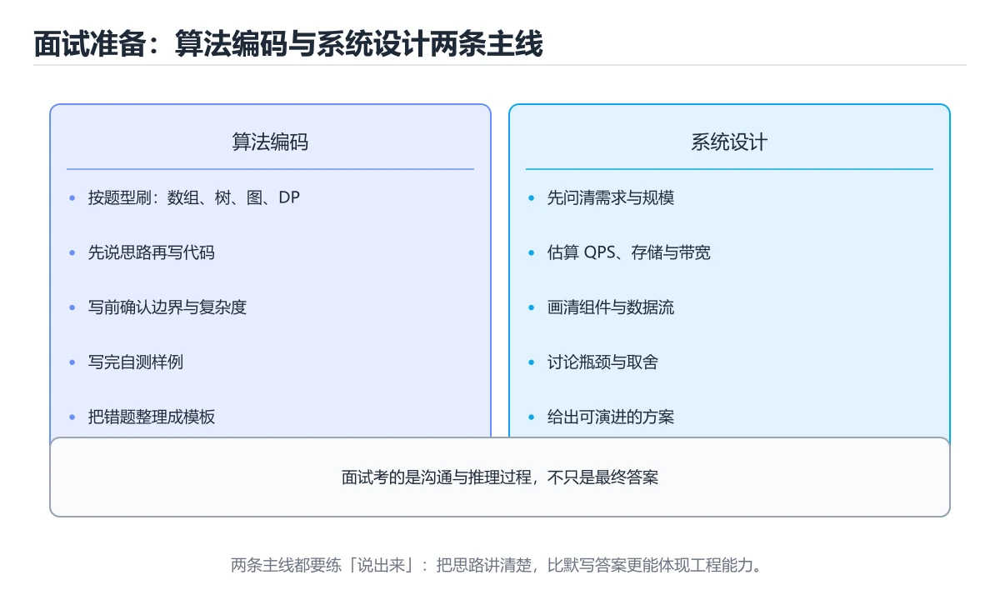
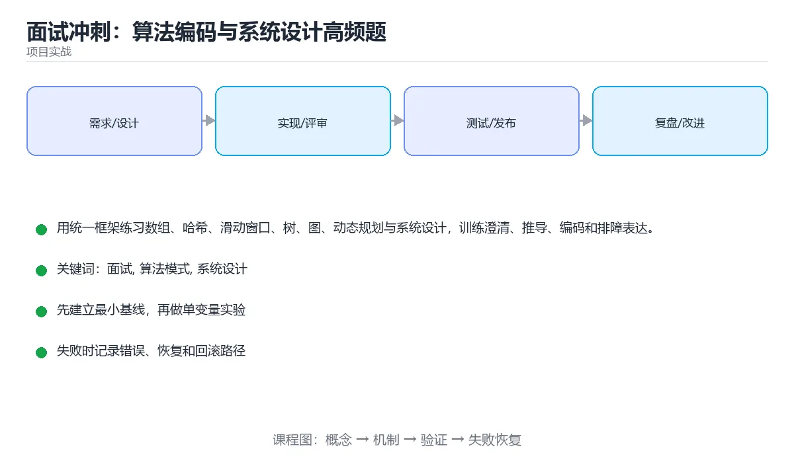

# 面试冲刺：算法编码与系统设计高频题





> 内容更新时间：2026-10-06 · 学习阶段：高级 · 预计用时：60 分钟

## 学习目标

- 能用输入规模、数据特征和失败边界选择合适的算法模式。
- 能在编码前说清不变量、复杂度与测试用例。
- 能用需求、接口、数据、容量、可靠性、监控六步完成系统设计。
- 能在追问中说明瓶颈、降级、一致性和成本取舍。

## 前置知识

- 具备 面试 的前置知识，能看懂 project_interview_coding_system_design 相关的示例。
- 熟悉命令行、依赖管理、测试和 Git 基本操作。
- 本课涉及：面试、算法模式、系统设计、复杂度、排障。

## 项目背景

你需要在有限时间内完成一轮算法编码和一轮系统设计。目标不是背题，而是稳定执行同一套流程：澄清输入输出与约束，写出最小例子，说明暴力法与优化方向，编码后验证边界，再用容量、可靠性和取舍回答设计追问。

一句话摘要：用统一框架练习数组、哈希、滑动窗口、树、图、动态规划与系统设计，训练澄清、推导、编码和排障表达。

## 技术栈

- Python 3.12
- pytest
- 复杂度分析
- 容量估算
- 系统设计模板

## 架构与数据流

```text
「面试冲刺：算法编码与系统设计高频题」的链路可以写成：项目背景 → 技术栈 → 架构与数据流 → 功能范围。链上任何一环缺少可观察的输出，都不能算验证完成。
                 ↘ 失败分类 → 重试/回滚 → 错误响应
```

- 查询 算法模式 时限定字段与分页范围，把全表扫描留作最后手段。
- 写路径要明确 面试 的事务边界、幂等键和失败补偿，不能留下半完成状态。
- 外部调用要设置超时、重试上限和降级策略。
- 每个关键阶段都要留下日志、指标或测试证据。

## 功能范围

- [ ] 数组与哈希的前缀和与频率统计
- [ ] 双指针、滑动窗口和二分答案模式
- [ ] 树的遍历、递归边界与迭代改写
- [ ] 图的最短路、拓扑排序与并查集
- [ ] 动态规划的状态、转移、初始化和空间优化
- [ ] 系统设计的容量估算与故障演练

## 示例数据与边界

| 场景 | 输入 | 期望结果 | 检查点 |
| --- | --- | --- | --- |
| 正常路径 | 合法的最小数据集 | 成功返回并写入正确数据 | 状态码、数据库记录、日志 |
| 边界值 | 最大值、最小值或空集合 | 明确成功或给出可理解错误 | 不崩溃、不越界、不写半条数据 |
| 非法输入 | 类型错误、缺字段、超长内容 | 返回校验错误并指出字段 | 错误结构统一且不泄露内部信息 |
| 依赖失败 | 数据库不可用、超时、网络抖动 | 重试、降级或快速失败 | 可恢复、可观测、无重复副作用 |

## 实施步骤

### 步骤 1：复述问题并写出 2 到 3 个澄清问题

- 先列出 project_interview_coding_system_design 这一步的输入、输出与中间产物，再动手实现。
- 用一条最小输入验证 project_interview_coding_system_design，断言输出符合预期。
- 出错时先记录 算法模式 的错误信息与回滚结果，再决定是否重试。
- 证据留存：保留命令、输出、日志或截图，方便评审与复盘。

### 步骤 2：用最小例子手动推导正确结果

「面试冲刺：算法编码与系统设计高频题」的「步骤 2：用最小例子手动推导正确结果」一节补全如下：

- 定位：这一节说明步骤 2：用最小例子手动推导正确结果在「面试冲刺：算法编码与系统设计高频题」知识体系里的位置。
- 要点：能用输入规模、数据特征和失败边界选择合适的算法模式。
- 自检：能否用一个最小例子解释步骤 2：用最小例子手动推导正确结果？

### 步骤 3：先给出可运行暴力解和复杂度

「面试冲刺：算法编码与系统设计高频题」的「步骤 3：先给出可运行暴力解和复杂度」一节补全如下：

- 定位：这一节说明步骤 3：先给出可运行暴力解和复杂度在「面试冲刺：算法编码与系统设计高频题」知识体系里的位置。
- 要点：能用需求、接口、数据、容量、可靠性、监控六步完成系统设计。
- 自检：能否用一个最小例子解释步骤 3：先给出可运行暴力解和复杂度？

### 步骤 4：识别可复用模式并优化关键步骤

「面试冲刺：算法编码与系统设计高频题」的「步骤 4：识别可复用模式并优化关键步骤」一节补全如下：

- 定位：这一节说明步骤 4：识别可复用模式并优化关键步骤在「面试冲刺：算法编码与系统设计高频题」知识体系里的位置。
- 要点：本课涉及：面试、算法模式、系统设计、复杂度、排障。
- 自检：能否用一个最小例子解释步骤 4：识别可复用模式并优化关键步骤？

### 步骤 5：编码后逐项验证空值、重复、边界和规模

「面试冲刺：算法编码与系统设计高频题」的「步骤 5：编码后逐项验证空值、重复、边界和规模」一节补全如下：

- 定位：这一节说明步骤 5：编码后逐项验证空值、重复、边界和规模在「面试冲刺：算法编码与系统设计高频题」知识体系里的位置。
- 要点：你需要在有限时间内完成一轮算法编码和一轮系统设计。目标不是背题，而是稳定执行同一套流程：澄清输入输出与约束，写出最小例子，说明暴力法与优化方向，编码后验证边界，再用容量、可靠性和取舍回答设计追问。
- 自检：能否用一个最小例子解释步骤 5：编码后逐项验证空值、重复、边界和规模？

### 步骤 6：用六步模板完成一次系统设计表达

「面试冲刺：算法编码与系统设计高频题」的「步骤 6：用六步模板完成一次系统设计表达」一节补全如下：

- 定位：这一节说明步骤 6：用六步模板完成一次系统设计表达在「面试冲刺：算法编码与系统设计高频题」知识体系里的位置。
- 要点：一句话摘要：用统一框架练习数组、哈希、滑动窗口、树、图、动态规划与系统设计，训练澄清、推导、编码和排障表达。
- 自检：能否用一个最小例子解释步骤 6：用六步模板完成一次系统设计表达？

## 关键代码

```python
def longest_unique_substring(text: str) -> int:
    last_seen: dict[str, int] = {}
    left = 0
    best = 0
    for right, char in enumerate(text):
        if char in last_seen and last_seen[char] >= left:
            left = last_seen[char] + 1
        last_seen[char] = right
        best = max(best, right - left + 1)
    return best

# 关键不变量：窗口 [left, right] 内始终没有重复字符。
assert longest_unique_substring('abcabcbb') == 3
assert longest_unique_substring('') == 0
```

## 验证命令与预期输出

```text
1. 安装依赖并启动项目
2. 执行至少 3 条自动化测试，其中包含 1 条失败路径
3. 用正常请求验证成功响应
4. 用非法输入验证错误响应
5. 重复执行一次，确认没有重复写入或副作用
```

## 建议目录结构

```text
src/
  entry/        启动与配置
  domain/       业务模型与规则
  service/      用例编排
  infra/        数据库、HTTP、消息等适配器
tests/          单元、集成与接口测试
```

## 质量门禁

- [ ] 格式化和静态检查通过，不遗留明显警告。
- [ ] 单元测试覆盖 面试 的核心规则，集成测试覆盖数据库或外部边界。
- [ ] 错误响应不泄露堆栈、SQL 和密钥。
- [ ] 配置来自环境变量或配置文件，不硬编码敏感信息。
- [ ] README 写清启动、测试、配置和回滚步骤。

## 安全、成本与可观测性

- 权限遵循最小授权：面试 用到的数据库账号、云资源和令牌都不能使用管理员默认权限。
- 所有进入 面试 的外部输入都要校验、限长并转义，错误信息不能泄露内部路径。
- 密钥通过环境变量或密钥管理服务注入，并记录轮换方式。
- project_interview_coding_system_design 的并发度要有上限，并在达到上限时给出可解释的拒绝。
- 监控 算法模式 的延迟与成本，出现拐点时能追溯到具体变更。
- 把 算法模式 的日志与指标对齐到同一时间轴，便于事后复盘。

## 测试与验收

- 空字符串、单字符和全部重复字符返回正确长度
- 窗口左边界不会倒退且复杂度保持线性
- 树与图练习覆盖空结构、环和不可达节点
- 系统设计包含容量估算、失败路径和监控指标

### 验收记录表

| 检查项 | 证据 | 结果 | 备注 |
| --- | --- | --- | --- |
| 最小路径可运行 | 启动命令与输出 |  |  |
| 失败路径可恢复 | 错误日志与重试 |  |  |
| 自动化测试通过 | 测试报告 |  |  |
| 配置和密钥安全 | 配置检查 |  |  |

## 常见错误与排查

| 问题 | 原因 | 解决 |
| --- | --- | --- |
| 拿到题就直接写代码 | 忽略范围、重复值和空输入导致返工 | 先澄清再编码 |
| 只说最优解不说推导 | 面试官无法判断思路来源 | 从暴力法逐步优化 |
| 编码后不主动测试 | 边界错误无法及时发现 | 用正常、边界和反例逐项验证 |
| 系统设计只画组件 | 没有数据流、容量和故障取舍 | 按六步模板补充量化依据 |

## 扩展任务

- 用同一模式各完成 3 道变体题并总结差异
- 把系统设计答案写成 10 分钟白板稿
- 录制自己的讲解并检查遗漏的澄清与验证步骤

## 性能、容量与故障演练

| 维度 | 基线 | 压测方法 | 失败信号 |
| --- | --- | --- | --- |
| 延迟 | 记录 P50/P95/P99 | 用固定数据集逐步增加并发 | P99 持续上升或超时率增加 |
| 吞吐 | 记录每秒处理量 | 逐步加压直到资源打满 | 队列积压、CPU/内存饱和 |
| 存储 | 记录数据增长与索引大小 | 导入 10 倍数据并观察查询 | 磁盘、连接或锁等待成为瓶颈 |
| 恢复 | 记录故障恢复时间 | 停止数据库、注入延迟或重复请求 | 数据不一致、重复副作用、无法回滚 |

## 实施记录与复盘

每完成一步，记录以下内容：

1. 本步的输入、命令和输出是什么？
2. 遇到的最小失败是什么，如何定位和修复？
3. 哪个假设被验证或推翻？
4. 下一步的风险是什么，如何回滚？
5. 如果 面试 的数据量或并发扩大 10 倍，最先出现的瓶颈在哪里？

## 动手练习

### 练习 1：最小可运行版本（30 分钟）

第一版只做 project_interview_coding_system_design 的主流程，先把可运行与可测试立起来。

**验收标准**：留下启动命令、请求示例和成功输出。

### 练习 2：失败路径（30 分钟）

给 算法模式 注入一次失败，检查是否有半完成状态残留。

**验收标准**：错误信息清晰，且不会破坏已有数据。

### 练习 3：扩展一个功能（60 分钟）

从扩展任务中选一项实现，并补一条自动化测试。

**验收标准**：新功能通过测试，且原有测试不回归。

## 本课小结

- 先定义 project_interview_coding_system_design 的验收标准，再决定要写多少功能。
- 先跑通 面试 的最小路径，再补失败处理、测试和文档，最后才做性能优化。
- 每完成一步就记录 project_interview_coding_system_design 的运行结果与对应改动。
- 完成后用扩展任务检验迁移能力，而不是只复制示例代码。

## 完成标准

- [ ] 能从干净环境按 README 启动项目。
- [ ] 为 project_interview_coding_system_design 补三条测试：正常、边界、失败各一条。
- [ ] 能演示一次错误、一次恢复和一次回滚。
- [ ] 有一份资源或性能基线，能说明瓶颈在哪里。
- [ ] 能说清一个尚未解决的问题和下一步验证方法。

## 可运行练习

### 任务 1：先跑通，再解释

```python
def longest_unique_substring(text: str) -> int:
    last_seen: dict[str, int] = {}
    left = 0
    best = 0
    for right, char in enumerate(text):
        if char in last_seen and last_seen[char] >= left:
            left = last_seen[char] + 1
        last_seen[char] = right
        best = max(best, right - left + 1)
    return best

# 关键不变量：窗口 [left, right] 内始终没有重复字符。
assert longest_unique_substring('abcabcbb') == 3
assert longest_unique_substring('') == 0
```

### 任务 2：只改一个条件

把「面试冲刺：算法编码与系统设计高频题」的最小示例复制一份，只改一个条件再跑一次：

- 改动点：只把 面试 的输入换成空值、极值或错误输入，其余保持不变。
- 预测：先写下「面试冲刺：算法编码与系统设计高频题」在改动后的输出或错误信息，再运行。
- 记录：对照改动前后的结果，指出差异出在哪一步。
- 验收：换回原条件能复现原结果，改动只影响面试。

### 任务 3：迁移到自己的数据

换一个 算法模式 场景重做一次，确认结论不是只对示例数据成立。

## 故障现场

### 现场 1：拿到题就直接写代码

**症状**：在《面试冲刺：算法编码与系统设计高频题》的复现场景中，忽略范围、重复值和空输入导致返工。

**根因**：触发点是把“拿到题就直接写代码”当成安全做法。它没有满足《面试冲刺：算法编码与系统设计高频题》要求的前提，因此先表现为“忽略范围、重复值和空输入导致返工”；排查时先完整复现这一段，再核对输入、配置与依赖。

**修复**：针对《面试冲刺：算法编码与系统设计高频题》的问题，先澄清再编码。

**验证**：保留《面试冲刺：算法编码与系统设计高频题》里触发“忽略范围、重复值和空输入导致返工”的输入、版本和日志，按“先澄清再编码”完成修改后原样重放；只有失败现象消失且相邻场景仍可解释，才保留改动。

### 现场 2：只说最优解不说推导

**症状**：在《面试冲刺：算法编码与系统设计高频题》的复现场景中，面试官无法判断思路来源。

**根因**：触发点是把“只说最优解不说推导”当成安全做法。它没有满足《面试冲刺：算法编码与系统设计高频题》要求的前提，因此先表现为“面试官无法判断思路来源”；排查时先完整复现这一段，再核对输入、配置与依赖。

**修复**：针对《面试冲刺：算法编码与系统设计高频题》的问题，从暴力法逐步优化。

**验证**：保留《面试冲刺：算法编码与系统设计高频题》里触发“面试官无法判断思路来源”的输入、版本和日志，按“从暴力法逐步优化”完成修改后原样重放；只有失败现象消失且相邻场景仍可解释，才保留改动。

### 现场 3：编码后不主动测试

**症状**：在《面试冲刺：算法编码与系统设计高频题》的复现场景中，边界错误无法及时发现。

**根因**：触发点是把“编码后不主动测试”当成安全做法。它没有满足《面试冲刺：算法编码与系统设计高频题》要求的前提，因此先表现为“边界错误无法及时发现”；排查时先完整复现这一段，再核对输入、配置与依赖。

**修复**：针对《面试冲刺：算法编码与系统设计高频题》的问题，用正常、边界和反例逐项验证。

**验证**：先在《面试冲刺：算法编码与系统设计高频题》中记录“编码后不主动测试”留下的失败证据，再执行“用正常、边界和反例逐项验证”并重放；确认错误路径变为明确结果，且修复没有掩盖同类故障。

## 本课复习清单

离开本课前，逐项确认：

- [ ] 不看解析，能说出「算法面试拿到题目后，为什么应该先澄清输入规模和边界？」的判断依据。
- [ ] 不看解析，能说出「面试中先给出暴力解再优化，最主要的价值是什么？」的判断依据。
- [ ] 不看解析，能说出「写完滑动窗口代码后，哪种验证最能发现左边界错误？」的判断依据。
- [ ] 不看解析，能说出「系统设计回答中，哪种内容最能体现工程成熟度？」的判断依据。
- [ ] 用 面试 构造一个正常输入和一个边界输入，分别记录输出与判断依据。
- [ ] 把本课最容易混淆的两个概念写成一句话对照。

| 复盘项 | 记录 |
| --- | --- |
| 已经能独立解释的考点 |  |
| 仍然说不清的概念 |  |
| 下一步验证动作 |  |

## 术语速查

| 术语 | 一句话说明 |
| --- | --- |
| `面试` | 通过问题、编码和系统设计交流候选人的知识、推理与合作能力。 |
| `算法模式` | 在大量题目中反复出现的解题结构，如双指针、滑动窗口、回溯与动态规划。 |
| `系统设计` | 用统一框架练习数组、哈希、滑动窗口、树、图、动态规划与系统设计，训练澄清、推导、编码和排障表达。 |
| `复杂度` | 描述输入规模增长时时间或空间消耗的变化趋势。 |

## 考点精讲

### 考点 1：顺序排列·面试

- **题目**：按“面试冲刺：算法编码与系统设计高频题”中 面试、算法模式、系统设计 的实践顺序，把四个步骤排成从准备到复盘的合理顺序。
- **判断依据**：在「面试冲刺：算法编码与系统设计高频题」里，在本课的练习里，顺序应当是：先明确 面试 的输入、输出与约束 → 写出最小示例并核对 算法模式 的基线结果 → 只改一个变量，记录边界与失败路径的变化 → 固定版本与证据，把本课的结论写成可复现记录。这个顺序把 面试 的输入、输出和约束放在最前面，在面试冲刺：算法编码与系统设计高频题里避免概念没对齐就开始调参。第二步用 算法模式 建立可核对的基线，在面试冲刺：算法编码与系统设计高频题里第三步才允许改变一个变量并观察失败路径。

### 考点 2：概念判断·面试

- **题目**：面试中先给出暴力解再优化，最主要的价值是什么？
- **判断依据**：在「面试冲刺：算法编码与系统设计高频题」里，先建立正确基线。暴力解通常最容易证明正确，也为优化提供对照：找出重复计算、无效扫描或可复用状态，才能自然地引出哈希、双指针、动态规划等模式。回到「面试冲刺：算法编码与系统设计高频题」的正文示例，用“面试中先给出暴力解再优化”走一遍面试、算法模式、系统设计的完整流程，能复现的结论才可以保留。

### 考点 3：代码补全·面试

- **题目**：这段 Python 代码是「面试冲刺：算法编码与系统设计高频题」的示例片段，下面哪一项描述与它一致？
- **判断依据**：在「面试冲刺：算法编码与系统设计高频题」里，这段代码把主要逻辑封装在函数或方法里，需要被调用才会执行。这段代码出自「面试冲刺：算法编码与系统设计高频题」的正文示例，围绕面试、算法模式、系统设计展开；把输入或边界换成空值、极值或失败情况后，结论要以「面试冲刺：算法编码与系统设计高频题」的实际运行结果为准。

### 考点 4：概念判断·面试

- **题目**：系统设计回答中，哪种内容最能体现工程成熟度？
- **判断依据**：系统设计不是组件堆砌，而是围绕需求做可验证的工程取舍。在「面试冲刺：算法编码与系统设计高频题」里，作答时，先用面试建立输入与输出的基线，再把说明数据流，容量估算代入边界条件核对，结论才能复现。在「面试冲刺：算法编码与系统设计高频题」里，这道题要求区分概念与边界，「说明数据流，容量估算」只有在题干给出的前提下才成立，而「组件名字越多越好」、「只画一张架构图」缺少同一组条件。

### 考点 5：多选辨析·面试

- **题目**：以下哪些术语与「面试冲刺：算法编码与系统设计高频题」直接相关？（多选）
- **判断依据**：在「面试冲刺：算法编码与系统设计高频题」里，算法模式。在「面试冲刺：算法编码与系统设计高频题」里判断这道题，要把面试、算法模式、系统设计的条件、过程与失败路径逐项对齐，换成“以下哪些术语与面试冲刺”这个场景，只有满足前提的结论才成立。“以下哪些术语与面试冲刺”与「面试冲刺：算法编码与系统设计高频题」的术语表相呼应，只有符合面试、算法模式、系统设计约束的“面试”才是正文支持的结论。

## 复习与自测

- [ ] 能用一句话说明「项目背景」解决什么问题。
- [ ] 能把「架构与数据流」的判断标准套到一个新例子上。
- [ ] 能说清「功能范围」的结论，并说出它的适用边界。
- [ ] 能用自己的话复述「示例数据与边界」，并各举一个正例和反例。
- [ ] 能解释「实施步骤」里最容易混淆的两个概念。
- [ ] 能不看正文写出「步骤 1：复述问题并写出 2 到 3 个澄清问题」的关键步骤。

## English Overview

**Title:** Interview Sprint: Coding and System Design

**Summary:** Practice coding patterns and system design with a repeatable interview framework.

**Category:** Project Practice
**Level:** 高级
**Key terms:** 面试, 算法模式, 系统设计, 复杂度, 排障

## 内容元数据

- 内容版本：v2.0
- 最后更新：2026-10-06
- 学习阶段：高级
- 适用环境：通用项目交付流程；本课聚焦 面试。
- 内容来源：内置结构化课程与工程实践整理
- 相关主题：面试、算法模式、系统设计、复杂度、排障
- 质量版本：P0 测验标准 + P1 覆盖扩展 + P2 体验补全

## 项目专属规格：面试冲刺：算法编码与系统设计高频题

### 核心场景

用统一框架练习数组、哈希、滑动窗口、树、图、动态规划与系统设计，训练澄清、推导、编码和排障表达。 项目目标是把「面试、算法模式、系统设计、复杂度、排障」落实为可运行、可测试、可回滚的交付物。

### 架构与数据流

```text
用户/输入 → 接口或命令 → 领域逻辑 → 存储/外部依赖 → 输出与监控
                         ↘ 失败分类 → 重试/补偿 → 回滚
```

### 最小数据模型

| 对象 | 关键字段 | 约束 |
| --- | --- | --- |
| 输入实体 | 面试、时间、来源 | 必填校验、长度限制、幂等键 |
| 任务实体 | 状态、优先级、创建时间 | 状态迁移合法、不可重复执行 |
| 结果实体 | 输出、错误码、耗时 | 可序列化、错误可解释 |
| 审计记录 | 操作者、动作、结果、时间 | 不可篡改、可查询、脱敏 |

### 验收场景

1. 正常路径：最小输入得到预期输出，并留下日志与指标。
2. 边界路径：面试 的空值、最大值、重复数据和超长内容都得到明确处理。
3. 失败路径：依赖超时或不可用时能快速失败、重试或降级。
4. 幂等路径：同一请求执行两次不会产生重复副作用。
5. 回滚路径：面试 回滚后数据一致，且能说明恢复时间和影响范围。

## 项目交付物

### 建议仓库结构

```text
src/
tests/
docs/
README.md
```

### 测试矩阵

| 层级 | 覆盖内容 | 最低数量 | 通过标准 |
| --- | --- | ---: | --- |
| 单元测试 | 领域规则、边界和错误分类 | 8 | 正常、边界、失败路径全部通过 |
| 集成测试 | 数据库、网络、文件或平台边界 | 3 | 使用真实边界且可重复运行 |
| 端到端测试 | 核心用户路径 | 1 | 从输入到输出完整跑通 |
| 手动验收 | 文档中列出的 5 个场景 | 5 | 有命令、输出和结论记录 |

### 验收数据

```json
{
  "project": "project_interview_coding_system_design",
  "scenario": "面试的正常路径",
  "input": {"case": "normal", "value": "project_interview_coding_system_design"},
  "expected": {"ok": true, "checks": ["面试可复现", "算法模式有记录"]},
  "failure_case": {"case": "算法模式越界或缺失", "error": "validation_error"},
  "idempotency_key": "project_interview_coding_system_design-001"
}
```

### 复盘模板

| 问题 | 记录 |
| --- | --- |
| 原目标是什么？ | 用一句话描述可验收目标 |
| 实际发生了什么？ | 时间线、指标和关键日志 |
| 哪个假设被推翻？ | 根因与促成因素 |
| 如何回滚？ | 步骤、耗时和数据校验 |
| 下一步做什么？ | 负责人、期限和验证方式 |

> 项目验收围绕「面试、算法模式、系统设计」：至少完成一次正常路径、一次边界输入、一次失败恢复和一次幂等检查。

## 参考资料与复核

- 最后复核：2026-10-04
- 下次复核：2027-10-10
- 复核范围：版本兼容、API 行为、安全建议与工程实践
- 来源性质：官方文档、标准或权威教材；正文为离线教学重组

| 参考资料 | 本课用途 |
| --- | --- |
| [Docker 入门](https://docs.docker.com/get-started/) | 容器化与 Compose |
| [GitHub Actions 文档](https://docs.github.com/actions) | 自动构建、测试与发布 |
| [OpenTelemetry 文档](https://opentelemetry.io/docs/) | 日志、指标与链路追踪 |

> 「面试冲刺：算法编码与系统设计高频题」的链接用于离线阅读后的延伸核对；App 不会自动联网。

## Full English Study Guide

### Overview

**Interview Sprint: Coding and System Design** focuses on Practice coding patterns and system design with a repeatable interview framework.

### Learning Outcomes

- Explain what **Interview Sprint: Coding and System Design** solves and when it should be used.

### Glossary

- Topic: **Interview Sprint: Coding and System Design**
- Related terms: 面试, 算法模式, 系统设计, 复杂度

<!-- p1-project-review:start -->
## 交付评审：评分表、决策记录与证据链

「面试冲刺：算法编码与系统设计高频题」的验收不能只看功能能不能跑通。下面把正文里的交付物、验证命令和关键设计点整理成一张评审表，按表逐项留下证据即可。

### 一、「面试冲刺：算法编码与系统设计高频题」的交付物评分表

| 交付物 | 权重 | 合格线 | 需要的证据 |
| --- | ---: | --- | --- |
| 核心链路 | 34% | 能在干净环境复现，且失败路径有明确处理 | 命令与输出、对应测试、一次失败与恢复记录 |
| 测试与验收记录 | 33% | 能在干净环境复现，且失败路径有明确处理 | 命令与输出、对应测试、一次失败与恢复记录 |
| 运行与回滚说明 | 33% | 能在干净环境复现，且失败路径有明确处理 | 命令与输出、对应测试、一次失败与恢复记录 |

「面试冲刺：算法编码与系统设计高频题」的评分先看证据再打分：任意一项只要拿不出可复现的命令或测试，该项按 0 分计，不允许用「基本完成」代替。

### 二、需要写下来的决策（ADR）

| 决策点 | 本课给出的做法 | 备选方案 | 代价与回滚 |
| --- | --- | --- | --- |
| 步骤 5：编码后逐项验证空值、重复、边界和规模 | 「面试冲刺：算法编码与系统设计高频题」的「步骤 5：编码后逐项验证空值、重复、边界和规模」一节补全如下： | 不做「步骤 5：编码后逐项验证空值、重复、边界和规模」，沿用最朴素的实现（需要额外补一次对照实验） | 若「步骤 5：编码后逐项验证空值、重复、边界和规模」出问题，回到上一版本并按本课验收场景重跑 |
| 步骤 6：用六步模板完成一次系统设计表达 | 「面试冲刺：算法编码与系统设计高频题」的「步骤 6：用六步模板完成一次系统设计表达」一节补全如下： | 不做「步骤 6：用六步模板完成一次系统设计表达」，沿用最朴素的实现（需要额外补一次对照实验） | 若「步骤 6：用六步模板完成一次系统设计表达」出问题，回到上一版本并按本课验收场景重跑 |
| 架构与数据流 | 用户/输入 → 接口或命令 → 领域逻辑 → 存储/外部依赖 → 输出与监控 | 不做「架构与数据流」，沿用最朴素的实现（需要额外补一次对照实验） | 若「架构与数据流」出问题，回到上一版本并按本课验收场景重跑 |

ADR 不需要长：每个决策三行就够——选了什么、放弃了什么、出问题怎么退。评审时只检查这三行是否和「面试冲刺：算法编码与系统设计高频题」的实际代码一致。

### 三、「面试冲刺：算法编码与系统设计高频题」的交付证据链

| # | 命令 | 这条命令要留下的证据 |
| ---: | --- | --- |
| 1 | `1. 安装依赖并启动项目` | 完整输出、退出码、耗时，以及与「面试冲刺：算法编码与系统设计高频题」验收口径的对应关系 |
| 2 | `2. 执行至少 3 条自动化测试，其中包含 1 条失败路径` | 完整输出、退出码、耗时，以及与「面试冲刺：算法编码与系统设计高频题」验收口径的对应关系 |
| 3 | `3. 用正常请求验证成功响应` | 完整输出、退出码、耗时，以及与「面试冲刺：算法编码与系统设计高频题」验收口径的对应关系 |
| 4 | `4. 用非法输入验证错误响应` | 完整输出、退出码、耗时，以及与「面试冲刺：算法编码与系统设计高频题」验收口径的对应关系 |
| 5 | `5. 重复执行一次，确认没有重复写入或副作用` | 完整输出、退出码、耗时，以及与「面试冲刺：算法编码与系统设计高频题」验收口径的对应关系 |

把「面试冲刺：算法编码与系统设计高频题」的上表整理成一个 evidence/ 目录：每条命令一个文件，文件名带日期，内容包含版本、命令与输出。评审时直接按目录核对，不再口头确认。

### 四、「面试冲刺：算法编码与系统设计高频题」的验收指标

| 指标 | 目标值 | 测量方式 | 不达标时的动作 |
| --- | --- | --- | --- |
| | 延迟 | 记录 P50/P95/P99 | 用固定数据集逐步增加并发 | P99 持续上升或超时率增加 | | 用本课正文给出的阈值，没有就写实测基线 | 固定环境重复三次取中位数 | 回到对应小节定位，先修原因再重测 |
| | 存储 | 记录数据增长与索引大小 | 导入 10 倍数据并观察查询 | 磁盘、连接或锁等待成为瓶颈 | | 用本课正文给出的阈值，没有就写实测基线 | 固定环境重复三次取中位数 | 回到对应小节定位，先修原因再重测 |

指标必须能用一条命令或一次操作测出来；写不出测量方式的指标，在「面试冲刺：算法编码与系统设计高频题」的评审里一律视为未定义。

### 五、评审记录模板

| 记录项 | 填写要求 |
| --- | --- |
| 项目标识 | `project_interview_coding_system_design` |
| 本次范围 | 说明这一轮交付了「面试冲刺：算法编码与系统设计高频题」的哪些部分 |
| 未完成项 | 列出与 面试 相关但本轮未做的内容 |
| 证据位置 | 指向 evidence/ 目录下的具体文件 |
| 风险与回滚 | 写清剩余风险、回滚步骤和验证方式 |
| 结论 | 通过 / 有条件通过 / 不通过，三者选一 |

「面试冲刺：算法编码与系统设计高频题」评审结束后把这张表填完并归档；下一轮迭代直接读上一次的「未完成项」与「风险与回滚」，避免重复讨论同一个问题。
<!-- p1-project-review:end -->
