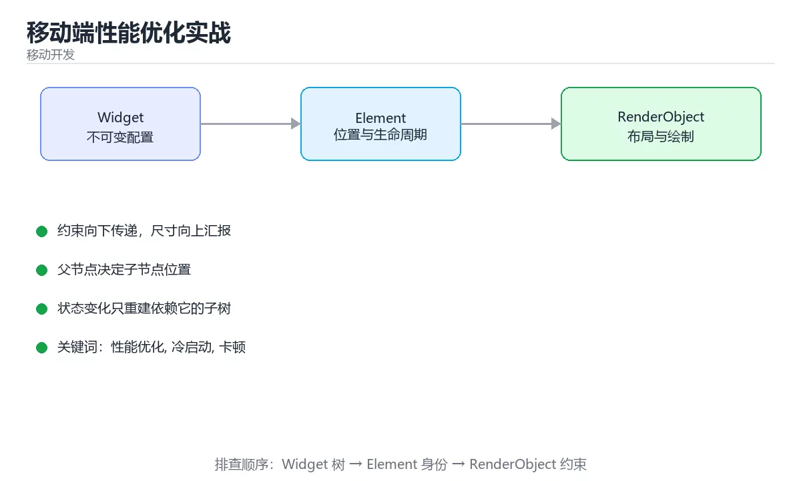
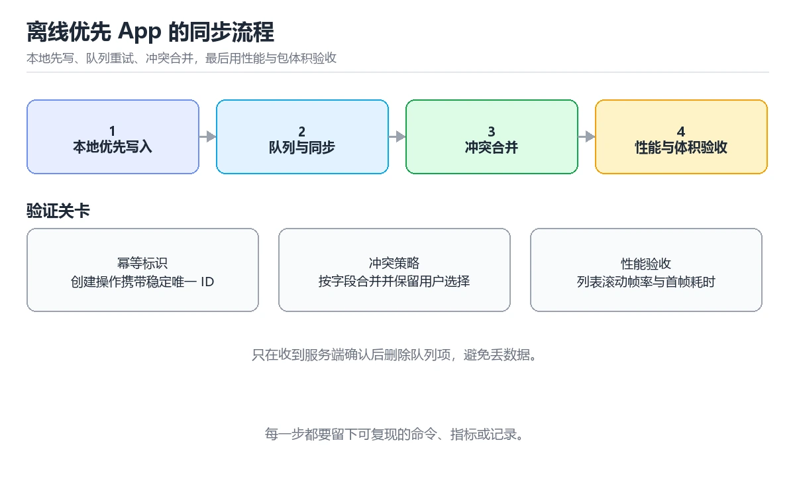

# 移动端离线优先 App 实战

> 内容更新时间：2026-10-06 · 学习阶段：进阶 · 预计用时：60 分钟

> 项目定位：把本地数据视为首要真相来源，让用户在无网、弱网和进程被终止后仍能继续工作。
> 建议投入：16 小时
> 难度：进阶



## 前置知识

- 建议先完成：《Flutter 基础与 Widget 树》、《Flutter 状态管理与性能》、《移动端性能优化实战》。
- 本课阶段：进阶。需要能够独立阅读命令、代码或配置，并会用日志和测试验证结果。
- 开始前复习：Flutter、离线优先、本地数据库、同步。
- 准备一个可丢弃的本地环境验证 Flutter；实验要能重建、清理和回滚。
- 把 offline_sync_test 的失败现场压缩到最小输入，确认问题仍然出现。

## 项目背景

移动端网络不稳定，系统也会随时回收进程。如果每次打开都依赖接口，用户就会看到空白页、重复提交或丢失草稿。本实战实现一个离线任务应用：本地数据库承担读写与队列，界面只订阅本地状态；后台同步负责重试和冲突合并，最后验证冷启动、滚动性能、断网恢复与发布包完整性。

## 学习目标

1. 能设计本地表结构、待同步队列和稳定的客户端生成标识。
2. 能处理重试、幂等、删除、冲突与进程中断，保证同一操作不会重复生效。
3. 能测量冷启动、帧耗时、内存和包体积，并把关键指标纳入发布检查。

## 需求与约束

| 维度 | 约束 |
| --- | --- |
| 离线 | 除首次初始化外，核心查看、创建和编辑流程无网可用 |
| 一致性 | 同一操作重复提交不产生重复数据，冲突有确定的合并规则 |
| 性能 | 冷启动首帧小于 1.5 秒，常用列表滚动保持流畅 |
| 隐私 | 本地敏感字段加密，日志不记录令牌和用户正文 |

## 架构与数据流

界面层只调用仓库接口，仓库同时写入本地数据库和同步队列；同步器在具备网络时按批次上传，使用操作标识保证幂等，并把服务端版本与本地版本合并后回写；诊断模块记录同步状态和性能采样。

```text
UI -> repository -> local db + outbox
                         |
                  sync worker -> API
                         |
                  merge/retry -> UI state
```

## 实施步骤

### 里程碑 1：先把本地主链路跑通

设计任务、标签和待同步操作表，使用客户端标识创建记录；在飞行模式下完成增删改查，并确认重启应用后数据仍存在。

### 里程碑 2：实现可靠同步

为每个操作生成唯一标识和重试次数，上传成功后按条件删除队列项；模拟超时、重复响应和进程终止，验证服务端最终只得到一次业务效果。

### 里程碑 3：处理冲突与性能验收

给记录增加版本或更新时间，定义字段级合并规则；用性能工具检查冷启动、滚动帧、内存和包体积，异常时保留采样报告再优化。

## 验证命令与预期输出

在 移动端离线优先 App 实战 的仓库根目录执行以下命令，确认核心链路可以运行。

```bash
flutter pub get
flutter analyze
flutter test
flutter test integration_test/offline_sync_test.dart
flutter build apk --release --target-platform android-arm,android-arm64
```

**预期输出**：静态检查与测试全部通过；集成测试在断网、恢复网络和重复提交场景下保持数据一致；发布包成功生成，冷启动和列表滚动指标在预算内，日志中没有敏感字段。

## 项目交付物

- 离线数据模型与仓库接口
- 待同步队列和冲突规则
- 断网、重试与进程中断集成测试
- 性能采样、发布包和体积报告



## 故障现场

### 现场 1：恢复网络后出现重复任务

**症状**：恢复网络后出现重复任务。

**定位**：请求已成功但响应丢失，客户端再次重试且服务端没有幂等处理。

**修复**：为操作与创建请求使用稳定唯一标识，服务端按标识去重，客户端只删除确认成功的队列项。

### 现场 2：离线修改覆盖了服务端更新

**症状**：离线修改覆盖了服务端更新。

**定位**：同步时直接整条覆盖，没有比较版本或合并字段。

**修复**：保留版本与更新时间，按字段合并并记录冲突；无法自动解决时让用户选择，不能静默丢弃数据。

### 现场 3：列表滚动仍然掉帧

**症状**：列表滚动仍然掉帧。

**定位**：在构建过程中解析大对象、频繁重建或一次加载过多记录。

**修复**：分页查询并使用轻量模型，把解析与数据库访问移出首帧，结合帧图和内存采样逐项优化。

## 常见错误与排查

> 复核：已人工核对并重写（2026-10-06），每行对应本课的一个真实易错点。

| 易错点 | 容易踩的做法 | 正确结论 |
| --- | --- | --- |
| 把网络当成一定可用 | 弱网与断网时功能直接不可用 | 本地先读写，网络只用于同步，并给出同步状态提示 |
| 同步接口不幂等 | 重试会产生重复数据或覆盖他人修改 | 用客户端生成的唯一键与版本号，保证重复执行结果一致 |
| 冲突策略没有想清楚 | 两端同时修改时数据会被静默覆盖 | 明确最后写入优先或版本向量，必要时提示用户合并 |
| 上线前只在模拟器验证 | 低端设备与弱网下的启动、内存和包体积问题不会暴露 | 在真机与弱网环境测启动时间、帧率与包体积 |

## 扩展任务

- 加入后台任务与系统调度约束
- 用数据库加密和密钥轮换保护敏感数据
- 增加灰度发布与崩溃率监控

## 复习与自测

1. 用一句话说明 移动端离线优先 App 实战 的核心输入、输出与失败边界。
2. 画出 Flutter 的数据流，并标出至少一条失败路径。
3. 写出 移动端离线优先 App 实战 的下一条验证命令，并说明预期结果。

## 可运行练习

### 任务 1：先跑通，再解释

```bash
flutter pub get
flutter analyze
flutter test
flutter test integration_test/offline_sync_test.dart
flutter build apk --release --target-platform android-arm,android-arm64
```

### 任务 2：只改一个条件

把「移动端离线优先 App 实战」的最小示例复制一份，只改一个条件再跑一次：

- 改动点：只调整 offline_sync_test 的一个参数，其余条件一律不动。
- 预测：先写下「移动端离线优先 App 实战」在改动后的输出或错误信息，再运行。
- 记录：对照改动前后的结果，指出差异出在哪一步。
- 验收：换回原条件能复现原结果，改动只影响Flutter。

### 任务 3：迁移到自己的数据

用同一套思路处理一组你自己的 Flutter 数据，保持输出格式与任务 1 一致。

## 零基础精讲：把移动端离线优先 App 实战真正讲透

### 先建立一个直觉

离线优先意味着本地是事实来源：先保证无网可用，再让同步、冲突与性能有可验收的指标。
落到本课，「移动端离线优先 App 实战」关心的是 Flutter 与 离线优先 的配合，也就是说这条直觉要在 项目背景 里被具体验证。

本课的摘要可以当作一张地图：用 Flutter 构建离线可用、冲突可合并、弱网可恢复的移动应用，并完成性能与发布验证。

### 逐步拆解

1. 澄清输入与目标。先写清「移动端离线优先 App 实战」要解决的问题、合法输入范围和成功标准，再进入后续步骤。
2. 描述处理过程。把「Flutter、离线优先、本地数据库、同步、冲突处理、移动性能」映射到具体步骤，每步都要求能单独验证。
3. 定义输出。Flutter 的输出不仅包括正常结果，还包括错误码、日志和资源释放状态。
4. 构造一次Flutter越界，记录系统是拒绝、降级还是静默出错；三者对应的修复策略完全不同。
5. 用 offline_sync_test 构造一个最小反例，证明「移动端离线优先 App 实战」的结论有边界。

### 把正文串成一条执行链

- **里程碑 1：先把本地主链路跑通**：在「移动端离线优先 App 实战」里，「里程碑 1：先把本地主链路跑通」这一步要先写清输入与预期，再记录实际结果和差异；结果不符时回到对应小节核对前提。
- **里程碑 2：实现可靠同步**：在「移动端离线优先 App 实战」里，「里程碑 2：实现可靠同步」这一步要先写清输入与预期，再记录实际结果和差异；结果不符时回到对应小节核对前提。
- **里程碑 3：处理冲突与性能验收**：在「移动端离线优先 App 实战」里，「里程碑 3：处理冲突与性能验收」这一步要先写清输入与预期，再记录实际结果和差异；结果不符时回到对应小节核对前提。
- **现场 1：恢复网络后出现重复任务**：在「移动端离线优先 App 实战」里，「现场 1：恢复网络后出现重复任务」这一步要先写清输入与预期，再记录实际结果和差异；结果不符时回到对应小节核对前提。
- **现场 2：离线修改覆盖了服务端更新**：在「移动端离线优先 App 实战」里，「现场 2：离线修改覆盖了服务端更新」这一步要先写清输入与预期，再记录实际结果和差异；结果不符时回到对应小节核对前提。
- **现场 3：列表滚动仍然掉帧**：在「移动端离线优先 App 实战」里，「现场 3：列表滚动仍然掉帧」这一步要先写清输入与预期，再记录实际结果和差异；结果不符时回到对应小节核对前提。

### 从测验反推易错点

- 参考判断：学习 Flutter 时要同时说明输入、输出和失败路径，不能只看正常流程、验证 离线优先 时要固定版本并覆盖边界输入，结论才可复现
- 解析：本课把移动端离线优先 App 实战拆成概念、示例与故障现场三部分，因此判断 Flutter 时必须同时交代输入、输出和失败路径，这使“学习 Flutter 时要同时说明输入、输出和失败路径，不能只看正常流程”成立；在移动端离线优先 App 实战里，判断 离线优先 时要固定版本与边界输入，所以“验证 离线优先 时要固定版本并覆盖边界输入，结论才可复现”才可复现。相反，“只要 Flutter 的常规示例通过，就可以跳过边界与异常路径”把一次正常示例当成全部情况，会漏掉本课的边界缺陷；“把 离线优先 的单次运行结果当成所有版本和规模都成立”把单次结果外推成普遍结论，在移动端离线优先 App 实战里忽略了版本和规模变化。对照本课的故障现场与自测清单，就能用证据区分这两种判断。
- 自问：如果去掉题干里的一个限定词，结论还成立吗？

- 参考判断：固定版本与证据，把本课的结论写成可复现记录
- 解析：在本课的练习里，顺序应当是：先明确 Flutter 的输入、输出与约束 → 写出最小示例并核对 离线优先 的基线结果 → 只改一个变量，记录边界与失败路径的变化 → 固定版本与证据，把本课的结论写成可复现记录。这个顺序把 Flutter 的输入、输出和约束放在最前面，在移动端离线优先 App 实战里避免概念没对齐就开始调参。第二步用 离线优先 建立可核对的基线，在移动端离线优先 App 实战里第三步才允许改变一个变量并观察失败路径。最后一步把本课的版本、证据与结论固定下来，别人才能复现同样的结果。

- 参考判断：默认参数 bucket=[] 只在定义时创建一次，两次调用共享同一个列表。

**检查点 4：移动端发布前为什么要同时检查性能和包体积？**

- 参考判断：弱网和低端设备会放大启动、内存与下载成本，直接影响可用性
- 解析：开发设备通常性能较好且网络稳定，无法代表真实用户环境。资源增加会拉长下载与安装时间，内存过高会增加后台被杀概率，启动耗时和掉帧则直接影响操作。发布前记录基线并设置预算，能在问题进入生产前发现回退，同时避免用单一功能测试代替真实设备测量。低端设备与弱网环境要纳入验收矩阵。

### 工程排错顺序

| 先查什么 | 要得到的证据 | 判断标准 |
| --- | --- | --- |
| 用户、范围与验收标准是否写清？ | 日志、输入样例、测试或指标 | 能复现并解释，才算定位 |
| 每阶段是否有可运行增量？ | 日志、输入样例、测试或指标 | 能复现并解释，才算定位 |
| 测试、监控和回滚是否随功能一起交付？ | 日志、输入样例、测试或指标 | 能复现并解释，才算定位 |
| 复盘是否形成下一轮改进项？ | 日志、输入样例、测试或指标 | 能复现并解释，才算定位 |

### 变式训练

1. 先用一个单文件示例验证 offline_sync_test，确认正确性后再引入框架或分布式组件。
2. 把 offline_sync_test 的数据量提高一个数量级，观察延迟与内存的变化拐点。
3. 把 离线优先 换成失败输入，记录错误信息与恢复动作。
5. 把「移动端离线优先 App 实战」里最容易被省略的一步去掉，用测试或指标证明它不可省略，而不是凭感觉判断。
6. 把 Flutter 的方案切换到低资源设备，重新评估默认参数、超时和降级策略。

### 本课自测

- [ ] 能用一句话解释「Flutter」在本课中的角色与边界。
- [ ] 能举出一个正常例子和一个失败例子。
- [ ] 能说出最小验证步骤，以及需要记录的证据。
- [ ] 能用一句话解释「离线优先」在本课中的角色与边界。
- [ ] 能用一句话解释「本地数据库」在本课中的角色与边界。
- [ ] 能用一句话解释「同步」在本课中的角色与边界。
- [ ] 能用一句话解释「冲突处理」在本课中的角色与边界。

### 迁移案例库

围绕 offline_sync_test 重复同一套方法，每完成一轮就把差异写进笔记。

#### 迁移案例 1：围绕「Flutter」做一次小实验

**目标**：在不改变课程主体的前提下，验证移动端离线优先 App 实战中的一个关键判断。

**步骤**：
1. 复述当前方案对「Flutter」的假设，写成一句可证伪的话。
2. 设计一个正常输入和一个边界输入，分别预测输出。
3. 运行或逐步演算，记录实际输出、耗时和失败信息。
4. 只调整一个参数，比较前后差异并解释原因。
5. 补充一条测试或复习卡，确保下次能更快复现。

**验收**：结论要能追溯到正文的具体小节与代码位置，并记录离线优先相关的指标变化。

#### 迁移案例 2：围绕「离线优先」做一次小实验

**步骤**：
1. 复述当前方案对「离线优先」的假设，写成一句可证伪的话。

#### 迁移案例 3：围绕「本地数据库」做一次小实验

**步骤**：
1. 复述当前方案对「本地数据库」的假设，写成一句可证伪的话。

#### 迁移案例 4：围绕「同步」做一次小实验

**步骤**：
1. 复述当前方案对「同步」的假设，写成一句可证伪的话。

#### 迁移案例 5：围绕「冲突处理」做一次小实验

**步骤**：
1. 复述当前方案对「冲突处理」的假设，写成一句可证伪的话。

#### 迁移案例 6：围绕「移动性能」做一次小实验

**步骤**：
1. 复述当前方案对「移动性能」的假设，写成一句可证伪的话。

#### 迁移案例 7：围绕「Flutter」做一次小实验

**步骤**：

#### 迁移案例 8：围绕「离线优先」做一次小实验

**步骤**：

#### 迁移案例 9：围绕「本地数据库」做一次小实验

**步骤**：

#### 迁移案例 10：围绕「同步」做一次小实验

**步骤**：

#### 迁移案例 11：围绕「冲突处理」做一次小实验

**步骤**：

#### 迁移案例 12：围绕「移动性能」做一次小实验

**步骤**：

#### 迁移案例 13：围绕「Flutter」做一次小实验

**步骤**：

#### 迁移案例 14：围绕「离线优先」做一次小实验

**步骤**：

#### 迁移案例 15：围绕「本地数据库」做一次小实验

**步骤**：

#### 迁移案例 16：围绕「同步」做一次小实验

**步骤**：

<!-- p0-depth-v2:end -->

## 考点精讲

### 考点 1：多选辨析·Flutter

- **题目**：围绕“移动端离线优先 App 实战”中的 Flutter、离线优先、本地数据库，下列哪两项是本课强调的实践判断？
- **判断依据**：本课把移动端离线优先 App 实战拆成概念、示例与故障现场三部分，因此判断 Flutter 时必须同时交代输入、输出和失败路径，这使“学习 Flutter 时要同时说明输入、输出和失败路径，不能只看正常流程”成立。在移动端离线优先 App 实战里，判断 离线优先 时要固定版本与边界输入，所以“验证 离线优先 时要固定版本并覆盖边界输入，结论才可复现”才可复现。

### 考点 2：顺序排列·Flutter

- **题目**：按“移动端离线优先 App 实战”中 Flutter、离线优先、本地数据库 的实践顺序，把四个步骤排成从准备到复盘的合理顺序。
- **判断依据**：题干的正确项是固定版本与证据，把“移动端离线优先 App 实战”的结论写成可复现记录。在「移动端离线优先 App 实战」里，在本课的练习里，顺序应当是：先明确 Flutter 的输入、输出与约束 → 写出最小示例并核对 离线优先 的基线结果 → 只改一个变量，记录边界与失败路径的变化 → 固定版本与证据，把本课的结论写成可复现记录。这个顺序把 Flutter 的输入、输出和约束放在最前面，在移动端离线优先 App 实战里避免概念没对齐就开始调参。第二步用 离线优先 建立可核对的基线，在移动端离线优先 App 实战里第三步才允许改变一个变量并观察失败路径。

### 考点 3：代码补全·Flutter

- **题目**：下面这段代码摘自「移动端离线优先 App 实战」的正文示例。关于这段代码，下面哪一项说法与实际内容相符？
- **判断依据**：在「移动端离线优先 App 实战」里，这段代码只做静态声明，没有循环、分支或可观察输出。这段代码出自「移动端离线优先 App 实战」的正文示例，围绕Flutter、离线优先、本地数据库展开；把输入或边界换成空值、极值或失败情况后，结论要以「移动端离线优先 App 实战」的实际运行结果为准。

### 考点 4：概念判断·Flutter

- **题目**：移动端发布前为什么要同时检查性能和包体积？
- **判断依据**：在「移动端离线优先 App 实战」里，结论应落在「弱网和低端设备会放大启动、内存与下载成本，直接影响可用性」。结论应落在弱网和低端设备会放大启动、内存与下载成本。开发设备通常性能较好且网络稳定，无法代表真实用户环境。资源增加会拉长下载与安装时间，内存过高会增加后台被杀概率，启动耗时和掉帧则直接影响操作。

### 考点 5：排错·移动端离线优先

- **题目**：离线队列在恢复网络后重复提交了同一笔订单。根因最可能是什么？
- **判断依据**：请求成功但响应丢失，重试时服务端没有按唯一标识幂等去重。移动端离线优先 App 实战 的故障现场指出，恢复网络后出现重复任务，通常因为请求已成功但响应丢失后队列再次重试；为创建操作携带稳定唯一标识，服务端按标识去重，客户端只在收到确认后删除队列项。

## English Overview

Build an offline-first Flutter app with conflict handling, weak-network recovery and release checks.

This project on "移动端离线优先 App 实战" turns the topic into a delivery workflow: define constraints, build a minimal end-to-end path, verify it with repeatable commands, and record failure handling.

## 项目专属规格

### 交付边界

用 Flutter 构建离线可用、冲突可合并、弱网可恢复的移动应用，并完成性能与发布验证。 项目交付不是一份说明文档，而是一组可以运行的命令、可检查的输入输出、失败处理和复盘证据。范围必须同时写明本阶段做什么、不做什么，以及哪些依赖属于外部前提。

### 最小数据模型

| 对象 | 关键字段 | 约束 |
| --- | --- | --- |
| 输入实体 | Flutter、来源、时间、版本 | 必填、可校验、可追溯到原始输入 |
| 任务实体 | 状态、优先级、执行标识、重试次数 | 状态迁移合法、重复执行不会产生重复副作用 |
| 结果实体 | 输出、错误码、耗时、资源指标 | 可序列化、可比较、失败原因可解释 |
| 审计记录 | 操作者、动作、批次、结果、时间 | 不记录敏感信息、可查询、可复核 |

### 验收场景

1. 正常路径：用最小输入跑完 Flutter 的端到端流程，并留下命令、输出和版本信息。
2. 边界路径：把 offline_sync_test 的输入推到上下限，确认返回值与错误都可解释。
3. 失败路径：给 offline_sync_test 注入一次超时，记录错误分类与重试上限。
4. 幂等路径：重复触发 离线优先，确认没有重复写入或计数膨胀。
5. 回滚路径：把 Flutter 退回上一稳定状态，并验证数据、配置与资源没有残留。

### 证据清单

- 一条从干净环境开始的可复现命令，以及真实输出。
- 一份正常、边界、失败与幂等场景的测试矩阵。
- 一组修改前后的 离线优先 指标，包含测量方法和环境说明。
- 一份故障时间线、根因、修复动作、回滚耗时和后续改进项。

### 完成定义

把 offline_sync_test 的结论、例外与已知限制写进仓库说明，不依赖口头解释。

## 内容元数据

- 内容版本：v2.0
- 最后更新：2026-10-06
- 学习阶段：进阶
- 适用环境：本地容器、单机服务或移动开发环境，具体版本以课程命令为准
；本课聚焦 Flutter。
- 内容来源：内置结构化课程与项目工程实践整理
- 相关主题：Flutter、离线优先、本地数据库、同步、冲突处理、移动性能
- 质量版本：P0 可运行练习 + P1 专项题型 + P2 项目规格与复核
- 项目标识：project_mobile_offline_app
- 学习产出：移动端离线优先 App 实战 的可运行增量、验证证据与复盘记录

## 参考资料与复核

- 最后复核：2026-10-04
- 下次复核：2027-10-24
- 复核范围：版本兼容、API 行为、安全建议与工程实践
- 来源性质：官方文档、标准或权威教材；正文为离线教学重组

| 参考资料 | 本课用途 |
| --- | --- |
| [GitHub Actions 文档](https://docs.github.com/actions) | 自动构建、测试与发布 |
| [Kubernetes 教程](https://kubernetes.io/docs/tutorials/) | 部署、服务与配置 |
| [OpenTelemetry 文档](https://opentelemetry.io/docs/) | 日志、指标与链路追踪 |

> 「移动端离线优先 App 实战」的链接用于离线阅读后的延伸核对；App 不会自动联网。

## 动手练习

按三步推进 项目背景：复现、破坏、交付，前两步必须留下记录。

### 练习 1：复现最小闭环（30 分钟）

在干净环境按「验证命令与预期输出」跑一遍 Flutter 的完整流程，记录版本、命令、真实输出与耗时；随后只改一个参数，先写预测再验证。

验收标准：offline_sync_test 的运行记录包含命令与输出，差异原因写清楚。

### 练习 2：制造一次可恢复故障（45 分钟）

围绕「Flutter」制造一次超时、错误输入、资源不足或依赖不可用，观察日志、指标和业务状态。完成止损、修复、复测和回滚，并画出从触发到恢复的时间线。

验收标准：离线优先 的异常路径有明确错误信息与恢复动作。

### 练习 3：扩展为可交付增量（60 分钟）

给 移动端离线优先 App 实战 增加一个与「离线优先」相关的小功能或改进。先写验收标准，再补正常、边界、失败和幂等测试，最后更新运行说明与风险记录。

验收标准：别人只读提交记录和测试就能复核 Flutter 的结果，性能、权限与回滚边界都有说明。

## 本课小结

移动端离线优先 App 实战 的核心不是记住某一条命令，而是建立「定义验收标准 → 搭建最小闭环 → 用证据定位 → 安全回滚 → 留下复盘」的完整方法。

完成后你应该能够：

1. 说明本项目的输入、输出、质量指标与失败边界。
2. 从干净环境重复核心流程，并解释修改一个变量后的变化。
3. 给 offline_sync_test 注入一次错误输入或超时，确认状态可恢复。
4. 让 离线优先 的每个阶段都有可核查的证据。
5. 把 Flutter、离线优先、本地数据库、同步 串联成可交付、可复核、可改进的工程闭环。

选一个能用 离线优先 解决的现实问题，每次只改一个变量并记录回滚方式。

## 复习与迁移

复习目标：把「移动端离线优先 App 实战」的判断标准放回可复现的例子里。先自己作答，再对照依据；如果结论正确但理由不完整，回到正文补足前提。

### 概念复述

- 用一句话说明「移动端离线优先 App 实战」解决什么问题：用 Flutter 构建离线可用、冲突可合并、弱网可恢复的移动应用，并完成性能与发布验证。
- 写出Flutter、离线优先、本地数据库之间的关系，并各举一个例子。
- 说出本课最容易混淆的两个概念，以及区分它们的判据。

### 正文逐节复核

- **架构与数据流**：界面层只调用仓库接口，仓库同时写入本地数据库和同步队列；同步器在具备网络时按批次上传，使用操作标识保证幂等，并把服务端版本与本地版本合并后回写；诊断模块记录同步状态和性能采样。
- **实施步骤**：设计任务、标签和待同步操作表，使用客户端标识创建记录；在飞行模式下完成增删改查，并确认重启应用后数据仍存在。
- **零基础精讲：把移动端离线优先 App 实战真正讲透**：本课的摘要可以当作一张地图：用 Flutter 构建离线可用、冲突可合并、弱网可恢复的移动应用，并完成性能与发布验证。
- **项目专属规格**：用 Flutter 构建离线可用、冲突可合并、弱网可恢复的移动应用，并完成性能与发布验证。

### 测验回顾

1. 围绕“移动端离线优先 App 实战”中的 Flutter、离线优先、本地数据库，下列哪两项是本课强调的实践判断？
   - 依据：本课把移动端离线优先 App 实战拆成概念、示例与故障现场三部分，因此判断 Flutter 时必须同时交代输入、输出和失败路径，这使“学习 Flutter 时要同时说明输入、输出和失败路径，不能只看正常流程”成立。在移动端离线优先 App 实战里，判断 离线优先 时要固定版本与边界输入，所以“验证 离线优先 时要固定版本并覆盖边界输入，结论才可复现”才可复现。
2. 按“移动端离线优先 App 实战”中 Flutter、离线优先、本地数据库 的实践顺序，把四个步骤排成从准备到复盘的合理顺序。
   - 依据：题干的正确项是固定版本与证据，把“移动端离线优先 App 实战”的结论写成可复现记录。在「移动端离线优先 App 实战」里，在本课的练习里，顺序应当是：先明确 Flutter 的输入、输出与约束 → 写出最小示例并核对 离线优先 的基线结果 → 只改一个变量，记录边界与失败路径的变化 → 固定版本与证据，把本课的结论写成可复现记录。这个顺序把 Flutter 的输入、输出和约束放在最前面，在移动端离线优先 App 实战里避免概念没对齐就开始调参。第二步用 离线优先 建立可核对的基线，在移动端离线优先 App 实战里第三步才允许改变一个变量并观察失败路径。
3. 下面这段代码摘自「移动端离线优先 App 实战」的正文示例。关于这段代码，下面哪一项说法与实际内容相符？
   - 依据：在「移动端离线优先 App 实战」里，这段代码只做静态声明，没有循环、分支或可观察输出。这段代码出自「移动端离线优先 App 实战」的正文示例，围绕Flutter、离线优先、本地数据库展开；把输入或边界换成空值、极值或失败情况后，结论要以「移动端离线优先 App 实战」的实际运行结果为准。
4. 移动端发布前为什么要同时检查性能和包体积？
   - 依据：在「移动端离线优先 App 实战」里，结论应落在「弱网和低端设备会放大启动、内存与下载成本，直接影响可用性」。结论应落在弱网和低端设备会放大启动、内存与下载成本。开发设备通常性能较好且网络稳定，无法代表真实用户环境。资源增加会拉长下载与安装时间，内存过高会增加后台被杀概率，启动耗时和掉帧则直接影响操作。

### 迁移练习

把「移动端离线优先 App 实战」的结论迁移到相邻主题，每次迁移都写清预测与证据：

1. 换输入：用Flutter处理一组你自己的数据，对比教材示例的结果差异。
2. 换失败条件：制造一个离线优先相关的错误，说明如何从错误信息定位根因。
3. 换规模：把数据量或并发度提高一个数量级，说明「移动端离线优先 App 实战」的结论是否仍成立。

## 术语速查

| 术语 | 一句话说明 |
| --- | --- |
| `Flutter` | 用 Dart 编写、自带渲染引擎绘制界面的跨平台 UI 框架。 |
| `离线优先` | 默认本地可读写、联网只做同步，把网络当成可能失败的增强而不是前提。 |
| `本地数据库` | 设备上的结构化存储（如 sqflite、Drift），承担离线数据、索引与待同步队列。 |
| `同步` | 把本地改动与远端合并的流程，要有重试、幂等与断点续传。 |
| `冲突处理` | 两端修改同一份数据时的裁决规则，常见有最后写入优先、版本向量与人工合并。 |
| `移动性能` | 关注启动时间、帧率、内存与耗电，先测量再优化，避免在主线程做重活。 |

## 本课复习清单

- [ ] 能独立完成「项目背景」并说明验收标准。
- [ ] 能独立完成「需求与约束」并说明验收标准。
- [ ] 能独立完成「架构与数据流」并说明验收标准。
- [ ] 能独立完成「实施步骤」并说明验收标准。
- [ ] 能独立完成「里程碑 1：先把本地主链路跑通」并说明验收标准。
- [ ] 能独立完成「里程碑 2：实现可靠同步」并说明验收标准。

<!-- p1-project-review:start -->
## 交付评审：评分表、决策记录与证据链

「移动端离线优先 App 实战」的验收不能只看功能能不能跑通。下面把正文里的交付物、验证命令和关键设计点整理成一张评审表，按表逐项留下证据即可。

### 一、「移动端离线优先 App 实战」的交付物评分表

| 交付物 | 权重 | 合格线 | 需要的证据 |
| --- | ---: | --- | --- |
| 离线数据模型与仓库接口 | 25% | 能在干净环境复现，且失败路径有明确处理 | 命令与输出、对应测试、一次失败与恢复记录 |
| 待同步队列和冲突规则 | 25% | 能在干净环境复现，且失败路径有明确处理 | 命令与输出、对应测试、一次失败与恢复记录 |
| 断网、重试与进程中断集成测试 | 25% | 能在干净环境复现，且失败路径有明确处理 | 命令与输出、对应测试、一次失败与恢复记录 |
| 性能采样、发布包和体积报告 | 25% | 能在干净环境复现，且失败路径有明确处理 | 命令与输出、对应测试、一次失败与恢复记录 |

「移动端离线优先 App 实战」的评分先看证据再打分：任意一项只要拿不出可复现的命令或测试，该项按 0 分计，不允许用「基本完成」代替。

### 二、需要写下来的决策（ADR）

| 决策点 | 本课给出的做法 | 备选方案 | 代价与回滚 |
| --- | --- | --- | --- |
| 里程碑 1：先把本地主链路跑通 | 设计任务、标签和待同步操作表，使用客户端标识创建记录；在飞行模式下完成增删改查，并确认重启应用后数据仍存在。 | 不做「里程碑 1：先把本地主链路跑通」，沿用最朴素的实现（需要额外补一次对照实验） | 若「里程碑 1：先把本地主链路跑通」出问题，回到上一版本并按本课验收场景重跑 |
| 里程碑 2：实现可靠同步 | 为每个操作生成唯一标识和重试次数，上传成功后按条件删除队列项；模拟超时、重复响应和进程终止，验证服务端最终只得到一次业务效果。 | 不做「里程碑 2：实现可靠同步」，沿用最朴素的实现（需要额外补一次对照实验） | 若「里程碑 2：实现可靠同步」出问题，回到上一版本并按本课验收场景重跑 |
| 里程碑 3：处理冲突与性能验收 | 给记录增加版本或更新时间，定义字段级合并规则；用性能工具检查冷启动、滚动帧、内存和包体积，异常时保留采样报告再优化。 | 不做「里程碑 3：处理冲突与性能验收」，沿用最朴素的实现（需要额外补一次对照实验） | 若「里程碑 3：处理冲突与性能验收」出问题，回到上一版本并按本课验收场景重跑 |
| 交付边界 | 用 Flutter 构建离线可用、冲突可合并、弱网可恢复的移动应用，并完成性能与发布验证。 | 不做「交付边界」，沿用最朴素的实现（需要额外补一次对照实验） | 若「交付边界」出问题，回到上一版本并按本课验收场景重跑 |

ADR 不需要长：每个决策三行就够——选了什么、放弃了什么、出问题怎么退。评审时只检查这三行是否和「移动端离线优先 App 实战」的实际代码一致。

### 三、「移动端离线优先 App 实战」的交付证据链

| # | 命令 | 这条命令要留下的证据 |
| ---: | --- | --- |
| 1 | `flutter pub get` | 完整输出、退出码、耗时，以及与「移动端离线优先 App 实战」验收口径的对应关系 |
| 2 | `flutter analyze` | 完整输出、退出码、耗时，以及与「移动端离线优先 App 实战」验收口径的对应关系 |
| 3 | `flutter test` | 完整输出、退出码、耗时，以及与「移动端离线优先 App 实战」验收口径的对应关系 |
| 4 | `flutter test integration_test/offline_sync_test.dart` | 完整输出、退出码、耗时，以及与「移动端离线优先 App 实战」验收口径的对应关系 |
| 5 | `flutter build apk --release --target-platform android-arm,android-arm64` | 完整输出、退出码、耗时，以及与「移动端离线优先 App 实战」验收口径的对应关系 |

把「移动端离线优先 App 实战」的上表整理成一个 evidence/ 目录：每条命令一个文件，文件名带日期，内容包含版本、命令与输出。评审时直接按目录核对，不再口头确认。

### 四、「移动端离线优先 App 实战」的验收指标

| 指标 | 目标值 | 测量方式 | 不达标时的动作 |
| --- | --- | --- | --- |
| Flutter 的核心路径耗时与失败率 | 用本课正文给出的阈值，没有就写实测基线 | 固定环境重复三次取中位数 | 回到对应小节定位，先修原因再重测 |
| 资源占用峰值与回收情况 | 用本课正文给出的阈值，没有就写实测基线 | 固定环境重复三次取中位数 | 回到对应小节定位，先修原因再重测 |
| 验收场景的通过率 | 用本课正文给出的阈值，没有就写实测基线 | 固定环境重复三次取中位数 | 回到对应小节定位，先修原因再重测 |

指标必须能用一条命令或一次操作测出来；写不出测量方式的指标，在「移动端离线优先 App 实战」的评审里一律视为未定义。

### 五、评审记录模板

| 记录项 | 填写要求 |
| --- | --- |
| 项目标识 | `project_mobile_offline_app` |
| 本次范围 | 说明这一轮交付了「移动端离线优先 App 实战」的哪些部分 |
| 未完成项 | 列出与 Flutter 相关但本轮未做的内容 |
| 证据位置 | 指向 evidence/ 目录下的具体文件 |
| 风险与回滚 | 写清剩余风险、回滚步骤和验证方式 |
| 结论 | 通过 / 有条件通过 / 不通过，三者选一 |

「移动端离线优先 App 实战」评审结束后把这张表填完并归档；下一轮迭代直接读上一次的「未完成项」与「风险与回滚」，避免重复讨论同一个问题。
<!-- p1-project-review:end -->
