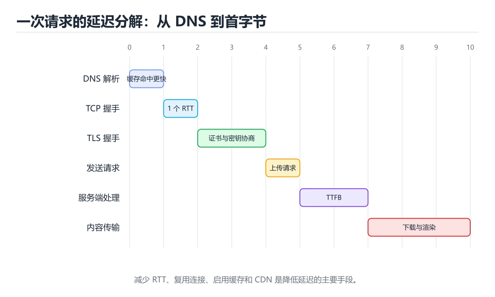
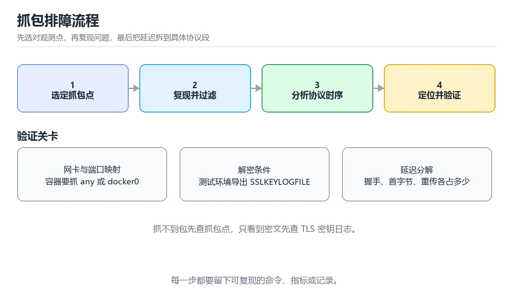

# 网络抓包与协议分析实战

> 内容更新时间：2026-10-06 · 学习阶段：进阶 · 预计用时：60 分钟

> 项目定位：把“接口慢”拆成“哪一跳慢”，用数据包而不是猜测作为证据。
> 建议投入：12 小时
> 难度：进阶



## 前置知识

- 建议先完成：《HTTP 基础》、《TCP/IP 协议栈》、《DNS 域名解析》。
- 本课阶段：进阶。需要能够独立阅读命令、代码或配置，并会用日志和测试验证结果。
- 开始前复习：抓包、Wireshark、TCP、DNS。
- 为 Wireshark 的实验准备快照，失败时能恢复到初始状态。
- 把 time_starttransfer 的失败现场压缩到最小输入，确认问题仍然出现。

## 项目背景

线上接口偶发变慢，应用日志只有一行总耗时，无法判断问题在 DNS、建连、TLS、服务处理还是响应传输。本实战搭一套可重复的本地链路，抓取 pcap 并按阶段建立时间线，最后给出可复现的根因结论。

## 学习目标

1. 能用 tcpdump 抓取指定主机与端口的流量，并用 tshark 过滤 HTTP、DNS 与重传。
2. 能把一次请求拆成 DNS、TCP 握手、TLS、首字节和最后字节五个阶段。
3. 能识别重传、RST、窗口耗尽与证书链错误对应的现象，并写出修复对比。

## 需求与约束

| 维度 | 约束 |
| --- | --- |
| 功能 | 覆盖 HTTP、HTTPS 与 DNS 三类请求 |
| 性能 | 抓包对目标服务吞吐的影响控制在 5% 以内 |
| 可靠性 | 能定位丢包、重传与连接重置 |
| 安全 | pcap 必须脱敏，不保存 Cookie、Token 与真实用户数据 |

## 架构与数据流

客户端通过本地反向代理访问服务，抓包点部署在代理所在主机；每个阶段记录时间戳与连接四元组，再用请求 ID 把 pcap、代理日志与应用日志关联起来。

```text
client -> tcpdump -> nginx -> app -> database
           |          |        |
        DNS/TLS    retrans   slow query
```

## 实施步骤

### 里程碑 1：搭一套可重复的链路

用容器启动 nginx、一个慢接口与一个正常接口，固定并发、请求次数和客户端机器，保证每次实验的输入一致。

### 里程碑 2：抓包并建立过滤器

抓取 8080 与 443 端口的流量，分别用 http、dns、tcp.flags.reset 和 tcp.analysis_retransmission 过滤，记录每条过滤命令的输出。

### 里程碑 3：按阶段做时间线并复测

把 DNS、握手、TLS、首字节和最后字节的时间戳写进表格，找出占比最大的阶段；只改一个变量后复测同一组请求并对比 P95 与重传次数。

## 验证命令与预期输出

在 网络抓包与协议分析实战 的仓库根目录执行以下命令，确认核心链路可以运行。

```bash
docker compose up -d
sudo tcpdump -i any -w capture.pcap 'port 8080 or port 443'
curl -o /dev/null -s -w 'dns=%{time_namelookup} connect=%{time_connect} tls=%{time_appconnect} ttfb=%{time_starttransfer} total=%{time_total}' https://localhost:8443/health
tshark -r capture.pcap -Y 'http.request or dns or tcp.analysis_retransmission' -T fields -e frame.time_relative -e ip.src -e tcp.stream -e http.request.uri
```

**预期输出**：curl 输出中 dns 与 connect 均在 20ms 内，ttfb 约 180ms，total 约 220ms；tshark 结果中没有 tcp.analysis_retransmission 行，若出现该行则对应阶段耗时明显变长。

## 项目交付物

- capture.pcap 与脱敏说明
- tshark 过滤命令清单
- 五阶段耗时表
- 根因结论、修复前后对比与复现脚本



## 故障现场

### 现场 1：抓不到任何数据包

**症状**：抓不到任何数据包。

**定位**：抓包点选错网卡，或容器流量走了独立的网桥。

**修复**：用 tcpdump -D 列出网卡，改抓 any 或 docker0，并确认端口映射方向。

### 现场 2：HTTPS 只能看到密文

**症状**：HTTPS 只能看到密文。

**定位**：没有配置 TLS 密钥日志或代理解密。

**修复**：测试环境导出 SSLKEYLOGFILE 后让 Wireshark 解密；生产环境优先分析握手与证书链。

## 常见错误与排查

> 复核：已人工核对并重写（2026-10-06），每行对应本课的一个真实易错点。

| 易错点 | 容易踩的做法 | 正确结论 |
| --- | --- | --- |
| 抓包位置选错 | 在客户端抓到的是本地回环，看不到链路上的丢包 | 按问题分层选择抓包点（客户端、服务端、中间设备）并对比 |
| 把重传直接当成服务端宕机 | tcp.analysis_retransmission 只说明发生了重传 | 结合 RTT、丢包率与时间线判断是链路丢包还是超时重传 |
| 只抓一次就下结论 | 网络问题有随机性，单次样本不足以支撑结论 | 固定过滤条件重复抓取，保留时间戳与抓包文件作为证据 |
| 在明文抓包里直接查看口令 | 抓包文件包含敏感数据，散落会造成泄露 | 限制保存范围与访问权限，需要看 TLS 内容时用密钥解密而不是关掉加密 |

## 扩展任务

- 对比 DNS 缓存命中与未命中的首字节差异
- 人为注入 1% 丢包，观察重传对 P95 的影响
- 用 mtr 对比网络路径并把统计脚本接入 CI

## 复习与自测

1. 用一句话说明 网络抓包与协议分析实战 的核心输入、输出与失败边界。
2. 画出 抓包 的数据流，并标出至少一条失败路径。
3. 写出 网络抓包与协议分析实战 的下一条验证命令，并说明预期结果。

## 可运行练习

本节围绕网络抓包与协议分析实战安排 3 个可交付任务，每个任务都要求留下可以复查的记录。

### 任务 1：用自己的话画出结构

不看书，用一张图说清「网络抓包与协议分析实战」的结构，画完再对照骨架：

- 主干：项目背景 → 需求与约束 → 架构与数据流 → 实施步骤
- 连接线：在每条边上标出输入、输出与失败路径。
- 自检：能否用一句话说明抓包与Wireshark的关系？

### 任务 2：做一次对比实验

**验收标准**：对照表两列都要有证据（命令、输出或数据），并注明抓包与Wireshark哪一个才是决定性变量。

### 任务 3：迁移到自己的场景

**验收标准**：结论要能追溯到「项目背景」的具体段落，并说明它和 Wireshark 的边界。

## 零基础精讲：把网络抓包与协议分析实战真正讲透

### 先建立一个直觉

抓包是用来证伪假设的：先写下预期报文序列，再用抓到的报文确认或推翻它。
落到本课，「网络抓包与协议分析实战」关心的是 抓包 与 Wireshark 的配合，也就是说这条直觉要在 项目背景 里被具体验证。

本课的摘要可以当作一张地图：用 tcpdump 与 Wireshark 抓包，按 DNS、TCP、TLS、HTTP 阶段定位真实延迟。

### 逐步拆解

1. 澄清输入与目标。先写清「网络抓包与协议分析实战」要解决的问题、合法输入范围和成功标准，再进入后续步骤。
2. 描述处理过程。把「抓包、Wireshark、TCP、DNS、TLS、延迟」映射到具体步骤，每步都要求能单独验证。
3. 定义输出。抓包 的输出不仅包括正常结果，还包括错误码、日志和资源释放状态。
4. 构造一次抓包越界，记录系统是拒绝、降级还是静默出错；三者对应的修复策略完全不同。
5. 把「项目背景」里的最小示例抄成 time_starttransfer 一行的输入，先手算结果再执行，确认两者一致。

### 把正文串成一条执行链

- **里程碑 1：搭一套可重复的链路**：在「网络抓包与协议分析实战」里，「里程碑 1：搭一套可重复的链路」这一步要先写清输入与预期，再记录实际结果和差异；结果不符时回到对应小节核对前提。
- **里程碑 2：抓包并建立过滤器**：在「网络抓包与协议分析实战」里，「里程碑 2：抓包并建立过滤器」这一步要先写清输入与预期，再记录实际结果和差异；结果不符时回到对应小节核对前提。
- **里程碑 3：按阶段做时间线并复测**：在「网络抓包与协议分析实战」里，「里程碑 3：按阶段做时间线并复测」这一步要先写清输入与预期，再记录实际结果和差异；结果不符时回到对应小节核对前提。
- **现场 1：抓不到任何数据包**：在「网络抓包与协议分析实战」里，「现场 1：抓不到任何数据包」这一步要先写清输入与预期，再记录实际结果和差异；结果不符时回到对应小节核对前提。
- **现场 2：HTTPS 只能看到密文**：在「网络抓包与协议分析实战」里，「现场 2：HTTPS 只能看到密文」这一步要先写清输入与预期，再记录实际结果和差异；结果不符时回到对应小节核对前提。
- **任务 1：用自己的话画出结构**：在「网络抓包与协议分析实战」里，「任务 1：用自己的话画出结构」这一步要先写清输入与预期，再记录实际结果和差异；结果不符时回到对应小节核对前提。

### 从测验反推易错点

- 参考判断：循环上界多走了 1 步，最后一次访问越界；应改成 range(len(data))。
- 自问：如果去掉题干里的一个限定词，结论还成立吗？

- 参考判断：数据包被重传，链路上可能存在丢包或超时
- 解析：tcp.analysis_retransmission 是 Wireshark 根据序列号与确认号推断出的重传标记，说明发送方没有在预期时间内收到确认。它可能来自链路丢包、拥塞、接收窗口不足或对端处理过慢，但不能单独证明服务宕机、DNS 失败或证书过期。要结合前后数据包、RTT 与重传次数继续定位。

**检查点 3：围绕网络抓包与协议分析实战中的 抓包、Wireshark、TCP，下列哪两项是本课强调的实践判断？**

- 参考判断：验证 Wireshark 时要固定版本并覆盖边界输入，结论才可复现、学习 抓包 时要同时说明输入、输出和失败路径，不能只看正常流程
- 解析：本课把网络抓包与协议分析实战拆成概念、示例与故障现场三部分，因此判断 抓包 时必须同时交代输入、输出和失败路径，这使“学习 抓包 时要同时说明输入、输出和失败路径，不能只看正常流程”成立；在网络抓包与协议分析实战里，判断 Wireshark 时要固定版本与边界输入，所以“验证 Wireshark 时要固定版本并覆盖边界输入，结论才可复现”才可复现。相反，“只要 抓包 的常规示例通过，就可以跳过边界与异常路径”把一次正常示例当成全部情况，会漏掉本课的边界缺陷；“把 Wireshark 的单次运行结果当成所有版本和规模都成立”把单次结果外推成普遍结论，在网络抓包与协议分析实战里忽略了版本和规模变化。对照本课的故障现场与自测清单，就能用证据区分这两种判断。

- 参考判断：写出最小示例并核对 Wireshark 的基线结果
- 解析：在本课的练习里，顺序应当是：先明确 抓包 的输入、输出与约束 → 写出最小示例并核对 Wireshark 的基线结果 → 只改一个变量，记录边界与失败路径的变化 → 固定版本与证据，把本课的结论写成可复现记录。这个顺序把 抓包 的输入、输出和约束放在最前面，在网络抓包与协议分析实战里避免概念没对齐就开始调参。第二步用 Wireshark 建立可核对的基线，在网络抓包与协议分析实战里第三步才允许改变一个变量并观察失败路径。最后一步把本课的版本、证据与结论固定下来，别人才能复现同样的结果。

### 工程排错顺序

| 先查什么 | 要得到的证据 | 判断标准 |
| --- | --- | --- |
| 用户、范围与验收标准是否写清？ | 日志、输入样例、测试或指标 | 能复现并解释，才算定位 |
| 每阶段是否有可运行增量？ | 日志、输入样例、测试或指标 | 能复现并解释，才算定位 |
| 测试、监控和回滚是否随功能一起交付？ | 日志、输入样例、测试或指标 | 能复现并解释，才算定位 |
| 复盘是否形成下一轮改进项？ | 日志、输入样例、测试或指标 | 能复现并解释，才算定位 |

### 变式训练

1. 先用一个单文件示例验证 time_starttransfer，确认正确性后再引入框架或分布式组件。
2. 扩大 Wireshark 的规模，记录本课结论在哪一个量级开始不成立。
3. 制造一次 抓包 相关的依赖超时或错误输入，要求错误可解释且不留半完成状态。
5. 去掉一个前提后重跑 time_starttransfer，记录输出差异与对应的失败解释。
6. 在低带宽或低算力条件下重跑 Wireshark，记录降级路径是否仍然可用。

### 本课自测

- [ ] 能用一句话解释「抓包」在本课中的角色与边界。
- [ ] 能举出一个正常例子和一个失败例子。
- [ ] 能说出最小验证步骤，以及需要记录的证据。
- [ ] 能用一句话解释「Wireshark」在本课中的角色与边界。
- [ ] 能用一句话解释「TCP」在本课中的角色与边界。
- [ ] 能用一句话解释「DNS」在本课中的角色与边界。
- [ ] 能用一句话解释「TLS」在本课中的角色与边界。

### 迁移案例库

下面用不同约束重复同一套方法，每轮只改变 抓包 的一个取值并记录结论。

#### 迁移案例 1：围绕「抓包」做一次小实验

**目标**：在不改变课程主体的前提下，验证网络抓包与协议分析实战中的一个关键判断。

**步骤**：
1. 复述当前方案对「抓包」的假设，写成一句可证伪的话。
2. 设计一个正常输入和一个边界输入，分别预测输出。
3. 运行或逐步演算，记录实际输出、耗时和失败信息。
4. 只调整一个参数，比较前后差异并解释原因。
5. 补充一条测试或复习卡，确保下次能更快复现。

**验收**：把「网络抓包与协议分析实战」的判断依据写成可复现步骤，换一台机器或换一个输入仍能得到同一结论。

#### 迁移案例 2：围绕「Wireshark」做一次小实验

**步骤**：
1. 复述当前方案对「Wireshark」的假设，写成一句可证伪的话。

#### 迁移案例 3：围绕「TCP」做一次小实验

**步骤**：
1. 复述当前方案对「TCP」的假设，写成一句可证伪的话。

#### 迁移案例 4：围绕「DNS」做一次小实验

**步骤**：
1. 复述当前方案对「DNS」的假设，写成一句可证伪的话。

#### 迁移案例 5：围绕「TLS」做一次小实验

**步骤**：
1. 复述当前方案对「TLS」的假设，写成一句可证伪的话。

#### 迁移案例 6：围绕「延迟」做一次小实验

**步骤**：
1. 复述当前方案对「延迟」的假设，写成一句可证伪的话。

#### 迁移案例 7：围绕「抓包」做一次小实验

**步骤**：

#### 迁移案例 8：围绕「Wireshark」做一次小实验

**步骤**：

#### 迁移案例 9：围绕「TCP」做一次小实验

**步骤**：

#### 迁移案例 10：围绕「DNS」做一次小实验

**步骤**：

#### 迁移案例 11：围绕「TLS」做一次小实验

**步骤**：

#### 迁移案例 12：围绕「延迟」做一次小实验

**步骤**：

#### 迁移案例 13：围绕「抓包」做一次小实验

**步骤**：

#### 迁移案例 14：围绕「Wireshark」做一次小实验

**步骤**：

#### 迁移案例 15：围绕「TCP」做一次小实验

**步骤**：

#### 迁移案例 16：围绕「DNS」做一次小实验

**步骤**：

<!-- p0-depth-v2:end -->

## 考点精讲

### 考点 1：代码补全·抓包

- **题目**：下面这段代码摘自「网络抓包与协议分析实战」的正文示例。关于这段代码，下面哪一项说法与实际内容相符？
- **判断依据**：题干的正确项是这段代码只做静态声明，没有循环、分支或可观察输出，在「网络抓包与协议分析实战」里它只能证明抓包相关约束存在，不能替代真实运行证据。这段代码出自「网络抓包与协议分析实战」的正文示例，围绕抓包、Wireshark、TCP展开；把输入或边界换成空值、极值或失败情况后，结论要以「网络抓包与协议分析实战」的实际运行结果为准。这道题的关键在「网络抓包与协议分析实战」的抓包、Wireshark、TCP：先确认题干“下面这段代码摘自网络抓包与协议分”问的是哪一步，再排除偷换前提的选项。

### 考点 2：概念判断·抓包

- **题目**：Wireshark 过滤结果里出现 tcp.analysis_retransmission，最准确的解释是什么？
- **判断依据**：在「网络抓包与协议分析实战」里，数据包被重传，链路上可能存在丢包或超时。tcp.analysisretransmission 是 Wireshark 根据序列号与确认号推断出的重传标记，说明发送方没有在预期时间内收到确认。它可能来自链路丢包、拥塞、接收窗口不足或对端处理过慢，但不能单独证明服务宕机、DNS 失败或证书过期。要结合前后数据包、RTT 与重传次数继续定位。

### 考点 3：多选辨析·抓包

- **题目**：围绕“网络抓包与协议分析实战”中的 抓包、Wireshark、TCP，下列哪两项是本课强调的实践判断？
- **判断依据**：本课把网络抓包与协议分析实战拆成概念、示例与故障现场三部分，因此判断 抓包 时必须同时交代输入、输出和失败路径，这使“学习 抓包 时要同时说明输入、输出和失败路径，不能只看正常流程”成立。在网络抓包与协议分析实战里，判断 Wireshark 时要固定版本与边界输入，所以“验证 Wireshark 时要固定版本并覆盖边界输入，结论才可复现”才可复现。

### 考点 4：顺序排列·抓包

- **题目**：按“网络抓包与协议分析实战”中 抓包、Wireshark、TCP 的实践顺序，把四个步骤排成从准备到复盘的合理顺序。
- **判断依据**：在「网络抓包与协议分析实战」里，在本课的练习里，顺序应当是：先明确 抓包 的输入、输出与约束 → 写出最小示例并核对 Wireshark 的基线结果 → 只改一个变量，记录边界与失败路径的变化 → 固定版本与证据，把本课的结论写成可复现记录。这个顺序把 抓包 的输入、输出和约束放在最前面，在网络抓包与协议分析实战里避免概念没对齐就开始调参。第二步用 Wireshark 建立可核对的基线，在网络抓包与协议分析实战里第三步才允许改变一个变量并观察失败路径。

### 考点 5：排错·网络抓包与协议分析

- **题目**：抓包命令已经执行，但一个包都没有抓到。下面哪项判断最合理？
- **判断依据**：抓包点选错网卡，容器流量走了独立网桥，应改抓 any 或 docker0。网络抓包与协议分析实战 的故障现场指出，抓不到任何数据包时先怀疑抓包点：容器流量经 docker0 转发，宿主机 eth0 上看不到；用 tcpdump -D 列出可用网卡，改抓 any 或 docker0，并确认端口映射方向后再复现问题。

## English Overview

Capture traffic and locate latency across DNS, TCP, TLS and HTTP stages.

This project on "网络抓包与协议分析实战" turns the topic into a delivery workflow: define constraints, build a minimal end-to-end path, verify it with repeatable commands, and record failure handling.

## 项目专属规格

### 交付边界

用 tcpdump 与 Wireshark 抓包，按 DNS、TCP、TLS、HTTP 阶段定位真实延迟。 项目交付不是一份说明文档，而是一组可以运行的命令、可检查的输入输出、失败处理和复盘证据。范围必须同时写明本阶段做什么、不做什么，以及哪些依赖属于外部前提。

### 最小数据模型

| 对象 | 关键字段 | 约束 |
| --- | --- | --- |
| 输入实体 | 抓包、来源、时间、版本 | 必填、可校验、可追溯到原始输入 |
| 任务实体 | 状态、优先级、执行标识、重试次数 | 状态迁移合法、重复执行不会产生重复副作用 |
| 结果实体 | 输出、错误码、耗时、资源指标 | 可序列化、可比较、失败原因可解释 |
| 审计记录 | 操作者、动作、批次、结果、时间 | 不记录敏感信息、可查询、可复核 |

### 验收场景

1. 正常路径：让 time_starttransfer 从输入走到输出，记录每一步的产物。
2. 边界路径：覆盖 抓包 的空值、最大值、重复数据和超长内容，结果必须可预测。
3. 失败路径：给 time_starttransfer 注入一次超时，记录错误分类与重试上限。
4. 幂等路径：重复触发 Wireshark，确认没有重复写入或计数膨胀。
5. 回滚路径：撤销 time_starttransfer 的变更后逐项检查数据与配置。

### 证据清单

- 一条从干净环境开始的可复现命令，以及真实输出。
- 一份正常、边界、失败与幂等场景的测试矩阵。
- 一组修改前后的 Wireshark 指标，包含测量方法和环境说明。
- 一份故障时间线、根因、修复动作、回滚耗时和后续改进项。

### 完成定义

让 Wireshark 的风险登记与测试保持同步，避免只存在于对话里的约定。

## 内容元数据

- 内容版本：v2.0
- 最后更新：2026-10-06
- 学习阶段：进阶
- 适用环境：本地容器、单机服务或移动开发环境，具体版本以课程命令为准
；本课聚焦 抓包。
- 内容来源：内置结构化课程与项目工程实践整理
- 相关主题：抓包、Wireshark、TCP、DNS、TLS、延迟
- 质量版本：P0 可运行练习 + P1 专项题型 + P2 项目规格与复核
- 项目标识：project_network_capture_analysis
- 学习产出：网络抓包与协议分析实战 的可运行增量、验证证据与复盘记录

## 参考资料与复核

- 最后复核：2026-10-04
- 下次复核：2027-10-24
- 复核范围：版本兼容、API 行为、安全建议与工程实践
- 来源性质：官方文档、标准或权威教材；正文为离线教学重组

| 参考资料 | 本课用途 |
| --- | --- |
| [Docker 入门](https://docs.docker.com/get-started/) | 容器化与 Compose |
| [GitHub Actions 文档](https://docs.github.com/actions) | 自动构建、测试与发布 |
| [OWASP ASVS](https://owasp.org/www-project-application-security-verification-standard/) | 项目安全验收 |

> 「网络抓包与协议分析实战」的链接用于离线阅读后的延伸核对；App 不会自动联网。

## 动手练习

先复现 time_starttransfer，再有意破坏一个条件，最后交付修复后的结果。

### 练习 1：复现最小闭环（30 分钟）

按验证清单跑通 Wireshark，记录耗时与差异来源。

验收标准：换一台机器重跑 Wireshark 能得到同一结论。

### 练习 2：制造一次可恢复故障（45 分钟）

围绕「抓包」制造一次超时、错误输入、资源不足或依赖不可用，观察日志、指标和业务状态。完成止损、修复、复测和回滚，并画出从触发到恢复的时间线。

验收标准：抓包 的失败能稳定复现，系统不留半完成状态，回滚后数据一致。

### 练习 3：扩展为可交付增量（60 分钟）

给 网络抓包与协议分析实战 增加一个与「Wireshark」相关的小功能或改进。先写验收标准，再补正常、边界、失败和幂等测试，最后更新运行说明与风险记录。

验收标准：Wireshark 的成本、权限与回滚方式都写进交付说明。

## 本课小结

网络抓包与协议分析实战 的核心不是记住某一条命令，而是建立「定义验收标准 → 搭建最小闭环 → 用证据定位 → 安全回滚 → 留下复盘」的完整方法。

完成后你应该能够：

1. 说明本项目的输入、输出、质量指标与失败边界。
2. 从干净环境重复核心流程，并解释修改一个变量后的变化。
3. 处理至少一次 抓包 的超时或依赖故障，且不留下半完成状态。
4. 让 Wireshark 的每个阶段都有可核查的证据。
5. 把 抓包、Wireshark、TCP、DNS 串联成可交付、可复核、可改进的工程闭环。

下一步选一个真实但范围可控的 抓包 任务，先写验收标准，再提交可运行增量，并保留失败样本与回滚记录。

## 复习与迁移

复习目标：把「网络抓包与协议分析实战」的判断标准放回可复现的例子里。先自己作答，再对照依据；如果结论正确但理由不完整，回到正文补足前提。

### 概念复述

- 用一句话说明「网络抓包与协议分析实战」解决什么问题：用 tcpdump 与 Wireshark 抓包，按 DNS、TCP、TLS、HTTP 阶段定位真实延迟。
- 写出抓包、Wireshark、TCP之间的关系，并各举一个例子。
- 说出本课最容易混淆的两个概念，以及区分它们的判据。

### 正文逐节复核

- **项目背景**：线上接口偶发变慢，应用日志只有一行总耗时，无法判断问题在 DNS、建连、TLS、服务处理还是响应传输。
- **架构与数据流**：客户端通过本地反向代理访问服务，抓包点部署在代理所在主机；每个阶段记录时间戳与连接四元组，再用请求 ID 把 pcap、代理日志与应用日志关联起来。
- **实施步骤**：把 DNS、握手、TLS、首字节和最后字节的时间戳写进表格，找出占比最大的阶段；只改一个变量后复测同一组请求并对比 P95 与重传次数。
- **实践任务**：本节围绕网络抓包与协议分析实战安排 3 个可交付任务，每个任务都要求留下可以复查的记录。
- **零基础精讲：把网络抓包与协议分析实战真正讲透**：本课的摘要可以当作一张地图：用 tcpdump 与 Wireshark 抓包，按 DNS、TCP、TLS、HTTP 阶段定位真实延迟。
- **项目专属规格**：用 tcpdump 与 Wireshark 抓包，按 DNS、TCP、TLS、HTTP 阶段定位真实延迟。

### 测验回顾

1. 下面这段代码摘自「网络抓包与协议分析实战」的正文示例。关于这段代码，下面哪一项说法与实际内容相符？
   - 依据：题干的正确项是这段代码只做静态声明，没有循环、分支或可观察输出，在「网络抓包与协议分析实战」里它只能证明抓包相关约束存在，不能替代真实运行证据。这段代码出自「网络抓包与协议分析实战」的正文示例，围绕抓包、Wireshark、TCP展开；把输入或边界换成空值、极值或失败情况后，结论要以「网络抓包与协议分析实战」的实际运行结果为准。这道题的关键在「网络抓包与协议分析实战」的抓包、Wireshark、TCP：先确认题干“下面这段代码摘自网络抓包与协议分”问的是哪一步，再排除偷换前提的选项。
2. Wireshark 过滤结果里出现 tcp.analysis_retransmission，最准确的解释是什么？
   - 依据：在「网络抓包与协议分析实战」里，数据包被重传，链路上可能存在丢包或超时。tcp.analysisretransmission 是 Wireshark 根据序列号与确认号推断出的重传标记，说明发送方没有在预期时间内收到确认。它可能来自链路丢包、拥塞、接收窗口不足或对端处理过慢，但不能单独证明服务宕机、DNS 失败或证书过期。要结合前后数据包、RTT 与重传次数继续定位。
3. 围绕“网络抓包与协议分析实战”中的 抓包、Wireshark、TCP，下列哪两项是本课强调的实践判断？
   - 依据：本课把网络抓包与协议分析实战拆成概念、示例与故障现场三部分，因此判断 抓包 时必须同时交代输入、输出和失败路径，这使“学习 抓包 时要同时说明输入、输出和失败路径，不能只看正常流程”成立。在网络抓包与协议分析实战里，判断 Wireshark 时要固定版本与边界输入，所以“验证 Wireshark 时要固定版本并覆盖边界输入，结论才可复现”才可复现。
4. 按“网络抓包与协议分析实战”中 抓包、Wireshark、TCP 的实践顺序，把四个步骤排成从准备到复盘的合理顺序。
   - 依据：在「网络抓包与协议分析实战」里，在本课的练习里，顺序应当是：先明确 抓包 的输入、输出与约束 → 写出最小示例并核对 Wireshark 的基线结果 → 只改一个变量，记录边界与失败路径的变化 → 固定版本与证据，把本课的结论写成可复现记录。这个顺序把 抓包 的输入、输出和约束放在最前面，在网络抓包与协议分析实战里避免概念没对齐就开始调参。第二步用 Wireshark 建立可核对的基线，在网络抓包与协议分析实战里第三步才允许改变一个变量并观察失败路径。

### 迁移练习

把「网络抓包与协议分析实战」的结论迁移到相邻主题，每次迁移都写清预测与证据：

1. 换输入：用抓包处理一组你自己的数据，对比教材示例的结果差异。
2. 换失败条件：制造一个Wireshark相关的错误，说明如何从错误信息定位根因。
3. 换规模：把数据量或并发度提高一个数量级，说明「网络抓包与协议分析实战」的结论是否仍成立。

## 术语速查

| 术语 | 一句话说明 |
| --- | --- |
| `抓包` | 在网卡或代理处复制流经的报文并保存，用来还原真实交互而不是只看应用日志。 |
| `Wireshark` | 图形化协议分析器，可按会话与流跟踪报文，配合密钥文件解密 TLS。 |
| `TCP` | 面向连接的传输层协议，靠握手、序号确认、重传与拥塞控制保证可靠字节流。 |
| `DNS` | 把域名解析成 IP 的层次化系统，排查时要区分递归解析器、权威服务器与本地缓存。 |
| `TLS` | 在 TCP 之上提供加密与身份校验的握手协议，抓包里只能看到 SNI、证书与密文长度。 |
| `延迟` | 一次交互的端到端耗时，要拆成 DNS、连接握手、首字节、传输与渲染各段分别测量。 |

## 本课复习清单

- [ ] 能独立完成「项目背景」并说明验收标准。
- [ ] 能独立完成「需求与约束」并说明验收标准。
- [ ] 能独立完成「架构与数据流」并说明验收标准。
- [ ] 能独立完成「实施步骤」并说明验收标准。
- [ ] 能独立完成「里程碑 1：搭一套可重复的链路」并说明验收标准。
- [ ] 能独立完成「里程碑 2：抓包并建立过滤器」并说明验收标准。

<!-- p1-project-review:start -->
## 交付评审：评分表、决策记录与证据链

「网络抓包与协议分析实战」的验收不能只看功能能不能跑通。下面把正文里的交付物、验证命令和关键设计点整理成一张评审表，按表逐项留下证据即可。

### 一、「网络抓包与协议分析实战」的交付物评分表

| 交付物 | 权重 | 合格线 | 需要的证据 |
| --- | ---: | --- | --- |
| capture.pcap 与脱敏说明 | 25% | 能在干净环境复现，且失败路径有明确处理 | 命令与输出、对应测试、一次失败与恢复记录 |
| tshark 过滤命令清单 | 25% | 能在干净环境复现，且失败路径有明确处理 | 命令与输出、对应测试、一次失败与恢复记录 |
| 五阶段耗时表 | 25% | 能在干净环境复现，且失败路径有明确处理 | 命令与输出、对应测试、一次失败与恢复记录 |
| 根因结论、修复前后对比与复现脚本 | 25% | 能在干净环境复现，且失败路径有明确处理 | 命令与输出、对应测试、一次失败与恢复记录 |

「网络抓包与协议分析实战」的评分先看证据再打分：任意一项只要拿不出可复现的命令或测试，该项按 0 分计，不允许用「基本完成」代替。

### 二、需要写下来的决策（ADR）

| 决策点 | 本课给出的做法 | 备选方案 | 代价与回滚 |
| --- | --- | --- | --- |
| 里程碑 1：搭一套可重复的链路 | 用容器启动 nginx、一个慢接口与一个正常接口，固定并发、请求次数和客户端机器，保证每次实验的输入一致。 | 不做「里程碑 1：搭一套可重复的链路」，沿用最朴素的实现（需要额外补一次对照实验） | 若「里程碑 1：搭一套可重复的链路」出问题，回到上一版本并按本课验收场景重跑 |
| 里程碑 2：抓包并建立过滤器 | 抓取 8080 与 443 端口的流量，分别用 http、dns、tcp.flags.reset 和 tcp.analysisretransmission 过滤，记录每条过滤命令的输出。 | 不做「里程碑 2：抓包并建立过滤器」，沿用最朴素的实现（需要额外补一次对照实验） | 若「里程碑 2：抓包并建立过滤器」出问题，回到上一版本并按本课验收场景重跑 |
| 里程碑 3：按阶段做时间线并复测 | 把 DNS、握手、TLS、首字节和最后字节的时间戳写进表格，找出占比最大的阶段；只改一个变量后复测同一组请求并对比 P95 与重传次数。 | 不做「里程碑 3：按阶段做时间线并复测」，沿用最朴素的实现（需要额外补一次对照实验） | 若「里程碑 3：按阶段做时间线并复测」出问题，回到上一版本并按本课验收场景重跑 |
| 交付边界 | 用 tcpdump 与 Wireshark 抓包，按 DNS、TCP、TLS、HTTP 阶段定位真实延迟。 | 不做「交付边界」，沿用最朴素的实现（需要额外补一次对照实验） | 若「交付边界」出问题，回到上一版本并按本课验收场景重跑 |

ADR 不需要长：每个决策三行就够——选了什么、放弃了什么、出问题怎么退。评审时只检查这三行是否和「网络抓包与协议分析实战」的实际代码一致。

### 三、「网络抓包与协议分析实战」的交付证据链

| # | 命令 | 这条命令要留下的证据 |
| ---: | --- | --- |
| 1 | `docker compose up -d` | 完整输出、退出码、耗时，以及与「网络抓包与协议分析实战」验收口径的对应关系 |
| 2 | `sudo tcpdump -i any -w capture.pcap 'port 8080 or port 443'` | 完整输出、退出码、耗时，以及与「网络抓包与协议分析实战」验收口径的对应关系 |
| 3 | `curl -o /dev/null -s -w 'dns=%{time_namelookup} connect=%{time_connect} tls=%{time_appconnect} ttfb=%{time_starttransfer} total=%{time_total}' https://localhost:8443/health` | 完整输出、退出码、耗时，以及与「网络抓包与协议分析实战」验收口径的对应关系 |
| 4 | `tshark -r capture.pcap -Y 'http.request or dns or tcp.analysis_retransmission' -T fields -e frame.time_relative -e ip.src -e tcp.stream -e http.request.uri` | 完整输出、退出码、耗时，以及与「网络抓包与协议分析实战」验收口径的对应关系 |

把「网络抓包与协议分析实战」的上表整理成一个 evidence/ 目录：每条命令一个文件，文件名带日期，内容包含版本、命令与输出。评审时直接按目录核对，不再口头确认。

### 四、「网络抓包与协议分析实战」的验收指标

| 指标 | 目标值 | 测量方式 | 不达标时的动作 |
| --- | --- | --- | --- |
| | 性能 | 抓包对目标服务吞吐的影响控制在 5% 以内 | | 用本课正文给出的阈值，没有就写实测基线 | 固定环境重复三次取中位数 | 回到对应小节定位，先修原因再重测 |

指标必须能用一条命令或一次操作测出来；写不出测量方式的指标，在「网络抓包与协议分析实战」的评审里一律视为未定义。

### 五、评审记录模板

| 记录项 | 填写要求 |
| --- | --- |
| 项目标识 | `project_network_capture_analysis` |
| 本次范围 | 说明这一轮交付了「网络抓包与协议分析实战」的哪些部分 |
| 未完成项 | 列出与 抓包 相关但本轮未做的内容 |
| 证据位置 | 指向 evidence/ 目录下的具体文件 |
| 风险与回滚 | 写清剩余风险、回滚步骤和验证方式 |
| 结论 | 通过 / 有条件通过 / 不通过，三者选一 |

「网络抓包与协议分析实战」评审结束后把这张表填完并归档；下一轮迭代直接读上一次的「未完成项」与「风险与回滚」，避免重复讨论同一个问题。
<!-- p1-project-review:end -->
