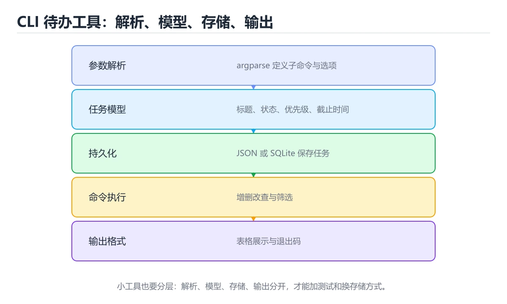
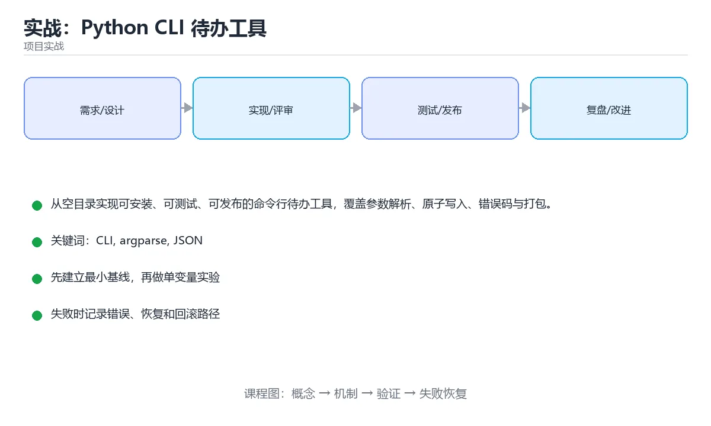

# 实战：Python CLI 待办工具





> 内容更新时间：2026-10-06 · 学习阶段：高级 · 预计用时：60 分钟

## 本节知识框架

**课程定位**：所属分类 `project_practice`（项目实战），课程主题 `实战：Python CLI 待办工具`，学习阶段 高级，建议用时 60 分钟。

本课主线：从空目录实现可安装、可测试、可发布的命令行待办工具，覆盖参数解析、原子写入、错误码与打包。

**学完本课应当能够**
- 说清 `CLI` 与 `argparse` 的含义与区别，并各举一个正例和一个反例。
- 用本课示例验证 `JSON` 的行为，记录输入、输出与失败条件。
- 遇到「直接覆盖原 JSON 文件」这类问题时，能说出触发条件与修复顺序。

### 从概念到验证的学习链条

1. `CLI`：先掌握 Explain what Project: Python CLI Todo Tool solves and when it should be used.，再用它解释 `argparse` 为什么会出现。
2. `argparse`：先掌握 Python 标准库中的命令行参数解析模块，支持类型与帮助信息，再用它解释 `JSON` 为什么会出现。
3. `JSON`：先掌握 团队需要一个不依赖服务器的待办工具：支持添加、列出、完成和删除任务，数据保存在本机 JSON 文件中；即使进程中途退出，也不能留下半个损坏文件，再用它解释 `原子写入` 为什么会出现。
4. `原子写入`：先掌握 一句话摘要：从空目录实现可安装、可测试、可发布的命令行待办工具，覆盖参数解析、原子写入、错误码与打包，再用它解释 `pytest` 为什么会出现。
5. `pytest`：先掌握 本课涉及：CLI、argparse、JSON、原子写入、pytest，再用它解释 本课示例的观察结果 为什么会出现。

**先修与衔接**：本课是「项目实战」分类的第 11 课。先修内容：《复盘与改进：让团队一次比一次快》。《复盘与改进：让团队一次比一次快》里的 `复盘`、`度量` 是本课的前提。相关或后续课程：《实战：REST API 与 SQLite 事务服务》。

### 完成判据

- **定义关**：不看正文也能说明 `CLI` 是 Explain what Project: Python CLI Todo Tool solves and when it should be used.，并指出一个反例。
- **机制关**：能按“输入 → 转换 → 输出 → 验证”复述 `实战：Python CLI 待办工具`，而不是只背结论。
- **示例关**：能运行或推演 `实战：Python CLI 待办工具` 的 `text` 示例，并说明一个真实出现的标识符或字面量。
- **证据关**：能从 `实战：Python CLI 待办工具` 的示例写出一个输入、处理、输出三元组，并说明它支持或反驳了本课的哪一条结论。
- **排错关**：能复现 直接覆盖原 JSON 文件，记录现象并按 先写同目录临时文件再原子替换 修复。
- **迁移关**：能把 `CLI`、`argparse`、`JSON`、`原子写入` 放进一个与 `实战：Python CLI 待办工具` 不同的项目场景，并保持输入与验证条件可追踪。
- **复盘关**：学完 `实战：Python CLI 待办工具` 后，用一句话写下仍然不确定的结论，并列出下一次验证需要的输入、环境和成功判据。

### 复习清单

- [ ] 能不看正文复述本课核心术语，并指出一个边界或反例。
- [ ] 能运行或推演本课示例，记录输入、输出与失败现象。
- [ ] 能完成一次自测，并把错题对照错误表定位原因。

## 核心概念定义

| 术语 | 操作性定义 | 常见边界与风险 |
| --- | --- | --- |
| CLI | Explain what Project: Python CLI Todo Tool solves and when it should be used.。 | 只在「Explain what Project: Python CLI Todo Tool solves and when it should be used.」这一前提下成立，换输入或换环境要重新验证。 |
| argparse | Python 标准库中的命令行参数解析模块，支持类型与帮助信息。 | 静态检查只在编译期成立，运行期输入仍需校验。 |
| JSON | 团队需要一个不依赖服务器的待办工具：支持添加、列出、完成和删除任务，数据保存在本机 JSON 文件中；即使进程中途退出，也不能留下半个损坏文件。 | 易错：写入中断时文件变成半截 JSON；正确做法是先写同目录临时文件再原子替换。 |
| 原子写入 | 一句话摘要：从空目录实现可安装、可测试、可发布的命令行待办工具，覆盖参数解析、原子写入、错误码与打包。 | 结果依赖数据分布、模型版本与算力预算，换数据集或换硬件都要重新评估。 |
| pytest | 本课涉及：CLI、argparse、JSON、原子写入、pytest。 | 只在「本课涉及：CLI、argparse、JSON、原子写入、pytest」这一前提下成立，换输入或换环境要重新验证。 |

## 原理与运行机制

### 机制总览

**教材衔接：技术栈**

- Python 3.12
- argparse
- pathlib
- json
- tempfile
- pytest

**教材衔接：架构与数据流**

- 读路径要明确 CLI 的查询条件、分页方式和返回字段，避免一次加载全部数据。
- ensure_ascii 的写入要以幂等键为准，失败后能补偿或安全重试。
- 外部调用要设置超时、重试上限和降级策略。
- 每个关键阶段都要留下日志、指标或测试证据。

**教材衔接：功能范围**

- [ ] add 命令添加任务并生成稳定编号
- [ ] list 命令支持全部、未完成和已完成过滤
- [ ] done 命令更新状态并拒绝无效编号
- [ ] delete 命令删除任务并返回明确结果
- [ ] 所有命令支持 --json 供脚本消费

**教材衔接：实施步骤**

### 步骤 1：定义任务模型、状态字段和错误类型

- 把 argparse 这一步的依赖与交付物写成两行清单，再开始实现。
- 验证方法：用最小请求或单元测试证明 CLI 这一步的结果正确。
- 为 ensure_ascii 定义失败分类与重试上限，超出后走人工处理。
- 证据留存：保留命令、输出、日志或截图，方便评审与复盘。

### 步骤 2：先用 argparse 建立命令入口与参数约束

把这条结论放回「实战：Python CLI 待办工具」的完整流程里展开：

- 正文依据：本课涉及：CLI、argparse、JSON、原子写入、pytest。
- 落地检查：把「步骤 2：先用 argparse 建立命令入口与参数约束」改写成一条可执行的核对项，逐条验证输入、超时与失败路径。

### 步骤 3：把增删改查写成纯函数并补单元测试

- 定位：这一节说明步骤 3：把增删改查写成纯函数并补单元测试在「实战：Python CLI 待办工具」知识体系里的位置。
- 要点：团队需要一个不依赖服务器的待办工具：支持添加、列出、完成和删除任务，数据保存在本机 JSON 文件中；即使进程中途退出，也不能留下半个损坏文件。工具要能从干净环境安装、运行测试并通过命令行完成一次完整操作。
- 自检：能否用一个最小例子解释步骤 3：把增删改查写成纯函数并补单元测试？

### 步骤 4：用临时文件写入后 os.replace 原子替换

把这条结论放回「实战：Python CLI 待办工具」的完整流程里展开：

- 正文依据：一句话摘要：从空目录实现可安装、可测试、可发布的命令行待办工具，覆盖参数解析、原子写入、错误码与打包。
- 落地检查：把「步骤 4：用临时文件写入后 os.replace 原子替换」改写成一条可执行的核对项，逐条验证输入、超时与失败路径。

### 步骤 5：实现 --json 输出和稳定退出码

- 定位：这一节说明步骤 5：实现 --json 输出和稳定退出码在「实战：Python CLI 待办工具」知识体系里的位置。
- 要点：把存储后端抽象为 SQLite 并保持 CLI 不变
- 自检：能否用一个最小例子解释步骤 5：实现 --json 输出和稳定退出码？

### 步骤 6：在全新虚拟环境中安装并执行端到端验收

- 定位：这一节说明步骤 6：在全新虚拟环境中安装并执行端到端验收在「实战：Python CLI 待办工具」知识体系里的位置。
- 要点：本节围绕实战：Python CLI 待办工具安排 3 个可交付任务，每个任务都要求留下可以复查的记录。
- 自检：能否用一个最小例子解释步骤 6：在全新虚拟环境中安装并执行端到端验收？

**教材衔接：建议目录结构**

**教材衔接：质量门禁**

- [ ] 格式化和静态检查通过，不遗留明显警告。
- [ ] 测试分层：核心规则用单元测试，argparse 的边界用集成测试。
- [ ] 错误响应不泄露堆栈、SQL 和密钥。
- [ ] 配置来自环境变量或配置文件，不硬编码敏感信息。
- [ ] README 写清启动、测试、配置和回滚步骤。

**教材衔接：安全、成本与可观测性**

- 权限遵循最小授权：CLI 用到的数据库账号、云资源和令牌都不能使用管理员默认权限。
- 把 argparse 的输入约束写成白名单，并统一错误结构。
- 密钥通过环境变量或密钥管理服务注入，并记录轮换方式。
- 为 CLI 涉及的连接、线程或协程、队列与网络请求设置上限，避免资源耗尽。
- 为 ensure_ascii 建立四个指标：吞吐、错误率、尾延迟和资源占用。
- 把 argparse 的日志与指标对齐到同一时间轴，便于事后复盘。

**教材衔接：扩展任务**

- 增加 due 日期和 overdue 过滤
- 把存储后端抽象为 SQLite 并保持 CLI 不变
- 使用 GitHub Actions 自动构建 wheel 并执行安装测试

**教材衔接：实施记录与复盘**

每完成一步，记录以下内容：

1. 本步的输入、命令和输出是什么？
2. 遇到的最小失败是什么，如何定位和修复？
3. 哪个假设被验证或推翻？
4. 下一步的风险是什么，如何回滚？
5. 如果 CLI 的数据量或并发扩大 10 倍，最先出现的瓶颈在哪里？

**教材衔接：完成标准**

- [ ] 能从干净环境按 README 启动项目。
- [ ] 为 ensure_ascii 补三条测试：正常、边界、失败各一条。
- [ ] 能演示一次错误、一次恢复和一次回滚。
- [ ] 有一份资源或性能基线，能说明瓶颈在哪里。
- [ ] 能说清一个尚未解决的问题和下一步验证方法。

**教材衔接：交付评审：评分表、决策记录与证据链**


### 四、「实战：Python CLI 待办工具」的验收指标

| 指标 | 目标值 | 测量方式 | 不达标时的动作 |
| --- | --- | --- | --- |
| | 延迟 | 记录 P50/P95/P99 | 用固定数据集逐步增加并发 | P99 持续上升或超时率增加 | | 用本课正文给出的阈值，没有就写实测基线 | 固定环境重复三次取中位数 | 回到对应小节定位，先修原因再重测 |
| | 存储 | 记录数据增长与索引大小 | 导入 10 倍数据并观察查询 | 磁盘、连接或锁等待成为瓶颈 | | 用本课正文给出的阈值，没有就写实测基线 | 固定环境重复三次取中位数 | 回到对应小节定位，先修原因再重测 |

### 五、评审记录模板

| 记录项 | 填写要求 |
| --- | --- |
| 项目标识 | `project_python_cli_todo` |
| 本次范围 | 说明这一轮交付了「实战：Python CLI 待办工具」的哪些部分 |
| 未完成项 | 列出与 CLI 相关但本轮未做的内容 |
| 证据位置 | 指向 evidence/ 目录下的具体文件 |
| 风险与回滚 | 写清剩余风险、回滚步骤和验证方式 |
| 结论 | 通过 / 有条件通过 / 不通过，三者选一 |

### 机制拆解：每一步的输入、动作与输出

#### 1. `CLI`
- 输入：`CLI`；本步把 Explain what Project: Python CLI Todo Tool solves and when it should be used. 当作判断规则。
- 动作：围绕 `CLI` 保留中间状态，并记录它与 `argparse` 的对应关系。
- 输出：`argparse`，它可以被下一段代码、测试或记录继续使用。
- `CLI` 的失败条件：只在「Explain what Project: Python CLI Todo Tool solves and when it should be used.」这一前提下成立，换输入或换环境要重新验证。

#### 2. `argparse`
- 输入：`CLI`；本步把 Python 标准库中的命令行参数解析模块，支持类型与帮助信息 当作判断规则。
- 动作：围绕 `argparse` 保留中间状态，并记录它与 `JSON` 的对应关系。
- 输出：`JSON`，它可以被下一段代码、测试或记录继续使用。
- `argparse` 的失败条件：静态检查只在编译期成立，运行期输入仍需校验。

#### 3. `JSON`
- 输入：`argparse`；本步把 团队需要一个不依赖服务器的待办工具：支持添加、列出、完成和删除任务，数据保存在本机 JSON 文件中；即使进程中途退出，也不能留下半个损坏文件 当作判断规则。
- 动作：围绕 `JSON` 保留中间状态，并记录它与 `原子写入` 的对应关系。
- 输出：`原子写入`，它可以被下一段代码、测试或记录继续使用。
- `JSON` 的失败条件：当直接覆盖原 JSON 文件时，会出现写入中断时文件变成半截 JSON。

#### 4. `原子写入`
- 输入：`JSON`；本步把 一句话摘要：从空目录实现可安装、可测试、可发布的命令行待办工具，覆盖参数解析、原子写入、错误码与打包 当作判断规则。
- 动作：围绕 `原子写入` 保留中间状态，并记录它与 `pytest` 的对应关系。
- 输出：`pytest`，它可以被下一段代码、测试或记录继续使用。
- `原子写入` 的失败条件：结果依赖数据分布、模型版本与算力预算，换数据集或换硬件都要重新评估。

#### 5. `pytest`
- 输入：`原子写入`；本步把 本课涉及：CLI、argparse、JSON、原子写入、pytest 当作判断规则。
- 动作：围绕 `pytest` 保留中间状态，并记录它与 `本课示例的最终结果` 的对应关系。
- 输出：`本课示例的最终结果`，它可以被下一段代码、测试或记录继续使用。
- `pytest` 的失败条件：只在「本课涉及：CLI、argparse、JSON、原子写入、pytest」这一前提下成立，换输入或换环境要重新验证。

### 复现实验记录

- 环境：`实战：Python CLI 待办工具` 使用 `text` 示例，固定 `CLI`、`argparse`、`JSON`、`原子写入` 作为第一组条件。
- 首轮输入：从示例中的第一个输入开始，预测 `CLI` 会怎样变化。
- 基线观察：记录命令、输入、输出和错误原文，不用截图代替可复制的文本。
- 单变量修改：只改变 `CLI`，观察 `pytest` 是否仍满足定义。
- 失败注入：复现 直接覆盖原 JSON 文件，确认现象是 写入中断时文件变成半截 JSON。
- 记录结论：把“修改前、修改后、预期变化、实际变化”写成四列表，这样复盘 `实战：Python CLI 待办工具` 时才能区分概念错误与实现错误。

## 典型应用场景

**教材衔接：项目背景**

团队需要一个不依赖服务器的待办工具：支持添加、列出、完成和删除任务，数据保存在本机 JSON 文件中；即使进程中途退出，也不能留下半个损坏文件。工具要能从干净环境安装、运行测试并通过命令行完成一次完整操作。

一句话摘要：从空目录实现可安装、可测试、可发布的命令行待办工具，覆盖参数解析、原子写入、错误码与打包。

**教材衔接：项目专属规格：实战：Python CLI 待办工具**

### 核心场景

从空目录实现可安装、可测试、可发布的命令行待办工具，覆盖参数解析、原子写入、错误码与打包。 项目目标是把「CLI、argparse、JSON、原子写入、pytest」落实为可运行、可测试、可回滚的交付物。


### 验收场景

1. 正常路径：最小输入得到预期输出，并留下日志与指标。
2. 边界路径：把 ensure_ascii 的输入推到上下限，确认返回结果可解释。
3. 失败路径：依赖超时或不可用时能快速失败、重试或降级。
4. 幂等路径：同一请求执行两次不会产生重复副作用。
5. 回滚路径：CLI 回滚后数据一致，且能说明恢复时间和影响范围。

**教材衔接：项目交付物**

### 建议仓库结构

```text
src/
tests/
docs/
README.md
```


### 验收数据

```json
{
  "project": "project_python_cli_todo",
  "scenario": "CLI的正常路径",
  "input": {"case": "normal", "value": "ensure_ascii"},
  "expected": {"ok": true, "checks": ["CLI可复现", "argparse有记录"]},
  "failure_case": {"case": "argparse越界或缺失", "error": "validation_error"},
  "idempotency_key": "project_python_cli_todo-001"
}
```

### 复盘模板

- **直接覆盖原 JSON 文件**：典型现象是写入中断时文件变成半截 JSON；正确做法是先写同目录临时文件再原子替换。
- **用全局可变状态保存任务**：典型现象是测试互相污染且难以恢复；正确做法是让仓储函数显式接收路径。
- **所有错误都返回退出码 0**：典型现象是脚本无法判断失败；正确做法是为参数、数据和运行时错误分配稳定退出码。
- **只测试成功路径**：典型现象是空列表和重复编号在线上才暴露；正确做法是覆盖空数据、非法编号和损坏文件。

### 最小验证场景

- 准备：保留 `text` 示例的原始输入，先记录 `实战：Python CLI 待办工具` 的基线输出和完整运行命令。
- 判定：新结果与 `实战：Python CLI 待办工具` 的基线不同不等于错误；只有当差异破坏了 `CLI` 的定义或错误表中的约束，才判定为失败。

### 选择与边界

- 使用 `CLI` 时，先满足它的定义：Explain what Project: Python CLI Todo Tool solves and when it should be used.；只在「Explain what Project: Python CLI Todo Tool solves and when it should be used.」这一前提下成立，换输入或换环境要重新验证。
- 使用 `argparse` 时，先满足它的定义：Python 标准库中的命令行参数解析模块，支持类型与帮助信息；静态检查只在编译期成立，运行期输入仍需校验。
- 使用 `JSON` 时，先满足它的定义：团队需要一个不依赖服务器的待办工具：支持添加、列出、完成和删除任务，数据保存在本机 JSON 文件中；即使进程中途退出，也不能留下半个损坏文件；易错：写入中断时文件变成半截 JSON；正确做法是先写同目录临时文件再原子替换。
- 使用 `原子写入` 时，先满足它的定义：一句话摘要：从空目录实现可安装、可测试、可发布的命令行待办工具，覆盖参数解析、原子写入、错误码与打包；结果依赖数据分布、模型版本与算力预算，换数据集或换硬件都要重新评估。
- 使用 `pytest` 时，先满足它的定义：本课涉及：CLI、argparse、JSON、原子写入、pytest；只在「本课涉及：CLI、argparse、JSON、原子写入、pytest」这一前提下成立，换输入或换环境要重新验证。

## 代码/协议/SQL 示例

**教材衔接：示例数据与边界**

**教材衔接：关键代码**

```python
from pathlib import Path
import json, os, tempfile

DATA = Path.home() / '.todo.json'

def save(tasks: list[dict]) -> None:
    DATA.parent.mkdir(parents=True, exist_ok=True)
    fd, temp_name = tempfile.mkstemp(dir=DATA.parent, prefix='.todo-')
    try:
        with os.fdopen(fd, 'w', encoding='utf-8') as handle:
            json.dump(tasks, handle, ensure_ascii=False, indent=2)
            handle.flush()
            os.fsync(handle.fileno())
        os.replace(temp_name, DATA)
    finally:
        if os.path.exists(temp_name):
            os.unlink(temp_name)

def add(title: str) -> dict:
    tasks = json.loads(DATA.read_text('utf-8')) if DATA.exists() else []
    task = {'id': len(tasks) + 1, 'title': title, 'done': False}
    tasks.append(task)
    save(tasks)
    return task
```

**教材衔接：验证命令与预期输出**

**教材衔接：测试与验收**

- 添加两条任务后 list --json 返回稳定顺序和编号
- done 一个不存在编号时退出码不是 0 且数据不变
- 模拟写入中断后原 JSON 文件仍可解析
- 从干净虚拟环境 pip install -e . 后 todo --help 可运行


### 示例精读：先找证据，再改一个条件

- 在 `实战：Python CLI 待办工具` 中与 `CLI` 对照：示例必须能支持 Explain what Project: Python CLI Todo Tool solves and when it should be used.，否则说明这一段还缺少实现或验证步骤。
- 在 `实战：Python CLI 待办工具` 中与 `argparse` 对照：示例必须能支持 Python 标准库中的命令行参数解析模块，支持类型与帮助信息，否则说明这一段还缺少实现或验证步骤。
- 在 `实战：Python CLI 待办工具` 中与 `JSON` 对照：示例必须能支持 团队需要一个不依赖服务器的待办工具：支持添加、列出、完成和删除任务，数据保存在本机 JSON 文件中；即使进程中途退出，也不能留下半个损坏文件，否则说明这一段还缺少实现或验证步骤。
- 在 `实战：Python CLI 待办工具` 中与 `原子写入` 对照：示例必须能支持 一句话摘要：从空目录实现可安装、可测试、可发布的命令行待办工具，覆盖参数解析、原子写入、错误码与打包，否则说明这一段还缺少实现或验证步骤。
- `实战：Python CLI 待办工具` 的示例没有抽取到函数调用或字面量；按行记录输入、控制流和输出，避免只背代码外形。

## 时间/空间复杂度或性能分析

**性能关注点（实战：Python CLI 待办工具）**：项目类课程看端到端指标：记录构建时间、接口延迟与资源占用。

**本课特有开销（实战：Python CLI 待办工具 · CLI）**：长事务会放大锁等待，记录事务持续时间与锁冲突次数。

**测量方法**：以 `实战：Python CLI 待办工具` 的 `CLI` 场景为对象，固定输入跑一遍记录基线，再把规模或并发度提高一个数量级复测；两次结果的差值与波动范围才是结论依据。

### 需要控制的变量与记录项

- `实战：Python CLI 待办工具` 的 `CLI`：固定它的版本、输入范围和资源上限，分别记录速度、内存与失败率的变化。
- `实战：Python CLI 待办工具` 的 `argparse`：固定它的版本、输入范围和资源上限，分别记录速度、内存与失败率的变化。
- `实战：Python CLI 待办工具` 的 `JSON`：固定它的版本、输入范围和资源上限，分别记录速度、内存与失败率的变化。
- `实战：Python CLI 待办工具` 的 `原子写入`：固定它的版本、输入范围和资源上限，分别记录速度、内存与失败率的变化。
- `实战：Python CLI 待办工具` 的 `pytest`：固定它的版本、输入范围和资源上限，分别记录速度、内存与失败率的变化。
- `实战：Python CLI 待办工具` 中 `CLI` 的边界：只在「Explain what Project: Python CLI Todo Tool solves and when it should be used.」这一前提下成立，换输入或换环境要重新验证。达到边界时不要外推，必须重新测量。
- `实战：Python CLI 待办工具` 中 `argparse` 的边界：静态检查只在编译期成立，运行期输入仍需校验。达到边界时不要外推，必须重新测量。
- `实战：Python CLI 待办工具` 中 `JSON` 的边界：易错：写入中断时文件变成半截 JSON；正确做法是先写同目录临时文件再原子替换。达到边界时不要外推，必须重新测量。
- `实战：Python CLI 待办工具` 中 `原子写入` 的边界：结果依赖数据分布、模型版本与算力预算，换数据集或换硬件都要重新评估。达到边界时不要外推，必须重新测量。
- `实战：Python CLI 待办工具` 中 `pytest` 的边界：只在「本课涉及：CLI、argparse、JSON、原子写入、pytest」这一前提下成立，换输入或换环境要重新验证。达到边界时不要外推，必须重新测量。

## 常见误区与易错点

| 容易写错的做法 | 实际现象 | 原因与正确做法 |
| --- | --- | --- |
| 直接覆盖原 JSON 文件 | 写入中断时文件变成半截 JSON | 先写同目录临时文件再原子替换 |
| 用全局可变状态保存任务 | 测试互相污染且难以恢复 | 让仓储函数显式接收路径 |
| 所有错误都返回退出码 0 | 脚本无法判断失败 | 为参数、数据和运行时错误分配稳定退出码 |
| 只测试成功路径 | 空列表和重复编号在线上才暴露 | 覆盖空数据、非法编号和损坏文件 |

### 现场 1：直接覆盖原 JSON 文件

**症状**：写入中断时文件变成半截 JSON。

**根因与修复**：先写同目录临时文件再原子替换。

**自检**：在本课示例里复现「直接覆盖原 JSON 文件」，改成先写同目录临时文件再原子替换后重跑；如果症状消失且失败路径按预期变化，说明定位正确。

### 现场 2：用全局可变状态保存任务

**症状**：测试互相污染且难以恢复。

**根因与修复**：让仓储函数显式接收路径。

**自检**：在本课示例里复现「用全局可变状态保存任务」，改成让仓储函数显式接收路径后重跑；如果症状消失且失败路径按预期变化，说明定位正确。

### 现场 3：所有错误都返回退出码 0

**症状**：脚本无法判断失败。

**根因与修复**：为参数、数据和运行时错误分配稳定退出码。

**自检**：在本课示例里复现「所有错误都返回退出码 0」，改成为参数、数据和运行时错误分配稳定退出码后重跑；如果症状消失且失败路径按预期变化，说明定位正确。

### 现场 4：只测试成功路径

**症状**：空列表和重复编号在线上才暴露。

**根因与修复**：覆盖空数据、非法编号和损坏文件。

**自检**：在本课示例里复现「只测试成功路径」，改成覆盖空数据、非法编号和损坏文件后重跑；如果症状消失且失败路径按预期变化，说明定位正确。

## 与其他知识点的关系

- **先修**：`复盘与改进：让团队一次比一次快`。本课默认这些内容已经掌握。
- **相关或后续**：`实战：REST API 与 SQLite 事务服务`。本课术语会在这些课程里继续使用。
- **术语归属**：`CLI`、`argparse`、`JSON` 的定义以本课「核心概念定义」为准，换到其他课程时先确认定义是否被改写。

### 先修与后续术语接口

- `复盘与改进：让团队一次比一次快`：两者通过本分类的学习顺序衔接，阅读时重点比较各自的输入与失败条件。
- `实战：REST API 与 SQLite 事务服务`：两者通过本分类的学习顺序衔接，阅读时重点比较各自的输入与失败条件。

### 容易混淆的相邻概念

- `CLI` 与 `argparse`：前者强调 Explain what Project: Python CLI Todo Tool solves and when it should be used.；后者强调 Python 标准库中的命令行参数解析模块，支持类型与帮助信息。判断时分别检查两条定义的适用范围，不要只看名称相似就互换。
- `argparse` 与 `JSON`：前者强调 Python 标准库中的命令行参数解析模块，支持类型与帮助信息；后者强调 团队需要一个不依赖服务器的待办工具：支持添加、列出、完成和删除任务，数据保存在本机 JSON 文件中；即使进程中途退出，也不能留下半个损坏文件。判断时分别检查两条定义的适用范围，不要只看名称相似就互换。
- `JSON` 与 `原子写入`：前者强调 团队需要一个不依赖服务器的待办工具：支持添加、列出、完成和删除任务，数据保存在本机 JSON 文件中；即使进程中途退出，也不能留下半个损坏文件；后者强调 一句话摘要：从空目录实现可安装、可测试、可发布的命令行待办工具，覆盖参数解析、原子写入、错误码与打包。判断时分别检查两条定义的适用范围，不要只看名称相似就互换。
- `原子写入` 与 `pytest`：前者强调 一句话摘要：从空目录实现可安装、可测试、可发布的命令行待办工具，覆盖参数解析、原子写入、错误码与打包；后者强调 本课涉及：CLI、argparse、JSON、原子写入、pytest。判断时分别检查两条定义的适用范围，不要只看名称相似就互换。

## 自测题与参考答案

> 先独立作答，再对照参考答案；答案都能在本课正文、术语表或错误表里找到依据。

### 自测 1（概念复述）

不看正文，写出 `CLI` 的操作性定义，并说明它与 `argparse` 的区别。

**参考答案**：Explain what Project: Python CLI Todo Tool solves and when it should be used.。

`argparse` 的定位是：Python 标准库中的命令行参数解析模块，支持类型与帮助信息；两者的差别要从适用对象与失败模式上说明。

### 自测 2（排错）

本课错误表记录了「直接覆盖原 JSON 文件」这类做法。请写出它会出现的现象、根因，以及修复顺序。

**参考答案**：现象是写入中断时文件变成半截 JSON；正确做法是先写同目录临时文件再原子替换。修复时先复现现象并保留证据，再改动一处假设重跑，确认现象消失。

### 自测 3（动手验证）

运行本课的 `text` 示例，改动其中一个输入后重新运行，记录输出与错误信息。

**参考答案**：正常输入下 `text` 示例应当复现正文给出的结果；改动输入后，如果结果改变或报错，先核对它是否满足 `实战：Python CLI 待办工具` 中`CLI` 的适用范围，再检查错误表里是否有同类现象。

### 自测 4（代码阅读）

阅读本课开头的 `text` 示例，说明它体现了`CLI` 的哪一条性质，并指出改动哪个输入会让这条性质不再成立。

**参考答案**：`CLI` 的定义是 Explain what Project: Python CLI Todo Tool solves and when it should be used.，示例正是在实现这条定义。改动与 `CLI` 有关的一个输入后，如果结果不再符合 `实战：Python CLI 待办工具` 的正文描述，就说明该性质只在当前前提成立。

### 自测 5（迁移）

把 `实战：Python CLI 待办工具` 的方法迁移到自己的项目：围绕 `CLI` 写出一个与错误表同类的风险点，并说明触发条件和检验方式。

**参考答案**：例如「只测试成功路径」，它会导致空列表和重复编号在线上才暴露；检验方式是按覆盖空数据、非法编号和损坏文件改一处再复现，确认现象消失且没有引入新的失败分支。

### 自测 6（对比）

用一个表格对比 `CLI` 与 `argparse`：各写一行适用场景、一行失败表现。

**参考答案**：`CLI` 的定义是Explain what Project: Python CLI Todo Tool solves and when it should be used.；`argparse` 的定义是Python 标准库中的命令行参数解析模块，支持类型与帮助信息。两者的失败表现分别对应本课错误表里与本术语相关的行。

### 自测 7（排错顺序）

面对「直接覆盖原 JSON 文件」引发的问题，请把“复现 写入中断时文件变成半截 JSON → 保留证据 → 先写同目录临时文件再原子替换 → 回归验证”四步写成可执行的检查清单。

**参考答案**：第一步按写入中断时文件变成半截 JSON复现；第二步记录输入、版本与完整报错；第三步按先写同目录临时文件再原子替换只改一处；第四步重跑并确认失败路径也按预期变化。

### 自测 8（边界判断）

针对 `pytest`，分别写出“可以使用”的条件和“结论不再成立”的条件。

**参考答案**：只在「本课涉及：CLI、argparse、JSON、原子写入、pytest」这一前提下成立，换输入或换环境要重新验证。 同时要把 `pytest` 的定义 本课涉及：CLI、argparse、JSON、原子写入、pytest 与实际输入逐项对照。

### 自测 9（机制重建）

不看正文，按输入、转换、输出、验证四段重建 `CLI` → `argparse` → `JSON` → `原子写入` 的作用链。

**参考答案**：起点是 `CLI` 的定义 Explain what Project: Python CLI Todo Tool solves and when it should be used.；中间每一步都保留可观察状态；终点由 `pytest` 检查，失败时回到错误表定位第一个偏离定义的步骤。

### 自测 10（综合排错）

在 `实战：Python CLI 待办工具` 中，现象是 空列表和重复编号在线上才暴露。请围绕 只测试成功路径 写出最小复现、关键证据、修复动作和回归验证，并说明为什么不能只凭一次运行下结论。

**参考答案**：先复现 只测试成功路径，记录输入与完整错误；再按 覆盖空数据、非法编号和损坏文件 只改一处。回归时同时跑正常路径和边界路径，只有两次结果都可解释，才把修复视为完成。

### 自测 11（一分钟复述）

用每分钟约 200 字的速度复述 `实战：Python CLI 待办工具`：先给主问题，再按顺序说出 `CLI`、`argparse`、`JSON`、`原子写入`，最后给一个失败案例。

**自评标准**：主问题必须对应 从空目录实现可安装、可测试、可发布的命令行待办工具，覆盖参数解析、原子写入、错误码与打包；每个术语都要能接上一句定义或边界；失败案例必须写成可观察现象，不能用“可能有风险”代替证据。

## 术语速查

| 术语 | 一句话说明 |
| --- | --- |
| `CLI` | Explain what Project: Python CLI Todo Tool solves and when it should be used.。 |
| `argparse` | Python 标准库中的命令行参数解析模块，支持类型与帮助信息。 |
| `JSON` | 团队需要一个不依赖服务器的待办工具：支持添加、列出、完成和删除任务，数据保存在本机 JSON 文件中；即使进程中途退出，也不能留下半个损坏文件。 |
| `原子写入` | 一句话摘要：从空目录实现可安装、可测试、可发布的命令行待办工具，覆盖参数解析、原子写入、错误码与打包。 |
| `pytest` | 本课涉及：CLI、argparse、JSON、原子写入、pytest。 |

**术语关系**：`CLI`（Explain what Project: Python CLI Todo Tool solves and when it should be used.） → `argparse`（Python 标准库中的命令行参数解析模块） → `JSON`（团队需要一个不依赖服务器的待办工具：支持添加、列出、完成和删除任务） → `原子写入`（一句话摘要：从空目录实现可安装、可测试、可发布的命令行待办工具）。

## 考点精讲

`实战：Python CLI 待办工具` 的题库有 5 道题，下面逐题给出题干、正确项与判断依据：先自己作答，再核对正确项，最后回到正文对应小节复核。

### 考点 1：第 1 题

- **题目**：围绕“实战：Python CLI 待办工具”中的 CLI、argparse、JSON，下列哪两项是本课强调的实践判断？
- **正确项**：学习 CLI 时要同时说明输入、输出和失败路径，不能只看正常流程；验证 argparse 时要固定版本并覆盖边界输入，结论才可复现
- **判断依据**：这道题落在术语 `CLI` 上：Explain what Project: Python CLI Todo Tool solves and when it should be used.。复习时把 `CLI` 的定义、适用边界和一个反例一起说清楚，再回到「核心概念定义」核对原文。

### 考点 2：第 2 题

- **题目**：CLI 把待办数据写入 JSON 文件时，哪种写入方式更能避免文件损坏？
- **正确项**：先写同目录临时文件
- **判断依据**：这道题落在术语 `CLI` 上：Explain what Project: Python CLI Todo Tool solves and when it should be used.。复习时把 `CLI` 的定义、适用边界和一个反例一起说清楚，再回到「核心概念定义」核对原文。

### 考点 3：第 3 题

- **题目**：为 CLI 增加 --json 输出后，自动化测试最应该断言什么？
- **正确项**：可解析的结构、字段语义和退出码
- **判断依据**：这道题落在术语 `CLI` 上：Explain what Project: Python CLI Todo Tool solves and when it should be used.。复习时把 `CLI` 的定义、适用边界和一个反例一起说清楚，再回到「核心概念定义」核对原文。

### 考点 4：第 4 题

- **题目**：这段 `python` 代码对应 `实战：Python CLI 待办工具` 的 `CLI`。课程要解决的是从空目录实现可安装、可测试、可发布的命令行待办工具，覆盖参数解析、原子写入、错误码与打包。关于代码内容，哪一项说法准确？
- **正确项**：这段示例用于说明本课术语 `JSON` 的行为
- **判断依据**：这道题落在术语 `CLI` 上：Explain what Project: Python CLI Todo Tool solves and when it should be used.。复习时把 `CLI` 的定义、适用边界和一个反例一起说清楚，再回到「核心概念定义」核对原文。

### 考点 5：第 5 题

- **题目**：填空：补齐下面这段术语说明中的空缺。课程 `从空目录实现可安装、可测试、可发布的命令行待办工具，覆盖参数解析、原子写入、错误码与打包。`，这段说明是：一句话摘要：从空目录实现可安装、可测试、可发布的命令行待办工具，覆盖参数解析、`____`、错误码与打包。空缺处应填哪个术语？
- **正确项**：原子写入
- **判断依据**：这道题落在术语 `原子写入` 上：一句话摘要：从空目录实现可安装、可测试、可发布的命令行待办工具，覆盖参数解析、原子写入、错误码与打包。复习时把 `原子写入` 的定义、适用边界和一个反例一起说清楚，再回到「核心概念定义」核对原文。

### 考点 6：`CLI`

- **要点**：Explain what Project: Python CLI Todo Tool solves and when it should be used.。
- **CLI 的边界**：只在「Explain what Project: Python CLI Todo Tool solves and when it should be used.」这一前提下成立，换输入或换环境要重新验证。

### 考点 7：`argparse`

- **要点**：Python 标准库中的命令行参数解析模块，支持类型与帮助信息。
- **argparse 的边界**：静态检查只在编译期成立，运行期输入仍需校验。

### 考点 8：`JSON`

- **要点**：团队需要一个不依赖服务器的待办工具：支持添加、列出、完成和删除任务，数据保存在本机 JSON 文件中；即使进程中途退出，也不能留下半个损坏文件。
- **JSON 的边界**：易错：写入中断时文件变成半截 JSON；正确做法是先写同目录临时文件再原子替换。

### 考点 9：`原子写入`

- **要点**：一句话摘要：从空目录实现可安装、可测试、可发布的命令行待办工具，覆盖参数解析、原子写入、错误码与打包。
- **原子写入 的边界**：结果依赖数据分布、模型版本与算力预算，换数据集或换硬件都要重新评估。

### 考点 10：`pytest`

- **要点**：本课涉及：CLI、argparse、JSON、原子写入、pytest。
- **pytest 的边界**：只在「本课涉及：CLI、argparse、JSON、原子写入、pytest」这一前提下成立，换输入或换环境要重新验证。

### 考点 11：排错——直接覆盖原 JSON 文件

- **现象**：写入中断时文件变成半截 JSON。
- **处理**：先写同目录临时文件再原子替换。

### 考点 12：排错——用全局可变状态保存任务

- **现象**：测试互相污染且难以恢复。
- **处理**：让仓储函数显式接收路径。

### 考点 13：综合辨析——`CLI` 与 `pytest`

- **辨析点**：`CLI` 的定义是 Explain what Project: Python CLI Todo Tool solves and when it should be used.；`pytest` 的定义是 本课涉及：CLI、argparse、JSON、原子写入、pytest。
- **答题要求**：面对 `实战：Python CLI 待办工具` 的题目，先判断描述的是 `CLI` 还是 `pytest`，再归到对应定义，最后写出一个会让该定义失效的边界输入。

### 考点 14：排错评分点

- **现象分**：能写出 写入中断时文件变成半截 JSON，而不是只写“程序有错”。
- **证据分**：保留触发 直接覆盖原 JSON 文件 的输入、版本和错误原文。
- **修复分**：按 先写同目录临时文件再原子替换 只改一处，并同时回归正常路径与边界路径。

## 内容元数据

- 内容版本：v2.0
- 最后更新：2026-10-06
- 学习阶段：高级
- 适用环境：通用项目交付流程；本课聚焦 CLI。
- 内容来源：内置结构化课程与工程实践整理
- 相关主题：CLI、argparse、JSON、原子写入、pytest
- 质量版本：P0 测验标准 + P1 覆盖扩展 + P2 体验补全

## 参考资料与复核

- 最后复核：2026-10-04
- 下次复核：2027-10-10
- 复核范围：版本兼容、API 行为、安全建议与工程实践
- 来源性质：官方文档、标准或权威教材；本课核对关键词：CLI、argparse、JSON、原子写入、pytest。

| 参考资料 | 本课用途 |
| --- | --- |
| [GitHub Actions 文档](https://docs.github.com/actions) | 自动构建、测试与发布 |
| [Docker 入门](https://docs.docker.com/get-started/) | 容器化与 Compose |
| [Kubernetes 教程](https://kubernetes.io/docs/tutorials/) | 部署、服务与配置 |

| [本课术语索引：实战：Python CLI 待办工具](#核心概念定义) | 按本课输入、术语边界和错误表现逐项核对 |
> 「实战：Python CLI 待办工具」的链接用于离线阅读后的延伸核对；App 不会自动联网。