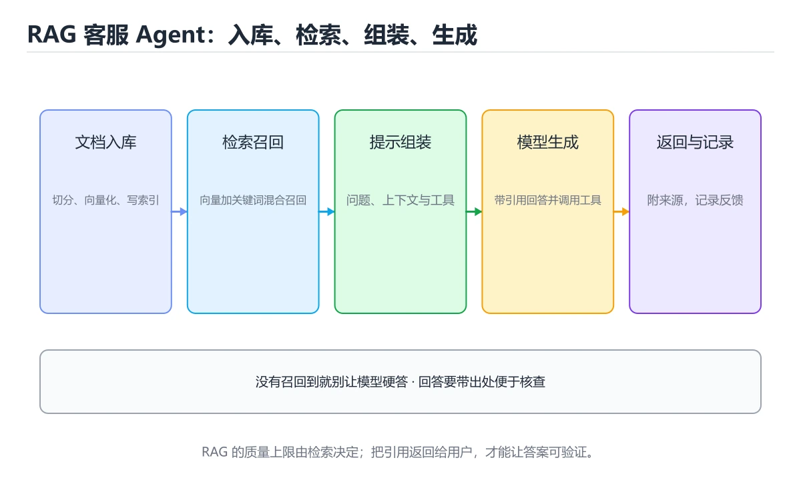
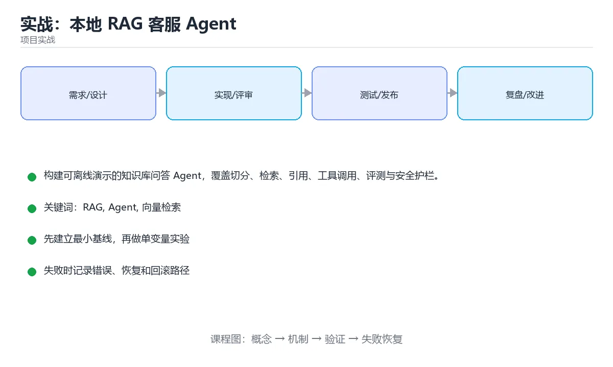

# 实战：本地 RAG 客服 Agent





> 内容更新时间：2026-10-06 · 学习阶段：高级 · 预计用时：60 分钟

## 学习目标

- 能把文档切分、索引、召回、重排和生成拆成独立阶段。
- 能让每个回答携带可追溯的文档片段引用。
- 能为 Agent 工具设置参数校验、超时和权限边界。
- 能用离线评测集验证命中率、引用正确率和拒答率。

## 前置知识

- 具备 RAG 的前置知识，能看懂 answer_question 相关的示例。
- 熟悉命令行、依赖管理、测试和 Git 基本操作。
- 本课涉及：RAG、Agent、向量检索、引用、评测。

## 项目背景

客服团队需要回答产品文档问题。系统必须先从本地知识库检索证据，再生成带来源的回答；当证据不足时明确拒答，遇到订单查询等实时数据时调用受控工具，而不是让模型编造。

一句话摘要：构建可离线演示的知识库问答 Agent，覆盖切分、检索、引用、工具调用、评测与安全护栏。

## 技术栈

- Python 3.12
- 向量索引
- Embedding
- 检索器
- 工具调用
- pytest

## 架构与数据流

```text
「实战：本地 RAG 客服 Agent」的链路可以写成：项目背景 → 技术栈 → 架构与数据流 → 功能范围。链上任何一环缺少可观察的输出，都不能算验证完成。
                 ↘ 失败分类 → 重试/回滚 → 错误响应
```

- 查询 Agent 时限定字段与分页范围，把全表扫描留作最后手段。
- answer_question 的写入要以幂等键为准，失败后能补偿或安全重试。
- 外部调用要设置超时、重试上限和降级策略。
- 每个关键阶段都要留下日志、指标或测试证据。

## 功能范围

- [ ] 导入 Markdown/PDF 文本并保留来源元数据
- [ ] 混合关键词与向量检索并重排 Top-K
- [ ] 回答只使用检索到的证据
- [ ] 工具调用采用白名单和参数模式
- [ ] 输出引用、置信度与拒答原因
- [ ] 记录检索与生成阶段延迟

## 示例数据与边界

| 场景 | 输入 | 期望结果 | 检查点 |
| --- | --- | --- | --- |
| 正常路径 | 合法的最小数据集 | 成功返回并写入正确数据 | 状态码、数据库记录、日志 |
| 边界值 | 最大值、最小值或空集合 | 明确成功或给出可理解错误 | 不崩溃、不越界、不写半条数据 |
| 非法输入 | 类型错误、缺字段、超长内容 | 返回校验错误并指出字段 | 错误结构统一且不泄露内部信息 |
| 依赖失败 | 数据库不可用、超时、网络抖动 | 重试、降级或快速失败 | 可恢复、可观测、无重复副作用 |

## 实施步骤

### 步骤 1：定义知识块、来源和评测样本模型

- 输入与产出：先写清 RAG 依赖的配置、数据和最终产物，再开始编码。
- 验证方法：用最小请求或单元测试证明 RAG 这一步的结果正确。
- 出错时先记录 Agent 的错误信息与回滚结果，再决定是否重试。
- 证据留存：保留命令、输出、日志或截图，方便评审与复盘。

### 步骤 2：实现清洗、切分与元数据保留

「实战：本地 RAG 客服 Agent」的「步骤 2：实现清洗、切分与元数据保留」一节补全如下：

- 定位：这一节说明步骤 2：实现清洗、切分与元数据保留在「实战：本地 RAG 客服 Agent」知识体系里的位置。
- 要点：能为 Agent 工具设置参数校验、超时和权限边界。
- 自检：能否用一个最小例子解释步骤 2：实现清洗、切分与元数据保留？

### 步骤 3：建立可重复构建的向量索引

「实战：本地 RAG 客服 Agent」的「步骤 3：建立可重复构建的向量索引」一节补全如下：

- 定位：这一节说明步骤 3：建立可重复构建的向量索引在「实战：本地 RAG 客服 Agent」知识体系里的位置。
- 要点：本课涉及：RAG、Agent、向量检索、引用、评测。
- 自检：能否用一个最小例子解释步骤 3：建立可重复构建的向量索引？

### 步骤 4：实现召回、重排和上下文预算控制

「实战：本地 RAG 客服 Agent」的「步骤 4：实现召回、重排和上下文预算控制」一节补全如下：

- 定位：这一节说明步骤 4：实现召回、重排和上下文预算控制在「实战：本地 RAG 客服 Agent」知识体系里的位置。
- 要点：一句话摘要：构建可离线演示的知识库问答 Agent，覆盖切分、检索、引用、工具调用、评测与安全护栏。
- 自检：能否用一个最小例子解释步骤 4：实现召回、重排和上下文预算控制？

### 步骤 5：接入受控工具与引用格式化

「实战：本地 RAG 客服 Agent」的「步骤 5：接入受控工具与引用格式化」一节补全如下：

- 定位：这一节说明步骤 5：接入受控工具与引用格式化在「实战：本地 RAG 客服 Agent」知识体系里的位置。
- 检查点：用空值、极值和依赖失败各跑一次《实战：本地 RAG 客服 Agent》，确认边界行为与正文一致。
- 自检：能否用一个最小例子解释步骤 5：接入受控工具与引用格式化？

### 步骤 6：运行离线评测并修复未命中与幻觉案例

「实战：本地 RAG 客服 Agent」的「步骤 6：运行离线评测并修复未命中与幻觉案例」一节补全如下：

- 定位：这一节说明步骤 6：运行离线评测并修复未命中与幻觉案例在「实战：本地 RAG 客服 Agent」知识体系里的位置。
- 检查点：用空值、极值和依赖失败各跑一次《实战：本地 RAG 客服 Agent》，确认边界行为与正文一致。
- 自检：能否用一个最小例子解释步骤 6：运行离线评测并修复未命中与幻觉案例？

## 关键代码

```python
def answer_question(question: str, retriever, llm) -> dict:
    hits = retriever.search(question, top_k=8)
    if not hits or hits[0].score < 0.62:
        return {'answer': '知识库中没有足够证据。', 'citations': [], 'grounded': False}
    context = '\n\n'.join(
        f'[{i+1}] {hit.text}\nSource: {hit.source}' for i, hit in enumerate(hits[:4])
    )
    response = llm.generate(
        system='Only answer from the supplied context. Cite every claim.',
        user=f'Question: {question}\n\nContext:\n{context}',
    )
    return {'answer': response, 'citations': [hit.source for hit in hits[:4]], 'grounded': True}
```

## 验证命令与预期输出

```text
1. 安装依赖并启动项目
2. 执行至少 3 条自动化测试，其中包含 1 条失败路径
3. 用正常请求验证成功响应
4. 用非法输入验证错误响应
5. 重复执行一次，确认没有重复写入或副作用
```

## 建议目录结构

```text
src/
  entry/        启动与配置
  domain/       业务模型与规则
  service/      用例编排
  infra/        数据库、HTTP、消息等适配器
tests/          单元、集成与接口测试
```

## 质量门禁

- [ ] 格式化和静态检查通过，不遗留明显警告。
- [ ] 测试分层：核心规则用单元测试，Agent 的边界用集成测试。
- [ ] 错误响应不泄露堆栈、SQL 和密钥。
- [ ] 配置来自环境变量或配置文件，不硬编码敏感信息。
- [ ] README 写清启动、测试、配置和回滚步骤。

## 安全、成本与可观测性

- answer_question 的运行身份只保留完成任务所需的权限，越权请求应当被拒绝。
- answer_question 的参数先校验再使用，错误响应里不出现堆栈或 SQL。
- 密钥通过环境变量或密钥管理服务注入，并记录轮换方式。
- answer_question 的并发度要有上限，并在达到上限时给出可解释的拒绝。
- 至少记录 RAG 的请求量、错误率、P95/P99 延迟与资源使用趋势。
- 把 Agent 的日志与指标对齐到同一时间轴，便于事后复盘。

## 测试与验收

- 问题有明确证据时回答包含正确来源编号
- 知识库没有相关片段时系统拒答而不是编造
- 工具收到越权参数时在调用前被拒绝
- 索引重建后相同评测集结果保持稳定

### 验收记录表

| 检查项 | 证据 | 结果 | 备注 |
| --- | --- | --- | --- |
| 最小路径可运行 | 启动命令与输出 |  |  |
| 失败路径可恢复 | 错误日志与重试 |  |  |
| 自动化测试通过 | 测试报告 |  |  |
| 配置和密钥安全 | 配置检查 |  |  |

## 常见错误与排查

| 问题 | 原因 | 解决 |
| --- | --- | --- |
| 只做向量召回 | 专有名词和编号经常漏检 | 混合关键词检索并重排 |
| 把全部文档塞进上下文 | 成本高且中间信息被忽略 | 限制 Top-K 并保留来源元数据 |
| 无法拒答 | 无证据时仍然生成答案 | 设置低置信度和空召回兜底 |
| 工具没有权限边界 | 模型可读取或修改敏感数据 | 白名单、参数校验和最小权限 |

## 扩展任务

- 加入多模态图片 OCR 与表格理解
- 实现多轮对话查询改写
- 把评测结果接入 CI 并阻止回归发布

## 性能、容量与故障演练

| 维度 | 基线 | 压测方法 | 失败信号 |
| --- | --- | --- | --- |
| 延迟 | 记录 P50/P95/P99 | 用固定数据集逐步增加并发 | P99 持续上升或超时率增加 |
| 吞吐 | 记录每秒处理量 | 逐步加压直到资源打满 | 队列积压、CPU/内存饱和 |
| 存储 | 记录数据增长与索引大小 | 导入 10 倍数据并观察查询 | 磁盘、连接或锁等待成为瓶颈 |
| 恢复 | 记录故障恢复时间 | 停止数据库、注入延迟或重复请求 | 数据不一致、重复副作用、无法回滚 |

## 实施记录与复盘

每完成一步，记录以下内容：

1. 本步的输入、命令和输出是什么？
2. 遇到的最小失败是什么，如何定位和修复？
3. 哪个假设被验证或推翻？
4. 下一步的风险是什么，如何回滚？
5. 规模扩大 10 倍后，Agent 会先成为瓶颈还是先暴露一致性风险？

## 动手练习

### 练习 1：最小可运行版本（30 分钟）

第一版只做 answer_question 的主流程，先把可运行与可测试立起来。

**验收标准**：留下启动命令、请求示例和成功输出。

### 练习 2：失败路径（30 分钟）

让 answer_question 的下游超时，确认错误可解释且状态可恢复。

**验收标准**：错误信息清晰，且不会破坏已有数据。

### 练习 3：扩展一个功能（60 分钟）

从扩展任务中选一项实现，并补一条自动化测试。

**验收标准**：新功能通过测试，且原有测试不回归。

## 本课小结

- 「实战：本地 RAG 客服 Agent」的核心不是堆功能，而是把输入、状态、错误和验收标准连接起来。
- 先跑通 RAG 的最小路径，再补失败处理、测试和文档，最后才做性能优化。
- 把 RAG 的验证命令与输出一起归档，作为阶段交付物。
- 完成后用扩展任务检验迁移能力，而不是只复制示例代码。

## 完成标准

- [ ] 能从干净环境按 README 启动项目。
- [ ] 自动化测试覆盖 Agent 的核心规则，并验证一次错误处理。
- [ ] 能演示一次错误、一次恢复和一次回滚。
- [ ] 有一份资源或性能基线，能说明瓶颈在哪里。
- [ ] 能说清一个尚未解决的问题和下一步验证方法。

## 可运行练习

### 任务 1：先跑通，再解释

```python
def answer_question(question: str, retriever, llm) -> dict:
    hits = retriever.search(question, top_k=8)
    if not hits or hits[0].score < 0.62:
        return {'answer': '知识库中没有足够证据。', 'citations': [], 'grounded': False}
    context = '\n\n'.join(
        f'[{i+1}] {hit.text}\nSource: {hit.source}' for i, hit in enumerate(hits[:4])
    )
    response = llm.generate(
        system='Only answer from the supplied context. Cite every claim.',
        user=f'Question: {question}\n\nContext:\n{context}',
    )
    return {'answer': response, 'citations': [hit.source for hit in hits[:4]], 'grounded': True}
```

### 任务 2：只改一个条件

把「实战：本地 RAG 客服 Agent」的最小示例复制一份，只改一个条件再跑一次：

- 改动点：把 Agent 换成边界值，其他输入保持原样。
- 预测：先写下「实战：本地 RAG 客服 Agent」在改动后的输出或错误信息，再运行。
- 记录：对照改动前后的结果，指出差异出在哪一步。
- 验收：换回原条件能复现原结果，改动只影响RAG。

### 任务 3：迁移到自己的数据

换一个 Agent 场景重做一次，确认结论不是只对示例数据成立。

## 故障现场

### 现场 1：只做向量召回

**症状**：在《实战：本地 RAG 客服 Agent》的复现场景中，专有名词和编号经常漏检。

**根因**：当出现“只做向量召回”时，执行路径已经绕过了《实战：本地 RAG 客服 Agent》的关键约束，最终以“专有名词和编号经常漏检”暴露出来；修复前必须先确认约束在哪里失效。

**修复**：针对《实战：本地 RAG 客服 Agent》的问题，混合关键词检索并重排。

**验证**：先在《实战：本地 RAG 客服 Agent》中记录“只做向量召回”留下的失败证据，再执行“混合关键词检索并重排”并重放；确认错误路径变为明确结果，且修复没有掩盖同类故障。

### 现场 2：把全部文档塞进上下文

**症状**：在《实战：本地 RAG 客服 Agent》的复现场景中，成本高且中间信息被忽略。

**根因**：“成本高且中间信息被忽略”只是表层结果。向上追溯会落到“把全部文档塞进上下文”这一步，因为它省略了《实战：本地 RAG 客服 Agent》的约束，使实现行为和预期模型发生了偏离。

**修复**：针对《实战：本地 RAG 客服 Agent》的问题，限制 Top-K 并保留来源元数据。

**验证**：保留《实战：本地 RAG 客服 Agent》里触发“成本高且中间信息被忽略”的输入、版本和日志，按“限制 Top-K 并保留来源元数据”完成修改后原样重放；只有失败现象消失且相邻场景仍可解释，才保留改动。

### 现场 3：工具没有权限边界

**症状**：在《实战：本地 RAG 客服 Agent》的复现场景中，模型可读取或修改敏感数据。

**根因**：当出现“工具没有权限边界”时，执行路径已经绕过了《实战：本地 RAG 客服 Agent》的关键约束，最终以“模型可读取或修改敏感数据”暴露出来；修复前必须先确认约束在哪里失效。

**修复**：针对《实战：本地 RAG 客服 Agent》的问题，白名单、参数校验和最小权限。

**验证**：在《实战：本地 RAG 客服 Agent》中按“白名单、参数校验和最小权限”调整后，从“工具没有权限边界”的触发条件重放同一条路径，确认“模型可读取或修改敏感数据”不再出现，并补一个相邻边界用例检查没有引入新问题。

## 本课复习清单

离开本课前，逐项确认：

- [ ] 不看解析，能说出「RAG 客服 Agent 在生成答案前最关键的步骤是什么？」的判断依据。
- [ ] 不看解析，能说出「为什么生产级 RAG 通常要混合关键词检索与向量检索？」的判断依据。
- [ ] 不看解析，能说出「当知识库没有任何相关片段时，Agent 应该如何处理？」的判断依据。
- [ ] 不看解析，能说出「为 Agent 工具设置白名单和参数校验的主要目的是什么？」的判断依据。
- [ ] 至少运行一次 answer_question 的示例，记录输入、输出和 RAG 的边界情况。
- [ ] 把本课最容易混淆的两个概念写成一句话对照。

| 复盘项 | 记录 |
| --- | --- |
| 已经能独立解释的考点 |  |
| 仍然说不清的概念 |  |
| 下一步验证动作 |  |

## 术语速查

| 术语 | 一句话说明 |
| --- | --- |
| `RAG` | 检索增强生成：先把文档检索成上下文再交给模型作答，能引用外部知识并降低幻觉。 |
| `向量检索` | 把文本、图像等编码成向量，并按相似度快速找出语义最接近的条目。 |
| `引用` | 一句话摘要：构建可离线演示的知识库问答 Agent，覆盖切分、检索、引用、工具调用、评测与安全护栏。 |
| `评测` | 构建可离线演示的知识库问答 Agent，覆盖切分、检索、引用、工具调用、评测与安全护栏。 |

## 考点精讲

### 考点 1：多选辨析·RAG

- **题目**：围绕“实战：本地 RAG 客服 Agent”中的 RAG、Agent、向量检索，下列哪两项是本课强调的实践判断？
- **判断依据**：本课把实战：本地 RAG 客服 Agent拆成概念、示例与故障现场三部分，因此判断 RAG 时必须同时交代输入、输出和失败路径，这使“学习 RAG 时要同时说明输入、输出和失败路径，不能只看正常流程”成立。在实战：本地 RAG 客服 Agent里，判断 Agent 时要固定版本与边界输入，所以“验证 Agent 时要固定版本并覆盖边界输入，结论才可复现”才可复现。

### 考点 2：代码补全·RAG

- **题目**：下面这段 Python 代码摘自「实战：本地 RAG 客服 Agent」的正文示例。关于这段代码，下面哪一项说法与实际内容相符？
- **判断依据**：在「实战：本地 RAG 客服 Agent」里，这段代码包含循环结构，同一段逻辑会被重复执行。这段代码出自「实战：本地 RAG 客服 Agent」的正文示例，围绕RAG、Agent、向量检索展开；把输入或边界换成空值、极值或失败情况后，结论要以「实战：本地 RAG 客服 Agent」的实际运行结果为准。

### 考点 3：概念判断·RAG

- **题目**：当知识库没有任何相关片段时，Agent 应该如何处理？
- **判断依据**：在「实战：本地 RAG 客服 Agent」里，明确说明证据不足并拒答。无法获得可靠证据时，系统应把不确定性明确告诉用户，而不是通过模型常识补全看似合理的事实。把“明确说明证据不足并拒答”代回「实战：本地 RAG 客服 Agent」里“当知识库没有任何相关片段时”的例子核对，条件一旦改变，结论就要用RAG、Agent、向量检索重新推导。

### 考点 4：概念判断·RAG

- **题目**：为 Agent 工具设置白名单和参数校验的主要目的是什么？
- **判断依据**：在「实战：本地 RAG 客服 Agent」里，结论应落在「限制可执行操作并防止越权副作用」。模型可能生成错误参数或被提示注入诱导调用工具，因此权限不能依赖模型自觉。在「实战：本地 RAG 客服 Agent」里，这道题要求区分概念与边界，「限制可执行操作并防止越权副作用」只有在题干给出的前提下才成立，而「减少提示词长度」、「提高模型参数量」缺少同一组条件。

### 考点 5：填空·RAG

- **题目**：补全代码：「实战：本地 RAG 客服 Agent」示例中，下面这行代码缺少哪个关键字或函数名？请填入 ____。 `hits = retriever.search(____, top_k=8)`
- **判断依据**：在「实战：本地 RAG 客服 Agent」里，question。在「实战：本地 RAG 客服 Agent」里判断这道题，要把RAG、Agent、向量检索的条件、过程与失败路径逐项对齐，换成“补全代码”这个场景，只有满足前提的结论才成立。回到「实战：本地 RAG 客服 Agent」的正文示例，用“补全代码”走一遍RAG、Agent、向量检索的完整流程，能复现的结论才可以保留。

## 复习与自测

- [ ] 能解释「项目背景」里最容易混淆的两个概念。
- [ ] 能不看正文写出「架构与数据流」的关键步骤。
- [ ] 能用一句话说明「功能范围」解决什么问题。
- [ ] 能把「示例数据与边界」的判断标准套到一个新例子上。
- [ ] 能说清「实施步骤」的结论，并说出它的适用边界。
- [ ] 能用自己的话复述「步骤 1：定义知识块、来源和评测样本模型」，并各举一个正例和反例。

## English Overview

**Title:** Project: Local RAG Support Agent

**Summary:** Build a citation-based RAG agent with retrieval, tools, evaluation and guardrails.

**Category:** Project Practice
**Level:** 高级
**Key terms:** RAG, Agent, 向量检索, 引用, 评测

## 内容元数据

- 内容版本：v2.0
- 最后更新：2026-10-06
- 学习阶段：高级
- 适用环境：通用项目交付流程；本课聚焦 RAG。
- 内容来源：内置结构化课程与工程实践整理
- 相关主题：RAG、Agent、向量检索、引用、评测
- 质量版本：P0 测验标准 + P1 覆盖扩展 + P2 体验补全

## 项目专属规格：实战：本地 RAG 客服 Agent

### 核心场景

构建可离线演示的知识库问答 Agent，覆盖切分、检索、引用、工具调用、评测与安全护栏。 项目目标是把「RAG、Agent、向量检索、引用、评测」落实为可运行、可测试、可回滚的交付物。

### 架构与数据流

```text
用户/输入 → 接口或命令 → 领域逻辑 → 存储/外部依赖 → 输出与监控
                         ↘ 失败分类 → 重试/补偿 → 回滚
```

### 最小数据模型

| 对象 | 关键字段 | 约束 |
| --- | --- | --- |
| 输入实体 | RAG、时间、来源 | 必填校验、长度限制、幂等键 |
| 任务实体 | 状态、优先级、创建时间 | 状态迁移合法、不可重复执行 |
| 结果实体 | 输出、错误码、耗时 | 可序列化、错误可解释 |
| 审计记录 | 操作者、动作、结果、时间 | 不可篡改、可查询、脱敏 |

### 验收场景

1. 正常路径：最小输入得到预期输出，并留下日志与指标。
2. 边界路径：把 answer_question 的输入推到上下限，确认返回结果可解释。
3. 失败路径：依赖超时或不可用时能快速失败、重试或降级。
4. 幂等路径：同一请求执行两次不会产生重复副作用。
5. 回滚路径：撤掉 answer_question 的变更后，数据与资源都回到变更前的状态。

## 项目交付物

### 建议仓库结构

```text
src/
tests/
docs/
README.md
```

### 测试矩阵

| 层级 | 覆盖内容 | 最低数量 | 通过标准 |
| --- | --- | ---: | --- |
| 单元测试 | 领域规则、边界和错误分类 | 8 | 正常、边界、失败路径全部通过 |
| 集成测试 | 数据库、网络、文件或平台边界 | 3 | 使用真实边界且可重复运行 |
| 端到端测试 | 核心用户路径 | 1 | 从输入到输出完整跑通 |
| 手动验收 | 文档中列出的 5 个场景 | 5 | 有命令、输出和结论记录 |

### 验收数据

```json
{
  "project": "project_rag_agent_service",
  "scenario": "RAG的正常路径",
  "input": {"case": "normal", "value": "answer_question"},
  "expected": {"ok": true, "checks": ["RAG可复现", "Agent有记录"]},
  "failure_case": {"case": "Agent越界或缺失", "error": "validation_error"},
  "idempotency_key": "project_rag_agent_service-001"
}
```

### 复盘模板

| 问题 | 记录 |
| --- | --- |
| 原目标是什么？ | 用一句话描述可验收目标 |
| 实际发生了什么？ | 时间线、指标和关键日志 |
| 哪个假设被推翻？ | 根因与促成因素 |
| 如何回滚？ | 步骤、耗时和数据校验 |
| 下一步做什么？ | 负责人、期限和验证方式 |

> 项目验收围绕「RAG、Agent、向量检索」：至少完成一次正常路径、一次边界输入、一次失败恢复和一次幂等检查。

## 参考资料与复核

- 最后复核：2026-10-04
- 下次复核：2027-10-10
- 复核范围：版本兼容、API 行为、安全建议与工程实践
- 来源性质：官方文档、标准或权威教材；正文为离线教学重组

| 参考资料 | 本课用途 |
| --- | --- |
| [OpenAI Cookbook](https://cookbook.openai.com/) | AI 应用与评估实践 |
| [OWASP ASVS](https://owasp.org/www-project-application-security-verification-standard/) | 项目安全验收 |
| [Docker 入门](https://docs.docker.com/get-started/) | 容器化与 Compose |

> 「实战：本地 RAG 客服 Agent」的链接用于离线阅读后的延伸核对；App 不会自动联网。

## Full English Study Guide

### Overview

**Project: Local RAG Support Agent** focuses on Build a citation-based RAG agent with retrieval, tools, evaluation and guardrails.

### Learning Outcomes

- Explain what **Project: Local RAG Support Agent** solves and when it should be used.

### Glossary

- Topic: **Project: Local RAG Support Agent**
- Related terms: RAG, Agent, 向量检索, 引用

<!-- p1-project-review:start -->
## 交付评审：评分表、决策记录与证据链

「实战：本地 RAG 客服 Agent」的验收不能只看功能能不能跑通。下面把正文里的交付物、验证命令和关键设计点整理成一张评审表，按表逐项留下证据即可。

### 一、「实战：本地 RAG 客服 Agent」的交付物评分表

| 交付物 | 权重 | 合格线 | 需要的证据 |
| --- | ---: | --- | --- |
| 核心链路 | 34% | 能在干净环境复现，且失败路径有明确处理 | 命令与输出、对应测试、一次失败与恢复记录 |
| 测试与验收记录 | 33% | 能在干净环境复现，且失败路径有明确处理 | 命令与输出、对应测试、一次失败与恢复记录 |
| 运行与回滚说明 | 33% | 能在干净环境复现，且失败路径有明确处理 | 命令与输出、对应测试、一次失败与恢复记录 |

「实战：本地 RAG 客服 Agent」的评分先看证据再打分：任意一项只要拿不出可复现的命令或测试，该项按 0 分计，不允许用「基本完成」代替。

### 二、需要写下来的决策（ADR）

| 决策点 | 本课给出的做法 | 备选方案 | 代价与回滚 |
| --- | --- | --- | --- |
| 架构与数据流 | 用户/输入 → 接口或命令 → 领域逻辑 → 存储/外部依赖 → 输出与监控 | 不做「架构与数据流」，沿用最朴素的实现（需要额外补一次对照实验） | 若「架构与数据流」出问题，回到上一版本并按本课验收场景重跑 |

ADR 不需要长：每个决策三行就够——选了什么、放弃了什么、出问题怎么退。评审时只检查这三行是否和「实战：本地 RAG 客服 Agent」的实际代码一致。

### 三、「实战：本地 RAG 客服 Agent」的交付证据链

| # | 命令 | 这条命令要留下的证据 |
| ---: | --- | --- |
| 1 | `1. 安装依赖并启动项目` | 完整输出、退出码、耗时，以及与「实战：本地 RAG 客服 Agent」验收口径的对应关系 |
| 2 | `2. 执行至少 3 条自动化测试，其中包含 1 条失败路径` | 完整输出、退出码、耗时，以及与「实战：本地 RAG 客服 Agent」验收口径的对应关系 |
| 3 | `3. 用正常请求验证成功响应` | 完整输出、退出码、耗时，以及与「实战：本地 RAG 客服 Agent」验收口径的对应关系 |
| 4 | `4. 用非法输入验证错误响应` | 完整输出、退出码、耗时，以及与「实战：本地 RAG 客服 Agent」验收口径的对应关系 |
| 5 | `5. 重复执行一次，确认没有重复写入或副作用` | 完整输出、退出码、耗时，以及与「实战：本地 RAG 客服 Agent」验收口径的对应关系 |

把「实战：本地 RAG 客服 Agent」的上表整理成一个 evidence/ 目录：每条命令一个文件，文件名带日期，内容包含版本、命令与输出。评审时直接按目录核对，不再口头确认。

### 四、「实战：本地 RAG 客服 Agent」的验收指标

| 指标 | 目标值 | 测量方式 | 不达标时的动作 |
| --- | --- | --- | --- |
| 「实战：本地 RAG 客服 Agent」的「步骤 4：实现召回、重排和上下文预算控制」一节补全如下： | 用本课正文给出的阈值，没有就写实测基线 | 固定环境重复三次取中位数 | 回到对应小节定位，先修原因再重测 |
| 定位：这一节说明步骤 4：实现召回、重排和上下文预算控制在「实战：本地 RAG 客服 Agent」知识体系里的位置。 | 用本课正文给出的阈值，没有就写实测基线 | 固定环境重复三次取中位数 | 回到对应小节定位，先修原因再重测 |
| 自检：能否用一个最小例子解释步骤 4：实现召回、重排和上下文预算控制？ | 用本课正文给出的阈值，没有就写实测基线 | 固定环境重复三次取中位数 | 回到对应小节定位，先修原因再重测 |
| 至少记录 RAG 的请求量、错误率、P95/P99 延迟与资源使用趋势。 | 用本课正文给出的阈值，没有就写实测基线 | 固定环境重复三次取中位数 | 回到对应小节定位，先修原因再重测 |
| | 延迟 | 记录 P50/P95/P99 | 用固定数据集逐步增加并发 | P99 持续上升或超时率增加 | | 用本课正文给出的阈值，没有就写实测基线 | 固定环境重复三次取中位数 | 回到对应小节定位，先修原因再重测 |

指标必须能用一条命令或一次操作测出来；写不出测量方式的指标，在「实战：本地 RAG 客服 Agent」的评审里一律视为未定义。

### 五、评审记录模板

| 记录项 | 填写要求 |
| --- | --- |
| 项目标识 | `project_rag_agent_service` |
| 本次范围 | 说明这一轮交付了「实战：本地 RAG 客服 Agent」的哪些部分 |
| 未完成项 | 列出与 RAG 相关但本轮未做的内容 |
| 证据位置 | 指向 evidence/ 目录下的具体文件 |
| 风险与回滚 | 写清剩余风险、回滚步骤和验证方式 |
| 结论 | 通过 / 有条件通过 / 不通过，三者选一 |

「实战：本地 RAG 客服 Agent」评审结束后把这张表填完并归档；下一轮迭代直接读上一次的「未完成项」与「风险与回滚」，避免重复讨论同一个问题。
<!-- p1-project-review:end -->
