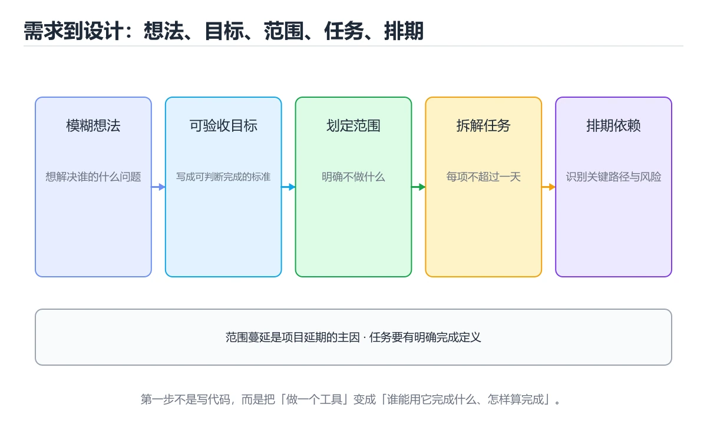
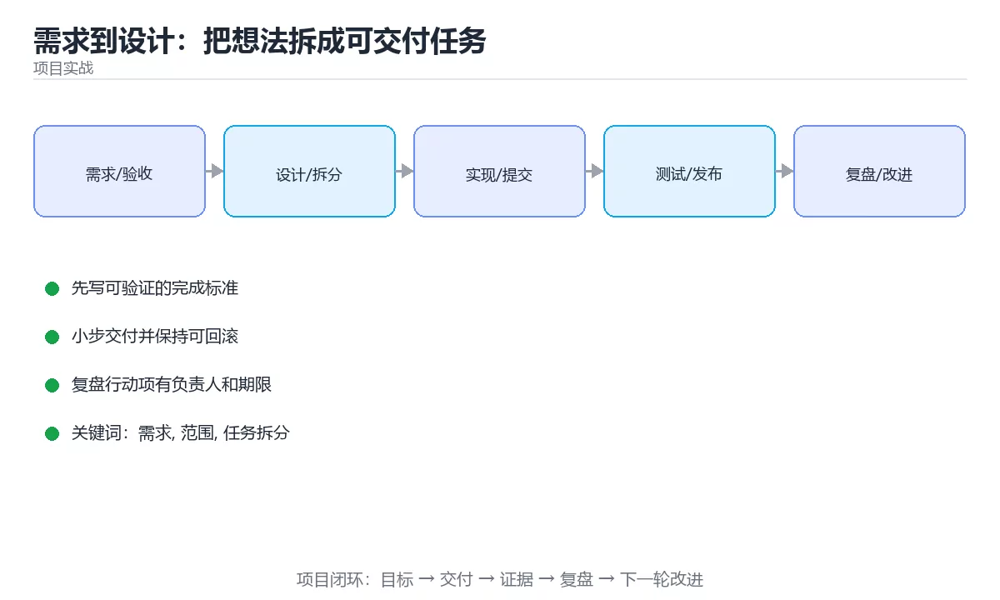

# 需求到设计：把想法拆成可交付任务





> 内容更新时间：2026-10-06 · 学习阶段：入门 · 预计用时：20 分钟

## 学习目标

- 能用自己的话解释需求到设计：把想法拆成可交付任务解决了什么问题，而不是只背术语。
- 能说清 「需求」、「范围」、「任务拆分」、「验收标准」 之间的关系，并分别举出一个例子。
- 能把本课知识放回「项目实战」的知识体系，说明它和相邻主题的边界。
- 能完成本课练习，并用验收标准检查自己的结果。

> 一句话摘要：澄清目标、划范围、拆任务、定验收、排优先级的完整方法。

## 前置知识

- 会进行基本的文件、命令行或浏览器操作；遇到不熟悉的术语先查本课关键词。
- 本课阶段：入门。只需要基本计算机操作，不要求编程经验。
- 开始前先复习：需求、范围、任务拆分。
- 如果某一步看不懂，先记录具体卡点，完成练习后再回头读一遍。

## 一句话目标

项目失败最常见的原因不是写不出代码，而是**做错了东西**。
这一课的目标是：拿到一个模糊想法，能产出可执行、可验收的任务清单。

## 交付路线全景

```text
想法
 │
 ├─① 澄清目标：为谁解决什么问题，成功标准是什么
 │
 ├─② 划范围：本期做什么、明确不做什么
 │
 ├─③ 拆任务：每个任务 ≤ 1 天，有明确完成定义
 │
 ├─④ 定验收：每条需求配可断言的验收标准
 │
 └─⑤ 排优先级：P0 必须做、P1 应该做、P2 可延后
        │
        ▼
      可执行的任务清单
```

## 第一步：把「模糊想法」变成「可验收目标」

| 模糊说法 | 可验收的写法 |
| --- | --- |
| 做一个记账 App | 让用户 30 秒内记完一笔支出，并能查看本月分类汇总 |
| 优化性能 | 首页 LCP 从 4.2s 降到 2.5s 以内 |
| 加个搜索 | 输入关键词后 500ms 内返回结果，支持标题与内容匹配 |

判断标准只有一条：**能不能用一个数字或一个可观察的行为验收**。

## 第二步：划范围（最关键的一步）

```text
本期做（P0）
  · 记录支出与收入
  · 分类统计
  · 本地存储

本期不做（明确写出来）
  · 多人共享账本
  · 银行账单导入
  · 云端同步

下一期候选
  · 预算提醒
  · 图表导出
```

**把「不做」写清楚，比写「要做」更重要**：它决定了项目会不会无限膨胀。

## 第三步：拆任务（每个任务不超过一天）

以「记录一笔支出」为例：

| 任务 | 完成定义 | 预估 |
| --- | --- | --- |
| 设计数据表 | 字段与索引确定，迁移脚本可执行 | 0.5 天 |
| 实现新增接口 | 单元测试通过，错误码齐全 | 1 天 |
| 实现录入界面 | 校验生效，保存后有反馈 | 1 天 |
| 列表展示 | 分页与空状态正常 | 0.5 天 |
| 端到端验证 | 手动跑通「录入→查看」全流程 | 0.5 天 |

好任务的三个特征：

1. **可独立交付**：做完就能验证，不必等其它任务。
2. **完成定义明确**：不用问「算做完了吗」。
3. **规模合适**：大于一天的继续拆。

## 第四步：写验收标准（Given-When-Then）

```text
场景：记录一笔支出
  Given 用户打开记账页面
  When  输入金额 25.5、选择分类「餐饮」并保存
  Then  列表出现该记录，本月「餐饮」合计增加 25.5
  And   金额为空或为负时，保存按钮不可用并提示原因
```

**验收标准就是测试用例的草稿**，写得出验收标准，才说明需求真的想清楚了。

## 第五步：排优先级与风险

| 级别 | 含义 | 处理方式 |
| --- | --- | --- |
| P0 | 没有它产品不成立 | 本期必须完成 |
| P1 | 明显影响体验 | 本期尽量完成 |
| P2 | 锦上添花 | 可延后 |

```text
风险清单（提前写出来）
  · 风险：第三方接口不稳定 → 对策：加缓存与降级
  · 风险：需求方临时加功能 → 对策：变更走 P1/P2 队列
  · 风险：单点依赖某位同事 → 对策：关键模块结对或写文档
```

## 一张图看懂设计顺序

```text
先想清楚「数据长什么样」
        │
        ▼
再定「接口怎么调用」
        │
        ▼
最后做「界面怎么呈现」

反过来的顺序（先画界面）容易返工：
界面画完才发现数据结构支撑不了
```

## 新手最容易踩的八个坑

| 坑 | 现象 | 正确做法 |
| --- | --- | --- |
| 目标没有验收标准 | 永远做不完 | 用数字或行为定义完成 |
| 不写「不做什么」 | 范围无限膨胀 | 明确列出本期不做 |
| 任务太大 | 进度无法判断 | 拆到一天以内 |
| 没有完成定义 | 反复返工 | 每个任务写清验收 |
| 先画界面后想数据 | 结构撑不住，大改 | 数据 → 接口 → 界面 |
| 不留缓冲 | 一延期就崩 | 预留 20% 时间 |
| 需求变更不记录 | 说不清为什么延期 | 变更走队列并评估影响 |
| 忽略依赖方 | 到联调才发现 | 提前确认接口与时序 |

## 本课小结
- 交付的第一原则：**先定义「做完是什么样」，再动手写代码**。
- 范围、任务、验收三件事写清楚，项目就成功了一半。
- 设计顺序永远是：数据 → 接口 → 界面。

## 补充：需求拆解的实操工具

### 用户故事的 INVEST 检查

一条合格的用户故事应满足六个特征：

| 字母 | 含义 | 不满足时的信号 |
| --- | --- | --- |
| I | Independent 独立 | 必须等另一个故事做完才能做 |
| N | Negotiable 可协商 | 细节被写死，没有讨论空间 |
| V | Valuable 有价值 | 说不出它给谁带来什么好处 |
| E | Estimable 可估算 | 团队完全估不出工作量 |
| S | Small 足够小 | 超过一个迭代还做不完 |
| T | Testable 可测试 | 写不出验收标准 |

```text
反例：实现订单模块（太大、无法验收）
正例：作为运营，我想按月导出订单对账文件，
      以便在财务系统中核对收入。
      验收：选择 2026-01 导出得到 128 条记录，字段与财务模板一致。
```

### 验收标准模板（Given / When / Then）

| 部分 | 回答什么 | 例子 |
| --- | --- | --- |
| Given | 前置条件 | 用户已登录且余额 100 元 |
| When | 触发动作 | 提交一笔 30 元的订单 |
| Then | 可断言的结果 | 余额变为 70 元，订单状态为「待发货」 |
| And | 补充断言 | 生成一条流水记录 |

### 优先级打分：RICE

当需求太多而排不出顺序时，用四个维度量化：

```text
RICE = (Reach × Impact × Confidence) / Effort

Reach      影响多少用户（月活跃人数）
Impact     对单个用户的影响强度（1=低，3=高）
Confidence 对估算的信心（0.5~1.0）
Effort     投入人天
```

| 需求 | Reach | Impact | Confidence | Effort | RICE |
| --- | --- | --- | --- | --- | --- |
| 导出对账 | 200 | 3 | 0.8 | 5 | 96 |
| 主题皮肤 | 2000 | 1 | 0.5 | 10 | 100 |
| 批量审批 | 50 | 3 | 1.0 | 3 | 50 |

分数不是决策本身，而是**把争论从「我觉得」拉到「按什么口径」**。

### 需求变更流程

```text
① 记录：变更内容、提出人、时间、原因
② 评估：影响哪些任务、增加多少人天、是否影响本期目标
③ 决策：接受（替换等量任务）/ 延后到下一期 / 拒绝
④ 同步：更新任务清单、验收标准与相关文档
```

**没有替换就没有「接受」**：新增需求若不同时砍掉等量内容，延期几乎是必然。

### 设计阶段的四张图

| 图 | 回答的问题 | 什么时候画 |
| --- | --- | --- |
| 数据模型图 | 数据长什么样、关系如何 | 动手写代码前必须画 |
| 接口契约 | 谁调用谁、输入输出是什么 | 前后端并行开发前 |
| 时序图 | 一次请求经过哪些环节 | 涉及多服务或异步时 |
| 状态机图 | 有哪些状态、如何迁移 | 订单、工单、审批类业务 |

```text
订单状态机示例
  待支付 ──支付成功──► 已支付 ──发货──► 已发货 ──签收──► 已完成
    │                    │
    └──超时取消──► 已取消  └──退款──► 已退款
每条箭头写清触发事件与校验条件，非法迁移必须被拒绝
```

### 自查清单

- [ ] 每条需求都能用一句话说清「给谁、什么价值」
- [ ] 每条需求至少有两条验收标准（正常路径 + 异常路径）
- [ ] 本期「不做什么」已写清
- [ ] 需求变更走流程，并做了等量替换
- [ ] 数据模型先于接口、接口先于界面

## 动手练习

### 练习 1：概念复述（10 分钟）

合上教程，用 3～5 句话解释需求到设计：把想法拆成可交付任务解决什么问题，并写出一个边界条件。

**验收标准**：至少使用一个本课关键词，并给出一个反例。

### 练习 2：示例改写（20 分钟）

从正文选一个最小示例，先预测修改一个输入后的结果，再实际验证并记录差异。

**验收标准**：留下「原例 → 改动 → 预测 → 结果 → 原因」五步记录。

### 练习 3：迁移任务（30 分钟）

把一个真实小需求拆成任务、验收标准、风险与回滚步骤。

- 至少覆盖「需求」和「范围」两个关键词。
- 产出一个别人可以检查的结果。
- 写出一个仍不确定的问题和验证方法。

## 验证命令与预期输出

项目代码不能只看“能编译”，还要能按固定命令复现结果。下表给出最低验证集：

| 阶段 | 命令 | 预期输出 |
| --- | --- | --- |
| 安装依赖 | `python -m pip install -r requirements.txt` | 依赖安装完成，没有版本冲突 |
| 语法检查 | `python -m compileall .` | 所有模块编译通过 |
| 运行测试 | `python -m pytest -q` | 测试全部通过，失败用例数为 0 |
| 启动示例 | `python main.py` | 服务启动并输出监听地址 |

### 验收证据

- [ ] 保存依赖安装和启动命令的完整输出。
- [ ] 至少运行 3 条测试，其中包含一条非法输入或失败路径。
- [ ] 重复执行同一操作两次，确认没有重复写入或副作用。
- [ ] 记录一次失败状态码、错误日志和恢复步骤。
- [ ] 在 README 中写明环境版本、启动方式和回滚方式。

### 回归与回滚

1. 先在一个可丢弃的目录或临时数据库执行，避免污染真实数据。
2. 修改一处逻辑后重跑全部验证命令，确认没有回归。
3. 若失败，回滚到上一个可运行版本并保留失败日志。
4. 定位原因后补一条自动化测试，再重新执行发布流程。
5. 把教训写入项目复盘或本课笔记，形成下一次的检查项。

## 可运行练习

### 任务 1：先跑通，再解释

```bash
#!/usr/bin/env bash
set -euo pipefail
echo "deliverable-ok"
```

**预期输出**：deliverable-ok

### 任务 2：只改一个条件

把「需求到设计：把想法拆成可交付任务」的最小示例复制一份，只改一个条件再跑一次：

- 改动点：只把需求的输入换成空值、极值或错误输入，其余保持不变。
- 预测：先写下「需求到设计：把想法拆成可交付任务」在改动后的输出或错误信息，再运行。
- 记录：对照改动前后的结果，指出差异出在哪一步。
- 验收：换回原条件能复现原结果，改动只影响需求。

### 任务 3：迁移到自己的数据

用同一套思路处理一组你自己的数据或场景，保持输出格式与任务 1 一致。

## 故障现场

### 现场 1：本课的 需求 常规用例通过，但边界用例失败

**症状**：在本课的练习或生产场景里出现“本课的 需求 常规用例通过，但边界用例失败”。

**复现**：准备一组最小输入，只保留触发“本课的 需求 常规用例通过，但边界用例失败”的必要条件，连续运行两次确认结果稳定。

**定位**：围绕“需求 的前置条件与取值边界没有写进代码，默认值掩盖了空值和极值”检查调用链、输入数据和环境配置，先验证假设再改代码。

**预防**：把“本课的 需求 常规用例通过，但边界用例失败”写成一条自动化用例，并在本课的验收清单里保留对应检查项。

### 现场 2：本课的 范围 结果在两次运行之间不一致

**症状**：在本课的练习或生产场景里出现“本课的 范围 结果在两次运行之间不一致”。

**复现**：准备一组最小输入，只保留触发“本课的 范围 结果在两次运行之间不一致”的必要条件，连续运行两次确认结果稳定。

**定位**：围绕“范围 依赖了当前版本、执行顺序或共享状态，单次运行无法暴露差异”检查调用链、输入数据和环境配置，先验证假设再改代码。

**预防**：把“本课的 范围 结果在两次运行之间不一致”写成一条自动化用例，并在本课的验收清单里保留对应检查项。

### 现场 3：本课的验证只在开发机通过

**症状**：在本课的练习或生产场景里出现“本课的验证只在开发机通过”。

**定位**：围绕“环境版本、配置和输入规模与目标环境不同，需求 缺少可重复的验证记录”检查调用链、输入数据和环境配置，先验证假设再改代码。

## 本课复习清单

离开本课前，逐项确认：

- [ ] 不看解析，能说出「把「优化性能」变成可验收目标，最合适的写法是？」的判断依据。
- [ ] 不看解析，能说出「在范围定义中，为什么「本期不做什么」同样重要？」的判断依据。
- [ ] 不看解析，能说出「判断一个任务拆分是否合适，最重要的标准是？」的判断依据。
- [ ] 不看解析，能说出「设计顺序上更稳妥的做法是？」的判断依据。
- [ ] 不看解析，能说出「把需求到设计：把想法拆成可交付任务中「验证步骤」的步骤调整为正确顺序。」的判断依据。
- [ ] 至少运行一次本课示例，记录输入、输出和一个边界情况。
- [ ] 把本课最容易混淆的两个概念写成一句话对照。

| 复盘项 | 记录 |
| --- | --- |
| 已经能独立解释的考点 |  |
| 仍然说不清的概念 |  |
| 下一步验证动作 |  |

## 术语速查

| 术语 | 本课语境 |
| --- | --- |
| `python -m compileall .` | \| 语法检查 \| `python -m compileall .` \| 所有模块编译通过 \| |
| `python -m pytest -q` | \| 运行测试 \| `python -m pytest -q` \| 测试全部通过，失败用例数为 0 \| |
| `python main.py` | \| 启动示例 \| `python main.py` \| 服务启动并输出监听地址 \| |
| `需求` | 围绕“环境版本、配置和输入规模与目标环境不同，需求 缺少可重复的验证记录”检查调用链、输入数据和环境配置，先验证假设再改代码。 |
| `范围` | 围绕“范围 依赖了当前版本、执行顺序或共享状态，单次运行无法暴露差异”检查调用链、输入数据和环境配置，先验证假设再改代码。 |
| `任务拆分` | 它在「需求到设计：把想法拆成可交付任务」里是理解「任务拆分」的关键术语，用来解释定义、适用条件与失败路径；它与需求、范围共同决定这一节的判断边界。复习时回到正文示例核对输入、输出和验证方式。 |

## 考点精讲

### 考点 1：代码补全·需求

- **题目**：这段代码代码是「需求到设计：把想法拆成可交付任务」的示例片段，下面哪一项描述与它一致？
- **判断依据**：在「需求到设计：把想法拆成可交付任务」里，这段代码会产生可观察的输出，运行后能看到结果。这段代码出自「需求到设计：把想法拆成可交付任务」的正文示例，围绕需求、范围、任务拆分展开；把输入或边界换成空值、极值或失败情况后，结论要以「需求到设计：把想法拆成可交付任务」的实际运行结果为准。

### 考点 2：概念判断·本期不做什么

- **题目**：在范围定义中，为什么「本期不做什么」同样重要？
- **判断依据**：在「需求到设计：把想法拆成可交付任务」里，因为它决定项目会不会无限膨胀。明确排除项是控制范围蔓延最有效的手段。在「需求到设计：把想法拆成可交付任务」里判断这道题，要把需求、范围、任务拆分的条件、过程与失败路径逐项对齐，换成“在范围定义中”这个场景，只有满足前提的结论才成立。回到「需求到设计：把想法拆成可交付任务」的正文示例，用“在范围定义中”走一遍需求、范围、任务拆分的完整流程，能复现的结论才可以保留。

### 考点 3：概念判断·需求

- **题目**：判断一个任务拆分是否合适，最重要的标准是？
- **判断依据**：在「需求到设计：把想法拆成可交付任务」里，可独立交付且完成定义明确。好任务能独立验证、完成标准清晰、规模可控。这道题的关键在「需求到设计：把想法拆成可交付任务」的需求、范围、任务拆分：先确认题干“判断一个任务拆分是否合适”问的是哪一步，再排除偷换前提的选项。把“可独立交付且完成定义明确”代回「需求到设计：把想法拆成可交付任务」里“一个任务拆分是否合适”的例子核对，条件一旦改变，结论就要用需求、范围、任务拆分重新推导。

### 考点 4：概念判断·需求

- **题目**：设计顺序上更稳妥的做法是？
- **判断依据**：数据结构决定接口与界面能表达什么，顺序反了容易大改。在「需求到设计：把想法拆成可交付任务」里，作答时，先用需求建立输入与输出的基线，再把先定数据结构，再定接口代入边界条件核对，结论才能复现。在「需求到设计：把想法拆成可交付任务」里，这道题要求区分概念与边界，「先定数据结构，再定接口」只有在题干给出的前提下才成立，而「先画界面，再想数据」、「先写测试，再想需求」缺少同一组条件。

### 考点 5：顺序排列·需求

- **题目**：把「需求到设计：把想法拆成可交付任务」中「验证步骤」的步骤调整为正确顺序。
- **判断依据**：在「需求到设计：把想法拆成可交付任务」里，正确的执行顺序是「记录运行环境、命令和真实输出」 → 「修改一个输入，先写预测再运行」 → 「制造一次错误输入，记录错误信息与修复方式」 → 「把结论写回本课笔记或测试用例」。判断标准只有一条：能不能用一个数字或一个可观察的行为验收。“把需求到设计”与「需求到设计：把想法拆成可交付任务」的术语表相呼应，只有符合需求、范围、任务拆分约束的“记录运行环境、命令和真实输出”才是正文支持的结论。

### 考点 6：多选辨析·需求

- **题目**：关于「需求到设计：把想法拆成可交付任务」，下列哪些说法是正确的？（多选）
- **判断依据**：在「需求到设计：把想法拆成可交付任务」里，因为它决定项目会不会无限膨胀；在「需求到设计：把想法拆成可交付任务」里，首页 LCP 从 4.2 秒降到 2.5 秒以内。“需求到设计”与「需求到设计：把想法拆成可交付任务」的术语表相呼应，只有符合需求、范围、任务拆分约束的“因为它决定项目会不会无限膨胀”才是正文支持的结论。

## English Overview

**Title:** From Requirements to Design

**Summary:** Clarify goals, scope work, split tasks and define acceptance.

**Category:** Project Practice
**Level:** 入门
**Key terms:** 需求, 范围, 任务拆分, 验收标准, 优先级

## 内容元数据

- 内容版本：v2.0
- 最后更新：2026-10-06
- 学习阶段：入门
- 适用环境：通用项目交付流程
- 内容来源：内置结构化课程与工程实践整理
- 相关主题：需求、范围、任务拆分、验收标准、优先级
- 质量版本：P0 测验标准 + P1 覆盖扩展 + P2 体验补全

## 项目专属规格：需求到设计：把想法拆成可交付任务

### 核心场景

澄清目标、划范围、拆任务、定验收、排优先级的完整方法。 项目目标是把「需求、范围、任务拆分、验收标准、优先级」落实为可运行、可测试、可回滚的交付物。

### 架构与数据流

```text
用户/输入 → 接口或命令 → 领域逻辑 → 存储/外部依赖 → 输出与监控
                         ↘ 失败分类 → 重试/补偿 → 回滚
```

### 最小数据模型

| 对象 | 关键字段 | 约束 |
| --- | --- | --- |
| 输入实体 | 需求、时间、来源 | 必填校验、长度限制、幂等键 |
| 任务实体 | 状态、优先级、创建时间 | 状态迁移合法、不可重复执行 |
| 结果实体 | 输出、错误码、耗时 | 可序列化、错误可解释 |
| 审计记录 | 操作者、动作、结果、时间 | 不可篡改、可查询、脱敏 |

### 验收场景

1. 正常路径：最小输入得到预期输出，并留下日志与指标。
2. 边界路径：空值、最大值、重复数据和超长内容得到明确处理。
3. 失败路径：依赖超时或不可用时能快速失败、重试或降级。
4. 幂等路径：同一请求执行两次不会产生重复副作用。
5. 回滚路径：回滚后数据一致，且能说明恢复时间和影响范围。

## 最小可运行示例

下面示例用于验证本课的最小输入、处理和输出。先原样运行，再只修改一个值：

```bash
#!/usr/bin/env bash
set -euo pipefail
echo "deliverable-ok"
```

## 预期输出

```text
deliverable-ok
```

## 验证步骤

1. 记录运行环境、命令和真实输出。
2. 修改一个输入，先写预测再运行。
3. 制造一次错误输入，记录错误信息与修复方式。
4. 把结论写回本课笔记或测试用例。

## 项目交付物

### 建议仓库结构

```text
src/
tests/
docs/
README.md
```

### 测试矩阵

| 层级 | 覆盖内容 | 最低数量 | 通过标准 |
| --- | --- | ---: | --- |
| 单元测试 | 领域规则、边界和错误分类 | 8 | 正常、边界、失败路径全部通过 |
| 集成测试 | 数据库、网络、文件或平台边界 | 3 | 使用真实边界且可重复运行 |
| 端到端测试 | 核心用户路径 | 1 | 从输入到输出完整跑通 |
| 手动验收 | 文档中列出的 5 个场景 | 5 | 有命令、输出和结论记录 |

### 验收数据

```json
{
  "project": "project_requirements_design",
  "input": {"case": "normal", "value": 5},
  "expected": {"ok": true, "result": 5},
  "failure_case": {"value": -1, "error": "validation_error"},
  "idempotency_key": "demo-001"
}
```

### 复盘模板

| 问题 | 记录 |
| --- | --- |
| 原目标是什么？ | 用一句话描述可验收目标 |
| 实际发生了什么？ | 时间线、指标和关键日志 |
| 哪个假设被推翻？ | 根因与促成因素 |
| 如何回滚？ | 步骤、耗时和数据校验 |
| 下一步做什么？ | 负责人、期限和验证方式 |

> 项目验收围绕「需求、范围、任务拆分」：至少完成一次正常路径、一次边界输入、一次失败恢复和一次幂等检查。

## 参考资料与复核

- 最后复核：2026-10-04
- 下次复核：2027-04-04
- 复核范围：版本兼容、API 行为、安全建议与工程实践
- 来源性质：官方文档、标准或权威教材；正文为离线教学重组

| 参考资料 | 本课用途 |
| --- | --- |
| [OWASP ASVS](https://owasp.org/www-project-application-security-verification-standard/) | 项目安全验收 |
| [OpenAI Cookbook](https://cookbook.openai.com/) | AI 应用与评估实践 |
| [The Twelve-Factor App](https://12factor.net/) | 配置、日志与可部署性 |

> 「需求到设计：把想法拆成可交付任务」的链接用于离线阅读后的延伸核对；App 不会自动联网。
