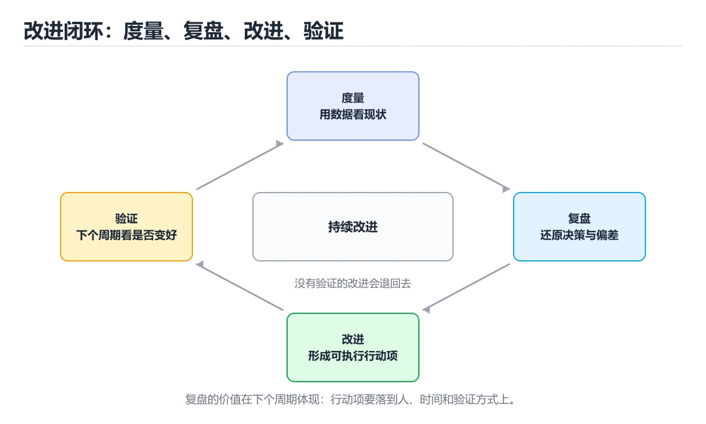
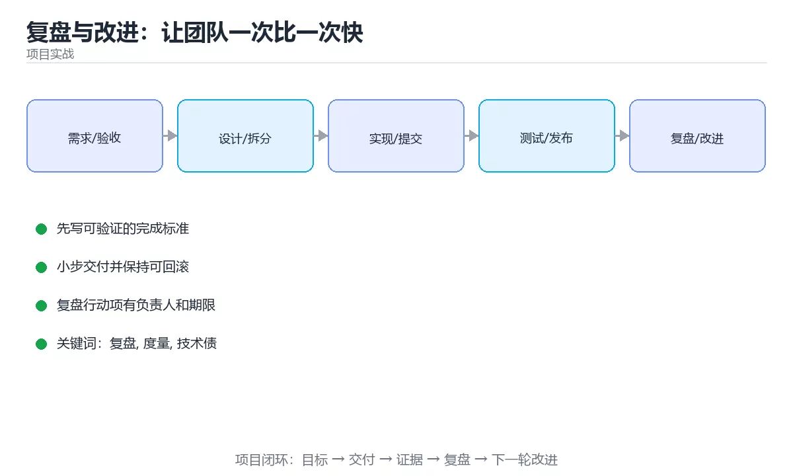

# 复盘与改进：让团队一次比一次快

> 内容更新时间：2026-10-03





## 学习目标

- 能用自己的话解释复盘与改进：让团队一次比一次快解决了什么问题，而不是只背术语。
- 能说清 「复盘」、「度量」、「技术债」、「改进」 之间的关系，并分别举出一个例子。
- 能把本课知识放回「项目实战」的知识体系，说明它和相邻主题的边界。
- 能完成本课练习，并用验收标准检查自己的结果。

> 一句话摘要：事故复盘模板、度量指标的正确用法与技术债治理节奏。

## 前置知识

- 先完成上一课《部署与运维：稳定发布与快速回滚》；如果已经掌握，可以直接用本课练习自测。
- 本课阶段：进阶。建议先掌握同一分类的基础课程，并能独立运行正文中的最小示例。
- 开始前先复习：复盘、度量、技术债。
- 如果某一步看不懂，先记录具体卡点，完成练习后再回头读一遍。

## 一句话目标

复盘不是为了追责，而是为了**把偶然的成功变成可重复的流程**，把踩过的坑变成制度。

## 一张图看懂改进闭环

```text
做事 → 度量 → 复盘 → 改进项 → 落地 → 再度量
  ▲                                      │
  └──────────────────────────────────────┘

没有度量的复盘 = 凭感觉
没有落地的复盘 = 白开会
```

## 事故复盘：先止损，再定位，最后改进

```text
① 止损（分钟级）：回滚、降级、扩容
② 定位（小时级）：看指标、日志、链路，定位到具体变更
③ 修复（小时级）：临时修复 + 验证
④ 复盘（1~3 天内）：写清时间线、根因、改进项
⑤ 落地（一周内）：改进项进任务列表并跟踪
```

## 复盘模板（无责版）

```text
标题：2026-03-05 订单接口 5xx 升高 12 分钟

影响：下单成功率从 99.6% 降到 82%，影响约 4300 次请求
时间线：
  14:02 发布新版本
  14:05 监控告警：5xx 上升
  14:07 回滚开始
  14:08 指标恢复
  14:14 确认恢复，开始定位

根因：新版本在数据库连接池耗尽时没有降级，直接抛 5xx
放大因素：发布时未做灰度，全量生效

改进项：
  1. 连接池耗尽时返回排队等待（负责人 + 截止日期）
  2. 发布强制灰度 5% 观察 10 分钟
  3. 新增「连接池使用率」告警
```

三条纪律：

1. **对事不对人**：写「流程缺少灰度」，不写「某某操作失误」。
2. **根因要能解释「为什么没被提前发现」**：只写「代码有 bug」是废话。
3. **每条改进项必须有负责人与截止日期**，否则等于没写。

## 度量的正确用法

| 指标 | 含义 | 用法 |
| --- | --- | --- |
| 交付周期 | 从开始到上线的时间 | 观察趋势，找流程瓶颈 |
| 发布频率 | 单位时间发布次数 | 高频率通常意味着小步交付 |
| 变更失败率 | 发布导致故障的比例 | 衡量质量门禁是否有效 |
| 平均恢复时间 | 从故障到恢复的时长 | 衡量可观测与回滚能力 |
| 缺陷逃逸率 | 上线后才发现的问题占比 | 衡量测试有效性 |

**度量的三条禁忌**：

```text
× 用来排名或考核个人
× 与绩效奖金直接绑定
× 追求单点最优（例如为了减少发布次数而批量堆积变更）
```

## 技术债治理：别一次还完

```text
分类
  · 阻塞型：影响交付速度（如构建要 40 分钟）→ 优先处理
  · 风险型：可能引发事故（如没有回滚方案）→ 排期处理
  · 体验型：影响开发手感（如命名混乱）→ 顺手改进
  · 洁癖型：只是看着不舒服 → 不做

节奏
  每个迭代固定留 10%~20% 容量处理技术债
```

## 让改进真正落地

```text
有效改进的特征
  · 小：一天内能完成
  · 明确：写出「改完之后，什么指标会变」
  · 可验证：一周后能查是否真的做了
  · 有主：一个人负责，而不是「大家」
```

```text
反例：加强代码质量意识
正例：给 CI 增加一条「新增代码覆盖率不低于 70%」的检查，两周后统计拦截次数
```

## 新手最容易踩的八个坑

| 坑 | 现象 | 正确做法 |
| --- | --- | --- |
| 复盘变成追责会 | 大家开始隐瞒问题 | 无责复盘，聚焦流程 |
| 根因停在「人为失误」 | 同类问题反复发生 | 追问为什么没被拦住 |
| 改进项太大 | 永远排不上期 | 拆到一天以内 |
| 没有负责人与期限 | 一周后无人记得 | 明确到人与日期 |
| 度量用于考核 | 数据造假 | 只用于观察趋势 |
| 一次还清技术债 | 业务停滞 | 固定比例持续投入 |
| 只复盘事故，不复盘成功 | 好的做法没沉淀 | 成功项目也复盘 |
| 会后不跟踪 | 复盘无效 | 改进项进任务列表并每周回顾 |

## 本课小结
- 复盘的产出不是文档，而是**可验证的改进项**。
- 度量只用于看趋势与找瓶颈，一旦用于考核就会失真。
- 技术债用固定容量持续偿还，比「集中还债」更现实。

## 补充：把复盘从「开会」变成「可跟踪的改进」

### 复盘会议的五种提问

一场有效的复盘并不需要长篇汇报，只需要按顺序问清五件事：

| 顺序 | 提问 | 目的 |
| --- | --- | --- |
| 1 | 我们原本的目标与验收标准是什么？ | 先对齐「预期」，避免事后改口径 |
| 2 | 实际发生了什么？用数据说 | 用指标与时间线代替印象 |
| 3 | 差距出现在哪一环？ | 把「效果差」拆成具体环节 |
| 4 | 为什么没有提前发现？ | 检查流程与监控的盲区 |
| 5 | 下次用什么机制避免？ | 产出可验证的改进项 |

### 根因分析：连续问五次「为什么」

以「发布后 5xx 升高」为例：

```text
现象：发布后 5xx 从 0.4% 升到 18%
 为什么 1：新版本在连接池耗尽时直接抛错
 为什么 2：连接池上限沿用默认值，没有按新流量评估
 为什么 3：压测环境流量只有生产的 1/10，没压出瓶颈
 为什么 4：压测用例没有覆盖「并发连接数」这一维度
 为什么 5：容量评估清单里缺少连接池与线程池检查项

→ 改进项落在「清单」与「压测用例」上，而不是「下次小心点」
```

判断根因是否到位，只需看改进项：**如果改进项是「加强意识」，那它一定不是根因。**

### 改进项跟踪表

复盘的价值在会后。建议用一张表跟踪到关闭：

| 字段 | 说明 |
| --- | --- |
| 改进项 | 一句话描述，一天内可完成 |
| 类型 | 流程 / 监控 / 代码 / 文档 |
| 负责人 | 一个人，不是「大家」 |
| 截止日期 | 明确到天 |
| 验证方式 | 怎么证明它生效了（指标或检查项） |
| 状态 | 待办 / 进行中 / 已完成 / 已取消 |

```text
反例：加强代码质量意识（无法验证）
正例：在 CI 增加「新增代码覆盖率 ≥ 70%」检查，两周后统计拦截次数
```

### 度量口径要先定义再使用

同一个指标，口径不同结论就相反。团队应先写清定义：

| 指标 | 需要明确的边界 |
| --- | --- |
| 交付周期 | 从「开始开发」还是「需求确认」开始计时 |
| 变更失败率 | 什么算失败：回滚？还是包含热修复 |
| 缺陷逃逸率 | 分母是全部缺陷，还是上线后发现的缺陷 |
| 平均恢复时间 | 从「告警触发」还是「用户开始受影响」算起 |

**口径一旦确定就不要频繁改**，否则趋势图失去意义。

### 复盘的三条反模式

| 反模式 | 表现 | 后果 |
| --- | --- | --- |
| 追责式复盘 | 追问「谁干的」 | 团队开始隐瞒问题 |
| 汇报式复盘 | 念进度、念数据，没有改进项 | 下次一定重演 |
| 许愿式复盘 | 改进项宏大但没有负责人 | 一周后无人记得 |

### 把改进变成默认动作

```text
① 复盘产出改进项 → 当场录入任务系统
② 每周固定 15 分钟回顾未关闭的改进项
③ 每个迭代留 10%~20% 容量处理技术债与改进
④ 季度统计：改进项关闭率、同类事故是否复发
```

**判断复盘是否有效只有一个标准：同类问题是否还会再发生。**

### 自查清单

- [ ] 复盘纪要里能看到清晰的时间线，而不只是结论
- [ ] 每条改进项都有负责人与截止日期
- [ ] 至少有一条改进项落在「机制」而不是「态度」上
- [ ] 度量指标的口径已写进团队文档
- [ ] 一周后有人检查改进项状态

## 动手练习

> 本课练习重点：围绕「复盘、度量、技术债」完成复述、实验和交付，每个结果都要能被别人检查。

先拆任务和风险，再完成一个可交付增量，最后记录回滚与改进。

### 练习 1：建立心智模型（10 分钟）

合上教程，用 3～5 句话回答：

1. 复盘与改进：让团队一次比一次快解决了什么问题？
2. 如果没有它，会出现什么具体后果？
3. 它和「度量」是什么关系？

**验收标准**：至少出现一个本课关键词，并写出一个反例、边界条件或失效场景。

### 练习 2：做一次可控实验（20 分钟）

从正文中选一个最小示例，完成以下操作：

1. 先预测修改一个参数、输入或步骤后的结果。
2. 再实际执行或逐步推演，记录真实结果。
3. 如果结果与预测不同，写出差异原因。

**验收标准**：留下「原例 → 改动 → 预测 → 结果 → 原因」五步记录。

### 练习 3：交付一个小结果（30 分钟）

把一个真实小需求拆成任务、验收标准、风险与回滚步骤。

任务要求：

- 结果必须能被别人检查，不能只写“我已经理解了”。
- 至少覆盖「复盘」和「度量」两个关键词。
- 写出 1 个仍然不确定的问题，以及下一步如何验证。

> 提示：时间有限时优先做练习 1 和练习 2；练习 3 可以拆成两次完成。

## 深入补充：复盘与改进：让团队一次比一次快

前面已经建立了基本概念。这一节换一个角度，把复盘与改进：让团队一次比一次快放进真实工程里，
重点回答三件事：它为什么存在、内部如何运转、什么时候会失效。

### 一、核心模型

复盘不是追责会议，而是从结果出发还原事实、分析原因、提炼可复用经验，并产出有负责人和期限的改进行动；目标是让团队下一次交付更稳更快。

```text
确定范围 → 收集事实与时间线 → 分析原因 → 提炼经验 → 制定行动项 → 跟踪验证 → 更新流程
```

### 二、关键机制拆解

1. 复盘对象可以是事故、迭代、发布或项目，范围越清晰越容易得出有效结论。
2. 先还原时间线和数据，再讨论原因，避免一开始就陷入观点争论。
3. 原因分析要区分直接原因、根因和促成因素，不能停在“某个人疏忽”。
4. 行动项要具体、可验证、有负责人和截止时间，避免“加强沟通”这类空话。
5. 无指责不等于不追责，而是关注系统设计和流程改进，同时保留必要责任边界。
6. 复盘结论要回写到文档、测试、监控和发布流程，否则很快被遗忘。
7. 定期回看行动项完成率，验证改进是否真的降低了故障率或交付周期。

### 三、对照表：抓住容易混淆的边界

| 维度 | 一侧 | 另一侧 |
| --- | --- | --- |
| 事故复盘 | 还原故障与恢复过程 | 重点是防止再次发生 |
| 迭代复盘 | 回顾交付与协作 | 重点是流程和效率 |
| 根因分析 | 找到系统性原因 | 避免只处理表面症状 |
| 行动项跟踪 | 验证改进落地 | 没有跟踪的复盘等于没做 |

### 四、工作示例

一次发布导致故障，时间线显示回滚耗时 20 分钟。根因不是工程师手快，而是回滚脚本未演练、监控未覆盖关键指标。行动项包括自动回滚、演练和告警补齐，并指定负责人和验证日期。

### 五、常见误区与失效边界

| 错误做法或假设 | 后果 | 正确做法 |
| --- | --- | --- |
| 复盘变成批斗 | 成员隐瞒信息 | 坚持无指责并聚焦系统和流程 |
| 只写整改口号 | 问题重复发生 | 行动项必须可验证、可跟踪 |
| 原因停在人为失误 | 无法改进系统 | 继续追问为什么流程允许该失误 |
| 没有数据支撑 | 结论主观 | 用时间线、指标和日志还原事实 |

### 六、场景推演

迭代延期两周。复盘发现需求中途变更、测试环境不稳定和估算过于乐观。行动项是引入变更评审、固定环境巡检和基于历史数据的估算校准，并在下个迭代检查效果。

### 七、自测问答

**Q1：复盘的第一步是什么？**

明确范围和目标，然后收集事实与时间线。

**Q2：无指责复盘是否意味着不追责？**

不是，它强调改进系统，同时保留必要的责任边界。

**Q3：行动项应该具备什么？**

具体动作、负责人、期限和验证标准。

**Q4：如何验证复盘有效？**

跟踪行动项完成情况，并观察故障率、周期或质量指标变化。

### 八、小项目：把知识变成可检查的产出

选一次真实或模拟的故障，写完整复盘：时间线、影响、直接原因、根因、促成因素、五条行动项和验证指标；两周后检查完成率并更新流程文档。

### 九、适用边界

复盘改善的是团队和系统，不是万能药。若组织不投入资源落实行动项，再好的分析也无法改变结果。

### 十、完成检查清单

- [ ] 能区分事故、迭代和项目复盘
- [ ] 能用时间线还原事实
- [ ] 能分析直接原因与根因
- [ ] 能写出可跟踪的行动项
- [ ] 能用指标验证改进效果

### 十一、复习顺序

1. 先不看资料复述“核心模型”，确认能说出它解决的三个问题。
2. 再对照表逐行解释容易混淆的概念，每个概念补一个反例。
3. 跟着工作示例做一遍，改变一个条件并预测结果。
4. 用自测问答检查理解，错题回到对应小节重新阅读。
5. 最后完成小项目，把结果、失败记录和复查清单整理成一份可提交产物。

> 复习不是重读一遍，而是离开原文重新产出：复述、改写、验证、复盘。

## 验证命令与预期输出

项目代码不能只看“能编译”，还要能按固定命令复现结果。下表给出最低验证集：

| 阶段 | 命令 | 预期输出 |
| --- | --- | --- |
| 安装依赖 | `python -m pip install -r requirements.txt` | 依赖安装完成，没有版本冲突 |
| 语法检查 | `python -m compileall .` | 所有模块编译通过 |
| 运行测试 | `python -m pytest -q` | 测试全部通过，失败用例数为 0 |
| 启动示例 | `python main.py` | 服务启动并输出监听地址 |

### 验收证据

- [ ] 保存依赖安装和启动命令的完整输出。
- [ ] 至少运行 3 条测试，其中包含一条非法输入或失败路径。
- [ ] 重复执行同一操作两次，确认没有重复写入或副作用。
- [ ] 记录一次失败状态码、错误日志和恢复步骤。
- [ ] 在 README 中写明环境版本、启动方式和回滚方式。

### 回归与回滚

1. 先在一个可丢弃的目录或临时数据库执行，避免污染真实数据。
2. 修改一处逻辑后重跑全部验证命令，确认没有回归。
3. 若失败，回滚到上一个可运行版本并保留失败日志。
4. 定位原因后补一条自动化测试，再重新执行发布流程。
5. 把教训写入项目复盘或本课笔记，形成下一次的检查项。

## 可运行练习

### 任务 1：先跑通，再解释

```bash
#!/usr/bin/env bash
set -euo pipefail
echo "deliverable-ok"
```

**预期输出**：deliverable-ok

### 任务 2：只改一个条件

### 任务 3：迁移到自己的数据

用同一套思路处理一组你自己的数据或场景，保持输出格式与任务 1 一致。

## 故障现场

### 现场 1：本课的 复盘 常规用例通过，但边界用例失败

**症状**：在本课的练习或生产场景里出现“本课的 复盘 常规用例通过，但边界用例失败”。

**复现**：准备一组最小输入，只保留触发“本课的 复盘 常规用例通过，但边界用例失败”的必要条件，连续运行两次确认结果稳定。

**定位**：围绕“复盘 的前置条件与取值边界没有写进代码，默认值掩盖了空值和极值”检查调用链、输入数据和环境配置，先验证假设再改代码。

**预防**：把“本课的 复盘 常规用例通过，但边界用例失败”写成一条自动化用例，并在本课的验收清单里保留对应检查项。

### 现场 2：本课的 度量 结果在两次运行之间不一致

**症状**：在本课的练习或生产场景里出现“本课的 度量 结果在两次运行之间不一致”。

**复现**：准备一组最小输入，只保留触发“本课的 度量 结果在两次运行之间不一致”的必要条件，连续运行两次确认结果稳定。

**定位**：围绕“度量 依赖了当前版本、执行顺序或共享状态，单次运行无法暴露差异”检查调用链、输入数据和环境配置，先验证假设再改代码。

**预防**：把“本课的 度量 结果在两次运行之间不一致”写成一条自动化用例，并在本课的验收清单里保留对应检查项。

### 现场 3：本课的验证只在开发机通过

**症状**：在本课的练习或生产场景里出现“本课的验证只在开发机通过”。

**定位**：围绕“环境版本、配置和输入规模与目标环境不同，复盘 缺少可重复的验证记录”检查调用链、输入数据和环境配置，先验证假设再改代码。

## 本课复习清单

离开本课前，逐项确认：

- [ ] 不看解析，能说出「事故复盘中，根因分析应该追到什么程度？」的判断依据。
- [ ] 不看解析，能说出「度量指标最不应该用于？」的判断依据。
- [ ] 不看解析，能说出「一条能真正落地的改进项应该具备什么？」的判断依据。
- [ ] 不看解析，能说出「更现实的技术债治理方式是？」的判断依据。
- [ ] 不看解析，能说出「把复盘与改进：让团队一次比一次快中「验证步骤」的步骤调整为正确顺序。」的判断依据。
- [ ] 至少运行一次本课示例，记录输入、输出和一个边界情况。
- [ ] 把本课最容易混淆的两个概念写成一句话对照。

| 复盘项 | 记录 |
| --- | --- |
| 已经能独立解释的考点 |  |
| 仍然说不清的概念 |  |
| 下一步验证动作 |  |

## 术语速查

| 术语 | 本课语境 |
| --- | --- |
| `python -m compileall .` | \| 语法检查 \| `python -m compileall .` \| 所有模块编译通过 \| |
| `python -m pytest -q` | \| 运行测试 \| `python -m pytest -q` \| 测试全部通过，失败用例数为 0 \| |
| `python main.py` | \| 启动示例 \| `python main.py` \| 服务启动并输出监听地址 \| |
| `复盘` | 本课围绕该主题展开，结合正文与代码示例理解它的适用边界。 |
| `度量` | 本课围绕该主题展开，结合正文与代码示例理解它的适用边界。 |
| `技术债` | 本课围绕该主题展开，结合正文与代码示例理解它的适用边界。 |
| `改进` | 本课围绕该主题展开，结合正文与代码示例理解它的适用边界。 |
| `事故` | 本课围绕该主题展开，结合正文与代码示例理解它的适用边界。 |

## 考点精讲

### 考点 1：围绕“复盘与改进：让团队一次比一次快”中的 复盘、度量、技术债，下列哪两项是本课强调的实践判断？

- **判断依据**：本课把复盘与改进：让团队一次比一次快拆成概念、示例与故障现场三部分，因此判断 复盘 时必须同时交代输入、输出和失败路径，这使“学习 复盘 时要同时说明输入、输出和失败路径，不能只看正常流程”成立。在复盘与改进：让团队一次比一次快里，判断 度量 时要固定版本与边界输入，所以“验证 度量 时要固定版本并覆盖边界输入，结论才可复现”才可复现。

### 考点 2：度量指标最不应该用于？

- **判断依据**：在「复盘与改进：让团队一次比一次快」里，个人排名与绩效考核。一旦与个人考核绑定，数据就会失真，团队会开始规避而不是改进。在「复盘与改进：让团队一次比一次快」里判断这道题，要把复盘、度量、技术债的条件、过程与失败路径逐项对齐，换成“度量指标最不应该用于”这个场景，只有满足前提的结论才成立。

### 考点 3：下面这段代码代码摘自「复盘与改进：让团队一次比一次快」的正文示例。关于这段代码，下面哪一项说法与实际内容相符？

- **判断依据**：在「复盘与改进：让团队一次比一次快」里，这段代码会产生可观察的输出，运行后能看到结果。这段代码出自「复盘与改进：让团队一次比一次快」的正文示例，围绕复盘、度量、技术债展开；把输入或边界换成空值、极值或失败情况后，结论要以「复盘与改进：让团队一次比一次快」的实际运行结果为准。回到「复盘与改进：让团队一次比一次快」的正文示例，用“下面这段代码代码摘自复盘与改进”走一遍复盘、度量、技术债的完整流程，能复现的结论才可以保留。

### 考点 4：更现实的技术债治理方式是？

- **判断依据**：在「复盘与改进：让团队一次比一次快」里，结论应落在「每个迭代固定留出 10%~20% 容量持续处理」。固定比例持续投入既能推进业务，又能稳定还债。在「复盘与改进：让团队一次比一次快」里，这道题要求区分概念与边界，「每个迭代固定留出 10%~20% 容量持续处理」只有在题干给出的前提下才成立，而「停掉所有业务功能，集中还债三个月」、「完全忽略技术债」缺少同一组条件。

### 考点 5：把「复盘与改进：让团队一次比一次快」中「验证步骤」的步骤调整为正确顺序。

- **判断依据**：在「复盘与改进：让团队一次比一次快」里，结合复盘、度量来看，正确的执行顺序是「记录运行环境、命令和真实输出 → 修改一个输入，先写预测再运行 → 制造一次错误输入，记录错误信息与修复方式 → 把结论写回本课笔记或测试用例」。“把复盘与改进”与「复盘与改进：让团队一次比一次快」的术语表相呼应，只有符合复盘、度量、技术债约束的“记录运行环境、命令和真实输出”才是正文支持的结论。

## English Overview

**Title:** Retrospectives and Continuous Improvement

**Summary:** Incident review templates, metrics usage and tech debt cadence.

**Category:** Project Practice
**Level:** 进阶
**Key terms:** 复盘, 度量, 技术债, 改进, 事故

## 内容元数据

- 内容版本：v2.0
- 最后更新：2026-10-03
- 学习阶段：进阶
- 适用环境：通用项目交付流程
- 内容来源：内置结构化课程与工程实践整理
- 相关主题：复盘、度量、技术债、改进、事故
- 质量版本：P0 测验标准 + P1 覆盖扩展 + P2 体验补全

## 项目专属规格：复盘与改进：让团队一次比一次快

### 核心场景

事故复盘模板、度量指标的正确用法与技术债治理节奏。 项目目标是把「复盘、度量、技术债、改进、事故」落实为可运行、可测试、可回滚的交付物。

### 架构与数据流

```text
用户/输入 → 接口或命令 → 领域逻辑 → 存储/外部依赖 → 输出与监控
                         ↘ 失败分类 → 重试/补偿 → 回滚
```

### 最小数据模型

| 对象 | 关键字段 | 约束 |
| --- | --- | --- |
| 输入实体 | 复盘、时间、来源 | 必填校验、长度限制、幂等键 |
| 任务实体 | 状态、优先级、创建时间 | 状态迁移合法、不可重复执行 |
| 结果实体 | 输出、错误码、耗时 | 可序列化、错误可解释 |
| 审计记录 | 操作者、动作、结果、时间 | 不可篡改、可查询、脱敏 |

### 验收场景

1. 正常路径：最小输入得到预期输出，并留下日志与指标。
2. 边界路径：空值、最大值、重复数据和超长内容得到明确处理。
3. 失败路径：依赖超时或不可用时能快速失败、重试或降级。
4. 幂等路径：同一请求执行两次不会产生重复副作用。
5. 回滚路径：回滚后数据一致，且能说明恢复时间和影响范围。

## 最小可运行示例

下面示例用于验证本课的最小输入、处理和输出。先原样运行，再只修改一个值：

```bash
#!/usr/bin/env bash
set -euo pipefail
echo "deliverable-ok"
```

## 预期输出

```text
deliverable-ok
```

## 验证步骤

1. 记录运行环境、命令和真实输出。
2. 修改一个输入，先写预测再运行。
3. 制造一次错误输入，记录错误信息与修复方式。
4. 把结论写回本课笔记或测试用例。

## 项目交付物

### 建议仓库结构

```text
src/
tests/
docs/
README.md
```

### 测试矩阵

| 层级 | 覆盖内容 | 最低数量 | 通过标准 |
| --- | --- | ---: | --- |
| 单元测试 | 领域规则、边界和错误分类 | 8 | 正常、边界、失败路径全部通过 |
| 集成测试 | 数据库、网络、文件或平台边界 | 3 | 使用真实边界且可重复运行 |
| 端到端测试 | 核心用户路径 | 1 | 从输入到输出完整跑通 |
| 手动验收 | 文档中列出的 5 个场景 | 5 | 有命令、输出和结论记录 |

### 验收数据

```json
{
  "project": "project_retro_improve",
  "input": {"case": "normal", "value": 5},
  "expected": {"ok": true, "result": 5},
  "failure_case": {"value": -1, "error": "validation_error"},
  "idempotency_key": "demo-001"
}
```

### 复盘模板

| 问题 | 记录 |
| --- | --- |
| 原目标是什么？ | 用一句话描述可验收目标 |
| 实际发生了什么？ | 时间线、指标和关键日志 |
| 哪个假设被推翻？ | 根因与促成因素 |
| 如何回滚？ | 步骤、耗时和数据校验 |
| 下一步做什么？ | 负责人、期限和验证方式 |

> 项目验收围绕「复盘、度量、技术债」：至少完成一次正常路径、一次边界输入、一次失败恢复和一次幂等检查。

## 参考资料与复核

- 最后复核：2026-10-04
- 下次复核：2027-04-04
- 复核范围：版本兼容、API 行为、安全建议与工程实践
- 来源性质：官方文档、标准或权威教材；正文为离线教学重组

| 参考资料 | 本课用途 |
| --- | --- |
| [GitHub Actions 文档](https://docs.github.com/actions) | 自动构建、测试与发布 |
| [OpenTelemetry 文档](https://opentelemetry.io/docs/) | 日志、指标与链路追踪 |
| [OWASP ASVS](https://owasp.org/www-project-application-security-verification-standard/) | 项目安全验收 |

> 「复盘与改进：让团队一次比一次快」的链接用于离线阅读后的延伸核对；App 不会自动联网。
