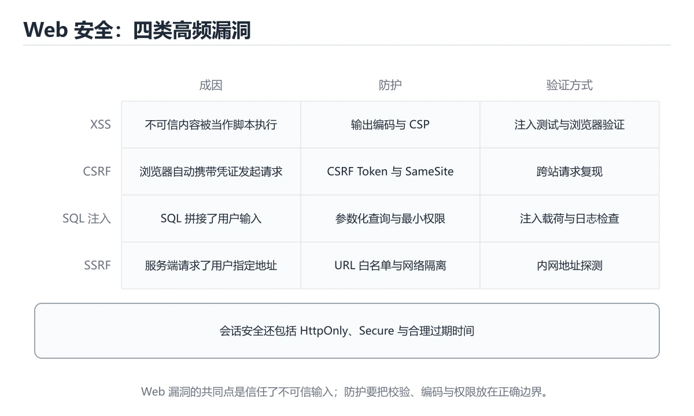
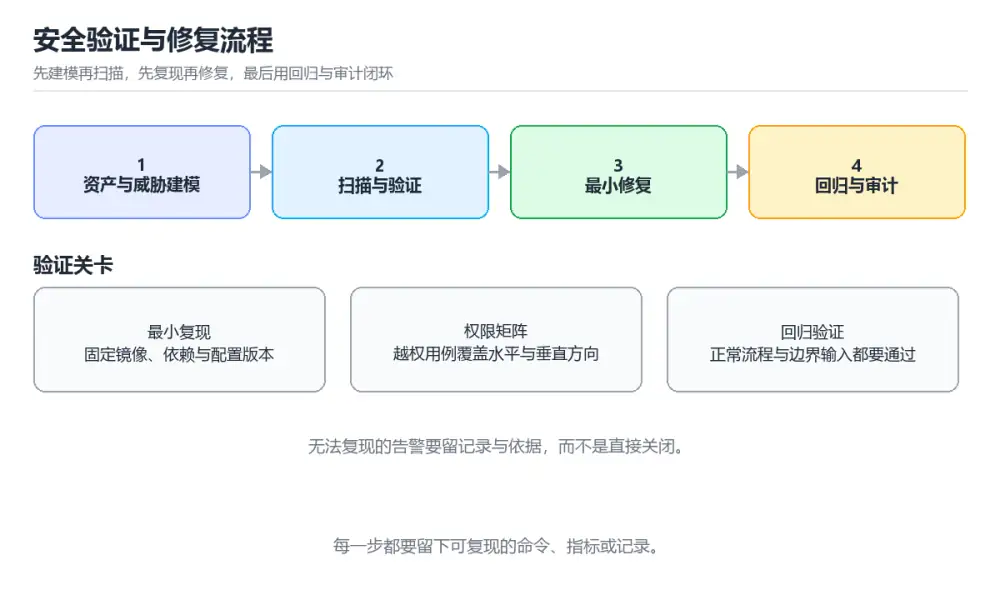

# 安全攻防与防御实战

> 内容更新时间：2026-10-06 · 学习阶段：进阶 · 预计用时：60 分钟

> 项目定位：不做“扫一遍工具就结束”的安全演练，围绕资产、威胁、验证和修复闭环。
> 建议投入：14 小时
> 难度：进阶



## 本节知识框架

**课程定位**：所属分类 `project_practice`（项目实战），课程主题 `安全攻防与防御实战`，学习阶段 进阶，建议用时 60 分钟。

本课主线：从越权、注入到供应链，完成一次可审计的安全加固。

**学完本课应当能够**
- 说清 `OWASP` 与 `越权` 的含义与区别，并各举一个正例和一个反例。
- 用本课示例验证 `注入` 的行为，记录输入、输出与失败条件。
- 遇到「工具报漏洞但无法复现」这类问题时，能说出触发条件与修复顺序。

### 从概念到验证的学习链条

1. `OWASP`：先掌握 汇总 Web 常见风险的公开清单（注入、越权、失效的访问控制等），可当自查目录，再用它解释 `越权` 为什么会出现。
2. `越权`：先掌握 已登录用户访问他人或更高权限的数据，分水平与垂直越权，靠服务端逐请求校验，再用它解释 `注入` 为什么会出现。
3. `注入`：先掌握 把用户输入当成代码或命令执行，防法是参数化查询、白名单校验与最小权限，再用它解释 `供应链` 为什么会出现。
4. `供应链`：先掌握 依赖包、构建工具与镜像带来的风险，靠锁定版本、校验来源与扫描漏洞控制，再用它解释 `审计` 为什么会出现。
5. `审计`：先掌握 记录谁在何时做了什么并留存证据，日志要防篡改、可检索且保留足够时间，再用它解释 `最小权限` 为什么会出现。
6. `最小权限`：先掌握 每个账号、进程与服务只拿完成当前任务所需的权限，出事时把影响面限制住，再用它解释 本课示例的观察结果 为什么会出现。

**先修与衔接**：本课是「项目实战」分类的第 8 课。先修内容：《威胁建模与 STRIDE》、《OWASP Top 10 实战》、《认证、会话与令牌安全》。《威胁建模与 STRIDE》里的 `威胁建模`、`STRIDE` 是本课的前提。《OWASP Top 10 实战》里的 `OWASP`、`注入` 是本课的前提。相关或后续课程：《软件供应链安全》、《安全编码与输入校验》、《渗透测试基础》。

### 完成判据

- **定义关**：不看正文也能说明 `OWASP` 是 汇总 Web 常见风险的公开清单（注入、越权、失效的访问控制等），可当自查目录，并指出一个反例。
- **机制关**：能按“输入 → 转换 → 输出 → 验证”复述 `安全攻防与防御实战`，而不是只背结论。
- **示例关**：能运行或推演 `安全攻防与防御实战` 的 `text` 示例，并说明一个真实出现的标识符或字面量。
- **证据关**：能指出 `安全攻防与防御实战` 示例里的 调用了 `gateway()`，并说明它支持或反驳了本课的哪一条结论。
- **排错关**：能复现 工具报漏洞但无法复现，记录现象并按 固定镜像与依赖版本，写最小复现，再决定是修复还是记录误报 修复。
- **迁移关**：能把 `OWASP`、`越权`、`注入`、`供应链` 放进一个与 `安全攻防与防御实战` 不同的项目场景，并保持输入与验证条件可追踪。
- **复盘关**：学完 `安全攻防与防御实战` 后，用一句话写下仍然不确定的结论，并列出下一次验证需要的输入、环境和成功判据。

### 复习清单

- [ ] 能不看正文复述本课核心术语，并指出一个边界或反例。
- [ ] 能运行或推演本课示例，记录输入、输出与失败现象。
- [ ] 能完成一次自测，并把错题对照错误表定位原因。

## 核心概念定义

| 术语 | 操作性定义 | 常见边界与风险 |
| --- | --- | --- |
| OWASP | 汇总 Web 常见风险的公开清单（注入、越权、失效的访问控制等），可当自查目录。 | 权限与密钥策略变化会让结论失效，按最小权限并用真实凭据流程复验。 |
| 越权 | 已登录用户访问他人或更高权限的数据，分水平与垂直越权，靠服务端逐请求校验。 | 网络延迟、超时与版本协商会改变行为，只在真实链路或多版本客户端上验证才算数。 |
| 注入 | 把用户输入当成代码或命令执行，防法是参数化查询、白名单校验与最小权限。 | 索引命中与数据分布决定实际开销，判断前先看执行计划而不是只看结果是否正确。 |
| 供应链 | 依赖包、构建工具与镜像带来的风险，靠锁定版本、校验来源与扫描漏洞控制。 | 不同版本与依赖组合的行为可能不同，升级或换环境前要按官方变更说明重新验证。 |
| 审计 | 记录谁在何时做了什么并留存证据，日志要防篡改、可检索且保留足够时间。 | 只在「记录谁在何时做了什么并留存证据，日志要防篡改、可检索且保留足够时间」这一前提下成立，换输入或换环境要重新验证。 |
| 最小权限 | 每个账号、进程与服务只拿完成当前任务所需的权限，出事时把影响面限制住。 | 共享状态与调度顺序会改变结论，单线程或串行测试通过不等于并发下成立。 |

## 原理与运行机制

### 机制总览

**教材衔接：需求与约束**

| 维度 | 约束 |
| --- | --- |
| 功能 | 保留正常业务流程与角色矩阵 |
| 安全 | 高风险问题必须修复并留下回归用例 |
| 可靠性 | 安全修复不能引入拒绝服务或不可用 |
| 合规 | 审计记录不保存真实隐私数据与明文凭证 |

**教材衔接：架构与数据流**

客户端经过网关鉴权访问应用服务，应用访问数据库与对象存储；所有敏感操作写入审计日志，依赖与镜像进入供应链扫描。

```text
client -> gateway(authz) -> app(validation) -> database
                      |
              audit + dependency scan
```

**教材衔接：实施步骤**

### 里程碑 1：资产与威胁建模

列出入口、数据、角色与信任边界，按 STRIDE 标注威胁、现有控制和验证方式。

### 里程碑 2：复现与修复

依次验证水平与垂直越权、注入、会话固定、敏感信息泄露和依赖漏洞；每个问题只改一处并补回归用例。

### 里程碑 3：持续防御

把依赖扫描、密钥检查、最小权限与审计告警接入 CI 或发布流程，并记录例外与复核时间。

**教材衔接：扩展任务**

- 加入模糊测试生成畸形输入
- 用密钥扫描阻止凭证入库
- 模拟供应链投毒并验证隔离与回滚

**教材衔接：交付评审：评分表、决策记录与证据链**

### 一、「安全攻防与防御实战」的交付物评分表

| 交付物 | 权重 | 合格线 | 需要的证据 |
| --- | ---: | --- | --- |
| 资产与威胁模型 | 25% | 能在干净环境复现，且失败路径有明确处理 | 命令与输出、对应测试、一次失败与恢复记录 |
| 漏洞复现与修复记录 | 25% | 能在干净环境复现，且失败路径有明确处理 | 命令与输出、对应测试、一次失败与恢复记录 |
| 自动化安全回归用例 | 25% | 能在干净环境复现，且失败路径有明确处理 | 命令与输出、对应测试、一次失败与恢复记录 |
| 依赖、密钥与最小权限检查配置 | 25% | 能在干净环境复现，且失败路径有明确处理 | 命令与输出、对应测试、一次失败与恢复记录 |

### 二、需要写下来的决策（ADR）

| 决策点 | 本课给出的做法 | 备选方案 | 代价与回滚 |
| --- | --- | --- | --- |
| 里程碑 1：资产与威胁建模 | 列出入口、数据、角色与信任边界，按 STRIDE 标注威胁、现有控制和验证方式。 | 不做「里程碑 1：资产与威胁建模」，沿用最朴素的实现（需要额外补一次对照实验） | 若「里程碑 1：资产与威胁建模」出问题，回到上一版本并按本课验收场景重跑 |
| 里程碑 2：复现与修复 | 依次验证水平与垂直越权、注入、会话固定、敏感信息泄露和依赖漏洞；每个问题只改一处并补回归用例。 | 不做「里程碑 2：复现与修复」，沿用最朴素的实现（需要额外补一次对照实验） | 若「里程碑 2：复现与修复」出问题，回到上一版本并按本课验收场景重跑 |
| 里程碑 3：持续防御 | 把依赖扫描、密钥检查、最小权限与审计告警接入 CI 或发布流程，并记录例外与复核时间。 | 不做「里程碑 3：持续防御」，沿用最朴素的实现（需要额外补一次对照实验） | 若「里程碑 3：持续防御」出问题，回到上一版本并按本课验收场景重跑 |
| 交付边界 | 从越权、注入到供应链，完成一次可审计的安全加固。 | 不做「交付边界」，沿用最朴素的实现（需要额外补一次对照实验） | 若「交付边界」出问题，回到上一版本并按本课验收场景重跑 |

### 三、「安全攻防与防御实战」的交付证据链

| # | 命令 | 这条命令要留下的证据 |
| ---: | --- | --- |
| 1 | `docker compose up -d` | 完整输出、退出码、耗时，以及与「安全攻防与防御实战」验收口径的对应关系 |
| 2 | `python security_checks.py --base-url http://localhost:8080 --cases idor,injection,session` | 完整输出、退出码、耗时，以及与「安全攻防与防御实战」验收口径的对应关系 |
| 3 | `pip-audit -r requirements.txt` | 完整输出、退出码、耗时，以及与「安全攻防与防御实战」验收口径的对应关系 |


### 五、评审记录模板

| 记录项 | 填写要求 |
| --- | --- |
| 项目标识 | `project_security_lab` |
| 本次范围 | 说明这一轮交付了「安全攻防与防御实战」的哪些部分 |
| 未完成项 | 列出与 OWASP 相关但本轮未做的内容 |
| 证据位置 | 指向 evidence/ 目录下的具体文件 |
| 风险与回滚 | 写清剩余风险、回滚步骤和验证方式 |
| 结论 | 通过 / 有条件通过 / 不通过，三者选一 |

### 机制拆解：每一步的输入、动作与输出

#### 1. `OWASP`
- 输入：`OWASP`；本步把 汇总 Web 常见风险的公开清单（注入、越权、失效的访问控制等），可当自查目录 当作判断规则。
- 动作：围绕 `OWASP` 保留中间状态，并记录它与 `越权` 的对应关系。
- 输出：`越权`，它可以被下一段代码、测试或记录继续使用。
- `OWASP` 的失败条件：权限与密钥策略变化会让结论失效，按最小权限并用真实凭据流程复验。

#### 2. `越权`
- 输入：`OWASP`；本步把 已登录用户访问他人或更高权限的数据，分水平与垂直越权，靠服务端逐请求校验 当作判断规则。
- 动作：围绕 `越权` 保留中间状态，并记录它与 `注入` 的对应关系。
- 输出：`注入`，它可以被下一段代码、测试或记录继续使用。
- `越权` 的失败条件：网络延迟、超时与版本协商会改变行为，只在真实链路或多版本客户端上验证才算数。

#### 3. `注入`
- 输入：`越权`；本步把 把用户输入当成代码或命令执行，防法是参数化查询、白名单校验与最小权限 当作判断规则。
- 动作：围绕 `注入` 保留中间状态，并记录它与 `供应链` 的对应关系。
- 输出：`供应链`，它可以被下一段代码、测试或记录继续使用。
- `注入` 的失败条件：索引命中与数据分布决定实际开销，判断前先看执行计划而不是只看结果是否正确。

#### 4. `供应链`
- 输入：`注入`；本步把 依赖包、构建工具与镜像带来的风险，靠锁定版本、校验来源与扫描漏洞控制 当作判断规则。
- 动作：围绕 `供应链` 保留中间状态，并记录它与 `审计` 的对应关系。
- 输出：`审计`，它可以被下一段代码、测试或记录继续使用。
- `供应链` 的失败条件：不同版本与依赖组合的行为可能不同，升级或换环境前要按官方变更说明重新验证。

#### 5. `审计`
- 输入：`供应链`；本步把 记录谁在何时做了什么并留存证据，日志要防篡改、可检索且保留足够时间 当作判断规则。
- 动作：围绕 `审计` 保留中间状态，并记录它与 `最小权限` 的对应关系。
- 输出：`最小权限`，它可以被下一段代码、测试或记录继续使用。
- `审计` 的失败条件：只在「记录谁在何时做了什么并留存证据，日志要防篡改、可检索且保留足够时间」这一前提下成立，换输入或换环境要重新验证。

#### 6. `最小权限`
- 输入：`审计`；本步把 每个账号、进程与服务只拿完成当前任务所需的权限，出事时把影响面限制住 当作判断规则。
- 动作：围绕 `最小权限` 保留中间状态，并记录它与 `gateway` 的对应关系。
- 输出：`gateway`，它可以被下一段代码、测试或记录继续使用。
- `最小权限` 的失败条件：共享状态与调度顺序会改变结论，单线程或串行测试通过不等于并发下成立。

### 示例中的可观察事实

1. 调用了 `gateway()`；它对应的课程主题是 `安全攻防与防御实战`。
2. 调用了 `app()`；它对应的课程主题是 `安全攻防与防御实战`。

### 复现实验记录

- 环境：`安全攻防与防御实战` 使用 `text` 示例，固定 `OWASP`、`越权`、`注入`、`供应链` 作为第一组条件。
- 首轮输入：先确认 调用了 `gateway()`，预测 `OWASP` 会怎样变化。
- 基线观察：记录命令、输入、输出和错误原文，不用截图代替可复制的文本。
- 单变量修改：只改变 `OWASP`，观察 `最小权限` 是否仍满足定义。
- 失败注入：复现 工具报漏洞但无法复现，确认现象是 工具报漏洞但无法复现。
- 记录结论：把“修改前、修改后、预期变化、实际变化”写成四列表，这样复盘 `安全攻防与防御实战` 时才能区分概念错误与实现错误。

## 典型应用场景

**教材衔接：项目背景**

一个内部管理系统需要在上线前做安全加固。练习从威胁建模开始，逐步验证越权、注入、会话、依赖与配置问题，并为每个发现补自动化用例和审计记录。

**教材衔接：项目交付物**

- 资产与威胁模型
- 漏洞复现与修复记录
- 自动化安全回归用例
- 依赖、密钥与最小权限检查配置



**教材衔接：零基础精讲：把安全攻防与防御实战真正讲透**

### 先建立一个直觉

安全实验要在隔离环境里进行：先划清授权边界，再让每个发现都能复现、能修复、能回归验证。
落到本课，「安全攻防与防御实战」关心的是 OWASP 与 越权 的配合，也就是说这条直觉要在 项目背景 里被具体验证。

本课的摘要可以当作一张地图：从越权、注入到供应链，完成一次可审计的安全加固。

### 逐步拆解

1. 澄清输入与目标。先写清「安全攻防与防御实战」要解决的问题、合法输入范围和成功标准，再进入后续步骤。
2. 描述处理过程。把「OWASP、越权、注入、供应链、审计、最小权限」映射到具体步骤，每步都要求能单独验证。
3. 定义输出。把 security_checks 的返回值、日志和失败信号都写清楚，缺一项都不算完整。
4. 先预测OWASP会怎样失败，再实际触发一次；差异部分就是本课最需要补的前提。
5. 用 security_checks 构造一个最小反例，证明「安全攻防与防御实战」的结论有边界。

### 把正文串成一条执行链

- **里程碑 1：资产与威胁建模**：在「安全攻防与防御实战」里，「里程碑 1：资产与威胁建模」这一步要先写清输入与预期，再记录实际结果和差异；结果不符时回到对应小节核对前提。
- **里程碑 2：复现与修复**：依次验证水平与垂直越权、注入、会话固定、敏感信息泄露和依赖漏洞；每个问题只改一处并补回归用例
- **里程碑 3：持续防御**：把依赖扫描、密钥检查、最小权限与审计告警接入 CI 或发布流程，并记录例外与复核时间
- **现场 1：工具报漏洞但无法复现**：在「安全攻防与防御实战」里，「现场 1：工具报漏洞但无法复现」这一步要先写清输入与预期，再记录实际结果和差异；结果不符时回到对应小节核对前提。
- **现场 2：修复后正常流程被阻断**：在「安全攻防与防御实战」里，「现场 2：修复后正常流程被阻断」这一步要先写清输入与预期，再记录实际结果和差异；结果不符时回到对应小节核对前提。
- **任务 1：先跑通，再解释**：在「安全攻防与防御实战」里，「任务 1：先跑通，再解释」这一步要先写清输入与预期，再记录实际结果和差异；结果不符时回到对应小节核对前提。

### 从测验反推易错点

**检查点 1：水平越权与垂直越权的区别是什么？**

- 参考判断：水平越权访问同级他人资源，垂直越权获取更高权限功能
- 解析：水平越权是同一角色用户访问了别人的资源，例如把订单 ID 换成他人的订单；垂直越权是普通用户调用了管理员接口或获得了更高权限功能。两者的共同点是服务端没有对“当前用户是否有权操作这个具体资源”做校验，而不是界面隐藏得不够。修复时要在服务端按资源归属和角色双重校验权限。
- 自问：如果去掉题干里的一个限定词，结论还成立吗？

**检查点 2：围绕安全攻防与防御实战中的 OWASP、越权、注入，下列哪两项是本课强调的实践判断？**

- 参考判断：验证 越权 时要固定版本并覆盖边界输入，结论才可复现、学习 OWASP 时要同时说明输入、输出和失败路径，不能只看正常流程
- 解析：本课把安全攻防与防御实战拆成概念、示例与故障现场三部分，因此判断 OWASP 时必须同时交代输入、输出和失败路径，这使“学习 OWASP 时要同时说明输入、输出和失败路径，不能只看正常流程”成立；在安全攻防与防御实战里，判断 越权 时要固定版本与边界输入，所以“验证 越权 时要固定版本并覆盖边界输入，结论才可复现”才可复现。相反，“只要 OWASP 的常规示例通过，就可以跳过边界与异常路径”把一次正常示例当成全部情况，会漏掉本课的边界缺陷；“把 越权 的单次运行结果当成所有版本和规模都成立”把单次结果外推成普遍结论，在安全攻防与防御实战里忽略了版本和规模变化。对照本课的故障现场与自测清单，就能用证据区分这两种判断。

**检查点 3：按安全攻防与防御实战中 OWASP、越权、注入 的实践顺序，把四个步骤排成从准备到复盘的合理顺序。**

- 参考判断：写出最小示例并核对 越权 的基线结果
- 解析：在本课的练习里，顺序应当是：先明确 OWASP 的输入、输出与约束 → 写出最小示例并核对 越权 的基线结果 → 只改一个变量，记录边界与失败路径的变化 → 固定版本与证据，把本课的结论写成可复现记录。这个顺序把 OWASP 的输入、输出和约束放在最前面，在安全攻防与防御实战里避免概念没对齐就开始调参。第二步用 越权 建立可核对的基线，在安全攻防与防御实战里第三步才允许改变一个变量并观察失败路径。最后一步把本课的版本、证据与结论固定下来，别人才能复现同样的结果。

- 参考判断：循环上界多走了 1 步，最后一次访问越界；应改成 range(len(data))。

### 工程排错顺序

| 先查什么 | 要得到的证据 | 判断标准 |
| --- | --- | --- |
| 用户、范围与验收标准是否写清？ | 日志、输入样例、测试或指标 | 能复现并解释，才算定位 |
| 每阶段是否有可运行增量？ | 日志、输入样例、测试或指标 | 能复现并解释，才算定位 |
| 测试、监控和回滚是否随功能一起交付？ | 日志、输入样例、测试或指标 | 能复现并解释，才算定位 |
| 复盘是否形成下一轮改进项？ | 日志、输入样例、测试或指标 | 能复现并解释，才算定位 |

### 变式训练

1. 把 OWASP 的实现压缩到一个进程内，去掉所有外部依赖后再谈扩展。
2. 扩大 越权 的规模，记录本课结论在哪一个量级开始不成立。
3. 制造一次 OWASP 相关的依赖超时或错误输入，要求错误可解释且不留半完成状态。
5. 把「安全攻防与防御实战」里最容易被省略的一步去掉，用测试或指标证明它不可省略，而不是凭感觉判断。
6. 限制 CPU 与内存上限后重跑 security_checks，观察哪一项参数需要重新设定。


### 迁移案例库

换一个 越权 约束重做一次，确认结论在新条件下是否仍然成立。


#### 迁移案例 2：围绕「越权」做一次小实验

**步骤**：
1. 复述当前方案对「越权」的假设，写成一句可证伪的话。

#### 迁移案例 3：围绕「注入」做一次小实验

**步骤**：
1. 复述当前方案对「注入」的假设，写成一句可证伪的话。

#### 迁移案例 4：围绕「供应链」做一次小实验

**步骤**：
1. 复述当前方案对「供应链」的假设，写成一句可证伪的话。

#### 迁移案例 5：围绕「审计」做一次小实验

**步骤**：
1. 复述当前方案对「审计」的假设，写成一句可证伪的话。

#### 迁移案例 6：围绕「最小权限」做一次小实验

**步骤**：
1. 复述当前方案对「最小权限」的假设，写成一句可证伪的话。

#### 迁移案例 7：围绕「OWASP」做一次小实验

**步骤**：

#### 迁移案例 8：围绕「越权」做一次小实验

**步骤**：

#### 迁移案例 9：围绕「注入」做一次小实验

**步骤**：

#### 迁移案例 10：围绕「供应链」做一次小实验

**步骤**：

#### 迁移案例 11：围绕「审计」做一次小实验

**步骤**：

#### 迁移案例 12：围绕「最小权限」做一次小实验

**步骤**：

#### 迁移案例 13：围绕「OWASP」做一次小实验

**步骤**：

#### 迁移案例 14：围绕「越权」做一次小实验

**步骤**：

#### 迁移案例 15：围绕「注入」做一次小实验

**步骤**：

#### 迁移案例 16：围绕「供应链」做一次小实验

**步骤**：

<!-- p0-depth-v2:end -->

**教材衔接：项目专属规格**

### 交付边界

从越权、注入到供应链，完成一次可审计的安全加固。 项目交付不是一份说明文档，而是一组可以运行的命令、可检查的输入输出、失败处理和复盘证据。范围必须同时写明本阶段做什么、不做什么，以及哪些依赖属于外部前提。

### 最小数据模型

| 对象 | 关键字段 | 约束 |
| --- | --- | --- |
| 输入实体 | OWASP、来源、时间、版本 | 必填、可校验、可追溯到原始输入 |
| 任务实体 | 状态、优先级、执行标识、重试次数 | 状态迁移合法、重复执行不会产生重复副作用 |
| 结果实体 | 输出、错误码、耗时、资源指标 | 可序列化、可比较、失败原因可解释 |
| 审计记录 | 操作者、动作、批次、结果、时间 | 不记录敏感信息、可查询、可复核 |

### 验收场景

1. 正常路径：让 security_checks 从输入走到输出，记录每一步的产物。
2. 边界路径：用重复与超长输入验证 越权 的行为。
3. 失败路径：让 OWASP 的依赖超时或中途断开，验证能快速止损并说明恢复动作。
4. 幂等路径：用同一个幂等键重放 security_checks，比较两次结果。
5. 回滚路径：确认 越权 回退后不残留临时资源。

### 证据清单

- 一条从干净环境开始的可复现命令，以及真实输出。
- 一份正常、边界、失败与幂等场景的测试矩阵。
- 一组修改前后的 越权 指标，包含测量方法和环境说明。
- 一份故障时间线、根因、修复动作、回滚耗时和后续改进项。

### 完成定义

别人只阅读仓库说明和测试，就能复现 OWASP 的主要结论；任何跳过或未解决风险都有明确记录。

- **工具报漏洞但无法复现**：典型现象是工具报漏洞但无法复现；正确做法是固定镜像与依赖版本，写最小复现，再决定是修复还是记录误报。
- **修复后正常流程被阻断**：典型现象是修复后正常流程被阻断；正确做法是用角色矩阵和边界样本回归，默认拒绝并保留明确白名单。

### 最小验证场景

- 准备：保留 `text` 示例的原始输入，先记录 `安全攻防与防御实战` 的基线输出和完整运行命令。
- 观察：先核对 调用了 `gateway()`，再改变一个与 `OWASP` 相关的条件。
- 判定：新结果与 `安全攻防与防御实战` 的基线不同不等于错误；只有当差异破坏了 `OWASP` 的定义或错误表中的约束，才判定为失败。

### 选择与边界

- 使用 `OWASP` 时，先满足它的定义：汇总 Web 常见风险的公开清单（注入、越权、失效的访问控制等），可当自查目录；权限与密钥策略变化会让结论失效，按最小权限并用真实凭据流程复验。
- 使用 `越权` 时，先满足它的定义：已登录用户访问他人或更高权限的数据，分水平与垂直越权，靠服务端逐请求校验；网络延迟、超时与版本协商会改变行为，只在真实链路或多版本客户端上验证才算数。
- 使用 `注入` 时，先满足它的定义：把用户输入当成代码或命令执行，防法是参数化查询、白名单校验与最小权限；索引命中与数据分布决定实际开销，判断前先看执行计划而不是只看结果是否正确。
- 使用 `供应链` 时，先满足它的定义：依赖包、构建工具与镜像带来的风险，靠锁定版本、校验来源与扫描漏洞控制；不同版本与依赖组合的行为可能不同，升级或换环境前要按官方变更说明重新验证。
- 使用 `审计` 时，先满足它的定义：记录谁在何时做了什么并留存证据，日志要防篡改、可检索且保留足够时间；只在「记录谁在何时做了什么并留存证据，日志要防篡改、可检索且保留足够时间」这一前提下成立，换输入或换环境要重新验证。

## 代码/协议/SQL 示例

**教材衔接：验证命令与预期输出**

在 安全攻防与防御实战 的仓库根目录执行以下命令，确认核心链路可以运行。

```bash
docker compose up -d
python security_checks.py --base-url http://localhost:8080 --cases idor,injection,session
pip-audit -r requirements.txt
```

**预期输出**：安全脚本输出 3 个已修复用例与 0 个未授权访问；pip-audit 无高危依赖；审计日志能记录用户、资源、动作与结果，且不包含明文口令或 Token。

### 示例精读：先找证据，再改一个条件

1. 调用了 `gateway()`；它出现在 `安全攻防与防御实战` 的示例中，阅读时先确认它前后各发生了什么。
2. 调用了 `app()`；它出现在 `安全攻防与防御实战` 的示例中，阅读时先确认它前后各发生了什么。
- 在 `安全攻防与防御实战` 中与 `OWASP` 对照：示例必须能支持 汇总 Web 常见风险的公开清单（注入、越权、失效的访问控制等），可当自查目录，否则说明这一段还缺少实现或验证步骤。
- 在 `安全攻防与防御实战` 中与 `越权` 对照：示例必须能支持 已登录用户访问他人或更高权限的数据，分水平与垂直越权，靠服务端逐请求校验，否则说明这一段还缺少实现或验证步骤。
- 在 `安全攻防与防御实战` 中与 `注入` 对照：示例必须能支持 把用户输入当成代码或命令执行，防法是参数化查询、白名单校验与最小权限，否则说明这一段还缺少实现或验证步骤。
- 在 `安全攻防与防御实战` 中与 `供应链` 对照：示例必须能支持 依赖包、构建工具与镜像带来的风险，靠锁定版本、校验来源与扫描漏洞控制，否则说明这一段还缺少实现或验证步骤。

## 时间/空间复杂度或性能分析

**性能关注点（安全攻防与防御实战）**：项目类课程看端到端指标：记录构建时间、接口延迟与资源占用。

**测量方法**：以 `安全攻防与防御实战` 的 `OWASP` 场景为对象，固定输入跑一遍记录基线，再把规模或并发度提高一个数量级复测；两次结果的差值与波动范围才是结论依据。

### 需要控制的变量与记录项

- `安全攻防与防御实战` 的 `OWASP`：固定它的版本、输入范围和资源上限，分别记录速度、内存与失败率的变化。
- `安全攻防与防御实战` 的 `越权`：固定它的版本、输入范围和资源上限，分别记录速度、内存与失败率的变化。
- `安全攻防与防御实战` 的 `注入`：固定它的版本、输入范围和资源上限，分别记录速度、内存与失败率的变化。
- `安全攻防与防御实战` 的 `供应链`：固定它的版本、输入范围和资源上限，分别记录速度、内存与失败率的变化。
- `安全攻防与防御实战` 的 `审计`：固定它的版本、输入范围和资源上限，分别记录速度、内存与失败率的变化。
- `安全攻防与防御实战` 中 `OWASP` 的边界：权限与密钥策略变化会让结论失效，按最小权限并用真实凭据流程复验。达到边界时不要外推，必须重新测量。
- `安全攻防与防御实战` 中 `越权` 的边界：网络延迟、超时与版本协商会改变行为，只在真实链路或多版本客户端上验证才算数。达到边界时不要外推，必须重新测量。
- `安全攻防与防御实战` 中 `注入` 的边界：索引命中与数据分布决定实际开销，判断前先看执行计划而不是只看结果是否正确。达到边界时不要外推，必须重新测量。
- `安全攻防与防御实战` 中 `供应链` 的边界：不同版本与依赖组合的行为可能不同，升级或换环境前要按官方变更说明重新验证。达到边界时不要外推，必须重新测量。
- `安全攻防与防御实战` 中 `审计` 的边界：只在「记录谁在何时做了什么并留存证据，日志要防篡改、可检索且保留足够时间」这一前提下成立，换输入或换环境要重新验证。达到边界时不要外推，必须重新测量。
- `安全攻防与防御实战` 的代码证据：先验证 调用了 `gateway()`，再记录该路径的输入规模与耗时；只看代码行数不能推出复杂度。

## 常见误区与易错点

| 容易写错的做法 | 实际现象 | 原因与正确做法 |
| --- | --- | --- |
| 工具报漏洞但无法复现 | 工具报漏洞但无法复现。 | 固定镜像与依赖版本，写最小复现，再决定是修复还是记录误报。 |
| 修复后正常流程被阻断 | 修复后正常流程被阻断。 | 用角色矩阵和边界样本回归，默认拒绝并保留明确白名单。 |

### 现场 1：工具报漏洞但无法复现

**症状**：工具报漏洞但无法复现。

**根因与修复**：固定镜像与依赖版本，写最小复现，再决定是修复还是记录误报。

**自检**：在本课示例里复现「工具报漏洞但无法复现」，改成固定镜像与依赖版本，写最小复现，再决定是修复还是记录误报后重跑；如果症状消失且失败路径按预期变化，说明定位正确。

### 现场 2：修复后正常流程被阻断

**症状**：修复后正常流程被阻断。

**根因与修复**：用角色矩阵和边界样本回归，默认拒绝并保留明确白名单。

**自检**：在本课示例里复现「修复后正常流程被阻断」，改成用角色矩阵和边界样本回归，默认拒绝并保留明确白名单后重跑；如果症状消失且失败路径按预期变化，说明定位正确。

## 与其他知识点的关系

| 关系 | 课程 | 为什么 |
| --- | --- | --- |
| 先修 | 《威胁建模与 STRIDE》 | 本课会直接使用它的概念或操作前提。 |
| 先修 | 《OWASP Top 10 实战》 | 本课会直接使用它的概念或操作前提。 |
| 先修 | 《认证、会话与令牌安全》 | 本课会直接使用它的概念或操作前提。 |
| 关联 | 《软件供应链安全》 | 用于横向比较或把本课结论迁移到相邻主题。 |
| 关联 | 《安全编码与输入校验》 | 用于横向比较或把本课结论迁移到相邻主题。 |
| 关联 | 《渗透测试基础》 | 用于横向比较或把本课结论迁移到相邻主题。 |
| 前置顺序 | 《数据库性能调优实战》 | 同分类中安排在本课之前，建议先完成其自测。 |
| 后续顺序 | 《算法工程化与性能验证实战》 | 同分类中安排在本课之后，会继续使用本课术语。 |

**教材衔接：复习与迁移**

### 概念复述

- 用一句话说明「安全攻防与防御实战」解决什么问题：从越权、注入到供应链，完成一次可审计的安全加固。
- 写出OWASP、越权、注入之间的关系，并各举一个例子。
- 说出本课最容易混淆的两个概念，以及区分它们的判据。

### 正文逐节复核

- **架构与数据流**：客户端经过网关鉴权访问应用服务，应用访问数据库与对象存储；所有敏感操作写入审计日志，依赖与镜像进入供应链扫描。
- **实施步骤**：依次验证水平与垂直越权、注入、会话固定、敏感信息泄露和依赖漏洞；每个问题只改一处并补回归用例。
- **零基础精讲：把安全攻防与防御实战真正讲透**：本课的摘要可以当作一张地图：从越权、注入到供应链，完成一次可审计的安全加固。
- **项目专属规格**：从越权、注入到供应链，完成一次可审计的安全加固。


### 迁移练习

把「安全攻防与防御实战」的结论迁移到相邻主题，每次迁移都写清预测与证据：

- **先修**：`威胁建模与 STRIDE`、`OWASP Top 10 实战`、`认证、会话与令牌安全`。本课默认这些内容已经掌握。
- **相关或后续**：`软件供应链安全`、`安全编码与输入校验`、`渗透测试基础`。本课术语会在这些课程里继续使用。
- **术语归属**：`OWASP`、`越权`、`注入` 的定义以本课「核心概念定义」为准，换到其他课程时先确认定义是否被改写。

### 先修与后续术语接口

- `渗透测试基础`：两者通过本分类的学习顺序衔接，阅读时重点比较各自的输入与失败条件。
- `威胁建模与 STRIDE`：两者通过本分类的学习顺序衔接，阅读时重点比较各自的输入与失败条件。
- `OWASP Top 10 实战`：共享术语 `OWASP`、`注入`、`越权`，共同关键词 `OWASP`、`注入`。
- `安全编码与输入校验`：共享术语 `最小权限`，共同关键词 `最小权限`。
- `认证、会话与令牌安全`：两者通过本分类的学习顺序衔接，阅读时重点比较各自的输入与失败条件。

### 容易混淆的相邻概念

- `OWASP` 与 `越权`：前者强调 汇总 Web 常见风险的公开清单（注入、越权、失效的访问控制等），可当自查目录；后者强调 已登录用户访问他人或更高权限的数据，分水平与垂直越权，靠服务端逐请求校验。判断时分别检查两条定义的适用范围，不要只看名称相似就互换。
- `越权` 与 `注入`：前者强调 已登录用户访问他人或更高权限的数据，分水平与垂直越权，靠服务端逐请求校验；后者强调 把用户输入当成代码或命令执行，防法是参数化查询、白名单校验与最小权限。判断时分别检查两条定义的适用范围，不要只看名称相似就互换。
- `注入` 与 `供应链`：前者强调 把用户输入当成代码或命令执行，防法是参数化查询、白名单校验与最小权限；后者强调 依赖包、构建工具与镜像带来的风险，靠锁定版本、校验来源与扫描漏洞控制。判断时分别检查两条定义的适用范围，不要只看名称相似就互换。
- `供应链` 与 `审计`：前者强调 依赖包、构建工具与镜像带来的风险，靠锁定版本、校验来源与扫描漏洞控制；后者强调 记录谁在何时做了什么并留存证据，日志要防篡改、可检索且保留足够时间。判断时分别检查两条定义的适用范围，不要只看名称相似就互换。
- `审计` 与 `最小权限`：前者强调 记录谁在何时做了什么并留存证据，日志要防篡改、可检索且保留足够时间；后者强调 每个账号、进程与服务只拿完成当前任务所需的权限，出事时把影响面限制住。判断时分别检查两条定义的适用范围，不要只看名称相似就互换。

## 自测题与参考答案

> 先独立作答，再对照参考答案；答案都能在本课正文、术语表或错误表里找到依据。

### 自测 1（概念复述）

不看正文，写出 `OWASP` 的操作性定义，并说明它与 `越权` 的区别。

**参考答案**：汇总 Web 常见风险的公开清单（注入、越权、失效的访问控制等），可当自查目录。

`越权` 的定位是：已登录用户访问他人或更高权限的数据，分水平与垂直越权，靠服务端逐请求校验；两者的差别要从适用对象与失败模式上说明。

### 自测 2（排错）

本课错误表记录了「工具报漏洞但无法复现」这类做法。请写出它会出现的现象、根因，以及修复顺序。

**参考答案**：现象是工具报漏洞但无法复现；正确做法是固定镜像与依赖版本，写最小复现，再决定是修复还是记录误报。修复时先复现现象并保留证据，再改动一处假设重跑，确认现象消失。

### 自测 3（动手验证）

运行本课的 `text` 示例，改动其中一个输入后重新运行，记录输出与错误信息。

**参考答案**：正常输入下 `text` 示例应当复现正文给出的结果；改动输入后，如果结果改变或报错，先核对它是否满足 `安全攻防与防御实战` 中`OWASP` 的适用范围，再检查错误表里是否有同类现象。

### 自测 4（代码阅读）

阅读本课开头的 `text` 示例，说明它体现了`OWASP` 的哪一条性质，并指出改动哪个输入会让这条性质不再成立。

**参考答案**：`OWASP` 的定义是 汇总 Web 常见风险的公开清单（注入、越权、失效的访问控制等），可当自查目录，示例正是在实现这条定义。改动与 `OWASP` 有关的一个输入后，如果结果不再符合 `安全攻防与防御实战` 的正文描述，就说明该性质只在当前前提成立。

### 自测 5（迁移）

把 `安全攻防与防御实战` 的方法迁移到自己的项目：围绕 `OWASP` 写出一个与错误表同类的风险点，并说明触发条件和检验方式。

**参考答案**：例如「修复后正常流程被阻断」，它会导致修复后正常流程被阻断；检验方式是按用角色矩阵和边界样本回归，默认拒绝并保留明确白名单改一处再复现，确认现象消失且没有引入新的失败分支。

### 自测 6（对比）

用一个表格对比 `OWASP` 与 `越权`：各写一行适用场景、一行失败表现。

**参考答案**：`OWASP` 的定义是汇总 Web 常见风险的公开清单（注入、越权、失效的访问控制等），可当自查目录；`越权` 的定义是已登录用户访问他人或更高权限的数据，分水平与垂直越权，靠服务端逐请求校验。两者的失败表现分别对应本课错误表里与本术语相关的行。

### 自测 7（排错顺序）

面对「工具报漏洞但无法复现」引发的问题，请把“复现 工具报漏洞但无法复现 → 保留证据 → 固定镜像与依赖版本，写最小复现，再决定是修复还是记录误报 → 回归验证”四步写成可执行的检查清单。

**参考答案**：第一步按工具报漏洞但无法复现复现；第二步记录输入、版本与完整报错；第三步按固定镜像与依赖版本，写最小复现，再决定是修复还是记录误报只改一处；第四步重跑并确认失败路径也按预期变化。

### 自测 8（边界判断）

针对 `最小权限`，分别写出“可以使用”的条件和“结论不再成立”的条件。

**参考答案**：共享状态与调度顺序会改变结论，单线程或串行测试通过不等于并发下成立。 同时要把 `最小权限` 的定义 每个账号、进程与服务只拿完成当前任务所需的权限，出事时把影响面限制住 与实际输入逐项对照。

### 自测 9（机制重建）

不看正文，按输入、转换、输出、验证四段重建 `OWASP` → `越权` → `注入` → `供应链` 的作用链。

**参考答案**：起点是 `OWASP` 的定义 汇总 Web 常见风险的公开清单（注入、越权、失效的访问控制等），可当自查目录；中间每一步都保留可观察状态；终点由 `最小权限` 检查，失败时回到错误表定位第一个偏离定义的步骤。

### 自测 10（综合排错）

在 `安全攻防与防御实战` 中，现象是 修复后正常流程被阻断。请围绕 修复后正常流程被阻断 写出最小复现、关键证据、修复动作和回归验证，并说明为什么不能只凭一次运行下结论。

**参考答案**：先复现 修复后正常流程被阻断，记录输入与完整错误；再按 用角色矩阵和边界样本回归，默认拒绝并保留明确白名单 只改一处。回归时同时跑正常路径和边界路径，只有两次结果都可解释，才把修复视为完成。

### 自测 11（一分钟复述）

用每分钟约 200 字的速度复述 `安全攻防与防御实战`：先给主问题，再按顺序说出 `OWASP`、`越权`、`注入`、`供应链`，最后给一个失败案例。

**自评标准**：主问题必须对应 从越权、注入到供应链，完成一次可审计的安全加固；每个术语都要能接上一句定义或边界；失败案例必须写成可观察现象，不能用“可能有风险”代替证据。

## 术语速查

| 术语 | 一句话说明 |
| --- | --- |
| `OWASP` | 汇总 Web 常见风险的公开清单（注入、越权、失效的访问控制等），可当自查目录。 |
| `越权` | 已登录用户访问他人或更高权限的数据，分水平与垂直越权，靠服务端逐请求校验。 |
| `注入` | 把用户输入当成代码或命令执行，防法是参数化查询、白名单校验与最小权限。 |
| `供应链` | 依赖包、构建工具与镜像带来的风险，靠锁定版本、校验来源与扫描漏洞控制。 |
| `审计` | 记录谁在何时做了什么并留存证据，日志要防篡改、可检索且保留足够时间。 |
| `最小权限` | 每个账号、进程与服务只拿完成当前任务所需的权限，出事时把影响面限制住。 |

**术语关系**：`OWASP`（汇总 Web 常见风险的公开清单（注入、越权、失效的访问控制等）） → `越权`（已登录用户访问他人或更高权限的数据） → `注入`（把用户输入当成代码或命令执行） → `供应链`（依赖包、构建工具与镜像带来的风险）。

## 考点精讲

`安全攻防与防御实战` 的题库有 5 道题，下面逐题给出题干、正确项与判断依据：先自己作答，再核对正确项，最后回到正文对应小节复核。

### 考点 1：第 1 题

- **题目**：水平越权与垂直越权的区别是什么？
- **正确项**：水平越权访问同级他人资源，垂直越权获取更高权限功能
- **判断依据**：这道题落在术语 `越权` 上：已登录用户访问他人或更高权限的数据，分水平与垂直越权，靠服务端逐请求校验。复习时把 `越权` 的定义、适用边界和一个反例一起说清楚，再回到「核心概念定义」核对原文。

### 考点 2：第 2 题

- **题目**：围绕“安全攻防与防御实战”中的 OWASP、越权、注入，下列哪两项是本课强调的实践判断？
- **正确项**：验证 越权 时要固定版本并覆盖边界输入，结论才可复现；学习 OWASP 时要同时说明输入、输出和失败路径，不能只看正常流程
- **判断依据**：这道题落在术语 `OWASP` 上：汇总 Web 常见风险的公开清单（注入、越权、失效的访问控制等），可当自查目录。复习时把 `OWASP` 的定义、适用边界和一个反例一起说清楚，再回到「核心概念定义」核对原文。

### 考点 3：第 3 题

- **题目**：按“安全攻防与防御实战”中 OWASP、越权、注入 的实践顺序，把四个步骤排成从准备到复盘的合理顺序。
- **正确项**：先明确 OWASP 的输入、输出与约束 → 写出最小示例并核对 越权 的基线结果 → 只改一个变量，记录边界与失败路径的变化 → 固定版本与证据，把“安全攻防与防御实战”的结论写成可复现记录
- **判断依据**：这道题落在术语 `OWASP` 上：汇总 Web 常见风险的公开清单（注入、越权、失效的访问控制等），可当自查目录。复习时把 `OWASP` 的定义、适用边界和一个反例一起说清楚，再回到「核心概念定义」核对原文。

### 考点 4：第 4 题

- **题目**：这段 `bash` 代码对应 `安全攻防与防御实战` 的 `OWASP`。课程要解决的是从越权、注入到供应链，完成一次可审计的安全加固。关于代码内容，哪一项说法准确？
- **正确项**：调用了 `gateway()`
- **判断依据**：这道题落在术语 `OWASP` 上：汇总 Web 常见风险的公开清单（注入、越权、失效的访问控制等），可当自查目录。复习时把 `OWASP` 的定义、适用边界和一个反例一起说清楚，再回到「核心概念定义」核对原文。

### 考点 5：第 5 题

- **题目**：扫描器报告了一个高危漏洞，但安全人员始终无法复现。正确做法是？
- **正确项**：固定镜像与依赖版本，写出最小复现，再判断是真实漏洞还是误报
- **判断依据**：这道题检验本课主问题：从越权、注入到供应链，完成一次可审计的安全加固。复习时先复述本课主问题，再举一个会让结论失效的输入。

### 考点 6：`OWASP`

- **要点**：汇总 Web 常见风险的公开清单（注入、越权、失效的访问控制等），可当自查目录。
- **OWASP 的边界**：权限与密钥策略变化会让结论失效，按最小权限并用真实凭据流程复验。

### 考点 7：`越权`

- **要点**：已登录用户访问他人或更高权限的数据，分水平与垂直越权，靠服务端逐请求校验。
- **越权 的边界**：网络延迟、超时与版本协商会改变行为，只在真实链路或多版本客户端上验证才算数。

### 考点 8：`注入`

- **要点**：把用户输入当成代码或命令执行，防法是参数化查询、白名单校验与最小权限。
- **注入 的边界**：索引命中与数据分布决定实际开销，判断前先看执行计划而不是只看结果是否正确。

### 考点 9：`供应链`

- **要点**：依赖包、构建工具与镜像带来的风险，靠锁定版本、校验来源与扫描漏洞控制。
- **供应链 的边界**：不同版本与依赖组合的行为可能不同，升级或换环境前要按官方变更说明重新验证。

### 考点 10：`审计`

- **要点**：记录谁在何时做了什么并留存证据，日志要防篡改、可检索且保留足够时间。
- **审计 的边界**：只在「记录谁在何时做了什么并留存证据，日志要防篡改、可检索且保留足够时间」这一前提下成立，换输入或换环境要重新验证。

### 考点 11：`最小权限`

- **要点**：每个账号、进程与服务只拿完成当前任务所需的权限，出事时把影响面限制住。
- **最小权限 的边界**：共享状态与调度顺序会改变结论，单线程或串行测试通过不等于并发下成立。

### 考点 12：排错——工具报漏洞但无法复现

- **现象**：工具报漏洞但无法复现。
- **处理**：固定镜像与依赖版本，写最小复现，再决定是修复还是记录误报。

### 考点 13：排错——修复后正常流程被阻断

- **现象**：修复后正常流程被阻断。
- **处理**：用角色矩阵和边界样本回归，默认拒绝并保留明确白名单。

### 考点 14：综合辨析——`OWASP` 与 `最小权限`

- **辨析点**：`OWASP` 的定义是 汇总 Web 常见风险的公开清单（注入、越权、失效的访问控制等），可当自查目录；`最小权限` 的定义是 每个账号、进程与服务只拿完成当前任务所需的权限，出事时把影响面限制住。
- **答题要求**：面对 `安全攻防与防御实战` 的题目，先判断描述的是 `OWASP` 还是 `最小权限`，再归到对应定义，最后写出一个会让该定义失效的边界输入。

### 考点 15：排错评分点

- **现象分**：能写出 工具报漏洞但无法复现，而不是只写“程序有错”。
- **证据分**：保留触发 工具报漏洞但无法复现 的输入、版本和错误原文。
- **修复分**：按 固定镜像与依赖版本，写最小复现，再决定是修复还是记录误报 只改一处，并同时回归正常路径与边界路径。

## 内容元数据

- 内容版本：v2.0
- 最后更新：2026-10-06
- 学习阶段：进阶
- 适用环境：本地容器、单机服务或移动开发环境，具体版本以课程命令为准
；本课聚焦 OWASP。
- 内容来源：内置结构化课程与项目工程实践整理
- 相关主题：OWASP、越权、注入、供应链、审计、最小权限
- 质量版本：P0 可运行练习 + P1 专项题型 + P2 项目规格与复核
- 项目标识：project_security_lab
- 学习产出：安全攻防与防御实战 的可运行增量、验证证据与复盘记录

## 参考资料与复核

- 最后复核：2026-10-04
- 下次复核：2027-10-10
- 复核范围：版本兼容、API 行为、安全建议与工程实践
- 来源性质：官方文档、标准或权威教材；本课核对关键词：OWASP、越权、注入、供应链、审计、最小权限。

| 参考资料 | 本课用途 |
| --- | --- |
| [OWASP ASVS](https://owasp.org/www-project-application-security-verification-standard/) | 项目安全验收 |
| [GitHub Actions 文档](https://docs.github.com/actions) | 自动构建、测试与发布 |
| [The Twelve-Factor App](https://12factor.net/) | 配置、日志与可部署性 |

| [本课术语索引：安全攻防与防御实战](#核心概念定义) | 按本课输入、术语边界和错误表现逐项核对 |
> 「安全攻防与防御实战」的链接用于离线阅读后的延伸核对；App 不会自动联网。