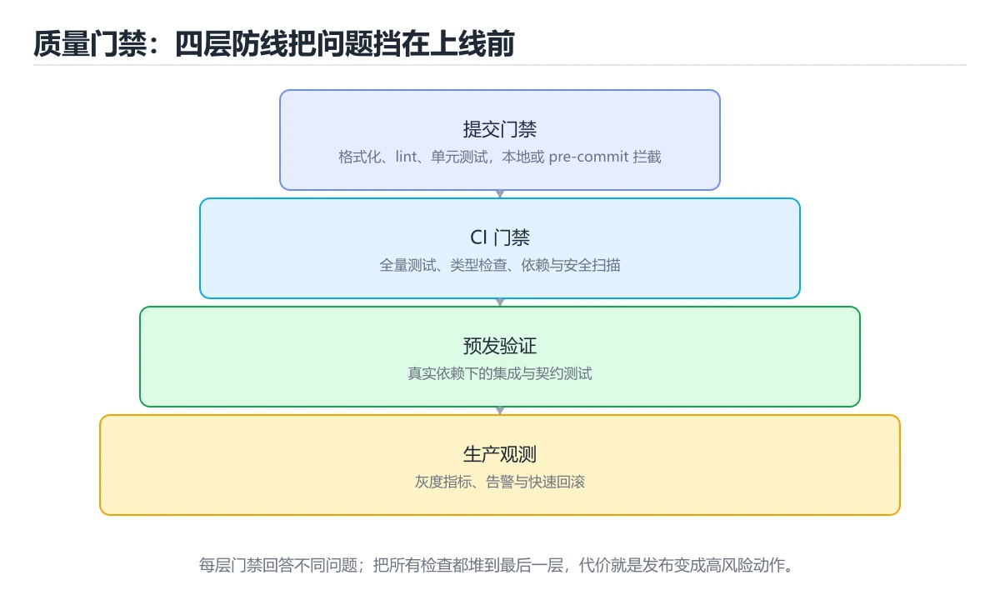
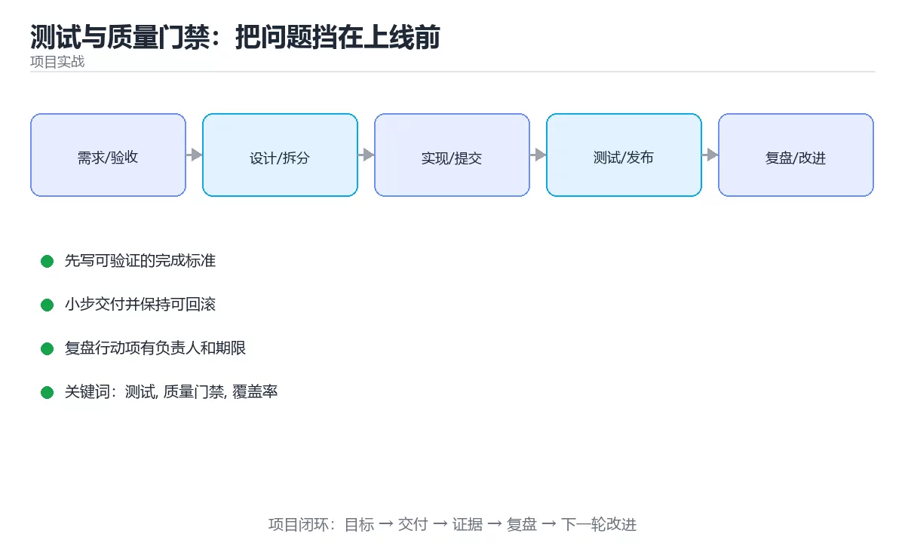

# 测试与质量门禁：把问题挡在上线前





> 内容更新时间：2026-10-03 · 学习阶段：进阶 · 预计用时：20 分钟

## 学习目标

- 能用自己的话解释「测试与质量门禁：把问题挡在上线前」解决了什么问题，而不是只背术语。
- 能说清 「测试」、「质量门禁」、「覆盖率」、「CI」 之间的关系，并分别举出一个例子。
- 能把本课知识放回「项目实战」的知识体系，说明它和相邻主题的边界。
- 能完成本课练习，并用验收标准检查自己的结果。

> 一句话摘要：测试金字塔、四类输入、CI 门禁清单与覆盖率的正确用法。

## 前置知识

- 先完成上一课《编码工作流：小步提交与可评审的改动》；如果已经掌握，可以直接用本课练习自测。
- 本课阶段：进阶。建议先掌握同一分类的基础课程，并能独立运行正文中的最小示例。
- 开始前先复习：测试、质量门禁、覆盖率。
- 如果某一步看不懂，先记录具体卡点，完成练习后再回头读一遍。


## 一句话目标

测试不是为了「覆盖率好看」，而是为了**用最低成本发现最多的问题**。
质量门禁负责把「不合格的改动」挡在合并之前。

## 一张图看懂质量防线

```text
写代码
  │
  ├─① 本地：静态检查 + 单元测试      ← 秒级反馈
  │
  ├─② 提交：pre-commit 钩子          ← 拦住格式与明显错误
  │
  ├─③ PR：CI 全量检查                ← 类型 + 测试 + 构建
  │
  ├─④ 合并前：人工评审               ← 设计与边界
  │
  ├─⑤ 发布前：集成与端到端测试       ← 真实流程
  │
  └─⑥ 发布后：监控与告警             ← 兜底
        │
        ▼
      越靠前越便宜：① 秒级、⑥ 小时级
```

## 测试分层与配比

| 层级 | 数量占比 | 速度 | 覆盖什么 |
| --- | --- | --- | --- |
| 单元测试 | 60%~70% | 毫秒 | 纯逻辑、边界、异常分支 |
| 集成测试 | 20%~30% | 百毫秒 | 模块协作、数据库、接口 |
| 端到端测试 | 5%~10% | 秒到分钟 | 关键用户流程 |
| 性能测试 | 按需 | 分钟 | 延迟与吞吐是否退化 |

**金字塔原则**：底层多而快，顶层少而稳。

## 一个用例该覆盖的四类输入

```text
正常值：      18        → 返回 18
边界值：      0, 150    → 返回 0 与 150
越界值：      -1, 151   → 抛出明确错误
非法格式：    "abc", "" → 抛出明确错误
```

```python
import pytest

@pytest.mark.parametrize(("raw", "expected"), [
    ("18", 18),
    ("0", 0),
    ("150", 150),
])
def test_parse_age_ok(raw, expected):
    assert parse_age(raw) == expected

@pytest.mark.parametrize("raw", ["-1", "151", "abc", ""])
def test_parse_age_invalid(raw):
    with pytest.raises(ValueError):
        parse_age(raw)
```

## CI 门禁清单（可直接照抄）

```yaml
steps:
  - run: npm ci                       # 锁定依赖
  - run: npm run typecheck            # 类型检查
  - run: npm run lint                 # 静态检查
  - run: npm test -- --run --coverage # 单元测试 + 覆盖率
  - run: npm run build                # 构建必须通过
  - run: npm audit --audit-level=high # 高危依赖漏洞
```

| 门禁 | 拦住什么问题 |
| --- | --- |
| 类型检查 | 类型不匹配、空值风险 |
| Lint | 未使用变量、可疑写法 |
| 单元测试 | 逻辑回归 |
| 覆盖率下限 | 新增代码完全没测 |
| 构建 | 打包失败、资源缺失 |
| 依赖扫描 | 已知漏洞 |

**门禁必须客观可修复**：像「代码行数上限」这类规则只会诱发形式主义。

## 覆盖率怎么看才不误导

| 指标 | 含义 | 局限 |
| --- | --- | --- |
| 行覆盖率 | 执行过的行占比 | 无断言也算覆盖 |
| 分支覆盖率 | 每个判断分支是否都走过 | 更能发现漏测 |
| 变异测试 | 故意改代码，测试能否发现 | 最能说明断言质量 |

```text
反例：覆盖率 95%，但断言只有一行
  expect(result).toBeDefined();     // 任何返回值都能通过

正例：覆盖率 80%，但断言具体
  expect(result.total).toBe(288.5);
  expect(result.level).toBe("VIP");
```

## 测试数据的三条纪律

```text
1. 每个用例自己造数据，不依赖别人留下的
2. 用时间戳或随机后缀避免唯一键冲突
3. 用例结束清理，或跑在独立数据库事务里
```

```python
@pytest.fixture
def user(client):
    email = f"u{int(time.time() * 1000)}@example.com"
    created = client.post("/users", json={"email": email}).json()
    yield created
    client.delete(f"/users/{created['id']}")
```

## 新手最容易踩的八个坑

| 坑 | 现象 | 正确做法 |
| --- | --- | --- |
| 只测成功路径 | 线上遇到异常就崩 | 补异常与边界用例 |
| 断言太弱 | 出错也通过 | 断言具体值 |
| 用例互相依赖 | 单独跑就失败 | 每个用例自带准备与清理 |
| 用 sleep 等异步 | 慢且不稳定 | 用等待条件或轮询断言 |
| 依赖真实网络 | 不稳定、慢 | 用替身或本地服务 |
| 覆盖率当目标 | 无效测试增多 | 关注分支与断言质量 |
| 门禁可手动跳过 | 形同虚设 | 关键检查强制阻断 |
| 只在本地跑测试 | CI 环境差异漏掉 | CI 必须全量执行 |

## 本课小结
- 质量靠**层层过滤**：越早发现越便宜。
- 测试的价值在**断言质量**，不在覆盖率数字。
- 门禁要客观、可修复、不可绕过，否则只会被当成障碍。


## 补充：不稳定测试、测试数据与门禁落地

### 不稳定测试（flaky）的四种成因

| 成因 | 表现 | 治理 |
| --- | --- | --- |
| 依赖时间 | 白天过、晚上失败 | 注入时钟或冻结时间 |
| 依赖顺序 | 单独跑过、全量跑失败 | 每个用例自带准备与清理 |
| 依赖外部服务 | 网络抖动就红 | 用替身或本地容器 |
| 依赖并发时序 | 偶发失败、重跑就好 | 用等待条件替代固定 sleep |

```python
# 反例：靠 sleep 等异步结果
do_async()
time.sleep(1)          # 机器慢时就会失败
assert result == 1

# 正例：轮询等待条件，超时才失败
deadline = time.monotonic() + 5
while time.monotonic() < deadline:
    if result_ready():
        break
    time.sleep(0.01)
assert result == 1
```

```text
治理 flaky 的三条纪律
① 失败必须有人跟进：把它当成真 bug，而不是「重跑一次就好」
② 记录 flaky 率：同一用例一周内失败 ≥2 次就列入修复清单
③ 隔离与标记：先 quarantine 避免阻塞流水线，但设定期限必须修复
```

### 测试数据怎么造才可靠

```text
三种数据来源的取舍
  · 固定夹具：稳定但容易与实际数据脱节
  · 工厂函数：每个用例按需构造，推荐
  · 生产快照：最真实，但含隐私信息，必须脱敏
```

```python
# 工厂函数：默认值合理，用例只覆盖关心的字段
def make_user(**overrides):
    data = {"id": next_id(), "name": "测试用户", "active": True}
    data.update(overrides)
    return User(**data)

def test_inactive_user_cannot_login():
    user = make_user(active=False)
    assert login(user) is False
```

### 门禁分三档落地

| 档位 | 检查 | 阻塞合并 |
| --- | --- | --- |
| 必过档 | 类型检查、单元测试、构建 | 是 |
| 建议档 | 覆盖率不低于基线、lint | 是（可设豁免流程） |
| 观察档 | 性能回归、依赖漏洞扫描 | 否（先报警再收紧） |

```text
为什么要有「观察档」
  · 新门禁一上来就阻塞，会引发抵触与绕过
  · 先跑两周收集数据，再决定阈值与是否阻塞
  · 阈值要写进仓库（如 coverage-baseline.txt），而不是口头约定
```

### 让 CI 更快的四个手段

| 手段 | 收益 | 注意 |
| --- | --- | --- |
| 测试分片并行 | 线性缩短时间 | 用例必须相互独立 |
| 只跑受影响范围 | 大幅缩短 | 依赖图要准确 |
| 依赖与构建缓存 | 省下载与编译 | 缓存键包含锁文件哈希 |
| 慢测试单独跑 | 主流水线快速反馈 | 慢测试仍需每日全量执行 |

```bash
# 分片示例：把用例按 shard 索引切分
pytest -n 4 --dist loadscope            # 按模块并行，减少共享状态冲突
pytest --shard-id=1 --num-shards=4      # 四台机器各跑四分之一
```

### 质量指标怎么用才不跑偏

| 指标 | 定义 | 使用建议 |
| --- | --- | --- |
| 缺陷逃逸率 | 上线后发现的缺陷 / 全部缺陷 | 衡量测试有效性 |
| 门禁拦截数 | 被 CI 挡住的失败次数 | 说明门禁在起作用 |
| 平均修复时间 | 从失败到修复合并 | 衡量反馈闭环速度 |
| flaky 率 | 不稳定用例占比 | 高于 2% 就要专项治理 |

**这些指标只用于观察趋势，一旦用于个人考核就会立刻失真。**

### 自查清单

- [ ] 没有用 sleep 等待异步结果的用例
- [ ] flaky 用例有清单与修复期限
- [ ] 测试数据用工厂函数构造，且不含真实隐私数据
- [ ] 门禁分必过/建议/观察三档，而非一刀切
- [ ] 慢测试每日全量执行，不拖慢主流水线

## 动手练习


> 本课练习重点：围绕「测试、质量门禁、覆盖率」完成复述、实验和交付，每个结果都要能被别人检查。

先拆任务和风险，再完成一个可交付增量，最后记录回滚与改进。

### 练习 1：建立心智模型（10 分钟）

合上教程，用 3～5 句话回答：

1. 「测试与质量门禁：把问题挡在上线前」解决了什么问题？
2. 如果没有它，会出现什么具体后果？
3. 它和「质量门禁」是什么关系？

**验收标准**：至少出现一个本课关键词，并写出一个反例、边界条件或失效场景。

### 练习 2：做一次可控实验（20 分钟）

从正文中选一个最小示例，完成以下操作：

1. 先预测修改一个参数、输入或步骤后的结果。
2. 再实际执行或逐步推演，记录真实结果。
3. 如果结果与预测不同，写出差异原因。

**验收标准**：留下「原例 → 改动 → 预测 → 结果 → 原因」五步记录。

### 练习 3：交付一个小结果（30 分钟）

把一个真实小需求拆成任务、验收标准、风险与回滚步骤。

任务要求：

- 结果必须能被别人检查，不能只写“我已经理解了”。
- 至少覆盖「测试」和「质量门禁」两个关键词。
- 写出 1 个仍然不确定的问题，以及下一步如何验证。

> 提示：时间有限时优先做练习 1 和练习 2；练习 3 可以拆成两次完成。


## 验证命令与预期输出

项目代码不能只看“能编译”，还要能按固定命令复现结果。下表给出最低验证集：

| 阶段 | 命令 | 预期输出 |
| --- | --- | --- |
| 安装依赖 | `python -m pip install -r requirements.txt` | 依赖安装完成，没有版本冲突 |
| 语法检查 | `python -m compileall .` | 所有模块编译通过 |
| 运行测试 | `python -m pytest -q` | 测试全部通过，失败用例数为 0 |
| 启动示例 | `python main.py` | 服务启动并输出监听地址 |

### 验收证据

- [ ] 保存依赖安装和启动命令的完整输出。
- [ ] 至少运行 3 条测试，其中包含一条非法输入或失败路径。
- [ ] 重复执行同一操作两次，确认没有重复写入或副作用。
- [ ] 记录一次失败状态码、错误日志和恢复步骤。
- [ ] 在 README 中写明环境版本、启动方式和回滚方式。

### 回归与回滚

1. 先在一个可丢弃的目录或临时数据库执行，避免污染真实数据。
2. 修改一处逻辑后重跑全部验证命令，确认没有回归。
3. 若失败，回滚到上一个可运行版本并保留失败日志。
4. 定位原因后补一条自动化测试，再重新执行发布流程。
5. 把教训写入项目复盘或本课笔记，形成下一次的检查项。


## 可运行练习

下面 3 个任务围绕“测试与质量门禁：把问题挡在上线前”展开，代码可以直接粘贴到 App 的离线沙箱里运行；如果示例会读取标准输入，请按代码注释在沙箱的 stdin 区域填入同样格式的数据。

### 任务 1：先跑通，再解释

```python
import pytest

@pytest.mark.parametrize(("raw", "expected"), [
    ("18", 18),
    ("0", 0),
    ("150", 150),
])
def test_parse_age_ok(raw, expected):
    assert parse_age(raw) == expected

@pytest.mark.parametrize("raw", ["-1", "151", "abc", ""])
def test_parse_age_invalid(raw):
    with pytest.raises(ValueError):
        parse_age(raw)
```

**预期输出**：运行后会输出与“测试与质量门禁：把问题挡在上线前”相关的关键结果；请重点核对输出行数、最后一个数值和异常提示。

**验收标准**：代码能正常运行；逐行解释每个变量的值如何变化，并指出哪一行决定了最终结果。

### 任务 2：只改一个条件

复制上面的代码，只修改一个输入、边界或参数（例如空值、最大值、循环次数、过滤条件），先写出你的预测，再实际运行。

**验收标准**：留下“原结果 → 改动 → 预测 → 实际结果 → 差异原因”五步记录；如果预测错误，要写出修正后的心智模型。

### 任务 3：迁移到自己的数据

用同一套思路处理一组你自己的数据或场景，保持输出格式与任务 1 一致。

**验收标准**：代码不少于 10 行，至少包含 1 个边界检查；把代码和运行结果保存到笔记或片段库。


## 故障现场

这一节把“测试与质量门禁：把问题挡在上线前”最常见的失败方式还原成现场记录，练习时按“症状 → 复现 → 定位 → 修复 → 预防”的顺序排查。

### 现场 1：“测试与质量门禁：把问题挡在上线前”的 测试 常规用例通过，但边界用例失败

**症状**：在“测试与质量门禁：把问题挡在上线前”的练习或生产场景里出现““测试与质量门禁：把问题挡在上线前”的 测试 常规用例通过，但边界用例失败”。

**复现**：准备一组最小输入，只保留触发““测试与质量门禁：把问题挡在上线前”的 测试 常规用例通过，但边界用例失败”的必要条件，连续运行两次确认结果稳定。

**定位**：围绕“测试 的前置条件与取值边界没有写进代码，默认值掩盖了空值和极值”检查调用链、输入数据和环境配置，先验证假设再改代码。

**修复**：为“测试与质量门禁：把问题挡在上线前”补一条空值或极值用例，把前置条件写成断言，并让失败信息直接指出是哪个输入越界

**预防**：把““测试与质量门禁：把问题挡在上线前”的 测试 常规用例通过，但边界用例失败”写成一条自动化用例，并在“测试与质量门禁：把问题挡在上线前”的验收清单里保留对应检查项。


### 现场 2：“测试与质量门禁：把问题挡在上线前”的 质量门禁 结果在两次运行之间不一致

**症状**：在“测试与质量门禁：把问题挡在上线前”的练习或生产场景里出现““测试与质量门禁：把问题挡在上线前”的 质量门禁 结果在两次运行之间不一致”。

**复现**：准备一组最小输入，只保留触发““测试与质量门禁：把问题挡在上线前”的 质量门禁 结果在两次运行之间不一致”的必要条件，连续运行两次确认结果稳定。

**定位**：围绕“质量门禁 依赖了当前版本、执行顺序或共享状态，单次运行无法暴露差异”检查调用链、输入数据和环境配置，先验证假设再改代码。

**修复**：固定“测试与质量门禁：把问题挡在上线前”使用的版本与随机种子，记录两次运行的完整输入和输出，再逐项消除非确定性来源

**预防**：把““测试与质量门禁：把问题挡在上线前”的 质量门禁 结果在两次运行之间不一致”写成一条自动化用例，并在“测试与质量门禁：把问题挡在上线前”的验收清单里保留对应检查项。


### 现场 3：“测试与质量门禁：把问题挡在上线前”的验证只在开发机通过

**症状**：在“测试与质量门禁：把问题挡在上线前”的练习或生产场景里出现““测试与质量门禁：把问题挡在上线前”的验证只在开发机通过”。

**复现**：准备一组最小输入，只保留触发““测试与质量门禁：把问题挡在上线前”的验证只在开发机通过”的必要条件，连续运行两次确认结果稳定。

**定位**：围绕“环境版本、配置和输入规模与目标环境不同，测试 缺少可重复的验证记录”检查调用链、输入数据和环境配置，先验证假设再改代码。

**修复**：把“测试与质量门禁：把问题挡在上线前”的运行环境、输入样本和预期输出写成清单，并在另一套环境复跑同一条命令

**预防**：把““测试与质量门禁：把问题挡在上线前”的验证只在开发机通过”写成一条自动化用例，并在“测试与质量门禁：把问题挡在上线前”的验收清单里保留对应检查项。


## 考点精讲：把测验题还原成判断过程

本课有 5 个判断点。先自己作答，再看「判断依据」；如果结论正确但理由不完整，回到正文对应章节补足概念。

### 考点 1：测试金字塔中数量配比最合理的是？

- **正确判断**：单元最多，集成次之，端到端最少
- **判断依据**：正确答案是「单元最多，集成次之，端到端最少」，本课在「项目专属规格：测试与质量门禁：把问题挡在上线前」中说明：测试金字塔、四类输入、CI 门禁清单与覆盖率的正确用法。底层测试快而稳定，应写得最多。本课还在「一句话目标」中说明：质量门禁负责把「不合格的改动」挡在合并之前。本课还在「一句话目标」中说明：测试不是为了「覆盖率好看」，而是为了用最低成本发现最多的问题。
- **迁移检查**：遮住选项，只根据定义复述一次答案，再回来看哪个选项与复述一致。

### 考点 2：对一个「年龄解析」函数，下面哪组用例最完整？

- **正确判断**：测正常值、边界值、越界值与非法格式
- **判断依据**：正确答案是「测正常值、边界值、越界值与非法格式」，本课在「一句话目标」中说明：质量门禁负责把「不合格的改动」挡在合并之前。四类输入覆盖了输入空间的代表点。本课还在「项目专属规格：测试与质量门禁：把问题挡在上线前」中说明：测试金字塔、四类输入、CI 门禁清单与覆盖率的正确用法。本课还在「一句话目标」中说明：测试不是为了「覆盖率好看」，而是为了用最低成本发现最多的问题。
- **迁移检查**：把题干里的一个条件换成边界值，原来的结论还成立吗？写出判断过程。

### 考点 3：行覆盖率达到 95% 却仍有漏测，最可能的原因是？

- **正确判断**：断言太弱
- **判断依据**：正确答案是「断言太弱」，本课在「CI 门禁清单（可直接照抄）」中说明：门禁必须客观可修复：像「代码行数上限」这类规则只会诱发形式主义。没有断言的执行同样计入覆盖率，这就是弱断言拉高数字的原因。本课还在「本课小结」中说明：门禁要客观、可修复、不可绕过，否则只会被当成障碍。本课还在「补充：不稳定测试、测试数据与门禁落地」中说明：测试数据用工厂函数构造，且不含真实隐私数据。
- **迁移检查**：把题干里的一个条件换成边界值，原来的结论还成立吗？写出判断过程。

### 考点 4：质量门禁的设计原则是？

- **正确判断**：客观、可修复、不可随意绕过
- **判断依据**：正确答案是「客观、可修复、不可随意绕过」，本课在「本课小结」中说明：门禁要客观、可修复、不可绕过，否则只会被当成障碍。门禁必须能被客观判定、开发者能修好、且不能轻易跳过。本课还在「CI 门禁清单（可直接照抄）」中说明：门禁必须客观可修复：像「代码行数上限」这类规则只会诱发形式主义。
- **迁移检查**：如果给某个错误选项去掉一个限定词，它会不会变成正确？说明理由。

### 考点 5：补全代码：「测试与质量门禁：把问题挡在上线前」示例中，下面这行代码缺少哪个关键字或函数名？请填入 ____。 `"project": "____",`

- **正确判断**：project_testing_quality
- **判断依据**：正确答案是「project_testing_quality」，这道题在问补全代码：测试与质量门禁：把问题挡在上线前示例中，下…，`"project":"____",`，判断时要把题干限定的输入、边界与目标逐项对齐。本课示例中还能看到 `"project": "project_testing_quality",` 这样的用法，说明该关键字在本课代码中承担实际功能。
- **迁移检查**：不看题干，用自己的话补全这句话，再与标准答案对照。

### 补充自测（2 题）

1. 围绕“测试与质量门禁：把问题挡在上线前”中的 测试、质量门禁、覆盖率，下列哪两项是本课强调的实践判断？
2. 下面这段 Python 代码复现了“测试与质量门禁：把问题挡在上线前”中 测试、质量门禁、覆盖率 相关的一个常见故障，哪一项最准确地解释了问题？

这些题按“先定位概念、再排除边界错误、最后核对答案”的顺序作答；每题解析都给出了判断依据。


## 本课复习清单

离开本课前，逐项确认：

- [ ] 不看解析，能说出「测试金字塔中数量配比最合理的是？」的判断依据。
- [ ] 不看解析，能说出「对一个「年龄解析」函数，下面哪组用例最完整？」的判断依据。
- [ ] 不看解析，能说出「行覆盖率达到 95% 却仍有漏测，最可能的原因是？」的判断依据。
- [ ] 不看解析，能说出「质量门禁的设计原则是？」的判断依据。
- [ ] 不看解析，能说出「补全代码：「测试与质量门禁：把问题挡在上线前」示例中，下面这行代码缺少哪个关键字…」的判断依据。
- [ ] 至少运行一次本课示例，记录输入、输出和一个边界情况。
- [ ] 把本课最容易混淆的两个概念写成一句话对照。

| 复盘项 | 记录 |
| --- | --- |
| 已经能独立解释的考点 |  |
| 仍然说不清的概念 |  |
| 下一步验证动作 |  |

## 术语速查

把本课反复出现的术语集中放在一起。复习时先遮住右列，尝试用自己的话解释，再回到正文核对。

| 术语 | 本课语境 |
| --- | --- |
| `python -m compileall .` | \| 语法检查 \| `python -m compileall .` \| 所有模块编译通过 \| |
| `python -m pytest -q` | \| 运行测试 \| `python -m pytest -q` \| 测试全部通过，失败用例数为 0 \| |
| `python main.py` | \| 启动示例 \| `python main.py` \| 服务启动并输出监听地址 \| |
| `"project":"____",` | 判断依据**：正确答案是「project_testing_quality」，这道题在问补全代码：测试与质量门禁：把问题挡在上线前示例中，下…，`"project":"____",`，判断时要把题干限定的输入、边界与目标逐… |

## 面试问答与自测

下面把本课考点换成面试追问。先口述自己的答案，
再对照参考回答检查是否遗漏了前提、边界或失败路径。

### 追问 1：测试金字塔中数量配比最合理的是？

**参考回答**：正确答案是「单元最多，集成次之，端到端最少」，本课在「项目专属规格·测试与质量门禁·把问题挡在上线前」中说明：测试金字塔、四类输入、CI 门禁清单与覆盖率的正确用法。底层测试快而稳定，应写得最多。本课还在「一句话目标」中说明：质量门禁负责把「不合格的改动」挡在合并之前。本课还在「一句话目标」中说明：测试不是为了「覆盖率好看」，而是为了用最低成本发现最多的问题。

### 追问 2：对一个「年龄解析」函数，下面哪组用例最完整？

**参考回答**：正确答案是「测正常值、边界值、越界值与非法格式」，本课在「一句话目标」中说明：质量门禁负责把「不合格的改动」挡在合并之前。四类输入覆盖了输入空间的代表点。本课还在「项目专属规格·测试与质量门禁·把问题挡在上线前」中说明：测试金字塔、四类输入、CI 门禁清单与覆盖率的正确用法。本课还在「一句话目标」中说明：测试不是为了「覆盖率好看」，而是为了用最低成本发现最多的问题。

### 追问 3：行覆盖率达到 95% 却仍有漏测，最可能的原因是？

**参考回答**：正确答案是「断言太弱」，本课在「CI 门禁清单（可直接照抄）」中说明：门禁必须客观可修复：像「代码行数上限」这类规则只会诱发形式主义。没有断言的执行同样计入覆盖率，这就是弱断言拉高数字的原因。本课还在「本课小结」中说明：门禁要客观、可修复、不可绕过，否则只会被当成障碍。本课还在「补充·不稳定测试、测试数据与门禁落地」中说明：测试数据用工厂函数构造，且不含真实隐私数据。

### 追问 4：质量门禁的设计原则是？

**参考回答**：正确答案是「客观、可修复、不可随意绕过」，本课在「本课小结」中说明：门禁要客观、可修复、不可绕过，否则只会被当成障碍。门禁必须能被客观判定、开发者能修好、且不能轻易跳过。本课还在「CI 门禁清单（可直接照抄）」中说明：门禁必须客观可修复：像「代码行数上限」这类规则只会诱发形式主义。

### 追问 5：补全代码：「测试与质量门禁：把问题挡在上线前」示例中，下面这行代码缺少哪个关键字或函数名？请填入 ____。 `"project": "____",`

**参考回答**：正确答案是「project_testing_quality」，这道题在问补全代码：测试与质量门禁：把问题挡在上线前示例中，下…，`"project":"____",`，判断时要把题干限定的输入、边界与目标逐项对齐。本课示例中还能看到 `"project": "project_testing_quality",` 这样的用法，说明该关键字在本课代码中承担实际功能。

## English Overview

**Title:** Testing and Quality Gates

**Summary:** Test pyramid, CI gates and how to read coverage.

**Category:** Project Practice  
**Level:** 进阶  
**Key terms:** 测试, 质量门禁, 覆盖率, CI, 边界值

> The full tutorial is written in Chinese. This bilingual overview helps English readers identify the topic, scope and key terms before studying the detailed examples.

## 内容元数据

- 内容版本：v2.0
- 最后更新：2026-10-03
- 学习阶段：进阶
- 适用环境：通用项目交付流程
- 内容来源：内置结构化课程与工程实践整理
- 相关主题：测试、质量门禁、覆盖率、CI、边界值
- 质量版本：P0 测验标准 + P1 覆盖扩展 + P2 体验补全

## 项目专属规格：测试与质量门禁：把问题挡在上线前

### 核心场景

测试金字塔、四类输入、CI 门禁清单与覆盖率的正确用法。 项目目标是把「测试、质量门禁、覆盖率、CI、边界值」落实为可运行、可测试、可回滚的交付物。

### 架构与数据流

```text
用户/输入 → 接口或命令 → 领域逻辑 → 存储/外部依赖 → 输出与监控
                         ↘ 失败分类 → 重试/补偿 → 回滚
```

### 最小数据模型

| 对象 | 关键字段 | 约束 |
| --- | --- | --- |
| 输入实体 | 测试、时间、来源 | 必填校验、长度限制、幂等键 |
| 任务实体 | 状态、优先级、创建时间 | 状态迁移合法、不可重复执行 |
| 结果实体 | 输出、错误码、耗时 | 可序列化、错误可解释 |
| 审计记录 | 操作者、动作、结果、时间 | 不可篡改、可查询、脱敏 |

### 验收场景

1. 正常路径：最小输入得到预期输出，并留下日志与指标。
2. 边界路径：空值、最大值、重复数据和超长内容得到明确处理。
3. 失败路径：依赖超时或不可用时能快速失败、重试或降级。
4. 幂等路径：同一请求执行两次不会产生重复副作用。
5. 回滚路径：回滚后数据一致，且能说明恢复时间和影响范围。


## 项目交付物

### 建议仓库结构

```text
src/
tests/
docs/
README.md
```

### 测试矩阵

| 层级 | 覆盖内容 | 最低数量 | 通过标准 |
| --- | --- | ---: | --- |
| 单元测试 | 领域规则、边界和错误分类 | 8 | 正常、边界、失败路径全部通过 |
| 集成测试 | 数据库、网络、文件或平台边界 | 3 | 使用真实边界且可重复运行 |
| 端到端测试 | 核心用户路径 | 1 | 从输入到输出完整跑通 |
| 手动验收 | 文档中列出的 5 个场景 | 5 | 有命令、输出和结论记录 |

### 验收数据

```json
{
  "project": "project_testing_quality",
  "input": {"case": "normal", "value": 5},
  "expected": {"ok": true, "result": 5},
  "failure_case": {"value": -1, "error": "validation_error"},
  "idempotency_key": "demo-001"
}
```

### 复盘模板

| 问题 | 记录 |
| --- | --- |
| 原目标是什么？ | 用一句话描述可验收目标 |
| 实际发生了什么？ | 时间线、指标和关键日志 |
| 哪个假设被推翻？ | 根因与促成因素 |
| 如何回滚？ | 步骤、耗时和数据校验 |
| 下一步做什么？ | 负责人、期限和验证方式 |

> 项目验收围绕「测试、质量门禁、覆盖率」：至少完成一次正常路径、一次边界输入、一次失败恢复和一次幂等检查。


## 参考资料与复核

- 最后复核：2026-10-04
- 下次复核：2027-04-04
- 复核范围：版本兼容、API 行为、安全建议与工程实践
- 来源性质：官方文档与标准；本课正文为离线教学重组，不复制原文

| 参考资料 | 本课用途 |
| --- | --- |
| [The Twelve-Factor App](https://12factor.net/) | 可部署应用原则 |
| [Google SRE Books](https://sre.google/books/) | 可观测性与发布工程 |

> 本课主题：测试金字塔、四类输入、CI 门禁清单与覆盖率的正确用法。

> App 完全离线展示文字链接，不会自动联网；需要延伸阅读时可复制链接到浏览器。
