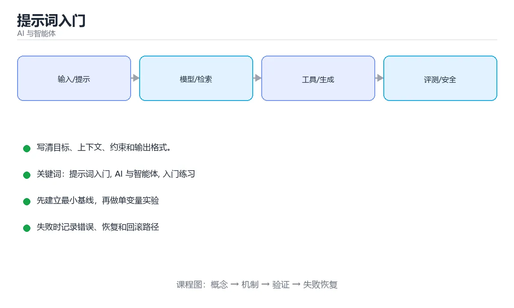

# 提示词入门



> 内容更新时间：2026-10-03 · 学习阶段：入门 · 预计用时：15 分钟

## 学习目标

- 先认识「提示词入门」需要的工具、输入和输出。
- 按步骤运行最小示例，并记录结果与错误。
- 用一个边界输入验证自己是否真正掌握。

## 前置知识

- 会进行基本的文件或命令行操作。
- 不需要预先掌握「AI 与智能体」的高级知识。

## 一句话入门

写清目标、上下文、约束和输出格式。

## 最小示例

```python
prompt = {
    "任务": "把反馈分类为 bug 或 feature",
    "约束": "只输出 JSON",
    "输出格式": {"type": "bug | feature"},
}
print(prompt["任务"], prompt["约束"], prompt["输出格式"]["type"], sep=" | ")
```

## 预期输出

```text
把反馈分类为 bug 或 feature | 只输出 JSON | bug | feature
```

## 常见错误

- 输入或环境与示例不一致，导致结果不符合预期。
- 复制命令时遗漏空格、引号或必要参数。

## 动手练习

1. 原样运行最小示例，保存命令和输出。
2. 把数字 2 改成 10，预测并验证新结果。
3. 制造一个错误输入，写出错误信息和修复方法。

## 本课小结

- 入门阶段先保证能运行、能观察、能解释，再追求复杂功能。
- 每次只改一个变量，记录预测与实际结果。
- 遇到错误先看第一条错误信息，再回到最小示例。


## 一个可靠提示词的六个部件

提示词不是“对模型说一句聪明话”，而是把任务规格写成模型可执行的输入。最实用的结构包含六部分：角色或视角、任务目标、必要上下文、约束条件、示例和输出格式。角色用于限定知识范围，任务说明要使用可验证的动词，例如“提取、分类、改写、比较”，而不是“帮我看看”。上下文只放完成任务真正需要的信息，约束则写清不能做什么、优先满足什么、遇到冲突如何处理。

输出格式决定了结果能否被程序稳定消费。要求模型返回 JSON 时，应给出字段名、类型、是否允许为空和示例；要求返回列表时，应说明数量上限和排序规则。示例能显著降低歧义，但示例必须与目标分布一致，否则模型会过度模仿示例的表面形式。对于长任务，可以拆成“先分析、再生成、最后自检”的多步提示，每一步只保留必要上下文，减少无关信息干扰。

提示词质量不能靠感觉判断。先建立一个包含典型输入和边界输入的小型评测集，为每个样本写出可接受标准，再比较不同提示词的成功率、格式合规率和失败类型。温度、最大长度、工具权限和模型版本都会影响结果，因此改动一次只调整一个变量，并记录原始输出，才能知道改进来自哪里。

## 从一次提示到可评测流程

常见失败包括目标含糊、上下文缺失、约束互相矛盾、示例泄露答案和输出格式不稳定。遇到这些问题时，先看模型是否理解了任务，再看它是否缺少必要信息，最后才怀疑模型能力。把失败样本归入“理解错误、信息不足、推理错误、格式错误、安全拒绝”等类别，可以有针对性地修改提示词或系统设计。

当提示词接入真实系统时，还要考虑提示注入、数据泄露、工具调用越权和成本失控。外部文档、网页和用户输入都可能包含“忽略之前指令”之类的内容，因此系统提示必须把数据当作数据，不允许它覆盖规则。高风险操作应经过校验、权限检查和人工确认；模型输出在写数据库、执行命令或发送消息之前，必须按业务规则再验证一次。

一个可复述的练习是：为“把用户反馈分类并提取问题”写三版提示词，第一版只有任务，第二版加入上下文和约束，第三版加入 JSON 格式与两个示例。然后用同一组 10 条反馈跑三版，统计准确率和格式错误，最后写出每版失败的原因。这样你会把提示词从“话术”变成可迭代的工程对象。

## 代码实验：把示例跑成证据

这一节不引入新语法，而是把「提示词入门」的最小示例变成可以复现、可以对照的实验。每次只改变一个条件，先写预测，再运行，最后解释差异。

### 实验一：建立基线

```python
prompt = {
    "任务": "把反馈分类为 bug 或 feature",
    "约束": "只输出 JSON",
    "输出格式": {"type": "bug | feature"},
}
print(prompt["任务"], prompt["约束"], prompt["输出格式"]["type"], sep=" | ")
```

先原样运行上面的代码，记录命令、完整输出和退出状态。然后把输出与正文的预期输出逐字对照，不要用“看起来差不多”代替核对；空格、大小写、换行和错误流向都可能暴露环境差异。

### 实验二：只改一个输入

从代码中选一个会影响结果的字面量、参数或输入，把它替换成边界值：数值可尝试 0、1、最大值和最小值，字符串可尝试空串和超长文本，集合可尝试空集合、单元素和重复元素。先写出预测，再运行并记录实际结果。

### 实验三：制造一个可控错误

把复合语句末尾的冒号删掉，或者把字符串直接参与数值运算。先记录解释器报出的第一行错误和行号，再修复并重跑基线。

| 实验 | 改动 | 预测 | 实际 | 结论 |
| --- | --- | --- | --- | --- |
| 基线 | 保持原样 |  |  |  |
| 边界 |  |  |  |  |
| 失败 |  |  |  |  |

### 实验四：用三句话复述

1. 输入是什么，哪些输入属于合法范围，哪些属于边界或非法范围？
2. 程序按什么顺序处理输入，在哪一步产生了状态变化或副作用？
3. 输出如何验证，失败时第一条可观察证据是什么？

## 考点精讲：把测验题还原成判断过程

本课有 5 个判断点。先自己作答，再看「判断依据」；如果结论正确但理由不完整，回到正文对应章节补足概念。

### 考点 1：一条结构清晰的提示词通常包含哪些要素？

- **正确判断**：目标、上下文、约束条件与期望的输出格式
- **判断依据**：正确答案是「目标、上下文、约束条件与期望的输出格式」，本课在「一个可靠提示词的六个部件」中说明：最实用的结构包含六部分：角色或视角、任务目标、必要上下文、约束条件、示例和输出格式。明确目标让模型知道要做什么，上下文补充背景与素材，约束限定范围与禁止事项，输出格式则规定结果的结构，四者组合能显著提升可用性。本课还在「从一次提示到可评测流程」中说明：常见失败包括目标含糊、上下文缺失、约束互相矛盾、示例泄露答案和输出格式不稳定。
- **迁移检查**：遮住选项，只根据定义复述一次答案，再回来看哪个选项与复述一致。

### 考点 2：示例中 prompt 字典的三个字段分别对应提示词的什么部分？

- **正确判断**：任务目标、约束条件与期望的输出格式
- **判断依据**：正确答案是「任务目标、约束条件与期望的输出格式」，本课在「一个可靠提示词的六个部件」中说明：最实用的结构包含六部分：角色或视角、任务目标、必要上下文、约束条件、示例和输出格式。示例把任务、约束与输出格式写成结构化字段，再拼成一段提示文本，体现了「先想清楚要求再交给模型」的思路。本课还在「一个可靠提示词的六个部件」中说明：先建立一个包含典型输入和边界输入的小型评测集，为每个样本写出可接受标准，再比较不同提示词的成功率、格式合规率和失败类型。
- **迁移检查**：遮住选项，只根据定义复述一次答案，再回来看哪个选项与复述一致。

### 考点 3：为什么在提示词中明确输出格式很有价值？

- **正确判断**：便于程序解析与校验，也减少无关内容
- **判断依据**：正确答案是「便于程序解析与校验，也减少无关内容」，本课在「一个可靠提示词的六个部件」中说明：对于长任务，可以拆成“先分析、再生成、最后自检”的多步提示，每一步只保留必要上下文，减少无关信息干扰。指定格式后，结果更容易被程序解析、比较与校验，例如要求只输出 JSON 或固定字段。本课还在「从一次提示到可评测流程」中说明：常见失败包括目标含糊、上下文缺失、约束互相矛盾、示例泄露答案和输出格式不稳定。本课还在「从一次提示到可评测流程」中说明：一个可复述的练习是：为“把用户反馈分类并提取问题”写三版提示词，第一版只有任务，第二版加入上下文和约束，第三版加入 JSON 格式与两个示例。
- **迁移检查**：如果给某个错误选项去掉一个限定词，它会不会变成正确？说明理由。

### 考点 4：拿到不理想的模型输出后，合理的下一步是？

- **正确判断**：根据偏差补充约束与示例，调整提示词后再验证
- **判断依据**：正确答案是「根据偏差补充约束与示例，调整提示词后再验证」，本课在「从一次提示到可评测流程」中说明：模型输出在写数据库、执行命令或发送消息之前，必须按业务规则再验证一次。提示词迭代是把模糊要求逐步显式化的过程：分析输出与预期的差距，补充边界条件、反例或格式示例，再重新验证并记录有效写法。本课还在「一个可靠提示词的六个部件」中说明：提示词不是“对模型说一句聪明话”，而是把任务规格写成模型可执行的输入。
- **迁移检查**：把题干里的一个条件换成边界值，原来的结论还成立吗？写出判断过程。

### 考点 5：以下哪些术语与「提示词入门」直接相关？（多选）

- **正确判断**：提示词入门、AI 与智能体
- **判断依据**：正确答案是「提示词入门、AI 与智能体」，本课在「从一次提示到可评测流程」中说明：把失败样本归入“理解错误、信息不足、推理错误、格式错误、安全拒绝”等类别，可以有针对性地修改提示词或系统设计。本课还在「从一次提示到可评测流程」中说明：当提示词接入真实系统时，还要考虑提示注入、数据泄露、工具调用越权和成本失控。本课还在「从一次提示到可评测流程」中说明：这样你会把提示词从“话术”变成可迭代的工程对象。
- **迁移检查**：每个正确项各自成立的条件是什么？有没有互相依赖。

## 本课复习清单

离开本课前，逐项确认：

- [ ] 不看解析，能说出「一条结构清晰的提示词通常包含哪些要素？」的判断依据。
- [ ] 不看解析，能说出「示例中 prompt 字典的三个字段分别对应提示词的什么部分？」的判断依据。
- [ ] 不看解析，能说出「为什么在提示词中明确输出格式很有价值？」的判断依据。
- [ ] 不看解析，能说出「拿到不理想的模型输出后，合理的下一步是？」的判断依据。
- [ ] 不看解析，能说出「以下哪些术语与「提示词入门」直接相关？（多选）」的判断依据。
- [ ] 至少运行一次本课示例，记录输入、输出和一个边界情况。
- [ ] 把本课最容易混淆的两个概念写成一句话对照。

| 复盘项 | 记录 |
| --- | --- |
| 已经能独立解释的考点 |  |
| 仍然说不清的概念 |  |
| 下一步验证动作 |  |

## 逐节复习与自检

下面按正文顺序回顾每一节，并给出一个自检问题；说不清的地方回到原章节补课。

### 最小示例

```python
prompt = {
    "任务": "把反馈分类为 bug 或 feature",
    "约束": "只输出 JSON",
    "输出格式": {"type": "bug | feature"},
}
print(prompt["任务"], prompt["约束"], prompt["输出格式"]["type"], sep=" | ")
```

自检：这一节与相邻主题的边界在哪里？

### 预期输出

```text
把反馈分类为 bug 或 feature | 只输出 JSON | bug | feature
```

自检：这一节与相邻主题的边界在哪里？

### 常见错误

输入或环境与示例不一致，导致结果不符合预期。

自检：把这一节讲给没学过的人，最需要强调哪一点？

### 动手练习

把数字 2 改成 10，预测并验证新结果。制造一个错误输入，写出错误信息和修复方法。

自检：如果去掉这一节里的一个前提，结论会怎样变化？

### 一个可靠提示词的六个部件

提示词不是“对模型说一句聪明话”，而是把任务规格写成模型可执行的输入。最实用的结构包含六部分：角色或视角、任务目标、必要上下文、约束条件、示例和输出格式。

自检：把这一节讲给没学过的人，最需要强调哪一点？

### 从一次提示到可评测流程

常见失败包括目标含糊、上下文缺失、约束互相矛盾、示例泄露答案和输出格式不稳定。遇到这些问题时，先看模型是否理解了任务，再看它是否缺少必要信息，最后才怀疑模型能力。

自检：把这一节讲给没学过的人，最需要强调哪一点？

## English Overview

**Title:** Prompting Basics

**Summary:** Specify goal, context, constraints and format.

**Category:** AI & Agents  
**Level:** 基础  
**Key terms:** 提示词入门, AI 与智能体, 入门练习

> The full tutorial is written in Chinese. This bilingual overview helps English readers identify the topic, scope and key terms before studying the detailed examples.

## 内容元数据

- 内容版本：v2.0
- 最后更新：2026-10-03
- 学习阶段：基础
- 适用环境：主流大模型 API、开源模型与向量数据库
- 内容来源：内置结构化课程与工程实践整理
- 相关主题：提示词入门、AI 与智能体、入门练习
- 质量版本：P0 测验标准 + P1 覆盖扩展 + P2 体验补全


## 参考资料与复核

- 最后复核：2026-10-04
- 下次复核：2027-04-04
- 复核范围：版本兼容、API 行为、安全建议与工程实践
- 来源性质：官方文档与标准；本课正文为离线教学重组，不复制原文

| 参考资料 | 本课用途 |
| --- | --- |
| [OpenAI Docs](https://platform.openai.com/docs/) | 模型 API、工具与评估 |
| [Hugging Face Docs](https://huggingface.co/docs) | 模型、数据集与推理 |
| [Model Context Protocol](https://modelcontextprotocol.io/) | Agent 工具与上下文协议 |

> 本课主题：写清目标、上下文、约束和输出格式。

> App 完全离线展示文字链接，不会自动联网；需要延伸阅读时可复制链接到浏览器。
