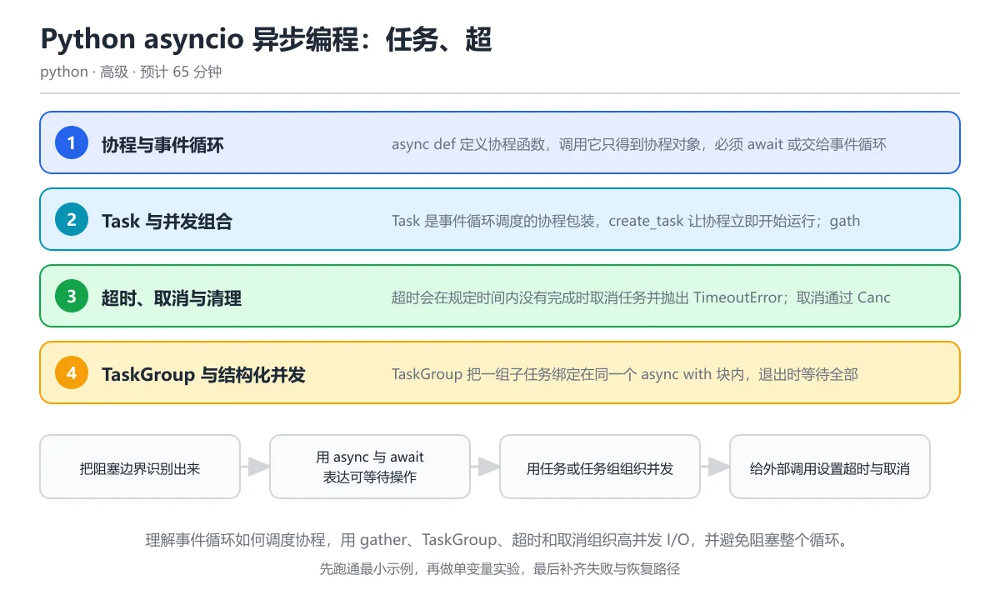

# Python asyncio 异步编程：任务、超时与取消

> 内容更新时间：2026-10-06 · 学习阶段：高级 · 预计用时：55 分钟

分类：python。关键词：asyncio、协程、TaskGroup、取消、超时。理解事件循环如何调度协程，用 gather、TaskGroup、超时和取消组织高并发 I/O，并避免阻塞整个循环。

学习建议：先通读《Python asyncio 异步编程：任务、超时与取消》的核心知识与关键流程，再运行可运行练习并完成测验；遇到不确定的结论，回到「故障现场」按症状、根因、修复、验证四步核对。



## 本节知识框架

**课程定位**：所属分类为「Python」，课程主题为「Python asyncio 异步编程：任务、超时与取消」，学习阶段为「高级」，建议用时 55 分钟。

**本课要解决的主问题**：理解事件循环如何调度协程，用 gather、TaskGroup、超时和取消组织高并发 I/O，并避免阻塞整个循环。

| 学习层次 | 要回答的问题 | 完成判据 |
| --- | --- | --- |
| 概念层 | 「Python asyncio 异步编程：任务、超时与取消」有哪些必须区分的对象与术语？ | 能用自己的话定义核心术语，并各举一个正例和一个反例。 |
| 机制层 | 这些对象按什么顺序发生作用，输入如何变成输出？ | 能画出或写出机制步骤，并说明每一步的失败条件。 |
| 应用层 | 什么场景适合使用「Python asyncio 异步编程：任务、超时与取消」，什么场景不适合？ | 能给出一个真实场景、一个最小示例和一个边界案例。 |
| 性能层 | 时间、空间、吞吐或延迟受哪些量影响？ | 能说出复杂度或性能瓶颈的证据来源；没有证据时明确写“材料未提供”。 |
| 复习层 | 怎样确认自己不是只记住了结论？ | 能独立完成本课自测，并把错误定位到概念、机制、示例或边界。 |

### 阅读路线

1. 先读「核心概念定义」，建立「asyncio」等对象的精确定义。
2. 再读「原理与运行机制」，把定义串成可重复的过程。
3. 用「代码/协议/SQL 示例」验证过程，并只改一个条件观察结果变化。
4. 最后检查性能、易错点、知识关系与自测题，形成可复习的证据链。

**前置知识**：《并发与异步》

**学习位置**：本课位于《Python 并发模型、GIL 与线程进程选型》之后；如果前一课的自测不能通过，应先回补再继续。

**后续衔接**：下一课《Python 数据库与 SQLAlchemy 2.x》会继续使用本课术语，学完后建议立即完成一次自测。

**教材衔接：学习目标**

- 能解释协程、Task 与事件循环之间的关系。
- 能用 gather 与 TaskGroup 并发执行并正确传播异常。
- 能实现可取消、带超时和重试边界的异步流程。

**教材衔接：前置知识**

- 会定义和调用普通函数，理解生成器与迭代。
- 知道线程并发和 I/O 阻塞的基本概念。
- 能读懂 async 与 await 语法的简单示例。

**教材衔接：本课小结**

- Python asyncio 异步编程：任务、超时与取消围绕asyncio、协程、TaskGroup展开，先建立基线再讨论优化。
- async def 定义协程函数，调用它只得到协程对象，必须 await 或交给事件循环才会执行；事件循环在任务等待 I/O 时切换到其他任务。
- 遇到问题时按「症状 → 根因 → 修复 → 验证」的顺序处理，不跳过验证。

## 核心概念定义

> 阅读约定：本课先给「Python asyncio 异步编程：任务、超时与取消」相关术语的操作性定义与适用边界；正文里的口语化说法与定义冲突时，以定义和可复现示例为准。

| 术语 | 操作性定义 | 本课中的边界 |
| --- | --- | --- |
| 协程 | async def 定义的可在 await 处暂停和恢复的函数调用形式。 | 仅在「Python asyncio 异步编程：任务、超时与取消」明确给出的输入、版本与资源条件下成立。 |
| 事件循环 | 调度协程、回调和 I/O 事件的核心循环。 | 仅在「Python asyncio 异步编程：任务、超时与取消」明确给出的输入、版本与资源条件下成立。 |
| 可等待对象 | 可以在 await 表达式后使用的对象，包括协程、Task 和 Future。 | 仅在「Python asyncio 异步编程：任务、超时与取消」明确给出的输入、版本与资源条件下成立。 |
| Task | 事件循环调度的协程包装，可查询状态、取消和获取结果。 | 仅在「Python asyncio 异步编程：任务、超时与取消」明确给出的输入、版本与资源条件下成立。 |
| TaskGroup | 绑定一组子任务生命周期的结构化并发上下文管理器。 | 仅在「Python asyncio 异步编程：任务、超时与取消」明确给出的输入、版本与资源条件下成立。 |
| 结构化并发 | 要求并发子任务在确定的父作用域内启动、等待和结束的组织方式。 | 仅在「Python asyncio 异步编程：任务、超时与取消」明确给出的输入、版本与资源条件下成立。 |

### 定义如何使用

在「Python asyncio 异步编程：任务、超时与取消」中判断一个说法是否成立，先确认它使用的是哪个对象的定义，再检查输入规模、运行环境与失败路径。定义不是口号，而是后续推导、代码示例和自测题共享的约束。

## 原理与运行机制

### 机制总览

1. **建立输入**：把「协程」按本课定义整理成可观察、可重复的输入条件。
2. **执行转换**：围绕「事件循环」执行本课的核心步骤；每一步都记录中间状态，避免只看最终输出。
3. **产生输出**：得到「可等待对象」后，用正文示例或协议/SQL 结果核对输出是否符合预期。
4. **改变一个条件**：只替换一个边界条件或环境参数，观察「Python asyncio 异步编程：任务、超时与取消」的结论是否仍然成立。

| 阶段 | 关注对象 | 失败时应检查 |
| --- | --- | --- |
| 输入 | 协程 | 类型、范围、编码、版本或前置状态是否满足定义。 |
| 处理 | 事件循环 | 顺序、可见性、锁、路由、事务或调度规则是否被破坏。 |
| 输出 | 可等待对象 | 结果是否可复现，错误是否被正确传播而不是被吞掉。 |

本课的机制结论要用「Python asyncio 异步编程：任务、超时与取消」自己的示例验证。「Python asyncio 异步编程：任务、超时与取消」没有给出某个数量级、吞吐或内存数据时，本课把该判断标为“材料未提供”，不从相邻主题外推。

**教材衔接：核心知识**

### 1. 协程与事件循环

async def 定义协程函数，调用它只得到协程对象，必须 await 或交给事件循环才会执行；事件循环在任务等待 I/O 时切换到其他任务。

协程在 await 可等待对象处暂停，把控制权交回事件循环；就绪事件到达后再从暂停点恢复。事件循环是单线程的，所有任务共享它，因此阻塞调用会卡住全部并发。

在Python asyncio 异步编程：任务、超时与取消里可以这样验证：用 asyncio.gather 同时等待两个不同延迟的协程，观察总耗时接近较长的那一个而不是两者相加。

边界：CPU 密集计算不应直接放进协程，需要移到进程池或原生扩展；同步库的阻塞调用要用 run_in_executor 桥接。

工程视角：异步入口保持窄边界，业务逻辑尽量写成同步纯函数；每个异步任务都要有超时和取消策略。

### 2. Task 与并发组合

Task 是事件循环调度的协程包装，create_task 让协程立即开始运行；gather 收集一组结果，as_completed 按完成顺序处理。

create_task 返回 Task 对象，可以取消、查询状态和附加回调；gather 默认遇到异常立即向外抛出，return_exceptions 可以把异常作为结果返回。

在Python asyncio 异步编程：任务、超时与取消里可以这样验证：创建三个不同延迟的任务，用 as_completed 按完成顺序打印名称，再用 gather 验证结果顺序与输入一致。

边界：只创建任务而不保存引用可能被垃圾回收；任务异常如果没有被取走会产生警告并可能被悄悄忽略。

工程视角：任务集合集中管理，退出前等待或取消；异常必须被记录或转换为领域错误，不能留在未处理的任务里。

### 3. 超时、取消与清理

超时会在规定时间内没有完成时取消任务并抛出 TimeoutError；取消通过 CancelledError 传播，清理逻辑必须正确执行。

asyncio.timeout 与 wait_for 都可以限制等待时间，取消请求注入到协程的暂停点；finally 和 async with 负责释放资源，shield 可以保护关键清理不被外层取消。

在Python asyncio 异步编程：任务、超时与取消里可以这样验证：在 0.03 秒超时内等待一个 0.5 秒的任务，捕获 TimeoutError 并确认被取消任务完成了资源清理。

边界：捕获 CancelledError 后如果不重新抛出，会破坏上层取消语义；重试必须最多执行有限次数并带退避。

工程视角：每个外部调用设置预算，超时错误与业务失败分开处理，重试只用于可恢复且幂等的操作。

### 4. TaskGroup 与结构化并发

TaskGroup 把一组子任务绑定在同一个 async with 块内，退出时等待全部完成；任一子任务失败会取消其余任务并抛出异常组。

块内创建的任务属于同一个作用域，正常退出时统一等待，失败时统一取消；多个异常会汇总为 ExceptionGroup，可以按类型分别处理。

在Python asyncio 异步编程：任务、超时与取消里可以这样验证：在 TaskGroup 内并发执行三个任务，全部成功后收集结果，再让其中一个失败观察其余任务被取消。

边界：TaskGroup 不能跨越作用域保存任务，不能与未等待的裸任务混用；单个异常会在组退出时被解包，多异常才以组形式出现。

工程视角：并发边界使用 TaskGroup 表达生命周期，子任务记录任务标识，退出后不再持有循环引用。

### 5. 异步 I/O 生态与桥接

异步库把网络和文件操作暴露为可等待对象，真正的并发来自等待期间切换任务；同步依赖需要用线程桥接。

httpx、aiofiles 等库提供异步客户端，连接池在多个任务之间复用；asyncio.to_thread 把阻塞函数移到线程池，避免阻塞事件循环。

在Python asyncio 异步编程：任务、超时与取消里可以这样验证：用 asyncio.to_thread 包装一个阻塞的读取函数，在等待期间继续执行另一个异步任务。

边界：把同步函数直接放进 async def 仍然会阻塞；线程桥接有上限，过多线程任务会把瓶颈转移到线程池。

工程视角：统一使用异步客户端并限制并发数量，连接和会话在应用生命周期内复用，退出时关闭连接池。

**教材衔接：关键流程**

```text
把阻塞边界识别出来 → 用 async 与 await 表达可等待操作 → 用任务或任务组组织并发 → 给外部调用设置超时与取消 → 验证异常传播和资源清理
```

1. 把阻塞边界识别出来
2. 用 async 与 await 表达可等待操作
3. 用任务或任务组组织并发
4. 给外部调用设置超时与取消
5. 验证异常传播和资源清理

## 典型应用场景

| 场景 | 典型输入或前提 | 期望产物 |
| --- | --- | --- |
| 学习验证 | 使用本课最小示例和 asyncio、协程 | 能复现正文结论，并解释每一步。 |
| 工程落地 | 把「Python asyncio 异步编程：任务、超时与取消」放入真实模块或服务边界 | 输出可观测、失败可定位、参数可配置。 |
| 故障排查 | 只改一个版本、规模、输入或依赖条件 | 能区分概念错误、实现错误和环境差异。 |

判断「Python asyncio 异步编程：任务、超时与取消」的场景是否成立，标准是能否写出输入、处理、输出和失败路径；材料中没有出现的数据在本课标注为“材料未提供”，不用推测替代证据。

**课程内置实验入口**：`sandbox:python`，用于动手验证《Python asyncio 异步编程：任务、超时与取消》的机制；实验结论不替代概念定义与复杂度分析。

**教材衔接：深度拓展与实战**

这一节把Python asyncio 异步编程：任务、超时与取消的机制拆开验证：每一步都给出输入、判断标准和失败信号，便于在真实项目里复用。

### 机制拆解 1：协程与事件循环

协程在 await 可等待对象处暂停，把控制权交回事件循环；就绪事件到达后再从暂停点恢复。事件循环是单线程的，所有任务共享它，因此阻塞调用会卡住全部并发。

落地时先确认前提：CPU 密集计算不应直接放进协程，需要移到进程池或原生扩展；同步库的阻塞调用要用 run_in_executor 桥接。；再把结论写进检查表，让下一位同学可以按同样的输入复现。

工程做法：异步入口保持窄边界，业务逻辑尽量写成同步纯函数；每个异步任务都要有超时和取消策略。

### 机制拆解 2：Task 与并发组合

create_task 返回 Task 对象，可以取消、查询状态和附加回调；gather 默认遇到异常立即向外抛出，return_exceptions 可以把异常作为结果返回。

落地时先确认前提：只创建任务而不保存引用可能被垃圾回收；任务异常如果没有被取走会产生警告并可能被悄悄忽略。；再把结论写进检查表，让下一位同学可以按同样的输入复现。

工程做法：任务集合集中管理，退出前等待或取消；异常必须被记录或转换为领域错误，不能留在未处理的任务里。

### 机制拆解 3：超时、取消与清理

asyncio.timeout 与 wait_for 都可以限制等待时间，取消请求注入到协程的暂停点；finally 和 async with 负责释放资源，shield 可以保护关键清理不被外层取消。

落地时先确认前提：捕获 CancelledError 后如果不重新抛出，会破坏上层取消语义；重试必须最多执行有限次数并带退避。；再把结论写进检查表，让下一位同学可以按同样的输入复现。

工程做法：每个外部调用设置预算，超时错误与业务失败分开处理，重试只用于可恢复且幂等的操作。

### 机制拆解 4：TaskGroup 与结构化并发

块内创建的任务属于同一个作用域，正常退出时统一等待，失败时统一取消；多个异常会汇总为 ExceptionGroup，可以按类型分别处理。

落地时先确认前提：TaskGroup 不能跨越作用域保存任务，不能与未等待的裸任务混用；单个异常会在组退出时被解包，多异常才以组形式出现。；再把结论写进检查表，让下一位同学可以按同样的输入复现。

工程做法：并发边界使用 TaskGroup 表达生命周期，子任务记录任务标识，退出后不再持有循环引用。

### 机制拆解 5：异步 I/O 生态与桥接

httpx、aiofiles 等库提供异步客户端，连接池在多个任务之间复用；asyncio.to_thread 把阻塞函数移到线程池，避免阻塞事件循环。

落地时先确认前提：把同步函数直接放进 async def 仍然会阻塞；线程桥接有上限，过多线程任务会把瓶颈转移到线程池。；再把结论写进检查表，让下一位同学可以按同样的输入复现。

工程做法：统一使用异步客户端并限制并发数量，连接和会话在应用生命周期内复用，退出时关闭连接池。

### 机制对照表

| 概念 | 解决什么问题 | 关键前提 | 失败信号 |
| --- | --- | --- | --- |
| 协程与事件循环 | async def 定义协程函数，调用它只得到协程对象，必须 await 或交给 | CPU 密集计算不应直接放进协程，需要移到进程池或原生扩展；同步库的阻塞 | 异步入口保持窄边界，业务逻辑尽量写成同步纯函数；每个异步任务都要有超时和 |
| Task 与并发组合 | Task 是事件循环调度的协程包装，create_task 让协程立即开始运行； | 只创建任务而不保存引用可能被垃圾回收；任务异常如果没有被取走会产生警告并 | 任务集合集中管理，退出前等待或取消；异常必须被记录或转换为领域错误，不能 |
| 超时、取消与清理 | 超时会在规定时间内没有完成时取消任务并抛出 TimeoutError；取消通过  | 捕获 CancelledError 后如果不重新抛出，会破坏上层取消语义 | 每个外部调用设置预算，超时错误与业务失败分开处理，重试只用于可恢复且幂等 |
| TaskGroup 与结构化并发 | TaskGroup 把一组子任务绑定在同一个 async with 块内，退出时 | TaskGroup 不能跨越作用域保存任务，不能与未等待的裸任务混用；单 | 并发边界使用 TaskGroup 表达生命周期，子任务记录任务标识，退出 |
| 异步 I/O 生态与桥接 | 异步库把网络和文件操作暴露为可等待对象，真正的并发来自等待期间切换任务；同步依赖 | 把同步函数直接放进 async def 仍然会阻塞；线程桥接有上限，过多 | 统一使用异步客户端并限制并发数量，连接和会话在应用生命周期内复用，退出时 |

### 自测问答

**问 1**：为什么在 async 函数中调用 time.sleep 会破坏并发？

**答**：它会阻塞事件循环线程，其他任务无法被调度。事件循环在单线程中调度所有任务，time.sleep 会让这个线程真正停下来，期间其他协程无法运行，超时和取消也难以生效。应该使用 asyncio.sleep，或者把无法改写的阻塞函数放进 asyncio.to_thread 和线程池，让事件循环保持可调度。 正确选项「它会阻塞事件循环线程，其他任务无法被调度」对应《Python asyncio 异步编程：任务、超时与取消》的要点「协程与事件循环」：async def 定义协程函数，调用它只得到协程对象，必须 await 或交给事件循环才会执行；事件循环在任务等待 I/O 时切换到其他任务。判断「协程与事件循环」时先确认前提是否成立，再回到《Python asyncio 异步编程：任务、超时与取消》的示例核对一次；把别的语言或框架的默认做法直接搬到协程与事件循环上，往往会在本课的边界条件里失效。

**问 2**：asyncio.gather 返回结果时的顺序是？

**答**：与传入的等待对象顺序一致，而不是完成顺序。gather 会并发等待所有对象，但返回列表与输入顺序一一对应，因此调用方可以按索引稳定取值；如果要按完成先后处理，应使用 as_completed。两种语义各有用途，混淆会导致结果与任务错配。 正确选项「与传入的等待对象顺序一致，而不是完成顺序」对应《Python asyncio 异步编程：任务、超时与取消》的要点「Task 与并发组合」：Task 是事件循环调度的协程包装，create_task 让协程立即开始运行；gather 收集一组结果，as_completed 按完成顺序处理。判断「Task 与并发组合」时先确认前提是否成立，再回到《Python asyncio 异步编程：任务、超时与取消》的示例核对一次；借鉴相邻主题的经验之前，先核对Task 与并发组合的前提是否成立。

**问 3**：关于取消与超时，哪些说法正确？（多选）

**答**：取消通过 CancelledError 在协程暂停点传播；清理资源应放在 finally 或 async with 中；捕获 CancelledError 后不应静默忽略。取消是协作式的，异常在暂停点注入，资源清理必须放在可靠的退出路径中，且不能吞掉取消信号。超时只保证调用方不再等待，被取消的任务可能仍在执行清理，因此需要等待任务结束或确保清理逻辑幂等。 正确选项「取消通过 CancelledError 在协程暂停点传播；清理资源应放在 finally 或 async with 中；捕获 CancelledError 后不应静默忽略」对应《Python asyncio 异步编程：任务、超时与取消》的要点「超时、取消与清理」：超时会在规定时间内没有完成时取消任务并抛出 TimeoutError；取消通过 CancelledError 传播，清理逻辑必须正确执行。判断「超时、取消与清理」时先确认前提是否成立，再回到《Python asyncio 异步编程：任务、超时与取消》的示例核对一次；记住超时、取消与清理的结论之外还要记住适用条件，换一个输入往往就不成立了。

**问 4**：阅读 TaskGroup 代码，正常完成后的输出是什么？

async with asyncio.TaskGroup() as group:
    tasks = [group.create_task(fetch(i)) for i in range(2)]
print([task.result() for task in tasks])

**答**：按任务顺序输出两个结果。TaskGroup 退出时会等待块内创建的所有任务完成，任务对象保存在列表中，因此可以在块外按顺序读取 result。若任一任务失败，TaskGroup 会取消其余任务并在退出时抛出异常；多个失败会汇总成 ExceptionGroup，需要按类型处理。 正确选项「按任务顺序输出两个结果」对应《Python asyncio 异步编程：任务、超时与取消》的要点「TaskGroup 与结构化并发」：TaskGroup 把一组子任务绑定在同一个 async with 块内，退出时等待全部完成；任一子任务失败会取消其余任务并抛出异常组。判断「TaskGroup 与结构化并发」时先确认前提是否成立，再回到《Python asyncio 异步编程：任务、超时与取消》的示例核对一次；干扰项常常是相邻主题里成立的结论，只有按TaskGroup 与结构化并发的输入与约束判断才能排除。

**问 5**：这个异步函数有什么问题？

**答**：同步文件 I/O 会阻塞事件循环，应使用异步文件库或 to_thread，并正确关闭文件。虽然函数声明为 async，但 open 和 json.load 都是同步调用，会在事件循环线程中阻塞其他任务；同时文件对象没有用 with 关闭。可以改用异步文件库，或在 asyncio.to_thread 中执行小的同步读取函数并保证资源释放。这道题对应 asyncio 的阻塞边界：同步文件操作会卡住事件循环，应移到线程或改用异步库。 正确选项「同步文件 I/O 会阻塞事件循环，应使用异步文件库或 to_thread，并正确关闭文件」对应《Python asyncio 异步编程：任务、超时与取消》的要点「异步 I/O 生态与桥接」：异步库把网络和文件操作暴露为可等待对象，真正的并发来自等待期间切换任务；同步依赖需要用线程桥接。判断「异步 I/O 生态与桥接」时先确认前提是否成立，再回到《Python asyncio 异步编程：任务、超时与取消》的示例核对一次；把异步 I/O 生态与桥接的做法换到别的约束下未必成立，先确认边界再决定答案。

### 排错速查

- 看到「async 函数中使用 time.sleep，所有并发任务一起卡住」时，先按「改用 asyncio.sleep，阻塞函数用 asyncio.to_thread 或线程池桥接」处理，再用Python asyncio 异步编程：任务、超时与取消的最小示例确认结论是否恢复。
- 看到「直接写 fetch() 或 create_task 后不保存引用，代码没有执行或任务被回收」时，先按「显式 await，或把任务收集到列表并用 TaskGroup 管理生命周期」处理，再用Python asyncio 异步编程：任务、超时与取消的最小示例确认结论是否恢复。
- 看到「捕获 CancelledError 后继续执行且不重新抛出，上层超时失效」时，先按「在 finally 中清理资源，然后重新抛出取消异常」处理，再用Python asyncio 异步编程：任务、超时与取消的最小示例确认结论是否恢复。
- 看到「对一万条数据同时 create_task，内存和连接瞬间打满」时，先按「使用信号量或分批队列限制并发数量，形成背压」处理，再用Python asyncio 异步编程：任务、超时与取消的最小示例确认结论是否恢复。

### 工程检查表

- [ ] 把阻塞边界识别出来
- [ ] 用 async 与 await 表达可等待操作
- [ ] 用任务或任务组组织并发
- [ ] 给外部调用设置超时与取消
- [ ] 验证异常传播和资源清理
- [ ] 【协程与事件循环】异步入口保持窄边界，业务逻辑尽量写成同步纯函数；每个异步任务都要有超时和取消策略。
- [ ] 【Task 与并发组合】任务集合集中管理，退出前等待或取消；异常必须被记录或转换为领域错误，不能留在未处理的任务里。
- [ ] 【超时、取消与清理】每个外部调用设置预算，超时错误与业务失败分开处理，重试只用于可恢复且幂等的操作。
- [ ] 【TaskGroup 与结构化并发】并发边界使用 TaskGroup 表达生命周期，子任务记录任务标识，退出后不再持有循环引用。
- [ ] 【异步 I/O 生态与桥接】统一使用异步客户端并限制并发数量，连接和会话在应用生命周期内复用，退出时关闭连接池。

### 迁移练习

把Python asyncio 异步编程：任务、超时与取消的方法用到一个真实场景：写下asyncio、协程、TaskGroup在你的场景里分别对应什么，再记录一次失败尝试和它的恢复步骤。

### 延伸阅读与下一步

- 复习asyncio、协程、TaskGroup、取消、超时时，优先回看「协程与事件循环」与「异步 I/O 生态与桥接」两节。
- 把从「把阻塞边界识别出来」到「验证异常传播和资源清理」的流程画成一张图，放进自己的笔记。
- 一周后重做本课测验，只把答错的题留到下一轮复习。

### 结论与下一步

学完Python asyncio 异步编程：任务、超时与取消，应该能独立完成三件事：先用最小示例确认asyncio的行为，再用一个边界输入验证结论，最后把失败路径写成可重复的检查。下一步把本课术语加入复习清单，并在两周内用一次真实任务检验记忆是否牢固。

## 代码/协议/SQL 示例

### 最小可验证示例

下面保留《Python asyncio 异步编程：任务、超时与取消》原文中的最小示例。先预测《Python asyncio 异步编程：任务、超时与取消》示例的输出，再按正文步骤运行或推演；示例依赖外部环境时，同时记录版本与输入。

```text
把阻塞边界识别出来 → 用 async 与 await 表达可等待操作 → 用任务或任务组组织并发 → 给外部调用设置超时与取消 → 验证异常传播和资源清理
```

**教材衔接：原文最小示例**

```text
把阻塞边界识别出来 → 用 async 与 await 表达可等待操作 → 用任务或任务组组织并发 → 给外部调用设置超时与取消 → 验证异常传播和资源清理
```

## 时间/空间复杂度或性能分析

**复杂度证据**：「Python asyncio 异步编程：任务、超时与取消」的现有材料没有给出渐近时间或空间复杂度的明确结论，本课只做定性检查，不补写未经验证的 $O$ 记号。

| 维度 | 本课关注点 | 判断依据 |
| --- | --- | --- |
| 时间/延迟 | 「Python asyncio 异步编程：任务、超时与取消」的主要步骤是否会随输入规模、并发度或网络往返增长。 | 以正文复杂度、基准数据或可重复测量为准。 |
| 空间/内存 | 中间状态、缓存、副本、连接或索引是否随规模增长。 | 记录峰值内存与数据副本，不只看最终结果。 |
| 吞吐/资源 | 版本、调度、锁、IO、序列化或协议开销是否成为瓶颈。 | 固定环境做对照实验，改变一个变量。 |

评估「Python asyncio 异步编程：任务、超时与取消」时要区分“正确性成立”和“性能达标”两件事；材料没有给出基准时，本课只保留量级来源与测量方法，不写不可验证的绝对数字。

## 常见误区与易错点

> 复核《Python asyncio 异步编程：任务、超时与取消》的易错点时，优先保留原文的错误表、故障现场与排错路径；每条修正都要能用本课示例复验。

| 易错点 | 常见表现 | 正确做法 |
| --- | --- | --- |
| 只背结论 | 能复述「Python asyncio 异步编程：任务、超时与取消」的定义，却说不清输入、输出与边界。 | 回到机制步骤，用最小示例逐一验证。 |
| 混淆相邻概念 | 把本课对象与相邻主题的对象当成同一类。 | 先比较定义、资源归属、生命周期和失败模式。 |
| 忽略版本与环境 | 在开发机通过后直接外推到生产环境。 | 固定版本、输入和资源条件，再记录可复现结果。 |

**教材衔接：常见错误与排查**

> 说明：本表由《Python asyncio 异步编程：任务、超时与取消》的核心知识整理（2026-10-06），人工复核进度见 docs/content_review_batches.md。

| 易错点 | 容易踩的做法 | 正确结论 |
| --- | --- | --- |
| 在事件循环里调用 time.sleep | async 函数中使用 time.sleep，所有并发任务一起卡住 | 改用 asyncio.sleep，阻塞函数用 asyncio.to_thread 或线程池桥接 |
| 调用协程却不 await | 直接写 fetch() 或 create_task 后不保存引用，代码没有执行或任务被回收 | 显式 await，或把任务收集到列表并用 TaskGroup 管理生命周期 |
| 吞掉 CancelledError | 捕获 CancelledError 后继续执行且不重新抛出，上层超时失效 | 在 finally 中清理资源，然后重新抛出取消异常 |
| 无界创建任务 | 对一万条数据同时 create_task，内存和连接瞬间打满 | 使用信号量或分批队列限制并发数量，形成背压 |

**教材衔接：故障现场**

### 现场 1：在事件循环里调用 time.sleep

**症状**：在《Python asyncio 异步编程：任务、超时与取消》里采用「async 函数中使用 time.sleep，所有并发任务一起卡住」时，在事件循环里调用 time.sleep会表现为错误结果、异常中断或状态不一致。

**根因**：这个做法没有执行与「在事件循环里调用 time.sleep」对应的检查，问题被带到了后续步骤。

**修复**：改用 asyncio.sleep，阻塞函数用 asyncio.to_thread 或线程池桥接

**验证**：为「在事件循环里调用 time.sleep」准备一个最小输入，确认修复前的失败可以复现，修复后的输出与本课示例一致，再补一个边界输入。

### 现场 2：调用协程却不 await

**症状**：在《Python asyncio 异步编程：任务、超时与取消》里采用「直接写 fetch() 或 create_task 后不保存引用，代码没有执行或任务被回收」时，调用协程却不 await会表现为错误结果、异常中断或状态不一致。

**根因**：这个做法没有执行与「调用协程却不 await」对应的检查，问题被带到了后续步骤。

**修复**：显式 await，或把任务收集到列表并用 TaskGroup 管理生命周期

**验证**：为「调用协程却不 await」准备一个最小输入，确认修复前的失败可以复现，修复后的输出与本课示例一致，再补一个边界输入。

### 现场 3：吞掉 CancelledError

**症状**：在《Python asyncio 异步编程：任务、超时与取消》里采用「捕获 CancelledError 后继续执行且不重新抛出，上层超时失效」时，吞掉 CancelledError会表现为错误结果、异常中断或状态不一致。

**根因**：这个做法没有执行与「吞掉 CancelledError」对应的检查，问题被带到了后续步骤。

**修复**：在 finally 中清理资源，然后重新抛出取消异常

**验证**：为「吞掉 CancelledError」准备一个最小输入，确认修复前的失败可以复现，修复后的输出与本课示例一致，再补一个边界输入。

### 现场 4：无界创建任务

**症状**：在《Python asyncio 异步编程：任务、超时与取消》里采用「对一万条数据同时 create_task，内存和连接瞬间打满」时，无界创建任务会表现为错误结果、异常中断或状态不一致。

**根因**：这个做法没有执行与「无界创建任务」对应的检查，问题被带到了后续步骤。

**修复**：使用信号量或分批队列限制并发数量，形成背压

**验证**：为「无界创建任务」准备一个最小输入，确认修复前的失败可以复现，修复后的输出与本课示例一致，再补一个边界输入。

## 与其他知识点的关系

| 关系 | 课程 | 为什么 |
| --- | --- | --- |
| 先修 | 《并发与异步》 | 本课会直接使用它的概念或操作前提。 |
| 关联 | 《Python 并发模型、GIL 与线程进程选型》 | 用于横向比较或把本课结论迁移到相邻主题。 |
| 关联 | 《Python HTTP 客户端工程：超时、重试与认证》 | 用于横向比较或把本课结论迁移到相邻主题。 |
| 前置顺序 | 《Python 并发模型、GIL 与线程进程选型》 | 同分类中安排在本课之前，建议先完成其自测。 |
| 后续顺序 | 《Python 数据库与 SQLAlchemy 2.x》 | 同分类中安排在本课之后，会继续使用本课术语。 |

把「Python asyncio 异步编程：任务、超时与取消」放回知识体系时，不只要记住“前面学过什么”，还要说明两个主题在输入、机制、资源边界和失败模式上的差异。这样才能把单课知识迁移到项目、排障和后续课程。

**教材衔接：复习与迁移**

### 概念复述

不看正文，把Python asyncio 异步编程：任务、超时与取消讲给一个没学过的同事：先讲它解决什么问题，再讲一个最小例子，最后说明一个不适用场景。

### 测验回顾

回到《Python asyncio 异步编程：任务、超时与取消》测验，只重做答错或犹豫的题；对每道题写一句「我为什么改选这个答案」，写不出理由就回到对应小节。

### 迁移练习

把《Python asyncio 异步编程：任务、超时与取消》的方法用到一个你自己的真实场景：说明输入、约束与验证方式，并列出仍然不确定、需要下一次实验回答的问题。

## 自测题与参考答案

> 先独立作答《Python asyncio 异步编程：任务、超时与取消》的自测题，再对照答案与解析；每处判断都要能在本课正文或示例中找到依据。

### 自测 1

为什么在 async 函数中调用 time.sleep 会破坏并发？

A. 它会阻塞事件循环线程，其他任务无法被调度
B. 它会自动取消所有任务
C. 它会把协程变成线程
D. 它只能休眠整数秒

**参考答案**：它会阻塞事件循环线程，其他任务无法被调度

**解析**：事件循环在单线程中调度所有任务，time.sleep 会让这个线程真正停下来，期间其他协程无法运行，超时和取消也难以生效。应该使用 asyncio.sleep，或者把无法改写的阻塞函数放进 asyncio.to_thread 和线程池，让事件循环保持可调度。 正确选项「它会阻塞事件循环线程，其他任务无法被调度」对应《Python asyncio 异步编程：任务、超时与取消》的要点「协程与事件循环」：async def 定义协程函数，调用它只得到协程对象，必须 await 或交给事件循环才会执行；事件循环在任务等待 I/O 时切换到其他任务。判断「协程与事件循环」时先确认前提是否成立，再回到《Python asyncio 异步编程：任务、超时与取消》的示例核对一次；把别的语言或框架的默认做法直接搬到协程与事件循环上，往往会在本课的边界条件里失效。

### 自测 2

关于取消与超时，哪些说法正确？（多选）

A. 取消通过 CancelledError 在协程暂停点传播
B. 清理资源应放在 finally 或 async with 中
C. 捕获 CancelledError 后不应静默忽略
D. 超时后原任务一定已经完成

**参考答案**：取消通过 CancelledError 在协程暂停点传播；清理资源应放在 finally 或 async with 中；捕获 CancelledError 后不应静默忽略

**解析**：取消是协作式的，异常在暂停点注入，资源清理必须放在可靠的退出路径中，且不能吞掉取消信号。超时只保证调用方不再等待，被取消的任务可能仍在执行清理，因此需要等待任务结束或确保清理逻辑幂等。 正确选项「取消通过 CancelledError 在协程暂停点传播；清理资源应放在 finally 或 async with 中；捕获 CancelledError 后不应静默忽略」对应《Python asyncio 异步编程：任务、超时与取消》的要点「超时、取消与清理」：超时会在规定时间内没有完成时取消任务并抛出 TimeoutError；取消通过 CancelledError 传播，清理逻辑必须正确执行。判断「超时、取消与清理」时先确认前提是否成立，再回到《Python asyncio 异步编程：任务、超时与取消》的示例核对一次；记住超时、取消与清理的结论之外还要记住适用条件，换一个输入往往就不成立了。

### 自测 3

阅读 TaskGroup 代码，正常完成后的输出是什么？

async with asyncio.TaskGroup() as group:
    tasks = [group.create_task(fetch(i)) for i in range(2)]
print([task.result() for task in tasks])

```python
async with asyncio.TaskGroup() as group:
    tasks = [group.create_task(fetch(i)) for i in range(2)]
print([task.result() for task in tasks])
```

A. 按任务顺序输出两个结果
B. 只输出第一个结果
C. 输出空列表
D. TaskGroup 不允许这样创建任务

**参考答案**：按任务顺序输出两个结果

**解析**：TaskGroup 退出时会等待块内创建的所有任务完成，任务对象保存在列表中，因此可以在块外按顺序读取 result。若任一任务失败，TaskGroup 会取消其余任务并在退出时抛出异常；多个失败会汇总成 ExceptionGroup，需要按类型处理。 正确选项「按任务顺序输出两个结果」对应《Python asyncio 异步编程：任务、超时与取消》的要点「TaskGroup 与结构化并发」：TaskGroup 把一组子任务绑定在同一个 async with 块内，退出时等待全部完成；任一子任务失败会取消其余任务并抛出异常组。判断「TaskGroup 与结构化并发」时先确认前提是否成立，再回到《Python asyncio 异步编程：任务、超时与取消》的示例核对一次；干扰项常常是相邻主题里成立的结论，只有按TaskGroup 与结构化并发的输入与约束判断才能排除。

**教材衔接：动手练习**

1. 并发请求三个不同延迟的模拟接口，分别用 gather 与 as_completed 处理结果并比较输出顺序。
2. 给一组异步任务增加 0.1 秒超时，记录哪些任务完成、哪些被取消、清理逻辑是否执行。
3. 用 TaskGroup 实现一个失败即取消其余任务的工作流，并打印异常组中的全部子异常。
4. 用 asyncio.to_thread 包装一个阻塞函数，验证等待期间另一个异步任务仍能推进。

**验收标准**：留下输入、命令、输出和结论，能让别人按记录复现。

**教材衔接：可运行练习**

### 任务 1：先跑通，再解释

```python
import asyncio

async def fetch(name: str, delay: float) -> str:
    await asyncio.sleep(delay)
    return f"{name}:ok"

async def main() -> None:
    results = await asyncio.gather(
        fetch("fast", 0.05),
        fetch("slow", 0.10),
    )
    print("结果:", results)

    try:
        async with asyncio.timeout(0.03):
            await fetch("timeout", 0.5)
    except TimeoutError:
        print("超时:TimeoutError")

    async with asyncio.TaskGroup() as group:
        tasks = [
            group.create_task(fetch(f"task{i}", 0.01 * i))
            for i in range(1, 4)
        ]
    print("任务组:", [task.result() for task in tasks])

asyncio.run(main())
```

两个 fetch 协程被 gather 并发等待，结果保持输入顺序；超时块在 0.03 秒后取消慢任务并抛 TimeoutError；TaskGroup 在块退出时等待三个子任务，全部成功后统一收集结果。整个过程只有一个事件循环，等待期间会切换到其他任务。

### 任务 2：只改一个条件

复制上面的示例，只改一个输入或参数再跑一次；先写下预测，再和真实输出对照，并说明差异来自Python asyncio 异步编程：任务、超时与取消的哪条机制。

### 任务 3：迁移到自己的数据

把《Python asyncio 异步编程：任务、超时与取消》里的示例换成你自己的一小段数据或场景，保持结构不变；如果换不动，说明还有哪条前提没有理解，回到核心知识对应小节。

**教材衔接：本课复习清单**

离开本课前，逐项确认：

- [ ] 能解释事件循环被阻塞时所有任务都停下的原因。
- [ ] 能区分 gather 的结果顺序与 as_completed 的完成顺序。
- [ ] 能实现可取消并带资源清理的异步任务。
- [ ] 至少运行一次本课示例，记录输入、输出和一个边界情况。
- [ ] 把本课最容易混淆的两个概念写成一句话对照。

| 复盘项 | 记录 |
| --- | --- |
| 已经能独立解释的考点 |  |
| 仍然说不清的概念 |  |
| 下一步验证动作 |  |

**教材衔接：复习与自测**

### 核心知识

遮住正文回答：Python asyncio 异步编程：任务、超时与取消解决什么问题、依赖哪些前提、失败时先看哪个信号？三问都能答清楚，再进入下一节。

### 动手练习

把《Python asyncio 异步编程：任务、超时与取消》里「只改一个条件」的练习再做一遍，这次先写预测再运行；预测和结果不一致的地方，就是需要回读的章节。

### 最小可运行示例

```python
import asyncio

async def fetch(name: str, delay: float) -> str:
    await asyncio.sleep(delay)
    return f"{name}:ok"

async def main() -> None:
    results = await asyncio.gather(
        fetch("fast", 0.05),
        fetch("slow", 0.10),
    )
    print("结果:", results)

    try:
        async with asyncio.timeout(0.03):
            await fetch("timeout", 0.5)
    except TimeoutError:
        print("超时:TimeoutError")

    async with asyncio.TaskGroup() as group:
        tasks = [
            group.create_task(fetch(f"task{i}", 0.01 * i))
            for i in range(1, 4)
        ]
    print("任务组:", [task.result() for task in tasks])

asyncio.run(main())
```

### 预期输出

```text
结果: ['fast:ok', 'slow:ok']
超时:TimeoutError
任务组: ['task1:ok', 'task2:ok', 'task3:ok']
```

### 验证步骤

1. 确认输入数据与运行环境和示例一致。
2. 运行示例，记录输出与耗时等可观测指标。
3. 换一个边界输入重跑，确认结论仍然成立。
4. 把两次结果写成一句话结论，注明前提与局限。

---

## 术语速查

先遮住右列，尝试用自己的话解释，再回到正文核对。

| 术语 | 一句话说明 |
| --- | --- |
| `协程` | async def 定义的可在 await 处暂停和恢复的函数调用形式。 |
| `事件循环` | 调度协程、回调和 I/O 事件的核心循环。 |
| `可等待对象` | 可以在 await 表达式后使用的对象，包括协程、Task 和 Future。 |
| `Task` | 事件循环调度的协程包装，可查询状态、取消和获取结果。 |
| `TaskGroup` | 绑定一组子任务生命周期的结构化并发上下文管理器。 |
| `结构化并发` | 要求并发子任务在确定的父作用域内启动、等待和结束的组织方式。 |

## 考点精讲

### 考点 1：为什么在 async 函数中调用 tim

题型：概念判断。题干：为什么在 async 函数中调用 time.sleep 会破坏并发？

判断要点：它会阻塞事件循环线程，其他任务无法被调度。事件循环在单线程中调度所有任务，time.sleep 会让这个线程真正停下来，期间其他协程无法运行，超时和取消也难以生效。应该使用 asyncio.sleep，或者把无法改写的阻塞函数放进 asyncio.to_thread 和线程池，让事件循环保持可调度。 正确选项「它会阻塞事件循环线程，其他任务无法被调度」对应《Python asyncio 异步编程：任务、超时与取消》的要点「协程与事件循环」：async def 定义协程函数，调用它只得到协程对象，必须 await 或交给事件循环才会执行；事件循环在任务等待 I/O 时切换到其他任务。判断「协程与事件循环」时先确认前提是否成立，再回到《Python asyncio 异步编程：任务、超时与取消》的示例核对一次；把别的语言或框架的默认做法直接搬到协程与事件循环上，往往会在本课的边界条件里失效。

### 考点 2：asyncio.gather 返回结果时

题型：概念判断。题干：asyncio.gather 返回结果时的顺序是？

判断要点：与传入的等待对象顺序一致，而不是完成顺序。gather 会并发等待所有对象，但返回列表与输入顺序一一对应，因此调用方可以按索引稳定取值；如果要按完成先后处理，应使用 as_completed。两种语义各有用途，混淆会导致结果与任务错配。 正确选项「与传入的等待对象顺序一致，而不是完成顺序」对应《Python asyncio 异步编程：任务、超时与取消》的要点「Task 与并发组合」：Task 是事件循环调度的协程包装，create_task 让协程立即开始运行；gather 收集一组结果，as_completed 按完成顺序处理。判断「Task 与并发组合」时先确认前提是否成立，再回到《Python asyncio 异步编程：任务、超时与取消》的示例核对一次；借鉴相邻主题的经验之前，先核对Task 与并发组合的前提是否成立。

### 考点 3：关于取消与超时，哪些说法正确？（多选）

题型：多选辨析。题干：关于取消与超时，哪些说法正确？（多选）

判断要点：取消通过 CancelledError 在协程暂停点传播；清理资源应放在 finally 或 async with 中；捕获 CancelledError 后不应静默忽略。取消是协作式的，异常在暂停点注入，资源清理必须放在可靠的退出路径中，且不能吞掉取消信号。超时只保证调用方不再等待，被取消的任务可能仍在执行清理，因此需要等待任务结束或确保清理逻辑幂等。 正确选项「取消通过 CancelledError 在协程暂停点传播；清理资源应放在 finally 或 async with 中；捕获 CancelledError 后不应静默忽略」对应《Python asyncio 异步编程：任务、超时与取消》的要点「超时、取消与清理」：超时会在规定时间内没有完成时取消任务并抛出 TimeoutError；取消通过 CancelledError 传播，清理逻辑必须正确执行。判断「超时、取消与清理」时先确认前提是否成立，再回到《Python asyncio 异步编程：任务、超时与取消》的示例核对一次；记住超时、取消与清理的结论之外还要记住适用条件，换一个输入往往就不成立了。

### 考点 4：阅读 TaskGroup 代码，正常完成

题型：代码阅读。题干：阅读 TaskGroup 代码，正常完成后的输出是什么？

async with asyncio.TaskGroup() as group:
    tasks = [group.create_task(fetch(i)) for i in range(2)]
print([task.result() for task in tasks])

判断要点：按任务顺序输出两个结果。TaskGroup 退出时会等待块内创建的所有任务完成，任务对象保存在列表中，因此可以在块外按顺序读取 result。若任一任务失败，TaskGroup 会取消其余任务并在退出时抛出异常；多个失败会汇总成 ExceptionGroup，需要按类型处理。 正确选项「按任务顺序输出两个结果」对应《Python asyncio 异步编程：任务、超时与取消》的要点「TaskGroup 与结构化并发」：TaskGroup 把一组子任务绑定在同一个 async with 块内，退出时等待全部完成；任一子任务失败会取消其余任务并抛出异常组。判断「TaskGroup 与结构化并发」时先确认前提是否成立，再回到《Python asyncio 异步编程：任务、超时与取消》的示例核对一次；干扰项常常是相邻主题里成立的结论，只有按TaskGroup 与结构化并发的输入与约束判断才能排除。

### 考点 5：这个异步函数有什么问题？

题型：排错。题干：这个异步函数有什么问题？

判断要点：同步文件 I/O 会阻塞事件循环，应使用异步文件库或 to_thread，并正确关闭文件。虽然函数声明为 async，但 open 和 json.load 都是同步调用，会在事件循环线程中阻塞其他任务；同时文件对象没有用 with 关闭。可以改用异步文件库，或在 asyncio.to_thread 中执行小的同步读取函数并保证资源释放。这道题对应 asyncio 的阻塞边界：同步文件操作会卡住事件循环，应移到线程或改用异步库。 正确选项「同步文件 I/O 会阻塞事件循环，应使用异步文件库或 to_thread，并正确关闭文件」对应《Python asyncio 异步编程：任务、超时与取消》的要点「异步 I/O 生态与桥接」：异步库把网络和文件操作暴露为可等待对象，真正的并发来自等待期间切换任务；同步依赖需要用线程桥接。判断「异步 I/O 生态与桥接」时先确认前提是否成立，再回到《Python asyncio 异步编程：任务、超时与取消》的示例核对一次；把异步 I/O 生态与桥接的做法换到别的约束下未必成立，先确认边界再决定答案。

## English Overview

Python asyncio: Tasks, Timeouts and Cancellation

This lesson explains coroutine scheduling on the asyncio event loop, task creation with gather and as_completed, timeout and cancellation semantics, structured concurrency with TaskGroup, and bridging blocking libraries with asyncio.to_thread.

## 内容元数据

- 内容版本：v2.0
- 最后更新：2026-10-06
- 学习阶段：高级

| 字段 | 值 |
| --- | --- |
| 课程 ID | `python_asyncio` |
| 所属分类 | `python` |
| 难度 | 高级 |
| 预计用时 | 65 分钟 |
| 关键词 | asyncio、协程、TaskGroup、取消、超时 |
| 配图 | `images/lesson_python_asyncio.webp` |
| 参考资料 | 4 条 |
| 内容更新时间 | 2026-10-06 |

## 参考资料与复核

- 最后复核：2026-10-04
- 下次复核：2026-11-10
- 复核范围：版本兼容、API 行为与工程实践

下面列出的资料用于核对本课结论，复习时可以对照阅读：
- [Python asyncio 文档](https://docs.python.org/3/library/asyncio.html)
- [asyncio TaskGroup 文档](https://docs.python.org/3/library/asyncio-task.html#task-groups)
- [PEP 492：async 与 await 语法](https://peps.python.org/pep-0492/)
- [PEP 525：异步生成器](https://peps.python.org/pep-0525/)

> 复核提示：《Python asyncio 异步编程：任务、超时与取消》的结论如与资料冲突，以资料中的规范文本为准，并在笔记里记录差异与日期。
