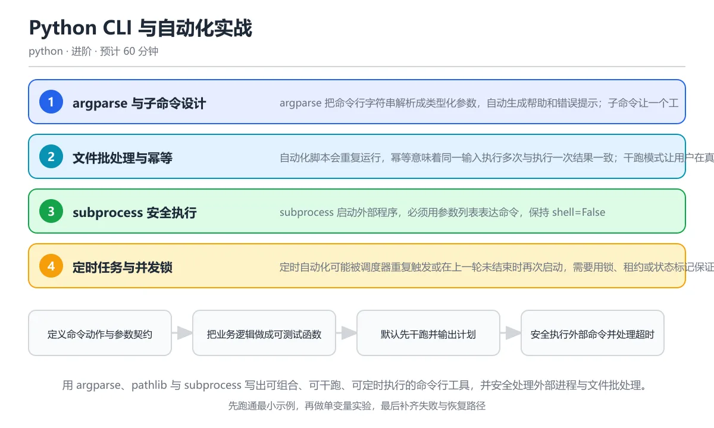

# Python CLI 与自动化实战

> 内容更新时间：2026-10-06 · 学习阶段：进阶 · 预计用时：60 分钟

分类：python。关键词：argparse、subprocess、自动化、幂等、CLI。用 argparse、pathlib 与 subprocess 写出可组合、可干跑、可定时执行的命令行工具，并安全处理外部进程与文件批处理。

学习建议：先通读《Python CLI 与自动化实战》的核心知识与关键流程，再运行可运行练习并完成测验；遇到不确定的结论，回到「故障现场」按症状、根因、修复、验证四步核对。



## 学习目标

- 能用 argparse 设计清晰的参数、子命令与退出码。
- 能用 subprocess 安全执行外部程序并处理超时与错误。
- 能让自动化任务支持干跑、幂等、日志和失败恢复。

## 前置知识

- 会使用 pathlib 和文件读写。
- 知道命令行参数、标准输入输出与退出码。
- 能运行 Python -m 模块并查看帮助信息。

## 核心知识

### 1. argparse 与子命令设计

argparse 把命令行字符串解析成类型化参数，自动生成帮助和错误提示；子命令让一个工具承载扫描、同步、清理等多个动作。

add_argument 定义名称、类型、默认值和帮助文本，add_subparsers 创建子命令，required 保证必须选择一个动作；parse_args 失败时以非零退出码结束。

在Python CLI 与自动化实战里可以这样验证：构建一个带 scan 子命令的 filetool，接受目录和扩展名参数并打印匹配数量。

边界：命令行参数不是可靠配置源，敏感秘密不要通过参数传递，以免进入进程列表；位置参数过多会让工具难以组合。

工程视角：帮助文本写清默认值与示例，参数解析与业务逻辑分离，main 函数返回退出码便于测试。

### 2. 文件批处理与幂等

自动化脚本会重复运行，幂等意味着同一输入执行多次与执行一次结果一致；干跑模式让用户在真正修改前看到计划。

先扫描生成动作列表，再根据 dry-run 决定是否执行；用内容哈希、目标状态或锁文件判断是否已经处理，覆盖文件前备份或原子替换。

在Python CLI 与自动化实战里可以这样验证：为文件重命名工具先打印将要改动的文件对，再执行真正重命名，重复运行时跳过已处理项。

边界：时间戳和文件顺序不稳定会导致结果漂移，跨文件系统移动也不是原子操作；批量操作要限制单次影响范围。

工程视角：日志记录动作与结果，失败可从中断点恢复，危险操作要求显式确认并保留回滚材料。

### 3. subprocess 安全执行

subprocess 启动外部程序，必须用参数列表表达命令，保持 shell=False；超时、返回码、标准输出和标准错误都要显式处理。

run 返回 CompletedProcess，check=True 在非零退出码时抛异常，capture_output 收集输出，timeout 限制执行时间，text 或 encoding 控制文本解码。

在Python CLI 与自动化实战里可以这样验证：用参数列表运行一个打印命令，捕获标准输出并检查返回码，再故意让命令超时观察异常。

边界：shell=True 会让输入进入 shell 解释器，产生命令注入；不同平台的可执行文件与退出码语义也可能不同。

工程视角：命令路径与参数来源可审计，环境变量最小化，长时间任务支持取消并根据返回码做分类处理。

### 4. 定时任务与并发锁

定时自动化可能被调度器重复触发或在上一轮未结束时再次启动，需要用锁、租约或状态标记保证同一时刻只有一个实例。

文件锁或数据库锁记录任务所有者与过期时间，崩溃后锁需要自动失效；任务用唯一业务键去重，状态机记录待处理、处理中、成功和失败。

在Python CLI 与自动化实战里可以这样验证：为批处理任务创建一个带过期时间的锁文件，第二个实例发现锁仍在时直接退出并记录原因。

边界：锁不是分布式事务，网络分区时可能出现双执行；调度频率必须大于任务正常执行时间，超时要有告警。

工程视角：任务入口输出结构化日志和退出码，失败重试有上限，人工补偿路径明确。

### 5. 打包为可安装命令

通过 pyproject.toml 的入口点把模块暴露成命令行命令，用户安装后可以直接调用，而不必记住 python 文件路径。

project.scripts 把命令名映射到 main 函数，pipx 或 uv tool 在隔离环境中安装并生成可执行包装器；包元数据声明依赖和最低 Python 版本。

在Python CLI 与自动化实战里可以这样验证：在 pyproject 中声明 filetool 命令，安装后运行 filetool --help 验证入口点。

边界：入口点函数应只负责解析和调用，不在导入时执行副作用；打包环境和开发环境的依赖需要分离。

工程视角：CI 中构建 wheel、在干净环境安装并运行 smoke test，版本发布与 changelog 同步。

## 关键流程

```text
定义命令动作与参数契约 → 把业务逻辑做成可测试函数 → 默认先干跑并输出计划 → 安全执行外部命令并处理超时 → 记录退出码与可恢复状态
```

1. 定义命令动作与参数契约
2. 把业务逻辑做成可测试函数
3. 默认先干跑并输出计划
4. 安全执行外部命令并处理超时
5. 记录退出码与可恢复状态

## 动手练习

1. 实现一个带 scan 和 clean 子命令的文件工具，默认 dry-run，只有显式 --apply 才执行删除。
2. 用 subprocess 运行一个外部命令，设置超时并分别记录正常返回、失败返回和超时三种结果。
3. 给一个批处理任务加锁文件与唯一业务键，模拟同时启动两个实例并验证只有一个执行。
4. 在 pyproject 中声明命令行入口点，构建 wheel 后在干净环境安装并运行 --help。

**验收标准**：留下输入、命令、输出和结论，能让别人按记录复现。

## 常见错误与排查

> 说明：本表由《Python CLI 与自动化实战》的核心知识整理（2026-10-06），人工复核进度见 docs/content_review_batches.md。

| 易错点 | 容易踩的做法 | 正确结论 |
| --- | --- | --- |
| 用 shell 字符串拼接外部命令 | subprocess.run('rm ' + path, shell=True)，路径中的空格和特殊字符可能改变命令含义 | 使用参数列表并保持 shell=False，必要时先校验路径是否为允许目录内的文件 |
| 自动化默认直接修改生产数据 | 脚本没有 dry-run，第一次运行就批量删除或覆盖文件 | 默认输出计划，显式 --apply 才执行，并为删除操作提供备份或回收站策略 |
| 定时任务缺少重复执行保护 | 上一轮任务未结束时下一轮又启动，两个实例同时处理同一批数据 | 使用带过期时间的锁和唯一业务键，重复实例直接退出并记录原因 |
| 忽略子进程退出码和超时 | 只检查命令是否启动，不检查返回码，外部程序失败后继续处理错误结果 | 使用 check=True 或显式判断返回码，设置 timeout 并把 stderr 写入日志 |

## 可运行练习

### 任务 1：先跑通，再解释

```python
import argparse
from pathlib import Path

def build_parser():
    parser = argparse.ArgumentParser(prog="filetool")
    sub = parser.add_subparsers(dest="command", required=True)
    scan = sub.add_parser("scan", help="统计目录文件")
    scan.add_argument("path", type=Path)
    scan.add_argument("--ext", default=".md")
    return parser

def main(argv=None):
    args = build_parser().parse_args(argv)
    if args.command == "scan":
        files = sorted(p for p in args.path.rglob(f"*{args.ext}") if p.is_file())
        print("文件数:", len(files))
        if files:
            print("首个文件:", files[0].name)
        return 0
    return 2

if __name__ == "__main__":
    raise SystemExit(main(["scan", "tool", "--ext", ".dart"]))
```

解析器定义 scan 子命令和扩展名选项，业务逻辑放在 main 中并按路径枚举文件，返回 0 表示成功；入口点用 SystemExit 把返回码交给操作系统。真实工具还应加入 dry-run、日志、并发锁和子进程超时处理。

### 任务 2：只改一个条件

复制上面的示例，只改一个输入或参数再跑一次；先写下预测，再和真实输出对照，并说明差异来自Python CLI 与自动化实战的哪条机制。

### 任务 3：迁移到自己的数据

把《Python CLI 与自动化实战》里的示例换成你自己的一小段数据或场景，保持结构不变；如果换不动，说明还有哪条前提没有理解，回到核心知识对应小节。

## 项目专属规格

### 交付目标

用 argparse、pathlib 与 subprocess 写出可组合、可干跑、可定时执行的命令行工具，并安全处理外部进程与文件批处理。

### 里程碑

1. 定义命令动作与参数契约
2. 把业务逻辑做成可测试函数
3. 默认先干跑并输出计划
4. 安全执行外部命令并处理超时
5. 记录退出码与可恢复状态

### 输入与约束

- 输入：实现一个带 scan 和 clean 子命令的文件工具，默认 dry-run，只有显式 --apply 才执行删除。
- 约束：命令行参数不是可靠配置源，敏感秘密不要通过参数传递，以免进入进程列表；位置参数过多会让工具难以组合。
- 失败预算：使用参数列表并保持 shell=False，必要时先校验路径是否为允许目录内的文件

### 验收场景

1. 正常路径：跑通「可运行练习」里的最小示例并保存输出。
2. 边界路径：构建一个带 scan 子命令的 filetool，接受目录和扩展名参数并打印匹配数量。
3. 失败路径：出现「subprocess.run('rm ' + path, shell=True)，路径中的空格和特殊字符可能改变命令含义」时按上面的失败预算恢复。

## 项目交付物

- 可运行代码：包含python源文件、依赖说明与启动入口。
- README：环境版本、启动命令、目录结构与已知限制。
- 测试记录：正常、边界与失败路径各至少一条，附命令与输出。
- 复盘记录：本次实现推翻了哪个假设，下一步验证动作是什么。

### 交付验收清单

- [ ] 能用 argparse 设计清晰的参数、子命令与退出码。
- [ ] 能用 subprocess 安全执行外部程序并处理超时与错误。
- [ ] 能让自动化任务支持干跑、幂等、日志和失败恢复。

## 验证命令与预期输出

| 步骤 | 命令 | 预期输出 |
| --- | --- | --- |
| 准备环境 | 按 README 安装依赖 | 依赖安装完成且没有版本冲突 |
| 运行示例 | 运行「可运行练习」中的入口 | 文件数: N
首个文件: add_lessons.dart
其中 N 是 tool 目录下 .dart 文件的实际数量。 |
| 边界输入 | 替换一个输入后重跑 | 结果仍能被正文机制解释 |
| 失败演练 | 按「故障现场」制造一次失败 | 能定位根因并恢复到正常输出 |

### 验收证据

- [ ] 保存一次成功运行的完整输出。
- [ ] 保存一次边界输入的输出与解释。
- [ ] 记录一次失败现象、根因与修复动作。

> 项目目标：Python CLI 与自动化实战 的每一步都要能复现，做不到复现就先缩小范围。

## 故障现场

### 现场 1：用 shell 字符串拼接外部命令

**症状**：在《Python CLI 与自动化实战》里采用「subprocess.run('rm ' + path, shell=True)，路径中的空格和特殊字符可能改变命令含义」时，用 shell 字符串拼接外部命令会表现为错误结果、异常中断或状态不一致。

**根因**：这个做法没有执行与「用 shell 字符串拼接外部命令」对应的检查，问题被带到了后续步骤。

**修复**：使用参数列表并保持 shell=False，必要时先校验路径是否为允许目录内的文件

**验证**：为「用 shell 字符串拼接外部命令」准备一个最小输入，确认修复前的失败可以复现，修复后的输出与本课示例一致，再补一个边界输入。

### 现场 2：自动化默认直接修改生产数据

**症状**：在《Python CLI 与自动化实战》里采用「脚本没有 dry-run，第一次运行就批量删除或覆盖文件」时，自动化默认直接修改生产数据会表现为错误结果、异常中断或状态不一致。

**根因**：这个做法没有执行与「自动化默认直接修改生产数据」对应的检查，问题被带到了后续步骤。

**修复**：默认输出计划，显式 --apply 才执行，并为删除操作提供备份或回收站策略

**验证**：为「自动化默认直接修改生产数据」准备一个最小输入，确认修复前的失败可以复现，修复后的输出与本课示例一致，再补一个边界输入。

### 现场 3：定时任务缺少重复执行保护

**症状**：在《Python CLI 与自动化实战》里采用「上一轮任务未结束时下一轮又启动，两个实例同时处理同一批数据」时，定时任务缺少重复执行保护会表现为错误结果、异常中断或状态不一致。

**根因**：这个做法没有执行与「定时任务缺少重复执行保护」对应的检查，问题被带到了后续步骤。

**修复**：使用带过期时间的锁和唯一业务键，重复实例直接退出并记录原因

**验证**：为「定时任务缺少重复执行保护」准备一个最小输入，确认修复前的失败可以复现，修复后的输出与本课示例一致，再补一个边界输入。

### 现场 4：忽略子进程退出码和超时

**症状**：在《Python CLI 与自动化实战》里采用「只检查命令是否启动，不检查返回码，外部程序失败后继续处理错误结果」时，忽略子进程退出码和超时会表现为错误结果、异常中断或状态不一致。

**根因**：这个做法没有执行与「忽略子进程退出码和超时」对应的检查，问题被带到了后续步骤。

**修复**：使用 check=True 或显式判断返回码，设置 timeout 并把 stderr 写入日志

**验证**：为「忽略子进程退出码和超时」准备一个最小输入，确认修复前的失败可以复现，修复后的输出与本课示例一致，再补一个边界输入。

## 本课复习清单

离开本课前，逐项确认：

- [ ] 能用参数列表安全执行外部命令。
- [ ] 能设计默认干跑、显式执行的自动化流程。
- [ ] 能说明定时任务为什么需要锁与幂等键。
- [ ] 至少运行一次本课示例，记录输入、输出和一个边界情况。
- [ ] 把本课最容易混淆的两个概念写成一句话对照。

| 复盘项 | 记录 |
| --- | --- |
| 已经能独立解释的考点 |  |
| 仍然说不清的概念 |  |
| 下一步验证动作 |  |

## 复习与自测

### 核心知识

遮住正文回答：Python CLI 与自动化实战解决什么问题、依赖哪些前提、失败时先看哪个信号？三问都能答清楚，再进入下一节。

### 动手练习

把《Python CLI 与自动化实战》里「只改一个条件」的练习再做一遍，这次先写预测再运行；预测和结果不一致的地方，就是需要回读的章节。

### 最小可运行示例

```python
import argparse
from pathlib import Path

def build_parser():
    parser = argparse.ArgumentParser(prog="filetool")
    sub = parser.add_subparsers(dest="command", required=True)
    scan = sub.add_parser("scan", help="统计目录文件")
    scan.add_argument("path", type=Path)
    scan.add_argument("--ext", default=".md")
    return parser

def main(argv=None):
    args = build_parser().parse_args(argv)
    if args.command == "scan":
        files = sorted(p for p in args.path.rglob(f"*{args.ext}") if p.is_file())
        print("文件数:", len(files))
        if files:
            print("首个文件:", files[0].name)
        return 0
    return 2

if __name__ == "__main__":
    raise SystemExit(main(["scan", "tool", "--ext", ".dart"]))
```

### 预期输出

```text
文件数: N
首个文件: add_lessons.dart
其中 N 是 tool 目录下 .dart 文件的实际数量。
```

### 验证步骤

1. 确认输入数据与运行环境和示例一致。
2. 运行示例，记录输出与耗时等可观测指标。
3. 换一个边界输入重跑，确认结论仍然成立。
4. 把两次结果写成一句话结论，注明前提与局限。

## 术语速查

先遮住右列，尝试用自己的话解释，再回到正文核对。

| 术语 | 一句话说明 |
| --- | --- |
| `CLI` | 通过命令行参数和标准输入输出与用户交互的程序接口。 |
| `子命令` | 一个命令行工具下按动作划分的独立参数集合，例如 scan 与 sync。 |
| `入口点` | 包元数据中声明的可执行命令到 Python 函数的映射。 |
| `subprocess` | Python 启动外部程序并管理其输入输出、返回码和超时的标准库模块。 |
| `幂等` | 同一操作执行多次与执行一次产生相同最终状态的属性。 |
| `退出码` | 程序结束时返回给操作系统的整数状态，通常零表示成功、非零表示失败。 |

## 考点精讲

### 考点 1：安全执行外部命令的推荐写法是？

题型：概念判断。题干：安全执行外部命令的推荐写法是？

判断要点：subprocess.run(['prog', arg], check=True, timeout=10)。参数列表让操作系统直接执行目标程序，shell 不参与解释，输入中的分号、管道和空格不会变成额外命令；check=True 和 timeout 分别处理失败与卡死。shell=True、os.system 和 exec 拼接字符串都会放大命令注入风险。 正确选项「subprocess.run(['prog', arg], check=True, timeout=10)」对应《Python CLI 与自动化实战》的要点「argparse 与子命令设计」：argparse 把命令行字符串解析成类型化参数，自动生成帮助和错误提示；子命令让一个工具承载扫描、同步、清理等多个动作。判断「argparse 与子命令设计」时先确认前提是否成立，再回到《Python CLI 与自动化实战》的示例核对一次；把别的语言或框架的默认做法直接搬到argparse 与子命令设计上，往往会在本课的边界条件里失效。

### 考点 2：自动化工具提供 dry-run 的主要价

题型：概念判断。题干：自动化工具提供 dry-run 的主要价值是什么？

判断要点：在修改前输出将要执行的动作，让用户检查影响范围。dry-run 先扫描并展示计划，不写入或删除数据，用户可以在高风险操作前确认路径、数量和差异。它不能证明实际执行一定成功，但能显著降低误删、误覆盖和参数错误造成的事故。 正确选项「在修改前输出将要执行的动作，让用户检查影响范围」对应《Python CLI 与自动化实战》的要点「文件批处理与幂等」：自动化脚本会重复运行，幂等意味着同一输入执行多次与执行一次结果一致；干跑模式让用户在真正修改前看到计划。判断「文件批处理与幂等」时先确认前提是否成立，再回到《Python CLI 与自动化实战》的示例核对一次；借鉴相邻主题的经验之前，先核对文件批处理与幂等的前提是否成立。

### 考点 3：让定时任务可以安全重复运行，需要哪些措施

题型：多选辨析。题干：让定时任务可以安全重复运行，需要哪些措施？（多选）

判断要点：使用带过期时间的锁防止并发执行；用唯一业务键判断任务是否已完成；记录失败状态并支持从中断点恢复。锁、幂等键和状态记录共同保证重复触发不会造成双执行或重复写入，失败后可以从断点继续。忽略上一轮状态会让两个实例同时处理同一批数据，产生重复扣款、重复发送等严重后果。 正确选项「使用带过期时间的锁防止并发执行；用唯一业务键判断任务是否已完成；记录失败状态并支持从中断点恢复」对应《Python CLI 与自动化实战》的要点「subprocess 安全执行」：subprocess 启动外部程序，必须用参数列表表达命令，保持 shell=False；超时、返回码、标准输出和标准错误都要显式处理。判断「subprocess 安全执行」时先确认前提是否成立，再回到《Python CLI 与自动化实战》的示例核对一次；记住subprocess 安全执行的结论之外还要记住适用条件，换一个输入往往就不成立了。

### 考点 4：阅读 argparse 代码，运行 fi

题型：代码阅读。题干：阅读 argparse 代码，运行 filetool scan data --ext .csv 后 args.ext 的值是什么？

scan.add_argument('path', type=Path)
scan.add_argument('--ext', default='.md')

判断要点：.csv。命令行显式传入 --ext .csv 会覆盖默认值 .md，因此 args.ext 是 .csv；位置参数 path 会被转换成 Path 对象。参数解析完成后业务函数应按类型和范围继续校验，不能因为 argparse 转换成功就假设输入一定安全。

### 考点 5：这段批处理脚本为什么可能覆盖错误文件？

题型：排错。题干：这段批处理脚本为什么可能覆盖错误文件？

判断要点：没有检查目标文件是否已存在，也没有 dry-run 和根目录限制。with_suffix 生成的目标可能已经存在，rename 会覆盖原文件；脚本还会遍历当前工作目录下的所有文本文件，范围过大且没有预演。应先解析绝对路径、限制在指定根目录内，输出重命名计划，检查冲突并保留回滚记录。这道题对应 CLI 自动化的幂等与 dry-run 设计：批量改动前先输出计划，再显式确认执行。 正确选项「没有检查目标文件是否已存在，也没有 dry-run 和根目录限制」对应《Python CLI 与自动化实战》的要点「打包为可安装命令」：通过 pyproject.toml 的入口点把模块暴露成命令行命令，用户安装后可以直接调用，而不必记住 python 文件路径。判断「打包为可安装命令」时先确认前提是否成立，再回到《Python CLI 与自动化实战》的示例核对一次；把打包为可安装命令的做法换到别的约束下未必成立，先确认边界再决定答案。

## English Overview

Practical Python CLIs and Automation

This lesson builds practical Python CLIs with argparse subcommands, dry-run planning, idempotent batch operations, safe subprocess execution, timeout and exit-code handling, scheduled-task locks, and pyproject entry points for installable commands.

## 本课小结

- Python CLI 与自动化实战围绕argparse、subprocess、自动化展开，先建立基线再讨论优化。
- argparse 把命令行字符串解析成类型化参数，自动生成帮助和错误提示；子命令让一个工具承载扫描、同步、清理等多个动作。
- 遇到问题时按「症状 → 根因 → 修复 → 验证」的顺序处理，不跳过验证。

## 内容元数据

- 内容版本：v2.0
- 最后更新：2026-10-06
- 学习阶段：进阶

| 字段 | 值 |
| --- | --- |
| 课程 ID | `python_cli_automation` |
| 所属分类 | `python` |
| 难度 | 进阶 |
| 预计用时 | 60 分钟 |
| 关键词 | argparse、subprocess、自动化、幂等、CLI |
| 配图 | `images/lesson_python_cli_automation.webp` |
| 参考资料 | 4 条 |
| 内容更新时间 | 2026-10-06 |

## 参考资料与复核

- 最后复核：2026-10-04
- 下次复核：2026-11-10
- 复核范围：版本兼容、API 行为与工程实践

下面列出的资料用于核对本课结论，复习时可以对照阅读：
- [Python argparse 文档](https://docs.python.org/3/library/argparse.html)
- [Python subprocess 文档](https://docs.python.org/3/library/subprocess.html)
- [Python 打包：入口点规范](https://packaging.python.org/en/latest/specifications/entry-points/)
- [pipx 文档](https://pipx.pypa.io/stable/)

> 复核提示：《Python CLI 与自动化实战》的结论如与资料冲突，以资料中的规范文本为准，并在笔记里记录差异与日期。

## 复习与迁移

### 概念复述

不看正文，把Python CLI 与自动化实战讲给一个没学过的同事：先讲它解决什么问题，再讲一个最小例子，最后说明一个不适用场景。

### 测验回顾

回到《Python CLI 与自动化实战》测验，只重做答错或犹豫的题；对每道题写一句「我为什么改选这个答案」，写不出理由就回到对应小节。

### 迁移练习

把《Python CLI 与自动化实战》的方法用到一个你自己的真实场景：说明输入、约束与验证方式，并列出仍然不确定、需要下一次实验回答的问题。

## 深度拓展与实战

这一节把Python CLI 与自动化实战的机制拆开验证：每一步都给出输入、判断标准和失败信号，便于在真实项目里复用。

### 机制拆解 1：argparse 与子命令设计

add_argument 定义名称、类型、默认值和帮助文本，add_subparsers 创建子命令，required 保证必须选择一个动作；parse_args 失败时以非零退出码结束。

落地时先确认前提：命令行参数不是可靠配置源，敏感秘密不要通过参数传递，以免进入进程列表；位置参数过多会让工具难以组合。；再把结论写进检查表，让下一位同学可以按同样的输入复现。

工程做法：帮助文本写清默认值与示例，参数解析与业务逻辑分离，main 函数返回退出码便于测试。

### 机制拆解 2：文件批处理与幂等

先扫描生成动作列表，再根据 dry-run 决定是否执行；用内容哈希、目标状态或锁文件判断是否已经处理，覆盖文件前备份或原子替换。

落地时先确认前提：时间戳和文件顺序不稳定会导致结果漂移，跨文件系统移动也不是原子操作；批量操作要限制单次影响范围。；再把结论写进检查表，让下一位同学可以按同样的输入复现。

工程做法：日志记录动作与结果，失败可从中断点恢复，危险操作要求显式确认并保留回滚材料。

### 机制拆解 3：subprocess 安全执行

run 返回 CompletedProcess，check=True 在非零退出码时抛异常，capture_output 收集输出，timeout 限制执行时间，text 或 encoding 控制文本解码。

落地时先确认前提：shell=True 会让输入进入 shell 解释器，产生命令注入；不同平台的可执行文件与退出码语义也可能不同。；再把结论写进检查表，让下一位同学可以按同样的输入复现。

工程做法：命令路径与参数来源可审计，环境变量最小化，长时间任务支持取消并根据返回码做分类处理。

### 机制拆解 4：定时任务与并发锁

文件锁或数据库锁记录任务所有者与过期时间，崩溃后锁需要自动失效；任务用唯一业务键去重，状态机记录待处理、处理中、成功和失败。

落地时先确认前提：锁不是分布式事务，网络分区时可能出现双执行；调度频率必须大于任务正常执行时间，超时要有告警。；再把结论写进检查表，让下一位同学可以按同样的输入复现。

工程做法：任务入口输出结构化日志和退出码，失败重试有上限，人工补偿路径明确。

### 机制拆解 5：打包为可安装命令

project.scripts 把命令名映射到 main 函数，pipx 或 uv tool 在隔离环境中安装并生成可执行包装器；包元数据声明依赖和最低 Python 版本。

落地时先确认前提：入口点函数应只负责解析和调用，不在导入时执行副作用；打包环境和开发环境的依赖需要分离。；再把结论写进检查表，让下一位同学可以按同样的输入复现。

工程做法：CI 中构建 wheel、在干净环境安装并运行 smoke test，版本发布与 changelog 同步。

### 机制对照表

| 概念 | 解决什么问题 | 关键前提 | 失败信号 |
| --- | --- | --- | --- |
| argparse 与子命令设计 | argparse 把命令行字符串解析成类型化参数，自动生成帮助和错误提示；子命令 | 命令行参数不是可靠配置源，敏感秘密不要通过参数传递，以免进入进程列表；位 | 帮助文本写清默认值与示例，参数解析与业务逻辑分离，main 函数返回退出 |
| 文件批处理与幂等 | 自动化脚本会重复运行，幂等意味着同一输入执行多次与执行一次结果一致；干跑模式让用 | 时间戳和文件顺序不稳定会导致结果漂移，跨文件系统移动也不是原子操作；批量 | 日志记录动作与结果，失败可从中断点恢复，危险操作要求显式确认并保留回滚材 |
| subprocess 安全执行 | subprocess 启动外部程序，必须用参数列表表达命令，保持 shell=F | shell=True 会让输入进入 shell 解释器，产生命令注入；不 | 命令路径与参数来源可审计，环境变量最小化，长时间任务支持取消并根据返回码 |
| 定时任务与并发锁 | 定时自动化可能被调度器重复触发或在上一轮未结束时再次启动，需要用锁、租约或状态标 | 锁不是分布式事务，网络分区时可能出现双执行；调度频率必须大于任务正常执行 | 任务入口输出结构化日志和退出码，失败重试有上限，人工补偿路径明确。 |
| 打包为可安装命令 | 通过 pyproject.toml 的入口点把模块暴露成命令行命令，用户安装后可 | 入口点函数应只负责解析和调用，不在导入时执行副作用；打包环境和开发环境的 | CI 中构建 wheel、在干净环境安装并运行 smoke test，版 |

### 自测问答

**问 1**：安全执行外部命令的推荐写法是？

**答**：subprocess.run(['prog', arg], check=True, timeout=10)。参数列表让操作系统直接执行目标程序，shell 不参与解释，输入中的分号、管道和空格不会变成额外命令；check=True 和 timeout 分别处理失败与卡死。shell=True、os.system 和 exec 拼接字符串都会放大命令注入风险。 正确选项「subprocess.run(['prog', arg], check=True, timeout=10)」对应《Python CLI 与自动化实战》的要点「argparse 与子命令设计」：argparse 把命令行字符串解析成类型化参数，自动生成帮助和错误提示；子命令让一个工具承载扫描、同步、清理等多个动作。判断「argparse 与子命令设计」时先确认前提是否成立，再回到《Python CLI 与自动化实战》的示例核对一次；把别的语言或框架的默认做法直接搬到argparse 与子命令设计上，往往会在本课的边界条件里失效。

**问 2**：自动化工具提供 dry-run 的主要价值是什么？

**答**：在修改前输出将要执行的动作，让用户检查影响范围。dry-run 先扫描并展示计划，不写入或删除数据，用户可以在高风险操作前确认路径、数量和差异。它不能证明实际执行一定成功，但能显著降低误删、误覆盖和参数错误造成的事故。 正确选项「在修改前输出将要执行的动作，让用户检查影响范围」对应《Python CLI 与自动化实战》的要点「文件批处理与幂等」：自动化脚本会重复运行，幂等意味着同一输入执行多次与执行一次结果一致；干跑模式让用户在真正修改前看到计划。判断「文件批处理与幂等」时先确认前提是否成立，再回到《Python CLI 与自动化实战》的示例核对一次；借鉴相邻主题的经验之前，先核对文件批处理与幂等的前提是否成立。

**问 3**：让定时任务可以安全重复运行，需要哪些措施？（多选）

**答**：使用带过期时间的锁防止并发执行；用唯一业务键判断任务是否已完成；记录失败状态并支持从中断点恢复。锁、幂等键和状态记录共同保证重复触发不会造成双执行或重复写入，失败后可以从断点继续。忽略上一轮状态会让两个实例同时处理同一批数据，产生重复扣款、重复发送等严重后果。 正确选项「使用带过期时间的锁防止并发执行；用唯一业务键判断任务是否已完成；记录失败状态并支持从中断点恢复」对应《Python CLI 与自动化实战》的要点「subprocess 安全执行」：subprocess 启动外部程序，必须用参数列表表达命令，保持 shell=False；超时、返回码、标准输出和标准错误都要显式处理。判断「subprocess 安全执行」时先确认前提是否成立，再回到《Python CLI 与自动化实战》的示例核对一次；记住subprocess 安全执行的结论之外还要记住适用条件，换一个输入往往就不成立了。

**问 4**：阅读 argparse 代码，运行 filetool scan data --ext .csv 后 args.ext 的值是什么？

scan.add_argument('path', type=Path)
scan.add_argument('--ext', default='.md')

**答**：.csv。命令行显式传入 --ext .csv 会覆盖默认值 .md，因此 args.ext 是 .csv；位置参数 path 会被转换成 Path 对象。参数解析完成后业务函数应按类型和范围继续校验，不能因为 argparse 转换成功就假设输入一定安全。

**问 5**：这段批处理脚本为什么可能覆盖错误文件？

**答**：没有检查目标文件是否已存在，也没有 dry-run 和根目录限制。with_suffix 生成的目标可能已经存在，rename 会覆盖原文件；脚本还会遍历当前工作目录下的所有文本文件，范围过大且没有预演。应先解析绝对路径、限制在指定根目录内，输出重命名计划，检查冲突并保留回滚记录。这道题对应 CLI 自动化的幂等与 dry-run 设计：批量改动前先输出计划，再显式确认执行。 正确选项「没有检查目标文件是否已存在，也没有 dry-run 和根目录限制」对应《Python CLI 与自动化实战》的要点「打包为可安装命令」：通过 pyproject.toml 的入口点把模块暴露成命令行命令，用户安装后可以直接调用，而不必记住 python 文件路径。判断「打包为可安装命令」时先确认前提是否成立，再回到《Python CLI 与自动化实战》的示例核对一次；把打包为可安装命令的做法换到别的约束下未必成立，先确认边界再决定答案。

### 排错速查

- 看到「subprocess.run('rm ' + path, shell=True)，路径中的空格和特殊字符可能改变命令含义」时，先按「使用参数列表并保持 shell=False，必要时先校验路径是否为允许目录内的文件」处理，再用Python CLI 与自动化实战的最小示例确认结论是否恢复。
- 看到「脚本没有 dry-run，第一次运行就批量删除或覆盖文件」时，先按「默认输出计划，显式 --apply 才执行，并为删除操作提供备份或回收站策略」处理，再用Python CLI 与自动化实战的最小示例确认结论是否恢复。
- 看到「上一轮任务未结束时下一轮又启动，两个实例同时处理同一批数据」时，先按「使用带过期时间的锁和唯一业务键，重复实例直接退出并记录原因」处理，再用Python CLI 与自动化实战的最小示例确认结论是否恢复。
- 看到「只检查命令是否启动，不检查返回码，外部程序失败后继续处理错误结果」时，先按「使用 check=True 或显式判断返回码，设置 timeout 并把 stderr 写入日志」处理，再用Python CLI 与自动化实战的最小示例确认结论是否恢复。

### 工程检查表

- [ ] 定义命令动作与参数契约
- [ ] 把业务逻辑做成可测试函数
- [ ] 默认先干跑并输出计划
- [ ] 安全执行外部命令并处理超时
- [ ] 记录退出码与可恢复状态
- [ ] 【argparse 与子命令设计】帮助文本写清默认值与示例，参数解析与业务逻辑分离，main 函数返回退出码便于测试。
- [ ] 【文件批处理与幂等】日志记录动作与结果，失败可从中断点恢复，危险操作要求显式确认并保留回滚材料。
- [ ] 【subprocess 安全执行】命令路径与参数来源可审计，环境变量最小化，长时间任务支持取消并根据返回码做分类处理。
- [ ] 【定时任务与并发锁】任务入口输出结构化日志和退出码，失败重试有上限，人工补偿路径明确。
- [ ] 【打包为可安装命令】CI 中构建 wheel、在干净环境安装并运行 smoke test，版本发布与 changelog 同步。

### 迁移练习

把Python CLI 与自动化实战的方法用到一个真实场景：写下argparse、subprocess、自动化在你的场景里分别对应什么，再记录一次失败尝试和它的恢复步骤。

### 延伸阅读与下一步

- 复习argparse、subprocess、自动化、幂等、CLI时，优先回看「argparse 与子命令设计」与「打包为可安装命令」两节。
- 把从「定义命令动作与参数契约」到「记录退出码与可恢复状态」的流程画成一张图，放进自己的笔记。
- 一周后重做本课测验，只把答错的题留到下一轮复习。

### 结论与下一步

学完Python CLI 与自动化实战，应该能独立完成三件事：先用最小示例确认argparse的行为，再用一个边界输入验证结论，最后把失败路径写成可重复的检查。下一步把本课术语加入复习清单，并在两周内用一次真实任务检验记忆是否牢固。
