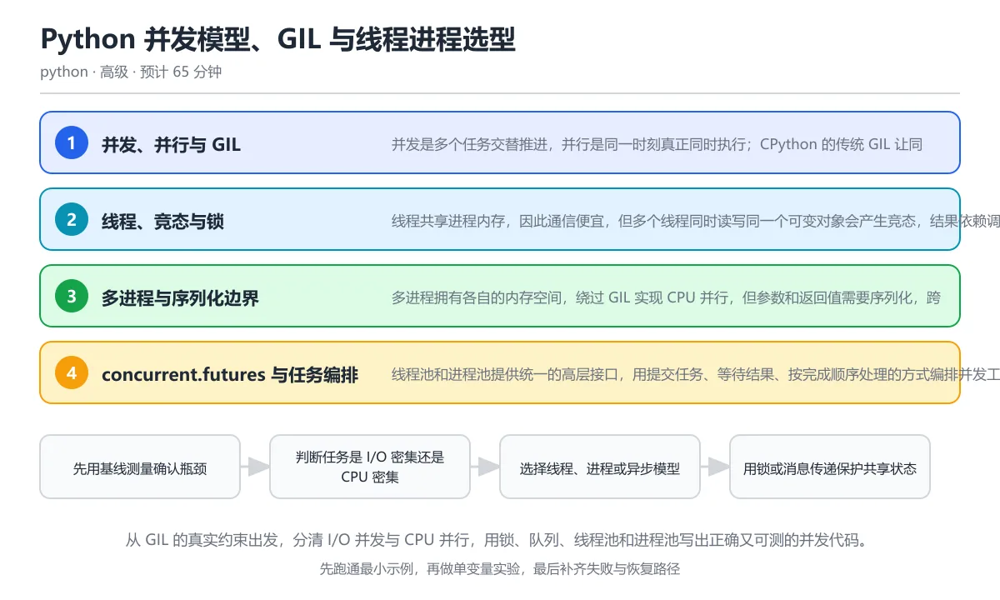

# Python 并发模型、GIL 与线程进程选型

> 内容更新时间：2026-10-06 · 学习阶段：高级 · 预计用时：55 分钟

分类：python。关键词：GIL、线程、进程、竞态条件、线程池。从 GIL 的真实约束出发，分清 I/O 并发与 CPU 并行，用锁、队列、线程池和进程池写出正确又可测的并发代码。



## 本节知识框架

**课程定位**：所属分类 `python`（Python），课程主题 `Python 并发模型、GIL 与线程进程选型`，学习阶段 高级，建议用时 55 分钟。

本课主线：从 GIL 的真实约束出发，分清 I/O 并发与 CPU 并行，用锁、队列、线程池和进程池写出正确又可测的并发代码。

**学完本课应当能够**
- 说清 `GIL` 与 `竞态条件` 的含义与区别，并各举一个正例和一个反例。
- 用本课示例验证 `临界区` 的行为，记录输入、输出与失败条件。
- 遇到「认为多线程能加速所有任务」这类问题时，能说出触发条件与修复顺序。

### 从概念到验证的学习链条

1. `GIL`：先掌握 CPython 传统构建中的全局解释器锁，同一时刻只允许一个线程执行 Python 字节码，再用它解释 `竞态条件` 为什么会出现。
2. `竞态条件`：先掌握 结果依赖多个线程或进程执行顺序，导致行为不确定的缺陷，再用它解释 `临界区` 为什么会出现。
3. `临界区`：先掌握 必须保证同一时间只被一个执行单元进入的代码区域，再用它解释 `Future` 为什么会出现。
4. `Future`：先掌握 表示异步任务未来结果的对象，可查询状态、等待结果或取消任务，再用它解释 `背压` 为什么会出现。
5. `背压`：先掌握 当消费者处理不过来时限制生产者速度，防止队列无限增长，再用它解释 `自由线程构建` 为什么会出现。
6. `自由线程构建`：先掌握 移除 GIL 的 CPython 实验性构建，允许多线程并行执行 Python 代码，再用它解释 本课示例的观察结果 为什么会出现。

**先修与衔接**：本课是「Python」分类的第 29 课。先修内容：《并发与异步》。《并发与异步》里的 `ProcessPoolExecutor`、`await` 是本课的前提。相关或后续课程：《Python asyncio 异步编程：任务、超时与取消》、《Python 内存、性能与解释器原理》。

### 完成判据

- **定义关**：不看正文也能说明 `GIL` 是 CPython 传统构建中的全局解释器锁，同一时刻只允许一个线程执行 Python 字节码，并指出一个反例。
- **机制关**：能按“输入 → 转换 → 输出 → 验证”复述 `Python 并发模型、GIL 与线程进程选型`，而不是只背结论。
- **示例关**：能运行或推演 `Python 并发模型、GIL 与线程进程选型` 的 `text` 示例，并说明一个真实出现的标识符或字面量。
- **证据关**：能从 `Python 并发模型、GIL 与线程进程选型` 的示例写出一个输入、处理、输出三元组，并说明它支持或反驳了本课的哪一条结论。
- **排错关**：能复现 认为多线程能加速所有任务，记录现象并按 CPU 密集任务使用多进程或原生扩展，先测量再决定 修复。
- **迁移关**：能把 `GIL`、`线程`、`进程`、`竞态条件` 放进一个与 `Python 并发模型、GIL 与线程进程选型` 不同的项目场景，并保持输入与验证条件可追踪。
- **复盘关**：学完 `Python 并发模型、GIL 与线程进程选型` 后，用一句话写下仍然不确定的结论，并列出下一次验证需要的输入、环境和成功判据。

### 复习清单

- [ ] 能不看正文复述本课核心术语，并指出一个边界或反例。
- [ ] 能运行或推演本课示例，记录输入、输出与失败现象。
- [ ] 能完成一次自测，并把错题对照错误表定位原因。

## 核心概念定义

| 术语 | 操作性定义 | 常见边界与风险 |
| --- | --- | --- |
| GIL | CPython 传统构建中的全局解释器锁，同一时刻只允许一个线程执行 Python 字节码。 | 易错：在《Python 并发模型、GIL 与线程进程选型》里采用「把 CPU 密集型 Python 计算放进线程池，耗时没有下降甚至更慢」时，认为多线程能加速所有任务会表现为错误结果、异常中断或状态不一致；正确做法是CPU 密集任务使用多进程或原生扩展，先测量再决定。 |
| 竞态条件 | 结果依赖多个线程或进程执行顺序，导致行为不确定的缺陷。 | 不同版本与依赖组合的行为可能不同，升级或换环境前要按官方变更说明重新验证。 |
| 临界区 | 必须保证同一时间只被一个执行单元进入的代码区域。 | 易错：在《Python 并发模型、GIL 与线程进程选型》里采用「多个线程同时执行 counter += 1，最终结果小于预期」时，无锁修改共享状态会表现为错误结果、异常中断或状态不一致；正确做法是用锁保护临界区，或改成队列和单线程汇总。 |
| Future | 表示异步任务未来结果的对象，可查询状态、等待结果或取消任务。 | 索引命中与数据分布决定实际开销，判断前先看执行计划而不是只看结果是否正确。 |
| 背压 | 当消费者处理不过来时限制生产者速度，防止队列无限增长。 | 只在「当消费者处理不过来时限制生产者速度，防止队列无限增长」这一前提下成立，换输入或换环境要重新验证。 |
| 自由线程构建 | 移除 GIL 的 CPython 实验性构建，允许多线程并行执行 Python 代码。 | 共享状态与调度顺序会改变结论，单线程或串行测试通过不等于并发下成立。 |

## 原理与运行机制

### 机制总览

**教材衔接：核心知识**

### 1. 并发、并行与 GIL

并发是多个任务交替推进，并行是同一时刻真正同时执行；CPython 的传统 GIL 让同一进程内只有一个线程执行 Python 字节码。

线程在执行 I/O、等待锁或调用 C 扩展时有机会释放 GIL，因此 I/O 密集任务能从线程并发获益；CPU 密集的纯 Python 代码无法靠同进程多线程获得加速。

在Python 并发模型、GIL 与线程进程选型里可以这样验证：让多个线程执行相同的计算函数与等待函数，分别测量耗时，说明瓶颈是 CPU 还是 I/O。

边界：GIL 不影响多进程并行，也不是所有扩展都全程持有 GIL；自由线程构建正在演进，但现有库的线程安全仍需逐项验证。

工程视角：先测量再选模型：I/O 密集优先异步或线程，CPU 密集使用多进程或原生扩展，不把 GIL 当成所有性能问题的唯一原因。

### 2. 线程、竞态与锁

线程共享进程内存，因此通信便宜，但多个线程同时读写同一个可变对象会产生竞态，结果依赖调度顺序。

读取、修改、写回不是原子操作，两个线程可能读到同一个旧值；Lock 通过互斥保护临界区，RLock 允许同一线程重复获取，Queue 用消息传递替代显式共享。

在Python 并发模型、GIL 与线程进程选型里可以这样验证：让四个线程各自把共享计数器增加一万次，先不加锁观察丢失更新，再加锁验证结果稳定为四万。

边界：锁保护范围过小仍有竞态，过大则退化为串行；多个锁的获取顺序不一致可能死锁。

工程视角：临界区只包围必须原子的操作，统一锁顺序，优先用队列传递数据；为并发代码写压力测试而不是依赖偶发复现。

### 3. 多进程与序列化边界

多进程拥有各自的内存空间，绕过 GIL 实现 CPU 并行，但参数和返回值需要序列化，跨进程共享状态成本更高。

操作系统创建子进程，任务通过 pickle 传给工作进程，结果再序列化回来；Windows 与 macOS 使用 spawn 启动，需要 if __name__ 保护主模块。

在Python 并发模型、GIL 与线程进程选型里可以这样验证：用进程池并行计算两个平方和任务，再传入一个打开的文件对象，观察序列化失败。

边界：进程创建和序列化都有开销，小任务并行反而更慢；进程池中的全局状态不会自动同步，锁也不跨进程生效。

工程视角：任务函数放在模块顶层并保持可序列化，批量拆分粒度适中，跨进程共享数据优先使用消息或专用共享内存。

### 4. concurrent.futures 与任务编排

线程池和进程池提供统一的高层接口，用提交任务、等待结果、按完成顺序处理的方式编排并发工作。

submit 返回 Future，result 阻塞取结果并重新抛出异常，map 按输入顺序返回结果，as_completed 按完成顺序产出；超时和取消控制等待边界。

在Python 并发模型、GIL 与线程进程选型里可以这样验证：用线程池并发执行多个等待任务，再用 as_completed 按完成顺序打印结果。

边界：线程池大小不是越大越好，过多线程会增加上下文切换和内存占用；取结果顺序与任务完成顺序不同，需要明确语义。

工程视角：池的大小根据外部资源和 CPU 核数设置，任务要幂等且能处理异常，关闭池时等待或取消剩余任务。

### 5. 并发正确性与性能观测

并发代码首先要正确，其次才是更快；正确性依赖不变量、原子性和明确的失败策略，性能必须用真实负载测量。

把共享状态限制在单个线程内，通过不可变快照或消息传递降低同步面；用计时、队列长度、CPU 与内存指标区分瓶颈，用压力测试暴露偶发竞态。

在Python 并发模型、GIL 与线程进程选型里可以这样验证：为计数器并发测试重复运行多次并断言结果一致，再记录不同池大小下的耗时曲线。

边界：一次运行很快不代表并发安全，缺少观测的优化可能只是把瓶颈从 CPU 移到内存或磁盘。

工程视角：为并发模块定义线程安全级别，记录指标与失败率，压测使用真实数据规模和超时策略。

**教材衔接：关键流程**

```text
先用基线测量确认瓶颈 → 判断任务是 I/O 密集还是 CPU 密集 → 选择线程、进程或异步模型 → 用锁或消息传递保护共享状态 → 在真实负载下验证正确性与收益
```

1. 先用基线测量确认瓶颈
2. 判断任务是 I/O 密集还是 CPU 密集
3. 选择线程、进程或异步模型
4. 用锁或消息传递保护共享状态
5. 在真实负载下验证正确性与收益

### 机制拆解：每一步的输入、动作与输出

#### 1. `GIL`
- 输入：`GIL`；本步把 CPython 传统构建中的全局解释器锁，同一时刻只允许一个线程执行 Python 字节码 当作判断规则。
- 动作：围绕 `GIL` 保留中间状态，并记录它与 `竞态条件` 的对应关系。
- 输出：`竞态条件`，它可以被下一段代码、测试或记录继续使用。
- `GIL` 的失败条件：当认为多线程能加速所有任务时，会出现在《Python 并发模型、GIL 与线程进程选型》里采用「把 CPU 密集型 Python 计算放进线程池，耗时没有下降甚至更慢」时，认为多线程能加速所有任务会表现为错误结果、异常中断或状态不一致。

#### 2. `竞态条件`
- 输入：`GIL`；本步把 结果依赖多个线程或进程执行顺序，导致行为不确定的缺陷 当作判断规则。
- 动作：围绕 `竞态条件` 保留中间状态，并记录它与 `临界区` 的对应关系。
- 输出：`临界区`，它可以被下一段代码、测试或记录继续使用。
- `竞态条件` 的失败条件：不同版本与依赖组合的行为可能不同，升级或换环境前要按官方变更说明重新验证。

#### 3. `临界区`
- 输入：`竞态条件`；本步把 必须保证同一时间只被一个执行单元进入的代码区域 当作判断规则。
- 动作：围绕 `临界区` 保留中间状态，并记录它与 `Future` 的对应关系。
- 输出：`Future`，它可以被下一段代码、测试或记录继续使用。
- `临界区` 的失败条件：当无锁修改共享状态时，会出现在《Python 并发模型、GIL 与线程进程选型》里采用「多个线程同时执行 counter += 1，最终结果小于预期」时，无锁修改共享状态会表现为错误结果、异常中断或状态不一致。

#### 4. `Future`
- 输入：`临界区`；本步把 表示异步任务未来结果的对象，可查询状态、等待结果或取消任务 当作判断规则。
- 动作：围绕 `Future` 保留中间状态，并记录它与 `背压` 的对应关系。
- 输出：`背压`，它可以被下一段代码、测试或记录继续使用。
- `Future` 的失败条件：索引命中与数据分布决定实际开销，判断前先看执行计划而不是只看结果是否正确。

#### 5. `背压`
- 输入：`Future`；本步把 当消费者处理不过来时限制生产者速度，防止队列无限增长 当作判断规则。
- 动作：围绕 `背压` 保留中间状态，并记录它与 `自由线程构建` 的对应关系。
- 输出：`自由线程构建`，它可以被下一段代码、测试或记录继续使用。
- `背压` 的失败条件：只在「当消费者处理不过来时限制生产者速度，防止队列无限增长」这一前提下成立，换输入或换环境要重新验证。

#### 6. `自由线程构建`
- 输入：`背压`；本步把 移除 GIL 的 CPython 实验性构建，允许多线程并行执行 Python 代码 当作判断规则。
- 动作：围绕 `自由线程构建` 保留中间状态，并记录它与 `本课示例的最终结果` 的对应关系。
- 输出：`本课示例的最终结果`，它可以被下一段代码、测试或记录继续使用。
- `自由线程构建` 的失败条件：共享状态与调度顺序会改变结论，单线程或串行测试通过不等于并发下成立。

### 复现实验记录

- 环境：`Python 并发模型、GIL 与线程进程选型` 使用 `text` 示例，固定 `GIL`、`线程`、`进程`、`竞态条件` 作为第一组条件。
- 首轮输入：从示例中的第一个输入开始，预测 `GIL` 会怎样变化。
- 基线观察：记录命令、输入、输出和错误原文，不用截图代替可复制的文本。
- 单变量修改：只改变 `GIL`，观察 `自由线程构建` 是否仍满足定义。
- 失败注入：复现 认为多线程能加速所有任务，确认现象是 在《Python 并发模型、GIL 与线程进程选型》里采用「把 CPU 密集型 Python 计算放进线程池，耗时没有下降甚至更慢」时，认为多线程能加速所有任务会表现为错误结果、异常中断或状态不一致。
- 记录结论：把“修改前、修改后、预期变化、实际变化”写成四列表，这样复盘 `Python 并发模型、GIL 与线程进程选型` 时才能区分概念错误与实现错误。

## 典型应用场景

**教材衔接：深度拓展与实战**

### 机制拆解 1：并发、并行与 GIL

落地时先确认前提：GIL 不影响多进程并行，也不是所有扩展都全程持有 GIL；自由线程构建正在演进，但现有库的线程安全仍需逐项验证。再把结论写进检查表，让下一位同学可以按同样的输入复现。

工程做法：先测量再选模型：I/O 密集优先异步或线程，CPU 密集使用多进程或原生扩展，不把 GIL 当成所有性能问题的唯一原因。

### 机制拆解 2：线程、竞态与锁

读取、修改、写回不是原子操作，两个线程可能读到同一个旧值；Lock 通过互斥保护临界区，RLock 允许同一线程重复获取，Queue 用消息传递替代显式共享。

落地时先确认前提：锁保护范围过小仍有竞态，过大则退化为串行；多个锁的获取顺序不一致可能死锁。再把结论写进检查表，让下一位同学可以按同样的输入复现。

工程做法：临界区只包围必须原子的操作，统一锁顺序，优先用队列传递数据；为并发代码写压力测试而不是依赖偶发复现。

### 机制拆解 3：多进程与序列化边界

落地时先确认前提：进程创建和序列化都有开销，小任务并行反而更慢；进程池中的全局状态不会自动同步，锁也不跨进程生效。再把结论写进检查表，让下一位同学可以按同样的输入复现。

工程做法：任务函数放在模块顶层并保持可序列化，批量拆分粒度适中，跨进程共享数据优先使用消息或专用共享内存。

### 机制拆解 4：concurrent.futures 与任务编排

落地时先确认前提：线程池大小不是越大越好，过多线程会增加上下文切换和内存占用；取结果顺序与任务完成顺序不同，需要明确语义。再把结论写进检查表，让下一位同学可以按同样的输入复现。

工程做法：池的大小根据外部资源和 CPU 核数设置，任务要幂等且能处理异常，关闭池时等待或取消剩余任务。

### 机制拆解 5：并发正确性与性能观测

把共享状态限制在单个线程内，通过不可变快照或消息传递降低同步面；用计时、队列长度、CPU 与内存指标区分瓶颈，用压力测试暴露偶发竞态。

落地时先确认前提：一次运行很快不代表并发安全，缺少观测的优化可能只是把瓶颈从 CPU 移到内存或磁盘。再把结论写进检查表，让下一位同学可以按同样的输入复现。

工程做法：为并发模块定义线程安全级别，记录指标与失败率，压测使用真实数据规模和超时策略。

### 机制对照表

| 概念 | 解决什么问题 | 关键前提 | 失败信号 |
| --- | --- | --- | --- |
| 并发、并行与 GIL | 并发是多个任务交替推进，并行是同一时刻真正同时执行；CPython 的传统 GI | GIL 不影响多进程并行，也不是所有扩展都全程持有 GIL；自由线程构建 | 先测量再选模型：I/O 密集优先异步或线程，CPU 密集使用多进程或原生 |
| 线程、竞态与锁 | 线程共享进程内存，因此通信便宜，但多个线程同时读写同一个可变对象会产生竞态，结果 | 锁保护范围过小仍有竞态，过大则退化为串行；多个锁的获取顺序不一致可能死锁 | 临界区只包围必须原子的操作，统一锁顺序，优先用队列传递数据；为并发代码写 |
| 多进程与序列化边界 | 多进程拥有各自的内存空间，绕过 GIL 实现 CPU 并行，但参数和返回值需要序 | 进程创建和序列化都有开销，小任务并行反而更慢；进程池中的全局状态不会自动 | 任务函数放在模块顶层并保持可序列化，批量拆分粒度适中，跨进程共享数据优先 |
| concurrent.futures 与任务编排 | 线程池和进程池提供统一的高层接口，用提交任务、等待结果、按完成顺序处理的方式编排 | 线程池大小不是越大越好，过多线程会增加上下文切换和内存占用；取结果顺序与 | 池的大小根据外部资源和 CPU 核数设置，任务要幂等且能处理异常，关闭池 |
| 并发正确性与性能观测 | 并发代码首先要正确，其次才是更快；正确性依赖不变量、原子性和明确的失败策略，性能 | 一次运行很快不代表并发安全，缺少观测的优化可能只是把瓶颈从 CPU 移到 | 为并发模块定义线程安全级别，记录指标与失败率，压测使用真实数据规模和超时 |

### 自测问答

**问 1**：传统 CPython 中，纯 Python CPU 密集任务为什么难以靠多线程加速？

**答**：GIL 让同一进程内同一时刻只有一个线程执行 Python 字节码。GIL 保护解释器内部状态，同一进程内的线程需要轮流持有它执行 Python 字节码，因此纯 Python 计算不会随线程数线性加速。I/O 等待和部分 C 扩展会释放 GIL，所以线程仍适合 I/O 密集任务；CPU 并行通常改用多进程、原生扩展或自由线程构建。 正确选项「GIL 让同一进程内同一时刻只有一个线程执行 Python 字节码」对应《Python 并发模型、GIL 与线程进程选型》的要点「并发、并行与 GIL」：并发是多个任务交替推进，并行是同一时刻真正同时执行；CPython 的传统 GIL 让同一进程内只有一个线程执行 Python 字节码。判断「并发、并行与 GIL」时先确认前提是否成立，再回到《Python 并发模型、GIL 与线程进程选型》的示例核对一次；把别的语言或框架的默认做法直接搬到并发、并行与 GIL上，往往会在本课的边界条件里失效。

**问 2**：四个线程各自执行 counter += 1 一万次，最终结果小于四万，最可能的原因是什么？

**答**：读取、加一、写回不是原子操作，发生了竞态。counter += 1 包含读取当前值、计算新值、写回三个步骤，线程可能在中间被切换，两个线程读到同一个旧值后互相覆盖，导致更新丢失。用锁把这三个步骤保护成临界区可以修复，或者让每个线程返回局部计数，最后再汇总。 正确选项「读取、加一、写回不是原子操作，发生了竞态」对应《Python 并发模型、GIL 与线程进程选型》的要点「线程、竞态与锁」：线程共享进程内存，因此通信便宜，但多个线程同时读写同一个可变对象会产生竞态，结果依赖调度顺序。判断「线程、竞态与锁」时先确认前提是否成立，再回到《Python 并发模型、GIL 与线程进程选型》的示例核对一次；借鉴相邻主题的经验之前，先核对线程、竞态与锁的前提是否成立。

**问 3**：哪些任务更适合使用进程池？（多选）

**答**：大规模纯 Python 数值计算；需要隔离内存的批处理任务。进程池绕过 GIL，适合 CPU 密集计算，也能通过独立内存获得隔离；但频繁共享可变字典需要跨进程同步，成本很高，I/O 等待任务用线程或异步更便宜。选择模型时要看瓶颈、共享状态和序列化成本，而不是默认进程越多越快。 正确选项「大规模纯 Python 数值计算；需要隔离内存的批处理任务」对应《Python 并发模型、GIL 与线程进程选型》的要点「多进程与序列化边界」：多进程拥有各自的内存空间，绕过 GIL 实现 CPU 并行，但参数和返回值需要序列化，跨进程共享状态成本更高。判断「多进程与序列化边界」时先确认前提是否成立，再回到《Python 并发模型、GIL 与线程进程选型》的示例核对一次；记住多进程与序列化边界的结论之外还要记住适用条件，换一个输入往往就不成立了。

**问 4**：阅读代码，四个线程并发提交后 counter 的值最可能是多少？

counter = 0
for _ in range(4):
    with ThreadPoolExecutor() as pool:
        pool.submit(lambda: counter += 1)

**答**：代码存在语法错误，无法运行。lambda 中不能直接使用赋值语句，这段代码在语法解析阶段就会失败；即使改成函数，匿名函数与闭包捕获共享变量也需要加锁或使用局部结果汇总。示例提醒我们，并发缺陷之前往往先要过语言语法和可读性这一关。 正确选项「代码存在语法错误，无法运行」对应《Python 并发模型、GIL 与线程进程选型》的要点「concurrent.futures 与任务编排」：线程池和进程池提供统一的高层接口，用提交任务、等待结果、按完成顺序处理的方式编排并发工作。判断「concurrent.futures 与任务编排」时先确认前提是否成立，再回到《Python 并发模型、GIL 与线程进程选型》的示例核对一次；干扰项常常是相邻主题里成立的结论，只有按concurrent.futures 与任务编排的输入与约束判断才能排除。

**问 5**：Windows 上进程池出现无限创建子进程，最可能缺少什么？

**答**：if __name__ == '__main__' 主模块保护。Windows 使用 spawn 启动子进程，子进程会重新导入主模块；如果创建进程池的代码位于模块顶层，导入时又会创建新的子进程，形成递归。把入口放进 if __name__ == '__main__' 保护块，并确保任务函数定义在模块顶层且可序列化，就能避免运行期错误。这道题对应 Python 多进程启动模型：Windows 使用 spawn，进程池入口必须放进主模块保护块。 正确选项「if __name__ == '__main__' 主模块保护」对应《Python 并发模型、GIL 与线程进程选型》的要点「并发正确性与性能观测」：并发代码首先要正确，其次才是更快；正确性依赖不变量、原子性和明确的失败策略，性能必须用真实负载测量。判断「并发正确性与性能观测」时先确认前提是否成立，再回到《Python 并发模型、GIL 与线程进程选型》的示例核对一次；把并发正确性与性能观测的做法换到别的约束下未必成立，先确认边界再决定答案。

### 排错速查

- 看到「把 CPU 密集型 Python 计算放进线程池，耗时没有下降甚至更慢」时，先按「CPU 密集任务使用多进程或原生扩展，先测量再决定」处理，再用Python 并发模型、GIL 与线程进程选型的最小示例确认结论是否恢复。
- 看到「多个线程同时执行 counter += 1，最终结果小于预期」时，先按「用锁保护临界区，或改成队列和单线程汇总」处理，再用Python 并发模型、GIL 与线程进程选型的最小示例确认结论是否恢复。
- 看到「把打开的文件、数据库连接或 lambda 提交给进程池导致序列化失败」时，先按「只传可序列化的普通数据，在子进程内部重新创建资源」处理，再用Python 并发模型、GIL 与线程进程选型的最小示例确认结论是否恢复。
- 看到「Windows 上进程池在导入主模块时反复创建子进程」时，先按「把入口放进 if __name__ == '__main__' 保护块，任务函数放在模块顶层」处理，再用Python 并发模型、GIL 与线程进程选型的最小示例确认结论是否恢复。

### 工程检查表

- [ ] 先用基线测量确认瓶颈
- [ ] 判断任务是 I/O 密集还是 CPU 密集
- [ ] 选择线程、进程或异步模型
- [ ] 用锁或消息传递保护共享状态
- [ ] 在真实负载下验证正确性与收益
- [ ] 【并发、并行与 GIL】先测量再选模型：I/O 密集优先异步或线程，CPU 密集使用多进程或原生扩展，不把 GIL 当成所有性能问题的唯一原
- [ ] 【线程、竞态与锁】临界区只包围必须原子的操作，统一锁顺序，优先用队列传递数据；为并发代码写压力测试而不是依赖偶发复现。
- [ ] 【多进程与序列化边界】任务函数放在模块顶层并保持可序列化，批量拆分粒度适中，跨进程共享数据优先使用消息或专用共享内存。
- [ ] 【concurrent.futures 与任务编排】池的大小根据外部资源和 CPU 核数设置，任务要幂等且能处理异常，关闭池时等待或取消剩余任务。
- [ ] 【并发正确性与性能观测】为并发模块定义线程安全级别，记录指标与失败率，压测使用真实数据规模和超时策略。


### 结论与下一步

- **认为多线程能加速所有任务**：典型现象是在《Python 并发模型、GIL 与线程进程选型》里采用「把 CPU 密集型 Python 计算放进线程池，耗时没有下降甚至更慢」时，认为多线程能加速所有任务会表现为错误结果、异常中断或状态不一致；正确做法是CPU 密集任务使用多进程或原生扩展，先测量再决定。
- **无锁修改共享状态**：典型现象是在《Python 并发模型、GIL 与线程进程选型》里采用「多个线程同时执行 counter += 1，最终结果小于预期」时，无锁修改共享状态会表现为错误结果、异常中断或状态不一致；正确做法是用锁保护临界区，或改成队列和单线程汇总。
- **进程池传入不可序列化对象**：典型现象是在《Python 并发模型、GIL 与线程进程选型》里采用「把打开的文件、数据库连接或 lambda 提交给进程池导致序列化失败」时，进程池传入不可序列化对象会表现为错误结果、异常中断或状态不一致；正确做法是只传可序列化的普通数据，在子进程内部重新创建资源。
- **忘记 spawn 的主模块保护**：典型现象是在《Python 并发模型、GIL 与线程进程选型》里采用「Windows 上进程池在导入主模块时反复创建子进程」时，忘记 spawn 的主模块保护会表现为错误结果、异常中断或状态不一致；正确做法是把入口放进 if __name__ == '__main__' 保护块，任务函数放在模块顶层。

### 最小验证场景

- 准备：保留 `text` 示例的原始输入，先记录 `Python 并发模型、GIL 与线程进程选型` 的基线输出和完整运行命令。
- 判定：新结果与 `Python 并发模型、GIL 与线程进程选型` 的基线不同不等于错误；只有当差异破坏了 `GIL` 的定义或错误表中的约束，才判定为失败。

### 选择与边界

- 使用 `GIL` 时，先满足它的定义：CPython 传统构建中的全局解释器锁，同一时刻只允许一个线程执行 Python 字节码；易错：在《Python 并发模型、GIL 与线程进程选型》里采用「把 CPU 密集型 Python 计算放进线程池，耗时没有下降甚至更慢」时，认为多线程能加速所有任务会表现为错误结果、异常中断或状态不一致；正确做法是CPU 密集任务使用多进程或原生扩展，先测量再决定。
- 使用 `竞态条件` 时，先满足它的定义：结果依赖多个线程或进程执行顺序，导致行为不确定的缺陷；不同版本与依赖组合的行为可能不同，升级或换环境前要按官方变更说明重新验证。
- 使用 `临界区` 时，先满足它的定义：必须保证同一时间只被一个执行单元进入的代码区域；易错：在《Python 并发模型、GIL 与线程进程选型》里采用「多个线程同时执行 counter += 1，最终结果小于预期」时，无锁修改共享状态会表现为错误结果、异常中断或状态不一致；正确做法是用锁保护临界区，或改成队列和单线程汇总。
- 使用 `Future` 时，先满足它的定义：表示异步任务未来结果的对象，可查询状态、等待结果或取消任务；索引命中与数据分布决定实际开销，判断前先看执行计划而不是只看结果是否正确。
- 使用 `背压` 时，先满足它的定义：当消费者处理不过来时限制生产者速度，防止队列无限增长；只在「当消费者处理不过来时限制生产者速度，防止队列无限增长」这一前提下成立，换输入或换环境要重新验证。

## 代码/协议/SQL 示例

### 最小可验证示例

**教材衔接：原文最小示例**

```python
counter = 0
for _ in range(4):
    with ThreadPoolExecutor() as pool:
        pool.submit(lambda: counter += 1)
```

```python
import threading
from concurrent.futures import ProcessPoolExecutor, ThreadPoolExecutor

counter = 0
lock = threading.Lock()

def increment():
    global counter
    for _ in range(10000):
        with lock:
            counter += 1

def cpu_task(n):
    return sum(i * i for i in range(n))

if __name__ == "__main__":
    with ThreadPoolExecutor(max_workers=4) as pool:
        list(pool.map(lambda _: increment(), range(4)))
    print("并发计数:", counter)

    with ProcessPoolExecutor(max_workers=2) as pool:
        values = list(pool.map(cpu_task, [10000, 10000]))
    print("进程结果:", values[0], values[1], values[0] == values[1])
```

### 示例精读：先找证据，再改一个条件

- 在 `Python 并发模型、GIL 与线程进程选型` 中与 `GIL` 对照：示例必须能支持 CPython 传统构建中的全局解释器锁，同一时刻只允许一个线程执行 Python 字节码，否则说明这一段还缺少实现或验证步骤。
- 在 `Python 并发模型、GIL 与线程进程选型` 中与 `竞态条件` 对照：示例必须能支持 结果依赖多个线程或进程执行顺序，导致行为不确定的缺陷，否则说明这一段还缺少实现或验证步骤。
- 在 `Python 并发模型、GIL 与线程进程选型` 中与 `临界区` 对照：示例必须能支持 必须保证同一时间只被一个执行单元进入的代码区域，否则说明这一段还缺少实现或验证步骤。
- 在 `Python 并发模型、GIL 与线程进程选型` 中与 `Future` 对照：示例必须能支持 表示异步任务未来结果的对象，可查询状态、等待结果或取消任务，否则说明这一段还缺少实现或验证步骤。
- `Python 并发模型、GIL 与线程进程选型` 的示例没有抽取到函数调用或字面量；按行记录输入、控制流和输出，避免只背代码外形。

## 时间/空间复杂度或性能分析

**性能关注点（Python 并发模型、GIL 与线程进程选型）**：解释执行与对象分配是主要成本：记录执行时间、内存峰值与 GC 次数，必要时对比其他实现。

**本课特有开销（Python 并发模型、GIL 与线程进程选型 · GIL）**：并发度提高后要观察是否出现拐点：延迟上升而吞吐不增，说明瓶颈已转移。

**测量方法**：以 `Python 并发模型、GIL 与线程进程选型` 的 `GIL` 场景为对象，固定输入跑一遍记录基线，再把规模或并发度提高一个数量级复测；两次结果的差值与波动范围才是结论依据。

### 需要控制的变量与记录项

- `Python 并发模型、GIL 与线程进程选型` 的 `GIL`：固定它的版本、输入范围和资源上限，分别记录速度、内存与失败率的变化。
- `Python 并发模型、GIL 与线程进程选型` 的 `线程`：固定它的版本、输入范围和资源上限，分别记录速度、内存与失败率的变化。
- `Python 并发模型、GIL 与线程进程选型` 的 `进程`：固定它的版本、输入范围和资源上限，分别记录速度、内存与失败率的变化。
- `Python 并发模型、GIL 与线程进程选型` 的 `竞态条件`：固定它的版本、输入范围和资源上限，分别记录速度、内存与失败率的变化。
- `Python 并发模型、GIL 与线程进程选型` 的 `线程池`：固定它的版本、输入范围和资源上限，分别记录速度、内存与失败率的变化。
- `Python 并发模型、GIL 与线程进程选型` 中 `GIL` 的边界：易错：在《Python 并发模型、GIL 与线程进程选型》里采用「把 CPU 密集型 Python 计算放进线程池，耗时没有下降甚至更慢」时，认为多线程能加速所有任务会表现为错误结果、异常中断或状态不一致；正确做法是CPU 密集任务使用多进程或原生扩展，先测量再决定。达到边界时不要外推，必须重新测量。
- `Python 并发模型、GIL 与线程进程选型` 中 `竞态条件` 的边界：不同版本与依赖组合的行为可能不同，升级或换环境前要按官方变更说明重新验证。达到边界时不要外推，必须重新测量。
- `Python 并发模型、GIL 与线程进程选型` 中 `临界区` 的边界：易错：在《Python 并发模型、GIL 与线程进程选型》里采用「多个线程同时执行 counter += 1，最终结果小于预期」时，无锁修改共享状态会表现为错误结果、异常中断或状态不一致；正确做法是用锁保护临界区，或改成队列和单线程汇总。达到边界时不要外推，必须重新测量。
- `Python 并发模型、GIL 与线程进程选型` 中 `Future` 的边界：索引命中与数据分布决定实际开销，判断前先看执行计划而不是只看结果是否正确。达到边界时不要外推，必须重新测量。
- `Python 并发模型、GIL 与线程进程选型` 中 `背压` 的边界：只在「当消费者处理不过来时限制生产者速度，防止队列无限增长」这一前提下成立，换输入或换环境要重新验证。达到边界时不要外推，必须重新测量。

## 常见误区与易错点

| 容易写错的做法 | 实际现象 | 原因与正确做法 |
| --- | --- | --- |
| 认为多线程能加速所有任务 | 在《Python 并发模型、GIL 与线程进程选型》里采用「把 CPU 密集型 Python 计算放进线程池，耗时没有下降甚至更慢」时，认为多线程能加速所有任务会表现为错误结果、异常中断或状态不一致。 | CPU 密集任务使用多进程或原生扩展，先测量再决定 |
| 无锁修改共享状态 | 在《Python 并发模型、GIL 与线程进程选型》里采用「多个线程同时执行 counter += 1，最终结果小于预期」时，无锁修改共享状态会表现为错误结果、异常中断或状态不一致。 | 用锁保护临界区，或改成队列和单线程汇总 |
| 进程池传入不可序列化对象 | 在《Python 并发模型、GIL 与线程进程选型》里采用「把打开的文件、数据库连接或 lambda 提交给进程池导致序列化失败」时，进程池传入不可序列化对象会表现为错误结果、异常中断或状态不一致。 | 只传可序列化的普通数据，在子进程内部重新创建资源 |
| 忘记 spawn 的主模块保护 | 在《Python 并发模型、GIL 与线程进程选型》里采用「Windows 上进程池在导入主模块时反复创建子进程」时，忘记 spawn 的主模块保护会表现为错误结果、异常中断或状态不一致。 | 把入口放进 if __name__ == '__main__' 保护块，任务函数放在模块顶层 |

### 现场 1：认为多线程能加速所有任务

**症状**：在《Python 并发模型、GIL 与线程进程选型》里采用「把 CPU 密集型 Python 计算放进线程池，耗时没有下降甚至更慢」时，认为多线程能加速所有任务会表现为错误结果、异常中断或状态不一致。

**根因与修复**：CPU 密集任务使用多进程或原生扩展，先测量再决定。

**自检**：在本课示例里复现「认为多线程能加速所有任务」，改成CPU 密集任务使用多进程或原生扩展，先测量再决定后重跑；如果症状消失且失败路径按预期变化，说明定位正确。

### 现场 2：无锁修改共享状态

**症状**：在《Python 并发模型、GIL 与线程进程选型》里采用「多个线程同时执行 counter += 1，最终结果小于预期」时，无锁修改共享状态会表现为错误结果、异常中断或状态不一致。

**根因与修复**：用锁保护临界区，或改成队列和单线程汇总。

**自检**：在本课示例里复现「无锁修改共享状态」，改成用锁保护临界区，或改成队列和单线程汇总后重跑；如果症状消失且失败路径按预期变化，说明定位正确。

### 现场 3：进程池传入不可序列化对象

**症状**：在《Python 并发模型、GIL 与线程进程选型》里采用「把打开的文件、数据库连接或 lambda 提交给进程池导致序列化失败」时，进程池传入不可序列化对象会表现为错误结果、异常中断或状态不一致。

**根因与修复**：只传可序列化的普通数据，在子进程内部重新创建资源。

**自检**：在本课示例里复现「进程池传入不可序列化对象」，改成只传可序列化的普通数据，在子进程内部重新创建资源后重跑；如果症状消失且失败路径按预期变化，说明定位正确。

### 现场 4：忘记 spawn 的主模块保护

**症状**：在《Python 并发模型、GIL 与线程进程选型》里采用「Windows 上进程池在导入主模块时反复创建子进程」时，忘记 spawn 的主模块保护会表现为错误结果、异常中断或状态不一致。

**根因与修复**：把入口放进 if __name__ == '__main__' 保护块，任务函数放在模块顶层。

**自检**：在本课示例里复现「忘记 spawn 的主模块保护」，改成把入口放进 if __name__ == '__main__' 保护块，任务函数放在模块顶层后重跑；如果症状消失且失败路径按预期变化，说明定位正确。

## 与其他知识点的关系

**教材衔接：复习与迁移**


### 迁移练习

- **先修**：`并发与异步`。本课默认这些内容已经掌握。
- **相关或后续**：`Python asyncio 异步编程：任务、超时与取消`、`Python 内存、性能与解释器原理`。本课术语会在这些课程里继续使用。
- **术语归属**：`GIL`、`竞态条件`、`临界区` 的定义以本课「核心概念定义」为准，换到其他课程时先确认定义是否被改写。
- 同一分类的《并发与异步》也涉及 `GIL`；两课衔接时先确认这个术语的定义是否一致。

### 先修与后续术语接口

- `并发与异步`：共同关键词 `GIL`。
- `Python asyncio 异步编程：任务、超时与取消`：两者通过本分类的学习顺序衔接，阅读时重点比较各自的输入与失败条件。
- `Python 内存、性能与解释器原理`：两者通过本分类的学习顺序衔接，阅读时重点比较各自的输入与失败条件。

### 容易混淆的相邻概念

- `GIL` 与 `竞态条件`：前者强调 CPython 传统构建中的全局解释器锁，同一时刻只允许一个线程执行 Python 字节码；后者强调 结果依赖多个线程或进程执行顺序，导致行为不确定的缺陷。判断时分别检查两条定义的适用范围，不要只看名称相似就互换。
- `竞态条件` 与 `临界区`：前者强调 结果依赖多个线程或进程执行顺序，导致行为不确定的缺陷；后者强调 必须保证同一时间只被一个执行单元进入的代码区域。判断时分别检查两条定义的适用范围，不要只看名称相似就互换。
- `临界区` 与 `Future`：前者强调 必须保证同一时间只被一个执行单元进入的代码区域；后者强调 表示异步任务未来结果的对象，可查询状态、等待结果或取消任务。判断时分别检查两条定义的适用范围，不要只看名称相似就互换。
- `Future` 与 `背压`：前者强调 表示异步任务未来结果的对象，可查询状态、等待结果或取消任务；后者强调 当消费者处理不过来时限制生产者速度，防止队列无限增长。判断时分别检查两条定义的适用范围，不要只看名称相似就互换。
- `背压` 与 `自由线程构建`：前者强调 当消费者处理不过来时限制生产者速度，防止队列无限增长；后者强调 移除 GIL 的 CPython 实验性构建，允许多线程并行执行 Python 代码。判断时分别检查两条定义的适用范围，不要只看名称相似就互换。

## 自测题与参考答案

> 先独立作答，再对照参考答案；答案都能在本课正文、术语表或错误表里找到依据。

### 自测 1（概念复述）

不看正文，写出 `GIL` 的操作性定义，并说明它与 `竞态条件` 的区别。

**参考答案**：CPython 传统构建中的全局解释器锁，同一时刻只允许一个线程执行 Python 字节码。

`竞态条件` 的定位是：结果依赖多个线程或进程执行顺序，导致行为不确定的缺陷；两者的差别要从适用对象与失败模式上说明。

### 自测 2（排错）

本课错误表记录了「认为多线程能加速所有任务」这类做法。请写出它会出现的现象、根因，以及修复顺序。

**参考答案**：现象是在《Python 并发模型、GIL 与线程进程选型》里采用「把 CPU 密集型 Python 计算放进线程池，耗时没有下降甚至更慢」时，认为多线程能加速所有任务会表现为错误结果、异常中断或状态不一致；正确做法是CPU 密集任务使用多进程或原生扩展，先测量再决定。修复时先复现现象并保留证据，再改动一处假设重跑，确认现象消失。

### 自测 3（动手验证）

运行本课的 `text` 示例，改动其中一个输入后重新运行，记录输出与错误信息。

**参考答案**：正常输入下 `text` 示例应当复现正文给出的结果；改动输入后，如果结果改变或报错，先核对它是否满足 `Python 并发模型、GIL 与线程进程选型` 中`GIL` 的适用范围，再检查错误表里是否有同类现象。

### 自测 4（代码阅读）

阅读本课开头的 `text` 示例，说明它体现了`GIL` 的哪一条性质，并指出改动哪个输入会让这条性质不再成立。

**参考答案**：`GIL` 的定义是 CPython 传统构建中的全局解释器锁，同一时刻只允许一个线程执行 Python 字节码，示例正是在实现这条定义。改动与 `GIL` 有关的一个输入后，如果结果不再符合 `Python 并发模型、GIL 与线程进程选型` 的正文描述，就说明该性质只在当前前提成立。

### 自测 5（迁移）

把 `Python 并发模型、GIL 与线程进程选型` 的方法迁移到自己的项目：围绕 `GIL` 写出一个与错误表同类的风险点，并说明触发条件和检验方式。

**参考答案**：例如「忘记 spawn 的主模块保护」，它会导致在《Python 并发模型、GIL 与线程进程选型》里采用「Windows 上进程池在导入主模块时反复创建子进程」时，忘记 spawn 的主模块保护会表现为错误结果、异常中断或状态不一致；检验方式是按把入口放进 if __name__ == '__main__' 保护块，任务函数放在模块顶层改一处再复现，确认现象消失且没有引入新的失败分支。

### 自测 6（对比）

用一个表格对比 `GIL` 与 `竞态条件`：各写一行适用场景、一行失败表现。

**参考答案**：`GIL` 的定义是CPython 传统构建中的全局解释器锁，同一时刻只允许一个线程执行 Python 字节码；`竞态条件` 的定义是结果依赖多个线程或进程执行顺序，导致行为不确定的缺陷。两者的失败表现分别对应本课错误表里与本术语相关的行。

### 自测 7（排错顺序）

面对「认为多线程能加速所有任务」引发的问题，请把“复现 在《Python 并发模型、GIL 与线程进程选型》里采用「把 CPU 密集型 Python 计算放进线程池，耗时没有下降甚至更慢」时，认为多线程能加速所有任务会表现为错误结果、异常中断或状态不一致 → 保留证据 → CPU 密集任务使用多进程或原生扩展，先测量再决定 → 回归验证”四步写成可执行的检查清单。

**参考答案**：第一步按在《Python 并发模型、GIL 与线程进程选型》里采用「把 CPU 密集型 Python 计算放进线程池，耗时没有下降甚至更慢」时，认为多线程能加速所有任务会表现为错误结果、异常中断或状态不一致复现；第二步记录输入、版本与完整报错；第三步按CPU 密集任务使用多进程或原生扩展，先测量再决定只改一处；第四步重跑并确认失败路径也按预期变化。

### 自测 8（边界判断）

针对 `自由线程构建`，分别写出“可以使用”的条件和“结论不再成立”的条件。

**参考答案**：共享状态与调度顺序会改变结论，单线程或串行测试通过不等于并发下成立。 同时要把 `自由线程构建` 的定义 移除 GIL 的 CPython 实验性构建，允许多线程并行执行 Python 代码 与实际输入逐项对照。

### 自测 9（机制重建）

不看正文，按输入、转换、输出、验证四段重建 `GIL` → `竞态条件` → `临界区` → `Future` 的作用链。

**参考答案**：起点是 `GIL` 的定义 CPython 传统构建中的全局解释器锁，同一时刻只允许一个线程执行 Python 字节码；中间每一步都保留可观察状态；终点由 `自由线程构建` 检查，失败时回到错误表定位第一个偏离定义的步骤。

### 自测 10（综合排错）

在 `Python 并发模型、GIL 与线程进程选型` 中，现象是 在《Python 并发模型、GIL 与线程进程选型》里采用「Windows 上进程池在导入主模块时反复创建子进程」时，忘记 spawn 的主模块保护会表现为错误结果、异常中断或状态不一致。请围绕 忘记 spawn 的主模块保护 写出最小复现、关键证据、修复动作和回归验证，并说明为什么不能只凭一次运行下结论。

**参考答案**：先复现 忘记 spawn 的主模块保护，记录输入与完整错误；再按 把入口放进 if __name__ == '__main__' 保护块，任务函数放在模块顶层 只改一处。回归时同时跑正常路径和边界路径，只有两次结果都可解释，才把修复视为完成。

### 自测 11（一分钟复述）

用每分钟约 200 字的速度复述 `Python 并发模型、GIL 与线程进程选型`：先给主问题，再按顺序说出 `GIL`、`竞态条件`、`临界区`、`Future`，最后给一个失败案例。

**自评标准**：主问题必须对应 从 GIL 的真实约束出发，分清 I/O 并发与 CPU 并行，用锁、队列、线程池和进程池写出正确又可测的并发代码；每个术语都要能接上一句定义或边界；失败案例必须写成可观察现象，不能用“可能有风险”代替证据。

## 术语速查

| 术语 | 一句话说明 |
| --- | --- |
| `GIL` | CPython 传统构建中的全局解释器锁，同一时刻只允许一个线程执行 Python 字节码。 |
| `竞态条件` | 结果依赖多个线程或进程执行顺序，导致行为不确定的缺陷。 |
| `临界区` | 必须保证同一时间只被一个执行单元进入的代码区域。 |
| `Future` | 表示异步任务未来结果的对象，可查询状态、等待结果或取消任务。 |
| `背压` | 当消费者处理不过来时限制生产者速度，防止队列无限增长。 |
| `自由线程构建` | 移除 GIL 的 CPython 实验性构建，允许多线程并行执行 Python 代码。 |

**术语关系**：`GIL`（CPython 传统构建中的全局解释器锁） → `竞态条件`（结果依赖多个线程或进程执行顺序） → `临界区`（必须保证同一时间只被一个执行单元进入的代码区域） → `Future`（表示异步任务未来结果的对象）。

## 考点精讲

`Python 并发模型、GIL 与线程进程选型` 的题库有 5 道题，下面逐题给出题干、正确项与判断依据：先自己作答，再核对正确项，最后回到正文对应小节复核。

### 考点 1：第 1 题

- **题目**：传统 CPython 中，纯 Python CPU 密集任务为什么难以靠多线程加速？
- **正确项**：GIL 让同一进程内同一时刻只有一个线程执行 Python 字节码
- **判断依据**：这道题落在术语 `GIL` 上：CPython 传统构建中的全局解释器锁，同一时刻只允许一个线程执行 Python 字节码。复习时把 `GIL` 的定义、适用边界和一个反例一起说清楚，再回到「核心概念定义」核对原文。

### 考点 2：第 2 题

- **题目**：四个线程各自执行 counter += 1 一万次，最终结果小于四万，最可能的原因是什么？
- **正确项**：读取、加一、写回不是原子操作，发生了竞态
- **判断依据**：这道题检验本课主问题：从 GIL 的真实约束出发，分清 I/O 并发与 CPU 并行，用锁、队列、线程池和进程池写出正确又可测的并发代码。复习时先复述本课主问题，再举一个会让结论失效的输入。

### 考点 3：第 3 题

- **题目**：哪些任务更适合使用进程池？（多选）
- **正确项**：大规模纯 Python 数值计算；需要隔离内存的批处理任务
- **判断依据**：这道题检验本课主问题：从 GIL 的真实约束出发，分清 I/O 并发与 CPU 并行，用锁、队列、线程池和进程池写出正确又可测的并发代码。复习时先复述本课主问题，再举一个会让结论失效的输入。

### 考点 4：第 4 题

- **题目**：阅读代码，四个线程并发提交后 counter 的值最可能是多少？  counter = 0 for _ in range(4):     with ThreadPoolExecutor() as pool:         pool.submit(lambda: counter += 1)
- **正确项**：代码存在语法错误，无法运行
- **判断依据**：这道题检验本课主问题：从 GIL 的真实约束出发，分清 I/O 并发与 CPU 并行，用锁、队列、线程池和进程池写出正确又可测的并发代码。复习时先复述本课主问题，再举一个会让结论失效的输入。

### 考点 5：第 5 题

- **题目**：Windows 上进程池出现无限创建子进程，最可能缺少什么？
- **正确项**：if __name__ == '__main__' 主模块保护
- **判断依据**：这道题检验本课主问题：从 GIL 的真实约束出发，分清 I/O 并发与 CPU 并行，用锁、队列、线程池和进程池写出正确又可测的并发代码。复习时先复述本课主问题，再举一个会让结论失效的输入。

### 考点 6：`GIL`

- **要点**：CPython 传统构建中的全局解释器锁，同一时刻只允许一个线程执行 Python 字节码。
- **GIL 的边界**：易错：在《Python 并发模型、GIL 与线程进程选型》里采用「把 CPU 密集型 Python 计算放进线程池，耗时没有下降甚至更慢」时，认为多线程能加速所有任务会表现为错误结果、异常中断或状态不一致；正确做法是CPU 密集任务使用多进程或原生扩展，先测量再决定。

### 考点 7：`竞态条件`

- **要点**：结果依赖多个线程或进程执行顺序，导致行为不确定的缺陷。
- **竞态条件 的边界**：不同版本与依赖组合的行为可能不同，升级或换环境前要按官方变更说明重新验证。

### 考点 8：`临界区`

- **要点**：必须保证同一时间只被一个执行单元进入的代码区域。
- **临界区 的边界**：易错：在《Python 并发模型、GIL 与线程进程选型》里采用「多个线程同时执行 counter += 1，最终结果小于预期」时，无锁修改共享状态会表现为错误结果、异常中断或状态不一致；正确做法是用锁保护临界区，或改成队列和单线程汇总。

### 考点 9：`Future`

- **要点**：表示异步任务未来结果的对象，可查询状态、等待结果或取消任务。
- **Future 的边界**：索引命中与数据分布决定实际开销，判断前先看执行计划而不是只看结果是否正确。

### 考点 10：`背压`

- **要点**：当消费者处理不过来时限制生产者速度，防止队列无限增长。
- **背压 的边界**：只在「当消费者处理不过来时限制生产者速度，防止队列无限增长」这一前提下成立，换输入或换环境要重新验证。

### 考点 11：`自由线程构建`

- **要点**：移除 GIL 的 CPython 实验性构建，允许多线程并行执行 Python 代码。
- **自由线程构建 的边界**：共享状态与调度顺序会改变结论，单线程或串行测试通过不等于并发下成立。

### 考点 12：排错——认为多线程能加速所有任务

- **现象**：在《Python 并发模型、GIL 与线程进程选型》里采用「把 CPU 密集型 Python 计算放进线程池，耗时没有下降甚至更慢」时，认为多线程能加速所有任务会表现为错误结果、异常中断或状态不一致。
- **处理**：CPU 密集任务使用多进程或原生扩展，先测量再决定。

### 考点 13：排错——无锁修改共享状态

- **现象**：在《Python 并发模型、GIL 与线程进程选型》里采用「多个线程同时执行 counter += 1，最终结果小于预期」时，无锁修改共享状态会表现为错误结果、异常中断或状态不一致。
- **处理**：用锁保护临界区，或改成队列和单线程汇总。

### 考点 14：综合辨析——`GIL` 与 `自由线程构建`

- **辨析点**：`GIL` 的定义是 CPython 传统构建中的全局解释器锁，同一时刻只允许一个线程执行 Python 字节码；`自由线程构建` 的定义是 移除 GIL 的 CPython 实验性构建，允许多线程并行执行 Python 代码。
- **答题要求**：面对 `Python 并发模型、GIL 与线程进程选型` 的题目，先判断描述的是 `GIL` 还是 `自由线程构建`，再归到对应定义，最后写出一个会让该定义失效的边界输入。

### 考点 15：排错评分点

- **现象分**：能写出 在《Python 并发模型、GIL 与线程进程选型》里采用「把 CPU 密集型 Python 计算放进线程池，耗时没有下降甚至更慢」时，认为多线程能加速所有任务会表现为错误结果、异常中断或状态不一致，而不是只写“程序有错”。
- **证据分**：保留触发 认为多线程能加速所有任务 的输入、版本和错误原文。
- **修复分**：按 CPU 密集任务使用多进程或原生扩展，先测量再决定 只改一处，并同时回归正常路径与边界路径。

## 内容元数据

- 内容版本：v2.0
- 最后更新：2026-10-06
- 学习阶段：高级

| 字段 | 值 |
| --- | --- |
| 课程 ID | `python_concurrency_model` |
| 所属分类 | `python` |
| 难度 | 高级 |
| 预计用时 | 65 分钟 |
| 关键词 | GIL、线程、进程、竞态条件、线程池 |
| 配图 | `images/lesson_python_concurrency_model.webp` |
| 参考资料 | 4 条 |
| 内容更新时间 | 2026-10-06 |

## 参考资料与复核

- 来源性质：官方文档、标准或权威教材；本课核对关键词：GIL、线程、进程、竞态条件、线程池。
- 最后复核：2026-10-04
- 下次复核：2026-11-10
- 复核范围：版本兼容、API 行为与工程实践

下面列出的资料用于核对本课结论，复习时可以对照阅读：
- [Python threading 文档](https://docs.python.org/3/library/threading.html)
- [Python multiprocessing 文档](https://docs.python.org/3/library/multiprocessing.html)
- [concurrent.futures 文档](https://docs.python.org/3/library/concurrent.futures.html)
- [PEP 703：自由线程 CPython](https://peps.python.org/pep-0703/)

| [本课术语索引：Python 并发模型、GIL 与线程进程选型](#核心概念定义) | 按本课输入、术语边界和错误表现逐项核对 |
> 复核提示：《Python 并发模型、GIL 与线程进程选型》的结论如与资料冲突，以资料中的规范文本为准，并在笔记里记录差异与日期。