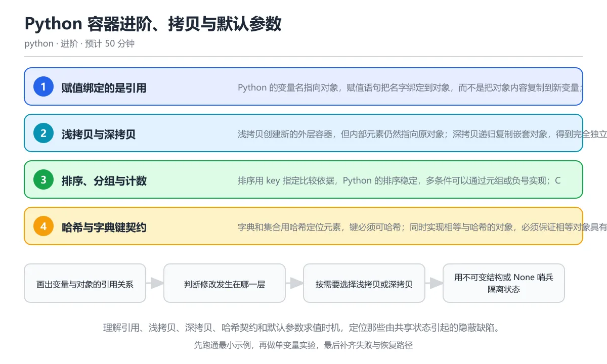

# Python 容器进阶、拷贝与默认参数

> 内容更新时间：2026-10-06 · 学习阶段：进阶 · 预计用时：50 分钟

分类：python。关键词：浅拷贝、深拷贝、哈希、默认参数、稳定排序。理解引用、浅拷贝、深拷贝、哈希契约和默认参数求值时机，定位那些由共享状态引起的隐蔽缺陷。

学习建议：先通读《Python 容器进阶、拷贝与默认参数》的核心知识与关键流程，再运行可运行练习并完成测验；遇到不确定的结论，回到「故障现场」按症状、根因、修复、验证四步核对。



## 本节知识框架

**课程定位**：所属分类为「Python」，课程主题为「Python 容器进阶、拷贝与默认参数」，学习阶段为「进阶」，建议用时 50 分钟。

**本课要解决的主问题**：理解引用、浅拷贝、深拷贝、哈希契约和默认参数求值时机，定位那些由共享状态引起的隐蔽缺陷。

| 学习层次 | 要回答的问题 | 完成判据 |
| --- | --- | --- |
| 概念层 | 「Python 容器进阶、拷贝与默认参数」有哪些必须区分的对象与术语？ | 能用自己的话定义核心术语，并各举一个正例和一个反例。 |
| 机制层 | 这些对象按什么顺序发生作用，输入如何变成输出？ | 能画出或写出机制步骤，并说明每一步的失败条件。 |
| 应用层 | 什么场景适合使用「Python 容器进阶、拷贝与默认参数」，什么场景不适合？ | 能给出一个真实场景、一个最小示例和一个边界案例。 |
| 性能层 | 时间、空间、吞吐或延迟受哪些量影响？ | 能说出复杂度或性能瓶颈的证据来源；没有证据时明确写“材料未提供”。 |
| 复习层 | 怎样确认自己不是只记住了结论？ | 能独立完成本课自测，并把错误定位到概念、机制、示例或边界。 |

### 阅读路线

1. 先读「核心概念定义」，建立「浅拷贝」等对象的精确定义。
2. 再读「原理与运行机制」，把定义串成可重复的过程。
3. 用「代码/协议/SQL 示例」验证过程，并只改一个条件观察结果变化。
4. 最后检查性能、易错点、知识关系与自测题，形成可复习的证据链。

**前置知识**：《列表、元组、字典与集合》

**学习位置**：本课位于《类型注解与测试》之后；如果前一课的自测不能通过，应先回补再继续。

**后续衔接**：下一课《Python 面向对象进阶：继承、组合与魔术方法》会继续使用本课术语，学完后建议立即完成一次自测。

**教材衔接：学习目标**

- 能画出变量、对象和嵌套容器的引用关系图。
- 能按嵌套深度选择浅拷贝或深拷贝，并说明共享代价。
- 能识别可变默认参数、乘法构造嵌套列表等共享陷阱。

**教材衔接：前置知识**

- 会用列表、字典、集合和元组完成基本增删改查。
- 知道函数参数如何传递，能写返回多个值的函数。
- 能在解释器里用 print 与 type 观察对象。

**教材衔接：本课小结**

- Python 容器进阶、拷贝与默认参数围绕浅拷贝、深拷贝、哈希展开，先建立基线再讨论优化。
- Python 的变量名指向对象，赋值语句把名字绑定到对象，而不是把对象内容复制到新变量；两个名字可以指向同一个可变对象。
- 遇到问题时按「症状 → 根因 → 修复 → 验证」的顺序处理，不跳过验证。

## 核心概念定义

> 阅读约定：本课先给「Python 容器进阶、拷贝与默认参数」相关术语的操作性定义与适用边界；正文里的口语化说法与定义冲突时，以定义和可复现示例为准。

| 术语 | 操作性定义 | 本课中的边界 |
| --- | --- | --- |
| 引用 | 变量名指向某个对象的绑定关系，赋值复制的是引用而不是对象内容。 | 仅在「Python 容器进阶、拷贝与默认参数」明确给出的输入、版本与资源条件下成立。 |
| 浅拷贝 | 只复制外层容器，内部元素仍与原对象共享的拷贝方式。 | 仅在「Python 容器进阶、拷贝与默认参数」明确给出的输入、版本与资源条件下成立。 |
| 深拷贝 | 递归复制嵌套对象并保持内部关系独立的拷贝方式。 | 仅在「Python 容器进阶、拷贝与默认参数」明确给出的输入、版本与资源条件下成立。 |
| 可哈希 | 对象在其生命周期内哈希值稳定且可实现相等比较，因而能作为字典键或集合元素。 | 仅在「Python 容器进阶、拷贝与默认参数」明确给出的输入、版本与资源条件下成立。 |
| 稳定排序 | 排序键相等的元素保持原来相对顺序的性质。 | 仅在「Python 容器进阶、拷贝与默认参数」明确给出的输入、版本与资源条件下成立。 |
| None 哨兵 | 用 None 表示未提供参数，并在函数体内创建真正的默认值，避免共享可变对象。 | 仅在「Python 容器进阶、拷贝与默认参数」明确给出的输入、版本与资源条件下成立。 |

### 定义如何使用

在「Python 容器进阶、拷贝与默认参数」中判断一个说法是否成立，先确认它使用的是哪个对象的定义，再检查输入规模、运行环境与失败路径。定义不是口号，而是后续推导、代码示例和自测题共享的约束。

## 原理与运行机制

### 机制总览

1. **建立输入**：把「引用」按本课定义整理成可观察、可重复的输入条件。
2. **执行转换**：围绕「浅拷贝」执行本课的核心步骤；每一步都记录中间状态，避免只看最终输出。
3. **产生输出**：得到「深拷贝」后，用正文示例或协议/SQL 结果核对输出是否符合预期。
4. **改变一个条件**：只替换一个边界条件或环境参数，观察「Python 容器进阶、拷贝与默认参数」的结论是否仍然成立。

| 阶段 | 关注对象 | 失败时应检查 |
| --- | --- | --- |
| 输入 | 引用 | 类型、范围、编码、版本或前置状态是否满足定义。 |
| 处理 | 浅拷贝 | 顺序、可见性、锁、路由、事务或调度规则是否被破坏。 |
| 输出 | 深拷贝 | 结果是否可复现，错误是否被正确传播而不是被吞掉。 |

本课的机制结论要用「Python 容器进阶、拷贝与默认参数」自己的示例验证。「Python 容器进阶、拷贝与默认参数」没有给出某个数量级、吞吐或内存数据时，本课把该判断标为“材料未提供”，不从相邻主题外推。

**教材衔接：核心知识**

### 1. 赋值绑定的是引用

Python 的变量名指向对象，赋值语句把名字绑定到对象，而不是把对象内容复制到新变量；两个名字可以指向同一个可变对象。

对象有唯一身份，id 可以观察身份，is 比较身份，等于号比较值；对列表执行 b = a 后，通过 b 做的原地修改会立刻出现在 a 上，因为它们本来就是同一个列表。

在Python 容器进阶、拷贝与默认参数里可以这样验证：让两个名字指向同一个列表，修改其中一个后再打印两者的内容与 id，观察共享关系。

边界：不可变对象也会被共享，但因为不能原地修改，看起来更安全；元组内部的列表仍然可变，浅层不可变不代表深层不可变。

工程视角：函数返回容器前明确所有权，调用方需要独立数据时在边界复制，不要靠约定猜测谁会修改。

### 2. 浅拷贝与深拷贝

浅拷贝创建新的外层容器，但内部元素仍然指向原对象；深拷贝递归复制嵌套对象，得到完全独立的副本。

copy.copy 只复制第一层引用，copy.deepcopy 用 memo 记录已经复制过的对象，既能保持共享关系又能处理循环引用；深度越大，深拷贝的时间和内存成本越高。

在Python 容器进阶、拷贝与默认参数里可以这样验证：对包含列表的字典分别做浅拷贝与深拷贝，修改浅拷贝里的嵌套列表，再观察原字典和深拷贝是否变化。

边界：深拷贝不是永远正确：文件句柄、锁和数据库连接通常不应被复制；不可变对象也没必要复制。

工程视角：状态需要在多处独立演化时用不可变数据或显式复制函数；复制策略写进接口文档并用测试固定下来。

### 3. 排序、分组与计数

排序用 key 指定比较依据，Python 的排序稳定，多条件可以通过元组或负号实现；Counter、defaultdict 与 deque 覆盖常见统计和队列需求。

sorted 先为每个元素计算 key，再按 key 排序，原始相对顺序在 key 相等时保持不变；Counter 用字典统计可哈希元素，deque 在两端追加和弹出的时间复杂度为常数。

在Python 容器进阶、拷贝与默认参数里可以这样验证：先按分数从高到低、再按姓名排序一组记录，并用 Counter 找出出现次数最多的两个元素。

边界：排序对象必须能比较，混合类型会抛 TypeError；在大量数据上使用 lambda 时要注意计算次数和内存占用。

工程视角：统计口径和排序键集中定义，避免不同模块各自写一遍导致报表口径不一致。

### 4. 哈希与字典键契约

字典和集合用哈希定位元素，键必须可哈希；同时实现相等与哈希的对象，必须保证相等对象具有相同哈希值。

哈希值把键映射到桶，冲突时再按相等比较；可变对象的内容改变后哈希会变化，因此列表和字典不能作为键，元组只有内部元素都不可哈希时才可用。

在Python 容器进阶、拷贝与默认参数里可以这样验证：把数字、字符串和由不可变元素组成的元组放进集合，再尝试放列表并观察 TypeError。

边界：自定义对象默认按身份哈希，即使内容相同也可能被当成两个键；重写相等方法后必须同步重写哈希方法。

工程视角：用作键的对象尽量不可变；需要以复合条件分组时先转换成元组或规范字符串。

### 5. 默认参数在定义时求值

函数的默认参数只在函数定义时求值一次，之后所有调用共享同一个默认对象；用可变对象做默认值会累积状态。

函数对象保存默认值的引用，调用时如果没有传入该参数就复用这个引用；改成 None 哨兵后，每次调用都在函数体内创建新列表，状态自然隔离。

在Python 容器进阶、拷贝与默认参数里可以这样验证：写一个带列表默认参数的函数连续调用两次，观察结果累积，再把默认值改成 None 验证行为恢复独立。

边界：不可变默认值没有共享修改问题，但仍然只求值一次；依赖运行时配置的默认值应放到函数体内计算。

工程视角：默认参数只放不可变值，可变容器用 None 哨兵；代码评审时把可变默认值当成确定性缺陷处理。

**教材衔接：关键流程**

```text
画出变量与对象的引用关系 → 判断修改发生在哪一层 → 按需要选择浅拷贝或深拷贝 → 用不可变结构或 None 哨兵隔离状态 → 用测试覆盖共享与独立两种路径
```

1. 画出变量与对象的引用关系
2. 判断修改发生在哪一层
3. 按需要选择浅拷贝或深拷贝
4. 用不可变结构或 None 哨兵隔离状态
5. 用测试覆盖共享与独立两种路径

## 典型应用场景

| 场景 | 典型输入或前提 | 期望产物 |
| --- | --- | --- |
| 学习验证 | 使用本课最小示例和 浅拷贝、深拷贝 | 能复现正文结论，并解释每一步。 |
| 工程落地 | 把「Python 容器进阶、拷贝与默认参数」放入真实模块或服务边界 | 输出可观测、失败可定位、参数可配置。 |
| 故障排查 | 只改一个版本、规模、输入或依赖条件 | 能区分概念错误、实现错误和环境差异。 |

判断「Python 容器进阶、拷贝与默认参数」的场景是否成立，标准是能否写出输入、处理、输出和失败路径；材料中没有出现的数据在本课标注为“材料未提供”，不用推测替代证据。

**课程内置实验入口**：`sandbox:python`，用于动手验证《Python 容器进阶、拷贝与默认参数》的机制；实验结论不替代概念定义与复杂度分析。

**教材衔接：深度拓展与实战**

这一节把Python 容器进阶、拷贝与默认参数的机制拆开验证：每一步都给出输入、判断标准和失败信号，便于在真实项目里复用。

### 机制拆解 1：赋值绑定的是引用

对象有唯一身份，id 可以观察身份，is 比较身份，等于号比较值；对列表执行 b = a 后，通过 b 做的原地修改会立刻出现在 a 上，因为它们本来就是同一个列表。

落地时先确认前提：不可变对象也会被共享，但因为不能原地修改，看起来更安全；元组内部的列表仍然可变，浅层不可变不代表深层不可变。；再把结论写进检查表，让下一位同学可以按同样的输入复现。

工程做法：函数返回容器前明确所有权，调用方需要独立数据时在边界复制，不要靠约定猜测谁会修改。

### 机制拆解 2：浅拷贝与深拷贝

copy.copy 只复制第一层引用，copy.deepcopy 用 memo 记录已经复制过的对象，既能保持共享关系又能处理循环引用；深度越大，深拷贝的时间和内存成本越高。

落地时先确认前提：深拷贝不是永远正确：文件句柄、锁和数据库连接通常不应被复制；不可变对象也没必要复制。；再把结论写进检查表，让下一位同学可以按同样的输入复现。

工程做法：状态需要在多处独立演化时用不可变数据或显式复制函数；复制策略写进接口文档并用测试固定下来。

### 机制拆解 3：排序、分组与计数

sorted 先为每个元素计算 key，再按 key 排序，原始相对顺序在 key 相等时保持不变；Counter 用字典统计可哈希元素，deque 在两端追加和弹出的时间复杂度为常数。

落地时先确认前提：排序对象必须能比较，混合类型会抛 TypeError；在大量数据上使用 lambda 时要注意计算次数和内存占用。；再把结论写进检查表，让下一位同学可以按同样的输入复现。

工程做法：统计口径和排序键集中定义，避免不同模块各自写一遍导致报表口径不一致。

### 机制拆解 4：哈希与字典键契约

哈希值把键映射到桶，冲突时再按相等比较；可变对象的内容改变后哈希会变化，因此列表和字典不能作为键，元组只有内部元素都不可哈希时才可用。

落地时先确认前提：自定义对象默认按身份哈希，即使内容相同也可能被当成两个键；重写相等方法后必须同步重写哈希方法。；再把结论写进检查表，让下一位同学可以按同样的输入复现。

工程做法：用作键的对象尽量不可变；需要以复合条件分组时先转换成元组或规范字符串。

### 机制拆解 5：默认参数在定义时求值

函数对象保存默认值的引用，调用时如果没有传入该参数就复用这个引用；改成 None 哨兵后，每次调用都在函数体内创建新列表，状态自然隔离。

落地时先确认前提：不可变默认值没有共享修改问题，但仍然只求值一次；依赖运行时配置的默认值应放到函数体内计算。；再把结论写进检查表，让下一位同学可以按同样的输入复现。

工程做法：默认参数只放不可变值，可变容器用 None 哨兵；代码评审时把可变默认值当成确定性缺陷处理。

### 机制对照表

| 概念 | 解决什么问题 | 关键前提 | 失败信号 |
| --- | --- | --- | --- |
| 赋值绑定的是引用 | Python 的变量名指向对象，赋值语句把名字绑定到对象，而不是把对象内容复制到 | 不可变对象也会被共享，但因为不能原地修改，看起来更安全；元组内部的列表仍 | 函数返回容器前明确所有权，调用方需要独立数据时在边界复制，不要靠约定猜测 |
| 浅拷贝与深拷贝 | 浅拷贝创建新的外层容器，但内部元素仍然指向原对象；深拷贝递归复制嵌套对象，得到完 | 深拷贝不是永远正确：文件句柄、锁和数据库连接通常不应被复制；不可变对象也 | 状态需要在多处独立演化时用不可变数据或显式复制函数；复制策略写进接口文档 |
| 排序、分组与计数 | 排序用 key 指定比较依据，Python 的排序稳定，多条件可以通过元组或负号 | 排序对象必须能比较，混合类型会抛 TypeError；在大量数据上使用  | 统计口径和排序键集中定义，避免不同模块各自写一遍导致报表口径不一致。 |
| 哈希与字典键契约 | 字典和集合用哈希定位元素，键必须可哈希；同时实现相等与哈希的对象，必须保证相等对 | 自定义对象默认按身份哈希，即使内容相同也可能被当成两个键；重写相等方法后 | 用作键的对象尽量不可变；需要以复合条件分组时先转换成元组或规范字符串。 |
| 默认参数在定义时求值 | 函数的默认参数只在函数定义时求值一次，之后所有调用共享同一个默认对象；用可变对象 | 不可变默认值没有共享修改问题，但仍然只求值一次；依赖运行时配置的默认值应 | 默认参数只放不可变值，可变容器用 None 哨兵；代码评审时把可变默认值 |

### 自测问答

**问 1**：对嵌套字典做浅拷贝后修改其中的列表，会发生什么？

**答**：原字典里的列表也会变化，因为内层对象仍然共享。浅拷贝只创建新的外层字典，内层列表仍然是同一个对象的引用，所以通过副本修改列表会反映到原字典。若希望内外都独立，需要使用 copy.deepcopy，或者把嵌套数据设计成不可变结构。判断拷贝是否足够，关键看被修改的层级有没有被复制。 正确选项「原字典里的列表也会变化，因为内层对象仍然共享」对应《Python 容器进阶、拷贝与默认参数》的要点「赋值绑定的是引用」：Python 的变量名指向对象，赋值语句把名字绑定到对象，而不是把对象内容复制到新变量；两个名字可以指向同一个可变对象。判断「赋值绑定的是引用」时先确认前提是否成立，再回到《Python 容器进阶、拷贝与默认参数》的示例核对一次；把别的语言或框架的默认做法直接搬到赋值绑定的是引用上，往往会在本课的边界条件里失效。

**问 2**：def add(item, box=[]) 连续调用两次会出现什么结果？

**答**：两次调用共享同一个列表，第二次结果包含第一次的元素。默认参数在函数定义时只求值一次，box 会一直引用同一个列表，因此多次调用共享状态并不断累积元素。正确做法是把默认值设为 None，在函数体内判断并创建列表，这样每次调用都能获得独立容器，也避免测试之间互相污染。 正确选项「两次调用共享同一个列表，第二次结果包含第一次的元素」对应《Python 容器进阶、拷贝与默认参数》的要点「浅拷贝与深拷贝」：浅拷贝创建新的外层容器，但内部元素仍然指向原对象；深拷贝递归复制嵌套对象，得到完全独立的副本。判断「浅拷贝与深拷贝」时先确认前提是否成立，再回到《Python 容器进阶、拷贝与默认参数》的示例核对一次；借鉴相邻主题的经验之前，先核对浅拷贝与深拷贝的前提是否成立。

**问 3**：以下哪些对象可以直接作为字典的键？（多选）

**答**：由整数组成的元组 (1, 2)；冻结集合 frozenset({1, 2})。整数元组和冻结集合都是不可变且可哈希的，可以作为字典键；普通列表和字典是可变对象，内容变化会破坏哈希定位，解释器会直接抛出 TypeError。若确实需要以复合结构分组，可以先转换成元组、字符串或冻结集合。 正确选项「由整数组成的元组 (1, 2)；冻结集合 frozenset({1, 2})」对应《Python 容器进阶、拷贝与默认参数》的要点「排序、分组与计数」：排序用 key 指定比较依据，Python 的排序稳定，多条件可以通过元组或负号实现；Counter、defaultdict 与 deque 覆盖常见统计和队列需求。判断「排序、分组与计数」时先确认前提是否成立，再回到《Python 容器进阶、拷贝与默认参数》的示例核对一次；记住排序、分组与计数的结论之外还要记住适用条件，换一个输入往往就不成立了。

**问 4**：阅读代码，输出是什么？

rows = [[]] * 2
rows[0].append(1)
print(rows)

**答**：[[1], [1]]。输出是 [[1], [1]]。乘法只复制了外层列表中的引用，两个位置指向同一个内层列表，修改第一个位置会影响第二个位置。要得到独立的两行，应写 [[ ] for _ in range(2)] 或使用列表推导式创建新列表，再用测试固定这个行为。这个现象本质上就是浅拷贝语义，嵌套列表需要深拷贝或重新构造才能独立。

**问 5**：下面函数为什么会让调用方意外修改内部状态？

def get_items():
    return self.items

**答**：返回了内部列表本身，调用方可以原地修改，应返回副本或不可变视图。返回内部列表本身会让调用方拿到同一个可变对象，随后 append 或 clear 都会悄悄改变对象状态，破坏封装并制造难以复现的 bug。可以返回 list(self.items) 这样的浅拷贝、返回 tuple 形式的只读视图，或者明确提供受控的增删方法并在文档中说明所有权。 正确选项「返回了内部列表本身，调用方可以原地修改，应返回副本或不可变视图」对应《Python 容器进阶、拷贝与默认参数》的要点「默认参数在定义时求值」：函数的默认参数只在函数定义时求值一次，之后所有调用共享同一个默认对象；用可变对象做默认值会累积状态。判断「默认参数在定义时求值」时先确认前提是否成立，再回到《Python 容器进阶、拷贝与默认参数》的示例核对一次；把默认参数在定义时求值的做法换到别的约束下未必成立，先确认边界再决定答案。

### 排错速查

- 看到「写 [[0] * 3] * 2 以为得到两行互相独立的表格」时，先按「改成 [[0] * 3 for _ in range(2)]，让每次迭代创建新列表」处理，再用Python 容器进阶、拷贝与默认参数的最小示例确认结论是否恢复。
- 看到「def push(item, box=[]): box.append(item) 连续调用后历史数据一直保留」时，先按「默认值写 None，在函数体内判断并创建新容器」处理，再用Python 容器进阶、拷贝与默认参数的最小示例确认结论是否恢复。
- 看到「复制字典后修改其中的嵌套列表，原对象也跟着变化」时，先按「按嵌套深度选择 deepcopy，或把嵌套结构改成不可变对象」处理，再用Python 容器进阶、拷贝与默认参数的最小示例确认结论是否恢复。
- 看到「把列表或字典放进 set 或作为 dict 的键，运行时抛 TypeError」时，先按「转换为元组、字符串或冻结集合后再作为键」处理，再用Python 容器进阶、拷贝与默认参数的最小示例确认结论是否恢复。

### 工程检查表

- [ ] 画出变量与对象的引用关系
- [ ] 判断修改发生在哪一层
- [ ] 按需要选择浅拷贝或深拷贝
- [ ] 用不可变结构或 None 哨兵隔离状态
- [ ] 用测试覆盖共享与独立两种路径
- [ ] 【赋值绑定的是引用】函数返回容器前明确所有权，调用方需要独立数据时在边界复制，不要靠约定猜测谁会修改。
- [ ] 【浅拷贝与深拷贝】状态需要在多处独立演化时用不可变数据或显式复制函数；复制策略写进接口文档并用测试固定下来。
- [ ] 【排序、分组与计数】统计口径和排序键集中定义，避免不同模块各自写一遍导致报表口径不一致。
- [ ] 【哈希与字典键契约】用作键的对象尽量不可变；需要以复合条件分组时先转换成元组或规范字符串。
- [ ] 【默认参数在定义时求值】默认参数只放不可变值，可变容器用 None 哨兵；代码评审时把可变默认值当成确定性缺陷处理。

### 迁移练习

把Python 容器进阶、拷贝与默认参数的方法用到一个真实场景：写下浅拷贝、深拷贝、哈希在你的场景里分别对应什么，再记录一次失败尝试和它的恢复步骤。

### 延伸阅读与下一步

- 复习浅拷贝、深拷贝、哈希、默认参数、稳定排序时，优先回看「赋值绑定的是引用」与「默认参数在定义时求值」两节。
- 把从「画出变量与对象的引用关系」到「用测试覆盖共享与独立两种路径」的流程画成一张图，放进自己的笔记。
- 一周后重做本课测验，只把答错的题留到下一轮复习。

### 结论与下一步

学完Python 容器进阶、拷贝与默认参数，应该能独立完成三件事：先用最小示例确认浅拷贝的行为，再用一个边界输入验证结论，最后把失败路径写成可重复的检查。下一步把本课术语加入复习清单，并在两周内用一次真实任务检验记忆是否牢固。

## 代码/协议/SQL 示例

### 最小可验证示例

下面保留《Python 容器进阶、拷贝与默认参数》原文中的最小示例。先预测《Python 容器进阶、拷贝与默认参数》示例的输出，再按正文步骤运行或推演；示例依赖外部环境时，同时记录版本与输入。

```text
画出变量与对象的引用关系 → 判断修改发生在哪一层 → 按需要选择浅拷贝或深拷贝 → 用不可变结构或 None 哨兵隔离状态 → 用测试覆盖共享与独立两种路径
```

**教材衔接：原文最小示例**

```text
画出变量与对象的引用关系 → 判断修改发生在哪一层 → 按需要选择浅拷贝或深拷贝 → 用不可变结构或 None 哨兵隔离状态 → 用测试覆盖共享与独立两种路径
```

## 时间/空间复杂度或性能分析

**复杂度证据**：「Python 容器进阶、拷贝与默认参数」的现有材料没有给出渐近时间或空间复杂度的明确结论，本课只做定性检查，不补写未经验证的 $O$ 记号。

| 维度 | 本课关注点 | 判断依据 |
| --- | --- | --- |
| 时间/延迟 | 「Python 容器进阶、拷贝与默认参数」的主要步骤是否会随输入规模、并发度或网络往返增长。 | 以正文复杂度、基准数据或可重复测量为准。 |
| 空间/内存 | 中间状态、缓存、副本、连接或索引是否随规模增长。 | 记录峰值内存与数据副本，不只看最终结果。 |
| 吞吐/资源 | 版本、调度、锁、IO、序列化或协议开销是否成为瓶颈。 | 固定环境做对照实验，改变一个变量。 |

评估「Python 容器进阶、拷贝与默认参数」时要区分“正确性成立”和“性能达标”两件事；材料没有给出基准时，本课只保留量级来源与测量方法，不写不可验证的绝对数字。

## 常见误区与易错点

> 复核《Python 容器进阶、拷贝与默认参数》的易错点时，优先保留原文的错误表、故障现场与排错路径；每条修正都要能用本课示例复验。

| 易错点 | 常见表现 | 正确做法 |
| --- | --- | --- |
| 只背结论 | 能复述「Python 容器进阶、拷贝与默认参数」的定义，却说不清输入、输出与边界。 | 回到机制步骤，用最小示例逐一验证。 |
| 混淆相邻概念 | 把本课对象与相邻主题的对象当成同一类。 | 先比较定义、资源归属、生命周期和失败模式。 |
| 忽略版本与环境 | 在开发机通过后直接外推到生产环境。 | 固定版本、输入和资源条件，再记录可复现结果。 |

**教材衔接：常见错误与排查**

> 说明：本表由《Python 容器进阶、拷贝与默认参数》的核心知识整理（2026-10-06），人工复核进度见 docs/content_review_batches.md。

| 易错点 | 容易踩的做法 | 正确结论 |
| --- | --- | --- |
| 用乘法构造嵌套容器 | 写 [[0] * 3] * 2 以为得到两行互相独立的表格 | 改成 [[0] * 3 for _ in range(2)]，让每次迭代创建新列表 |
| 可变默认参数累积状态 | def push(item, box=[]): box.append(item) 连续调用后历史数据一直保留 | 默认值写 None，在函数体内判断并创建新容器 |
| 浅拷贝被当成完全独立的副本 | 复制字典后修改其中的嵌套列表，原对象也跟着变化 | 按嵌套深度选择 deepcopy，或把嵌套结构改成不可变对象 |
| 用可变对象当字典键 | 把列表或字典放进 set 或作为 dict 的键，运行时抛 TypeError | 转换为元组、字符串或冻结集合后再作为键 |

**教材衔接：故障现场**

### 现场 1：用乘法构造嵌套容器

**症状**：在《Python 容器进阶、拷贝与默认参数》里采用「写 [[0] * 3] * 2 以为得到两行互相独立的表格」时，用乘法构造嵌套容器会表现为错误结果、异常中断或状态不一致。

**根因**：这个做法没有执行与「用乘法构造嵌套容器」对应的检查，问题被带到了后续步骤。

**修复**：改成 [[0] * 3 for _ in range(2)]，让每次迭代创建新列表

**验证**：为「用乘法构造嵌套容器」准备一个最小输入，确认修复前的失败可以复现，修复后的输出与本课示例一致，再补一个边界输入。

### 现场 2：可变默认参数累积状态

**症状**：在《Python 容器进阶、拷贝与默认参数》里采用「def push(item, box=[]): box.append(item) 连续调用后历史数据一直保留」时，可变默认参数累积状态会表现为错误结果、异常中断或状态不一致。

**根因**：这个做法没有执行与「可变默认参数累积状态」对应的检查，问题被带到了后续步骤。

**修复**：默认值写 None，在函数体内判断并创建新容器

**验证**：为「可变默认参数累积状态」准备一个最小输入，确认修复前的失败可以复现，修复后的输出与本课示例一致，再补一个边界输入。

### 现场 3：浅拷贝被当成完全独立的副本

**症状**：在《Python 容器进阶、拷贝与默认参数》里采用「复制字典后修改其中的嵌套列表，原对象也跟着变化」时，浅拷贝被当成完全独立的副本会表现为错误结果、异常中断或状态不一致。

**根因**：这个做法没有执行与「浅拷贝被当成完全独立的副本」对应的检查，问题被带到了后续步骤。

**修复**：按嵌套深度选择 deepcopy，或把嵌套结构改成不可变对象

**验证**：为「浅拷贝被当成完全独立的副本」准备一个最小输入，确认修复前的失败可以复现，修复后的输出与本课示例一致，再补一个边界输入。

### 现场 4：用可变对象当字典键

**症状**：在《Python 容器进阶、拷贝与默认参数》里采用「把列表或字典放进 set 或作为 dict 的键，运行时抛 TypeError」时，用可变对象当字典键会表现为错误结果、异常中断或状态不一致。

**根因**：这个做法没有执行与「用可变对象当字典键」对应的检查，问题被带到了后续步骤。

**修复**：转换为元组、字符串或冻结集合后再作为键

**验证**：为「用可变对象当字典键」准备一个最小输入，确认修复前的失败可以复现，修复后的输出与本课示例一致，再补一个边界输入。

## 与其他知识点的关系

| 关系 | 课程 | 为什么 |
| --- | --- | --- |
| 先修 | 《列表、元组、字典与集合》 | 本课会直接使用它的概念或操作前提。 |
| 关联 | 《类与对象》 | 用于横向比较或把本课结论迁移到相邻主题。 |
| 关联 | 《Python 面向对象进阶：继承、组合与魔术方法》 | 用于横向比较或把本课结论迁移到相邻主题。 |
| 前置顺序 | 《类型注解与测试》 | 同分类中安排在本课之前，建议先完成其自测。 |
| 后续顺序 | 《Python 面向对象进阶：继承、组合与魔术方法》 | 同分类中安排在本课之后，会继续使用本课术语。 |

把「Python 容器进阶、拷贝与默认参数」放回知识体系时，不只要记住“前面学过什么”，还要说明两个主题在输入、机制、资源边界和失败模式上的差异。这样才能把单课知识迁移到项目、排障和后续课程。

**教材衔接：复习与迁移**

### 概念复述

不看正文，把Python 容器进阶、拷贝与默认参数讲给一个没学过的同事：先讲它解决什么问题，再讲一个最小例子，最后说明一个不适用场景。

### 测验回顾

回到《Python 容器进阶、拷贝与默认参数》测验，只重做答错或犹豫的题；对每道题写一句「我为什么改选这个答案」，写不出理由就回到对应小节。

### 迁移练习

把《Python 容器进阶、拷贝与默认参数》的方法用到一个你自己的真实场景：说明输入、约束与验证方式，并列出仍然不确定、需要下一次实验回答的问题。

## 自测题与参考答案

> 先独立作答《Python 容器进阶、拷贝与默认参数》的自测题，再对照答案与解析；每处判断都要能在本课正文或示例中找到依据。

### 自测 1

对嵌套字典做浅拷贝后修改其中的列表，会发生什么？

A. 原字典里的列表也会变化，因为内层对象仍然共享
B. 原字典完全不受影响
C. 浅拷贝会抛出 TypeError
D. 列表会被自动转换成元组

**参考答案**：原字典里的列表也会变化，因为内层对象仍然共享

**解析**：浅拷贝只创建新的外层字典，内层列表仍然是同一个对象的引用，所以通过副本修改列表会反映到原字典。若希望内外都独立，需要使用 copy.deepcopy，或者把嵌套数据设计成不可变结构。判断拷贝是否足够，关键看被修改的层级有没有被复制。 正确选项「原字典里的列表也会变化，因为内层对象仍然共享」对应《Python 容器进阶、拷贝与默认参数》的要点「赋值绑定的是引用」：Python 的变量名指向对象，赋值语句把名字绑定到对象，而不是把对象内容复制到新变量；两个名字可以指向同一个可变对象。判断「赋值绑定的是引用」时先确认前提是否成立，再回到《Python 容器进阶、拷贝与默认参数》的示例核对一次；把别的语言或框架的默认做法直接搬到赋值绑定的是引用上，往往会在本课的边界条件里失效。

### 自测 2

以下哪些对象可以直接作为字典的键？（多选）

A. 由整数组成的元组 (1, 2)
B. 冻结集合 frozenset({1, 2})
C. 列表 [1, 2]
D. 字典 {'a': 1}

**参考答案**：由整数组成的元组 (1, 2)；冻结集合 frozenset({1, 2})

**解析**：整数元组和冻结集合都是不可变且可哈希的，可以作为字典键；普通列表和字典是可变对象，内容变化会破坏哈希定位，解释器会直接抛出 TypeError。若确实需要以复合结构分组，可以先转换成元组、字符串或冻结集合。 正确选项「由整数组成的元组 (1, 2)；冻结集合 frozenset({1, 2})」对应《Python 容器进阶、拷贝与默认参数》的要点「排序、分组与计数」：排序用 key 指定比较依据，Python 的排序稳定，多条件可以通过元组或负号实现；Counter、defaultdict 与 deque 覆盖常见统计和队列需求。判断「排序、分组与计数」时先确认前提是否成立，再回到《Python 容器进阶、拷贝与默认参数》的示例核对一次；记住排序、分组与计数的结论之外还要记住适用条件，换一个输入往往就不成立了。

### 自测 3

阅读代码，输出是什么？

rows = [[]] * 2
rows[0].append(1)
print(rows)

```python
rows = [[]] * 2
rows[0].append(1)
print(rows)
```

A. [[1], [1]]
B. [[1], []]
C. [[], []]
D. 程序抛出异常

**参考答案**：[[1], [1]]

**解析**：输出是 [[1], [1]]。乘法只复制了外层列表中的引用，两个位置指向同一个内层列表，修改第一个位置会影响第二个位置。要得到独立的两行，应写 [[ ] for _ in range(2)] 或使用列表推导式创建新列表，再用测试固定这个行为。这个现象本质上就是浅拷贝语义，嵌套列表需要深拷贝或重新构造才能独立。

**教材衔接：动手练习**

1. 构造一个三层嵌套容器，分别做赋值、浅拷贝和深拷贝，修改每一层后记录哪些对象发生变化。
2. 把一段使用可变默认参数的函数改成 None 哨兵写法，并补一条连续调用两次的回归测试。
3. 用 sorted 与 Counter 完成一份成绩单：按分数降序、姓名升序，再统计各分数段人数。
4. 为自定义对象实现 __eq__ 与 __hash__，验证内容相同的对象在字典中只占一个键。

**验收标准**：留下输入、命令、输出和结论，能让别人按记录复现。

**教材衔接：可运行练习**

### 任务 1：先跑通，再解释

```python
import copy
from collections import Counter

row = {"name": "Ada", "scores": [90, 85]}
shallow = copy.copy(row)
deep = copy.deepcopy(row)
shallow["scores"].append(100)
print("浅拷贝共享:", row["scores"])
print("深拷贝独立:", deep["scores"])

records = [
    {"name": "Lin", "score": 88},
    {"name": "Ada", "score": 95},
    {"name": "Bo", "score": 88},
]
ordered = sorted(records, key=lambda item: (-item["score"], item["name"]))
print("排序:", [(item["name"], item["score"]) for item in ordered])
print("计数:", Counter([1, 1, 2, 3, 3, 3]).most_common(2))

def add_tag(tag, tags=None):
    if tags is None:
        tags = []
    tags.append(tag)
    return tags

print("独立默认值:", add_tag("python"), add_tag("sql"))
```

脚本先用浅拷贝和深拷贝处理同一个嵌套字典，验证浅拷贝里的列表与原字典共享；随后用排序键同时表达分数降序和姓名升序，用 Counter 统计频次；最后用 None 哨兵替代可变默认参数，保证每次调用都得到独立列表。

### 任务 2：只改一个条件

复制上面的示例，只改一个输入或参数再跑一次；先写下预测，再和真实输出对照，并说明差异来自Python 容器进阶、拷贝与默认参数的哪条机制。

### 任务 3：迁移到自己的数据

把《Python 容器进阶、拷贝与默认参数》里的示例换成你自己的一小段数据或场景，保持结构不变；如果换不动，说明还有哪条前提没有理解，回到核心知识对应小节。

**教材衔接：本课复习清单**

离开本课前，逐项确认：

- [ ] 能画出浅拷贝后仍然共享的内层对象。
- [ ] 能用 None 哨兵消除可变默认参数的状态累积。
- [ ] 能解释列表不能作为字典键的原因。
- [ ] 至少运行一次本课示例，记录输入、输出和一个边界情况。
- [ ] 把本课最容易混淆的两个概念写成一句话对照。

| 复盘项 | 记录 |
| --- | --- |
| 已经能独立解释的考点 |  |
| 仍然说不清的概念 |  |
| 下一步验证动作 |  |

**教材衔接：复习与自测**

### 核心知识

遮住正文回答：Python 容器进阶、拷贝与默认参数解决什么问题、依赖哪些前提、失败时先看哪个信号？三问都能答清楚，再进入下一节。

### 动手练习

把《Python 容器进阶、拷贝与默认参数》里「只改一个条件」的练习再做一遍，这次先写预测再运行；预测和结果不一致的地方，就是需要回读的章节。

### 最小可运行示例

```python
import copy
from collections import Counter

row = {"name": "Ada", "scores": [90, 85]}
shallow = copy.copy(row)
deep = copy.deepcopy(row)
shallow["scores"].append(100)
print("浅拷贝共享:", row["scores"])
print("深拷贝独立:", deep["scores"])

records = [
    {"name": "Lin", "score": 88},
    {"name": "Ada", "score": 95},
    {"name": "Bo", "score": 88},
]
ordered = sorted(records, key=lambda item: (-item["score"], item["name"]))
print("排序:", [(item["name"], item["score"]) for item in ordered])
print("计数:", Counter([1, 1, 2, 3, 3, 3]).most_common(2))

def add_tag(tag, tags=None):
    if tags is None:
        tags = []
    tags.append(tag)
    return tags

print("独立默认值:", add_tag("python"), add_tag("sql"))
```

### 预期输出

```text
浅拷贝共享: [90, 85, 100]
深拷贝独立: [90, 85]
排序: [('Ada', 95), ('Bo', 88), ('Lin', 88)]
计数: [(3, 3), (1, 2)]
独立默认值: ['python'] ['sql']
```

### 验证步骤

1. 确认输入数据与运行环境和示例一致。
2. 运行示例，记录输出与耗时等可观测指标。
3. 换一个边界输入重跑，确认结论仍然成立。
4. 把两次结果写成一句话结论，注明前提与局限。

---

## 术语速查

先遮住右列，尝试用自己的话解释，再回到正文核对。

| 术语 | 一句话说明 |
| --- | --- |
| `引用` | 变量名指向某个对象的绑定关系，赋值复制的是引用而不是对象内容。 |
| `浅拷贝` | 只复制外层容器，内部元素仍与原对象共享的拷贝方式。 |
| `深拷贝` | 递归复制嵌套对象并保持内部关系独立的拷贝方式。 |
| `可哈希` | 对象在其生命周期内哈希值稳定且可实现相等比较，因而能作为字典键或集合元素。 |
| `稳定排序` | 排序键相等的元素保持原来相对顺序的性质。 |
| `None 哨兵` | 用 None 表示未提供参数，并在函数体内创建真正的默认值，避免共享可变对象。 |

## 考点精讲

### 考点 1：对嵌套字典做浅拷贝后修改其中的列表，会发

题型：概念判断。题干：对嵌套字典做浅拷贝后修改其中的列表，会发生什么？

判断要点：原字典里的列表也会变化，因为内层对象仍然共享。浅拷贝只创建新的外层字典，内层列表仍然是同一个对象的引用，所以通过副本修改列表会反映到原字典。若希望内外都独立，需要使用 copy.deepcopy，或者把嵌套数据设计成不可变结构。判断拷贝是否足够，关键看被修改的层级有没有被复制。 正确选项「原字典里的列表也会变化，因为内层对象仍然共享」对应《Python 容器进阶、拷贝与默认参数》的要点「赋值绑定的是引用」：Python 的变量名指向对象，赋值语句把名字绑定到对象，而不是把对象内容复制到新变量；两个名字可以指向同一个可变对象。判断「赋值绑定的是引用」时先确认前提是否成立，再回到《Python 容器进阶、拷贝与默认参数》的示例核对一次；把别的语言或框架的默认做法直接搬到赋值绑定的是引用上，往往会在本课的边界条件里失效。

### 考点 2：def add(item, box=[]

题型：概念判断。题干：def add(item, box=[]) 连续调用两次会出现什么结果？

判断要点：两次调用共享同一个列表，第二次结果包含第一次的元素。默认参数在函数定义时只求值一次，box 会一直引用同一个列表，因此多次调用共享状态并不断累积元素。正确做法是把默认值设为 None，在函数体内判断并创建列表，这样每次调用都能获得独立容器，也避免测试之间互相污染。 正确选项「两次调用共享同一个列表，第二次结果包含第一次的元素」对应《Python 容器进阶、拷贝与默认参数》的要点「浅拷贝与深拷贝」：浅拷贝创建新的外层容器，但内部元素仍然指向原对象；深拷贝递归复制嵌套对象，得到完全独立的副本。判断「浅拷贝与深拷贝」时先确认前提是否成立，再回到《Python 容器进阶、拷贝与默认参数》的示例核对一次；借鉴相邻主题的经验之前，先核对浅拷贝与深拷贝的前提是否成立。

### 考点 3：以下哪些对象可以直接作为字典的键？（多选

题型：多选辨析。题干：以下哪些对象可以直接作为字典的键？（多选）

判断要点：由整数组成的元组 (1, 2)；冻结集合 frozenset({1, 2})。整数元组和冻结集合都是不可变且可哈希的，可以作为字典键；普通列表和字典是可变对象，内容变化会破坏哈希定位，解释器会直接抛出 TypeError。若确实需要以复合结构分组，可以先转换成元组、字符串或冻结集合。 正确选项「由整数组成的元组 (1, 2)；冻结集合 frozenset({1, 2})」对应《Python 容器进阶、拷贝与默认参数》的要点「排序、分组与计数」：排序用 key 指定比较依据，Python 的排序稳定，多条件可以通过元组或负号实现；Counter、defaultdict 与 deque 覆盖常见统计和队列需求。判断「排序、分组与计数」时先确认前提是否成立，再回到《Python 容器进阶、拷贝与默认参数》的示例核对一次；记住排序、分组与计数的结论之外还要记住适用条件，换一个输入往往就不成立了。

### 考点 4：阅读代码，输出是什么？

rows = 

题型：代码阅读。题干：阅读代码，输出是什么？

rows = [[]] * 2
rows[0].append(1)
print(rows)

判断要点：[[1], [1]]。输出是 [[1], [1]]。乘法只复制了外层列表中的引用，两个位置指向同一个内层列表，修改第一个位置会影响第二个位置。要得到独立的两行，应写 [[ ] for _ in range(2)] 或使用列表推导式创建新列表，再用测试固定这个行为。这个现象本质上就是浅拷贝语义，嵌套列表需要深拷贝或重新构造才能独立。

### 考点 5：下面函数为什么会让调用方意外修改内部状态

题型：排错。题干：下面函数为什么会让调用方意外修改内部状态？

def get_items():
    return self.items

判断要点：返回了内部列表本身，调用方可以原地修改，应返回副本或不可变视图。返回内部列表本身会让调用方拿到同一个可变对象，随后 append 或 clear 都会悄悄改变对象状态，破坏封装并制造难以复现的 bug。可以返回 list(self.items) 这样的浅拷贝、返回 tuple 形式的只读视图，或者明确提供受控的增删方法并在文档中说明所有权。 正确选项「返回了内部列表本身，调用方可以原地修改，应返回副本或不可变视图」对应《Python 容器进阶、拷贝与默认参数》的要点「默认参数在定义时求值」：函数的默认参数只在函数定义时求值一次，之后所有调用共享同一个默认对象；用可变对象做默认值会累积状态。判断「默认参数在定义时求值」时先确认前提是否成立，再回到《Python 容器进阶、拷贝与默认参数》的示例核对一次；把默认参数在定义时求值的做法换到别的约束下未必成立，先确认边界再决定答案。

## English Overview

Python Containers, Copies and Mutable Defaults

Python names bind to objects, so assignment does not copy data. This lesson contrasts shallow and deep copies, explains hashing and equality contracts, shows stable sorting with composite keys, and fixes shared-state bugs caused by mutable default arguments and nested list multiplication.

## 内容元数据

- 内容版本：v2.0
- 最后更新：2026-10-06
- 学习阶段：进阶

| 字段 | 值 |
| --- | --- |
| 课程 ID | `python_containers_copy` |
| 所属分类 | `python` |
| 难度 | 进阶 |
| 预计用时 | 50 分钟 |
| 关键词 | 浅拷贝、深拷贝、哈希、默认参数、稳定排序 |
| 配图 | `images/lesson_python_containers_copy.webp` |
| 参考资料 | 3 条 |
| 内容更新时间 | 2026-10-06 |

## 参考资料与复核

- 最后复核：2026-10-04
- 下次复核：2026-11-10
- 复核范围：版本兼容、API 行为与工程实践

下面列出的资料用于核对本课结论，复习时可以对照阅读：
- [Python copy 模块文档](https://docs.python.org/3/library/copy.html)
- [Python 数据模型：对象、值与类型](https://docs.python.org/3/reference/datamodel.html)
- [Python Sorting HOWTO](https://docs.python.org/3/howto/sorting.html)

> 复核提示：《Python 容器进阶、拷贝与默认参数》的结论如与资料冲突，以资料中的规范文本为准，并在笔记里记录差异与日期。
