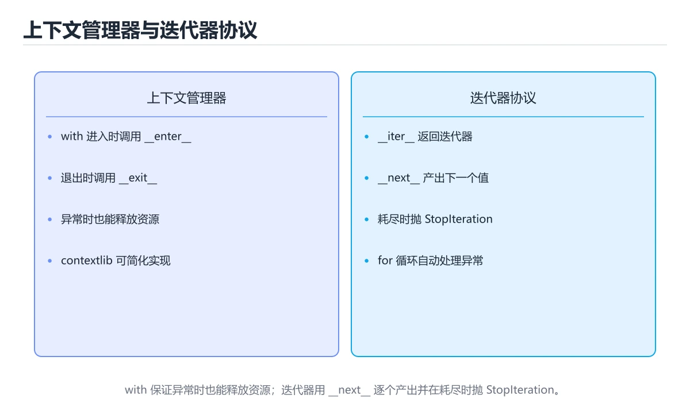
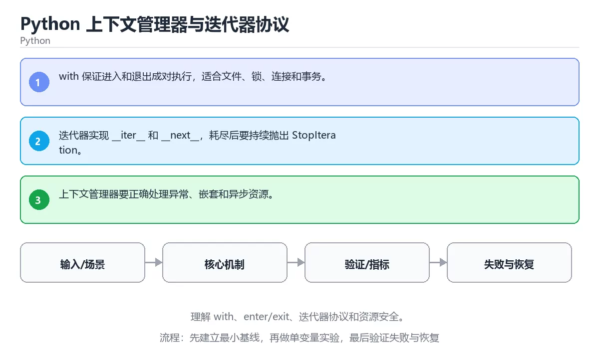

# Python 上下文管理器与迭代器协议





> 内容更新时间：2026-10-06 · 学习阶段：高级 · 预计用时：40 分钟

## 本节知识框架

**课程定位**：所属分类为「Python」，课程主题为「Python 上下文管理器与迭代器协议」，学习阶段为「高级」，建议用时 40 分钟。

**本课要解决的主问题**：理解 with、enter/exit、迭代器协议和资源安全。

| 学习层次 | 要回答的问题 | 完成判据 |
| --- | --- | --- |
| 概念层 | 「Python 上下文管理器与迭代器协议」有哪些必须区分的对象与术语？ | 能用自己的话定义核心术语，并各举一个正例和一个反例。 |
| 机制层 | 这些对象按什么顺序发生作用，输入如何变成输出？ | 能画出或写出机制步骤，并说明每一步的失败条件。 |
| 应用层 | 什么场景适合使用「Python 上下文管理器与迭代器协议」，什么场景不适合？ | 能给出一个真实场景、一个最小示例和一个边界案例。 |
| 性能层 | 时间、空间、吞吐或延迟受哪些量影响？ | 能说出复杂度或性能瓶颈的证据来源；没有证据时明确写“材料未提供”。 |
| 复习层 | 怎样确认自己不是只记住了结论？ | 能独立完成本课自测，并把错误定位到概念、机制、示例或边界。 |

### 阅读路线

1. 先读「核心概念定义」，建立「上下文管理器」等对象的精确定义。
2. 再读「原理与运行机制」，把定义串成可重复的过程。
3. 用「代码/协议/SQL 示例」验证过程，并只改一个条件观察结果变化。
4. 最后检查性能、易错点、知识关系与自测题，形成可复习的证据链。

**前置知识**：《Python 装饰器与生成器》

**学习位置**：本课位于《Python HTTP 客户端工程：超时、重试与认证》之后；如果前一课的自测不能通过，应先回补再继续。

**后续衔接**：下一课《Python 安全基础：密码、随机数与不可信输入》会继续使用本课术语，学完后建议立即完成一次自测。

**教材衔接：学习目标**

- 能用自己的话解释：with 保证进入和退出成对执行，适合文件、锁、连接和事务。
- 能用自己的话解释：迭代器实现 __iter__ 和 __next__，耗尽后要持续抛出 StopIteration。
- 能用自己的话解释：上下文管理器要正确处理异常、嵌套和异步资源。
- 能把本课知识放回「Python」，并完成练习与测验。

**教材衔接：前置知识**

- 具备本分类的前置知识，能跑通「Python 上下文管理器与迭代器协议」的示例并解释输出。
- 本课关键词：上下文管理器、迭代器、with、资源。
- 遇到不熟悉的术语先记录问题，完成练习后再回读。

**教材衔接：本课小结**

- 本课围绕 上下文管理器、迭代器、with、资源 展开，复习时重点核对它们的输入、输出和失败路径。
- 把还不确定的 StopIteration 行为写成一条可执行验证，再进入下一课。

## 核心概念定义

> 阅读约定：本课先给「Python 上下文管理器与迭代器协议」相关术语的操作性定义与适用边界；正文里的口语化说法与定义冲突时，以定义和可复现示例为准。

| 术语 | 操作性定义 | 本课中的边界 |
| --- | --- | --- |
| 上下文管理器 | 用 with 语法在代码块前后自动执行获取与释放资源的协议。 | 仅在「Python 上下文管理器与迭代器协议」明确给出的输入、版本与资源条件下成立。 |
| 迭代器 | 按顺序逐个访问集合元素并维护当前位置的协议或对象。 | 仅在「Python 上下文管理器与迭代器协议」明确给出的输入、版本与资源条件下成立。 |
| with | 上下文管理器：__enter__ 与 __exit__ 保证退出时释放资源，中途抛异常也会执行清理。 | 仅在「Python 上下文管理器与迭代器协议」明确给出的输入、版本与资源条件下成立。 |
| 资源 | Agent 可通过协议读取或操作的受控对象，访问范围必须经过授权。 | 仅在「Python 上下文管理器与迭代器协议」明确给出的输入、版本与资源条件下成立。 |

### 定义如何使用

在「Python 上下文管理器与迭代器协议」中判断一个说法是否成立，先确认它使用的是哪个对象的定义，再检查输入规模、运行环境与失败路径。定义不是口号，而是后续推导、代码示例和自测题共享的约束。

## 原理与运行机制

### 机制总览

1. **建立输入**：把「上下文管理器」按本课定义整理成可观察、可重复的输入条件。
2. **执行转换**：围绕「迭代器」执行本课的核心步骤；每一步都记录中间状态，避免只看最终输出。
3. **产生输出**：得到「with」后，用正文示例或协议/SQL 结果核对输出是否符合预期。
4. **改变一个条件**：只替换一个边界条件或环境参数，观察「Python 上下文管理器与迭代器协议」的结论是否仍然成立。

| 阶段 | 关注对象 | 失败时应检查 |
| --- | --- | --- |
| 输入 | 上下文管理器 | 类型、范围、编码、版本或前置状态是否满足定义。 |
| 处理 | 迭代器 | 顺序、可见性、锁、路由、事务或调度规则是否被破坏。 |
| 输出 | with | 结果是否可复现，错误是否被正确传播而不是被吞掉。 |

本课的机制结论要用「Python 上下文管理器与迭代器协议」自己的示例验证。「Python 上下文管理器与迭代器协议」没有给出某个数量级、吞吐或内存数据时，本课把该判断标为“材料未提供”，不从相邻主题外推。

**教材衔接：核心知识**

### 1. with 保证进入和退出成对执行，适合文件、锁、连接和事务。

- 关键做法：先让 上下文管理器 的最小示例可复现，再加入并发或规模条件。
- 验证标准：上下文管理器 的结果可复现、错误可解释、失败能恢复。

### 2. 迭代器实现 __iter__ 和 __next__，耗尽后要持续抛出 StopIteration。

把这条结论放回「Python 上下文管理器与迭代器协议」的完整流程里展开：

- 正文依据：能用自己的话解释：with 保证进入和退出成对执行，适合文件、锁、连接和事务。
- 落地检查：把「2. 迭代器实现 __iter__ 和 __next__，耗尽后要持续抛出 StopIteration。」改写成一条可执行的核对项，逐条验证输入、超时与失败路径。

### 3. 上下文管理器要正确处理异常、嵌套和异步资源。

把这条结论放回「Python 上下文管理器与迭代器协议」的完整流程里展开：

- 正文依据：能用自己的话解释：迭代器实现 iter 和 next，耗尽后要持续抛出 StopIteration。
- 落地检查：把「3. 上下文管理器要正确处理异常、嵌套和异步资源。」改写成一条可执行的核对项，逐条验证输入、超时与失败路径。

**教材衔接：关键流程**

```text
输入 → 校验 → 核心处理 → 验证 → 记录指标 → 失败恢复
```

**教材衔接：实践路径**

1. 用一句话复述本课要解决的问题。
2. 跑通正文中的最小示例并记录基线。
3. 只改变一个输入或参数，预测并验证结果。
4. 补一个失败路径，记录错误、恢复和指标。
5. 把结论写成可复现的笔记或测试。

**教材衔接：版本与时效**

### 升级检查清单

- 先固定当前版本，跑通全部示例与测验，再升级工具链。
- 一次只改一个版本条件，把 上下文管理器 相关的差异单独记成一条结论。
- 回归范围锁定 StopIteration 的默认行为，并确认弃用警告是否出现在构建输出里。
- 升级完成后更新本课「最后复核 / 下次复核」日期，并记录 上下文管理器 的版本变化。

**教材衔接：验证步骤**

1. 记录运行环境、命令和真实输出。
2. 修改一个输入，先写预测再运行。
4. 把结论写回本课笔记或测试用例。

## 典型应用场景

| 场景 | 典型输入或前提 | 期望产物 |
| --- | --- | --- |
| 学习验证 | 使用本课最小示例和 上下文管理器、迭代器 | 能复现正文结论，并解释每一步。 |
| 工程落地 | 把「Python 上下文管理器与迭代器协议」放入真实模块或服务边界 | 输出可观测、失败可定位、参数可配置。 |
| 故障排查 | 只改一个版本、规模、输入或依赖条件 | 能区分概念错误、实现错误和环境差异。 |

判断「Python 上下文管理器与迭代器协议」的场景是否成立，标准是能否写出输入、处理、输出和失败路径；材料中没有出现的数据在本课标注为“材料未提供”，不用推测替代证据。

**课程内置实验入口**：`sandbox:python`，用于动手验证《Python 上下文管理器与迭代器协议》的机制；实验结论不替代概念定义与复杂度分析。

**教材衔接：深度拓展与实战**

这一节把 核心知识 中容易混淆的两点写成对照与反例。

### 机制拆解

- **1. with 保证进入和退出成对执行，适合文件、锁、连接和事务。**：在「Python 上下文管理器与迭代器协议」里，「1. with 保证进入和退出成对执行，适合文件、锁、连接和事务。」这一步要先写清输入与预期，再记录实际结果和差异；结果不符时回到对应小节核对前提。
- **2. 迭代器实现 __iter__ 和 __next__，耗尽后要持续抛出 StopIteration。**：在「Python 上下文管理器与迭代器协议」里，「2. 迭代器实现 __iter__ 和 __next__，耗尽后要持续抛出 StopIteration。」这一步要先写清输入与预期，再记录实际结果和差异；结果不符时回到对应小节核对前提。
- **3. 上下文管理器要正确处理异常、嵌套和异步资源。**：在「Python 上下文管理器与迭代器协议」里，「3. 上下文管理器要正确处理异常、嵌套和异步资源。」这一步要先写清输入与预期，再记录实际结果和差异；结果不符时回到对应小节核对前提。
- **考点 1：关于「with 保证进入和退出成对执行，适合文件、锁、连接和事务。」，下列说法正确的是？**：先独立作答，再回到本课对应小节核对判断依据；答错时记录是哪一个前提被忽略。
- **考点 2：围绕“Python 上下文管理器与迭代器协议”中的 上下文管理器、迭代器、with，下列哪两项是本课强调的实践判断？**：先独立作答，再回到本课对应小节核对判断依据；答错时记录是哪一个前提被忽略。

### 边界条件与常见反例

「Python 上下文管理器与迭代器协议」的边界不只包括最大最小值，还要覆盖空、重复和失败：

| 条件 | 常见反例 | 处理方式 |
| --- | --- | --- |
| 空输入 | 上下文管理器 没有任何取值 | 先判空，给出明确错误而不是继续执行 |
| 边界值 | 迭代器 取最小或最大 | 用最小值、最大值和越界值各跑一次 |
| 重复执行 | 同一输入被执行两次 | 保证结果可重复，必要时加锁或去重 |
| 失败路径 | 上下文管理器 相关步骤报错 | 保留原始错误，确认回滚或重试行为 |

### 工程检查表

- [ ] 能否用自己的话说明Python 上下文管理器与迭代器协议解决什么问题，以及它不负责什么？
- [ ] 能否说明 上下文管理器 的正常输出，以及失败时留下的错误信息？
- [ ] 能否解释本课关键词在真实项目中的边界与取舍？
- [ ] 能否把 上下文管理器 的方法迁移到相近问题，并说明需要改哪一步？

### 迁移练习

1. 保持正文示例不变，写出它的输入、处理步骤和预期输出。
2. 固定其他输入，只调整 StopIteration 的一个参数，先写预测再验证。
3. 结合上下文管理器、迭代器、with、资源，写出一个真实项目中的使用场景。
4. 写下一个反例，说明它在什么条件下会使朴素做法失效。

## 代码/协议/SQL 示例

### 最小可验证示例

下面保留《Python 上下文管理器与迭代器协议》原文中的最小示例。先预测《Python 上下文管理器与迭代器协议》示例的输出，再按正文步骤运行或推演；示例依赖外部环境时，同时记录版本与输入。

```text
输入 → 校验 → 核心处理 → 验证 → 记录指标 → 失败恢复
```

**教材衔接：最小可运行示例**

下面这段代码演示 上下文管理器 的最小路径，先原样运行，再按注释改一处：

```python
class Counter:
    def __init__(self, limit):
        self.limit = limit
        self.value = 0

    def __iter__(self):
        return self

    def __next__(self):
        if self.value >= self.limit:
            raise StopIteration
        self.value += 1
        return self.value

print(list(Counter(3)))
```

**教材衔接：预期输出**

```text
[1, 2, 3]
```

## 时间/空间复杂度或性能分析

**复杂度证据**：「Python 上下文管理器与迭代器协议」的现有材料没有给出渐近时间或空间复杂度的明确结论，本课只做定性检查，不补写未经验证的 $O$ 记号。

| 维度 | 本课关注点 | 判断依据 |
| --- | --- | --- |
| 时间/延迟 | 「Python 上下文管理器与迭代器协议」的主要步骤是否会随输入规模、并发度或网络往返增长。 | 以正文复杂度、基准数据或可重复测量为准。 |
| 空间/内存 | 中间状态、缓存、副本、连接或索引是否随规模增长。 | 记录峰值内存与数据副本，不只看最终结果。 |
| 吞吐/资源 | 版本、调度、锁、IO、序列化或协议开销是否成为瓶颈。 | 固定环境做对照实验，改变一个变量。 |

评估「Python 上下文管理器与迭代器协议」时要区分“正确性成立”和“性能达标”两件事；材料没有给出基准时，本课只保留量级来源与测量方法，不写不可验证的绝对数字。

## 常见误区与易错点

> 复核《Python 上下文管理器与迭代器协议》的易错点时，优先保留原文的错误表、故障现场与排错路径；每条修正都要能用本课示例复验。

| 易错点 | 常见表现 | 正确做法 |
| --- | --- | --- |
| 只背结论 | 能复述「Python 上下文管理器与迭代器协议」的定义，却说不清输入、输出与边界。 | 回到机制步骤，用最小示例逐一验证。 |
| 混淆相邻概念 | 把本课对象与相邻主题的对象当成同一类。 | 先比较定义、资源归属、生命周期和失败模式。 |
| 忽略版本与环境 | 在开发机通过后直接外推到生产环境。 | 固定版本、输入和资源条件，再记录可复现结果。 |

**教材衔接：常见错误与排查**

> 说明：本表由《Python 上下文管理器与迭代器协议》的核心知识整理（2026-10-07），人工复核进度见 docs/content_review_batches.md。

| 易错点 | 容易踩的做法 | 正确结论 |
| --- | --- | --- |
| 自定义上下文管理器不处理异常 | 异常路径资源泄漏 | 进入与退出成对处理，异常要继续向外传播 |
| 混淆可迭代对象与迭代器 | 第二次遍历得到空结果 | 可迭代对象每次返回新迭代器，迭代器只消费一次 |
| 生成器里忽略清理 | 资源没有释放 | 用 try/finally 或上下文管理器保证清理 |

**教材衔接：故障现场**

### 现场 1：自定义上下文管理器不处理异常

**症状**：在《Python 上下文管理器与迭代器协议》的复现场景中，异常路径资源泄漏。

**根因**：触发点是把“自定义上下文管理器不处理异常”当成安全做法。它没有满足《Python 上下文管理器与迭代器协议》要求的前提，因此先表现为“异常路径资源泄漏”；排查时先完整复现这一段，再核对输入、配置与依赖。

**修复**：针对《Python 上下文管理器与迭代器协议》的问题，进入与退出成对处理，异常要继续向外传播。

**验证**：在《Python 上下文管理器与迭代器协议》中按“进入与退出成对处理，异常要继续向外传播”调整后，从“自定义上下文管理器不处理异常”的触发条件重放同一条路径，确认“异常路径资源泄漏”不再出现，并补一个相邻边界用例检查没有引入新问题。

### 现场 2：混淆可迭代对象与迭代器

**症状**：在《Python 上下文管理器与迭代器协议》的复现场景中，第二次遍历得到空结果。

**根因**：当出现“混淆可迭代对象与迭代器”时，执行路径已经绕过了《Python 上下文管理器与迭代器协议》的关键约束，最终以“第二次遍历得到空结果”暴露出来；修复前必须先确认约束在哪里失效。

**修复**：针对《Python 上下文管理器与迭代器协议》的问题，可迭代对象每次返回新迭代器，迭代器只消费一次。

**验证**：在《Python 上下文管理器与迭代器协议》中按“可迭代对象每次返回新迭代器，迭代器只消费一次”调整后，从“混淆可迭代对象与迭代器”的触发条件重放同一条路径，确认“第二次遍历得到空结果”不再出现，并补一个相邻边界用例检查没有引入新问题。

### 现场 3：生成器里忽略清理

**症状**：在《Python 上下文管理器与迭代器协议》的复现场景中，资源没有释放。

**根因**：当出现“生成器里忽略清理”时，执行路径已经绕过了《Python 上下文管理器与迭代器协议》的关键约束，最终以“资源没有释放”暴露出来；修复前必须先确认约束在哪里失效。

**修复**：针对《Python 上下文管理器与迭代器协议》的问题，用 try/finally 或上下文管理器保证清理。

**验证**：保留《Python 上下文管理器与迭代器协议》里触发“资源没有释放”的输入、版本和日志，按“用 try/finally 或上下文管理器保证清理”完成修改后原样重放；只有失败现象消失且相邻场景仍可解释，才保留改动。

## 与其他知识点的关系

| 关系 | 课程 | 为什么 |
| --- | --- | --- |
| 先修 | 《Python 装饰器与生成器》 | 本课会直接使用它的概念或操作前提。 |
| 关联 | 《Python 打包、发布与性能》 | 用于横向比较或把本课结论迁移到相邻主题。 |
| 前置顺序 | 《Python HTTP 客户端工程：超时、重试与认证》 | 同分类中安排在本课之前，建议先完成其自测。 |
| 后续顺序 | 《Python 安全基础：密码、随机数与不可信输入》 | 同分类中安排在本课之后，会继续使用本课术语。 |

把「Python 上下文管理器与迭代器协议」放回知识体系时，不只要记住“前面学过什么”，还要说明两个主题在输入、机制、资源边界和失败模式上的差异。这样才能把单课知识迁移到项目、排障和后续课程。

**教材衔接：复习与迁移**

复习目标：把「Python 上下文管理器与迭代器协议」的判断标准放回可复现的例子里。先自己作答，再对照依据；如果结论正确但理由不完整，回到正文补足前提。

### 概念复述

- 用一句话说明「Python 上下文管理器与迭代器协议」解决什么问题：理解 with、enter/exit、迭代器协议和资源安全。
- 写出上下文管理器、迭代器、with之间的关系，并各举一个例子。
- 说出本课最容易混淆的两个概念，以及区分它们的判据。

### 测验回顾

1. 关于「with 保证进入和退出成对执行，适合文件、锁、连接和事务。」，下列说法正确的是？
   - 依据：在「Python 上下文管理器与迭代器协议」里，with 保证进入和退出成对执行，适合文件、锁、连接和事务。「Python 上下文管理器与迭代器协议」要求先交代上下文管理器、迭代器、with的前提再下结论，所以“with 保证进入和退出成对执行”只在题干“with 保证进入和退出成对执行”给定的条件下成立。
2. 围绕“Python 上下文管理器与迭代器协议”中的 上下文管理器、迭代器、with，下列哪两项是本课强调的实践判断？
   - 依据：本课把Python 上下文管理器与迭代器协议拆成概念、示例与故障现场三部分，因此判断 上下文管理器 时必须同时交代输入、输出和失败路径，这使“学习 上下文管理器 时要同时说明输入、输出和失败路径，不能只看正常流程”成立。在Python 上下文管理器与迭代器协议里，判断 迭代器 时要固定版本与边界输入，所以“验证 迭代器 时要固定版本并覆盖边界输入，结论才可复现”才可复现。
3. 关于「上下文管理器要正确处理异常、嵌套和异步资源。」，下列说法正确的是？
   - 依据：在「Python 上下文管理器与迭代器协议」里，上下文管理器要正确处理异常、嵌套和异步资源。这道题的关键在「Python 上下文管理器与迭代器协议」的上下文管理器、迭代器、with：先确认题干“关于上下文管理器要正确处理异常、嵌套”问的是哪一步，再排除偷换前提的选项。把“上下文管理器要正确处理异常”代回「Python 上下文管理器与迭代器协议」里“上下文管理器要正确处理异常、嵌套和异步资源”的例子核对，条件一旦改变，结论就要用上下文管理器、迭代器、with重新推导。
4. 「Python 上下文管理器与迭代器协议」的核心学习目标是什么？
   - 依据：在「Python 上下文管理器与迭代器协议」里，结论应落在「理解 with、enter/exit、迭代器协议和资源安全」。在「Python 上下文管理器与迭代器协议」里，结论应落在理解 with、enter/exit、迭代器协议和资源安全。在「Python 上下文管理器与迭代器协议」里，这道题要求区分概念与边界，理解 with、enter/exit、迭代器协议和资源安全。
5. 补全代码：「Python 上下文管理器与迭代器协议」示例中，下面这行代码缺少哪个关键字或函数名？请填入 ____。

`raise ____`
   - 依据：在「Python 上下文管理器与迭代器协议」里，StopIteration。在「Python 上下文管理器与迭代器协议」里判断这道题，要把上下文管理器、迭代器、with的条件、过程与失败路径逐项对齐，换成“补全代码”这个场景，只有满足前提的结论才成立。回到「Python 上下文管理器与迭代器协议」的正文示例，用“补全代码”走一遍上下文管理器、迭代器、with的完整流程，能复现的结论才可以保留。
1. 阅读「Python 上下文管理器与迭代器协议」的代码片段，下面哪项判断是正确的？
   - 依据：在「Python 上下文管理器与迭代器协议」里，with 保证进入和退出成对执行，适合文件、锁、连接和事务。这道题的关键在「Python 上下文管理器与迭代器协议」的上下文管理器、迭代器、with：先确认题干“阅读Python 上下文管理器与迭代”问的是哪一步，再排除偷换前提的选项。

### 迁移练习

把「Python 上下文管理器与迭代器协议」的结论迁移到相邻主题，每次迁移都写清预测与证据：

1. 换输入：用上下文管理器处理一组你自己的数据，对比教材示例的结果差异。
2. 换失败条件：制造一个迭代器相关的错误，说明如何从错误信息定位根因。
3. 换规模：把数据量或并发度提高一个数量级，说明「Python 上下文管理器与迭代器协议」的结论是否仍成立。

## 自测题与参考答案

> 先独立作答《Python 上下文管理器与迭代器协议》的自测题，再对照答案与解析；每处判断都要能在本课正文或示例中找到依据。

### 自测 1

关于「with 保证进入和退出成对执行，适合文件、锁、连接和事务。」，下列说法正确的是？

A. pyproject.toml 统一声明构建、依赖和工具配置，锁文件保证可复现。
B. 只要小数据能跑通，大规模和异常情况也一定正确。
C. with 保证进入和退出成对执行，适合文件、锁、连接和事务。
D. 装饰器本质是接收函数并返回新函数的高阶函数，常用于日志、缓存、权限和重试。

**参考答案**：with 保证进入和退出成对执行，适合文件、锁、连接和事务。

**解析**：在「Python 上下文管理器与迭代器协议」里，with 保证进入和退出成对执行，适合文件、锁、连接和事务。「Python 上下文管理器与迭代器协议」要求先交代上下文管理器、迭代器、with的前提再下结论，所以“with 保证进入和退出成对执行”只在题干“with 保证进入和退出成对执行”给定的条件下成立。

### 自测 2

围绕“Python 上下文管理器与迭代器协议”中的 上下文管理器、迭代器、with，下列哪两项是本课强调的实践判断？

A. 学习 上下文管理器 时要同时说明输入、输出和失败路径，不能只看正常流程
B. 只要 上下文管理器 的常规示例通过，就可以跳过边界与异常路径
C. 验证 迭代器 时要固定版本并覆盖边界输入，结论才可复现
D. 把 迭代器 的单次运行结果当成所有版本和规模都成立

**参考答案**：学习 上下文管理器 时要同时说明输入、输出和失败路径，不能只看正常流程；验证 迭代器 时要固定版本并覆盖边界输入，结论才可复现

**解析**：本课把Python 上下文管理器与迭代器协议拆成概念、示例与故障现场三部分，因此判断 上下文管理器 时必须同时交代输入、输出和失败路径，这使“学习 上下文管理器 时要同时说明输入、输出和失败路径，不能只看正常流程”成立。在Python 上下文管理器与迭代器协议里，判断 迭代器 时要固定版本与边界输入，所以“验证 迭代器 时要固定版本并覆盖边界输入，结论才可复现”才可复现。

### 自测 3

补全代码：「Python 上下文管理器与迭代器协议」示例中，下面这行代码缺少哪个关键字或函数名？请填入 ____。

`raise ____`

**参考答案**：StopIteration / stopiteration

**解析**：在「Python 上下文管理器与迭代器协议」里，StopIteration。在「Python 上下文管理器与迭代器协议」里判断这道题，要把上下文管理器、迭代器、with的条件、过程与失败路径逐项对齐，换成“补全代码”这个场景，只有满足前提的结论才成立。回到「Python 上下文管理器与迭代器协议」的正文示例，用“补全代码”走一遍上下文管理器、迭代器、with的完整流程，能复现的结论才可以保留。

**教材衔接：动手练习**

1. 合上教程，用 3～5 句话解释Python 上下文管理器与迭代器协议。
2. 从正文选一个例子，改变一个条件并预测结果。
3. 设计一个失败场景，写出止损与恢复步骤。

**验收标准**：留下输入、命令、输出、差异和下一步问题。

**教材衔接：可运行练习**

### 任务 1：先跑通，再解释

```python
class Counter:
    def __init__(self, limit):
        self.limit = limit
        self.value = 0

    def __iter__(self):
        return self

    def __next__(self):
        if self.value >= self.limit:
            raise StopIteration
        self.value += 1
        return self.value

print(list(Counter(3)))
```

### 任务 2：只改一个条件

把「Python 上下文管理器与迭代器协议」的最小示例复制一份，只改一个条件再跑一次：

- 改动点：只调整 StopIteration 的一个参数，其余条件一律不动。
- 预测：先写下「Python 上下文管理器与迭代器协议」在改动后的输出或错误信息，再运行。
- 记录：对照改动前后的结果，指出差异出在哪一步。
- 验收：换回原条件能复现原结果，改动只影响上下文管理器。

### 任务 3：迁移到自己的数据

用同一套思路处理一组你自己的 上下文管理器 数据，保持输出格式与任务 1 一致。

**教材衔接：本课复习清单**

离开本课前，逐项确认：

- [ ] 不看解析，能说出「关于「with 保证进入和退出成对执行，适合文件、锁、连接和事务。」，下列说法正确的是？」的判断依据。
- [ ] 不看解析，能说出「围绕“Python 上下文管理器与迭代器协议”中的 上下文管理器、迭代器、with，下列哪两项是本课强调的实践判断？」的判断依据。
- [ ] 不看解析，能说出「关于「上下文管理器要正确处理异常、嵌套和异步资源。」，下列说法正确的是？」的判断依据。
- [ ] 至少运行一次《Python 上下文管理器与迭代器协议》的示例，记录输入、输出和一个边界情况。
- [ ] 把本课最容易混淆的两个概念写成一句话对照。

| 复盘项 | 记录 |
| --- | --- |
| 已经能独立解释的考点 |  |
| 仍然说不清的概念 |  |
| 下一步验证动作 |  |

**教材衔接：复习与自测**

下面按正文顺序回顾「Python 上下文管理器与迭代器协议」的每一节；说不清的地方回到 核心知识 补课。

### 核心知识

自检：这一节与相邻主题的边界在哪里？

### 动手练习

自检：如果去掉这一节里的一个前提，结论会怎样变化？

### 最小可运行示例

```python
class Counter:
    def __init__(self, limit):
        self.limit = limit
        self.value = 0

    def __iter__(self):
        return self

    def __next__(self):
        if self.value >= self.limit:
```

自检：把这一节讲给没学过的人，最需要强调哪一点？

### 预期输出

```text
[1, 2, 3]
```

### 验证步骤

制造一次错误输入，记录错误信息与修复方式。

---

## 术语速查

| 术语 | 一句话说明 |
| --- | --- |
| `上下文管理器` | 用 with 语法在代码块前后自动执行获取与释放资源的协议。 |
| `迭代器` | 按顺序逐个访问集合元素并维护当前位置的协议或对象。 |
| `with` | 上下文管理器：__enter__ 与 __exit__ 保证退出时释放资源，中途抛异常也会执行清理。 |
| `资源` | Agent 可通过协议读取或操作的受控对象，访问范围必须经过授权。 |

## 考点精讲

### 考点 1：概念判断·上下文管理器

- **题目**：关于「with 保证进入和退出成对执行，适合文件、锁、连接和事务。」，下列说法正确的是？
- **判断依据**：在「Python 上下文管理器与迭代器协议」里，with 保证进入和退出成对执行，适合文件、锁、连接和事务。「Python 上下文管理器与迭代器协议」要求先交代上下文管理器、迭代器、with的前提再下结论，所以“with 保证进入和退出成对执行”只在题干“with 保证进入和退出成对执行”给定的条件下成立。

### 考点 2：多选辨析·上下文管理器

- **题目**：围绕“Python 上下文管理器与迭代器协议”中的 上下文管理器、迭代器、with，下列哪两项是本课强调的实践判断？
- **判断依据**：本课把Python 上下文管理器与迭代器协议拆成概念、示例与故障现场三部分，因此判断 上下文管理器 时必须同时交代输入、输出和失败路径，这使“学习 上下文管理器 时要同时说明输入、输出和失败路径，不能只看正常流程”成立。在Python 上下文管理器与迭代器协议里，判断 迭代器 时要固定版本与边界输入，所以“验证 迭代器 时要固定版本并覆盖边界输入，结论才可复现”才可复现。

### 考点 3：概念判断·上下文管理器

- **题目**：关于「上下文管理器要正确处理异常、嵌套和异步资源。」，下列说法正确的是？
- **判断依据**：在「Python 上下文管理器与迭代器协议」里，上下文管理器要正确处理异常、嵌套和异步资源。这道题的关键在「Python 上下文管理器与迭代器协议」的上下文管理器、迭代器、with：先确认题干“关于上下文管理器要正确处理异常、嵌套”问的是哪一步，再排除偷换前提的选项。把“上下文管理器要正确处理异常”代回「Python 上下文管理器与迭代器协议」里“上下文管理器要正确处理异常、嵌套和异步资源”的例子核对，条件一旦改变，结论就要用上下文管理器、迭代器、with重新推导。

### 考点 4：概念判断·上下文管理器

- **题目**：「Python 上下文管理器与迭代器协议」的核心学习目标是什么？
- **判断依据**：在「Python 上下文管理器与迭代器协议」里，结论应落在「理解 with、enter/exit、迭代器协议和资源安全」。在「Python 上下文管理器与迭代器协议」里，结论应落在理解 with、enter/exit、迭代器协议和资源安全。在「Python 上下文管理器与迭代器协议」里，这道题要求区分概念与边界，理解 with、enter/exit、迭代器协议和资源安全。

### 考点 5：填空·raise ____

- **题目**：补全代码：「Python 上下文管理器与迭代器协议」示例中，下面这行代码缺少哪个关键字或函数名？请填入 ____。 `raise ____`
- **判断依据**：在「Python 上下文管理器与迭代器协议」里，StopIteration。在「Python 上下文管理器与迭代器协议」里判断这道题，要把上下文管理器、迭代器、with的条件、过程与失败路径逐项对齐，换成“补全代码”这个场景，只有满足前提的结论才成立。回到「Python 上下文管理器与迭代器协议」的正文示例，用“补全代码”走一遍上下文管理器、迭代器、with的完整流程，能复现的结论才可以保留。

### 考点 6：排错·上下文管理器

- **题目**：阅读「Python 上下文管理器与迭代器协议」的代码片段，下面哪项判断是正确的？
- **判断依据**：在「Python 上下文管理器与迭代器协议」里，with 保证进入和退出成对执行，适合文件、锁、连接和事务。这道题的关键在「Python 上下文管理器与迭代器协议」的上下文管理器、迭代器、with：先确认题干“阅读Python 上下文管理器与迭代”问的是哪一步，再排除偷换前提的选项。

## English Overview

**Title:** Python Context Managers and Iterators

**Summary:** Learn with, enter/exit, iterator protocol and resource safety.

**Category:** Python
**Level:** 高级
**Key terms:** 上下文管理器, 迭代器, with, 资源

## 内容元数据

- 内容版本：v2.0
- 最后更新：2026-10-06
- 学习阶段：高级
- 适用环境：Python 3.12+；本课聚焦 上下文管理器。
- 内容来源：内置结构化课程与工程实践整理
- 相关主题：上下文管理器、迭代器、with、资源
- 质量版本：P0 测验标准 + P1 覆盖扩展 + P2 体验补全

## 参考资料与复核

- 最后复核：2026-10-04
- 下次复核：2026-11-10
- 复核范围：版本兼容、API 行为、安全建议与工程实践
- 来源性质：官方文档、标准或权威教材；正文为离线教学重组

| 参考资料 | 本课用途 |
| --- | --- |
| [Python 标准库](https://docs.python.org/3/library/) | 标准库 API 与模块 |
| [Python 性能分析](https://docs.python.org/3/library/profile.html) | cProfile 与性能分析 |
| [Python 教程](https://docs.python.org/3/tutorial/) | 语法、数据类型与控制流 |

> 「Python 上下文管理器与迭代器协议」的链接用于离线阅读后的延伸核对；App 不会自动联网。
