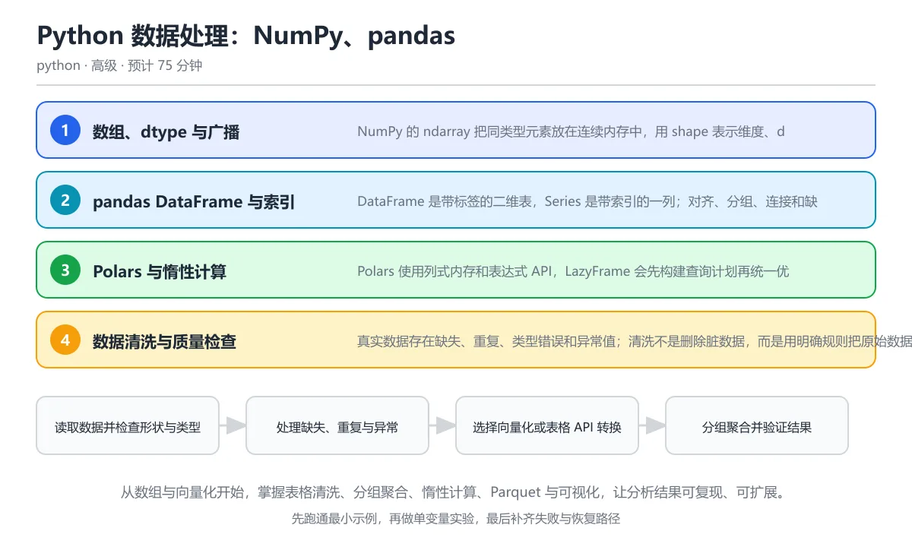

# Python 数据处理：NumPy、pandas 与 Polars

> 内容更新时间：2026-10-06 · 学习阶段：高级 · 预计用时：55 分钟

分类：python。关键词：NumPy、pandas、Polars、数据清洗、Parquet。从数组与向量化开始，掌握表格清洗、分组聚合、惰性计算、Parquet 与可视化，让分析结果可复现、可扩展。

学习建议：先通读《Python 数据处理：NumPy、pandas 与 Polars》的核心知识与关键流程，再运行可运行练习并完成测验；遇到不确定的结论，回到「故障现场」按症状、根因、修复、验证四步核对。



## 本节知识框架

**课程定位**：所属分类为「Python」，课程主题为「Python 数据处理：NumPy、pandas 与 Polars」，学习阶段为「高级」，建议用时 55 分钟。

**本课要解决的主问题**：从数组与向量化开始，掌握表格清洗、分组聚合、惰性计算、Parquet 与可视化，让分析结果可复现、可扩展。

| 学习层次 | 要回答的问题 | 完成判据 |
| --- | --- | --- |
| 概念层 | 「Python 数据处理：NumPy、pandas 与 Polars」有哪些必须区分的对象与术语？ | 能用自己的话定义核心术语，并各举一个正例和一个反例。 |
| 机制层 | 这些对象按什么顺序发生作用，输入如何变成输出？ | 能画出或写出机制步骤，并说明每一步的失败条件。 |
| 应用层 | 什么场景适合使用「Python 数据处理：NumPy、pandas 与 Polars」，什么场景不适合？ | 能给出一个真实场景、一个最小示例和一个边界案例。 |
| 性能层 | 时间、空间、吞吐或延迟受哪些量影响？ | 能说出复杂度或性能瓶颈的证据来源；没有证据时明确写“材料未提供”。 |
| 复习层 | 怎样确认自己不是只记住了结论？ | 能独立完成本课自测，并把错误定位到概念、机制、示例或边界。 |

### 阅读路线

1. 先读「核心概念定义」，建立「NumPy」等对象的精确定义。
2. 再读「原理与运行机制」，把定义串成可重复的过程。
3. 用「代码/协议/SQL 示例」验证过程，并只改一个条件观察结果变化。
4. 最后检查性能、易错点、知识关系与自测题，形成可复习的证据链。

**前置知识**：《实战：爬虫与数据分析》

**学习位置**：本课位于《Python 内存、性能与解释器原理》之后；如果前一课的自测不能通过，应先回补再继续。

**后续衔接**：下一课《Python Web 部署：WSGI、ASGI 与容器化》会继续使用本课术语，学完后建议立即完成一次自测。

**教材衔接：学习目标**

- 能解释数组维度、dtype、广播与视图副本的区别。
- 能用 pandas 或 Polars 完成清洗、连接、分组和排序。
- 能选择合适的数据格式与可视化方式，并保证分析可复现。

**教材衔接：前置知识**

- 已经会用列表、字典和生成器处理数据。
- 知道 CSV、缺失值和基础统计量的含义。
- 能读取文件并写出结构化数据。

**教材衔接：本课小结**

- Python 数据处理：NumPy、pandas 与 Polars围绕NumPy、pandas、Polars展开，先建立基线再讨论优化。
- NumPy 的 ndarray 把同类型元素放在连续内存中，用 shape 表示维度、dtype 表示元素类型；向量化运算比逐元素循环更快。
- 遇到问题时按「症状 → 根因 → 修复 → 验证」的顺序处理，不跳过验证。

## 核心概念定义

> 阅读约定：本课先给「Python 数据处理：NumPy、pandas 与 Polars」相关术语的操作性定义与适用边界；正文里的口语化说法与定义冲突时，以定义和可复现示例为准。

| 术语 | 操作性定义 | 本课中的边界 |
| --- | --- | --- |
| ndarray | NumPy 的同类型多维数组，支持向量化运算和高效内存布局。 | 仅在「Python 数据处理：NumPy、pandas 与 Polars」明确给出的输入、版本与资源条件下成立。 |
| 广播 | 不同形状数组按兼容规则自动扩展并逐元素运算的机制。 | 仅在「Python 数据处理：NumPy、pandas 与 Polars」明确给出的输入、版本与资源条件下成立。 |
| DataFrame | pandas 提供的带标签二维数据结构，由多个共享索引的列组成。 | 仅在「Python 数据处理：NumPy、pandas 与 Polars」明确给出的输入、版本与资源条件下成立。 |
| 缺失值 | 数据中无法获知或未记录的值，需要按业务规则选择删除、填充或标记。 | 仅在「Python 数据处理：NumPy、pandas 与 Polars」明确给出的输入、版本与资源条件下成立。 |
| groupby | 按键把行分组后对各组执行聚合、变换或筛选的操作。 | 仅在「Python 数据处理：NumPy、pandas 与 Polars」明确给出的输入、版本与资源条件下成立。 |
| Parquet | 带 schema 和压缩的列式文件格式，适合分析型存储与按列扫描。 | 仅在「Python 数据处理：NumPy、pandas 与 Polars」明确给出的输入、版本与资源条件下成立。 |

### 定义如何使用

在「Python 数据处理：NumPy、pandas 与 Polars」中判断一个说法是否成立，先确认它使用的是哪个对象的定义，再检查输入规模、运行环境与失败路径。定义不是口号，而是后续推导、代码示例和自测题共享的约束。

## 原理与运行机制

### 机制总览

1. **建立输入**：把「ndarray」按本课定义整理成可观察、可重复的输入条件。
2. **执行转换**：围绕「广播」执行本课的核心步骤；每一步都记录中间状态，避免只看最终输出。
3. **产生输出**：得到「DataFrame」后，用正文示例或协议/SQL 结果核对输出是否符合预期。
4. **改变一个条件**：只替换一个边界条件或环境参数，观察「Python 数据处理：NumPy、pandas 与 Polars」的结论是否仍然成立。

| 阶段 | 关注对象 | 失败时应检查 |
| --- | --- | --- |
| 输入 | ndarray | 类型、范围、编码、版本或前置状态是否满足定义。 |
| 处理 | 广播 | 顺序、可见性、锁、路由、事务或调度规则是否被破坏。 |
| 输出 | DataFrame | 结果是否可复现，错误是否被正确传播而不是被吞掉。 |

本课的机制结论要用「Python 数据处理：NumPy、pandas 与 Polars」自己的示例验证。「Python 数据处理：NumPy、pandas 与 Polars」没有给出某个数量级、吞吐或内存数据时，本课把该判断标为“材料未提供”，不从相邻主题外推。

**教材衔接：核心知识**

### 1. 数组、dtype 与广播

NumPy 的 ndarray 把同类型元素放在连续内存中，用 shape 表示维度、dtype 表示元素类型；向量化运算比逐元素循环更快。

广播让形状兼容的数组自动扩展参与运算，标量可以作用到所有元素；切片通常返回视图，修改视图会影响原数组，花式索引和 copy 会返回副本。

在Python 数据处理：NumPy、pandas 与 Polars里可以这样验证：创建一维数组并加一个标量，再比较切片视图与原数组修改后的关系。

边界：dtype 选择会影响精度与内存，整数相除和溢出需要留意；广播形状不兼容会直接报错。

工程视角：把数据布局和 dtype 写进处理契约，避免在循环中反复复制大数组，内存不足时按批次或内存映射处理。

### 2. pandas DataFrame 与索引

DataFrame 是带标签的二维表，Series 是带索引的一列；对齐、分组、连接和缺失值处理构成日常分析的主干。

按标签索引会对齐行号，运算时缺失标签产生缺失值；groupby 按键分组后执行聚合，merge 按键连接表，loc 与 iloc 分别按标签和位置选择。

在Python 数据处理：NumPy、pandas 与 Polars里可以这样验证：按城市分组计算平均分并降序排序，再检查缺失值数量与唯一城市数量。

边界：链式赋值可能修改副本而不是原表，索引重置和类型转换会改变后续行为；大表要注意 dtype 和中间副本的内存。

工程视角：每一步转换保持明确输入输出，中间结果可检查；分析脚本保存数据版本、参数和随机种子。

### 3. Polars 与惰性计算

Polars 使用列式内存和表达式 API，LazyFrame 会先构建查询计划再统一优化执行，适合较大数据和并行扫描。

表达式描述列变换，优化器可以下推谓词、裁剪列并并行执行；collect 才真正计算，扫描 Parquet 时可以只读取需要的列。

在Python 数据处理：NumPy、pandas 与 Polars里可以这样验证：用 LazyFrame 过滤分数大于八十分的行并计算平均分，比较惰性计划与立即执行的差异。

边界：惰性计算不会提前暴露所有数据错误，调试时要主动 collect 或查看计划；不同引擎的 API 语义不能直接照搬。

工程视角：数据管道优先列式格式和惰性查询，按需选择 pandas 生态兼容层，避免在两种引擎间反复转换。

### 4. 数据清洗与质量检查

真实数据存在缺失、重复、类型错误和异常值；清洗不是删除脏数据，而是用明确规则把原始数据转换成可解释的分析口径。

缺失可以用删除、均值填充或业务默认值处理，重复按业务键去重，类型转换失败要定位原始值，异常值用分位数或规则标记而不是静默截断。

在Python 数据处理：NumPy、pandas 与 Polars里可以这样验证：对一份含空值和重复行的数据做统计，逐项记录删除或填充的数量并保留清洗日志。

边界：填充缺失值会引入假设，必须写入报告；盲目去重可能删掉同一用户的多条真实记录。

工程视角：清洗规则版本化，输出数据质量报告，关键指标设置阈值并在异常时停止下游。

### 5. 可视化与列式存储

图表用视觉编码帮助发现趋势和异常，Parquet 用列式压缩存储表格数据，二者是分析交付和长期保存的常用组合。

Matplotlib 适合精确控制图形，Seaborn 在统计图上提供默认样式；Parquet 保存 schema、压缩和列统计，读取时只需扫描相关列。

在Python 数据处理：NumPy、pandas 与 Polars里可以这样验证：把清洗后的分组结果写入 Parquet，再用柱状图展示各城市平均分。

边界：图表坐标轴截断和颜色选择会误导读者，必须标明单位、样本量和时间范围；Parquet 不适合频繁逐行修改。

工程视角：图表脚本与数据管道分离，导出高分辨率图片和原始数据；Parquet 文件按日期分区并记录 schema 版本。

**教材衔接：关键流程**

```text
读取数据并检查形状与类型 → 处理缺失、重复与异常 → 选择向量化或表格 API 转换 → 分组聚合并验证结果 → 导出列式数据和可视化报告
```

1. 读取数据并检查形状与类型
2. 处理缺失、重复与异常
3. 选择向量化或表格 API 转换
4. 分组聚合并验证结果
5. 导出列式数据和可视化报告

## 典型应用场景

| 场景 | 典型输入或前提 | 期望产物 |
| --- | --- | --- |
| 学习验证 | 使用本课最小示例和 NumPy、pandas | 能复现正文结论，并解释每一步。 |
| 工程落地 | 把「Python 数据处理：NumPy、pandas 与 Polars」放入真实模块或服务边界 | 输出可观测、失败可定位、参数可配置。 |
| 故障排查 | 只改一个版本、规模、输入或依赖条件 | 能区分概念错误、实现错误和环境差异。 |

判断「Python 数据处理：NumPy、pandas 与 Polars」的场景是否成立，标准是能否写出输入、处理、输出和失败路径；材料中没有出现的数据在本课标注为“材料未提供”，不用推测替代证据。

**课程内置实验入口**：`sandbox:python`，用于动手验证《Python 数据处理：NumPy、pandas 与 Polars》的机制；实验结论不替代概念定义与复杂度分析。

**教材衔接：深度拓展与实战**

这一节把Python 数据处理：NumPy、pandas 与 Polars的机制拆开验证：每一步都给出输入、判断标准和失败信号，便于在真实项目里复用。

### 机制拆解 1：数组、dtype 与广播

广播让形状兼容的数组自动扩展参与运算，标量可以作用到所有元素；切片通常返回视图，修改视图会影响原数组，花式索引和 copy 会返回副本。

落地时先确认前提：dtype 选择会影响精度与内存，整数相除和溢出需要留意；广播形状不兼容会直接报错。；再把结论写进检查表，让下一位同学可以按同样的输入复现。

工程做法：把数据布局和 dtype 写进处理契约，避免在循环中反复复制大数组，内存不足时按批次或内存映射处理。

### 机制拆解 2：pandas DataFrame 与索引

按标签索引会对齐行号，运算时缺失标签产生缺失值；groupby 按键分组后执行聚合，merge 按键连接表，loc 与 iloc 分别按标签和位置选择。

落地时先确认前提：链式赋值可能修改副本而不是原表，索引重置和类型转换会改变后续行为；大表要注意 dtype 和中间副本的内存。；再把结论写进检查表，让下一位同学可以按同样的输入复现。

工程做法：每一步转换保持明确输入输出，中间结果可检查；分析脚本保存数据版本、参数和随机种子。

### 机制拆解 3：Polars 与惰性计算

表达式描述列变换，优化器可以下推谓词、裁剪列并并行执行；collect 才真正计算，扫描 Parquet 时可以只读取需要的列。

落地时先确认前提：惰性计算不会提前暴露所有数据错误，调试时要主动 collect 或查看计划；不同引擎的 API 语义不能直接照搬。；再把结论写进检查表，让下一位同学可以按同样的输入复现。

工程做法：数据管道优先列式格式和惰性查询，按需选择 pandas 生态兼容层，避免在两种引擎间反复转换。

### 机制拆解 4：数据清洗与质量检查

缺失可以用删除、均值填充或业务默认值处理，重复按业务键去重，类型转换失败要定位原始值，异常值用分位数或规则标记而不是静默截断。

落地时先确认前提：填充缺失值会引入假设，必须写入报告；盲目去重可能删掉同一用户的多条真实记录。；再把结论写进检查表，让下一位同学可以按同样的输入复现。

工程做法：清洗规则版本化，输出数据质量报告，关键指标设置阈值并在异常时停止下游。

### 机制拆解 5：可视化与列式存储

Matplotlib 适合精确控制图形，Seaborn 在统计图上提供默认样式；Parquet 保存 schema、压缩和列统计，读取时只需扫描相关列。

落地时先确认前提：图表坐标轴截断和颜色选择会误导读者，必须标明单位、样本量和时间范围；Parquet 不适合频繁逐行修改。；再把结论写进检查表，让下一位同学可以按同样的输入复现。

工程做法：图表脚本与数据管道分离，导出高分辨率图片和原始数据；Parquet 文件按日期分区并记录 schema 版本。

### 机制对照表

| 概念 | 解决什么问题 | 关键前提 | 失败信号 |
| --- | --- | --- | --- |
| 数组、dtype 与广播 | NumPy 的 ndarray 把同类型元素放在连续内存中，用 shape 表示 | dtype 选择会影响精度与内存，整数相除和溢出需要留意；广播形状不兼容 | 把数据布局和 dtype 写进处理契约，避免在循环中反复复制大数组，内存 |
| pandas DataFrame 与索引 | DataFrame 是带标签的二维表，Series 是带索引的一列；对齐、分组、 | 链式赋值可能修改副本而不是原表，索引重置和类型转换会改变后续行为；大表要 | 每一步转换保持明确输入输出，中间结果可检查；分析脚本保存数据版本、参数和 |
| Polars 与惰性计算 | Polars 使用列式内存和表达式 API，LazyFrame 会先构建查询计划 | 惰性计算不会提前暴露所有数据错误，调试时要主动 collect 或查看计 | 数据管道优先列式格式和惰性查询，按需选择 pandas 生态兼容层，避免 |
| 数据清洗与质量检查 | 真实数据存在缺失、重复、类型错误和异常值；清洗不是删除脏数据，而是用明确规则把原 | 填充缺失值会引入假设，必须写入报告；盲目去重可能删掉同一用户的多条真实记 | 清洗规则版本化，输出数据质量报告，关键指标设置阈值并在异常时停止下游。 |
| 可视化与列式存储 | 图表用视觉编码帮助发现趋势和异常，Parquet 用列式压缩存储表格数据，二者是 | 图表坐标轴截断和颜色选择会误导读者，必须标明单位、样本量和时间范围；Pa | 图表脚本与数据管道分离，导出高分辨率图片和原始数据；Parquet 文件 |

### 自测问答

**问 1**：NumPy 向量化运算通常比 Python 逐元素循环快，主要原因是什么？

**答**：运算在连续内存上批量执行，减少了逐元素的解释器开销。ndarray 使用连续内存和固定 dtype，批量运算在编译层循环执行，避免了 Python 每轮循环的解释和对象创建开销。向量化仍遵守类型和形状规则，读取切片时要区分视图与副本，否则可能意外修改原数据。 正确选项「运算在连续内存上批量执行，减少了逐元素的解释器开销」对应《Python 数据处理：NumPy、pandas 与 Polars》的要点「数组、dtype 与广播」：NumPy 的 ndarray 把同类型元素放在连续内存中，用 shape 表示维度、dtype 表示元素类型；向量化运算比逐元素循环更快。判断「数组、dtype 与广播」时先确认前提是否成立，再回到《Python 数据处理：NumPy、pandas 与 Polars》的示例核对一次；把别的语言或框架的默认做法直接搬到数组、dtype 与广播上，往往会在本课的边界条件里失效。

**问 2**：避免 pandas 链式赋值问题最直接的写法是？

**答**：使用 df.loc[条件, 列] = 值 一次完成定位与赋值。loc 在同一操作中明确指定行条件与列，能保证修改落在原对象上；连续方括号可能返回中间副本，赋值结果丢失且出现警告。复杂变换可以显式 copy 生成新表，但应写清楚所有权和后续使用范围。 正确选项「使用 df.loc[条件, 列] = 值 一次完成定位与赋值」对应《Python 数据处理：NumPy、pandas 与 Polars》的要点「pandas DataFrame 与索引」：DataFrame 是带标签的二维表，Series 是带索引的一列；对齐、分组、连接和缺失值处理构成日常分析的主干。判断「pandas DataFrame 与索引」时先确认前提是否成立，再回到《Python 数据处理：NumPy、pandas 与 Polars》的示例核对一次；借鉴相邻主题的经验之前，先核对pandas DataFrame 与索引的前提是否成立。

**问 3**：数据质量检查通常包括哪些内容？（多选）

**答**：缺失值比例与分布；重复记录与业务键唯一性；类型转换失败的行。缺失、重复和类型错误是质量检查的基本项，异常值和跨字段一致性也常被纳入。删除不好看的数据不是质量策略，而是隐藏问题；清洗规则应版本化，记录每一类处理的输入数量、输出数量和假设。 正确选项「缺失值比例与分布；重复记录与业务键唯一性；类型转换失败的行」对应《Python 数据处理：NumPy、pandas 与 Polars》的要点「Polars 与惰性计算」：Polars 使用列式内存和表达式 API，LazyFrame 会先构建查询计划再统一优化执行，适合较大数据和并行扫描。判断「Polars 与惰性计算」时先确认前提是否成立，再回到《Python 数据处理：NumPy、pandas 与 Polars》的示例核对一次；记住Polars 与惰性计算的结论之外还要记住适用条件，换一个输入往往就不成立了。

**问 4**：阅读分组代码，输出第一行是哪个城市？

df.groupby('city', as_index=False)['score'].mean().sort_values('score', ascending=False)

**答**：上海，因为平均分 92.0 最高。分组平均后北京的分数是 88 与 95 的平均 91.5，上海是 92.0，深圳是 79.0；按分数降序排列时上海位于第一行。分组结果还可能与索引和缺失值有关，正式报告前应检查每组样本量，避免小样本平均值产生误导。 正确选项「上海，因为平均分 92.0 最高」对应《Python 数据处理：NumPy、pandas 与 Polars》的要点「数据清洗与质量检查」：真实数据存在缺失、重复、类型错误和异常值；清洗不是删除脏数据，而是用明确规则把原始数据转换成可解释的分析口径。判断「数据清洗与质量检查」时先确认前提是否成立，再回到《Python 数据处理：NumPy、pandas 与 Polars》的示例核对一次；干扰项常常是相邻主题里成立的结论，只有按数据清洗与质量检查的输入与约束判断才能排除。

**问 5**：为什么把报告结果写入 Parquet 比继续追加写入同一个 CSV 更适合？

**答**：Parquet 保存 schema 和列统计，压缩率高，分析时可按列读取。Parquet 是面向分析的列式格式，天然保留类型信息、压缩和分组统计，读取少量列时效率很高；它不是为频繁追加或逐行修改设计的。CSV 虽然可读性好，但缺少类型和 schema，追加多份文件后容易出现列顺序和编码不一致。这道题对应 pandas 与 Parquet 的分工：分析结果适合列式存储，但文件格式不是实时编辑工具。 正确选项「Parquet 保存 schema 和列统计，压缩率高，分析时可按列读取」对应《Python 数据处理：NumPy、pandas 与 Polars》的要点「可视化与列式存储」：图表用视觉编码帮助发现趋势和异常，Parquet 用列式压缩存储表格数据，二者是分析交付和长期保存的常用组合。判断「可视化与列式存储」时先确认前提是否成立，再回到《Python 数据处理：NumPy、pandas 与 Polars》的示例核对一次；把可视化与列式存储的做法换到别的约束下未必成立，先确认边界再决定答案。

### 排错速查

- 看到「对百万行 DataFrame 使用 iterrows 逐行计算，速度极慢且容易丢失 dtype」时，先按「使用向量化列运算、groupby 或表达式 API，必要时按批次处理」处理，再用Python 数据处理：NumPy、pandas 与 Polars的最小示例确认结论是否恢复。
- 看到「写 df[df.score > 80]['level'] = 'high'，原表没有变化并产生警告」时，先按「使用 loc 一次性定位行列，或先 copy 并在明确的新对象上操作」处理，再用Python 数据处理：NumPy、pandas 与 Polars的最小示例确认结论是否恢复。
- 看到「把所有空值直接填零，比例指标和趋势被系统性扭曲」时，先按「按列定义缺失策略，记录填充数量并在报告中说明假设」处理，再用Python 数据处理：NumPy、pandas 与 Polars的最小示例确认结论是否恢复。
- 看到「抽样不设随机种子，数据版本和清洗规则没有记录」时，先按「固定随机种子，保存数据快照、代码版本和处理参数」处理，再用Python 数据处理：NumPy、pandas 与 Polars的最小示例确认结论是否恢复。

### 工程检查表

- [ ] 读取数据并检查形状与类型
- [ ] 处理缺失、重复与异常
- [ ] 选择向量化或表格 API 转换
- [ ] 分组聚合并验证结果
- [ ] 导出列式数据和可视化报告
- [ ] 【数组、dtype 与广播】把数据布局和 dtype 写进处理契约，避免在循环中反复复制大数组，内存不足时按批次或内存映射处理。
- [ ] 【pandas DataFrame 与索引】每一步转换保持明确输入输出，中间结果可检查；分析脚本保存数据版本、参数和随机种子。
- [ ] 【Polars 与惰性计算】数据管道优先列式格式和惰性查询，按需选择 pandas 生态兼容层，避免在两种引擎间反复转换。
- [ ] 【数据清洗与质量检查】清洗规则版本化，输出数据质量报告，关键指标设置阈值并在异常时停止下游。
- [ ] 【可视化与列式存储】图表脚本与数据管道分离，导出高分辨率图片和原始数据；Parquet 文件按日期分区并记录 schema 版本。

### 迁移练习

把Python 数据处理：NumPy、pandas 与 Polars的方法用到一个真实场景：写下NumPy、pandas、Polars在你的场景里分别对应什么，再记录一次失败尝试和它的恢复步骤。

### 延伸阅读与下一步

- 复习NumPy、pandas、Polars、数据清洗、Parquet时，优先回看「数组、dtype 与广播」与「可视化与列式存储」两节。
- 把从「读取数据并检查形状与类型」到「导出列式数据和可视化报告」的流程画成一张图，放进自己的笔记。
- 一周后重做本课测验，只把答错的题留到下一轮复习。

### 结论与下一步

学完Python 数据处理：NumPy、pandas 与 Polars，应该能独立完成三件事：先用最小示例确认NumPy的行为，再用一个边界输入验证结论，最后把失败路径写成可重复的检查。下一步把本课术语加入复习清单，并在两周内用一次真实任务检验记忆是否牢固。

## 代码/协议/SQL 示例

### 最小可验证示例

下面保留《Python 数据处理：NumPy、pandas 与 Polars》原文中的最小示例。先预测《Python 数据处理：NumPy、pandas 与 Polars》示例的输出，再按正文步骤运行或推演；示例依赖外部环境时，同时记录版本与输入。

```text
读取数据并检查形状与类型 → 处理缺失、重复与异常 → 选择向量化或表格 API 转换 → 分组聚合并验证结果 → 导出列式数据和可视化报告
```

**教材衔接：原文最小示例**

```text
读取数据并检查形状与类型 → 处理缺失、重复与异常 → 选择向量化或表格 API 转换 → 分组聚合并验证结果 → 导出列式数据和可视化报告
```

## 时间/空间复杂度或性能分析

**复杂度证据**：「Python 数据处理：NumPy、pandas 与 Polars」的现有材料没有给出渐近时间或空间复杂度的明确结论，本课只做定性检查，不补写未经验证的 $O$ 记号。

| 维度 | 本课关注点 | 判断依据 |
| --- | --- | --- |
| 时间/延迟 | 「Python 数据处理：NumPy、pandas 与 Polars」的主要步骤是否会随输入规模、并发度或网络往返增长。 | 以正文复杂度、基准数据或可重复测量为准。 |
| 空间/内存 | 中间状态、缓存、副本、连接或索引是否随规模增长。 | 记录峰值内存与数据副本，不只看最终结果。 |
| 吞吐/资源 | 版本、调度、锁、IO、序列化或协议开销是否成为瓶颈。 | 固定环境做对照实验，改变一个变量。 |

评估「Python 数据处理：NumPy、pandas 与 Polars」时要区分“正确性成立”和“性能达标”两件事；材料没有给出基准时，本课只保留量级来源与测量方法，不写不可验证的绝对数字。

## 常见误区与易错点

> 复核《Python 数据处理：NumPy、pandas 与 Polars》的易错点时，优先保留原文的错误表、故障现场与排错路径；每条修正都要能用本课示例复验。

| 易错点 | 常见表现 | 正确做法 |
| --- | --- | --- |
| 只背结论 | 能复述「Python 数据处理：NumPy、pandas 与 Polars」的定义，却说不清输入、输出与边界。 | 回到机制步骤，用最小示例逐一验证。 |
| 混淆相邻概念 | 把本课对象与相邻主题的对象当成同一类。 | 先比较定义、资源归属、生命周期和失败模式。 |
| 忽略版本与环境 | 在开发机通过后直接外推到生产环境。 | 固定版本、输入和资源条件，再记录可复现结果。 |

**教材衔接：常见错误与排查**

> 说明：本表由《Python 数据处理：NumPy、pandas 与 Polars》的核心知识整理（2026-10-06），人工复核进度见 docs/content_review_batches.md。

| 易错点 | 容易踩的做法 | 正确结论 |
| --- | --- | --- |
| 用 Python 循环逐行处理大表 | 对百万行 DataFrame 使用 iterrows 逐行计算，速度极慢且容易丢失 dtype | 使用向量化列运算、groupby 或表达式 API，必要时按批次处理 |
| 链式赋值修改副本 | 写 df[df.score > 80]['level'] = 'high'，原表没有变化并产生警告 | 使用 loc 一次性定位行列，或先 copy 并在明确的新对象上操作 |
| 静默填充缺失值 | 把所有空值直接填零，比例指标和趋势被系统性扭曲 | 按列定义缺失策略，记录填充数量并在报告中说明假设 |
| 分析结果不可复现 | 抽样不设随机种子，数据版本和清洗规则没有记录 | 固定随机种子，保存数据快照、代码版本和处理参数 |

**教材衔接：故障现场**

### 现场 1：用 Python 循环逐行处理大表

**症状**：在《Python 数据处理：NumPy、pandas 与 Polars》里采用「对百万行 DataFrame 使用 iterrows 逐行计算，速度极慢且容易丢失 dtype」时，用 Python 循环逐行处理大表会表现为错误结果、异常中断或状态不一致。

**根因**：这个做法没有执行与「用 Python 循环逐行处理大表」对应的检查，问题被带到了后续步骤。

**修复**：使用向量化列运算、groupby 或表达式 API，必要时按批次处理

**验证**：为「用 Python 循环逐行处理大表」准备一个最小输入，确认修复前的失败可以复现，修复后的输出与本课示例一致，再补一个边界输入。

### 现场 2：链式赋值修改副本

**症状**：在《Python 数据处理：NumPy、pandas 与 Polars》里采用「写 df[df.score > 80]['level'] = 'high'，原表没有变化并产生警告」时，链式赋值修改副本会表现为错误结果、异常中断或状态不一致。

**根因**：这个做法没有执行与「链式赋值修改副本」对应的检查，问题被带到了后续步骤。

**修复**：使用 loc 一次性定位行列，或先 copy 并在明确的新对象上操作

**验证**：为「链式赋值修改副本」准备一个最小输入，确认修复前的失败可以复现，修复后的输出与本课示例一致，再补一个边界输入。

### 现场 3：静默填充缺失值

**症状**：在《Python 数据处理：NumPy、pandas 与 Polars》里采用「把所有空值直接填零，比例指标和趋势被系统性扭曲」时，静默填充缺失值会表现为错误结果、异常中断或状态不一致。

**根因**：这个做法没有执行与「静默填充缺失值」对应的检查，问题被带到了后续步骤。

**修复**：按列定义缺失策略，记录填充数量并在报告中说明假设

**验证**：为「静默填充缺失值」准备一个最小输入，确认修复前的失败可以复现，修复后的输出与本课示例一致，再补一个边界输入。

### 现场 4：分析结果不可复现

**症状**：在《Python 数据处理：NumPy、pandas 与 Polars》里采用「抽样不设随机种子，数据版本和清洗规则没有记录」时，分析结果不可复现会表现为错误结果、异常中断或状态不一致。

**根因**：这个做法没有执行与「分析结果不可复现」对应的检查，问题被带到了后续步骤。

**修复**：固定随机种子，保存数据快照、代码版本和处理参数

**验证**：为「分析结果不可复现」准备一个最小输入，确认修复前的失败可以复现，修复后的输出与本课示例一致，再补一个边界输入。

## 与其他知识点的关系

| 关系 | 课程 | 为什么 |
| --- | --- | --- |
| 先修 | 《实战：爬虫与数据分析》 | 本课会直接使用它的概念或操作前提。 |
| 关联 | 《实战：CSV 到 SQLite 的 ETL 流水线》 | 用于横向比较或把本课结论迁移到相邻主题。 |
| 关联 | 《Python 数据库与 SQLAlchemy 2.x》 | 用于横向比较或把本课结论迁移到相邻主题。 |
| 前置顺序 | 《Python 内存、性能与解释器原理》 | 同分类中安排在本课之前，建议先完成其自测。 |
| 后续顺序 | 《Python Web 部署：WSGI、ASGI 与容器化》 | 同分类中安排在本课之后，会继续使用本课术语。 |

把「Python 数据处理：NumPy、pandas 与 Polars」放回知识体系时，不只要记住“前面学过什么”，还要说明两个主题在输入、机制、资源边界和失败模式上的差异。这样才能把单课知识迁移到项目、排障和后续课程。

**教材衔接：复习与迁移**

### 概念复述

不看正文，把Python 数据处理：NumPy、pandas 与 Polars讲给一个没学过的同事：先讲它解决什么问题，再讲一个最小例子，最后说明一个不适用场景。

### 测验回顾

回到《Python 数据处理：NumPy、pandas 与 Polars》测验，只重做答错或犹豫的题；对每道题写一句「我为什么改选这个答案」，写不出理由就回到对应小节。

### 迁移练习

把《Python 数据处理：NumPy、pandas 与 Polars》的方法用到一个你自己的真实场景：说明输入、约束与验证方式，并列出仍然不确定、需要下一次实验回答的问题。

## 自测题与参考答案

> 先独立作答《Python 数据处理：NumPy、pandas 与 Polars》的自测题，再对照答案与解析；每处判断都要能在本课正文或示例中找到依据。

### 自测 1

NumPy 向量化运算通常比 Python 逐元素循环快，主要原因是什么？

A. 运算在连续内存上批量执行，减少了逐元素的解释器开销
B. NumPy 会自动使用数据库
C. 向量化会跳过边界检查
D. 它把所有数据类型都变成字符串

**参考答案**：运算在连续内存上批量执行，减少了逐元素的解释器开销

**解析**：ndarray 使用连续内存和固定 dtype，批量运算在编译层循环执行，避免了 Python 每轮循环的解释和对象创建开销。向量化仍遵守类型和形状规则，读取切片时要区分视图与副本，否则可能意外修改原数据。 正确选项「运算在连续内存上批量执行，减少了逐元素的解释器开销」对应《Python 数据处理：NumPy、pandas 与 Polars》的要点「数组、dtype 与广播」：NumPy 的 ndarray 把同类型元素放在连续内存中，用 shape 表示维度、dtype 表示元素类型；向量化运算比逐元素循环更快。判断「数组、dtype 与广播」时先确认前提是否成立，再回到《Python 数据处理：NumPy、pandas 与 Polars》的示例核对一次；把别的语言或框架的默认做法直接搬到数组、dtype 与广播上，往往会在本课的边界条件里失效。

### 自测 2

数据质量检查通常包括哪些内容？（多选）

A. 缺失值比例与分布
B. 重复记录与业务键唯一性
C. 类型转换失败的行
D. 只保留好看的数据行

**参考答案**：缺失值比例与分布；重复记录与业务键唯一性；类型转换失败的行

**解析**：缺失、重复和类型错误是质量检查的基本项，异常值和跨字段一致性也常被纳入。删除不好看的数据不是质量策略，而是隐藏问题；清洗规则应版本化，记录每一类处理的输入数量、输出数量和假设。 正确选项「缺失值比例与分布；重复记录与业务键唯一性；类型转换失败的行」对应《Python 数据处理：NumPy、pandas 与 Polars》的要点「Polars 与惰性计算」：Polars 使用列式内存和表达式 API，LazyFrame 会先构建查询计划再统一优化执行，适合较大数据和并行扫描。判断「Polars 与惰性计算」时先确认前提是否成立，再回到《Python 数据处理：NumPy、pandas 与 Polars》的示例核对一次；记住Polars 与惰性计算的结论之外还要记住适用条件，换一个输入往往就不成立了。

### 自测 3

阅读分组代码，输出第一行是哪个城市？

df.groupby('city', as_index=False)['score'].mean().sort_values('score', ascending=False)

```python
df.groupby('city', as_index=False)['score'].mean().sort_values('score', ascending=False)
```

A. 上海，因为平均分 92.0 最高
B. 北京，因为出现次数最多
C. 深圳，因为分数最低
D. 顺序随机，无法判断

**参考答案**：上海，因为平均分 92.0 最高

**解析**：分组平均后北京的分数是 88 与 95 的平均 91.5，上海是 92.0，深圳是 79.0；按分数降序排列时上海位于第一行。分组结果还可能与索引和缺失值有关，正式报告前应检查每组样本量，避免小样本平均值产生误导。 正确选项「上海，因为平均分 92.0 最高」对应《Python 数据处理：NumPy、pandas 与 Polars》的要点「数据清洗与质量检查」：真实数据存在缺失、重复、类型错误和异常值；清洗不是删除脏数据，而是用明确规则把原始数据转换成可解释的分析口径。判断「数据清洗与质量检查」时先确认前提是否成立，再回到《Python 数据处理：NumPy、pandas 与 Polars》的示例核对一次；干扰项常常是相邻主题里成立的结论，只有按数据清洗与质量检查的输入与约束判断才能排除。

**教材衔接：动手练习**

1. 用 NumPy 创建二维数组并完成按行归一化，验证广播与切片视图的行为。
2. 清洗一份含缺失值和重复行的 CSV，输出清洗前后行数、缺失数量和规则说明。
3. 用 pandas 与 Polars 分别完成同一个分组聚合，记录代码量与运行时间差异。
4. 把分析结果导出为 Parquet，再用 Matplotlib 生成带单位和样本量标注的柱状图。

**验收标准**：留下输入、命令、输出和结论，能让别人按记录复现。

**教材衔接：可运行练习**

### 任务 1：先跑通，再解释

```python
import pandas as pd

df = pd.DataFrame({
    "city": ["北京", "上海", "北京", "深圳"],
    "score": [88, 92, 95, 79],
})

summary = (
    df.groupby("city", as_index=False)["score"]
    .mean()
    .rename(columns={"score": "avg_score"})
    .sort_values("avg_score", ascending=False)
)
print(summary.to_string(index=False))
print("缺失值:", int(df.isna().sum().sum()))
print("唯一城市:", df["city"].nunique())
```

DataFrame 先按城市分组，对分数列求平均，再重命名结果列并按平均分降序排列；to_string 控制输出格式，缺失值统计和唯一城市数量帮助确认数据质量。真实分析中应把读取、清洗、聚合和导出拆成独立步骤，并保存中间结果用于复核。

### 任务 2：只改一个条件

复制上面的示例，只改一个输入或参数再跑一次；先写下预测，再和真实输出对照，并说明差异来自Python 数据处理：NumPy、pandas 与 Polars的哪条机制。

### 任务 3：迁移到自己的数据

把《Python 数据处理：NumPy、pandas 与 Polars》里的示例换成你自己的一小段数据或场景，保持结构不变；如果换不动，说明还有哪条前提没有理解，回到核心知识对应小节。

**教材衔接：本课复习清单**

离开本课前，逐项确认：

- [ ] 能解释广播、视图和副本的区别。
- [ ] 能完成分组聚合并检查数据质量。
- [ ] 能根据分析场景选择表格库和存储格式。
- [ ] 至少运行一次本课示例，记录输入、输出和一个边界情况。
- [ ] 把本课最容易混淆的两个概念写成一句话对照。

| 复盘项 | 记录 |
| --- | --- |
| 已经能独立解释的考点 |  |
| 仍然说不清的概念 |  |
| 下一步验证动作 |  |

**教材衔接：复习与自测**

### 核心知识

遮住正文回答：Python 数据处理：NumPy、pandas 与 Polars解决什么问题、依赖哪些前提、失败时先看哪个信号？三问都能答清楚，再进入下一节。

### 动手练习

把《Python 数据处理：NumPy、pandas 与 Polars》里「只改一个条件」的练习再做一遍，这次先写预测再运行；预测和结果不一致的地方，就是需要回读的章节。

### 最小可运行示例

```python
import pandas as pd

df = pd.DataFrame({
    "city": ["北京", "上海", "北京", "深圳"],
    "score": [88, 92, 95, 79],
})

summary = (
    df.groupby("city", as_index=False)["score"]
    .mean()
    .rename(columns={"score": "avg_score"})
    .sort_values("avg_score", ascending=False)
)
print(summary.to_string(index=False))
print("缺失值:", int(df.isna().sum().sum()))
print("唯一城市:", df["city"].nunique())
```

### 预期输出

```text
city  avg_score
上海       92.0
北京       91.5
深圳       79.0
缺失值: 0
唯一城市: 3
```

### 验证步骤

1. 确认输入数据与运行环境和示例一致。
2. 运行示例，记录输出与耗时等可观测指标。
3. 换一个边界输入重跑，确认结论仍然成立。
4. 把两次结果写成一句话结论，注明前提与局限。

---

## 术语速查

先遮住右列，尝试用自己的话解释，再回到正文核对。

| 术语 | 一句话说明 |
| --- | --- |
| `ndarray` | NumPy 的同类型多维数组，支持向量化运算和高效内存布局。 |
| `广播` | 不同形状数组按兼容规则自动扩展并逐元素运算的机制。 |
| `DataFrame` | pandas 提供的带标签二维数据结构，由多个共享索引的列组成。 |
| `缺失值` | 数据中无法获知或未记录的值，需要按业务规则选择删除、填充或标记。 |
| `groupby` | 按键把行分组后对各组执行聚合、变换或筛选的操作。 |
| `Parquet` | 带 schema 和压缩的列式文件格式，适合分析型存储与按列扫描。 |

## 考点精讲

### 考点 1：NumPy 向量化运算通常比 Pytho

题型：概念判断。题干：NumPy 向量化运算通常比 Python 逐元素循环快，主要原因是什么？

判断要点：运算在连续内存上批量执行，减少了逐元素的解释器开销。ndarray 使用连续内存和固定 dtype，批量运算在编译层循环执行，避免了 Python 每轮循环的解释和对象创建开销。向量化仍遵守类型和形状规则，读取切片时要区分视图与副本，否则可能意外修改原数据。 正确选项「运算在连续内存上批量执行，减少了逐元素的解释器开销」对应《Python 数据处理：NumPy、pandas 与 Polars》的要点「数组、dtype 与广播」：NumPy 的 ndarray 把同类型元素放在连续内存中，用 shape 表示维度、dtype 表示元素类型；向量化运算比逐元素循环更快。判断「数组、dtype 与广播」时先确认前提是否成立，再回到《Python 数据处理：NumPy、pandas 与 Polars》的示例核对一次；把别的语言或框架的默认做法直接搬到数组、dtype 与广播上，往往会在本课的边界条件里失效。

### 考点 2：避免 pandas 链式赋值问题最直接的

题型：概念判断。题干：避免 pandas 链式赋值问题最直接的写法是？

判断要点：使用 df.loc[条件, 列] = 值 一次完成定位与赋值。loc 在同一操作中明确指定行条件与列，能保证修改落在原对象上；连续方括号可能返回中间副本，赋值结果丢失且出现警告。复杂变换可以显式 copy 生成新表，但应写清楚所有权和后续使用范围。 正确选项「使用 df.loc[条件, 列] = 值 一次完成定位与赋值」对应《Python 数据处理：NumPy、pandas 与 Polars》的要点「pandas DataFrame 与索引」：DataFrame 是带标签的二维表，Series 是带索引的一列；对齐、分组、连接和缺失值处理构成日常分析的主干。判断「pandas DataFrame 与索引」时先确认前提是否成立，再回到《Python 数据处理：NumPy、pandas 与 Polars》的示例核对一次；借鉴相邻主题的经验之前，先核对pandas DataFrame 与索引的前提是否成立。

### 考点 3：数据质量检查通常包括哪些内容？（多选）

题型：多选辨析。题干：数据质量检查通常包括哪些内容？（多选）

判断要点：缺失值比例与分布；重复记录与业务键唯一性；类型转换失败的行。缺失、重复和类型错误是质量检查的基本项，异常值和跨字段一致性也常被纳入。删除不好看的数据不是质量策略，而是隐藏问题；清洗规则应版本化，记录每一类处理的输入数量、输出数量和假设。 正确选项「缺失值比例与分布；重复记录与业务键唯一性；类型转换失败的行」对应《Python 数据处理：NumPy、pandas 与 Polars》的要点「Polars 与惰性计算」：Polars 使用列式内存和表达式 API，LazyFrame 会先构建查询计划再统一优化执行，适合较大数据和并行扫描。判断「Polars 与惰性计算」时先确认前提是否成立，再回到《Python 数据处理：NumPy、pandas 与 Polars》的示例核对一次；记住Polars 与惰性计算的结论之外还要记住适用条件，换一个输入往往就不成立了。

### 考点 4：阅读分组代码，输出第一行是哪个城市？

题型：代码阅读。题干：阅读分组代码，输出第一行是哪个城市？

df.groupby('city', as_index=False)['score'].mean().sort_values('score', ascending=False)

判断要点：上海，因为平均分 92.0 最高。分组平均后北京的分数是 88 与 95 的平均 91.5，上海是 92.0，深圳是 79.0；按分数降序排列时上海位于第一行。分组结果还可能与索引和缺失值有关，正式报告前应检查每组样本量，避免小样本平均值产生误导。 正确选项「上海，因为平均分 92.0 最高」对应《Python 数据处理：NumPy、pandas 与 Polars》的要点「数据清洗与质量检查」：真实数据存在缺失、重复、类型错误和异常值；清洗不是删除脏数据，而是用明确规则把原始数据转换成可解释的分析口径。判断「数据清洗与质量检查」时先确认前提是否成立，再回到《Python 数据处理：NumPy、pandas 与 Polars》的示例核对一次；干扰项常常是相邻主题里成立的结论，只有按数据清洗与质量检查的输入与约束判断才能排除。

### 考点 5：为什么把报告结果写入 Parquet 比

题型：排错。题干：为什么把报告结果写入 Parquet 比继续追加写入同一个 CSV 更适合？

判断要点：Parquet 保存 schema 和列统计，压缩率高，分析时可按列读取。Parquet 是面向分析的列式格式，天然保留类型信息、压缩和分组统计，读取少量列时效率很高；它不是为频繁追加或逐行修改设计的。CSV 虽然可读性好，但缺少类型和 schema，追加多份文件后容易出现列顺序和编码不一致。这道题对应 pandas 与 Parquet 的分工：分析结果适合列式存储，但文件格式不是实时编辑工具。 正确选项「Parquet 保存 schema 和列统计，压缩率高，分析时可按列读取」对应《Python 数据处理：NumPy、pandas 与 Polars》的要点「可视化与列式存储」：图表用视觉编码帮助发现趋势和异常，Parquet 用列式压缩存储表格数据，二者是分析交付和长期保存的常用组合。判断「可视化与列式存储」时先确认前提是否成立，再回到《Python 数据处理：NumPy、pandas 与 Polars》的示例核对一次；把可视化与列式存储的做法换到别的约束下未必成立，先确认边界再决定答案。

## English Overview

Python Data Processing with NumPy, pandas and Polars

This lesson covers the Python data stack: NumPy arrays, dtypes, broadcasting and views, pandas indexing and grouping, Polars lazy expressions, reproducible cleaning, Parquet storage and clear visualization. It emphasizes data quality, memory behavior and reproducibility.

## 内容元数据

- 内容版本：v2.0
- 最后更新：2026-10-06
- 学习阶段：高级

| 字段 | 值 |
| --- | --- |
| 课程 ID | `python_data_processing` |
| 所属分类 | `python` |
| 难度 | 高级 |
| 预计用时 | 75 分钟 |
| 关键词 | NumPy、pandas、Polars、数据清洗、Parquet |
| 配图 | `images/lesson_python_data_processing.webp` |
| 参考资料 | 4 条 |
| 内容更新时间 | 2026-10-06 |

## 参考资料与复核

- 最后复核：2026-10-04
- 下次复核：2026-11-10
- 复核范围：版本兼容、API 行为与工程实践

下面列出的资料用于核对本课结论，复习时可以对照阅读：
- [NumPy 官方文档](https://numpy.org/doc/stable/)
- [pandas 用户指南](https://pandas.pydata.org/docs/user_guide/)
- [Polars 用户指南](https://docs.pola.rs/)
- [Matplotlib 文档](https://matplotlib.org/stable/)

> 复核提示：《Python 数据处理：NumPy、pandas 与 Polars》的结论如与资料冲突，以资料中的规范文本为准，并在笔记里记录差异与日期。
