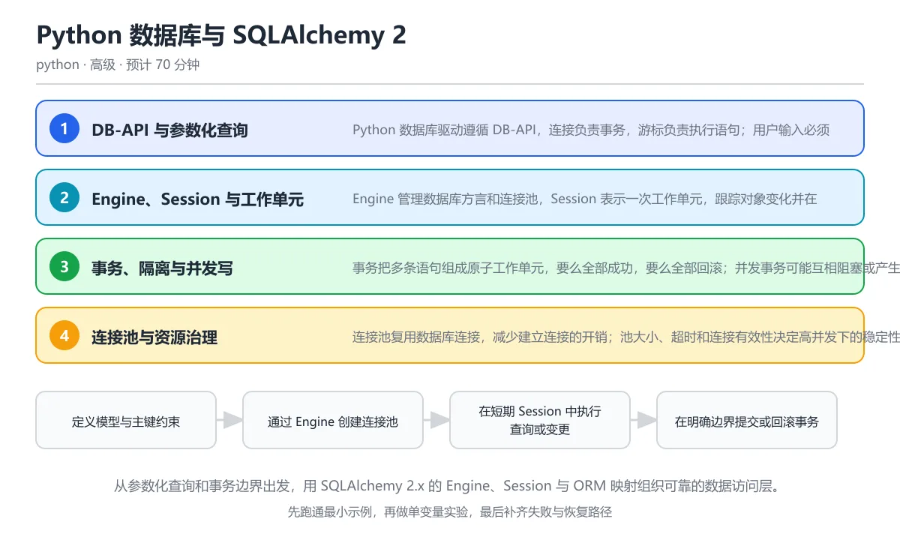

# Python 数据库与 SQLAlchemy 2.x

> 内容更新时间：2026-10-06 · 学习阶段：高级 · 预计用时：55 分钟

分类：python。关键词：SQLAlchemy、SQLite、事务、连接池、Alembic。从参数化查询和事务边界出发，用 SQLAlchemy 2.x 的 Engine、Session 与 ORM 映射组织可靠的数据访问层。

学习建议：先通读《Python 数据库与 SQLAlchemy 2.x》的核心知识与关键流程，再运行可运行练习并完成测验；遇到不确定的结论，回到「故障现场」按症状、根因、修复、验证四步核对。



## 本节知识框架

**课程定位**：所属分类为「Python」，课程主题为「Python 数据库与 SQLAlchemy 2.x」，学习阶段为「高级」，建议用时 55 分钟。

**本课要解决的主问题**：从参数化查询和事务边界出发，用 SQLAlchemy 2.x 的 Engine、Session 与 ORM 映射组织可靠的数据访问层。

| 学习层次 | 要回答的问题 | 完成判据 |
| --- | --- | --- |
| 概念层 | 「Python 数据库与 SQLAlchemy 2.x」有哪些必须区分的对象与术语？ | 能用自己的话定义核心术语，并各举一个正例和一个反例。 |
| 机制层 | 这些对象按什么顺序发生作用，输入如何变成输出？ | 能画出或写出机制步骤，并说明每一步的失败条件。 |
| 应用层 | 什么场景适合使用「Python 数据库与 SQLAlchemy 2.x」，什么场景不适合？ | 能给出一个真实场景、一个最小示例和一个边界案例。 |
| 性能层 | 时间、空间、吞吐或延迟受哪些量影响？ | 能说出复杂度或性能瓶颈的证据来源；没有证据时明确写“材料未提供”。 |
| 复习层 | 怎样确认自己不是只记住了结论？ | 能独立完成本课自测，并把错误定位到概念、机制、示例或边界。 |

### 阅读路线

1. 先读「核心概念定义」，建立「SQLAlchemy」等对象的精确定义。
2. 再读「原理与运行机制」，把定义串成可重复的过程。
3. 用「代码/协议/SQL 示例」验证过程，并只改一个条件观察结果变化。
4. 最后检查性能、易错点、知识关系与自测题，形成可复习的证据链。

**前置知识**：《Python 异常、日志与文件 I/O 进阶》

**学习位置**：本课位于《Python asyncio 异步编程：任务、超时与取消》之后；如果前一课的自测不能通过，应先回补再继续。

**后续衔接**：下一课《Python HTTP 客户端工程：超时、重试与认证》会继续使用本课术语，学完后建议立即完成一次自测。

**教材衔接：学习目标**

- 能用参数化语句安全地读写数据库并避免 SQL 注入。
- 能解释 Engine、Session、连接与事务的生命周期。
- 能用迁移工具管理 schema 演进并定位常见查询性能问题。

**教材衔接：前置知识**

- 已经会写 SELECT、INSERT、UPDATE 和 WHERE 基础 SQL。
- 理解 Python 类、上下文管理器和异常处理。
- 能在本地运行 SQLite 并查看表结构。

**教材衔接：本课小结**

- Python 数据库与 SQLAlchemy 2.x围绕SQLAlchemy、SQLite、事务展开，先建立基线再讨论优化。
- Python 数据库驱动遵循 DB-API，连接负责事务，游标负责执行语句；用户输入必须通过参数占位符传递，不能拼进 SQL 字符串。
- 遇到问题时按「症状 → 根因 → 修复 → 验证」的顺序处理，不跳过验证。

## 核心概念定义

> 阅读约定：本课先给「Python 数据库与 SQLAlchemy 2.x」相关术语的操作性定义与适用边界；正文里的口语化说法与定义冲突时，以定义和可复现示例为准。

| 术语 | 操作性定义 | 本课中的边界 |
| --- | --- | --- |
| Engine | SQLAlchemy 管理数据库方言、连接池与执行策略的核心对象。 | 仅在「Python 数据库与 SQLAlchemy 2.x」明确给出的输入、版本与资源条件下成立。 |
| Session | 跟踪对象变化、管理身份映射并在提交时形成工作单元的事务边界。 | 仅在「Python 数据库与 SQLAlchemy 2.x」明确给出的输入、版本与资源条件下成立。 |
| 事务 | 把多条数据库操作组成原子工作单元，成功时提交、失败时回滚。 | 仅在「Python 数据库与 SQLAlchemy 2.x」明确给出的输入、版本与资源条件下成立。 |
| 参数化查询 | 把 SQL 模板与输入值分开绑定，避免输入被当成代码执行的查询方式。 | 仅在「Python 数据库与 SQLAlchemy 2.x」明确给出的输入、版本与资源条件下成立。 |
| 连接池 | 复用数据库连接的资源池，控制并发连接数量与等待行为。 | 仅在「Python 数据库与 SQLAlchemy 2.x」明确给出的输入、版本与资源条件下成立。 |
| Alembic | SQLAlchemy 生态的数据库 schema 迁移工具，用版本脚本记录结构演进。 | 仅在「Python 数据库与 SQLAlchemy 2.x」明确给出的输入、版本与资源条件下成立。 |

### 定义如何使用

在「Python 数据库与 SQLAlchemy 2.x」中判断一个说法是否成立，先确认它使用的是哪个对象的定义，再检查输入规模、运行环境与失败路径。定义不是口号，而是后续推导、代码示例和自测题共享的约束。

## 原理与运行机制

### 机制总览

1. **建立输入**：把「Engine」按本课定义整理成可观察、可重复的输入条件。
2. **执行转换**：围绕「Session」执行本课的核心步骤；每一步都记录中间状态，避免只看最终输出。
3. **产生输出**：得到「事务」后，用正文示例或协议/SQL 结果核对输出是否符合预期。
4. **改变一个条件**：只替换一个边界条件或环境参数，观察「Python 数据库与 SQLAlchemy 2.x」的结论是否仍然成立。

| 阶段 | 关注对象 | 失败时应检查 |
| --- | --- | --- |
| 输入 | Engine | 类型、范围、编码、版本或前置状态是否满足定义。 |
| 处理 | Session | 顺序、可见性、锁、路由、事务或调度规则是否被破坏。 |
| 输出 | 事务 | 结果是否可复现，错误是否被正确传播而不是被吞掉。 |

本课的机制结论要用「Python 数据库与 SQLAlchemy 2.x」自己的示例验证。「Python 数据库与 SQLAlchemy 2.x」没有给出某个数量级、吞吐或内存数据时，本课把该判断标为“材料未提供”，不从相邻主题外推。

**教材衔接：核心知识**

### 1. DB-API 与参数化查询

Python 数据库驱动遵循 DB-API，连接负责事务，游标负责执行语句；用户输入必须通过参数占位符传递，不能拼进 SQL 字符串。

参数化查询把 SQL 模板与值分开发送，数据库按类型绑定参数，输入永远被当作数据而不是 SQL 代码；字符串拼接则会让引号和分号改变语句结构，形成注入。

在Python 数据库与 SQLAlchemy 2.x里可以这样验证：用参数占位符按名称查询账户，再尝试把包含引号的输入拼进语句，对比两种结果。

边界：表名、列名和排序方向通常不能作为普通值参数，需要从允许列表中映射，不能直接接受用户输入。

工程视角：所有 SQL 经过统一执行函数，禁止字符串插值；输入在进入数据层前完成类型和长度校验。

### 2. Engine、Session 与工作单元

Engine 管理数据库方言和连接池，Session 表示一次工作单元，跟踪对象变化并在提交时把变更写入数据库。

Session 从 Engine 借出连接，查询返回的 ORM 对象处于身份映射中，同一主键通常对应同一个实例；flush 发送 SQL 但不提交，commit 结束事务并写入，rollback 丢弃未提交变更。

在Python 数据库与 SQLAlchemy 2.x里可以这样验证：在一个 Session 中新增两个账户并提交，再用 select 按余额排序读取它们。

边界：Session 不是线程安全的，不应跨线程或跨请求长期共享；对象在会话关闭后可能处于 detached 状态，访问延迟加载属性会失败。

工程视角：每个请求创建独立 Session，服务方法按工作单元提交或回滚，返回前转换成只含所需字段的 DTO。

### 3. 事务、隔离与并发写

事务把多条语句组成原子工作单元，要么全部成功，要么全部回滚；并发事务可能互相阻塞或产生冲突。

提交前其他连接看不到未提交数据，隔离级别决定脏读、不可重复读和幻读的可见性；SQLite 写入会锁定数据库，高并发场景通常换用服务型数据库。

在Python 数据库与 SQLAlchemy 2.x里可以这样验证：在转账场景中同时更新两个账户余额，模拟第二个更新失败并回滚，验证两个余额都恢复到原值。

边界：重试事务要区分可恢复冲突和业务错误，失败重试必须保证操作幂等；乐观锁用版本号检测并发覆盖。

工程视角：事务保持短小，外部网络调用不要放在事务内；冲突重试有次数上限并记录版本与耗时。

### 4. 连接池与资源治理

连接池复用数据库连接，减少建立连接的开销；池大小、超时和连接有效性决定高并发下的稳定性。

Session 使用连接时从池中借出，关闭会话后归还；pool_pre_ping 可以在借出前检测失效连接，池耗尽时请求会等待直到超时。

在Python 数据库与 SQLAlchemy 2.x里可以这样验证：把池大小设置得小于并发请求数，观察排队与超时行为，并确认会话关闭后连接会归还。

边界：池越大不代表吞吐越高，数据库本身也有连接上限；连接泄漏会让池永久耗尽并拖垮整个服务。

工程视角：池大小按数据库承载和请求并发共同设置，监控等待时间与活跃连接，所有会话都通过上下文管理器释放。

### 5. 迁移与模型演进

schema 会随业务变化，迁移工具把每次结构修改保存成有顺序的版本，让开发、测试和生产环境保持一致。

Alembic 读取模型元数据并生成迁移脚本，升级和降级按版本链执行；数据回填必须与结构变更分开，先加列、再回填、最后加约束。

在Python 数据库与 SQLAlchemy 2.x里可以这样验证：为账户表新增状态列，先生成可空列并回填默认值，再在后续迁移中收紧为不可空。

边界：自动生成的迁移不一定安全，删除列、重命名和大表索引都可能锁表；生产环境执行前要在数据副本上演练。

工程视角：迁移脚本进入版本控制并在 CI 中验证升级与降级，部署顺序与代码兼容性同时设计。

**教材衔接：关键流程**

```text
定义模型与主键约束 → 通过 Engine 创建连接池 → 在短期 Session 中执行查询或变更 → 在明确边界提交或回滚事务 → 用迁移管理 schema 并验证性能
```

1. 定义模型与主键约束
2. 通过 Engine 创建连接池
3. 在短期 Session 中执行查询或变更
4. 在明确边界提交或回滚事务
5. 用迁移管理 schema 并验证性能

## 典型应用场景

| 场景 | 典型输入或前提 | 期望产物 |
| --- | --- | --- |
| 学习验证 | 使用本课最小示例和 SQLAlchemy、SQLite | 能复现正文结论，并解释每一步。 |
| 工程落地 | 把「Python 数据库与 SQLAlchemy 2.x」放入真实模块或服务边界 | 输出可观测、失败可定位、参数可配置。 |
| 故障排查 | 只改一个版本、规模、输入或依赖条件 | 能区分概念错误、实现错误和环境差异。 |

判断「Python 数据库与 SQLAlchemy 2.x」的场景是否成立，标准是能否写出输入、处理、输出和失败路径；材料中没有出现的数据在本课标注为“材料未提供”，不用推测替代证据。

**课程内置实验入口**：`sandbox:python`，用于动手验证《Python 数据库与 SQLAlchemy 2.x》的机制；实验结论不替代概念定义与复杂度分析。

**教材衔接：深度拓展与实战**

这一节把Python 数据库与 SQLAlchemy 2.x的机制拆开验证：每一步都给出输入、判断标准和失败信号，便于在真实项目里复用。

### 机制拆解 1：DB-API 与参数化查询

参数化查询把 SQL 模板与值分开发送，数据库按类型绑定参数，输入永远被当作数据而不是 SQL 代码；字符串拼接则会让引号和分号改变语句结构，形成注入。

落地时先确认前提：表名、列名和排序方向通常不能作为普通值参数，需要从允许列表中映射，不能直接接受用户输入。；再把结论写进检查表，让下一位同学可以按同样的输入复现。

工程做法：所有 SQL 经过统一执行函数，禁止字符串插值；输入在进入数据层前完成类型和长度校验。

### 机制拆解 2：Engine、Session 与工作单元

Session 从 Engine 借出连接，查询返回的 ORM 对象处于身份映射中，同一主键通常对应同一个实例；flush 发送 SQL 但不提交，commit 结束事务并写入，rollback 丢弃未提交变更。

落地时先确认前提：Session 不是线程安全的，不应跨线程或跨请求长期共享；对象在会话关闭后可能处于 detached 状态，访问延迟加载属性会失败。；再把结论写进检查表，让下一位同学可以按同样的输入复现。

工程做法：每个请求创建独立 Session，服务方法按工作单元提交或回滚，返回前转换成只含所需字段的 DTO。

### 机制拆解 3：事务、隔离与并发写

提交前其他连接看不到未提交数据，隔离级别决定脏读、不可重复读和幻读的可见性；SQLite 写入会锁定数据库，高并发场景通常换用服务型数据库。

落地时先确认前提：重试事务要区分可恢复冲突和业务错误，失败重试必须保证操作幂等；乐观锁用版本号检测并发覆盖。；再把结论写进检查表，让下一位同学可以按同样的输入复现。

工程做法：事务保持短小，外部网络调用不要放在事务内；冲突重试有次数上限并记录版本与耗时。

### 机制拆解 4：连接池与资源治理

Session 使用连接时从池中借出，关闭会话后归还；pool_pre_ping 可以在借出前检测失效连接，池耗尽时请求会等待直到超时。

落地时先确认前提：池越大不代表吞吐越高，数据库本身也有连接上限；连接泄漏会让池永久耗尽并拖垮整个服务。；再把结论写进检查表，让下一位同学可以按同样的输入复现。

工程做法：池大小按数据库承载和请求并发共同设置，监控等待时间与活跃连接，所有会话都通过上下文管理器释放。

### 机制拆解 5：迁移与模型演进

Alembic 读取模型元数据并生成迁移脚本，升级和降级按版本链执行；数据回填必须与结构变更分开，先加列、再回填、最后加约束。

落地时先确认前提：自动生成的迁移不一定安全，删除列、重命名和大表索引都可能锁表；生产环境执行前要在数据副本上演练。；再把结论写进检查表，让下一位同学可以按同样的输入复现。

工程做法：迁移脚本进入版本控制并在 CI 中验证升级与降级，部署顺序与代码兼容性同时设计。

### 机制对照表

| 概念 | 解决什么问题 | 关键前提 | 失败信号 |
| --- | --- | --- | --- |
| DB-API 与参数化查询 | Python 数据库驱动遵循 DB-API，连接负责事务，游标负责执行语句；用户 | 表名、列名和排序方向通常不能作为普通值参数，需要从允许列表中映射，不能直 | 所有 SQL 经过统一执行函数，禁止字符串插值；输入在进入数据层前完成类 |
| Engine、Session 与工作单元 | Engine 管理数据库方言和连接池，Session 表示一次工作单元，跟踪对象 | Session 不是线程安全的，不应跨线程或跨请求长期共享；对象在会话关 | 每个请求创建独立 Session，服务方法按工作单元提交或回滚，返回前转 |
| 事务、隔离与并发写 | 事务把多条语句组成原子工作单元，要么全部成功，要么全部回滚；并发事务可能互相阻塞 | 重试事务要区分可恢复冲突和业务错误，失败重试必须保证操作幂等；乐观锁用版 | 事务保持短小，外部网络调用不要放在事务内；冲突重试有次数上限并记录版本与 |
| 连接池与资源治理 | 连接池复用数据库连接，减少建立连接的开销；池大小、超时和连接有效性决定高并发下的 | 池越大不代表吞吐越高，数据库本身也有连接上限；连接泄漏会让池永久耗尽并拖 | 池大小按数据库承载和请求并发共同设置，监控等待时间与活跃连接，所有会话都 |
| 迁移与模型演进 | schema 会随业务变化，迁移工具把每次结构修改保存成有顺序的版本，让开发、测 | 自动生成的迁移不一定安全，删除列、重命名和大表索引都可能锁表；生产环境执 | 迁移脚本进入版本控制并在 CI 中验证升级与降级，部署顺序与代码兼容性同 |

### 自测问答

**问 1**：防止 SQL 注入最核心的做法是什么？

**答**：使用绑定参数让数据库区分 SQL 模板与输入值。绑定参数把语句结构与数据分开传输，用户输入永远不会被数据库解释成 SQL 代码，因此能覆盖引号、注释和联合查询等多种注入形式。手工转义容易漏掉边界，只允许数字会限制业务，转小写与安全性无关；表名和列名等标识符则要从白名单映射。 正确选项「使用绑定参数让数据库区分 SQL 模板与输入值」对应《Python 数据库与 SQLAlchemy 2.x》的要点「DB-API 与参数化查询」：Python 数据库驱动遵循 DB-API，连接负责事务，游标负责执行语句；用户输入必须通过参数占位符传递，不能拼进 SQL 字符串。判断「DB-API 与参数化查询」时先确认前提是否成立，再回到《Python 数据库与 SQLAlchemy 2.x》的示例核对一次；把别的语言或框架的默认做法直接搬到DB-API 与参数化查询上，往往会在本课的边界条件里失效。

**问 2**：SQLAlchemy 中修改 ORM 对象后，数据什么时候真正写入数据库？

**答**：调用 commit 提交事务时。Session 跟踪对象的修改，flush 可以提前发送 SQL，但只有 commit 才会提交事务并使变更对其他连接可见；rollback 会丢弃本次工作单元的修改。生产代码应把提交放在明确的服务边界，并确保异常路径回滚。 正确选项「调用 commit 提交事务时」对应《Python 数据库与 SQLAlchemy 2.x》的要点「Engine、Session 与工作单元」：Engine 管理数据库方言和连接池，Session 表示一次工作单元，跟踪对象变化并在提交时把变更写入数据库。判断「Engine、Session 与工作单元」时先确认前提是否成立，再回到《Python 数据库与 SQLAlchemy 2.x》的示例核对一次；借鉴相邻主题的经验之前，先核对Engine、Session 与工作单元的前提是否成立。

**问 3**：关于连接池与事务，哪些说法正确？（多选）

**答**：池大小必须与数据库连接上限匹配；连接泄漏会让池最终耗尽；Session 应在使用后及时关闭并归还连接。连接池是有限资源，池大小超过数据库承载会导致连接被拒绝或相互竞争；未关闭的 Session 会泄漏连接，最终让所有请求排队超时。耗时的网络请求不应放在事务里，因为它会长期占用连接和锁，放大故障影响面。 正确选项「池大小必须与数据库连接上限匹配；连接泄漏会让池最终耗尽；Session 应在使用后及时关闭并归还连接」对应《Python 数据库与 SQLAlchemy 2.x》的要点「事务、隔离与并发写」：事务把多条语句组成原子工作单元，要么全部成功，要么全部回滚；并发事务可能互相阻塞或产生冲突。判断「事务、隔离与并发写」时先确认前提是否成立，再回到《Python 数据库与 SQLAlchemy 2.x》的示例核对一次；记住事务、隔离与并发写的结论之外还要记住适用条件，换一个输入往往就不成立了。

**问 4**：阅读代码，哪一项能避免 N+1 查询？

orders = session.scalars(select(Order)).all()
for order in orders:
    print(order.customer.name)

**答**：用 selectinload 或 join 一次性加载 customer 关联。默认延迟加载会在每次访问 order.customer 时再发一条查询，订单越多查询次数越多。使用 selectinload 批量加载关联对象，或用 join 在一条语句中取回所需列，可以减少往返；修复后应通过 SQL 日志或查询计数验证次数确实下降。 正确选项「用 selectinload 或 join 一次性加载 customer 关联」对应《Python 数据库与 SQLAlchemy 2.x》的要点「连接池与资源治理」：连接池复用数据库连接，减少建立连接的开销；池大小、超时和连接有效性决定高并发下的稳定性。判断「连接池与资源治理」时先确认前提是否成立，再回到《Python 数据库与 SQLAlchemy 2.x》的示例核对一次；干扰项常常是相邻主题里成立的结论，只有按连接池与资源治理的输入与约束判断才能排除。

**问 5**：这段数据访问代码的主要风险是什么？

**答**：缺少余额校验与显式回滚，异常时可能部分修改或产生负余额。代码没有检查余额是否足够，也没有把整段操作放进异常回滚边界；如果提交前发生异常，Session 可能保持不可用状态。应在同一事务中校验两个账户、锁定或使用版本号处理并发，并在异常时 rollback 后重新抛出领域异常。这道题对应 SQLAlchemy Session 与事务边界：余额校验、更新与提交必须在同一事务中完成。 正确选项「缺少余额校验与显式回滚，异常时可能部分修改或产生负余额」对应《Python 数据库与 SQLAlchemy 2.x》的要点「迁移与模型演进」：schema 会随业务变化，迁移工具把每次结构修改保存成有顺序的版本，让开发、测试和生产环境保持一致。判断「迁移与模型演进」时先确认前提是否成立，再回到《Python 数据库与 SQLAlchemy 2.x》的示例核对一次；把迁移与模型演进的做法换到别的约束下未必成立，先确认边界再决定答案。

### 排错速查

- 看到「写 f'SELECT * FROM users WHERE name = {name}'，用户输入可以改变语句结构」时，先按「使用绑定参数 select(...).where(User.name == name)，让数据库区分代码与数据」处理，再用Python 数据库与 SQLAlchemy 2.x的最小示例确认结论是否恢复。
- 看到「Session 中更新对象后直接关闭，数据没有写入且异常状态被丢给后续请求」时，先按「在明确的工作单元中提交，异常路径回滚并重新抛出」处理，再用Python 数据库与 SQLAlchemy 2.x的最小示例确认结论是否恢复。
- 看到「查询一百个订单后又在一百次循环里查询用户，产生 N+1 查询」时，先按「用 join 或 selectinload 批量加载关联数据，再用查询计数验证」处理，再用Python 数据库与 SQLAlchemy 2.x的最小示例确认结论是否恢复。
- 看到「在事务中调用远程接口、等待用户输入，连接池很快被占满」时，先按「事务只包围数据库操作，外部调用放到事务之外，Session 用上下文管理器及时释放」处理，再用Python 数据库与 SQLAlchemy 2.x的最小示例确认结论是否恢复。

### 工程检查表

- [ ] 定义模型与主键约束
- [ ] 通过 Engine 创建连接池
- [ ] 在短期 Session 中执行查询或变更
- [ ] 在明确边界提交或回滚事务
- [ ] 用迁移管理 schema 并验证性能
- [ ] 【DB-API 与参数化查询】所有 SQL 经过统一执行函数，禁止字符串插值；输入在进入数据层前完成类型和长度校验。
- [ ] 【Engine、Session 与工作单元】每个请求创建独立 Session，服务方法按工作单元提交或回滚，返回前转换成只含所需字段的 DTO。
- [ ] 【事务、隔离与并发写】事务保持短小，外部网络调用不要放在事务内；冲突重试有次数上限并记录版本与耗时。
- [ ] 【连接池与资源治理】池大小按数据库承载和请求并发共同设置，监控等待时间与活跃连接，所有会话都通过上下文管理器释放。
- [ ] 【迁移与模型演进】迁移脚本进入版本控制并在 CI 中验证升级与降级，部署顺序与代码兼容性同时设计。

### 迁移练习

把Python 数据库与 SQLAlchemy 2.x的方法用到一个真实场景：写下SQLAlchemy、SQLite、事务在你的场景里分别对应什么，再记录一次失败尝试和它的恢复步骤。

### 延伸阅读与下一步

- 复习SQLAlchemy、SQLite、事务、连接池、Alembic时，优先回看「DB-API 与参数化查询」与「迁移与模型演进」两节。
- 把从「定义模型与主键约束」到「用迁移管理 schema 并验证性能」的流程画成一张图，放进自己的笔记。
- 一周后重做本课测验，只把答错的题留到下一轮复习。

### 结论与下一步

学完Python 数据库与 SQLAlchemy 2.x，应该能独立完成三件事：先用最小示例确认SQLAlchemy的行为，再用一个边界输入验证结论，最后把失败路径写成可重复的检查。下一步把本课术语加入复习清单，并在两周内用一次真实任务检验记忆是否牢固。

## 代码/协议/SQL 示例

### 最小可验证示例

下面保留《Python 数据库与 SQLAlchemy 2.x》原文中的最小示例。先预测《Python 数据库与 SQLAlchemy 2.x》示例的输出，再按正文步骤运行或推演；示例依赖外部环境时，同时记录版本与输入。

```text
定义模型与主键约束 → 通过 Engine 创建连接池 → 在短期 Session 中执行查询或变更 → 在明确边界提交或回滚事务 → 用迁移管理 schema 并验证性能
```

**教材衔接：原文最小示例**

```text
定义模型与主键约束 → 通过 Engine 创建连接池 → 在短期 Session 中执行查询或变更 → 在明确边界提交或回滚事务 → 用迁移管理 schema 并验证性能
```

## 时间/空间复杂度或性能分析

**复杂度证据**：「Python 数据库与 SQLAlchemy 2.x」的现有材料没有给出渐近时间或空间复杂度的明确结论，本课只做定性检查，不补写未经验证的 $O$ 记号。

| 维度 | 本课关注点 | 判断依据 |
| --- | --- | --- |
| 时间/延迟 | 「Python 数据库与 SQLAlchemy 2.x」的主要步骤是否会随输入规模、并发度或网络往返增长。 | 以正文复杂度、基准数据或可重复测量为准。 |
| 空间/内存 | 中间状态、缓存、副本、连接或索引是否随规模增长。 | 记录峰值内存与数据副本，不只看最终结果。 |
| 吞吐/资源 | 版本、调度、锁、IO、序列化或协议开销是否成为瓶颈。 | 固定环境做对照实验，改变一个变量。 |

评估「Python 数据库与 SQLAlchemy 2.x」时要区分“正确性成立”和“性能达标”两件事；材料没有给出基准时，本课只保留量级来源与测量方法，不写不可验证的绝对数字。

## 常见误区与易错点

> 复核《Python 数据库与 SQLAlchemy 2.x》的易错点时，优先保留原文的错误表、故障现场与排错路径；每条修正都要能用本课示例复验。

| 易错点 | 常见表现 | 正确做法 |
| --- | --- | --- |
| 只背结论 | 能复述「Python 数据库与 SQLAlchemy 2.x」的定义，却说不清输入、输出与边界。 | 回到机制步骤，用最小示例逐一验证。 |
| 混淆相邻概念 | 把本课对象与相邻主题的对象当成同一类。 | 先比较定义、资源归属、生命周期和失败模式。 |
| 忽略版本与环境 | 在开发机通过后直接外推到生产环境。 | 固定版本、输入和资源条件，再记录可复现结果。 |

**教材衔接：常见错误与排查**

> 说明：本表由《Python 数据库与 SQLAlchemy 2.x》的核心知识整理（2026-10-06），人工复核进度见 docs/content_review_batches.md。

| 易错点 | 容易踩的做法 | 正确结论 |
| --- | --- | --- |
| 用字符串拼接 SQL | 写 f'SELECT * FROM users WHERE name = {name}'，用户输入可以改变语句结构 | 使用绑定参数 select(...).where(User.name == name)，让数据库区分代码与数据 |
| 修改后忘记提交或回滚 | Session 中更新对象后直接关闭，数据没有写入且异常状态被丢给后续请求 | 在明确的工作单元中提交，异常路径回滚并重新抛出 |
| 循环中逐条查询关联对象 | 查询一百个订单后又在一百次循环里查询用户，产生 N+1 查询 | 用 join 或 selectinload 批量加载关联数据，再用查询计数验证 |
| 长期占用连接或事务 | 在事务中调用远程接口、等待用户输入，连接池很快被占满 | 事务只包围数据库操作，外部调用放到事务之外，Session 用上下文管理器及时释放 |

**教材衔接：故障现场**

### 现场 1：用字符串拼接 SQL

**症状**：在《Python 数据库与 SQLAlchemy 2.x》里采用「写 f'SELECT * FROM users WHERE name = {name}'，用户输入可以改变语句结构」时，用字符串拼接 SQL会表现为错误结果、异常中断或状态不一致。

**根因**：这个做法没有执行与「用字符串拼接 SQL」对应的检查，问题被带到了后续步骤。

**修复**：使用绑定参数 select(...).where(User.name == name)，让数据库区分代码与数据

**验证**：为「用字符串拼接 SQL」准备一个最小输入，确认修复前的失败可以复现，修复后的输出与本课示例一致，再补一个边界输入。

### 现场 2：修改后忘记提交或回滚

**症状**：在《Python 数据库与 SQLAlchemy 2.x》里采用「Session 中更新对象后直接关闭，数据没有写入且异常状态被丢给后续请求」时，修改后忘记提交或回滚会表现为错误结果、异常中断或状态不一致。

**根因**：这个做法没有执行与「修改后忘记提交或回滚」对应的检查，问题被带到了后续步骤。

**修复**：在明确的工作单元中提交，异常路径回滚并重新抛出

**验证**：为「修改后忘记提交或回滚」准备一个最小输入，确认修复前的失败可以复现，修复后的输出与本课示例一致，再补一个边界输入。

### 现场 3：循环中逐条查询关联对象

**症状**：在《Python 数据库与 SQLAlchemy 2.x》里采用「查询一百个订单后又在一百次循环里查询用户，产生 N+1 查询」时，循环中逐条查询关联对象会表现为错误结果、异常中断或状态不一致。

**根因**：这个做法没有执行与「循环中逐条查询关联对象」对应的检查，问题被带到了后续步骤。

**修复**：用 join 或 selectinload 批量加载关联数据，再用查询计数验证

**验证**：为「循环中逐条查询关联对象」准备一个最小输入，确认修复前的失败可以复现，修复后的输出与本课示例一致，再补一个边界输入。

### 现场 4：长期占用连接或事务

**症状**：在《Python 数据库与 SQLAlchemy 2.x》里采用「在事务中调用远程接口、等待用户输入，连接池很快被占满」时，长期占用连接或事务会表现为错误结果、异常中断或状态不一致。

**根因**：这个做法没有执行与「长期占用连接或事务」对应的检查，问题被带到了后续步骤。

**修复**：事务只包围数据库操作，外部调用放到事务之外，Session 用上下文管理器及时释放

**验证**：为「长期占用连接或事务」准备一个最小输入，确认修复前的失败可以复现，修复后的输出与本课示例一致，再补一个边界输入。

## 与其他知识点的关系

| 关系 | 课程 | 为什么 |
| --- | --- | --- |
| 先修 | 《Python 异常、日志与文件 I/O 进阶》 | 本课会直接使用它的概念或操作前提。 |
| 关联 | 《实战：CSV 到 SQLite 的 ETL 流水线》 | 用于横向比较或把本课结论迁移到相邻主题。 |
| 关联 | 《Python 项目架构：分层、配置与依赖注入》 | 用于横向比较或把本课结论迁移到相邻主题。 |
| 前置顺序 | 《Python asyncio 异步编程：任务、超时与取消》 | 同分类中安排在本课之前，建议先完成其自测。 |
| 后续顺序 | 《Python HTTP 客户端工程：超时、重试与认证》 | 同分类中安排在本课之后，会继续使用本课术语。 |

把「Python 数据库与 SQLAlchemy 2.x」放回知识体系时，不只要记住“前面学过什么”，还要说明两个主题在输入、机制、资源边界和失败模式上的差异。这样才能把单课知识迁移到项目、排障和后续课程。

**教材衔接：复习与迁移**

### 概念复述

不看正文，把Python 数据库与 SQLAlchemy 2.x讲给一个没学过的同事：先讲它解决什么问题，再讲一个最小例子，最后说明一个不适用场景。

### 测验回顾

回到《Python 数据库与 SQLAlchemy 2.x》测验，只重做答错或犹豫的题；对每道题写一句「我为什么改选这个答案」，写不出理由就回到对应小节。

### 迁移练习

把《Python 数据库与 SQLAlchemy 2.x》的方法用到一个你自己的真实场景：说明输入、约束与验证方式，并列出仍然不确定、需要下一次实验回答的问题。

## 自测题与参考答案

> 先独立作答《Python 数据库与 SQLAlchemy 2.x》的自测题，再对照答案与解析；每处判断都要能在本课正文或示例中找到依据。

### 自测 1

防止 SQL 注入最核心的做法是什么？

A. 使用绑定参数让数据库区分 SQL 模板与输入值
B. 把单引号替换成两个单引号
C. 只允许数字输入
D. 把 SQL 全部转成小写

**参考答案**：使用绑定参数让数据库区分 SQL 模板与输入值

**解析**：绑定参数把语句结构与数据分开传输，用户输入永远不会被数据库解释成 SQL 代码，因此能覆盖引号、注释和联合查询等多种注入形式。手工转义容易漏掉边界，只允许数字会限制业务，转小写与安全性无关；表名和列名等标识符则要从白名单映射。 正确选项「使用绑定参数让数据库区分 SQL 模板与输入值」对应《Python 数据库与 SQLAlchemy 2.x》的要点「DB-API 与参数化查询」：Python 数据库驱动遵循 DB-API，连接负责事务，游标负责执行语句；用户输入必须通过参数占位符传递，不能拼进 SQL 字符串。判断「DB-API 与参数化查询」时先确认前提是否成立，再回到《Python 数据库与 SQLAlchemy 2.x》的示例核对一次；把别的语言或框架的默认做法直接搬到DB-API 与参数化查询上，往往会在本课的边界条件里失效。

### 自测 2

关于连接池与事务，哪些说法正确？（多选）

A. 池大小必须与数据库连接上限匹配
B. 连接泄漏会让池最终耗尽
C. 事务中适合执行耗时网络请求
D. Session 应在使用后及时关闭并归还连接

**参考答案**：池大小必须与数据库连接上限匹配；连接泄漏会让池最终耗尽；Session 应在使用后及时关闭并归还连接

**解析**：连接池是有限资源，池大小超过数据库承载会导致连接被拒绝或相互竞争；未关闭的 Session 会泄漏连接，最终让所有请求排队超时。耗时的网络请求不应放在事务里，因为它会长期占用连接和锁，放大故障影响面。 正确选项「池大小必须与数据库连接上限匹配；连接泄漏会让池最终耗尽；Session 应在使用后及时关闭并归还连接」对应《Python 数据库与 SQLAlchemy 2.x》的要点「事务、隔离与并发写」：事务把多条语句组成原子工作单元，要么全部成功，要么全部回滚；并发事务可能互相阻塞或产生冲突。判断「事务、隔离与并发写」时先确认前提是否成立，再回到《Python 数据库与 SQLAlchemy 2.x》的示例核对一次；记住事务、隔离与并发写的结论之外还要记住适用条件，换一个输入往往就不成立了。

### 自测 3

阅读代码，哪一项能避免 N+1 查询？

orders = session.scalars(select(Order)).all()
for order in orders:
    print(order.customer.name)

```python
orders = session.scalars(select(Order)).all()
for order in orders:
    print(order.customer.name)
```

A. 用 selectinload 或 join 一次性加载 customer 关联
B. 把循环改成 while
C. 增加 Session 数量
D. 给 Order 表再加一个主键

**参考答案**：用 selectinload 或 join 一次性加载 customer 关联

**解析**：默认延迟加载会在每次访问 order.customer 时再发一条查询，订单越多查询次数越多。使用 selectinload 批量加载关联对象，或用 join 在一条语句中取回所需列，可以减少往返；修复后应通过 SQL 日志或查询计数验证次数确实下降。 正确选项「用 selectinload 或 join 一次性加载 customer 关联」对应《Python 数据库与 SQLAlchemy 2.x》的要点「连接池与资源治理」：连接池复用数据库连接，减少建立连接的开销；池大小、超时和连接有效性决定高并发下的稳定性。判断「连接池与资源治理」时先确认前提是否成立，再回到《Python 数据库与 SQLAlchemy 2.x》的示例核对一次；干扰项常常是相邻主题里成立的结论，只有按连接池与资源治理的输入与约束判断才能排除。

**教材衔接：动手练习**

1. 用 SQLAlchemy 2.x 建立一张课程表与一张学习记录表，写一条带 JOIN 的统计查询。
2. 构造一次转账事务，在第二次更新时抛出异常，确认回滚后两个账户余额不变。
3. 对同一查询分别使用延迟加载和 selectinload，记录 SQL 条数与耗时差异。
4. 为一个新增字段编写先加列、再回填、最后加约束的两阶段迁移方案。

**验收标准**：留下输入、命令、输出和结论，能让别人按记录复现。

**教材衔接：可运行练习**

### 任务 1：先跑通，再解释

```python
from sqlalchemy import create_engine, select
from sqlalchemy.orm import DeclarativeBase, Mapped, Session, mapped_column

class Base(DeclarativeBase):
    pass

class Account(Base):
    __tablename__ = "accounts"

    id: Mapped[int] = mapped_column(primary_key=True)
    name: Mapped[str] = mapped_column(unique=True)
    balance: Mapped[int] = mapped_column(default=0)

engine = create_engine("sqlite+pysqlite:///:memory:")
Base.metadata.create_all(engine)

with Session(engine) as session:
    session.add_all([
        Account(name="Ada", balance=100),
        Account(name="Lin", balance=50),
    ])
    session.commit()

    statement = select(Account).order_by(Account.balance.desc())
    for account in session.scalars(statement):
        print(account.name, account.balance)

    account = session.get(Account, 1)
    account.balance += 10
    session.commit()
    print("新余额:", session.get(Account, 1).balance)
```

模型声明主键、唯一约束和默认值，Engine 连接到内存 SQLite，create_all 创建表；Session 先作为工作单元插入两个账户并提交，再用 select 按余额读取，最后修改对象并提交，展示 ORM 的身份映射与工作单元行为。

### 任务 2：只改一个条件

复制上面的示例，只改一个输入或参数再跑一次；先写下预测，再和真实输出对照，并说明差异来自Python 数据库与 SQLAlchemy 2.x的哪条机制。

### 任务 3：迁移到自己的数据

把《Python 数据库与 SQLAlchemy 2.x》里的示例换成你自己的一小段数据或场景，保持结构不变；如果换不动，说明还有哪条前提没有理解，回到核心知识对应小节。

**教材衔接：本课复习清单**

离开本课前，逐项确认：

- [ ] 能用绑定参数写出防注入查询。
- [ ] 能说明 Session 与事务的提交回滚边界。
- [ ] 能识别并修复 N+1 查询。
- [ ] 至少运行一次本课示例，记录输入、输出和一个边界情况。
- [ ] 把本课最容易混淆的两个概念写成一句话对照。

| 复盘项 | 记录 |
| --- | --- |
| 已经能独立解释的考点 |  |
| 仍然说不清的概念 |  |
| 下一步验证动作 |  |

**教材衔接：复习与自测**

### 核心知识

遮住正文回答：Python 数据库与 SQLAlchemy 2.x解决什么问题、依赖哪些前提、失败时先看哪个信号？三问都能答清楚，再进入下一节。

### 动手练习

把《Python 数据库与 SQLAlchemy 2.x》里「只改一个条件」的练习再做一遍，这次先写预测再运行；预测和结果不一致的地方，就是需要回读的章节。

### 最小可运行示例

```python
from sqlalchemy import create_engine, select
from sqlalchemy.orm import DeclarativeBase, Mapped, Session, mapped_column

class Base(DeclarativeBase):
    pass

class Account(Base):
    __tablename__ = "accounts"

    id: Mapped[int] = mapped_column(primary_key=True)
    name: Mapped[str] = mapped_column(unique=True)
    balance: Mapped[int] = mapped_column(default=0)

engine = create_engine("sqlite+pysqlite:///:memory:")
Base.metadata.create_all(engine)

with Session(engine) as session:
    session.add_all([
        Account(name="Ada", balance=100),
        Account(name="Lin", balance=50),
    ])
    session.commit()

    statement = select(Account).order_by(Account.balance.desc())
    for account in session.scalars(statement):
        print(account.name, account.balance)

    account = session.get(Account, 1)
    account.balance += 10
    session.commit()
    print("新余额:", session.get(Account, 1).balance)
```

### 预期输出

```text
Ada 100
Lin 50
新余额: 110
```

### 验证步骤

1. 确认输入数据与运行环境和示例一致。
2. 运行示例，记录输出与耗时等可观测指标。
3. 换一个边界输入重跑，确认结论仍然成立。
4. 把两次结果写成一句话结论，注明前提与局限。

---

## 术语速查

先遮住右列，尝试用自己的话解释，再回到正文核对。

| 术语 | 一句话说明 |
| --- | --- |
| `Engine` | SQLAlchemy 管理数据库方言、连接池与执行策略的核心对象。 |
| `Session` | 跟踪对象变化、管理身份映射并在提交时形成工作单元的事务边界。 |
| `事务` | 把多条数据库操作组成原子工作单元，成功时提交、失败时回滚。 |
| `参数化查询` | 把 SQL 模板与输入值分开绑定，避免输入被当成代码执行的查询方式。 |
| `连接池` | 复用数据库连接的资源池，控制并发连接数量与等待行为。 |
| `Alembic` | SQLAlchemy 生态的数据库 schema 迁移工具，用版本脚本记录结构演进。 |

## 考点精讲

### 考点 1：防止 SQL 注入最核心的做法是什么？

题型：概念判断。题干：防止 SQL 注入最核心的做法是什么？

判断要点：使用绑定参数让数据库区分 SQL 模板与输入值。绑定参数把语句结构与数据分开传输，用户输入永远不会被数据库解释成 SQL 代码，因此能覆盖引号、注释和联合查询等多种注入形式。手工转义容易漏掉边界，只允许数字会限制业务，转小写与安全性无关；表名和列名等标识符则要从白名单映射。 正确选项「使用绑定参数让数据库区分 SQL 模板与输入值」对应《Python 数据库与 SQLAlchemy 2.x》的要点「DB-API 与参数化查询」：Python 数据库驱动遵循 DB-API，连接负责事务，游标负责执行语句；用户输入必须通过参数占位符传递，不能拼进 SQL 字符串。判断「DB-API 与参数化查询」时先确认前提是否成立，再回到《Python 数据库与 SQLAlchemy 2.x》的示例核对一次；把别的语言或框架的默认做法直接搬到DB-API 与参数化查询上，往往会在本课的边界条件里失效。

### 考点 2：SQLAlchemy 中修改 ORM 对

题型：概念判断。题干：SQLAlchemy 中修改 ORM 对象后，数据什么时候真正写入数据库？

判断要点：调用 commit 提交事务时。Session 跟踪对象的修改，flush 可以提前发送 SQL，但只有 commit 才会提交事务并使变更对其他连接可见；rollback 会丢弃本次工作单元的修改。生产代码应把提交放在明确的服务边界，并确保异常路径回滚。 正确选项「调用 commit 提交事务时」对应《Python 数据库与 SQLAlchemy 2.x》的要点「Engine、Session 与工作单元」：Engine 管理数据库方言和连接池，Session 表示一次工作单元，跟踪对象变化并在提交时把变更写入数据库。判断「Engine、Session 与工作单元」时先确认前提是否成立，再回到《Python 数据库与 SQLAlchemy 2.x》的示例核对一次；借鉴相邻主题的经验之前，先核对Engine、Session 与工作单元的前提是否成立。

### 考点 3：关于连接池与事务，哪些说法正确？（多选）

题型：多选辨析。题干：关于连接池与事务，哪些说法正确？（多选）

判断要点：池大小必须与数据库连接上限匹配；连接泄漏会让池最终耗尽；Session 应在使用后及时关闭并归还连接。连接池是有限资源，池大小超过数据库承载会导致连接被拒绝或相互竞争；未关闭的 Session 会泄漏连接，最终让所有请求排队超时。耗时的网络请求不应放在事务里，因为它会长期占用连接和锁，放大故障影响面。 正确选项「池大小必须与数据库连接上限匹配；连接泄漏会让池最终耗尽；Session 应在使用后及时关闭并归还连接」对应《Python 数据库与 SQLAlchemy 2.x》的要点「事务、隔离与并发写」：事务把多条语句组成原子工作单元，要么全部成功，要么全部回滚；并发事务可能互相阻塞或产生冲突。判断「事务、隔离与并发写」时先确认前提是否成立，再回到《Python 数据库与 SQLAlchemy 2.x》的示例核对一次；记住事务、隔离与并发写的结论之外还要记住适用条件，换一个输入往往就不成立了。

### 考点 4：阅读代码，哪一项能避免 N+1 查询？

题型：代码阅读。题干：阅读代码，哪一项能避免 N+1 查询？

orders = session.scalars(select(Order)).all()
for order in orders:
    print(order.customer.name)

判断要点：用 selectinload 或 join 一次性加载 customer 关联。默认延迟加载会在每次访问 order.customer 时再发一条查询，订单越多查询次数越多。使用 selectinload 批量加载关联对象，或用 join 在一条语句中取回所需列，可以减少往返；修复后应通过 SQL 日志或查询计数验证次数确实下降。 正确选项「用 selectinload 或 join 一次性加载 customer 关联」对应《Python 数据库与 SQLAlchemy 2.x》的要点「连接池与资源治理」：连接池复用数据库连接，减少建立连接的开销；池大小、超时和连接有效性决定高并发下的稳定性。判断「连接池与资源治理」时先确认前提是否成立，再回到《Python 数据库与 SQLAlchemy 2.x》的示例核对一次；干扰项常常是相邻主题里成立的结论，只有按连接池与资源治理的输入与约束判断才能排除。

### 考点 5：这段数据访问代码的主要风险是什么？

题型：排错。题干：这段数据访问代码的主要风险是什么？

判断要点：缺少余额校验与显式回滚，异常时可能部分修改或产生负余额。代码没有检查余额是否足够，也没有把整段操作放进异常回滚边界；如果提交前发生异常，Session 可能保持不可用状态。应在同一事务中校验两个账户、锁定或使用版本号处理并发，并在异常时 rollback 后重新抛出领域异常。这道题对应 SQLAlchemy Session 与事务边界：余额校验、更新与提交必须在同一事务中完成。 正确选项「缺少余额校验与显式回滚，异常时可能部分修改或产生负余额」对应《Python 数据库与 SQLAlchemy 2.x》的要点「迁移与模型演进」：schema 会随业务变化，迁移工具把每次结构修改保存成有顺序的版本，让开发、测试和生产环境保持一致。判断「迁移与模型演进」时先确认前提是否成立，再回到《Python 数据库与 SQLAlchemy 2.x》的示例核对一次；把迁移与模型演进的做法换到别的约束下未必成立，先确认边界再决定答案。

## English Overview

Python Databases with SQLAlchemy 2.x

This lesson covers safe database access in Python with SQLAlchemy 2.x: parameter binding, Engine and Session lifecycles, transactions and rollback, connection pools, eager loading to avoid N+1 queries, and schema evolution with Alembic.

## 内容元数据

- 内容版本：v2.0
- 最后更新：2026-10-06
- 学习阶段：高级

| 字段 | 值 |
| --- | --- |
| 课程 ID | `python_database_sqlalchemy` |
| 所属分类 | `python` |
| 难度 | 高级 |
| 预计用时 | 70 分钟 |
| 关键词 | SQLAlchemy、SQLite、事务、连接池、Alembic |
| 配图 | `images/lesson_python_database_sqlalchemy.webp` |
| 参考资料 | 4 条 |
| 内容更新时间 | 2026-10-06 |

## 参考资料与复核

- 最后复核：2026-10-04
- 下次复核：2026-11-10
- 复核范围：版本兼容、API 行为与工程实践

下面列出的资料用于核对本课结论，复习时可以对照阅读：
- [SQLAlchemy 2.0 统一教程](https://docs.sqlalchemy.org/en/20/tutorial/)
- [SQLAlchemy ORM Session 文档](https://docs.sqlalchemy.org/en/20/orm/session.html)
- [Python sqlite3 文档](https://docs.python.org/3/library/sqlite3.html)
- [Alembic 迁移文档](https://alembic.sqlalchemy.org/en/latest/)

> 复核提示：《Python 数据库与 SQLAlchemy 2.x》的结论如与资料冲突，以资料中的规范文本为准，并在笔记里记录差异与日期。
