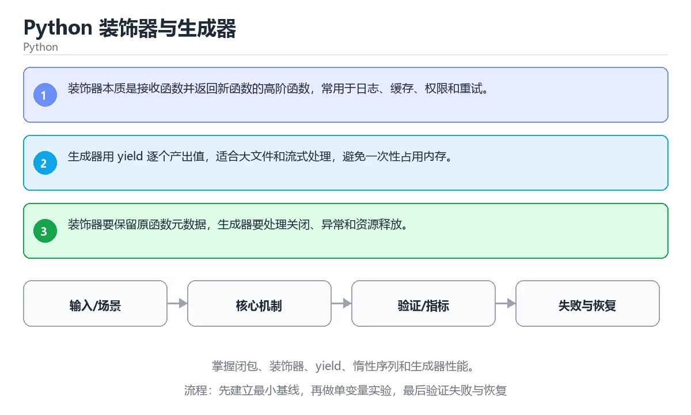

# Python 装饰器与生成器



> 内容更新时间：2026-10-03 · 学习阶段：高级 · 预计用时：24 分钟

## 学习目标

- 能用自己的话解释：装饰器本质是接收函数并返回新函数的高阶函数，常用于日志、缓存、权限和重试。
- 能用自己的话解释：生成器用 yield 逐个产出值，适合大文件和流式处理，避免一次性占用内存。
- 能用自己的话解释：装饰器要保留原函数元数据，生成器要处理关闭、异常和资源释放。
- 能把本课知识放回「Python」，并完成练习与测验。

## 前置知识

- 已完成「Python」的基础课程，能运行正文中的最小示例。
- 本课关键词：装饰器、生成器、yield、闭包。
- 遇到不熟悉的术语先记录问题，完成练习后再回读。

## 核心知识

### 1. 装饰器本质是接收函数并返回新函数的高阶函数，常用于日志、缓存、权限和重试。

- 它解决的问题：把「装饰器本质是接收函数并返回新函数的高阶函数，常用于日志、缓存、权限和重试。」放回真实场景，说明不做它会带来什么后果。
- 关键做法：先用最小示例建立基线，再逐步加入边界、失败和性能条件。
- 验证标准：结果可复现、错误可解释、边界有测试、失败能恢复。

### 2. 生成器用 yield 逐个产出值，适合大文件和流式处理，避免一次性占用内存。

- 它解决的问题：把「生成器用 yield 逐个产出值，适合大文件和流式处理，避免一次性占用内存。」放回真实场景，说明不做它会带来什么后果。
- 关键做法：先用最小示例建立基线，再逐步加入边界、失败和性能条件。
- 验证标准：结果可复现、错误可解释、边界有测试、失败能恢复。

### 3. 装饰器要保留原函数元数据，生成器要处理关闭、异常和资源释放。

- 它解决的问题：把「装饰器要保留原函数元数据，生成器要处理关闭、异常和资源释放。」放回真实场景，说明不做它会带来什么后果。
- 关键做法：先用最小示例建立基线，再逐步加入边界、失败和性能条件。
- 验证标准：结果可复现、错误可解释、边界有测试、失败能恢复。

## 关键流程

```text
输入 → 校验 → 核心处理 → 验证 → 记录指标 → 失败恢复
```

## 实践路径

1. 用一句话复述本课要解决的问题。
2. 跑通正文中的最小示例并记录基线。
3. 只改变一个输入或参数，预测并验证结果。
4. 补一个失败路径，记录错误、恢复和指标。
5. 把结论写成可复现的笔记或测试。

## 常见误区

| 误区 | 后果 | 修正 |
| --- | --- | --- |
| 只记术语不做实验 | 遇到真实问题无法判断 | 用最小输入跑通并记录结果 |
| 只测正常路径 | 边界和故障上线才暴露 | 补空值、极值和依赖失败 |
| 没有基线就优化 | 无法证明改进有效 | 先测量再修改 |
| 忽略成本与安全 | 性能和风险失控 | 同时记录资源、权限与失败代价 |

## 动手练习

1. 合上教程，用 3～5 句话解释「Python 装饰器与生成器」。
2. 从正文选一个例子，改变一个条件并预测结果。
3. 设计一个失败场景，写出止损与恢复步骤。

**验收标准**：留下输入、命令、输出、差异和下一步问题。

## 本课小结

- 本课属于「Python」，核心关键词是 装饰器、生成器、yield、闭包。
- 先保证正确与可复现，再讨论性能和扩展。
- 完成练习和测验后，把仍然不确定的问题写成下一轮验证清单。

> 本课由 P1 内容扩展生成，重点补充原有课程缺失的主题与工程边界。


## 考点精讲：把测验题还原成判断过程

本课有 4 个判断点。先自己作答，再看「判断依据」；如果结论正确但理由不完整，回到正文对应章节补足概念。

### 考点 1：关于「装饰器本质是接收函数并返回新函数的高…」，下列说法正确的是？

- **正确判断**：装饰器本质是接收函数并返回新函数的高阶函数，常用于日志、缓存、权限和重试。
- **判断依据**：学习《Python 装饰器与生成器》时应把该要点与「装饰器」一起理解。复习《Python 装饰器与生成器》的「装饰器、生成器、yield」时，再用一个边界输入验证同一个结论。正确项「装饰器本质是接收函数并返回新函数的高阶函数，常用于日志、缓存、权限和重试」是该问题的规范说法，换成其他表述都会丢失条件。错误项「pyproject.toml 统一声明构建、依赖和工具配置，锁文件保证可复现」适用于其他场景，但与本题的前提不匹配。错误项「只要小数据能跑通，大规模和异常情况也一定正确」把因果关系颠倒了，不能作为正确结论，在题干「关于「装饰器本质是接收函数并返回新函数的高…」，下列说法正确的是？」的语境下并不成立。错误项「with 保证进入和退出成对执行，适合文件、锁、连接和事务」属于相邻主题的说法，范围与本题要求不一致。把题干「关于「装饰器本质是接收函数并返回新函数的高…」，下列说法正确的是？」放回《Python 装饰器与生成器》的「掌握闭包、装饰器、yield、惰性序列和生成器性能」语境，逐项对照定义与边界条件，就能排除其余说法。
- **迁移检查**：遮住选项，只根据定义复述一次答案，再回来看哪个选项与复述一致。

### 考点 2：关于「生成器用 yield 逐个产出值 适…」，下列说法正确的是？

- **正确判断**：生成器用 yield 逐个产出值，适合大文件和流式处理，避免一次性占用内存。
- **判断依据**：学习《Python 装饰器与生成器》时应把该要点与「装饰器」一起理解。正确项「生成器用 yield 逐个产出值，适合大文件和流式处理，避免一次性占用内存」与本课示例和结论一致，可以直接用于实际编码。错误项「迭代器实现 __iter__ 和 __next__，耗尽后要持续抛出 StopIteration」在边界或失败路径上会得出错误结果。错误项「发布要管理版本、许可证、README、变更日志和制品签名」适用于其他场景，但与本题的前提不匹配。错误项「只要小数据能跑通，大规模和异常情况也一定正确」把因果关系颠倒了，不能作为正确结论，在题干「关于「生成器用 yield 逐个产出值 适…」，下列说法正确的是？」的语境下并不成立。把题干「关于「生成器用 yield 逐个产出值 适…」，下列说法正确的是？」放回《Python 装饰器与生成器》的「掌握闭包、装饰器、yield、惰性序列和生成器性能」语境，逐项对照定义与边界条件，就能排除其余说法。
- **迁移检查**：把题干里的一个条件换成边界值，原来的结论还成立吗？写出判断过程。

### 考点 3：关于「装饰器要保留原函数元数据 生成器要处…」，下列说法正确的是？

- **正确判断**：装饰器要保留原函数元数据，生成器要处理关闭、异常和资源释放。
- **判断依据**：学习《Python 装饰器与生成器》时应把该要点与「装饰器」一起理解。复习《Python 装饰器与生成器》的「装饰器、生成器、yield」时，再用一个边界输入验证同一个结论。正确项「装饰器要保留原函数元数据，生成器要处理关闭、异常和资源释放」是该问题的规范说法，换成其他表述都会丢失条件。错误项「上下文管理器要正确处理异常、嵌套和异步资源」适用于其他场景，但与本题的前提不匹配。错误项「性能优化先用 cProfile、py-spy 和基准测试定位，再考虑算法、缓存或原生扩展」把因果关系颠倒了，不能作为正确结论。错误项「只要小数据能跑通，大规模和异常情况也一定正确」忽略了题目中的限制条件，因此不成立，在题干「关于「装饰器要保留原函数元数据 生成器要处…」，下列说法正确的是？」的语境下并不成立。把题干「关于「装饰器要保留原函数元数据 生成器要处…」，下列说法正确的是？」放回《Python 装饰器与生成器》的「掌握闭包、装饰器、yield、惰性序列和生成器性能」语境，逐项对照定义与边界条件，就能排除其余说法。
- **迁移检查**：如果给某个错误选项去掉一个限定词，它会不会变成正确？说明理由。

### 考点 4：「Python 装饰器与生成器」的核心学习目标是什么？

- **正确判断**：掌握闭包、装饰器、yield、惰性序列和生成器性能。
- **判断依据**：复习《Python 装饰器与生成器》的「装饰器、生成器、yield」时，再用一个边界输入验证同一个结论。正确项「掌握闭包、装饰器、yield、惰性序列和生成器性能」与题干要求一致，是本课知识点的准确定义。错误项「用 pyproject、锁文件和构建工具发布包，并做性能剖析」忽略了题目中的限制条件，因此不成立。错误项「只要小数据能跑通，大规模和异常情况也一定正确」属于相邻主题的说法，范围与本题要求不一致，在题干「「Python 装饰器与生成器」的核心学习目标是什么？」的语境下并不成立。错误项「理解 with、enter/exit、迭代器协议和资源安全」与课程给出的定义相冲突，不能回答题目所问。把题干「「Python 装饰器与生成器」的核心学习目标是什么？」放回《Python 装饰器与生成器》的「掌握闭包、装饰器、yield、惰性序列和生成器性能」语境，逐项对照定义与边界条件，就能排除其余说法。
- **迁移检查**：把题干里的一个条件换成边界值，原来的结论还成立吗？写出判断过程。

## 本课复习清单

离开本课前，逐项确认：

- [ ] 不看解析，能说出「关于「装饰器本质是接收函数并返回新函数的高…」，下列说法正确的是？」的判断依据。
- [ ] 不看解析，能说出「关于「生成器用 yield 逐个产出值 适…」，下列说法正确的是？」的判断依据。
- [ ] 不看解析，能说出「关于「装饰器要保留原函数元数据 生成器要处…」，下列说法正确的是？」的判断依据。
- [ ] 不看解析，能说出「「Python 装饰器与生成器」的核心学习目标是什么？」的判断依据。
- [ ] 至少运行一次本课示例，记录输入、输出和一个边界情况。
- [ ] 把本课最容易混淆的两个概念写成一句话对照。

| 复盘项 | 记录 |
| --- | --- |
| 已经能独立解释的考点 |  |
| 仍然说不清的概念 |  |
| 下一步验证动作 |  |

## 逐节复习与自检

下面按正文顺序回顾每一节，并给出一个自检问题；说不清的地方回到原章节补课。

### 核心知识

」放回真实场景，说明不做它会带来什么后果。关键做法：先用最小示例建立基线，再逐步加入边界、失败和性能条件。

自检：这一节与相邻主题的边界在哪里？

### 动手练习

合上教程，用 3～5 句话解释「Python 装饰器与生成器」。从正文选一个例子，改变一个条件并预测结果。

自检：如果去掉这一节里的一个前提，结论会怎样变化？

### 最小可运行示例

```python
def trace(func):
    def wrapper(*args):
        print(f"call {func.__name__}")
        return func(*args)
    return wrapper


@trace
def square(n):
    return n * n
```

自检：把这一节讲给没学过的人，最需要强调哪一点？

### 预期输出

```text
call square
49
```

自检：这一节与相邻主题的边界在哪里？

### 验证步骤

制造一次错误输入，记录错误信息与修复方式。

自检：如果去掉这一节里的一个前提，结论会怎样变化？

## English Overview

**Title:** Python Decorators and Generators

**Summary:** Learn closures, decorators, yield, lazy sequences and generator performance.

**Category:** Python  
**Level:** 高级  
**Key terms:** 装饰器, 生成器, yield, 闭包

> The full tutorial is written in Chinese. This bilingual overview helps English readers identify the topic, scope and key terms before studying the detailed examples.

## 内容元数据

- 内容版本：v2.0
- 最后更新：2026-10-03
- 学习阶段：高级
- 适用环境：Python 3.12+
- 内容来源：内置结构化课程与工程实践整理
- 相关主题：装饰器、生成器、yield、闭包
- 质量版本：P0 测验标准 + P1 覆盖扩展 + P2 体验补全


## 最小可运行示例

下面示例用于验证「Python 装饰器与生成器」的最小输入、处理和输出。先原样运行，再只修改一个值：

```python
def trace(func):
    def wrapper(*args):
        print(f"call {func.__name__}")
        return func(*args)
    return wrapper


@trace
def square(n):
    return n * n


print(square(7))
```

## 预期输出

```text
call square
49
```

## 验证步骤

1. 记录运行环境、命令和真实输出。
2. 修改一个输入，先写预测再运行。
3. 制造一次错误输入，记录错误信息与修复方式。
4. 把结论写回本课笔记或测试用例。


## 参考资料与复核

- 最后复核：2026-10-04
- 下次复核：2027-04-04
- 复核范围：版本兼容、API 行为、安全建议与工程实践
- 来源性质：官方文档与标准；本课正文为离线教学重组，不复制原文

| 参考资料 | 本课用途 |
| --- | --- |
| [Python 官方文档](https://docs.python.org/3/) | 语言、标准库与版本行为 |
| [Python Packaging](https://packaging.python.org/) | 包管理与发布 |

> 本课主题：掌握闭包、装饰器、yield、惰性序列和生成器性能。

> App 完全离线展示文字链接，不会自动联网；需要延伸阅读时可复制链接到浏览器。

