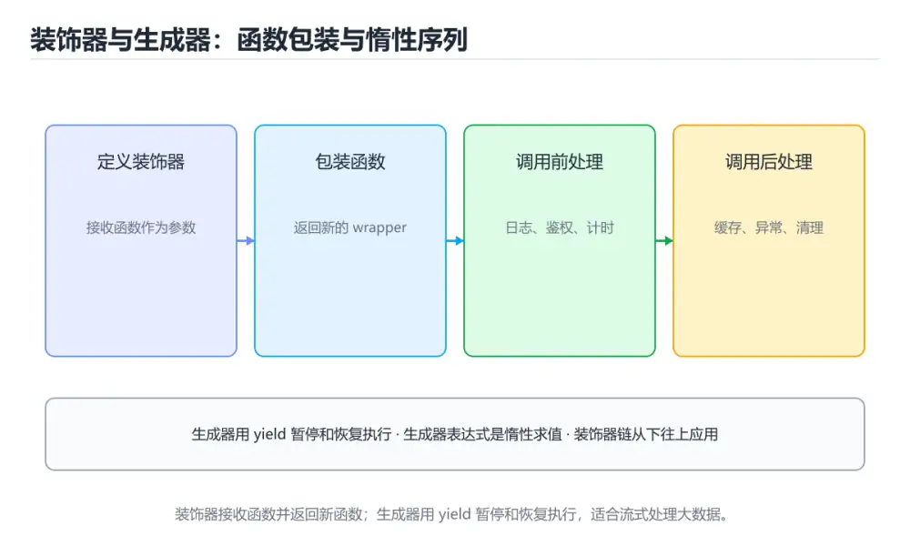

# Python 装饰器与生成器

> 内容更新时间：2026-10-06 · 学习阶段：高级 · 预计用时：35 分钟




## 本节知识框架

**课程定位**：所属分类 `python`（Python），课程主题 `Python 装饰器与生成器`，学习阶段 高级，建议用时 50 分钟。

本课主线：掌握闭包、装饰器、yield、惰性序列和生成器性能。

**学完本课应当能够**
- 说清 `装饰器` 与 `生成器` 的含义与区别，并各举一个正例和一个反例。
- 用本课示例验证 `yield` 的行为，记录输入、输出与失败条件。
- 遇到「装饰器不保留原函数信息」这类问题时，能说出触发条件与修复顺序。

### 从概念到验证的学习链条

1. `装饰器`：先掌握 在不修改原函数主体的情况下包装或增强其行为的语法结构，再用它解释 `生成器` 为什么会出现。
2. `生成器`：先掌握 按需逐个产出值并暂停执行的函数或对象，节省内存并支持流式处理，再用它解释 `yield` 为什么会出现。
3. `yield`：先掌握 生成器关键字：函数执行到 yield 暂停并返回值，下次继续，适合流式处理大数据，再用它解释 `闭包` 为什么会出现。
4. `闭包`：先掌握 函数与其定义时词法环境的组合，使函数离开原作用域后仍能访问捕获的变量，再用它解释 本课示例的观察结果 为什么会出现。

**先修与衔接**：本课是「Python」分类的第 28 课。先修内容：《实战：CSV 到 SQLite 的 ETL 流水线》。《实战：CSV 到 SQLite 的 ETL 流水线》里的 `ETL`、`数据质量` 是本课的前提。相关或后续课程：《Python 上下文管理器与迭代器协议》。

### 完成判据

- **定义关**：不看正文也能说明 `装饰器` 是 在不修改原函数主体的情况下包装或增强其行为的语法结构，并指出一个反例。
- **机制关**：能按“输入 → 转换 → 输出 → 验证”复述 `Python 装饰器与生成器`，而不是只背结论。
- **示例关**：能运行或推演 `Python 装饰器与生成器` 的 `text` 示例，并说明一个真实出现的标识符或字面量。
- **证据关**：能指出 `Python 装饰器与生成器` 示例里的 调用了 `trace()`，并说明它支持或反驳了本课的哪一条结论。
- **排错关**：能复现 装饰器不保留原函数信息，记录现象并按 用包装工具的保留元信息 修复。
- **迁移关**：能把 `装饰器`、`生成器`、`yield`、`闭包` 放进一个与 `Python 装饰器与生成器` 不同的项目场景，并保持输入与验证条件可追踪。
- **复盘关**：学完 `Python 装饰器与生成器` 后，用一句话写下仍然不确定的结论，并列出下一次验证需要的输入、环境和成功判据。

### 复习清单

- [ ] 能不看正文复述本课核心术语，并指出一个边界或反例。
- [ ] 能运行或推演本课示例，记录输入、输出与失败现象。
- [ ] 能完成一次自测，并把错题对照错误表定位原因。

## 核心概念定义

| 术语 | 操作性定义 | 常见边界与风险 |
| --- | --- | --- |
| 装饰器 | 在不修改原函数主体的情况下包装或增强其行为的语法结构。 | 易错：文档与签名丢失，调试困难；正确做法是用包装工具的保留元信息。 |
| 生成器 | 按需逐个产出值并暂停执行的函数或对象，节省内存并支持流式处理。 | 易错：第二次遍历为空；正确做法是明确一次性语义，需要复用就重新创建或转成列表。 |
| yield | 生成器关键字：函数执行到 yield 暂停并返回值，下次继续，适合流式处理大数据。 | 只在「生成器关键字：函数执行到 yield 暂停并返回值，下次继续，适合流式处理大数据」这一前提下成立，换输入或换环境要重新验证。 |
| 闭包 | 函数与其定义时词法环境的组合，使函数离开原作用域后仍能访问捕获的变量。 | 只在「函数与其定义时词法环境的组合，使函数离开原作用域后仍能访问捕获的变量」这一前提下成立，换输入或换环境要重新验证。 |

## 原理与运行机制

### 机制总览

**教材衔接：核心知识**

### 1. 装饰器本质是接收函数并返回新函数的高阶函数，常用于日志、缓存、权限和重试。

- 关键做法：基线只保留 生成器 必需的部分，其余条件一次加一个。
- 验证标准：装饰器 的结果可复现、错误可解释、失败能恢复。

### 2. 生成器用 yield 逐个产出值，适合大文件和流式处理，避免一次性占用内存。

把这条结论放回「Python 装饰器与生成器」的完整流程里展开：

- 正文依据：能用自己的话解释：装饰器本质是接收函数并返回新函数的高阶函数，常用于日志、缓存、权限和重试。
- 落地检查：把「2. 生成器用 yield 逐个产出值，适合大文件和流式处理，避免一次性占用内存。」改写成一条可执行的核对项，逐条验证输入、超时与失败路径。

### 3. 装饰器要保留原函数元数据，生成器要处理关闭、异常和资源释放。

把这条结论放回「Python 装饰器与生成器」的完整流程里展开：

- 正文依据：能用自己的话解释：生成器用 yield 逐个产出值，适合大文件和流式处理，避免一次性占用内存。
- 落地检查：把「3. 装饰器要保留原函数元数据，生成器要处理关闭、异常和资源释放。」改写成一条可执行的核对项，逐条验证输入、超时与失败路径。

**教材衔接：关键流程**

**教材衔接：实践路径**

**教材衔接：版本与时效**

### 升级检查清单

- 先固定当前版本，跑通全部示例与测验，再升级工具链。
- 只改 装饰器 的版本变量，记录编译、测试与产物体积的变化。
- 回归范围锁定 __name__ 的默认行为，并确认弃用警告是否出现在构建输出里。
- 升级完成后记录 装饰器 的新旧版本差异，并据此调整下次复核时间。

**教材衔接：验证步骤**

### 机制拆解：每一步的输入、动作与输出

#### 1. `装饰器`
- 输入：`装饰器`；本步把 在不修改原函数主体的情况下包装或增强其行为的语法结构 当作判断规则。
- 动作：围绕 `装饰器` 保留中间状态，并记录它与 `生成器` 的对应关系。
- 输出：`生成器`，它可以被下一段代码、测试或记录继续使用。
- `装饰器` 的失败条件：当装饰器不保留原函数信息时，会出现文档与签名丢失，调试困难。

#### 2. `生成器`
- 输入：`装饰器`；本步把 按需逐个产出值并暂停执行的函数或对象，节省内存并支持流式处理 当作判断规则。
- 动作：围绕 `生成器` 保留中间状态，并记录它与 `yield` 的对应关系。
- 输出：`yield`，它可以被下一段代码、测试或记录继续使用。
- `生成器` 的失败条件：当生成器被多次消费时，会出现第二次遍历为空。

#### 3. `yield`
- 输入：`生成器`；本步把 生成器关键字：函数执行到 yield 暂停并返回值，下次继续，适合流式处理大数据 当作判断规则。
- 动作：围绕 `yield` 保留中间状态，并记录它与 `闭包` 的对应关系。
- 输出：`闭包`，它可以被下一段代码、测试或记录继续使用。
- `yield` 的失败条件：只在「生成器关键字：函数执行到 yield 暂停并返回值，下次继续，适合流式处理大数据」这一前提下成立，换输入或换环境要重新验证。

#### 4. `闭包`
- 输入：`yield`；本步把 函数与其定义时词法环境的组合，使函数离开原作用域后仍能访问捕获的变量 当作判断规则。
- 动作：围绕 `闭包` 保留中间状态，并记录它与 `trace` 的对应关系。
- 输出：`trace`，它可以被下一段代码、测试或记录继续使用。
- `闭包` 的失败条件：只在「函数与其定义时词法环境的组合，使函数离开原作用域后仍能访问捕获的变量」这一前提下成立，换输入或换环境要重新验证。

### 示例中的可观察事实

1. 调用了 `trace()`；它对应的课程主题是 `Python 装饰器与生成器`。
2. 调用了 `wrapper()`；它对应的课程主题是 `Python 装饰器与生成器`。
3. 调用了 `print()`；它对应的课程主题是 `Python 装饰器与生成器`。
4. 调用了 `square()`；它对应的课程主题是 `Python 装饰器与生成器`。
5. 出现字面量 `call {func.__name__}`；它对应的课程主题是 `Python 装饰器与生成器`。

### 复现实验记录

- 环境：`Python 装饰器与生成器` 使用 `text` 示例，固定 `装饰器`、`生成器`、`yield`、`闭包` 作为第一组条件。
- 首轮输入：先确认 调用了 `trace()`，预测 `装饰器` 会怎样变化。
- 基线观察：记录命令、输入、输出和错误原文，不用截图代替可复制的文本。
- 单变量修改：只改变 `装饰器`，观察 `闭包` 是否仍满足定义。
- 失败注入：复现 装饰器不保留原函数信息，确认现象是 文档与签名丢失，调试困难。
- 记录结论：把“修改前、修改后、预期变化、实际变化”写成四列表，这样复盘 `Python 装饰器与生成器` 时才能区分概念错误与实现错误。

## 典型应用场景

**教材衔接：深度拓展与实战**

这一节把 核心知识 中容易混淆的两点写成对照与反例。

### 机制拆解

- **1. 装饰器本质是接收函数并返回新函数的高阶函数，常用于日志、缓存、权限和重试。**：在「Python 装饰器与生成器」里，「1. 装饰器本质是接收函数并返回新函数的高阶函数，常用于日志、缓存、权限和重试。」这一步要先写清输入与预期，再记录实际结果和差异；结果不符时回到对应小节核对前提。
- **2. 生成器用 yield 逐个产出值，适合大文件和流式处理，避免一次性占用内存。**：在「Python 装饰器与生成器」里，「2. 生成器用 yield 逐个产出值，适合大文件和流式处理，避免一次性占用内存。」这一步要先写清输入与预期，再记录实际结果和差异；结果不符时回到对应小节核对前提。
- **3. 装饰器要保留原函数元数据，生成器要处理关闭、异常和资源释放。**：在「Python 装饰器与生成器」里，「3. 装饰器要保留原函数元数据，生成器要处理关闭、异常和资源释放。」这一步要先写清输入与预期，再记录实际结果和差异；结果不符时回到对应小节核对前提。
- **考点 1：关于「装饰器本质是接收函数并返回新函数的高阶函数，常用于日志、缓存、权限和重试。」，下列说法正确的是？**：先独立作答，再回到本课对应小节核对判断依据；答错时记录是哪一个前提被忽略。
- **考点 2：关于「生成器用 yield 逐个产出值，适合大文件和流式处理，避免一次性占用内存。」，下列说法正确的是？**：先独立作答，再回到本课对应小节核对判断依据；答错时记录是哪一个前提被忽略。


### 工程检查表

- [ ] 能否用自己的话说明Python 装饰器与生成器解决什么问题，以及它不负责什么？
- [ ] 能否指出 __name__ 最小示例的输入、输出和一条失败路径？
- [ ] 能否解释本课关键词在真实项目中的边界与取舍？
- [ ] 换一个输入后，__name__ 的判断依据是否仍然成立？

### 迁移练习

1. 保持正文示例不变，写出它的输入、处理步骤和预期输出。
2. 只改变 装饰器 的一个条件，预测结果并说明依据；再运行或手算验证。
3. 结合装饰器、生成器、yield、闭包，写出一个真实项目中的使用场景。
4. 写下一个反例，说明它在什么条件下会使朴素做法失效。

- **装饰器不保留原函数信息**：典型现象是文档与签名丢失，调试困难；正确做法是用包装工具的保留元信息。
- **生成器被多次消费**：典型现象是第二次遍历为空；正确做法是明确一次性语义，需要复用就重新创建或转成列表。
- **生成器里修改外部状态**：典型现象是惰性执行让状态变化难以预测；正确做法是保持生成器纯净，把副作用放到外部处理。

### 最小验证场景

- 准备：保留 `text` 示例的原始输入，先记录 `Python 装饰器与生成器` 的基线输出和完整运行命令。
- 观察：先核对 调用了 `trace()`，再改变一个与 `装饰器` 相关的条件。
- 判定：新结果与 `Python 装饰器与生成器` 的基线不同不等于错误；只有当差异破坏了 `装饰器` 的定义或错误表中的约束，才判定为失败。

### 选择与边界

- 使用 `装饰器` 时，先满足它的定义：在不修改原函数主体的情况下包装或增强其行为的语法结构；易错：文档与签名丢失，调试困难；正确做法是用包装工具的保留元信息。
- 使用 `生成器` 时，先满足它的定义：按需逐个产出值并暂停执行的函数或对象，节省内存并支持流式处理；易错：第二次遍历为空；正确做法是明确一次性语义，需要复用就重新创建或转成列表。
- 使用 `yield` 时，先满足它的定义：生成器关键字：函数执行到 yield 暂停并返回值，下次继续，适合流式处理大数据；只在「生成器关键字：函数执行到 yield 暂停并返回值，下次继续，适合流式处理大数据」这一前提下成立，换输入或换环境要重新验证。
- 使用 `闭包` 时，先满足它的定义：函数与其定义时词法环境的组合，使函数离开原作用域后仍能访问捕获的变量；只在「函数与其定义时词法环境的组合，使函数离开原作用域后仍能访问捕获的变量」这一前提下成立，换输入或换环境要重新验证。

## 代码/协议/SQL 示例

### 最小可验证示例

**教材衔接：最小可运行示例**

先用 __name__ 跑通最小示例，然后只改一个与 装饰器 相关的取值：

```python
def trace(func):
    def wrapper(*args):
        print(f"call {func.__name__}")
        return func(*args)
    return wrapper

@trace
def square(n):
    return n * n

print(square(7))
```

**教材衔接：预期输出**

```text
call square
49
```

### 示例精读：先找证据，再改一个条件

1. 调用了 `trace()`；它出现在 `Python 装饰器与生成器` 的示例中，阅读时先确认它前后各发生了什么。
2. 调用了 `wrapper()`；它出现在 `Python 装饰器与生成器` 的示例中，阅读时先确认它前后各发生了什么。
3. 调用了 `print()`；它出现在 `Python 装饰器与生成器` 的示例中，阅读时先确认它前后各发生了什么。
4. 调用了 `square()`；它出现在 `Python 装饰器与生成器` 的示例中，阅读时先确认它前后各发生了什么。
5. 出现字面量 `call {func.__name__}`；它出现在 `Python 装饰器与生成器` 的示例中，阅读时先确认它前后各发生了什么。
- 在 `Python 装饰器与生成器` 中与 `装饰器` 对照：示例必须能支持 在不修改原函数主体的情况下包装或增强其行为的语法结构，否则说明这一段还缺少实现或验证步骤。
- 在 `Python 装饰器与生成器` 中与 `生成器` 对照：示例必须能支持 按需逐个产出值并暂停执行的函数或对象，节省内存并支持流式处理，否则说明这一段还缺少实现或验证步骤。
- 在 `Python 装饰器与生成器` 中与 `yield` 对照：示例必须能支持 生成器关键字：函数执行到 yield 暂停并返回值，下次继续，适合流式处理大数据，否则说明这一段还缺少实现或验证步骤。
- 在 `Python 装饰器与生成器` 中与 `闭包` 对照：示例必须能支持 函数与其定义时词法环境的组合，使函数离开原作用域后仍能访问捕获的变量，否则说明这一段还缺少实现或验证步骤。

## 时间/空间复杂度或性能分析

**性能关注点（Python 装饰器与生成器）**：解释执行与对象分配是主要成本：记录执行时间、内存峰值与 GC 次数，必要时对比其他实现。

**本课特有开销（Python 装饰器与生成器 · 装饰器）**：缓存命中率比缓存实现本身更关键，先记录命中率与失效策略再谈优化。

**测量方法**：以 `Python 装饰器与生成器` 的 `装饰器` 场景为对象，固定输入跑一遍记录基线，再把规模或并发度提高一个数量级复测；两次结果的差值与波动范围才是结论依据。

### 需要控制的变量与记录项

- `Python 装饰器与生成器` 的 `装饰器`：固定它的版本、输入范围和资源上限，分别记录速度、内存与失败率的变化。
- `Python 装饰器与生成器` 的 `生成器`：固定它的版本、输入范围和资源上限，分别记录速度、内存与失败率的变化。
- `Python 装饰器与生成器` 的 `yield`：固定它的版本、输入范围和资源上限，分别记录速度、内存与失败率的变化。
- `Python 装饰器与生成器` 的 `闭包`：固定它的版本、输入范围和资源上限，分别记录速度、内存与失败率的变化。
- `Python 装饰器与生成器` 中 `装饰器` 的边界：易错：文档与签名丢失，调试困难；正确做法是用包装工具的保留元信息。达到边界时不要外推，必须重新测量。
- `Python 装饰器与生成器` 中 `生成器` 的边界：易错：第二次遍历为空；正确做法是明确一次性语义，需要复用就重新创建或转成列表。达到边界时不要外推，必须重新测量。
- `Python 装饰器与生成器` 中 `yield` 的边界：只在「生成器关键字：函数执行到 yield 暂停并返回值，下次继续，适合流式处理大数据」这一前提下成立，换输入或换环境要重新验证。达到边界时不要外推，必须重新测量。
- `Python 装饰器与生成器` 中 `闭包` 的边界：只在「函数与其定义时词法环境的组合，使函数离开原作用域后仍能访问捕获的变量」这一前提下成立，换输入或换环境要重新验证。达到边界时不要外推，必须重新测量。
- `Python 装饰器与生成器` 的代码证据：先验证 调用了 `trace()`，再记录该路径的输入规模与耗时；只看代码行数不能推出复杂度。

## 常见误区与易错点

| 容易写错的做法 | 实际现象 | 原因与正确做法 |
| --- | --- | --- |
| 装饰器不保留原函数信息 | 文档与签名丢失，调试困难。 | 用包装工具的保留元信息。 |
| 生成器被多次消费 | 第二次遍历为空。 | 明确一次性语义，需要复用就重新创建或转成列表。 |
| 生成器里修改外部状态 | 惰性执行让状态变化难以预测。 | 保持生成器纯净，把副作用放到外部处理。 |

### 现场 1：装饰器不保留原函数信息

**症状**：文档与签名丢失，调试困难。

**根因与修复**：用包装工具的保留元信息。

**自检**：在本课示例里复现「装饰器不保留原函数信息」，改成用包装工具的保留元信息后重跑；如果症状消失且失败路径按预期变化，说明定位正确。

### 现场 2：生成器被多次消费

**症状**：第二次遍历为空。

**根因与修复**：明确一次性语义，需要复用就重新创建或转成列表。

**自检**：在本课示例里复现「生成器被多次消费」，改成明确一次性语义，需要复用就重新创建或转成列表后重跑；如果症状消失且失败路径按预期变化，说明定位正确。

### 现场 3：生成器里修改外部状态

**症状**：惰性执行让状态变化难以预测。

**根因与修复**：保持生成器纯净，把副作用放到外部处理。

**自检**：在本课示例里复现「生成器里修改外部状态」，改成保持生成器纯净，把副作用放到外部处理后重跑；如果症状消失且失败路径按预期变化，说明定位正确。

## 与其他知识点的关系

**教材衔接：复习与迁移**

### 概念复述

- 用一句话说明「Python 装饰器与生成器」解决什么问题：掌握闭包、装饰器、yield、惰性序列和生成器性能。
- 写出装饰器、生成器、yield之间的关系，并各举一个例子。
- 说出本课最容易混淆的两个概念，以及区分它们的判据。


### 迁移练习

- **先修**：`实战：CSV 到 SQLite 的 ETL 流水线`。本课默认这些内容已经掌握。
- **相关或后续**：`Python 上下文管理器与迭代器协议`。本课术语会在这些课程里继续使用。
- **术语归属**：`装饰器`、`生成器`、`yield` 的定义以本课「核心概念定义」为准，换到其他课程时先确认定义是否被改写。

### 先修与后续术语接口

- `实战：CSV 到 SQLite 的 ETL 流水线`：两者通过本分类的学习顺序衔接，阅读时重点比较各自的输入与失败条件。
- `Python 上下文管理器与迭代器协议`：两者通过本分类的学习顺序衔接，阅读时重点比较各自的输入与失败条件。

### 容易混淆的相邻概念

- `装饰器` 与 `生成器`：前者强调 在不修改原函数主体的情况下包装或增强其行为的语法结构；后者强调 按需逐个产出值并暂停执行的函数或对象，节省内存并支持流式处理。判断时分别检查两条定义的适用范围，不要只看名称相似就互换。
- `生成器` 与 `yield`：前者强调 按需逐个产出值并暂停执行的函数或对象，节省内存并支持流式处理；后者强调 生成器关键字：函数执行到 yield 暂停并返回值，下次继续，适合流式处理大数据。判断时分别检查两条定义的适用范围，不要只看名称相似就互换。
- `yield` 与 `闭包`：前者强调 生成器关键字：函数执行到 yield 暂停并返回值，下次继续，适合流式处理大数据；后者强调 函数与其定义时词法环境的组合，使函数离开原作用域后仍能访问捕获的变量。判断时分别检查两条定义的适用范围，不要只看名称相似就互换。

## 自测题与参考答案

> 先独立作答，再对照参考答案；答案都能在本课正文、术语表或错误表里找到依据。

### 自测 1（概念复述）

不看正文，写出 `装饰器` 的操作性定义，并说明它与 `生成器` 的区别。

**参考答案**：在不修改原函数主体的情况下包装或增强其行为的语法结构。

`生成器` 的定位是：按需逐个产出值并暂停执行的函数或对象，节省内存并支持流式处理；两者的差别要从适用对象与失败模式上说明。

### 自测 2（排错）

本课错误表记录了「装饰器不保留原函数信息」这类做法。请写出它会出现的现象、根因，以及修复顺序。

**参考答案**：现象是文档与签名丢失，调试困难；正确做法是用包装工具的保留元信息。修复时先复现现象并保留证据，再改动一处假设重跑，确认现象消失。

### 自测 3（动手验证）

运行本课的 `text` 示例，改动其中一个输入后重新运行，记录输出与错误信息。

**参考答案**：正常输入下 `text` 示例应当复现正文给出的结果；改动输入后，如果结果改变或报错，先核对它是否满足 `Python 装饰器与生成器` 中`装饰器` 的适用范围，再检查错误表里是否有同类现象。

### 自测 4（代码阅读）

阅读本课开头的 `text` 示例，说明它体现了`装饰器` 的哪一条性质，并指出改动哪个输入会让这条性质不再成立。

**参考答案**：`装饰器` 的定义是 在不修改原函数主体的情况下包装或增强其行为的语法结构，示例正是在实现这条定义。改动与 `装饰器` 有关的一个输入后，如果结果不再符合 `Python 装饰器与生成器` 的正文描述，就说明该性质只在当前前提成立。

### 自测 5（迁移）

把 `Python 装饰器与生成器` 的方法迁移到自己的项目：围绕 `装饰器` 写出一个与错误表同类的风险点，并说明触发条件和检验方式。

**参考答案**：例如「生成器里修改外部状态」，它会导致惰性执行让状态变化难以预测；检验方式是按保持生成器纯净，把副作用放到外部处理改一处再复现，确认现象消失且没有引入新的失败分支。

### 自测 6（对比）

用一个表格对比 `装饰器` 与 `生成器`：各写一行适用场景、一行失败表现。

**参考答案**：`装饰器` 的定义是在不修改原函数主体的情况下包装或增强其行为的语法结构；`生成器` 的定义是按需逐个产出值并暂停执行的函数或对象，节省内存并支持流式处理。两者的失败表现分别对应本课错误表里与本术语相关的行。

### 自测 7（排错顺序）

面对「装饰器不保留原函数信息」引发的问题，请把“复现 文档与签名丢失，调试困难 → 保留证据 → 用包装工具的保留元信息 → 回归验证”四步写成可执行的检查清单。

**参考答案**：第一步按文档与签名丢失，调试困难复现；第二步记录输入、版本与完整报错；第三步按用包装工具的保留元信息只改一处；第四步重跑并确认失败路径也按预期变化。

### 自测 8（边界判断）

针对 `闭包`，分别写出“可以使用”的条件和“结论不再成立”的条件。

**参考答案**：只在「函数与其定义时词法环境的组合，使函数离开原作用域后仍能访问捕获的变量」这一前提下成立，换输入或换环境要重新验证。 同时要把 `闭包` 的定义 函数与其定义时词法环境的组合，使函数离开原作用域后仍能访问捕获的变量 与实际输入逐项对照。

### 自测 9（机制重建）

不看正文，按输入、转换、输出、验证四段重建 `装饰器` → `生成器` → `yield` → `闭包` 的作用链。

**参考答案**：起点是 `装饰器` 的定义 在不修改原函数主体的情况下包装或增强其行为的语法结构；中间每一步都保留可观察状态；终点由 `闭包` 检查，失败时回到错误表定位第一个偏离定义的步骤。

### 自测 10（综合排错）

在 `Python 装饰器与生成器` 中，现象是 惰性执行让状态变化难以预测。请围绕 生成器里修改外部状态 写出最小复现、关键证据、修复动作和回归验证，并说明为什么不能只凭一次运行下结论。

**参考答案**：先复现 生成器里修改外部状态，记录输入与完整错误；再按 保持生成器纯净，把副作用放到外部处理 只改一处。回归时同时跑正常路径和边界路径，只有两次结果都可解释，才把修复视为完成。

### 自测 11（一分钟复述）

用每分钟约 200 字的速度复述 `Python 装饰器与生成器`：先给主问题，再按顺序说出 `装饰器`、`生成器`、`yield`、`闭包`，最后给一个失败案例。

**自评标准**：主问题必须对应 掌握闭包、装饰器、yield、惰性序列和生成器性能；每个术语都要能接上一句定义或边界；失败案例必须写成可观察现象，不能用“可能有风险”代替证据。

## 术语速查

| 术语 | 一句话说明 |
| --- | --- |
| `装饰器` | 在不修改原函数主体的情况下包装或增强其行为的语法结构。 |
| `生成器` | 按需逐个产出值并暂停执行的函数或对象，节省内存并支持流式处理。 |
| `yield` | 生成器关键字：函数执行到 yield 暂停并返回值，下次继续，适合流式处理大数据。 |
| `闭包` | 函数与其定义时词法环境的组合，使函数离开原作用域后仍能访问捕获的变量。 |

**术语关系**：`装饰器`（在不修改原函数主体的情况下包装或增强其行为的语法结构） → `生成器`（按需逐个产出值并暂停执行的函数或对象） → `yield`（生成器关键字：函数执行到 yield 暂停并返回值） → `闭包`（函数与其定义时词法环境的组合）。

## 考点精讲

`Python 装饰器与生成器` 的题库有 6 道题，下面逐题给出题干、正确项与判断依据：先自己作答，再核对正确项，最后回到正文对应小节复核。

### 考点 1：第 1 题

- **题目**：在 `Python 装饰器与生成器` 里，与 `装饰器` 有关的说法中，哪一项最符合掌握闭包、装饰器、yield、惰性序列和生成器性能。？
- **正确项**：装饰器本质是接收函数并返回新函数的高阶函数，常用于日志、缓存、权限和重试。
- **判断依据**：这道题落在术语 `装饰器` 上：在不修改原函数主体的情况下包装或增强其行为的语法结构。复习时把 `装饰器` 的定义、适用边界和一个反例一起说清楚，再回到「核心概念定义」核对原文。

### 考点 2：第 2 题

- **题目**：在 `Python 装饰器与生成器` 里，与 `装饰器` 有关的说法中，哪一项最符合掌握闭包、装饰器、yield、惰性序列和生成器性能。？（Python 装饰器与生成器·Python 第 2 题）
- **正确项**：生成器用 yield 逐个产出值，适合大文件和流式处理，避免一次性占用内存。
- **判断依据**：这道题落在术语 `装饰器` 上：在不修改原函数主体的情况下包装或增强其行为的语法结构。复习时把 `装饰器` 的定义、适用边界和一个反例一起说清楚，再回到「核心概念定义」核对原文。

### 考点 3：第 3 题

- **题目**：代码语言为 `python`，选自 `Python 装饰器与生成器` 的 `装饰器` 部分。课程问题为掌握闭包、装饰器、yield、惰性序列和生成器性能。哪一项描述与代码一致？
- **正确项**：调用了 `trace()`
- **判断依据**：这道题落在术语 `装饰器` 上：在不修改原函数主体的情况下包装或增强其行为的语法结构。复习时把 `装饰器` 的定义、适用边界和一个反例一起说清楚，再回到「核心概念定义」核对原文。

### 考点 4：第 4 题

- **题目**：`Python 装饰器与生成器` 的主线是：掌握闭包、装饰器、yield、惰性序列和生成器性能。下面哪一项与这条主线一致？
- **正确项**：掌握闭包、装饰器、yield、惰性序列和生成器性能。
- **判断依据**：这道题落在术语 `装饰器` 上：在不修改原函数主体的情况下包装或增强其行为的语法结构。复习时把 `装饰器` 的定义、适用边界和一个反例一起说清楚，再回到「核心概念定义」核对原文。

### 考点 5：第 5 题

- **题目**：课程 `掌握闭包、装饰器、yield、惰性序列和生成器性能。`。在 `Python 装饰器与生成器` 里，`装饰器`、`生成器` 与下面哪些选项属于同一层概念？（多选）
- **正确项**：装饰器；生成器
- **判断依据**：这道题落在术语 `装饰器` 上：在不修改原函数主体的情况下包装或增强其行为的语法结构。复习时把 `装饰器` 的定义、适用边界和一个反例一起说清楚，再回到「核心概念定义」核对原文。

### 考点 6：第 6 题

- **题目**：下面几项都与 `装饰器` 有关，请按 `Python 装饰器与生成器` 的正文顺序排列；该课主线是掌握闭包、装饰器、yield、惰性序列和生成器性能。
- **正确项**：核心知识 → 关键流程 → 实践路径 → 常见误区
- **判断依据**：这道题落在术语 `装饰器` 上：在不修改原函数主体的情况下包装或增强其行为的语法结构。复习时把 `装饰器` 的定义、适用边界和一个反例一起说清楚，再回到「核心概念定义」核对原文。

### 考点 7：`装饰器`

- **要点**：在不修改原函数主体的情况下包装或增强其行为的语法结构。
- **装饰器 的边界**：易错：文档与签名丢失，调试困难；正确做法是用包装工具的保留元信息。

### 考点 8：`生成器`

- **要点**：按需逐个产出值并暂停执行的函数或对象，节省内存并支持流式处理。
- **生成器 的边界**：易错：第二次遍历为空；正确做法是明确一次性语义，需要复用就重新创建或转成列表。

### 考点 9：`yield`

- **要点**：生成器关键字：函数执行到 yield 暂停并返回值，下次继续，适合流式处理大数据。
- **yield 的边界**：只在「生成器关键字：函数执行到 yield 暂停并返回值，下次继续，适合流式处理大数据」这一前提下成立，换输入或换环境要重新验证。

### 考点 10：`闭包`

- **要点**：函数与其定义时词法环境的组合，使函数离开原作用域后仍能访问捕获的变量。
- **闭包 的边界**：只在「函数与其定义时词法环境的组合，使函数离开原作用域后仍能访问捕获的变量」这一前提下成立，换输入或换环境要重新验证。

### 考点 11：排错——装饰器不保留原函数信息

- **现象**：文档与签名丢失，调试困难。
- **处理**：用包装工具的保留元信息。

### 考点 12：排错——生成器被多次消费

- **现象**：第二次遍历为空。
- **处理**：明确一次性语义，需要复用就重新创建或转成列表。

### 考点 13：综合辨析——`装饰器` 与 `闭包`

- **辨析点**：`装饰器` 的定义是 在不修改原函数主体的情况下包装或增强其行为的语法结构；`闭包` 的定义是 函数与其定义时词法环境的组合，使函数离开原作用域后仍能访问捕获的变量。
- **答题要求**：面对 `Python 装饰器与生成器` 的题目，先判断描述的是 `装饰器` 还是 `闭包`，再归到对应定义，最后写出一个会让该定义失效的边界输入。

### 考点 14：排错评分点

- **现象分**：能写出 文档与签名丢失，调试困难，而不是只写“程序有错”。
- **证据分**：保留触发 装饰器不保留原函数信息 的输入、版本和错误原文。
- **修复分**：按 用包装工具的保留元信息 只改一处，并同时回归正常路径与边界路径。

## 内容元数据

- 内容版本：v2.0
- 最后更新：2026-10-06
- 学习阶段：高级
- 适用环境：Python 3.12+；本课聚焦 装饰器。
- 内容来源：内置结构化课程与工程实践整理
- 相关主题：装饰器、生成器、yield、闭包
- 质量版本：P0 测验标准 + P1 覆盖扩展 + P2 体验补全

## 参考资料与复核

- 最后复核：2026-10-04
- 下次复核：2026-11-10
- 复核范围：版本兼容、API 行为、安全建议与工程实践
- 来源性质：官方文档、标准或权威教材；本课核对关键词：装饰器、生成器、yield、闭包。

| 参考资料 | 本课用途 |
| --- | --- |
| [Python 性能分析](https://docs.python.org/3/library/profile.html) | cProfile 与性能分析 |
| [Python 打包指南](https://packaging.python.org/) | 依赖、构建与发布 |
| [Python 教程](https://docs.python.org/3/tutorial/) | 语法、数据类型与控制流 |

| [本课术语索引：Python 装饰器与生成器](#核心概念定义) | 按本课输入、术语边界和错误表现逐项核对 |
> 「Python 装饰器与生成器」的链接用于离线阅读后的延伸核对；App 不会自动联网。